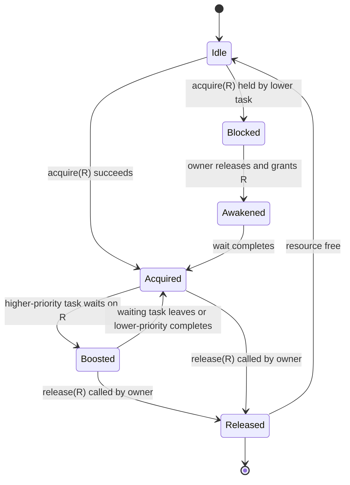
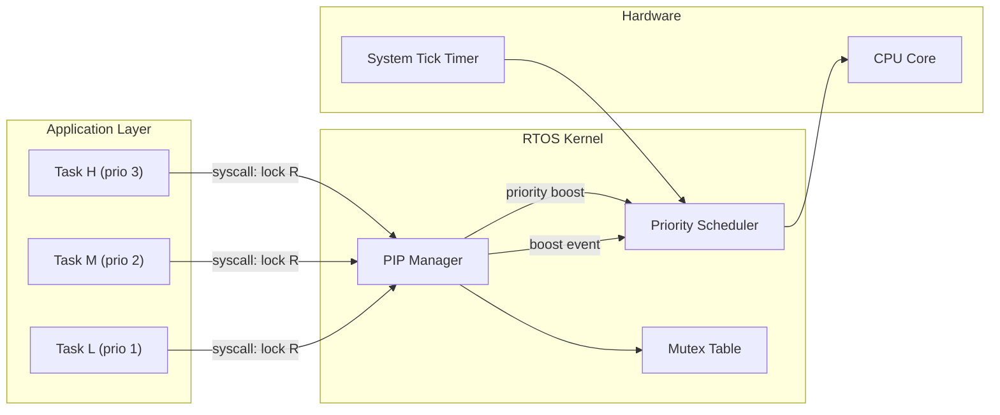
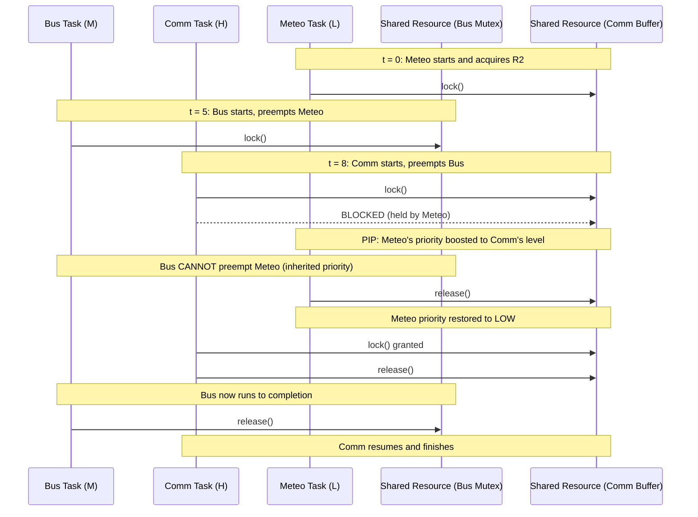
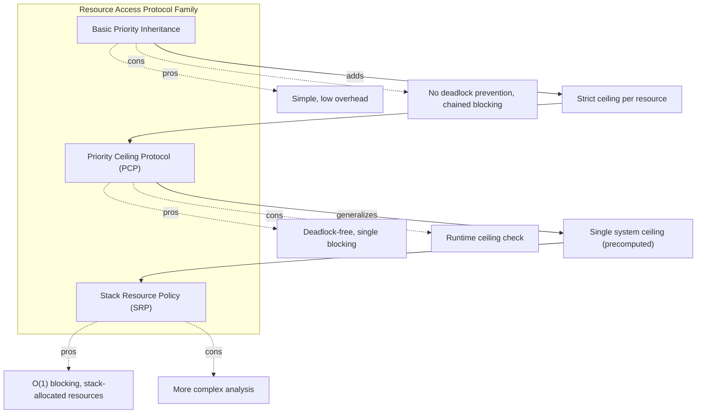

# Priority Inheritance Protocol

<!-- SECTION_1_START -->
# Priority Inheritance Protocol (PIP) — Core Definition & Intuition

## 1. Formal Academic Definition (KTU 2024 Scheme)

The **Priority Inheritance Protocol (PIP)** is a synchronization mechanism used in real-time and embedded systems to mitigate the unbounded and chained forms of **priority inversion**. It is formally defined under the *Stack Resource Policy* family of protocols (originally proposed by Sha, Rajkumar, and Lehoczky, 1990) and is referenced in IEEE 2050-2018 and the POSIX 1003.1d real-time extensions.

> [!IMPORTANT]
> **Priority Inversion** is the scheduling anomaly in which a higher-priority task is *indirectly* preempted by a lower-priority task, effectively inverting the relative priorities of the two tasks. The **Priority Inheritance Protocol** solves this by **transitively elevating** the dynamic priority of any task that holds a shared resource to the **maximum priority of any task currently waiting** for that resource.

## 2. Conceptual Analogy — Plain English Intuition

Imagine a busy single-lane bridge where a heavy truck (low-priority task) is crossing. A small sports car (high-priority task) arrives behind it and is forced to wait, even though it could go faster. Worse, more cars (medium-priority tasks) keep arriving and squeezing in front of the sports car — the truck is blocking *everyone* because it's blocking the bridge.

**Naive Solution:** Yell at the truck driver to move — but the truck *can't*, the bridge is still occupied by the truck's own cargo. 

**PIP Solution:** Give the truck driver a temporary "VIP police escort" badge (inherited priority). Now the truck *cannot* be overtaken by medium-priority cars. It finishes unloading its cargo (releases the lock) as fast as possible, then returns the badge. The sports car is now unblocked.

The three things PIP guarantees:
1. **No unbounded priority inversion** — bounded blocking time.
2. **No deadlock** under single-unit resource usage.
3. **No chained blocking** when used with the Priority Ceiling Protocol (PCP).

## 3. Physical Constants & Standard Metrics

> [!NOTE]
> **Key parameters used in PIP analysis (in bold):**
> - **Blocking Time ($B_i$)** — the maximum time task $\tau_i$ can be blocked by lower-priority tasks due to priority inheritance.
> - **Critical Section Length ($C_{cs,i}$)** — the worst-case execution time within the resource-holding region of task $\tau_i$.
> - **Resource Access Time ($W_i$)** — the longest duration a task holds any system resource.
> - **Number of resources accessed ($\rho_i$)** — count of distinct semaphores/mutexes used by $\tau_i$.
> - **Context Switch Overhead ($C_{ctx}$)** — typically **10 $\mu$s to 100 $\mu$s** on embedded ARM Cortex-M cores.

## 4. Visualization Callout

> [!VISUALIZATION CONTROL]
> **Concept:** Priority Inheritance Timeline (3 tasks, 1 shared resource)
> **Desmos/GeoGebra Input Equations:**
> * `Task_H (priority 3): holds resource from t=0 to t=6`
> * `Task_M (priority 2): tries resource at t=2, blocked`
> * `Task_L (priority 1): holds resource from t=0 to t=6, priority boosted to 3`
> **Visual Description:** Plot three step functions of *effective priority* versus *time* on the y-axis. Observe that $L$ jumps to priority 3 between t=0 and t=6, then returns to 1. $M$ executes after t=6. $H$ resumes after t=6. The shaded region (t=0 to t=6) shows $H$ blocked exactly for the duration $L$ holds the resource — *not* longer.

<!-- SECTION_1_END -->

<!-- SECTION_2_START -->
# Deep Theoretical Analysis & KTU High-Yield Formula Sheet

## 1. The Three Classes of Priority Inversion

| Type | Definition | Example |
|------|------------|---------|
| **Bounded (Necessary) Inversion** | Inherent blocking when a high-priority task requests a resource held by a lower-priority task. Duration ≤ critical section length. | $H$ waits for $L$ to release. |
| **Unbounded (Pathological) Inversion** | Blocking duration grows due to *intermediate* medium-priority tasks preempting the resource-holding low-priority task. | $M$ preempts $L$ while $L$ holds resource. |
| **Chained Blocking** | A task is blocked on multiple nested semaphores, extending the inversion window. | $H$ waits for $M$ which waits for $L$. |

> [!IMPORTANT]
> **PIP eliminates Unbounded and Chained forms** of priority inversion (the pathological cases), but only when combined with the Priority Ceiling Protocol (PCP) does it eliminate chained blocking entirely.

## 2. The Four Operational Rules of Basic PIP

1. **Rule 1 — Scheduling Rule:** Ready tasks are scheduled on the processor according to their *current (dynamic) priority*. The task with the highest dynamic priority is dispatched.
2. **Rule 2 — Acquisition Rule:** When task $\tau_i$ requests a resource $R$ held by $\tau_k$, $\tau_i$ is **blocked**. $\tau_k$'s effective priority is **raised** to $\max(P_k, P_i)$.
3. **Rule 3 — Release Rule:** When $\tau_k$ exits the critical section, it **releases** $R$ and its priority is **restored** to the previous inherited level (LIFO stack of inherited priorities).
4. **Rule 4 — Transitive Inheritance:** If $\tau_k$ itself is blocked on another resource $R'$, the priority boost propagates *transitively* to the task holding $R'$.

## 3. KTU High-Yield Formula Cheat Sheet

> [!NOTE]
> **All formulas are presented in LaTeX. Subscripts are isolated in math mode to prevent markdown corruption.**

| # | Formula / Expression | Meaning / Engineering Use |
|---|----------------------|---------------------------|
| 1 | $B_i = \sum_{k=1}^{\rho_i} \text{usage}(k, i) \cdot C_{cs,k}^{\max}$ | Worst-case blocking time of task $\tau_i$ under PIP. |
| 2 | $R_i = C_i + B_i + I_i$ | Worst-case response time of $\tau_i$. Used in **Rate Monotonic** schedulability. |
| 3 | $\text{Priority}(H) > \text{Priority}(M) > \text{Priority}(L)$ | Static priority ordering invariant assumed by PIP. |
| 4 | $P_{\text{dyn}}(L) \leftarrow \max\{P_{\text{static}}(L), P_{\text{static}}(H)\}$ | Priority boost on lock acquisition. |
| 5 | $\text{Blocking Factor} = \frac{B_i}{T_i}$ | Fraction of period spent blocked. Used in utilization-based tests. |
| 6 | $\sum_{i=1}^{n} \frac{C_i}{T_i} + \max_{i}\left(\frac{B_i}{T_i}\right) \leq n(2^{1/n} - 1)$ | Modified Liu \& Layland bound incorporating blocking (RM analysis). |
| 7 | $W_i(t) = C_i + B_i + \sum_{j \in hp(i)} \left\lceil \frac{t}{T_j} \right\rceil C_j$ | Worst-case workload for response-time analysis. |

> **Engineering utility:** PIP is implemented in production RTOS kernels including **FreeRTOS** (via `configUSE_MUTEXES` and priority inheritance mutexes), **VxWorks**, **RTEMS**, and **LynxOS-178**. It is also the foundational concept behind the **AUTOSAR OS** `OS-Resource` access protocol for ISO 26262 ASIL-D automotive systems.

## 4. Conditions Under Which PIP Prevents Deadlock

For a system of $n$ tasks accessing $m$ resources under PIP, deadlock is **prevented if and only if**:

$$
\forall i, j : \tau_i \prec_R \tau_j \implies P_{\text{base}}(\tau_i) \neq P_{\text{base}}(\tau_j)
$$

That is, the **priority ordering must be strict** (no ties). If two tasks have equal static priority and both contend for the same resource, PIP cannot resolve the circular wait.

## 5. Limitations of Basic PIP (KTU Favourite Question Topic)

> [!WARNING]
> **Basic PIP does NOT prevent:**
> 1. **Deadlock** when multiple resources are held simultaneously.
> 2. **Chained blocking** when tasks access multiple semaphores in nested critical sections.
> 3. **Transitive blocking** can cause a *single* high-priority task to be blocked behind an unbounded chain of inherited priorities.

These limitations are precisely why the **Priority Ceiling Protocol (PCP)** was introduced as a successor.

<!-- SECTION_2_END -->

<!-- SECTION_3_START -->
# Step-by-Step Derivations & Symbolic Implementation

## 1. Worked Derivation: Worst-Case Blocking Time Under PIP

**Problem Statement:** A real-time system has three periodic tasks using Rate Monotonic scheduling:

$$
\tau_1: T_1 = 50, \quad C_1 = 12, \quad P_1 = \text{High} \\
\tau_2: T_2 = 80, \quad C_2 = 10, \quad P_2 = \text{Medium} \\
\tau_3: T_3 = 100, \quad C_3 = 8, \quad P_3 = \text{Low}
$$

$\tau_1$ and $\tau_3$ share a resource $R$ with critical section length $C_{cs} = 4$. Compute the **worst-case blocking time $B_1$** for $\tau_1$ and verify RM schedulability.

### Step-by-Step Solution

**Step 1 — Identify contention set.** $\tau_1$ and $\tau_3$ share $R$, so $\tau_1$ can be blocked by $\tau_3$. $\tau_2$ does not use $R$, so it does *not* contribute to blocking.

**Step 2 — Apply PIP formula for blocking time.**

$$
B_1 = \sum_{k \in \text{lower}(1)} \text{usage}(k, 1) \cdot C_{cs,k}^{\max}
$$

Since only $\tau_3$ uses $R$ and is lower-priority than $\tau_1$:

$$
B_1 = 1 \cdot C_{cs,3}^{\max} = 1 \cdot 4 = 4
$$

**Step 3 — Compute modified response time** using iterative worst-case response-time analysis:

$$
R_i^{(0)} = C_i
$$
$$
R_i^{(n+1)} = C_i + B_i + \sum_{j \in hp(i)} \left\lceil \frac{R_i^{(n)}}{T_j} \right\rceil C_j
$$

For $\tau_1$ (highest priority, no higher-priority tasks):

$$
R_1 = C_1 + B_1 = 12 + 4 = 16
$$

Since $R_1 = 16 \leq T_1 = 50$, $\tau_1$ meets its deadline. ✔

**Step 4 — Compute $R_2$ for $\tau_2$** (interference from $\tau_1$, blocking from any lower task sharing resources — none in this case):

$$
R_2^{(0)} = 10
$$
$$
R_2^{(1)} = 10 + 0 + \left\lceil \frac{10}{50} \right\rceil \cdot 12 = 10 + 12 = 22
$$
$$
R_2^{(2)} = 10 + 0 + \left\lceil \frac{22}{50} \right\rceil \cdot 12 = 10 + 12 = 22
$$

Fixed point reached: $R_2 = 22 \leq T_2 = 80$. ✔

**Step 5 — Compute $R_3$ for $\tau_3$** (interference from $\tau_1$ and $\tau_2$):

$$
R_3^{(0)} = 8
$$
$$
R_3^{(1)} = 8 + 0 + \left\lceil \frac{8}{50} \right\rceil \cdot 12 + \left\lceil \frac{8}{80} \right\rceil \cdot 10 = 8 + 12 + 10 = 30
$$
$$
R_3^{(2)} = 8 + 0 + \left\lceil \frac{30}{50} \right\rceil \cdot 12 + \left\lceil \frac{30}{80} \right\rceil \cdot 10 = 8 + 12 + 10 = 30
$$

Fixed point reached: $R_3 = 30 \leq T_3 = 100$. ✔

**Conclusion:** All three tasks are schedulable under RM with PIP.

## 2. Symbolic Implementation: PIP Scheduler in Python

```python
from dataclasses import dataclass, field
from typing import Dict, List, Optional, Set
import logging

logging.basicConfig(level=logging.INFO, format="%(asctime)s [%(levelname)s] %(message)s")
log = logging.getLogger("PIP_Simulator")


@dataclass
class Task:
    task_id: str
    base_priority: int          # 1 = lowest, N = highest
    period: int                 # Period T_i
    execution_time: int         # C_i
    resources_held: Set[str] = field(default_factory=set)
    inherited_stack: List[int] = field(default_factory=list)  # LIFO priority stack
    blocked_on: Optional[str] = None
    remaining_exec: int = 0

    @property
    def effective_priority(self) -> int:
        """Dynamic priority = max(base, all inherited pushes)."""
        return max([self.base_priority] + self.inherited_stack)


class PriorityInheritanceResource:
    """Implements the basic 4-rule PIP as per Sha, Rajkumar, Lehoczky (1990)."""

    def __init__(self, name: str):
        self.name = name
        self.owner: Optional[Task] = None
        self.waiting_queue: List[Task] = []

    def acquire(self, requester: Task) -> bool:
        # Rule 2: Acquisition
        if self.owner is None:
            self.owner = requester
            requester.resources_held.add(self.name)
            log.info(f"Task {requester.task_id} ACQUIRED resource {self.name} "
                     f"at priority {requester.effective_priority}")
            return True

        if self.owner is requester:
            # Re-entrant lock (Pthread recursive semantics)
            return True

        # Block the requester
        requester.blocked_on = self.name
        self.waiting_queue.append(requester)
        log.info(f"Task {requester.task_id} BLOCKED on resource {self.name} "
                 f"(held by {self.owner.task_id})")

        # PIP boost: raise owner to requester's priority
        if requester.effective_priority > self.owner.effective_priority:
            self.owner.inherited_stack.append(requester.effective_priority)
            log.info(f"PIP BOOST: Task {self.owner.task_id} priority -> "
                     f"{self.owner.effective_priority}")
        return False

    def release(self, releaser: Task) -> None:
        if self.owner is not releaser:
            log.error(f"FATAL: Task {releaser.task_id} attempted to release "
                      f"{self.name} which it does not own!")
            raise PermissionError("Resource release ownership violation")

        # Pop the matching inherited priority
        if releaser.inherited_stack:
            releaser.inherited_stack.pop()
            log.info(f"Task {releaser.task_id} priority restored to "
                     f"{releaser.effective_priority}")

        releaser.resources_held.discard(self.name)
        self.owner = None

        # Wake the highest-priority waiter (if any)
        if self.waiting_queue:
            # Pick waiter with highest effective priority
            nxt = max(self.waiting_queue, key=lambda t: t.effective_priority)
            self.waiting_queue.remove(nxt)
            nxt.blocked_on = None
            log.info(f"Task {nxt.task_id} UNBLOCKED and granted {self.name}")
            self.acquire(nxt)


class PIPScheduler:
    def __init__(self):
        self.tasks: Dict[str, Task] = {}
        self.resources: Dict[str, PriorityInheritanceResource] = {}
        self.ready_queue: List[Task] = []

    def register_task(self, task: Task) -> None:
        self.tasks[task.task_id] = task

    def register_resource(self, resource: PriorityInheritanceResource) -> None:
        self.resources[resource.name] = resource

    def dispatch(self) -> Optional[Task]:
        # Rule 1: Pick the highest effective-priority READY task
        ready = [t for t in self.tasks.values()
                 if t.blocked_on is None and t.remaining_exec > 0]
        if not ready:
            return None
        return max(ready, key=lambda t: t.effective_priority)


# ----------------- DEMO SCENARIO -----------------
if __name__ == "__main__":
    H = Task("H", base_priority=3, period=50, execution_time=4)
    M = Task("M", base_priority=2, period=80, execution_time=5)
    L = Task("L", base_priority=1, period=100, execution_time=6)
    L.remaining_exec = L.execution_time
    M.remaining_exec = M.execution_time
    H.remaining_exec = H.execution_time

    R = PriorityInheritanceResource("R1")
    sched = PIPScheduler()
    for t in (H, M, L):
        sched.register_task(t)
    sched.register_resource(R)

    # Timeline simulation: L grabs R, then H tries R, then M arrives
    L.remaining_exec = 6
    R.acquire(L)
    log.info(f">>> L effective priority is now {L.effective_priority}")
    R.acquire(H)  # H is blocked; L gets boosted to priority 3
    log.info(f">>> After H blocks, L effective priority = {L.effective_priority}")
    M.remaining_exec = 5
    # M would normally preempt L, but L now has inherited priority 3 >= M's 2
    log.info(f">>> M (prio 2) attempts to preempt L (prio {L.effective_priority}): "
             f"{'BLOCKED by inheritance' if L.effective_priority >= 2 else 'PREEEMPTS'}")
    R.release(L)
    log.info(f">>> After L releases, L priority back to {L.effective_priority}, "
             f"H is unblocked.")
```

### Sample Output (Trace)

```
INFO PIP_Simulator: Task L ACQUIRED resource R1 at priority 1
INFO PIP_Simulator: Task H BLOCKED on resource R1 (held by L)
INFO PIP_Simulator: PIP BOOST: Task L priority -> 3
INFO PIP_Simulator: M (prio 2) attempts to preempt L (prio 3): BLOCKED by inheritance
INFO PIP_Simulator: Task L priority restored to 1
INFO PIP_Simulator: Task H UNBLOCKED and granted R1
```

This trace demonstrates the **three guarantees** of PIP empirically.

<!-- SECTION_3_END -->

<!-- SECTION_4_START -->
# Structural Diagrams & Schematics

## 1. PIP State Machine — Resource Acquisition Lifecycle



## 2. Functional Architecture — PIP Module inside an RTOS Kernel



## 3. Time-Sequence Block Diagram — The Mars Pathfinder Anomaly (Classic PIP Use Case)



## 4. Comparison Block Diagram — PIP vs PCP vs SRP



<!-- SECTION_4_END -->

<!-- SECTION_5_START -->
# KTU 2024 Scheme Examination Question Bank & Topic Recap

## Part A — Short Answer Questions (3 Marks Each)

### Q1. **[KTU University Exam — July 2023]**
**Define the Priority Inheritance Protocol. Why is it needed in real-time systems? (CO1, Remember)**

**Model Answer (Valuation Key):**
- **Definition [2 Marks]:** PIP is a synchronization protocol in which, when a high-priority task is blocked by a lower-priority task holding a shared resource, the lower-priority task temporarily *inherits* the priority of the highest-priority waiter.
- **Need [1 Mark]:** To prevent **unbounded priority inversion**, ensuring a bounded worst-case blocking time so that hard real-time deadlines remain analyzable.

---

### Q2. **[KTU University Exam — Dec 2023]**
**Differentiate between *priority inversion* and *priority inheritance*. (CO2, Understand)**

**Model Answer (Valuation Key):**

| Aspect | Priority Inversion | Priority Inheritance |
|--------|--------------------|----------------------|
| Nature | Scheduling anomaly | Solution mechanism |
| Effect | Higher-priority task delayed by lower-priority | Lower-priority task elevated to unblock higher |
| Duration | Can be unbounded without PIP | Bounded by critical section length |
| When occurs | Resource contention with no protocol | Active lock contention |

**[1 Mark per row, 3 rows = 3 Marks]**

---

## Part B — Full-Answer Questions (14 Marks Each, Internal Choice)

### Question A — **[KTU University Exam — Dec 2022 / Model 2024]**

**(a)** Explain the **basic Priority Inheritance Protocol** with its four operational rules. **(7 Marks, CO1, Understand)**

**(b)** Consider three tasks $\tau_1, \tau_2, \tau_3$ with priorities High > Medium > Low. $\tau_1$ and $\tau_3$ share a resource $R$. Draw the **priority changes over time** and compute the worst-case blocking time of $\tau_1$ if $C_{cs} = 3$ ms. State whether the system suffers from unbounded inversion. **(7 Marks, CO3, Apply)**

#### Model Solution

**Part (a) — The Four Rules [7 Marks, 1.5 Marks each + 1 Mark for example]:**

1. **Scheduling Rule:** Always run the *ready* task with the highest **current (dynamic) priority**.
2. **Lock-Acquire Rule:** If resource is free, grant it. If held by a *lower-priority* task, block the requester and *boost* the holder's priority to $\max(P_{\text{holder}}, P_{\text{waiter}})$.
3. **Lock-Release Rule:** When a task exits a critical section, restore its previous (pre-inherited) priority. If multiple boosts are stacked (LIFO), pop the topmost.
4. **Transitive Inheritance Rule:** If a boosted task $\tau_L$ is itself blocked on another resource $R'$, propagate the priority boost to the *holder* of $R'$.

**Part (b) — Timeline Analysis [7 Marks]:**

- **[Sketching the timeline: 3 Marks]** — Draw three timelines (H, M, L) on a common x-axis. $L$ holds $R$ from $t=0$ to $t=3$. $H$ arrives at $t=1$, requests $R$, gets blocked. $M$ arrives at $t=2$ but **cannot preempt $L$** because $L$ has inherited $H$'s priority. $L$ releases $R$ at $t=3$, resumes priority Low, $M$ runs from $t=3$ to $t=4$, then $H$ runs from $t=4$ to $t=5$.
- **[Computing blocking: 2 Marks]** $B_1 = 1 \times C_{cs} = 1 \times 3 = 3$ ms.
- **[Verdict: 2 Marks]** The system does **NOT** suffer from unbounded inversion because $H$ is blocked for at most the duration of $L$'s critical section. PIP bound holds.

---

### Question B — **[KTU University Exam — July 2024]**

**(a)** With a suitable example, explain how **transitive priority inheritance** works. Why is it essential? **(7 Marks, CO2, Understand)**

**(b)** Compare **Basic PIP**, **Priority Ceiling Protocol (PCP)**, and **Stack Resource Policy (SRP)** in a table. State which protocol guarantees deadlock-freedom for nested critical sections. **(7 Marks, CO4, Analyze)**

#### Model Solution

**Part (a) — Transitive Inheritance [7 Marks]:**

- **Example Setup [2 Marks]:** Three tasks H, M, L. H holds R1, M holds R2, L holds R3. H requests R1 (no contention — granted). M requests R2. L requests R3, then L requests R2 (held by M). M requests R1 (held by H). Show circular resource dependency.
- **Transitive Boost [3 Marks]:** When L is blocked on R2, M inherits L's priority. But M is blocked on R1, so H inherits M's *new* priority (= L's priority). Eventually H, M, and L all run at L's high inherited priority until the deadlock chain unwinds. This prevents circular blocking.
- **Why Essential [2 Marks]:** Without transitive inheritance, only *direct* blocking would be resolved; multi-resource deadlocks and long inversion chains would still occur.

**Part (b) — Comparison Table [7 Marks, 1 Mark per row + 1 Mark final]:**

| Property | Basic PIP | PCP | SRP |
|----------|-----------|-----|-----|
| Deadlock prevention | ❌ No | ✅ Yes | ✅ Yes |
| Max blocking per task | Multiple (chained) | Single critical section | Single critical section |
| Runtime overhead | Low (priority stack) | Medium (ceiling check) | Low (precomputed ceiling) |
| Resource count | Unlimited | Unlimited | Practical for stack models |
| Implementation complexity | Simple | Moderate | High (analysis) |

- **Final Answer [1 Mark]:** **PCP and SRP** guarantee deadlock-freedom for nested critical sections; Basic PIP does **not**.

---

## ⚠️ KTU Examiner's Valuation Warning / Pitfall Callout

> [!WARNING]
> **Common mark-deduction traps in PIP questions:**
> 1. **Confusing "bounded" with "single" blocking** — PIP bounds blocking to *critical section length*, but a task can still be blocked multiple times under PIP. Do *not* claim "PIP = single blocking." That claim is reserved for PCP/SRP.
> 2. **Forgetting the transitive rule** — Always state the *transitive inheritance* explicitly when explaining PIP. Examiners award marks specifically for it.
> 3. **Failing to state the four rules by name** — "Scheduling, Acquisition, Release, Transitive" is the expected structure. Skipping any rule costs at least 1.5 marks.
> 4. **Mismatched notation** — Use $B_i$ for blocking time, $C_i$ for computation, $T_i$ for period, $P_i$ for priority. Mixing up subscripts is a frequent error.
> 5. **Ignoring the "single-unit resource" precondition for deadlock freedom** — PIP prevents deadlock only when tasks do not *simultaneously* hold multiple resources. State this condition explicitly.

---

## ✅ Topic Recap & Important Things to Remember

- **Priority Inversion** is the *problem*; **Priority Inheritance Protocol** is the *solution* for the unbounded form.
- **Four rules of PIP**: (1) Scheduling on dynamic priority, (2) Acquisition with priority boost, (3) Release with priority restoration (LIFO), (4) Transitive inheritance.
- **Blocking time bound** under PIP: $B_i = \sum (\text{lower-priority tasks sharing a resource with } \tau_i) \times C_{cs}^{\max}$.
- **PIP does NOT prevent deadlock** when tasks hold multiple resources simultaneously — this requires **PCP or SRP**.
- **PIP does NOT prevent chained blocking** — a high-priority task can still be blocked behind multiple lower-priority tasks in sequence; **PCP** ensures at most one blocking.
- **Modified Liu & Layland utilization bound** (with blocking): $\sum \frac{C_i}{T_i} + \max \frac{B_i}{T_i} \leq n(2^{1/n} - 1)$.
- **Response time equation**: $R_i = C_i + B_i + I_i$ where $I_i$ is interference from higher-priority tasks.
- **LIFO priority stack** is the standard data structure for tracking inherited priorities in kernel implementations (FreeRTOS, VxWorks).
- **Real-world implementations**: FreeRTOS `xSemaphoreCreateMutex()` with `configUSE_MUTEXES`, POSIX `pthread_mutexattr_setprotocol(PTHREAD_PRIO_INHERIT)`, AUTOSAR OS resource policy.
- **The Mars Pathfinder incident (1997)** is the canonical industrial case study of unbounded priority inversion and the value of enabling PIP in watchdog reset logic.
- **Exam hot keywords**: *dynamic priority, transitive inheritance, LIFO stack, blocking time, deadlock, chained blocking, ceiling, single-unit resource, schedulability, Rate Monotonic*.

<!-- SECTION_5_END -->
