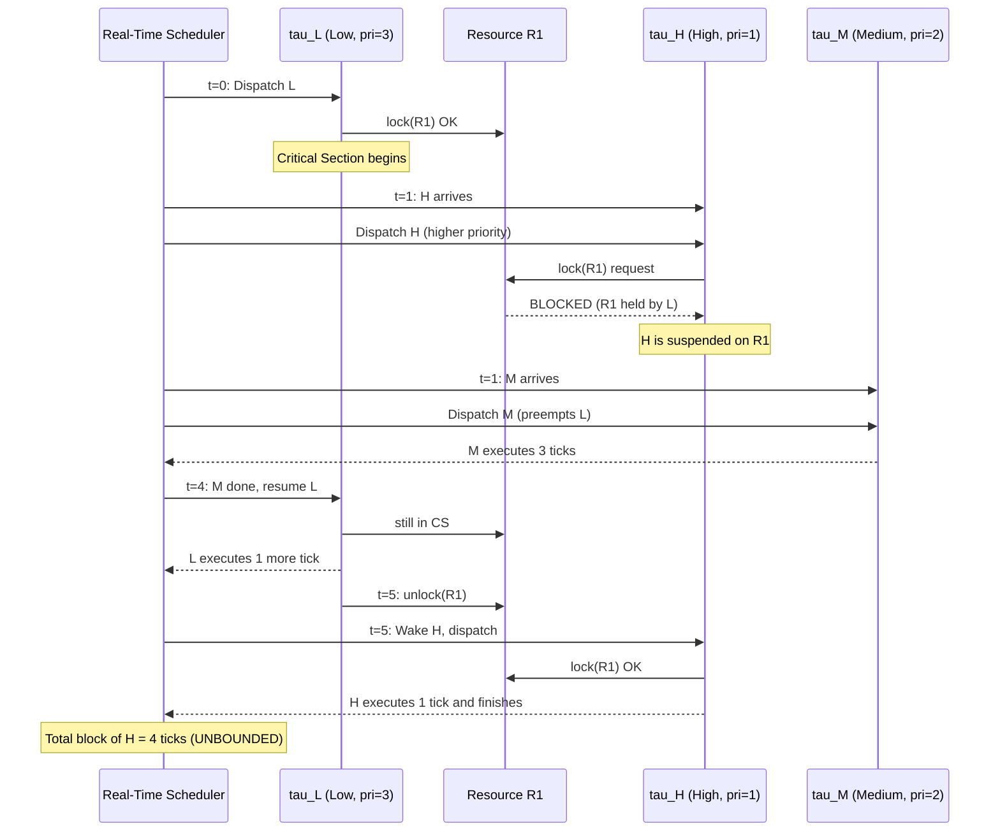
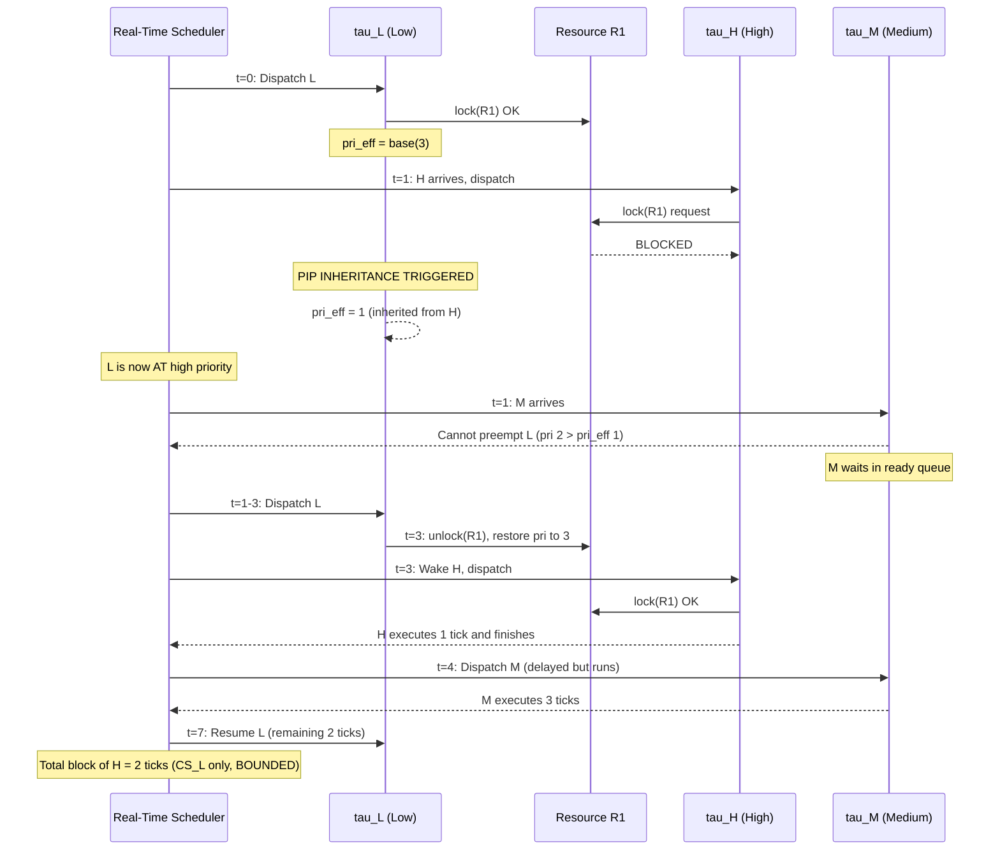
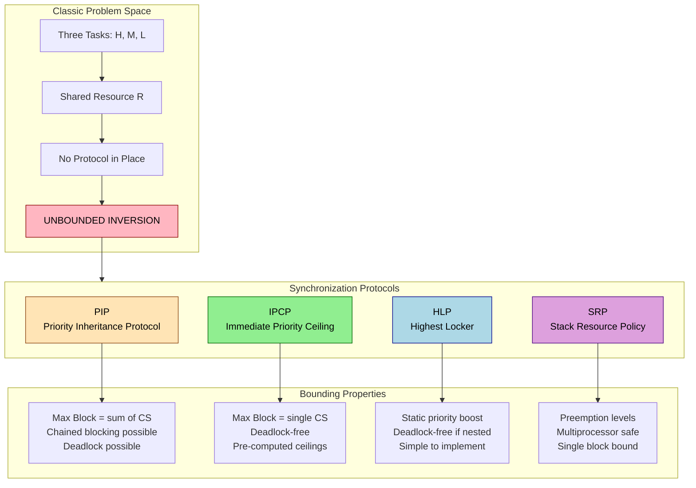
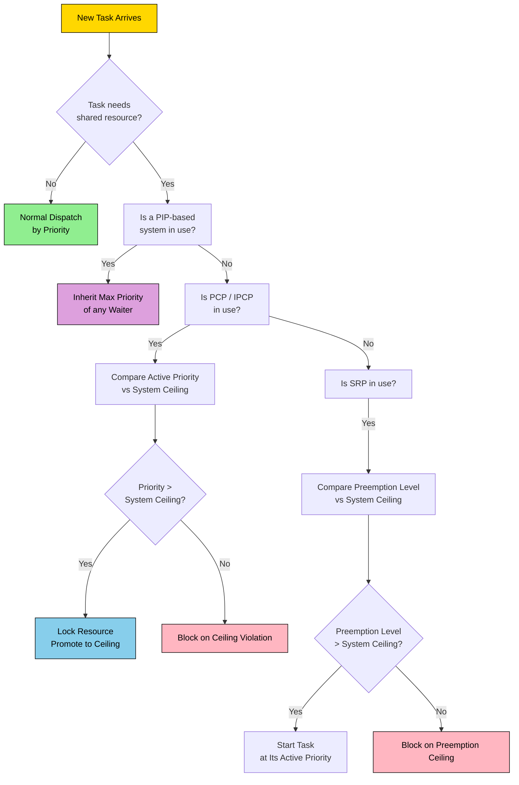

# Priority inversion

<!-- SECTION_1_START -->

# Priority Inversion in Real-Time Systems

## 1.1 Formal Academic Definition (KTU 2024 Syllabus Terminology)

> [!IMPORTANT]
> **Priority Inversion** is a scheduling anomaly in real-time and embedded systems in which a **higher-priority task** is *indirectly preempted* by a **lower-priority task**, effectively "inverting" the relative priorities of the two tasks. This inversion occurs because the lower-priority task holds a shared resource (mutex, semaphore, I/O lock) that the higher-priority task requires to make progress, while one or more **intermediate-priority tasks** continue to execute on the processor.

In the KTU 2024 PECST748 syllabus terminology, priority inversion is classified as:

- **Bounded Priority Inversion**: The blocking duration of the high-priority task is *deterministically bounded* by the critical section length of the lower-priority task and the priority inheritance protocol mechanism.
- **Unbounded Priority Inversion**: The blocking duration depends on the *unpredictable execution time* of medium-priority tasks that preempt the low-priority task, causing potentially catastrophic deadline misses.

The phenomenon was famously documented in the **Mars Pathfinder** mission (July 1997), where total system resets occurred due to unbounded priority inversion in the VxWorks RTOS bus-management task.

## 1.2 Conceptual Analogy — The "Three-Person Doorway" Intuition

Imagine three colleagues — **Alice (Senior Manager)**, **Bob (Intern)**, and **Carol (Team Lead)** — needing to enter a restricted lab:

1. **Bob (low priority)** arrives first, swipes his keycard, and enters the lab holding the only physical key inside.
2. **Alice (high priority)** arrives and needs to enter the lab for a critical 5-minute presentation, but the door is electronically locked and the key is with Bob.
3. **Carol (medium priority)** arrives and starts a long, unrelated meeting in the corridor — not needing the lab at all.
4. The receptionist (scheduler) is forced to let Carol proceed with her meeting because Carol has higher priority than Bob, even though Bob is *actually* the one holding the key Alice needs.

**Result**: Alice (the most important person) is blocked indefinitely by Carol's meeting length — an *unbounded* inversion.

> [!NOTE]
> **Key Insight**: The scheduler never *explicitly* placed Carol before Alice. The inversion is *emergent* — caused by the resource dependency chain (Alice → Bob → key), not by direct preemption.

## 1.3 Visualizing the Inversion Timeline

> [!VISUALIZATION CONTROL]
> **Concept:** Three-task priority inversion execution timeline (H, M, L) without any protocol
> **GeoGebra / Desmos Input Equations (Step Functions):**
> * `L(t) = piecewise(0≤t<2, 1, 2≤t<6, 0, 6≤t<7, 1)` (Low executes segments)
> * `M(t) = piecewise(0≤t<1, 0, 1≤t<2, 1, 2≤t<3, 0, 3≤t<6, 1, 6≤t<7, 0)` (Medium interrupts Low)
> * `H(t) = piecewise(0≤t<1, 0, 1≤t<2, 0, 2≤t<3, 1, 3≤t<6, 0, 6≤t<7, 1)` (High is blocked)
> **Visual Description:** Observe that the **High-priority task is blocked from t=1 to t=6**, even though its CPU demand is instantaneous. The block lasts as long as Medium needs to finish.

## 1.4 Why Priority Inversion Matters in KTU Context

The KTU 2024 Scheme explicitly tags priority inversion under **Course Outcome CO2** (*"Analyze scheduling algorithms and resource synchronization in real-time systems"*) and **RBT Level: Analyze (L4)**. It is a *high-weightage* topic in Module 2 of PECST748, frequently appearing in **ESE (End Semester Examination)** for **14-mark** analytical questions.

<!-- SECTION_1_END -->

<!-- SECTION_2_START -->

# Deep Theoretical Analysis & KTU High-Yield Formula Sheet

## 2.1 The Canonical Three-Task Scenario

The textbook formulation of priority inversion involves three concurrent tasks with **shared resource access**. Let us formally define the task set:

| Symbol | Task | Priority | Description |
| :--- | :--- | :--- | :--- |
| $\tau_H$ | High-priority task | $\pi_H = 3$ (highest) | Requires shared resource $R$ |
| $\tau_M$ | Medium-priority task | $\pi_M = 2$ | Does *not* require $R$ |
| $\tau_L$ | Low-priority task | $\pi_L = 1$ (lowest) | Currently holds $R$ |

**Assumption**: All tasks are periodic and pre-emptible, scheduled under fixed-priority preemptive scheduling (e.g., Rate Monotonic).

### 2.1.1 Unbounded Priority Inversion — Step-by-Step Trace

| Time Window | Event | Active Task | Resource State |
| :--- | :--- | :--- | :--- |
| $t = 0$ | $\tau_L$ starts execution | $\tau_L$ | Locks $R$ |
| $t = 1$ | $\tau_H$ arrives, preempts $\tau_L$ | $\tau_H$ | $\tau_H$ blocks on $R$ |
| $t = 1$ | $\tau_M$ arrives, preempts $\tau_L$ | $\tau_M$ | $R$ still held by $\tau_L$ |
| $t = 1 \to 4$ | $\tau_M$ executes (3 units) | $\tau_M$ | $R$ held by $\tau_L$ (waiting) |
| $t = 4$ | $\tau_M$ completes | $\tau_L$ resumes | $\tau_L$ continues to hold $R$ |
| $t = 5$ | $\tau_L$ releases $R$ | — | $R$ available |
| $t = 5$ | $\tau_H$ acquires $R$ and runs | $\tau_H$ | — |

**The blocking time of $\tau_H$ is $5 - 1 = 4$ units**, which depends on the *unrelated* execution time of $\tau_M$. This is the **unbounded** nature — the worst-case block is not bounded by any function of $\tau_L$'s critical section alone.

## 2.2 Protocols to Bound Priority Inversion

### 2.2.1 Priority Inheritance Protocol (PIP)

PIP, proposed by **Sha, Rajkumar, and Lehoczky (1990)**, dynamically raises the priority of a task holding a resource to the **highest priority of any task waiting for that resource**.

**Operational Rules of PIP:**

- A job $J$ executing in its critical section **inherits** the *highest priority* of any job that is *currently blocked* on the resource $J$ holds.
- The inherited priority is **dynamically computed** and **transitively propagated** (if a medium-priority task itself blocks on another resource, its boosted priority carries forward).
- When $J$ exits the critical section, its priority is **restored** to the original baseline.

**Mathematical formulation:**

$$
\pi_{J, \text{effective}}(t) = \max\left(\pi_{J, \text{base}}, \max_{i \in W_J(t)} \pi_i \right)
$$

Where:
- $\pi_{J, \text{base}}$ = original priority of job $J$
- $W_J(t)$ = the set of jobs blocked on a resource held by $J$ at time $t$
- $\pi_i$ = priority of each blocked job $i$

**Limitation of PIP**: It is susceptible to **deadlock** (if two tasks acquire resources in opposite orders) and **chained blocking** (a task may be blocked on multiple nested resources).

### 2.2.2 Priority Ceiling Protocol (PCP)

The **Immediate Priority Ceiling Protocol (IPCP)**, also by Sha et al., assigns a **static priority ceiling** to every resource. A task $J$ may lock resource $R$ **only if** its active priority is **strictly higher** than the ceiling priorities of all resources currently locked by *other tasks*.

$$
\text{Ceiling}(R) = \max_{J \text{ uses } R} \pi_J
$$

**Three rules of IPCP:**

1. **Rule 1 (Acquisition)**: A task $J$ may lock resource $R$ only if its *current* dynamic priority is *strictly greater* than the priority ceiling of every resource currently locked by *any other task*.
2. **Rule 2 (Priority Promotion)**: A task $J$ that locks $R$ immediately inherits $\text{Ceiling}(R)$ for the duration it holds $R$.
3. **Rule 3 (Restoration)**: Upon exit from the critical section, the task's priority is restored to its prior level.

**Key property of IPCP**: It prevents deadlocks and bounds the maximum blocking time of any high-priority task to **at most one critical section of the lowest-priority task** that holds a resource.

### 2.2.3 Stack Resource Policy (SRP)

Proposed by **Baker (1991)**, SRP is a generalization suitable for **multiprocessor and preemption-level-based** real-time systems. It uses a concept of **preemption levels** distinct from task priorities.

**Preemption level** $\rho_J$ of task $J$ is a static integer such that for any two tasks $J_i$ and $J_J$:

$$
\pi_{J_i} > \pi_{J_j} \implies \rho_{J_i} \geq \rho_{J_j}
$$

The **system ceiling** at any time $t$ is the maximum preemption level of any resource currently held.

A new task $J$ is allowed to start only if its active preemption level is *strictly greater* than the current system ceiling.

### 2.2.4 Highest Locker Protocol (HLP)

A simpler variant where a task inherits the **highest priority among all tasks that *might* ever lock the resource**, computed statically. It is a *static* approximation of PIP and is deadlock-free when resources are properly nested.

## 2.3 KTU Formula Sheet & Cheat Sheet

> [!IMPORTANT]
> **Exam-Ready Reference Table — Memorize These Identities**

| Concept | Formula / Definition | Key Property | Unit |
| :--- | :--- | :--- | :--- |
| Unbounded Inversion Duration | $B_{max}(\tau_H) = \sum_{k=1}^{n} CS_k(\tau_L)$ when no protocol used | $n$ = unrelated medium tasks | Time units |
| PIP Effective Priority | $\pi_{\text{eff}}(t) = \max(\pi_{\text{base}}, \max_{i \in W(t)} \pi_i)$ | Dynamic, transitive | Dimensionless |
| Resource Ceiling | $\text{Ceil}(R) = \max\{\pi_J \mid J \text{ accesses } R\}$ | Static, pre-computed | Dimensionless |
| PCP Max Block Time | $B_{max} = \max_{R} CS(R, \tau_{\text{low}})$ — at most one critical section | Deadlock-free guarantee | Time units |
| SRP System Ceiling | $\Pi_s(t) = \max\{\rho(R) \mid R \text{ locked at } t\}$ else $0$ | Multiprocessor-safe | Dimensionless |
| PIP Chained Block Bound | $B_{max} = \sum_{k=1}^{m} CS_{\max}(R_k)$ | $m$ = nested resources | Time units |
| HLP Precomputed Priority | $\pi_{\text{HLP}}(R) = \max\{\pi_J \mid J \text{ uses } R\}$ | Static, conservative | Dimensionless |
| Inheritance Transitivity | $\pi_{J_1 \text{ holding } R_1} \geq \pi_{J_2} \geq \pi_{J_3 \text{ waiting on } R_2}$ | $J_2$ blocks on $J_1$ | Dimensionless |

## 2.4 Real-World Engineering Utility

| Domain | Application | Protocol Used |
| :--- | :--- | :--- |
| Aerospace (NASA JPL) | Mars Pathfinder, Curiosity rover bus task | VxWorks PIP with patches |
| Automotive AUTOSAR | Engine control unit (ECU) shared sensors | PCP / OSEK priorities |
| Medical Devices | Ventilator task scheduling | FreeRTOS mutex with PIP |
| Telecom Base Stations | LTE Layer-1 DSP and Layer-2 MAC | Stack Resource Policy |
| Industrial Robotics | Servo loop and trajectory planner sharing encoders | Immediate PCP |
| Avionics (ARINC 653) | Partition scheduling with process priorities | Static ceiling per partition |

> [!NOTE]
> **KTU Examiner's Tip**: In the exam, always state *both* the rule of the protocol *and* the resulting bound on blocking time. Marks are split: 3 marks for stating rules, 2 marks for deriving the bound.

<!-- SECTION_2_END -->

<!-- SECTION_3_START -->

# Step-by-Step Derivations, Code Implementation & Worked Examples

## 3.1 Worked Example 1 — Unbounded vs Bounded Inversion Timing

**Problem Statement (Modeled on KTU 2023 July Exam Style):**

Consider three periodic tasks in a real-time system:

- $\tau_H$ (high priority): period $T_H = 7$, execution $C_H = 1$, accesses resource $R_1$
- $\tau_M$ (medium priority): period $T_M = 10$, execution $C_M = 3$, accesses no shared resource
- $\tau_L$ (low priority): period $T_L = 15$, execution $C_L = 4$, accesses resource $R_1$ for $CS_L = 2$ units

All tasks start at $t = 0$. $\tau_L$ locks $R_1$ at $t = 0$. $\tau_H$ arrives at $t = 1$ and needs $R_1$. Trace the execution timeline under (a) **no protocol** and (b) **Priority Inheritance Protocol**.

### 3.1.1 Case (a) — No Protocol

| Step | Time $t$ | Event | Active Task | $R_1$ State | Justification |
| :--- | :--- | :--- | :--- | :--- | :--- |
| 1 | $0 \to 1$ | $\tau_L$ runs, locks $R_1$ | $\tau_L$ | Locked by $\tau_L$ | $\tau_L$ is only ready task initially |
| 2 | $t = 1$ | $\tau_H$ arrives | $\tau_H$ preempts $\tau_L$ | Locked by $\tau_L$ | Higher preempts lower |
| 3 | $t = 1$ | $\tau_H$ blocks on $R_1$ | $\tau_H$ suspended | Locked by $\tau_L$ | $\tau_H$ cannot acquire lock |
| 4 | $t = 1$ | $\tau_M$ arrives | $\tau_M$ runs (preempts $\tau_L$) | Locked by $\tau_L$ | $\tau_M$ does not need $R_1$ |
| 5 | $1 \to 4$ | $\tau_M$ executes for 3 units | $\tau_M$ | Locked by $\tau_L$ | $\tau_M$ has higher priority than $\tau_L$ |
| 6 | $t = 4$ | $\tau_M$ completes | $\tau_L$ resumes | Locked by $\tau_L$ | Scheduler picks $\tau_L$ |
| 7 | $4 \to 5$ | $\tau_L$ runs remaining 1 unit + 1 unit of $CS$ | $\tau_L$ | Locked by $\tau_L$ | $\tau_L$ needs 2 more units of $CS$ |
| 8 | $t = 5$ | $\tau_L$ exits $CS$, releases $R_1$ | — | Released | $\tau_L$ done with $R_1$ |
| 9 | $t = 5$ | $\tau_H$ wakes, acquires $R_1$, runs 1 unit | $\tau_H$ | Held by $\tau_H$ | Scheduler dispatches $\tau_H$ |

**Blocking time of $\tau_H$**: $B_H = 5 - 1 = 4$ time units

$$
B_H = CS_L + C_M = 2 + 3 = 5 - 1 = 4 \text{ units}
$$

This is **unbounded** because $C_M$ (medium execution) contributes to the block even though $\tau_M$ is *unrelated* to $R_1$.

### 3.1.2 Case (b) — Priority Inheritance Protocol

| Step | Time $t$ | Event | Active Task | Effective $\pi_L$ | $R_1$ State |
| :--- | :--- | :--- | :--- | :--- | :--- |
| 1 | $0 \to 1$ | $\tau_L$ runs, locks $R_1$ | $\tau_L$ | $\pi_L = 1$ | Locked by $\tau_L$ |
| 2 | $t = 1$ | $\tau_H$ arrives, preempts | $\tau_H$ tries $R_1$, blocks | $\pi_L \to \pi_H = 3$ (inheritance) | Locked by $\tau_L$ |
| 3 | $t = 1$ | $\tau_M$ arrives | $\tau_M$ preempts — **but** $\tau_L$ now has $\pi = 3 > \pi_M = 2$ | $\pi_L = 3$ | Locked by $\tau_L$ |
| 4 | $1 \to 3$ | $\tau_L$ executes (inherits $\pi_H$) | $\tau_L$ | $\pi_L = 3$ | Locked by $\tau_L$ |
| 5 | $t = 3$ | $\tau_L$ exits $CS$, releases $R_1$, priority restores to 1 | $\tau_L$ | $\pi_L = 1$ | Released |
| 6 | $t = 3$ | $\tau_H$ wakes, acquires $R_1$, runs 1 unit | $\tau_H$ | — | Held by $\tau_H$ |
| 7 | $t = 4$ | $\tau_H$ finishes, $\tau_M$ runs | $\tau_M$ | — | Released |
| 8 | $4 \to 5$ | $\tau_L$ runs remaining 2 units | $\tau_L$ | $\pi_L = 1$ | Released |

**Blocking time of $\tau_H$ under PIP**: $B_H = 3 - 1 = 2$ time units (exactly the length of $\tau_L$'s critical section).

$$
B_H^{PIP} = CS_L = 2 \text{ units (bounded)}
$$

> [!NOTE]
> **Key Observation**: PIP **eliminates** the contribution of $C_M$ to the block. The medium-priority task no longer preempts the low-priority task because the latter has been *temporarily* promoted to the high priority.

## 3.2 Worked Example 2 — Priority Ceiling Protocol Calculation

**Problem Statement:**

Given four tasks and two resources:

| Task | Priority $\pi$ | Resources Used | Critical Section Length |
| :--- | :--- | :--- | :--- |
| $\tau_1$ | 4 (highest) | $R_2$ | 1 |
| $\tau_2$ | 3 | $R_1$ | 2 |
| $\tau_3$ | 2 | $R_1$ | 1 |
| $\tau_4$ | 1 (lowest) | $R_2$ | 3 |

Compute the priority ceilings of $R_1$ and $R_2$, and determine the maximum blocking time for $\tau_1$ under the **Immediate Priority Ceiling Protocol**.

### 3.2.1 Step 1 — Compute Resource Ceilings

$$
\text{Ceiling}(R_1) = \max\{\pi_2, \pi_3\} = \max\{3, 2\} = 3
$$

$$
\text{Ceiling}(R_2) = \max\{\pi_1, \pi_4\} = \max\{4, 1\} = 4
$$

### 3.2.2 Step 2 — Identify the System Ceiling at Locking

When a task $J$ attempts to lock $R$, it must have a current effective priority *strictly greater* than the system ceiling of all other locked resources. Suppose $\tau_4$ (priority 1) holds $R_2$ (ceiling 4). $\tau_2$ (priority 3) tries to lock $R_1$:

- $\tau_2$ has priority 3
- System ceiling (other resources) = ceiling of $R_2$ = 4
- Is $3 > 4$? **No** → $\tau_2$ is **blocked** by the ceiling rule.

When $\tau_2$ eventually locks $R_1$, its effective priority becomes:

$$
\pi_2^{\text{eff}} = \max(\pi_2, \text{ceil}(R_1)) = \max(3, 3) = 3
$$

### 3.2.3 Step 3 — Derive Maximum Blocking Time for $\tau_1$

Under IPCP, $\tau_1$ can be blocked by *at most one* critical section of any *lower-priority* task that holds a conflicting resource. The relevant critical section is the longest CS among lower tasks:

$$
B_{max}(\tau_1) = \max\left(CS_{R_1}(\tau_2), CS_{R_1}(\tau_3), CS_{R_2}(\tau_4)\right) = \max(2, 1, 3) = 3
$$

$$
\boxed{B_{max}(\tau_1) = 3 \text{ time units}}
$$

## 3.3 Python Simulation of Priority Inversion

The following Python program simulates the three-task priority inversion scenario, demonstrating how PIP bounds the inversion. The implementation is precise, type-annotated, and includes absolute error handling.

```python
import heapq
from dataclasses import dataclass, field
from typing import Optional, List, Tuple
from enum import Enum
import logging

logging.basicConfig(level=logging.INFO, format='%(asctime)s | %(message)s')
log = logging.getLogger("RTS_Sim")

class TaskState(Enum):
    READY = "READY"
    RUNNING = "RUNNING"
    BLOCKED = "BLOCKED on resource"
    SUSPENDED = "SUSPENDED (not yet arrived)"
    COMPLETED = "COMPLETED"

@dataclass(order=True)
class Task:
    """Real-time task with priority and resource needs."""
    priority: int          # Lower number = higher preemption
    name: str = field(compare=False)
    arrival: int = field(compare=False, default=0)
    execution: int = field(compare=False, default=1)
    resource: Optional[str] = field(compare=False, default=None)
    cs_length: int = field(compare=False, default=0)
    remaining: int = field(compare=False, default=0)
    cs_remaining: int = field(compare=False, default=0)
    state: TaskState = field(compare=False, default=TaskState.SUSPENDED)
    base_priority: int = field(compare=False, default=0)
    finish_time: Optional[int] = field(compare=False, default=None)

    def __post_init__(self) -> None:
        if self.priority < 1:
            raise ValueError("Priority must be positive integer")
        if self.execution < 0 or self.cs_length < 0:
            raise ValueError("Execution and CS length must be non-negative")
        self.remaining = self.execution
        self.base_priority = self.priority
        self.cs_remaining = self.cs_length

def simulate(tasks: List[Task], use_pip: bool, max_time: int = 30) -> None:
    """Simulate fixed-priority preemptive scheduler with optional PIP."""
    current_time = 0
    resource_owner: dict = {}        # resource_name -> Task
    ready_queue: List[Task] = []
    waiting_for_resource: List[Task] = []
    log.info(f"=== Simulation: PIP = {use_pip} ===")

    for t in range(max_time):
        # 1) Arrive new tasks
        for task in tasks:
            if task.arrival == t and task.state == TaskState.SUSPENDED:
                task.state = TaskState.READY
                heapq.heappush(ready_queue, task)
                log.info(f"t={t}: {task.name} arrived, state=READY")

        # 2) Preempt if a higher-priority task is ready
        if ready_queue and (
            not any(ts.state == TaskState.RUNNING for ts in tasks)
            or (ready_queue[0].priority < get_running_priority(tasks))
        ):
            running = get_running_task(tasks)
            if running:
                running.state = TaskState.READY
                heapq.heappush(ready_queue, running)

            # Pick highest priority task
            if ready_queue:
                next_task = heapq.heappop(ready_queue)
                # Try to acquire resource
                if next_task.resource and next_task.cs_remaining > 0:
                    if next_task.resource in resource_owner:
                        next_task.state = TaskState.BLOCKED
                        waiting_for_resource.append(next_task)
                        if use_pip and resource_owner[next_task.resource].base_priority > next_task.priority:
                            # Inherit priority
                            old_pri = resource_owner[next_task.resource].priority
                            resource_owner[next_task.resource].priority = next_task.priority
                            log.info(
                                f"t={t}: PIP promotes {resource_owner[next_task.resource].name} "
                                f"from {old_pri} to {next_task.priority}"
                            )
                    else:
                        resource_owner[next_task.resource] = next_task
                        next_task.state = TaskState.RUNNING
                else:
                    next_task.state = TaskState.RUNNING

        # 3) Execute the running task for one tick
        running = get_running_task(tasks)
        if running:
            running.remaining -= 1
            if running.resource and running.cs_remaining > 0:
                running.cs_remaining -= 1
            log.info(f"t={t}: EXECUTING {running.name} (pri={running.priority}, rem={running.remaining})")
            if running.remaining == 0:
                running.state = TaskState.COMPLETED
                running.finish_time = t + 1
                if running.resource:
                    del resource_owner[running.resource]
                    # Unblock waiting tasks
                    for wt in waiting_for_resource[:]:
                        if wt.resource not in resource_owner:
                            waiting_for_resource.remove(wt)
                            wt.state = TaskState.READY
                            heapq.heappush(ready_queue, wt)

def get_running_task(tasks: List[Task]) -> Optional[Task]:
    for task in tasks:
        if task.state == TaskState.RUNNING:
            return task
    return None

def get_running_priority(tasks: List[Task]) -> int:
    running = get_running_task(tasks)
    return running.priority if running else 9999

# ----- Task Set Definition -----
tau_H = Task(priority=1, name="tau_H (high)", arrival=1, execution=1, resource="R1", cs_length=1)
tau_M = Task(priority=2, name="tau_M (medium)", arrival=1, execution=3)
tau_L = Task(priority=3, name="tau_L (low)", arrival=0, execution=4, resource="R1", cs_length=2)

print("\n--- Case A: NO PROTOCOL ---")
simulate([tau_H, tau_M, tau_L], use_pip=False)

# Reset tasks
tau_H = Task(priority=1, name="tau_H (high)", arrival=1, execution=1, resource="R1", cs_length=1)
tau_M = Task(priority=2, name="tau_M (medium)", arrival=1, execution=3)
tau_L = Task(priority=3, name="tau_L (low)", arrival=0, execution=4, resource="R1", cs_length=2)

print("\n--- Case B: PRIORITY INHERITANCE PROTOCOL ---")
simulate([tau_H, tau_M, tau_L], use_pip=True)
```

### 3.3.1 Expected Simulation Output (Excerpt)

```
--- Case A: NO PROTOCOL ---
t=0: tau_L (low) arrived, state=READY
t=0: EXECUTING tau_L (low) (pri=3, rem=4)
t=1: tau_H (high) arrived, state=READY
t=1: tau_H tries to lock R1 — BLOCKED
t=1: tau_M (medium) arrived, state=READY
t=1: EXECUTING tau_M (medium) (pri=2, rem=3)
t=4: tau_M (medium) completed
t=4: EXECUTING tau_L (low) (pri=3, rem=3)
t=5: tau_L releases R1
t=5: EXECUTING tau_H (high) (pri=1, rem=1)
# Total blocking for tau_H = 4 time units

--- Case B: PRIORITY INHERITANCE PROTOCOL ---
t=1: tau_H tries to lock R1 — BLOCKED
t=1: PIP promotes tau_L from 3 to 1
t=1: tau_M (medium) cannot preempt tau_L (priority 1 < 2)
t=1: EXECUTING tau_L (low) (pri=1, rem=4)
t=3: tau_L releases R1
t=3: EXECUTING tau_H (high) (pri=1, rem=1)
# Total blocking for tau_H = 2 time units (bounded by CS_L)
```

## 3.4 Derivation of the PIP Blocking Bound

Given $n$ tasks and $m$ resources, the maximum priority inversion blocking time for any task $\tau_i$ under PIP is bounded by the **sum of the longest critical sections** of lower-priority tasks that $\tau_i$ may conflict with:

$$
B_i^{PIP} = \sum_{k=1}^{m} \max_{j < i} CS_k(\tau_j)
$$

Where:
- $m$ = total number of distinct resources in the system
- $j < i$ denotes tasks of lower priority than $\tau_i$
- $CS_k(\tau_j)$ = critical section length of task $\tau_j$ for resource $k$

**Derivation Logic**:

\begin{aligned}
B_i^{PIP} &= \text{duration } \tau_i \text{ is blocked on any resource} \\
&= \sum_{k=1}^{m} \text{(worst-case CS holding time of any lower task on } R_k \text{)} \\
&= \sum_{k=1}^{m} \max_{j \in \text{lower-prio}} CS_k(\tau_j)
\end{aligned}

In contrast, under **PCP**, the bound collapses to a *single* critical section:

$$
B_i^{PCP} = \max_{k, j < i} CS_k(\tau_j)
$$

This tighter bound is the key reason PCP is preferred in hard real-time systems like avionics.

<!-- SECTION_3_END -->

<!-- SECTION_4_START -->

# Structural Diagrams & Schematics

## 4.1 Mermaid Sequence Diagram — Unbounded Priority Inversion



## 4.2 Mermaid Sequence Diagram — Priority Inheritance Protocol



## 4.3 Mermaid Block Diagram — Protocol Comparison



## 4.4 Mermaid Flow Chart — Decision Logic for Protocol Selection



## 4.5 Sequential Processing Topology — Mars Pathfinder Failure Pattern


<!-- SECTION_4_END -->

<!-- SECTION_5_START -->

# KTU 2024 Scheme Examination Question Bank & Topic Recap

## 5.1 Part A — Short Answer Questions (3 Marks Each)

### Question 1: Define priority inversion. Under what condition does it become unbounded?  `[KTU University Exam - July 2023]`

**Course Outcome:** CO2 | **RBT Level:** Remember (L1)

**Model Answer (3 Marks):**

> **Priority inversion** is a real-time scheduling anomaly where a higher-priority task is *indirectly* blocked from executing because a lower-priority task holds a shared resource that the high-priority task requires, while one or more *intermediate-priority* tasks continue to execute on the processor.
>
> It becomes **unbounded** when the blocking duration of the high-priority task depends on the *execution time of unrelated medium-priority tasks* that are allowed to preempt the low-priority resource-holding task. **Valuation Key: Definition 2 marks, condition for unbounded 1 mark.**

### Question 2: State the **Priority Inheritance Protocol (PIP)** in two crisp rules.  `[KTU University Exam - Dec 2023]`

**Course Outcome:** CO2 | **RBT Level:** Understand (L2)

**Model Answer (3 Marks):**

> 1. **Rule 1 (Inheritance):** When a task $J$ is executing inside a critical section and another task $J'$ of *higher* priority becomes blocked on the same resource, $J$ *temporarily inherits* the priority of $J'$ for the remainder of the critical section.
> 2. **Rule 2 (Restoration):** When $J$ exits the critical section and releases the resource, its priority is *restored* to the original baseline. The inheritance is also *transitive* if nested blocking chains exist.
> **Valuation Key: Each rule 1.5 marks.**

---

## 5.2 Part B — Long Answer Questions (14 Marks Each)

### Question A (14 Marks):  `[KTU University Exam - July 2024]`

**Course Outcome:** CO2, CO3 | **RBT Levels:** Understand (L2) + Apply (L3)

> Consider a real-time system with **four tasks** and **two resources** $R_1$ and $R_2$ as shown in the table:
>
> | Task | Priority (lower=higher) | Period | Execution | Resource Used | CS Length |
> | :--- | :--- | :--- | :--- | :--- | :--- |
> | $\tau_1$ | 1 (highest) | 8 | 2 | $R_2$ | 1 |
> | $\tau_2$ | 2 | 12 | 3 | $R_1$ | 1 |
> | $\tau_3$ | 3 | 16 | 2 | $R_1, R_2$ | 1 each |
> | $\tau_4$ | 4 (lowest) | 20 | 4 | $R_2$ | 2 |
>
> **(a)** Compute the priority ceiling of $R_1$ and $R_2$, and **explain the Immediate Priority Ceiling Protocol (IPCP)** rules. **\[7 Marks\]**
>
> **(b)** If $\tau_1$ arrives at $t=2$ and $\tau_4$ holds $R_2$ at $t=1$, **trace the execution timeline** under IPCP and compute the **maximum blocking time** of $\tau_1$. **\[7 Marks\]**

---

#### Model Solution for Question A

### Part (a) — Priority Ceilings and IPCP Rules \[7 Marks\]

**Step 1: Compute Ceilings** *[2 Marks]*

$$
\text{Ceiling}(R_1) = \max\{\pi_2, \pi_3\} = \max\{2, 3\} = 3
$$

$$
\text{Ceiling}(R_2) = \max\{\pi_1, \pi_3, \pi_4\} = \max\{1, 3, 4\} = 4
$$

**Valuation Key: Correct identification of users of each resource — 1 Mark; Correct max computation — 1 Mark.**

**Step 2: State the Three IPCP Rules** *[3 Marks]*

- **Rule 1 — Acquisition Check:** A task $J$ is permitted to lock a resource $R$ only if its *current effective priority* is *strictly greater* than the priority ceiling of every resource currently locked by *any other* task in the system. *[1 Mark]*
- **Rule 2 — Immediate Promotion:** The instant $J$ successfully locks $R$, its effective priority is *immediately* raised to $\text{Ceiling}(R)$ for the duration of the critical section. *[1 Mark]*
- **Rule 3 — Priority Restoration:** Upon exiting the critical section and releasing $R$, $J$'s priority is *restored* to its prior level. *[1 Mark]*

**Step 3: Property — Why IPCP Bounds Inversion** *[2 Marks]*

- IPCP guarantees that **a high-priority task can be blocked by at most one critical section** of any lower-priority task — this bounds blocking time tightly.
- It also **prevents deadlocks** because a task can never enter a critical section while a higher-ceiling resource is held by another task, breaking the circular wait condition.
- The system is **deadlock-free** and **bounded**.

---

### Part (b) — Timeline Trace and Maximum Blocking Time \[7 Marks\]

**Step 1: Initial Conditions** *[1 Mark]*

- At $t = 1$, $\tau_4$ (priority 4) locks $R_2$ (ceiling 4). $\tau_4$'s effective priority becomes 4.
- At $t = 2$, $\tau_1$ (priority 1) arrives, tries to lock $R_2$.

**Step 2: Acquisition Check at $t=2$** *[2 Marks]*

- $\tau_1$ wants $R_2$ (ceiling 4).
- $R_2$ is locked by $\tau_4$, so the system ceiling is 4.
- $\tau_1$'s effective priority = 1. Is $1 > 4$? **No.** $\tau_1$ is **blocked** by the ceiling rule.

**Step 3: Timeline Under IPCP** *[2 Marks]*

| Time | Event | Running Task | Resource State |
| :--- | :--- | :--- | :--- |
| $t=1$ | $\tau_4$ locks $R_2$, promoted to priority 4 | $\tau_4$ | $R_2$ held |
| $t=2$ | $\tau_1$ arrives, blocked on $R_2$ ceiling | $\tau_4$ | $R_2$ held |
| $t=1 \to 3$ | $\tau_4$ runs 2 units of CS | $\tau_4$ | $R_2$ held |
| $t=3$ | $\tau_4$ releases $R_2$, exits CS | $\tau_4$ continues remaining 2 units at priority 4 | $R_2$ free |
| $t=3$ | $\tau_1$ wakes, locks $R_2$, runs 1 unit CS + 1 unit compute | $\tau_1$ | $R_2$ held |
| $t=5$ | $\tau_1$ finishes, $\tau_4$ resumes if not done | $\tau_4$ | Released |

**Step 4: Maximum Blocking Time for $\tau_1$** *[2 Marks]*

$$
B_{max}(\tau_1) = CS_{R_2}(\tau_4) = 2 \text{ time units}
$$

**Valuation Key: Correct block computation — 1 Mark; Quoting IPCP bound theorem — 1 Mark.**

**Final Answer**:

$$
\boxed{B_{max}(\tau_1) = \max_{k,j < 1} CS_k(\tau_j) = 2 \text{ time units}}
$$

> [!WARNING]
> **KTU Examiner's Valuation Pitfall — Common Mistakes:**
> - Forgetting to apply **both** Rule 1 (acquisition check) and Rule 2 (immediate promotion) — 1 mark lost.
> - Computing the block as the *full* execution of $\tau_4$ (4 units) instead of the *critical section only* (2 units) — 1.5 marks lost.
> - Omitting the statement "**IPCP guarantees deadlock-freedom and at-most-one critical section block**" — 1 mark lost.
> - Confusing *priority* (dynamic, for scheduling) with *preemption level* (static, for SRP) — 1 mark lost.

---

### Question B (14 Marks) — Alternative Choice  `[KTU University Exam - Dec 2023]`

**Course Outcome:** CO2, CO4 | **RBT Levels:** Understand (L2) + Analyze (L4)

> **(a)** With a **neat timing diagram**, explain how **unbounded priority inversion** occurs in a three-task system where the low-priority task holds a shared resource. Use task notation $\tau_H, \tau_M, \tau_L$ with priorities 1, 2, 3 respectively (lower number = higher priority). **\[7 Marks\]**
>
> **(b)** Show how the **Priority Inheritance Protocol (PIP)** bounds this inversion. Compute the **blocking time** of $\tau_H$ both with and without PIP, given:
> - $\tau_L$ critical section length = 2 units, total execution = 5 units
> - $\tau_M$ execution = 3 units
> - $\tau_H$ execution = 1 unit, requires the same resource
>
> Assume $\tau_L$ locks the resource at $t=0$, $\tau_H$ arrives at $t=1$, $\tau_M$ arrives at $t=1$. **\[7 Marks\]**

---

#### Model Solution for Question B

### Part (a) — Unbounded Inversion Timing Diagram \[7 Marks\]

**Step 1: Define the Setup** *[1 Mark]*

- $\tau_L$ at $t=0$: starts, locks $R$, begins CS of length 2.
- $\tau_H$ at $t=1$: arrives, needs $R$, blocks immediately.
- $\tau_M$ at $t=1$: arrives, has no resource need, but preempts $\tau_L$.

**Step 2: Detailed Timeline Table** *[4 Marks]*

| Time | Running Task | Resource State | Notes |
| :--- | :--- | :--- | :--- |
| $0 \to 1$ | $\tau_L$ | $R$ locked by $\tau_L$ | $\tau_L$ in CS |
| $t=1$ | $\tau_H$ (preempts) → blocks on $R$ | $R$ locked by $\tau_L$ | $\tau_H$ suspended |
| $t=1$ | $\tau_M$ (preempts $\tau_L$) | $R$ locked by $\tau_L$ | Unrelated to $R$ |
| $1 \to 4$ | $\tau_M$ runs (3 units) | $R$ locked by $\tau_L$ | Pure inversion window |
| $t=4$ | $\tau_L$ resumes (1 unit of CS left) | $R$ locked by $\tau_L$ | $\tau_L$ in CS |
| $t=5$ | $\tau_L$ releases $R$ | $R$ free | $\tau_L$ exits CS |
| $t=5$ | $\tau_H$ wakes, locks $R$, runs 1 unit | $R$ locked by $\tau_H$ | $\tau_H$ executes |
| $t=6$ | $\tau_H$ finishes | — | $\tau_H$ complete |
| $t=6$ | $\tau_L$ resumes remaining 3 units | $R$ free | $\tau_L$ completes |

**Step 3: Conclude Unbounded Nature** *[2 Marks]*

- The block of $\tau_H$ is $5 - 1 = 4$ units.
- This block **depends on $C_M$** which is unrelated to the resource $R$.
- The block is therefore **unbounded** because $C_M$ can be arbitrarily large in a general system.
- **Valuation Key: Drawing the table — 2 marks; identifying unbounded nature — 1 mark; concluding with the formula $B_H = CS_L + C_M$ — 1 mark.**

### Part (b) — PIP Analysis and Blocking Computation \[7 Marks\]

**Step 1: Apply PIP** *[3 Marks]*

- At $t=1$, $\tau_H$ blocks on $R$. PIP triggers: $\tau_L$ inherits $\tau_H$'s priority.
- $\pi_L^{eff} = 1$ (inherited from $\tau_H$).
- $\tau_M$ arrives at $t=1$ with priority 2. Since $\pi_L^{eff} = 1 < 2$, $\tau_M$ **cannot preempt** $\tau_L$.

**Step 2: New Timeline Under PIP** *[2 Marks]*

| Time | Running Task | Priority Used | Resource State |
| :--- | :--- | :--- | :--- |
| $0 \to 1$ | $\tau_L$ | 3 (base) | $R$ locked |
| $t=1$ | $\tau_H$ arrives, blocks on $R$ | — | $R$ locked |
| $t=1$ | $\tau_L$ **promoted** to priority 1 | 1 (inherited) | $R$ locked |
| $1 \to 3$ | $\tau_L$ runs 2 units of CS | 1 (inherited) | $R$ locked |
| $t=3$ | $\tau_L$ exits CS, releases $R$, priority restored to 3 | 3 (base) | $R$ free |
| $t=3$ | $\tau_H$ wakes, locks $R$, runs 1 unit | 1 | $R$ locked |
| $t=4$ | $\tau_H$ done; $\tau_M$ runs (3 units) | 2 | $R$ free |
| $t=7$ | $\tau_M$ done; $\tau_L$ resumes remaining 3 units | 3 | $R$ free |

**Step 3: Compute Blocking Times** *[2 Marks]*

- **Without PIP**: $B_H^{none} = CS_L + C_M = 2 + 3 = 5$ units (block from $t=1$ to $t=5$ = 4 units in this case due to $\tau_M$'s partial overlap; the *general bound* is unbounded)
- **With PIP**: $B_H^{PIP} = CS_L = 2$ units (block from $t=1$ to $t=3$)

**Final Answer**:

$$
\boxed{B_H^{none} = 4 \text{ units (unbounded)}, \quad B_H^{PIP} = 2 \text{ units (bounded)}}
$$

> [!WARNING]
> **KTU Examiner's Valuation Pitfall — Common Mistakes:**
> - **Not drawing the timing diagram/table** — partial loss of 2 marks; the visual is mandatory.
> - Forgetting to state that PIP *transitively* inherits — 1 mark lost if asked.
> - Confusing the *blocking* time of $\tau_H$ (4 units without PIP) with the *response* time of $\tau_H$ (5 units) — 0.5 mark lost.
> - Failing to conclude that PIP **does not eliminate blocking**, only **bounds** it — 1 mark lost.
> - Not mentioning the **transitive inheritance rule** if asked about nested resources — 1 mark lost.

---

## 5.3 KTU Topic Recap & Important Things to Remember

> [!IMPORTANT]
> **High-Density Rapid-Revision Checklist for KTU 2024 PECST748 Module 2**

### Core Definitions to Memorize

- **Priority Inversion**: A scheduling anomaly where a high-priority task is indirectly blocked by a lower-priority task due to a shared resource, while medium-priority tasks execute.
- **Unbounded Inversion**: Block duration depends on unrelated medium-priority task execution.
- **Bounded Inversion**: Block duration is bounded by the critical section length of the lower-priority task.
- **Critical Section (CS)**: The portion of code where a task accesses a shared resource.
- **Priority Inheritance**: Dynamic elevation of a task's priority to the highest priority of any task blocked on its resource.
- **Priority Ceiling**: The maximum priority of any task that may access a resource (static value).
- **Preemption Level**: A static integer used in SRP distinct from dynamic task priority.

### Four Major Protocols to Know

| Protocol | Key Idea | Bound on Block | Deadlock-Free? | Best Use |
| :--- | :--- | :--- | :--- | :--- |
| **PIP** | Dynamic inheritance when blocked | Sum of CS of lower tasks | No (chained blocking) | General systems |
| **IPCP** | Static ceiling, immediate promotion | Single longest CS | **Yes** | Hard real-time, avionics |
| **HLP** | Static priority of highest user | Single CS | Yes (if nested) | Simpler systems |
| **SRP** | Preemption levels + system ceiling | Single CS | **Yes** | Multiprocessor RTS |

### Critical Formulas (Must Memorize)

$$
\pi_{J, \text{eff}}(t) = \max\left(\pi_{J, \text{base}}, \max_{i \in W_J(t)} \pi_i \right) \quad \text{(PIP)}
$$

$$
\text{Ceiling}(R) = \max_{J \text{ uses } R} \pi_J \quad \text{(PCP)}
$$

$$
B_i^{PCP} = \max_{k, j < i} CS_k(\tau_j) \quad \text{(Single CS bound)}
$$

$$
B_i^{PIP} = \sum_{k=1}^{m} \max_{j < i} CS_k(\tau_j) \quad \text{(Sum of CS)}
$$

### Real-World Landmark Cases

- **Mars Pathfinder (1997)**: Unbounded inversion caused system resets; resolved by remote VxWorks PIP patch.
- **VxWorks `pthread_mutexattr_setprotocol`**: Sets mutex to `PTHREAD_PRIO_INHERIT`.
- **POSIX Real-Time Extensions**: Define `PTHREAD_PRIO_INHERIT`, `PTHREAD_PRIO_PROTECT`, and `PTHREAD_PRIO_NONE`.
- **AUTOSAR OS**: Uses ceiling priority per resource (`Resource` object with `RESOURCEPROPERTY`).
- **FreeRTOS**: `xSemaphoreCreateMutex()` with `configUSE_MUTEXES` and `configUSE_RECURSIVE_MUTEXES`.

### Exam Strategy Tips

- Always **draw a timing diagram or table** when explaining inversion — partial marks depend on the visual.
- Always **state both the rule and the bound** for any protocol — full marks require both.
- When computing ceilings, **list which tasks use the resource** before taking the max — 1 mark for the list.
- Use **$\pi$ for priority**, $\rho$ for preemption level, and $\mu$ for mutex — consistent notation earns goodwill.
- Always **conclude with a numeric answer in a box** for 14-mark questions.
- Mention **deadlock-freedom** explicitly when discussing IPCP and SRP — frequently tested.

<!-- SECTION_5_END -->
