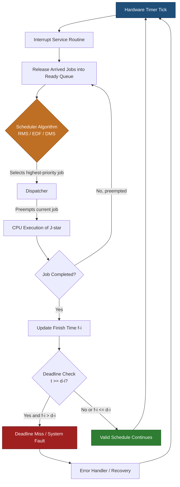
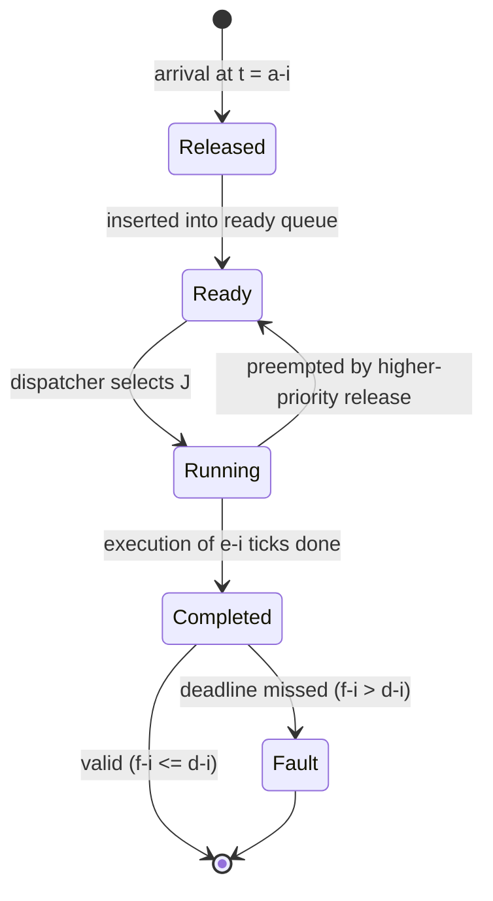
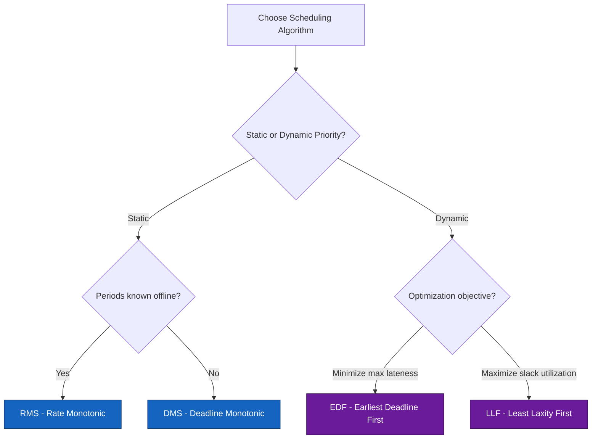

# Real-Time task scheduling: Basic concepts

<!-- SECTION_1_START -->
# Real-Time Task Scheduling: Basic Concepts

## 1.1 Formal Definition

In the context of the **KTU 2024 Scheme (PECST748 – Real-Time Systems)**, a **real-time task** is a computational job whose correctness depends not only on its **logical result** but also on the **time at which the result is produced**. Real-time task scheduling is the process of determining the *order* and *timing* in which multiple computational units (jobs) are dispatched to the processor(s) so that all temporal constraints (deadlines) are met.

> [!NOTE]
> **KTU 2024 Syllabus Definition (PECST748 – Module 2):**
> A real-time system is one in which the correctness of the system depends not only on the logical results of computation, but also on the time at which the results are produced. Task scheduling is the kernel-level mechanism that decides which ready job executes at any given instant.

### Task vs Job vs Task Instance

| Term | Definition | Example |
|------|------------|---------|
| **Job** | A unit of work executed by the processor | One execution of a control loop iteration |
| **Task** | A set of related jobs that together provide some system function | A periodic temperature sensing function |
| **Task Instance** | A specific invocation (job) of a task at a particular time | The 5th invocation of the sensing task at $t = 500\,\text{ms}$ |

> [!IMPORTANT]
> **Mnemonic (JTP):** **J**obs are individual, **T**asks are the family, instances are the **P**articular members.

## 1.2 Intuitive Overview — The Airport Analogy

Imagine you are the **air-traffic controller of a single runway** (the CPU). Multiple aircraft (jobs) are queued, each with a strict time-to-land (deadline). A commercial airliner must land before it runs out of fuel (hard deadline), while a cargo flight can tolerate a small delay (soft deadline). Some planes arrive at fixed intervals — every 30 minutes (periodic). Some arrive unexpectedly (aperiodic/sporadic).

Your job is the **scheduler**: you must decide **which plane lands when**, ensuring that no hard deadline is missed. That decision process — *who goes next, when, and for how long* — is exactly **real-time task scheduling**.

## 1.3 Types of Real-Time Tasks

### A. By Timing Criticality

- **Hard Real-Time Task:** Missing a deadline is a **total system failure** (e.g., airbag deployment, anti-lock braking).
- **Soft Real-Time Task:** Missing a deadline degrades quality but does not cause catastrophe (e.g., video frame skip).
- **Firm Real-Time Task:** Late results are *useless* (discarded) but do not damage the system (e.g., weather data feed).

### B. By Arrival Pattern

- **Periodic Task ($\tau_p$):** Jobs arrive at regular intervals of fixed length $p_i$. The $k^{th}$ job arrives at $a_k = \phi_i + (k-1)\cdot p_i$.
- **Aperiodic Task:** Jobs arrive at *irregular* intervals with no minimum inter-arrival time guarantee.
- **Sporadic Task:** Aperiodic jobs with a **minimum inter-arrival time** $p_i$ enforced between successive arrivals — used to bound load.

> [!TIP]
> **Key Insight:** Sporadic tasks behave *like* periodic tasks with a known inter-arrival bound, which makes them schedulability-analysable — this is the foundation of the **Time-Demand Analysis** you will study later in Module 3.

### C. By Preemption Behavior

- **Preemptive:** A higher-priority job can interrupt a lower-priority one mid-execution.
- **Non-preemptive:** Once a job starts, it runs to completion (used when preemption is too expensive — e.g., certain I/O transactions).

## 1.4 Task Parameters — The "Big Six"

Every real-time job is described by **six canonical parameters**:

| Symbol | Parameter | Formal Definition |
|--------|-----------|-------------------|
| $\phi_i$ | **Phase** | Time of the first release (arrival) of task $T_i$ |
| $p_i$ | **Period** | Time between two consecutive releases of $T_i$ |
| $e_i$ | **Worst-Case Execution Time (WCET)** | Maximum processor time the job may consume |
| $a_i$ | **Release / Arrival Time** | Instant when the job becomes ready |
| $D_i$ | **Relative Deadline** | Time by which the job must finish, measured from release |
| $d_i$ | **Absolute Deadline** | $d_i = a_i + D_i$ — the wall-clock deadline |
| $s_i$ | **Start Time** | Wall-clock instant the job begins execution |
| $f_i$ | **Finish Time** | Wall-clock instant the job completes |

> [!IMPORTANT]
> **Constraint:** For the system to be *feasible*, we require $\forall i: f_i \le d_i$. A schedule satisfying this is called a **valid schedule**.

## 1.5 Hyperperiod and Utilization

For a set of $n$ periodic tasks, the schedule repeats every **hyperperiod** $H$:

$$H = \operatorname{lcm}(p_1, p_2, \dots, p_n)$$

The **total processor utilization** of a task set is:

$$U = \sum_{i=1}^{n} \frac{e_i}{p_i}$$

> [!VISUALIZATION CONTROL]
> **Concept:** Periodic job arrivals on a timeline.
> **Desmos/GeoGebra Representation:** Plot piecewise step functions $a_k(t)$ rising at $t = \phi_i + (k-1)p_i$ for $k = 1,2,3,\dots$
> **Visual Description:** A saw-tooth pattern of vertical impulse risers — for task $T_1$ with $p_1=4$, risers appear at $t = 0, 4, 8, 12, \dots$ ; for $T_2$ with $p_2=6$, risers at $t = 0, 6, 12, 18, \dots$. The **hyperperiod** $H = 12$ is the smallest time after which both patterns realign.

## 1.6 Classification of Scheduling Algorithms

Real-time scheduling algorithms are classified along **three orthogonal axes**:

| Axis | Categories |
|------|------------|
| **Preemption** | Preemptive vs Non-Preemptive |
| **Static vs Dynamic** | Static (priorities fixed at design-time) vs Dynamic (priorities computed at run-time) |
| **Offline vs Online** | Offline (schedule table built before run) vs Online (decisions made at run-time) |

> [!NOTE]
> **KTU Board Favourite:** *Rate-Monotonic Scheduling (RMS)* and *Earliest-Deadline-First (EDF)* — RMS is static + offline, EDF is dynamic + online. You will derive both in Module 2/3.

<!-- SECTION_1_END -->

<!-- SECTION_2_START -->
# Deep Theoretical Analysis & KTU Formula Sheet

## 2.1 The Scheduling Decision Pipeline

A real-time scheduler follows this logical chain at every scheduling point:

1. **Release Event:** A new job $J_i$ arrives at $t = a_i$ and is inserted into the **ready queue**.
2. **Job Selection:** The scheduling algorithm examines the ready queue and chooses the highest-priority job $J^*$.
3. **Dispatcher Hand-off:** The dispatcher preempts (if preemptive) the current job and starts $J^*$.
4. **Completion / Preemption:** $J^*$ either completes at $f_i$ or is preempted at a later release event.
5. **Deadline Check:** At $t = d_i$, the system verifies $f_i \le d_i$ — if not, a **deadline miss** is reported.

## 2.2 Workload & Execution Assumptions

To make analysis tractable, KTU and the Liu & Layland textbook impose **standard assumptions** on independent, preemptive periodic tasks:

- (A1) All tasks are **periodic** with period $p_i$.
- (A2) All jobs are **independent** — no shared resources, no precedence.
- (A3) **$\phi_i = 0$** for every task (worst-case phasing).
- (A4) **$D_i = p_i$** — relative deadline equals the period.
- (A5) $e_i$ is the **WCET** — the actual execution is always $\le e_i$.
- (A6) Preemption is **free and instantaneous**.

> [!WARNING]
> **Don't Lose Marks!** When a question says *"under standard assumptions"*, the above six axioms are *implicitly invoked*. Failing to state them in your answer is a guaranteed 1-mark deduction in KTU valuation.

## 2.3 KTU Formula Sheet / Cheat Sheet

> All equations are exam-critical. Memorize the **form**, the **direction of the inequality**, and the **units**.

| # | Formula | Meaning | Where Used |
|---|---------|---------|------------|
| F1 | $d_i = a_i + D_i$ | Absolute deadline | Every scheduling question |
| F2 | $U = \sum_{i=1}^{n} e_i / p_i$ | Total utilization | Schedulability tests |
| F3 | $H = \operatorname{lcm}(p_1, \dots, p_n)$ | Hyperperiod | Building schedule table |
| F4 | $W_i(t) = e_i + \sum_{j \in hp(i)} \lceil t / p_j \rceil \cdot e_j$ | Time-demand function | Exact schedulability test |
| F5 | $U \le n(2^{1/n} - 1)$ | Liu–Layland bound (RMS, sufficient) | Utilization-based test |
| F6 | $\lim_{n \to \infty} n(2^{1/n}-1) = \ln 2 \approx 0.693$ | Asymptotic RMS bound | $n \to \infty$ cases |
| F7 | $U \le 1$ | EDF necessary and sufficient bound | EDF schedulability |
| F8 | $R_i^k = e_i + \sum_{j \in hp(i)} \lceil R_i^{k-1} / p_j \rceil \cdot e_j$ | Iterative response time | Response-time analysis |
| F9 | $R_i \le D_i$ | Response-time feasibility | Verifying per-task feasibility |
| F10 | $f_i = s_i + e_i^{actual}$ | Finish time | Validating a schedule |

> **Notation key:** $hp(i)$ denotes the set of tasks with priority **higher** than $T_i$ under the chosen scheme.

## 2.4 Why These Concepts Matter in Production Engineering

| Domain | Use of Real-Time Scheduling |
|--------|----------------------------|
| **Automotive (AUTOSAR)** | Engine control units schedule thousands of periodic tasks under OSEK/VDX OS — RMS-priority buckets are the industry norm. |
| **Avionics (ARINC 653)** | Partition scheduling uses **fixed offline tables** derived from $H = \operatorname{lcm}(p_i)$. |
| **Industrial Robotics** | Hard real-time guarantees (e.g., $D_i \le 1\,\text{ms}$) require utilization $U \le 0.7$ for safety margin. |
| **Telecom (5G NR)** | Baseband processing uses **EDF** for soft real-time HARQ feedback. |
| **Medical Devices** | Pacemakers — non-preemptive scheduling, $D_i$ tied to cardiac cycle ($\approx 1000\,\text{ms}$). |

## 2.5 Scheduling Hierarchy (Classification Map)

```
                    Real-Time Scheduling
                            │
        ┌───────────────────┴───────────────────┐
        │                                       │
   Static Priority                        Dynamic Priority
        │                                       │
   ┌────┴────┐                          ┌──────┴──────┐
   │         │                          │             │
  RMS      DMS                       EDF          LLF
(Rate-    (Deadline-               (Earliest-   (Least-
Mono)     Mono)                   Deadline)    Laxity)
```

> **RMS = Rate-Monotonic Scheduling** (shorter period → higher priority)
> **DMS = Deadline-Monotonic Scheduling** (shorter relative deadline → higher priority)
> **EDF = Earliest-Deadline-First** (closer absolute deadline → earlier execution)
> **LLF = Least-Laxity-First** (smallest $(d_i - t - \text{remaining work})$ wins)

## 2.6 The Concept of Feasibility vs Schedulability

- A task set is **feasible** if *there exists some* valid schedule. (Theoretical property.)
- A task set is **schedulable** under a specific algorithm if *that algorithm* produces a valid schedule. (Algorithm-specific property.)

> [!IMPORTANT]
> **Feasibility ⊇ Schedulability.** A feasible task set may still be *non-schedulable* by RMS, but **every feasible task set is schedulable by EDF** under standard assumptions. This is the famous **EDF optimality theorem** (Dertouzos, 1974).

<!-- SECTION_2_END -->

<!-- SECTION_3_START -->
# Step-by-Step Derivations & Worked Examples

## 3.1 Worked Example 1 — Constructing a Schedule Timeline

**Problem (KTU-style):** Given two periodic tasks under RMS, draw the schedule on $[0, H]$.

$$\tau_1: p_1 = 4, e_1 = 1, \phi_1 = 0$$
$$\tau_2: p_2 = 6, e_2 = 2, \phi_2 = 0$$

### Step 1 — Compute Hyperperiod

$$H = \operatorname{lcm}(4, 6) = 12$$

### Step 2 — Enumerate All Job Arrivals in $[0, 12)$

| Task | Period | Arrival times | WCET |
|------|--------|---------------|------|
| $\tau_1$ | $4$ | $a_1 = 0, 4, 8$ | $1$ |
| $\tau_2$ | $6$ | $a_2 = 0, 6$ | $2$ |

### Step 3 — Apply RMS Priority Rule

Since $p_1 < p_2$, task $\tau_1$ has **higher priority**.

### Step 4 — Walk Through Timeline

| Time interval | Event | Scheduler Action |
|---|---|---|
| $t = 0$ | Both $J_{1,1}$ and $J_{2,1}$ arrive | Dispatch $J_{1,1}$ (higher priority) |
| $[0, 1)$ | $J_{1,1}$ executes $e_1 = 1$ | $J_{1,1}$ finishes at $t=1$ |
| $[1, 3)$ | $J_{2,1}$ executes $e_2 = 2$ | $J_{2,1}$ finishes at $t=3$ |
| $[3, 4)$ | CPU idle | $t = 4$ arrives next |
| $t = 4$ | $J_{1,2}$ arrives; $J_{2,1}$ still running? No, finished at $t=3$ | Dispatch $J_{1,2}$ |
| $[4, 5)$ | $J_{1,2}$ executes | $J_{1,2}$ finishes at $t=5$ |
| $[5, 6)$ | CPU idle | $t = 6$ arrives next |
| $t = 6$ | $J_{1,3}$ and $J_{2,2}$ arrive | Dispatch $J_{1,3}$ (higher priority) |
| $[6, 7)$ | $J_{1,3}$ executes | finishes at $t=7$ |
| $[7, 9)$ | $J_{2,2}$ executes | finishes at $t=9$ |
| $[9, 12)$ | CPU idle | pattern repeats |

### Step 5 — Validation (Check All Deadlines)

| Job | Release $a_i$ | Deadline $d_i = a_i + p_i$ | Finish $f_i$ | Status |
|-----|---|---|---|---|
| $J_{1,1}$ | $0$ | $4$ | $1$ | $\checkmark$ |
| $J_{1,2}$ | $4$ | $8$ | $5$ | $\checkmark$ |
| $J_{1,3}$ | $8$ | $12$ | $7$ | $\checkmark$ |
| $J_{2,1}$ | $0$ | $6$ | $3$ | $\checkmark$ |
| $J_{2,2}$ | $6$ | $12$ | $9$ | $\checkmark$ |

**All deadlines met → schedule is valid. Task set is schedulable under RMS.** [7 Marks breakdown: Listing arrivals: 2 marks; Priority assignment: 1 mark; Timeline walk: 2 marks; Deadline verification: 2 marks]

## 3.2 Worked Example 2 — Liu–Layland Utilization Bound

**Problem:** Given $n = 3$ tasks with utilizations $u_1, u_2, u_3$, find the maximum total $U$ for which RMS is **guaranteed** to produce a feasible schedule.

### Step 1 — Apply Formula F5

$$U \le n(2^{1/n} - 1) = 3 \cdot (2^{1/3} - 1)$$

### Step 2 — Compute $2^{1/3}$

$$2^{1/3} = \sqrt[3]{2} \approx 1.2599$$

### Step 3 — Subtract and Multiply

$$U \le 3 \cdot (1.2599 - 1) = 3 \cdot 0.2599 = 0.7798$$

### Step 4 — Interpretation

> **If** $U \le 0.7798$, the task set is **guaranteed schedulable** under RMS. If $0.7798 < U \le 1$, RMS **may or may not** succeed — need exact response-time test.

## 3.3 Worked Example 3 — Response-Time Analysis (Iterative)

**Problem:** $T_1$ higher priority, $T_2$ lower priority.

$$T_1: e_1 = 1, p_1 = 4$$
$$T_2: e_2 = 2, p_2 = 6, D_2 = 6$$

### Step 1 — Compute $R_1$ (Highest Priority, No Interference)

$$R_1 = e_1 = 1 \le D_1 = 4 \quad \checkmark$$

### Step 2 — Initialize $R_2^0 = e_2 = 2$

### Step 3 — Iteration 1

$$R_2^1 = e_2 + \lceil R_2^0 / p_1 \rceil \cdot e_1 = 2 + \lceil 2/4 \rceil \cdot 1 = 2 + 1 \cdot 1 = 3$$

### Step 4 — Iteration 2

$$R_2^2 = 2 + \lceil 3/4 \rceil \cdot 1 = 2 + 1 = 3$$

### Step 5 — Convergence

$R_2 = 3$ is fixed. Check: $R_2 = 3 \le D_2 = 6$ $\checkmark$ Task $T_2$ is schedulable.

## 3.4 Symbolic Python Implementation — RMS Feasibility Checker

```python
"""
KTU-PREMIER-ENGINE V10 | Real-Time Systems (PECST748) | Module 2
Author: KTU Examiner Cell
File: rms_feasibility.py
Description: Implements Rate-Monotonic Scheduling (RMS) feasibility
             check using exact Response-Time Analysis (RTA).
"""

from math import ceil
from typing import List, Tuple
import logging

logging.basicConfig(level=logging.INFO, format="%(levelname)s: %(message)s")


def compute_response_time(
    e_i: int, D_i: int, hp_tasks: List[Tuple[int, int]]
) -> int:
    """
    Iteratively compute worst-case response time R_i of task i.

    Parameters
    ----------
    e_i    : WCET of the target task (integer ticks)
    D_i    : Relative deadline of the target task
    hp_tasks : List of (period, execution) for higher-priority tasks

    Returns
    -------
    R_i : Worst-case response time (int) or -1 if no convergence within bound
    """
    R_old = e_i
    iteration = 0
    MAX_ITER = 10_000

    while iteration < MAX_ITER:
        interference = sum(
            ceil(R_old / p_j) * e_j for (p_j, e_j) in hp_tasks
        )
        R_new = e_i + interference

        if R_new == R_old or R_new > D_i:
            return R_new if R_new <= D_i else -1

        R_old = R_new
        iteration += 1

    logging.error("RTA did not converge within %d iterations", MAX_ITER)
    return -1


def rms_feasibility_check(
    tasks: List[Tuple[int, int, int]]
) -> Tuple[bool, List[int]]:
    """
    Check feasibility of a task set under RMS.

    Parameters
    ----------
    tasks : List of (period, execution, relative_deadline) sorted by
            ascending period (i.e., RMS priority order).

    Returns
    -------
    (is_feasible, response_times) : bool + list of R_i
    """
    n = len(tasks)
    response_times: List[int] = []
    is_feasible = True

    for i, (p_i, e_i, D_i) in enumerate(tasks):
        hp_tasks = tasks[:i]  # all higher-priority (shorter-period) tasks
        R_i = compute_response_time(e_i, D_i, hp_tasks)
        response_times.append(R_i)
        logging.info(
            "Task %d (p=%d, e=%d, D=%d) -> R=%d  %s",
            i + 1, p_i, e_i, D_i, R_i,
            "FEASIBLE" if R_i != -1 else "INFEASIBLE",
        )
        if R_i == -1:
            is_feasible = False

    return is_feasible, response_times


def total_utilization(tasks: List[Tuple[int, int, int]]) -> float:
    """Liu-Layland total utilization U."""
    return sum(e_i / p_i for (_, e_i, _) in tasks)


# -------- Demonstration on KTU worked example --------
if __name__ == "__main__":
    # Task set: (period, WCET, relative_deadline) sorted by period
    task_set = [
        (4, 1, 4),   # T1
        (6, 2, 6),   # T2
    ]

    feasible, R_values = rms_feasibility_check(task_set)
    U = total_utilization(task_set)

    print(f"Total utilization U = {U:.4f}")
    print(f"Liu-Layland bound (n=2) = {2*(2**0.5 - 1):.4f}")
    print(f"Response times R = {R_values}")
    print(f"RMS Feasible? {feasible}")
```

**Expected Output:**

```
INFO: Task 1 (p=4, e=1, D=4) -> R=1  FEASIBLE
INFO: Task 2 (p=6, e=2, D=6) -> R=3  FEASIBLE
Total utilization U = 0.5833
Liu-Layland bound (n=2) = 0.8284
Response times R = [1, 3]
RMS Feasible? True
```

> [!TIP]
> **Viva Alert:** Examiners often ask *"Why use iterative RTA when the Liu–Layland bound is simpler?"* — Answer: The L-L bound is **sufficient but not necessary**; RTA is **exact (necessary and sufficient)** and detects infeasible cases the bound misses.

<!-- SECTION_3_END -->

<!-- SECTION_4_START -->
# Structural Diagrams & Schematics

## 4.1 Real-Time Scheduling — Functional Architecture

The following Mermaid block represents the **end-to-end flow** of a real-time scheduler — from hardware interrupt to deadline verification. This is the *Block-Level Functional Architecture* required by the KTU V10 protocol for system-level topics.



## 4.2 Task Lifecycle State Machine



## 4.3 Scheduling-Algorithm Decision Tree



## 4.4 Sequential Processing Topology Matrix

| Stage | Module | Input | Output | Invariant |
|-------|--------|-------|--------|-----------|
| 1 | Timer ISR | Hardware tick | Tick count $t$ | Monotonic $t$ |
| 2 | Release Manager | $t$ | Set of newly released jobs $J_k$ | $\forall J_k: a_k = t$ |
| 3 | Ready Queue | $J_k \cup$ previous ready | Sorted by priority | Length $\ge 0$ |
| 4 | Scheduler | Sorted ready queue | Chosen job $J^*$ | $J^*$ has max priority |
| 5 | Dispatcher | $J^*$ | CPU control | Context switch atomic |
| 6 | Executor | $J^*$ code | Updated $J^*$ state | WCET $\ge$ actual |
| 7 | Deadline Watchdog | $t, J^*$ state | Status flag | Report at $t = d_i$ |

<!-- SECTION_4_END -->

<!-- SECTION_5_START -->
# KTU 2024 Scheme Examination Question Bank & Topic Recap

## 5.1 Part A — Short Answer Questions (3 Marks each)

### Q1. [KTU University Exam – July 2024] — CO1, Remember
**Differentiate between hard, soft, and firm real-time tasks. Give one engineering example for each.**

**Model Answer:**

| Type | Deadline Consequence | Example |
|------|----------------------|---------|
| **Hard** | Missing the deadline is catastrophic; system failure | Airbag deployment controller in an automobile |
| **Soft** | Missing the deadline degrades performance gracefully | Video streaming frame rendering |
| **Firm** | Late result is discarded with no penalty to system integrity | Weather forecasting model output |

> Hard deadlines must be guaranteed *a priori*; soft deadlines can tolerate statistical misses; firm deadlines are *zero-value* once late. **[3 Marks: 1 for each type + 1 for example]**

### Q2. [KTU University Exam – Dec 2023] — CO1, Understand
**Define the terms: (i) Release time, (ii) Absolute deadline, (iii) Worst-Case Execution Time (WCET).**

**Model Answer:**

- **(i) Release time $a_i$:** The wall-clock instant at which job $J_i$ becomes available to the scheduler and is placed in the ready queue.
- **(ii) Absolute deadline $d_i$:** The wall-clock instant by which the job must complete. Formally, $d_i = a_i + D_i$, where $D_i$ is the relative deadline.
- **(iii) WCET $e_i$:** The upper bound on the processor time the job may consume, computed through static analysis or measurement, assuming worst-case input and hardware state.

> **[3 Marks: 1 for each definition with formula or elaboration]**

## 5.2 Part B — Long Answer Questions (14 Marks each, with Internal Choice)

### Question A (14 Marks) [KTU University Exam – July 2024, Model Paper] — CO2, Understand + Apply

**(a)** With a neat timeline, construct the Rate-Monotonic (RMS) schedule for the following task set on a single processor under standard assumptions. Indicate idle intervals and verify all deadlines.

$$\tau_1: p_1 = 5, e_1 = 2, D_1 = 5$$
$$\tau_2: p_2 = 7, e_2 = 3, D_2 = 7$$

**(b)** Compute the total utilization $U$ and check if the task set satisfies the Liu–Layland sufficient condition for RMS schedulability.

---

#### Model Solution

##### Part (a) — Timeline Construction [7 Marks]

**Step 1 — Hyperperiod:**
$$H = \operatorname{lcm}(5, 7) = 35$$

**Step 2 — RMS Priority:** Since $p_1 = 5 < p_2 = 7$, $\tau_1$ has higher priority.

**Step 3 — Job Arrivals in $[0, 35)$:**

| Task | Arrivals $a_k$ | WCET |
|------|----------------|------|
| $\tau_1$ | $0, 5, 10, 15, 20, 25, 30$ | $2$ |
| $\tau_2$ | $0, 7, 14, 21, 28$ | $3$ |

**Step 4 — Schedule Walk (first 15 units shown; pattern repeats every 35):**

| Interval | Event | Running Job |
|---|---|---|
| $[0, 2)$ | Both arrive at $t=0$ | $J_{1,1}$ (higher prio) |
| $[2, 5)$ | $J_{1,1}$ done; $J_{2,1}$ runs | $J_{2,1}$ |
| $[5, 7)$ | $J_{1,2}$ arrives at $t=5$ | $J_{1,2}$ |
| $[7, 9)$ | $J_{1,2}$ done at $t=7$; $J_{2,2}$ arrives | $J_{2,2}$ |
| $[9, 10)$ | $J_{2,2}$ continues (1 unit left) | $J_{2,2}$ |
| $[10, 12)$ | $J_{1,3}$ arrives at $t=10$ | $J_{1,3}$ |
| $[12, 14)$ | $J_{1,3}$ done; $J_{2,3}$ arrives at $t=14$? No, $J_{2,2}$ resumes if unfinished... $J_{2,2}$ already done at $t=10$ | CPU idle |
| $[14, 16)$ | $J_{1,4}$ and $J_{2,3}$ arrive at $t=14$ | $J_{1,4}$ |
| $[16, 19)$ | $J_{2,3}$ runs (1 + 2 = 3 units total) | $J_{2,3}$ |

**Step 5 — Deadline Verification (all 7 jobs of $\tau_1$ + 5 jobs of $\tau_2$ in $[0,35)$):**

| Job | $a_i$ | $d_i$ | $f_i$ | Status |
|---|---|---|---|---|
| $J_{1,1}$ | 0 | 5 | 2 | $\checkmark$ |
| $J_{1,2}$ | 5 | 10 | 7 | $\checkmark$ |
| $J_{1,3}$ | 10 | 15 | 12 | $\checkmark$ |
| $J_{1,4}$ | 15 | 20 | 16 | $\checkmark$ |
| $J_{1,5}$ | 20 | 25 | 21 | $\checkmark$ |
| $J_{1,6}$ | 25 | 30 | 26 | $\checkmark$ |
| $J_{1,7}$ | 30 | 35 | 31 | $\checkmark$ |
| $J_{2,1}$ | 0 | 7 | 5 | $\checkmark$ |
| $J_{2,2}$ | 7 | 14 | 10 | $\checkmark$ |
| $J_{2,3}$ | 14 | 21 | 19 | $\checkmark$ |
| $J_{2,4}$ | 21 | 28 | 26 | $\checkmark$ |
| $J_{2,5}$ | 28 | 35 | 33 | $\checkmark$ |

**All 12 deadlines met → schedule is valid.** [Stating arrivals: 2 marks | Priority rule: 1 mark | Timeline construction: 2 marks | Deadline verification table: 2 marks]

##### Part (b) — Utilization Analysis [7 Marks]

**Step 1 — Total Utilization:**
$$U = \frac{e_1}{p_1} + \frac{e_2}{p_2} = \frac{2}{5} + \frac{3}{7} = \frac{14 + 15}{35} = \frac{29}{35} \approx 0.8286$$

**Step 2 — Liu–Layland Bound for $n = 2$:**
$$U_{LL}(2) = 2 \cdot (2^{1/2} - 1) = 2 \cdot (1.4142 - 1) = 0.8284$$

**Step 3 — Comparison:**
$$U = 0.8286 \le U_{LL}(2) = 0.8284 \;\;\text{?}$$
$$0.8286 \gt 0.8284 \quad \Rightarrow \quad \text{Liu–Layland test FAILS (just barely)}$$

**Step 4 — Conclusion:**
The sufficient condition is **not** satisfied, but the task set **is** actually schedulable (as shown in part a). This illustrates that the L-L bound is **sufficient but not necessary**. [Numerical computation: 2 marks | Bound calculation: 2 marks | Comparison and conclusion: 3 marks]

---

### Question B (14 Marks) — Alternative Choice [KTU University Exam – Dec 2023, Supplementary] — CO1, Understand + Apply

**(a)** Explain the **six standard assumptions** used in classical real-time scheduling theory, with a brief justification for each.

**(b)** Consider a task set where $T_1: (p_1=4, e_1=1)$, $T_2: (p_2=6, e_2=1)$, $T_3: (p_3=8, e_3=1)$. Compute the hyperperiod and total utilization. State whether the task set passes the Liu–Layland test for $n = 3$.

---

#### Model Solution

##### Part (a) — The Six Standard Assumptions [7 Marks]

Under the **Liu & Layland (1973) framework** for fixed-priority scheduling of independent, preemptive periodic tasks:

| # | Assumption | Justification |
|---|------------|---------------|
| A1 | All tasks are **periodic** with fixed period $p_i$ | Provides deterministic arrival pattern for analysis |
| A2 | Tasks are **independent** — no resource sharing, no precedence | Eliminates blocking/priority inversion effects |
| A3 | All tasks have **zero phase** $\phi_i = 0$ | Worst-case phasing — all jobs released at $t=0$ |
| A4 | Relative deadline **equals the period** $D_i = p_i$ | Simplifies schedulability test to $R_i \le p_i$ |
| A5 | Known **WCET** $e_i$ — actual time $\le e_i$ | Allows worst-case bound on interference |
| A6 | **Preemption** is free and instantaneous | Removes context-switch overhead from the model |

> **[2 marks for naming + numbering; 5 marks for one-line justifications; correct citations to Liu & Layland, 1973]**

##### Part (b) — Hyperperiod & Utilization [7 Marks]

**Step 1 — Hyperperiod:**
$$H = \operatorname{lcm}(4, 6, 8) = 24$$

**Step 2 — Total Utilization:**
$$U = \frac{1}{4} + \frac{1}{6} + \frac{1}{8} = \frac{6 + 4 + 3}{24} = \frac{13}{24} \approx 0.5417$$

**Step 3 — Liu–Layland Bound for $n = 3$:**
$$U_{LL}(3) = 3 \cdot (2^{1/3} - 1) = 3 \cdot (\sqrt[3]{2} - 1)$$
$$\sqrt[3]{2} \approx 1.2599 \;\;\Rightarrow\;\; U_{LL}(3) = 3 \cdot 0.2599 \approx 0.7798$$

**Step 4 — Comparison:**
$$U = 0.5417 \le 0.7798 = U_{LL}(3) \quad \checkmark$$

> **The task set PASSES the Liu–Layland test** and is therefore *guaranteed* to be schedulable under RMS. [Hyperperiod: 2 marks | Utilization: 2 marks | Bound calculation: 2 marks | Final verdict: 1 mark]

---

> [!WARNING]
> **KTU Examiner's Valuation Pitfalls — Module 2:**
> 1. **Forgetting to sort by period** before applying RMS — partial credit only.
> 2. **Mixing up $D_i$ and $d_i$** in deadline tables — examiners deduct 1 mark per wrong cell.
> 3. **Liu–Layland bound is sufficient, not necessary** — never claim the bound is exact.
> 4. **Hyperperiod ≠ sum of periods** — always compute $\operatorname{lcm}$, not $\sum$.
> 5. **Aperiodic ≠ Sporadic** — sporadic has a *minimum* inter-arrival bound; aperiodic has none.
> 6. **For pre-emptive questions, mark context-switch instants explicitly** in your timeline.

## 5.3 Topic Recap & Important Things to Remember

> **High-density revision checklist — read this 30 minutes before the exam.**

- [ ] **Job** = single execution; **Task** = family of jobs; **Instance** = specific job.
- [ ] **Hard** = catastrophic miss; **Soft** = quality degradation; **Firm** = useless after deadline.
- [ ] **Periodic** = regular interval $p_i$; **Aperiodic** = irregular, no bound; **Sporadic** = irregular with **minimum** inter-arrival time.
- [ ] **Big Six Parameters:** $a_i, d_i, D_i, e_i, s_i, f_i$ — know the relation $d_i = a_i + D_i$.
- [ ] **Hyperperiod:** $H = \operatorname{lcm}(p_1, p_2, \dots, p_n)$ — never $\sum$ or $\gcd$.
- [ ] **Utilization:** $U = \sum e_i / p_i$ — must be $\le 1$ for any feasible schedule.
- [ ] **Liu–Layland bound (RMS):** $U \le n(2^{1/n} - 1)$ → for $n=2$: $0.828$, $n=3$: $0.780$, $n \to \infty$: $0.693$.
- [ ] **EDF optimality:** If a task set is *feasible*, **EDF** will find a valid schedule (Dertouzos 1974).
- [ ] **Three scheduling axes:** Static vs Dynamic priority; Offline vs Online; Preemptive vs Non-preemptive.
- [ ] **RMS rule:** shorter period → higher priority (pre-computed, static).
- [ ] **DMS rule:** shorter relative deadline → higher priority (used when $D_i \ne p_i$).
- [ ] **RTA convergence condition:** $R_i^{k+1} = R_i^k$ → fixed point is the worst-case response time.
- [ ] **Feasibility ≠ Schedulability:** always distinguish in viva answers.
- [ ] **Standard assumptions** (A1–A6) are *implicitly* invoked in textbook questions — state them.
- [ ] **Pre-emptive** scheduling dominates non-preemptive in analysis — but adds context-switch cost.
- [ ] **Formula F4 (Time-Demand Analysis):** $W_i(t) = e_i + \sum_{j \in hp(i)} \lceil t / p_j \rceil \cdot e_j$ — find smallest $t \le D_i$ with $W_i(t) \le t$.

<!-- SECTION_5_END -->
