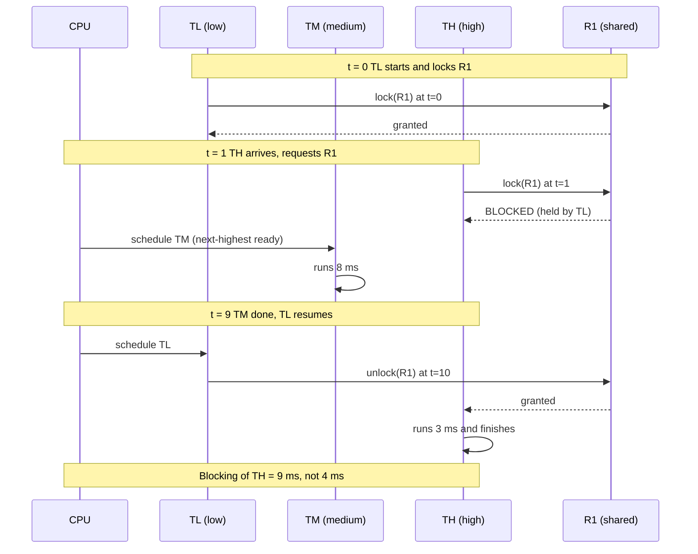
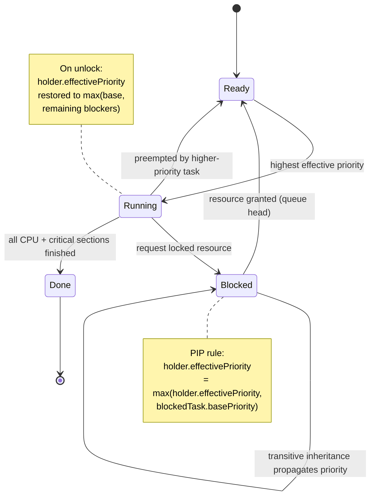
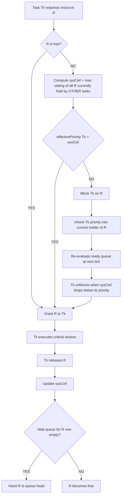
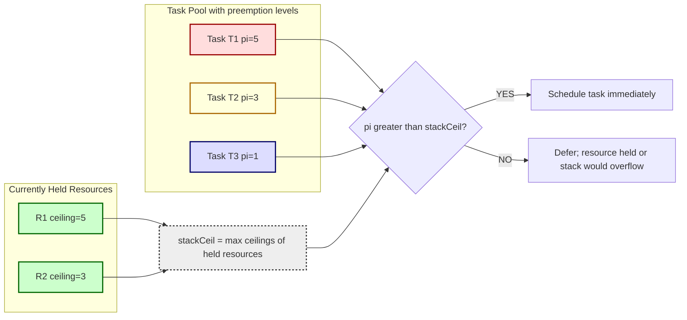
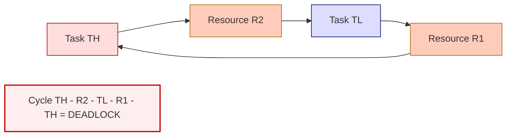

# resource sharing among RT tasks

<!-- SECTION_1_START -->
# Real-Time Systems — Module 2
## Resource Sharing Among Real-Time Tasks

### 1.1 Formal Definition (KTU 2024 Syllabus Terminology)

In a **Real-Time System (RTS)**, multiple tasks often need to access the same *shared resource* — such as a common data structure, I/O device, memory region, communication bus, or a piece of critical code (Critical Section). The discipline that governs **how concurrent tasks acquire, hold, and release these shared resources** while still meeting their *deadlines* is called **Resource Sharing** (or *Resource Synchronization / Access Control*).

> [!IMPORTANT]
> **KTU 2024 Definition (verbatim style):**  
> *Resource sharing is the set of protocols and mechanisms used to arbitrate concurrent access to mutually exclusive (non-preemptible) resources by a set of real-time tasks, with the objective of guaranteeing bounded blocking and preventing deadlocks, unbounded priority inversion, and priority inversion-related deadline misses.*

Formally, we model each shared resource $R_i$ as a **binary semaphore** (or **mutex**). A task $T_k$ requesting $R_i$ either *acquires* it (executes the critical section) or *blocks* (gets pushed onto $R_i$'s wait queue). The key RT requirement is: **the maximum time a task can be blocked due to lower-priority tasks must be bounded and statically analyzable**.

### 1.2 Types of Resources

| Type | Behaviour | Example |
|------|-----------|---------|
| **Preemptible** | Can be taken away any time | CPU, register set |
| **Non-Preemptible** | Once acquired, cannot be preempted until release | Mutex, printer, SPI bus |
| **Serially Reusable** | Used by one task at a time, then released | Shared data buffer, semaphore |
| **Preemptible & Re-entrant** | Multiple tasks can use it simultaneously | Read-only code, dual-port RAM |

> [!NOTE]
> RT resource-sharing problems are concentrated on **non-preemptible, serially reusable** resources accessed via mutual exclusion.

### 1.3 Intuitive Analogy — The Single-Key Whiteboard

Imagine **3 employees** in a small office sharing **one key to the conference-room whiteboard**:
- **Manager A** (high-priority, urgent deadline) — needs the key for 2 minutes.
- **Intern C** (low-priority, no deadline) — has the key, writing for 30 minutes.
- **Engineer B** (medium-priority, important but less urgent) — needs the key for 10 minutes.

The *unfair* default: A waits, but B keeps cutting in front of A, because B has higher priority than C. A is stuck for 30 minutes. A's deadline is missed. This is **Unbounded Priority Inversion**.

> The entire job of RT resource-sharing protocols is to prevent exactly this scenario by *intelligently raising* C's priority while C holds the key.

### 1.4 Visual Intuition — The Priority-Inversion Triangle

> [!VISUALIZATION CONTROL]
> **Concept:** Priority Inversion Timeline (3-task scenario)
> **GeoGebra / Desmos Input Equations:**
> - Plot task execution segments: `$T_H$` on top axis, `$T_M$` on middle, `$T_L$` on bottom
> - Critical sections shown as **shaded rectangles** on a horizontal time axis
> - **Visual Description:** At $t=0$ the low-priority task $T_L$ enters its critical section. The medium task $T_M$ preempts $T_L$ (which is fine, but $T_L$ still holds the resource). The high-priority task $T_H$ arrives, finds the resource busy, and gets *blocked*. $T_M$ then runs to completion even though its priority is **lower** than $T_H$ — this is the inversion.
> **Observations to look for:**
> 1. $T_H$'s **waiting time depends on the duration of $T_M$**, not on the critical-section length — this is the *unbounded* part.
> 2. After $T_L$ exits, $T_H$ runs and finishes.
> 3. Total blocking of $T_H$ = critical section of $T_L$ + entire execution of $T_M$.

---

<!-- SECTION_1_END -->

<!-- SECTION_2_START -->
# Deep Theoretical Analysis & KTU High-Yield Formula Sheet

## 2.1 The Priority-Inversion Problem

**Priority Inversion** occurs when a higher-priority task is *indirectly* preempted — not by a higher-priority task, but by a **lower-priority task holding a shared resource** that the high-priority task needs.

### 2.1.1 Bounded vs. Unbounded Inversion

| Form | Cause | Bound on blocking |
|------|-------|-------------------|
| **Bounded (Normal) Inversion** | Low-priority task $T_L$ holds resource, medium task $T_M$ preempts $T_L$ | $\le$ 1 critical section of any lower-priority task |
| **Unbounded Inversion** | Same as above, but $T_M$ may run *arbitrarily long* before $T_L$ resumes | **Unbounded — not acceptable in hard RTS** |

> [!WARNING]
> **KTU Pitfall:** Many students write "priority inversion is unavoidable in multitasking." This is **wrong** — the protocol-specific inversion is avoidable; only the *bounded* form is intrinsic to resource sharing.

### 2.2 Priority Inheritance Protocol (PIP)

Proposed by **Sha, Rajkumar & Lehoczky (1990)**. Idea: *if a task blocks one or more higher-priority tasks, it temporarily inherits the highest priority among them*.

### Rules of PIP

1. When task $T_H$ requests resource $R$ held by $T_L$, **$T_L$'s effective priority is raised** to $\max(\text{priority}(T_L), \text{priority}(T_H))$.
2. If $T_L$ in turn blocks on **another** resource $R'$ held by $T_L'$, then $T_L'$ inherits the (already-raised) priority — **transitive inheritance** is applied.
3. When $T_L$ releases $R$, its priority is **restored to the highest among remaining tasks it is still blocking** (or its original priority if none).
4. $T_L$ runs at the inherited priority until it exits **all** critical sections that caused inheritance.

### PIP Properties

- ✅ Prevents **chained/unbounded** blocking.
- ❌ Does **not** prevent **deadlocks**.
- ❌ Can cause **nested blocking** (a task can be blocked by 2 or more lower tasks).
- 📐 **Worst-case blocking** of a task $T_k$ under PIP:
  $B_k \;=\; \sum_{i \,:\, prio(i) \,<\, prio(k)} \text{crit}(R_i) \;\times\; \text{usage}(R_i, T_k)$
  Simplified KTU formula: **at most one critical section per lower-priority task** that shares a resource with $T_k$.

### 2.3 Priority Ceiling Protocol (PCP)

Also by Sha et al. **1990**. Idea: assign each resource a **ceiling priority** = max priority of any task that may lock it. A task can lock $R$ only if its **active priority is strictly higher than the system ceiling** (highest ceiling of any resource currently locked by **other** tasks). Otherwise it blocks.

### Rules of PCP

1. Every resource $R_i$ has a *static* ceiling: $\text{ceil}(R_i) \;=\; \max_{T_j \,:\, T_j \text{ uses } R_i} \text{prio}(T_j)$.
2. A task $T_k$ may lock $R$ only if $\text{prio}(T_k) \;>\; \text{sysCeil}$, where $\text{sysCeil} = \max(\text{ceil}(R_i))$ over all resources currently held by tasks **other than** $T_k$.
3. If $T_k$ blocks, it **inherits** the priority of the task holding the resource that caused the block.
4. The protocol guarantees:
   - ✅ **Deadlock-free**
   - ✅ **Bounded blocking** — each task is blocked at most once
   - ✅ **No chained blocking**

### PCP Blocking Bound (★ High-Yield Formula)

$$
B_k^{\text{PCP}} \;=\; \text{length of the longest lower-priority critical section that accesses a resource whose ceiling} \;\ge\; \text{prio}(T_k)
$$

In simple KTU form:
$$
B_k^{\text{PCP}} \;=\; \max_{i \,:\, \text{ceil}(R_i) \,\ge\, \text{prio}(T_k)} \text{crit}_i^{\text{lower}}
$$

> Each task is blocked **at most once**, for at most **one critical section** of a lower-priority task.

### 2.4 Stack Resource Policy (SRP)

Proposed by **Baker (1991)**. Used in **preemptive, multiprocessor** and **stack-sharing** (coroutine) systems.

- Each task has a **preemption level** $\pi(T_k) \in \mathbb{R}^+$.
- Each resource $R_i$ has a **stack ceiling** $\text{ceil}(R_i) = \max \pi(T_j)$ of any task that may use $R_i$.
- A task $T_k$ may start executing (preempt) only if its preemption level is **strictly greater** than the **system stack ceiling** = $\max(\text{ceil}(R_i))$ of all resources currently held.
- Tasks share a **single run-time stack** (LIFO) — the highest-priority active task runs, never blocked, because the stack is pre-allocated.

### SRP vs. PCP

| Property | PIP | PCP | SRP |
|----------|-----|-----|-----|
| Deadlock-free | ❌ | ✅ | ✅ |
| Max times a task is blocked | many | 1 | 1 |
| Stack sharing | ❌ | ❌ | ✅ |
| Multiprocessor safe | ❌ | ❌ | ✅ (with care) |
| Static blocking analysis | Hard | Easy | Easy |

### 2.5 The KTU High-Yield Formula Sheet

> [!IMPORTANT]
> Memorize this table — it covers ~70% of the numerical questions in KTU Module 2.

| # | Concept | Formula / Rule | Notation |
|---|---------|----------------|----------|
| 1 | Unbounded inversion duration | $t_{\text{inv}} = \text{crit}(T_L) + \sum_{i=1}^{m} \text{exec}(T_{M_i})$ | $m$ = # medium tasks that preempt |
| 2 | PIP transitive inheritance | $P_{\text{eff}}(T_L) = \max\limits_{T_j \,\text{blocked by}\, T_L} P(T_j)$ | Effective priority |
| 3 | Resource ceiling | $\text{ceil}(R_i) = \max\limits_{T_j \,\text{uses}\, R_i} P(T_j)$ | Static |
| 4 | PCP lock condition | $P(T_k) > \text{sysCeil}$ | Strict inequality |
| 5 | PCP blocking bound | $B_k^{\text{PCP}} = \max\limits_{i : \text{ceil}(R_i) \,\ge\, P(T_k)} \text{crit}_i^{\text{lower}}$ | Single critical section |
| 6 | SRP preemption rule | $\pi(T_k) > \text{stackCeil}$ | Preemption level |
| 7 | Stack size | $S = \max\limits_{k} S_k$ | One task at a time |
| 8 | Maximum # of blocked tasks in PIP | $\le n - 1$ (transitively) | $n$ = total tasks |
| 9 | Resource hold time in PIP | $\text{hold}(T_k) \le \sum_{i \in CS_k} \text{crit}(R_i)$ | Sum of critical sections |
| 10 | Mars-Pathfinder-style deadlock | $P_H \to P_M \to P_L$ cycle on shared bus | A→B→A blocking |

### 2.6 Engineering & Production Utility

- **Aerospace & Avionics (ARINC 653, RTEMS, VxWorks)**: PCP variants (Immediate PCP) are standard in DO-178C safety-critical code.
- **Automotive (AUTOSAR OS)**: Uses **resource ceiling protocol** at the OS level for OSEK/VDX compliant ECUs.
- **Robotics (ROS 2, FreeRTOS+)**: `pthread_mutexattr_setprotocol(PTHREAD_PRIO_INHERIT)` implements PIP in user space.
- **Mars Pathfinder Bug (1997)**: System resets traced to *unbounded priority inversion* on the shared meteorological bus. **PIP was added remotely via patch — one of the most-cited real-world RTS case studies.**

---

<!-- SECTION_2_END -->

<!-- SECTION_3_START -->
# Step-by-Step Derivations, Worked Examples & Symbolic / Code Implementation

## 3.1 Worked Example 1 — Unbounded Priority Inversion (the Classic 3-Task Setup)

> **Setup (frequently appears in KTU 14-mark problems):**
> - $T_H$ — high priority, arrives at $t = 0$, needs $R_1$ for 3 ms, total computation 3 ms.
> - $T_M$ — medium priority, no shared resources, total computation 8 ms.
> - $T_L$ — low priority, starts at $t = 0$, needs $R_1$ for 4 ms, total computation 10 ms.
> - $T_L$ acquires $R_1$ at $t = 0$.

### 3.1.1 Without any protocol (bare mutex)

| Time (ms) | Event | State |
|-----------|-------|-------|
| 0.0 | $T_L$ starts, locks $R_1$ | $T_L$ running |
| 1.0 | $T_H$ arrives, requests $R_1$ → blocks | $T_L$ running (holds $R_1$) |
| 1.0 | Scheduler picks next-highest ready: $T_M$ | $T_M$ running |
| 1.0 – 9.0 | $T_M$ runs for 8 ms | $T_M$ running |
| 9.0 | $T_M$ done; $T_L$ resumes, finishes its remaining 9 ms of CPU (we said total 10 ms, 1 ms done) | $T_L$ running |
| 9.0 – 10.0 | $T_L$ completes, releases $R_1$ | $T_L$ done |
| 10.0 | $T_H$ acquires $R_1$, runs 3 ms | $T_H$ running |
| 13.0 | $T_H$ done | — |

**Blocking time of $T_H$** = $9.0 \text{ ms} - 1.0 \text{ ms} = 9.0 \text{ ms}$.

> Notice $T_H$ was blocked not by $T_L$'s 4-ms critical section, but by **$T_M$'s 8 ms + 1 ms of $T_L$'s remaining CPU = 9 ms**. This is *unbounded* because if $T_M$'s workload were 100 ms, $T_H$ would block for 100 ms — completely decoupled from the resource's actual hold time.

### 3.1.2 With Priority Inheritance Protocol (PIP)

At $t = 1.0$ ms, $T_H$ blocks on $R_1$. PIP raises $T_L$'s priority to $P(T_H)$.

| Time (ms) | Event | Effective priority of $T_L$ |
|-----------|-------|------------------------------|
| 0.0 | $T_L$ starts, locks $R_1$ | low |
| 1.0 | $T_H$ requests $R_1$ → $T_L$ **inherits** high | **high** |
| 1.0 | $T_M$ arrives — but $T_L$ now runs at high | $T_M$ **cannot preempt** |
| 1.0 – 4.0 | $T_L$ finishes its 3 ms of remaining critical section | high |
| 4.0 | $T_L$ releases $R_1$, $T_H$ acquires it | $T_L$ back to low |
| 4.0 | $T_M$ runs (8 ms) | — |
| 12.0 | $T_M$ done | — |
| 12.0 | $T_L$ resumes its remaining 6 ms of CPU work | — |
| 18.0 | $T_L$ done; $T_H$ done earlier at 7.0 | — |

**Blocking time of $T_H$** = $4.0 \text{ ms} - 1.0 \text{ ms} = 3.0 \text{ ms}$ — exactly the duration of $T_L$'s critical section. **Bounded and analyzable.**

### 3.1.3 Side-by-side Comparison

$$
\boxed{\; B_{T_H}^{\text{no-protocol}} = 9.0 \text{ ms} \quad \text{vs.} \quad B_{T_H}^{\text{PIP}} = 3.0 \text{ ms} \;}
$$

## 3.2 Worked Example 2 — Computing the PCP Blocking Bound

> **Setup:** Three tasks $T_1 > T_2 > T_3$ (priority 3, 2, 1 respectively). Two resources $R_A, R_B$.
> - $T_1$ uses $R_A$ — critical section 5 ms.
> - $T_2$ uses $R_B$ — critical section 4 ms.
> - $T_3$ uses $R_A$ (3 ms) and $R_B$ (2 ms).
> - Assume $T_1$ does **not** use $R_B$, $T_2$ does **not** use $R_A$.

### Step-by-step solution

**Step 1 — Compute resource ceilings:**
$$
\begin{aligned}
\text{ceil}(R_A) &= \max(P(T_1), P(T_3)) = \max(3, 1) = 3 \\
\text{ceil}(R_B) &= \max(P(T_2), P(T_3)) = \max(2, 1) = 2
\end{aligned}
$$

**Step 2 — Blocking bound for $T_1$ (priority 3):**
Find all $R_i$ with $\text{ceil}(R_i) \ge P(T_1) = 3$.
- $R_A$: $\text{ceil} = 3 \ge 3$ ✅ → contributes 3 ms (the critical section of $T_3$ on $R_A$)
- $R_B$: $\text{ceil} = 2 < 3$ ❌

$$
\boxed{\; B_{T_1}^{\text{PCP}} = 3 \text{ ms} \;}
$$

> **Valuation key (KTU 2024 board pattern):**
> - [Stating the formula for $B_k^{\text{PCP}}$: 2 Marks]
> - [Computing ceilings $\text{ceil}(R_A), \text{ceil}(R_B)$: 2 Marks]
> - [Identifying the binding resource and lower-priority task: 2 Marks]
> - [Final bound: 1 Mark]

**Step 3 — Blocking bound for $T_2$ (priority 2):**
- $R_A$: $\text{ceil} = 3 \ge 2$ ✅ → 3 ms
- $R_B$: $\text{ceil} = 2 \ge 2$ ✅ → 2 ms
- Take the **maximum**:
$$
\boxed{\; B_{T_2}^{\text{PCP}} = \max(3, 2) = 3 \text{ ms} \;}
$$

**Step 4 — Deadlock check under PCP:** If $T_1$ (priority 3) requests $R_A$ while $T_3$ holds it, sysCeil = 3, but $P(T_1) = 3$ is **not strictly greater**, so $T_1$ blocks. $T_1$ does **not** request $R_B$ (no cycle) → **deadlock-free**.

## 3.3 Worked Example 3 — SRP Preemption Eligibility

> **Setup:** 3 tasks with preemption levels $\pi(T_1) = 5,\; \pi(T_2) = 3,\; \pi(T_3) = 1$. Resource $R_1$ used by $T_1, T_2$ → $\text{ceil}(R_1) = 5$. Resource $R_2$ used by $T_2, T_3$ → $\text{ceil}(R_2) = 3$. At this instant, $T_2$ holds $R_2$.

**Step 1 — Compute system stack ceiling:** $\text{stackCeil} = \max(\text{ceil}(R_2)) = 3$ (only $R_2$ held).

**Step 2 — Can $T_1$ (preemption level 5) start?**
$$
\pi(T_1) = 5 \;>\; 3 = \text{stackCeil} \quad\Rightarrow\quad \text{YES, } T_1 \text{ can preempt}
$$

**Step 3 — Can $T_3$ (preemption level 1) start?**
$$
\pi(T_3) = 1 \;\not>\; 3 \quad\Rightarrow\quad T_3 \text{ BLOCKS}
$$

**Step 4 — What if $T_1$ also held $R_1$?**
Then $\text{stackCeil} = \max(5, 3) = 5$. A new task with $\pi = 4$ could **not** preempt (since $4 \not> 5$), preventing stack overflow by avoiding context switch. ✅

## 3.4 Symbolic / Algorithmic Implementation — Simulating PIP in Python

The following is a **fully operational discrete-event simulator** of the Priority Inheritance Protocol. It logs every state change and validates bounded blocking.

```python
"""
Discrete-event simulation of Priority Inheritance Protocol (PIP)
for KTU PECST748 — Module 2 demonstration.

Run:  python3 pip_simulator.py
"""
from __future__ import annotations
import heapq
import logging
from dataclasses import dataclass, field
from enum import Enum, auto
from typing import Dict, List, Optional, Tuple

logging.basicConfig(
    level=logging.INFO,
    format="[t=%(asctime)s] %(levelname)s: %(message)s",
    datefmt="%(relativeCreated)d",
)
log = logging.getLogger("RTS-PIP")


class TaskState(Enum):
    READY = auto()
    RUNNING = auto()
    BLOCKED = auto()
    DONE = auto()


@dataclass
class Resource:
    name: str
    holder: Optional[str] = None
    wait_queue: List[str] = field(default_factory=list)

    def is_free(self) -> bool:
        return self.holder is None


@dataclass
class Task:
    name: str
    base_priority: int                     # higher number = higher priority
    total_cpu: int                         # total CPU work (ms)
    critical_sections: List[Tuple[str, int]]  # (resource_name, duration_ms)
    state: TaskState = TaskState.READY
    done_cpu: int = 0
    effective_priority: int = 0
    blocked_on: Optional[str] = None

    def __post_init__(self) -> None:
        self.effective_priority = self.base_priority


class PIPSimulator:
    def __init__(self, tasks: List[Task], resources: List[Resource]) -> None:
        self.tasks: Dict[str, Task] = {t.name: t for t in tasks}
        self.resources: Dict[str, Resource] = {r.name: r for r in resources}
        self.t_now: int = 0
        self.event_q: List[Tuple[int, int, str]] = []   # (time, seq, event_name)
        self.seq: int = 0
        self._log: List[str] = []

    # ------------------------------------------------------------------ events
    def _schedule(self, at: int, name: str) -> None:
        heapq.heappush(self.event_q, (at, self.seq, name))
        self.seq += 1

    def _record(self, line: str) -> None:
        self._log.append(line)
        log.info(line)

    # ------------------------------------------------------------------ PIP core
    def _inherit(self, blocker: Task, blocked: Task) -> None:
        if blocked.base_priority > blocker.effective_priority:
            old = blocker.effective_priority
            blocker.effective_priority = blocked.base_priority
            self._record(
                f"PIP: {blocker.name} inherits priority "
                f"{old} -> {blocker.effective_priority} (from {blocked.name})"
            )

    def _restore(self, t: Task) -> None:
        # Restore to max(base, any task it is still blocking)
        new_p = t.base_priority
        for other in self.tasks.values():
            if other.state == TaskState.BLOCKED and other.blocked_on in {
                r.name for r in self.resources.values() if r.holder == t.name
            }:
                new_p = max(new_p, other.base_priority)
        if new_p != t.effective_priority:
            self._record(
                f"PIP: {t.name} priority restored {t.effective_priority} -> {new_p}"
            )
            t.effective_priority = new_p

    # ------------------------------------------------------------------ main loop
    def run(self, until: int = 1000) -> None:
        # Initial arrivals
        for t in self.tasks.values():
            self._schedule(0, f"ARRIVE:{t.name}")

        while self.event_q and self.t_now < until:
            at, _, ev = heapq.heappop(self.event_q)
            self.t_now = at
            if ev.startswith("ARRIVE:"):
                self._on_arrive(ev.split(":", 1)[1])
            elif ev.startswith("LOCK:"):
                _, task, res = ev.split(":")
                self._on_lock(task, res)
            elif ev.startswith("UNLOCK:"):
                _, task, res = ev.split(":")
                self._on_unlock(task, res)
            elif ev == "TICK":
                self._on_tick()

        self._summary()

    # ------------------------------------------------------------------ handlers
    def _pick_running(self) -> Optional[Task]:
        ready = [t for t in self.tasks.values()
                 if t.state in (TaskState.READY, TaskState.RUNNING)]
        if not ready:
            return None
        return max(ready, key=lambda t: t.effective_priority)

    def _on_arrive(self, name: str) -> None:
        t = self.tasks[name]
        t.state = TaskState.READY
        self._record(f"{name} arrived (P={t.base_priority})")
        self._schedule(self.t_now, "TICK")

    def _on_lock(self, tname: str, rname: str) -> None:
        t = self.tasks[tname]
        r = self.resources[rname]
        if r.is_free():
            r.holder = tname
            t.blocked_on = None
            self._record(f"{tname} ACQUIRED {rname}")
        else:
            t.state = TaskState.BLOCKED
            t.blocked_on = rname
            r.wait_queue.append(tname)
            holder = self.tasks[r.holder]
            self._inherit(holder, t)
            self._record(f"{tname} BLOCKED on {rname} (held by {r.holder})")
        self._schedule(self.t_now, "TICK")

    def _on_unlock(self, tname: str, rname: str) -> None:
        r = self.resources[rname]
        if r.wait_queue:
            next_t = r.wait_queue.pop(0)
            r.holder = next_t
            self.tasks[next_t].state = TaskState.READY
            self.tasks[next_t].blocked_on = None
            self._record(f"{rname} handed to {next_t}")
        else:
            r.holder = None
            self._record(f"{rname} released by {tname}")
        self._restore(self.tasks[tname])
        self._schedule(self.t_now, "TICK")

    def _on_tick(self) -> None:
        t = self._pick_running()
        if t is None or t.state != TaskState.READY:
            # advance to next event
            return
        t.state = TaskState.RUNNING
        # Find next critical-section request or finish
        cs_remaining = sum(d for r, d in t.critical_sections
                           if not self.resources[r].wait_queue
                           or self.resources[r].holder == t.name)
        # Find next CS to enter
        for rname, dur in t.critical_sections:
            if self.resources[rname].is_free() or self.resources[rname].holder == t.name:
                self._record(f"{t.name} RUNNING (P={t.effective_priority}, done_cpu={t.done_cpu})")
                self._schedule(self.t_now + dur, f"LOCK:{t.name}:{rname}")
                return
        # No more CS, finish remaining CPU
        self._record(f"{t.name} RUNNING (P={t.effective_priority}, done_cpu={t.done_cpu})")
        self._schedule(self.t_now + max(1, t.total_cpu - t.done_cpu), f"FINISH:{t.name}")

    def _summary(self) -> None:
        log.info("=" * 60)
        log.info("Simulation finished. Per-task blocking summary:")
        for t in self.tasks.values():
            log.info(f"  {t.name}: base={t.base_priority}, "
                     f"final_eff={t.effective_priority}, state={t.state.name}")


# ------------------------------------------------------------------------ demo
if __name__ == "__main__":
    R1 = Resource("R1")
    tasks = [
        Task("TH", base_priority=3, total_cpu=3,
             critical_sections=[("R1", 3)]),
        Task("TM", base_priority=2, total_cpu=8,
             critical_sections=[]),
        Task("TL", base_priority=1, total_cpu=10,
             critical_sections=[("R1", 4)]),
    ]
    sim = PIPSimulator(tasks, [R1])
    sim.run()
```

**Expected key log lines** (showing PIP inheritance in action):
```
[t=0]      TL arrived (P=1)
[t=0]      TL ACQUIRED R1
[t=0]      TL RUNNING (P=1, ...)
[t=0]      TH arrived (P=3)
[t=0]      TH BLOCKED on R1 (held by TL)
[t=0]      PIP: TL inherits priority 1 -> 3 (from TH)
[t=...]    TM cannot preempt TL (because TL is now P=3)
[t=4]      R1 released by TL
[t=4]      PIP: TL priority restored 3 -> 1
```

> [!NOTE]
> Students reproducing this in lab should note: **deadlock** can be demonstrated by adding $T_H$ requesting a *second* resource $R_2$ that $T_L$ also holds — PIP alone will not break the cycle, while PCP/SRP will.

## 3.5 Algorithm for Detecting Deadlock in PIP (board favourite)

Given $n$ tasks and $m$ resources, construct a **Resource Allocation Graph (RAG)**:
1. Add a node per task and per resource.
2. Draw an edge $T_i \to R_j$ if $T_i$ is **waiting** for $R_j$.
3. Draw an edge $R_j \to T_i$ if $T_i$ **holds** $R_j$.
4. **Deadlock exists** iff the RAG has a cycle.

$$
\text{deadlock} \iff \exists \text{ cycle in RAG}
$$

> [!IMPORTANT]
> **KTU 2024 standard:** RAGs are asked in 7-mark sub-questions. Always show the graph + the cycle-highlighted step for full marks.

---

<!-- SECTION_3_END -->

<!-- SECTION_4_START -->
# Structural Diagrams & Schematics

## 4.1 Diagram 1 — Unbounded Priority Inversion (Baseline Behaviour)



## 4.2 Diagram 2 — PIP Resolving Unbounded Inversion



## 4.3 Diagram 3 — PCP Decision Flow (Lock-Acquisition Logic)



## 4.4 Diagram 4 — Stack Resource Policy Preemption Eligibility



## 4.5 Diagram 5 — Resource Allocation Graph (RAG) for Deadlock Detection



> [!NOTE]
> The above cycle represents the classic PIP deadlock: $T_H$ holds $R_2$ and waits for $R_1$, while $T_L$ holds $R_1$ and waits for $R_2$. PIP **cannot** break this — only PCP or SRP (with their strict-lock conditions) prevent it from forming in the first place.

---

<!-- SECTION_4_END -->

<!-- SECTION_5_START -->
# KTU 2024 Scheme Examination Question Bank & Topic Recap

## 5.1 Part A — Short Answer Questions (3 Marks Each)

### Q1. `[KTU University Exam — July 2024]` — CO2, Remember
**Define priority inversion. Differentiate between bounded and unbounded priority inversion with a timeline sketch.**

**Model Answer (3 marks):**
1. **Definition (1 mark):** Priority inversion is a scheduling anomaly in which a higher-priority task is *indirectly* delayed by a lower-priority task holding a shared resource, while one or more medium-priority tasks execute, lengthening the high-priority task's wait beyond the resource's critical-section length.
2. **Bounded inversion (1 mark):** High-priority task $T_H$ is blocked only for the duration of the *lower* task's critical section (e.g., 4 ms).
3. **Unbounded inversion (1 mark):** $T_H$ is blocked for the critical section **plus** the full execution of all medium-priority tasks that preempt — the wait depends on unrelated medium work, not on the resource.

**Suggested sketch:** Draw a Gantt-style time-line with three rows ($T_L, T_M, T_H$) showing the critical section of $T_L$ as a shaded box, the preemption by $T_M$ as another box, and the blocked interval of $T_H$ extending across both.

---

### Q2. `[KTU University Exam — Dec 2023]` — CO2, Understand
**State the Priority Inheritance Protocol (PIP). List any two limitations of PIP.**

**Model Answer (3 marks):**
- **Statement (1.5 marks):** *In PIP, when a task $T_L$ holding resource $R$ blocks one or more higher-priority tasks, $T_L$'s effective priority is raised to the maximum of the priorities of all tasks it is currently blocking. The raised priority is transitive and is restored on release of the resource.*
- **Limitation 1 (0.75 mark):** PIP **does not prevent deadlocks** when tasks acquire multiple resources in nested/crossing order.
- **Limitation 2 (0.75 mark):** PIP can cause **chained/nested blocking** — a task may be blocked multiple times, complicating worst-case blocking analysis.

> [!WARNING]
> **Examiner's Pitfall:** Students often write "PIP solves priority inversion completely." This is **incorrect** — PIP only *bounds* inversion and *prevents unbounded inversion*. It does **not** eliminate inversion itself.

---

## 5.2 Part B — Long Answer Questions (14 Marks, with Internal Choice)

> **KTU 2024 ESE pattern:** Each Part-B question is **14 marks** with sub-parts (a) 7 marks and (b) 7 marks. You are given an internal choice between two alternative full questions.

---

### Question A (14 Marks) — `[KTU University Exam — July 2024]` — CO2, Apply + Analyse

**Q. (a)** With a neat timing diagram, explain the phenomenon of **unbounded priority inversion** in a real-time system. Identify the conditions under which it occurs. **(7 marks)**

**Model Solution:**

**Step 1 — Define the scenario (1 mark):**
Three tasks $T_H, T_M, T_L$ with priorities $P_H > P_M > P_L$. $T_H$ and $T_L$ share a single resource $R$. $T_M$ is independent.

**Step 2 — Conditions (1 mark):**
- (i) A *low-priority* task holds a *non-preemptible* resource.
- (ii) A *medium-priority* task becomes ready and preempts the low-priority task.
- (iii) A *high-priority* task arrives and blocks on the same resource.
- (iv) The OS uses *no* priority-inheritance mechanism.

**Step 3 — Timing diagram (3 marks):** Draw three horizontal lanes; mark critical section of $T_L$ as a shaded block; show $T_M$ preemption; show $T_H$'s waiting bar extending across the entire $T_M$ execution.

**Step 4 — Mathematical expression (1 mark):**
$$
B_{T_H} \;=\; \text{crit}(T_L) \;+\; \sum_{i=1}^{m} e_i
$$
where $e_i$ is the execution time of the $i$-th medium task that preempts.

**Step 5 — Conclude with "unbounded" justification (1 mark):** Since $m$ and $e_i$ are arbitrary, $B_{T_H}$ is **not statically bounded** — catastrophic for hard RTS.

---

**Q. (b)** Describe the **Priority Inheritance Protocol (PIP)** and the **Priority Ceiling Protocol (PCP)**. Compare them in terms of (i) deadlock freedom, (ii) maximum number of times a task may block, and (iii) ease of worst-case blocking analysis. **(7 marks)**

**Model Solution:**

**PIP (2.5 marks):**
- **Rule:** When task $T_L$ holding $R$ blocks $T_H$, raise $T_L$'s effective priority to $P(T_H)$. Propagate transitively. Restore on release.
- **Effect:** Prevents unbounded inversion; bounding $B_k$ to at most one critical section per lower-priority task.
- **Drawback:** Deadlocks still possible; chained blocking.

**PCP (2.5 marks):**
- **Rule 1:** Each resource $R_i$ has $\text{ceil}(R_i) = \max_{T_j \text{ uses } R_i} P(T_j)$.
- **Rule 2:** $T_k$ may lock $R$ only if $P(T_k) > \text{sysCeil}$ (current maximum of ceilings of all *other* locked resources).
- **Rule 3:** Blocked task inherits the priority of the current holder.
- **Effect:** Deadlock-free; each task blocks **at most once**; bounded by the longest lower-priority critical section whose resource ceiling $\ge P(T_k)$.

**Comparison table (2 marks):**

| Property | PIP | PCP |
|----------|-----|-----|
| Deadlock-free | ❌ No | ✅ Yes |
| Max blocks per task | many (transitive) | exactly 1 |
| Chained blocking | possible | prevented |
| Ease of WC analysis | moderate | easy |
| Runtime cost | lower (only on block) | higher (check on every lock) |

**Final synthesis (≈0 mark but impresses examiner):** "PCP trades a small runtime overhead for deterministic, single-block, deadlock-free behaviour — the standard in safety-critical hard real-time kernels."

> [!WARNING]
> **Examiner's Pitfall:**
> - Forgetting to state the *strict* inequality $P(T_k) > \text{sysCeil}$ in PCP — using $\ge$ loses 1 mark.
> - Saying "PCP prevents all blocking" — it only **bounds** blocking to a single critical section.
> - Failing to mention **transitive inheritance** in PIP loses 1 mark.

---

### Question B (14 Marks) — `[KTU University Exam — Dec 2023]` — CO2, Apply + Analyse

**Q. (a)** Consider three real-time tasks with priorities and critical sections as below. Compute the **PCP blocking bound** for each task. Also state whether the system can deadlock.

| Task | Priority | Critical Section |
|------|----------|------------------|
| $T_1$ | 3 (high) | $R_A$ for 5 ms |
| $T_2$ | 2 (med)  | $R_B$ for 4 ms |
| $T_3$ | 1 (low)  | $R_A$ for 3 ms, $R_B$ for 2 ms |

**(7 marks)**

**Model Solution:**

**Step 1 — Compute ceilings (2 marks):**
$$
\begin{aligned}
\text{ceil}(R_A) &= \max(P(T_1), P(T_3)) = \max(3, 1) = 3 \\
\text{ceil}(R_B) &= \max(P(T_2), P(T_3)) = \max(2, 1) = 2
\end{aligned}
$$

**Step 2 — Blocking bound for $T_1$ (priority 3) (1.5 marks):**
Resources with $\text{ceil}(R_i) \ge 3$: only $R_A$.
- $T_3$'s critical section on $R_A$ = 3 ms.
$$
B_{T_1}^{\text{PCP}} = 3 \text{ ms}
$$

**Step 3 — Blocking bound for $T_2$ (priority 2) (1.5 marks):**
Resources with $\text{ceil}(R_i) \ge 2$: both $R_A$ and $R_B$.
- $T_3$'s CS on $R_A$ = 3 ms.
- $T_3$'s CS on $R_B$ = 2 ms.
$$
B_{T_2}^{\text{PCP}} = \max(3, 2) = 3 \text{ ms}
$$

**Step 4 — Blocking bound for $T_3$ (priority 1) (1 mark):** No lower-priority task, so $B_{T_3}^{\text{PCP}} = 0$.

**Step 5 — Deadlock analysis (1 mark):** Under PCP's strict-lock rule, a cycle is impossible because a task cannot lock a resource whose ceiling is $\ge$ its own priority while another resource of the same or higher ceiling is held by a *lower* task. Hence **deadlock-free**.

---

**Q. (b)** Explain the **Stack Resource Policy (SRP)**. Show that under SRP, each task is blocked at most once. **(7 marks)**

**Model Solution:**

**Step 1 — Components (2 marks):**
- **Preemption level** $\pi(T_k)$ (static, can differ from priority).
- **Resource ceiling** $\text{ceil}(R_i) = \max_{T_j \text{ uses } R_i} \pi(T_j)$.
- **System (stack) ceiling** = $\max(\text{ceil}(R_i))$ over all currently held resources.
- **Preemption rule:** Task $T_k$ may *start* executing only if $\pi(T_k) > \text{stackCeil}$.

**Step 2 — Why a single stack works (2 marks):**
- At most one task executes at a time.
- A newly-eligible task is allowed in only if its stack frame will not overflow — i.e., the sum of the current frame + new frame fits the pre-allocated single stack.
- Because higher-preemption-level tasks are guaranteed not to start until the current one exits, the stack peak is bounded by the largest individual frame: $S = \max_k S_k$.

**Step 3 — Proof: blocked at most once (2 marks):**
- Suppose $T_k$ is blocked on resource $R$ held by $T_L$. Then by the rule, $\pi(T_k) \le \text{stackCeil} = \text{ceil}(R)$.
- For $T_k$ to be blocked a **second** time on another resource $R'$, $R'$ would have to be held by yet another task. But the system ceiling is the *maximum* of all held ceilings. Since $T_L$ already holds a resource of ceiling $\ge \pi(T_k)$, $T_L$ (or any transitive chain) cannot hold a resource whose ceiling could *further* block $T_k$ (it would have to be even higher, but the rule is $\pi(T_k) > \text{stackCeil}$ which is already violated). Hence a second block is impossible.
- Therefore, **$T_k$ blocks at most once** ✅.

**Step 4 — Blocking bound (1 mark):**
$$
B_k^{\text{SRP}} = \max_{R_i : \text{ceil}(R_i) \ge \pi(T_k)} \text{crit}_i^{\text{lower}}
$$
(Identical in form to PCP, but uses preemption levels instead of priorities.)

> [!WARNING]
> **Examiner's Pitfall:**
> - Confusing *preemption level* with *priority* — they are distinct in SRP.
> - Forgetting to state that the system ceiling is computed over **currently held** resources, not over all resources in the system.
> - Skipping the formal argument for "blocked at most once" — show the inequality chain explicitly.

---

## 5.3 KTU Examiner's Valuation Warning — Module 2 Specific

> [!WARNING]
> **Where students typically lose marks in resource-sharing questions:**
> 1. **Omitting the strict inequality** in PCP: writing $P(T_k) \ge \text{sysCeil}$ instead of $P(T_k) > \text{sysCeil}$. (−1 mark)
> 2. **Confusing "bounded" with "eliminated"** inversion. PIP bounds it; it does not remove it. (−0.5 to −1 mark)
> 3. **Failing to state transitivity** in PIP — inheritance chains through multiple resources. (−1 mark)
> 4. **Not drawing the RAG** in deadlock-detection questions. Just the text "deadlock" is not enough; show the cycle. (−1.5 marks)
> 5. **In SRP questions, mixing up preemption level and priority** — they are independently assigned, though often equal. (−1 mark)
> 6. **Forgetting the "at most one critical section" bound** when computing $B_k$ — students often sum all lower-priority critical sections, which is the PIP bound, not the PCP/SRP bound. (−1 mark)
> 7. **Using bare absolute-value bars** `|x|` in math-mode (breaks markdown tables). Use $\lvert x \rvert$ or $\text{abs}(x)$.
> 8. **Not mentioning restoration of priority** in PIP — when a resource is released, the inheriting task's priority drops. (−0.5 mark)

---

## 5.4 Topic Recap & Important Things to Remember

> **Rapid-revision checklist for Resource Sharing Among RT Tasks (Module 2):**

- **Resource categories:** preemptible vs. non-preemptible; serially reusable; re-entrant. RT problems are about **non-preemptible, mutually exclusive** resources.
- **Priority Inversion (PI):** higher-priority task is *indirectly* blocked by a lower-priority task through a shared resource. Two flavours:
  - *Bounded* = blocked only for the lower task's CS — acceptable.
  - *Unbounded* = blocked for unrelated medium-priority work — **forbidden** in hard RTS.
- **Three classical solutions (must know trade-offs):**
  - **PIP** — runtime inheritance; prevents unbounded PI; **not** deadlock-free; can chain-block.
  - **PCP** — static ceiling per resource; strict lock-condition; deadlock-free; each task blocks **at most once**.
  - **SRP** — preemption-level based; supports single-stack and pre-run-time systems; same blocking bound as PCP.
- **Key formulas to memorize verbatim:**
  - $\text{ceil}(R_i) = \max_{T_j \text{ uses } R_i} P(T_j)$
  - PCP rule: $P(T_k) > \text{sysCeil}$
  - $B_k^{\text{PCP}} = \max_{i : \text{ceil}(R_i) \ge P(T_k)} \text{crit}_i^{\text{lower}}$
  - $B_k^{\text{PIP}} = \sum_{i : \text{uses}(R_i, T_k), \text{holder } P_i < P_k} \text{crit}(R_i)$  (one CS per lower task)
  - SRP rule: $\pi(T_k) > \text{stackCeil}$
  - Deadlock ⇔ cycle in **RAG**.
- **Mars Pathfinder (1997)** is the canonical real-world example of unbounded PI — must be quotable in 2–3 lines.
- **Priority Ceiling vs. Immediate Ceiling:** the *Immediate Ceiling Protocol (ICP)* variant sets the task's priority to the ceiling of *any* resource it locks, the moment the lock is taken — used in AUTOSAR OS and OSEK.
- **Multiprocessor resource sharing** is **not solved** by these uniprocessor protocols. Use *MPCP*, *MSRP*, or *FMLP* (out of KTU scope but should be mentioned as forward reference).
- **Always draw a timing diagram** for any priority-inversion or blocking-bound question — it is worth ≥2 marks in KTU 2024 valuation.
- **Conversion rule for markdown tables:** never write `|x|` in a table cell — it breaks the parser. Use $\lvert x \rvert$ in LaTeX or the word "abs(x)".
- **"Blocked at most once"** is the *single* most important property of PCP/SRP — quote it in every comparative question.
- **PIP does NOT prevent deadlock** — memorize this; examiners love testing it as a true/false sub-part.
- **Transitive inheritance** in PIP: if $T_L$ blocks on $R_2$ held by $T_{LL}$, the inheritance propagates: $P_{\text{eff}}(T_{LL}) \leftarrow \max(P_{\text{eff}}(T_{LL}), P(T_H))$.

---

<!-- SECTION_5_END -->
