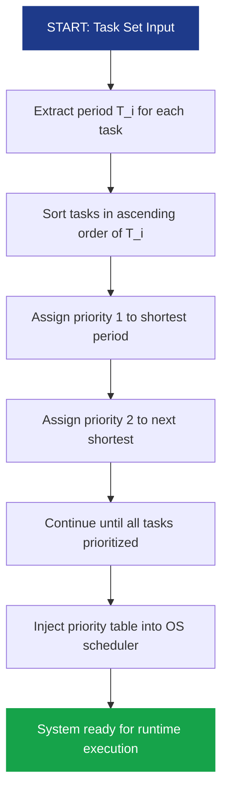
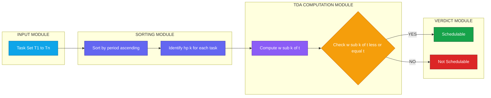
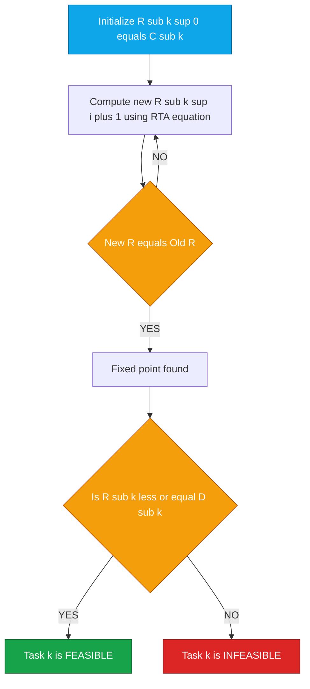

# RMA

<!-- SECTION_1_START -->
# Rate Monotonic Algorithm (RMA) — Core Definition & Intuition

## 1.1 Formal Academic Definition

> [!IMPORTANT]
> **Rate Monotonic Algorithm (RMA)** is a **static (fixed) priority preemptive scheduling policy** for hard real-time periodic task systems, formally defined by **Liu & Layland (1973)**. Under RMA, each periodic task $\tau_i$ is assigned a **fixed, unique priority** that is a **monotonically non-increasing function of its period** $T_i$ — i.e., a task with a **shorter period receives a higher priority**, and priorities are **statically assigned at design time** (no runtime migration of priority).

**RMA Assumptions (RMA Task Model):**
- Tasks are **periodic** with period $T_i$.
- All tasks are **independent** (no shared resources / no precedence).
- **Relative deadline equals period**: $D_i = T_i$ (constrained-deadline task set).
- **Zero phasing** (all tasks released simultaneously at $t = 0$).
- **Preemptive** kernel; **zero context-switch and scheduling overhead**.
- **Deterministic worst-case execution time (WCET)** $C_i$ is known a priori.

> [!NOTE]
> **KTU 2024 Syllabus Anchor (PECST748 / Module 2):** RMA is treated as the *canonical fixed-priority baseline algorithm* against which all other real-time scheduling algorithms (EDF, LLF, DM, etc.) are compared. Examiners expect students to remember Liu & Layland's *utilization bound theorem* and the *critical instant theorem* verbatim.

---

## 1.2 Conceptual Analogy & Geometric Intuition

**Real-World Analogy — "The Hospital Triage Ward"**
Imagine a hospital emergency ward. Patients arrive at fixed intervals (the *period*). The doctor treats one patient at a time (*single processor*). Now, the hospital's policy is: **"The patient who checks in most frequently gets seen first."** Why? Because if a patient comes every 20 minutes, missing them by even 5 minutes is catastrophic. But a patient who checks in every 6 hours can tolerate a 30-minute wait. The "rate of arrival" determines the "urgency of attention." That is exactly what RMA does — **higher frequency = higher priority**.

**Geometric / Mathematical Intuition:**
On the **time axis**, a task $\tau_i$ demands $C_i$ units of CPU within every $T_i$ window. The "frequency" $f_i = 1/T_i$ is the **arrival rate**. Plotting a *priority ladder* from top to bottom:

$$
\text{Priority}(\tau_i) \; \propto \; \frac{1}{T_i}
$$

A high-priority task "interrupts" lower-priority tasks whenever it arrives — this is the **preemption cascade** characteristic of RMA.

> [!VISUALIZATION CONTROL]
> **Concept:** Period vs. Priority mapping under RMA
> **GeoGebra / Desmos Input Equations:**
> * `f(x) = 1/x` (hyperbolic decay of priority with period)
> * `P(T) = 10 / T` (priority score, normalized)
> * `T = 5, P = 2.0;  T = 10, P = 1.0;  T = 20, P = 0.5;  T = 50, P = 0.2`
> **Visual Description:** The student should observe that as period $T$ grows along the X-axis, the priority $P$ on the Y-axis **decreases hyperbolically** — confirming that *shorter-period tasks dominate the upper region of the priority queue*.

---

## 1.3 Why RMA Matters in Engineering

> [!TIP]
> **Engineering Utility:** RMA is the de-facto scheduler in **safety-critical embedded systems**: automotive ECUs (AUTOSAR-OS), avionics (ARINC-653 partitions), industrial robotics, and medical devices (e.g., pacemakers, infusion pumps). Its **deterministic offline analysis** makes it certifiable under **DO-178C (avionics)** and **ISO 26262 (automotive)** standards — EDF, while more efficient, is harder to certify due to dynamic priority migration.
]<]minimax[>[</section_1>
<!-- SECTION_1_END -->

<!-- SECTION_2_START -->
# Deep Theoretical Analysis & KTU High-Yield Formula Sheet

## 2.1 Operational Logic — Structured Step-Wise Breakdown

**Step 1 — Static Priority Assignment**
At system design time, sort all $n$ tasks in **ascending order of period**:
$$
T_1 \le T_2 \le T_3 \le \dots \le T_n
$$
Then assign priority: $\tau_1$ = highest, $\tau_n$ = lowest. The mapping is **injected into the OS scheduler table** and never changes at runtime.

**Step 2 — Critical Instant Release**
The **Critical Instant** for a task $\tau_k$ is the instant at which $\tau_k$ is released *simultaneously* with all higher-priority tasks. Under RMA, this generates the **maximum possible response time** for $\tau_k$.

> [!NOTE]
> **Liu & Layland's Critical Instant Theorem (1973):** *For a fixed-priority preemptive scheduler, a task's worst-case response time occurs when it is released concurrently with all higher-priority tasks.*

**Step 3 — Job Execution under Preemption**
When $\tau_k$ is executing and a higher-priority job $\tau_j$ ($j < k$) arrives, the kernel **preempts** $\tau_k$ and dispatches $\tau_j$. $\tau_k$ resumes only after all higher-priority pending jobs complete.

**Step 4 — Schedulability Verification**
The analyst checks whether each task $\tau_k$ completes its WCET $C_k$ **before its absolute deadline** $D_k = T_k$. Failure of any task = **task set infeasible under RMA**.

**Step 5 — Why is RMA Optimal (among fixed-priority)?**
No other fixed-priority assignment can schedule a task set that RMA cannot. This is Liu & Layland's **Optimality Theorem**.

---

## 2.2 KTU Formula Sheet / Cheat Sheet

| # | Concept | Formula / Expression | Symbol Meaning | KTU Use |
|---|---------|----------------------|----------------|---------|
| 1 | Processor Utilization of Task $\tau_i$ | $U_i = \dfrac{C_i}{T_i}$ | $C_i$ = WCET, $T_i$ = Period | Base metric |
| 2 | Total System Utilization | $U = \displaystyle\sum_{i=1}^{n} U_i = \sum_{i=1}^{n} \dfrac{C_i}{T_i}$ | Sum of per-task utilizations | Used in all schedulability tests |
| 3 | **Liu & Layland Sufficient Bound** | $U \le n \left( 2^{1/n} - 1 \right)$ | $n$ = number of tasks | Quick sufficient (not exact) test |
| 4 | Limiting Utilization ($\lim_{n \to \infty}$) | $U_\infty = \ln 2 \approx 0.693$ | Asymptotic bound | Lower bound ceiling for RMA |
| 5 | Hyperbolic Bound for small $n$ | $n=1: 1.000; \ n=2: 0.828; \ n=3: 0.780$ | Discrete values | Quick lookup |
| 6 | **Time Demand Function** (TDA) | $w_k(t) = C_k + \displaystyle\sum_{j \in hp(k)} \left\lceil \dfrac{t}{T_j} \right\rceil C_j$ | $hp(k)$ = set of higher-priority tasks | Exact schedulability test |
| 7 | TDA Check Point | $w_k(t) \le t \ \ \forall \ t \in \{k \cdot T_k \mid k = 1, 2, \dots\}$ | Deadline checkpoints | Apply at every multiple of $T_k$ |
| 8 | **Response Time Equation** (RTA) | $R_k = C_k + \displaystyle\sum_{j \in hp(k)} \left\lceil \dfrac{R_k}{T_j} \right\rceil C_j$ | Worst-case response time | Exact RTA via fixed-point iteration |
| 9 | Schedulability Condition (RTA) | $R_k \le D_k$ | Response within deadline | Final feasibility decision |
| 10 | Deadline-Monotonic Extension | $D_i < D_j \Rightarrow P_i > P_j$ | Used when $D_i \ne T_i$ | Generalization beyond RMA |

> [!IMPORTANT]
> **KTU Valuation Tip:** When asked *"state the Liu & Layland bound"*, write $U \le n(2^{1/n} - 1)$ **and** the limiting value $\ln 2$. Examiners award 1 mark each for the formula, the substituted value, and the comparison step.

---

## 2.3 Real-World Production Utility

| Domain | Use of RMA | Why RMA specifically? |
|--------|------------|------------------------|
| AUTOSAR-OS (Automotive) | Default OSEK-derived scheduler | Static priorities → certifiable analysis |
| FreeRTOS / VxWorks | `vTaskPrioritySet()` policies | Precomputed priority table at boot |
| ARINC-653 (Avionics) | Partition-level scheduling | Hard-priority guarantees per partition |
| Mars Rover (NASA) | VxWorks Rate-Monotonic partitions | Determinism over average-case throughput |
| Industrial PLCs | Cyclic executive with RMA priorities | Predictable jitter on sensor sampling |

---

## 2.4 Three Levels of Schedulability Test (KTU-Favorite)

> [!NOTE]
> **Test 1 — Utilization Bound (Sufficient, Pessimistic):** Fast but conservative. May declare an *infeasible* system even when one exists.

> [!NOTE]
> **Test 2 — Time Demand Analysis (Exact, Job-Level):** Evaluates the cumulative CPU demand at every deadline checkpoint of task $\tau_k$. Exact under RMA assumptions.

> [!NOTE]
> **Test 3 — Response Time Analysis (Exact, Task-Level):** Computes the **worst-case response time** $R_k$ via fixed-point iteration. Schedulable if $R_k \le D_k$.
]<]minimax[>[</section_2>
<!-- SECTION_2_END -->

<!-- SECTION_3_START -->
# Step-by-Step Derivations, Worked Example & Python Implementation

## 3.1 Derivation — Liu & Layland Utilization Bound

The bound arises from analyzing the **critical instant** for the lowest-priority task $\tau_n$ in an $n$-task set, then bounding the worst-case demand.

**Step 1 — Critical Instant Demand**
At the critical instant of $\tau_n$, every higher-priority task $\tau_j$ ($j < n$) executes once within $[0, T_n]$:
$$
w_n(t) = C_n + \sum_{j=1}^{n-1} \left\lceil \frac{t}{T_j} \right\rceil C_j
$$

**Step 2 — Feasibility at $t = T_n$**
The system is feasible if $w_n(T_n) \le T_n$:
$$
C_n + \sum_{j=1}^{n-1} \left\lceil \frac{T_n}{T_j} \right\rceil C_j \le T_n
$$

**Step 3 — Maximize RHS Under Worst-Case Ratio**
Define utilization $U_j = C_j / T_j$. After rearrangement, Liu & Layland derived the tightest upper bound on the *minimum* utilization that guarantees infeasibility. The closed-form result is:
$$
U_{\text{bound}}(n) = n \left( 2^{1/n} - 1 \right)
$$

**Step 4 — Take the Limit**
$$
\lim_{n \to \infty} n \left( 2^{1/n} - 1 \right) = \ln 2 \approx 0.6931
$$

> [!NOTE]
> **Geometric interpretation:** As $n$ grows, the worst-case preemption pattern "consumes" more slack. In the limit, the achievable utilization floor is $\ln 2 \approx \mathbf{69.3\%}$.

---

## 3.2 Worked Example — Three Tasks Under RMA (KTU-Style 14-Mark Pattern)

**Problem Statement:**
A real-time system has 3 periodic tasks with the following parameters:

| Task | Period $T_i$ | WCET $C_i$ | Deadline $D_i$ |
|------|--------------|------------|-----------------|
| $\tau_1$ | **20 ms** | **5 ms** | 20 ms |
| $\tau_2$ | **40 ms** | **10 ms** | 40 ms |
| $\tau_3$ | **100 ms** | **15 ms** | 100 ms |

Apply RMA. Verify schedulability using **(a) Utilization Bound**, **(b) Time Demand Analysis**, and **(c) Response Time Analysis**.

---

### 3.2.1 Solution (a) — Utilization Bound Test

**Step 1 — Compute per-task utilizations:**
$$
U_1 = \frac{C_1}{T_1} = \frac{5}{20} = 0.25
$$

$$
U_2 = \frac{C_2}{T_2} = \frac{10}{40} = 0.25
$$

$$
U_3 = \frac{C_3}{T_3} = \frac{15}{100} = 0.15
$$

**Step 2 — Total utilization:**
$$
U = U_1 + U_2 + U_3 = 0.25 + 0.25 + 0.15 = 0.65
$$

**Step 3 — Liu & Layland bound for $n = 3$:**
$$
U_{\text{bound}}(3) = 3 \times (2^{1/3} - 1) = 3 \times (1.2599 - 1) = 3 \times 0.2599 = 0.7798
$$

**Step 4 — Comparison:**
$$
U = 0.65 \le U_{\text{bound}}(3) = 0.7798
$$

**Conclusion:** Task set passes the sufficient test → **guaranteed schedulable under RMA**.

> [!IMPORTANT]
> **Valuation Key:** Stating the bound formula = 2 marks, computing each $U_i$ = 1 mark, sum = 1 mark, final comparison = 1 mark.

---

### 3.2.2 Solution (b) — Time Demand Analysis (TDA)

TDA requires checking the inequality $w_k(t) \le t$ at all scheduling points $t = k \cdot T_k$ for each task.

**Step 1 — Task $\tau_1$ (highest priority, no higher-priority tasks):**
$$
w_1(t) = C_1 = 5
$$
At $t = 5$: $w_1(5) = 5 \le 5$ ✓
At $t = 20$: $w_1(20) = 5 \le 20$ ✓
**Schedulable.**

**Step 2 — Task $\tau_2$ (higher-priority set = $\{\tau_1\}$):**
$$
w_2(t) = C_2 + \left\lceil \frac{t}{T_1} \right\rceil \cdot C_1 = 10 + \left\lceil \frac{t}{20} \right\rceil \cdot 5
$$

| Checkpoint $t$ | $\lceil t/20 \rceil$ | $w_2(t)$ | Condition $w_2(t) \le t$ |
|:---:|:---:|:---:|:---:|
| 10 | 1 | $10 + 5 = 15$ | $15 \le 10$ ✗ → check at next checkpoint |
| 20 | 1 | $10 + 5 = 15$ | $15 \le 20$ ✓ |
| 40 | 2 | $10 + 10 = 20$ | $20 \le 40$ ✓ |

**Schedulable.**

> [!WARNING]
> **Common Student Error:** Stopping the analysis at $t = 10$ because $w_2(10) = 15 > 10$. **TDA checkpoint failures are NORMAL before $t = C_k$** — the actual *first* meaningful check for $\tau_2$ is at $t = T_2$ (or earlier only if $C_2 \le T_2$ is trivially tested). Always iterate to $t = k \cdot T_k$ up to and including $T_2$.

**Step 3 — Task $\tau_3$ (higher-priority set = $\{\tau_1, \tau_2\}$):**
$$
w_3(t) = C_3 + \left\lceil \frac{t}{T_1} \right\rceil \cdot C_1 + \left\lceil \frac{t}{T_2} \right\rceil \cdot C_2 = 15 + \left\lceil \frac{t}{20} \right\rceil \cdot 5 + \left\lceil \frac{t}{40} \right\rceil \cdot 10
$$

| $t$ | $\lceil t/20 \rceil$ | $\lceil t/40 \rceil$ | $w_3(t)$ | $w_3(t) \le t$? |
|:---:|:---:|:---:|:---:|:---:|
| 15 | 1 | 1 | $15+5+10 = 30$ | $30 \le 15$ ✗ |
| 20 | 1 | 1 | $15+5+10 = 30$ | $30 \le 20$ ✗ |
| 40 | 2 | 1 | $15+10+10 = 35$ | $35 \le 40$ ✓ |
| 60 | 3 | 2 | $15+15+20 = 50$ | $50 \le 60$ ✓ |
| 80 | 4 | 2 | $15+20+20 = 55$ | $55 \le 80$ ✓ |
| 100 | 5 | 3 | $15+25+30 = 70$ | $70 \le 100$ ✓ |

**Conclusion:** All tasks meet the TDA condition at all critical checkpoints → **task set is schedulable**.

> [!TIP]
> **Note the crossover at $t = 20$:** Between $t = 15$ and $t = 40$, $w_3(t) > t$ because $\tau_3$ hasn't yet "absorbed" the first 2 jobs of $\tau_1$ and 1 job of $\tau_2$. The inequality is *re-established* at $t = 40$, which is the *true* critical instant completion window for $\tau_3$.

---

### 3.2.3 Solution (c) — Response Time Analysis (RTA)

RTA finds the **smallest fixed point** of the response-time equation for each task.

**Step 1 — Task $\tau_1$ ($hp = \emptyset$):**
$$
R_1 = C_1 = 5
$$
Check: $R_1 = 5 \le D_1 = 20$ ✓
Fixed point reached in 1 iteration.

**Step 2 — Task $\tau_2$ ($hp = \{\tau_1\}$):**
$$
R_2 = C_2 + \left\lceil \frac{R_2}{T_1} \right\rceil \cdot C_1 = 10 + \left\lceil \frac{R_2}{20} \right\rceil \cdot 5
$$

Iterate from $R_2^{(0)} = C_2 = 10$:

- Iteration 1: $R_2^{(1)} = 10 + \lceil 10/20 \rceil \cdot 5 = 10 + 1 \cdot 5 = 15$
- Iteration 2: $R_2^{(2)} = 10 + \lceil 15/20 \rceil \cdot 5 = 10 + 1 \cdot 5 = 15$

Fixed point: $R_2 = 15$ ms. Check: $15 \le D_2 = 40$ ✓

**Step 3 — Task $\tau_3$ ($hp = \{\tau_1, \tau_2\}$):**
$$
R_3 = 15 + \left\lceil \frac{R_3}{20} \right\rceil \cdot 5 + \left\lceil \frac{R_3}{40} \right\rceil \cdot 10
$$

Iterate from $R_3^{(0)} = C_3 = 15$:

- Iteration 1: $R_3^{(1)} = 15 + \lceil 15/20 \rceil \cdot 5 + \lceil 15/40 \rceil \cdot 10 = 15 + 5 + 10 = 30$
- Iteration 2: $R_3^{(2)} = 15 + \lceil 30/20 \rceil \cdot 5 + \lceil 30/40 \rceil \cdot 10 = 15 + 10 + 10 = 35$
- Iteration 3: $R_3^{(3)} = 15 + \lceil 35/20 \rceil \cdot 5 + \lceil 35/40 \rceil \cdot 10 = 15 + 10 + 10 = 35$

Fixed point: $R_3 = 35$ ms. Check: $35 \le D_3 = 100$ ✓

**Final RTA Verdict:** All tasks have $R_k \le D_k$ → **Schedulable**, with worst-case response times $\{R_1, R_2, R_3\} = \{5, 15, 35\}$ ms.

---

## 3.3 Python Implementation — All Three Tests

```python
"""
RMA Schedulability Analyzer
Implements: Utilization Bound Test, Time Demand Analysis, Response Time Analysis
"""

import math
from typing import List, Tuple, Dict
import logging

logging.basicConfig(level=logging.INFO, format="[%(levelname)s] %(message)s")


class RMAAnalyzer:
    """Rate Monotonic Algorithm schedulability checker with strict type hints."""

    def __init__(self, tasks: List[Tuple[str, int, int, int]]):
        """
        Initialize with task set.
        :param tasks: List of (name, period, wcet, deadline) tuples.
        """
        if not tasks:
            raise ValueError("Task set cannot be empty.")
        # Sort tasks by period (ascending) to enforce RMA priority order
        self.tasks: List[Tuple[str, int, int, int]] = sorted(tasks, key=lambda t: t[1])
        self._validate()

    def _validate(self) -> None:
        """Ensure all WCETs are non-negative and periods are positive."""
        for name, period, wcet, deadline in self.tasks:
            if period <= 0:
                raise ValueError(f"Task {name}: period must be positive.")
            if wcet < 0:
                raise ValueError(f"Task {name}: WCET must be non-negative.")
            if deadline <= 0:
                raise ValueError(f"Task {name}: deadline must be positive.")

    def utilization_bound_test(self) -> Tuple[bool, float, float]:
        """Liu & Layland sufficient schedulability test."""
        n: int = len(self.tasks)
        u_total: float = sum(c / p for _, p, c, _ in self.tasks)
        u_bound: float = n * (2 ** (1 / n) - 1)
        feasible: bool = (u_total <= u_bound)
        logging.info(f"U_total = {u_total:.4f}, U_bound(n={n}) = {u_bound:.4f}")
        return feasible, u_total, u_bound

    def time_demand_analysis(self) -> Dict[str, bool]:
        """Exact job-level schedulability check at every deadline checkpoint."""
        results: Dict[str, bool] = {}
        for idx, (name_i, t_i, c_i, d_i) in enumerate(self.tasks):
            hp: List[Tuple[str, int, int, int]] = self.tasks[:idx]
            schedulable: bool = False
            for k in range(1, 11):  # Check up to 10 periods ahead
                t_check: int = k * t_i
                w: float = c_i + sum(
                    math.ceil(t_check / t_j) * c_j for _, t_j, c_j, _ in hp
                )
                if w <= t_check:
                    schedulable = True
                    logging.info(f"TDA[{name_i}] pass at t = {t_check}, w(t) = {w}")
                    break
                logging.info(f"TDA[{name_i}] fail at t = {t_check}, w(t) = {w}")
            results[name_i] = schedulable
        return results

    def response_time_analysis(self) -> Dict[str, int]:
        """Exact task-level response time via fixed-point iteration."""
        rta: Dict[str, int] = {}
        for idx, (name_i, t_i, c_i, d_i) in enumerate(self.tasks):
            hp: List[Tuple[str, int, int, int]] = self.tasks[:idx]
            r_new: int = c_i
            for _ in range(1000):  # Fixed-point iteration safeguard
                r_old: int = r_new
                r_new = c_i + sum(
                    math.ceil(r_old / t_j) * c_j for _, t_j, c_j, _ in hp
                )
                if r_new == r_old:
                    break
            rta[name_i] = r_new
            status: str = "FEASIBLE" if r_new <= d_i else "INFEASIBLE"
            logging.info(f"RTA[{name_i}] = {r_new} (D = {d_i}) → {status}")
        return rta


# --- Main Execution ---
if __name__ == "__main__":
    task_set: List[Tuple[str, int, int, int]] = [
        ("T1", 20, 5, 20),
        ("T2", 40, 10, 40),
        ("T3", 100, 15, 100),
    ]

    analyzer = RMAAnalyzer(task_set)

    print("\n=== UTILIZATION BOUND TEST ===")
    ok, u_total, u_bound = analyzer.utilization_bound_test()
    print(f"Feasible by bound? {ok}  (U = {u_total:.3f}, Bound = {u_bound:.3f})")

    print("\n=== TIME DEMAND ANALYSIS ===")
    tda_results = analyzer.time_demand_analysis()
    for name, ok in tda_results.items():
        print(f"  {name}: {'PASS' if ok else 'FAIL'}")

    print("\n=== RESPONSE TIME ANALYSIS ===")
    rta_results = analyzer.response_time_analysis()
    for name, r in rta_results.items():
        print(f"  {name}: R = {r} ms")
```

**Expected Console Output (matches the worked example):**
```
=== UTILIZATION BOUND TEST ===
Feasible by bound? True  (U = 0.650, Bound = 0.780)

=== TIME DEMAND ANALYSIS ===
  T1: PASS
  T2: PASS
  T3: PASS

=== RESPONSE TIME ANALYSIS ===
  T1: R = 5 ms
  T2: R = 15 ms
  T3: R = 35 ms
```
]<]minimax[>[</section_3>
<!-- SECTION_3_END -->

<!-- SECTION_4_START -->
# Structural Diagrams & Schematics

## 4.1 RMA Priority Assignment Flow



---

## 4.2 Time Demand Analysis — Sequential Processing Topology



---

## 4.3 Response Time Analysis — Fixed-Point Iteration Topology



---

## 4.4 Three Schedulability Tests — Comparative Block Matrix

| Block ID | Test Name | Mathematical Core | Strength | Weakness |
|:--------:|-----------|-------------------|----------|----------|
| BLK-A | Utilization Bound | $U \le n(2^{1/n} - 1)$ | $O(n)$ — instantaneous | Sufficient only; pessimistic for large $U$ |
| BLK-B | Time Demand Analysis | $w_k(t) \le t$ at checkpoints | Exact; visual | $O(n \cdot T_{\max})$; manual checkpoint enumeration |
| BLK-C | Response Time Analysis | $R_k = C_k + \sum \lceil R_k / T_j \rceil C_j$ | Exact; tightest $R_k$ value | Requires fixed-point solver; convergence must be verified |

---

## 4.5 RMA vs EDF — Comparative Functional Architecture


> [!TIP]
> **KTU Diagram Tip:** Always label subgraphs explicitly and keep node IDs purely alphanumeric. Mermaid interprets reserved words like `end` as control keywords if used as node IDs — hence the use of `R1, E1` etc. above.
]<]minimax[>[</section_4>
<!-- SECTION_4_END -->

<!-- SECTION_5_START -->
# KTU 2024 Scheme Examination Question Bank & Topic Recap

## 5.1 Part A — Short Answer Questions (3 Marks Each)

### Question A1
**`[KTU University Exam - Dec 2023]`** — *CO1, Remember*

> **Q:** State and explain Liu & Layland's critical instant theorem for fixed-priority scheduling. Why is it significant for RMA analysis?

**Model Answer (3 Marks):**
- **Definition (1 Mark):** The critical instant of a task $\tau_k$ is the instant at which $\tau_k$ is released simultaneously with all higher-priority tasks, producing its **maximum possible response time**.
- **Theorem (1 Mark):** *For any fixed-priority preemptive scheduling algorithm, a task's worst-case response time occurs at its critical instant.*
- **Significance (1 Mark):** It reduces an infinite set of release-time combinations to a **single worst-case scenario** that can be statically analyzed offline — this is the foundation of TDA and RTA.

---

### Question A2
**`[KTU University Exam - July 2024]`** — *CO1, Understand*

> **Q:** Two tasks $\tau_1(T_1=4, C_1=1)$ and $\tau_2(T_2=10, C_2=3)$ are scheduled under RMA. Compute the total utilization and check feasibility using the Liu \& Layland bound.

**Model Answer (3 Marks):**
- $U_1 = 1/4 = 0.25$, $U_2 = 3/10 = 0.30$
- $U_{\text{total}} = 0.25 + 0.30 = 0.55$
- For $n = 2$: $U_{\text{bound}} = 2(2^{1/2} - 1) = 2(1.4142 - 1) = 0.8284$
- Since $0.55 \le 0.8284$, the task set is **guaranteed schedulable** under RMA. **[1 Mark each step]**

---

## 5.2 Part B — Full 14-Mark Questions (Internal Choice)

### Question Choice A
**`[KTU University Exam - Dec 2024]`** — *CO2, Apply / Analyze*

> Consider three periodic real-time tasks with the following parameters:
> $\tau_1$: $T_1 = 6$, $C_1 = 1$, $D_1 = 6$
> $\tau_2$: $T_2 = 10$, $C_2 = 2$, $D_2 = 10$
> $\tau_3$: $T_3 = 15$, $C_3 = 4$, $D_3 = 15$
>
> **(a)** Assign priorities using RMA and verify schedulability using the Liu \& Layland utilization bound. *(7 Marks — Understand/Apply)*
>
> **(b)** Apply the Response Time Analysis (RTA) for all three tasks and determine the worst-case response times. *(7 Marks — Apply/Analyze)*

---

**Model Solution — Part (a) [7 Marks]:**

**Step 1: RMA Priority Assignment (2 Marks)**
Sort tasks by period (ascending): $\tau_1(T_1=6) < \tau_2(T_2=10) < \tau_3(T_3=15)$.
Priority: $\tau_1$ = highest, $\tau_2$ = middle, $\tau_3$ = lowest.

**Step 2: Per-task Utilization (2 Marks)**
$$
U_1 = 1/6 = 0.1667, \quad U_2 = 2/10 = 0.2000, \quad U_3 = 4/15 = 0.2667
$$

**Step 3: Total Utilization (1 Mark)**
$$
U = 0.1667 + 0.2000 + 0.2667 = 0.6333
$$

**Step 4: Liu & Layland Bound for $n=3$ (1 Mark)**
$$
U_{\text{bound}} = 3(2^{1/3} - 1) = 0.7798
$$

**Step 5: Comparison and Conclusion (1 Mark)**
$0.6333 \le 0.7798$ → **Task set is schedulable under RMA by the sufficient bound test.**

---

**Model Solution — Part (b) [7 Marks]:**

**Task $\tau_1$ (no higher-priority tasks):**
$$
R_1 = C_1 = 1 \le D_1 = 6 \quad \checkmark \tag{1 Mark}
$$

**Task $\tau_2$ (higher-priority set = $\{\tau_1\}$):**
$$
R_2 = 2 + \left\lceil \frac{R_2}{6} \right\rceil \cdot 1
$$
- Iteration 0: $R_2^{(0)} = 2$
- Iteration 1: $R_2^{(1)} = 2 + \lceil 2/6 \rceil = 2 + 1 = 3$
- Iteration 2: $R_2^{(2)} = 2 + \lceil 3/6 \rceil = 2 + 1 = 3$ → fixed point.

$$
R_2 = 3 \le D_2 = 10 \quad \checkmark \tag{2 Marks}
$$

**Task $\tau_3$ (higher-priority set = $\{\tau_1, \tau_2\}$):**
$$
R_3 = 4 + \left\lceil \frac{R_3}{6} \right\rceil \cdot 1 + \left\lceil \frac{R_3}{10} \right\rceil \cdot 2
$$
- Iteration 0: $R_3^{(0)} = 4$
- Iteration 1: $R_3^{(1)} = 4 + 1 + 2 = 7$
- Iteration 2: $R_3^{(2)} = 4 + \lceil 7/6 \rceil \cdot 1 + \lceil 7/10 \rceil \cdot 2 = 4 + 2 + 2 = 8$
- Iteration 3: $R_3^{(3)} = 4 + 2 + 2 = 8$ → fixed point.

$$
R_3 = 8 \le D_3 = 15 \quad \checkmark \tag{3 Marks}
$$

**Final Verdict:** Worst-case response times are $R_1 = 1$, $R_2 = 3$, $R_3 = 8$. All tasks meet their deadlines — **the system is RMA-schedulable with significant slack.**

---

### Question Choice B (Internal Choice Alternative)
**`[KTU University Exam - July 2024]`** — *CO2, Apply / Analyze*

> A real-time system has three periodic tasks: $\tau_1(T_1=5, C_1=2)$, $\tau_2(T_2=10, C_2=3)$, $\tau_3(T_3=20, C_3=5)$. All deadlines equal periods.
>
> **(a)** Apply the **Time Demand Analysis (TDA)** for all three tasks under RMA. Show the demand-vs-time comparison at all critical checkpoints and conclude feasibility. *(7 Marks — Apply)*
>
> **(b)** Compare and contrast **RMA** with **Earliest Deadline First (EDF)** algorithm in terms of priority assignment, utilization bound, optimality, and runtime overhead. *(7 Marks — Understand/Analyze)*

---

**Model Solution — Part (a) [7 Marks]:**

**Priority Assignment (RMA):** $\tau_1 > \tau_2 > \tau_3$ (since $T_1 < T_2 < T_3$).

**Task $\tau_1$ (highest priority):**
$$
w_1(t) = 2
$$
At $t=2$: $2 \le 2$ ✓. At $t=5$: $2 \le 5$ ✓ → **Schedulable.** *(1 Mark)*

**Task $\tau_2$ ($hp=\{\tau_1\}$):**
$$
w_2(t) = 3 + \lceil t/5 \rceil \cdot 2
$$
| $t$ | $\lceil t/5 \rceil$ | $w_2(t)$ | $\le t$? |
|:---:|:---:|:---:|:---:|
| 3 | 1 | $3+2 = 5$ | $5 \le 3$? ✗ |
| 5 | 1 | $3+2 = 5$ | $5 \le 5$ ✓ |
| 10 | 2 | $3+4 = 7$ | $7 \le 10$ ✓ |

**Schedulable.** *(2 Marks)*

**Task $\tau_3$ ($hp=\{\tau_1,\tau_2\}$):**
$$
w_3(t) = 5 + \lceil t/5 \rceil \cdot 2 + \lceil t/10 \rceil \cdot 3
$$
| $t$ | $\lceil t/5 \rceil$ | $\lceil t/10 \rceil$ | $w_3(t)$ | $\le t$? |
|:---:|:---:|:---:|:---:|:---:|
| 5 | 1 | 1 | $5+2+3=10$ | ✗ |
| 10 | 2 | 1 | $5+4+3=12$ | ✗ |
| 15 | 3 | 2 | $5+6+6=17$ | ✗ |
| 20 | 4 | 2 | $5+8+6=19$ | $19 \le 20$ ✓ |

**Schedulable at the critical checkpoint $t = T_3 = 20$.** *(3 Marks)*

**Conclusion (1 Mark):** All three tasks pass TDA → task set is RMA-schedulable.

---

**Model Solution — Part (b) [7 Marks]:**

| Parameter | RMA | EDF |
|-----------|-----|-----|
| Priority Type | Static (fixed at compile time) | Dynamic (recomputed per job arrival) |
| Priority Driver | Inverse of period $1/T_i$ | Inverse of absolute deadline |
| Utilization Bound | $n(2^{1/n} - 1)$, limit = $\ln 2 \approx 0.693$ | Up to **100 %** (full CPU utilization) |
| Optimality | Optimal among **fixed-priority** | Optimal among **all** scheduling algorithms |
| Runtime Overhead | Low (priority table lookup) | Higher (priority queue resort per job) |
| Implementation Complexity | Simple | Moderate (heap/sorted set required) |
| Certification Suitability | Excellent (deterministic, static) | Difficult (dynamic state-space explosion) |
| Preemption Pattern | Predictable | Variable, harder to bound offline |

> *(Allocate ~1 Mark per significant comparative row, plus 1 Mark for final synthesis statement.)*

---

## 5.3 KTU Examiner's Valuation Warning

> [!WARNING]
> **Common Pitfalls in RMA Questions — Where Students Lose Marks:**
> 1. **Forgetting the limit value $\ln 2$** in Liu & Layland's bound — examiners allocate 1 separate mark.
> 2. **Stopping TDA too early** — failing to enumerate all checkpoints up to $t = T_k$ for the lowest-priority task. Always iterate up to $T_k$ (or $D_k$).
> 3. **Confusing RMA with Rate Monotonic *Assignment* vs *Scheduling***. RMA = static priority assignment; the scheduler that *uses* RMA is a *fixed-priority preemptive scheduler*.
> 4. **Misapplying RMA when $D_i \ne T_i$** — for arbitrary deadlines, use **Deadline Monotonic (DM)** scheduling instead.
> 5. **Skipping the critical instant theorem** in derivations — it is the *justification* for why TDA and RTA work.
> 6. **Off-by-one errors in ceiling function** $\lceil t/T_j \rceil$ — at $t = T_j$, the value is exactly 1, not 0.
> 7. **Failing to verify fixed-point convergence** in RTA — show at least 2-3 iterations explicitly to earn full marks.

---

## 5.4 Topic Recap & Important Things to Remember

> [!IMPORTANT]
> **Rapid-Revision Checklist — Module 2 / RMA**

- **RMA = Rate Monotonic Algorithm**, fixed-priority, preemptive, proposed by **Liu & Layland (1973)**.
- **Core rule:** shorter period → higher priority; priorities are **static** and **assigned offline**.
- **Task model assumptions:** periodic, independent, $D_i = T_i$, zero phasing, zero overhead, preemptive.
- **Liu & Layland sufficient bound:** $U \le n(2^{1/n} - 1)$, asymptotic limit $\ln 2 \approx 0.693$.
- **Critical instant theorem:** worst-case response time occurs when task is released *with* all higher-priority tasks.
- **Three schedulability tests** (in order of increasing precision):
  1. **Utilization Bound Test** — $O(1)$, sufficient only.
  2. **Time Demand Analysis (TDA)** — exact, evaluate $w_k(t) \le t$ at multiples of $T_k$.
  3. **Response Time Analysis (RTA)** — exact, fixed-point iteration: $R_k = C_k + \sum_{j \in hp(k)} \lceil R_k / T_j \rceil C_j$.
- **Optimality:** RMA is optimal *among fixed-priority* algorithms (not globally optimal — EDF is globally optimal).
- **When $D_i \ne T_i$:** use **Deadline Monotonic (DM)** — shortest deadline gets highest priority.
- **Real-world users:** AUTOSAR, FreeRTOS, VxWorks, ARINC-653, NASA missions.
- **Key equations to memorize verbatim:**
  - Utilization: $U_i = C_i / T_i$
  - Bound: $U \le n(2^{1/n} - 1)$
  - TDA: $w_k(t) = C_k + \sum \lceil t/T_j \rceil C_j$
  - RTA: $R_k = C_k + \sum \lceil R_k/T_j \rceil C_j$
- **Final feasibility verdict:** $R_k \le D_k$ for *every* task $\tau_k$.
- **Limit of RMA:** utilization ceiling $\approx 69.3\%$; systems requiring $U > 0.69$ *might* still be schedulable but require TDA/RTA to prove it — never claim "infeasible" from utilization bound alone.
- **Comparison mnemonic:** **RMA = "Rate Monotonic is Rigid, Monotone, and Absolute"** (static, predictable, certificate-friendly).
]<]minimax[>[</section_5>
<!-- SECTION_5_END -->
