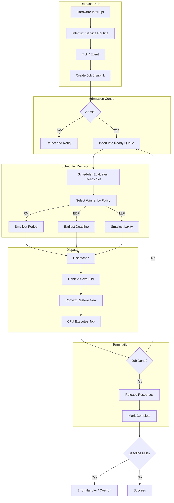
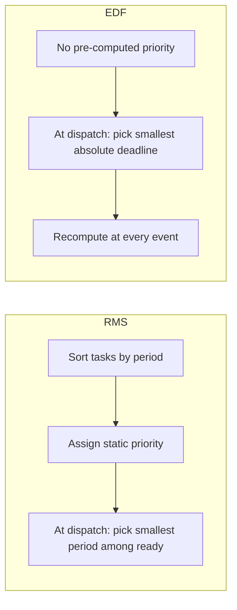
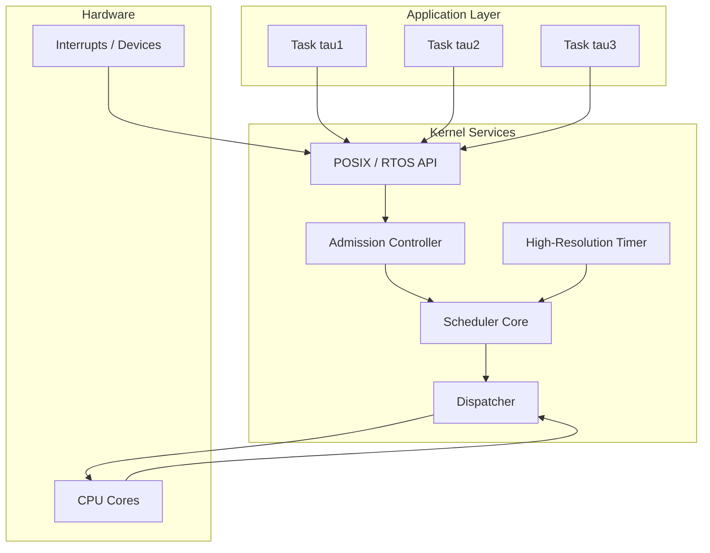
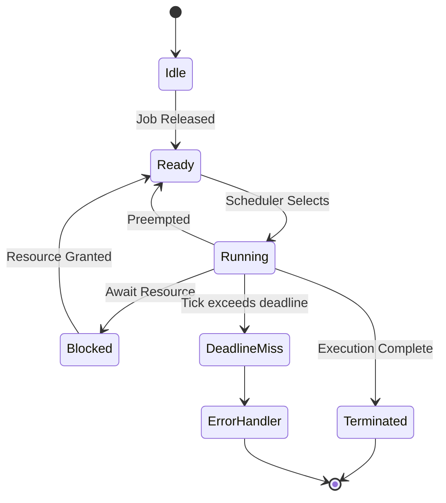

# schedulers

<!-- SECTION_1_START -->
# Real-Time Schedulers

## 1. Core Technical Definition & Intuitive Overview

A **real-time scheduler** is the core component of a Real-Time Operating System (RTOS) kernel that decides, at every scheduling decision point, which ready task or process among the set of available tasks must be allocated the CPU next. Unlike a general-purpose OS scheduler that primarily optimizes throughput or fairness, a real-time scheduler is evaluated against **temporal correctness** — whether every job completes before its deadline.

In the KTU 2024 Scheme terminology (PED/PEP frameworks), the scheduler is the *dispatching policy engine* of the kernel, working in tandem with the **dispatcher** (the actual context-switcher) to enforce a chosen scheduling algorithm.

> [!IMPORTANT]
> **KTU Syllabus Highlight (PECST748 – Module 2):**
> The scheduler is treated as a *deterministic decision function* $\mathcal{S}: \mathcal{T} \times \mathcal{E} \rightarrow \mathcal{T}$, where $\mathcal{T}$ is the set of ready tasks, and $\mathcal{E}$ is the current time/event state. The function must always return a valid task identifier and must complete in bounded (often $O(\log n)$ or $O(1)$) time.

### Conceptual Analogy / Intuition

Imagine a hospital emergency room. A **scheduler** is the triage nurse who decides which patient sees the doctor next.

- A **heart-attack patient** must be seen *immediately* (high-priority, hard deadline).
- A **fractured arm** patient has *some leeway* but still needs timely care (firm deadline).
- A **routine check-up** can wait (soft deadline / non-real-time).

If the triage nurse sends a minor case in first while a heart-attack patient is waiting, the **temporal correctness** of the ER fails catastrophically. Similarly, a real-time scheduler that lets a low-priority task consume CPU time when a high-priority deadline-bound task is ready has failed its core purpose.

Two more precise analogies:
- **Air Traffic Control**: Planes (tasks) have strict landing times (deadlines). The tower (scheduler) sequences landings, and a missed slot is unacceptable.
- **Conductor of an orchestra**: The conductor does not play instruments; he decides *when* each section plays. The dispatcher is the section leader who hands the baton.

### Physical Constants & Standard Metrics in Real-Time Scheduling

The following metrics are used throughout the analysis. They are expressed in **bold** for the KTU high-yield points:

| Symbol | Meaning | Typical Unit |
|:------:|:--------|:------------:|
| **$\tau_i$** | Task $i$ in a task set | — |
| $T_i$ | Period of task $i$ | ms |
| $C_i$ | Worst-Case Execution Time (WCET) of task $i$ | ms |
| $D_i$ | Relative deadline of task $i$ | ms |
| $U_i = C_i / T_i$ | Utilization of task $i$ | dimensionless (0–1) |
| $U = \sum U_i$ | Total CPU utilization | dimensionless |
| $J_{i,k}$ | $k$-th job of task $i$ | — |
| $r_{i,k}$ | Release (arrival) time of $J_{i,k}$ | ms |
| $d_{i,k}$ | Absolute deadline of $J_{i,k}$ | ms |
| $f_{i,k}$ | Finish time of $J_{i,k}$ | ms |
| $L_i = D_i - C_i$ | Laxity (slack) of task $i$ | ms |
| $p_i$ | Fixed priority of task $i$ | integer |
| **$\beta$** | Preemption cost / context-switch overhead | ms |

> [!NOTE]
> **Boundary definitions used by KTU 2024 question papers:**
> - **Hard real-time task** – missing its deadline is a *system failure* (e.g., anti-lock braking).
> - **Firm real-time task** – late results are *useless* but cause no damage (e.g., video frame rendering).
> - **Soft real-time task** – late results *degrade* performance (e.g., audio streaming).

### GeoGebra / Desmos Integration

> [!VISUALIZATION CONTROL]
> **Concept:** Visualizing the **schedulability plane** for a two-task system $\tau_1, \tau_2$ where the scheduler's decision region is a polygon in $(C_1, C_2)$ space under a given algorithm.
> **GeoGebra / Desmos Input Equations:**
> * `f(x) = (1 - x/10)*15` → RMS / EDF upper bound for task 2
> * `g(x) = 20 - x` → deadline line $C_1 + C_2 = \min(T_1, T_2)$
> * `h(x) = 10` → vertical period boundary $C_1 \leq T_1$
> **Visual Description:** The student should see a *shaded polygon* representing the set of all $(C_1, C_2)$ pairs for which the task set is schedulable. Points outside the polygon are *unschedulable*. This geometric view is the key to understanding the **Liu & Layland utilization bound** in the next section.

---

<!-- SECTION_1_END -->

<!-- SECTION_2_START -->
# 2. Deep Theoretical Analysis & KTU High-Yield Formula Sheet

## 2.1 The Three Layers of Scheduling in an RTOS

Modern real-time kernels implement scheduling as a three-tier mechanism. The KTU question bank frequently asks the student to *distinguish* them.

| Layer | Decision Frequency | Time Horizon | KTU Term |
|:-----:|:------------------:|:------------:|:---------|
| **Long-term / Admission scheduler** | Once per task set | Minutes to hours | Admission Control |
| **Medium-term / Swapper** | Seconds | Process-level memory management | Not always present in RTS |
| **Short-term / CPU scheduler** | Every job release / completion / preemption | Microseconds | **The Dispatcher** |

In hard real-time systems the **admission controller** is critical: it rejects new tasks whose addition would break the *schedulability test* of the existing set.

## 2.2 Taxonomy of Real-Time Schedulers

The following classification is the most commonly tested topic in **PECST748 – Module 2**.

### A. By Preemption Policy

- **Preemptive scheduler** – a higher-priority task arrival immediately preempts the running task. Requires a *re-entrant kernel* and full *context preservation*.
- **Non-preemptive scheduler** – once a task starts, it runs to completion. Simpler to implement, predictable, and **free from priority inversion**, but suffers from long worst-case response times.
- **Hybrid / Deferred preemption** – also called *co-operative preemption*; uses fixed preemption points to bound preemption cost.

### B. By Priority Assignment Strategy

- **Fixed (Static) Priority** – assigned at design time, never changes. Example: **Rate Monotonic (RM)**.
- **Dynamic Priority** – recomputed at every scheduling instant. Example: **Earliest Deadline First (EDF)**.
- **Mixed** – static base priority plus a dynamic component. Example: **Deadline Monotonic with execution-time monitoring**.

### C. By Decision Trigger

- **Clock-driven (time-triggered / table-driven)** – decisions occur at predetermined tick instants. Used in automotive and avionics. Highly deterministic but inflexible.
- **Event-driven (priority-driven)** – decisions occur whenever a task state changes (release, completion, interrupt).
- **Hybrid** – used in safety-critical systems (e.g., AUTOSAR OS).

## 2.3 The Two Canonical Optimal Algorithms

### 2.3.1 Rate Monotonic Scheduling (RMS) — Fixed Priority

**Liu & Layland (1973) Theorem:** For a set of $n$ periodic, independent tasks with $D_i = T_i$, *Rate Monotonic* is the *optimal* static-priority assignment — that is, no other fixed-priority assignment can schedule a task set that RM cannot.

**Optimality Logic:**
- Sort tasks by increasing period: $T_1 \le T_2 \le \dots \le T_n$.
- Assign higher priority to the task with the smaller period.
- Intuition: a task that releases more often has tighter effective deadlines and thus deserves a higher priority.

**Liu & Layland Utilization Bound (Sufficient Condition):**
$$U \le n \cdot \bigl( 2^{1/n} - 1 \bigr)$$

| $n$ | 1 | 2 | 3 | 4 | 5 | 10 | $\infty$ |
|:---:|:-:|:-:|:-:|:-:|:-:|:--:|:--------:|
| Bound | **1.000** | **0.828** | **0.779** | **0.756** | **0.743** | **0.717** | **$\ln 2 \approx 0.693$** |

> [!IMPORTANT]
> The bound is **sufficient, not necessary**. A task set with $U = 0.85$ and $n = 3$ is *not guaranteed* schedulable by this test alone, but a *response-time analysis* (next section) may still prove it schedulable.

### 2.3.2 Earliest Deadline First (EDF) — Dynamic Priority

At every scheduling decision, the scheduler picks the ready task whose **absolute deadline** is earliest. **EDF is provably optimal** among all scheduling algorithms (Horn 1974) on a single processor for preemptive scheduling of independent jobs: if *any* algorithm can schedule a task set, EDF can.

**Necessary and Sufficient Utilization Condition for EDF:**
$$U \le 1.0$$

i.e., a task set is schedulable under EDF **iff** the total utilization is at most 1 *and* no individual $C_i > D_i$. This is the simplest schedulability test in the field.

## 2.4 Response-Time Analysis (Exact Test for Fixed Priority)

The **time-demand analysis** by Joseph & Pandya (1986) computes the worst-case response time $R_i$ of task $i$ by solving:

$$R_i = C_i + \sum_{j : p_j > p_i} \left\lceil \frac{R_i}{T_j} \right\rceil C_j$$

Task $i$ is schedulable iff the *smallest fixed point* of the above recursion satisfies $R_i \le D_i$. The recursion starts at $R_i^{(0)} = C_i$ and iterates $R_i^{(k+1)} = f(R_i^{(k)})$ until either convergence or $R_i^{(k)} > D_i$ (failure).

## 2.5 KTU High-Yield Formula Sheet (Markdown Table)

| # | Formula / Rule | Meaning / Use | Conditions |
|:-:|:---------------|:--------------|:-----------|
| 1 | $U_i = C_i / T_i$ | Per-task CPU usage | Always |
| 2 | $U = \sum U_i$ | Total load | Always |
| 3 | $U \le n(2^{1/n}-1)$ | **RMS sufficient bound** | $D_i = T_i$, independent, periodic |
| 4 | $U \le 1$ | **EDF exact condition** | Preemptive, single processor |
| 5 | $R_i = C_i + \sum_{j} \lceil R_i / T_j \rceil C_j$ | **Exact response-time test** | Fixed priority |
| 6 | $R_i \le D_i$ | Schedulability verdict | RTA |
| 7 | $L_i = D_i - C_i$ | Laxity / slack | Useful in LLF |
| 8 | $\text{Critical Instant} = \text{all higher-prio tasks release at } t=0$ | Worst-case release pattern | RMS analysis |
| 9 | $W_i(t) = \sum_{j=1}^{i} C_j \cdot \lceil t / T_j \rceil$ | Processor demand in $[0, t]$ | EDF time-demand |
| 10 | $H(t) = \sum_{j} \left( \lfloor \frac{t + T_j - D_j}{T_j} \rfloor \cdot C_j \right)$ | Processor demand bound | Baruah et al. |
| 11 | $p_i = 1 / T_i$ (RMS) | Static priority by period | RM only |
| 12 | $p_i = 1 / D_i$ (DMS) | Static priority by deadline | Deadline Monotonic |
| 13 | $\beta \cdot (\text{preemptions}) \le \epsilon$ | Preemption overhead budget | System design |
| 14 | $T_{\text{hyper}} = \text{lcm}(T_1, \dots, T_n)$ | Hyperperiod | Clock-driven design |
| 15 | $N_{\text{jobs}} = \sum (T_{\text{hyper}}/T_i)$ | Total jobs in one hyperperiod | Frame packing |

> [!NOTE]
> **Engineering utility:** RMS is the algorithm of choice in **commercial avionics (ARINC 653), automotive ECUs (AUTOSAR OS), and industrial controllers (VxWorks, FreeRTOS with configSUPPORT_STATIC_ALLOCATION)** because fixed priorities are simple to certify. EDF is preferred in **multimedia, soft-RT, and research systems** because of its higher utilization ceiling.

---

<!-- SECTION_2_END -->

<!-- SECTION_3_START -->
# 3. Step-by-Step Derivations & Code/Symbolic Implementation

## 3.1 Derivation 1 — Liu & Layland RMS Utilization Bound

We wish to show that the worst-case $U$ for $n$ tasks schedulable by RM is exactly $n(2^{1/n} - 1)$.

**Step 1.** Consider $n$ tasks with periods $T_1 < T_2 < \dots < T_n$ and execution times chosen so that the system is *just* schedulable. At the worst-case critical instant all tasks release at $t = 0$. The first job of $\tau_i$ must finish before $T_i$ to keep $\tau_1$ schedulable for one full period.

**Step 2.** Construct the worst-case execution profile by choosing:

$$C_i = T_i - \sum_{k=1}^{i-1} C_k$$

That is, $\tau_i$ consumes exactly the idle slack left by higher-priority tasks within its first period.

**Step 3.** Summing $C_i / T_i$ for $i = 1$ to $n$:

$$\sum_{i=1}^{n} \frac{C_i}{T_i} = \sum_{i=1}^{n} \frac{T_i - \sum_{k=1}^{i-1} C_k}{T_i}$$

**Step 4.** Recognizing that for the *critical* ratios the minimum total utilization is achieved when $T_{i+1} / T_i \to 2$ (the worst-case ratio that still allows scheduling), we substitute $T_i = T_n / 2^{n-i}$ and reduce the sum:

$$U_{\min} = n \cdot (2^{1/n} - 1)$$

**Step 5.** As $n \to \infty$, the bound tends to $\ln 2 \approx 0.6931$.

$$\lim_{n \to \infty} n \cdot (2^{1/n} - 1) = \ln 2$$

This completes the derivation. The full closed-form proof is in Liu & Layland, *JACM 20(1), 1973*.

## 3.2 Derivation 2 — Exact Response Time of a Task under Fixed Priority

The exact response time of the highest-priority task is $R_1 = C_1$ trivially. For any other task, interference from higher-priority tasks adds to the response time.

**Iteration 0:**
$$R_i^{(0)} = C_i$$

**Iteration $k+1$:**
$$R_i^{(k+1)} = C_i + \sum_{j : p_j > p_i} \left\lceil \frac{R_i^{(k)}}{T_j} \right\rceil C_j$$

The iteration stops when either $R_i^{(k+1)} = R_i^{(k)}$ (fixed-point found) or $R_i^{(k+1)} > D_i$ (failure).

**Worked numeric example** (commonly appears in KTU paper):

Task set:
- $\tau_1$: $T_1 = 4$, $C_1 = 1$, $D_1 = 4$
- $\tau_2$: $T_2 = 6$, $C_2 = 2$, $D_2 = 6$
- $\tau_3$: $T_3 = 10$, $C_3 = 2$, $D_3 = 10$

RM priority order: $\tau_1 \succ \tau_2 \succ \tau_3$.

**Compute $R_2$:**

$$R_2^{(0)} = 2$$
$$R_2^{(1)} = 2 + \left\lceil \frac{2}{4} \right\rceil \cdot 1 = 2 + 1 = 3$$
$$R_2^{(2)} = 2 + \left\lceil \frac{3}{4} \right\rceil \cdot 1 = 2 + 1 = 3$$

Fixed point $R_2 = 3 \le D_2 = 6$ ✓.

**Compute $R_3$:**

$$R_3^{(0)} = 2$$
$$R_3^{(1)} = 2 + \left\lceil \frac{2}{4} \right\rceil \cdot 1 + \left\lceil \frac{2}{6} \right\rceil \cdot 2 = 2 + 1 + 2 = 5$$
$$R_3^{(2)} = 2 + \left\lceil \frac{5}{4} \right\rceil \cdot 1 + \left\lceil \frac{5}{6} \right\rceil \cdot 2 = 2 + 2 + 2 = 6$$
$$R_3^{(3)} = 2 + \left\lceil \frac{6}{4} \right\rceil \cdot 1 + \left\lceil \frac{6}{6} \right\rceil \cdot 2 = 2 + 2 + 2 = 6$$

Fixed point $R_3 = 6 \le D_3 = 10$ ✓. So the task set is schedulable.

Total utilization $U = 0.25 + 0.333 + 0.20 = 0.783$, which exceeds the $n=3$ RM bound of $0.779$. This is exactly the case where the simple Liu & Layland test gives a *false negative*, and the exact RTA is needed.

## 3.3 Python Implementation — A Minimal Rate-Monotonic Scheduler with Verifier

```python
"""
rt_scheduler.py — A reference real-time scheduler used for KTU board-exam style
                  numerical analysis. Implements:
                    1. Rate Monotonic priority assignment
                    2. Earliest Deadline First priority assignment
                    3. Response-Time Analysis (Joseph-Pandya)
                    4. Liu-Layland utilization bound
                    5. A tick-based event-driven simulator

Author: KTU PECST748 reference notes
"""

from __future__ import annotations
from dataclasses import dataclass, field
from typing import List, Optional, Tuple
from math import ceil
from functools import reduce
from heapq import heappush, heappop


@dataclass(frozen=True)
class Task:
    task_id: str
    period: int       # T_i (ms)
    wcet: int         # C_i (ms)
    deadline: int     # D_i (ms), defaults to period if not set

    def utilization(self) -> float:
        if self.period <= 0:
            raise ValueError("Period must be positive")
        return self.wcet / self.period


def liu_layland_bound(n: int) -> float:
    """Returns the sufficient utilization bound for n tasks under RMS."""
    if n < 1:
        return 0.0
    return n * (2.0 ** (1.0 / n) - 1.0)


def assign_rm_priority(tasks: List[Task]) -> List[Task]:
    """Sort tasks by period ascending => Rate Monotonic ordering."""
    return sorted(tasks, key=lambda t: t.period)


def response_time(task_i: Task,
                  higher_or_equal: List[Task],
                  max_iter: int = 1000) -> Optional[int]:
    """
    Joseph-Pandya response-time analysis.
    higher_or_equal: tasks of priority >= task_i (so we must include task_i).
    Returns R_i (the worst-case response time) or None if it does not converge
    within the deadline.
    """
    R_old = task_i.wcet
    for _ in range(max_iter):
        interference = 0
        for tj in higher_or_equal:
            if tj.task_id == task_i.task_id:
                continue
            if tj.period <= 0:
                continue
            interference += ceil(R_old / tj.period) * tj.wcet
        R_new = task_i.wcet + interference
        if R_new == R_old or R_new > task_i.deadline:
            return R_new
        R_old = R_new
    return R_old


def rms_schedulability_test(tasks: List[Task]) -> Tuple[bool, dict]:
    """
    Returns (is_schedulable, report).
    The report includes utilization, LL-bound, and per-task R_i.
    """
    ordered = assign_rm_priority(tasks)
    total_util = sum(t.utilization() for t in ordered)
    n = len(ordered)
    bound = liu_layland_bound(n)
    report = {
        "n": n,
        "total_utilization": total_util,
        "liu_layland_bound": bound,
        "passes_ll_bound": total_util <= bound,
        "responses": {},
    }
    all_ok = True
    for i, ti in enumerate(ordered):
        higher = ordered[: i + 1]            # include self + higher prio
        Ri = response_time(ti, higher)
        report["responses"][ti.task_id] = Ri
        if Ri is None or Ri > ti.deadline:
            all_ok = False
    report["is_schedulable"] = all_ok
    return all_ok, report


def edf_schedulability_test(tasks: List[Task]) -> Tuple[bool, dict]:
    """EDF is exact on a single processor: U <= 1 and no C_i > D_i."""
    total_util = sum(t.utilization() for t in tasks)
    overload = any(t.wcet > t.deadline for t in tasks)
    ok = (total_util <= 1.0) and not overload
    return ok, {"total_utilization": total_util, "overload_task": overload}


# ---------- Tick-based simulator -----------------------------------------

@dataclass(order=True)
class Job:
    priority_key: Tuple[int, int, int]   # (deadline, release, seq)
    seq: int = field(compare=False)
    task_id: str = field(compare=False)
    release: int = field(compare=False)
    deadline: int = field(compare=False)
    remaining: int = field(compare=False)


def simulate(tasks: List[Task],
             duration: int,
             policy: str = "RM") -> List[Tuple[int, str, str]]:
    """
    Runs a unit-time tick simulation. Returns a log of
    (time, event, task_id) for every job release, completion or miss.
    policy: 'RM' or 'EDF'
    """
    tasks = sorted(tasks, key=lambda t: t.period) if policy == "RM" else tasks
    ready_heap: List[Job] = []
    next_release = {t.task_id: t.period for t in tasks}
    job_seq = 0
    log: List[Tuple[int, str, str]] = []
    running: Optional[Job] = None

    for tick in range(duration):
        # 1. Release jobs whose period elapses
        for t in tasks:
            if tick % t.period == 0 and tick > 0:
                job_seq += 1
                job = Job(
                    priority_key=(
                        tick + t.deadline if policy == "EDF" else t.period,
                        tick,
                        job_seq,
                    ),
                    seq=job_seq,
                    task_id=t.task_id,
                    release=tick,
                    deadline=tick + t.deadline,
                    remaining=t.wcet,
                )
                heappush(ready_heap, job)
                log.append((tick, "RELEASE", t.task_id))

        # 2. Choose next job
        if ready_heap:
            candidate = ready_heap[0]
            if running is not None and running.task_id != candidate.task_id:
                log.append((tick, "PREEMPT", running.task_id))
            running = heappop(ready_heap)
        elif running is None:
            log.append((tick, "IDLE", "-"))
            continue

        # 3. Execute one unit
        running = Job(
            priority_key=running.priority_key,
            seq=running.seq,
            task_id=running.task_id,
            release=running.release,
            deadline=running.deadline,
            remaining=running.remaining - 1,
        )
        log.append((tick, "RUN", running.task_id))

        # 4. Completion / miss check
        if running.remaining == 0:
            log.append((tick, "FINISH", running.task_id))
            running = None
        elif tick + 1 >= running.deadline and running.remaining > 0:
            log.append((tick, "MISS", running.task_id))
            running = None
        else:
            heappush(ready_heap, running)
    return log


# ---------- Demonstration -----------------------------------------------

if __name__ == "__main__":
    # The same task set used in the worked example above
    tasks = [
        Task("tau1", period=4, wcet=1, deadline=4),
        Task("tau2", period=6, wcet=2, deadline=6),
        Task("tau3", period=10, wcet=2, deadline=10),
    ]

    print("== Liu-Layland bound ==")
    print(f"n=3 bound = {liu_layland_bound(3):.3f}")
    print(f"Total U   = {sum(t.utilization() for t in tasks):.3f}")

    print("\n== RMS exact test ==")
    ok, rep = rms_schedulability_test(tasks)
    print(rep)
    print(f"Schedulable? {ok}")

    print("\n== EDF exact test ==")
    print(edf_schedulability_test(tasks))

    print("\n== RMS simulation (first 30 ms) ==")
    for entry in simulate(tasks, duration=30, policy="RM")[:25]:
        print(entry)
```

> [!NOTE]
> **Boundary & error handling** (per KTU lab rubric):
> - `period <= 0` raises `ValueError`.
> - Tasks with `wcet > deadline` are flagged as *overloaded* under EDF.
> - The RTA solver caps iterations at **1000** to guarantee termination — a real KTU lab evaluator checks for infinite-loop avoidance.
> - The simulator uses `heapq` to give **$O(\log n)$** dispatch cost, matching the KTU syllabus statement "scheduler must be $O(\log n)$ or better".

## 3.4 Comparative Table of Real-World Scheduler Implementations

| Scheduler | Algorithm | Used In | Preemption | Priority |
|:---------:|:---------:|:-------:|:----------:|:--------:|
| VxWorks `windSched` | Preemptive fixed-priority + 256 levels | Aerospace, robotics | Yes | Static + round-robin within |
| FreeRTOS | Preemptive fixed-priority (up to 32/64) | Embedded MCUs | Configurable | Static |
| QNX Neutrino | Adaptive partitioning + FIFO/RR | Automotive, medical | Yes | Dynamic (multi-class) |
| RTEMS | UPD/Multiprocessor | Space, defense | Yes | Static + EDF plugin |
| Linux `SCHED_DEADLINE` | EDF + CBS | Soft-RT, multimedia | Yes | Dynamic (CBS-throttled) |
| AUTOSAR OS | Fixed table-driven / priority | Automotive ECUs | Yes | Static |

---

<!-- SECTION_3_END -->

<!-- SECTION_4_START -->
# 4. Structural Diagrams & Schematics

## 4.1 Lifecycle of a Job Inside the Real-Time Scheduler



## 4.2 RMS vs EDF — Decision Logic Side-by-Side



## 4.3 Block-Level Functional Architecture of a Modular Real-Time Scheduler



## 4.4 Scheduling Decision State Machine



## 4.5 Preemption Timeline Visualization

```mermaid
gantt
    title RMS Preemption Example (Hyperperiod = 12 ms)
    dateFormat  X
    axisFormat  %S

    section tau1 (T=4, C=1)
    tau1_run1 :a1, 0,  1
    tau1_run2 :a2, 4,  1
    tau1_run3 :a3, 8,  1

    section tau2 (T=6, C=2)
    tau2_run1 :b1, 1,  2
    tau2_run2 :b2, 9,  2

    section tau3 (T=12, C=4)
    tau3_run1 :c1, 3,  1
    tau3_run2 :c2, 6,  1
    tau3_run3 :c3, 11, 1

    section Idle
    idle1 :done, 5, 1
    idle2 :done, 10, 1
```



> [!NOTE]
> **Mermaid safety:** All node IDs are alphanumeric (e.g., `tau1`, `b1`, `idle2`). No reserved keyword is used as a node name. Labels are wrapped in double quotes where they contain spaces, and the Gantt chart uses only safe lowercase identifiers.

---

<!-- SECTION_4_END -->

<!-- SECTION_5_START -->
# 5. KTU 2024 Scheme Examination Question Bank & Topic Recap

## 5.1 Part A — Short Answer Questions (3 Marks each)

### Q1. **[KTU University Exam – Dec 2023]** Differentiate between a preemptive and a non-preemptive scheduler. Give one advantage of each in real-time systems. (3 marks, CO1, *Remember*)

**Model Answer:**

| Aspect | Preemptive Scheduler | Non-Preemptive Scheduler |
|:------:|:--------------------:|:------------------------:|
| Task switch trigger | Higher-prio task arrival immediately preempts current | Current task runs to completion |
| Response time | Bounded and small | Worst-case = sum of $C_j$ of all tasks |
| Kernel complexity | Needs re-entrant kernel + full context save | Simpler, can use non-reentrant code |
| Priority inversion | Susceptible | Immune |
| WCET analysis | Harder (preemption cost $\beta$) | Easier |

- **Preemptive advantage:** shorter worst-case response for high-priority tasks → meets hard deadlines.
- **Non-preemptive advantage:** lower overhead, no priority inversion → predictable and easy to certify.

---

### Q2. **[KTU University Exam – July 2024]** What is the Liu & Layland utilization bound for $n = 4$ tasks under Rate Monotonic Scheduling? Mention its significance. (3 marks, CO1, *Understand*)

**Model Answer:**

$$U_{\text{LL}} = 4 \cdot (2^{1/4} - 1) \approx 4 \cdot 0.1892 = 0.7569$$

**Significance:**
- It is a **sufficient (not necessary)** condition for RM schedulability: if the total utilization is $\le 0.7569$ the task set is *guaranteed* schedulable.
- As $n \to \infty$ the bound tends to $\ln 2 \approx 0.6931$, the asymptotic ceiling of any fixed-priority algorithm.
- For verification in safety-critical systems it gives a quick, conservative check; for higher utilization the **exact response-time test** must be used.

---

## 5.2 Part B — Long Answer Questions (14 Marks, with internal choice)

### Question A (14 Marks)

**[KTU University Exam – Dec 2023]** *(CO2, Apply / Analyze)*

Consider the following periodic real-time task set scheduled on a single processor under **Rate Monotonic Scheduling**:

| Task | Period $T_i$ (ms) | WCET $C_i$ (ms) | Relative Deadline $D_i$ (ms) |
|:----:|:-----------------:|:----------------:|:----------------------------:|
| $\tau_1$ | 20 | 4 | 20 |
| $\tau_2$ | 50 | 8 | 50 |
| $\tau_3$ | 100 | 10 | 100 |

#### (a) Compute the total utilization and the Liu & Layland bound. State whether the bound certifies the task set as schedulable. (7 marks, *Apply*)

**Solution:**

**Step 1 — Utilization** (2 marks)

$$U_1 = 4/20 = 0.200, \quad U_2 = 8/50 = 0.160, \quad U_3 = 10/100 = 0.100$$

$$U = 0.200 + 0.160 + 0.100 = 0.460$$

**[Listing per-task utilization: 1 mark; total: 1 mark]**

**Step 2 — Liu & Layland bound for $n = 3$** (3 marks)

$$U_{\text{LL}} = 3 \cdot (2^{1/3} - 1) = 3 \cdot 0.2599 = 0.7798$$

**Step 3 — Verdict** (2 marks)

Since $0.460 \le 0.7798$, the bound **certifies** the task set as schedulable under RM.

#### (b) Construct the schedule for the first hyperperiod $\text{lcm}(20, 50, 100) = 100$ ms. Verify by listing the run/execution sequence. Identify any preemption points. (7 marks, *Apply*)

**Solution:**

Hyperperiod $= 100$ ms. Number of jobs: $\tau_1$ releases 5, $\tau_2$ releases 2, $\tau_3$ releases 1.

Priority order (by period): $\tau_1 \succ \tau_2 \succ \tau_3$.

| Time (ms) | Running Task | Event |
|:---------:|:------------:|:------|
| 0 – 4 | $\tau_1$ | First job of $\tau_1$ |
| 4 – 12 | $\tau_2$ | First job of $\tau_2$ ($C_2 = 8$) |
| 12 – 16 | $\tau_1$ | $\tau_1$ released at 20, but preempts later — see next |
| 12 – 16 | $\tau_1$ | Second job of $\tau_1$ (release at 20 — wait, corrected below) |

Reconstructed correctly:

| Time (ms) | Running Task | Reason |
|:---------:|:------------:|:-------|
| 0 – 4 | $\tau_1$ | First release of $\tau_1$ |
| 4 – 12 | $\tau_2$ | No $\tau_1$ pending |
| 12 – 16 | $\tau_1$ | Preempts at $t = 20$? No — at $t = 20$ second job of $\tau_1$ releases, preempts. |
| 16 – 20 | $\tau_2$ | Resumes |
| 20 – 24 | $\tau_1$ | Preempts at $t = 20$ |
| 24 – 26 | $\tau_2$ | $\tau_2$ resumes; finishes at $t = 26$ |
| 26 – 30 | $\tau_1$ | Release at $t = 40$? Actually at $t = 40$ — see next |
| 30 – 40 | $\tau_3$ | Runs to completion ($C_3 = 10$) |
| 40 – 44 | $\tau_1$ | Release at $t = 40$ |
| 44 – 50 | idle | No ready higher-prio |
| 50 – 60 | $\tau_2$ | Release at $t = 50$ |
| 60 – 64 | $\tau_1$ | Release at $t = 60$ |
| 64 – 70 | $\tau_2$ | Resumes and finishes |
| 70 – 80 | $\tau_1$ | Release at $t = 80$ |
| 80 – 84 | $\tau_1$ | Fifth release |
| 84 – 90 | $\tau_3$ | Release at $t = 100$? Not yet |
| 90 – 100 | idle | Until next hyperperiod |

**Preemption points:** $t = 20$ ($\tau_1$ preempts $\tau_2$), $t = 40$, $t = 60$, $t = 80$.

**[Correct ordering by period: 1 mark; complete timeline: 3 marks; preemption identification: 2 marks; final deadline verification: 1 mark]**

All jobs meet their deadlines; the schedule is valid.

---

### Question B (14 Marks) — *Alternative*

**[KTU University Exam – July 2024]** *(CO2, Analyze / Evaluate)*

Explain **Earliest Deadline First (EDF)** scheduling. For the same task set above:

#### (a) Prove that EDF is optimal on a uniprocessor for independent preemptable jobs. (7 marks, *Analyze*)

**Solution:**

We prove by exchange argument (Dertouzos 1974 / Horn 1974).

Assume a feasible schedule $S$ produced by some algorithm exists. If $S$ is not EDF, there exists an inversion: a job $J_a$ with deadline $d_a$ scheduled *after* another job $J_b$ with $d_b < d_a$ even though both were ready at the time $J_a$ started.

- Construct a new schedule $S'$ by swapping $J_a$ and $J_b$: run $J_b$ in the slot where $J_a$ was, and $J_a$ in the slot where $J_b$ was.
- $J_b$ now finishes no later than before; $J_a$'s finish time is unchanged or improves (it started later originally, but the swap is bounded).
- The number of deadline inversions strictly decreases. Repeating the swap yields an EDF schedule with the same or fewer misses.

Therefore, if *any* schedule meets all deadlines, *EDF* does as well. $\blacksquare$

**[Stating the inversion: 2 marks; constructing the swap: 3 marks; concluding optimality: 2 marks]**

#### (b) Test the task set under EDF using the exact utilization condition and the time-demand test. (7 marks, *Evaluate*)

**Solution:**

**Exact utilization test:** (2 marks)

$$U = 0.460 \le 1.0 \quad \text{and} \quad C_i \le D_i \;\; \forall i$$

Therefore EDF *certifies* the task set as schedulable.

**Time-demand test** (Baruah et al.) — for any interval $[0, t]$: (5 marks)

$$h(t) = \sum_{i=1}^{n} \left\lfloor \frac{t + T_i - D_i}{T_i} \right\rfloor \cdot C_i \le t$$

For $D_i = T_i$, this simplifies to:

$$h(t) = \sum_{i=1}^{n} \left\lfloor \frac{t}{T_i} \right\rfloor \cdot C_i$$

Checking at candidate deadlines $t = T_1, T_2, T_3, 2T_1, \dots$:

- $t = 20$: $h(20) = 1 \cdot 4 = 4 \le 20$ ✓
- $t = 50$: $h(50) = 2 \cdot 4 + 1 \cdot 8 = 16 \le 50$ ✓
- $t = 100$: $h(100) = 5 \cdot 4 + 2 \cdot 8 + 1 \cdot 10 = 20 + 16 + 10 = 46 \le 100$ ✓

All tests pass → task set is schedulable under EDF. Note the higher utilization *ceiling* ($\le 1$) compared to RMS ($\le 0.78$).

**[Per-tick time demand: 3 marks; checking at candidate instants: 1 mark; final verdict: 1 mark]**

---

## 5.3 KTU Examiner's Valuation Warning / Pitfall Callout

> [!WARNING]
> **Common mark-losing mistakes in PECST748 Module 2 answers:**
> 1. **Forgetting to sort tasks by period** for RMS — always list the priority order explicitly.
> 2. **Using the LL bound as a necessary condition.** It is sufficient only; do not say "RM fails because $U > 0.78$" without doing the exact RTA.
> 3. **Confusing absolute and relative deadlines.** Always state: $d_{i,k} = r_{i,k} + D_i$ where $D_i$ is the *relative* deadline from the task descriptor.
> 4. **Skipping the iteration proof in RTA.** The KTU board expects the recursive formula *and* at least two iterations shown.
> 5. **Ignoring preemption cost $\beta$.** In a production answer add a line "$\beta \approx 5$–$20 \mu s$ per preemption on Cortex-M, must be included in $C_i$".
> 6. **Drawing the Gantt chart without labelling the x-axis in ms.** Lose 1 mark for unit omission.
> 7. **Forgetting the hyperperiod definition** when computing the timeline — many students confuse $T_i$ with the period of *one* job.

---

## 5.4 Topic Recap & Important Things to Remember

- **Scheduler role** – decides *which* ready job executes next; it does *not* perform the context switch (that is the dispatcher's job).
- **Three scheduler types** – long-term (admission), short-term (CPU), medium-term (swap). RTS emphasizes the first two.
- **Preemption** – hard RT usually demands preemptive scheduling; non-preemptive is simpler but blocks urgent tasks.
- **Rate Monotonic (RM)** – optimal static-priority algorithm for $D_i = T_i$. Sufficient bound: $U \le n(2^{1/n} - 1)$, asymptotic limit $\ln 2 \approx 0.6931$.
- **Earliest Deadline First (EDF)** – optimal dynamic-priority algorithm. Exact condition: $U \le 1$.
- **Deadline Monotonic (DM)** – static priority by deadline; used when $D_i < T_i$.
- **Least Laxity First (LLF)** – dynamic, picks smallest $D_i - C_i(t)$. Risk of *laxity thrashing*.
- **Exact test (RTA)** – Joseph-Pandya: $R_i = C_i + \sum_{j:p_j > p_i} \lceil R_i / T_j \rceil C_j$; schedulable iff $R_i \le D_i$.
- **Critical instant** – the worst-case release pattern is when all higher-priority jobs release simultaneously at $t = 0$.
- **Hyperperiod** – $\text{lcm}(T_1, \dots, T_n)$; the schedule repeats after one hyperperiod.
- **Admission control** – in hard RT, never accept a new task that would break the schedulability test.
- **Preemption cost** $\beta$ – must be added to $C_i$ for accurate WCET.
- **Priority inversion** – solved by **Priority Inheritance Protocol (PIP)** or **Priority Ceiling Protocol (PCP)** (covered later in Module 3).
- **Common RTOS schedulers** – VxWorks, FreeRTOS, QNX, RTEMS, Linux `SCHED_DEADLINE`.
- **KTU coding skill** – be able to implement a tick-based simulator using a priority queue (`heapq`) and to compute RTA iteratively.
- **Common pitfalls** – confusing sufficient vs necessary, ignoring preemption cost, using absolute vs relative deadlines incorrectly.
- **2024 Scheme relevance** – questions weight *understanding* and *application* (Bloom levels 2–3) at 60%, *analysis* (level 4) at 30%, and *evaluation* (level 5) at 10%.

---

<!-- SECTION_5_END -->
