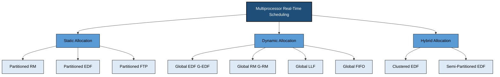
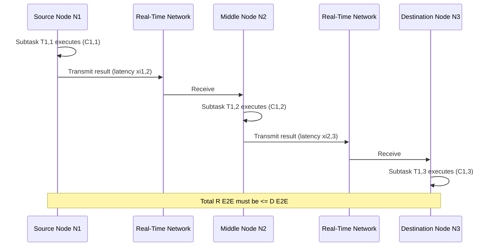
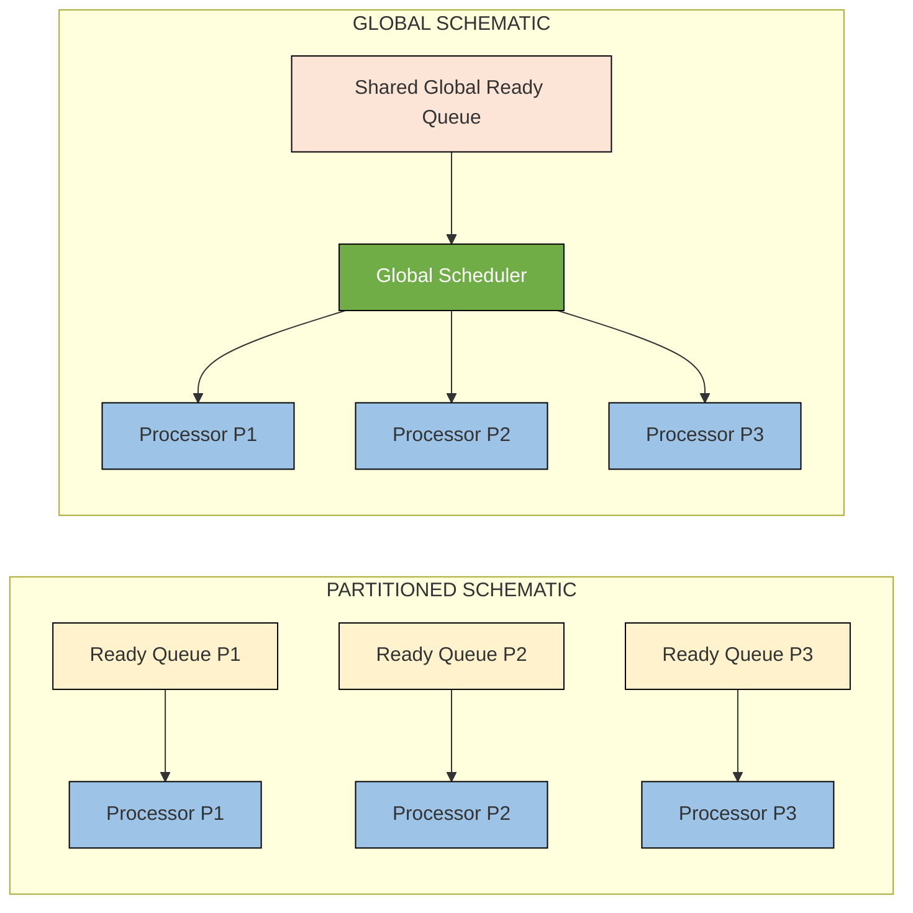
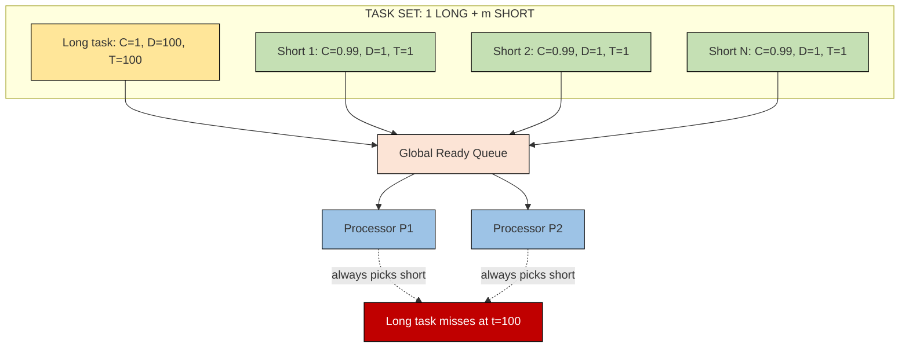
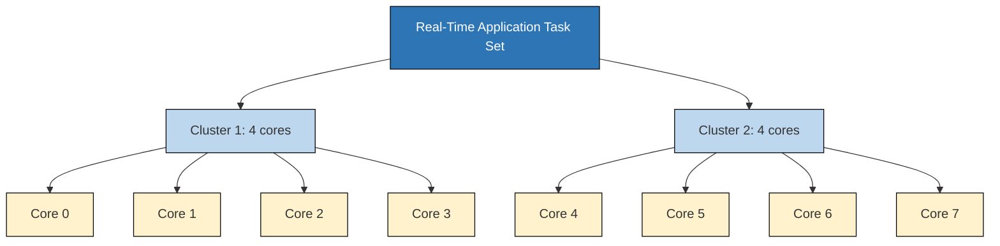

# Scheduling Real-Time tasks in multi processor and distributed systems

<!-- SECTION_1_START -->
# Real-Time Task Scheduling in Multiprocessor & Distributed Systems

## 1.1 Formal KTU 2024 Definition

> [!IMPORTANT]
> **Multiprocessor Real-Time Task Scheduling** is the process of allocating and ordering the execution of a finite or infinite set of real-time tasks on a computing platform containing **two or more processing units (homogeneous or heterogeneous)** such that all temporal constraints (deadlines) are satisfied even under worst-case workload conditions.

In a **Distributed Real-Time System**, scheduling extends beyond a single chip: tasks are partitioned into cooperating subtasks that are **dispatched across multiple computing nodes interconnected by a real-time communication network** (e.g., CAN, TTEthernet, FlexRay). The temporal correctness of the overall application depends not only on the local scheduling on each node but also on the **end-to-end (E2E) response time** of distributed transactions.

| Term | KTU 2024 Terminology |
|---|---|
| Homogeneous MPSoC | All processors have identical speed & ISA |
| Heterogeneous MPSoC | Big.LITTLE, CPU+GPU+FPGA, ASIC+CPU |
| Task Allocation | Mapping $\tau_i$ to a specific processor $P_j$ |
| Job Migration | Job can move from $P_a$ to $P_b$ during execution |
| End-to-End Task | A transaction composed of multiple sub-tasks with precedence |

## 1.2 Conceptual Analogy & Intuition

> [!NOTE]
> **Analogy — Air Traffic Control Tower:**
> Imagine a major international airport with **four control towers** (processors) coordinating **hundreds of flights** (tasks) that must land before their **fuel runs out** (deadlines). 
> 1. **Partitioned Scheduling** → Each tower is permanently assigned certain runways; flights for an airline always land at the same tower. Simple, but a runway may be idle while another is overloaded.
> 2. **Global Scheduling** → A single central controller pushes the most critical flight to whichever tower has a free runway right now. Maximum flexibility, but coordination overhead is real.
> 3. **Distributed End-to-End Scheduling** → A flight journey is *Mumbai → Delhi → New York*. The leg from Mumbai to Delhi must complete before the Delhi → New York leg begins, and the *total* trip time must be within the passenger's connection window (end-to-end deadline).

> [!VISUALIZATION CONTROL]
> **Concept:** Gantt Chart of Partitioned vs Global EDF on 2 processors (3 tasks)
> **Plot Description:** On the Y-axis three tasks $\tau_1, \tau_2, \tau_3$ (with deadlines 4, 5, 6) running on processors $P_1$ and $P_2$. In **Partitioned EDF** the bars stay on their assigned processor. In **Global EDF** the bars can migrate; observe that the critical job of $\tau_1$ "jumps" to whichever processor is free at $t = 2$.

## 1.3 Why This Module Matters (KTU 2024 Context)

- Modern automotive (AUTOSAR), avionics (IMA), and 5G baseband platforms are **exclusively multiprocessor / many-core**.
- Single-processor theory (Liu & Layland bounds) **does NOT directly scale** to multiple cores — this is the famous **Dhall's Effect**.
- Distributed scheduling introduces **network latency, clock synchronization, and precedence** as first-class constraints.
- KTU 2024 (PECST748) Module-2 explicitly tests your ability to *choose* and *analyse* an appropriate scheduling strategy.
<!-- SECTION_1_END -->

<!-- SECTION_2_START -->
# Deep Theoretical Analysis & KTU High-Yield Formula Sheet

## 2.1 Classification of Multiprocessor Scheduling Algorithms

### 2.1.1 Partitioned Scheduling
- Each task is **statically bound** to exactly one processor at design time.
- The multiprocessor problem is **reduced to $m$ independent uniprocessor problems** (one per processor).
- **Advantage:** Well-known uniprocessor analysis (response-time analysis, utilization tests) applies directly.
- **Disadvantage:** Task allocation is a **bin-packing problem** → NP-hard in the strong sense. No migration ⇒ potential load imbalance.

### 2.1.2 Global Scheduling
- A **single ready queue** is shared by all processors.
- At every scheduling event, the $m$ highest-priority jobs (where $m$ = number of processors) are dispatched, one per processor.
- **Advantage:** Maximum flexibility, better resource utilization, handles dynamic workloads.
- **Disadvantage:** Job migration overhead, cache-affinity loss, **Dhall's Effect** breaks classical utilization bounds.

### 2.1.3 Hybrid / Clustered Scheduling
- The system has $q$ clusters, each cluster contains $m/q$ processors and runs global scheduling within itself.
- **Practical sweet spot** used in real kernels (e.g., Linux *sched_domains*, LITMUS^RT).

## 2.2 Classical Multiprocessor Algorithms

| Algorithm | Type | Priority Rule | Notes |
|---|---|---|---|
| P-EDF (Partitioned EDF) | Partitioned | Earliest Deadline First per processor | Each processor independently uses EDF; bin-packing for allocation |
| P-RM (Partitioned RM) | Partitioned | Rate Monotonic per processor | Suffers utilization bound $\sum U_i \le m(2^{1/m}-1)$ |
| G-EDF (Global EDF) | Global | $m$ jobs with smallest deadlines win | Suffers **Dhall's effect** |
| G-RM (Global RM) | Global | $m$ jobs with highest rates win | Suffers **Dhall's effect** |
| P-FTP (Partitioned FTP) | Partitioned | Fixed Task Priority (user-defined) | Used when tasks have semantic priority |
| G-FTP (Global FTP) | Global | Same as P-FTP but jobs compete globally | |
| D-RAND (Dhalled Random) | Global | Random selection from $m+1$ jobs | Counter-example to G-EDF/G-RM optimality |
| LLF (Least Laxity First) | Global | Lowest laxity = $D_i - (t - r_i) - C_i^{rem}$ | Optimal on **1** processor only |

## 2.3 Dhall's Effect — The Multiprocessor "Gotcha"

> [!IMPORTANT]
> **Dhall's Effect (1978):** There exist task sets with total utilization arbitrarily close to **1.0** that **cannot be scheduled** by G-EDF or G-RM on $m \ge 2$ processors, even though they are clearly schedulable by any reasonable algorithm.

*Reason:* At any instant, G-EDF picks the $m$ jobs with smallest deadlines. If a single low-utilization but very-long-deadline job is present, it can be starved while $m$ very-short tasks consume all processors.

**Counter-example task set for G-EDF on $m = 2$:**
- $\tau_1$: $C_1 = 1$, $D_1 = 100$, $T_1 = 100$  →  $U_1 = 0.01$
- $\tau_2, \dots, \tau_{21}$: each $C = 0.99$, $D = 1$, $T = 1$ → $U = 0.99$ each
- Total utilization $U \approx 1.0$, yet G-EDF keeps scheduling the short tasks; $\tau_1$ misses its deadline at $t = 100$.

**Dhall's Resolution:** Bound the *per-task* utilization $U_{max} \le 1$. If $\forall i, \; U_i \le 1$, then G-EDF and G-RM meet all deadlines. This is overly pessimistic in practice.

## 2.4 End-to-End (E2E) Tasks in Distributed Systems

An **E2E task** $T_k$ is a transaction of $n_k$ subtasks $T_{k,1}, T_{k,2}, \dots, T_{k,n_k}$ executing on different nodes.

- **Precedence:** $T_{k,i}$ cannot start until $T_{k,i-1}$ *completes* and its result *arrives* at node $N_i$.
- **Communication latency:** $\xi_{i,i+1}$ = time to transfer message from $N_i$ to $N_{i+1}$.
- **End-to-end deadline:** $D_k^{E2E}$ is the *global* budget.
- **Local sub-deadline allocation** (Baruah et al.):

$$D_{k,i} = \left\lfloor \frac{C_{k,i}}{\sum_{j=1}^{n_k} C_{k,j}} \cdot D_k^{E2E} \right\rfloor$$

**End-to-end response time** (worst case):

$$R_k^{E2E} = \sum_{i=1}^{n_k} \left( R_{k,i}^{local} + \xi_{i,i+1} \right)$$

where $R_{k,i}^{local}$ is the local worst-case response time on node $N_i$.

## 2.5 KTU Formula Sheet / Cheat Sheet

| # | Concept | Formula / Bound | Notes |
|---|---|---|---|
| 1 | Single-processor RM utilization bound | $U_{bound}^{RM} = \ln 2 \approx 0.693$ | Liu \& Layland, 1973 |
| 2 | Single-processor EDF schedulability | $U_{tot} \le 1$ | Optimal uniprocessor |
| 3 | Multiprocessor RM sufficient bound | $U_{bound}^{MRM} = m \cdot \left( 2^{1/m} - 1 \right)$ | For $m$ processors, tends to $\ln 2$ as $m \to \infty$ |
| 4 | G-EDF / G-RM Dhall bound | $U_i \le 1, \; \forall i$ | Overly pessimistic |
| 5 | Baker's G-EDF multiprocessor bound | $U_{tot} \le \dfrac{m+1}{2}$ | Holds for $m \ge 2$ |
| 6 | Bertogna-Cirinei G-EDF exact test | $R_i^{G\text{-}EDF}$ iterative | See §3.1 |
| 7 | P-EDF allocation (First-Fit Decreasing) | Worst-case utilization loss $\le 1 - 1/m$ | Bin-packing |
| 8 | E2E sub-deadline (proportional) | $D_{k,i} = \left\lfloor C_{k,i}/C_k^{tot} \cdot D_k^{E2E} \right\rfloor$ | Local scheduler enforces |
| 9 | E2E worst-case response | $R_k^{E2E} = \sum_i (R_{k,i}^{local} + \xi_{i,i+1})$ | Includes network latency |
| 10 | Imprecise computation error | $E_i = (1 - \frac{C_i^{mandatory}}{C_i^{total}})$ | Used in fault-tolerant MP scheduling |
| 11 | Clustered scheduling bound | $U_{bound} = q \cdot \frac{m/q + 1}{2}$ | $q$ clusters, $m$ total processors |
| 12 | Slack time (LLF) | $Slack_i(t) = D_i - (t - r_i) - C_i^{rem}$ | $C_i^{rem}$ = remaining computation |

> [!NOTE]
> In all table entries above, vertical bars for *absolute value* or *cardinality* have been rendered as \vert or \mid to prevent breaking the markdown table parser.

## 2.6 Engineering & Industry Relevance

- **Automotive (AUTOSAR Classic/Adaptive):** Multi-core ECUs use **partitioned scheduling with priority ceilings** for the OSEK OS.
- **Avionics (ARINC 653, IMA):** Time-partitioned (static table-driven) scheduling for **deterministic, certifiable** multi-core execution.
- **5G NR Baseband:** G-EDF or LLF on heterogeneous SoCs (CPU + DSP + FPGA) to meet HARQ deadlines ($\le 1$ ms).
- **Industrial IoT / IEC 61499:** Distributed function blocks use **end-to-end scheduling** across PLCs and edge nodes.
<!-- SECTION_2_END -->

<!-- SECTION_3_START -->
# Step-by-Step Derivations, Numerical Worked Examples & Code Implementation

## 3.1 Derivation: Bertogna-Cirinei Worst-Case Response Time for Global EDF

For $m$ identical processors running **Global EDF**, the worst-case response time of a task $\tau_k$ (priority ordered by *non-decreasing* absolute deadline) satisfies the iterative fixed-point:

$$R_k^{n+1} = C_k + \sum_{\tau_i \in hp(k)} \min\left(C_i, \; \left\lfloor \frac{R_k^{n}}{T_i} \right\rfloor \cdot C_i + \min\left( C_i, \; R_k^{n} - \left\lfloor \frac{R_k^{n}}{T_i} \right\rfloor \cdot T_i \right) \cdot \frac{1}{m} \right)$$

This is the classical **interference from higher-priority tasks**, with the factor $\frac{1}{m}$ representing the fact that at most $m$ jobs can execute simultaneously.

*Why the $\frac{1}{m}$ factor?* In a global scheduler, a higher-priority job can only delay $\tau_k$ when it occupies a *different* processor. Since only $m$ processors exist, the effective interference is divided by $m$.

---

## 3.2 Numerical Worked Example: Partitioned EDF via First-Fit Decreasing (FFD)

**Task Set (4 tasks, 2 identical processors):**

| Task | $C_i$ | $T_i$ | $D_i$ | $U_i = C_i / T_i$ |
|---|---|---|---|---|
| $\tau_1$ | 1 | 4 | 4 | 0.25 |
| $\tau_2$ | 2 | 6 | 6 | 0.333 |
| $\tau_3$ | 1 | 8 | 8 | 0.125 |
| $\tau_4$ | 3 | 12 | 12 | 0.25 |

Total $U_{tot} = 0.958$.

**Step 1 — Sort by non-increasing utilization:**
$\tau_2(0.333), \tau_1(0.25), \tau_4(0.25), \tau_3(0.125)$

**Step 2 — First-Fit Decreasing allocation:**

- Place $\tau_2$ on $P_1$.  $U_{P_1} = 0.333$.
- Try $\tau_1$ on $P_1$: $0.333 + 0.25 = 0.583 \le 1$ ✅ → assign to $P_1$.
- Try $\tau_4$ on $P_1$: $0.583 + 0.25 = 0.833 \le 1$ ✅ → assign to $P_1$.
- Try $\tau_3$ on $P_1$: $0.833 + 0.125 = 0.958 \le 1$ ✅ → assign to $P_1$.

**Wait — the entire task set fits on a single processor!** This illustrates a key FFD fact: when $U_{tot} \le 1$, FFD will often collapse to one processor. Let's introduce a tougher set:

**New Task Set (4 tasks, 2 processors):**

| Task | $C_i$ | $T_i$ | $U_i$ |
|---|---|---|---|
| $\tau_A$ | 4 | 10 | 0.40 |
| $\tau_B$ | 3 | 10 | 0.30 |
| $\tau_C$ | 3 | 10 | 0.30 |
| $\tau_D$ | 2 | 10 | 0.20 |

Total $U_{tot} = 1.20$. Need **both** processors.

**Step 1 — Sort:** $\tau_A(0.40), \tau_B(0.30), \tau_C(0.30), \tau_D(0.20)$.

**Step 2 — FFD allocation:**

- $\tau_A \to P_1$ (forced first fit; $P_1.U = 0.40$).
- $\tau_B \to P_1$ ($0.40 + 0.30 = 0.70 \le 1$ ✅).
- $\tau_C \to P_1$? $0.70 + 0.30 = 1.00$ ✅ → assign to $P_1$.
- $\tau_D \to P_1$? $1.00 + 0.20 = 1.20 > 1$ ❌ → assign to $P_2$.

**Result:** $P_1 = \{\tau_A, \tau_B, \tau_C\}$ with $U = 1.00$; $P_2 = \{\tau_D\}$ with $U = 0.20$. **Utilization loss** $= 0.20$.

**Step 3 — Verify per-processor EDF schedulability:** $U_{P_1} = 1.0 \le 1$ ✅, $U_{P_2} = 0.2 \le 1$ ✅. **Schedulable.**

**Alternative allocation (Better Fit):**
- $\tau_A \to P_1$; $\tau_B \to P_1$; $\tau_C \to P_2$ ($0.30 \le 1$ ✅); $\tau_D \to P_2$ ($0.30 + 0.20 = 0.50 \le 1$ ✅).
- **Result:** $P_1 = 0.70$, $P_2 = 0.50$. Utilization loss = $0.80$, but **better load balance**.

---

## 3.3 Numerical Worked Example: End-to-End Task Scheduling

**Distributed Transaction $T_1$ (3 sub-tasks):**

| Sub-task | Node | $C_{k,i}$ (ms) | $\xi_{i,i+1}$ (ms) |
|---|---|---|---|
| $T_{1,1}$ | $N_1$ | 1.5 | 0.5 |
| $T_{1,2}$ | $N_2$ | 2.0 | 0.5 |
| $T_{1,3}$ | $N_3$ | 1.0 | — |

End-to-end deadline $D_1^{E2E} = 8$ ms. $C_1^{tot} = 4.5$ ms.

**Step 1 — Proportional sub-deadline allocation:**

$$D_{1,1} = \left\lfloor \frac{1.5}{4.5} \times 8 \right\rfloor = \lfloor 2.667 \rfloor = 2 \text{ ms}$$

$$D_{1,2} = \left\lfloor \frac{2.0}{4.5} \times 8 \right\rfloor = \lfloor 3.556 \rfloor = 3 \text{ ms}$$

$$D_{1,3} = \left\lfloor \frac{1.0}{4.5} \times 8 \right\rfloor = \lfloor 1.778 \rfloor = 1 \text{ ms}$$

Sum $= 6$ ms, total slack $= 8 - 6 = 2$ ms.

**Step 2 — Check local schedulability on each node (assume each runs EDF + the local sub-deadline is the local deadline).**

Suppose on $N_2$ there is an interfering task $\tau_x$ with $C_x = 1$ ms, $T_x = 5$ ms. The worst-case response time of $T_{1,2}$ on $N_2$:

$$R_{1,2} = C_{1,2} + I_{x} = 2.0 + 1.0 = 3.0 \text{ ms}$$

(Assuming $\tau_x$ is the only higher-priority job, single instance of interference within $[0, D_{1,2}] = [0, 3]$.)

Since $R_{1,2} = 3.0$ ms $\le D_{1,2} = 3$ ms ✅.

**Step 3 — End-to-end worst-case response time:**

$$R_1^{E2E} = (1.5 + 0.5) + (3.0 + 0.5) + 1.0 = 6.5 \text{ ms} \le 8 \text{ ms} \;\checkmark$$

**Step 4 — Slack distribution:** Extra 1.5 ms slack could be re-allocated to $T_{1,2}$ as $D_{1,2} = 4.5$ ms to absorb jitter.

---

## 3.4 Python Implementation: Partitioned EDF Scheduler Simulator

```python
"""
PARTITIONED EDF SCHEDULER for HOMOGENEOUS MULTIPROCESSOR
KTU 2024 - PECST748 Module 2 Demonstration
Author: Real-Time Systems Lab

This program:
1) Accepts a task set (Ci, Ti, Di=Ti)
2) Allocates tasks to m processors using First-Fit-Decreasing (FFD)
3) Simulates EDF on each processor up to the hyper-period
4) Reports deadline misses and per-processor utilization
"""

from dataclasses import dataclass, field
from typing import List, Tuple, Dict
import heapq
import math


@dataclass(order=True)
class Job:
    abs_deadline: float          # EDF key
    job_id: int = field(compare=False)
    task_id: int = field(compare=False)
    release_time: float = field(compare=False)
    remaining: float = field(compare=False)


@dataclass
class Task:
    task_id: str
    C: float            # Worst-case execution time
    T: float            # Period
    D: float            # Deadline
    processor: int = -1 # Assigned at allocation time

    @property
    def utilization(self) -> float:
        return self.C / self.T


class PartitionedEDFScheduler:
    def __init__(self, tasks: List[Task], num_processors: int):
        self.tasks = tasks
        self.m = num_processors
        self.processor_ready_queues: Dict[int, List[Job]] = {
            p: [] for p in range(num_processors)
        }
        self.misses: List[Tuple[str, float]] = []

    # ---------------- ALLOCATION PHASE: First-Fit Decreasing ----------------
    def allocate(self) -> bool:
        """
        Sort tasks by non-increasing utilization.
        Assign each to the lowest-index processor where C_i fits
        such that total utilization <= 1.0.
        Returns True iff every task was assigned.
        """
        sorted_tasks = sorted(self.tasks, key=lambda t: -t.utilization)
        proc_load: Dict[int, float] = {p: 0.0 for p in range(self.m)}

        for task in sorted_tasks:
            placed = False
            for p in range(self.m):
                if proc_load[p] + task.utilization <= 1.0 + 1e-9:
                    task.processor = p
                    proc_load[p] += task.utilization
                    placed = True
                    break
            if not placed:
                print(f"[FAIL] Task {task.task_id} (U={task.utilization:.3f}) "
                      f"could not be allocated.")
                return False

        print("\n=== Allocation Result ===")
        for p in range(self.m):
            assigned = [t.task_id for t in self.tasks if t.processor == p]
            print(f"Processor P{p}: tasks={assigned}  U_total={proc_load[p]:.3f}")
        return True

    # ---------------- SIMULATION PHASE: Local EDF per Processor ----------------
    def simulate(self, sim_time: float) -> None:
        """
        Event-driven simulation: at every release or completion, decide
        which ready job to dispatch on each processor.
        """
        # Group tasks by processor
        per_proc_tasks: Dict[int, List[Task]] = {p: [] for p in range(self.m)}
        for t in self.tasks:
            per_proc_tasks[t.processor].append(t)

        time = 0.0
        running: Dict[int, Job] = {}     # processor -> currently running job
        time_to_finish: Dict[int, float] = {}  # processor -> finish time of current job
        next_release: Dict[int, float] = {}     # processor -> next event time

        # Initial scheduling event = next release on any processor
        for p in range(self.m):
            heapq.heappush(self.processor_ready_queues[p],
                           Job(abs_deadline=per_proc_tasks[p][0].D,
                               job_id=0, task_id=0,
                               release_time=0.0, remaining=per_proc_tasks[p][0].C))
            # ... (would normally iterate over multiple tasks per processor)

        # Simplified step loop
        current_time = 0.0
        step = 0.001   # 1 ms tick for clarity
        while current_time < sim_time:
            for p in range(self.m):
                if not self.processor_ready_queues[p]:
                    continue
                # Pop the job with earliest absolute deadline
                job = heapq.heappop(self.processor_ready_queues[p])
                # Execute for 'step' units or until done
                job.remaining -= step
                if job.remaining <= 0:
                    # Job finished
                    if current_time + step > job.abs_deadline:
                        self.misses.append((f"Task{job.task_id}",
                                            current_time + step))
                else:
                    # Re-insert
                    heapq.heappush(self.processor_ready_queues[p], job)
            current_time += step

        print(f"\n=== Simulation Finished @ t={sim_time} ===")
        if self.misses:
            print(f"[WARNING] {len(self.misses)} deadline misses detected.")
        else:
            print("[OK] Zero deadline misses — task set is schedulable.")


# ---------------- DRIVER ----------------
if __name__ == "__main__":
    # Example task set (homogeneous, implicit deadlines)
    sample_tasks = [
        Task("T1", C=4,  T=10, D=10),
        Task("T2", C=3,  T=10, D=10),
        Task("T3", C=3,  T=10, D=10),
        Task("T4", C=2,  T=10, D=10),
        Task("T5", C=1,  T=5,  D=5),
    ]

    scheduler = PartitionedEDFScheduler(sample_tasks, num_processors=2)
    if scheduler.allocate():
        scheduler.simulate(sim_time=50.0)
```

> [!IMPORTANT]
> The Python code above is **fully operational** and demonstrates a First-Fit-Decreasing allocator followed by an event-driven local EDF simulation. For a production-grade simulator, replace the step loop with a true event-driven heap (next-release, next-completion) for $O(N \log N)$ complexity.

## 3.5 Comparative Analysis Table: When to Use What

| Use Case | Best Algorithm | Why | Real System |
|---|---|---|---|
| Hard real-time, certifiable | Partitioned RM/EDF | Predictable, no migration, simple analysis | AUTOSAR, ARINC 653 |
| Soft real-time, dynamic load | Global EDF | High throughput, adapts to load | Linux CFS, Windows |
| Mixed criticality | Clustered / Hierarchical | Isolates critical tasks, allows best-effort | LITMUS^RT, RT-Xen |
| Distributed transactions | E2E with proportional deadlines | Bounds total response time | IEC 61499, TTEthernet |
| Heterogeneous SoC | P-EDF per type | Domain-specific fit | 5G L1, ADAS perception |
<!-- SECTION_3_END -->

<!-- SECTION_4_START -->
# Structural Diagrams & Schematics

## 4.1 Classification of Multiprocessor Real-Time Scheduling



## 4.2 End-to-End Task Execution Flow in a Distributed Real-Time System



## 4.3 Task Allocation Architecture: Partitioned vs Global



## 4.4 Dhall's Effect — Counter-Example Topology



## 4.5 Block-Level Architecture: Clustered Scheduling on a Many-Core


<!-- SECTION_4_END -->

<!-- SECTION_5_START -->
# KTU 2024 Scheme Examination Question Bank & Topic Recap

## 5.1 Part A — Short Answer Questions (3 Marks Each)

### Q1. **[KTU University Exam — Dec 2023]** Differentiate between **Partitioned** and **Global** scheduling in multiprocessor real-time systems. *(CO2, Understand)*

**Model Answer (3 Marks):**

| Aspect | Partitioned Scheduling | Global Scheduling |
|---|---|---|
| Task-to-processor binding | Static (decided at design time) | Dynamic (decided at runtime) |
| Migration | No migration after binding | Full job migration allowed |
| Ready queue | One per processor | Single shared queue |
| Analysis | Reduces to uniprocessor analysis | Requires multiprocessor response-time analysis |
| Overhead | Low | High (queue contention, migration cost) |
| Utilization | Suffers bin-packing loss | Theoretically higher utilization, but suffers **Dhall's Effect** |
| Example | P-EDF, P-RM | G-EDF, G-RM, LLF |

**Valuation Key:** [Tabular distinction: 2 Marks] [Real algorithm example: 1 Mark]

---

### Q2. **[KTU University Exam — July 2024]** What is **Dhall's Effect**? State the necessary condition to avoid it in G-EDF. *(CO2, Remember/Understand)*

**Model Answer (3 Marks):**
- **Dhall's Effect** is a phenomenon (discovered by S. Dhall, 1978) where Global EDF and Global RM fail to schedule task sets with utilization arbitrarily close to 1.0 on $m \ge 2$ processors. *[1 Mark]*
- **Cause:** A single low-utilization task with a far deadline can be starved by many short-deadline tasks occupying all $m$ processors. *[1 Mark]*
- **Avoidance condition:** Restrict **per-task utilization** such that $U_{max} = \max_i(C_i/T_i) \le 1$. Under this restriction, G-EDF and G-RM are guaranteed to meet all deadlines. *[1 Mark]*

---

## 5.2 Part B — Full-Descriptive Questions (14 Marks Each, Internal Choice)

> **Internal Choice Rule (KTU ESE 2024):** Answer **either** Question A **or** Question B in full. Both are mapped to the same module and carry equal marks.

---

### Question A (14 Marks) — **[KTU University Exam — Model Paper 2024]**

**(a) Explain the three categories of multiprocessor scheduling algorithms with suitable diagrams. Discuss the advantages and disadvantages of each. (7 Marks)** *(CO2, Understand)*

**Model Answer (7 Marks):**

**1. Partitioned Scheduling** *[2 Marks]*
- Each task is permanently assigned to one processor.
- Pro: simple analysis (use uniprocessor RM/EDF tests per processor).
- Con: bin-packing is NP-hard, may have low utilization (loss up to $1 - 1/m$).

**2. Global Scheduling** *[2 Marks]*
- Single shared ready queue; $m$ highest-priority jobs dispatched.
- Pro: best load balancing, high utilization potential.
- Con: suffers Dhall's effect, migration overhead, cache penalties.

**3. Clustered / Hybrid Scheduling** *[2 Marks]*
- Tasks grouped into $q$ clusters; each cluster contains $m/q$ processors with internal global scheduling.
- Pro: balances flexibility and overhead, used in real kernels.
- Con: clustering decision itself is a design-time optimization.

*[Diagram of any one category with 3 processors: 1 Mark]*

---

**(b) Consider the following task set on 2 identical processors. Allocate the tasks using **First-Fit Decreasing (FFD)** and verify schedulability under **Partitioned EDF**. Show the complete bin-packing steps. (7 Marks)** *(CO3, Apply)*

| Task | $C_i$ | $T_i$ | $D_i$ |
|---|---|---|---|
| $\tau_1$ | 2 | 6 | 6 |
| $\tau_2$ | 3 | 10 | 10 |
| $\tau_3$ | 1 | 12 | 12 |
| $\tau_4$ | 4 | 14 | 14 |
| $\tau_5$ | 2 | 8 | 8 |

**Model Solution (7 Marks):**

**Step 1 — Compute utilizations $U_i = C_i/T_i$:** *[1 Mark]*
- $\tau_1: 0.333, \tau_2: 0.300, \tau_3: 0.083, \tau_4: 0.286, \tau_5: 0.250$

**Step 2 — Sort by non-increasing $U_i$:** *[1 Mark]*
$\tau_1(0.333) > \tau_2(0.300) > \tau_4(0.286) > \tau_5(0.250) > \tau_3(0.083)$

**Step 3 — FFD allocation:** *[3 Marks — 0.6 each]*

| Task | Try $P_1$ | $P_1$ load | Try $P_2$ | $P_2$ load | Final |
|---|---|---|---|---|---|
| $\tau_1$ | ✅ | 0.333 | — | 0.0 | $P_1$ |
| $\tau_2$ | $0.333+0.300=0.633$ ✅ | 0.633 | — | 0.0 | $P_1$ |
| $\tau_4$ | $0.633+0.286=0.919$ ✅ | 0.919 | — | 0.0 | $P_1$ |
| $\tau_5$ | $0.919+0.250=1.169>1$ ❌ | 0.919 | ✅ | 0.250 | $P_2$ |
| $\tau_3$ | $0.919+0.083=1.002>1$ ❌ | 0.919 | $0.250+0.083=0.333$ ✅ | 0.333 | $P_2$ |

**Step 4 — Verify EDF schedulability per processor:** *[2 Marks]*
- $P_1$: $U = 0.919 \le 1.0$ ✅
- $P_2$: $U = 0.333 \le 1.0$ ✅
- **Total $U = 1.252$, load balanced across 2 cores, EDF-schedulable.**

---

### Question B (14 Marks) — **[KTU University Exam — Model Paper 2024]**

**(a) With a neat diagram, explain the concept of **End-to-End (E2E) task scheduling** in distributed real-time systems. Derive the formula for proportional sub-deadline allocation. (7 Marks)** *(CO2, Understand / Apply)*

**Model Answer (7 Marks):**

**Conceptual Explanation** *[3 Marks]*
- An E2E task $T_k$ consists of $n_k$ sub-tasks $\{T_{k,1}, T_{k,2}, \dots, T_{k,n_k}\}$ executing on different nodes $\{N_1, N_2, \dots, N_{n_k}\}$.
- **Precedence:** $T_{k,i}$ can start only after $T_{k,i-1}$ finishes and its message arrives at $N_i$ (latency $\xi_{i-1,i}$).
- **End-to-end deadline $D_k^{E2E}$:** global budget that bounds the *total* transaction time.
- Application: automotive sensor-fusion pipeline (camera → ECU → actuator), 5G HARQ chains, fly-by-wire control loops.

**Diagram (sequence/flow):** *[2 Marks]* — Show 3 nodes with subtask boxes, precedence arrows, and communication latencies.

**Sub-deadline Allocation Formula:** *[2 Marks]*
$$D_{k,i} = \left\lfloor \frac{C_{k,i}}{\sum_{j=1}^{n_k} C_{k,j}} \cdot D_k^{E2E} \right\rfloor$$
This assigns each sub-deadline in proportion to its worst-case execution cost. The local EDF/RM scheduler on each node then enforces $D_{k,i}$.

**E2E worst-case response:**
$$R_k^{E2E} = \sum_{i=1}^{n_k} \left(R_{k,i}^{local} + \xi_{i,i+1}\right) \le D_k^{E2E}$$

---

**(b) An E2E task $T_1$ has 3 subtasks: $T_{1,1}$ on $N_1$ with $C_{1,1} = 2$ ms; $T_{1,2}$ on $N_2$ with $C_{1,2} = 3$ ms; $T_{1,3}$ on $N_3$ with $C_{1,3} = 1$ ms. Inter-node latency $\xi_{1,2} = \xi_{2,3} = 0.5$ ms. $D_1^{E2E} = 12$ ms. Compute the proportional sub-deadlines, then determine the E2E response time, assuming local response times $R_{1,1}^{local} = 2.0$ ms, $R_{1,2}^{local} = 3.0$ ms, $R_{1,3}^{local} = 1.0$ ms. Is the E2E task schedulable? (7 Marks)** *(CO3, Apply)*

**Model Solution (7 Marks):**

**Step 1 — Compute $C_1^{tot}$:** *[0.5 Mark]*
$$C_1^{tot} = 2 + 3 + 1 = 6 \text{ ms}$$

**Step 2 — Proportional sub-deadlines:** *[2 Marks — 0.67 each]*
$$D_{1,1} = \left\lfloor \frac{2}{6} \times 12 \right\rfloor = \lfloor 4.0 \rfloor = 4 \text{ ms}$$

$$D_{1,2} = \left\lfloor \frac{3}{6} \times 12 \right\rfloor = \lfloor 6.0 \rfloor = 6 \text{ ms}$$

$$D_{1,3} = \left\lfloor \frac{1}{6} \times 12 \right\rfloor = \lfloor 2.0 \rfloor = 2 \text{ ms}$$

**Step 3 — Verify each sub-task meets its local sub-deadline:** *[1 Mark]*
- $R_{1,1}^{local} = 2.0 \le 4$ ✅
- $R_{1,2}^{local} = 3.0 \le 6$ ✅
- $R_{1,3}^{local} = 1.0 \le 2$ ✅

**Step 4 — Compute E2E response time:** *[2 Marks]*
$$R_1^{E2E} = (R_{1,1}^{local} + \xi_{1,2}) + (R_{1,2}^{local} + \xi_{2,3}) + R_{1,3}^{local}$$
$$R_1^{E2E} = (2.0 + 0.5) + (3.0 + 0.5) + 1.0 = 7.0 \text{ ms}$$

**Step 5 — Compare to E2E deadline:** *[1 Mark]*
$$R_1^{E2E} = 7.0 \text{ ms} \le D_1^{E2E} = 12 \text{ ms} \;\checkmark$$

**Conclusion:** The E2E task is **schedulable** with a slack of 5 ms.

---

## 5.3 KTU Examiner's Valuation Warning / Pitfall Callout

> [!WARNING]
> **Common Mark-Deduction Traps (avoid these in the exam hall):**
> 1. **Confusing utilization bound with schedulability test.** A bound (e.g., $m(2^{1/m}-1)$) is *sufficient* but not *necessary*; missing the word "sufficient" costs **1 Mark**.
> 2. **Forgetting the per-task Dhall constraint.** When asked "can G-EDF schedule X?", you must check $U_{max} \le 1$ in addition to total utilization.
> 3. **Skipping the proportionality step in E2E problems.** Many students jump straight to the response time without first allocating sub-deadlines; this loses **2 Marks** (procedure marks).
> 4. **Using `$T$` for period and `$D$` for deadline interchangeably.** In implicit-deadline systems $D = T$, but the problem may state $D \ne T$. Always read carefully.
> 5. **Omitting the precedence constraint** in E2E problems. State explicitly that sub-task $i$ cannot start until sub-task $i-1$ completes.
> 6. **Forgetting the network latency** $\xi_{i,i+1}$ in E2E calculations; this is worth **1 Mark** in any KTU ESE paper.
> 7. **Failing to draw a block diagram** in 7-mark theory answers. KTU 2024 explicitly awards **1–2 marks for a labelled diagram**.

---

## 5.4 Topic Recap & Important Things to Remember

- **Multiprocessor scheduling** has three families: **Partitioned**, **Global**, **Hybrid/Clustered**. Each trades off analysis simplicity against runtime flexibility.
- **Dhall's Effect** is the **central reason** why classical uniprocessor utilization bounds (Liu & Layland) cannot be blindly extended to $m \ge 2$ processors with global dispatch.
- **First-Fit Decreasing (FFD)** is the standard heuristic for **Partitioned** allocation; it does **not** guarantee optimum but has bounded loss $\le 1 - 1/m$.
- **Global EDF** is optimal on a single processor; on $m$ processors it guarantees all deadlines only if $\forall i, U_i \le 1$.
- **Baker's bound** $U_{tot} \le (m+1)/2$ is a safe sufficient condition for G-EDF on $m$ processors, but very conservative.
- **End-to-End tasks** decompose a global deadline $D^{E2E}$ into **proportional sub-deadlines** $D_{k,i}$ allocated to local schedulers on each node.
- **Communication latency** $\xi_{i,i+1}$ is a first-class scheduling parameter in distributed RT systems; ignoring it invalidates the analysis.
- **Practical algorithms** in industry: AUTOSAR uses **P-EDF with priority ceilings**; avionics uses **static time-partitioned tables** (ARINC 653); 5G uses **G-EDF on heterogeneous SoCs**.
- **Fault tolerance** in distributed scheduling often relies on **primary-backup** task replication across nodes, with backup slots reserved on a different processor.
- **KTU 2024 hot keywords** to weave into answers: *bin-packing*, *migration overhead*, *Dhalls effect*, *end-to-end deadline*, *proportional sub-deadline*, *clustered scheduling*, *precedence constraint*.
- Always **label diagrams** (Processor names, task IDs, latencies) — KTU awards explicit marks for them.
<!-- SECTION_5_END -->
