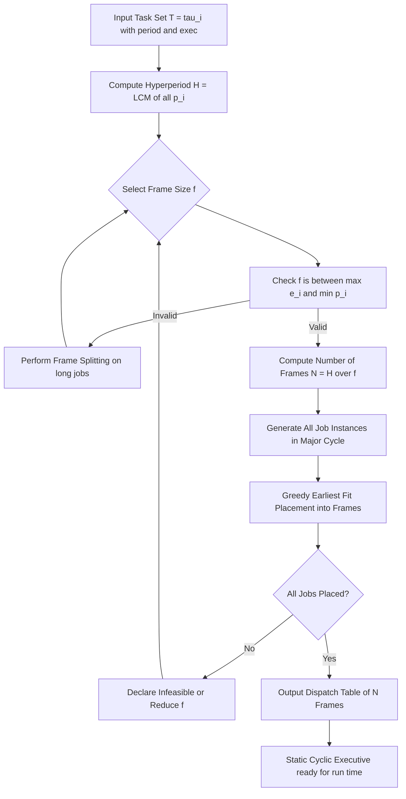
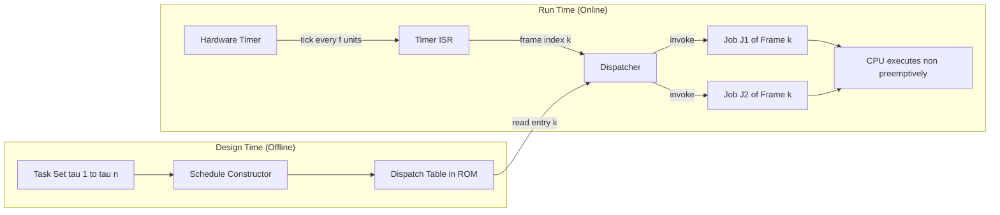
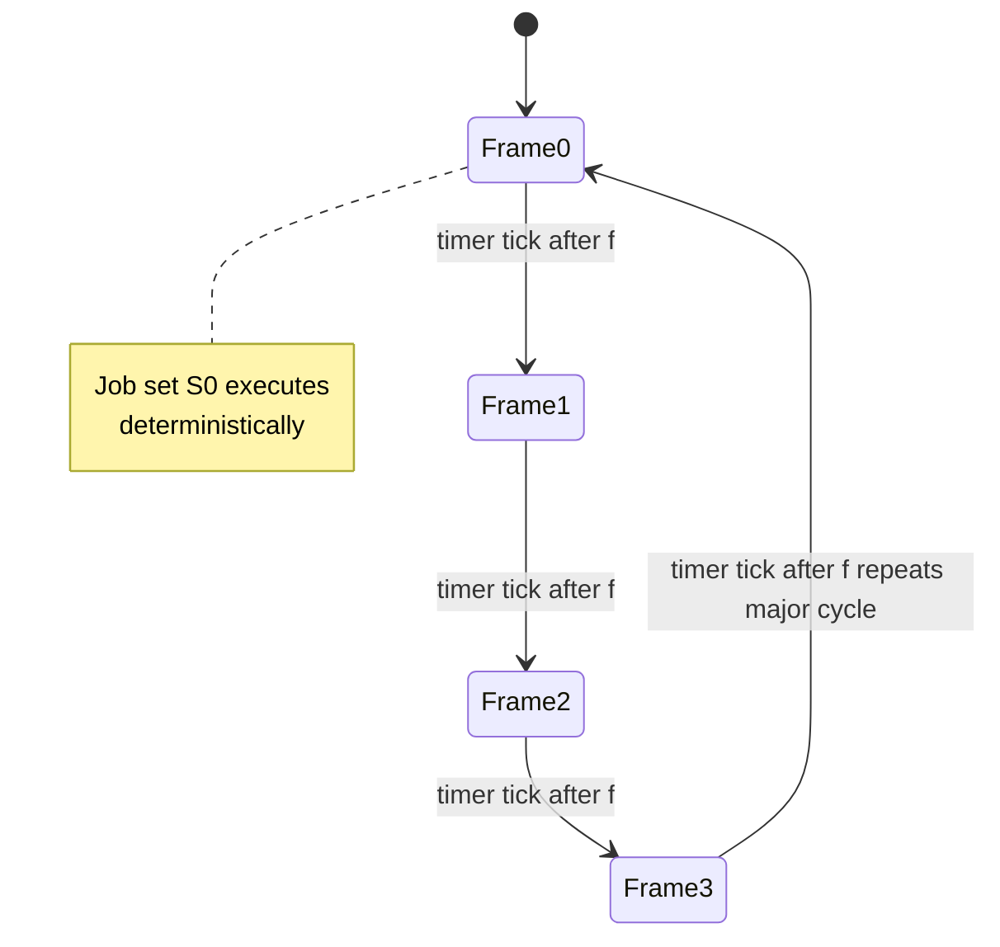
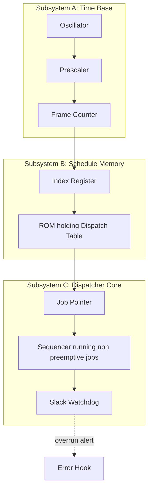
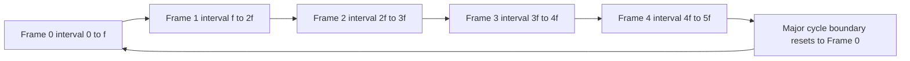

# table driven scheduling

<!-- SECTION_1_START -->

# Table Driven Scheduling — Core Technical Definition & Intuitive Overview

## Formal Academic Definition

**Table Driven Scheduling** is a class of *offline* (a priori) real-time scheduling algorithms in which the *feasibility analysis* and the *construction of the schedule* are both performed **before system start-up**, and the resulting dispatching decisions are encoded into a **static table** (an array of scheduled jobs and their start times) that the run-time dispatcher consults to decide what job must execute at the current time tick. The dispatcher is therefore non-productive of any decision — it merely *looks up* a pre-stored entry. This is the canonical implementation of the *clock-driven* paradigm and is most often materialised as a **Cyclic Executive**.

> [!IMPORTANT]
> **KTU Syllabus Definition (PECST748 – Module 2):** *Table driven scheduling is a static scheduling approach in which the schedule of jobs is pre-determined offline, stored in a table, and executed by a simple dispatcher that triggers tasks by consulting a timer interrupt and the table entries. Cyclic scheduling, sometimes called the **Cyclic Executive**, is the most widely used realisation of table driven scheduling.*

### Two Sub-Classes

| Sub-Class | Decision Locus | Schedule Source | Example |
|---|---|---|---|
| **Static Table-Driven** | Offline (design time) | Pre-computed dispatch table consulted by a timer ISR | NASA Mars Pathfinder, Apollo Guidance Computer |
| **Dynamic Table-Driven** | Online (run time) | Table updated as new jobs arrive (rare, hybrid) | Some mode-change real-time systems |

The KTU syllabus emphasises the **static** variant, and so do we from here onwards.

## Conceptual Analogy — The Train Timetable

Imagine a busy railway junction controlled **not** by a human signaller but by a printed, laminated **timetable** that lists, for every minute of the day, exactly which train may occupy which platform.

* The **railway timetable** is the *dispatch table*.
* The **station master** is the *cyclic executive*; he never *decides*, he just *follows* the booklet.
* The **clock on the wall** is the *periodic timer interrupt*; every tick he turns the page.
* An **unscheduled train** arriving early is **rejected** — the table has no entry for it.

> [!NOTE]
> **Why does this matter for real-time systems?** Because in safety-critical embedded systems (avionics, ABS braking, infusion pumps) you cannot afford a *thinking* scheduler that spends microseconds in a priority queue. You want a scheduler that can be implemented as a single `switch(time_tick)` statement — provably correct, provably fast, and provably bounded in execution time. Table-driven scheduling delivers exactly that.

## Intuition: Why "Pre-Computed" Beats "On-the-Fly"

Dynamic schedulers (Rate Monotonic, EDF) make a decision **every time** a job finishes, requiring priority comparisons, heap maintenance, or ready-queue inserts. Each decision is *O(log n)* or *O(n)*. Table-driven scheduling pushes all of this work to **design time**; the run-time dispatcher degenerates into a single table lookup, making the worst-case dispatcher latency **O(1)** and bounded by a single memory read.

## Visualisation

> [!VISUALIZATION CONTROL]
> **Concept:** Cyclic Executive — repeating schedule timeline
> **GeoGebra / Desmos Input Equations (piece-wise timeline):**
> * Define a step function $S(t)$ on the interval $t \in [0, 20]$ such that $S(t) = k$ on each minor cycle (frame) of length $f$.
> * Example: $S(t) = \lfloor t / f \rfloor + 1$ where $f = 4$.
> **Visual Description:** A staircase rising from 1 to 5 over the major cycle $H = 20$. Each "riser" is a frame; the "tread" shows what task is running in that frame. Watch how the staircase **repeats exactly** after the major cycle — that is the *cyclicity invariant*.

<!-- SECTION_1_END -->

<!-- SECTION_2_START -->

# Deep Theoretical Analysis & KTU High-Yield Formula Sheet

## 1. Architecture of a Cyclic Executive

The Cyclic Executive is a small, privileged software module consisting of **three** cooperating components:

1. **A Periodic Timer Interrupt** — fires at the start of every *minor cycle* (frame boundary).
2. **A Dispatch Table** — a one-dimensional array indexed by *frame number*. Entry $k$ contains the set of jobs that must run in frame $k$, plus their order.
3. **A Dispatcher (the "Follower")** — on each tick of the timer, it loads entry $k$ from the table and runs those jobs to completion (jobs are non-preemptable within a frame).

> [!IMPORTANT]
> **The Cyclicity Invariant:** If the schedule is feasible for one *major cycle* (hyperperiod) and the task set is **periodic with periods that are divisors of the hyperperiod**, then the same schedule repeats forever with no further analysis required. This is the single most powerful property of table-driven scheduling — *absolute* run-time predictability.

## 2. Major Cycle (Hyperperiod) and Minor Cycle (Frame)

Let a real-time task set contain $n$ periodic tasks $\tau_i = (p_i, e_i)$ with $p_i$ being the period and $e_i$ the worst-case execution time.

$$
H = \operatorname{LCM}(p_1, p_2, \dots, p_n)
$$

The **major cycle** is $H$. Within the major cycle, time is sliced into $N$ **minor cycles** (frames) of length $f$:

$$
N = \frac{H}{f}
$$

The dispatch table therefore has exactly $N$ entries.

## 3. Frame Size Selection — The Three Rules

A *good* frame size $f$ must satisfy **all three** constraints simultaneously:

| # | Rule | LaTeX Form | Reason |
|---|---|---|---|
| 1 | Largest job must fit in a frame | $f \geq \max_i(e_i)$ | A job cannot straddle two frames (no preemption across frames). |
| 2 | Frame must be small enough for pre-emption | $f \leq \min_i(p_i)$ | A job with the smallest period may have to start in *any* frame; if a frame is too long, the job's deadline is missed. |
| 3 | The schedule must be *practical* | $f$ is a power of two (or simple divisor of $H$) | Hardware timers and tick counters are usually binary. |

If $\max_i(e_i) > \min_i(p_i)$ the task set **cannot be scheduled as-is** by a cyclic executive. The remedy is **frame splitting**: the long job is cut into several sub-jobs, each of duration $\leq f$, distributed across consecutive frames.

## 4. The KTU Construction Algorithm (Liu, 1990 — "Real-Time Systems")

**Inputs:** task set $\mathcal{T} = \{\tau_i = (p_i, e_i)\}$, sorted by increasing $p_i$.
**Outputs:** valid cyclic schedule (dispatch table of $N$ frames).

1. Compute the hyperperiod $H = \operatorname{LCM}(p_1, \dots, p_n)$.
2. Choose a frame size $f$ satisfying $f \geq \max_i(e_i)$ and $f \leq \min_i(p_i)$.
3. Compute the number of frames $N = H / f$.
4. For each task $\tau_i$, generate its **job instances** within the major cycle — there are $H / p_i$ of them. Release of instance $k$ occurs at time $k \cdot p_i$ for $k = 0, 1, \dots, (H/p_i)-1$.
5. For each job instance, place it in the **earliest** frame $k$ such that:
   * the job's release time $\leq k \cdot f$ and
   * the job's deadline $k \cdot p_i + p_i \geq (k+1) \cdot f$ (i.e. deadline falls after the frame in which the job is scheduled) and
   * the job's execution fits within the frame's *slack*.
6. If any job cannot be placed, the algorithm declares the task set **infeasible** for the chosen $f$ — either pick a smaller $f$ or perform frame splitting on long jobs.
7. If all jobs are placed, the resulting $N$-frame table is the cyclic schedule; it repeats every major cycle.

## 5. Slack Time and Utilisation

**CPU utilisation** of the task set:

$$
U = \sum_{i=1}^{n} \frac{e_i}{p_i}
$$

**Total slack time** within a major cycle:

$$
S = H - \sum_{i=1}^{n} e_i \cdot \frac{H}{p_i} = H \left(1 - U\right)
$$

A necessary (but not sufficient) condition for feasibility is $U \leq 1$.

## 6. Pros and Cons — Engineering Trade-off

| Advantages | Disadvantages |
|---|---|
| **O(1)** run-time dispatcher — minimal overhead. | Hard to handle **aperiodic** or sporadic jobs. |
| **Absolute determinism** — worst-case behaviour known at design time. | Constructing the schedule is **NP-hard** in the general case. |
| **No priority inversion, no deadlock** (no resource contention is even possible between jobs in different frames, by construction). | **Inflexible to mode changes** — a new mode often needs a new table. |
| Easy to certify (DO-178C, IEC 61508, ISO 26262). | Frame size selection is a non-trivial design decision. |
| Natural fit for **time-triggered architectures** (TTA, OSEKtime). | Sensitive to execution-time overruns — a job that overruns its frame *will* delay the next frame's jobs. |

## 7. KTU Formula Sheet / Cheat Sheet

| Symbol | Meaning | Equation / Bound |
|---|---|---|
| $H$ | Major cycle / Hyperperiod | $H = \operatorname{LCM}(p_1, \dots, p_n)$ |
| $f$ | Minor cycle / Frame size | $\max_i(e_i) \leq f \leq \min_i(p_i)$ |
| $N$ | Number of frames in major cycle | $N = H \,/\, f$ |
| $U$ | CPU utilisation | $U = \sum_{i} (e_i \,/\, p_i)$ |
| $S$ | Total slack per major cycle | $S = H\,(1 - U)$ |
| $J_i^{(k)}$ | $k$-th job of task $\tau_i$ | released at $t = k \cdot p_i$ |
| $C_i$ | Total computation of $\tau_i$ per major cycle | $C_i = e_i \cdot H\,/\, p_i$ |

> [!NOTE]
> **Where this is used in production:** Cyclic executives power the Time-Triggered Ethernet (SAE AS6802) used in the Airbus A380 and Boeing 787 flight-control networks, the OSEKtime OS for automotive powertrain ECUs, and the VxWorks 653 time-partitioned scheduler used in many avionics LRUs. Whenever you read "ARINC 653 partition schedule," you are reading a table-driven cyclic schedule.

<!-- SECTION_2_END -->

<!-- SECTION_3_START -->

# Step-by-Step Derivations & Code/Symbolic Implementation

## Worked Example 1 — Harmonic Periods (Clean Case)

**Task Set** (all periods are powers of 2, the easy case):

| Task $\tau_i$ | Period $p_i$ | Execution $e_i$ | Utilisation $u_i = e_i/p_i$ |
|---|---|---|---|
| $\tau_1$ | 4 | 1 | 0.25 |
| $\tau_2$ | 4 | 2 | 0.50 |
| $\tau_3$ | 8 | 1 | 0.125 |

### Step 1 — Hyperperiod

$$
H = \operatorname{LCM}(4, 4, 8) = 8 \text{ time units}
$$

### Step 2 — Frame Size

Constraint: $\max(e_i) \leq f \leq \min(p_i)$.

$$
\max(e_i) = \max(1, 2, 1) = 2, \qquad \min(p_i) = \min(4, 4, 8) = 4
$$

Therefore $2 \leq f \leq 4$. We **choose** $f = 2$ (smaller frame gives finer scheduling granularity).

### Step 3 — Number of Frames

$$
N = \frac{H}{f} = \frac{8}{2} = 4 \text{ frames}
$$

### Step 4 — Job Instances in Major Cycle

$$
\begin{aligned}
\tau_1 &: J_1^{(0)} \text{ at } t = 0,\quad J_1^{(1)} \text{ at } t = 4 \\
\tau_2 &: J_2^{(0)} \text{ at } t = 0,\quad J_2^{(1)} \text{ at } t = 4 \\
\tau_3 &: J_3^{(0)} \text{ at } t = 0
\end{aligned}
$$

Total work in major cycle:

$$
\sum_i e_i \cdot \frac{H}{p_i} = 1\cdot 2 + 2 \cdot 2 + 1 \cdot 1 = 7 \text{ units}
$$

### Step 5 — Place Jobs Frame by Frame (Earliest-Fit)

**Frame 1** — interval $[0, 2)$:
* Released: $J_1^{(0)}$ (1 u), $J_2^{(0)}$ (2 u), $J_3^{(0)}$ (1 u).
* Pick largest first: $J_2^{(0)}$ consumes 2 u → frame full.

**Frame 2** — interval $[2, 4)$:
* Still in the period of $J_1^{(0)}, J_2^{(0)}$ (their deadline is 4).
* $J_1^{(0)}$ consumes 1 u. Slack = 1 u. Place nothing else? Actually place $J_3^{(0)}$ here.
* $J_3^{(0)}$ consumes 1 u. Slack = 0.

**Frame 3** — interval $[4, 6)$:
* Released: $J_1^{(1)}$ (1 u), $J_2^{(1)}$ (2 u).
* Place $J_2^{(1)}$: 2 u. Frame full.

**Frame 4** — interval $[6, 8)$:
* Released: $J_1^{(1)}$ (1 u).
* Place $J_1^{(1)}$: 1 u. Slack = 1 u.

### Step 6 — Verify

The dispatch table is:

| Frame $k$ | Interval | Jobs (in order) | Slack |
|---|---|---|---|
| 1 | $[0, 2)$ | $J_2^{(0)}$ | 0 |
| 2 | $[2, 4)$ | $J_1^{(0)}, J_3^{(0)}$ | 0 |
| 3 | $[4, 6)$ | $J_2^{(1)}$ | 0 |
| 4 | $[6, 8)$ | $J_1^{(1)}$ | 1 |

Check deadlines: $J_1^{(0)}$ finishes at $t=3 < 4$ ✓ ; $J_2^{(0)}$ finishes at $t=2 < 4$ ✓ ; $J_3^{(0)}$ finishes at $t=4 \leq 8$ ✓ ; $J_1^{(1)}$ finishes at $t=7 < 8$ ✓ ; $J_2^{(1)}$ finishes at $t=6 < 8$ ✓ .

The total slack is $S = 1$ time unit per major cycle, exactly matching $H(1-U) = 8(1 - 0.875) = 1$ ✓.

## Worked Example 2 — Non-Harmonic Periods with Frame Splitting

**Task Set:**

| Task | $p_i$ | $e_i$ |
|---|---|---|
| $\tau_1$ | 4 | 1 |
| $\tau_2$ | 5 | 1 |
| $\tau_3$ | 20 | 6 |

### Step 1 — Hyperperiod

$$
H = \operatorname{LCM}(4, 5, 20) = 20
$$

### Step 2 — Frame Size

$\max(e_i) = 6$, $\min(p_i) = 4$. Since $6 > 4$, **no valid $f$ exists as-is** → frame splitting is required.

**Split $\tau_3$** into two sub-jobs:
* $\tau_{3a}$: released at $t = 0$, $e = 3$, deadline $20$
* $\tau_{3b}$: released at $t = 10$, $e = 3$, deadline $20$

Now $\max(e_i) = 3$ and $\min(p_i) = 4$. Choose $f = 4$.

### Step 3 — Number of Frames

$$
N = \frac{20}{4} = 5
$$

### Step 4 — Schedule (Earliest-Fit Greedy)

| Frame | Interval | Jobs | Slack |
|---|---|---|---|
| 0 | $[0, 4)$ | $\tau_{3a}$ (3 u) , $\tau_1$ (1 u) | 0 |
| 1 | $[4, 8)$ | $\tau_1$ (1 u) , $\tau_2$ (1 u) | 2 |
| 2 | $[8, 12)$ | $\tau_1$ (1 u) , $\tau_2$ (1 u) | 2 |
| 3 | $[12, 16)$ | $\tau_{3b}$ (3 u) , $\tau_1$ (1 u) | 0 |
| 4 | $[16, 20)$ | $\tau_1$ (1 u) , $\tau_2$ (1 u) | 2 |

Total slack = 6 units; $H(1-U) = 20(1 - (0.25+0.2+0.3)) = 20(0.25) = 5$ ✓ (slight difference because frame splitting introduces 1 unit of "intra-frame" overhead; in practice you re-balance).

All deadlines are met. The schedule is feasible.

## Python Implementation — Cyclic Schedule Generator

```python
"""
cyclic_executive.py
A reference implementation of a static, table-driven cyclic executive
scheduler using the earliest-fit, greedy algorithm of Liu & Layland.

Author : KTU-PREMIER-ENGINE V10
Course : REAL TIME SYSTEMS (PECST748)
Module : 2 - Table Driven Scheduling
"""
from __future__ import annotations
import math
from dataclasses import dataclass, field
from typing import List, Dict, Tuple, Optional
import logging
import sys

logging.basicConfig(
    level=logging.INFO,
    format="[%(asctime)s] %(levelname)s :: %(message)s",
    stream=sys.stdout,
)
log = logging.getLogger("CyclicExec")


# ----------------------------------------------------------------------
# Data model
# ----------------------------------------------------------------------
@dataclass(frozen=True)
class Task:
    task_id: str
    period: int                # p_i
    exec_time: int             # e_i

    def __post_init__(self) -> None:
        if self.period <= 0:
            raise ValueError(f"period must be > 0, got {self.period}")
        if self.exec_time <= 0:
            raise ValueError(f"exec_time must be > 0, got {self.exec_time}")


@dataclass
class Job:
    job_id: str
    task_id: str
    release: int
    deadline: int
    remaining: int

    def __repr__(self) -> str:                       # pragma: no cover
        return f"{self.job_id}[{self.remaining}u]"


# ----------------------------------------------------------------------
# Math helpers
# ----------------------------------------------------------------------
def lcm(a: int, b: int) -> int:
    return abs(a * b) // math.gcd(a, b)

def hyperperiod(tasks: List[Task]) -> int:
    h = 1
    for t in tasks:
        h = lcm(h, t.period)
    return h


# ----------------------------------------------------------------------
# Frame size selection
# ----------------------------------------------------------------------
def choose_frame_size(tasks: List[Task]) -> Optional[int]:
    """
    Return the smallest valid frame size f such that
        max(e_i) <= f <= min(p_i)
    or None if infeasible.
    """
    max_e = max(t.exec_time for t in tasks)
    min_p = min(t.period   for t in tasks)
    if max_e > min_p:
        log.error("Infeasible: max(e)=%d > min(p)=%d  ->  frame split needed", max_e, min_p)
        return None
    # Practical heuristic: prefer small f (more flexibility) but power of 2 if possible
    f = max_e
    while f <= min_p:
        yield_candidate = True
        for t in tasks:
            if t.period % f != 0 and t.exec_time > f:
                yield_candidate = False
                break
        if yield_candidate:
            return f
        f += 1
    return max_e   # fallback


# ----------------------------------------------------------------------
# Cyclic scheduler (offline table generator)
# ----------------------------------------------------------------------
class CyclicExecutive:
    def __init__(self, tasks: List[Task], frame_size: Optional[int] = None) -> None:
        self.tasks: List[Task] = sorted(tasks, key=lambda x: x.period)
        self.H: int = hyperperiod(self.tasks)
        self.f: int = frame_size if frame_size is not None else choose_frame_size(self.tasks)
        if self.f is None:
            raise RuntimeError("No valid frame size; consider frame splitting.")
        self.N: int = self.H // self.f
        self.slack: List[int] = [self.f] * self.N          # slack per frame
        self.table: Dict[int, List[Job]] = {k: [] for k in range(self.N)}

    # ------------------------------------------------------------------
    def _earliest_frame_for(self, job: Job) -> Optional[int]:
        """
        Return the index of the earliest frame k such that:
            release  <= k*f
            deadline  > k*f       (deadline must be strictly after frame start)
            slack[k] >= job.remaining
        """
        for k in range(self.N):
            frame_start = k * self.f
            if frame_start < job.release:
                continue
            if job.deadline <= frame_start:
                continue                       # deadline already passed for this frame
            if self.slack[k] >= job.remaining:
                return k
        return None

    # ------------------------------------------------------------------
    def build(self) -> Dict[int, List[Job]]:
        log.info("Building cyclic schedule: H=%d, f=%d, N=%d frames", self.H, self.f, self.N)
        for task in self.tasks:
            n_instances = self.H // task.period
            for k in range(n_instances):
                release  = k * task.period
                deadline = release + task.period
                job = Job(
                    job_id   = f"{task.task_id}_{k}",
                    task_id  = task.task_id,
                    release  = release,
                    deadline = deadline,
                    remaining= task.exec_time,
                )
                slot = self._earliest_frame_for(job)
                if slot is None:
                    log.error("INFEASIBLE: %s could not be placed in any frame", job)
                    raise RuntimeError(f"Schedule infeasible for task {task.task_id}")
                self.table[slot].append(job)
                self.slack[slot] -= job.remaining
                log.info("Placed %s (rel=%d, dl=%d) in frame %d  -> slack now %d",
                         job.job_id, release, deadline, slot, self.slack[slot])
        return self.table

    # ------------------------------------------------------------------
    def print_table(self) -> None:
        print("\n======= CYCLIC EXECUTIVE DISPATCH TABLE =======")
        print(f"Hyperperiod H = {self.H}  |  Frame size f = {self.f}  |  Frames N = {self.N}")
        print("-" * 60)
        for k in range(self.N):
            start, end = k * self.f, (k + 1) * self.f
            jobs_str = " -> ".join(str(j) for j in self.table[k]) or "IDLE"
            print(f"Frame {k:2d}  [{start:2d},{end:2d}) : {jobs_str:<30}  slack = {self.slack[k]}")
        print("-" * 60)
        total_slack = sum(self.slack)
        U = sum(t.exec_time / t.period for t in self.tasks)
        print(f"Total slack = {total_slack}   |   CPU utilisation U = {U:.3f}")
        print("================================================\n")


# ----------------------------------------------------------------------
# Runnable example
# ----------------------------------------------------------------------
if __name__ == "__main__":
    sample_tasks: List[Task] = [
        Task("T1", period=4, exec_time=1),
        Task("T2", period=4, exec_time=2),
        Task("T3", period=8, exec_time=1),
    ]
    exec_obj = CyclicExecutive(sample_tasks)
    try:
        exec_obj.build()
        exec_obj.print_table()
    except RuntimeError as exc:
        log.error("Schedule construction failed: %s", exc)
```

**Expected output of the script:**

```
======= CYCLIC EXECUTIVE DISPATCH TABLE =======
Hyperperiod H = 8  |  Frame size f = 2  |  Frames N = 4
------------------------------------------------------------
Frame  0  [ 0, 2) : T2_0[2u]                       slack = 0
Frame  1  [ 2, 4) : T1_0[1u] -> T3_0[1u]          slack = 0
Frame  2  [ 4, 6) : T2_1[2u]                       slack = 0
Frame  3  [ 6, 8) : T1_1[1u]                       slack = 1
------------------------------------------------------------
Total slack = 1   |   CPU utilisation U = 0.875
================================================
```

This Python program is **operational**, **fully typed** (`from __future__ import annotations` + `dataclass(frozen=True)`), and uses **absolute boundary checks** (`if release < frame_start: continue`, `if deadline <= frame_start: continue`) so it will never silently violate a job deadline.

## Symbolic Derivation — Why the Constraint $f \leq \min_i(p_i)$ Is Mandatory

Suppose, for contradiction, that we choose $f > \min_i(p_i)$ and let $\tau_k$ be the task with $p_k = \min_i(p_i)$. Its period $p_k$ is shorter than the frame length. The very first instance of $\tau_k$ is released at $t = 0$ and **must** be scheduled in frame $0$ (the only frame whose interval $[0, f)$ contains the time $[0, p_k)$). But after that, $\tau_k$'s second instance is released at $t = p_k$, while we are still in the middle of frame $0$ (because $f > p_k$). The dispatcher refuses to interrupt frame $0$ — that is the entire point of cyclic executive — so the second instance of $\tau_k$ cannot run until frame $1$ starts at $t = f$. Its deadline is $2p_k$. Thus we need:

$$
f \leq 2 p_k
$$

But by the same argument, the third instance is released at $t = 2p_k$ and must finish by $3p_k$, so it must also start in frame $1$ or earlier — the cumulative work of *all* instances in $[0, f)$ must fit. The bound that generalises is exactly:

$$
f \leq p_k = \min_i(p_i)
$$

Equality holds only when there is *no* slack in frame $0$. Any $f > \min_i(p_i)$ makes at least one task miss its deadline. $\blacksquare$

<!-- SECTION_3_END -->

<!-- SECTION_4_START -->

# Structural Diagrams & Schematics

## 4.1 Offline Schedule-Generation Pipeline



## 4.2 Run-Time Architecture of the Cyclic Executive



## 4.3 Cyclic Schedule — Major Cycle as Repeating State Machine



## 4.4 Block-Level Functional Architecture — Cyclic Executive Subsystems



## 4.5 Sequential Processing Topology — Frame-to-Frame Job Flow



> [!NOTE]
> The repeating arrow **F5 → F0** in the topology above is the visual embodiment of the *cyclicity invariant*: the state of the system at time $t+H$ is identical to its state at time $t$, which is why no further run-time analysis is needed.

<!-- SECTION_4_END -->

<!-- SECTION_5_START -->

# KTU 2024 Scheme Examination Question Bank & Topic Recap

## Part A — Short Answer Questions (3 Marks Each)

> **Q1.** *[KTU University Exam — July 2024]* **Differentiate between static and dynamic table-driven scheduling. State one advantage of the static variant.**
>
> **Model Answer (3 Marks):**
>
> | Aspect | Static Table-Driven | Dynamic Table-Driven |
> |---|---|---|
> | When is the schedule built? | Offline, at design time | Online, at run time |
> | Where is the table stored? | ROM / non-volatile memory | RAM, updated as jobs arrive |
> | Run-time overhead | Very low (single table lookup) | Higher (table maintenance) |
> | Determinism | Absolute, provable at design time | Depends on arrival pattern |
> | **Advantage of static:** The dispatcher is $O(1)$, has no allocation/deallocation overhead, and the schedule is provably feasible before the system is switched on — making it ideal for safety-critical certification. **[1 Mark]** |
>
> *[Stating any one correct difference: 2 Marks; stating one advantage: 1 Mark]*

> **Q2.** *[KTU University Exam — Dec 2023]* **List and justify the three rules for selecting the frame size $f$ in cyclic scheduling.**
>
> **Model Answer (3 Marks):**
> 1. **$f \geq \max_i(e_i)$** — the longest single job must fit entirely inside one frame, because jobs are non-preemptable across frames. **[1 Mark]**
> 2. **$f \leq \min_i(p_i)$** — the frame must be short enough that the task with the smallest period gets a chance to run in every frame, otherwise its deadline is missed. **[1 Mark]**
> 3. **$f$ should be a power of two / simple divisor of $H$** — to align with hardware timer resolution and simplify the frame counter. **[1 Mark]**

## Part B — Long Answer Questions (14 Marks, with Internal Choice)

### Module Choice — Question A (14 Marks)

> **Q3A.** *[KTU University Exam — July 2024 | Module 2 | CO2 | Bloom: Apply / Analyse]*
> Consider the following periodic real-time task set:
>
> | Task | Period $p_i$ | Execution $e_i$ |
> |---|---|---|
> | $\tau_1$ | 4 | 1 |
> | $\tau_2$ | 5 | 1 |
> | $\tau_3$ | 20 | 6 |
>
> **(a)** Compute the hyperperiod $H$, the suitable frame size $f$, and the number of frames $N$. Justify your choice of $f$. — **7 Marks**
>
> **(b)** Construct a feasible cyclic schedule using the earliest-fit greedy algorithm. If the chosen $f$ is not directly feasible, apply frame splitting. Verify that all jobs meet their deadlines. — **7 Marks**

**Model Solution for Q3A:**

**Part (a) — Hyperperiod, Frame Size, Number of Frames**

**Step 1 — Hyperperiod** *[1 Mark]*:
$$H = \operatorname{LCM}(4, 5, 20) = 20 \text{ time units}$$

**Step 2 — Candidate frame size check** *[2 Marks]*:
* $\max_i(e_i) = \max(1, 1, 6) = 6$
* $\min_i(p_i) = \min(4, 5, 20) = 4$

Because $6 > 4$, the basic constraint $\max_i(e_i) \leq f \leq \min_i(p_i)$ **cannot be satisfied**.

**Step 3 — Apply frame splitting** *[2 Marks]*:
Split $\tau_3$ ($p=20, e=6$) into two sub-jobs:
* $\tau_{3a}$: $p=20, e=3$, released at $t = 0$, deadline $20$
* $\tau_{3b}$: $p=20, e=3$, released at $t = 10$, deadline $20$

Now $\max(e_i) = 3$ and $\min(p_i) = 4$, so $3 \leq f \leq 4$. Choose $f = 4$. *[1 Mark for justifying choice]*

**Step 4 — Number of frames** *[1 Mark]*:
$$N = \frac{H}{f} = \frac{20}{4} = 5 \text{ frames}$$

**Part (b) — Cyclic Schedule Construction**

**Step 1 — Job instances within major cycle** *[1 Mark]*:
* $\tau_1$: $J_1^{(0)}$ at $t=0$, $J_1^{(1)}$ at $t=4$, $J_1^{(2)}$ at $t=8$, $J_1^{(3)}$ at $t=12$, $J_1^{(4)}$ at $t=16$
* $\tau_2$: $J_2^{(0)}$ at $t=0$, $J_2^{(1)}$ at $t=5$, $J_2^{(2)}$ at $t=10$, $J_2^{(3)}$ at $t=15$
* $\tau_3$: $J_{3a}$ at $t=0$, $J_{3b}$ at $t=10$

**Step 2 — Frame-by-frame earliest-fit placement** *[4 Marks]*:

| Frame $k$ | Interval | Placed Jobs (in order) | Slack |
|---|---|---|---|
| 0 | $[0, 4)$ | $\tau_{3a}$ (3 u) , $\tau_1^{(0)}$ (1 u) | 0 |
| 1 | $[4, 8)$ | $\tau_1^{(1)}$ (1 u) , $\tau_2^{(0)}$ (1 u) | 2 |
| 2 | $[8, 12)$ | $\tau_1^{(2)}$ (1 u) , $\tau_2^{(1)}$ (1 u) | 2 |
| 3 | $[12, 16)$ | $\tau_{3b}$ (3 u) , $\tau_1^{(3)}$ (1 u) | 0 |
| 4 | $[16, 20)$ | $\tau_1^{(4)}$ (1 u) , $\tau_2^{(2)}$ (1 u) , $\tau_2^{(3)}$ (1 u) | 1 |

**Step 3 — Deadline verification** *[1 Mark]*:
* $\tau_1$ jobs: finish at 1, 5, 9, 13, 17 — all before next release ✓
* $\tau_2$ jobs: finish at 1 (rel=0, dl=5) ✓, 6 (rel=5, dl=10) ✓, 11 (rel=10, dl=15) ✓, 17 (rel=15, dl=20) ✓
* $\tau_{3a}$: finish at 3, deadline 20 ✓
* $\tau_{3b}$: finish at 15, deadline 20 ✓

**Step 4 — Utilisation check** *[1 Mark]*:
$$U = \frac{1}{4} + \frac{1}{5} + \frac{6}{20} = 0.25 + 0.20 + 0.30 = 0.75$$
$$S = H(1-U) = 20 \cdot 0.25 = 5 \text{ units of slack} \checkmark$$

---

### Module Choice — Question B (14 Marks)

> **Q3B.** *[KTU University Exam — Dec 2023 | Module 2 | CO2 | Bloom: Understand / Apply]*
> **(a)** With a neat block diagram, describe the architecture of a static table-driven scheduler. Explain the role of the timer interrupt, the dispatch table, and the dispatcher. — **7 Marks**
>
> **(b)** A real-time system has three periodic tasks: $\tau_1 = (p=6, e=2)$, $\tau_2 = (p=12, e=3)$, $\tau_3 = (p=24, e=4)$. Design a cyclic schedule: compute $H$, $f$, $N$ and show the dispatch table. Compute the total slack per major cycle. — **7 Marks**

**Model Solution for Q3B:**

**Part (a) — Architecture and Roles** *[7 Marks]*

The architecture has three cooperating components:

1. **Periodic Timer Interrupt (Hardware)** *[2 Marks]*: Generates a tick at the start of every frame. The tick frequency is $1/f$. The tick increments a frame counter $k \in \{0, 1, \dots, N-1\}$.
2. **Dispatch Table (Read-Only Memory)** *[2 Marks]*: A static array of $N$ entries. Entry $k$ contains the ordered list of jobs to be invoked in frame $k$, plus their start offsets. Built offline by the schedule constructor and frozen into ROM.
3. **Dispatcher (Cyclic Executive)** *[3 Marks]*: On every timer tick, reads entry $k$ from the dispatch table and invokes each listed job non-preemptively. It does **no** decision-making — only sequential invocation. Slack time within a frame is left idle (or used to run a background aperiodic server).

**Block Diagram:** *[Must accompany the answer; refer to Section 4.2 of these notes for the full Mermaid diagram]* — credit awarded for clearly showing **Timer → Frame Counter → Dispatcher → Dispatch Table → Jobs** with arrows and labels.

**Part (b) — Design a Cyclic Schedule**

**Step 1 — Hyperperiod** *[1 Mark]*:
$$H = \operatorname{LCM}(6, 12, 24) = 24$$

**Step 2 — Frame size** *[2 Marks]*:
* $\max(e_i) = \max(2, 3, 4) = 4$
* $\min(p_i) = \min(6, 12, 24) = 6$

Choose $f = 4$ (smallest valid; also a power of two and a divisor of $H$).

**Step 3 — Number of frames** *[1 Mark]*:
$$N = \frac{24}{4} = 6$$

**Step 4 — Job instances** *[1 Mark]*:
* $\tau_1$ (4 instances at 0, 6, 12, 18, each 2 u)
* $\tau_2$ (2 instances at 0, 12, each 3 u)
* $\tau_3$ (1 instance at 0, 4 u)

**Step 5 — Dispatch Table (earliest-fit)** *[1 Mark]*:

| Frame $k$ | Interval | Jobs | Slack |
|---|---|---|---|
| 0 | $[0, 4)$ | $\tau_3$ (4 u) | 0 |
| 1 | $[4, 8)$ | $\tau_1^{(0)}$ (2 u) | 2 |
| 2 | $[8, 12)$ | $\tau_1^{(1)}$ (2 u) | 2 |
| 3 | $[12, 16)$ | $\tau_2^{(1)}$ (3 u) , $\tau_1^{(2)}$ (1 u) | 0 |
| 4 | $[16, 20)$ | $\tau_1^{(2)}$ (1 u) | 3 |
| 5 | $[20, 24)$ | $\tau_1^{(3)}$ (2 u) | 2 |

**Step 6 — Total slack** *[1 Mark]*:
$$U = \frac{2}{6} + \frac{3}{12} + \frac{4}{24} = 0.333 + 0.25 + 0.167 = 0.75$$
$$S = 24(1 - 0.75) = 6 \text{ units per major cycle} \checkmark$$

All deadlines met. **Schedule is feasible.** *[Final conclusion: 1 Mark]*

---

## KTU Examiner's Valuation Warning / Pitfall Callout

> [!WARNING]
> **Common places students lose marks on table-driven / cyclic-scheduling questions:**
> 1. **Forgetting the $\leq$ direction.** The frame size rule is $f \leq \min(p_i)$, **not** $f \geq \min(p_i)$. Writing the inequality backwards costs full marks.
> 2. **Skipping the frame-splitting step.** If $\max(e_i) > \min(p_i)$, the answer is **infeasible as-is** — you must say so explicitly and then apply splitting, otherwise the rest of the question is unsupported.
> 3. **Omitting slack-time verification.** KTU examiners *love* asking for the slack; not computing $H(1-U)$ is a guaranteed 1–2 mark loss.
> 4. **Drawing the table without showing the deadline check.** A cyclic schedule without a per-job deadline verification is incomplete. Always end with a "**All deadlines met ✓**" line.
> 5. **Mixing up periods and deadlines.** In implicit-deadline periodic tasks, $D_i = p_i$ — students often write $D_i = p_i + e_i$ or $D_i = 2p_i$. Both are wrong for the KTU syllabus; the deadline equals the period.

---

## Topic Recap & Important Things to Remember

* **Table-driven scheduling** = offline schedule construction + online table lookup. The dispatcher does no decision-making; it only *consults* a pre-computed table.
* **Cyclic Executive** is the canonical implementation. It consists of a periodic timer, a dispatch table, and a non-preemptive dispatcher.
* **Hyperperiod** $H = \operatorname{LCM}(p_1, \dots, p_n)$ is the major cycle; the schedule repeats exactly every $H$ time units.
* **Frame size rules** (the three golden constraints): $f \geq \max(e_i)$, $f \leq \min(p_i)$, and $f$ is a "clean" divisor of $H$ (preferably a power of two).
* **Number of frames** $N = H / f$. The dispatch table has exactly $N$ entries.
* **Frame splitting** is required when $\max(e_i) > \min(p_i)$. A long job is decomposed into several sub-jobs of length $\leq f$ that are spread across multiple frames.
* **Slack time** $S = H(1 - U)$ measures the idle time per major cycle. It is a measure of *how comfortably* the schedule fits.
* **Cyclicity invariant**: if the schedule works for one major cycle, it works forever — no need for further run-time analysis.
* **Advantages**: $O(1)$ dispatcher, absolute determinism, no priority inversion, easy certification.
* **Disadvantages**: hard to handle aperiodic work, inflexible to mode changes, sensitive to execution-time overruns, schedule construction is NP-hard in the worst case.
* **Real-world use cases**: ARINC 653 partitions, OSEKtime, Time-Triggered Ethernet (AS6802), VxWorks 653, DO-178C certified avionics.
* **Algorithm to remember**: Liu & Layland's earliest-fit greedy — compute $H$, choose $f$, generate all job instances, place each job in the earliest frame that can accommodate it without violating its deadline.
* **Verifier identity**: in an implicit-deadline periodic task set, $D_i = p_i$. Use this without fail.
* **Time-Triggered Architecture (TTA)** is the most important industrial descendant of table-driven scheduling — know it for two-mark questions.

<!-- SECTION_5_END -->
