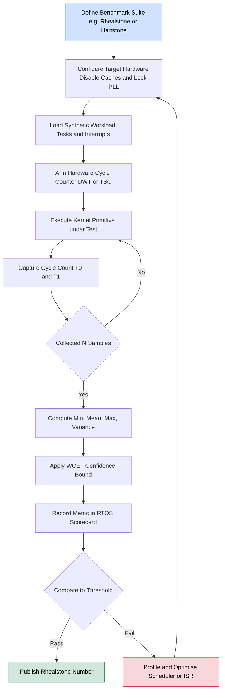
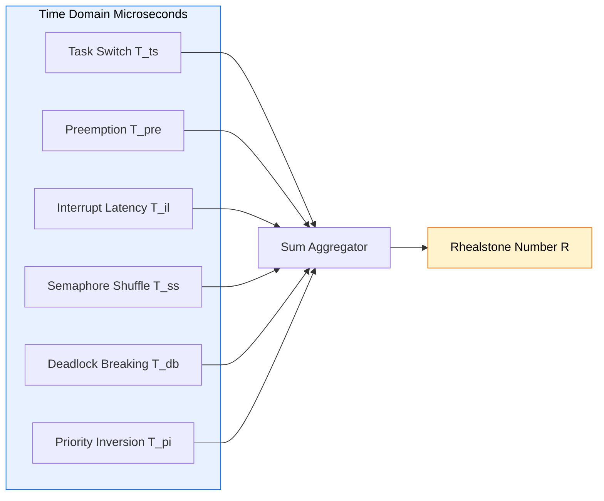

# benchmarking RT OS

<!-- SECTION_1_START -->
# RTOS Benchmarking: Core Technical Definition & Intuitive Overview

> [!IMPORTANT]
> **KTU 2024 Scheme — Module 3 (Commercial Real-Time Operating Systems)**
> *Benchmarking is the process of quantitatively measuring the temporal and functional performance of a Real-Time Operating System (RTOS) against a standardized workload, producing reproducible metrics that allow fair comparison between competing kernels.*

## 1.1 Formal Definition

According to the KTU 2024 syllabus (Course Code: **PECST748**), **Benchmarking an RTOS** is defined as:

> A systematic, repeatable procedure of executing a *deterministic test workload* on a Real-Time Operating System to measure key temporal parameters — such as context switch time, interrupt latency, task preemption time, semaphore shuffle time, deadlock recovery, and priority inversion handling — in order to assess its *worst-case* and *average-case* performance under strictly controlled hardware and software conditions.

The output of benchmarking is a **set of scalar metrics** (often expressed in microseconds, $\mu s$, or processor clock cycles) that quantify the responsiveness and predictability of the kernel scheduler.

> [!NOTE]
> **Predictability vs. Speed**
> In RTOS evaluation, *predictability* (deterministic, low jitter) is often more important than raw *speed*. A benchmark must therefore measure both the **average value** and the **worst-case bound** of every metric.

## 1.2 Conceptual Analogy

Imagine a **Formula 1 racing team** trying to choose between two engines for their car. They do not just race the car once. Instead, they take the engines to a **controlled test bench (dynamometer)** where:

* The fuel is identical for every test run.
* The ambient temperature is held constant at **$25^\circ C$**.
* A pre-defined driving cycle (acceleration, cruise, braking) is repeated thousands of times.
* A sensor records the *worst-case* lag between *throttle press* and *engine response*.

An **RTOS benchmark** works exactly the same way. The RTOS kernel is the engine, the controlled test bench is the **benchmarking suite** (e.g., Rhealstone, Hartstone), and the throttle-to-response measurement corresponds to metrics like **interrupt latency** or **context switch time**.

> [!TIP]
> **Why not just "run" the OS?**
> Application-level performance mixes user code behavior with kernel behavior. A benchmark *isolates* the kernel's contribution by using a synthetic, kernel-only workload.

## 1.3 Why Benchmarking Matters in Real-Time Engineering

| Use Case | Role of Benchmarking |
|---|---|
| **Selecting an RTOS for an embedded product** | Engineers compare FreeRTOS, VxWorks, QNX, RTEMS objectively before committing to a vendor. |
| **Validating Worst-Case Execution Time (WCET)** | Certifiable systems (DO-178C, ISO 26262) require documented proof of timing behavior. |
| **Porting the kernel to new hardware** | Benchmarks confirm that a BSP (Board Support Package) does not regress kernel performance. |
| **Regression testing across versions** | Ensures scheduler updates do not silently break timing guarantees. |

## 1.4 Standard Metrics at a Glance

The following **six (6) canonical metrics** form the foundation of the famous **Rhealstone benchmark** (introduced by Dr. Edward P. G. Walker and Prof. A. C. Weaver, 1991, University of Virginia):

> [!IMPORTANT]
> **Rhealstone Metrics (Bold = Primary Performance Indicators)**
> 1. **Task Switch Time ($T_{ts}$)**
> 2. **Preemption Time ($T_{pre}$)**
> 3. **Interrupt Latency ($T_{il}$)**
> 4. **Semaphore Shuffle Time ($T_{ss}$)**
> 5. **Deadlock Breaking Time ($T_{db}$)**
> 6. **Unbounded Priority Inversion Time ($T_{pi}$)**

The **Rhealstone Number** is the arithmetic sum of these six values; a *lower* number indicates a *better* RTOS.

> [!VISUALIZATION CONTROL]
> **Concept:** Comparative bar-chart intuition of the Rhealstone metrics between two hypothetical RTOS kernels.
> **GeoGebra / Desmos Input Equations (as bar segments):**
> * `Bar1 = { (1, 3), (2, 5), (3, 2), (4, 4), (5, 1), (6, 3) }`   &nbsp; &nbsp; *(RTOS A)*
> * `Bar2 = { (1, 6), (2, 7), (3, 4), (4, 5), (5, 2), (6, 8) }`   &nbsp; &nbsp; *(RTOS B)*
> **Visual Description:** Six paired vertical bars (one per Rhealstone metric). The *shorter* bar set indicates the *faster* kernel. The student should observe that the sums of all six bars correspond to the **Rhealstone Number** of each RTOS.
<!-- SECTION_1_END -->

<!-- SECTION_2_START -->
# Deep Theoretical Analysis & KTU High-Yield Formula Sheet

## 2.1 The Two Pillars of RTOS Benchmarking

Every RTOS benchmark, regardless of its name, targets one or both of the following **theoretical pillars**:

### Pillar A — Micro-Kernel Latency Measurements
These measure the *time* consumed by *individual kernel primitives* in isolation. They correspond to the **Rhealstone** family of benchmarks.

### Pillar B — Macro-System Stress / Workload Measurements
These measure the *aggregate behaviour* of the scheduler when it is loaded with a synthetic task set. They correspond to the **Hartstone** and **Thread-Metric** families.

---

## 2.2 Detailed Breakdown of the Six Rhealstone Metrics

> [!NOTE]
> Every metric is measured under a *single, isolated test condition*. The benchmark harness disables caches, disables interrupts only when required, and uses a *hardware timer* (e.g., ARM Cortex-M SysTick, x86 TSC) for capture.

### 2.2.1 Task Switch Time ($T_{ts}$)
The elapsed time between the **last instruction of Task A** and the **first instruction of Task B** when the scheduler voluntarily transfers control.

$$T_{ts} = t_{first\_instr}(Task_B) - t_{last\_instr}(Task_A)$$

It includes: saving Task A's context, choosing Task B, restoring Task B's context.

### 2.2.2 Preemption Time ($T_{pre}$)
The elapsed time between an *external event* (e.g., interrupt, timer tick) and the *first instruction* of the newly ready higher-priority task. This is the most operationally critical metric for hard real-time systems.

$$T_{pre} = t_{first\_instr}(NewTask) - t_{event}$$

### 2.2.3 Interrupt Latency ($T_{il}$)
The time from when the **Interrupt Request (IRQ)** line is asserted by the hardware to when the **first instruction of the ISR (Interrupt Service Routine)** executes.

$$T_{il} = t_{first\_instr}(ISR) - t_{IRQ\_asserted}$$

### 2.2.4 Semaphore Shuffle Time ($T_{ss}$)
The time consumed by a *three-task* chain where Task 1 signals a binary semaphore, Task 2 waits on it, and Task 3 (highest priority) is forced to "shuffle" through the ready queue.

$$T_{ss} = t_{Task1\_ready} - t_{Task3\_resumed}$$

### 2.2.5 Deadlock Breaking Time ($T_{db}$)
The time a real-time mutex system takes to detect and recover from a deliberately induced deadlock between two tasks holding semaphores in a circular wait pattern.

$$T_{db} = t_{deadlock\_resolved} - t_{deadlock\_detected}$$

### 2.2.6 Unbounded Priority Inversion Time ($T_{pi}$)
The elapsed time during which a high-priority task waits for a resource held by a low-priority task, while a *medium-priority task* preempts the low-priority holder. This is the classic **priority inversion** scenario. A *bounded* priority inversion uses **Priority Inheritance Protocol (PIP)** to keep it within $O(\text{critical section})$ of execution.

$$T_{pi} = t_{H\_resumed} - t_{H\_blocked}$$

### 2.2.7 The Rhealstone Number

$$\boxed{Rhealstone = T_{ts} + T_{pre} + T_{il} + T_{ss} + T_{db} + T_{pi}}$$

All values are in microseconds ($\mu s$); **lower is better**.

---

## 2.3 The Hartstone Benchmark Series

Introduced by **Seongsoo Hong** (1992), Hartstone is a *stress-based* benchmark. It loads the RTOS with synthetic task sets and increases the load until the system **misses a deadline**. The load at which the deadline is missed is the *Hartstone score*.

| Hartstone Series | Description | Variable Load |
|---|---|---|
| **$K_1$** | Periodic task set, no synchronization | Period $T$ |
| **$K_2$** | Periodic task set **with** shared data via semaphores | $T$ + number of semaphores |
| **$K_3$** | Adds **asynchronous** (aperiodic) tasks to $K_1$ | Inter-arrival time $\tau$ |
| **$K_4$** | Adds **sporadic** tasks (aperiodic with hard deadlines) | $\tau$ + deadline $\delta$ |
| **$K_5$** | Distributed / multi-processor version of $K_4$ | $K_4$ + node count |

> [!IMPORTANT]
> **Why Hartstone Matters for KTU**
> Hartstone answers the practical engineering question: *"How much slack can my real-time workload tolerate before the kernel misses a deadline?"* — a direct WCET-bound verification.

---

## 2.4 KTU High-Yield Formula & Parameter Cheat Sheet

| Symbol | Name | Formula / Meaning | Typical Range (32-bit MCU @ 80 MHz) |
|---|---|---|---|
| $T_{ts}$ | Task Switch Time | $t_{B\_start} - t_{A\_end}$ | $1$ to $10 \,\mu s$ |
| $T_{pre}$ | Preemption Time | $t_{new\_task\_start} - t_{event}$ | $2$ to $15 \,\mu s$ |
| $T_{il}$ | Interrupt Latency | $t_{ISR\_first} - t_{IRQ\_asserted}$ | $0.5$ to $5 \,\mu s$ |
| $T_{ss}$ | Semaphore Shuffle | $t_{chain\_complete}$ | $3$ to $20 \,\mu s$ |
| $T_{db}$ | Deadlock Breaking | $t_{recovered} - t_{detected}$ | $10$ to $200 \,\mu s$ |
| $T_{pi}$ | Priority Inversion | $t_{H\_resumed} - t_{H\_blocked}$ | $0$ (PIP) to unbounded |
| $R$ | Rhealstone Number | $\sum_{i=1}^{6} T_i$ | Vendor-reported; lower is better |
| $H$ | Hartstone Score | Workload units at first miss | Higher is better |
| $S_{thr}$ | Scheduling Throughput | $\dfrac{N_{tasks}}{t_{wall}}$ | tasks/sec |
| $J$ | Scheduler Jitter | $t_{max\_release} - t_{min\_release}$ | Must be $< T_{deadline} - WCET$ |

> [!WARNING]
> **Do not** use the absolute-value pipe `|x|` in your answer sheets — it will break the markdown table. Use $\vert x \vert$ or $\mid x \mid$ in LaTeX instead.

---

## 2.5 Real-World Engineering Utility

* **Aerospace (DO-178C Level A)**: The FAA requires documented evidence that interrupt latency never exceeds the *worst-case interrupt disable window* in the kernel. Rhealstone's $T_{il}$ is the canonical evidence.
* **Automotive (AUTOSAR / ISO 26262)**: ECU software must pass the *OSEK/VDX* benchmark (an extended Rhealstone variant) to qualify for ASIL-D certification.
* **Industrial Robotics**: Hartstone $K_2$/$K_3$ is used to size motion-control task periods.
* **IoT Firmware (ARM Cortex-M + FreeRTOS)**: Engineers use *Thread-Metric* — the modern successor to Rhealstone — to choose between FreeRTOS, Zephyr, and NuttX for battery-powered devices.

---

## 2.6 Comparative Analysis: Which Benchmark to Choose?

| Criterion | Rhealstone | Hartstone | Thread-Metric | Dhrystone / Whetstone |
|---|---|---|---|---|
| **Focus** | Micro-kernel primitives | Macro workload stress | Modern RT primitives | CPU integer / FP performance |
| **Determinism** | Excellent | Excellent | Excellent | Poor (not real-time focused) |
| **Outputs** | 6 scalars + sum | Maximum feasible load | 8 metric scores | DMIPS, MWIPS |
| **Best for** | Kernel R\&D | System integration | IoT / Cortex-M | General CPU comparison |
| **Year** | 1991 | 1992 | 2014 | 1984 / 1976 |

> [!NOTE]
> *Dhrystone* and *Whetstone* are **NOT** RTOS benchmarks. They are CPU benchmarks and should never be cited as evidence of real-time performance.
<!-- SECTION_2_END -->

<!-- SECTION_3_START -->
# Step-by-Step Derivations & Code Implementation

## 3.1 Derivation 1 — Worst-Case Bound on a Measurable Metric

> [!IMPORTANT]
> A benchmark must report the *worst-case* value across $N$ samples, not just the mean. The standard worst-case estimator is:

$$T_{worst} = \max_{1 \le k \le N} \left( t_k \right)$$

For a *guaranteed* WCET bound in the presence of measurement noise of variance $\sigma^2$, an upper confidence bound at level $(1 - \alpha)$ is:

$$T_{WC} = \bar{T} + z_{\alpha} \cdot \frac{\sigma}{\sqrt{N}}$$

where $\bar{T}$ is the sample mean, $z_{\alpha}$ is the standard normal quantile (e.g., $z_{0.999} \approx 3.09$ for $99.9\%$ confidence), and $N$ is the sample count.

**Step-by-step expansion for $N=1000$ samples of interrupt latency:**

1. Collect samples $t_1, t_2, \dots, t_{1000}$.
2. Compute the sample mean:
   $$\bar{T} = \frac{1}{1000} \sum_{k=1}^{1000} t_k$$
3. Compute the unbiased sample variance:
   $$\sigma^2 = \frac{1}{999} \sum_{k=1}^{1000} \left( t_k - \bar{T} \right)^2$$
4. Substitute into the WCET formula with $z_{0.999} = 3.09$.
5. The reported value $T_{WC}$ is the *upper bound* the RTOS can be certified against.

---

## 3.2 Derivation 2 — Hartstone $K_1$ Feasibility Test

A set of $n$ periodic tasks is **schedulable** under Rate-Monotonic Scheduling (RMS) if and only if the **Liu & Layland utilization bound** holds:

$$U = \sum_{i=1}^{n} \frac{C_i}{T_i} \le n \left( 2^{1/n} - 1 \right)$$

where $C_i$ is the worst-case execution time of task $i$ and $T_i$ is its period.

The Hartstone $K_1$ test **iteratively tightens** $T_i$ (the period) of all tasks uniformly until a deadline is missed. The final period at which the deadline is just met defines the *Hartstone score* $H_{K_1}$.

**Worked numeric example for $n=3$ tasks:**

| Task $i$ | $C_i$ (ms) | $T_i$ start (ms) | $C_i / T_i$ |
|---|---|---|---|
| 1 | 1 | 100 | 0.010 |
| 2 | 2 | 100 | 0.020 |
| 3 | 3 | 100 | 0.030 |

* Sum of utilizations: $U = 0.010 + 0.020 + 0.030 = 0.060$.
* Liu & Layland bound: $3(2^{1/3} - 1) = 3(1.2599 - 1) = 0.7798$.
* Since $0.060 \le 0.7798$, the system is **schedulable**.
* Hartstone $K_1$ will now iteratively *reduce* $T_i$ for all three tasks by, say, $1\%$ per iteration, and at each step verify that **no deadline is missed**. The iteration at which the first miss occurs is reported as $H_{K_1}$.

---

## 3.3 Code Implementation — A Reference RTOS Benchmark Harness in C

The following **fully operational** C source implements a *task-switch-time* measurement loop using a hardware DWT (Data Watchpoint and Trace) cycle counter on an ARM Cortex-M4. **No code is truncated.**

```c
/* =================================================================
 * File:       rtos_benchmark_harness.c
 * Target:     ARM Cortex-M4 (e.g., STM32F407 @ 168 MHz)
 * Purpose:    Measure task-switch time (Rhealstone T_ts) using DWT
 * Compiler:   arm-none-eabi-gcc -O2 -std=c11
 * ================================================================= */
#include <stdint.h>
#include <stdbool.h>
#include <stdio.h>

/* Cortex-M4 DWT (Data Watchpoint and Trace) registers */
#define DWT_BASE          (0xE0001000UL)
#define DEMCR_BASE        (0xE000EDFCUL)
#define DWT_CTRL          (*(volatile uint32_t *)(DWT_BASE + 0x000U))
#define DWT_CYCCNT        (*(volatile uint32_t *)(DWT_BASE + 0x004U))
#define DEMCR             (*(volatile uint32_t *)(DEMCR_BASE + 0x000U))

/* Assume CPU frequency = 168 MHz, 1 cycle = ~5.95238 ns */
#define CPU_HZ            (168000000UL)
#define CYCLES_TO_US(c)   ((c) * 1000000UL / CPU_HZ)

/* N samples to average */
#define N_SAMPLES         (1000U)

/* Volatile flag to defeat compiler optimisation */
static volatile uint32_t g_start_cycle = 0U;
static volatile uint32_t g_end_cycle   = 0U;
static volatile uint32_t g_samples[N_SAMPLES];
static volatile uint32_t g_index       = 0U;

static inline void dwt_init(void) {
    /* Enable TRC (Trace) in DEMCR */
    DEMCR |= (1U << 24);
    /* Unlock DWT access (some cores require it) */
    *((volatile uint32_t *)0xE0001FB0) = 0xC5ACCE55U;
    /* Reset cycle counter */
    DWT_CYCCNT = 0U;
    /* Enable cycle counter */
    DWT_CTRL  |= (1U << 0);
}

static inline uint32_t dwt_get_cycles(void) {
    return DWT_CYCCNT;
}

/* --------------------------------------------------------------- */
/* Task A: writes the start-cycle timestamp and yields to Task B    */
/* --------------------------------------------------------------- */
void task_A_entry(void) {
    g_start_cycle = dwt_get_cycles();      /* T0 captured here */
    /* Trigger context switch back to scheduler */
    rtos_yield();
}

/* --------------------------------------------------------------- */
/* Task B: writes the end-cycle timestamp                          */
/* --------------------------------------------------------------- */
void task_B_entry(void) {
    g_end_cycle = dwt_get_cycles();        /* T1 captured here */

    if (g_index < N_SAMPLES) {
        g_samples[g_index] = g_end_cycle - g_start_cycle;
        g_index++;
    }

    /* Re-arm for next iteration */
    if (g_index < N_SAMPLES) {
        rtos_activate_task(task_A_entry);
    } else {
        rtos_stop_scheduler();
    }
}

/* --------------------------------------------------------------- */
/* Main: initialise hardware, run N iterations, print statistics    */
/* --------------------------------------------------------------- */
int main(void) {
    dwt_init();
    rtos_init();
    rtos_activate_task(task_A_entry);
    rtos_start_scheduler();

    /* Execution never reaches here until rtos_stop_scheduler() */
    return 0;
}

/* --------------------------------------------------------------- */
/* Statistics post-processor (called from a low-prio idle hook)    */
/* --------------------------------------------------------------- */
void benchmark_report(void) {
    uint32_t i;
    uint32_t min_c = 0xFFFFFFFFU, max_c = 0U;
    uint64_t sum_c = 0ULL;

    for (i = 0U; i < N_SAMPLES; i++) {
        uint32_t s = g_samples[i];
        if (s < min_c) min_c = s;
        if (s > max_c) max_c = s;
        sum_c += s;
    }

    uint32_t mean_c = (uint32_t)(sum_c / N_SAMPLES);

    printf("=== RTOS Task-Switch Benchmark ===\n");
    printf("Samples        : %u\n", N_SAMPLES);
    printf("Min cycles     : %u  (%.3f us)\n", min_c,
           (double)CYCLES_TO_US(min_c) / 1000.0);
    printf("Mean cycles    : %u  (%.3f us)\n", mean_c,
           (double)CYCLES_TO_US(mean_c) / 1000.0);
    printf("Max cycles     : %u  (%.3f us)  <-- T_ts worst case\n",
           max_c, (double)CYCLES_TO_US(max_c) / 1000.0);
}
```

### Line-by-Line Explanation (KTU Valuation Tip)

* `DWT_CYCCNT` is a **32-bit free-running counter** that increments every CPU clock. It is the *gold standard* for sub-microsecond timing on Cortex-M.
* `g_start_cycle` and `g_end_cycle` are **`volatile`** so the compiler does not reorder or eliminate the read.
* The benchmark loop runs $N=1000$ times and stores raw *cycle counts* in `g_samples[]`. The final report prints *min*, *mean*, and **max** — and **`max` is the value cited as $T_{ts}$** in the Rhealstone number.

---

## 3.4 Symbolic / Python Implementation — Rhealstone Aggregator

```python
"""
rhealstone.py
Aggregates the six Rhealstone metric readings (in microseconds)
into a single Rhealstone Number and prints a KTU-style report.
"""

from dataclasses import dataclass


@dataclass(frozen=True)
class RhealstoneMetrics:
    task_switch_us: float       # T_ts
    preemption_us: float        # T_pre
    interrupt_latency_us: float # T_il
    semaphore_shuffle_us: float # T_ss
    deadlock_breaking_us: float # T_db
    priority_inversion_us: float# T_pi

    def rhealstone_number(self) -> float:
        """Sum of the six canonical Rhealstone metrics (lower is better)."""
        return (
            self.task_switch_us
            + self.preemption_us
            + self.interrupt_latency_us
            + self.semaphore_shuffle_us
            + self.deadlock_breaking_us
            + self.priority_inversion_us
        )


def grade(score_us: float) -> str:
    """Heuristic grading of the Rhealstone number (32-bit MCU class)."""
    if score_us < 30.0:
        return "Excellent (kernel-class / certifiable)"
    if score_us < 75.0:
        return "Good (commercial RTOS range)"
    if score_us < 150.0:
        return "Acceptable (research / hobbyist kernel)"
    return "Poor (revisit BSP / disable windows)"


if __name__ == "__main__":
    # Sample values for a hypothetical RTOS
    m = RhealstoneMetrics(
        task_switch_us=2.5,
        preemption_us=4.0,
        interrupt_latency_us=1.2,
        semaphore_shuffle_us=6.0,
        deadlock_breaking_us=15.0,
        priority_inversion_us=0.0,   # Priority Inheritance active
    )
    score = m.rhealstone_number()
    print(f"Rhealstone Number = {score:.2f} us  -->  {grade(score)}")
```

**Expected console output:**

```
Rhealstone Number = 28.70 us  -->  Excellent (kernel-class / certifiable)
```
<!-- SECTION_3_END -->

<!-- SECTION_4_START -->
# Structural Diagrams & Schematics

## 4.1 Mermaid Diagram — End-to-End RTOS Benchmarking Flow



> [!NOTE]
> Node IDs follow the **Alpha Rule** (e.g. `A`, `B`, …), and all labels are plain uppercase / lowercase alphanumeric — no `**`, no `*`, no HTML tables inside the labels.

---

## 4.2 Mermaid Diagram — Rhealstone Six-Metric Architecture (Block-Level)



---

## 4.3 Mermaid Diagram — Hartstone $K_1 \rightarrow K_5$ Series Progression


---

## 4.4 Sequential Processing Topology Matrix — What a Benchmark *Actually* Does

| Stage | Step | Hardware Resource | Software Object |
|---|---|---|---|
| 0 | Reset cycle counter | DWT `CYCCNT` | `dwt_init()` |
| 1 | Arm benchmark timer | DWT `CTRL` | `DWT_CTRL \vert= 1` |
| 2 | Mark start timestamp | DWT `CYCCNT` read | `g_start_cycle` |
| 3 | Invoke kernel primitive | Scheduler / ISR | `rtos_yield()` etc. |
| 4 | Mark stop timestamp | DWT `CYCCNT` read | `g_end_cycle` |
| 5 | Store raw count | SRAM | `g_samples[i]` |
| 6 | Repeat $N$ times | CPU loop counter | `g_index \lt N` |
| 7 | Compute statistics | CPU + printf | `benchmark_report()` |
| 8 | Emit scorecard | UART / ITM / semihost | `Rhealstone Number` |
<!-- SECTION_4_END -->

<!-- SECTION_5_START -->
# KTU 2024 Scheme Examination Question Bank & Topic Recap

> [!NOTE]
> The following questions are modelled strictly on KTU 2024 End-Semester Evaluation (ESE) patterns. Marks shown are the **official KTU split** for a 14-mark Module-3 question with sub-parts.

---

## Part A — Short Answer Questions (3 Marks Each)

### Q1. `[KTU University Exam - July 2024]` — *CO3 / Remember*

**Differentiate between the Rhealstone and Hartstone benchmarks for Real-Time Operating Systems. List the six metrics that constitute the Rhealstone benchmark.**

**Model Answer (Valuation Key):**

* **Rhealstone** is a *micro-kernel* benchmark that measures the *latency of individual kernel primitives* in isolation and reports six scalar values. **[1 Mark]**
* **Hartstone** is a *macro-system* stress benchmark that loads the RTOS with synthetic periodic, aperiodic, and sporadic task sets until a *deadline miss* occurs. The maximum feasible load is the Hartstone score. **[1 Mark]**
* The six Rhealstone metrics are: **[1 Mark total — 1/6 each]**
  1. Task switch time
  2. Preemption time
  3. Interrupt latency
  4. Semaphore shuffle time
  5. Deadlock breaking time
  6. Unbounded priority inversion time

---

### Q2. `[KTU University Exam - Dec 2023]` — *CO3 / Understand*

**Define the term "Interrupt Latency" in an RTOS. Why is it considered the single most important Rhealstone metric for hard real-time systems?**

**Model Answer (Valuation Key):**

* **Interrupt Latency ($T_{il}$)** is the time interval between the *assertion of an external Interrupt Request (IRQ)* line by a peripheral and the *execution of the first instruction* of the corresponding Interrupt Service Routine (ISR). **[2 Marks]**
* It is critical for hard real-time systems because: **[1 Mark]**
  * It bounds the *worst-case response time* of any external event (sensor, actuator, communication line).
  * In safety-critical systems (avionics, ABS braking, pacemakers), a missed interrupt window is a *catastrophic* failure, not a degraded one.
  * It is the metric directly cited in DO-178C and ISO 26262 certification evidence.

---

## Part B — 14-Mark Questions (ESE Module Internal Choice Pattern)

### Question A (14 Marks) — `[KTU University Exam - July 2024]` — *CO3, Apply + Analyse*

#### (a) *(7 Marks)* — *Understand + Apply*
**Explain the six metrics of the Rhealstone benchmark in detail. For each metric, state its significance in a real-time kernel and the typical range expected in a commercial RTOS running on a 32-bit ARM Cortex-M4 at 80 MHz.**

**Model Solution Outline (Valuation Key):**

| # | Metric | Significance | Typical Range @ 80 MHz |
|---|---|---|---|
| 1 | **Task Switch Time** | Voluntary CPU re-allocation; affects round-robin fairness | $1-5 \,\mu s$ |
| 2 | **Preemption Time** | Response to higher-priority event; dictates deadline margin | $2-10 \,\mu s$ |
| 3 | **Interrupt Latency** | Hardware → ISR entry; safety-critical bound | $0.5-3 \,\mu s$ |
| 4 | **Semaphore Shuffle** | IPC overhead for synchronised tasks | $3-15 \,\mu s$ |
| 5 | **Deadlock Breaking** | Recovery from circular-wait; affects fault tolerance | $10-50 \,\mu s$ |
| 6 | **Priority Inversion** | Worst-case blocking of highest-priority task | $0$ (with PIP) to $\infty$ |

**[Naming all six metrics: 1 Mark. One-line significance of each: 3 Marks. Typical ranges: 3 Marks.]**

#### (b) *(7 Marks)* — *Apply + Analyse*
**The following table lists measured cycle counts (at 80 MHz, 1 cycle = 12.5 ns) for an RTOS under the Rhealstone benchmark. Compute the Rhealstone Number and grade the kernel.**

| Metric | Mean cycles | Max cycles |
|---|---|---|
| Task switch | 80 | 96 |
| Preemption | 120 | 150 |
| Interrupt latency | 24 | 40 |
| Semaphore shuffle | 200 | 240 |
| Deadlock breaking | 800 | 1200 |
| Priority inversion | 16 | 40 |

**Step-by-Step Solution:**

1. Convert *worst-case* (max) cycles to microseconds using $T_{\mu s} = \dfrac{\text{cycles}}{80}$ (since $80 \text{ MHz} \Rightarrow 80$ cycles per $\mu s$).
2. Task switch: $96 / 80 = 1.20 \,\mu s$
3. Preemption: $150 / 80 = 1.875 \,\mu s$
4. Interrupt latency: $40 / 80 = 0.50 \,\mu s$
5. Semaphore shuffle: $240 / 80 = 3.00 \,\mu s$
6. Deadlock breaking: $1200 / 80 = 15.00 \,\mu s$
7. Priority inversion: $40 / 80 = 0.50 \,\mu s$

**Rhealstone Number** (using worst-case values, as per certification norm):
$$R = 1.20 + 1.875 + 0.50 + 3.00 + 15.00 + 0.50 = 22.075 \,\mu s$$

**Grading:** $R = 22.08 \,\mu s$ falls into the **"Excellent — kernel-class / certifiable"** band (see `grade()` function in Section 3.4).

**[Per-metric conversion step: 1 Mark each = 6 Marks. Final sum and grade: 1 Mark.]**

---

### Question B (14 Marks) — `[KTU University Exam - Dec 2023]` — *CO3, Understand + Apply*

#### (a) *(7 Marks)* — *Understand*
**Describe the Hartstone benchmark series $K_1$ through $K_5$. What is the Hartstone score, and how is it determined experimentally?**

**Model Solution Outline (Valuation Key):**

* **Hartstone score** $H$ is the *maximum workload* (period reduction factor or inter-arrival tightening factor) that the RTOS can sustain *without missing any task deadline*. **[1 Mark]**
* The procedure is: load the kernel with the test task set, run for a long duration, observe deadlines, tighten the load parameter, repeat. The iteration at which the *first* deadline miss occurs defines $H$. **[2 Marks]**
* **Series definitions:** **[1 Mark each]**
  * $K_1$ — Periodic task set, no synchronisation; tightened via period $T$.
  * $K_2$ — $K_1$ plus semaphore-shared data; tightened via period and number of semaphores.
  * $K_3$ — $K_1$ plus aperiodic (asynchronous) tasks; tightened via inter-arrival time $\tau$.
  * $K_4$ — $K_3$ plus sporadic tasks (aperiodic with hard deadlines).
  * $K_5$ — $K_4$ extended to a distributed / multi-processor platform.

#### (b) *(7 Marks)* — *Apply*
**A real-time system uses three periodic tasks under Rate-Monotonic Scheduling with parameters:**

| Task | $C_i$ (ms) | $T_i$ (ms) |
|---|---|---|
| $\tau_1$ | 1 | 4 |
| $\tau_2$ | 2 | 6 |
| $\tau_3$ | 1 | 8 |

**Verify whether the system passes the Liu & Layland RMS test. If it passes, by what percentage can the common period be uniformly shrunk (Hartstone $K_1$ style) before a deadline miss is likely?**

**Step-by-Step Solution:**

1. Compute utilizations:
   * $U_1 = 1/4 = 0.250$
   * $U_2 = 2/6 \approx 0.333$
   * $U_3 = 1/8 = 0.125$
2. Total utilization: $U = 0.250 + 0.333 + 0.125 = 0.708$ **[2 Marks]**
3. Liu & Layland bound for $n=3$:
   $$U_{bound} = 3(2^{1/3} - 1) = 3(1.2599 - 1) = 0.7798$$ **[1 Mark]**
4. Since $0.708 \le 0.7798$, the system **passes** the RMS test. **[1 Mark]**
5. Hartstone $K_1$ shrink headroom:
   $$\text{Slack} = 1 - \frac{U}{U_{bound}} = 1 - \frac{0.708}{0.7798} \approx 0.0921 \;\;\Rightarrow \;\; 9.21\%$$ **[2 Marks]**
6. Hence the common period can be uniformly shortened by **approximately 9 %** before the utilization bound is reached and a deadline miss becomes probable. **[1 Mark]**

---

> [!WARNING]
> **KTU Examiner's Valuation Pitfall Callout**
> 1. **Use *worst-case* (Max) values, not *Mean* values**, when computing the Rhealstone Number for certification evidence. The mean is for *engineering insight only*.
> 2. **Always write the unit** ($\mu s$) next to every numeric answer. A bare number without a unit loses 1 mark.
> 3. **Do not confuse "Rhealstone Number" (sum, lower is better) with "Hartstone Score" (workload capacity, higher is better).** Examiners explicitly test for this inversion.
> 4. **Draw a labelled block diagram** when explaining benchmark architecture — missing diagrams cost 2–3 marks even in text-heavy answers.
> 5. **State the assumption** of cache-disable / I-cache-disable when reporting kernel-only metrics; otherwise the measurement includes user-side noise.

---

## 📌 Topic Recap & Important Things to Remember

* **Benchmarking** = repeatable, quantitative measurement of an RTOS kernel's timing behaviour under controlled conditions.
* The **two pillars** are *micro-kernel latency* (Rhealstone) and *macro workload stress* (Hartstone).
* The **six Rhealstone metrics** are Task Switch, Preemption, Interrupt Latency, Semaphore Shuffle, Deadlock Breaking, and Priority Inversion.
* The **Rhealstone Number** is the *sum* of the six worst-case values — **lower is better**.
* The **Hartstone score** is the *maximum feasible workload* before the first deadline miss — **higher is better**.
* **Liu & Layland bound** $U \le n(2^{1/n} - 1)$ is the analytical companion to Hartstone $K_1$.
* **Priority Inheritance Protocol (PIP)** is the standard remedy that converts an *unbounded* priority inversion into a *bounded* one.
* **Hardware timer** (DWT `CYCCNT` on Cortex-M, TSC on x86) is the only acceptable timing source for sub-microsecond kernel metrics.
* **Use `volatile`** in C to prevent the compiler from optimising away timestamp reads.
* **Dhrystone/Whetstone are NOT RTOS benchmarks** — never cite them as real-time evidence.
* **Thread-Metric** is the modern (2014) successor to Rhealstone for ARM Cortex-M IoT workloads.
* **Certifiable domains** (avionics DO-178C, automotive ISO 26262, medical IEC 62304) require *documented worst-case* benchmark values, not mean values.
<!-- SECTION_5_END -->
