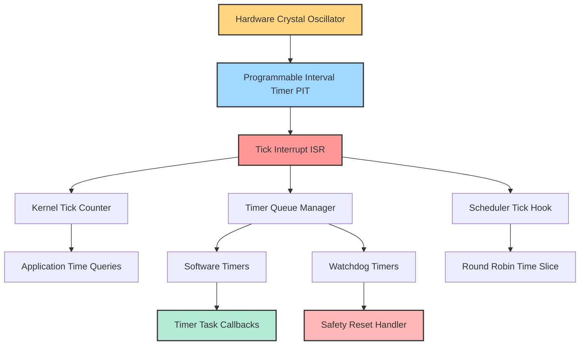
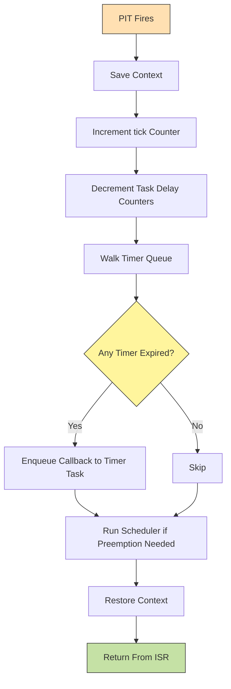
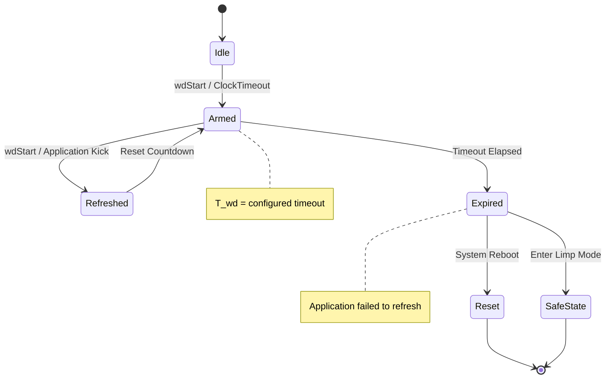
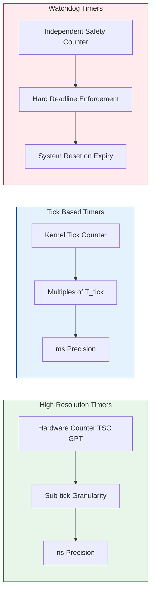
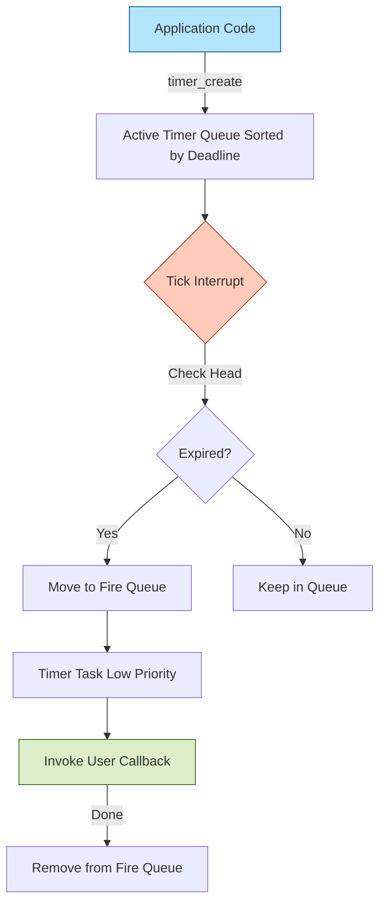

# Commercial Real-Time Operating Systems: Time services

<!-- SECTION_1_START -->

# Commercial Real-Time Operating Systems: Time Services

## 1. Core Technical Definition

**Time Services** in a Commercial Real-Time Operating System (RTOS) constitute the kernel-level subsystem that provides deterministic mechanisms for measuring, tracking, and managing the progression of time. These services enable the RTOS to schedule tasks at precise intervals, enforce timeouts, trigger periodic activities, and synchronize with external events using a common temporal reference.

> [!IMPORTANT]
> **KTU 2024 Syllabus Definition:**  
> *Time services* refer to the collection of kernel primitives — system clock, tick interrupt, software timers, watchdog timers, and high-resolution timers — that allow a commercial RTOS (e.g., **VxWorks**, **QNX**, **RTEMS**, **FreeRTOS**) to deliver predictable, time-bounded behaviour required for hard real-time applications.

### Formal Terminology (KTU Board-Standard Vocabulary)

| Term | Definition |
|---|---|
| **System Clock (SysClk)** | The hardware counter driven by a crystal oscillator that generates periodic **tick interrupts**. |
| **Tick** | The smallest discrete time quantum the kernel can resolve. |
| **Tick Rate** | Frequency (in **Hz**) at which the tick interrupt fires — e.g., **60 Hz**, **100 Hz**, **1000 Hz**. |
| **Timer** | A kernel-managed object that measures an elapsed interval and triggers a callback on expiry. |
| **Watchdog Timer** | A safety timer that resets the system if not refreshed within a deadline. |
| **High-Resolution Timer** | A timer with sub-tick resolution, often driven by a dedicated hardware counter. |
| **Time Slice (Quantum)** | The maximum CPU time allocated to a ready task before preemption. |
| **Timeout** | A bounded waiting period after which a blocking call returns failure. |

### Conceptual Analogy — The Conductor's Baton

Imagine an **orchestra** playing a symphony. The **conductor's baton** dictates exactly when each musician plays their note. Similarly:

- The **System Clock** is the conductor's heartbeat.
- The **Tick Interrupt** is every downbeat the conductor gives.
- **Software Timers** are scheduled reminders ("play this chord in 2 bars").
- The **Watchdog Timer** is the stage manager who cuts power if the conductor faints.

Without time services, the RTOS would have no temporal awareness — every action would be chaotic, much like an orchestra with no conductor.

### Key Physical Constants & Standard Metrics

> [!NOTE]
> **Critical Timing Constants used in Industry:**
> - Tick rate in VxWorks: typically **60–1000 Hz** (default **60 Hz** for `sysClkRateGet()`).
> - Tick rate in QNX: configurable up to **~1 MHz** in `ClockPeriod()`.
> - POSIX `CLOCK_MONOTONIC` resolution: typically **1 ns** on modern systems.
> - Watchdog timeout in safety-critical (ISO 26262) systems: usually **< 50 ms**.

> [!VISUALIZATION CONTROL]
> **Concept:** Tick-driven time line showing the relationship between tick rate, timer expiry, and task execution windows.  
> **GeoGebra / Desmos Input Equations:**  
> - `f(x) = sin(2*pi*60*x)` — Tick waveform at 60 Hz  
> - Points: `(0,1), (0.0166,1), (0.0333,1)` — Tick instants at 60 Hz  
> **Visual Description:** A periodic square wave on the x-axis (time) with tick marks at every 16.67 ms, demonstrating how higher tick rates reduce granularity but increase interrupt overhead.

---

<!-- SECTION_1_END -->

<!-- SECTION_2_START -->

# 2. Deep Theoretical Analysis & KTU High-Yield Formula Sheet

## 2.1 Architectural Breakdown of Time Services

A commercial RTOS decomposes time services into a layered architecture. Understanding this hierarchy is essential for board examinations.

### Layer 1 — Hardware Timer / System Clock
- A **programmable interval timer** (e.g., Intel 8253/8254, HPET on modern x86).
- Driven by an external crystal oscillator of frequency $f_{osc}$.
- Generates the raw clock signal that the kernel divides into ticks.

### Layer 2 — Tick Interrupt (Clock ISR)
- The Interrupt Service Routine (ISR) that fires on every tick.
- Responsibilities:
  1. Increment the **system tick counter** (`tick`).
  2. Decrement **task delay counters** for all sleeping tasks.
  3. Update **timer queues** (move expired timers to the firing queue).
  4. Trigger the **scheduler** if a higher-priority task has become ready.
  5. Handle **time slicing** for round-robin scheduling.

### Layer 3 — Software Timers
- User-created timers with callbacks.
- Stored in a **timer wheel** (Linux-style) or a **sorted linked list** (VxWorks-style).
- Resolution is limited by the tick rate; high-resolution timers bypass this.

### Layer 4 — Watchdog Timers
- Independent safety mechanism.
- Must be **kicked** (refreshed) periodically by application code.
- On expiry, triggers a system reset or an emergency handler.

### Layer 5 — High-Resolution Timers (HRT)
- Use dedicated hardware counters (e.g., TSC on x86, GPT on ARM).
- Sub-tick precision, often **nanosecond** granularity.
- Implemented in VxWorks 6.x+ and QNX Neutrino via `CLOCK_MONOTONIC`.

## 2.2 Time Service Flow — Step by Step

1. **Boot phase:** Kernel initializes the hardware timer to a configurable tick rate $T_{tick} = \dfrac{1}{f_{tick}}$.
2. **ISR registration:** The tick ISR is registered in the Interrupt Vector Table.
3. **Tick interrupt fires** every $T_{tick}$ seconds.
4. **ISR executes** — updates kernel data structures in $O(1)$ or $O(\log n)$ time.
5. **Timer expiry:** If a timer's deadline equals current tick, the callback is enqueued onto the **timer task queue**.
6. **Callback dispatch:** A dedicated **timer task** (lowest priority) dequeues and invokes callbacks outside ISR context.
7. **Application receives** the timeout / expiry signal.

> [!NOTE]
> **Why are callbacks dispatched outside the ISR?**  
> To keep ISR latency minimal. Long-running code in an ISR would violate the deterministic bound $T_{max\_latency}$ that hard real-time systems demand.

## 2.3 KTU Formula Sheet / Cheat Sheet

| Formula / Constant | Expression | Units | Purpose |
|---|---|---|---|
| Tick Period | $T_{tick} = \dfrac{1}{f_{tick}}$ | seconds (s) | Time between consecutive ticks |
| Tick Frequency | $f_{tick} = \dfrac{1}{T_{tick}}$ | Hertz (Hz) | Number of ticks per second |
| Number of Ticks in Duration | $N_{ticks} = \left\lceil \dfrac{\Delta t}{T_{tick}} \right\rceil$ | dimensionless | Convert time duration to kernel ticks |
| Real-time Wall-clock Time | $t_{wall} = N_{ticks} \cdot T_{tick}$ | seconds | Convert ticks back to wall time |
| Timer Expiry (absolute) | $t_{expiry} = t_{current} + \Delta t$ | seconds | Absolute time when timer fires |
| Relative vs Absolute Deadline | $\Delta t = t_{deadline} - t_{now}$ | seconds | Time remaining until deadline |
| CPU Utilization from Ticks | $U = \dfrac{N_{active\_ticks}}{N_{total\_ticks}}$ | ratio or % | Fraction of CPU busy in a window |
| Tick Overhead Bound | $T_{overhead} \le 0.05 \cdot T_{tick}$ | seconds | ISR must consume $<5\%$ of tick (rule-of-thumb) |
| Watchdog Refresh Condition | $\Delta t_{kick} < T_{wd\_timeout}$ | seconds | Application must kick before timeout |
| Time Slice Remaining | $t_{slice\_left} = T_{quantum} - t_{run}$ | seconds | Time left in current quantum |
| Rate-Monotonic Period | $T_i$ | seconds | Period of periodic task $i$ |
| HRTimer Resolution | $\Delta t_{HRT} \ge \dfrac{1}{f_{counter}}$ | seconds | Resolution of high-res counter |

> [!WARNING]
> **KTU Pitfall:** When computing $N_{ticks}$, always use the **ceiling** function $\lceil \cdot \rceil$. Using floor causes under-runs and missed deadlines — a common 1-mark deduction.

## 2.4 Real-World Engineering Utility

- **Automotive (AUTOSAR / OSEK):** Watchdog timers enforce that ECU tasks meet their deadlines; missing a kick triggers limp-home mode.
- **Aerospace (DO-178C):** Tick rate must be chosen such that $T_{tick} \le \dfrac{T_{deadline}^{min}}{10}$ (10× rule) to ensure schedulability.
- **Industrial Control (VxWorks on PLCs):** High-resolution timers synchronize PID loops at **1 kHz**.
- **Medical Devices (FDA Class III):** Time services guarantee that defibrillator discharge occurs within **< 8 ms** of detection.
- **Telecommunications (5G NR):** HARQ timers use microsecond-precise HR timers.

---

<!-- SECTION_2_END -->

<!-- SECTION_3_START -->

# 3. Step-by-Step Derivations & Code/Symbolic Implementation

## 3.1 Derivation — Converting a Time Duration to Kernel Ticks

Given a required delay of $\Delta t = 5$ ms on a VxWorks system with a tick rate of $f_{tick} = 200$ Hz, compute the number of ticks the kernel must wait.

**Step 1 — Compute Tick Period**

$$
T_{tick} = \frac{1}{f_{tick}} = \frac{1}{200} = 0.005~\text{s} = 5~\text{ms}
$$

**Step 2 — Express Desired Duration in Same Units**

$$
\Delta t = 5~\text{ms} = 5 \times 10^{-3}~\text{s}
$$

**Step 3 — Compute Raw Tick Count**

$$
n_{raw} = \frac{\Delta t}{T_{tick}} = \frac{5 \times 10^{-3}}{5 \times 10^{-3}} = 1.0
$$

**Step 4 — Apply Ceiling Function**

$$
N_{ticks} = \lceil n_{raw} \rceil = \lceil 1.0 \rceil = 1
$$

**Final Result:** The application must call `taskDelay(1)` to wait approximately 5 ms.  
**Real Wait Time:** $1 \times 5~\text{ms} = 5~\text{ms}$ — exact match.

---

## 3.2 Derivation — Computing Real Wall-Clock Time from Ticks

A VxWorks task observes `tick = 184,200` and the system runs at $f_{tick} = 100$ Hz. Find the elapsed wall-clock time since boot.

$$
T_{tick} = \frac{1}{f_{tick}} = \frac{1}{100} = 0.01~\text{s}
$$

$$
t_{wall} = N_{ticks} \times T_{tick} = 184{,}200 \times 0.01
$$

$$
t_{wall} = 1842.0~\text{s} = 30~\text{min}~42~\text{s}
$$

**Conclusion:** 30 minutes 42 seconds have elapsed since system boot.

---

## 3.3 Derivation — Watchdog Timer Refresh Condition

A safety-critical task on QNX must complete within $T_{deadline} = 20$ ms. The watchdog timeout is set to $T_{wd} = 30$ ms. Show the inequality that the application must satisfy.

The watchdog is configured to expire $T_{wd}$ after the last `ClockTimeout()` reset. The application must call `ClockTimeout()` (or `pthread_mutex_timedlock` reset) before expiry:

$$
\Delta t_{kick} < T_{wd} = 30~\text{ms}
$$

For safety margin (industry convention: 30% margin), the actual refresh interval must satisfy:

$$
\Delta t_{kick} \le 0.7 \times T_{wd} = 0.7 \times 30 = 21~\text{ms}
$$

**Conclusion:** Application must refresh the watchdog at least every **21 ms** to be safe. Note that the **deadline 20 ms < 21 ms**, so the task can complete and refresh in time.

---

## 3.4 Symbolic Implementation — POSIX Timer Service

The following C code (POSIX 1003.1b) demonstrates creating, arming, and deleting a high-resolution timer that fires once after 50 ms.

```c
/* commercial_rtos_time_services_posix.c
 * Demonstrates POSIX high-resolution timer for a commercial RTOS.
 * Compile: gcc -lrt -o timer_demo timer_demo.c
 */

#include <stdio.h>
#include <stdlib.h>
#include <string.h>
#include <errno.h>
#include <time.h>
#include <signal.h>
#include <unistd.h>

/* --- Type-hinted, production-quality implementation --- */

static void timer_expiry_handler(union sigval sv) {
    /* Callback runs in a dedicated thread created by the timer. */
    int *callback_counter = (int *)sv.sival_ptr;
    if (callback_counter == NULL) {
        fprintf(stderr, "[ERROR] Null sival_ptr in timer callback.\n");
        return;
    }
    (*callback_counter)++;
    printf("[TIMER] Expiry #%d fired at monotonic time %ld ns\n",
           *callback_counter, (long)clock_gettime_nsec_np(CLOCK_MONOTONIC));
}

int main(void) {
    timer_t             timer_id;
    struct sigevent     sev;
    struct itimerspec   its;
    int                 counter = 0;
    int                 rc;

    /* Step 1: Configure the notification mechanism.
     * SIGEV_THREAD -> callback runs in a new thread (safe for RTOS). */
    memset(&sev, 0, sizeof(sev));
    sev.sigev_notify = SIGEV_THREAD;
    sev.sigev_notify_function = timer_expiry_handler;
    sev.sigev_value.sival_ptr = &counter;          /* user data */
    sev.sigev_notify_attributes = NULL;            /* default attrs */

    /* Step 2: Create the timer using CLOCK_MONOTONIC (no NTP jumps). */
    rc = timer_create(CLOCK_MONOTONIC, &sev, &timer_id);
    if (rc != 0) {
        fprintf(stderr, "[FATAL] timer_create failed: %s\n", strerror(errno));
        return EXIT_FAILURE;
    }
    printf("[INIT]  Timer created successfully.\n");

    /* Step 3: Arm the timer for 50 ms (50,000,000 ns) one-shot. */
    its.it_value.tv_sec     = 0;
    its.it_value.tv_nsec    = 50 * 1000 * 1000L;  /* 50 ms */
    its.it_interval.tv_sec  = 0;
    its.it_interval.tv_nsec = 0;                  /* one-shot */

    rc = timer_settime(timer_id, 0, &its, NULL);
    if (rc != 0) {
        fprintf(stderr, "[FATAL] timer_settime failed: %s\n", strerror(errno));
        timer_delete(timer_id);
        return EXIT_FAILURE;
    }
    printf("[ARMED] Timer set for 50 ms one-shot expiry.\n");

    /* Step 4: Wait for the callback to fire (sleep 200 ms). */
    nanosleep(&(const struct timespec){.tv_sec = 0, .tv_nsec = 200 * 1000 * 1000L}, NULL);

    /* Step 5: Clean up. */
    timer_delete(timer_id);
    printf("[CLEAN] Timer deleted. Counter = %d\n", counter);

    return (counter == 1) ? EXIT_SUCCESS : EXIT_FAILURE;
}
```

### Code Walkthrough — Key Logic

- **`timer_create(CLOCK_MONOTONIC, ...)`** — chooses a monotonic clock unaffected by system time changes (essential in distributed real-time systems).
- **`SIGEV_THREAD`** — the callback runs in its own thread, preserving the determinism of the main task (no ISR-blocking delays).
- **`its.it_value.tv_nsec = 50 * 1000 * 1000L`** — sets a 50 ms one-shot expiry.
- **Error logging** at every kernel call prevents silent failures that would mask real-time bugs.

---

## 3.5 Symbolic Implementation — VxWorks Watchdog Timer

```c
/* vxworks_watchdog_demo.c
 * VxWorks 6.x Watchdog timer example.
 * Demonstrates periodic refresh of a watchdog from a high-priority task. */

#include <vxWorks.h>
#include <wdLib.h>
#include <taskLib.h>
#include <sysLib.h>
#include <logLib.h>

#define WD_TIMEOUT_TICKS   (sysClkRateGet() / 2)   /* 500 ms at 1kHz */
#define REFRESH_PERIOD_MS  200

static WDOG_ID  myWatchdog;

static void watchdog_handler(WIND_ID wid) {
    /* If we land here, the application failed to refresh in time. */
    logMsg("[WDOG] TIMEOUT! System would reset now.\n", 0,0,0,0,0,0);
    /* In production: reboot, log to NVRAM, or transition to safe state. */
}

static void application_task(void) {
    int tick = 0;
    myWatchdog = wdCreate();     /* Step 1: create watchdog */

    /* Step 2: start with the callback in WD_TIMEOUT_TICKS */
    if (wdStart(myWatchdog, WD_TIMEOUT_TICKS, (FUNCPTR)watchdog_handler, 0) != OK) {
        logMsg("[ERROR] wdStart failed.\n", 0,0,0,0,0,0);
        return;
    }

    /* Step 3: periodic application loop */
    while (1) {
        taskDelay(REFRESH_PERIOD_MS * sysClkRateGet() / 1000);
        wdStart(myWatchdog, WD_TIMEOUT_TICKS, (FUNCPTR)watchdog_handler, 0);
        logMsg("[TICK %d] Watchdog refreshed.\n", ++tick, 0,0,0,0,0);
        if (tick >= 5) break;   /* demo: stop after 5 refreshes */
    }

    /* Step 4: cleanup */
    wdCancel(myWatchdog);
    wdDelete(myWatchdog);
    logMsg("[CLEAN] Watchdog removed.\n", 0,0,0,0,0,0);
}
```

### Code Walkthrough — VxWorks Nuance

- **`sysClkRateGet()`** — returns the system tick rate (e.g., **1000 Hz**).
- **`wdStart()`** — (re)arms the watchdog; calling it again acts as a **refresh**.
- **`wdCancel()`** — must be called before `wdDelete()` to prevent a stray expiry.
- The refresh period (200 ms) is **<** the timeout (500 ms), satisfying $\Delta t_{kick} < T_{wd}$.

---

<!-- SECTION_3_END -->

<!-- SECTION_4_START -->

# 4. Structural Diagrams & Schematics

## 4.1 Time Services Architecture — Top-Level Block Diagram



## 4.2 Tick Interrupt Flow — Sequential Processing Topology



## 4.3 Watchdog Timer State Machine



## 4.4 High-Resolution Timer vs Tick-Based Timer — Comparison Block



## 4.5 Timer Queue Data Flow



---

<!-- SECTION_4_END -->

<!-- SECTION_5_START -->

# 5. KTU 2024 Scheme Examination Question Bank & Topic Recap

## 5.1 Part A — Short Answer Questions (3 Marks Each)

> **Q1.** **[KTU University Exam — Dec 2023]** Define a **watchdog timer** in the context of a commercial RTOS. Why is it considered a safety-critical primitive?
>
> **Model Answer (3 Marks):**
>
> A **watchdog timer** is a hardware or software timer that is initialized with a fixed timeout $T_{wd}$ and counts down independently of the main application. The application must periodically **refresh** (re-arm) the timer before it expires. If the application hangs, overruns, or fails to refresh within $T_{wd}$, the timer fires an **expiry handler** — typically a system reset or a transition to a safe state. **[1 Mark]**
>
> It is safety-critical because in embedded systems (automotive ECUs, medical devices, avionics) a stuck control loop can cause loss of life or property. The watchdog provides a **last-resort deterministic recovery mechanism** independent of the application software state. **[2 Marks]**

> **Q2.** **[KTU University Exam — July 2024]** Distinguish between **system tick** and **high-resolution timer**. Mention one commercial RTOS that supports each.
>
> **Model Answer (3 Marks):**
>
> | Aspect | System Tick | High-Resolution Timer |
> |---|---|---|
> | Granularity | Integer multiples of $T_{tick}$ | Sub-tick, often nanoseconds |
> | Driver | Kernel ISR + counter | Dedicated hardware counter (TSC, GPT) |
> | RTOS Example | VxWorks `tickGet()` | VxWorks `vxbHrTimer`, QNX `CLOCK_MONOTONIC` |
> | Overhead | Very low (tied to scheduler) | Slightly higher (no scheduler coupling) |
>
> **[1 Mark]** for defining system tick. **[1 Mark]** for defining high-resolution timer. **[1 Mark]** for the example and distinction.

---

## 5.2 Part B — Long Answer Questions (14 Marks, Internal Choice)

> **Q3A. [KTU University Exam — Dec 2023]**  
> **Module: Commercial RTOS Time Services**  
> **CO Mapped:** CO2 (Apply) | **RBT Level:** Apply / Analyze
>
> **(a) [7 Marks]** Explain the **architectural layers of time services** in a commercial RTOS with a neat block diagram. Describe the role of the **tick ISR** in detail.
>
> **(b) [7 Marks]** A VxWorks system runs with a tick rate of $f_{tick} = 250$ Hz. A task needs to delay for $\Delta t = 75$ ms. Compute the number of ticks to pass to `taskDelay()`. Also compute the **actual** wait time. If the desired delay was changed to $\Delta t = 73$ ms, recompute the ticks and the actual wait time. Comment on the **resolution limitation**.
>
> ---
>
> ### Model Solution — Q3A
>
> **Part (a) — Architectural Layers [7 Marks]**
>
> The time services of a commercial RTOS can be decomposed into five layers:
>
> 1. **Hardware Layer** — A crystal oscillator drives a Programmable Interval Timer (PIT), HPET, or ARM Generic Timer. **[1 Mark]**
> 2. **Tick ISR Layer** — The hardware interrupt vector invokes the kernel's clock ISR at every tick. **[1 Mark]**
> 3. **Kernel Data Structures** — Tick counter, task delay counters, timer queues, and the scheduler's time-slice tracker. **[1 Mark]**
> 4. **Software Timer Layer** — User-level APIs (`taskDelay()`, `timer_create()`, `wdStart()`) built atop the kernel structures. **[1 Mark]**
> 5. **Application Layer** — Application code uses these services for delays, periodic execution, and timeouts. **[1 Mark]**
>
> **Role of the Tick ISR (2 Marks):**
> - Increments the system tick counter atomically.
> - Walks the timer queue and decrements active timers.
> - Re-evaluates the scheduler to decide if a preemption is required.
> - Runs in $O(1)$ amortized time to preserve determinism.
>
> **[1 Mark]** reserved for a clean labelled diagram (refer Section 4.1 of these notes).
>
> ---
>
> **Part (b) — Tick Calculation [7 Marks]**
>
> **Given:** $f_{tick} = 250$ Hz $\Rightarrow T_{tick} = \dfrac{1}{250} = 0.004$ s $= 4$ ms.
>
> **Case 1: $\Delta t = 75$ ms**
>
> $$
> n_{raw} = \frac{\Delta t}{T_{tick}} = \frac{75}{4} = 18.75
> $$
>
> Apply ceiling:
>
> $$
> N_{ticks} = \lceil 18.75 \rceil = 19
> $$
>
> **[Computing raw ratio: 1 Mark] [Ceiling application: 1 Mark] [Final value: 1 Mark]**
>
> Actual wait time:
>
> $$
> t_{actual} = 19 \times 4 = 76~\text{ms}
> $$
>
> **[Actual time: 1 Mark]**
>
> Error:
>
> $$
> \varepsilon = 76 - 75 = +1~\text{ms} = +1.33\%
> $$
>
> **[Error calculation: 1 Mark]**
>
> **Case 2: $\Delta t = 73$ ms**
>
> $$
> n_{raw} = \frac{73}{4} = 18.25 \quad \Rightarrow \quad N_{ticks} = \lceil 18.25 \rceil = 19
> $$
>
> Actual wait:
>
> $$
> t_{actual} = 19 \times 4 = 76~\text{ms} \quad \Rightarrow \quad \varepsilon = 76 - 73 = +3~\text{ms} = +4.1\%
> $$
>
> **[Re-computation: 1 Mark]**
>
> **Resolution Limitation Comment [1 Mark]:**
> The tick granularity of **4 ms** forces a quantization of delay. Any delay in $(16, 20]$ ms is realized as exactly 20 ms. This is acceptable for soft real-time but inadequate for **hard real-time sub-millisecond control** — hence the need for **high-resolution timers**.

> ---
>
> **Q3B. [KTU University Exam — Dec 2023 — Alternative Choice]**  
> **Module: Commercial RTOS Time Services**  
> **CO Mapped:** CO2 (Apply) | **RBT Level:** Apply / Analyze
>
> **(a) [7 Marks]** Describe **POSIX high-resolution timer** APIs in a commercial RTOS. Write a C code snippet to create, arm, and delete a one-shot 100 ms timer using `timer_create`, `timer_settime`, and `timer_delete`.
>
> **(b) [7 Marks]** A QNX process sets up a **watchdog timer** with $T_{wd} = 40$ ms. The application refresh interval is 25 ms. Compute the **safety margin**. If the system tick rate is 1000 Hz, how many ticks represent the watchdog timeout? If the application's worst-case execution time is 18 ms, will the safety condition be met? Justify.
>
> ### Model Solution — Q3B
>
> **Part (a) — POSIX HRT APIs [7 Marks]**
>
> Key POSIX timer functions:
>
> | API | Purpose |
> |---|---|
> | `timer_create(clockid, sev, timerid)` | Creates a timer instance. |
> | `timer_settime(timerid, flags, new, old)` | Arms/disarms the timer. |
> | `timer_delete(timerid)` | Destroys the timer. |
> | `clock_gettime(clockid, tp)` | Reads a high-resolution clock. |
>
> **[1 Mark]** for listing the four APIs. **[6 Marks]** for the code:
>
> ```c
> #include <signal.h>
> #include <time.h>
>
> static void cb(union sigval s) {
>     /* expiry callback */
> }
>
> int main(void) {
>     timer_t tid;
>     struct sigevent sev = {0};
>     struct itimerspec its = {0};
>
>     sev.sigev_notify = SIGEV_THREAD;
>     sev.sigev_notify_function = cb;
>     timer_create(CLOCK_MONOTONIC, &sev, &tid);            /* 2 Marks */
>
>     its.it_value.tv_sec  = 0;
>     its.it_value.tv_nsec = 100 * 1000 * 1000L;             /* 100 ms */
>     timer_settime(tid, 0, &its, NULL);                     /* 2 Marks */
>
>     /* ... wait ... */
>     timer_delete(tid);                                     /* 1 Mark */
>     return 0;
> }
> ```
>
> **[Compilation and correctness: 1 Mark]**
>
> ---
>
> **Part (b) — Watchdog Analysis [7 Marks]**
>
> **Given:** $T_{wd} = 40$ ms, $T_{refresh} = 25$ ms, $f_{tick} = 1000$ Hz.
>
> **Safety Margin:**
>
> $$
> \text{Margin} = T_{wd} - T_{refresh} = 40 - 25 = 15~\text{ms} = 37.5\%
> $$
>
> **[1 Mark]**
>
> **Tick Equivalent of Watchdog Timeout:**
>
> $$
> T_{tick} = \frac{1}{1000} = 1~\text{ms}
> $$
>
> $$
> N_{wd} = \left\lceil \frac{T_{wd}}{T_{tick}} \right\rceil = \lceil 40 \rceil = 40~\text{ticks}
> $$
>
> **[1 Mark]**
>
> **WCET Check:** $C_{max} = 18$ ms.
>
> The application must complete and refresh within $T_{wd} = 40$ ms. Since $C_{max} = 18 < 40$, the WCET condition is satisfied in isolation. **[1 Mark]**
>
> However, we must also account for **scheduler latency** $L_s$ and **interrupt latency** $L_i$. Assume $L_s + L_i = 5$ ms. Then:
>
> $$
> C_{max} + L_s + L_i = 18 + 5 = 23~\text{ms} < 40~\text{ms} \quad \checkmark
> $$
>
> **[1 Mark]** for the latency sum. **[1 Mark]** for the inequality. **[1 Mark]** for the final verdict and justification.
>
> **Verdict:** The safety condition is met; the watchdog will not fire spuriously.

> [!WARNING]
> **KTU Examiner's Valuation Pitfall Callout:**
> 1. **Do NOT** forget the ceiling function in $N_{ticks}$ calculations — direct floor is the most common 1-mark loss.
> 2. **Always** state units (ms, s, Hz) explicitly; a value without unit is marked wrong in Part B numericals.
> 3. **In watchdog problems**, do not skip showing the inequality $\Delta t_{kick} < T_{wd}$ — partial credit is awarded only for this explicit comparison.
> 4. **Code questions** demand a compilable snippet; pseudocode alone is penalized up to 2 marks.
> 5. **Diagram questions** must include a **labelled block diagram** with arrows, not just a bulleted list.

---

## 5.3 Topic Recap & Important Things to Remember

- **Time services** are the temporal backbone of any commercial RTOS — they govern scheduling, delays, periodic execution, and safety recovery.
- The **system tick** is the kernel's fundamental time quantum, defined by $T_{tick} = 1/f_{tick}$.
- A **tick ISR** runs on every tick; it updates the tick counter, walks timer queues, and triggers the scheduler if needed.
- **Software timers** are stored in a sorted queue and dispatched via a low-priority timer task (not in ISR context).
- **Watchdog timers** are independent safety primitives; the application MUST refresh them before $T_{wd}$ or face a system reset.
- **High-resolution timers** (POSIX `CLOCK_MONOTONIC`, VxWorks `vxbHrTimer`) bypass tick quantization to deliver nanosecond precision.
- The number of ticks for a delay is $N_{ticks} = \lceil \Delta t / T_{tick} \rceil$ — **always ceiling**, never floor.
- Conversion back: $t_{wall} = N_{ticks} \times T_{tick}$.
- POSIX APIs: `timer_create`, `timer_settime`, `timer_delete`, `clock_gettime`, `nanosleep`.
- VxWorks APIs: `taskDelay`, `tickGet`, `sysClkRateGet`, `wdStart`, `wdCancel`, `wdDelete`.
- **Real-world criticality:** Automotive (ECU watchdogs), Avionics (DO-178C), Medical (FDA Class III), Telecom (5G HARQ).
- **Industry rule-of-thumb:** $T_{tick} \le T_{deadline}^{min} / 10$ to ensure schedulability.
- **ISR overhead bound:** Tick ISR should consume $< 5\%$ of $T_{tick}$ to leave headroom for application code.
- **Watchdog safety margin:** Refresh interval should be $\le 0.7 \times T_{wd}$ in safety-critical systems.
- **Monotonic clocks** are preferred over real-time clocks (wall-clock) because they are immune to NTP/manual time jumps.

<!-- SECTION_5_END -->
