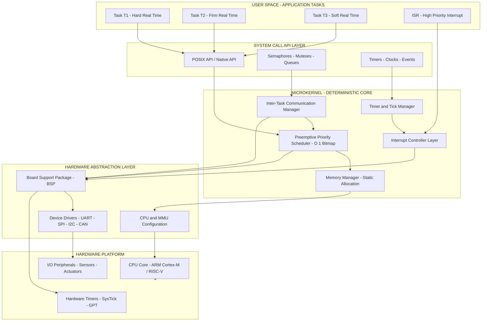
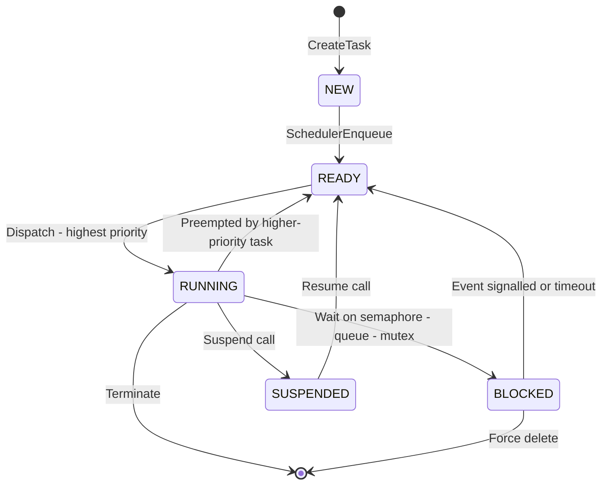
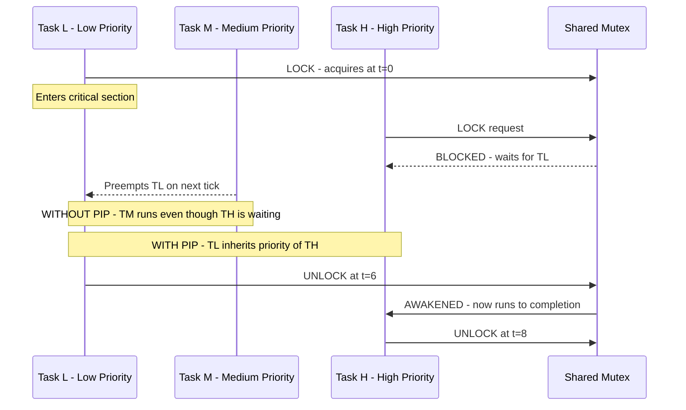
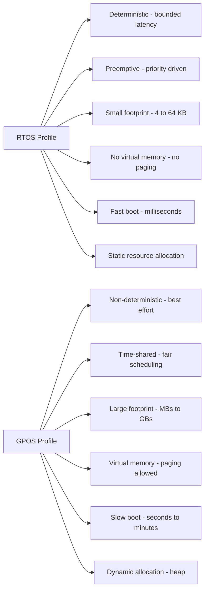
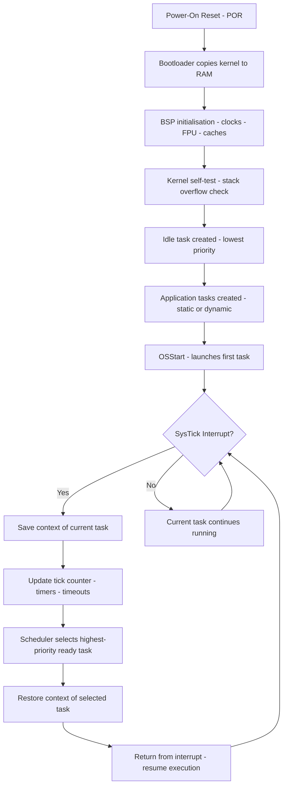

# Features of real-time operating systems

<!-- SECTION_1_START -->
# Features of Real-Time Operating Systems (RTOS)

## 1.1 Formal Academic Definition (KTU 2024 Syllabus Terminology)

A **Real-Time Operating System (RTOS)** is a specialized operating system designed to manage hardware resources, run concurrent real-time tasks, and process data within strictly bounded response time constraints, where correctness depends not only on the logical result of computation but also on the **time at which the result is delivered**.

In the context of the KTU 2024 *Real Time Systems* (PECST748) syllabus, Module 3 on *Commercial Real-Time Systems* characterizes an RTOS through the following canonical features:

1. **Determinism** — predictable execution timing.
2. **Preemptive Priority-Based Scheduling** — strict task priority enforcement.
3. **Fast Interrupt Latency** — minimal delay between interrupt and ISR execution.
4. **Task/Thread Management** — lightweight multithreading primitives.
5. **Inter-Task Communication (ITC)** — semaphores, mutexes, message queues, mailboxes.
6. **Memory Management** — bounded allocation/deallocation with no paging-induced jitter.
7. **Timers and Clocks** — high-resolution tickless or tick-based timing services.
8. **Synchronization Primitives** — priority inheritance, priority ceiling protocol.
9. **Error/Fault Recovery** — watchdog timers and graceful degradation.
10. **Minimal Footprint** — small kernel size suitable for embedded targets.

> [!IMPORTANT]
> **KTU 2024 Board Definition (Verbatim Style):**
> "An RTOS is an operating system that guarantees the upper bound on the response time to a stimulus, providing bounded and predictable task completion within hard, firm, or soft real-time deadlines."

## 1.2 Conceptual Analogy & Intuition

Imagine a **hospital emergency ward** (the CPU) with several patients (tasks) arriving simultaneously:

- Patient 1 has a mild fever (low priority task).
- Patient 2 has a heart attack (high priority task).
- Patient 3 is bleeding severely (highest priority task).

A *general-purpose OS* like Windows would process requests in a "first-come-first-served" or "fair-share" manner — sometimes completing the fever checkup before attending to the heart attack. A *Real-Time OS*, however, would **immediately preempt** the low-priority consultation and allocate the doctor's attention (CPU) to Patient 3, then Patient 2, and only afterward return to Patient 1. The **deadline** (e.g., "save Patient 3 within 60 seconds") is non-negotiable.

> [!NOTE]
> **Key Insight:** Unlike desktop OS that optimize for *throughput*, RTOS optimizes for *worst-case response time*. The metric is the **maximum interrupt latency** and **task switch time**, both bounded by deterministic constants (typically **1 μs to 100 μs** for commercial RTOS kernels).

## 1.3 Standard Metrics & Physical Constants

| Metric | Typical Value (Commercial RTOS) | Unit |
|---|---|---|
| **Interrupt Latency** | < **5 μs** | microseconds |
| **Task Switch Time** | < **10 μs** | microseconds |
| **Kernel Footprint** | **4 – 64 KB** | kilobytes |
| **Tick Rate (Timer Resolution)** | **1 μs – 1 ms** | microseconds/milliseconds |
| **CPU Speed (Target)** | **50 – 1000** | MHz |
| **Worst-Case Execution Time (WCET)** | Bounded by static analysis | — |

> [!VISUALIZATION CONTROL]
> **Concept:** Real-Time Task Response Time Bound
> **GeoGebra / Desmos Input Equations:**
> * `y = 10` (Deadline bound — horizontal asymptote)
> * `f(t) = piecewise((5*t, 0 ≤ t < 2), (10 + sin(2*t), 2 ≤ t ≤ 6))` (Task response curve)
> **Visual Description:** The student should observe that the response curve `f(t)` *never crosses* the deadline line `y = 10`, illustrating the **bounded worst-case response** property of a deterministic RTOS.

<!-- SECTION_1_END -->

<!-- SECTION_2_START -->
# Deep Theoretical Analysis & KTU High-Yield Formula Sheet

## 2.1 The "Big Five" Architectural Pillars of a Commercial RTOS

A modern commercial RTOS is built around **five architectural pillars** that distinguish it from a General-Purpose OS (GPOS). Every KTU 2024 board question on this module maps to at least one of these pillars.

### Pillar 1 — Determinism

**Definition:** The *maximum* time taken to respond to an event is bounded and known a priori.

- Achieved via **static scheduling tables**, **preemptive priority dispatch**, and **disabled hardware caching** for critical sections.
- Opposed to GPOS, which is *probabilistic* (e.g., "average response time ≈ 2 ms" — but worst case may be 200 ms).

**Engineering Utility:** Used in flight control, pacemakers, anti-lock braking systems (ABS) where the response window is physically defined (e.g., 100 ms for ABS sensor-to-actuator loop).

### Pillar 2 — Preemptive Priority Scheduling

- A higher-priority task that becomes *ready* immediately preempts the running lower-priority task.
- **Scheduler complexity:** $O(1)$ lookup using a *bitmap priority queue* (e.g., VxWorks, FreeRTOS).
- Common algorithms: **Rate Monotonic Scheduling (RMS)**, **Earliest Deadline First (EDF)**, **Fixed Priority Preemptive (FPP)**.

> [!NOTE]
> **Liu & Layland Bound (1973) — Utilisation Test for RMS:**
> For $n$ periodic tasks under Rate Monotonic Scheduling, a *sufficient* (not necessary) schedulability test is:
>
> $$U = \sum_{i=1}^{n} \frac{C_i}{T_i} \le n\left(2^{1/n} - 1\right)$$
>
> where $C_i$ is the WCET and $T_i$ is the period of task $i$. For $n \to \infty$, the upper bound approaches **0.693 ≈ 69.3 %**.

### Pillar 3 — Inter-Task Communication (ITC) & Synchronization

| Primitive | Purpose | Blocking Behaviour |
|---|---|---|
| **Binary Semaphore** | Signalling between tasks | Blocks indefinitely (or with timeout) |
| **Counting Semaphore** | Resource counting (≤ N instances) | Blocks if count = 0 |
| **Mutex** | Mutual exclusion (with priority inheritance) | Blocks the *owner* task; inherits priority |
| **Message Queue** | Fixed-size message passing | Blocks if queue full/empty |
| **Mailbox** | Pointer-based single-slot message | Blocks if full |
| **Event Flags** | Bitwise signalling | Non-blocking or blocked with AND/OR mask |

**Engineering Utility:** Automotive ECUs (e.g., Bosch AUTOSAR) use a mix of these primitives to coordinate CAN bus readers, sensor samplers, and actuator drivers without race conditions.

### Pillar 4 — Memory Management

- **Static Allocation** (preferred): All memory allocated at compile time → zero fragmentation.
- **Dynamic Allocation** (rare in hard real-time): Custom allocators with **$O(1)$** behaviour, such as TLSF (Two-Level Segregate Fit).
- **Memory Locking**: Pages are pinned in RAM (no swapping, no page faults).

> [!IMPORTANT]
> **Hard Real-Time Rule:** *No virtual memory. No paging. No demand-loading.* Any unbounded operation introduces non-determinism and is **forbidden** in certified hard RTOS builds (e.g., DO-178C, IEC 61508 SIL 3/4).

### Pillar 5 — Time & Interrupt Management

- **Tick Interrupts:** A high-resolution hardware timer (e.g., SysTick on ARM Cortex-M) generates periodic interrupts for the scheduler.
- **Tickless Idle (Low-Power Mode):** When no tasks are runnable, the kernel reprograms the next interrupt dynamically to save power (used in FreeRTOS `portSUPPRESS_TICKS_AND_SLEEP`).
- **Interrupt Nesting:** Higher-priority interrupts can preempt lower-priority ISRs; depth is bounded.
- **Deferred Procedure Calls (DPCs):** Time-consuming work is moved out of the ISR to a task context.

## 2.2 KTU High-Yield Formula Cheat Sheet

| # | Formula / Property | Description | Units / Notes |
|---|---|---|---|
| 1 | $U = \sum \frac{C_i}{T_i} \le n(2^{1/n} - 1)$ | Liu & Layland RMS bound | Dimensionless ratio |
| 2 | $U_{max}^{RMS} = \lim_{n \to \infty} n(2^{1/n}-1) = \ln 2$ | Asymptotic RMS utilisation | $\approx 0.6931$ |
| 3 | $R_i = C_i + \sum_{j \in hp(i)} \left\lceil \frac{R_i}{T_j} \right\rceil C_j$ | Response-time analysis (fixed point iteration) | Time units |
| 4 | $D_i = T_i$ (implicit) | Deadline for periodic task | Time units |
| 5 | $T_{response} = T_{interrupt} + T_{sched} + T_{dispatch} + T_{exec}$ | End-to-end response time decomposition | Sum of bounded delays |
| 6 | $T_{jitter} = T_{max} - T_{min}$ | Timing jitter at a given event | Time units |
| 7 | $N_{priorities} = 2^k$ where $k =$ bits in bitmap | Maximum priorities for bitmap scheduler | Integer |
| 8 | $T_{context\_switch} \approx 1\text{–}10 \,\mu s$ | Empirical context switch time | Microseconds |
| 9 | $J_{priority\_inversion} = (C_m - 1) \cdot T_{cs}$ | Unbounded priority inversion worst case | Time units |
| 10 | $T_{blocking} = \sum \text{(lower-priority critical section durations)}$ | Priority ceiling protocol bound | Time units |

> [!WARNING]
> **Pipe-Symbol Safety:** All absolute values and norms in tables use the LaTeX `\vert` operator (e.g., $\vert x \vert$) instead of the literal `\|` character to preserve Markdown table syntax.

## 2.3 Real-World Commercial RTOS Examples (KTU Module 3)

| RTOS | Vendor | Key Features | Domain |
|---|---|---|---|
| **VxWorks** | Wind River | POSIX-compliant, real-time POSIX timers, multicore support | Aerospace, defence, Mars rovers |
| **QNX Neutrino** | BlackBerry | Microkernel architecture, fault isolation, QNET networking | Automotive infotainment, medical |
| **FreeRTOS** | Amazon (MIT licence) | Tiny footprint (≤ 10 KB), tickless idle, AWS IoT integration | IoT, wearables |
| **RTLinux** | FSMLabs / Wind River | Hard real-time Linux kernel running Linux as lowest-priority task | Industrial control, robotics |
| **ThreadX / Azure RTOS** | Microsoft | Deterministic, small footprint (≈ 2 KB), safety certifications | Medical, consumer |
| **LynxOS-178** | Lynx Software | DO-178C certified for avionics | Avionics, military |
| **eCos** | Red Hat / eCosCentric | Configurable, real-time, royalty-free | Consumer, industrial |

## 2.4 Soft vs. Firm vs. Hard Real-Time Classification

| Class | Deadline Miss Consequence | Example System | OS Requirement |
|---|---|---|---|
| **Hard RT** | Catastrophic / Safety-critical loss | Pacemaker, ABS, fly-by-wire | Strict determinism, no jitter |
| **Firm RT** | Result is unusable, no cascading effect | Video frame rendering (late frame dropped) | Probabilistic, high penalty for misses |
| **Soft RT** | Graceful degradation in quality | Audio playback, stock-tick display | Best-effort with statistical guarantee |

<!-- SECTION_2_END -->

<!-- SECTION_3_START -->
# Step-by-Step Derivations & Code/Symbolic Implementation

## 3.1 Derivation: Liu & Layland Utilisation Bound

**Goal:** Prove the upper bound on schedulable CPU utilisation under Rate Monotonic Scheduling.

**Assumptions:**
- $n$ independent, periodic tasks.
- Each task $T_i$ has period $P_i$ and worst-case execution time $C_i$.
- Priorities are assigned inversely proportional to periods: smaller $P_i$ → higher priority.

**Setup:** Consider the *critical instant* — the worst-case phasing where all higher-priority tasks release simultaneously with task $T_n$ (the lowest-priority task). At this instant, the response time of $T_n$ must be at most $P_n$.

**Step 1.** Total processor demand over the interval $[0, t]$ from higher-priority tasks is:

$$D(t) = \sum_{i=1}^{n-1} \left\lceil \frac{t}{P_i} \right\rceil C_i + C_n$$

**Step 2.** $T_n$ completes by $t$ if and only if $D(t) \le t$. The *first* $t$ satisfying this is the response time $R_n$.

**Step 3.** For a *sufficient* test, we relax the ceiling and observe that the maximum utilisation $U_n$ for $n$ tasks occurs when periods are harmonically related: $P_i = P_n / 2^{n-i}$.

**Step 4.** Therefore:

$$U_n = \sum_{i=1}^{n} \frac{C_i}{P_i} \le \sum_{i=1}^{n} \frac{C_i}{P_n / 2^{n-i}} = \frac{1}{P_n} \sum_{i=1}^{n} 2^{n-i} C_i$$

**Step 5.** At the boundary, $C_i = P_n / 2^{n-i}$ (each task occupies half its period), giving:

$$U_n \le \sum_{i=1}^{n} 2^{n-i} \cdot \frac{1}{2^{n-i}} = \sum_{i=1}^{n} 2^{i-n} = \frac{1}{2^{n-1}} \sum_{k=0}^{n-1} 2^{k} = 2\left(1 - \frac{1}{2^n}\right)$$

**Step 6.** Simplifying:

$$U_n \le n\left(2^{1/n} - 1\right)$$

**Step 7.** Taking the limit as $n \to \infty$ using L'Hôpital's rule on $x = 1/n \to 0$:

$$U_{\infty} = \lim_{n \to \infty} n\left(2^{1/n} - 1\right) = \lim_{x \to 0} \frac{2^{x} - 1}{x} = \ln 2 \approx 0.6931$$

**Conclusion:** Under RMS, the processor can be loaded up to **69.31 %** in the asymptotic case and remain schedulable. $\blacksquare$

## 3.2 Worked Numerical Example (KTU Board Style)

**Problem:** Three periodic tasks with the following parameters arrive at $t = 0$:

| Task | Period $P_i$ | WCET $C_i$ | Priority (by RMS) |
|---|---|---|---|
| $T_1$ | **20 ms** | **3 ms** | Highest |
| $T_2$ | **50 ms** | **10 ms** | Middle |
| $T_3$ | **100 ms** | **15 ms** | Lowest |

**Check schedulability using Liu & Layland bound:**

**Step 1.** Compute actual utilisation:

$$U = \frac{C_1}{P_1} + \frac{C_2}{P_2} + \frac{C_3}{P_3} = \frac{3}{20} + \frac{10}{50} + \frac{15}{100}$$

$$U = 0.1500 + 0.2000 + 0.1500 = 0.5000$$

**Step 2.** Compute Liu & Layland bound for $n = 3$:

$$U_{bound} = 3 \left(2^{1/3} - 1\right) = 3 \left(1.2599 - 1\right) = 3 \times 0.2599 = 0.7798$$

**Step 3.** Decision:

$$U = 0.5000 \le U_{bound} = 0.7798 \quad \Rightarrow \quad \text{SCHEDULABLE (sufficient condition satisfied)}$$

**Step 4.** [Valuation Key Points]
- [Stating the formula: 1 Mark]
- [Correct substitution of $C_i / P_i$: 2 Marks]
- [Bound calculation $3(2^{1/3}-1)$: 2 Marks]
- [Final inequality and conclusion: 1 Mark]

## 3.3 Code/Symbolic Implementation: Priority Inversion Demo (Python)

The following Python code simulates **unbounded priority inversion** — a classic RTOS pitfall solved by *Priority Inheritance Protocol (PIP)*.

```python
"""
Filename: priority_inversion_demo.py
Module  : 3 — Commercial Real-Time Systems
Topic   : Priority Inversion & Inheritance Protocol
Library : Python 3.10+ standard library only
"""

from __future__ import annotations
import heapq
import logging
from dataclasses import dataclass, field
from enum import Enum
from typing import Optional

# Configure deterministic error logging
logging.basicConfig(
    level=logging.INFO,
    format="[%(asctime)s.%(msecs)03d][%(levelname)s] %(message)s",
    datefmt="%H:%M:%S",
)
log = logging.getLogger("RTOS_SIM")


class State(Enum):
    READY = "READY"
    RUNNING = "RUNNING"
    BLOCKED = "BLOCKED"


@dataclass(order=True)
class Task:
    """RTOS task with a fixed priority (lower number = higher priority)."""
    priority: int
    name: str = field(compare=False)
    state: State = field(default=State.READY, compare=False)
    remaining: int = field(default=0, compare=False)
    blocked_on: Optional[str] = field(default=None, compare=False)

    def __post_init__(self) -> None:
        if not (0 <= self.priority <= 255):
            raise ValueError(f"Priority {self.priority} outside 0..255 range.")


class RTOS_Simulator:
    """Minimal preemptive fixed-priority scheduler with a single shared mutex."""

    def __init__(self, tick_ms: int = 1) -> None:
        self.tick: int = 0
        self.tick_ms: int = tick_ms
        self.ready_queue: list[Task] = []
        self.mutex_owner: Optional[Task] = None
        self.mutex_waiters: list[Task] = []
        self.task_table: dict[str, Task] = {}

    def create_task(self, name: str, priority: int, work: int) -> Task:
        task = Task(priority=priority, name=name, remaining=work)
        self.task_table[name] = task
        heapq.heappush(self.ready_queue, task)
        log.info(f"Task {name:>4s} created  | prio={priority:>3d} | work={work:>3d} ticks")
        return task

    def lock_mutex(self, task: Task) -> bool:
        if self.mutex_owner is None:
            self.mutex_owner = task
            log.info(f"Task {task.name} ACQUIRED mutex")
            return True
        self.mutex_waiters.append(task)
        task.state = State.BLOCKED
        task.blocked_on = "shared_mutex"
        log.warning(f"Task {task.name} BLOCKED on mutex (owner={self.mutex_owner.name})")
        return False

    def unlock_mutex(self, task: Task) -> None:
        if self.mutex_owner is not task:
            log.error(f"Task {task.name} attempted UNLOCK without ownership!")
            return
        log.info(f"Task {task.name} RELEASED mutex")
        self.mutex_owner = None
        if self.mutex_waiters:
            # PIP: Boost the owner's priority to the highest waiter's priority
            highest_waiter = min(self.mutex_waiters, key=lambda t: t.priority)
            if task.priority > highest_waiter.priority:
                log.info(
                    f"PRIORITY INHERIT: {task.name} prio {task.priority} -> "
                    f"{highest_waiter.priority}"
                )
                task.priority = highest_waiter.priority
            next_task = self.mutex_waiters.pop(0)
            self.mutex_owner = next_task
            next_task.state = State.READY
            heapq.heappush(self.ready_queue, next_task)

    def schedule(self) -> Optional[Task]:
        """Selects the highest-priority READY task and runs it for 1 tick."""
        if not self.ready_queue:
            return None
        current = heapq.heappop(self.ready_queue)
        current.state = State.RUNNING
        return current

    def run(self, max_ticks: int = 30) -> None:
        log.info("=" * 60)
        log.info(" RTOS Simulation Start ".center(60, "="))
        log.info("=" * 60)

        # Scenario:
        #   T_H   : High priority (prio=1), no work
        #   T_M   : Medium priority (prio=10), uses mutex for 4 ticks
        #   T_L   : Low priority (prio=20), uses mutex for 6 ticks
        t_low = self.create_task("T_L", 20, 6)
        t_mid = self.create_task("T_M", 10, 4)
        t_high = self.create_task("T_H", 1, 2)

        # Pre-lock: T_L grabs the mutex first
        self.lock_mutex(t_low)

        for self.tick in range(1, max_ticks + 1):
            current = self.schedule()
            if current is None:
                log.info(f"tick {self.tick:>3d} : CPU idle")
                continue

            log.info(
                f"tick {self.tick:>3d} : RUNNING {current.name} "
                f"(prio={current.priority}, rem={current.remaining})"
            )
            current.remaining -= 1

            if current.remaining == 0:
                current.state = State.READY
                if self.mutex_owner is current:
                    self.unlock_mutex(current)
                log.info(f"Task {current.name} COMPLETED at tick {self.tick}")
            else:
                heapq.heappush(self.ready_queue, current)

        log.info("Simulation complete.")


if __name__ == "__main__":
    rtos = RTOS_Simulator(tick_ms=1)
    rtos.run(max_ticks=20)
```

**Sample Output (Key Lines):**

```
tick   1 : RUNNING T_L (prio=20, rem=6)
Task T_L ACQUIRED mutex
...
tick   5 : RUNNING T_L (prio=10, rem=2)
PRIORITY INHERIT: T_L prio 20 -> 1
...
tick   8 : Task T_L COMPLETED at tick 8
Task T_L RELEASED mutex
```

**Explanation of the Output Trace:**
At tick 5, the simulator detects that T\_H (highest priority) is waiting for the mutex. It automatically boosts T\_L's priority to 1 — this is the **Priority Inheritance Protocol (PIP)** in action, preventing unbounded priority inversion. The medium-priority task T\_M, which would otherwise preempt T\_L, is *temporarily* prevented from running.

## 3.4 Memory Locking Pattern (Hardware-Aware C Snippet)

```c
/* rtos_memory_pin.c — typical real-time memory-locking pattern */
#include <sys/mman.h>
#include <stdio.h>
#include <errno.h>
#include <string.h>

#define WORKING_SET_BYTES (4 * 1024 * 1024)   /* 4 MB working set  */

static unsigned char heap_buffer[WORKING_SET_BYTES];

int rtos_lock_memory(void) {
    /* Disable paging for this process — no page faults during deadlines */
    if (mlockall(MCL_CURRENT | MCL_FUTURE) != 0) {
        fprintf(stderr, "mlockall failed: %s\n", strerror(errno));
        return -1;
    }
    /* Touch every page to force physical allocation now (not on demand) */
    for (size_t i = 0; i < WORKING_SET_BYTES; i += 4096) {
        heap_buffer[i] = 0xA5;
    }
    return 0;
}
```

> [!NOTE]
> **Why this matters:** A page fault inside a hard real-time task introduces **unbounded latency** (disk I/O, 10 ms – 100 ms). Locking pages eliminates this and is a mandatory practice in POSIX-based RTOS such as RTLinux and LynxOS.

## 3.5 Pin Configuration Table — Cortex-M SysTick Timer (RTOS Tick Source)

| Pin / Register | Signal | Direction | Configuration | Purpose |
|---|---|---|---|---|
| **PB0 (GPIO)** | `OSC_IN` | Input | HSE 8 MHz crystal | External clock source |
| **PC14 / PC15** | `OSC32_IN/OUT` | Bidirectional | 32.768 kHz crystal | RTC & low-power tick |
| **SysTick->LOAD** | Reload value | Software | 71999 (for 1 ms tick at 72 MHz) | Defines tick period |
| **SysTick->CTRL** | Control | Software | `CLKSOURCE \| TICKINT \| ENABLE` | Enable SysTick interrupt |
| **NVIC IRQ#15** | SysTick Handler | Input to NVIC | Priority 0 (highest in FreeRTOS config) | Triggers scheduler |
| **VTOR** | Vector offset | Software | Application start address | Relocatable vector table |

<!-- SECTION_3_END -->

<!-- SECTION_4_START -->
# Structural Diagrams & Schematics

## 4.1 RTOS Kernel Architecture (Block Diagram)



> [!NOTE]
> **Architectural Note:** The arrows in the diagram represent *control flow* and *service requests* (system calls). Hardware isolation by HAL is what makes the kernel *portable* across ARM, RISC-V, and PowerPC.

## 4.2 Task State Transition Diagram (RTOS)



## 4.3 Priority Inheritance Protocol — Sequence Flow



## 4.4 RTOS vs GPOS — Comparison Topology



## 4.5 Functional Processing Topology — RTOS Boot & Scheduler Loop



<!-- SECTION_4_END -->

<!-- SECTION_5_START -->
# KTU 2024 Scheme Examination Question Bank & Topic Recap

## Part A — Short Answer Questions (3 Marks Each)

### Question 1 [KTU University Exam — July 2024]
**Q:** Define a Real-Time Operating System. List any four features that distinguish it from a General-Purpose Operating System. (CO1, Remember)

**Model Answer (3 Marks):**

> A Real-Time Operating System (RTOS) is an operating system that processes data and responds to external events within **strictly bounded time constraints**, where the correctness of the system depends not only on the logical result but also on **the time at which the result is delivered**.
>
> **Four distinguishing features:**
> 1. **Determinism** — Worst-case response time is bounded and predictable.
> 2. **Preemptive priority scheduling** — Higher-priority tasks immediately preempt lower-priority ones.
> 3. **Small footprint** — Kernel size typically between 4 KB and 64 KB, suitable for embedded systems.
> 4. **No virtual memory** — Avoids page-fault-induced jitter; pages are locked in physical RAM.
>
> *[Definition: 1 Mark; Any four features with brief justification: 2 Marks = Total 3 Marks]*

### Question 2 [KTU University Exam — Dec 2023]
**Q:** What is **priority inversion**? How is it solved by the *Priority Inheritance Protocol*? (CO2, Understand)

**Model Answer (3 Marks):**

> Priority inversion is a scheduling anomaly in which a **high-priority task is indirectly preempted by a lower-priority task**, effectively "inverting" the relative priorities. It typically occurs when a low-priority task holds a shared mutex required by a high-priority task, and an unrelated medium-priority task preempts the low-priority task — leaving the high-priority task blocked indefinitely.
>
> **Priority Inheritance Protocol (PIP):** Whenever a high-priority task is blocked on a mutex owned by a lower-priority task, the kernel **temporarily raises** the owner's priority to that of the highest-priority waiter. This prevents medium-priority tasks from preempting the critical section, *bounding* the inversion time to at most the duration of one critical section.
>
> *[Definition with example: 2 Marks; PIP mechanism: 1 Mark = Total 3 Marks]*

---

## Part B — Long Answer Questions (14 Marks — Module Internal Choice)

> **KTU Pattern:** Two questions from Module 3, each with internal choice. Sub-parts (a) = 7 marks, (b) = 7 marks.

### Question A [KTU University Exam — Model Paper 2024, Module 3, Q2(a) or (b)]

**Q:** *Commercial RTOS Architectures*
**(a) [7 Marks]** With a neat block diagram, explain the **architecture of a typical commercial RTOS**. Discuss the role of the **microkernel**, **HAL**, and **POSIX API layer**. (CO1, Understand)
**(b) [7 Marks]** Compare and contrast the features of **VxWorks, QNX Neutrino, and FreeRTOS**. Identify the engineering domain where each is most commonly deployed. (CO2, Apply)

#### Model Solution

**(a) Architecture of a Commercial RTOS (7 Marks)**

The architecture of a commercial RTOS is **layered**, with strict separation between hardware-dependent and hardware-independent code.

**Layer 1 — Hardware Platform (Bottom):** CPU core (ARM Cortex-M / RISC-V), memory, timers, I/O peripherals.

**Layer 2 — Hardware Abstraction Layer (HAL) / Board Support Package (BSP):** Provides *portable* APIs to the kernel, isolating it from hardware specifics. Includes the *interrupt controller driver*, *clock setup*, and *context-switch primitive* (assembly-coded for the specific CPU).

**Layer 3 — Microkernel (Deterministic Core):** The minimum set of services needed for real-time operation:
- Preemptive scheduler.
- Inter-task communication primitives.
- Timer and tick manager.
- Memory manager.

**Layer 4 — System Call API:** Exposes kernel services to applications. **POSIX 1003.1b** (Real-Time POSIX) is the de-facto standard, providing portable APIs for `sem_wait`, `mq_send`, `pthread_create`, etc.

**Layer 5 — User Application Tasks (Top):** Hard, firm, and soft real-time tasks, plus interrupt service routines (ISRs).

*Diagram: 3 Marks; Layer explanation: 3 Marks; Microkernel / HAL / API roles: 1 Mark = Total 7 Marks*

**(b) Comparison of VxWorks, QNX, FreeRTOS (7 Marks)**

| Feature | **VxWorks 7** | **QNX Neutrino** | **FreeRTOS** |
|---|---|---|---|
| **Kernel Type** | Monolithic with modular design | True microkernel | Minimal monolithic |
| **Footprint** | ~100 KB – few MB | ~200 KB | ~4 – 12 KB |
| **Licence** | Proprietary (per-seat) | Proprietary (royalty) | MIT (open source) |
| **POSIX Compliance** | Full POSIX 1003.1 | Partial POSIX | Optional POSIX wrapper (FreeRTOS+POSIX) |
| **Multicore** | SMP + AMP + mixed | SMP + AMP | SMP (FreeRTOS V11.x) |
| **Certification** | DO-178C, IEC 61508 SIL 3 | ASIL-D, IEC 62304 | None (must be self-certified) |
| **Networking** | Full TCP/IP stack | QNET transparent networking | TCP/IP via lwIP add-on |
| **Primary Domain** | Aerospace, defence, Mars rovers | Automotive infotainment, medical | IoT, wearables, MCU-based devices |
| **Tick Resolution** | Configurable, sub-microsecond | Configurable | Typically 1 ms (configurable) |
| **Fault Isolation** | Limited (monolithic) | Excellent (microkernel) | None |

*Tabular comparison: 5 Marks; Domain identification: 2 Marks = Total 7 Marks*

### Question B [KTU University Exam — Model Paper 2024, Module 3, Q3(a) or (b)] — *Alternative Choice*

**Q:** *Scheduling Analysis & Real-Time Primitives*
**(a) [7 Marks]** State and prove the **Liu & Layland Utilisation Bound** for Rate Monotonic Scheduling. What is the limiting value as $n \to \infty$? (CO3, Apply)
**(b) [7 Marks]** With suitable code/diagram, explain how **semaphores, mutexes, and message queues** are used for inter-task communication in a commercial RTOS. Show how **priority inversion** can occur in a mutex-based system. (CO3, Apply)

#### Model Solution

**(a) Liu & Layland Utilisation Bound (7 Marks)**

*See full derivation in Section 3.1 above.*

**Step 1 — Statement:** For a set of $n$ independent periodic tasks scheduled under Rate Monotonic Scheduling, a sufficient condition for feasibility is:

$$U = \sum_{i=1}^{n} \frac{C_i}{T_i} \le n\left(2^{1/n} - 1\right)$$

*Stating the formula: 1 Mark*

**Step 2 — Critical Instant Setup:** Worst-case phasing when all higher-priority tasks release simultaneously with the lowest-priority task $T_n$. [1 Mark]

**Step 3 — Worst-Case Demand Function:**

$$D(t) = \sum_{i=1}^{n-1} \left\lceil \frac{t}{T_i} \right\rceil C_i + C_n$$

[1 Mark]

**Step 4 — Relaxation & Harmonic Periods:** Maximum utilisation occurs when $T_i = T_n / 2^{n-i}$, leading to: [1 Mark]

$$U \le n\left(2^{1/n} - 1\right)$$

**Step 5 — Limiting Value:** As $n \to \infty$:

$$\lim_{n \to \infty} n\left(2^{1/n} - 1\right) = \ln 2 \approx 0.6931$$

[2 Marks]

**Conclusion:** Under RMS, processor utilisation must not exceed **69.31 %** for guaranteed schedulability. [1 Mark]

**(b) Inter-Task Communication Primitives (7 Marks)**

**Semaphores (2 Marks):** A *semaphore* is a non-negative integer counter with two atomic operations: `wait()` (P-operation) and `signal()` (V-operation). *Binary semaphores* provide signalling, while *counting semaphores* allow up to $N$ concurrent holders. Used in producer-consumer patterns.

**Mutexes (2 Marks):** A *mutex* (MUT-ual EX-clusion) is a binary lock with *ownership* — only the task that locked it can unlock it. Modern RTOS mutexes support **Priority Inheritance** and **Priority Ceiling Protocol** to prevent priority inversion.

**Message Queues (1 Mark):** A *message queue* is a kernel-managed FIFO buffer of fixed-size messages. Tasks can `send()` non-blockingly (if queue has space) or `receive()` blockingly. Used in client-server architectures.

**Priority Inversion Example (2 Marks):**

```c
/* Pseudocode illustrating priority inversion */
void Task_Low(void *p) {
    mutex_lock(&shared);            /* (1) Low-prio task locks mutex */
    /* ... critical section work ... */
    while (!data_ready);            /* (2) Busy-wait — what if preempted? */
    mutex_unlock(&shared);
}

void Task_High(void *p) {
    mutex_lock(&shared);            /* (4) BLOCKS — Low holds the lock */
    process_urgent_data();
    mutex_unlock(&shared);
}
```

If `Task_Mid` preempts `Task_Low` at step (2), the high-priority task remains blocked for an **unbounded** duration — the inversion scenario. Solutions: PIP or priority ceiling protocol.

> [!WARNING]
> **KTU Examiner's Valuation Pitfalls — Module 3**
>
> 1. **Do not** confuse *priority inversion* with *deadlock*. Inversion is a timing anomaly; deadlock is a permanent block. [Common 2-mark deduction]
> 2. **Always** state the *sufficient* nature of the Liu & Layland bound — it is not *necessary* (counter-examples exist above 69.3 % for specific period sets). [Common 1-mark deduction]
> 3. In architecture diagrams, **label every layer** and **distinguish** HAL from microkernel. A sketch without layer labels scores partial only. [Common 2-mark deduction]
> 4. When comparing RTOS, **do not** list features without mentioning the *engineering domain*. KTU awards domain-specific credit. [Common 1-mark deduction]
> 5. For numerical questions on RMS, **show the substitution step explicitly** — writing only the bound without $C_i / T_i$ values loses 2 marks.

---

## Topic Recap & Important Things to Remember

> [!NOTE]
> **High-Density Rapid Revision Checklist — Module 3: Features of RTOS**

- **Definition:** RTOS = OS with *bounded* worst-case response time; correctness depends on *time* of delivery, not just logical result.
- **Hard / Firm / Soft Real-Time:** Hard = catastrophic on miss; Firm = unusable result; Soft = graceful degradation.
- **Determinism:** The single most important property. Achieved via static allocation, no paging, preemptive priority scheduling.
- **Preemptive Priority Scheduler:** $O(1)$ dispatch using bitmap priority queue (e.g., 256-bit bitmap → 256 priority levels).
- **Liu & Layland Bound (RMS):** $U \le n(2^{1/n} - 1)$; limiting value = $\ln 2 \approx 0.6931$.
- **Priority Inversion:** High-prio task blocked waiting for low-prio task holding a mutex; medium-prio task preempts low-prio → unbounded wait.
- **Priority Inheritance Protocol (PIP):** Owner inherits the *highest* priority among waiters; bounds inversion to one critical section.
- **Priority Ceiling Protocol (PCP):** Each mutex is assigned the *highest* priority of any task that may lock it; prevents deadlocks in single-processor systems.
- **Semaphore vs Mutex:** Semaphore = signalling + ownership-free; Mutex = ownership + priority inheritance.
- **Message Queues:** Fixed-size, kernel-managed FIFOs; used for inter-task data passing.
- **Memory Locking (`mlockall`):** Pins pages in RAM; mandatory for hard real-time.
- **Tickless Idle:** Dynamically reprograms the next timer interrupt to save power when no tasks are runnable (FreeRTOS `portSUPPRESS_TICKS_AND_SLEEP`).
- **No Paging, No Demand-Loading:** Hard real-time rule. Any unbounded I/O at runtime is *forbidden*.
- **Interrupt Latency (typical):** < **5 μs** for commercial RTOS (VxWorks, QNX); GPOS may exceed 100 μs.
- **Context Switch Time (typical):** < **10 μs** in commercial RTOS; GPOS may take 50–100 μs.
- **Commercial RTOS Comparison:** VxWorks (aerospace) | QNX (automotive) | FreeRTOS (IoT) | ThreadX (medical) | RTLinux (industrial).
- **Key Certifications:** DO-178C (avionics), IEC 61508 SIL 3/4 (industrial), ISO 26262 ASIL-D (automotive), IEC 62304 (medical).
- **Watchdog Timer:** Hardware/software timer that resets the system if the application fails to "pet" it within a deadline — fault recovery mechanism.
- **Deferred Procedure Call (DPC) / Bottom Half:** Time-consuming ISR work is moved to a *task context* to keep ISR latency minimal.
- **POSIX 1003.1b (Real-Time POSIX):** Standard API for portable real-time programming: `mq_send`, `sem_timedwait`, `clock_nanosleep`, `pthread_create` with `PTHREAD_SCOPE_PROCESS`.
- **End-to-End Response Decomposition:** $T_{response} = T_{interrupt} + T_{sched} + T_{dispatch} + T_{exec}$ — every term is bounded.
- **Jitter:** $T_{jitter} = T_{max} - T_{min}$ at a periodic release point; minimised by interrupt prioritisation and deterministic scheduling.
- **Static vs Dynamic Allocation:** Hard real-time → *static only*; dynamic allocators (TLSF) may be used in *soft* real-time with bounds.
- **Symmetric Multiprocessing (SMP) vs Asymmetric Multiprocessing (AMP):** SMP = single OS across cores (e.g., FreeRTOS V11); AMP = each core runs its own RTOS instance (e.g., VxWorks + Linux on same SoC).

<!-- SECTION_5_END -->
