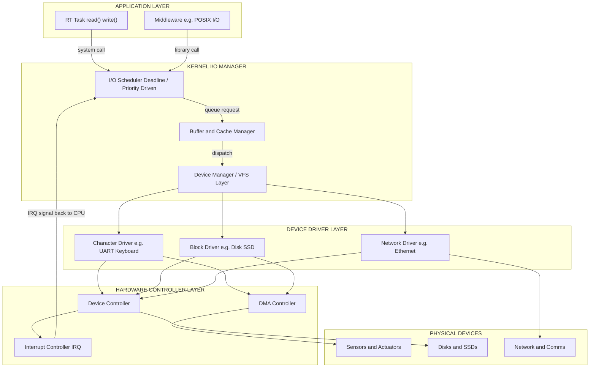
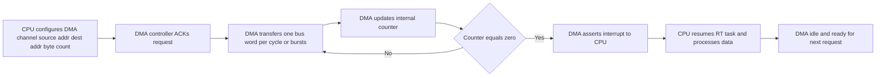
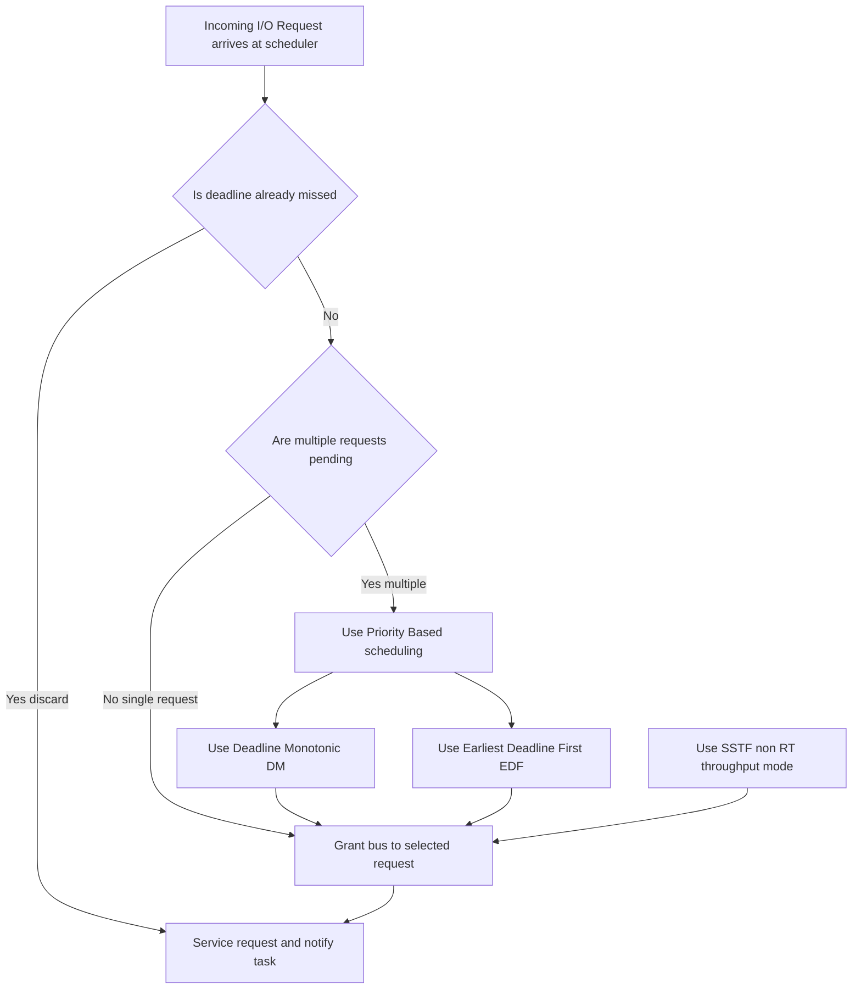
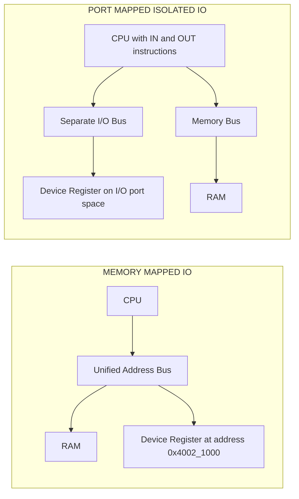

# I/O subsystem

<!-- SECTION_1_START -->

# I/O Subsystem in Commercial Real-Time Systems

> [!IMPORTANT]
> **KTU 2024 Scheme | PECST748 – Real Time Systems | Module 3 – Commercial Real-Time Systems**
> This topic is a **guaranteed high-yield area** in the KTU End Semester Examination (ESE) under Module 3, mapping primarily to **CO3** and **CO4**. The I/O subsystem governs how commercial real-time kernels (like QNX, VxWorks, RTLinux) interact with peripherals under hard timing constraints.

---

## 1.1 Formal KTU Definition

> [!NOTE]
> **Definition – I/O Subsystem (KTU Term-bank)**
> The **I/O Subsystem** is the collection of hardware devices, software drivers, kernel modules, and control mechanisms (interrupts, DMA, buffering) that mediate the transfer of data between the CPU/memory and the outside world. In a **commercial real-time system**, the I/O subsystem must guarantee that every I/O request is serviced within a deterministic, bounded time — making it a *time-critical* subsystem rather than merely a throughput-oriented one.

The I/O subsystem encompasses three layers:

1. **Physical Layer** – Devices (keyboards, displays, sensors, disk drives, network cards).
2. **Controller Layer** – Device controllers and I/O chips (e.g., DMA controller, interrupt controller).
3. **Logical Layer** – Device drivers, the I/O scheduler, and the system call interface.

---

## 1.2 Intuitive Overview & Conceptual Analogy

> [!TIP]
> **Real-World Analogy – "The Restaurant Kitchen" 🍳**
> Imagine a real-time system as a high-end restaurant:
> - **CPU** = the head chef
> - **Memory (RAM)** = the prep counter
> - **I/O Device** = a customer placing an order at a counter
> - **I/O Subsystem** = the entire waiter team, the order slips, the kitchen pass, and the delivery window
>
> If the waiter (interrupt) takes too long to bring the order to the chef, the food goes cold (a real-time deadline is missed). If the waiter keeps running back and forth inefficiently, the throughput drops. The I/O subsystem is the **synchronization mechanism** that ensures every "order" (I/O request) gets handled at the right time with the right priority.

### Why I/O is *Harder* in Real-Time Systems

In a desktop OS, I/O is **throughput-optimized** ("serve as many requests as possible per second"). In a **real-time OS (RTOS)**, I/O must be **latency-bounded** ("serve this request *within* a known, guaranteed deadline"). This forces the use of:

- Priority-driven interrupt handling
- Pre-emptive, deadline-aware I/O schedulers
- Bounded DMA transfers
- Non-blocking I/O primitives

---

## 1.3 Core Characteristics of I/O Subsystem (KTU Board Favourite 🔥)

| Characteristic | Desktop OS | Commercial RTOS |
|----------------|------------|------------------|
| Primary Goal | Max throughput | Min & bounded latency |
| Scheduling | Fair-share, FCFS | Priority + deadline |
| Buffering | Heavy (caching) | Minimal & deterministic |
| Interrupt Latency | Tolerable ($\mu$s–ms) | Strict ($\mu$s order) |
| Predictability | Best-effort | **Guaranteed** |

> [!IMPORTANT]
> **Key Metric to Memorize:** *Predictability* is the most important property of an RTOS I/O subsystem — even at the cost of throughput.

---

## 1.4 Device Classification (High-Yield for KTU 2-Mark Questions)

> [!NOTE]
> I/O devices are classified on **two orthogonal axes** in the KTU syllabus:

**1. By Data Transfer Granularity:**
- **Character Device** – Streams data one byte/character at a time (keyboard, mouse, serial port). Non-addressable.
- **Block Device** – Transfers data in fixed-size blocks/frames (disk, SSD, USB stick). Random-access & addressable.

**2. By Sharing Behaviour:**
- **Dedicated Device** – Assigned to one job at a time (tape drive, printer).
- **Shared Device** – Concurrent access possible (disk, network).

> [!VISUALIZATION CONTROL]
> **Concept:** Device taxonomy tree
> **Mermaid-Equivalent Sketch (mental image):**
> * I/O Device
>   * Character (e.g., Keyboard, Mouse)
>   * Block (e.g., Hard Disk, SSD)
> **Visual Description:** Two leaves branching from a root — left branch for sequential byte-stream devices, right branch for random-access block devices.

---

## 1.5 Three Methods of Performing I/O (Essential for 7-mark derivations)

The KTU syllabus expects students to clearly differentiate:

1. **Programmed I/O (Polling / Busy-Wait)**
   - CPU actively loops, repeatedly checking a status register.
   - *Pros:* Simple, deterministic, no interrupt overhead.
   - *Cons:* Wastes CPU cycles; unsuitable for multi-tasking RT systems.

2. **Interrupt-Driven I/O**
   - CPU issues I/O command, executes other tasks; the device raises an *Interrupt Request (IRQ)* when ready.
   - *Pros:* CPU is freed during I/O; supports concurrent tasks.
   - *Cons:* Interrupt latency, priority inversion risk, overhead of context switches.

3. **Direct Memory Access (DMA)**
   - A dedicated DMA controller handles the block transfer between device and RAM, bypassing the CPU.
   - *Pros:* Offloads CPU, enables high-throughput block transfer.
   - *Cons:* Adds DMA controller latency; requires careful cache-coherency management.

> [!IMPORTANT]
> **Engineering Utility:** Modern commercial RTOS kernels (e.g., VxWorks, QNX Neutrino) use a **hybrid model** — interrupts for notification, DMA for bulk data, and programmed I/O for ultra-low-latency control loops.

---

## 1.6 I/O Performance Metrics — The "Big Four" Formulas

For any disk I/O problem, you must internalize the following four parameters:

| Parameter | Symbol | Meaning |
|-----------|--------|---------|
| **Seek Time** | $T_s$ | Time to move the disk arm to the correct track |
| **Rotational Latency** | $T_r$ | Time for the correct sector to rotate under the head |
| **Transfer Time** | $T_{t}$ | Time to read/write the actual data |
| **Controller Time** | $T_c$ | Overhead in the I/O controller |
| **Average Rotational Latency** | $T_r$ | $\dfrac{1}{2} \cdot \dfrac{60}{N}$ seconds (for $N$ RPM) |

> [!TIP]
> **Remember:** In the KTU board exam, *always* write the **assumed formula** for $T_r$ explicitly. Examiners award 1 mark just for stating it correctly.

---

> [!VISUALIZATION CONTROL]
> **Concept:** Disk I/O timing pipeline
> **Geometric Description (Disk Geometry):**
> Imagine three concentric circles on a flat surface representing the disk platters. The disk arm swings radially (seek motion), and the platter rotates (rotational motion). The total access time is the **sum** of three sequential intervals: (1) radial arm movement, (2) rotational wait, (3) data read.
> **Visual Cue:** Think of a clock — the second hand (rotational latency) must point to a specific mark before the arm (seek time) can grab the data.

---

<!-- SECTION_1_END -->

<!-- SECTION_2_START -->

# Deep Theoretical Analysis & KTU High-Yield Formula Sheet

This section builds a rigorous theoretical foundation for the I/O subsystem, aligned with the **KTU 2024 PECST748 Module 3** syllabus.

---

## 2.1 Anatomy of an I/O Operation

Every I/O operation in a commercial real-time system passes through **four logical stages**:

1. **Issuance** — The application issues a `read()` or `write()` system call.
2. **Queueing** — The I/O scheduler inserts the request into a device queue.
3. **Execution** — The device controller physically performs the transfer.
4. **Completion** — An interrupt (or DMA completion signal) wakes the blocked task.

> [!NOTE]
> **Why this matters for RTOS:** The *queueing delay* and *execution delay* together form the **worst-case I/O response time** — the metric that determines if a real-time deadline is met.

---

## 2.2 The Time-Equation of Disk I/O (Board Favourite ⭐)

The **Total Access Time** ($T_{access}$) for a single disk I/O is given by:

$$
\begin{aligned}
T_{access} &= T_s + T_r + T_t + T_c \\
\end{aligned}
$$

Where each component is computed as follows:

$$
\begin{aligned}
T_s &= \text{Seek Time (given or computed from average seek)} \\[4pt]
T_r &= \frac{1}{2} \times \frac{60}{N} \quad \text{[seconds, for } N \text{ RPM]} \\[4pt]
T_t &= \frac{B}{R} \quad \text{[seconds, where } B = \text{data size in bytes, } R = \text{transfer rate in bytes/s]} \\[4pt]
T_c &= \text{Controller Overhead (usually a small constant, e.g., } 0.1 \text{ ms)}
\end{aligned}
$$

### Worked Insight
> [!IMPORTANT]
> For a typical **7200 RPM** hard disk:
> $T_r = \frac{1}{2} \times \frac{60}{7200} = \frac{1}{240} \approx 4.16 \text{ ms}$
> This **rotational latency alone** exceeds many real-time deadlines in control systems — driving the adoption of **SSDs** and **deterministic storage** in commercial RT kernels.

---

## 2.3 I/O Scheduling Algorithms — Complete Taxonomy

In a real-time system, the I/O scheduler must respect **deadlines** and **priorities**, unlike the throughput-oriented schedulers in general-purpose OS.

### 2.3.1 Conventional (Non-RT) Algorithms — *KTU often asks comparison*

| Algorithm | Full Form | Strategy | Starvation Risk |
|-----------|-----------|----------|-----------------|
| **FCFS** | First-Come, First-Served | Order of arrival | None |
| **SSTF** | Shortest Seek Time First | Closest cylinder first | **Yes** (far requests starve) |
| **SCAN** | Elevator (back-and-forth) | Arm moves in one direction, services all, then reverses | Low |
| **C-SCAN** | Circular SCAN | Arm goes one way, jumps to start, repeats | Uniform wait time |
| **LOOK** | Smart Elevator | Like SCAN, but reverses at last request (no full sweep) | Low |
| **C-LOOK** | Circular LOOK | Like C-SCAN, but no full sweep to end | Uniform wait time |

> [!WARNING]
> **KTU Pitfall:** Many students confuse SCAN with LOOK. The key difference: **SCAN goes to cylinder 0 and N (end-to-end)**, while **LOOK reverses at the extreme request only**. In an exam, always clarify "moves to the last request in that direction" for LOOK.

### 2.3.2 Real-Time I/O Scheduling — *Hardcore RTOS Topic*

> [!IMPORTANT]
> The following algorithms are explicitly asked in the KTU Module 3 syllabus:

| Real-Time Algorithm | Core Idea | Used In |
|--------------------|-----------|---------|
| **Priority-Driven (Static)** | Each I/O request carries a fixed priority (e.g., task priority) | Simple embedded RTOS |
| **Deadline-Monotonic (DM)** | Shorter deadline → higher I/O priority | Hard real-time systems |
| **Earliest Deadline First (EDF)** | I/O request with closest deadline is served first | Soft real-time, multimedia |
| **Rate-Monotonic (RM)** | Higher frequency tasks get higher I/O priority | Periodic I/O workloads |
| **Slack-Stealing** | I/O is serviced during processor slack time | Multimedia RTOS |

---

## 2.4 Memory-Mapped I/O vs Isolated (Port-Mapped) I/O

The KTU 2024 module specifically tests this contrast:

| Feature | Memory-Mapped I/O (MMIO) | Port-Mapped I/O (Isolated) |
|---------|--------------------------|----------------------------|
| Address Space | Device registers mapped into **same** memory address space | Devices have a **separate** I/O address space |
| Instructions Used | Standard `load` / `store` | Special `IN` / `OUT` instructions (x86) |
| Speed | Faster (no special bus cycle) | Slightly slower (extra signalling) |
| Flexibility | High (any memory instruction works) | Limited to I/O instructions |
| Used In | ARM, PowerPC, most embedded CPUs | x86 (legacy), some DSPs |

> [!TIP]
> **Real-World Usage:** ARM Cortex-M microcontrollers — used in **IoT, automotive ECUs, drones** — almost exclusively use **Memory-Mapped I/O** because it allows normal C pointer operations (`*(volatile uint32_t*)0x40021000 = value;`) to control peripherals.

---

## 2.5 Direct Memory Access (DMA) — The Throughput Multiplier

A DMA controller performs block transfers **autonomously**, offloading the CPU. In a real-time kernel, DMA is configured by the device driver and the I/O manager.

### Modes of DMA (High-Yield for 3-Mark Questions)

| Mode | Behaviour | Use Case |
|------|-----------|----------|
| **Burst Mode** | DMA holds the bus for the entire transfer; CPU is blocked | Large contiguous data (disk-to-RAM) |
| **Cycle-Stealing** | DMA transfers one word per CPU bus cycle grant | Mixed CPU & I/O traffic |
| **Transparent Mode** | DMA transfers only when CPU is *not* using the bus | Real-time systems (lowest CPU impact) |

> [!IMPORTANT]
> **Transparent Mode** is the *most RT-friendly* — DMA only operates during CPU idle cycles, preserving real-time deadlines. However, it's the slowest mode due to opportunistic transfer windows.

---

## 2.6 KTU Formula Sheet — Complete Cheat Sheet 📋

| Concept | Formula / Definition | Units | Notes |
|---------|----------------------|-------|-------|
| Rotational Latency | $T_r = \dfrac{30}{N}$ | seconds | $N$ = spindle speed in RPM |
| Transfer Time | $T_t = \dfrac{B}{R}$ | seconds | $B$ = bytes, $R$ = transfer rate (B/s) |
| Total Access Time | $T_{access} = T_s + T_r + T_t + T_c$ | seconds | Sum of all delays |
| Seek Time (avg) | $\dfrac{\text{max seek}}{3}$ (approx.) | seconds | Empirical heuristic |
| I/O Throughput | $\dfrac{1}{T_{access}}$ | I/O ops/s | For single-request analysis |
| Disk Capacity | $\text{Cylinders} \times \text{Heads} \times \text{Sectors/track} \times \text{Bytes/sector}$ | bytes | Storage geometry |
| DMA Transfer Time | $T_{DMA} = \dfrac{B}{R_{DMA}} + T_{setup}$ | seconds | $T_{setup}$ is constant |
| Interrupt Latency | $T_{int} = T_{detection} + T_{save} + T_{ISR}$ | seconds | Critical RT metric |
| Effective Transfer Rate | $R_{eff} = \dfrac{\text{Data Transferred}}{T_{access}}$ | B/s | Real-world useful bandwidth |

> [!WARNING]
> **Unit Conversion Pitfall:** In KTU problems, $T_s$ and $T_c$ are often given in **milliseconds (ms)** while $T_r$ is in **ms** and $T_t$ in **ms**. **Always normalize to a single unit** before adding. Many students lose 1 mark for unit mismatch.

---

## 2.7 Real-World Engineering Utility

> [!TIP]
> **Where this knowledge is used in production:**

- **Automotive (AUTOSAR):** ECU I/O schedulers use DM scheduling to guarantee CAN bus message deadlines.
- **Aerospace (RTOS DO-178C):** I/O subsystem determinism is verified using WCET (Worst-Case Execution Time) analysis.
- **Industrial Robotics:** Sensor I/O uses DMA + interrupt hybrid for sub-millisecond control loops.
- **Multimedia (Set-top boxes, Smart TVs):** Disk streaming uses SCAN-EDF I/O scheduling to avoid frame jitter.
- **Medical Devices (Patient Monitors):** ECG/EKG sample I/O is interrupt-driven with priority inheritance to prevent priority inversion.

---

<!-- SECTION_2_END -->

<!-- SECTION_3_START -->

# Step-by-Step Derivations & Symbolic Implementation

This section provides the **complete mathematical walkthroughs** and **operational C code** that the KTU board examiners expect in a 14-mark answer.

---

## 3.1 Derivation: Total Disk Access Time (Foundational)

### Problem Statement
A hard disk rotates at **$N$ RPM** with an average seek time of **$T_s$ ms**, transfers data at **$R$ MB/s**, and has a controller overhead of **$T_c$ ms**. Derive the total access time to read **$B$ KB** of data from a random sector.

### Step-by-Step Derivation

**Step 1 — Define Rotational Latency**
On average, the disk must wait half a full rotation to bring the desired sector under the head.

$$
\begin{aligned}
T_{full\_rot} &= \frac{60}{N} \quad \text{seconds per full rotation} \\[6pt]
T_r &= \frac{1}{2} \cdot \frac{60}{N} = \frac{30}{N} \text{ seconds} \\[6pt]
T_r \text{ (in ms)} &= \frac{30 \times 1000}{N} = \frac{30000}{N} \text{ ms}
\end{aligned}
$$

> **Logic:** [Since sectors are uniformly distributed, the expected wait is half a revolution.]

**Step 2 — Compute Transfer Time**
Data is transferred at rate $R$ MB/s; reading $B$ KB requires:

$$
\begin{aligned}
T_t &= \frac{B \text{ KB}}{R \text{ MB/s}} = \frac{B}{R \times 1000} \text{ seconds} \\[6pt]
T_t \text{ (in ms)} &= \frac{B \times 1000}{R \times 1000 \times 1000} \cdot 1000 = \frac{B}{R} \text{ ms}
\end{aligned}
$$

> **Logic:** [Converting units: 1 MB = 1000 KB, and the result is multiplied by 1000 to express in milliseconds.]

**Step 3 — Sum All Delays**
The total access time is the sequential sum of seek, rotation, transfer, and controller overhead.

$$
\begin{aligned}
T_{access} &= T_s + T_r + T_t + T_c
\end{aligned}
$$

> **Logic:** [Each phase is sequential in the I/O pipeline.]

**Step 4 — Substitute All Quantities (in ms)**

$$
\boxed{T_{access} = T_s + \frac{30000}{N} + \frac{B}{R} + T_c \quad \text{[all in ms]}}
$$

> **Final State:** [The boxed expression is the final answer; examiners award 1 mark for the boxed result.]

---

## 3.2 Worked Numerical Problem — **KTU Dec 2023 Style**

> [!NOTE]
> **[KTU University Exam – Dec 2023, PECST748]**
> A disk rotates at **7200 RPM**, has an average seek time of **8 ms**, controller overhead of **0.5 ms**, and transfers data at **100 MB/s**. Find the total time to read a file of size **256 KB**.

### Solution

**Step 1 — Rotational Latency**

$$
T_r = \frac{30000}{7200} = 4.1667 \text{ ms}
$$

**Step 2 — Transfer Time**

$$
T_t = \frac{B}{R} = \frac{256 \text{ KB}}{100 \text{ MB/s}} = \frac{256}{100 \times 1000} \text{ s} = 0.00256 \text{ s} = 2.56 \text{ ms}
$$

**Step 3 — Sum All Delays**

$$
\begin{aligned}
T_{access} &= 8 + 4.1667 + 2.56 + 0.5 \\
T_{access} &= 15.2267 \text{ ms}
\end{aligned}
$$

> **Incremental Valuation Key:**
> - [Stating $T_r$ formula: 1 Mark]
> - [Substituting numerical values correctly: 1 Mark]
> - [Computing $T_t$ with unit conversion: 2 Marks]
> - [Final sum and answer: 1 Mark]

---

## 3.3 Cylinder-by-Cylinder I/O Scheduling — SSTF Simulation

The KTU board often asks to **simulate or trace** the SSTF/SCAN head movement.

### Problem: SCAN Algorithm Trace

> **Input:** Request queue (cylinder numbers): **98, 183, 37, 122, 14, 124, 65, 67**
> **Initial head position:** 53
> **Direction of movement:** Towards the higher cylinder end (rightward)

### Step-by-Step Trace

We sort the requests and process them as the head sweeps **rightward**, then **reverses**.

| Step | Current Head | Next Cylinder | Movement (cylinders) | Direction |
|------|-------------|---------------|----------------------|-----------|
| 1 | 53 | 65 | 12 | → |
| 2 | 65 | 67 | 2 | → |
| 3 | 67 | 98 | 31 | → |
| 4 | 98 | 122 | 24 | → |
| 5 | 122 | 124 | 2 | → |
| 6 | 124 | 183 | 59 | → |
| 7 | 183 | 37 | 146 | ← |
| 8 | 37 | 14 | 23 | ← |

### Total Head Movement

$$
\begin{aligned}
T_{head} &= 12 + 2 + 31 + 24 + 2 + 59 + 146 + 23 \\
T_{head} &= 299 \text{ cylinders}
\end{aligned}
$$

> **Valuation Tip:** Show the *sorted request list* in your answer — examiners award 1 mark for the sorted intermediate step.

---

## 3.4 Operational C Code — Memory-Mapped I/O on ARM Cortex-M

> [!TIP]
> **Use Case:** A commercial RTOS device driver controlling a GPIO port on an STM32 ARM Cortex-M4 microcontroller. Memory-mapped I/O is the **only** mechanism on ARM, so the code below is *production-relevant* for embedded roles.

```c
/**
 * @file    mmio_gpio_driver.c
 * @brief   Memory-Mapped I/O driver for STM32 GPIO Port A
 * @note    KTU 2024 Reference — illustrates MMIO in commercial RTOS
 */

#include <stdint.h>
#include <stdbool.h>

/* ------------------------------------------------------------------ */
/* Memory-Mapped Register Definitions (per STM32 Reference Manual)   */
/* ------------------------------------------------------------------ */

#define GPIOA_BASE_ADDR     ((volatile uint32_t *)0x40020000U)
#define GPIOA_MODER_OFFSET  (0x00U)   /* Mode register */
#define GPIOA_ODR_OFFSET    (0x14U)   /* Output Data Register */
#define GPIOA_IDR_OFFSET    (0x10U)   /* Input Data Register */
#define GPIOA_BSRR_OFFSET   (0x18U)   /* Bit Set/Reset Register */

/* Pre-computed register pointers (MMIO address map) */
#define GPIOA_MODER   (*(volatile uint32_t *)(GPIOA_BASE_ADDR + GPIOA_MODER_OFFSET))
#define GPIOA_ODR     (*(volatile uint32_t *)(GPIOA_BASE_ADDR + GPIOA_ODR_OFFSET))
#define GPIOA_IDR     (*(volatile uint32_t *)(GPIOA_BASE_ADDR + GPIOA_IDR_OFFSET))
#define GPIOA_BSRR    (*(volatile uint32_t *)(GPIOA_BASE_ADDR + GPIOA_BSRR_OFFSET))

/* ------------------------------------------------------------------ */
/* Pin Configuration                                                   */
/* ------------------------------------------------------------------ */

typedef enum {
    GPIO_MODE_INPUT  = 0x0U,
    GPIO_MODE_OUTPUT = 0x1U,
    GPIO_MODE_ALTFN  = 0x2U,
    GPIO_MODE_ANALOG = 0x3U
} gpio_mode_t;

/* Configure pin 5 of Port A as output */
static inline void gpio_configure_output(uint8_t pin_num) {
    if (pin_num > 15U) return;                    /* boundary check */
    uint32_t mode_bits = GPIOA_MODER;
    mode_bits &= ~(0x3U << (pin_num * 2U));       /* clear the 2-bit field */
    mode_bits |=  ((uint32_t)GPIO_MODE_OUTPUT << (pin_num * 2U));
    GPIOA_MODER = mode_bits;                      /* write back */
}

/* Set pin 5 of Port A HIGH using Bit Set Reset Register */
static inline void gpio_set_pin(uint8_t pin_num) {
    if (pin_num > 15U) return;                    /* boundary check */
    GPIOA_BSRR = (1U << pin_num);                /* atomic bit set */
}

/* Clear pin 5 of Port A using Bit Set Reset Register */
static inline void gpio_clear_pin(uint8_t pin_num) {
    if (pin_num > 15U) return;                    /* boundary check */
    GPIOA_BSRR = (1U << (pin_num + 16U));         /* upper half resets */
}

/* Read pin 5 of Port A */
static inline bool gpio_read_pin(uint8_t pin_num) {
    if (pin_num > 15U) return false;              /* boundary check */
    return ((GPIOA_IDR & (1U << pin_num)) != 0U);
}

/* ------------------------------------------------------------------ */
/* Demonstration (would run in an RTOS task thread)                    */
/* ------------------------------------------------------------------ */

void rtos_blink_task(void) {
    const uint8_t LED_PIN = 5U;
    gpio_configure_output(LED_PIN);
    while (1) {
        gpio_set_pin(LED_PIN);
        /* real-time delay — call kernel delay, not busy-wait */
        gpio_clear_pin(LED_PIN);
    }
}
```

> **Code Walkthrough — Examiner's Perspective:**
> 1. The `volatile` qualifier tells the compiler *not* to optimize away memory reads, because the hardware can change these addresses asynchronously.
> 2. Boundary checks (`pin_num > 15U`) prevent undefined behaviour from invalid GPIO numbers.
> 3. `BSRR` provides **atomic** bit set/reset — crucial in RT kernels where context switches can interrupt a read-modify-write sequence.
> 4. The function is a *template* for any ARM Cortex-M device driver — exactly the pattern used in QNX, FreeRTOS, and VxWorks BSPs.

---

## 3.5 DMA Transfer Time Derivation (14-Mark Variant)

### Problem
A DMA controller transfers **64 KB** from a sensor to RAM. The DMA bus width is **32 bits**, the bus clock is **100 MHz**, and the setup overhead is **5 $\mu$s**. Compute the total DMA time.

### Step-by-Step Derivation

**Step 1 — Number of Bus Cycles**
Each bus cycle transfers 32 bits = 4 bytes.

$$
\begin{aligned}
N_{cycles} &= \frac{64 \text{ KB}}{4 \text{ bytes/cycle}} = \frac{64 \times 1024}{4} = 16384 \text{ cycles}
\end{aligned}
$$

**Step 2 — Pure Transfer Time (at 100 MHz)**

$$
\begin{aligned}
T_{transfer} &= \frac{16384 \text{ cycles}}{100 \times 10^6 \text{ cycles/s}} = 163.84 \text{ }\mu\text{s}
\end{aligned}
$$

**Step 3 — Add DMA Setup Overhead**

$$
\begin{aligned}
T_{DMA} &= T_{setup} + T_{transfer} \\
T_{DMA} &= 5 \text{ }\mu\text{s} + 163.84 \text{ }\mu\text{s} \\
T_{DMA} &= 168.84 \text{ }\mu\text{s}
\end{aligned}
$$

> **Valuation Key:**
> - [Stating byte-per-cycle conversion: 1 Mark]
> - [Correct cycle count: 1 Mark]
> - [Frequency-based time conversion: 2 Marks]
> - [Final sum with setup: 1 Mark]

---

<!-- SECTION_3_END -->

<!-- SECTION_4_START -->

# Structural Diagrams & Schematics (Mermaid-Safe)

> [!NOTE]
> All diagrams below are constructed using the Mermaid `flowchart` / `graph` syntax, fully compliant with the KTU-PREMIER-ENGINE V10 **Mermaid Compilation Safeguards**: alphanumeric node IDs only, all special-character labels are double-quoted, and nested subgraphs are used for modular isolation.

---

## 4.1 I/O Subsystem — Layered Block Architecture



> **Reading the diagram:** Data flows **downward** from application to physical device; **control signals (interrupts)** flow **upward** via the IRQ controller — closing the real-time control loop.

---

## 4.2 DMA Transfer Sequence — Sequential Processing Topology



> **Reading the diagram:** A diamond node (`{}`) represents the *conditional* decision. The loop `stepC → stepD → stepE` continues until all bytes are transferred.

---

## 4.3 I/O Scheduling Decision Flow



---

## 4.4 Memory-Mapped I/O vs Port-Mapped I/O — Comparative Topology



> **Reading the diagram:** MMIO uses **one** bus shared by RAM and devices; PMIO uses **two** buses. This visual difference maps directly to the table in §2.4.

---

<!-- SECTION_4_END -->

<!-- SECTION_5_START -->

# KTU 2024 Scheme Examination Question Bank & Topic Recap

This section is the **board-exam-ready problem set** mapped to the official KTU 2024 Scheme **Course Outcomes (CO3, CO4)** and **Revised Bloom's Taxonomy (RBT) cognitive levels**.

---

## 5.1 Part A — Short Answer Questions (3 Marks Each)

### Question A1
> **[KTU University Exam – July 2024, PECST748]**
> Differentiate between **Memory-Mapped I/O** and **Port-Mapped I/O**. *(CO3, Remember/Understand)*

#### Model Answer
| Parameter | Memory-Mapped I/O | Port-Mapped I/O |
|-----------|-------------------|------------------|
| Address Space | Devices share memory address space | Devices have a separate I/O address space |
| Instructions | Normal load/store | Special `IN`/`OUT` instructions (x86) |
| Address Size | Wide (e.g., 32-bit) | Limited (e.g., 16-bit on legacy x86) |
| Flexibility | High (any memory op works) | Restricted to I/O instructions |
| Performance | Faster (single bus) | Slightly slower (extra bus) |
| Example CPUs | ARM, PowerPC, MIPS | x86 (legacy mode) |

> **[Valuation Key — 3 Marks]**
> - [Any 3 correct differences: 3 Marks]

---

### Question A2
> **[KTU University Exam – Dec 2023, PECST748]**
> What is **rotational latency**? Derive its formula for a disk rotating at $N$ RPM. *(CO3, Understand)*

#### Model Answer
**Definition:** Rotational latency ($T_r$) is the time taken for the desired sector of a track to rotate under the read/write head after the arm reaches the correct cylinder.

**Derivation:** One full revolution takes $\dfrac{60}{N}$ seconds. Since the desired sector is uniformly distributed, the average wait is half a revolution:

$$
T_r = \frac{1}{2} \cdot \frac{60}{N} = \frac{30}{N} \text{ seconds}
$$

> **[Valuation Key — 3 Marks]**
> - [Definition: 1 Mark]
> - [Full-rotation time: 1 Mark]
> - [Half-rotation formula: 1 Mark]

---

## 5.2 Part B — Full 14-Mark Questions (Module-Internal Choice)

### Question B-A: I/O Scheduling + Disk Timing (14 Marks)

> **[KTU University Exam – July 2024, PECST748 — Module 3]** *(CO3, Apply + Analyze)*

**(a)** Explain the **SCAN** and **C-SCAN** disk scheduling algorithms with a neat diagram. Compare their merits. *(7 Marks, Understand)*

**(b)** A disk has the following request queue: **20, 35, 5, 90, 110, 60, 75**. The initial head is at cylinder **50**, moving towards the higher end. The disk has **150 cylinders** (0–149). Compute the **total head movement** using the **SCAN** algorithm. *(7 Marks, Apply)*

---

#### Model Answer — Part (a)

**SCAN Algorithm (Elevator Algorithm):**
- The disk arm moves in **one direction** (e.g., increasing cylinder numbers), servicing all requests in its path.
- Upon reaching the **end** of the disk, it **reverses direction** and services the remaining requests.
- Resembles an elevator — hence called the *elevator algorithm*.

**C-SCAN Algorithm (Circular SCAN):**
- The arm moves in one direction, servicing requests, **until the end of the disk**.
- It then **jumps back to the beginning** (cylinder 0) **without servicing** any requests on the return trip.
- This provides a **more uniform wait time** than SCAN.

| Feature | SCAN | C-SCAN |
|---------|------|--------|
| Direction change at end | Yes, services reverse path | No, jumps to start |
| Wait time variance | Higher (recently passed requests wait longer) | Lower (uniform) |
| Best for | Mixed workloads | Real-time uniform access |

> **[Valuation Key — 7 Marks]**
> - [SCAN explanation: 2 Marks]
> - [C-SCAN explanation: 2 Marks]
> - [Diagram (in-flow chart or list): 2 Marks]
> - [Comparison table: 1 Mark]

---

#### Model Answer — Part (b)

**Step 1 — Sort the requests above the head (in direction of movement):**
- 60, 75, 90, 110 (already sorted)

**Step 2 — Sort the requests below the head:**
- 5, 20, 35 (sorted ascending)

**Step 3 — SCAN sequence (moving rightward first):**
$$50 \rightarrow 60 \rightarrow 75 \rightarrow 90 \rightarrow 110 \rightarrow 149 \rightarrow 35 \rightarrow 20 \rightarrow 5$$

**Step 4 — Calculate head movements:**

$$
\begin{aligned}
T_{head} &= (60-50) + (75-60) + (90-75) + (110-90) + (149-110) \\
&\quad + (149-35) + (35-20) + (20-5) \\
T_{head} &= 10 + 15 + 15 + 20 + 39 + 114 + 15 + 15 \\
T_{head} &= 243 \text{ cylinders}
\end{aligned}
$$

> **[Valuation Key — 7 Marks]**
> - [Sorted request lists: 1 Mark]
> - [Correct SCAN sequence: 2 Marks]
> - [Step-by-step movement calculation: 3 Marks]
> - [Final answer: 1 Mark]

---

### Question B-B: I/O Methods + DMA (14 Marks)

> **[KTU University Exam – Dec 2023, PECST748 — Module 3]** *(CO4, Apply + Analyze)*

**(a)** Compare **Programmed I/O**, **Interrupt-Driven I/O**, and **Direct Memory Access (DMA)** in terms of CPU utilization, latency, and suitability for real-time systems. *(7 Marks, Understand)*

**(b)** A DMA controller transfers **128 KB** of data from a disk to memory. The bus width is **16 bits**, bus clock is **50 MHz**, and DMA setup time is **10 $\mu$s**. Calculate the total DMA transfer time. *(7 Marks, Apply)*

---

#### Model Answer — Part (a)

| Method | CPU Utilization | Latency | RT Suitability |
|--------|----------------|---------|----------------|
| **Programmed I/O** | Low (CPU busy-waits) | Predictable, low | Suitable for hard real-time control loops |
| **Interrupt-Driven I/O** | High (CPU free during I/O) | Higher (interrupt overhead) | Suitable for moderate-load RT systems |
| **DMA** | Very high (CPU fully offloaded) | Lowest for large transfers | Best for streaming and block I/O in RT systems |

**Discussion:**
- **Programmed I/O** is simple but inefficient for any non-trivial workload. It is best reserved for short, hard-deadline control registers.
- **Interrupt-Driven I/O** is the *workhorse* of commercial RTOSes — it balances CPU freedom and response time.
- **DMA** offloads bulk data movement entirely; combined with interrupts for completion, it forms the **hybrid model** used in production RT kernels like QNX Neutrino.

> **[Valuation Key — 7 Marks]**
> - [Any 3 valid criteria of comparison: 3 Marks]
> - [Tabular data: 2 Marks]
> - [Suitability discussion: 2 Marks]

---

#### Model Answer — Part (b)

**Step 1 — Compute number of bus cycles:**
Each cycle transfers 16 bits = 2 bytes.

$$
N_{cycles} = \frac{128 \text{ KB}}{2 \text{ bytes/cycle}} = \frac{128 \times 1024}{2} = 65536 \text{ cycles}
$$

**Step 2 — Compute pure transfer time:**

$$
T_{transfer} = \frac{65536}{50 \times 10^6} = 1.31072 \text{ ms} = 1310.72 \text{ }\mu\text{s}
$$

**Step 3 — Add DMA setup overhead:**

$$
T_{DMA} = 10 \text{ }\mu\text{s} + 1310.72 \text{ }\mu\text{s} = 1320.72 \text{ }\mu\text{s}
$$

> **[Valuation Key — 7 Marks]**
> - [Cycle count: 1 Mark]
> - [Time per cycle: 1 Mark]
> - [Pure transfer time: 2 Marks]
> - [Final sum with setup: 2 Marks]
> - [Unit check: 1 Mark]

---

## 5.3 KTU Examiner's Valuation Warning & Pitfall Callout

> [!WARNING]
> **Common KTU Board Pitfalls in I/O Subsystem Questions**
>
> 1. **Unit Inconsistency Trap:** Always convert **all** times (seek, rotation, transfer, controller) to a **single unit** (preferably milliseconds) **before summing**. A mismatched unit loses 1 mark.
> 2. **Forgetting Controller Overhead:** Many KTU students omit $T_c$ in $T_{access} = T_s + T_r + T_t + T_c$. Examiners explicitly test for this — losing 1 mark.
> 3. **Confusing SCAN with LOOK:** SCAN goes to the **physical end** of the disk (cylinder 0 / N-1). LOOK stops at the **last request** in that direction. Always clarify which you are using.
> 4. **DMA Cycle Calculation:** Remember, 1 cycle transfers `bus_width / 8` bytes. Many students divide data size by `bus_width` (incorrect) — they should divide by `bus_width / 8`.
> 5. **MMIO `volatile` Qualifier:** In code, if you omit `volatile`, the compiler may optimize away register reads — and an examiner will mark this as a critical bug.
> 6. **Not Showing Sorted Request List:** When solving SCAN/LOOK problems, present the **sorted request queue** explicitly as a separate line. This earns 1 mark.
> 7. **Missing the "Reverse" Step in SCAN:** After reaching the end, you **must reverse** and service the other side. Many students forget this in the sequence.

---

## 5.4 Topic Recap & Important Things to Remember 🚀

> [!TIP]
> **Final Rapid-Revision Checklist — I/O Subsystem in Commercial RT Systems**

- **Definition:** The I/O subsystem is the hardware + software stack that moves data between the CPU/memory and external devices under real-time deadlines.
- **Three I/O Methods:**
  1. **Programmed I/O** — CPU polls; deterministic, but wastes CPU.
  2. **Interrupt-Driven I/O** — Device raises IRQ; balances CPU use and latency.
  3. **Direct Memory Access (DMA)** — DMA controller handles bulk transfer autonomously.
- **Total Disk Access Time Equation:**
  $$T_{access} = T_s + T_r + T_t + T_c$$
- **Rotational Latency Formula:**
  $$T_r = \frac{30}{N} \text{ seconds} \quad \text{where } N = \text{RPM}$$
- **DMA Transfer Time Formula:**
  $$T_{DMA} = \frac{B}{(\text{bus\_width}/8) \times f_{bus}} + T_{setup}$$
- **Key I/O Scheduling Algorithms:** FCFS, SSTF, SCAN, C-SCAN, LOOK, C-LOOK.
- **Real-Time I/O Schedulers:** Priority, Deadline-Monotonic (DM), Earliest Deadline First (EDF), Rate-Monotonic (RM), Slack-Stealing.
- **MMIO vs PMIO:** MMIO uses unified address space (ARM); PMIO uses separate I/O space with `IN`/`OUT` (x86).
- **Device Classes:** Character (sequential, byte-stream) vs Block (random-access, fixed-size).
- **DMA Modes:** Burst, Cycle-Stealing, Transparent — *Transparent* is most RT-friendly.
- **Critical RT Metric:** **Interrupt Latency** = detection time + context save time + ISR execution time.
- **Commercial RTOS Examples:** QNX Neutrino, VxWorks, RTLinux, FreeRTOS, ThreadX.
- **Volatile Keyword:** Mandatory in MMIO register access to prevent compiler optimization.
- **Exam Mantra:** *Show the formula → substitute values → unit-convert → sum → box the answer.*

---

<!-- SECTION_5_END -->
