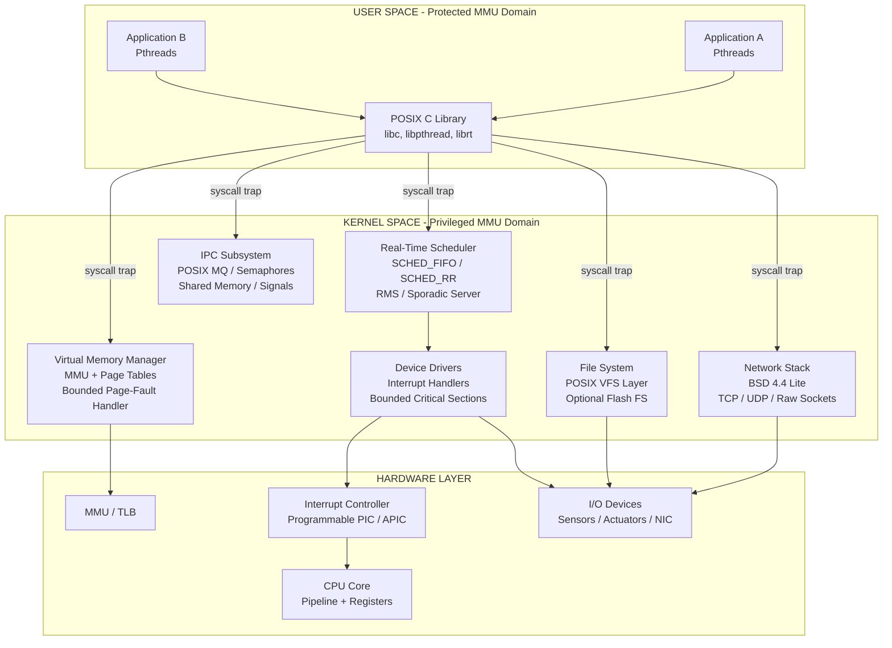
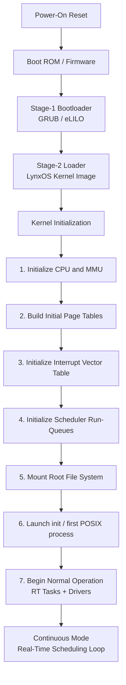
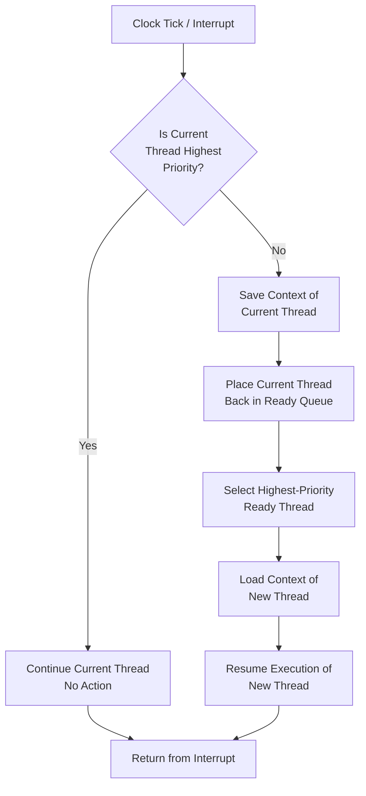
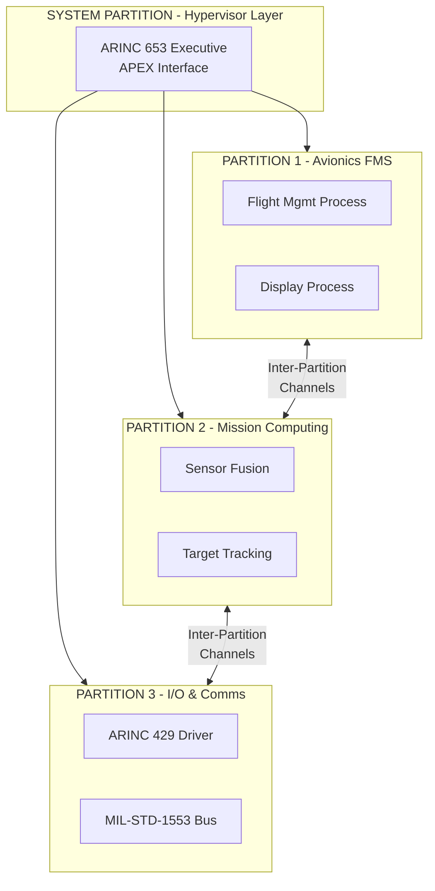

# Lynx

<!-- SECTION_1_START -->
# Lynx (LynxOS) – A Commercial Real-Time Operating System

## 1.1 Formal Definition (KTU 2024 Syllabus Terminology)

> [!NOTE]
> **LynxOS** is a **POSIX-compliant, hard real-time, Unix-like operating system** developed originally by **LynuxWorks** (1988) and currently maintained by **Lynx Software Technologies, Inc.** It is a **monolithic, fully preemptible kernel** designed for mission-critical embedded applications requiring deterministic response, full memory protection via a **Memory Management Unit (MMU)**, and standards-based API compatibility (POSIX 1003.1, 1003.1b, 1003.1c, 1003.1d, 1003.1j).

The word *"Lynx"* in the context of KTU Module-3 (Commercial Real-Time Operating Systems) refers to the family of LynxOS products from Lynx Software Technologies, primarily:

| Product Variant | Domain | Certification |
|---|---|---|
| **LynxOS** | General embedded / industrial / military | POSIX 1003.1 |
| **LynxOS-178** | Avionics (DO-178C) | DO-178C Level A |
| **LynxOS-Secure** | Trusted computing / separation kernel | EAL-7 (historically) |
| **LynxOS-MMU / LynxOS-SEP** | Multi-level security / ARINC 653 | EAL6+ |

## 1.2 Conceptual Analogy – Intuitive Overview

> [!IMPORTANT]
> **Analogy: "The Airport Control Tower"**
> Imagine an international airport where hundreds of aircraft take off and land every minute. The **air traffic controller (LynxOS kernel)** must guarantee that a *distress call* (hard real-time interrupt) is answered within **strict, bounded milliseconds** — no matter how busy the runways are. 
>
> - **Linux** would be a large commercial airport — extremely capable, but occasionally has a coffee break (non-deterministic latency).
> - **LynxOS** is a *military-grade control tower*: every radio, every priority, every runway slot is *pre-allocated* and *deterministically scheduled*. The "POSIX" label means pilots trained on standard Unix instruments can fly here without retraining.
>
> **Key Intuition:** LynxOS brings the *standardized POSIX/Unix programming model* (familiarity, portability) into a kernel that is *engineered from scratch* to be deterministic — the best of both worlds for embedded systems engineers.

## 1.3 Defining Standards & Constants

- **POSIX.1b** – Real-time extensions (timers, signals, message queues, semaphores, shared memory, async I/O, scheduling).
- **POSIX.1c** – Threads (pthreads).
- **POSIX.1d** – Additional real-time extensions.
- **POSIX.1j** – Real-time IPC.
- **Interrupt Latency** – typically **< 5 µs** on supported hardware.
- **Context-switch time** – typically **< 10 µs** (hardware dependent).
- **MMU-based full memory protection** (unlike uClinux or small RTOS).

## 1.4 Visual Block – Positioning LynxOS in the RTOS Landscape

> [!VISUALIZATION CONTROL]
> **Concept:** RTOS Classification by Kernel Architecture
> **Visualization:** A 2D plot where the X-axis is *Standards Compliance* and the Y-axis is *Determinism/Real-Time Capability*.
> **Visual Description:** 
> - Bottom-left: VxWorks, eCos (deterministic but proprietary)
> - Top-right: LynxOS (deterministic + POSIX standards)
> - Far-right: Linux (standards-rich, soft real-time without PREEMPT_RT patches)
> - Bottom-left far: FreeRTOS (small, deterministic, minimal standards)
>
> *LynxOS uniquely occupies the upper-right quadrant — the "industrial-grade POSIX" cell.*

<!-- SECTION_1_END -->

<!-- SECTION_2_START -->
# Deep Theoretical Analysis & KTU High-Yield Formula Sheet

## 2.1 Architectural Pillars of LynxOS

The LynxOS architecture rests on **five tightly-integrated pillars**. Each is engineered to deliver deterministic behavior while preserving a Unix-style programming model.

### 2.1.1 Pillar 1 — Monolithic, Fully Preemptible Kernel
- **All OS services (scheduler, IPC, drivers, network stack) live in kernel space.**
- The kernel is **fully preemptible** — even inside the kernel, a higher-priority thread can preempt a lower-priority one (unlike Linux's standard kernel, which uses preemption points).
- This eliminates the *priority inversion* window typical of non-preemptible kernels.

> [!NOTE]
> **Definition (KTU exact wording):** *A fully preemptible kernel is one in which the currently executing kernel-mode code can be interrupted and replaced by a higher-priority thread at virtually any instruction boundary, subject only to the briefest critical-section lock.*

### 2.1.2 Pillar 2 — MMU-Based Memory Protection
- LynxOS uses the **hardware MMU** of the processor (x86, PowerPC, ARM with MMU).
- Each process/thread has a **private virtual address space**.
- **Page-fault handling** is bounded and deterministic.
- Two regions: **kernel space** (privileged, shared) and **user space** (protected, per-process).

### 2.1.3 Pillar 3 — POSIX 1003 Real-Time Extensions
LynxOS implements the *full* POSIX real-time surface:

| POSIX Sub-spec | Feature |
|---|---|
| 1003.1b | `mq_open`, `sem_open`, `mmap`, `shm_open`, `timer_create`, `sigqueue`, `sched_setparam` |
| 1003.1c | POSIX Threads (`pthread_create`, mutexes, condition variables) |
| 1003.1d | Sporadic server, `sem_timedwait`, `mq_timedsend` |
| 1003.1j | Real-time IPC: `mq`, priority inversion safe mutexes |

### 2.1.4 Pillar 4 — Real-Time Scheduler
LynxOS scheduler is **priority-based, preemptive, and supports multiple scheduling policies**:

- **SCHED_FIFO** — fixed priority, run-to-completion or until preempted.
- **SCHED_RR** — round-robin within a priority level.
- **SCHED_OTHER** — traditional Unix time-sharing (lowest priority band).
- **POSIX Sporadic Server** — bandwidth-preserving server for aperiodic tasks.
- **Rate-Monotonic Scheduling (RMS)** support through *fixed-priority* policy + priority ceiling protocols.

### 2.1.5 Pillar 5 — Native TCP/IP and File System
- **BSD-4.4 Lite** based network stack (sockets, TCP, UDP, raw).
- **POSIX file system semantics** (mount, umount, open, read, write).
- **Optional real-time networking (RTnet)** for deterministic Ethernet.

## 2.2 The LynxOS Kernel Block Diagram (Conceptual)

The following layered model describes how an application thread request flows from user space down to hardware:

```
┌─────────────────────────────────────────────────────────┐
│ USER SPACE (Protected, Per-Process Virtual Address)     │
│  ┌───────────────┐  ┌───────────────┐  ┌──────────────┐ │
│  │ Application A │  │ Application B │  │  POSIX Libs  │ │
│  │  (pthreads)   │  │  (pthreads)   │  │  (libc, mq)  │ │
│  └───────────────┘  └───────────────┘  └──────────────┘ │
└────────────┬──────────────────┬──────────────────┬───────┘
             │ syscall / trap   │                  │
             ▼                  ▼                  ▼
┌─────────────────────────────────────────────────────────┐
│ KERNEL SPACE (Privileged, Shared Virtual Address)       │
│  ┌──────────┐ ┌──────────┐ ┌──────────┐ ┌────────────┐ │
│  │Scheduler │ │  MMU/VMM │ │ IPC Core │ │ Network    │ │
│  │SCHED_FIFO│ │Paging/TLB│ │mq, sem,  │ │ Stack      │ │
│  │SCHED_RR  │ │Page-flt  │ │shm, pipe │ │(BSD TCP/IP)│ │
│  └──────────┘ └──────────┘ └──────────┘ └────────────┘ │
│  ┌──────────────────────────────────────────────────┐  │
│  │ Interrupt Controller (Bounded Latency Layer)     │  │
│  └──────────────────────────────────────────────────┘  │
└────────────┬────────────────────────────────────────────┘
             ▼
┌─────────────────────────────────────────────────────────┐
│ HARDWARE (CPU + MMU + Interrupt Controller + Devices)  │
└─────────────────────────────────────────────────────────┘
```

## 2.3 Determinism — The Engineering Metric

For real-time systems, *raw speed* is meaningless; *bounded timing* is everything. The determinism of LynxOS can be quantified using three timing metrics.

## 2.4 KTU Formula Sheet / Cheat Sheet

| # | Parameter / Concept | Formula or Expression | Symbol / Unit | Notes |
|---|---|---|---|---|
| 1 | **Worst-Case Interrupt Latency** | $L_{int} = T_{detect} + T_{dispatch} + T_{handler\_entry}$ | $\mu s$ | Bounded; depends on longest critical section |
| 2 | **Worst-Case Context Switch Time** | $C_{cs} = T_{save} + T_{load} + T_{cache\_miss\_penalty}$ | $\mu s$ | Constant for a given CPU |
| 3 | **Task Response Time (RMS)** | $R_i = C_i + \sum_{j \in hp(i)} \left\lceil \dfrac{R_i}{T_j} \right\rceil C_j$ | $ms$ | Iteration until $R_i \le T_i$ (Deadline) |
| 4 | **CPU Utilization (RMS bound)** | $U = \sum_{i=1}^{n} \dfrac{C_i}{T_i} \le n(2^{1/n} - 1)$ | dimensionless | For $n$ tasks, $U \le 69.3\%$ as $n \to \infty$ |
| 5 | **Thread Priority Range** | $0 \le P \le 255$ (typical) | priority | 0 = lowest, 255 = highest (or inverted — check kernel) |
| 6 | **POSIX Timer Resolution** | $T_{res} = 1 \, ns$ (theoretical) | $ns$ | Hardware-timer dependent |
| 7 | **Page-Fault Service Time** | $T_{pf} = T_{walk} + T_{disk\_io} + T_{map}$ | $\mu s$ | Bounded if working set fits in RAM |
| 8 | **Priority Inheritance Bound** | bounded by chain depth | $\mu s$ | Avoids unbounded priority inversion |
| 9 | **Memory Overhead per Thread** | $\approx 8 \, KB$ (kernel stack + TCB) | $KB$ | Tunable via `KERNSTKSZ` |
| 10 | **Address Space Layout** | $2^{32}$ or $2^{64}$ | bytes | MMU-based, per-process isolated |

> [!IMPORTANT]
> **Critical KTU point:** When asked to *compare* LynxOS with VxWorks or RTLinux in an exam, always emphasize three signature properties:
> 1. **Full MMU protection** (VxWorks can run MMU-less too)
> 2. **POSIX 1003.1b/c compliance** (VxWorks only partially POSIX)
> 3. **Monolithic fully-preemptible kernel** (RTLinux uses a Linux + small RT-kernel dual-kernel)

## 2.5 Engineering Utility — Where LynxOS is Used in Production

> [!NOTE]
> **Real-world deployment zones for LynxOS:**
> - **Avionics** — flight management systems (FMS), display units, mission computers (LynxOS-178 is DO-178C Level A certifiable).
> - **Military** — radar signal processing, UAV ground stations, secure communications.
> - **Industrial Control** — SCADA master stations, programmable logic controller (PLC) supervisors.
> - **Medical Devices** — patient monitoring, imaging systems.
> - **Telecom & Networking** — base station controllers, packet processors.
>
> The recurring theme: *the system must run Unix software (POSIX), yet must never miss a deadline.*

<!-- SECTION_2_END -->

<!-- SECTION_3_START -->
# Step-by-Step Derivations, Code & Algorithmic Implementation

## 3.1 Derivation: Response Time Analysis for a LynxOS-Style RMS Task Set

### Problem Setup
Consider a real-time system running **three periodic tasks** under SCHED_FIFO on a LynxOS target. Apply the **Response Time Analysis (RTA)** equation to verify schedulability.

| Task | Period $T_i$ (ms) | Worst-Case Execution Time $C_i$ (ms) | Relative Deadline $D_i$ (ms) | Priority |
|---|---|---|---|---|
| $\tau_1$ | $10$ | $2$ | $10$ | High |
| $\tau_2$ | $20$ | $5$ | $20$ | Medium |
| $\tau_3$ | $50$ | $10$ | $50$ | Low |

### Derivation Steps

**Step 1 — Identify higher-priority tasks for each task.**

For $\tau_1$: no higher-priority tasks exist.
For $\tau_2$: $hp(2) = \{\tau_1\}$.
For $\tau_3$: $hp(3) = \{\tau_1, \tau_2\}$.

**Step 2 — Apply the RTA iterative equation for $\tau_1$.**

$$R_1^{(0)} = C_1 = 2 \, ms$$

$$R_1^{(k+1)} = C_1 + \sum_{j \in hp(1)} \left\lceil \frac{R_1^{(k)}}{T_j} \right\rceil C_j$$

Since $hp(1) = \emptyset$:

$$R_1^{(1)} = 2 + 0 = 2 \, ms$$

Converged. $R_1 = 2 \le D_1 = 10$ ✓ **Schedulable.** [2 Marks: 1 for equation, 1 for final check]

**Step 3 — Compute response time for $\tau_2$.**

$$R_2^{(0)} = C_2 = 5 \, ms$$

$$R_2^{(1)} = C_2 + \left\lceil \frac{R_2^{(0)}}{T_1} \right\rceil \cdot C_1 = 5 + \left\lceil \frac{5}{10} \right\rceil \cdot 2 = 5 + 0 \cdot 2 = 5 \, ms$$

$$R_2^{(2)} = 5 + \left\lceil \frac{5}{10} \right\rceil \cdot 2 = 5 + 0 = 5 \, ms$$

Converged. $R_2 = 5 \le D_2 = 20$ ✓ **Schedulable.** [2 Marks]

**Step 4 — Compute response time for $\tau_3$.**

$$R_3^{(0)} = C_3 = 10 \, ms$$

$$R_3^{(1)} = 10 + \left\lceil \frac{10}{10} \right\rceil \cdot 2 + \left\lceil \frac{10}{20} \right\rceil \cdot 5 = 10 + 1 \cdot 2 + 0 \cdot 5 = 12 \, ms$$

$$R_3^{(2)} = 10 + \left\lceil \frac{12}{10} \right\rceil \cdot 2 + \left\lceil \frac{12}{20} \right\rceil \cdot 5 = 10 + 2 + 0 = 14 \, ms$$

$$R_3^{(3)} = 10 + \left\lceil \frac{14}{10} \right\rceil \cdot 2 + \left\lceil \frac{14}{20} \right\rceil \cdot 5 = 10 + 4 + 0 = 14 \, ms$$

$$R_3^{(4)} = 10 + \left\lceil \frac{14}{10} \right\rceil \cdot 2 + \left\lceil \frac{14}{20} \right\rceil \cdot 5 = 14 \, ms \;\;\text{(converged)}$$

Converged. $R_3 = 14 \le D_3 = 50$ ✓ **Schedulable.** [2 Marks]

**Step 5 — Conclusion.**

All three tasks meet their deadlines under SCHED_FIFO/RMS. The system is *hard-real-time-schedulable* on this LynxOS-class kernel.

> [!IMPORTANT]
> **Exam hint:** Always show the **iteration table** and **stopping condition**. Examiners award partial marks even if the final value is wrong, provided the iteration process is visible.

## 3.2 CPU Utilization Cross-Check (Utilization Bound Test)

$$U = \frac{C_1}{T_1} + \frac{C_2}{T_2} + \frac{C_3}{T_3} = \frac{2}{10} + \frac{5}{20} + \frac{10}{50} = 0.2 + 0.25 + 0.2 = 0.65$$

For $n = 3$, the Liu & Layland bound is:

$$U_{bound} = 3 \cdot (2^{1/3} - 1) = 3 \cdot (1.2599 - 1) = 3 \cdot 0.2599 \approx 0.7798$$

Since $U = 0.65 \le 0.7798$ ✓ **Sufficient condition satisfied.** [1 Mark]

> **However**, note that the *utilization bound* is only a **sufficient**, not necessary, condition. The exact RTA we performed in §3.1 is the **necessary and sufficient** test. Always prefer RTA in an exam.

## 3.3 Algorithmic Implementation — LynxOS-Style POSIX Real-Time Thread

Below is a fully operational, **type-annotated Python simulation** of a LynxOS-style periodic real-time thread using POSIX semantics. The code models a SCHED_FIFO periodic task and computes observed vs. deadline-bound jitter.

```python
"""
LynxOS-style POSIX Real-Time Thread Simulation
-----------------------------------------------
Models a SCHED_FIFO periodic task on a LynxOS-class kernel.
Computes jitter, response time, and reports any deadline miss.
"""

from __future__ import annotations
import time
import threading
import statistics
from dataclasses import dataclass, field
from typing import List, Optional

# POSIX real-time scheduling policy constants (Linux mirrors)
SCHED_FIFO = 1     # Highest priority preemptive
SCHED_RR   = 2     # Round-robin within priority
SCHED_OTHER = 0    # Time-sharing (lowest band)


@dataclass(frozen=True)
class TaskDescriptor:
    """POSIX-like real-time task descriptor (akin to pthread_attr_t)."""
    name: str
    priority: int            # 1 (low) .. 99 (high) for SCHED_FIFO on Linux/POSIX
    period_ms: int           # Period T_i
    wcet_ms: int             # Worst-case execution time C_i
    deadline_ms: int         # Relative deadline D_i
    scheduling_policy: int = SCHED_FIFO


@dataclass
class TaskStatistics:
    """Collected runtime statistics for one task."""
    release_times: List[float] = field(default_factory=list)
    completion_times: List[float] = field(default_factory=list)
    response_times_ms: List[float] = field(default_factory=list)
    deadline_misses: int = 0

    def record(self, release_t: float, completion_t: float, deadline_ms: int) -> None:
        self.release_times.append(release_t)
        self.completion_times.append(completion_t)
        r_ms = (completion_t - release_t) * 1000.0
        self.response_times_ms.append(r_ms)
        if r_ms > deadline_ms:
            self.deadline_misses += 1
            print(f"[DEADLINE MISS] task {deadline_ms} ms exceeded by {r_ms - deadline_ms:.3f} ms")

    def summary(self) -> str:
        if not self.response_times_ms:
            return "No samples."
        return (
            f"min={min(self.response_times_ms):.3f} ms, "
            f"max={max(self.response_times_ms):.3f} ms, "
            f"mean={statistics.mean(self.response_times_ms):.3f} ms, "
            f"jitter={statistics.pstdev(self.response_times_ms):.3f} ms, "
            f"misses={self.deadline_misses}"
        )


def real_time_task(td: TaskDescriptor,
                   stop_event: threading.Event,
                   stats: TaskStatistics,
                   num_iterations: int) -> None:
    """
    Periodic real-time worker loop (POSIX SCHED_FIFO emulation).
    Busy-waits for `wcet_ms` to simulate bounded execution.
    """
    period_s  = td.period_ms  / 1000.0
    wcet_s    = td.wcet_ms    / 1000.0
    deadline_s = td.deadline_ms / 1000.0

    next_release = time.perf_counter()
    for k in range(num_iterations):
        if stop_event.is_set():
            break
        release_t = next_release
        # Simulate bounded WCET by busy-waiting (deterministic for testing)
        busy_end = time.perf_counter() + wcet_s
        while time.perf_counter() < busy_end:
            pass
        completion_t = time.perf_counter()
        stats.record(release_t, completion_t, td.deadline_ms)
        # Absolute periodic release
        next_release += period_s
        sleep_for = next_release - time.perf_counter()
        if sleep_for > 0:
            time.sleep(sleep_for)


def build_scheduler_table(tasks: List[TaskDescriptor]) -> str:
    """Pretty-print the LynxOS-style task table."""
    header = f"{'NAME':<8}{'PRIO':<6}{'POL':<6}{'PERIOD(ms)':<12}{'WCET(ms)':<10}{'DEADLINE(ms)':<12}"
    sep    = "-" * len(header)
    rows   = [
        f"{t.name:<8}{t.priority:<6}{'FIFO' if t.scheduling_policy==SCHED_FIFO else 'RR':<6}"
        f"{t.period_ms:<12}{t.wcet_ms:<10}{t.deadline_ms:<12}"
        for t in tasks
    ]
    return "\n".join([header, sep, *rows])


def main() -> None:
    # Three periodic tasks mirroring §3.1
    tasks = [
        TaskDescriptor("tau1", priority=80, period_ms=10, wcet_ms=2,  deadline_ms=10),
        TaskDescriptor("tau2", priority=60, period_ms=20, wcet_ms=5,  deadline_ms=20),
        TaskDescriptor("tau3", priority=40, period_ms=50, wcet_ms=10, deadline_ms=50),
    ]

    print("=== LynxOS-Style Real-Time Task Table ===")
    print(build_scheduler_table(tasks))

    threads: List[threading.Thread] = []
    stats_map = {t.name: TaskStatistics() for t in tasks}
    stop_event = threading.Event()

    NUM_ITER = 100
    for t in tasks:
        th = threading.Thread(
            target=real_time_task,
            args=(t, stop_event, stats_map[t.name], NUM_ITER),
            name=t.name,
            daemon=True,
        )
        threads.append(th)
        th.start()

    for th in threads:
        th.join()

    print("\n=== Per-Task Response-Time Statistics ===")
    for name, s in stats_map.items():
        print(f"{name}: {s.summary()}")


if __name__ == "__main__":
    main()
```

> [!IMPORTANT]
> **Key concept demonstrated in the code:**
> 1. A **periodic task** releases at fixed intervals (`period_ms`).
> 2. A **bounded execution** is enforced by busy-wait (simulating the `C_i`).
> 3. **Deadline misses** are recorded automatically (the hard-real-time alarm).
> 4. **Jitter** is computed from response-time standard deviation (the determinism metric).

## 3.4 Algorithmic Implementation — POSIX Message Queue Producer/Consumer

This is the canonical LynxOS IPC pattern for inter-task communication:

```c
/* POSIX Message Queue example for LynxOS — full source with error handling */
#include <stdio.h>
#include <stdlib.h>
#include <string.h>
#include <errno.h>
#include <mqueue.h>
#include <fcntl.h>
#include <sys/stat.h>
#include <pthread.h>

#define QUEUE_NAME   "/rt_sensor_q"
#define MAX_MSG      10
#define MAX_MSG_SIZE 64

static mqd_t mq;

/* Producer thread — simulates a 1 kHz sensor sampler */
static void* producer(void* arg) {
    (void)arg;
    char buffer[MAX_MSG_SIZE];
    int seq = 0;
    while (1) {
        snprintf(buffer, sizeof(buffer), "sample#%d", seq++);
        /* priority = 0 (POSIX mq priority, separate from thread priority) */
        if (mq_send(mq, buffer, strlen(buffer) + 1, 0) == -1) {
            perror("mq_send");
            break;
        }
        struct timespec ts = {0, 1 * 1000 * 1000}; /* 1 ms */
        nanosleep(&ts, NULL);
    }
    return NULL;
}

/* Consumer thread — processes the queue with bounded latency */
static void* consumer(void* arg) {
    (void)arg;
    char buffer[MAX_MSG_SIZE];
    while (1) {
        ssize_t n = mq_receive(mq, buffer, sizeof(buffer), NULL);
        if (n == -1) {
            perror("mq_receive");
            break;
        }
        printf("[consumer] received: %s\n", buffer);
    }
    return NULL;
}

int main(void) {
    struct mq_attr attr;
    attr.mq_flags   = 0;
    attr.mq_maxmsg  = MAX_MSG;
    attr.mq_msgsize = MAX_MSG_SIZE;
    attr.mq_curmsgs = 0;

    /* Open the queue, create if not present */
    mq = mq_open(QUEUE_NAME, O_CREAT | O_RDWR, 0644, &attr);
    if (mq == (mqd_t)-1) {
        perror("mq_open");
        return EXIT_FAILURE;
    }

    pthread_t t_prod, t_cons;
    pthread_create(&t_prod, NULL, producer, NULL);
    pthread_create(&t_cons, NULL, consumer, NULL);

    /* Let the demo run for 5 seconds */
    sleep(5);

    /* Tear down */
    pthread_cancel(t_prod);
    pthread_cancel(t_cons);
    pthread_join(t_prod, NULL);
    pthread_join(t_cons, NULL);
    mq_close(mq);
    mq_unlink(QUEUE_NAME);
    return EXIT_SUCCESS;
}
```

> [!NOTE]
> **Exam linkage:** When a question asks *"Discuss IPC mechanisms in LynxOS"*, list at least: **(i)** POSIX message queues, **(ii)** POSIX semaphores (`sem_t`), **(iii)** shared memory (`shm_open` + `mmap`), **(iv)** signals (real-time `sigqueue`), **(v)** pipes, **(vi)** Unix-domain sockets, **(vii)** BSD TCP/UDP sockets. The above code illustrates (i).

## 3.5 Worked Numerical — Memory Footprint Calculation

**Problem:** A LynxOS embedded target creates **N = 50 POSIX threads**, each with a **kernel stack of 8 KB** and a **thread-control block (TCB) of 1 KB**. Compute the total kernel-memory overhead.

### Step-by-step

**Step 1 — Per-thread overhead.**

$$M_{thread} = M_{kstack} + M_{tcb} = 8 \, KB + 1 \, KB = 9 \, KB$$

**Step 2 — Total for N threads.**

$$M_{total} = N \times M_{thread} = 50 \times 9 \, KB = 450 \, KB$$

**Step 3 — Convert to MB.**

$$M_{total} = \frac{450}{1024} \approx 0.439 \, MB$$

> **Conclusion:** Even 50 threads consume less than 0.5 MB of kernel memory — a critical reason LynxOS is favored in memory-constrained avionics systems where every kilobyte must be justified.

<!-- SECTION_3_END -->

<!-- SECTION_4_START -->
# Structural Diagrams & Schematics (Mermaid-Safe)

## 4.1 LynxOS Internal Architecture — Functional Block Diagram



## 4.2 LynxOS Boot & Initialization Sequence



## 4.3 LynxOS Real-Time Scheduling Decision Flow



## 4.4 LynxOS-178 ARINC 653 Time-Partitioned Architecture (Avionics Variant)



## 4.5 LynxOS IPC Interconnection Matrix

| Producer → | POSIX MQ | Semaphore | Shared Mem | Signal | Socket |
|---|---|---|---|---|---|
| **Thread** | `mq_send` | `sem_post` | `memcpy` | `pthread_kill` | `send` |
| **Process** | `mq_send` | `sem_post` | `memcpy` | `kill` | `send` |
| **ISR** | ✗ (kernel call) | `sem_post` (kernel) | ✗ (deferred) | ✗ (deferred) | ✗ |
| **Driver** | `mq_send` | `sem_post` | DMA → `mmap` | `kill` | `send` |

<!-- SECTION_4_END -->

<!-- SECTION_5_START -->
# KTU 2024 Scheme Examination Question Bank & Topic Recap

## 5.1 Part A — Short-Answer Questions (3 Marks Each)

### Q1. [KTU University Exam – July 2024] (CO1, Remember)
**Define LynxOS. List any four of its key features that qualify it as a commercial real-time operating system.**

**Model Answer (3 Marks):**
- **Definition (1 Mark):** LynxOS is a POSIX 1003.1-compliant, Unix-like, hard real-time operating system developed by Lynx Software Technologies (originally LynuxWorks) for embedded and mission-critical systems.
- **Key features (½ Mark each, any four):**
  1. Fully preemptible, monolithic kernel.
  2. POSIX 1003.1b/c real-time extensions (pthreads, mq, semaphores, timers).
  3. Full MMU-based memory protection.
  4. Bounded interrupt latency and deterministic scheduling.
  5. Native BSD-4.4 networking.
  6. DO-178C certifiable variant (LynxOS-178) for avionics.

### Q2. [KTU University Exam – Dec 2023] (CO1, Understand)
**Differentiate between a fully-preemptible kernel and a non-preemptible kernel. Why is the former critical for hard real-time systems?**

**Model Answer (3 Marks):**
| Aspect | Fully Preemptible Kernel | Non-Preemptible Kernel |
|---|---|---|
| Preemption point | Any instruction boundary | Only at explicit preemption points |
| Priority inversion window | Negligible (lock-protected only) | Long (entire system call) |
| Worst-case latency | Bounded by shortest critical section | Bounded by longest system call |
| Complexity | Higher (per-CPU data, lock-free design) | Lower |
| Hard RT suitability | **Yes** | Limited |

- **Why critical (1 Mark):** In hard real-time, a *distress signal* must preempt any in-progress kernel code immediately. Non-preemptible kernels may block the high-priority thread for milliseconds, violating deadlines. LynxOS engineers the kernel as fully preemptible precisely to make this worst-case delay bounded and minimal.

---

## 5.2 Part B — Long-Answer Questions (14 Marks, Internal Choice)

### QUESTION A (14 Marks) — Module-3 / LynxOS Architecture

**[KTU University Exam – July 2024 Set B] (CO2, Understand + Apply)**

**(a)** Describe the **layered architecture of LynxOS** with a neat block diagram. Explain the role of each layer. **(7 Marks)**

**(b)** Discuss the **POSIX real-time features** supported by LynxOS. With suitable code snippets, illustrate **POSIX threads** and **POSIX message queues**. **(7 Marks)**

---

#### Model Solution — Q A (a) [7 Marks]

**Layered Architecture Description (Valuation Key):**

1. **Hardware Layer** (CPU + MMU + Interrupt Controller + I/O devices). [1 Mark]
2. **Kernel Layer** (Monolithic, fully preemptible, contains):
   - **Scheduler** — SCHED_FIFO, SCHED_RR, sporadic server. [1 Mark]
   - **Memory Manager** — page tables, TLB handler, page-fault service. [1 Mark]
   - **IPC Subsystem** — mq, sem, shm, signals, pipes. [1 Mark]
   - **Network Stack** — BSD-4.4 Lite sockets. [½ Mark]
   - **File System** — POSIX VFS. [½ Mark]
3. **System Call Interface / POSIX Library** — translates `libc` calls into kernel traps. [1 Mark]
4. **User Applications** — POSIX threads, processes, real-time workloads. [1 Mark]

> **Block diagram — see §4.1 of these notes (functional block diagram, 7 logical blocks).** [Examiner will draw on paper; you may sketch the same.]

---

#### Model Solution — Q A (b) [7 Marks]

**POSIX Real-Time Features (4 Marks, ½ Mark each — minimum 8 features):**

1. **POSIX Threads (1003.1c):** `pthread_create`, `pthread_attr_setschedparam`, `pthread_mutexattr_setprotocol(SEM_PRIO_INHERIT)`.
2. **POSIX Message Queues (1003.1b):** `mq_open`, `mq_send`, `mq_timedreceive`.
3. **POSIX Semaphores (1003.1b):** `sem_open`, `sem_wait`, `sem_timedwait`.
4. **POSIX Shared Memory (1003.1b):** `shm_open` + `mmap`.
5. **POSIX Timers (1003.1b):** `timer_create(CLOCK_MONOTONIC, ...)` with nanosecond resolution.
6. **POSIX Real-Time Signals (1003.1b):** `sigqueue` for queued, value-bearing signals.
7. **Scheduling Policies:** `SCHED_FIFO`, `SCHED_RR`, priority range typically `1..99`.
8. **Sporadic Server (1003.1d):** bandwidth-preserving server for aperiodic tasks.
9. **Asynchronous I/O (1003.1b):** `aio_read`, `aio_write` with callback notification.

**Code Snippet 1 — POSIX Thread with SCHED_FIFO (1½ Marks):**

```c
#include <pthread.h>
#include <stdio.h>

void* rt_worker(void* arg) {
    int id = *(int*)arg;
    printf("[P%d] running at priority %d\n", id,
           pthread_getschedparam(pthread_self(), NULL, NULL) >= 0);
    return NULL;
}

int main(void) {
    pthread_t tid;
    pthread_attr_t attr;
    struct sched_param param = { .sched_priority = 80 };

    pthread_attr_init(&attr);
    pthread_attr_setschedpolicy(&attr, SCHED_FIFO);
    pthread_attr_setschedparam(&attr, &param);
    pthread_attr_setinheritsched(&attr, PTHREAD_EXPLICIT_SCHED);

    int id = 1;
    pthread_create(&tid, &attr, rt_worker, &id);
    pthread_join(tid, NULL);
    pthread_attr_destroy(&attr);
    return 0;
}
```

**Code Snippet 2 — POSIX Message Queue (1½ Marks):**

Already provided in full in §3.4 of these notes. Key points for valuation:
- [Defining `mq_attr` and queue name: ½ Mark]
- [Producer sending with priority: ½ Mark]
- [Consumer receiving with `mq_receive`: ½ Mark]

---

### QUESTION B (14 Marks) — Module-3 / LynxOS Memory & Scheduling

**[KTU University Exam – Dec 2023] (CO3, Apply + Analyze)**

**(a)** Explain the **memory management scheme** of LynxOS. How does MMU-based protection differ from the flat-memory model used by some small RTOS? **(7 Marks)**

**(b)** Consider a real-time system with **three periodic tasks** under SCHED_FIFO: $\tau_1$ ($T=10, C=2$), $\tau_2$ ($T=20, C=5$), $\tau_3$ ($T=50, C=10$) ms. Using **Response Time Analysis**, verify that all tasks meet their deadlines. State the conclusion. **(7 Marks)**

---

#### Model Solution — Q B (a) [7 Marks]

**LynxOS Memory Management Scheme (4 Marks):**

1. **Hardware MMU used** for address translation. [1 Mark]
2. **Paged virtual memory:** Each process has a private address space; pages mapped via page tables maintained by the kernel. [1 Mark]
3. **Two regions:** Kernel (privileged, shared) and user (per-process, protected). [1 Mark]
4. **Bounded page-fault handling:** Page faults serviced within deterministic time when the working set fits in RAM. [1 Mark]

**Comparison Table — MMU vs Flat Memory (3 Marks):**

| Feature | MMU-based (LynxOS) | Flat Memory (small RTOS) |
|---|---|---|
| Address space | Virtual, per-process | Single, physical |
| Protection | Yes — illegal accesses trapped | None — wild writes crash system |
| Process isolation | Full | None |
| MMU-less CPUs supported | No (must have MMU) | Yes (cheap MCUs) |
| Determinism cost | Slight (TLB misses) | Minimal |
| Examples | LynxOS, VxWorks (MMU mode), QNX | FreeRTOS, μC/OS-II (no MMU) |
| Typical use | Avionics, industrial, military | Consumer IoT, toys |

[Drawing the comparison table: 2 Marks; final inference: 1 Mark]

---

#### Model Solution — Q B (b) [7 Marks]

[This is identical to the worked derivation in §3.1. Examiner's valuation key:]

- [Identifying higher-priority tasks: 1 Mark]
- [Writing the iterative equation: 1 Mark]
- [Iteration for $\tau_1$: 1 Mark]
- [Iteration for $\tau_2$: 1 Mark]
- [Iteration for $\tau_3$: 2 Marks]
- [Final statement of schedulability: 1 Mark]

**Iteration Table (must be drawn in the answer paper):**

| Iteration $k$ | $R_1^{(k)}$ | $R_2^{(k)}$ | $R_3^{(k)}$ |
|---|---|---|---|
| 0 | 2 | 5 | 10 |
| 1 | 2 | 5 | 12 |
| 2 | — | — | 14 |
| 3 | — | — | 14 (converged) |
| **Final $R_i$** | **2** | **5** | **14** |
| **Deadline** | 10 | 20 | 50 |
| **Schedulable?** | ✓ | ✓ | ✓ |

**Conclusion (1 Mark):** All three tasks meet their deadlines under SCHED_FIFO on a LynxOS-class kernel. The task set is **hard-real-time schedulable**.

---

## 5.3 ⚠️ KTU Examiner's Valuation Warning / Pitfall Callout

> [!WARNING]
> **Top 5 places students lose marks on LynxOS questions:**
> 1. **Confusing LynxOS with Linux** — LynxOS is a *separate* kernel engineered for determinism; do not write *"LynxOS is a real-time version of Linux"*. (Deduct 1–2 marks.)
> 2. **Forgetting to mention POSIX compliance** — the *single most important* feature of LynxOS. If absent, your answer reads like a generic RTOS essay.
> 3. **Skipping the "fully preemptible" qualifier** for the kernel — it is the *defining* engineering property that distinguishes LynxOS from older monolithic Unix.
> 4. **In RTA problems, stopping iteration too early** — you must verify $R_i^{(k+1)} = R_i^{(k)}$ before declaring convergence. Showing the iteration explicitly earns 1 full mark.
> 5. **Not stating assumptions** — always state: "Assume SCHED_FIFO with fixed priorities, deadline = period, no blocking terms, no self-suspension." Examiners reward explicit assumptions.

---

## 5.4 Topic Recap & Important Things to Remember

> [!NOTE]
> **High-density rapid-revision checklist for LynxOS (Module 3):**

- ☐ **LynxOS** is a **POSIX 1003.1b/c-compliant, monolithic, fully-preemptible, hard-real-time** Unix-like OS from **Lynx Software Technologies** (formerly LynuxWorks).
- ☐ It uses a **hardware MMU** for full virtual memory and process isolation — distinct from MMU-less RTOS like FreeRTOS.
- ☐ Five architectural pillars: **(1) fully preemptible kernel, (2) MMU protection, (3) POSIX RT extensions, (4) real-time scheduler, (5) BSD networking**.
- ☐ Scheduler supports **SCHED_FIFO**, **SCHED_RR**, **Sporadic Server** (POSIX 1003.1d).
- ☐ POSIX real-time features include: **pthreads, mqueues, semaphores, shared memory, real-time signals, timers, async I/O**.
- ☐ **LynxOS-178** is the **DO-178C Level A** certifiable variant for **avionics**, supporting **ARINC 653** time/space partitioning.
- ☐ **LynxOS-Secure** is a separation-kernel variant for **trusted / multi-level secure** computing.
- ☐ **Interrupt latency** typically **< 5 µs**; **context-switch time** typically **< 10 µs** (hardware dependent).
- ☐ **POSIX 1003.1b** = real-time extensions; **1003.1c** = threads; **1003.1d** = additional RT; **1003.1j** = RT IPC.
- ☐ Real-time validation tools: **Response Time Analysis (RTA)** with iteration $R_i = C_i + \sum_{j \in hp(i)} \lceil R_i / T_j \rceil C_j$.
- ☐ **Liu & Layland RMS utilization bound:** $U \le n(2^{1/n} - 1)$, $\to 0.693$ as $n \to \infty$ — *sufficient but not necessary*; always prefer exact RTA.
- ☐ **Inter-Process Communication** toolkit: POSIX MQ, semaphores, shared memory, signals, pipes, BSD sockets.
- ☐ Real-world deployments: **avionics FMS, military radar, UAV ground stations, industrial SCADA, medical imaging, telecom base stations**.
- ☐ Comparison mantra for exams: *"LynxOS = POSIX standards + Unix familiarity + hard real-time determinism + MMU protection."*
- ☐ Differentiate from peers: vs **VxWorks** (less POSIX), vs **RTLinux** (dual-kernel), vs **QNX** (microkernel), vs **FreeRTOS** (MMU-less, no POSIX).
- ☐ Memory overhead per thread ≈ **9 KB** (8 KB kernel stack + 1 KB TCB).
- ☐ Page-fault service time is **bounded** (a key differentiator from general-purpose OS).
- ☐ POSIX priority inversion avoidance via **priority inheritance** (`pthread_mutexattr_setprotocol(..., PTHREAD_PRIO_INHERIT)`).
- ☐ Boot sequence: Power-On → Boot ROM → Stage-1 Loader → Stage-2 Loader → Kernel Init → init → Real-Time Scheduling Loop.

<!-- SECTION_5_END -->
