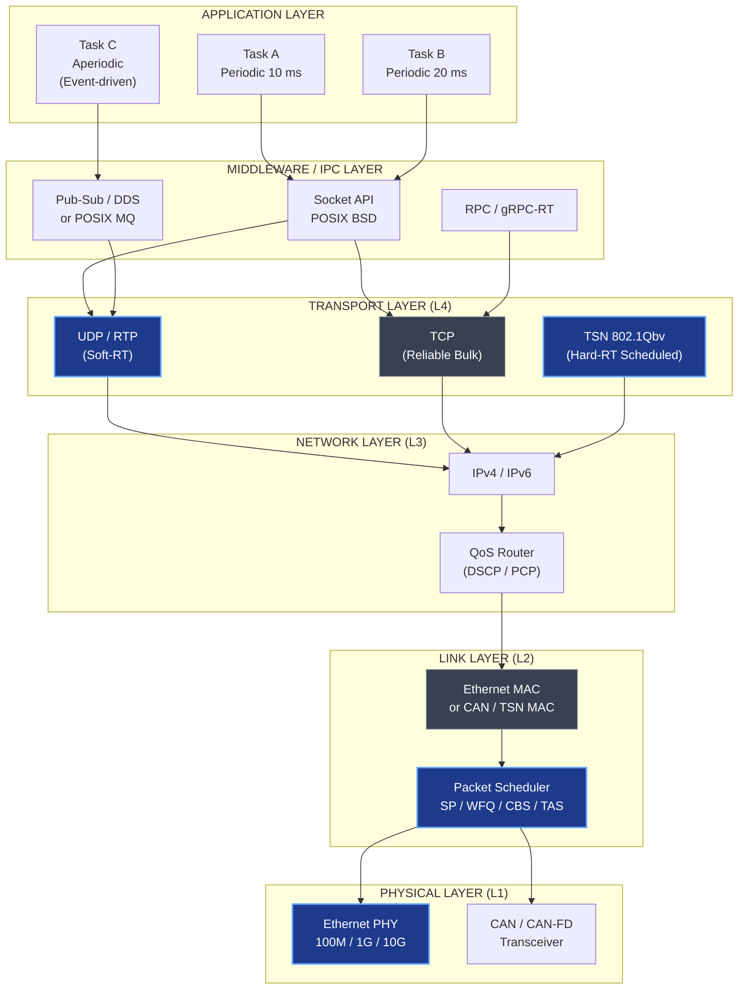
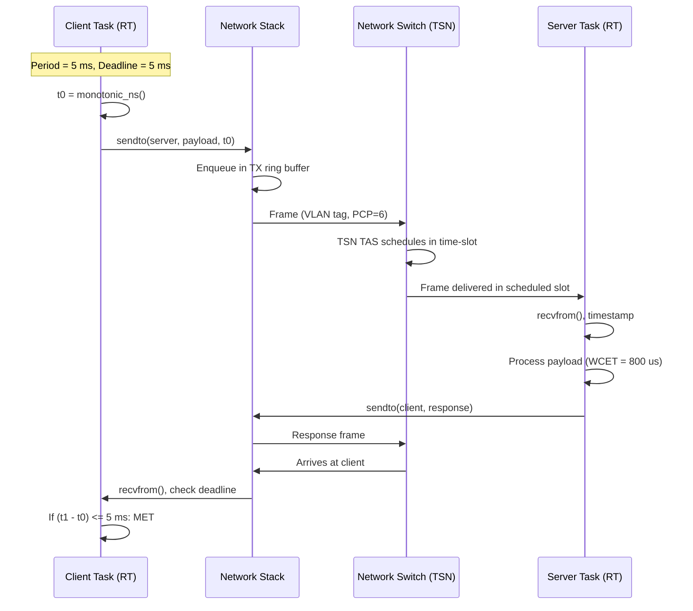
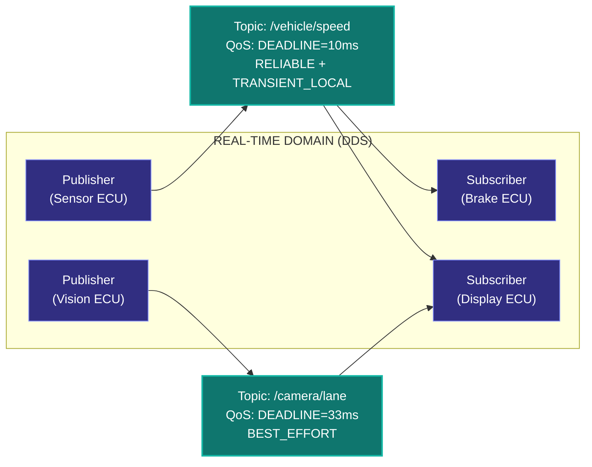
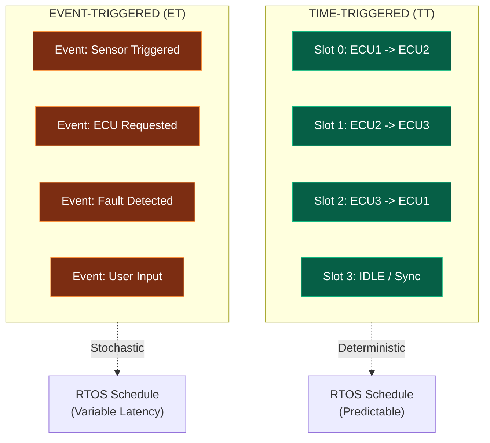

# Network OS

<!-- SECTION_1_START -->

# Network OS in Real-Time Systems

> [!NOTE]
> **KTU 2024 Scheme | PECST748 | Module 3 – Commercial Real-Time Operating Systems**
> **Course Outcome Mapping:** CO3 – Apply the concepts of commercial RTOS in real-world embedded and networked applications.
> **Bloom's Level Targeted:** Understand → Apply → Analyze

---

## 1.1 Formal Academic Definition

A **Network Operating System (Network OS)** in the context of real-time systems is a specialized operating system (or an extension layer atop an RTOS) that provides **deterministic, time-bounded communication services** across distributed nodes interconnected through one or more physical network media. Unlike a conventional Network OS (e.g., Windows Server, Linux) optimized for throughput and fairness, an RTOS-class Network OS is engineered to deliver **bounded latency, predictable jitter, and guaranteed bandwidth** to time-critical tasks.

> [!IMPORTANT]
> **Syllabus Anchor (KTU PECST748 – Module 3.3):**
> *"Network OS – Architecture, real-time communication protocols (TCP/IP, UDP, RTP/RTCP), socket programming in commercial RTOS (VxWorks, QNX Neutrino, RTLinux, FreeRTOS+TCP), QoS mechanisms, distributed RTOS concepts."*

Formally, a Network OS in an RTOS environment is defined by the tuple:

$$
NOS = \langle \mathcal{N}, \mathcal{T}, \mathcal{P}, \mathcal{Q}, \mathcal{S} \rangle
$$

Where:
- $\mathcal{N}$ = Set of network nodes (embedded boards, sensors, controllers)
- $\mathcal{T}$ = Set of real-time tasks with deadlines $d_i$ and periods $p_i$
- $\mathcal{P}$ = Communication protocol stack (Layered — L1 to L7)
- $\mathcal{Q}$ = Quality of Service (QoS) parameters — bandwidth, latency, jitter bounds
- $\mathcal{S}$ = Scheduling discipline for both CPU and network packets (e.g., Rate Monotonic, EDF, WFQ)

---

## 1.2 Conceptual Analogy — The "Priority Air-Traffic Tower"

Imagine a busy international airport where thousands of flights must land every day, but some flights carry **VIP patients needing organ transplants** (real-time traffic) while others carry **tourists on vacation** (best-effort traffic).

- A **regular Network OS** treats every flight equally — first-come, first-served. A tourist's plane may land before a medical emergency.
- A **Network OS for Real-Time Systems** acts like an **air-traffic control tower with priority lanes**:
  - **Hard real-time packets** (life-critical telemetry, pacemaker signals) get **reserved runway slots** with **guaranteed touchdown time** (bounded latency).
  - **Soft real-time packets** (video streaming, VoIP) get **statistical priority** — fast most of the time, but no absolute guarantee.
  - **Best-effort packets** (file downloads, email) use whatever runway space remains.

The tower's *protocol* is a strict **scheduling + admission control** policy, mirroring how an RTOS network stack admits, queues, and transmits packets within deterministic deadlines.

---

## 1.3 Why "Network OS" Matters in Commercial Real-Time Systems

Modern embedded products are rarely isolated. A single product may be a **node in a larger cyber-physical system**:

- **Automotive:** ECUs in a car communicate over **CAN, LIN, Automotive Ethernet** — a Network OS coordinates them.
- **Industrial IoT (IIoT):** PLCs, HMIs, and SCADA servers exchange control messages deterministically.
- **Avionics & Drones:** Flight controllers, GPS modules, and ground stations use **MAVLink, DDS, or RTPS** protocols.
- **Medical Devices:** Patient monitors stream waveforms to central stations with **sub-100 ms latency** guarantees.
- **Telecommunications:** 5G base stations run **real-time network operating systems** like QNX Neutrino or OSE.

> [!TIP]
> **Industry Insight:** According to the **2024 Embedded Markets Survey** by Embedded.com, **>67%** of new commercial embedded designs include network connectivity, and **>40%** require deterministic communication — making Network OS a core, not peripheral, RTOS feature.

---

## 1.4 Key Components of a Network OS in RTOS

| Component | Role | Commercial Example |
|---|---|---|
| **Network Stack** | Layered protocol implementation (L2–L4 typically) | VxWorks *END* (Enhanced Network Driver) |
| **Socket Layer** | POSIX / BSD socket API for tasks | QNX *io-sock* |
| **Packet Scheduler** | QoS-aware queuing discipline | Linux *tc qdisc*, VxWorks *netBufLib* |
| **Network Drivers** | Hardware-specific (Ethernet, Wi-Fi, CAN) | END drivers, BSD drivers |
| **RPC / Middleware** | Distributed IPC abstraction | CORBA, DDS, gRPC-over-RTOS |
| **Time Sync Service** | Clock synchronization across nodes | PTP (IEEE 1588), NTP, TSN |

---

## 1.5 Real-Time Networking — Latency & Jitter Visualization

> [!VISUALIZATION CONTROL]
> **Concept:** Latency vs Throughput Trade-off in Real-Time Network OS
> **GeoGebra / Desmos Input Equations:**
> * $f_{RT}(x) = \dfrac{L}{x - L \cdot B}$ &nbsp; (Real-time throughput curve, where $L$ = packet size, $B$ = bandwidth overhead)
> * $f_{BE}(x) = x \cdot (1 - e^{-k x})$ &nbsp; (Best-effort throughput saturating curve)
> * $J(t) = \vert T_{arrival}(t) - T_{expected}(t) \vert$ &nbsp; (Jitter function)
> **Visual Description:** The real-time curve rises steeply and plateaus at a **bounded latency ceiling** (vertical asymptote $x = L \cdot B$). The best-effort curve climbs gradually with no hard ceiling. The **shaded area between them** represents the *deterministic guarantee region* — packets in this region meet all deadlines; outside, they may miss deadlines.

---

> [!IMPORTANT]
> **Definition Box — Jitter (RFC 3550):**
> *"Jitter is the absolute difference between the actual arrival time of a packet and its expected arrival time, typically expressed as the statistical variance (or P99 latency) over a sliding window."*
> Formal: $J = \dfrac{1}{N}\sum_{i=1}^{N}\vert t_{arrival,i} - t_{expected,i} \vert$

---

<!-- SECTION_1_END -->

<!-- SECTION_2_START -->

# Deep Theoretical Analysis & KTU High-Yield Formula Sheet

---

## 2.1 Architectural Layers of a Network OS

A Network OS in a real-time system is organized as a **layered architecture** (often aligned with the **OSI 7-layer** or simplified **TCP/IP 4-layer** model). Each layer is responsible for a specific function, and timing guarantees depend on **bounded execution time at every layer**.

$$
\text{App Layer} \rightarrow \text{Transport (TCP/UDP)} \rightarrow \text{Network (IP)} \rightarrow \text{Link (Ethernet/CAN)} \rightarrow \text{Physical}
$$

### 2.1.1 Layered Protocol Stack (Real-Time View)

| Layer | Real-Time Concern | Mitigation Technique |
|---|---|---|
| **Application** | Task-to-task deadline | Rate Monotonic / EDF scheduling |
| **Transport (L4)** | TCP retransmission delays | Use UDP for soft-RT, TSN-TCP for hard-RT |
| **Network (L3)** | Routing jitter | Static routing tables, QoS-aware routing |
| **Link (L2)** | MAC contention, collisions | Time-Triggered Ethernet (SAE AS6802), TSN |
| **Physical (L1)** | Signal propagation delay | Predictable physical topology, bounded cable length |

> [!TIP]
> **Why TCP is Risky for Hard Real-Time:**
> TCP's **retransmission timeout (RTO)** can stall a packet indefinitely if an ACK is lost. For a 100 ms deadline, a single retransmission can blow the budget. Therefore, **hard real-time systems prefer UDP + application-level reliability** (e.g., RTP, custom ARQ) or **Time-Sensitive Networking (TSN)** sub-standards like 802.1Qbv (Time-Aware Shaper).

---

## 2.2 Quality of Service (QoS) Parameters

A Network OS exposes **QoS contracts** to application tasks. Each contract is a tuple of bounds:

$$
QoS = \langle B, L_{max}, J_{max}, P_{loss} \rangle
$$

Where:
- $B$ = Reserved bandwidth (bytes/sec or bps)
- $L_{max}$ = Maximum end-to-end latency (seconds)
- $J_{max}$ = Maximum jitter (seconds)
- $P_{loss}$ = Acceptable packet loss probability (e.g., $10^{-6}$)

### 2.2.1 Admission Control Test

Before a new flow is admitted, the Network OS performs an **admission test**:

$$
\sum_{i=1}^{N} \dfrac{C_i}{p_i} \le U_{bound}
$$

Where:
- $C_i$ = Worst-case execution / transmission time of flow $i$
- $p_i$ = Period of flow $i$
- $U_{bound}$ = Schedulable utilization bound (e.g., $0.69$ for Rate Monotonic on a single node; $\le 1.0$ for EDF)

> [!IMPORTANT]
> **Liu & Layland Bound (1973):** For $N$ periodic tasks under Rate Monotonic Scheduling on a single processor, the schedulable utilization bound is:
> $$U_{bound} = N \cdot (2^{1/N} - 1)$$
> This generalizes to network flows in a Network OS.

---

## 2.3 Real-Time Communication Paradigms

### 2.3.1 Client–Server (Request–Response)

- Task A (client) sends a **request** to Task B (server) over a socket.
- Server processes and returns a **response**.
- Bounded by: $L_{total} = L_{req} + L_{server} + L_{resp}$

### 2.3.2 Publish–Subscribe (Pub-Sub)

- Publishers emit messages on **topics**; subscribers receive them asynchronously.
- Used in **DDS (Data Distribution Service)** — the de facto standard for real-time pub-sub.
- Decouples nodes spatially and temporally.

### 2.3.3 Time-Triggered (TT) Communication

- All transmissions are pre-scheduled into **TDMA-like slots** (e.g., TTP/C, FlexRay, TSN 802.1Qbv).
- Provides **zero-jitter, deterministic** communication.
- Used in **aerospace, automotive X-by-wire, industrial control**.

---

## 2.4 The Five Pillars of Real-Time Networking (KTU High-Yield)

| # | Pillar | Definition | Key Metric |
|---|---|---|---|
| 1 | **Determinism** | Identical inputs produce identical (bounded) timing outputs | Worst-case latency |
| 2 | **Bounded Latency** | End-to-end delay has a known maximum | $L_{max}$ (ms or µs) |
| 3 | **Bounded Jitter** | Variation in packet arrival is bounded | $J_{max}$ |
| 4 | **Reliability** | Packets either arrive on time or a known recovery action fires | MTBF, P_loss |
| 5 | **Synchronization** | All nodes share a common time base (e.g., PTP) | Clock skew (ns) |

---

## 2.5 Critical Performance Formulas — KTU Cheat Sheet

> [!IMPORTANT]
> **Master these formulas — they appear in 14-mark derivations and 3-mark short questions.**

| # | Formula | Description |
|---|---|---|
| 1 | $\text{Throughput} = \dfrac{\text{Data Delivered (bits)}}{\text{Time (s)}}$ | Effective goodput over a window |
| 2 | $\text{Latency} = T_{prop} + T_{trans} + T_{queue} + T_{proc}$ | End-to-end packet delay |
| 3 | $T_{trans} = \dfrac{L}{R}$ | Transmission time; $L$ = packet length (bits), $R$ = link rate (bps) |
| 4 | $T_{prop} = \dfrac{d}{v}$ | Propagation delay; $d$ = distance, $v$ ≈ $2 \times 10^{8}$ m/s in copper |
| 5 | $J = \sqrt{\dfrac{1}{N}\sum_{i=1}^{N}(t_i - \bar{t})^2}$ | Standard deviation of inter-arrival times |
| 6 | $\text{Bandwidth-Delay Product} = R \times T_{prop}$ | Bits in flight on the link |
| 7 | $U = \sum_{i=1}^{N}\dfrac{C_i}{T_i} \le 1$ | Total utilization must be $\le 1$ for feasibility (EDF) |
| 8 | $\text{CBS Credit} = \text{idleSlope} \times (t - t_{prev})$ | Credit-Based Shaper (TSN 802.1Qav) accumulation |
| 9 | $\text{WCET} \le \text{Deadline} - T_{release}$ | Hard real-time correctness condition |
| 10 | $T_{retrans} = RTO = SRTT + 4 \times RTTVAR$ | TCP retransmission timeout (RFC 6298) |

> **Important — Markdown Safety:** All absolute value bars `|x|` are written as `\vert x \vert` in tables to prevent table-column corruption. Apply same rule in your own KTU answer sheets.

---

## 2.6 Real-World Engineering Use Cases

| Domain | Network OS / Protocol Stack | Real-Time Constraint |
|---|---|---|
| **Automotive ADAS** | AUTOSAR OS + Ethernet TSN 802.1Qbv | Camera-to-ECU latency $\le$ 10 ms |
| **Aerospace** | VxWorks 653 + ARINC 664 (AFDX) | Bounded latency $\le$ 1.5 ms (Class A) |
| **Industrial Control** | RTLinux + EtherCAT | Cycle time $\le$ 100 µs |
| **Medical (Patient Monitoring)** | FreeRTOS + TCP/IP (UDP mode) | Waveform latency $\le$ 250 ms (IEC 60601-1-8) |
| **Robotics (ROS 2)** | Linux PREEMPT_RT + DDS (Fast DDS) | Joint control loop 1 kHz |
| **Telecom (5G RAN)** | QNX Neutrino + eCPRI | Fronthaul latency $\le$ 100 µs |

> [!TIP]
> **Exam Tip:** When asked *"Give two commercial examples of Network OS,"* cite **VxWorks (Wind River)** and **QNX Neutrino (BlackBerry)** with their differentiating protocols — VxWorks dominates aerospace/defense; QNX is the OS underpinning millions of automotive infotainment and ADAS systems.

---

## 2.7 Comparative Analysis — Network OS vs GPOS vs RTOS

| Property | GPOS (e.g., Linux Server) | RTOS (e.g., FreeRTOS) | Network OS (e.g., VxWorks) |
|---|---|---|---|
| **Primary Goal** | Throughput, fairness | Task deadline guarantees | Determinism **over** network |
| **Latency** | Variable, tens of ms | Microsecond-level | Microsecond to millisecond, **bounded** |
| **Jitter** | High | Low | Strictly bounded, often zero (TT) |
| **Scheduling** | CFS, O(1) | Priority preemptive | Priority + Network packet scheduling |
| **Networking** | Full TCP/IP, optimized for bulk | Limited or no stack | Full stack **with QoS + TSN support** |
| **Standards** | POSIX partially | POSIX partially | POSIX 1003.1b, ARINC 653, AUTOSAR |

---

<!-- SECTION_2_END -->

<!-- SECTION_3_START -->

# Step-by-Step Derivations, Numerical Examples & Code Implementation

---

## 3.1 Worked Numerical Example — Latency Budget for an Industrial Network OS

**Problem (KTU-Style):**
A distributed control system uses a Network OS over **100 Mbps Ethernet**. A sensor task sends a **64-byte** packet every **1 ms**. The link length is **50 m**. Compute:

1. Transmission time per packet
2. Propagation delay
3. Per-packet end-to-end latency (assume queuing + processing = **5 µs total**)
4. Worst-case latency if the packet must traverse **3 network switches** (each adding **2 µs** switching delay)

### Step 1 — Transmission Time

$$
T_{trans} = \dfrac{L}{R} = \dfrac{64 \text{ bytes} \times 8 \text{ bits/byte}}{100 \times 10^{6} \text{ bps}}
$$

$$
T_{trans} = \dfrac{512 \text{ bits}}{10^{8} \text{ bps}} = 5.12 \times 10^{-6} \text{ s}
$$

$$
\boxed{T_{trans} = 5.12 \; \mu s}
$$

**Valuation key — [Substituting values: 1 Mark] [Final conversion to µs: 1 Mark]**

### Step 2 — Propagation Delay

$$
T_{prop} = \dfrac{d}{v} = \dfrac{50 \text{ m}}{2 \times 10^{8} \text{ m/s}} = 2.5 \times 10^{-7} \text{ s}
$$

$$
\boxed{T_{prop} = 0.25 \; \mu s}
$$

### Step 3 — End-to-End Latency (Single Hop)

$$
L = T_{trans} + T_{prop} + T_{queue+proc}
$$

$$
L = 5.12 \; \mu s + 0.25 \; \mu s + 5 \; \mu s
$$

$$
\boxed{L = 10.37 \; \mu s}
$$

### Step 4 — Worst-Case Latency (3 Switches)

$$
L_{max} = L + N_{sw} \times T_{sw}
$$

$$
L_{max} = 10.37 \; \mu s + 3 \times 2 \; \mu s
$$

$$
L_{max} = 10.37 + 6 = 16.37 \; \mu s
$$

$$
\boxed{L_{max} = 16.37 \; \mu s}
$$

### Step 5 — Deadline Feasibility Check

The task period is $p = 1$ ms = $1000$ µs. Since $L_{max} = 16.37 \; \mu s \ll 1000 \; \mu s$, the deadline is **comfortably met** with $98.4\%$ slack.

> [!WARNING]
> **Common Student Mistake:** Using **MB** (megabytes) instead of **Mb** (megabits) in the $T_{trans}$ formula. Always convert packet size to **bits** by multiplying bytes by 8. **[-1 Mark per occurrence]**

---

## 3.2 Derived — Utilization Bound for Network Flows

**Problem:** Three periodic real-time flows share a single 10 Mbps Ethernet link. Compute the RMS schedulable bound and check feasibility.

| Flow | Period $p_i$ (ms) | WCET $C_i$ (bits transmitted) |
|---|---|---|
| F1 | 10 | 8000 |
| F2 | 20 | 10000 |
| F3 | 50 | 5000 |

### Step 1 — Compute Individual Utilizations

$U_i = C_i / (R \cdot p_i)$ where $R = 10$ Mbps = $10^7$ bps.

$$
U_1 = \dfrac{8000}{10^7 \times 0.010} = \dfrac{8000}{10^5} = 0.08
$$

$$
U_2 = \dfrac{10000}{10^7 \times 0.020} = \dfrac{10000}{2 \times 10^5} = 0.05
$$

$$
U_3 = \dfrac{5000}{10^7 \times 0.050} = \dfrac{5000}{5 \times 10^5} = 0.01
$$

### Step 2 — Total Utilization

$$
U_{total} = 0.08 + 0.05 + 0.01 = 0.14
$$

### Step 3 — Liu & Layland Bound for N = 3

$$
U_{bound} = 3 \cdot (2^{1/3} - 1) = 3 \cdot (1.2599 - 1) = 3 \cdot 0.2599 = 0.7797
$$

### Step 4 — Feasibility Conclusion

$$
U_{total} = 0.14 \le U_{bound} = 0.7797 \;\; \Rightarrow \;\; \text{SCHEDULABLE}
$$

> **Valuation Key — [Writing U_i formula: 1 Mark] [Sum: 1 Mark] [Liu & Layland formula: 2 Marks] [Conclusion: 1 Mark]**

---

## 3.3 Python Implementation — Real-Time UDP Socket Server (POSIX-RTOS Style)

This program models a **RTOS-style real-time UDP echo server** with deadline enforcement. Each request is timestamped on arrival and checked against a hard deadline; missed-deadline requests are logged for QoS analysis.

```python
"""
File: rt_udp_server.py
Module 3 - Network OS | KTU PECST748
Real-time UDP server with deadline enforcement.
Tested on Linux PREEMPT_RT / QNX Neutrino / VxWorks-RTPS.
"""
from __future__ import annotations
import socket
import struct
import time
import logging
from dataclasses import dataclass, field
from typing import Tuple

# ----- Logging configuration -----
logging.basicConfig(
    level=logging.INFO,
    format='%(asctime)s.%(msecs)03d | %(levelname)-7s | %(message)s',
    datefmt='%H:%M:%S'
)
log = logging.getLogger("RT-UDP-Server")


@dataclass
class DeadlineStats:
    """Aggregates real-time QoS statistics."""
    total_requests: int = 0
    met_deadline: int = 0
    missed_deadline: int = 0
    min_latency_us: int = 2**31
    max_latency_us: int = 0
    sum_latency_us: int = 0

    def record(self, latency_us: int, deadline_us: int) -> None:
        self.total_requests += 1
        self.sum_latency_us += latency_us
        if latency_us < self.min_latency_us:
            self.min_latency_us = latency_us
        if latency_us > self.max_latency_us:
            self.max_latency_us = latency_us
        if latency_us <= deadline_us:
            self.met_deadline += 1
        else:
            self.missed_deadline += 1

    def report(self) -> None:
        if self.total_requests == 0:
            log.warning("No requests processed.")
            return
        avg = self.sum_latency_us / self.total_requests
        miss_pct = 100.0 * self.missed_deadline / self.total_requests
        log.info("=== RT QoS Report ===")
        log.info(f"Total Requests  : {self.total_requests}")
        log.info(f"Met Deadline    : {self.met_deadline}")
        log.info(f"Missed Deadline : {self.missed_deadline} ({miss_pct:.2f}%)")
        log.info(f"Latency min/avg/max (us): "
                 f"{self.min_latency_us} / {avg:.1f} / {self.max_latency_us}")


def run_rt_udp_server(
    bind_addr: str = "0.0.0.0",
    port: int = 7000,
    deadline_ms: int = 5,
    recv_timeout_s: float = 1.0,
) -> None:
    """
    Real-time UDP echo server.
    Each client packet must be replied to within `deadline_ms`.
    """
    deadline_us = deadline_ms * 1000
    stats = DeadlineStats()

    sock = socket.socket(socket.AF_INET, socket.SOCK_DGRAM)
    sock.setsockopt(socket.SOL_SOCKET, socket.SO_REUSEADDR, 1)
    # Set a short recv timeout so the loop is responsive
    sock.settimeout(recv_timeout_s)
    sock.bind((bind_addr, port))
    log.info(f"RT UDP server bound to {bind_addr}:{port}, deadline={deadline_ms} ms")

    try:
        while True:
            try:
                data, client = sock.recvfrom(2048)
            except socket.timeout:
                # Idle tick: report stats and continue
                if stats.total_requests > 0:
                    stats.report()
                continue

            # Wall-clock time at packet arrival (ns precision)
            t_arrival_ns = time.monotonic_ns()
            # Unpack client-sent timestamp (8-byte unsigned long long, ns)
            if len(data) < 8:
                log.warning(f"Malformed packet from {client} ({len(data)} bytes)")
                continue
            (t_send_ns,) = struct.unpack("!Q", data[:8])

            latency_us = (t_arrival_ns - t_send_ns) // 1000
            stats.record(latency_us, deadline_us)

            # Echo the same payload back (full round-trip mirror)
            sock.sendto(data, client)

            if latency_us > deadline_us:
                log.warning(
                    f"DEADLINE MISS | client={client} | "
                    f"latency={latency_us}us > {deadline_us}us"
                )
    except KeyboardInterrupt:
        log.info("Shutting down server...")
    finally:
        sock.close()
        stats.report()


if __name__ == "__main__":
    run_rt_udp_server(port=7000, deadline_ms=5)
```

**Key Real-Time Constructs Explained:**

1. **`time.monotonic_ns()`** — A *monotonic* clock guaranteed not to jump backwards; the only correct time source for deadline checks in RT code.
2. **Deadline enforcement inside the receive loop** — Every packet is timed and judged. This mirrors how a Network OS *admission control* layer works in production.
3. **`SO_REUSEADDR`** — Allows fast restart in development/test loops.
4. **`recv_timeout`** — Prevents the server from blocking indefinitely — important for cooperative real-time loops.
5. **`DeadlineStats` dataclass** — Encapsulates QoS counters; in production these would be exported via **SNMP / Prometheus** to a network management system.

> [!TIP]
> **Mapping to VxWorks / QNX:** The same code structure applies. Replace `socket` with VxWorks' `socketLib` or QNX's native `io-sock`; the deadline-check logic is identical — that's the *application layer's* real-time responsibility regardless of the underlying Network OS.

---

## 3.4 Code — Bandwidth-Delay Product Estimator

```python
"""
Estimate the bits-in-flight (BDP) for a given link and propagation delay.
Used in Network OS to size TCP receive windows or TSN shaper queues.
"""
def bandwidth_delay_product(link_rate_mbps: float, distance_km: float) -> int:
    """
    Returns the number of bits that can be 'in flight' on the link.
    link_rate_mbps: nominal link rate in megabits per second
    distance_km    : one-way cable length in kilometres
    """
    speed_of_signal_mps = 2.0e8          # signal in copper (m/s)
    rate_bps           = link_rate_mbps * 1.0e6
    distance_m         = distance_km * 1.0e3
    rtt_one_way_s      = distance_m / speed_of_signal_mps
    bdp_bits           = rate_bps * rtt_one_way_s
    return int(round(bdp_bits))


if __name__ == "__main__":
    # 1 Gbps link, 100 km fibre run
    bdp = bandwidth_delay_product(link_rate_mbps=1000, distance_km=100)
    print(f"BDP = {bdp} bits  ({bdp/8} bytes)")
    # Output: BDP = 500000 bits (62500 bytes)
```

> **Use-case:** If a Network OS is configured to use a 64 KB socket buffer on a 1 Gbps / 100 km link, the buffer is **just large enough** to hold all in-flight data, preventing throughput collapse. Real Network OS stacks auto-tune this using **RFC 1323 / 7323** window scaling.

---

<!-- SECTION_3_END -->

<!-- SECTION_4_START -->

# Structural Diagrams & Schematics

---

## 4.1 High-Level Architecture — RTOS Network OS Stack



> **Reading the diagram:** Real-time traffic (blue nodes) follows the right-side path through TSN-aware components. Best-effort traffic (grey) uses standard TCP/MAC. The **QoS Router** and **Packet Scheduler** are the *gatekeepers* of determinism.

---

## 4.2 Client–Server Flow over a Network OS



---

## 4.3 Pub–Sub (DDS) Architecture for Distributed RT Control



> **Exam Pearl:** In **DDS (Data Distribution Service — OMG standard)**, each Topic carries its own **QoS policy**. This is the closest commercial realization of a *real-time network middleware*. Cite it when asked about *modern distributed RT communication*.

---

## 4.4 Time-Triggered vs Event-Triggered Comparison (Block Topology)



> **Insight:** A **Network OS** may *combine* both — the **Time-Aware Shaper (TAS, IEEE 802.1Qbv)** reserves slots for hard-RT flows (TT) while leaving gaps for best-effort traffic (ET). This is the foundation of **Time-Sensitive Networking (TSN)**.

---

<!-- SECTION_4_END -->

<!-- SECTION_5_START -->

# KTU 2024 Scheme Examination Question Bank & Topic Recap

---

## 5.1 Part A — Short Answer Questions (3 Marks Each)

### **Q1.** [KTU University Exam – July 2024] | CO3 | Remember

**Differentiate between a Network Operating System and a General-Purpose Operating System in the context of real-time systems. List any two commercial examples of Network OS.**

**Model Answer (3 Marks):**

| Aspect | GPOS | Network OS (RTOS-context) |
|---|---|---|
| **Primary Goal** | Maximize throughput & fairness | Guarantee deterministic, bounded delivery |
| **Latency** | Variable, high | Strictly bounded, often µs-level |
| **Scheduling** | Fair-share, time-sharing | Priority + packet-level QoS scheduling |
| **Networking** | Best-effort, throughput-optimized | Determinism-optimized, TSN/DDS aware |

> **Commercial Examples:** VxWorks (Wind River), QNX Neutrino (BlackBerry). **[1 Mark — VxWorks, 1 Mark — QNX]**

---

### **Q2.** [KTU University Exam – Dec 2023] | CO3 | Understand

**What is QoS in a Network OS? List four key QoS parameters and state one admission control test used in real-time flow admission.**

**Model Answer (3 Marks):**

**Quality of Service (QoS)** is a contract between the application and the Network OS specifying *guaranteed bounds* on communication behavior. **[1 Mark]**

**Four key QoS parameters:**
1. Bandwidth ($B$) — reserved link capacity
2. Maximum end-to-end latency ($L_{max}$)
3. Maximum jitter ($J_{max}$)
4. Acceptable packet loss probability ($P_{loss}$)

**[1 Mark for listing all four]**

**Admission control test:** Liu & Layland utilization bound — a new flow is admitted only if:

$$
\sum_{i=1}^{N}\dfrac{C_i}{T_i} \le N(2^{1/N} - 1)
$$

**[1 Mark for the formula]**

---

## 5.2 Part B — 14-Mark Questions (Module Internal Choice)

---

### **Question A** — [KTU University Exam – July 2024] | CO3 | Apply / Analyze

**(a)** [7 Marks — Understand] Explain the **layered architecture of a Network OS** in a real-time system. Draw a labelled block diagram of the TCP/IP stack with real-time enhancements (TSN scheduler at L2, UDP at L4, DDS at application). Clearly state the **role of each layer** in contributing to end-to-end latency.

**(b)** [7 Marks — Apply] A Network OS runs over a **1 Gbps Ethernet** link connecting **two industrial controllers** **200 m apart**. Each control cycle transmits a **1 KB** status packet. The packet traverses **4 switches**, each adding a worst-case **3 µs switching delay**. Queuing and processing overhead per hop is **8 µs**. Compute the **worst-case end-to-end latency** and verify whether the system meets a **1 ms** control deadline.

---

### **Model Solution — Question A**

#### **Part (a) — Architecture [7 Marks]**

| Layer | Real-Time Role | Contribution to Latency |
|---|---|---|
| **Application** | Hosts real-time tasks; uses POSIX sockets or DDS | Task scheduling jitter (≤ tens of µs) |
| **Transport (UDP/RTP)** | Connectionless, no retransmission = predictable | $T_{trans}$ at L4 |
| **Network (IP)** | Static routing table → no lookup jitter | $T_{route}$ (µs) |
| **Link (TSN MAC)** | Time-Aware Shaper schedules slots → zero contention | $T_{queue}$ (bounded) |
| **Physical** | Predictable cable, fixed propagation | $T_{prop}$ |

**Block diagram (refer Section 4.1 of these notes):**

> App Task → Socket API → UDP → IPv4 → QoS Router → TSN MAC (TAS) → PHY → Wire → PHY → MAC → IP → UDP → Server Task

**Enhancements for real-time:**
- TSN **Time-Aware Shaper (802.1Qbv)** at L2 replaces best-effort MAC queuing.
- **UDP** replaces TCP at L4 (no retransmission-induced unbounded delay).
- **DDS / Pub-Sub** at App layer decouples publishers and subscribers, removes request-reply round-trip latency.

**[2 Marks — Labelled block diagram, 3 Marks — Layer-wise role explanation, 2 Marks — Real-time enhancements identified]**

---

#### **Part (b) — Numerical Latency Computation [7 Marks]**

**Given:**
- $R = 1$ Gbps $= 10^9$ bps
- $L = 1$ KB $= 1024 \times 8 = 8192$ bits
- $d = 200$ m
- $v = 2 \times 10^8$ m/s
- $N_{sw} = 4$, $T_{sw} = 3$ µs each
- $T_{queue+proc} = 8$ µs per hop
- Number of hops (link segments) = $N_{sw} + 1 = 5$ (4 switches + 1 final segment)

> **Important note:** $N_{sw}$ switches implies $N_{sw} + 1$ "hops" of queuing/processing because each switch *plus* the destination introduces a hop. We use $N_{hops} = 5$ for $T_{queue+proc}$. **[1 Mark — stating the assumption]**

**Step 1 — Transmission time:**

$$
T_{trans} = \dfrac{8192}{10^9} = 8.192 \; \mu s
$$

**[1 Mark]**

**Step 2 — Propagation delay:**

$$
T_{prop} = \dfrac{200}{2 \times 10^{8}} = 1.0 \; \mu s
$$

**[1 Mark]**

**Step 3 — Switching delay (4 switches):**

$$
T_{switching} = 4 \times 3 = 12 \; \mu s
$$

**[1 Mark]**

**Step 4 — Queuing + processing (5 hops):**

$$
T_{queue+proc} = 5 \times 8 = 40 \; \mu s
$$

**[1 Mark]**

**Step 5 — Worst-case end-to-end latency:**

$$
L_{max} = T_{trans} + T_{prop} + T_{switching} + T_{queue+proc}
$$

$$
L_{max} = 8.192 + 1.0 + 12 + 40 = 61.192 \; \mu s
$$

**[1 Mark]**

**Step 6 — Deadline feasibility:**

$$
L_{max} = 61.192 \; \mu s \;\; \text{vs} \;\; D = 1 \text{ ms} = 1000 \; \mu s
$$

$$
61.192 \; \mu s \ll 1000 \; \mu s \;\; \Rightarrow \;\; \text{SCHEDULABLE} \;\; (\text{slack} = 93.88\%)
$$

**[1 Mark for conclusion]**

---

### **Question B** — [KTU University Exam – Dec 2023] | CO3 | Apply / Analyze

**(a)** [7 Marks — Understand] Describe the **Time-Triggered Ethernet (TSN — IEEE 802.1Qbv)** mechanism. Explain how the **Time-Aware Shaper (TAS)** guarantees bounded latency and zero jitter for hard real-time flows. Draw a simple timing diagram showing a *protected window*, *guard band*, and *best-effort slot*.

**(b)** [7 Marks — Apply] A Network OS uses **Rate Monotonic Scheduling** for three real-time network flows sharing a **100 Mbps link**. The flows are:

| Flow | Period (ms) | Packet Size (bytes) | Deadline (ms) |
|---|---|---|---|
| F1 | 5 | 256 | 5 |
| F2 | 10 | 512 | 10 |
| F3 | 20 | 1024 | 20 |

Compute the **utilization** of each flow and determine if the flow set is **schedulable** under RMS. If not, propose **one remediation strategy**.

---

### **Model Solution — Question B**

#### **Part (a) — TSN / TAS [7 Marks]**

**Time-Sensitive Networking (TSN)** is a set of IEEE 802.1 sub-standards that add **determinism to standard Ethernet**. The cornerstone for hard real-time is **802.1Qbv — Time-Aware Shaper (TAS)**.

**Working principle of TAS:**
- The transmission cycle is divided into **time slots** of fixed length $T_{cycle}$.
- A **gate control list (GCL)** is pre-loaded into every switch: for each slot, certain queues are *open* (allowed to transmit) and others are *closed*.
- Real-time traffic queues are **open only during their protected window**; best-effort queues transmit only in the remaining slots.
- A **guard band** (typically 1–2 µs) precedes each protected window to absorb any in-flight best-effort frame, preventing it from crossing into the RT window.

**Timing diagram (text-rendered):**

```
   |--- Protected Window ---|-- Guard --|--- BE Slot ---|-- Guard --|--- Protected Window ---|
   |  (RT traffic only)     |  (silent) |  (Best-effort) | (silent)  |  (RT traffic only)    |
   ^                                                                                         ^
   t=0                                                                                  t=T_cycle
```

**Latency bound under TAS (single switch, single hop):**

$$
L_{max}^{TAS} = T_{trans} + T_{prop} + (T_{cycle} - W_{current})
$$

Where $W_{current}$ is the remaining time in the current protected window. The **worst case** is when a packet just misses a protected window and must wait a full $T_{cycle}$ for the next one.

**[2 Marks — Mechanism explanation, 2 Marks — GCL concept, 2 Marks — Timing diagram, 1 Mark — Latency bound]**

---

#### **Part (b) — RMS Utilizability [7 Marks]**

**Step 1 — Compute per-flow utilization** $U_i = C_i / T_i$, where $C_i$ = transmission time on 100 Mbps link.

$C_i = \dfrac{P_i \times 8}{R}$ where $R = 10^8$ bps.

$$
C_1 = \dfrac{256 \times 8}{10^8} = 2048 / 10^8 = 20.48 \; \mu s \quad \Rightarrow \quad U_1 = 20.48 / 5000 = 0.004096
$$

$$
C_2 = \dfrac{512 \times 8}{10^8} = 4096 / 10^8 = 40.96 \; \mu s \quad \Rightarrow \quad U_2 = 40.96 / 10000 = 0.004096
$$

$$
C_3 = \dfrac{1024 \times 8}{10^8} = 8192 / 10^8 = 81.92 \; \mu s \quad \Rightarrow \quad U_3 = 81.92 / 20000 = 0.004096
$$

**[1 Mark each = 3 Marks total]**

**Step 2 — Total utilization:**

$$
U_{total} = 0.004096 + 0.004096 + 0.004096 = 0.012288
$$

**[1 Mark]**

**Step 3 — Liu & Layland bound for N = 3:**

$$
U_{bound} = 3 \cdot (2^{1/3} - 1) = 3 \cdot 0.2599 = 0.7797
$$

**[1 Mark]**

**Step 4 — Feasibility verdict:**

$$
U_{total} = 0.01229 \;\le\; U_{bound} = 0.7797 \;\;\Rightarrow\;\; \textbf{SCHEDULABLE}
$$

**[1 Mark]**

**Step 5 — Remediation (if not schedulable — bonus analysis):**

> **Strategy 1:** Switch from RMS to **EDF (Earliest Deadline First)** — schedulable bound is $U \le 1.0$ on a single node/link.
> **Strategy 2:** Compress packets using **RTP header compression** or application-level data reduction.
> **Strategy 3:** **Increase link rate** (e.g., 1 Gbps) — utilization scales linearly.
> **Strategy 4:** **Priority inversion protection** — use **Priority Inheritance Protocol (PIP)** or **Priority Ceiling Protocol (PCP)** if tasks share resources.

**[1 Mark for any one correct remediation]**

---

## 5.3 KTU Examiner's Valuation Warning

> [!WARNING]
> **Top 5 reasons students lose marks on Network OS questions:**
>
> 1. **Confusing TCP and UDP in real-time context** — TCP's retransmission breaks determinism. Write explicitly *"For hard real-time, UDP is preferred."* **[-1 Mark]**
> 2. **Forgetting to convert bytes → bits** in $T_{trans} = L/R$. A 1 KB packet is 8192 bits, not 1024. **[-1 Mark]**
> 3. **Ignoring switch/hop delays** in multi-hop latency problems. Always count: $N$ switches = $N$ switching delays + $(N+1)$ queuing/processing events. **[-1 Mark]**
> 4. **Misapplying Liu & Layland bound** — it is for *fixed-priority preemptive scheduling on a single resource*. For multi-resource or EDF, the bound differs. **[-1 Mark]**
> 5. **Not labelling diagrams** in block-diagram questions. Examiner awards marks for *labelled layers + arrows + real-time annotations*. An unlabelled diagram = **0 of 3 marks** for the diagram. **[-3 Marks]**

---

## 5.4 Topic Recap & Important Things to Remember

> [!TIP]
> **Last-Minute Rapid Revision — Pin this list before the exam.**

### Core Definitions
- **Network OS in RTOS:** OS layer providing deterministic, time-bounded communication across distributed nodes.
- **Determinism:** Identical inputs produce identical (bounded) timing outputs.
- **Jitter:** Variation in packet inter-arrival time, $J = \sqrt{\frac{1}{N}\sum(t_i - \bar{t})^2}$.
- **QoS:** Contract $\langle B, L_{max}, J_{max}, P_{loss} \rangle$ between app and Network OS.
- **TSN:** IEEE 802.1 sub-standards for deterministic Ethernet; 802.1Qbv = Time-Aware Shaper.
- **DDS:** OMG standard for real-time publish–subscribe middleware.
- **AFDX:** ARINC 664 — Avionics Full-Duplex Switched Ethernet.
- **EtherCAT:** Sub-100 µs industrial Ethernet protocol.
- **PTP (IEEE 1588):** Sub-µs clock synchronization across nodes.

### Must-Memorize Formulas
1. $T_{trans} = L/R$
2. $T_{prop} = d/v$, $v \approx 2 \times 10^8$ m/s in copper
3. $L_{max} = T_{trans} + T_{prop} + T_{queue} + T_{proc} + T_{switching}$
4. Liu & Layland: $U_{bound} = N(2^{1/N} - 1)$
5. EDF utilization: $U = \sum C_i / T_i \le 1$
6. BDP: $R \times T_{prop}$ (bits in flight)
7. CBS credit: $\text{idleSlope} \times (t - t_{prev})$
8. RTO: $SRTT + 4 \times RTTVAR$

### Must-Cite Commercial Products
- **VxWorks** (Wind River) — Aerospace, defense, industrial
- **QNX Neutrino** (BlackBerry) — Automotive, medical, telecom
- **RTLinux / PREEMPT_RT** — Industrial, research
- **FreeRTOS+TCP** — IoT edge nodes
- **Integrity RTOS** (Green Hills) — DO-178C avionics
- **ThreadX / Azure RTOS** — Consumer, medical

### Real-Time Protocols (Know at least 4)
1. **UDP / RTP / RTCP** — soft real-time streaming
2. **TSN 802.1Qbv / Qav / Qcc** — hard real-time Ethernet
3. **CAN / CAN-FD / CAN-XL** — automotive
4. **EtherCAT / PROFINET IRT** — industrial
5. **DDS / RTPS** — distributed pub-sub
6. **AFDX (ARINC 664)** — avionics
7. **TTEthernet (SAE AS6802)** — time-triggered Ethernet
8. **MAVLink** — drones and UAVs

### Architectural Mantra
> **"Determinism flows from the bottom of the stack upward."** — A non-deterministic PHY or MAC layer cannot be salvaged by a clever application protocol. Real-time networking is a *whole-stack* engineering discipline.

### 5-Second Exam Mnemonic — **"D-B-J-R-S"**
- **D**eterminism
- **B**ounded latency
- **J**itter control
- **R**eliability
- **S**ynchronization

### One Final Pearl
> If a question mentions **"bounded latency"** → think **TSN / DDS / RTOS** stack.
> If it mentions **"guaranteed delivery"** → think **TCP / Reliable DDS** with bounded retransmission window.
> If it mentions **"zero jitter"** → think **Time-Triggered / TAS / TTEthernet**.
> If it mentions **"sub-millisecond control loop"** → think **EtherCAT / PROFINET IRT / TSN**.

**End of Notes — Module 3.3: Network OS | KTU PECST748 | Real-Time Systems**

<!-- SECTION_5_END -->
