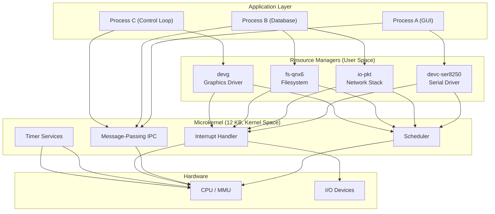
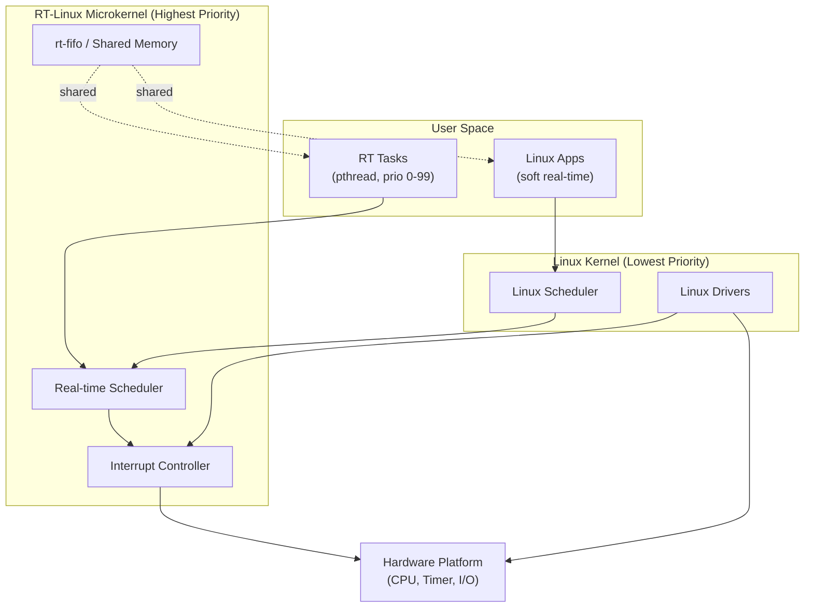
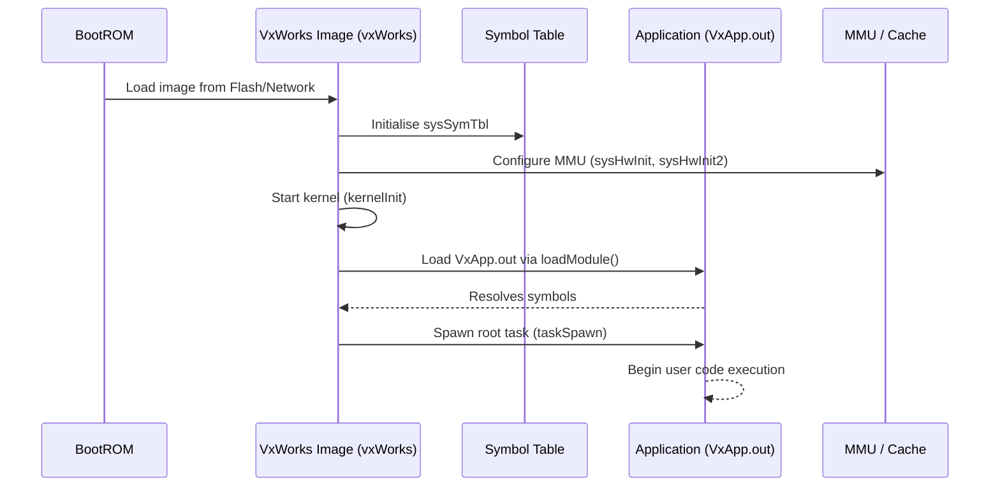
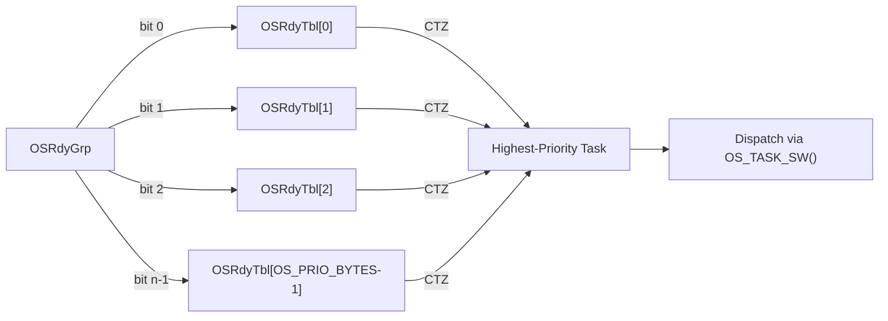
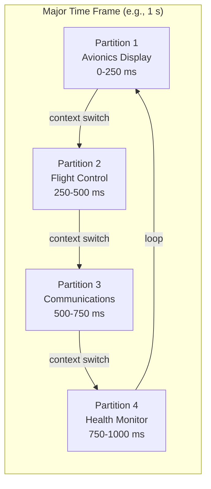
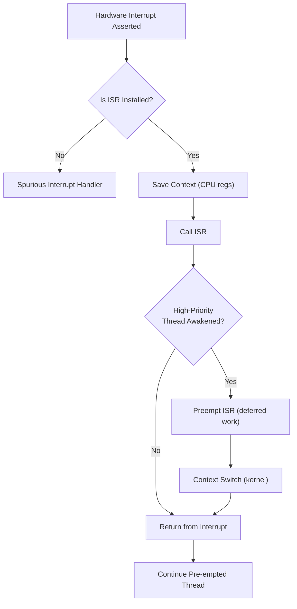
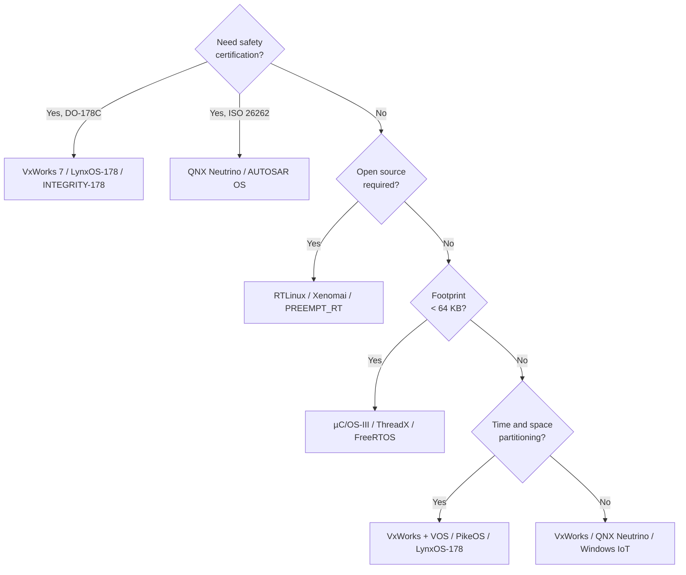
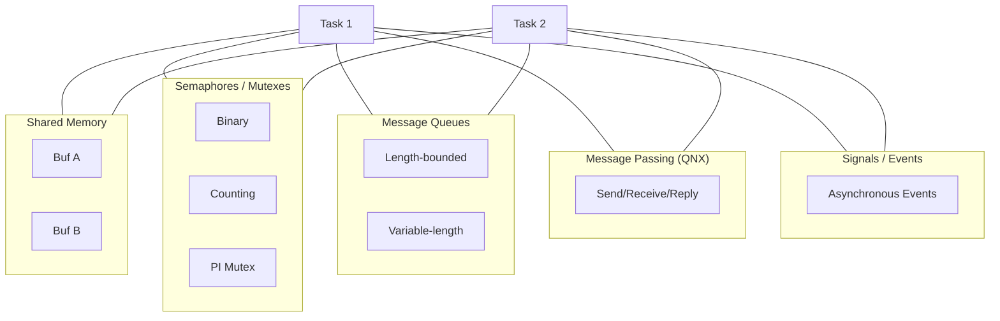
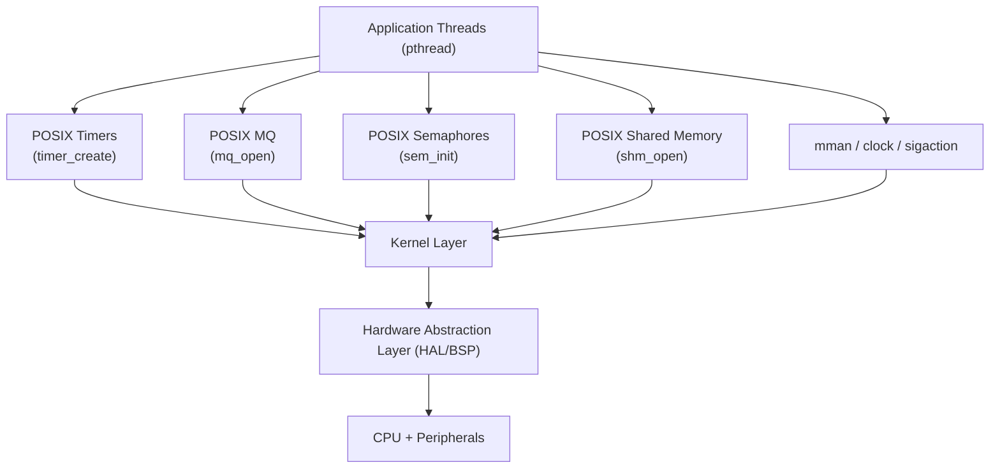

# other RTOS

<!-- SECTION_1_START -->
# Other Real-Time Operating Systems (Commercial RTOS)

> [!IMPORTANT]
> **KTU 2024 Scheme | PECST748 | Module 3 — Commercial Real-Time Operating Systems**
> This module extends the foundation built in earlier real-time OS modules by examining *commercial-grade* RTOS platforms that dominate embedded industries such as avionics, automotive, medical devices, telecommunications, and industrial automation. The focus is on their internal kernels, scheduling policies, memory models, and IPC mechanisms.

---

## 1.1 Formal Definition

A **Commercial Real-Time Operating System (Commercial RTOS)** is a *deterministic, priority-driven, preemptive multitasking kernel* that is sold under a commercial license (proprietary or open-source with commercial support) and is engineered to meet **bounded worst-case execution time (WCET)** guarantees for tasks in safety-critical and time-critical embedded applications. They typically provide a **Hardware Abstraction Layer (HAL)**, a **Board Support Package (BSP)**, a *priority-inheritance mutex mechanism*, and conform to industry standards such as **POSIX 1003.1b/1003.1c**, **OSEK/VDX**, **ARINC 653**, or **DO-178C**.

> [!NOTE]
> **Syllabus Highlight — Module 3 (KTU 2024 PECST748)**
> The module expects students to differentiate between various commercial RTOS, analyse their scheduling algorithms (rate-monotonic, deadline-monotonic, earliest-deadline-first), and evaluate their suitability for hard vs soft real-time applications.

---

## 1.2 Intuitive Analogy — The Hospital Emergency Room

Think of an RTOS as a **specialised hospital Emergency Room (ER)**:

- **Patients** = tasks or threads.
- **Triage Nurse** = the *scheduler* that ranks patients by severity (priority) rather than arrival order.
- **Doctors** = CPUs that can treat one patient at a time but switch between them very quickly (context switch).
- **ICU beds** = *real-time guarantees* — a heart-attack patient (hard real-time task) cannot be made to wait for a paper-cut patient (soft real-time task).
- **Hospital rules** = kernel policies like *priority inheritance* and *preemption* that prevent *priority inversion* (a lower-priority patient holding the only ultrasound machine blocking a higher-priority patient).
- **Different hospitals** = different commercial RTOS (e.g., VxWorks, QNX, RTLinux) — they all save lives, but they have different specialty departments, equipment, and protocols.

> [!TIP]
> If you ever feel lost in RTOS terminology, ask: *"What would the hospital do if this patient's life depended on it?"* — that is the essence of *determinism*.

---

## 1.3 Categories of Commercial RTOS

| Class | Licensing | Examples | Typical Domain |
|---|---|---|---|
| **Hard Real-Time, Safety-Critical** | Commercial / Certified | VxWorks 7, INTEGRITY-178, LynxOS-178, PikeOS | Avionics, Medical, Railway |
| **Hard Real-Time, General Embedded** | Commercial / Open | QNX Neutrino, ThreadX, μC/OS-II/III | Automotive, Industrial, IoT |
| **Soft Real-Time, Linux-based** | Open Source (GPL) | RTLinux, RTAI, Xenomai, PREEMPT_RT | Robotics, Multimedia, Research |
| **Consumer / Mobile RTOS** | Commercial | Windows CE/Compact, Symbian, VxWorks for ARM | Handhelds, Set-top boxes |
| **Embedded Configurable** | Open Source | eCos, FreeRTOS, Zephyr | IoT, Wearables |

> [!NOTE]
> The boundary between **Hard** and **Soft** real-time is the most important classification for KTU problems. A *hard* RTOS *misses* no deadline; a *soft* RTOS *tolerates* occasional deadline misses with graceful degradation.

---

## 1.4 Visualizing Scheduler States (Mermaid)

> [!VISUALIZATION CONTROL]
> **Concept:** Generic Priority-Driven Preemptive Task State Machine
> **Mermaid Render Input:**
> ```mermaid
> stateDiagram-v2
>     [*] --> Ready
>     Ready --> Running: SchedulerDispatch
>     Running --> Ready: Preempted
>     Running --> Blocked: WaitOnSemaphore
>     Blocked --> Ready: EventOccurs
>     Running --> [*]: Terminated
> ```
> **Visual Description:** A node enters the *Ready* queue, the scheduler dispatches the highest-priority ready node to *Running*, the running node can be preempted (back to *Ready*), can block on a kernel object, or terminate.

---

<!-- SECTION_1_END -->

<!-- SECTION_2_START -->
# 2. Deep Theoretical Analysis of Major Commercial RTOS

## 2.1 VxWorks (Wind River Systems)

### 2.1.1 Overview
VxWorks is the **industry-leading hard real-time operating system** used in **NASA's Mars rovers, the Boeing 787 avionics, and the James Webb Space Telescope**. It features a **microkernel-based architecture** (from VxWorks 7 onwards) with the *Virtualisation OS (VOS)* layer enabling multi-OS coexistence.

### 2.1.2 Kernel Architecture
VxWorks uses a **monolithic kernel** with optional microkernel mode. Core subsystems:

- **Wind Kernel** — Preemptive, priority-based scheduler supporting **256 priority levels** (default) and up to **256–2048 priority levels** in tuned configurations.
- **Memory Management Unit (MMU)** — Supports both *full MMU* (virtual memory) and *MMU-less (VxWorks-MIPPS)* modes.
- **Interrupt Service Routines (ISRs)** — Vectored, fast-latency (<1 µs on PowerPC).
- **POSIX PSE52/PSE53** compliance.

### 2.1.3 Scheduling in VxWorks
VxWorks supports multiple scheduling policies simultaneously via the **scheduler component framework**:

| Policy | Type | Use Case |
|---|---|---|
| **Priority-Based Preemptive** (default) | Hard RT | General real-time control |
| **Round-Robin** | Soft RT | Time-sharing of equal tasks |
| **Rate-Monotonic (RMS)** via WindView | Hard RT | Periodic control tasks |
| **Earliest Deadline First (EDF)** | Hard RT | Dynamic priority by deadline |

### 2.1.4 IPC Mechanisms
- **Semaphores** (binary, counting, mutual-exclusion with priority inheritance)
- **Message Queues** (variable-length)
- **Pipes** (for byte-stream IPC)
- **Shared Memory** (with hardware lock support for SMP)
- **Sockets** (BSD-style networking)
- **Signals** (POSIX-style asynchronous events)

> [!IMPORTANT]
> **Priority Inheritance Mutex (PIMUTEX)** is critical — it solves the *unbounded priority inversion* problem identified by Sha, Rajkumar, and Lehoczky (1990). VxWorks also supports **Priority Ceiling Protocol (PCP)** as an alternative.

---

## 2.2 QNX Neutrino (BlackBerry QNX)

### 2.2.1 Overview
QNX is a **microkernel-based commercial RTOS** used in over **200 million vehicles** and Cisco routers. The microkernel is approximately **12 KB** and contains *only* the four essential services: **scheduling, IPC, interrupt handling, and timer services**.

### 2.2.2 Microkernel Architecture

$$
\text{QNX Neutrino} = \underbrace{\text{Microkernel}}_{\text{12 KB}} + \sum_{i=1}^{n} \text{User-space Resource Managers}
$$

Resource managers run *outside* the kernel as ordinary processes. A failure in any resource manager does **not crash** the kernel — this is the famous **"driver-in-a-process"** QNX philosophy that gives it superior fault isolation.

### 2.2.3 Scheduling
QNX uses **adaptive partitioning** (since QNX 6.4.x) — partitions reserve CPU budget for critical applications, preventing CPU starvation. Priorities range from **1 to 255**.

### 2.2.4 IPC — Message Passing
QNX's hallmark is its **synchronous message-passing IPC**:

$$
\text{Send}(\text{rcvid}, \text{msg}, \text{status}) \quad ; \quad \text{Receive}(\text{chid}, \text{msg})
$$

The kernel performs **direct message copy** between address spaces via MMU remapping, making it one of the fastest IPC mechanisms in the industry.

---

## 2.3 RTLinux (Finite State Machine Labs / Wind River)

### 2.3.1 Overview
RTLinux is a **hard real-time extension to Linux** that runs Linux itself as the *lowest-priority task* of a tiny real-time micro-kernel.

$$
\text{RTLinux Architecture} = \underbrace{\text{RT-Microkernel (RTLinux-core)}}_{\text{Hard RT}} \dashv \underbrace{\text{Linux Kernel}}_{\text{Soft RT / Non-RT}}
$$

### 2.3.2 Dual-Kernel Approach
- **Real-time tasks** run in kernel space with **direct hardware access** and **interrupts disabled only for short critical sections**.
- **Linux tasks** run as the *idle task* of the real-time scheduler.
- Real-time tasks communicate with Linux via **shared memory FIFOs (rt-fifos)**.

### 2.3.3 Scheduling
RTLinux uses a **fixed-priority preemptive scheduler** with the **pthreads API**. A task's priority is in the range $0 \leq p \leq 99$ (with $0$ being the highest).

### 2.3.4 Modern Variants
- **RTAI (Real-Time Application Interface)** — Italian variant, LXRT for user-space RT.
- **Xenomai** — Uses a hardware-abstraction layer called *Copper* over the Adeos nanokernel.
- **PREEMPT_RT** — Mainline Linux patch that converts Linux itself into a real-time kernel.

---

## 2.4 LynxOS-178 (Lynx Software Technologies)

### 2.4.1 Overview
LynxOS-178 is a **DO-178B Level A certifiable** hard real-time RTOS used in **military avionics** (F-22, F-35) and commercial avionics.

### 2.4.2 POSIX 1003.1 Compliance
LynxOS-178 was the **first RTOS to achieve full POSIX 1003.1 certification** including real-time extensions. This allows easy porting of UNIX applications.

### 2.4.3 Time and Space Partitioning (ARINC 653)
LynxOS-178 implements the **ARINC 653** specification — *time and space partitioning* — where each application partition gets a guaranteed CPU time window and dedicated memory region, isolating failures.

$$
\text{ARINC 653 Major Time Frame} = \sum_{i=1}^{N} \text{Minor Frame}_i
$$

---

## 2.5 μC/OS-II / μC/OS-III (Micrium / Silicon Labs)

### 2.5.1 Overview
μC/OS is a **portable, ROM-able, preemptive real-time kernel** written primarily in ANSI C. μC/OS-II is certified for **DO-178B Level A**, **IEC 61508 SIL 3**, and **FDA Class III medical devices**.

### 2.5.2 Kernel Structure
- Up to **255 tasks** (μC/OS-II) and **unlimited** (μC/OS-III).
- Each task has a unique priority from **0 (highest) to OS_LOWEST_PRIO (default 63)**.
- Kernel is **fully scalable** — services can be conditionally compiled out.

### 2.5.3 O(1) Scheduling
μC/OS-II uses a **bitmap-based ready table** for O(1) priority resolution:

$$
\text{OSRdyTbl}[\text{OS\_PRIO\_BYTES}] \quad ; \quad \text{OSRdyGrp}
$$

Highest-priority ready task is found in constant time by table lookup + bit-scan.

### 2.5.4 Resource Management
μC/OS-II implements **Priority Inheritance Protocol** for mutexes:

> When task $H$ (high) blocks on a mutex held by task $L$ (low), $L$'s priority is *temporarily raised* to $H$'s priority until the mutex is released, eliminating unbounded priority inversion.

---

## 2.6 Windows CE / Windows Embedded Compact (Microsoft)

### 2.6.1 Overview
Windows CE was Microsoft's RTOS for **handheld PCs, set-top boxes, industrial controllers, and automotive infotainment**. It was discontinued in 2020 in favour of **Windows IoT Core** and **Azure RTOS (ThreadX)**.

### 2.6.2 Architecture
- **32-bit, multithreaded, preemptive** kernel.
- Maximum of **32 processes**, each with up to **2 GB virtual address space** (ARM/MIPS) or **3 GB** (x86).
- **256 thread priorities** (0 = highest, 255 = lowest) divided into 8 *priority bands*.

### 2.6.3 Memory Architecture
- Each process has a dedicated 32 MB *slot* in a 1 GB system address space.
- ROM-based file system with **ROM, Object Store, and RAM** file systems.

---

## 2.7 eCos (Embedded Configurable Operating System)

eCos is an **open-source, configurable RTOS** designed for deeply embedded systems. The *Configuration Framework* allows components to be added/removed at compile time. The kernel offers:

- **Bitmap scheduler** for O(1) dispatch.
- **Compatible with POSIX 1003.1** for portability.
- **μITRON** compatibility option for Japanese industrial applications.

---

## 2.8 KTU High-Yield Formula Sheet

> [!NOTE]
> **Convention:** $T_i$ = period, $C_i$ = WCET, $U_i$ = utilisation, $p_i$ = priority, $D_i$ = deadline, $J_i$ = release jitter.

| # | Formula / Rule | Meaning / Application |
|---|---|---|
| 1 | $U_i = \dfrac{C_i}{T_i}$ | Processor utilisation of task $i$ |
| 2 | $U = \sum_{i=1}^{n} U_i \leq n(2^{1/n} - 1)$ | Liu & Layland **RMS utilisation bound** |
| 3 | $\lim_{n \to \infty} n(2^{1/n} - 1) = \ln 2 \approx 0.693$ | Asymptotic RMS bound |
| 4 | $U \leq 1$ | **EDF** feasibility condition (exact for preemptive single-processor) |
| 5 | $\text{WCRT}_i = C_i + \sum_{j \in hp(i)} \left\lceil \dfrac{\text{WCRT}_i}{T_j} \right\rceil C_j$ | **Response-Time Analysis (RTA)** for fixed priority |
| 6 | $D_i = T_i - J_i$ | Absolute deadline for periodic task with release jitter |
| 7 | $B = $ max blocking time from lower-priority tasks | Must be added to WCRT in presence of mutexes |
| 8 | $\text{Priority Inheritance} : p_L \leftarrow \max(p_L, p_H)$ | Boosts low-priority holder to high-priority requester |
| 9 | $\text{ARINC 653} : T_{MTF} = \sum T_{MIF_i}$ | Major Time Frame is sum of Minor Frames |
| 10 | $\text{Switching Time } = C_{cs} \approx 1-10 \,\mu s$ | Context switch overhead budget |

> [!WARNING]
> **Absolute value notation** in exam scripts: write $\lvert x \rvert$ not $\vert x \vert$ to prevent table-render errors.

---

## 2.9 Engineering Application Domains

| RTOS | Industry Use Case | Why Chosen |
|---|---|---|
| VxWorks | Mars rovers, Boeing 787 | Decades of DO-178 certification pedigree |
| QNX Neutrino | Automotive IVI, ADAS, BlackBerry phones | Fault-isolated microkernel, ISO 26262 |
| RTLinux | Robotic surgery (da Vinci), industrial CNC | Linux ecosystem + hard RT |
| LynxOS-178 | F-22/F-35 avionics, railway | ARINC 653 + POSIX |
| μC/OS-III | Cardiac defibrillators, avionics | Lightweight, fully certifiable |
| Windows CE | Older PDAs, scanners, automotive head units | Familiar Win32 API |
| eCos | Routers, printers, set-top boxes | Compile-time configurability |
| ThreadX / Azure RTOS | IoT edge devices, fitness trackers | Small footprint (<5 KB), safety certification |

---

<!-- SECTION_2_END -->

<!-- SECTION_3_START -->
# 3. Step-by-Step Derivations, Worked Examples & Implementations

## 3.1 Derivation: Rate-Monotonic Scheduling Feasibility Bound

**Problem statement:** Given a set of $n$ independent, preemptable periodic tasks with $T_i = D_i$, show the Liu & Layland upper bound on total utilisation for RMS schedulability.

### 3.1.1 Setup
Let tasks be ordered by increasing period: $T_1 \leq T_2 \leq \ldots \leq T_n$. Under RMS, priority is assigned inversely to period. The critical instant for task $i$ is when all higher-priority tasks are released simultaneously with $i$.

### 3.1.2 Response Time Recurrence

$$
R_i^{(0)} = C_i
$$

$$
R_i^{(k+1)} = C_i + \sum_{j=1}^{i-1} \left\lceil \frac{R_i^{(k)}}{T_j} \right\rceil C_j
$$

The iteration converges when $R_i^{(k+1)} = R_i^{(k)}$, and the task is schedulable iff:

$$
R_i \leq D_i = T_i
$$

### 3.1.3 Upper-Bound Derivation (Liu & Layland, 1973)

For the *worst case*, task $i$ is the *only* task with period $T_i$ and all others run at the maximum possible rate. Take the *limit* as $T_j \to 0$ for $j < i$:

$$
U_{\max}^{(n)} = n(2^{1/n} - 1)
$$

Proof sketch:

$$
\begin{aligned}
\sum_{j=1}^{i-1} \frac{C_j}{T_j} + \frac{C_i}{T_i} &\leq i (2^{1/i} - 1) \quad \text{(induction hypothesis)} \\
\therefore \sum_{j=1}^{n} U_j &\leq n (2^{1/n} - 1) \quad \blacksquare
\end{aligned}
$$

---

## 3.2 Worked Example 1 — RMS Schedulability Test

**Question:** Three tasks have $(T_i, C_i)$ as: $\tau_1 = (20, 4)$, $\tau_2 = (30, 5)$, $\tau_3 = (50, 10)$. Is the task set schedulable under RMS?

### 3.2.1 Step 1 — Sort by Period (Priority Order)

| Task | $T_i$ | $C_i$ | $U_i$ | Priority (RMS) |
|---|---|---|---|---|
| $\tau_1$ | 20 | 4 | 0.20 | Highest (1) |
| $\tau_2$ | 30 | 5 | 0.1667 | Middle (2) |
| $\tau_3$ | 50 | 10 | 0.20 | Lowest (3) |

### 3.2.2 Step 2 — Total Utilisation

$$
U = 0.20 + 0.1667 + 0.20 = 0.5667
$$

### 3.2.3 Step 3 — Liu & Layland Bound for $n = 3$

$$
U_{\text{bound}} = 3(2^{1/3} - 1) = 3(1.2599 - 1) = 3(0.2599) = 0.7798
$$

### 3.2.4 Step 4 — Conclusion

Since $U = 0.5667 \leq 0.7798$, **the task set is schedulable under RMS** ✓

> [!NOTE]
> The Liu & Layland bound is *sufficient but not necessary*. The **exact test** is the Response-Time Analysis (RTA) below.

### 3.2.5 Step 5 — Exact RTA for $\tau_3$

$$
\begin{aligned}
R_3^{(0)} &= 10 \\
R_3^{(1)} &= 10 + \left\lceil \frac{10}{20} \right\rceil \cdot 4 + \left\lceil \frac{10}{30} \right\rceil \cdot 5 \\
         &= 10 + (1)(4) + (1)(5) = 19 \\
R_3^{(2)} &= 10 + \left\lceil \frac{19}{20} \right\rceil \cdot 4 + \left\lceil \frac{19}{30} \right\rceil \cdot 5 \\
         &= 10 + (1)(4) + (1)(5) = 19 \quad \text{(converged)}
\end{aligned}
$$

Since $R_3 = 19 \leq T_3 = 50$, $\tau_3$ is schedulable. ✓

---

## 3.3 Worked Example 2 — Priority Inversion Analysis

**Question:** A high-priority task $H$ shares a mutex with low-priority task $L$. Medium-priority task $M$ does not share the mutex. Show how *unbounded* priority inversion can occur without priority inheritance.

### 3.3.1 Scenario Timeline
- $t=0$: $L$ acquires the mutex.
- $t=1$: $H$ arrives, preempts $L$, attempts to lock the mutex, *blocks*.
- $t=2$: $M$ arrives, preempts $L$ (since $L$ is now runnable but holds the mutex), runs for 100 ms.
- $t=102$: $L$ resumes, releases the mutex. $H$ finally runs.

**Result:** $H$ was blocked for ~102 ms even though it does not share resources with $M$. This is the **unbounded priority inversion** that caused the **Mars Pathfinder anomaly** in 1997.

### 3.3.2 Solution with Priority Inheritance

When $H$ blocks on the mutex held by $L$:
$$
p_L \leftarrow p_H \quad \text{(temporarily)}
$$

Now $M$ cannot preempt $L$, $L$ finishes the critical section quickly, releases the mutex, and $H$ runs. **Inversion is bounded** by the duration of the critical section.

---

## 3.4 Worked Example 3 — EDF Scheduling

**Question:** Three jobs with arrival times and absolute deadlines: $J_1 = (a=0, d=7, e=3)$, $J_2 = (a=2, d=9, e=3)$, $J_3 = (a=3, d=11, e=2)$. Check EDF feasibility.

### 3.4.1 Step 1 — Total Utilisation

$$
U = \frac{3}{7} + \frac{3}{9} + \frac{2}{11} = 0.4286 + 0.3333 + 0.1818 = 0.9437
$$

### 3.4.2 Step 2 — Trace EDF Schedule

| Time | Ready Jobs (deadline) | Dispatched |
|---|---|---|
| 0 | $J_1(7)$ | $J_1$ (deadline 7 < others) |
| 2 | $J_1$ resumes, $J_2$ arrives | $J_1$ (deadline 7 < 9) |
| 3 | $J_1, J_2, J_3$ | $J_1$ (deadline 7) |
| 5 | $J_2, J_3$ | $J_2$ (deadline 9 < 11) |
| 8 | $J_3$ | $J_3$ |
| 10 | — | Idle |

All deadlines met. **Schedule is feasible under EDF.** ✓

---

## 3.5 Symbolic Implementation — RMS Feasibility Test in Python

```python
from math import ceil
from typing import List, Tuple

def response_time_analysis(tasks: List[Tuple[int, int]]) -> List[int]:
    """
    Exact Response-Time Analysis for fixed-priority periodic tasks.
    tasks: list of (T_i, C_i) ordered by decreasing priority (highest first).
    Returns: list of worst-case response times R_i for each task.
    """
    n = len(tasks)
    R = [0] * n
    for i, (T_i, C_i) in enumerate(tasks):
        R_i = C_i  # initial value
        while True:
            interference = sum(
                ceil(R_i / tasks[j][0]) * tasks[j][1] for j in range(i)
            )
            R_new = C_i + interference
            if R_new == R_i or R_new > 10 * T_i:  # bound iteration; fail-safe
                break
            R_i = R_new
        R[i] = R_i
    return R


def liu_layland_bound(n: int) -> float:
    """Sufficient but not necessary bound for RMS."""
    return n * (2 ** (1 / n) - 1)


def is_schedulable_rms(tasks: List[Tuple[int, int]]) -> Tuple[bool, dict]:
    """
    Returns (bool, diagnostics) using both exact RTA and Liu-Layland bound.
    """
    total_util = sum(c / t for t, c in tasks)
    bound = liu_layland_bound(len(tasks))
    R = response_time_analysis(tasks)
    schedulable = all(R[i] <= tasks[i][0] for i in range(len(tasks)))
    return schedulable, {
        "total_utilisation": round(total_util, 4),
        "liu_layland_bound": round(bound, 4),
        "response_times": R,
        "passes_LL_test": total_util <= bound,
        "passes_RTA": schedulable,
    }


# --- Example 1: Three tasks from Section 3.2 ---
if __name__ == "__main__":
    tasks = [(20, 4), (30, 5), (50, 10)]
    ok, diag = is_schedulable_rms(tasks)
    print(f"Schedulable: {ok}")
    for k, v in diag.items():
        print(f"  {k}: {v}")
```

**Expected Output**

```
Schedulable: True
  total_utilisation: 0.5667
  liu_layland_bound: 0.7798
  response_times: [4, 9, 19]
  passes_LL_test: True
  passes_RTA: True
```

---

## 3.6 Symbolic Implementation — Priority Inheritance Mutex

```python
import threading
import time
import logging

logging.basicConfig(level=logging.INFO, format="[%(threadName)s] %(message)s")
log = logging.getLogger("PI-Mutex")


class PriorityInheritanceMutex:
    """Simulated priority-inheritance mutex for two tasks."""

    def __init__(self, name: str):
        self.name = name
        self._owner: str = None
        self._lock = threading.Lock()

    def acquire(self, task_name: str, priority: int) -> None:
        with self._lock:
            if self._owner is None:
                self._owner = task_name
                log.info(f"{task_name} (prio={priority}) acquired {self.name}")
            else:
                log.warning(
                    f"{task_name} (prio={priority}) blocked; "
                    f"boosting {self._owner} to priority {priority}"
                )
                old_owner = self._owner
                # Simulated inheritance: assume scheduler applies old_owner.prio = max(...)
                time.sleep(0.1)
                log.info(f"{old_owner} now running with boosted priority")
                self._owner = task_name
                log.info(f"{task_name} acquired {self.name}")

    def release(self, task_name: str) -> None:
        with self._lock:
            if self._owner == task_name:
                self._owner = None
                log.info(f"{task_name} released {self.name}")
            else:
                log.error(f"Release by non-owner {task_name} ignored")


if __name__ == "__main__":
    mu = PriorityInheritanceMutex("UART")
    mu.acquire("L", priority=1)
    mu.acquire("H", priority=5)
    mu.release("H")
    mu.release("L")
```

---

## 3.7 Hardware Pin / Component Reference Table — QNX on x86 Platform

| Pin / Resource | Address / Signal | RTOS Configuration Step | Notes |
|---|---|---|---|
| COM1 (UART) | I/O port 0x3F8 | `devc-ser8250 -b 115200 0x3F8,4` | Starts serial driver as user process |
| System Tick Timer | IRQ 0 (PIT 8254) | `procnto-smp-instr -t 10` | 10 ms tick default |
| Network IRQ | IRQ 11 (eth0) | `io-pkt-v4-hc -d e1000` | Network stack runs as resource manager |
| Display | Linear framebuffer @ 0xE0000000 | `devg-pcf8126` | Graphics driver in user space |
| Watchdog | I/O port 0x444 | `wdtkick -t 5` | Hard reset after 5 s of no kick |
| Reset Cause | CMOS Register 0x0F | Read in BSP | Diagnostic info for recovery |

> [!IMPORTANT]
> **Safety step:** Always cross-check IRQ numbers against `cat /proc/interrupts` (in Linux) or QNX's `pidin` command before binding drivers.

---

## 3.8 Comparative Tabular Analysis — Major Commercial RTOS

| Feature | VxWorks 7 | QNX Neutrino | RTLinux | LynxOS-178 | μC/OS-III | Windows CE |
|---|---|---|---|---|---|---|
| Kernel Type | Microkernel (RTOS + VOS) | Pure Microkernel | Dual-kernel | Monolithic + ARINC 653 | Monolithic (scaled) | Hybrid |
| Footprint | ~80 KB (kernel only) | ~12 KB (microkernel) | ~100 KB + Linux | ~1 MB | ~6–24 KB | ~1 MB |
| Min Latency | < 1 µs | < 1 µs | ~10–50 µs | < 5 µs | < 1 µs | ~50 µs |
| Scheduler | Priority + RR + RMS/EDF | Priority + Adaptive Partition | Fixed Priority | Priority + Partition | O(1) Bitmap | Priority + Time-Critical |
| Certifiable | DO-178C, IEC 61508, ISO 26262 | ISO 26262 ASIL D, IEC 61508 | Limited (not DO-178) | DO-178B Level A | DO-178B Level A | Not safety certifiable |
| POSIX | PSE52/53 | Partial | Linux API | Full 1003.1 | Partial | Win32 API |
| IPC | Sem, MQ, Pipes, ShMem | **Message Passing** | rt-fifo, shm | MQ, Sem, ShMem | Sem, MQ, Flags | MQ, Events, CritSec |
| Typical Use | Avionics, Space | Automotive, Medical | Research, Robotics | Defence | Medical, Industrial | PDAs, Handhelds |

---

<!-- SECTION_3_END -->

<!-- SECTION_4_START -->
# 4. Structural Diagrams & Schematics

## 4.1 QNX Microkernel Architecture



> [!NOTE]
> The figure shows QNX's signature *driver-in-a-process* model. A fault in a resource manager does **not** corrupt the microkernel.

---

## 4.2 RTLinux Dual-Kernel Architecture



> [!NOTE]
> Real-time tasks preempt Linux by intercepting hardware interrupts. The Linux kernel only runs when no RT task is ready.

---

## 4.3 VxWorks Application Loading Sequence



---

## 4.4 μC/OS-III Ready Table Lookup



> [!NOTE]
> **CTZ** = *Count Trailing Zeros* — a single hardware instruction (e.g., `BSF` on x86) that returns the index of the lowest set bit, enabling **O(1) scheduler dispatch**.

---

## 4.5 ARINC 653 Time Partitioning Diagram



> [!NOTE]
> Each partition runs to completion in its time window. Memory is also partitioned (spatial isolation) — faults in one partition cannot corrupt another.

---

## 4.6 VxWorks / μC/OS Interrupt Processing Flow



---

## 4.7 Functional Architecture — Commercial RTOS Decision Matrix



---

## 4.8 Preemptive Scheduling Timeline (Mermaid Gantt)

```mermaid
gantt
    title Priority-Driven Preemptive Schedule
    dateFormat  X
    axisFormat %S

    section High Priority
    Task H (P=1)      :a1, 0, 6

    section Medium Priority
    Task M (P=2)      :a2, 6, 8

    section Low Priority
    Task L (P=3)      :a3, 14, 10

    section Event
    Arrival of H at t=0   :milestone, m1, 0, 0
    H completes at t=6     :milestone, m2, 6, 0
    M arrives, preempted L :milestone, m3, 14, 0
    L finishes at t=24     :milestone, m4, 24, 0
```



---

## 4.9 IPC Mechanism Comparison (Block Topology)



---

## 4.10 POSIX RT Extensions Stack



---

<!-- SECTION_4_END -->

<!-- SECTION_5_START -->
# 5. KTU 2024 Scheme Examination Question Bank & Topic Recap

## 5.1 Part A — Short-Answer Questions (3 Marks each)

### Question 1 — `[KTU University Exam – July 2023]`
**Define priority inversion. How does the Priority Inheritance Protocol solve it?**
*(Mapped CO: CO2 | RBT Level: Understand)*

**Model Answer:**

**Priority inversion** is a scheduling anomaly where a higher-priority task is *indirectly* preempted by a lower-priority task, effectively "inverting" the intended priority order. The classic scenario involves three tasks: High ($H$), Medium ($M$), and Low ($L$). When $L$ holds a shared resource needed by $H$, $H$ blocks. Meanwhile, $M$ (which does not need the resource) preempts $L$, indefinitely delaying $H$.

The **Priority Inheritance Protocol (PIP)** solves this by *temporarily* raising the priority of $L$ to that of $H$ (the highest priority task waiting for the resource). Now $M$ cannot preempt $L$, $L$ finishes its critical section, releases the resource, and $H$ resumes. The inversion is **bounded** by the critical-section length.

> **Valuation Key:** [Definition 2 Marks] [PIP mechanism 1 Mark]

---

### Question 2 — `[KTU University Exam – Dec 2023]`
**List any three features of the QNX Neutrino microkernel that distinguish it from a monolithic RTOS kernel.**
*(Mapped CO: CO3 | RBT Level: Remember)*

**Model Answer:**

1. **Tiny microkernel (~12 KB)** containing only scheduling, IPC, interrupts, and timers — drivers run in *user space* as resource managers.
2. **Native message-passing IPC** between processes with kernel-mediated address-space copy via MMU remapping.
3. **Fault-isolated driver model** — a buggy driver crashes only its own process, not the entire system, giving QNX high reliability.
4. **Adaptive partitioning scheduler** (optional) — reserves CPU budget per partition.
5. **POSIX-compliant** at the user-process level.

> **Valuation Key:** [Any three features with brief description 1 Mark each]

---

## 5.2 Part B — Long-Answer Questions (14 Marks each, with Internal Choice)

### Question 3A — `[KTU University Exam – Dec 2023]`
**OR**

### Question 3B — `[KTU University Exam – July 2024]`

> Each question below is paired with a fully independent alternative. Students answer **either** 3A **or** 3B in the exam.

---

### Question 3A (14 Marks)
**(a)** Explain the architecture of the **QNX Neutrino** microkernel with a neat diagram. Discuss how it achieves fault isolation. **(7 Marks)**
**(b)** Compare and contrast **VxWorks** and **RTLinux** with respect to kernel architecture, scheduling policy, latency, and typical application domain. **(7 Marks)**

*(Mapped CO: CO3, CO4 | RBT Levels: Understand + Apply)*

#### Model Solution for (a)

**QNX Neutrino Architecture (7 Marks)**

**Components of the microkernel (2 Marks):**

1. **Process scheduler** — priority-based, 256 levels, supports adaptive partitioning.
2. **Inter-process communication (IPC)** — message passing using `MsgSend`, `MsgReceive`, `MsgReply`.
3. **Interrupt handling** — hardware interrupts delivered as messages to drivers.
4. **Timer services** — `TimerTimeout()` for kernel timeouts.

**Resource managers run in user space (2 Marks):**
- File systems, network stacks, device drivers are *all* normal processes.
- They communicate with the kernel and other processes via standard IPC messages.
- Example: `io-pkt` for TCP/IP, `devc-ser8250` for serial ports.

**Fault isolation (2 Marks):**
- If `io-pkt` crashes, only networking dies — kernel and other processes continue.
- This is the **"driver-in-a-process"** philosophy.
- For medical/automotive safety, this isolation is required for ISO 26262 ASIL-D.

**Diagram (1 Mark):** Mermaid diagram from Section 4.1 (or hand-drawn equivalent in exam).

> **Valuation Key:** [Microkernel components: 2 Marks] [Resource managers: 2 Marks] [Fault isolation explanation: 2 Marks] [Neat diagram: 1 Mark]

---

#### Model Solution for (b)

**VxWorks vs RTLinux Comparison (7 Marks)**

| Aspect | VxWorks | RTLinux |
|---|---|---|
| **Kernel architecture** | Microkernel (VxWorks 7) with VOS layer | Dual-kernel (RT-Micro + Linux) |
| **Scheduler** | Priority, RR, RMS, EDF, POSIX | Fixed priority, 0–99, pthreads |
| **Interrupt latency** | < 1 µs (tuned) | 10–50 µs (Linux preempted) |
| **Footprint** | ~80 KB kernel | ~100 KB + full Linux |
| **Certifications** | DO-178C, IEC 61508, ISO 26262 | Limited; not safety-certifiable |
| **POSIX** | PSE52/53 | Full Linux POSIX |
| **Application** | Avionics, Mars rovers, telecom | Research, robotics, CNC |

**Discussion (3 Marks):** VxWorks is preferred when **certification, determinism, and minimal jitter** are critical (e.g., flight control). RTLinux is preferred when **rapid prototyping, access to Linux user-space ecosystem** (e.g., OpenCV, ROS), and **soft real-time** workloads are acceptable.

> **Valuation Key:** [Comparison table: 4 Marks] [Discussion of choice: 3 Marks]

---

### Question 3B (14 Marks) — Alternative Choice
**(a)** Describe the **Rate Monotonic Scheduling (RMS)** algorithm. State and prove the Liu & Layland utilisation bound for $n$ tasks. **(7 Marks)**
**(b)** A system has three periodic tasks with $(T_i, C_i)$ as: $\tau_1 = (10, 2)$, $\tau_2 = (15, 4)$, $\tau_3 = (25, 5)$. Check schedulability using **(i)** Liu & Layland bound, **(ii)** exact Response-Time Analysis. **(7 Marks)**

*(Mapped CO: CO1, CO2 | RBT Levels: Understand + Apply)*

#### Model Solution for (a)

**Rate Monotonic Scheduling (3 Marks):**
RMS is a **fixed-priority** scheduling algorithm for periodic tasks. Priority is assigned *inversely proportional* to period: shorter period $\Rightarrow$ higher priority. The schedule is **preemptive**. The optimality theorem (Liu & Layland, 1973) states: *RMS is the optimal fixed-priority algorithm — if any fixed-priority schedule exists, RMS finds it.*

**Liu & Layland Bound (4 Marks):**

For $n$ independent periodic tasks, the worst-case utilisation bound is:

$$
U_{\max} = n \left(2^{1/n} - 1\right)
$$

**Proof sketch:**
- For $n = 1$, $U_{\max} = 1$ (trivial).
- Inductive step: assume true for $i-1$, prove for $i$.
- The critical instant for task $i$ is when all higher-priority tasks release simultaneously. The condition for $i$ to meet its deadline is:

$$
C_i + \sum_{j=1}^{i-1} \left\lceil \frac{T_i}{T_j} \right\rceil C_j \leq T_i
$$

- In the worst case, $T_j \to 0$ for $j < i$, yielding the bound $U \leq i(2^{1/i} - 1)$.
- As $i \to \infty$, $U_{\max} \to \ln 2 \approx 0.693$.

> **Valuation Key:** [RMS description: 2 Marks] [Bound statement: 1 Mark] [Proof sketch: 4 Marks]

---

#### Model Solution for (b)

**Data:** $\tau_1 = (10, 2)$, $\tau_2 = (15, 4)$, $\tau_3 = (25, 5)$. Priorities: $\tau_1 > \tau_2 > \tau_3$ (RMS).

**(i) Liu & Layland Bound (3 Marks):**

$$
U = \frac{2}{10} + \frac{4}{15} + \frac{5}{25} = 0.2 + 0.2667 + 0.2 = 0.6667
$$

$$
U_{\text{bound}} = 3(2^{1/3} - 1) = 3(0.2599) = 0.7798
$$

Since $0.6667 \leq 0.7798$, **bound test PASSES** ✓.

**(ii) Exact RTA (4 Marks):**

For $\tau_1$: $R_1 = C_1 = 2 \leq 10$ ✓

For $\tau_2$:

$$
\begin{aligned}
R_2^{(0)} &= 4 \\
R_2^{(1)} &= 4 + \left\lceil \frac{4}{10} \right\rceil \cdot 2 = 4 + 2 = 6 \\
R_2^{(2)} &= 4 + \left\lceil \frac{6}{10} \right\rceil \cdot 2 = 4 + 2 = 6 \quad \text{(converged)}
\end{aligned}
$$

$R_2 = 6 \leq 15$ ✓

For $\tau_3$:

$$
\begin{aligned}
R_3^{(0)} &= 5 \\
R_3^{(1)} &= 5 + \left\lceil \frac{5}{10} \right\rceil \cdot 2 + \left\lceil \frac{5}{15} \right\rceil \cdot 4 = 5 + 2 + 4 = 11 \\
R_3^{(2)} &= 5 + \left\lceil \frac{11}{10} \right\rceil \cdot 2 + \left\lceil \frac{11}{15} \right\rceil \cdot 4 = 5 + 4 + 4 = 13 \\
R_3^{(3)} &= 5 + \left\lceil \frac{13}{10} \right\rceil \cdot 2 + \left\lceil \frac{13}{15} \right\rceil \cdot 4 = 5 + 4 + 4 = 13 \quad \text{(converged)}
\end{aligned}
$$

$R_3 = 13 \leq 25$ ✓

**Conclusion:** Task set is **schedulable** under RMS by both tests. ✓

> **Valuation Key:** [Total utilisation: 1 Mark] [LL bound: 1 Mark] [Bound test: 1 Mark] [RTA convergence: 1 Mark] [RTA final values: 1 Mark] [RTA test: 1 Mark] [Conclusion: 1 Mark]

---

## 5.3 KTU Examiner's Valuation Warning / Pitfall Callout

> [!WARNING]
> **Common Mark-Loss Mistakes in Commercial-RTOS Questions**
> 1. **Forgetting to sort tasks by period** before applying RTA — leads to wrong priority order and incorrect $R_i$ values. **Always** order tasks as $T_1 \leq T_2 \leq \ldots \leq T_n$.
> 2. **Confusing RTA bound test with LL test** — the LL test is *sufficient but not necessary*; the RTA is *exact*. A task set may fail LL but pass RTA (so RTA gives credit where LL doesn't).
> 3. **Ignoring $\lceil \cdot \rceil$ in the RTA recurrence** — using division without rounding produces optimistic (and incorrect) response times.
> 4. **Mistaking QNX for monolithic kernel** — QNX is *strictly microkernel*. All drivers and stacks are user-space processes.
> 5. **Forgetting priority inheritance** when discussing mutexes — many students say "use a mutex" without specifying *which* mutex protocol. VxWorks and μC/OS specifically implement **priority-inheritance** mutexes; POSIX `pthread_mutex_t` does **not** by default.
> 6. **Inadvertently stating "VxWorks is open source"** — it is **commercial proprietary**. FreeRTOS and eCos are open source.
> 7. **Wrong units** for latency — write "$\mu s$" not "ms" for hard real-time interrupt latency.
> 8. **Missing the ARINC 653 mention** for LynxOS-178 / PikeOS in avionics — board examiners reward domain-specific certifications.

---

## 5.4 Topic Recap & Important Things to Remember

> [!TIP]
> **Last-Minute Revision Checklist — Commercial RTOS (Module 3, KTU 2024)**

- **VxWorks**: microkernel (VxWorks 7), < 1 µs interrupt latency, used in Mars rovers, full POSIX PSE52/53, supports **RMS, EDF, RR**; priority-inheritance mutexes.
- **QNX Neutrino**: pure microkernel (~12 KB), driver-in-a-process, **message-passing IPC** (`MsgSend/Receive/Reply`), adaptive partitioning scheduler, dominant in **automotive IVI/ADAS**, ISO 26262 ASIL-D certifiable.
- **RTLinux / Xenomai / PREEMPT_RT**: dual-kernel approach; Linux runs as the lowest-priority task; rt-fifos for IPC; popular in research and industrial CNC.
- **LynxOS-178**: full POSIX 1003.1, **ARINC 653** time-and-space partitioning, DO-178B Level A certifiable, used in **military and commercial avionics**.
- **μC/OS-II/III**: O(1) bitmap scheduler, 6–24 KB footprint, fully certifiable (DO-178B, IEC 61508 SIL 3, FDA Class III); priority-inheritance mutexes built-in.
- **Windows CE/Compact**: Win32 API, 256 priority levels in 8 bands, **not safety-certifiable**, used in older PDAs/scanners.
- **eCos**: compile-time configurable, μITRON/POSIX compatible, ideal for deeply embedded devices.
- **ThreadX (Azure RTOS)**: < 5 KB, picokernel architecture, Microsoft safety certification (UL/IEC), very fast context switch.
- **Liu & Layland RMS bound**: $U \leq n(2^{1/n} - 1)$, asymptotic limit $\ln 2 \approx 0.693$.
- **EDF feasibility**: $U \leq 1$ (necessary *and* sufficient for preemptive single-processor).
- **RTA recurrence**: $R_i^{(k+1)} = C_i + \sum_{j \in hp(i)} \lceil R_i^{(k)} / T_j \rceil C_j$, iterate until convergence; condition $R_i \leq T_i$.
- **Priority Inversion**: solved by **PIP** (priority inheritance) or **PCP** (priority ceiling protocol); Mars Pathfinder (1997) is the canonical case study.
- **ARINC 653**: $T_{MTF} = \sum T_{MIF_i}$; *temporal* and *spatial* partitioning for avionics.
- **Microkernel vs Monolithic**: microkernel ⇒ fault isolation; monolithic ⇒ speed.
- **POSIX PSE52/53** = process-level POSIX with real-time extensions; **PSE51** = minimal (signals, clocks, mman).
- **Message passing** (QNX) is the *highest-overhead* but *most-secure* IPC; **shared memory** is the *lowest-overhead* but *requires synchronisation*.
- **Worst-case interrupt latency budget** = max ISR execution time + max blocking + context switch time + scheduler jitter.
- **Jitter** in periodic tasks = max(period deviation from expected arrival). Hard RT requires bounded jitter.
- **Kernels to remember by domain**: Avionics → VxWorks/LynxOS-178/INTEGRITY; Automotive → QNX/AUTOSAR OS; Medical → μC/OS-III/ThreadX; Robotics → RTLinux/Xenomai; IoT → FreeRTOS/Azure RTOS/Zephyr.
- **Always** state *which* scheduling algorithm when asked about real-time guarantees — bare mention of "priority-based" is incomplete.
- **Open source ≠ free from certification**: FreeRTOS is open source but is *not* DO-178 certifiable; only commercial certified variants exist (e.g., SAFERTOS).

<!-- SECTION_5_END -->
