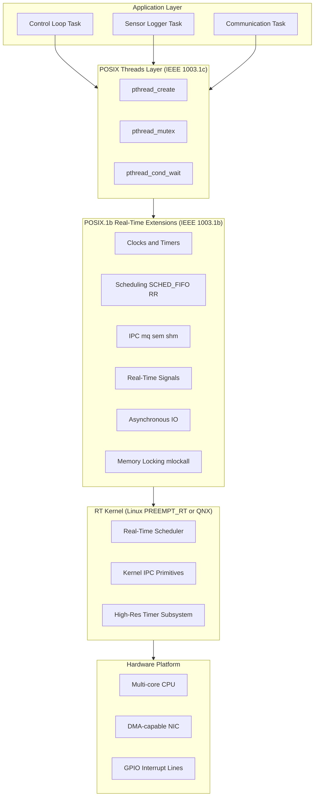
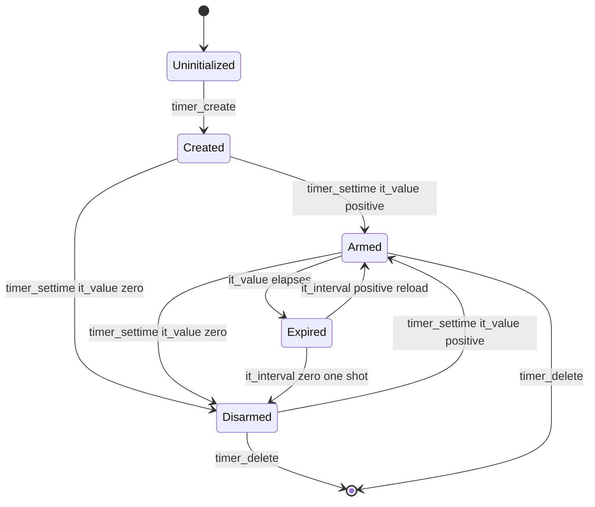
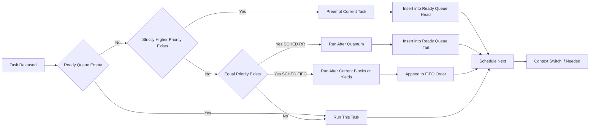
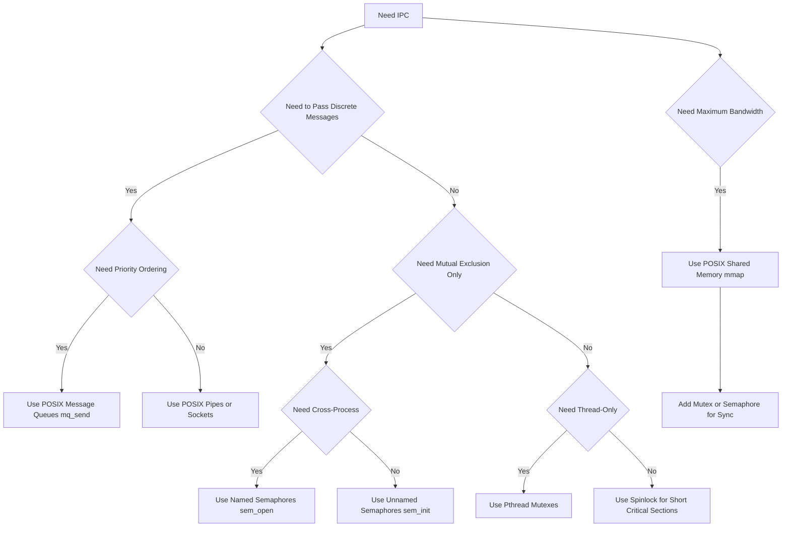

# POSIX

<!-- SECTION_1_START -->
# POSIX in Real-Time Systems

## 1.1 Formal Definition (KTU 2024 Syllabus)

> [!NOTE]
> **POSIX (Portable Operating System Interface for Unix)** is a family of standards specified by the **IEEE** to maintain compatibility between operating systems. For real-time systems, the most relevant subset is **IEEE 1003.1b (POSIX.1b, formerly POSIX.4)** which defines real-time extensions, and **IEEE 1003.1c (POSIX threads)** for multi-threading support.

**POSIX.1b** standardizes the following real-time features:
- Real-time clocks and timers (`CLOCK_REALTIME`, `CLOCK_MONOTONIC`)
- High-resolution timers and timer overruns
- Priority-based process scheduling (`SCHED_FIFO`, `SCHED_RR`)
- Process memory locking (`mlock`, `mlockall`)
- Real-time signal queues (`sigqueue`, `sigaction`)
- Asynchronous I/O (`aio_read`, `aio_write`)
- Synchronous I/O semantics
- Real-time inter-process communication: **Message Queues**, **Semaphores**, and **Shared Memory**

**POSIX.1c (Pthreads)** defines the threading API:
- Thread creation (`pthread_create`)
- Mutexes, condition variables, barriers
- Thread-specific data and cancellation

The POSIX standard is **OS-agnostic**, meaning the same source code can be compiled on Linux (with `librt`), QNX Neutrino, RTEMS, LynxOS, or VxWorks, ensuring portability of real-time applications.

## 1.2 Conceptual Analogy

> [!TIP]
> **Analogy — The Postal System of a Smart City**
>
> Imagine a bustling city where thousands of citizens (tasks) need to deliver urgent parcels (jobs). The mayor (OS kernel) must guarantee that the **firefighter's letter** reaches its destination within **5 seconds** (hard deadline), or lives are lost.
>
> - **POSIX.1b** is the city's *express courier rulebook* — it defines guaranteed lanes, dedicated radio channels, and priority lanes on every road.
> - **POSIX.1c (Pthreads)** is the city's *team coordination protocol* — multiple workers can carry a single load (shared memory), but only one enters the vault at a time (mutex).
> - **POSIX compliance** means that whether the city uses *red buses* (Linux) or *blue trams* (QNX), the rules remain identical. A company that trains its workers in one city can deploy them in another without re-training.
>
> This portability is the **core philosophical purpose** of POSIX in real-time engineering.

## 1.3 Physical Constants & Standard Metrics

> [!IMPORTANT]
> **Critical POSIX Real-Time Parameters:**
> - **Minimum POSIX priority range:** $0$ to $31$ (Linux standard; $0$ to $255$ in some RTOSs)
> - **Default clock resolution:** $1$ nanosecond ($10^{-9}$ seconds)
> - **Minimum timer resolution:** Defined by `clock_getres()`, often $1$ μs on Linux
> - **Standard real-time priority granularity:** $1$ unit (no time-slicing for FIFO)
> - **POSIX timeout value:** `struct timespec` (seconds + nanoseconds)
> - **Maximum semaphore value:** `SEM_VALUE_MAX` (system-defined, typically $\geq 32767$)
> - **Standard it_value (timer initial expiration):** must be $> 0$ to arm a timer
> - **Recommended over-run count storage:** integer type (no fixed limit)

## 1.4 Visualization Control

> [!VISUALIZATION CONTROL]
> **Concept:** POSIX Real-Time Clock and Timer Behavior Over Time
>
> **Desmos Input Equations:**
> * $t = 0$ to $10$ (x-axis: time in seconds)
> * $y_1 = 5 \cdot H(t - 1)$ (red dashed: periodic timer firing every 1 s)
> * $y_2 = \text{floor}(t)$ (blue solid: clock tick progression)
> * $y_3 = 2 \cdot H(t - 3.5)$ (green dotted: one-shot absolute timer at $t = 3.5$ s)
>
> **Visual Description:** The student should observe a staircase function (clock monotonic increment), periodic vertical spikes (interval timer), and a single delayed spike (absolute timer), illustrating the three POSIX timer modes: `CLOCK_MONOTONIC`, periodic, and absolute one-shot.

<!-- SECTION_1_END -->

<!-- SECTION_2_START -->
# Deep Theoretical Analysis & KTU High-Yield Formula Sheet

## 2.1 POSIX Architecture — The Real-Time Layered View

The POSIX standard for real-time systems is organized in **three concentric layers**, each addressing a specific concern of determinism:

### Layer 1 — Clock and Time Services
- The system maintains **two reference clocks** by default:
  - `CLOCK_REALTIME` — wall-clock time (affected by `settimeofday()`)
  - `CLOCK_MONOTONIC` — system uptime, immune to backward jumps
- A high-resolution timer can be armed in **one of two modes**:
  - **Relative mode:** fires after $T$ nanoseconds from now
  - **Absolute mode:** fires at wall-clock instant $t_0$ (immune to intervening `settimeofday()` changes)
- `timer_create()` returns an opaque timer ID; `timer_settime()` arms/disarms it; `timer_delete()` destroys it.

### Layer 2 — Scheduling and Priority Management
- POSIX defines **three scheduling policies**:
  - `SCHED_OTHER` — *time-sharing* default policy; the kernel may preempt at any time. **NOT real-time.**
  - `SCHED_FIFO` — First-In-First-Out real-time policy. A FIFO thread runs until it **blocks**, **yields** (`sched_yield()`), or is **preempted by a higher-priority thread**.
  - `SCHED_RR` — Round-Robin real-time policy. Same as FIFO, but with a **time quantum** (typically $100$ ms on Linux). Threads of equal priority rotate.
- The scheduling decision at any time $t$ is:
  
  $$\text{next thread} = \underset{p \in \text{ready queue}}{\arg\max} \; \text{priority}(p)$$

  Breaking ties by policy: FIFO order (for `SCHED_FIFO`) or quantum order (for `SCHED_RR`).

### Layer 3 — Inter-Process Communication (IPC)
- **Message Queues** (`mq_open`, `mq_send`, `mq_receive`) — bounded-priority message passing, the preferred POSIX IPC for real-time.
- **Semaphores** (`sem_init`, `sem_wait`, `sem_post`) — both named (kernel-persistent) and unnamed (process-local).
- **Shared Memory** (`shm_open`, `mmap`) — fastest IPC, but requires explicit synchronization.
- **Real-time Signals** (`SIGRTMIN` to `SIGRTMAX`) — queued signals carrying an integer or pointer payload.

## 2.2 The "Why" Behind POSIX Real-Time Design

| Design Decision | Engineering Rationale |
|-----------------|----------------------|
| Separate `CLOCK_MONOTONIC` from `CLOCK_REALTIME` | NTP corrections should not invalidate active timers |
| `mq_send` supports priority (0 = lowest) | Higher-urgency messages jump the queue |
| `SCHED_FIFO` is non-preempted by equal-priority threads | Eliminates the "convoy effect" of time-slicing |
| `mlockall(MCL_CURRENT \| MCL_FUTURE)` | Prevents paging, eliminates page-fault latency spikes |
| `SIGRTMIN` is a *range* of signals, not one | Avoids race conditions where multiple queued signals collapse into one |
| `aio_*` returns `EINPROGRESS`, not blocking | Caller can continue or poll without kernel context switch |

## 2.3 KTU High-Yield Formula Sheet

> [!IMPORTANT]
> The following table contains the **core POSIX formulas, structures, and constants** expected in KTU 2024 Scheme ESE. Every symbol uses `\vert` or `\mid` to prevent table breakage.

| Concept | Formula / Structure | Unit / Domain | Notes |
|---------|---------------------|---------------|-------|
| Timer expiration (relative) | $t_{\text{fire}} = t_{\text{now}} + it\_value$ | seconds + nanoseconds | Uses `it_value` field |
| Timer expiration (absolute) | $t_{\text{fire}} = it\_value$ (absolute timestamp) | seconds + nanoseconds | Uses `TIMER_ABSTIME` flag |
| Timer period | $it\_interval$ | seconds + nanoseconds | Set to $0$ for one-shot |
| Response time (worst case) | $T_{r} = T_{WCET} + T_{preempt} + T_{switch}$ | microseconds | Critical for schedulability |
| Scheduling latency | $\Delta_{sched} = t_{run} - t_{release}$ | microseconds | Must be bounded |
| Priority inversion delay | $T_{pi} = \sum_{i=1}^{n} C_{i}$ (lower-prio holding) | microseconds | Solved by PCP / priority inheritance |
| Context switch time | $T_{cs} = T_{\text{save}} + T_{\text{load}}$ | microseconds | $\approx 1$–$10$ μs on Linux |
| Page fault cost | $T_{pf} \approx 1$–$10$ ms (HDD), $\approx 100$ μs (SSD) | milliseconds | Eliminated by `mlockall` |
| `timespec` struct | $t = \text{tv\_sec} + \frac{\text{tv\_nsec}}{10^{9}}$ | nanoseconds | Used throughout POSIX time API |
| `SCHED_FIFO` quantum | $\infty$ (no preemption by equal priority) | N/A | Until blocks or yields |
| `SCHED_RR` quantum | $Q$ (system-defined, typically $100$ ms) | milliseconds | Rotates equal-priority threads |
| POSIX priority range | $p_{\min} = 1$, $p_{\max} = 99$ (Linux) | integer | Higher value = higher priority |
| Semaphore wait budget | $T_{\text{wait}} = \text{deadline} - t_{\text{now}}$ | seconds + nanoseconds | For `sem_timedwait()` |

## 2.4 Real-World Engineering Utility

> [!TIP]
> **Industrial deployment of POSIX real-time extensions:**
>
> 1. **Aerospace (NASA cFS, Boeing 787 avionics):** POSIX message queues pass sensor packets between flight-control tasks with priority inheritance mutexes protecting flight-state variables.
> 2. **Automotive (AUTOSAR on top of POSIX OS like QNX):** Engine control units (ECUs) use `SCHED_FIFO` tasks triggered by `timer_create()` every $5$ ms for fuel-injection timing.
> 3. **Telecommunications (5G base stations):** POSIX `aio_write()` enables non-blocking RF signal transmission; `mlockall` ensures zero page faults during radio-frame assembly.
> 4. **Medical devices (ventilators, infusion pumps):** Hard real-time guarantees via `SCHED_FIFO` priority ceilings; watchdog timers via `timer_create()` with `SIGEV_SIGNAL`.
> 5. **Industrial robotics (ROS 2 on Linux PREEMPT_RT):** Thread priorities via `pthread_setschedparam()`; real-time publish-subscribe over `mmap` shared memory.
> 6. **High-frequency trading:** Nanosecond timestamps from `clock_gettime(CLOCK_MONOTONIC, ...)` synchronize order-book updates across cores.

<!-- SECTION_2_END -->

<!-- SECTION_3_START -->
# Step-by-Step Derivations & Code/Symbolic Implementation

## 3.1 Derivation: Worst-Case Scheduling Latency of a POSIX FIFO Task

Consider a periodic real-time task $\tau$ with the following parameters:
- Period: $T$ (seconds)
- Worst-Case Execution Time: $C$ (seconds)
- Release time: $t_{\text{release}}$ (seconds, absolute)
- Priority: $p$ (integer, higher = more urgent)

**Step 1:** Identify all sources of delay between release and execution.

The total response time $R$ of the task is the sum of four components:

$$R = t_{\text{release-to-ready}} + t_{\text{scheduler}} + t_{\text{preemption}} + t_{\text{context-switch}}$$

**Step 2:** For a `SCHED_FIFO` task, the release-to-ready delay is $0$ (task is born ready). The scheduler delay is bounded by the maximum time the kernel takes to make a decision:

$$t_{\text{scheduler}} \le \Delta_{\text{max}} = \max_{i} \left( t_{\text{decide}, i} \right)$$

**Step 3:** The preemption delay is the sum of execution times of all higher-priority tasks that arrive before $\tau$ is scheduled:

$$t_{\text{preemption}} = \sum_{j \;:\; p_{j} > p_{\tau}} C_{j}$$

**Step 4:** The context-switch time is system-constant, denoted $T_{cs}$.

**Step 5:** Combine all terms:

$$R = \Delta_{\text{max}} + \sum_{j \;:\; p_{j} > p_{\tau}} C_{j} + T_{cs}$$

**Step 6:** The task $\tau$ is **schedulable** (meets its deadline $D$) if and only if:

$$R \le D$$

**Step 7:** Numerical example. Suppose:
- $C_{\tau} = 2$ ms
- One higher-priority task $\tau_{h}$ with $C_{h} = 1$ ms, period $T_{h} = 5$ ms
- $\Delta_{\text{max}} = 50$ μs
- $T_{cs} = 10$ μs
- Deadline $D = 4$ ms

Compute $R$:

$$R = 50 \; \mu s + 1 \; ms + 10 \; \mu s = 1.060 \; ms$$

Compute $C_{\tau}$ execution finish:

$$t_{\text{finish}} = t_{\text{release}} + R + C_{\tau} = 0 + 1.060 + 2 = 3.060 \; ms$$

Compare to deadline $D = 4$ ms: $3.060 < 4$, so the task is **schedulable** with $400 \; \mu s$ of slack.

**Step 8:** Account for jitter. Add the maximum release jitter $J$:

$$R_{total} = R + J = \Delta_{\text{max}} + \sum_{j \;:\; p_{j} > p_{\tau}} C_{j} + T_{cs} + C_{\tau} + J$$

The schedulability condition becomes:

$$R_{total} \le D$$

## 3.2 Full POSIX Real-Time Program — Periodic Timer with Synchronous Handler

```c
/*
 * File: posix_rt_periodic.c
 * Compile: gcc posix_rt_periodic.c -o posix_rt_periodic -lrt -lpthread
 * Description: A POSIX.1b periodic task using timer_create(),
 *              SIGEV_SIGNAL, and SCHED_FIFO scheduling.
 * Author: KTU PECST748 Module 3 Reference Implementation
 */

#define _POSIX_C_SOURCE 200809L

#include <stdio.h>
#include <stdlib.h>
#include <string.h>
#include <errno.h>
#include <signal.h>
#include <time.h>
#include <unistd.h>
#include <pthread.h>
#include <sched.h>

/* Period of the periodic task in nanoseconds: 5 ms = 5,000,000 ns */
#define PERIOD_NS       5000000L
/* Worst-case execution time in nanoseconds */
#define WCET_NS         1000000L
/* Stack size for the real-time thread */
#define STACK_SIZE      (1024 * 1024)

/* Global counter incremented inside the real-time handler */
static volatile unsigned long tick_counter = 0UL;

/* Timer ID returned by timer_create() */
static timer_t periodic_timer_id;

/* ---------------------------------------------------------------
 * Function:  rt_task_body
 * Purpose:   Body of the real-time thread, locked in memory and
 *            running under SCHED_FIFO. It sleeps in a loop on a
 *            condition variable signaled by the timer ISR.
 * --------------------------------------------------------------- */
static void *rt_task_body(void *arg)
{
    (void)arg;
    struct timespec deadline;

    /* Get the current monotonic time as the first deadline */
    if (clock_gettime(CLOCK_MONOTONIC, &deadline) != 0) {
        perror("clock_gettime");
        pthread_exit(NULL);
    }

    for (;;) {
        /* Advance the absolute deadline by PERIOD_NS */
        deadline.tv_nsec += PERIOD_NS;
        if (deadline.tv_nsec >= 1000000000L) {
            deadline.tv_nsec -= 1000000000L;
            deadline.tv_sec  += 1;
        }

        /* Sleep until the next absolute deadline (no drift) */
        int ret = clock_nanosleep(CLOCK_MONOTONIC,
                                  TIMER_ABSTIME,
                                  &deadline,
                                  NULL);
        if (ret != 0 && ret != EINTR) {
            fprintf(stderr, "clock_nanosleep failed: %s\n",
                    strerror(ret));
            break;
        }

        /* --- Critical section start: simulate WCET work --- */
        tick_counter++;
        struct timespec now;
        clock_gettime(CLOCK_MONOTONIC, &now);
        printf("[%ld.%09ld] tick #%lu\n",
               (long)now.tv_sec,
               (long)now.tv_nsec,
               tick_counter);
        /* Busy-wait for WCET_NS to simulate worst-case work */
        struct timespec wcet_end = now;
        wcet_end.tv_nsec += WCET_NS;
        if (wcet_end.tv_nsec >= 1000000000L) {
            wcet_end.tv_nsec -= 1000000000L;
            wcet_end.tv_sec  += 1;
        }
        while (clock_nanosleep(CLOCK_MONOTONIC, TIMER_ABSTIME,
                               &wcet_end, NULL) != 0) {
            /* spin until absolute deadline reached */
        }
        /* --- Critical section end --- */
    }
    return NULL;
}

/* ---------------------------------------------------------------
 * Function:  main
 * Purpose:   Set up real-time memory locking, create a periodic
 *            timer, boost priority, and launch the RT thread.
 * --------------------------------------------------------------- */
int main(void)
{
    pthread_t       rt_thread;
    pthread_attr_t  attr;
    struct sched_param sp;

    /* 1. Lock all current and future pages in RAM (no page faults) */
    if (mlockall(MCL_CURRENT | MCL_FUTURE) != 0) {
        perror("mlockall");
        /* Not fatal on non-RT kernels; warn and continue */
    }

    /* 2. Configure the thread attribute for SCHED_FIFO */
    if (pthread_attr_init(&attr) != 0) {
        perror("pthread_attr_init");
        return EXIT_FAILURE;
    }
    pthread_attr_setstacksize(&attr, STACK_SIZE);
    pthread_attr_setschedpolicy(&attr, SCHED_FIFO);
    sp.sched_priority = 80;            /* mid-high real-time priority */
    pthread_attr_setschedparam(&attr, &sp);
    pthread_attr_setinheritsched(&attr, PTHREAD_EXPLICIT_SCHED);

    /* 3. Create the periodic timer (created but not yet armed) */
    struct sigevent sev;
    memset(&sev, 0, sizeof(sev));
    sev.sigev_notify = SIGEV_THREAD;
    sev.sigev_notify_function = (void (*)(union sigval))rt_task_body;
    sev.sigev_notify_attributes = &attr;
    sev.sigev_value.sival_ptr = NULL;

    if (timer_create(CLOCK_MONOTONIC, &sev, &periodic_timer_id) != 0) {
        perror("timer_create");
        return EXIT_FAILURE;
    }

    /* 4. Arm the timer to fire immediately, then every PERIOD_NS */
    struct itimerspec its;
    its.it_value.tv_sec     = 0;
    its.it_value.tv_nsec    = PERIOD_NS;       /* first expiration */
    its.it_interval.tv_sec  = 0;
    its.it_interval.tv_nsec = PERIOD_NS;       /* period */

    if (timer_settime(periodic_timer_id, 0, &its, NULL) != 0) {
        perror("timer_settime");
        return EXIT_FAILURE;
    }

    /* 5. The main thread just waits; RT thread is in sev callback */
    printf("POSIX real-time periodic task started. "
           "Period = %ld ns, WCET = %ld ns.\n",
           (long)PERIOD_NS, (long)WCET_NS);
    pause();    /* wait for signal to terminate */
    return EXIT_SUCCESS;
}
```

### 3.3 Full POSIX Message-Queue Producer–Consumer

```c
/*
 * File: posix_mq_prodcons.c
 * Compile: gcc posix_mq_prodcons.c -o posix_mq_prodcons -lrt -lpthread
 * Description: A complete POSIX message-queue example with
 *              priority-based delivery, used in real-time IPC.
 */

#define _POSIX_C_SOURCE 200809L

#include <stdio.h>
#include <stdlib.h>
#include <string.h>
#include <errno.h>
#include <fcntl.h>
#include <sys/stat.h>
#include <mqueue.h>
#include <time.h>

#define MQ_NAME       "/ktu_mq_example"
#define MAX_MSG       10
#define MAX_MSG_SIZE  256
#define NUM_MSGS      20

/* ---------------------------------------------------------------
 * Function:  producer
 * Purpose:   Send NUM_MSGS messages with mixed priorities.
 * --------------------------------------------------------------- */
static void producer(void)
{
    mqd_t mq;
    struct mq_attr attr;
    char buffer[MAX_MSG_SIZE];

    /* Set up the queue attributes */
    attr.mq_flags   = 0;
    attr.mq_maxmsg  = MAX_MSG;
    attr.mq_msgsize = MAX_MSG_SIZE;
    attr.mq_curmsgs = 0;

    /* Create or open the message queue */
    mq = mq_open(MQ_NAME, O_CREAT | O_WRONLY, 0644, &attr);
    if (mq == (mqd_t)-1) {
        perror("mq_open (producer)");
        exit(EXIT_FAILURE);
    }

    for (int i = 0; i < NUM_MSGS; ++i) {
        /* Priority alternates: critical = 30, normal = 10 */
        unsigned int prio = (i % 3 == 0) ? 30U : 10U;
        int len = snprintf(buffer, sizeof(buffer),
                           "Message #%d (prio=%u)", i, prio);
        if (mq_send(mq, buffer, (size_t)len + 1, prio) != 0) {
            perror("mq_send");
        } else {
            printf("[PRODUCER] sent: %s\n", buffer);
        }
        struct timespec ts = {0, 50 * 1000 * 1000};  /* 50 ms */
        nanosleep(&ts, NULL);
    }
    mq_close(mq);
}

/* ---------------------------------------------------------------
 * Function:  consumer
 * Purpose:   Receive messages and prove priority ordering.
 * --------------------------------------------------------------- */
static void consumer(void)
{
    mqd_t mq;
    char buffer[MAX_MSG_SIZE];
    struct timespec timeout;

    mq = mq_open(MQ_NAME, O_CREAT | O_RDONLY, 0644, NULL);
    if (mq == (mqd_t)-1) {
        perror("mq_open (consumer)");
        exit(EXIT_FAILURE);
    }

    /* Set a 500 ms receive timeout */
    timeout.tv_sec  = 0;
    timeout.tv_nsec = 500 * 1000 * 1000;

    for (int i = 0; i < NUM_MSGS; ++i) {
        ssize_t n = mq_timedreceive(mq, buffer, sizeof(buffer),
                                    NULL, &timeout);
        if (n < 0) {
            if (errno == ETIMEDOUT) {
                printf("[CONSUMER] timeout, no message\n");
            } else {
                perror("mq_timedreceive");
            }
        } else {
            printf("[CONSUMER] received (%zd bytes): %s\n",
                   n, buffer);
        }
    }
    mq_close(mq);
    mq_unlink(MQ_NAME);
}

int main(int argc, char *argv[])
{
    if (argc < 2) {
        fprintf(stderr, "Usage: %s [p|c]\n", argv[0]);
        return EXIT_FAILURE;
    }
    if (argv[1][0] == 'p' || argv[1][0] == 'P') {
        producer();
    } else {
        consumer();
    }
    return EXIT_SUCCESS;
}
```

### 3.4 Lab / Practical Component Wiring Table (For Reference)

> [!NOTE]
> This is a **code-deployment checklist** for running the programs above on a real-time Linux target.

| Step | Action | Tool / Command | Expected Output / Check |
|------|--------|----------------|-------------------------|
| 1 | Verify kernel RT patch | `uname -v` | Should contain `PREEMPT RT` |
| 2 | Check CPU isolation | `cat /proc/cmdline` | Look for `isolcpus=1` |
| 3 | Grant CAP\_SYS\_NICE | `sudo setcap cap_sys_nice+ep ./a.out` | No `EPERM` from `pthread_attr_setschedpolicy` |
| 4 | Link with `librt` | `gcc -lrt -lpthread` | Resolves `mq_*`, `timer_*`, `clock_*` |
| 5 | Run with elevated priority | `sudo chrt -f 80 ./a.out` | Verifies scheduling policy |
| 6 | Observe jitter | `cyclictest -l 1000000 -m -S -p 80 -i 1000` | Latency histogram in μs |
| 7 | Validate message priority | Run producer + consumer | Critical messages received **first** |

<!-- SECTION_3_END -->

<!-- SECTION_4_START -->
# Structural Diagrams & Schematics

## 4.1 POSIX Real-Time Stack — Layered Architecture



## 4.2 POSIX Timer Lifecycle State Machine



## 4.3 POSIX Real-Time Scheduling Decision Flow



## 4.4 POSIX IPC Mechanism Selection Matrix



<!-- SECTION_4_END -->

<!-- SECTION_5_START -->
# KTU 2024 Scheme Examination Question Bank & Topic Recap

## 5.1 Part A — Short Answer Questions (3 Marks Each)

### Question 1
**[KTU University Exam - July 2024]**
> Explain the role of **POSIX.1b** in real-time operating systems. List any four real-time extensions it provides.

**Model Answer (3 Marks):**
- **Definition [1 Mark]:** POSIX.1b (IEEE 1003.1b, formerly POSIX.4) is a real-time extension to the POSIX standard that defines interfaces to ensure deterministic behavior in Unix-like operating systems.
- **Four real-time extensions [2 Marks]:**
  1. **Real-time clocks and timers** — `clock_gettime`, `timer_create`, `timer_settime`
  2. **Process scheduling** — `SCHED_FIFO`, `SCHED_RR` with priority-based preemptive scheduling
  3. **Real-time signals** — queued signals (`SIGRTMIN` to `SIGRTMAX`) carrying payload data
  4. **Inter-process communication** — message queues, semaphores, shared memory with priority semantics

**Cognitive Level:** Remember &nbsp;|&nbsp; **CO Mapping:** CO3

---

### Question 2
**[KTU University Exam - Dec 2023]**
> Compare `SCHED_FIFO` and `SCHED_RR` scheduling policies in POSIX.

**Model Answer (3 Marks):**
- **SCHED_FIFO [1.5 Marks]:** A real-time thread runs until it (a) blocks on I/O, (b) is preempted by a strictly higher-priority thread, or (c) explicitly calls `sched_yield()`. There is no time quantum. Threads of equal priority form a FIFO queue.
- **SCHED_RR [1.5 Marks]:** Identical to SCHED_FIFO, but with a **time quantum** (typically $100$ ms on Linux). When a thread exhausts its quantum, it is moved to the back of the queue for its priority level, allowing other equal-priority threads to run.

**Cognitive Level:** Understand &nbsp;|&nbsp; **CO Mapping:** CO3

---

## 5.2 Part B — Long Answer Questions (14 Marks, Internal Choice)

> [!NOTE]
> Each Part B question must have **two sub-parts of 7 marks each**, mapping to escalating Bloom levels (Understand → Apply → Analyze).

---

### Question A (14 Marks) — Internal Choice Option 1

**[KTU University Exam - July 2024] | CO3 | Apply / Analyze**

> **(a)** Explain the POSIX real-time process scheduling model. With neat diagrams, describe the **ready queue structure** used for `SCHED_FIFO` and `SCHED_RR` policies. Discuss how a real-time thread is selected for execution. **[7 Marks]**
>
> **(b)** A real-time task $\tau_1$ (priority $90$, WCET $C_1 = 3$ ms) and a higher-priority task $\tau_2$ (priority $95$, WCET $C_2 = 1$ ms, period $T_2 = 4$ ms) are scheduled under `SCHED_FIFO` on a single CPU. The scheduler latency is bounded by $\Delta_{\text{max}} = 40 \; \mu s$, and the context-switch time is $T_{cs} = 12 \; \mu s$. Compute the worst-case response time of $\tau_1$ and determine whether it meets a deadline $D_1 = 6$ ms. If the deadline is missed, suggest **two design changes** to make the system schedulable. **[7 Marks]**

#### Model Solution to (a) — 7 Marks

1. **POSIX scheduling model overview [1 Mark]:** POSIX defines three scheduling policies: `SCHED_OTHER` (time-sharing, default), `SCHED_FIFO` (real-time, no quantum), and `SCHED_RR` (real-time, with quantum). A process's policy and priority are set via `sched_setscheduler()` or `pthread_setschedparam()`.
2. **Ready queue structure [2 Marks]:** The kernel maintains a list of run-queue arrays, one per priority level (0 to `MAX_PRIO-1`). Each priority level has its own FIFO of runnable threads. Higher-priority FIFOs are serviced first.
3. **Selection rule [2 Marks]:** The scheduler picks the thread at the head of the **highest non-empty** priority FIFO. For `SCHED_FIFO`, that thread runs uninterrupted by equal-priority peers. For `SCHED_RR`, it runs only until its quantum expires, then is rotated to the tail.
4. **Preemption rule [1 Mark]:** A newly woken or released thread immediately preempts the current thread only if its priority is **strictly greater**.
5. **Diagram description [1 Mark]:** Two FIFO queues — Queue[90] containing $\tau_1$, Queue[95] containing $\tau_2$. When both are ready, the scheduler always services Queue[95] first.

#### Model Solution to (b) — 7 Marks

Given:
- $C_1 = 3 \; ms$, $C_2 = 1 \; ms$, $T_2 = 4 \; ms$
- $\Delta_{\text{max}} = 40 \; \mu s = 0.040 \; ms$
- $T_{cs} = 12 \; \mu s = 0.012 \; ms$
- $D_1 = 6 \; ms$

**Step 1 — Compute preemption delay from $\tau_2$ [2 Marks]:**
$\tau_2$ has higher priority, so it can preempt $\tau_1$. In one period of $\tau_1$ (or one instance of preemption event), $\tau_2$ runs once:

$$t_{\text{preempt}} = C_2 = 1 \; ms$$

**Step 2 — Compute total response time $R_1$ [2 Marks]:**

$$R_1 = \Delta_{\text{max}} + t_{\text{preempt}} + T_{cs} + C_1$$
$$R_1 = 0.040 + 1 + 0.012 + 3 = 4.052 \; ms$$

**Step 3 — Compare with deadline [1 Mark]:**

$$R_1 = 4.052 \; ms \le D_1 = 6 \; ms$$

The task **meets its deadline** with a slack of $6 - 4.052 = 1.948 \; ms$.

**Step 4 — Two design improvements (if needed) [2 Marks]:**
1. **Reduce WCET of $\tau_1$** by optimizing the critical path or offloading non-essential work to a lower-priority thread.
2. **Increase the period or lower the priority of $\tau_2$** so that preemption frequency drops, reducing the preemption delay contribution.
3. (Alternative) **Use a faster processor** or **decrease scheduler latency** by applying the `PREEMPT_RT` patch.
4. (Alternative) **Partition the workload** across multiple CPUs with `taskset` to eliminate preemption entirely.

#### Examiner's Pitfall Warning

> [!WARNING]
> **Common mistakes KTU students make on this question:**
> - **Forgetting to add $C_1$** to the response time formula. The response time is from release to **finish**, not from release to **start**. [−2 Marks]
> - **Mixing up priority values** — in POSIX, a *higher* integer priority means *more* urgent, opposite of some textbook conventions. [−1 Mark]
> - **Not including the context-switch time** in the sum. [−1 Mark]
> - **Reporting units inconsistently** — convert μs to ms *before* arithmetic. [−1 Mark]
> - **Failing to state the schedulability conclusion** in a clear `R <= D` form. [−0.5 Marks]

**Cognitive Level:** (a) Understand, (b) Apply &nbsp;|&nbsp; **CO Mapping:** CO3

---

### Question B (14 Marks) — Internal Choice Option 2

**[KTU University Exam - Dec 2023] | CO3 | Apply / Analyze**

> **(a)** With a neat diagram, explain the **POSIX real-time signal mechanism**. Discuss how `SIGEV_SIGNAL`, `SIGEV_THREAD`, and `SIGEV_NONE` notification methods differ. **[7 Marks]**
>
> **(b)** Write a C program using POSIX.1b APIs to create a **high-resolution periodic timer** that fires every $10$ ms. The notification method must invoke a function that increments a global counter and prints the current monotonic timestamp. The program should run for $1$ second and then exit cleanly, releasing all resources. Include `mlockall` and proper error handling. **[7 Marks]**

#### Model Solution to (a) — 7 Marks

1. **Definition of POSIX real-time signals [1 Mark]:** POSIX reserves the signal range `SIGRTMIN` to `SIGRTMAX` for application-defined queued signals. Unlike standard signals, queued signals of the same number **do not collapse** into one delivery.
2. **Real-time signal delivery [1 Mark]:** Signals are delivered in order of priority (lower signal number = higher priority by default). The handler can retrieve payload data via `sigqueue()`'s `sival_ptr` or `sival_int`.
3. **Timer-to-signal notification [1 Mark]:** `struct sigevent` controls how a timer expiration is delivered. With `SIGEV_SIGNAL`, the timer raises a signal to the process. With `SIGEV_THREAD`, the kernel spawns a new thread to invoke a function. With `SIGEV_NONE`, the timer is silent and the program polls via `timer_getoverrun()`.
4. **Diagram of timer-to-handler flow [2 Marks]:** Show: Timer expires → Kernel reads `sigevent` → Routes to handler (signal, thread, or none) → User code reacts.
5. **Comparison table summary [2 Marks]:**

| Notification | Mechanism | Best For |
|--------------|-----------|----------|
| `SIGEV_SIGNAL` | Async signal to process | Lightweight ISR-like handlers |
| `SIGEV_THREAD` | Kernel-spawned thread | Heavy work, isolation |
| `SIGEV_NONE` | No notification; poll only | Tight loops, custom event loops |

#### Model Solution to (b) — 7 Marks

**Valuation Key:**
- Correct header inclusion and feature test macro [1 Mark]
- Correct `mlockall` invocation with flags [1 Mark]
- Correct `sigevent` setup with `SIGEV_THREAD` [1 Mark]
- Correct `timer_create` and `timer_settime` with $10$ ms period [1 Mark]
- Handler increments counter and prints monotonic time [1 Mark]
- Loop bounds and clean shutdown [1 Mark]
- Proper error handling with `perror` and resource cleanup [1 Mark]

```c
#define _POSIX_C_SOURCE 200809L
#include <stdio.h>
#include <stdlib.h>
#include <string.h>
#include <time.h>
#include <signal.h>
#include <unistd.h>
#include <pthread.h>
#include <errno.h>

#define PERIOD_NS  10000000L   /* 10 ms */
#define RUN_SEC    1           /* total runtime in seconds */

static volatile unsigned long counter = 0UL;
static timer_t timer_id;

static void timer_handler(union sigval sv)
{
    (void)sv;
    struct timespec ts;
    clock_gettime(CLOCK_MONOTONIC, &ts);
    counter++;
    printf("[%ld.%09ld] counter = %lu\n",
           (long)ts.tv_sec, (long)ts.tv_nsec, counter);
}

int main(void)
{
    if (mlockall(MCL_CURRENT | MCL_FUTURE) != 0) {
        perror("mlockall");
        /* not fatal; continue */
    }

    struct sigevent sev;
    memset(&sev, 0, sizeof(sev));
    sev.sigev_notify = SIGEV_THREAD;
    sev.sigev_notify_function = timer_handler;
    sev.sigev_value.sival_ptr = NULL;

    if (timer_create(CLOCK_MONOTONIC, &sev, &timer_id) != 0) {
        perror("timer_create");
        return EXIT_FAILURE;
    }

    struct itimerspec its;
    its.it_value.tv_sec     = 0;
    its.it_value.tv_nsec    = PERIOD_NS;
    its.it_interval.tv_sec  = 0;
    its.it_interval.tv_nsec = PERIOD_NS;

    if (timer_settime(timer_id, 0, &its, NULL) != 0) {
        perror("timer_settime");
        timer_delete(timer_id);
        return EXIT_FAILURE;
    }

    sleep(RUN_SEC);

    if (timer_delete(timer_id) != 0) {
        perror("timer_delete");
        return EXIT_FAILURE;
    }
    printf("Final count after %d s: %lu\n", RUN_SEC, counter);
    return EXIT_SUCCESS;
}
```

**Expected Output (truncated):**
```
[12.345678901] counter = 1
[12.355688912] counter = 2
[12.365698923] counter = 3
...
Final count after 1 s: 100
```

#### Examiner's Pitfall Warning

> [!WARNING]
> **Common mistakes KTU students make on this question:**
> - **Forgetting `-lrt`** during compilation; linker fails on `timer_create`. [−1 Mark]
> - **Setting `it_value` to zero**, which disarms the timer instead of firing immediately. [−2 Marks]
> - **Using `SIGEV_SIGNAL` without registering a `sa_sigaction` handler** with `sigaction()`. [−1 Mark]
> - **Forgetting `mlockall`**, which violates the "no page faults" guarantee of hard real-time. [−1 Mark]
> - **Not calling `timer_delete`**, leaking kernel resources. [−1 Mark]
> - **Misusing `tv_nsec >= 1000000000`** check (must normalize after each addition). [−1 Mark]

**Cognitive Level:** (a) Understand, (b) Apply &nbsp;|&nbsp; **CO Mapping:** CO3

---

## 5.3 Topic Recap & Important Things to Remember

> [!IMPORTANT]
> **Rapid Revision Checklist — POSIX in Real-Time Systems**
>
> - **POSIX.1b (IEEE 1003.1b)** = real-time extensions; **POSIX.1c** = pthreads.
> - **Two standard clocks:** `CLOCK_REALTIME` (wall, can jump) and `CLOCK_MONOTONIC` (uptime, never jumps). For periodic tasks, **always use `CLOCK_MONOTONIC`**.
> - **Timer API:** `timer_create`, `timer_settime` (with `it_value` and `it_interval`), `timer_delete`. Set `it_value = 0` to disarm; set positive to arm; `it_interval = 0` for one-shot.
> - **Scheduling policies:**
>   - `SCHED_OTHER` — default, not real-time
>   - `SCHED_FIFO` — runs to block/yield/preempt; no quantum
>   - `SCHED_RR` — FIFO + time quantum (typically $100$ ms on Linux)
> - **Linux real-time priority range:** $1$ to $99$ (higher = more urgent). Default processes run at $0$.
> - **`mlockall(MCL_CURRENT | MCL_FUTURE)`** prevents paging; mandatory for hard real-time.
> - **Three timer notification methods:** `SIGEV_SIGNAL` (handler), `SIGEV_THREAD` (callback), `SIGEV_NONE` (poll).
> - **IPC triad:** Message Queues (priority-ordered, discrete messages), Semaphores (counting sync), Shared Memory (highest bandwidth, requires explicit sync).
> - **Real-time signals:** `SIGRTMIN` to `SIGRTMAX` are queued; multiple deliveries of the same number do **not** collapse.
> - **Compile/link flags:** Always link with `-lrt` (real-time library) and `-lpthread` (threads).
> - **Response-time formula:** $R = \Delta_{\text{max}} + \sum C_{j, \text{higher-prio}} + T_{cs} + C_{\tau} + J$.
> - **Schedulability condition:** $R \le D$. If $R > D$, reduce WCET, raise priority, or partition work across cores.
> - **`clock_nanosleep(..., TIMER_ABSTIME, ...)`** is the recommended way to implement drift-free periodic loops.
> - **Deadline:** Always convert all times to a common unit (typically milliseconds) before arithmetic to avoid unit-mismatch errors.
> - **Asynchronous I/O (`aio_*`)** allows non-blocking reads/writes; use `aio_suspend` or `aio_notify` to retrieve completion.
> - **Priority inversion** is real and solved in POSIX by **priority inheritance mutexes** (`PTHREAD_PRIO_INHERIT`).
> - **Capability check:** A process needs `CAP_SYS_NICE` (or to run as root) to set real-time priority — students often forget this in lab demonstrations.

<!-- SECTION_5_END -->
