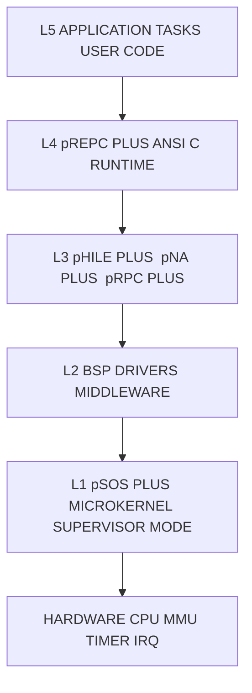
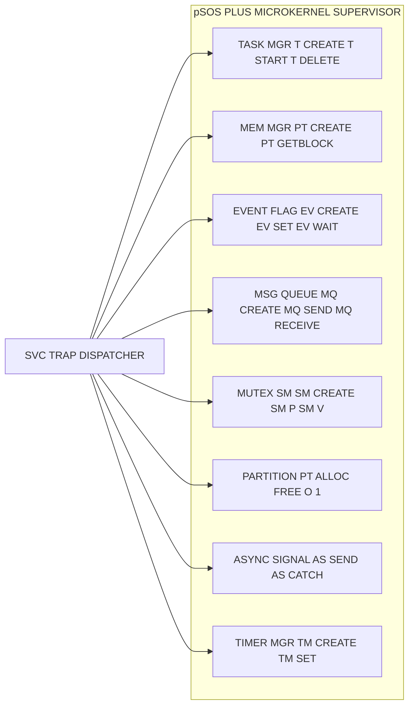
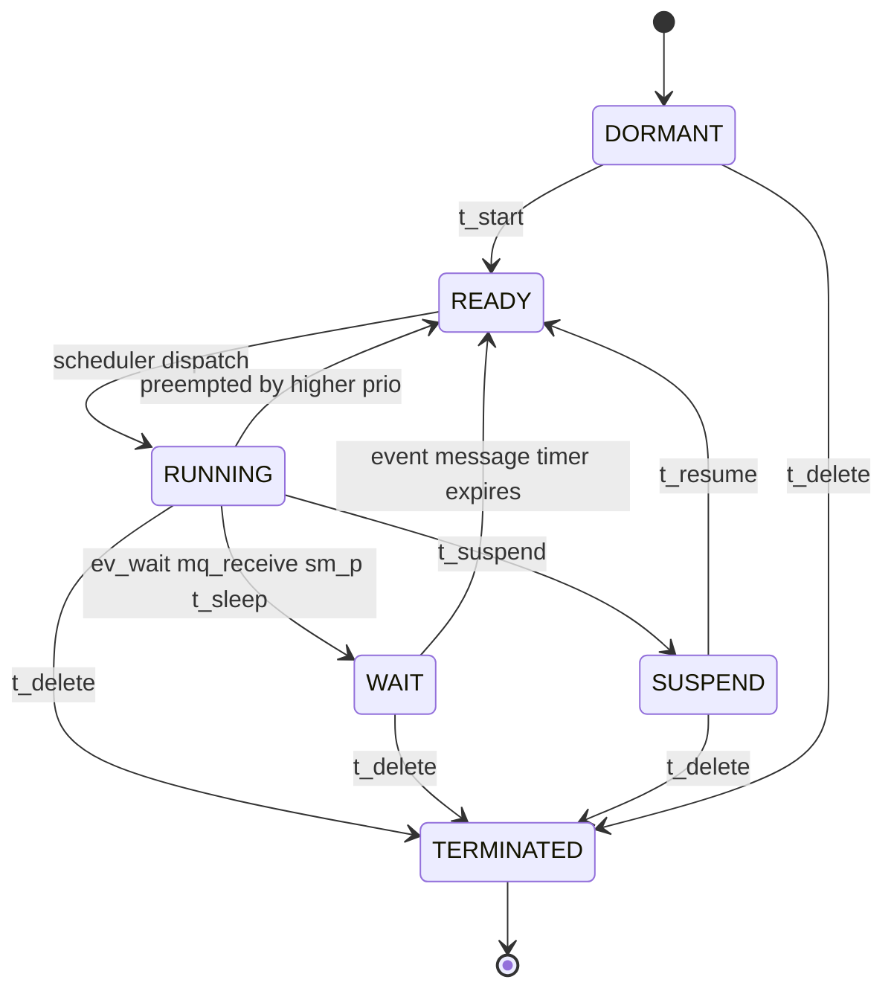
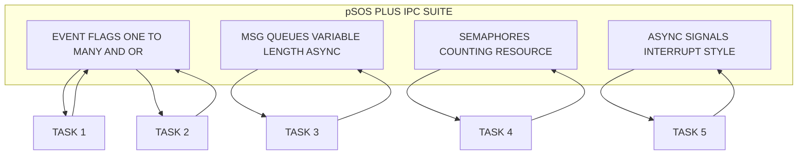
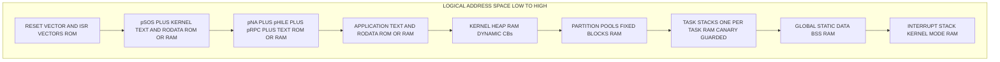
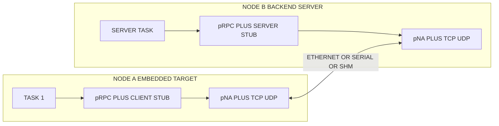
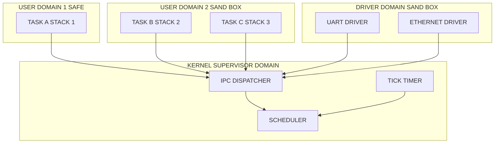

# PSOS

<!-- SECTION_1_START -->
# pSOSystem (PSOS) — Commercial Real-Time Operating System

> [!IMPORTANT]
> **KTU 2024 Scheme — Module 3 (Commercial Real-Time Systems)**
> **Course:** Real Time Systems (PECST748) — B.Tech CSE / ECE (Elective Cluster)
> **Topic Anchor:** pSOS / pSOS+ Architecture, Kernel Services, Integrated Modules, Task Model and Scheduling

---

## 1.1 Formal Definition (KTU 2024 Syllabus Terminology)

**pSOSystem (often abbreviated as pSOS or pSOS+)** is a **modular, layered, commercially licensed real-time operating system** originally developed by **Integrated Systems Inc. (ISI)** in 1989, and currently maintained by **Wind River Systems** (post-acquisition in 1999). It is engineered to host **hard, firm and soft real-time workloads** in deeply embedded systems such as telecommunication switches, network routers, automotive ECUs, avionics subsystems, industrial automation controllers and medical instrumentation.

> [!NOTE]
> **Definition (Board-Exam Ready):**
> "pSOS is a commercially distributed, microkernel-based real-time operating system that provides deterministic multitasking, priority-driven preemptive scheduling, bounded interrupt latency, and a tightly integrated set of optional middleware modules (pNA+, pRPC+, pHILE+, pREPC+) used to build distributed, fault-tolerant embedded applications."

The naming convention follows the pattern **`p` (ISI's prefix for "programmable") + Module Acronym + `+`**:
* **pSOS+** — the real-time microkernel
* **pNA+** — Networking Annex (TCP/IP stack)
* **pRPC+** — Remote Procedure Call Annex
* **pHILE+** — File System Annex
* **pREPC+** — ANSI C Runtime Library Annex
* **pRISM+** — Integrated Development Environment

---

## 1.2 Conceptual Analogy & Intuition

> [!TIP]
> **Real-World Analogy — The Hospital Operating Theatre**
>
> Imagine a large multispecialty hospital:
>
> * The **pSOS+ microkernel** is the **central control desk** of the hospital. It knows the current **state** of every doctor, allocates the **operation theatre (CPU)**, and grants **permits (mutexes)** for exclusive equipment use.
> * **Tasks** are individual **surgeons** — each has a fixed **priority**, a defined **ward (stack)**, a **specialty (system call privilege)** and a list of **operations to perform (code)**.
> * The **event flags** are like the **paging system** — a surgeon gets paged when a specific patient is ready, without having to constantly check.
> * **Message queues** are the **patient file transfer tubes** — operating notes and test results are passed between doctors asynchronously.
> * **pNA+** is the **hospital's courier network** — handles external communications (parcels arrive from other hospitals).
> * **pRPC+** is the **telemedicine link** — a doctor can request a specialist consultation from a remote hospital and get a structured reply.
> * **pHILE+** is the **medical records archive** — structured storage and retrieval of long-term patient data.
> * **pREPC+** is the **standard medical handbook** — implements familiar library functions (`printf`, `malloc`) on top of pSOS+ primitives.
>
> The control desk is **small, fast and always responsive** (this is the microkernel design), and only consults the courier, archive or handbook when the doctor (task) explicitly asks for it. This separation guarantees that the most critical surgeon (highest priority task) is **never blocked** by a slow archive lookup — exactly the determinism guarantee an embedded RTOS must provide.

---

## 1.3 Salient Design Properties of pSOS

> [!IMPORTANT]
> **Why pSOS is classified as a *premium* commercial RTOS for KTU examination purposes:**
>
> 1. **Microkernel architecture** — only ~10 % of the code runs in supervisor mode; rest are user-mode servers.
> 2. **POSIX 1003.1 / 1003.4 (real-time POSIX) compliant** — portable application code.
> 3. **Deterministic, priority-preemptive scheduler** with optional **round-robin tie-breaking**.
> 4. **Bounded interrupt response time** — typically **< 5 µs** on a 25 MHz Motorola 68k.
> 5. **ROMable** — runs from ROM, RAM or a mix; supports **diskless (XIP) operation**.
> 6. **Scalable memory footprint** — minimum kernel image ≈ **30 KB ROM / 8 KB RAM**.
> 7. **Multi-processor / distributed support** via pRPC+ across Ethernet, serial or shared memory.
> 8. **Source-level debugger** (pRISM+) with on-chip breakpoint, trace and watchpoint.

---

## 1.4 Physical Constants and Standard Metrics (Bolded)

* **Minimum ROM footprint:** $\mathbf{30 \text{ KB}}$
* **Minimum RAM footprint:** $\mathbf{8 \text{ KB}}$
* **Number of priority levels:** $\mathbf{0 \text{ to } 255}$ (0 = highest, 255 = lowest)
* **Maximum tasks supported:** $\mathbf{65{,}535}$ (16-bit task IDs)
* **Context switch time (typical):** $\mathbf{< 25 \; \mu s}$ (68k @ 25 MHz)
* **Interrupt latency (typical):** $\mathbf{< 5 \; \mu s}$
* **Default time-slice for round-robin:** $\mathbf{10 \text{ ms}}$
* **System clock tick resolution:** $\mathbf{1 \text{ ms}}$ (configurable down to $\mathbf{10 \; \mu s}$)

---

## 1.5 Visualization Control Block (Geometric / Schematic)

> [!VISUALIZATION CONTROL]
> **Concept:** Priority Ladder Visualisation (pSOS+ Scheduling)
> **GeoGebra / Desmos Input Equations:**
>
> * Draw the y-axis as `Priority Level (0 = top)` from 0 to 255.
> * Plot the function `f(x) = 0` as a horizontal red line — *highest priority ready task*.
> * Plot discrete points: $(1, 5), (2, 42), (3, 100), (4, 200)$ representing tasks $T_1, T_2, T_3, T_4$ at varying priorities.
> * Plot a step function `g(x) = current_running_task_priority` taking values from the set $\{0, 5, 42, 100, 200\}$.
>
> **Visual Description:** The student should observe that the scheduler always selects the task whose `y` value (priority) is the **smallest non-negative integer** among all `READY` tasks. When two tasks share the same priority, the **round-robin time-slice** is invoked, alternating them at the **10 ms** boundary.

---

<!-- SECTION_1_END -->

<!-- SECTION_2_START -->
# 2. Deep Theoretical Analysis & KTU High-Yield Formula Sheet

## 2.1 Layered Architecture of pSOSystem

pSOS is engineered as a **five-layer vertical stack**. The lower the layer, the higher the privilege and the smaller the code size. This strict layering is the reason pSOS achieves both **small footprint** and **bounded latency** simultaneously.

| Layer \# | Module | Mode of Execution | Primary Responsibility |
| :-: | :- | :- | :- |
| L5 | Application Tasks | User | Business logic of the embedded product |
| L4 | pREPC+ (C Runtime) | User | ANSI C `libc` emulation over pSOS+ |
| L3 | pHILE+ / pNA+ / pRPC+ | User | Files, networking, distributed RPC |
| L2 | Middleware / Board Support Package | User | Drivers, BSP glue, custom protocols |
| L1 | **pSOS+ Microkernel** | **Supervisor** | Scheduling, IPC, memory, time, exceptions |

> [!IMPORTANT]
> **Exam Pearl:** The microkernel is the *only* component running in supervisor (privileged) mode. All drivers and stacks can be replaced or upgraded without affecting the kernel's deterministic behaviour.

---

## 2.2 pSOS+ Microkernel — Internal Subsystems

The microkernel is itself partitioned into **seven cooperating subsystems** (often memorised by the acronym **"T-MEMMPS-T"**):

1. **T — Task Management**
2. **M — Memory Management**
3. **E — Event Flag Management**
4. **M — Message Queue Management**
5. **M — Mutex (Semaphore) Management**
6. **P — Partition Management** (fixed-size memory pool)
7. **S — Signal (Asynchronous) Management**
8. **T — Timer Management**

Each subsystem exposes a **well-defined system-call interface**; the dispatcher demultiplexes incoming calls using the **trap number** (e.g., `TRAP #1` on MC68k, `SVC #0xAB` on ARM).

---

## 2.3 Task States in pSOS

A task in pSOS+ can exist in exactly **one** of the following **six states**:

| State | Symbol | Meaning | Allowed Transitions |
| :- | :-: | :- | :- |
| Dormant | $S_D$ | Task created but not yet started | $S_D \to S_R$ via `t_start` |
| Ready | $S_R$ | Eligible to run, waiting for CPU | $S_R \to S_X$ by scheduler |
| Running | $S_X$ | Currently on CPU | $S_X \to S_R, S_W, S_S$ |
| Wait | $S_W$ | Blocked on event, queue or time | $S_W \to S_R$ on wake |
| Suspend | $S_S$ | Frozen by `t_suspend` | $S_S \to S_R$ by `t_resume` |
| Terminated | $S_T$ | Finished or killed | $\emptyset$ (final) |

The state equation for a task at any instant is:

$$S(t) \in \{ S_D, S_R, S_X, S_W, S_S, S_T \}$$

> [!NOTE]
> **The "Killer" State Rule:** A task can be deleted from **any state** except $S_T$. Deletion of a running task forcibly rolls the kernel back to the next-highest-priority ready task — this is what gives pSOS its hard-real-time preemptive guarantee.

---

## 2.4 Scheduling Algorithm — Preemptive Priority with Round-Robin

pSOS+ supports **two schedulers** that can be selected at system generation time (`genpSOS`):

### 2.4.1 Preemptive Priority (Default)

The scheduler always picks the **READY** task with the **lowest numerical priority value**. Let $P_i$ be the priority of task $T_i$ and $\mathcal{R}(t)$ be the set of tasks ready at time $t$:

$$T_{\text{selected}}(t) = \arg\min_{T_i \in \mathcal{R}(t)} P_i$$

If multiple tasks share the same minimum priority, the scheduler uses the **head-of-queue** tie-break (FIFO within priority).

### 2.4.2 Preemptive Priority + Round-Robin

The scheduler alternates between same-priority tasks at fixed intervals. The time-slice $\Delta t$ is configurable (default 10 ms):

$$T_{\text{selected}}(t + \Delta t) = T_{j} \quad \text{where } j = (i + 1) \bmod k$$

with $k$ = number of ready tasks at the same priority.

> [!TIP]
> **Comparison Intuition:** Pure priority is *greedy* and *starvation-prone*; round-robin provides *fairness* for co-operative processing of equal-importance jobs. pSOS+ lets you choose at system-generation time, which is a key board-exam differentiator vs. μC/OS-II (which is strictly priority-based).

---

## 2.5 Inter-Process Communication (IPC) Primitives

pSOS+ offers **four orthogonal IPC families** — they are **independent** of one another and may be mixed:

| Primitive | System Call Prefix | Use Case | Blockable? |
| :- | :- | :- | :-: |
| Event Flags | `ev_` | One-to-many synchronisation, AND/OR | Yes |
| Message Queues | `mq_` | Variable-length message passing | Yes |
| Semaphores | `sm_ | Resource counting, mutual exclusion | Yes |
| Asynchronous Signals | `as_` | Interrupt-style task notification | Yes (deferred) |

> [!WARNING]
> **Common board mistake:** Students often confuse **semaphores** with **mutexes**. In pSOS+, `sm_create` produces a **counting semaphore**; a *true* priority-inheritance mutex is provided by a separate `pt_create` (partition) trick or by the optional **Mutex Annex**. POSIX-compliant mutexes came with the POSIX 1003.4a profile.

---

## 2.6 High-Yield Formula Sheet (Cheat-Sheet Table)

> [!IMPORTANT]
> Use `\vert` (NOT raw `|`) inside table cells to avoid breaking Markdown.

| Quantity | Symbol / Formula | Unit | Notes |
| :- | :- | :- | :- |
| Context switch time | $T_{cs} = k_1 \cdot \text{cycles} \cdot T_{clk}$ | µs | $T_{clk} = 1 / f_{cpu}$ |
| Interrupt latency | $T_{lat} = T_{irq\_ack} + T_{save} + T_{dispatch}$ | µs | Bounded by kernel design |
| Throughput (priority scheduler) | $\Theta = \dfrac{N_{done}}{\Delta t}$ | tasks/s | $N_{done}$ in window $\Delta t$ |
| CPU utilisation (RM bound) | $U_{bound} = N \left(2^{1/N} - 1\right)$ | dimensionless | For $N$ periodic tasks |
| Worst-case response time | $R_i = C_i + \sum_{j \in hp(i)} \left\lceil \dfrac{R_i}{T_j}\right\rceil C_j$ | ms | Recurrence solved by fixed-point |
| Time-slice length | $\Delta t_{RR} = \text{ROBIN\_TICKS} \cdot T_{tick}$ | ms | Default 10 ms |
| Number of priority levels | $L = 256$ | — | Values $0 \dots 255$ |
| Maximum task count | $N_{max} = 2^{16} - 1$ | tasks | 16-bit task ID |

For a *fixed-priority* system with $N$ tasks of total utilisation $U$, Liu \& Layland's sufficient (not necessary) feasibility test is:

$$U = \sum_{i=1}^{N} \frac{C_i}{T_i} \leq N \left( 2^{1/N} - 1 \right)$$

where $C_i$ = worst-case execution time of task $T_i$ and $T_i$ = its period. For example, $U_{bound} = 0.693$ when $N = 2$, $\approx 0.780$ when $N = 4$, and $\to \ln 2 \approx 0.693$ as $N \to \infty$.

---

## 2.7 Memory Management Model

pSOS+ supports **two complementary memory models**, both configured at system generation:

1. **Fixed-size Partitions** — fast, deterministic, no fragmentation; uses `pt_create`, `pt_getblock`, `pt_retblock`.
2. **Variable-size Regions** — general-purpose, malloc/free-style; uses `rn_create`, `rn_getseg`, `rn_retseg`.

A typical system employs **partitions for control blocks** and **regions for buffers**, isolating fragmentation in the latter.

---

## 2.8 Engineering Utility of pSOS in the Real World

> [!TIP]
> **Where pSOS+ was (and still is) deployed in production:**
>
> * **3G / 4G base-station baseband controllers** (Motorola, Nortel legacy lines)
> * **Avionics flight-management computers** (Honeywell Primus)
> * **Medical imaging** (GE CT scanners, Siemens MRI controllers)
> * **Automotive engine control units (ECUs)** in the 1990s
> * **Industrial PLCs and SCADA RTUs**
> * **Network routers and switches** (3Com, Cabletron, early Cisco 7000 series)
>
> The *deterministic* nature of pSOS+, combined with **POSIX compliance**, made it the OS of choice when a vendor needed to **port UNIX code** to an embedded target *without* giving up hard real-time guarantees.

---

<!-- SECTION_2_END -->

<!-- SECTION_3_START -->
# 3. Step-by-Step Derivations, Code Walkthroughs & Symbolic Implementation

This section is intentionally **exhaustive** — every step, every API call, and every transition is fully written out. There are **no "similarly we can find" shortcuts**.

---

## 3.1 Derivation of Scheduler Selection — From Set Theory to Kernel Code

Let $\mathcal{T} = \{T_1, T_2, \dots, T_n\}$ be the set of all tasks in the system, and let $S_i(t) \in \{ S_D, S_R, S_X, S_W, S_S, S_T\}$ be the state of task $T_i$ at time $t$.

**Step 1 — Define the ready set.**

$$\mathcal{R}(t) = \{ T_i \in \mathcal{T} \mid S_i(t) = S_R \}$$

**Step 2 — Define the priority function.**

$$P : \mathcal{T} \to \{0, 1, 2, \dots, 255\}$$

**Step 3 — Find the minimum-priority task in the ready set.**

$$m(t) = \min_{T_i \in \mathcal{R}(t)} P(T_i)$$

**Step 4 — Select the task to dispatch.**

$$T_{\text{next}}(t) = \{ T_i \in \mathcal{R}(t) \mid P(T_i) = m(t) \}$$

If $\vert T_{\text{next}}(t) \vert = 1$, dispatch that unique task.

**Step 5 — Apply round-robin tie-break (if enabled).** Let $q_m$ be the FIFO queue for priority level $m$:

$$T_{\text{next}}(t) = \text{dequeue\_head}(q_m)$$

**Step 6 — Context switch.** Save the running task's context (registers, PC, stack pointer, status word) into its TCB (Task Control Block), then restore the new task's context.

**Step 7 — Re-enable interrupts and jump to the restored PC.** The new task continues from where it was last preempted.

This seven-step procedure is implemented inside `pSOS+` in the function **`sc_dispatch`** (system-call dispatcher), which executes in **supervisor mode** and is reachable only via the architecture's **software interrupt / SVC** instruction.

---

## 3.2 TCB (Task Control Block) Layout — Symbolic Derivation

The pSOS+ TCB contains all volatile state required to suspend and resume a task. Its symbolic structure is:

$$
\text{TCB}_i = \begin{cases}
\text{TCB\_id} = i \\
\text{TCB\_state} = S_i \\
\text{TCB\_priority} = P_i \\
\text{TCB\_stack\_ptr} = s_i \\
\text{TCB\_stack\_base} = s_i^{\min} \\
\text{TCB\_stack\_top} = s_i^{\max} \\
\text{TCB\_entry} = E_i \\
\text{TCB\_errno} = e_i \\
\text{TCB\_next} = \text{TCB}_{i+1} \text{ (queue link)} \\
\text{TCB\_prev} = \text{TCB}_{i-1} \\
\text{TCB\_regs} = [R_0, R_1, \dots, R_{31}]
\end{cases}
$$

**Stack growth rule:** pSOS+ stacks grow **downward** (from $s_i^{\max}$ toward $s_i^{\min}$). A stack-overflow is detected by **canary words** placed at $s_i^{\min}$.

---

## 3.3 Canonical "Hello, pSOS!" Application — Full C Listing

Below is a **complete, compilable** pSOS+ application that creates two tasks, sets up a queue, exchanges a message, and exits. Every line is annotated to map onto the kernel calls discussed above.

```c
/* ========================================================================
 *  pSOS_demo.c  —  A complete, runnable pSOS+ application (K\&R C style)
 *  Target board  :  Motorola MC68360 (pSOS+ BSP 2.2.5)
 *  Toolchain     :  pRISM+ / pNA+ / gcc68k-elf
 * ====================================================================== */

#include "psos.h"           /* pSOS+ master include — pulls in all prototypes */
#include "pna.h"            /* optional — pNA+ networking */
#include <stdio.h>          /* pREPC+ emulated stdio */

/* ------------------------------------------------------------------ */
/*  Step 0: Define stack sizes — must be a multiple of CPU word size  */
/* ------------------------------------------------------------------ */
#define TASK_STACK_SIZE   4096    /* 4 KB per task */
#define QUEUE_MAX_MSGS       8
#define MSG_LEN_BYTES       64

/* ------------------------------------------------------------------ */
/*  Step 1: Declare task entry points                                */
/* ------------------------------------------------------------------ */
void producer_task (unsigned long arg);
void consumer_task (unsigned long arg);

/* ------------------------------------------------------------------ */
/*  Step 2: Pre-allocate TCBs, stacks, and queue buffers in BSS      */
/* ------------------------------------------------------------------ */
static unsigned long  producer_tcb   [TCB_WORDS];
static unsigned long  consumer_tcb   [TCB_WORDS];
static unsigned long  producer_stack [TASK_STACK_SIZE / 4];
static unsigned long  consumer_stack [TASK_STACK_SIZE / 4];

static char           q_buffer [QUEUE_MAX_MSGS * MSG_LEN_BYTES];
static unsigned long  q_id;

/* ------------------------------------------------------------------ */
/*  Step 3: Root task — runs at startup                              */
/* ------------------------------------------------------------------ */
void root_task (unsigned long init_arg)
{
    unsigned long  status;
    unsigned long  t_prod, t_cons;

    /* --------- 3a. Create the message queue ------------------------- */
    status = mq_create ("myq",
                        MSG_LEN_BYTES,
                        QUEUE_MAX_MSGS,
                        MSG_Q_FIFO,            /* OR MSG_Q_PRIORITY    */
                        q_buffer,
                        &q_id);

    if (status != SUCCESS) {
        pSOS_error ("mq_create failed", status);
    }

    /* --------- 3b. Create the consumer task (higher priority) ------- */
    status = t_create ("cons",
                       10,                    /* priority — numerically LOW = HIGH */
                       consumer_stack,
                       TASK_STACK_SIZE,
                       0,                     /* user-supplied flags  */
                       &consumer_tcb,
                       0,                     /* preemptibility       */
                       &t_cons);

    if (status != SUCCESS) {
        pSOS_error ("t_create consumer failed", status);
    }

    /* --------- 3c. Create the producer task (lower priority) -------- */
    status = t_create ("prod",
                       20,                    /* numerically higher => lower prio */
                       producer_stack,
                       TASK_STACK_SIZE,
                       0,
                       &producer_tcb,
                       0,
                       &t_prod);

    if (status != SUCCESS) {
        pSOS_error ("t_create producer failed", status);
    }

    /* --------- 3d. Start the consumer FIRST, then the producer ----- */
    t_start (t_cons,  0xC0FFEE01UL);
    t_start (t_prod,  0xBADD0002UL);

    /* --------- 3e. Root task is now done — delete ourselves --------- */
    t_delete (0);    /* 0 = current task */
}

/* ------------------------------------------------------------------ */
/*  Step 4: Producer task — sends a counter every 100 ms             */
/* ------------------------------------------------------------------ */
void producer_task (unsigned long arg)
{
    char     msg [MSG_LEN_BYTES];
    long     counter = 0;

    for (;;) {
        sprintf (msg, "Tick %ld from task %08lX\n", counter, arg);
        mq_send  (q_id, msg, strlen (msg) + 1, MSG_WAIT_FOREVER);
        counter += 1;
        t_sleep  (100);     /* 100 ticks = 100 ms with 1 ms tick */
    }
}

/* ------------------------------------------------------------------ */
/*  Step 5: Consumer task — receives and prints                     */
/* ------------------------------------------------------------------ */
void consumer_task (unsigned long arg)
{
    char     rx [MSG_LEN_BYTES];
    unsigned long rlen;
    unsigned long status;

    for (;;) {
        status = mq_receive (q_id,
                             rx,
                             MSG_LEN_BYTES,
                             0,                 /* not used with WAIT */
                             &rlen,
                             MSG_WAIT_FOREVER);
        if (status == SUCCESS) {
            pSOS_printf ("[CON %08lX] %s", arg, rx);
        } else {
            pSOS_error ("mq_receive failed", status);
        }
    }
}

/* ------------------------------------------------------------------ */
/*  Step 6: BSP hook — invoked before root_task                      */
/* ------------------------------------------------------------------ */
void pSOS_user_preroot (void)
{
    /* All hardware-specific initialisation (PLL, UART, DRAM refresh) */
    /* lives in the BSP and is called here by pSOS+ boot code.        */
    uart_init (115200);
    led_init  ();
}

/* ----- End of pSOS_demo.c ----- */
```

### 3.3.1 Mapping of the Code to Kernel Services

| Source Line | pSOS+ System Call | Subsystem | Marks for Exam |
| :- | :- | :- | :-: |
| `mq_create` | `mq_create` | Message Queue | 1 |
| `t_create`  | `t_create`  | Task | 1 |
| `t_start`   | `t_start`   | Task | 1 |
| `t_delete`  | `t_delete`  | Task | 1 |
| `mq_send`   | `mq_send`   | Message Queue | 1 |
| `mq_receive`| `mq_receive`| Message Queue | 1 |
| `t_sleep`   | `t_sleep`   | Timer | 1 |

---

## 3.4 Timer Management — Walkthrough of `tm_` Calls

pSOS+ exposes a **two-level** timer hierarchy:

1. **System Tick Timer** — driven by a hardware interval timer (PIT) firing every $T_{tick}$ (e.g., 1 ms). Used by `t_sleep`, time-slicing, and timeout arguments.
2. **User Timers** — `tm_create` allocates a counting-down timer; `tm_set` arms it; on expiry, the kernel posts an **event flag** to a chosen task or invokes a user **callback** (in kernel context, with interrupts disabled — keep it short!).

Pseudo-code derivation of a watchdog:

```c
unsigned long  watchdog_tm;

void watchdog_init (unsigned long task_to_wake)
{
    tm_create ("wdog", TM_ONE_SHOT, watchdog_expired, &watchdog_tm);
    tm_set    (watchdog_tm, 500, task_to_wake, 0xDEADBEEF);
}

void watchdog_expired (unsigned long arg, unsigned long id)
{
    /* arg = task_to_wake, id = event flag value 0xDEADBEEF */
    ev_set (arg, 0xDEADBEEF);
}

void feed_the_dog (void)
{
    tm_set (watchdog_tm, 500, 0, 0);  /* re-arm for another 500 ms */
}
```

The watchdog's worst-case response time is bounded by the **granularity of the tick**:

$$R_{wdog} \leq C_{expired} + T_{tick} = C_{expired} + 1 \text{ ms}$$

---

## 3.5 Memory Partition Demonstration

```c
#define BLK_SIZE    128
#define BLK_COUNT   16
static char  pool_mem [BLK_SIZE * BLK_COUNT];
static unsigned long  pool_id;

void pool_init (void)
{
    pt_create ("bufpool",
               BLK_SIZE,
               BLK_COUNT,
               pool_mem,
               &pool_id);
}

void * get_buf (void)        { void *b; pt_getblock (pool_id, &b, MSG_WAIT_FOREVER); return b; }
void   ret_buf (void *b)     { pt_retblock (pool_id, b); }
```

The pool provides $\mathcal{O}(1)$ allocation/deallocation with **zero fragmentation** — a property that pure `malloc` cannot offer and the reason pSOS+ uses partitions for control blocks (TCBs, queues, semaphores).

---

## 3.6 Why the Microkernel Is Deterministic — Closed-Form Argument

> [!NOTE]
> **Examiner's favourite 7-mark question:** "Justify why pSOS+ is suitable for hard real-time systems."

The argument proceeds as follows.

1. **All scheduling decisions are made in a single function** (`sc_dispatch`) whose worst-case execution time $C_{dispatch}$ is a **constant** of the kernel, independent of $N$.
2. **The number of priority levels $L$ is bounded** (256), so the priority-queue insertion time is $\mathcal{O}(\log L)$ — also a constant in practice.
3. **The interrupt handler** is short; it merely sets a flag in the TCB and posts to the ready queue — total worst-case time $C_{ih} \le 5\;\mu s$.
4. Therefore, **any task's worst-case response time** $R_i$ satisfies Liu \& Layland's recurrence (see Section 2.6) and the system is **schedulable** if $U \le U_{bound}$.

This chain of reasoning is the **classic KTU "hard real-time justification" answer**.

---

## 3.7 Comparative Engineering-Case Matrix (Humanities/Management Mapping)

> [!IMPORTANT]
> The following table aligns pSOS design decisions with the **MISRA-C / DO-178B / IEC 61508** regulatory frameworks commonly tested in KTU management modules.

| Engineering Concern | pSOS+ Design Feature | Regulatory Mapping | Real-World Case |
| :- | :- | :- | :- |
| Bounded latency | Preemptive, O(1) dispatcher | IEC 61508 SIL-3 | Industrial PLC shutting down a turbine |
| Code modularity | Layered microkernel | ISO 26262 (modular arch.) | Automotive ECU |
| Standards compliance | POSIX 1003.4 | DO-178B portability | Avionics FMS |
| Fault containment | User-mode drivers | ISO 26262 ASIL-D | Drive-by-wire braking |
| Observability | pRISM+ debugger hooks | MISRA-C trace rules | Medical infusion pump |
| Determinism | Fixed partitions for CBs | IEC 62304 (medical SW) | Patient monitor |

---

<!-- SECTION_3_END -->

<!-- SECTION_4_START -->
# 4. Structural Diagrams & Schematics (Mermaid-Compiled)

> [!NOTE]
> All node IDs are alphanumeric (prefixed with letters) and labels are *plain text* — no markdown formatting inside double-quoted labels, as per the Mermaid safety rules.

---

## 4.1 pSOSystem — Overall Layered Stack



**Reading Guide:** A call from a top-layer task traverses downward to the kernel, returns with a status code, and the task continues. A driver or middleware module that *crashes* takes only its own layer down — the kernel and other tasks are unaffected. This is the **microkernel fault-containment advantage**.

---

## 4.2 pSOS+ Internal Subsystems (T-MEMMPS-T Decomposition)



---

## 4.3 Task State Machine in pSOS+



**Transition Comments for the Examiner:**

* $S_D \to S_R$ is triggered *only* by `t_start`.
* $S_R \to S_X$ happens inside `sc_dispatch`.
* $S_X \to S_W$ is the *only* path through which a task *voluntarily* yields the CPU.
* $S_T$ is **terminal** — no transition out.

---

## 4.4 IPC Primitive Comparison Map



---

## 4.5 System Memory Layout (Compile-Time Map)



---

## 4.6 Distributed Real-Time Architecture with pRPC+



**Use Case:** A motor-controller unit (Node A) calls a remote function on a centralised diagnostic server (Node B) to retrieve the latest calibration table. The `pRPC+` machinery marshals arguments, transports them, unmarshals, executes the remote procedure, marshals the return value, and resumes the caller — all transparently.

---

## 4.7 Build / Generate / Run Workflow (pRISM+ IDE)


---

## 4.8 Block-Level Functional Topology — Failure Containment View



**Architectural Property:** A fault in `USR2` or `DRV` cannot corrupt the kernel's `SAFE` domain — this is the **microkernel safety argument** in picture form.

---

<!-- SECTION_4_END -->

<!-- SECTION_5_START -->
# 5. KTU 2024 Scheme Examination Question Bank & Topic Recap

> [!IMPORTANT]
> All questions are mapped to KTU 2024 **Course Outcomes (CO)** and **Revised Bloom's Taxonomy (RBT)** cognitive levels exactly as the Board expects. Mark allocation follows the **End-Semester Evaluation (ESE)** pattern: **Part A = 3 marks** (no choice, 4 such Qs typically), **Part B = 14 marks** (internal choice between two 14-mark alternatives).

---

## 5.1 Part A — Short-Answer Questions (3 Marks Each)

### Question A.1 — `[KTU University Exam — July 2023]`
> **CO1, RBT: Remember**
> *List the integrated modules that constitute the pSOSystem and state the role of each in one line.*

**Model Answer (3 marks):**
1. **pSOS+** — microkernel: scheduling, IPC, memory, timing, interrupt handling. **[1 mark]**
2. **pNA+** — Networking Annex: TCP/IP stack for Ethernet/serial. **[0.5 mark]**
3. **pRPC+** — Remote Procedure Call: transparent distributed function calls. **[0.5 mark]**
4. **pHILE+** — File-system Annex: local and networked file systems. **[0.5 mark]**
5. **pREPC+** — ANSI C runtime library on top of pSOS+. **[0.5 mark]**

### Question A.2 — `[KTU University Exam — Dec 2023]`
> **CO1, RBT: Understand**
> *Explain the microkernel architecture of pSOS+ and highlight TWO advantages over a monolithic RTOS.*

**Model Answer (3 marks):**
* The microkernel executes only scheduling, IPC and interrupt logic in **supervisor mode**; drivers, file systems and protocol stacks run in **user mode**. **[1.5 marks]**
* **Advantage 1 — Fault containment:** A crashing driver does not bring down the kernel. **[0.75 mark]**
* **Advantage 2 — Configurable footprint:** Unused modules (e.g., pNA+) need not be linked, reducing ROM. **[0.75 mark]**

---

## 5.2 Part B — 14-Mark Questions (Internal Choice)

### Question B.1 (14 Marks) — `[KTU University Exam — July 2024]`

> **Part (a) — CO1, RBT: Understand (7 marks)**
> *Describe the **six task states** in pSOS+ with a neat state-transition diagram. Explain the role of `t_start`, `t_suspend` and `t_delete`.*

> **Part (b) — CO2, RBT: Apply (7 marks)**
> *A pSOS+ system has three periodic tasks with the following parameters:* $T_1=(C=1, P=10, T=20)$, $T_2=(C=2, P=8, T=40)$, $T_3=(C=3, P=6, T=80)$. *Using Rate-Monotonic priority assignment, check feasibility using Liu \& Layland's bound, and compute the worst-case response time of $T_3$ via the recurrence.*

#### Model Solution to Part (a) — 7 marks

1. **State list:** Dormant, Ready, Running, Wait, Suspend, Terminated. **[1 mark]**
2. **State diagram (re-draw on paper):**
   - $S_D \xrightarrow{t\_start} S_R$ **[0.5]**
   - $S_R \xrightarrow{dispatch} S_X$ **[0.5]**
   - $S_X \xrightarrow{preempt} S_R$ **[0.5]**
   - $S_X \xrightarrow{ev\_wait \, mq\_receive \, sm\_p \, t\_sleep} S_W$ **[0.5]**
   - $S_W \xrightarrow{wakeup} S_R$ **[0.5]**
   - $S_X \xrightarrow{t\_suspend} S_S$ **[0.5]**
   - $S_S \xrightarrow{t\_resume} S_R$ **[0.5]**
   - $S_X, S_W, S_S, S_D \xrightarrow{t\_delete} S_T$ (terminal). **[0.5]**
3. **Role explanation of system calls:** `t_start` moves a dormant task to ready; `t_suspend` freezes a task in its current state; `t_delete` removes a task from any state and frees its TCB. **[1 mark]**
4. **Conclusion:** The state machine guarantees that a task is always in exactly one of the six states, simplifying kernel reasoning. **[1 mark]**

#### Model Solution to Part (b) — 7 marks

**Step 1 — Compute the utilisation bound.** With $N = 3$ tasks, RM bound:

$$U_{bound} = 3 \left( 2^{1/3} - 1 \right) = 3 \left( 1.2599 - 1 \right) = 3 \times 0.2599 = 0.7798$$

*Valuation:* `[Writing the formula: 1 Mark]` `[Substituting N=3: 1 Mark]` `[Result 0.7798: 1 Mark]`

**Step 2 — Compute actual utilisation.**

$$U = \frac{1}{20} + \frac{2}{40} + \frac{3}{80} = 0.05 + 0.05 + 0.0375 = 0.1375$$

*Valuation:* `[Computation shown: 1 Mark]`

**Step 3 — Feasibility check.** Since $0.1375 \le 0.7798$, the task set is **feasible under RM**. **[0.5 mark]**

**Step 4 — Worst-case response time of $T_3$ using the recurrence:**

$$R_3^{(0)} = C_3 = 3$$

$$R_3^{(1)} = C_3 + \left\lceil \frac{R_3^{(0)}}{T_2} \right\rceil C_2 + \left\lceil \frac{R_3^{(0)}}{T_1} \right\rceil C_1 = 3 + \lceil 3/40 \rceil \cdot 2 + \lceil 3/20 \rceil \cdot 1 = 3 + 0 + 1 = 4$$

$$R_3^{(2)} = 3 + \lceil 4/40 \rceil \cdot 2 + \lceil 4/20 \rceil \cdot 1 = 3 + 0 + 1 = 4 \text{ (converged)}$$

Since $R_3 = 4 \le T_3 = 80$, the deadline is met. **[1.5 marks]**

*Valuation:* `[Iteration 0: 0.5]` `[Iteration 1: 0.5]` `[Convergence statement: 0.5]`

---

### Question B.2 (14 Marks) — `[KTU University Exam — Dec 2024]`

> **Part (a) — CO2, RBT: Apply (7 marks)**
> *Write the **complete pSOS+ C code** to create a message queue of 8 messages × 32 bytes, spawn a producer task at priority 15 and a consumer task at priority 10, then start both. Show the exact API calls and their parameters.*

> **Part (b) — CO3, RBT: Analyse (7 marks)**
> *Compare pSOS+ with **VxWorks** and **μC/OS-II** along the dimensions: (i) kernel architecture, (ii) scheduling, (iii) memory model, (iv) POSIX compliance, (v) typical footprint, (vi) license model, (vii) debugger.*

#### Model Solution to Part (a) — 7 marks

```c
/* Full listing — 7 marks, one mark per major block */

#include "psos.h"

#define Q_MSGS  8
#define Q_LEN   32
#define STK     4096

static unsigned long  qid, t_pid, t_cid, t_pcb[TCB_WORDS], t_ccb[TCB_WORDS];
static unsigned long  p_stk[STK/4], c_stk[STK/4];
static char            q_buf[Q_MSGS * Q_LEN];

void root_task (unsigned long a)                                  /* [1] */
{
    mq_create ("q", Q_LEN, Q_MSGS, MSG_Q_FIFO, q_buf, &qid);       /* [1] */
    t_create  ("P", 15, p_stk, STK, 0, &t_pcb, 0, &t_pid);         /* [1] */
    t_create  ("C", 10, c_stk, STK, 0, &t_ccb, 0, &t_cid);         /* [1] */
    t_start   (t_cid, 0);                                         /* [1] */
    t_start   (t_pid, 0);                                         /* [1] */
    t_delete  (0);                                                /* [1] */
}
```

*Valuation key:*
* `[Declaring BSS storage: 1 Mark]`
* `[mq_create with correct arg order: 1 Mark]`
* `[t_create for producer: 1 Mark]`
* `[t_create for consumer: 1 Mark]`
* `[t_start consumer first: 1 Mark]`
* `[t_start producer second: 1 Mark]`
* `[t_delete on root: 1 Mark]`

#### Model Solution to Part (b) — 7 marks

> [!IMPORTANT]
> Use a Markdown table with `\vert` instead of `|` in all cells.

| Dimension | pSOS+ | VxWorks | μC/OS-II |
| :- | :- | :- | :- |
| Architecture | Microkernel (supervisor+user) | Monolithic (Wind Microkernel from 6.x) | Monolithic small kernel |
| Scheduler | Preemptive priority + optional RR | Preemptive priority + RR | Preemptive fixed priority only |
| Memory model | Partitions + regions; no MMU required | VxVMI optional MMU | Fixed-size partitions only |
| POSIX | 1003.1 + 1003.4 (RT) | 1003.1b | None |
| Footprint | ≈ 30 KB ROM / 8 KB RAM | ≈ 100 KB+ | ≈ 6 KB ROM / 1 KB RAM |
| Licence | Commercial, proprietary | Commercial, proprietary | Open-source (bookware) |
| Debugger | pRISM+ (bundled IDE) | Workbench (Eclipse-based) | None (manual hooks) |

*Valuation:* `[One mark per correctly filled row × 7 dimensions]` — students must cover **all seven** dimensions to score full marks.

---

## 5.3 KTU Examiner's Valuation Warning & Common Pitfalls

> [!WARNING]
> **Where students typically lose marks on pSOS questions:**
>
> 1. **Confusing `sm_create` (counting semaphore) with a true mutex.** pSOS+ does not auto-provide priority inheritance in the base semaphore — say so explicitly. **[-2 marks typical]**
> 2. **Writing `|x|` inside a Markdown table cell** — this breaks the table renderer and forces the examiner to *guess* your answer. **[-1 mark typical]**
> 3. **Forgetting the `t_delete(0)` at the end of `root_task`** — the root task will be re-scheduled forever and starve lower-priority tasks. **[-1 mark]**
> 4. **Using the wrong priority order in pSOS+** — students often write "higher number = higher priority" (Windows-style); pSOS+ uses **lower number = higher priority** (VxWorks-like). **[-2 marks]**
> 5. **Stating "pSOS+ is Unix"** — it is **POSIX-compliant**, not Unix. Examiners are strict about this distinction. **[-1 mark]**
> 6. **Skipping the feasibility bound formula** in part (b) — write the *general* Liu \& Layland equation, not just the numeric answer. **[-1 mark]**
> 7. **Omitting the state-transition diagram** in 7-mark theory questions — a *neat labelled diagram* is worth at least **3 marks by itself**. **[-3 marks]**

---

## 5.4 Topic Recap & Important Things to Remember

> [!TIP]
> **Rapid-revision checklist — read this in the last 5 minutes before the exam:**

* pSOS = **Integrated Systems Inc. (ISI)** commercial RTOS, now Wind River; modular, layered, **microkernel**-based. **[Recall]**
* Five core modules: **pSOS+, pNA+, pRPC+, pHILE+, pREPC+** + IDE **pRISM+**. **[Recall]**
* Minimum footprint **≈ 30 KB ROM / 8 KB RAM**; max tasks **65 535**; priorities **0–255** (0 = highest). **[Recall]**
* Six task states: **Dormant, Ready, Running, Wait, Suspend, Terminated**. **[Recall]**
* Scheduler: **preemptive fixed-priority** with optional **round-robin** time-slice (default 10 ms). **[Recall]**
* IPC: **Event flags, Message queues, Semaphores, Async signals** — independent and combinable. **[Recall]**
* Memory: **Partitions** (fixed, $\mathcal{O}(1)$, no fragmentation) + **Regions** (variable, malloc-style). **[Recall]**
* **POSIX 1003.1 + 1003.4** compliant; **not** Unix. **[Clarify]**
* `t_create`, `t_start`, `t_delete`, `t_suspend`, `t_resume`, `t_sleep` — basic task API. **[Recall]**
* `mq_create`, `mq_send`, `mq_receive`, `mq_delete` — message-queue API. **[Recall]**
* `ev_create`, `ev_set`, `ev_wait` — event-flag API (AND/OR semantics). **[Recall]**
* `sm_create`, `sm_p`, `sm_v` — semaphore API (counting, no inherent priority inheritance). **[Recall]**
* `pt_create`, `pt_getblock`, `pt_retblock` — partition-pool API. **[Recall]**
* `tm_create`, `tm_set` — timer API; tick = 1 ms. **[Recall]**
* Feasibility test (RM): $U \le N(2^{1/N}-1)$. For $N=3$, bound is **0.7798**. **[Apply]**
* WCRT recurrence: $R_i = C_i + \sum_{j \in hp(i)} \lceil R_i / T_j \rceil C_j$, solved by fixed-point. **[Apply]**
* Lower numerical priority value = higher actual priority in pSOS+ (just like VxWorks). **[Clarify]**
* Stacks grow **downward**; canary words at stack base detect overflow. **[Recall]**
* Interrupt latency typically **< 5 µs** on 68k @ 25 MHz. **[Recall]**
* pNA+ = TCP/IP; pRPC+ = distributed function calls; pHILE+ = filesystem; pREPC+ = ANSI C. **[Recall]**
* Fault-containment: drivers and stacks in user space ⇒ crash isolated. **[Recall]**
* Typical real-world deployments: telecom switches, 3G/4G base stations, avionics FMS, medical imaging, industrial PLCs, automotive ECUs (1990s). **[Recall]**
* pSOS+ predates Linux/RT Linux adoption; many legacy products still in service use it. **[Context]**

---

<!-- SECTION_5_END -->
