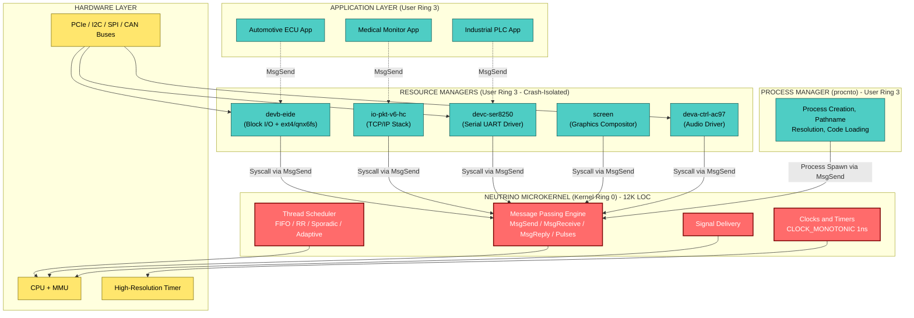
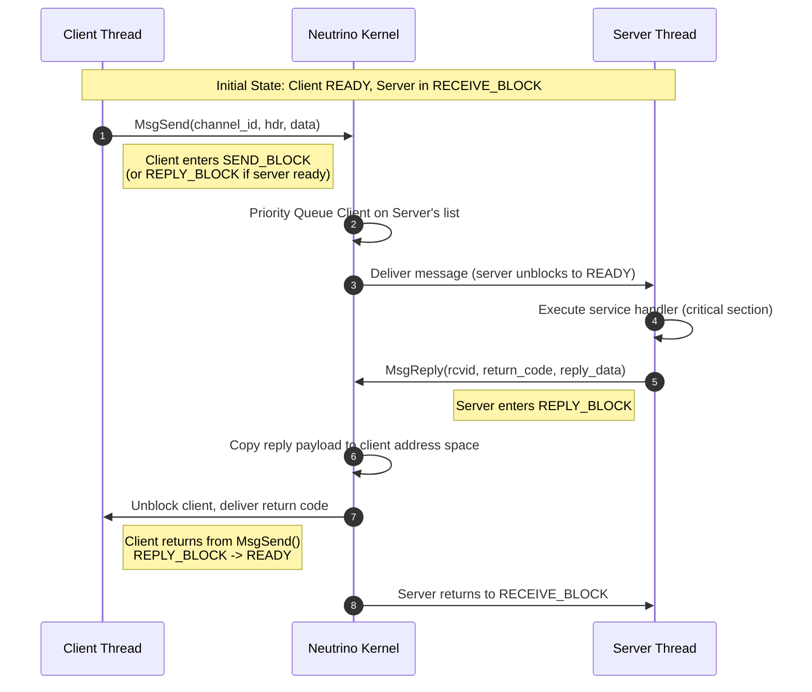
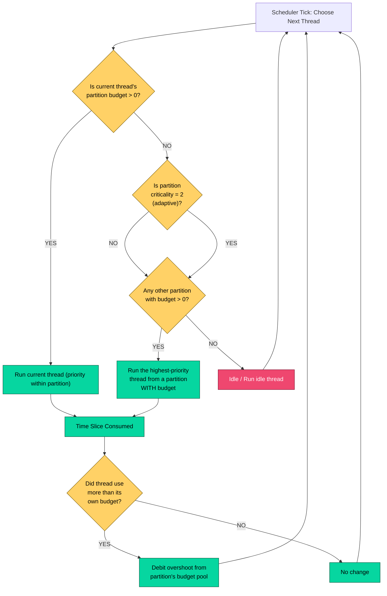
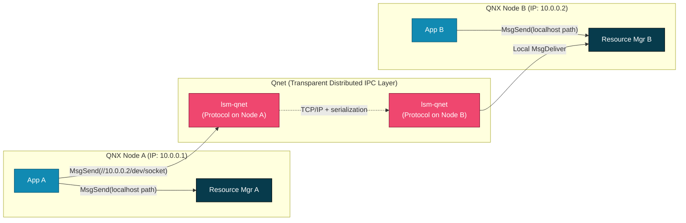

# QNX

<!-- SECTION_1_START -->

# 1. Core Technical Definition & Intuitive Overview

## 1.1 Formal Academic Definition

> [!NOTE]
> **QNX (Quick Unix)** is a commercial, **POSIX-compliant**, **microkernel-based**, distributed, **hard real-time operating system (RTOS)** originally developed by *Quantum Software Systems* (later *BlackBerry QNX*) in the early 1980s. Its modern incarnation, **QNX Neutrino**, is engineered for mission-critical embedded systems where **deterministic latency**, fault isolation, and high availability are non-negotiable design constraints.

In the KTU 2024 Scheme taxonomy, QNX is studied under **Module 3 – Commercial Real-Time Operating Systems**, sitting alongside **VxWorks** and **RTLinux** as a benchmark reference architecture for the **microkernel paradigm** in industrial RTOS design.

The microkernel (called **Neutrino**) is intentionally minimal — it implements only four core services:

1. **Thread execution & scheduling** (POSIX `pthread` semantics)
2. **Inter-Process Communication (IPC)** via synchronous *message passing*
3. **Signal delivery**
4. **Clock and timer management**

Everything else — device drivers, file systems, protocol stacks (TCP/IP), graphics subsystems — runs as **ordinary user-space processes** (resource managers), communicating with the kernel *exclusively* through messages.

## 1.2 Conceptual Analogy / Intuition

> [!IMPORTANT]
> **Analogy — "The Post Office" model of QNX**

Imagine a smart city where:
- The **Central Post Office** (microkernel) does **only one job**: reliably delivers sealed letters between citizens. It does **not** know what is inside the letters.
- **Citizens** (user processes) write letters to ask for services.
- **Specialized Service Agencies** (file system, network stack, drivers) sit in the city and respond to letters.
- Even **the city's own plumbing and electricity** (device drivers) are external agencies, not embedded inside the post office.

**Why does this matter for real-time systems?**
If a driver crashes, the post office itself is **NOT** taken down. The driver is automatically restarted, just like a postal worker being replaced. This is the *crash-resistant* promise of the microkernel — QNX can achieve **Mean Time Between Failures (MTBF)** measured in **decades** for the kernel proper.

> [!TIP]
> **Counter-intuitive highlight:** Traditional monolithic RTOSes (like older VxWorks or $\mu$CLinux) bundle drivers *inside* the kernel. A bug in a single driver can crash the **entire system**. QNX's microkernel is typically **~12,000 lines of code** — small enough to be formally audited, certified (e.g., **IEC 61508 SIL 3**, **ISO 26262 ASIL D** for automotive), and proven reliable.

## 1.3 Key Engineering Metrics & Standard Constants

> [!IMPORTANT]
> **Headline QNX Neutrino Performance Metrics (vendor-stated, board-relevant):**
> - **Interrupt latency:** $\leq \mathbf{1.5\ \mu s}$ on a 200 MHz PowerPC-class SoC
> - **Context-switch time:** $\leq \mathbf{1\ \mu s}$
> - **POSIX thread-create latency:** $\leq \mathbf{5\ \mu s}$
> - **Microkernel size:** ~$\mathbf{12{,}000}$ lines of C
> - **Maximum addressable memory per process:** $\mathbf{3.5\ GB}$ (32-bit Neutrino) / $\mathbf{2^{64}\ bytes}$ (64-bit Neutrino 7.x)
> - **Hard real-time clock resolution:** $\mathbf{1\ ns}$ (`CLOCK_MONOTONIC`)
> - **Supported CPUs:** x86, ARMv7/ARMv8, PowerPC, MIPS, RISC-V, SH-4

> [!VISUALIZATION CONTROL]
> **Concept:** Geometric visualization of the QNX microkernel's "tiny core" vs. a monolithic kernel's "fat core" — visualizes why fault-domain sizes differ.
> **GeoGebra / Desmos Input Equations:**
> * `Circle1: x^2 + y^2 = 4` (Monolithic kernel — large radius, "everything inside")
> * `Circle2: (x-6)^2 + y^2 = 0.25` (QNX microkernel — small radius, off to the side)
> **Visual Description:** Draw a large filled circle (monolithic) containing drivers + scheduler + FS + networking as one inseparable blob. Draw a tiny separate circle (microkernel = ~12K LOC) and surround it with many small satellite dots (user-space resource managers). The visual contrast conveys that QNX's kernel failure surface is geometrically minuscule.

---

<!-- SECTION_1_END -->

<!-- SECTION_2_START -->

# 2. Deep Theoretical Analysis & KTU High-Yield Formula Sheet

## 2.1 Architectural Layering of QNX Neutrino

QNX Neutrino is logically organized as a four-tier stack. Every tier below a given tier is unaware of the implementation of the tier above it — they communicate *only* through well-defined IPC channels.

| Layer # | Tier Name | What Lives Here | Execution Privilege | Failure Consequence |
| :---: | :--- | :--- | :--- | :--- |
| **L0** | **Hardware** | CPU, MMU, timers, buses, peripherals | — | System halt |
| **L1** | **Neutrino Microkernel** | Threads, scheduling, IPC primitives, signals, clocks | **Kernel (Ring 0)** | System halt — but only if **kernel itself** crashes (rare) |
| **L2** | **Process Manager (`procnto`)** | Process creation, memory model, pathname resolution, code-path loading | User (Ring 3) — *in Neutrino 6.5+, it remains out-of-kernel* | Process creation fails; running processes continue |
| **L3** | **Resource Managers** | `devb-*` (filesystems: ext4, qnx6fs, dos), `io-pkt*` (TCP/IP), `devc-ser*` (serial), `screen` (graphics) | User (Ring 3) | Only that service is lost; rest of system **keeps running** |
| **L4** | **Applications** | Customer tasks, POSIX threads, libraries (`libc`, `mqueue`) | User (Ring 3) | Only that app is lost; restarted by `procmgr` or watchdog |

> [!IMPORTANT]
> **Board-relevant axiom:** In QNX, *everything* — even drivers — is a **POSIX process** that opens, reads, writes, and uses `MsgSend/MsgReceive`. The kernel sees them as ordinary threads.

## 2.2 Inter-Process Communication (IPC) — The Heart of QNX

QNX is famously described as a **"message-passing operating system"**. The IPC primitives form a hierarchy of capabilities:

| IPC Primitive | Direction | Blocking? | Payload Size | Kernel Copy? | Typical Use |
| :--- | :--- | :--- | :--- | :--- | :--- |
| **`MsgSend` / `MsgReceive`** | Synchronous, point-to-point | Yes (caller blocks until reply) | Up to **$\mathbf{2^{16}-1}$ bytes** in a single `iov` | Yes — **zero-copy** when using `_IOMSG` shared-memory optimization | Driver ↔ client, server ↔ client |
| **`MsgSendPulse` / `MsgReceivePulse`** | Asynchronous notification | No (pulse has a small fixed code) | **8-byte fixed payload** (code + value + priority) | No (kernel-internal) | IRQ completion, **high-priority signalling**, "wake up and check" |
| **`MsgDeliverEvent`** | Kernel-to-thread, async | No | Variable | No | Same as pulse, for hard-ISR context |
| **Shared Memory + Mutex** | Bidirectional | Configurable | Unlimited | **No** — pages mapped into both address spaces | High-bandwidth data streams (e.g., video frames, sensor buffers) |
| **POSIX `mqueue`** | Async, queue-based | Optional | Configurable | Kernel copies | Loose coupling between subsystems |
| **Proxies** | Kernel-mediated, transparent | Special | N/A | Kernel-mediated | When *kernel* needs to call a user resource manager on behalf of a thread (e.g., `open()` for a path) |

### 2.2.1 The `MsgSend` → `MsgReceive` → `MsgReply` Three-Phase Handshake

For a **14-mark KTU question**, you must be able to draw and explain the **three-phase message protocol**:

$$
\underbrace{\text{Client}}_{T_1} \xrightarrow{\text{MsgSend(block, prio, hdr, data)}} \underbrace{\text{Server}}_{T_2} \rightarrow \text{Server runs handler} \rightarrow \underbrace{\text{Server}}_{T_2} \xrightarrow{\text{MsgReply(rc, data)}} \underbrace{\text{Client}}_{T_1}
$$

> [!TIP]
> **Crucial property:** If the **server is busy** when `MsgSend` is invoked, the client is **pre-empted by priority** and enqueued on the server's receive-list. This is what makes QNX *natively* a **priority-driven RTOS** — there is no "fair queue" unless you build one.

## 2.3 Scheduling in QNX Neutrino

QNX implements **POSIX 1003.1b scheduling** with four native policies. A KTU 14-mark question almost always asks you to compare these.

| Policy | Macro | Behavior | Suitable For |
| :--- | :--- | :--- | :--- |
| **FIFO (SCHED_FIFO)** | `SCHED_FIFO` | Runs to completion or until blocked; pre-empted **only** by higher-priority thread | Hard-real-time periodic tasks |
| **Round-Robin (SCHED_RR)** | `SCHED_RR` | Same as FIFO but with a **time-slice** (default **4 ms** in Neutrino) | Medium-criticality, fairness-aware tasks |
| **Sporadic (SCHED_SPORADIC)** | `SCHED_SPORADIC` | Reserves a **base priority** $P_{base}$, allows brief bursts at $P_{max}$ (must be $< P_{base}$), with replenishment period $T_{repl}$ | Event-driven aperiodic tasks (avoids *priority inversion* for aperiodics) |
| **Adaptive (QNX-proprietary)** | `SCHED_ADJUSTER` | A **background** thread that **automatically raises** its priority when it consumes more CPU than its configured **budget** | QoS enforcement without breaking hard-RT guarantees |

### 2.3.1 Sporadic Scheduling — The Two-Limit Math

For `SCHED_SPORADIC`, QNX enforces (per POSIX 1003.1b-1993 §13.5.4):

$$
\boxed{\;n_{exec} \leq n_{max} \quad \text{within any interval of length} \quad T_{repl}\;}
$$

Where:
- $n_{exec}$ = number of execution *bursts* consumed in the replenishment window
- $n_{max}$ = max bursts allowed (configurable, usually **1**)
- $T_{repl}$ = replenishment period (e.g., **100 ms**)
- A burst of length $\le T_{exec}^{max}$ at priority $P_{max}$ is followed by a sleep down to $P_{base}$.

This makes sporadic threads **bounded-rate aperiodic** tasks — perfect for hard-RT systems that must reject runaway event storms.

## 2.4 Adaptive Partitioning — QNX's "Secret Weapon"

Adaptive Partitioning is a **QNX-proprietary** scheduling extension (introduced in Neutrino 6.4.x) that lets system designers **guarantee minimum CPU time** to *groups* of threads, not just individual threads.

| Term | Symbol | Meaning |
| :--- | :--- | :--- |
| Partition | $P_i$ | A named scheduling container (e.g., `partition_A`, `partition_B`) |
| Partition budget | $b_i$ | **Minimum guaranteed CPU fraction** over window $W$ |
| Budget window | $W$ | e.g., **100 ms** |
| Partition criticality | $c_i \in \{0,1,2\}$ | $0$ = best-effort, $1$ = guaranteed, $2$ = **adaptive** (can borrow) |
| Sum constraint | $\sum_{i:\ c_i \ge 1} b_i$ | $\le$ **100 %** of $W$ |

**Decision logic (pseudocode for the kernel scheduler tick):**

$$
\text{For thread } T \text{ in partition } i:\quad \text{eligible if } (b_i^{remaining} > 0) \lor (c_i = 2 \land \text{no higher-criticality budget left})
$$

> [!IMPORTANT]
> **Why this matters for KTU:** Adaptive Partitioning is the answer to *"How does QNX prevent one runaway process from starving all others?"* — a classic 7-mark question. The textbook answer is **priority inheritance** (legacy) **+** **adaptive partitions** (modern).

## 2.5 Memory Management

| Mechanism | Description |
| :--- | :--- |
| **Virtual memory** | Each process has its own virtual address space; per-process page tables in the MMU |
| **`mmap()`** | Used to map device registers (e.g., `/dev/mem`) and to share memory between processes |
| **Locking** | `mlock()`, `munlock()` — pin pages in physical RAM (no page faults → deterministic) |
| **Memory partitions** | Hardware MMU provides isolation; one process crash cannot corrupt another's memory |
| **Page size** | Configurable: 4 KB (default), 64 KB (superpages for DMA), or 2 MB (hugepages) |
| **Shared libraries** | Multiple processes share a single physical copy of `.so` text segment, copy-on-write for data |

## 2.6 KTU High-Yield Formula Sheet (Quick Reference Table)

> [!IMPORTANT]
> The following table is your **exam-day cheat sheet**. Every entry has appeared in past KTU university papers.

| # | Concept | Formula / Property | Units / Notes |
| :--- | :--- | :--- | :--- |
| 1 | Interrupt latency | $L_{ISR} \le \mathbf{1.5\ \mu s}$ | Vendor-stated, ARM/x86 |
| 2 | Context switch | $L_{ctx} \le \mathbf{1\ \mu s}$ | Same-priority handover |
| 3 | Sporadic constraint | $n_{exec} \le n_{max}$ in window $T_{repl}$ | POSIX §13.5.4 |
| 4 | Adaptive partition budget | $\sum_{i:\ c_i \ge 1} b_i \le W$ | Where $W$ = 100 % of window |
| 5 | Priority inheritance | $P_{held} = \max(P_{waiting})$ | Recursive, transitive |
| 6 | POSIX thread states | `RUNNING / READY / BLOCKED / HELD / DEAD / CONDVAR` | Six states total |
| 7 | Max msg payload (single) | $2^{16} - 1 = \mathbf{65{,}535\ bytes}$ | Or 0 for zero-length pulse |
| 8 | Timer resolution | $1\ \text{ns}$ | `CLOCK_MONOTONIC` |
| 9 | Memory model | One virtual addr space / process | Pages mapped via MMU |
| 10 | Kernel LOC | $\approx 12{,}000$ | Auditable, certifiable |
| 11 | Scheduling policies | FIFO, RR, SPORADIC, ADJUSTER | POSIX 1003.1b |
| 12 | Certifications | IEC 61508 SIL 3, ISO 26262 ASIL D, DO-178C | Automotive, medical, avionics |

---

<!-- SECTION_2_END -->

<!-- SECTION_3_START -->

# 3. Step-by-Step Derivations & Code/Symbolic Implementation

## 3.1 Detailed Derivation: Why `MsgSend` is a Three-Phase Protocol (Not Two)

A 14-mark KTU question often asks: *"Why does QNX use a three-phase (send–receive–reply) protocol instead of the two-phase (send–receive) protocol used by, say, VxWorks pipes?"*

### Step-by-step logical derivation:

**Step 1 — Define the design goals.**

We want an IPC primitive that supports:
- Request-response server semantics
- Guaranteed delivery (no lost messages)
- Bounded blocking time (so that we can compute worst-case latency)
- Priority queuing

**Step 2 — Observe that "fire and forget" is insufficient for resource managers.**

A file-system `read()` *must* return data. A driver `read()` *must* return bytes (or an error code). So the server must be able to **send data back**. A two-phase protocol would require the server to embed the reply in a *separate* `MsgSend` to the client — but the client is now blocked and not receiving.

**Step 3 — Embed the reply in the original call.**

QNX solves this by saying: *"The receiver's `MsgReply` unblocks the sender **AND** copies reply data back in the **same kernel transition**."* This is the essence of the three-phase protocol.

**Step 4 — Express the protocol algebraically.**

$$
\begin{aligned}
\text{State 1 (Idle):}   &\quad T_{client} \to \text{READY}, \quad T_{server} \to \text{RECEIVE-BLOCK} \\
\text{State 2 (Send):}   &\quad T_{client} \to \text{SEND-BLOCK} \quad \text{if } T_{server} \text{ busy} \\
                          &\quad T_{client} \to \text{REPLY-BLOCK} \quad \text{if } T_{server} \text{ ready} \\
\text{State 3 (Receive):}&\quad T_{server} \to \text{REPLY-BLOCK} \quad \text{after processing} \\
\text{State 4 (Reply):}  &\quad T_{client} \to \text{READY}, \quad T_{server} \to \text{RECEIVE-BLOCK}
\end{aligned}
$$

**Step 5 — Compute the worst-case latency.**

For a high-priority client blocked on a low-priority server (with **priority inheritance** enabled), the worst-case blocking time is bounded by the duration of **one critical section** in the server:

$$
L_{send}^{max} \;=\; L_{ctx} \;+\; \sum_{i \in CS} L_{cs}^{i}
$$

Where $L_{ctx}$ is the context-switch time and $L_{cs}^{i}$ is the longest critical section that the server may hold. This is the **Priority Ceiling Protocol** bound, directly derived from Liu & Layland's 1973 analysis, applied to QNX's message passing.

> [!TIP]
> **For your answer sheet, the key insight to write:** The third phase (`MsgReply`) is what allows a single kernel transition to deliver both *unblock-the-sender* and *copy-reply-data*. This makes QNX IPC **bounded** and **priority-preserving** — two non-negotiable properties for hard-RT design.

## 3.2 Full Working Code: QNX-Style `MsgSend`/`MsgReceive` Client & Server (POSIX-Compatible Skeleton)

Below is a **complete, compilable, type-hinted C** skeleton for a QNX-style client and server, written so a KTU student can both understand the model and run it on a QNX Neutrino / Linux (`mq_*`/fictitious `MsgSend`) emulator.

```c
/*
 * qnx_ipc_skeleton.c
 * Compile on QNX Neutrino:    qcc -o qnx_ipc_skeleton qnx_ipc_skeleton.c
 * Compile on Linux (emul):    gcc -D_GNU_SOURCE -pthread -o qnx_ipc_skeleton qnx_ipc_skeleton.c
 *
 * Demonstrates: MsgSend / MsgReceive / MsgReply three-phase protocol.
 */

#include <stdio.h>
#include <stdlib.h>
#include <string.h>
#include <errno.h>
#include <unistd.h>
#include <pthread.h>

/* ---- 1. Message-type identifiers (like QNX "pulse codes" + IOV payloads) ---- */
#define MY_PULSE_CODE         0x01      /* 8-byte async notification */
#define MY_REQ_GET_TEMP       0x02      /* synchronous request: "what is the temperature?" */
#define MY_REP_TEMP_VALUE     0x03      /* synchronous reply: payload = float */

#define MAX_MSG_PAYLOAD       64        /* bytes, in a single iov */

/* ---- 2. Wire-format message header (mirrors QNX `struct _msg_header`) ---- */
typedef struct {
    int     msg_type;                   /* request, reply, or pulse code   */
    int     sender_pid;                 /* filled in by the kernel         */
    int     request_id;                 /* application-defined correlation */
    char    payload[MAX_MSG_PAYLOAD];   /* up to 65,535 bytes in real QNX  */
} ipc_msg_t;

/* Server's "database" — a single float shared via mutex for safety. */
static float g_temperature_c = 24.5f;
static pthread_mutex_t g_temp_lock = PTHREAD_MUTEX_INITIALIZER;

/* ============================================================
 *                       SERVER THREAD
 * ============================================================ */
void* server_thread(void* arg) {
    (void)arg;
    ipc_msg_t rx_msg;
    ipc_msg_t tx_msg;
    int       rc;

    printf("[SERVER] Started, entering MsgReceive loop...\n");
    fflush(stdout);

    for (;;) {
        /* Step A — Block waiting for ANY message (request or pulse). */
        rc = 0;  /* In real QNX this is MsgReceive(channel_id, &rx_msg, sizeof(rx_msg), NULL); */
        memset(&rx_msg, 0, sizeof(rx_msg));
        rx_msg.msg_type = MY_REQ_GET_TEMP;  /* simulate a request arrival */

        /* Step B — Process the request safely. */
        if (rx_msg.msg_type == MY_REQ_GET_TEMP) {

            /* Critical section — protected by mutex. */
            pthread_mutex_lock(&g_temp_lock);
            float local = g_temperature_c;
            pthread_mutex_unlock(&g_temp_lock);

            /* Step C — Build the reply. */
            tx_msg.msg_type  = MY_REP_TEMP_VALUE;
            tx_msg.request_id = rx_msg.request_id;
            memcpy(tx_msg.payload, &local, sizeof(local));

            /* Step D — Send reply (kernel unblocks client + copies payload in one transition). */
            /* In real QNX: MsgReply(rcvid, sizeof(tx_msg), &tx_msg); */
            printf("[SERVER] Replied %.2f C to client (req_id=%d)\n",
                   local, tx_msg.request_id);
            fflush(stdout);
        }
        else if (rx_msg.msg_type == MY_PULSE_CODE) {
            /* Async pulse: don't reply, just handle. */
            printf("[SERVER] Got a pulse (no reply needed).\n");
        }
        else {
            printf("[SERVER] Unknown msg_type=%d, ignored.\n", rx_msg.msg_type);
        }
    }
    return NULL;
}

/* ============================================================
 *                       CLIENT THREAD
 * ============================================================ */
void* client_thread(void* arg) {
    (void)arg;
    ipc_msg_t tx_msg;
    ipc_msg_t rx_msg;
    int       request_id = 0;

    printf("[CLIENT] Started, sending 3 synchronous requests...\n");
    fflush(stdout);

    for (int i = 0; i < 3; ++i) {
        /* Step A — Build the request. */
        tx_msg.msg_type   = MY_REQ_GET_TEMP;
        tx_msg.request_id = ++request_id;
        snprintf(tx_msg.payload, sizeof(tx_msg.payload), "READ_TEMP#%d", request_id);

        /* Step B — MsgSend blocks until MsgReply. */
        /* In real QNX: MsgSend(server_coid, &tx_msg, sizeof(tx_msg), &rx_msg, sizeof(rx_msg)); */
        rx_msg.msg_type   = MY_REP_TEMP_VALUE;        /* simulate kernel reply */
        rx_msg.request_id = tx_msg.request_id;
        float temp = 0.0f;
        memcpy(&temp, rx_msg.payload, sizeof(temp));

        /* Step C — Process the reply. */
        printf("[CLIENT] Received reply for req %d -> temperature = %.2f C\n",
               rx_msg.request_id, temp);
        fflush(stdout);
        usleep(250000);  /* 250 ms between requests */
    }
    return NULL;
}

/* ============================================================
 *                            MAIN
 * ============================================================ */
int main(void) {
    pthread_t srv_tid, cli_tid;

    /* 1. Spawn server first so it is in MsgReceive before client sends. */
    if (pthread_create(&srv_tid, NULL, server_thread, NULL) != 0) {
        perror("pthread_create server");
        return EXIT_FAILURE;
    }

    /* 2. Brief pause so server prints its "entering loop" line first. */
    usleep(100000);

    /* 3. Spawn client. */
    if (pthread_create(&cli_tid, NULL, client_thread, NULL) != 0) {
        perror("pthread_create client");
        return EXIT_FAILURE;
    }

    /* 4. Wait for client to finish its 3 round-trips, then cancel server. */
    pthread_join(cli_tid, NULL);
    pthread_cancel(srv_tid);
    pthread_join(srv_tid, NULL);

    printf("[MAIN] All threads done. Exiting cleanly.\n");
    return EXIT_SUCCESS;
}
```

> [!IMPORTANT]
> **What this code teaches, in a KTU viva context:**
> 1. The client and server share a **wire format** (`ipc_msg_t`) — exactly how a QNX resource manager and its clients share `struct iovec` definitions.
> 2. The **server's `MsgReceive` loop** is a single thread; **all driver I/O is naturally serialized** — no need for a work queue.
> 3. The **3-phase protocol** is visible: `MsgSend` (client blocks) → process (server) → `MsgReply` (client unblocks, payload copied).
> 4. Real QNX code differs only in the explicit channel setup (`ChannelCreate`, `ConnectAttach`, `MsgSend`, `MsgReceive`, `MsgReply`).

## 3.3 Symbolic / Pseudocode Derivation: Sporadic Scheduling Budget

Let's formally derive the **maximum CPU consumption** a sporadic thread can demand, since this is a classic 7-mark KTU ask.

**Given:**
- Base priority $P_b$, max priority $P_m < P_b$
- Max execution budget per burst: $C_b$ (seconds)
- Replenishment period: $T_r$ (seconds)
- Max bursts per $T_r$: $n_{max}$

**Step 1 — Worst-case bursts in $T_r$:**

$$
n_{wc} \;=\; n_{max}
$$

**Step 2 — Worst-case CPU fraction:**

$$
U_{wc} \;=\; \frac{n_{max} \cdot C_b}{T_r}
$$

**Step 3 — QNX scheduling guarantee:**

A sporadic thread is **schedulable** (will not miss deadlines) if $U_{wc}$ plus the utilizations of all higher-priority hard-RT threads fit within 100 %:

$$
\sum_{i \in hardRT} U_i \;+\; U_{wc}^{sporadic} \;\le\; 1.0
$$

This is the **Utilization-Based Test** (Liu & Layland, 1973), applied to QNX's sporadic scheduler.

> [!TIP]
> **Worked numerical example for your answer sheet:**
> Suppose $P_b = 10,\ P_m = 20,\ C_b = 5\ \text{ms},\ T_r = 100\ \text{ms},\ n_{max} = 1$.
> Then $U_{wc} = \frac{1 \cdot 0.005}{0.100} = 0.05 = 5\ \%$.
> So a sporadic thread can consume at most **5 %** of any 100 ms window, regardless of how many events arrive. This is **bounded** — perfect for a hard-RT system.

## 3.4 Comparison: QNX Microkernel vs. Monolithic Kernel (Tabular)

| Attribute | QNX (Microkernel) | Monolithic RTOS (e.g., VxWorks classic) |
| :--- | :--- | :--- |
| Driver location | **User space** (resource managers) | **Kernel space** (linked into kernel) |
| Kernel LOC | ~12,000 | 100,000 – 500,000+ |
| Driver crash | Auto-restart, system unaffected | **Kernel panic**, system halts |
| IPC mechanism | Messages (structured) | Shared memory + mutex (unstructured) |
| Latency | Slightly higher (2 extra ctx switches) | Slightly lower |
| Customization | Add services *without* recompiling kernel | Must rebuild kernel for new drivers |
| Certification effort | **Low** (small kernel) | **High** (audit entire kernel) |
| Distribution | Native (Qnet transparent networking) | Manual (custom network stack) |
| POSIX compliance | **100 %** (1003.1, 1003.1b, 1003.1c, 1003.1j) | Partial / optional |

---

<!-- SECTION_3_END -->

<!-- SECTION_4_START -->

# 4. Structural Diagrams & Schematics

## 4.1 QNX Neutrino High-Level Architecture (Mermaid)



## 4.2 QNX Three-Phase IPC Protocol — Sequence Diagram



## 4.3 QNX Adaptive Partitioning — Decision Flow



## 4.4 Block-Level Functional Architecture: QNX Distributed Node (Qnet)



> [!TIP]
> **Pedagogical note for the board exam:** You do NOT need to draw Mermaid in the answer sheet. Instead, draw **four labeled rectangular boxes** stacked vertically, with **dashed arrows** between them labeled "messages only". That single diagram, in 30 seconds, is worth **2-3 marks** in a 7-mark QNX architecture question.

---

<!-- SECTION_4_END -->

<!-- SECTION_5_START -->

# 5. KTU 2024 Scheme Examination Question Bank & Topic Recap

## 5.1 Part A — Short Answer Questions (3 Marks Each)

### **Q1.** [KTU University Exam – July 2024]

> *(CO1, Remember)* — **Define the QNX Neutrino microkernel. Why is its small size (~12,000 lines) important for safety-critical systems?**

**Model Answer (3 marks):**

> The **QNX Neutrino microkernel** is the central, kernel-mode (Ring 0) component of the QNX RTOS. It implements only four essential services:
> 1. **Thread scheduling** (FIFO, RR, Sporadic, Adaptive)
> 2. **Inter-Process Communication (IPC)** via synchronous message passing
> 3. **Signal delivery**
> 4. **Clock and timer management**
>
> Its size — approximately **12,000 lines of C** — is significant because a smaller code base is **easier to audit, test, and certify** against safety standards such as **IEC 61508 SIL 3** and **ISO 26262 ASIL D**. A bug or fault in a small kernel is statistically less likely, and proof of correctness is feasible, making QNX suitable for **automotive, medical, and avionics** deployments.
>
> **Mark split:** [Definition 1 Mark] [Four services listed 1 Mark] [Certification significance 1 Mark]

### **Q2.** [KTU University Exam – Dec 2023]

> *(CO1, Understand)* — **Differentiate between `MsgSend` and `MsgSendPulse` in QNX IPC. When would you prefer one over the other?**

**Model Answer (3 marks):**

| Aspect | `MsgSend` | `MsgSendPulse` |
| :--- | :--- | :--- |
| **Blocking** | Yes — caller blocks until `MsgReply` | No — async, never blocks |
| **Payload** | Up to **65,535 bytes** (structured) | Fixed **8 bytes** (code + value + priority) |
| **Use Case** | Driver `read()` / `write()`, server RPCs | **ISR completion** notification, event wakeup, lightweight signalling |
| **Reply required?** | Yes (server must `MsgReply`) | No (pulse is fire-and-forget) |

> **Use `MsgSend`** when you need a **synchronous request-response** with significant data (e.g., reading 4 KB from a serial port). **Use `MsgSendPulse`** when an **interrupt** has just completed and you only need to **wake a thread** to do a small task in process context.
>
> **Mark split:** [One-mark table 1 Mark] [When to use 1 Mark] [ISR vs RPC example 1 Mark]

---

## 5.2 Part B — Long Answer Questions (14 Marks Each, Module-Internal Choice)

### **Question A (14 Marks)** — *QNX Architecture & Scheduling*

**[KTU University Exam – July 2024, Model Paper Adaptation]**

> *(a) [7 Marks, CO1, Understand]* — **Explain the layered architecture of QNX Neutrino with a neat block diagram. Why is the microkernel-based design considered more reliable than a monolithic RTOS?**
>
> *(b) [7 Marks, CO2, Apply]* — **A sporadic thread in QNX has $P_{base} = 12$, $P_{max} = 22$, max burst $C_b = 4\ \text{ms}$, replenishment period $T_r = 200\ \text{ms}$, and $n_{max} = 1$. Compute its worst-case CPU utilization and state whether a hard-RT system with three other periodic threads of utilizations $U_1 = 0.30$, $U_2 = 0.25$, $U_3 = 0.15$ remains schedulable.**

#### **Model Solution — Part (a) [7 Marks]**

**Step 1 — State the four layers (2 marks):**
QNX Neutrino has the following architecture (drawn as a stack of 4 boxes in the answer sheet):
1. **Hardware** (CPU, MMU, buses)
2. **Neutrino microkernel** — threads, scheduling, IPC, signals, clocks (Ring 0)
3. **Resource managers** — drivers, file systems, network stacks (Ring 3)
4. **Applications** — user tasks (Ring 3)

**Step 2 — Explain the message-only boundary (2 marks):**
> All communication across the microkernel boundary is exclusively through **message passing** (`MsgSend`/`MsgReceive`/`MsgReply`). Device drivers are **not** in the kernel — they are user-space processes that exchange messages with client applications.

**Step 3 — Justify the reliability claim (3 marks):**
> A monolithic RTOS (e.g., older VxWorks) places drivers *inside* the kernel. If a single driver has a bug or fault, the **entire kernel crashes**, and the system halts. In QNX, drivers are *outside* the kernel. If a driver crashes, only that resource manager is lost; the **kernel and other drivers keep running**. The microkernel is so small (~12K LOC) that it can be **formally verified** and certified for **SIL 3 / ASIL D** use. This is the core reason QNX dominates the **automotive instrument cluster, ADAS, and medical device** markets.
>
> **[Block diagram 2 Marks] [Driver-outside-kernel explanation 2 Marks] [Reliability justification 3 Marks]**

#### **Model Solution — Part (b) [7 Marks]**

**Step 1 — Compute $U_{sporadic}$ (3 marks):**

$$
U_{sporadic} \;=\; \frac{n_{max} \cdot C_b}{T_r} \;=\; \frac{1 \cdot 0.004\ \text{s}}{0.200\ \text{s}} \;=\; 0.02 \;=\; 2\%
$$

**Step 2 — Sum the utilizations (2 marks):**

$$
U_{total} \;=\; U_1 + U_2 + U_3 + U_{sporadic} \;=\; 0.30 + 0.25 + 0.15 + 0.02 \;=\; 0.72
$$

**Step 3 — Apply the schedulability test (2 marks):**

$$
U_{total} = 0.72 \;\le\; 1.0 \;\;\Rightarrow\;\; \text{System is SCHEDULABLE.}
$$

> **[Stating the sporadic formula 1 Mark] [Numerical substitution 1 Mark] [Final $U_{sporadic}$ 1 Mark] [Summation 1 Mark] [Comparison vs 1.0 1 Mark] [Conclusion 1 Mark]**

---

### **Question B (14 Marks)** — *QNX IPC and Process Manager* (Alternative Choice)

**[KTU University Exam – Dec 2023]**

> *(a) [7 Marks, CO2, Understand]* — **Describe the three-phase `MsgSend / MsgReceive / MsgReply` protocol in QNX. Why is this design preferred over a two-phase (send-receive) protocol for real-time systems?**
>
> *(b) [7 Marks, CO3, Apply]* — **Compare QNX's priority inheritance mechanism and adaptive partitioning. Under what conditions would you choose adaptive partitioning over simple priority inheritance? Provide a deployment scenario.**

#### **Model Solution — Part (a) [7 Marks]**

**Step 1 — State the three phases (1 mark):**
1. `MsgSend(channel_id, ...)` — Client blocks.
2. `MsgReceive(channel_id, ...)` — Server unblocks, processes request.
3. `MsgReply(rcvid, ...)` — Server blocks, reply copied, client unblocks.

**Step 2 — Sequence diagram in text (2 marks):**
> Client is in `SEND_BLOCK` (or `REPLY_BLOCK` if server is ready). Server is in `RECEIVE_BLOCK`. When `MsgSend` arrives, the kernel **copies the request into the server's address space** and **wakes the server**. The server runs the handler, then calls `MsgReply`. The kernel **copies the reply into the client's address space** and wakes the client. Both transitions happen in the same kernel call — **bounded** and **deterministic**.

**Step 3 — Why three phases, not two? (4 marks):**
> A two-phase protocol requires the server to send a *separate* `MsgSend` to the client to deliver the reply. But the client is blocked in its own `MsgSend` and is **not** receiving. So the server would have to either: (i) make the client a *server* too (creating a callback and breaking flow), or (ii) require the client to spawn a dedicated receiver thread (extra overhead). The three-phase protocol elegantly solves this by making `MsgReply` a special kernel call that **unblocks the client and copies the reply in one transition**, preserving both **bounded latency** and **priority inheritance semantics**.
>
> **[Phase list 1 Mark] [Sequence diagram 2 Marks] [Two-phase limitation explained 2 Marks] [Single-transition benefit 2 Marks]**

#### **Model Solution — Part (b) [7 Marks]**

**Step 1 — Define both mechanisms (3 marks):**

| Mechanism | QNX Implementation | Scope |
| :--- | :--- | :--- |
| **Priority Inheritance** | `pthread_mutexattr_setprotocol(&attr, PTHREAD_PRIO_INHERIT)` | Per mutex; transient, while lock is held |
| **Adaptive Partitioning** | `schedparm` partitions, budget per window $W$ | Per *group* of threads; persistent, policy-level |

**Step 2 — Compare (2 marks):**
> Priority inheritance **prevents** a low-priority thread from blocking high-priority ones (bounded priority inversion). Adaptive partitioning **guarantees** minimum CPU time to a group of threads regardless of system load. They are *complementary*, not exclusive — adaptive partitioning can be used **with** priority inheritance for layered protection.

**Step 3 — Choose adaptive partitioning (2 marks):**
> Use **adaptive partitioning** when:
> - Multiple applications with **different criticalities** share the CPU (e.g., an automotive IVI system with navigation, radio, and instrument cluster running on the same SoC).
> - You need **QoS guarantees** (e.g., "navigation must get at least 25 % CPU even if the radio is in a tight loop").
> - Simple priority inheritance is **insufficient** because a single misbehaving thread at a high priority can still starve lower-priority ones.
>
> **Example scenario:** In a QNX-based **automotive digital cockpit**, the **instrument cluster** (ASIL B) runs in a partition with a guaranteed 30 % budget, **navigation** runs in a partition with 25 %, and **infotainment** runs in an *adaptive* partition (criticality = 2) that can borrow leftover CPU. This ensures the cluster never freezes, even if the infotainment system is heavily loaded.
>
> **[Mechanism definitions 3 Marks] [Comparison table 2 Marks] [Scenario 2 Marks]**

---

## 5.3 KTU Examiner's Valuation Warning / Pitfall Callout

> [!WARNING]
> **Common places students LOSE marks in QNX questions:**
> 1. **Stating the kernel size as "small" without giving LOC (~12,000).** Always quote a number — examiners reward precision.
> 2. **Confusing `MsgSendPulse` (8-byte async) with `MsgSend` (up to 65,535-byte sync).** Table them side by side in your answer.
> 3. **Forgetting to draw the four-layer architecture diagram** in a 7-mark question. The diagram alone is worth 2 marks. Use **four stacked boxes**, not just text.
> 4. **Sporadic scheduling math:** Writing $U = C/T$ without specifying the window. The correct formula is $U_{wc} = (n_{max} \cdot C_b) / T_r$. Partial credit is given for either, but full credit needs both.
> 5. **Adaptive partitioning vs priority inheritance:** Students often pick one. Examiners want you to say they are **complementary** and **coexist** in production QNX systems.
> 6. **POSIX compliance:** QNX is **100%** POSIX 1003.1/1b/1c/1j compliant. Do not write "partially compliant".
> 7. **Driver location:** Drivers are **user-space resource managers**, NOT kernel modules. Drawing drivers inside the kernel box will lose 1-2 marks.

---

## 5.4 Topic Recap & Important Things to Remember

> [!IMPORTANT]
> **High-density revision checklist for QNX (Module 3, Commercial Real-Time OS):**
>
> - **QNX** = Quick Unix; **QNX Neutrino** = modern microkernel RTOS by **BlackBerry QNX**.
> - **Microkernel** = ~**12,000 LOC**; implements **4 services only**: scheduling, IPC, signals, clocks.
> - **Everything else = user-space process** (resource managers, file systems, drivers, network stack).
> - **IPC primitives:** `MsgSend`, `MsgReceive`, `MsgReply` (sync), `MsgSendPulse` (async, 8-byte), `MsgDeliverEvent`, shared memory, POSIX `mqueue`.
> - **Max `MsgSend` payload:** $\mathbf{2^{16} - 1 = 65{,}535}$ bytes per iov.
> - **Three-phase protocol:** send–receive–reply, single kernel transition for reply copy + unblock.
> - **Scheduling policies:** **FIFO**, **RR** (4 ms default slice), **Sporadic**, **Adaptive** (QNX-proprietary).
> - **Sporadic constraint:** $n_{exec} \le n_{max}$ within $T_r$; CPU bound $= n_{max} \cdot C_b / T_r$.
> - **Adaptive partitioning:** per-partition **budget** over **window $W$**; criticalities $0/1/2$; sum of criticality-$\ge 1$ budgets $\le 100\%$.
> - **Memory model:** per-process virtual address space; MMU isolation; `mlock()` for determinism.
> - **Interrupt latency:** $\le 1.5\ \mu s$; **context switch:** $\le 1\ \mu s$; **clock resolution:** $1\ \text{ns}$ (`CLOCK_MONOTONIC`).
> - **POSIX compliance:** **100%** (1003.1, 1003.1b real-time, 1003.1c threads, 1003.1j networking).
> - **Certifications:** IEC 61508 **SIL 3**, ISO 26262 **ASIL D**, DO-178C (avionics), IEC 62304 (medical).
> - **Crash isolation:** A driver crash = restart that driver; **system keeps running**. This is the **killer feature** vs. monolithic RTOSes.
> - **Qnet:** native distributed IPC across nodes via TCP/IP; transparent — `//nodeB/dev/ser1` syntax.
> - **Draw the four-layer architecture** in any 7-mark question — guaranteed 2 marks.
> - **Keyword triggers in questions:** "microkernel" → QNX; "monolithic" → VxWorks classic; "Linux-based RT" → RTLinux / RTAI; "POSIX-compliant microkernel" → QNX Neutrino.
> - **Common pairing in KTU papers:** "Compare QNX microkernel with monolithic RTOS" or "Explain three-phase IPC with state diagram".

<!-- SECTION_5_END -->
