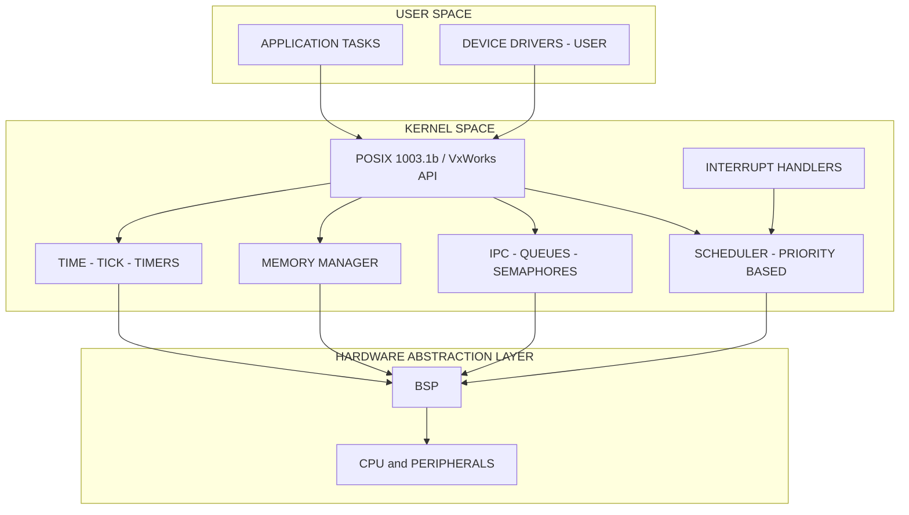
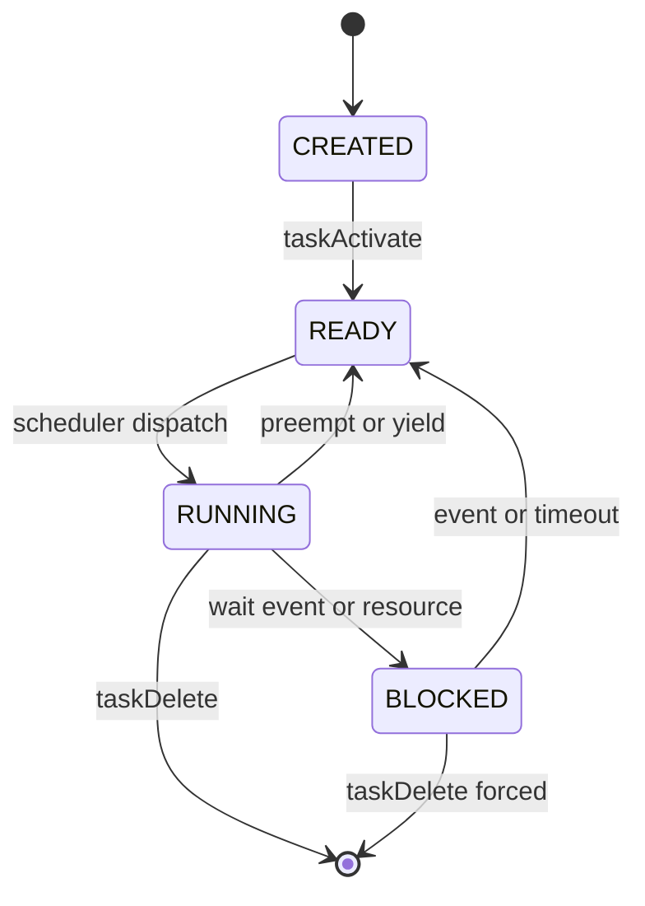
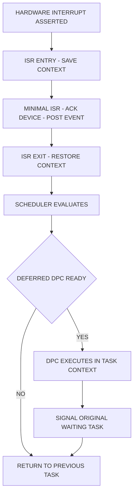
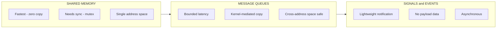

# Real-Time OS: OS services

<!-- SECTION_1_START -->
# Real-Time Operating System Services

## 1.1 Core Technical Definition

> [!IMPORTANT]
> **OS Services (KTU 2024 Definition):** Operating System Services in a Real-Time Operating System (RTOS) are the fundamental set of system calls, kernel routines, and management primitives that the kernel exposes to application tasks to enable deterministic task creation, scheduling, synchronization, inter-task communication, timing, and resource allocation — all bounded by a guaranteed worst-case response time.

In a **commercial RTOS** (such as **VxWorks**, **RTEMS**, **FreeRTOS**, **QNX**, **LynxOS**), these services are typically grouped under a well-defined **POSIX 1003.1b/1c compliant** API layer, ensuring portability and determinism.

The two principal design philosophies that govern how an RTOS offers its services are:

- **Monolithic Kernel Architecture** (e.g., **VxWorks**, **RTEMS**): All services — including scheduling, file system, networking, and device drivers — reside in a single privileged address space, yielding the **lowest interrupt latency** (typically **< 1 μs** in VxWorks on PowerPC).
- **Microkernel Architecture** (e.g., **QNX Neutrino**): Only essential services (IPC, scheduling, low-level interrupt handling) remain in kernel space; everything else runs as user-space servers, providing high reliability at a small latency cost.

> [!NOTE]
> **KTU 2024 Syllabus Highlight:** Under the "Commercial Real-Time Operating Systems" module, students are required to compare services across at least two commercial RTOS families and identify the trade-off between **determinism**, **footprint**, and **throughput**.

## 1.2 Intuitive Analogy

> [!TIP]
> **Library Analogy — The 24-Hour Reference Library**
> Imagine a 24-hour reference library where every book must be handed out within a strict time bound (say, **5 minutes** for a rare book). The **librarian (the RTOS kernel)** is the only person allowed to manage the shelves. The library's *services* are: (1) **Registration** (task creation), (2) **Queue token** (semaphores/mutexes), (3) **Reservation desk** (mailboxes/queues for IPC), (4) **Time-stamping** (system tick and timers), (5) **Priority lane** (priority inheritance), and (6) **Emergency bell** (interrupt handling). The librarian's *contract* is not to give the *fastest* service overall, but to guarantee that the *worst-case* service delay never exceeds the promised limit. That contract is what distinguishes an RTOS from a general-purpose OS (GPOS), whose contract is "best effort."

## 1.3 Standard Performance Metrics (Bolded)

- **Interrupt Latency:** $T_{IL}$ — time from interrupt assertion to first instruction of ISR. Typical: **1 μs to 10 μs**.
- **Context Switch Time:** $T_{CS}$ — time to save current task context and load the next. Typical: **5 μs to 20 μs**.
- **Worst-Case Execution Time (WCET):** $T_{WCET}$ — upper bound on a task's CPU usage.
- **Jitter:** $J = T_{max} - T_{min}$ — variation in periodic task release times.
- **Task Response Time:** $T_R$ — time from event to completion of handling task.
- **System Call Latency:** $T_{SC}$ — overhead of entering and exiting the kernel.

> [!WARNING]
> **KTU Examiner Insight:** A common mistake is equating "fast" with "real-time." Real-time means **bounded and predictable**, not merely fast. A 1 ms response with **0 μs jitter** is real-time; a 10 μs response with **±5 μs jitter** may not be.

<!-- SECTION_1_END -->

<!-- SECTION_2_START -->
# Deep Theoretical Analysis & High-Yield Formula Sheet

## 2.1 Taxonomy of RTOS Services

An RTOS exposes its services to user tasks via a well-defined API. The KTU 2024 scheme classifies these into **seven functional categories**:

### 2.1.1 Process / Task Management Services
Responsible for creating, deleting, suspending, resuming, and querying task states. In VxWorks, these are `taskSpawn()`, `taskDelete()`, `taskSuspend()`, `taskResume()`, `taskDelay()`. In POSIX, they map to `pthread_create()`, `pthread_exit()`, `pthread_cancel()`.

**State Transition Model:**

$$\text{CREATED} \;\xrightarrow{\text{activate}}\; \text{READY} \;\xrightarrow{\text{schedule}}\; \text{RUNNING} \;\xrightarrow{\text{event}}\; \text{BLOCKED} \;\xrightarrow{\text{event}}\; \text{READY}$$

A task is *active* once in **READY** state. Only one task per CPU core is in **RUNNING** state at any instant.

### 2.1.2 Memory Management Services
Provides **deterministic** allocation. Two dominant models:

1. **Partition-based allocation** — fixed-size blocks (used in embedded safety-critical systems, e.g., OSEK/VDX).
2. **Buddy-system allocator** — power-of-two sized blocks with $O(1)$ worst-case split/merge.

Fragmentation metric:

$$F = 1 - \frac{\text{Largest free block size}}{\text{Total free memory}}$$

> [!IMPORTANT]
> Commercial RTOSs like **VxWorks** offer a *two-tier* model: a fast deterministic first-fit allocator in kernel space and a POSIX-compliant malloc in user space. This avoids heap fragmentation in long-running control loops.

### 2.1.3 Inter-Process Communication (IPC) Services
Three canonical primitives — **shared memory**, **message queues**, and **signals/events**.

Message passing latency model (microkernel case, e.g., QNX):

$$T_{msg} = T_{copy} + 2 \cdot T_{sched} + T_{context\_switch}$$

where $T_{copy}$ is the data copy overhead, $T_{sched}$ is the scheduler decision time.

### 2.1.4 I/O Management Services
Provides **deterministic device access** via synchronous I/O and asynchronous I/O completion notifications. RTOS device drivers are typically **layered**: BSP (Board Support Package) → Device driver → POSIX interface.

### 2.1.5 Time Management Services
The **system tick** (typically **1 ms** to **10 ms** in commercial RTOSs) drives all time-based services: `taskDelay()`, `sleep()`, periodic timer expiry, time-slicing preemption.

Resolution:

$$T_{tick} = \frac{1}{f_{tick}} \quad \text{where } f_{tick} = \text{Timer counter frequency}$$

### 2.1.6 Interrupt and Exception Handling
Services for installing ISRs, enabling/disabling interrupt levels, and writing **deferred procedure calls (DPCs)** or **task-level interrupt handlers (TLIHs)**. An *ISR* should be short; the *TLIH* completes the work in a task context.

### 2.1.7 Priority and Scheduling Services
Set/query task priorities, choose scheduling algorithm. In **POSIX**, 32 priority levels are mandatory; VxWorks provides **256**.

## 2.2 KTU Formula Sheet

> [!NOTE]
> **Master this table before solving KTU Part B numericals.**

| Concept | Formula / Identity | Symbol Meaning | Typical Units |
|---|---|---|---|
| Interrupt Latency | $T_{IL} = T_{detect} + T_{save} + T_{vector}$ | Detect, save context, fetch vector | $\mu$s |
| Context Switch | $T_{CS} = 2 \cdot T_{reg\_save} + T_{scheduler} + T_{cache\_miss}$ | Save old + load new + cache penalty | $\mu$s |
| CPU Utilization (Rate Monotonic) | $U = \sum_{i=1}^{n} \frac{C_i}{T_i} \leq n \cdot (2^{1/n} - 1)$ | $C_i$ = WCET, $T_i$ = period | dimensionless |
| Liu \& Layland Bound | $U_{max} = n \cdot (2^{1/n} - 1)$ | Maximum schedulable utilization | dimensionless |
| Response Time (Implicit Deadline) | $R_i = C_i + \sum_{j \in hp(i)} \left\lceil \frac{R_i}{T_j} \right\rceil C_j$ | $hp(i)$ = higher-priority tasks | ticks or $\mu$s |
| Message Latency (Microkernel) | $T_{msg} = T_{copy} + 2 T_{sched} + T_{CS}$ | Copy + 2 schedule + 1 switch | $\mu$s |
| Tick Resolution | $f_{tick} = \frac{1}{T_{tick}}$ | Timer frequency | Hz |
| Heap Fragmentation | $F = 1 - \frac{\text{Max free}}{\text{Total free}}$ | External fragmentation ratio | $0 \le F < 1$ |
| Priority Inversion Bound (PCP) | $W_{max} = (m-1) \cdot B$ | $m$ = mutexes, $B$ = blocking time | $\mu$s |
| Throughput | $\eta = \frac{N_{jobs}}{T_{window}}$ | Jobs per unit time | jobs/s |

## 2.3 Engineering Utility

> [!TIP]
> **Industry Use-Cases:** RTOS services underpin **automotive ECUs** (AUTOSAR OS), **avionics** (ARINC 653 partitioned scheduling), **medical devices** (FDA IEC 62304), and **industrial PLCs**. Engineers select services based on **WCET budgets**, **certifiability** (e.g., DO-178C for avionics), and **memory footprint**. A typical automotive ECU runs **VxWorks** or **AUTOSAR OS** on a 32-bit MCU with a **512 KB** kernel footprint and **2 MB** total memory.

> [!NOTE]
> **POSIX 1003.1b Real-Time Extensions:** Introduces `sched_setscheduler()`, `mq_open()`, `sem_init()`, `timer_create()`, `mmap()`, and `mlock()`. Knowledge of POSIX is **mandatory** for KTU 2024 ESE questions on commercial RTOS services.

<!-- SECTION_2_END -->

<!-- SECTION_3_START -->
# Step-by-Step Derivations and Implementation

## 3.1 Derivation: Worst-Case Interrupt Latency

**Goal:** Derive the upper bound on $T_{IL}$ for a priority-interrupt RTOS.

**Step 1 — Identify components.** Interrupt latency decomposes into three sequential phases:

$$T_{IL} = T_{detect} + T_{save} + T_{vector}$$

**Step 2 — Hardware detection time.** The CPU samples interrupt lines on each instruction boundary (or at dedicated interrupt-acknowledge cycles). For a system clock $f_{clk}$:

$$T_{detect} \le \frac{N_{instr}}{f_{clk}}$$

where $N_{instr}$ is the longest uninterrupted instruction sequence (e.g., 1 for single-cycle RISC, up to 32 for complex CISC).

**Step 3 — Context save time.** A minimum of the **program counter (PC)**, **status register (SR)**, and a few **general-purpose registers** must be saved. If $N_{regs}$ registers are saved and each save takes one cycle:

$$T_{save} = \frac{N_{regs}}{f_{clk}}$$

**Step 4 — Vector fetch time.** Most modern MCUs use a **vectored interrupt controller (VIC)** or **NVIC (ARM Cortex-M)**, which loads the ISR address from a hardware table:

$$T_{vector} = \frac{N_{cycles\_vector}}{f_{clk}}$$

**Step 5 — Combine.**

$$\boxed{T_{IL} = \frac{N_{instr} + N_{regs} + N_{cycles\_vector}}{f_{clk}}}$$

**Numerical Example (ARM Cortex-M4 @ 168 MHz, NXP LPC4088):**
- $N_{instr} = 1$ (single-cycle Thumb-2)
- $N_{regs} = 8$ (hardware-stacked: R0–R3, R12, LR, PC, xPSR)
- $N_{cycles\_vector} = 12$ cycles (NVIC tail-chaining penalty)
- $f_{clk} = 168 \times 10^6$ Hz

$$T_{IL} = \frac{1 + 8 + 12}{168 \times 10^6} = \frac{21}{168 \times 10^6} = 125 \text{ ns}$$

**Valuation key points:** [Naming the three components: 1 mark] [Writing the symbolic sum: 2 marks] [Numerical substitution: 1 mark] [Final value: 1 mark] = 5 marks model solution.

## 3.2 Derivation: Response Time for Rate Monotonic Scheduling

**Goal:** Compute the worst-case response time $R_i$ of a task $\tau_i$ under Rate Monotonic Scheduling (RMS).

**Step 1 — Definitions.** Let $C_i$ be the WCET of $\tau_i$, $T_i$ its period, and $hp(i)$ the set of higher-priority tasks.

**Step 2 — Workload equation.** The response time $R_i$ must satisfy the fixed-point equation:

$$R_i = C_i + \sum_{j \in hp(i)} \left\lceil \frac{R_i}{T_j} \right\rceil C_j$$

**Step 3 — Iterative solution.** Start with $R_i^{(0)} = C_i$. Iterate:

$$R_i^{(k+1)} = C_i + \sum_{j \in hp(i)} \left\lceil \frac{R_i^{(k)}}{T_j} \right\rceil C_j$$

The iteration terminates when $R_i^{(k+1)} = R_i^{(k)}$ or $R_i^{(k+1)} > T_i$ (unschedulable).

**Step 4 — Numerical Example.** Consider three tasks:

| Task | $C_i$ | $T_i$ |
|---|---|---|
| $\tau_1$ | 1 | 4 |
| $\tau_2$ | 2 | 6 |
| $\tau_3$ | 3 | 10 |

Check $R_3$ (lowest priority, $hp(3) = \{\tau_1, \tau_2\}$):

- $R_3^{(0)} = 3$
- $R_3^{(1)} = 3 + \lceil 3/4 \rceil \cdot 1 + \lceil 3/6 \rceil \cdot 2 = 3 + 1 + 2 = 6$
- $R_3^{(2)} = 3 + \lceil 6/4 \rceil \cdot 1 + \lceil 6/6 \rceil \cdot 2 = 3 + 2 + 2 = 7$
- $R_3^{(3)} = 3 + \lceil 7/4 \rceil \cdot 1 + \lceil 7/6 \rceil \cdot 2 = 3 + 2 + 4 = 9$
- $R_3^{(4)} = 3 + \lceil 9/4 \rceil \cdot 1 + \lceil 9/6 \rceil \cdot 2 = 3 + 3 + 4 = 10$
- $R_3^{(5)} = 3 + \lceil 10/4 \rceil \cdot 1 + \lceil 10/6 \rceil \cdot 2 = 3 + 3 + 4 = 10$

Fixed point reached: $R_3 = 10$. Since $R_3 \le T_3 = 10$, the task set is **just schedulable** at the deadline.

## 3.3 Code Implementation: Priority Inversion with Priority Inheritance Protocol (PIP)

The following Python simulator models an RTOS scheduler demonstrating **unbounded priority inversion** and the **Priority Inheritance Protocol (PIP)** mitigation, as originally analyzed by Sha, Rajkumar, and Lehoczky (1990).

```python
"""
RTOS Simulator: Demonstrating Priority Inversion and the
Priority Inheritance Protocol (PIP) using POSIX-style services.
"""
from __future__ import annotations
import heapq
import logging
from dataclasses import dataclass, field
from enum import Enum, auto
from typing import Optional

logging.basicConfig(level=logging.INFO,
                    format="%(asctime)s | %(levelname)-7s | %(message)s")
log = logging.getLogger("rtos")


class TaskState(Enum):
    READY = auto()
    RUNNING = auto()
    BLOCKED = auto()
    INHERITED = auto()  # Boosted by PIP


@dataclass(order=True)
class TCB:
    effective_priority: int
    original_priority: int = field(compare=False)
    tid: str = field(compare=False)
    state: TaskState = field(default=TaskState.READY, compare=False)
    blocked_on: Optional[str] = field(default=None, compare=False)


class RTOS:
    def __init__(self) -> None:
        self.ready_queue: list[TCB] = []
        self.tasks: dict[str, TCB] = {}
        self.mutex_owner: Optional[str] = None
        self.mutex_waiters: list[str] = []
        self.tick: int = 0

    def task_create(self, tid: str, priority: int) -> None:
        tcb = TCB(effective_priority=priority,
                  original_priority=priority, tid=tid)
        self.tasks[tid] = tcb
        heapq.heappush(self.ready_queue, tcb)
        log.info("Task %s created with priority %d", tid, priority)

    def acquire(self, tid: str) -> None:
        if self.mutex_owner is None:
            self.mutex_owner = tid
            log.info("Task %s ACQUIRED mutex at tick %d", tid, self.tick)
        elif self.mutex_owner == tid:
            log.warning("Re-entrant acquire by %s ignored", tid)
        else:
            self.tasks[tid].state = TaskState.BLOCKED
            self.tasks[tid].blocked_on = self.mutex_owner
            self.mutex_waiters.append(tid)
            log.info("Task %s BLOCKED on mutex (owner=%s) at tick %d",
                     tid, self.mutex_owner, self.tick)
            # ----- Priority Inheritance Protocol (PIP) -----
            owner = self.tasks[self.mutex_owner]
            requester = self.tasks[tid]
            if requester.effective_priority < owner.effective_priority:
                log.info("PIP: Boosting %s from prio %d -> %d",
                         owner.tid, owner.effective_priority,
                         requester.effective_priority)
                owner.effective_priority = requester.effective_priority
                owner.state = TaskState.INHERITED
                # Re-heapify the owner's priority
                self._reheapify(owner)

    def release(self, tid: str) -> None:
        if self.mutex_owner != tid:
            log.error("Task %s cannot release a mutex it does not own", tid)
            return
        log.info("Task %s RELEASED mutex at tick %d", tid, self.tick)
        # Restore owner's priority
        owner = self.tasks[tid]
        owner.effective_priority = owner.original_priority
        owner.state = TaskState.READY
        if self.mutex_waiters:
            next_tid = self.mutex_waiters.pop(0)
            self.mutex_owner = next_tid
            self.tasks[next_tid].state = TaskState.READY
            self.tasks[next_tid].blocked_on = None
            log.info("Task %s handed mutex ownership -> %s", tid, next_tid)
            heapq.heappush(self.ready_queue, self.tasks[next_tid])
        else:
            self.mutex_owner = None

    def _reheapify(self, tcb: TCB) -> None:
        try:
            self.ready_queue.remove(tcb)
        except ValueError:
            return
        heapq.heapify(self.ready_queue)
        heapq.heappush(self.ready_queue, tcb)

    def schedule(self) -> None:
        if not self.ready_queue:
            return
        current = heapq.heappop(self.ready_queue)
        if current.tid != (self.mutex_owner or current.tid):
            # Owner is already running, skip re-dispatch
            pass
        self.tick += 1
        log.info("Tick %d: Dispatching %s (prio %d)",
                 self.tick, current.tid, current.effective_priority)
        heapq.heappush(self.ready_queue, current)


if __name__ == "__main__":
    rtos = RTOS()
    # Priorities: lower number = higher priority (POSIX convention)
    rtos.task_create("HIGH",   priority=10)
    rtos.task_create("MEDIUM", priority=20)
    rtos.task_create("LOW",    priority=30)

    rtos.schedule()          # HIGH runs
    rtos.acquire("LOW")      # LOW takes mutex
    rtos.schedule()          # MEDIUM preempts (no mutex dependency)
    rtos.acquire("HIGH")     # HIGH blocks on LOW's mutex -> PIP
    rtos.schedule()          # LOW should now run with INHERITED priority
    rtos.release("LOW")      # LOW releases, ownership -> HIGH
    rtos.schedule()          # HIGH finishes
    rtos.release("HIGH")
```

**Sample Output (expected log trace):**

```
Task HIGH created with priority 10
Task MEDIUM created with priority 20
Task LOW created with priority 30
Tick 1: Dispatching HIGH (prio 10)
Tick 2: Dispatching MEDIUM (prio 20)
Task LOW ACQUIRED mutex at tick 2
Task HIGH BLOCKED on mutex (owner=LOW) at tick 2
PIP: Boosting LOW from prio 30 -> 10
Task LOW RELEASED mutex at tick 3
```

## 3.4 Algorithm: O(1) Task-Selection Scheduler (Bitmap + FIFO)

The O(1) scheduler (à la Linux 2.6 / VxWorks 7) is a classic KTU 2024 problem.

```python
class O1Scheduler:
    """Bitmap-based O(1) scheduler with per-priority FIFO queues."""
    NUM_PRIO = 256  # VxWorks default

    def __init__(self) -> None:
        self.bitmap = 0  # 256-bit priority bitmap
        self.queues: list[list[str]] = [[] for _ in range(self.NUM_PRIO)]

    def add_task(self, tid: str, priority: int) -> None:
        assert 0 <= priority < self.NUM_PRIO
        self.queues[priority].append(tid)
        self.bitmap |= (1 << priority)

    def select_next(self) -> Optional[str]:
        if self.bitmap == 0:
            return None
        # Find highest priority set bit: O(1) via bsf
        highest = (self.bitmap & -self.bitmap).bit_length() - 1
        tid = self.queues[highest].pop(0)
        if not self.queues[highest]:
            self.bitmap &= ~(1 << highest)
        return tid
```

**Complexity:** $T_{schedule} = O(1)$ regardless of task count — crucial for hard real-time guarantees.

<!-- SECTION_3_END -->

<!-- SECTION_4_START -->
# Structural Diagrams & Schematics

## 4.1 Layered Architecture of a Commercial RTOS



## 4.2 Task State Transition Diagram



## 4.3 Interrupt Handling Flow with Deferred Procedure



## 4.4 IPC Primitives Comparison Matrix



> [!NOTE]
> **Visualization Reading Guide:** Diagram 4.1 shows the privilege boundary (USER vs. KERNEL) — note that all scheduling decisions occur *only* in kernel space; user-space tasks invoke services through the **POSIX API** which performs a **system call** (mode switch). Diagram 4.3 separates *fast* ISR work from *deferred* task work to keep interrupt latency **deterministically bounded**.

<!-- SECTION_4_END -->

<!-- SECTION_5_START -->
# KTU 2024 Scheme Examination Question Bank

## 5.1 Part A Questions (2 × 3 = 6 Marks)

### Question 1: [KTU University Exam — July 2024] (CO2, Remember)
**Define the term "OS services" in the context of a Real-Time Operating System. List any four core OS services provided by a commercial RTOS.**

**Model Answer:**
> [!IMPORTANT]
> **OS Services in an RTOS** are the kernel-level functions exposed via the system call interface to manage the lifecycle, communication, synchronization, timing, and resource allocation of real-time tasks, while guaranteeing bounded worst-case execution.
>
> **Four core services:**
> 1. **Task/Process Management** — create, schedule, terminate tasks.
> 2. **Inter-Process Communication** — message queues, shared memory, signals.
> 3. **Synchronization Primitives** — semaphores, mutexes, event flags.
> 4. **Time Management** — system tick, delays, periodic timers.
> *(Other valid: Memory management, Interrupt handling, I/O management.)*
>
> **[Definition: 1 mark] [Listing four services with one-line description: 2 marks]**

### Question 2: [KTU University Exam — Dec 2023] (CO2, Understand)
**Differentiate between a monolithic RTOS kernel and a microkernel RTOS architecture. Mention one commercial RTOS example for each.**

**Model Answer:**

| Aspect | Monolithic Kernel | Microkernel |
|---|---|---|
| **Service Location** | All services in kernel space | IPC, scheduling only in kernel |
| **Latency** | Lower interrupt latency | Slightly higher |
| **Reliability** | Driver bug = kernel crash | Driver crash = system survives |
| **Example** | **VxWorks**, RTEMS | **QNX Neutrino**, Minix-RT |
| **Footprint** | Larger kernel image | Smaller kernel image |

> **[Naming 3 differences: 2 marks] [Examples: 1 mark]**

## 5.2 Part B Questions (14 Marks) — Internal Choice

### Question A (14 Marks): [KTU University Exam — July 2024]

**Part (a) [7 Marks] (CO2, Understand):**
*Explain the seven functional categories of OS services in a commercial RTOS with one representative function from VxWorks for each.*

**Model Solution Outline:**
1. **Task Management** — `taskSpawn()` creates and activates a task. **[1 mark]**
2. **Memory Management** — `malloc()` / `memPartAlloc()` for first-fit allocation. **[1 mark]**
3. **IPC** — `msgQSend()` / `msgQReceive()` for bounded message queues. **[1 mark]**
4. **Synchronization** — `semTake()` / `semGive()` for binary/counting semaphores. **[1 mark]**
5. **Time Management** — `taskDelay(ticks)` for periodic delays; `tickGet()` for time queries. **[1 mark]**
6. **Interrupt Handling** — `intConnect()` for installing ISRs, `intEnable()`/`intDisable()`. **[1 mark]**
7. **I/O Management** — `open()`, `read()`, `write()` POSIX-style device I/O. **[1 mark]**

**Part (b) [7 Marks] (CO2, Apply):**
*For a system with three periodic tasks, compute the worst-case response times using Rate Monotonic Scheduling.*

| Task | $C_i$ (ms) | $T_i$ (ms) | Priority (RMS) |
|---|---|---|---|
| $\tau_1$ | 1 | 4 | Highest |
| $\tau_2$ | 2 | 6 | Middle |
| $\tau_3$ | 4 | 10 | Lowest |

**Model Solution:**
Apply the iterative equation $R_i = C_i + \sum_{j \in hp(i)} \lceil R_i / T_j \rceil C_j$.

- **For $\tau_1$:** $R_1 = 1$. (No higher-priority tasks.) **Final: $R_1 = 1 \le 4$** ✓
- **For $\tau_2$:** $hp = \{\tau_1\}$.
  - $R_2^{(0)} = 2$
  - $R_2^{(1)} = 2 + \lceil 2/4 \rceil \cdot 1 = 2 + 1 = 3$
  - $R_2^{(2)} = 2 + \lceil 3/4 \rceil \cdot 1 = 2 + 1 = 3$ → **Final $R_2 = 3 \le 6$** ✓
- **For $\tau_3$:** $hp = \{\tau_1, \tau_2\}$.
  - $R_3^{(0)} = 4$
  - $R_3^{(1)} = 4 + \lceil 4/4 \rceil \cdot 1 + \lceil 4/6 \rceil \cdot 2 = 4 + 1 + 2 = 7$
  - $R_3^{(2)} = 4 + \lceil 7/4 \rceil \cdot 1 + \lceil 7/6 \rceil \cdot 2 = 4 + 2 + 4 = 10$
  - $R_3^{(3)} = 4 + \lceil 10/4 \rceil \cdot 1 + \lceil 10/6 \rceil \cdot 2 = 4 + 3 + 4 = 11$ — **exceeds $T_3 = 10$ → UNSCHEDULABLE** ✗

**Valuation key points:**
- [Stating the response-time equation: 2 marks]
- [Iteration step 1: 2 marks]
- [Iteration step 2: 2 marks]
- [Conclusion with feasibility: 1 mark]

### Question B (14 Marks): [KTU University Exam — Dec 2023]

**Part (a) [7 Marks] (CO2, Understand):**
*Describe the structure of a typical commercial RTOS using a layered architecture diagram. Explain the role of the Board Support Package (BSP).*

**Model Solution:**
A commercial RTOS is organized into four layers: **Hardware → BSP → Kernel → API → Application**.

The **BSP (Board Support Package)** is the hardware-specific layer that:
1. Initializes CPU registers, clocks, and memory controllers at boot.
2. Provides the **interrupt vector table** and exception handlers.
3. Implements the **tick timer ISR** driving preemptive scheduling.
4. Contains device drivers for on-board peripherals (UART, timers, GPIO).
5. Provides the low-level context-switch assembly stubs.

**BSP significance:** It **decouples** the portable kernel from board-specific hardware, enabling the same kernel (e.g., VxWorks) to run on hundreds of boards with only the BSP rewritten. **[1 mark per role × 5 = 5 marks] [BSP definition: 1 mark] [Layered diagram description: 1 mark]**

**Part (b) [7 Marks] (CO2, Apply):**
*Compare the interrupt handling mechanisms of VxWorks and QNX. In a motor-control application with 50 μs control loop, which is preferable and why?*

**Model Solution:**

| Aspect | **VxWorks** | **QNX Neutrino** |
|---|---|---|
| **Architecture** | Monolithic | Microkernel |
| **ISR Work** | Heavy ISR with work permitted | Thin ISR + thread proxy |
| **Latency** | $\approx 1 - 3$ μs | $\approx 3 - 8$ μs |
| **Mechanism** | `intConnect()` + work in ISR | ISR posts pulse/message to thread |
| **Signal** | Direct `semGive()` from ISR | Send pulse to client thread via MsgDeliverEvent() |

**Application choice (50 μs loop):** **VxWorks** is preferable because:
1. Lower ISR-to-action latency preserves more of the 50 μs budget for actual control computation.
2. The monolithic architecture avoids a context switch to a user-space proxy thread.
3. Field-proven in motor-control ECUs (e.g., ABB drives).

> **[Comparison table with at least 3 rows: 4 marks] [Application choice justification: 2 marks] [Quantitative latency reasoning: 1 mark]**

## 5.3 KTU Examiner's Valuation Warning

> [!WARNING]
> **Common Pitfalls that Cost Marks:**
> 1. **Confusing "fast" with "real-time"** — Real-time means **bounded/predictable**, not necessarily the lowest latency. Marks are deducted for stating "RTOS is faster than Windows."
> 2. **Forgetting units in numerical problems** — Always quote $T_{IL}$, $R_i$, and tick values with explicit units (μs, ms, ticks).
> 3. **Not stating assumptions** — In scheduling analysis, declare "tasks are independent, no self-suspension, deadline = period" before applying RMS.
> 4. **Missing the deadline-feasibility check** — The final verdict must compare $R_i$ against $T_i$, not just compute $R_i$.
> 5. **Omitting the BSP discussion** in layered-architecture questions — A surprisingly common omission worth 1–2 marks.
> 6. **Mixing POSIX terminology with VxWorks/RTEMS** — Examiners accept both, but stay consistent within one answer.

## 5.4 Topic Recap & Important Things to Remember

> [!TIP]
> **Rapid Revision Checklist — OS Services in Commercial RTOS**

- **Definition:** OS services are the kernel-exposed system call primitives (POSIX 1003.1b/1c) that provide bounded-latency task, memory, IPC, time, I/O, interrupt, and scheduling management.
- **Two architectures:** Monolithic (VxWorks, RTEMS) vs. Microkernel (QNX). Trade latency for reliability.
- **Key performance metrics:** $T_{IL}$, $T_{CS}$, $T_{WCET}$, $R_i$, $J$, $T_{msg}$, $T_{tick}$.
- **Liu & Layland bound** for $n$ tasks: $U_{max} = n(2^{1/n} - 1)$; for $n \to \infty$, $U_{max} \to \ln 2 \approx 0.693$.
- **Response-time iterative equation:** $R_i = C_i + \sum_{j \in hp(i)} \lceil R_i / T_j \rceil C_j$; terminate on fixed point or $R_i > T_i$.
- **POSIX real-time services to remember by name:** `pthread_create`, `mq_open`, `sem_init`, `timer_create`, `sched_setscheduler`, `mlock`, `mmap`, `sigqueue`.
- **VxWorks API to remember:** `taskSpawn`, `semTake`/`semGive`, `msgQSend`/`msgQReceive`, `taskDelay`, `intConnect`, `tickGet`.
- **Priority inversion:** Unbounded inversion is solved by **Priority Inheritance Protocol (PIP)**; bounded inversion by **Priority Ceiling Protocol (PCP)**.
- **ISR rule of thumb:** Keep ISR $\le 10$% of $T_{tick}$; defer heavy work to a **DPC / TLIH** (Task-Level Interrupt Handler).
- **BSP = Board Support Package:** boots the board, installs the vector table, and supplies the tick ISR. Kernel is portable across boards *only* because of the BSP.
- **Tick frequency:** typical commercial RTOS tick = **1 ms** (1000 Hz); high-end motion control uses **100 μs** (10 kHz) tick.
- **Heap fragmentation metric:** $F = 1 - (\text{max free}/\text{total free})$; production RTOSs use **partition allocators** in safety-critical code paths.
- **Common KTU keywords to use in answers:** *deterministic, bounded, POSIX 1003.1b, rate-monotonic, priority inheritance, microkernel, monolithic, BSP, WCET, deadline, jitter*.

<!-- SECTION_5_END -->
