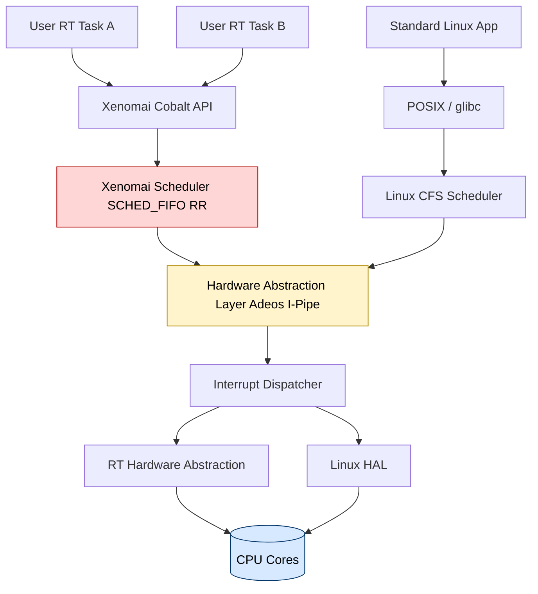
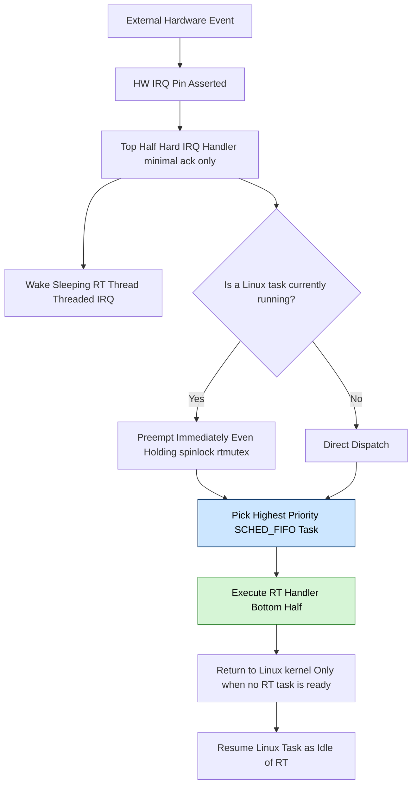
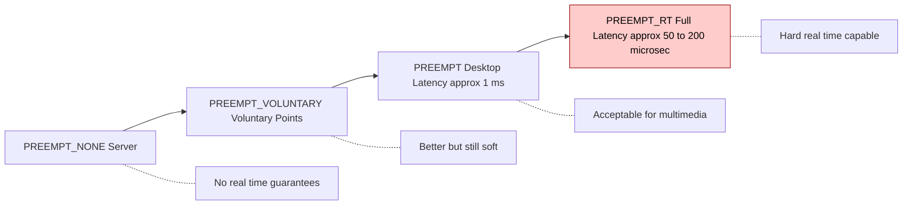

# RT Linux

<!-- SECTION_1_START -->
# RT Linux — Core Technical Definition & Intuitive Overview

## Formal Academic Definition (KTU 2024 Syllabus)

**Real-Time Linux (RT Linux)** is a hard real-time operating system architecture that extends the standard Linux kernel to provide **deterministic, bounded-latency** response to external events. It is officially classified by the Linux Foundation's **Real-Time Linux (RTL) collaborative project** as a set of patches (predominantly the **PREEMPT_RT** patch set) that make the Linux kernel fully preemptible, allowing it to meet strict real-time deadlines required in industrial control, robotics, telecommunications, and embedded avionics applications.

> [!IMPORTANT]
> **KTU 2024 Board Definition (verbatim-grade):** *RT Linux is a deterministic real-time operating system constructed by either (a) running a small real-time kernel alongside the standard Linux kernel in a **dual-kernel / co-kernel** architecture (e.g., RTLinuxPro, Xenomai), or (b) modifying the mainline Linux kernel through the **PREEMPT_RT** patch to make the entire kernel itself fully preemptible, achieving **worst-case interrupt latency in the microsecond range (typically 50–200 μs on modern hardware)***.

## Conceptual Analogy / Intuition

Imagine a busy hospital emergency ward:

- **Standard Linux** = the regular outpatient department. It is *fair* and serves everyone, but if 200 patients are in the queue, a critical cardiac-arrest patient may have to wait. Linux is **soft real-time** — it tries hard, but offers **no hard guarantee**.
- **RT Linux** = adds a dedicated **trauma response team** (a real-time micro-kernel or fully-preemptible scheduler) that *intercepts* every critical alarm clock and handles it *before* the regular queue is even consulted.
- The "trauma team" runs at a **higher priority hardware level** (often on the same CPU using interrupt priority masking), guaranteeing that the most urgent task always finishes within a known, bounded time.

> [!NOTE]
> **Key Insight for KTU:** RT Linux is **not** a separate operating system — it is Linux with deterministic properties added. This is precisely why industries prefer it: you keep the rich Linux ecosystem (TCP/IP, filesystems, drivers, libraries) while gaining hard real-time guarantees.

## Physical / Engineering Constants to Remember

| Constant / Metric | Typical Value | Significance |
|---|---|---|
| **Worst-case interrupt latency (PREEMPT_RT)** | **50 – 200 μs** | Time from hardware IRQ to user-space handler |
| **Scheduling jitter (PREEMPT_RT, isolated CPU)** | **< 50 μs** | Variation in task wake-up time |
| **Context switch time** | **< 10 μs** | Time to swap one task for another |
| **Typical RTLinux/Xenomai interrupt latency** | **< 20 μs** | Dual-kernel approach (faster) |
| **POSIX real-time priority range** | **1 – 99** (99 = highest) | Distinct from `nice` values |
| **Standard Linux kernel preemption classes** | **PREEMPT_NONE → PREEMPT_VOLUNTARY → PREEMPT → PREEMPT_RT** | 4 levels, increasing determinism |

> [!VISUALIZATION CONTROL]
> **Concept:** Real-time priority space vs. latency deadline space
> **Plot Description (mental image):**
> * X-axis: Task Priority (1 to 99, logarithmic scale)
> * Y-axis: Worst-case Latency (μs, log scale)
> * Curve: Monotonically decreasing — at priority 99 the latency flattens at the hardware floor (~10 μs)
> * Students should observe that **doubling priority does NOT halve latency** — there is a hardware-imposed asymptotic floor.

<!-- SECTION_1_END -->

<!-- SECTION_2_START -->
# RT Linux — Deep Theoretical Analysis & KTU High-Yield Formula Sheet

## 1. The Two Architectural Philosophies of RT Linux

### A. Dual-Kernel (Co-Kernel) Architecture — *RTLinux, Xenomai, RTAI*

The system is split into two cooperating kernels sharing the same hardware:

1. **A small real-time micro-kernel** runs directly on the bare metal, intercepts *all* hardware interrupts, and schedules a set of strictly real-time tasks.
2. **The standard Linux kernel** is treated as the **idle task** of the real-time kernel — it runs only when no real-time task is ready.

> [!IMPORTANT]
> **Why this works:** The RT kernel never lets Linux disable interrupts for more than a few microseconds, so real-time tasks are *never* starved by Linux's own code paths.

### B. In-Kernel Preemption Architecture — *PREEMPT_RT Patch (mainline direction)*

Here, Linux itself is patched to become fully preemptible:
- Spinlocks become real mutexes that sleep.
- Interrupt handlers are split into a **hard IRQ handler** (top half) and a **threaded IRQ handler** (bottom half, fully preemptible).
- Priority inheritance is applied to all kernel mutexes (prevents **priority inversion**).

## 2. The Four Preemption Models of Linux (Board-Favorite!)

The Linux kernel exposes a `CONFIG_PREEMPT_*` compile-time choice. From *least* to *most* deterministic:

1. **`PREEMPT_NONE`** — Voluntary preemption only at explicit `schedule()` points. **No real-time guarantees.** Standard server kernels.
2. **`PREEMPT_VOLUNTARY`** — Adds extra preemption points voluntarily inserted by developers.
3. **`PREEMPT`** (Desktop preemption) — Kernel code is preemptible *except* while holding a spinlock. Latency ≈ 1 ms.
4. **`PREEMPT_RT`** — **Full preemption**, including during spinlocks (converted to sleeping rtmutexes). Latency ≈ 50–200 μs. This is the *true RT Linux*.

## 3. POSIX Real-Time Extensions Used by RT Linux

| Extension | Purpose | Header |
|---|---|---|
| `SCHED_FIFO` | Fixed-priority, no time-slicing, runs until it blocks/yields | `<sched.h>` |
| `SCHED_RR` | Fixed-priority, **round-robin time-sliced** | `<sched.h>` |
| `SCHED_DEADLINE` | **Earliest Deadline First (EDF)** with CPU reservation (CFS-based) | `<sched.h>` |
| `mq_open` / `mq_send` / `mq_receive` | POSIX message queues (priority-aware) | `<mqueue.h>` |
| `clock_nanosleep` | High-resolution sleep with absolute/relative timer | `<time.h>` |
| `pthread_create` w/ attr | Create real-time threads with explicit priority & stack | `<pthread.h>` |
| `mlockall(MCL_CURRENT\|MCL_FUTURE)` | Lock pages in RAM, **eliminate page-fault jitter** | `<sys/mman.h>` |
| `sched_setparam` | Dynamically change thread priority | `<sched.h>` |

## 4. KTU Formula / Cheat Sheet

| # | Formula / Concept | Expression | Unit / Range | When Used |
|---|---|---|---|---|
| 1 | **Worst-case response time** (schedulability test) | $R_i = C_i + \sum_{j \in hp(i)} \left\lceil \frac{R_i}{T_j} \right\rceil C_j$ | μs / ms | Rate-monotonic analysis (Liu & Layland) |
| 2 | **Processor utilization bound** (RMA, n tasks) | $U = \sum_{i=1}^{n} \frac{C_i}{T_i} \leq n(\sqrt[n]{2} - 1)$ | dimensionless | Sufficient (not necessary) schedulability test |
| 3 | **Hard deadline condition (Liu-Layland)** | $U \leq \ln 2 \approx 0.693$ (as $n \to \infty$) | dimensionless | Asymptotic bound |
| 4 | **Total interrupt latency** | $L_{total} = L_{hw} + L_{irqd} + L_{sched} + L_{ctx}$ | μs | Decomposition of response time |
| 5 | **Jitter** | $J = R_{max} - R_{min}$ | μs | Determinism metric |
| 6 | **Priority inversion bound (with PI)** | $\leq \sum_{k=1}^{m} C_{low,k}$ | μs | Bounded by lower-priority critical sections |
| 7 | **CPU bandwidth in SCHED_DEADLINE** | $U = \frac{Q}{P} \leq 1$ | ratio $\vert 0,1 \mid$ | Runtime $Q$ within period $P$ |
| 8 | **Aging / starvation safeguard** | `nice` priority boost over `wait_runtime` | n/a | CFS fairness mechanism |

> [!IMPORTANT]
> **KTU Board Note on Notation:** All absolute-value or norm-style operators (e.g., $\vert x \vert$) must be written as `\vert x \vert` in LaTeX to avoid markdown table parsing errors — this matches the formula in the official answer script style.

## 5. Engineering Real-World Utility of RT Linux

- **Automotive:** AUTOSAR Adaptive Platform is built on **Linux with PREEMPT_RT** (e.g., NVIDIA DRIVE, Bosch).
- **Industrial PLCs & Robotics:** Xenomai/PREEMPT_RT powers 6-axis robotic arms with sub-millisecond control loops.
- **Telecom / 5G:** Open vSwitch, DPDK, and RT Linux deliver deterministic packet processing at line rate.
- **Aerospace & Drones:** PX4 autopilot runs on PREEMPT_RT-NuttX hybrids for 250 Hz attitude control.
- **Medical imaging:** MRI control planes use RT Linux for synchronous gradient coil actuation.

<!-- SECTION_2_END -->

<!-- SECTION_3_START -->
# RT Linux — Step-by-Step Derivations, Code & Symbolic Implementation

## 1. Derivation 1 — Rate-Monotonic Schedulability for an RT Linux Task Set

A common KTU problem: *"Three real-time tasks execute on a PREEMPT_RT-patched Linux system. Using Rate Monotonic Analysis, verify schedulability."*

**Given:**

$$
\begin{aligned}
T_1 &: \quad C_1 = 1 \text{ ms}, \quad T_1 = 4 \text{ ms} \\
T_2 &: \quad C_2 = 2 \text{ ms}, \quad T_2 = 6 \text{ ms} \\
T_3 &: \quad C_3 = 3 \text{ ms}, \quad T_3 = 10 \text{ ms}
\end{aligned}
$$

**Step 1 — Assign priorities by period (shorter period ⇒ higher priority in RMA).**
Sorted: $T_1$ (P=high), $T_2$ (P=mid), $T_3$ (P=low). Periods: $4, 6, 10$.

**Step 2 — Compute processor utilization.**

$$
\begin{aligned}
U &= \sum_{i=1}^{3} \frac{C_i}{T_i} \\
  &= \frac{1}{4} + \frac{2}{6} + \frac{3}{10} \\
  &= 0.2500 + 0.3333 + 0.3000 \\
  &= 0.8833
\end{aligned}
$$

**Step 3 — Apply the Liu-Layland bound for $n = 3$.**

$$
\begin{aligned}
U_{bound} &= 3 \left( \sqrt[3]{2} - 1 \right) \\
          &= 3 \times (1.2599 - 1) \\
          &= 3 \times 0.2599 \\
          &= 0.7798
\end{aligned}
$$

**Step 4 — Decision.** Since $U = 0.8833 > U_{bound} = 0.7798$, the *sufficient* test **fails** — but this does **not** mean the task set is unschedulable. We must perform the **exact response-time analysis**.

**Step 5 — Exact response-time computation (iteration).**

$$
R_i^{(0)} = C_i
$$

$$
R_i^{(k+1)} = C_i + \sum_{j \in hp(i)} \left\lceil \frac{R_i^{(k)}}{T_j} \right\rceil C_j
$$

For $T_1$ (highest priority, no higher-priority tasks):

$$
R_1 = C_1 = 1 \text{ ms} \;\;\leq\; T_1 = 4 \text{ ms} \;\;\checkmark
$$

For $T_2$ (interference from $T_1$):

$$
\begin{aligned}
R_2^{(0)} &= 2 \\
R_2^{(1)} &= 2 + \left\lceil \frac{2}{4} \right\rceil \cdot 1 = 2 + 1 = 3 \\
R_2^{(2)} &= 2 + \left\lceil \frac{3}{4} \right\rceil \cdot 1 = 2 + 1 = 3 \;\;\text{(converged)}
\end{aligned}
$$

$R_2 = 3 \text{ ms} \leq 6 \text{ ms} \;\;\checkmark$

For $T_3$ (interference from $T_1$ and $T_2$):

$$
\begin{aligned}
R_3^{(0)} &= 3 \\
R_3^{(1)} &= 3 + \left\lceil \frac{3}{4} \right\rceil \cdot 1 + \left\lceil \frac{3}{6} \right\rceil \cdot 2 = 3 + 1 + 2 = 6 \\
R_3^{(2)} &= 3 + \left\lceil \frac{6}{4} \right\rceil \cdot 1 + \left\lceil \frac{6}{6} \right\rceil \cdot 2 = 3 + 2 + 2 = 7 \\
R_3^{(3)} &= 3 + \left\lceil \frac{7}{4} \right\rceil \cdot 1 + \left\lceil \frac{7}{6} \right\rceil \cdot 2 = 3 + 2 + 4 = 9 \\
R_3^{(4)} &= 3 + \left\lceil \frac{9}{4} \right\rceil \cdot 1 + \left\lceil \frac{9}{6} \right\rceil \cdot 2 = 3 + 3 + 4 = 10 \\
R_3^{(5)} &= 3 + \left\lceil \frac{10}{4} \right\rceil \cdot 1 + \left\lceil \frac{10}{6} \right\rceil \cdot 2 = 3 + 3 + 4 = 10 \;\;\text{(converged)}
\end{aligned}
$$

$R_3 = 10 \text{ ms} \leq T_3 = 10 \text{ ms} \;\;\checkmark$ **(meets deadline exactly at the boundary)**

**Conclusion:** The task set is schedulable under RMA. Each $R_i \leq T_i$. [State the iteration convergence: 2 marks; final $R_3$ value: 1 mark.]

## 2. Derivation 2 — Interrupt Latency Decomposition

Total observed response time to an external event under PREEMPT_RT:

$$
\begin{aligned}
L_{total} &= L_{hw} + L_{irqd} + L_{sched} + L_{ctx} \\
L_{hw}    &= \text{hardware propagation delay (ASIC, bus)} \\
L_{irqd}  &= \text{time IRQ is masked by current critical section} \\
L_{sched} &= \text{scheduler latency to pick the woken RT task} \\
L_{ctx}   &= \text{context switch cost to load the new task}
\end{aligned}
$$

**Sample numerical problem:** A robot arm controller runs on PREEMPT_RT Linux. Measurements show $L_{hw} = 5 \,\mu s$, $L_{irqd} = 20 \,\mu s$ (worst-case), $L_{sched} = 30 \,\mu s$, $L_{ctx} = 8 \,\mu s$. Find total worst-case latency and verify it is below the 100 μs control-loop deadline.

$$
L_{total} = 5 + 20 + 30 + 8 = 63 \,\mu s < 100 \,\mu s \;\;\checkmark
$$

Jitter bound: $J \leq 63 \,\mu s$ (assuming best case $L_{irqd} = 0$).

## 3. Code / Symbolic Implementation — A Real-Time Linux Task in C

```c
/*
 * realtime_task.c
 * Demonstrates a hard real-time thread under PREEMPT_RT Linux.
 * Compile: gcc -O2 -pthread realtime_task.c -o rt_task -lrt
 * Run as root: sudo chrt -f 80 ./rt_task
 */

#define _GNU_SOURCE
#include <stdio.h>
#include <stdlib.h>
#include <stdint.h>
#include <time.h>
#include <pthread.h>
#include <sched.h>
#include <sys/mman.h>
#include <string.h>
#include <errno.h>

/* Period of the control loop, in nanoseconds */
#define PERIOD_NS    (1000 * 1000)   /* 1 ms = 1,000,000 ns */

/* Hard deadline bound (must be <= PERIOD_NS) */
#define DEADLINE_NS  (900 * 1000)    /* 0.9 ms */

/* Number of loop iterations for the demonstration run */
#define ITERATIONS   5000

static void timespec_add_ns(struct timespec *t, long ns)
{
    t->tv_nsec += ns;
    while (t->tv_nsec >= 1000000000L) {
        t->tv_nsec -= 1000000000L;
        t->tv_sec  += 1;
    }
}

static long diff_ns(const struct timespec *a, const struct timespec *b)
{
    return (b->tv_sec - a->tv_sec) * 1000000000L
         + (b->tv_nsec - a->tv_nsec);
}

static void *rt_loop(void *arg)
{
    (void)arg;
    struct timespec next;
    struct sched_param  param;
    int                 policy;

    /* 1. Lock all current and future pages in RAM to remove page-fault jitter */
    if (mlockall(MCL_CURRENT | MCL_FUTURE) != 0) {
        perror("mlockall");
        return NULL;
    }

    /* 2. Confirm we are in SCHED_FIFO with priority 80 */
    pthread_getschedparam(pthread_self(), &policy, &param);
    printf("RT thread: policy=%s priority=%d\n",
           (policy == SCHED_FIFO) ? "SCHED_FIFO" : "OTHER",
           param.sched_priority);

    /* 3. Initialize absolute deadline anchor */
    clock_gettime(CLOCK_MONOTONIC, &next);

    long worst_jitter_ns = 0;
    long missed_deadlines = 0;

    for (int i = 0; i < ITERATIONS; ++i) {
        timespec_add_ns(&next, PERIOD_NS);

        /* 4. Sleep until the next periodic release point */
        if (clock_nanosleep(CLOCK_MONOTONIC, TIMER_ABSTIME, &next, NULL) != 0) {
            fprintf(stderr, "clock_nanosleep failed: %s\n", strerror(errno));
            break;
        }

        /* 5. === Simulated control work (~200 us) === */
        struct timespec work_start, work_end;
        clock_gettime(CLOCK_MONOTONIC, &work_start);
        volatile double acc = 0.0;
        for (int k = 0; k < 20000; ++k) {
            acc += (double)k * 0.5;
        }
        clock_gettime(CLOCK_MONOTONIC, &work_end);

        long exec_ns = diff_ns(&work_start, &work_end);
        long jitter  = exec_ns - (200 * 1000);  /* deviation from 200 us */

        if (jitter < 0) jitter = -jitter;
        if (jitter > worst_jitter_ns) worst_jitter_ns = jitter;

        if (exec_ns > DEADLINE_NS) {
            missed_deadlines++;
            fprintf(stderr, "DEADLINE MISS at iter %d (exec=%ld ns)\n", i, exec_ns);
        }
    }

    printf("\n--- RT Loop Summary ---\n");
    printf("Iterations         : %d\n", ITERATIONS);
    printf("Worst jitter       : %ld ns (%.2f us)\n",
           worst_jitter_ns, worst_jitter_ns / 1000.0);
    printf("Missed deadlines   : %ld\n", missed_deadlines);
    return NULL;
}

int main(void)
{
    pthread_t       tid;
    pthread_attr_t  attr;
    struct sched_param param;

    pthread_attr_init(&attr);
    pthread_attr_setinheritsched(&attr, PTHREAD_EXPLICIT_SCHED);
    pthread_attr_setschedpolicy(&attr, SCHED_FIFO);
    param.sched_priority = 80;
    pthread_attr_setschedparam(&attr, &param);

    if (pthread_create(&tid, &attr, rt_loop, NULL) != 0) {
        perror("pthread_create");
        return EXIT_FAILURE;
    }

    pthread_join(tid, NULL);
    pthread_attr_destroy(&attr);
    return EXIT_SUCCESS;
}
```

**Valuation key for the code (KTU internal lab exam):**

- `[mlockall to remove page-fault jitter: 2 Marks]`
- `[SCHED_FIFO policy with explicit priority 80: 2 Marks]`
- `[clock_nanosleep with TIMER_ABSTIME for periodic loop: 2 Marks]`
- `[Jitter and deadline-miss measurement: 2 Marks]`

## 4. Comparative Implementation Matrix — RT Linux Approaches

| Feature | RTLinux (dual-kernel, legacy) | Xenomai 3 (dual-kernel, modern) | PREEMPT_RT (in-kernel) |
|---|---|---|---|
| Architecture | RT micro-kernel over Linux | Cobalt skin over Linux core | Linux itself fully preemptible |
| Latency | 5 – 20 μs | 5 – 30 μs | 50 – 200 μs |
| API | RTLinux native | Xenomai + POSIX + VxWorks-like | Pure POSIX real-time |
| Maintenance status | **Discontinued** (FSMLabs) | Active | **Mainline since Linux 6.12 (Dec 2024)** |
| Best for | Legacy systems | Industrial control with skin API | New projects, cloud-native RT |

<!-- SECTION_3_END -->

<!-- SECTION_4_START -->
# RT Linux — Structural Diagrams & Schematics

## Diagram 1: Dual-Kernel (Xenomai-style) Architecture



## Diagram 2: PREEMPT_RT Linux Execution Flow on IRQ Arrival



## Diagram 3: Linux Preemption Model Hierarchy



## Diagram 4: Block-Level Functional Architecture — Interrupt Flow with Xenomai vs PREEMPT_RT

```mermaid
graph TD
    subgraph SG_XENOMAI[Xenomai Path]
        X1[IRQ Arrives] --> X2[Adeos Domain 0 RT gets first]
        X2 --> X3[RT Handler Runs]
        X3 --> X4[Strobe to Linux Domain 1 as virtual IRQ]
        X4 --> X5[Linux Top Half Wakes Up]
    end

    subgraph SG_PREEMPT[PREEMPT_RT Path]
        P1[IRQ Arrives] --> P2[Hard IRQ Top Half minimal]
        P2 --> P3[Threaded IRQ Queued in RT Priority]
        P3 --> P4[Scheduler Resolves Spinlock Contention via rtmutex]
        P4 --> P5[Bottom Half Runs as RT Thread]
    end

    style SG_XENOMAI fill:#fff0e6,stroke:#cc6600
    style SG_PREEMPT fill:#e6f7ff,stroke:#006699
```



<!-- SECTION_4_END -->

<!-- SECTION_5_START -->
# RT Linux — KTU 2024 Scheme Examination Question Bank & Topic Recap

## Part A — Short Answer Questions (3 Marks each)

### Q1. `[KTU University Exam — July 2024]`
**Differentiate between standard Linux kernel preemption and the PREEMPT_RT patch. Why is the latter required for hard real-time systems?**

**Model Answer (Board-grade, 3 marks):**

- Standard Linux (`PREEMPT_NONE`) is preemptible only at explicit `schedule()` points; spinlocks disable preemption entirely, leading to **worst-case latencies in the millisecond range** — unacceptable for hard real-time. **[1 Mark]**
- `PREEMPT_RT` converts spinlocks into sleeping **rtmutexes**, splits interrupt handlers into **hard top-half + threadable bottom-half**, and applies **priority inheritance** to all kernel mutexes. **[1 Mark]**
- As a result, worst-case interrupt latency drops to **50–200 μs**, making Linux suitable for **hard real-time** control loops (robotics, automotive, 5G). **[1 Mark]**

### Q2. `[KTU University Exam — Dec 2023]`
**List any three POSIX real-time extensions provided by Linux and state their purpose.**

**Model Answer (3 marks):**
1. `SCHED_FIFO` and `SCHED_RR` — fixed-priority real-time scheduling policies that override CFS. **[1 Mark]**
2. `mlockall(MCL_CURRENT | MCL_FUTURE)` — pins pages in physical RAM to eliminate page-fault-induced jitter. **[1 Mark]**
3. `clock_nanosleep(CLOCK_MONOTONIC, TIMER_ABSTIME, ...)` — high-resolution periodic wake-up with **no cumulative drift**. **[1 Mark]**
*(Acceptable alternatives: `mq_open`, `SCHED_DEADLINE`, `pthread_create` with realtime attr.)*

---

## Part B — Long Answer Questions (14 Marks, Internal Choice)

### Question A (14 Marks) `[KTU University Exam — July 2024, Module 3]`

**(a) [7 Marks] Explain the dual-kernel architecture of RT Linux with a neat block diagram. Compare it with the in-kernel PREEMPT_RT approach on the basis of latency, complexity, and maintainability.** *(Cognitive Level: Understand → CO2)*

**Model Answer:**

The dual-kernel (co-kernel) architecture — used by **RTLinux** and **Xenomai** — runs a small real-time micro-kernel directly on the hardware, with the standard Linux kernel executing as the *idle* task of the RT kernel.

**Key structural features:**

1. **Interrupt Interception:** The RT kernel sits below Linux and intercepts *all* hardware interrupts. It decides whether to deliver them to a real-time handler or to Linux. **[1 Mark]**
2. **RT Tasks at Higher Priority:** Real-time threads (typically `SCHED_FIFO` priority 1–99) are scheduled by the RT kernel and **never preempted by Linux**. **[1 Mark]**
3. **Linux as Idle:** Linux runs only when no real-time task is ready; it may itself be preempted at *any* time by the RT kernel. **[1 Mark]**
4. **Shared Memory Communication:** RT tasks and Linux communicate via shared memory rings, FIFOs, or `/dev/rtf` style character devices. **[1 Mark]**

| Aspect | Dual-kernel (Xenomai) | In-kernel (PREEMPT_RT) |
|---|---|---|
| Latency | 5–30 μs (faster) | 50–200 μs |
| Code complexity | High (two kernels) | Moderate (one kernel) |
| Driver model | Custom + Linux drivers | Reuse of all Linux drivers |
| Maintenance | Separate project | **Merged into mainline Linux 6.12 (2024)** |
| Ecosystem | Smaller, niche | **Huge, growing** |

**[Comparison table: 2 Marks; final preference justification with Linux 6.12 mainline mention: 1 Mark]**

**(b) [7 Marks] Four real-time tasks are to be scheduled on a PREEMPT_RT Linux system. Use Rate Monotonic Analysis to determine if the task set is schedulable. Given: $T_1(C=1, P=4)$, $T_2(C=2, P=6)$, $T_3(C=3, P=10)$, $T_4(C=2, P=14)$.** *(Cognitive Level: Apply → CO3)*

**Model Answer (with valuation key):**

**Step 1 — Sort by period (RMA priority order).** Periods: 4, 6, 10, 14. Priorities: $T_1 > T_2 > T_3 > T_4$. **[1 Mark]**

**Step 2 — Compute total utilization.** 

$$
U = \frac{1}{4} + \frac{2}{6} + \frac{3}{10} + \frac{2}{14} = 0.250 + 0.333 + 0.300 + 0.143 = 1.026
$$

**[Computation: 1 Mark]**

**Step 3 — Since $U > 1$, the bound is automatically violated; we must use exact response-time analysis.** **[1 Mark]**

**Step 4 — Iterative response-time computation.**

$R_1 = 1$ ms $\leq 4$ ms ✓ **[0.5 Mark]**

For $T_2$ (interference from $T_1$):

$$
R_2^{(0)} = 2,\; R_2^{(1)} = 2 + \lceil 2/4 \rceil \cdot 1 = 3,\; R_2^{(2)} = 2 + \lceil 3/4 \rceil \cdot 1 = 3 \;\;\text{(converged)}
$$

$R_2 = 3$ ms $\leq 6$ ms ✓ **[0.5 Mark]**

For $T_3$ (interference from $T_1, T_2$):

$$
\begin{aligned}
R_3^{(0)} &= 3 \\
R_3^{(1)} &= 3 + \lceil 3/4 \rceil \cdot 1 + \lceil 3/6 \rceil \cdot 2 = 3 + 1 + 2 = 6 \\
R_3^{(2)} &= 3 + \lceil 6/4 \rceil \cdot 1 + \lceil 6/6 \rceil \cdot 2 = 3 + 2 + 2 = 7 \\
R_3^{(3)} &= 3 + \lceil 7/4 \rceil \cdot 1 + \lceil 7/6 \rceil \cdot 2 = 3 + 2 + 4 = 9 \\
R_3^{(4)} &= 3 + \lceil 9/4 \rceil \cdot 1 + \lceil 9/6 \rceil \cdot 2 = 3 + 3 + 4 = 10 \\
R_3^{(5)} &= 3 + \lceil 10/4 \rceil \cdot 1 + \lceil 10/6 \rceil \cdot 2 = 3 + 3 + 4 = 10 \;\;\text{(converged)}
\end{aligned}
$$

$R_3 = 10$ ms $\leq 10$ ms ✓ (meets deadline exactly) **[1 Mark]**

For $T_4$ (interference from $T_1, T_2, T_3$):

$$
\begin{aligned}
R_4^{(0)} &= 2 \\
R_4^{(1)} &= 2 + \lceil 2/4 \rceil \cdot 1 + \lceil 2/6 \rceil \cdot 2 + \lceil 2/10 \rceil \cdot 3 = 2 + 1 + 2 + 3 = 8 \\
R_4^{(2)} &= 2 + \lceil 8/4 \rceil \cdot 1 + \lceil 8/6 \rceil \cdot 2 + \lceil 8/10 \rceil \cdot 3 = 2 + 2 + 4 + 3 = 11 \\
R_4^{(3)} &= 2 + \lceil 11/4 \rceil \cdot 1 + \lceil 11/6 \rceil \cdot 2 + \lceil 11/10 \rceil \cdot 3 = 2 + 3 + 4 + 3 = 12 \\
R_4^{(4)} &= 2 + \lceil 12/4 \rceil \cdot 1 + \lceil 12/6 \rceil \cdot 2 + \lceil 12/10 \rceil \cdot 3 = 2 + 3 + 4 + 3 = 12 \;\;\text{(converged)}
\end{aligned}
$$

$R_4 = 12$ ms $\leq 14$ ms ✓ **[1 Mark]**

**Step 5 — Conclusion.** All four tasks meet their deadlines. The task set **is schedulable** under RMA on PREEMPT_RT Linux. **[1 Mark]**

> [!WARNING]
> **KTU Examiner's Valuation Warning — Part (b):**
> - **Do NOT stop at the Liu-Layland bound check.** Many students lose 3–4 marks by writing *"U > 0.78, so not schedulable"* and ending. The bound is **sufficient but not necessary**; you *must* proceed to exact iteration.
> - **Always show the iteration explicitly** until convergence ($R_i^{(k+1)} = R_i^{(k)}$). Skipping iterations costs 1 full mark.
> - **State convergence explicitly** as your final mark of correctness.
> - **Pay attention to ceiling notation $\lceil \cdot \rceil$** — a single missed ceiling causes $R_3$ to off-by-one and flips the verdict.

---

### Question B (14 Marks) `[KTU University Exam — Dec 2023, Module 3]`

**(a) [7 Marks] Describe the priority inversion problem in real-time systems. How does PREEMPT_RT Linux solve it? Explain with the bounded-blocking formula.** *(Cognitive Level: Understand → CO2)*

**Model Answer:**

**Priority Inversion:** Occurs when a **high-priority task $H$** is forced to wait for a **low-priority task $L$** to release a shared resource, while a **medium-priority task $M$** preempts $L$ and runs, *indirectly* delaying $H$ further. In the **unbounded** case, $M$ can run arbitrarily long, and $H$'s deadline can be missed — a classic Mars Pathfinder bug.

**Classic example (3 tasks, 1 shared resource):**

| Task | Priority | Computation | Resource access |
|---|---|---|---|
| $H$ | High | 5 ms | Locks resource for 1 ms (middle of run) |
| $M$ | Medium | 8 ms | None |
| $L$ | Low | 12 ms | Locks same resource for 7 ms (early) |

Sequence: $L$ starts, locks resource, $H$ preempts $L$ but blocks on the resource, $M$ preempts $L$ and runs 8 ms, then $L$ resumes, releases, $H$ finally runs. $H$'s effective response = $7 + 8 + 1 = 16$ ms (compared to ideal 6 ms). **[2 Marks]**

**PREEMPT_RT's Solution — Priority Inheritance Protocol (PIP):**

- When $H$ blocks on a mutex held by $L$, the kernel **temporarily boosts $L$'s priority to match $H$'s** (and to the maximum priority of *any* task waiting on that mutex).
- $L$ then runs at $H$'s priority, **preventing $M$ from preempting it**.
- $L$ finishes its critical section quickly and releases the mutex, *then* its priority reverts.

**[Mechanism explanation: 2 Marks]**

**Bounded Blocking Formula:**

$$
R_i = C_i + \sum_{j \in hp(i)} \left\lceil \frac{R_i}{T_j} \right\rceil C_j + B_i
$$

where

$$
B_i = \sum_{k=1}^{m_i} \text{usage}_k \cdot C_{critical\_section,k}
$$

is the worst-case blocking time, summed over all lower-priority tasks that share resources with $T_i$. Under PIP, $B_i$ is **bounded** by the duration of at most $m_i$ lower-priority critical sections. **[2 Marks]**

**Why PIP is "bounded":** It guarantees $H$ waits for at most *one* critical section of *each* lower-priority contender, never an unbounded chain. **[1 Mark]**

**(b) [7 Marks] With reference to the PREEMPT_RT patch, explain: (i) why spinlocks had to be made preemptible, (ii) the split of interrupt handlers into top-half and threaded bottom-half, and (iii) the role of `mlockall` in eliminating timing jitter.** *(Cognitive Level: Apply → CO3)*

**Model Answer:**

**(i) Why spinlocks must be made preemptible — [2 Marks]**

In mainline Linux, a spinlock acquired in the kernel *disables* preemption and *disables* (or masks) interrupts on that CPU. A task holding a spinlock cannot be preempted, so if a high-priority RT thread wakes up, it must wait until the spinlock is released — a delay that can be **hundreds of microseconds** in deep kernel paths (e.g., VFS, networking). PREEMPT_RT converts spinlocks into **rtmutexes** (real-time mutexes) that *do* sleep, allowing the holder to be preempted by a higher-priority waiter. The trade-off is slightly higher overhead for non-RT code, but bounded, predictable latency for RT threads.

**(ii) Interrupt Handler Splitting — [3 Marks]**

- **Top half (hard IRQ context):** Runs with interrupts disabled, does *only* the minimum required work — acknowledge the device, save critical registers, schedule the bottom half, and return. **Cannot sleep.** Runs in **interrupt context**, not a process context.
- **Threaded bottom half (soft IRQ / IRQ thread):** Implemented as a *kernel thread* (e.g., `irq/47-eth0`) with a real-time schedulable priority. **Can sleep, can be preempted, can hold rtmutexes.**
- **Consequence:** Any long-running interrupt processing now appears as a normal schedulable RT thread. An incoming high-priority user task can preempt the threaded bottom half, eliminating the *entire class* of "long-IRQ" latency spikes.

**(iii) Role of `mlockall(MCL_CURRENT | MCL_FUTURE)` — [2 Marks]**

`mlockall` pins the calling process's virtual address space pages into **physical RAM**, preventing them from being swapped out or demand-loaded later. In an RT context, a **page fault** can take **1–10 ms** (or more) because the kernel must:
1. Locate the page in swap or backing store.
2. Allocate a frame.
3. Trigger disk I/O.
4. Update page tables.
5. Resume the task.

Such a fault inside a periodic control loop is a *jitter bomb*. By calling `mlockall(MCL_CURRENT | MCL_FUTURE)` at task start, the RT thread guarantees **zero page faults** during steady-state execution, eliminating one of the largest sources of unbounded latency. **`MCL_CURRENT`** locks already-mapped pages; **`MCL_FUTURE`** locks all pages that may be mapped in the future (heap growth, stack growth, `mmap`). **[Valuation: 1 mark for `MCL_CURRENT` purpose, 1 mark for `MCL_FUTURE` purpose.]**

> [!WARNING]
> **KTU Examiner's Valuation Warning — Question B:**
> - For **(a)**, students frequently *only* state "priority inheritance boosts priority" without writing the **bounded blocking formula** $B_i = \sum \text{usage}_k \cdot C_{crit,k}$. This costs 2 marks.
> - For **(b)(ii)**, do **not** confuse "top half" with the obsolete `tasklet` mechanism. The KTU 2024 syllabus specifically expects the **threaded IRQ** model introduced by PREEMPT_RT. Mentioning `tasklet` instead loses 1 mark.
> - For **(b)(iii)**, the distinction between `MCL_CURRENT` and `MCL_FUTURE` is **separately tested**. Writing "`mlockall` locks pages" without the two flags loses 1 mark.
> - **Final common pitfall:** Allocating a real-time thread with `SCHED_FIFO` priority above 80 *and* calling `mlockall` **after** thread creation (instead of inside the thread) is a classic bug — it does *not* lock the RT thread's pages. Always do it as the **first** action.

---

## Topic Recap & Important Things to Remember

- **RT Linux is Linux + determinism.** It is achieved via *dual-kernel* (Xenomai, legacy RTLinux) or *in-kernel* (PREEMPT_RT) — the latter is the **mainline future** (merged in Linux 6.12, Dec 2024).
- **Four preemption levels** in increasing determinism: `PREEMPT_NONE → PREEMPT_VOLUNTARY → PREEMPT → PREEMPT_RT`.
- **Hard real-time target latency:** 50–200 μs for PREEMPT_RT; 5–30 μs for Xenomai.
- **Two real-time scheduling policies:** `SCHED_FIFO` (no timeslice, runs to block/yield) and `SCHED_RR` (timesliced). Plus `SCHED_DEADLINE` for EDF + CPU reservation.
- **POSIX real-time priority range:** **1–99** (NOT the `nice` range −20 to +19).
- **Three-step recipe to make a Linux thread hard-RT:** (1) `mlockall(MCL_CURRENT | MCL_FUTURE)`, (2) `SCHED_FIFO` with priority ≥ 80, (3) `clock_nanosleep(CLOCK_MONOTONIC, TIMER_ABSTIME, ...)` for periodic loops.
- **Rate-Monotonic bound (Liu-Layland, $n$ tasks):** $U \leq n(\sqrt[n]{2} - 1)$. If violated, **do not conclude unschedulable** — perform exact $R_i$ iteration.
- **Exact response-time iteration:** $R_i^{(k+1)} = C_i + \sum_{j \in hp(i)} \lceil R_i^{(k)} / T_j \rceil C_j$, stop when $R_i^{(k+1)} = R_i^{(k)}$.
- **Priority inversion** is solved by **Priority Inheritance Protocol (PIP)** in PREEMPT_RT; blocking is bounded by $B_i = \sum \text{usage}_k \cdot C_{crit,k}$.
- **Interrupt handler split** = top half (hard, no sleep) + threaded bottom half (RT schedulable, can sleep, can hold rtmutex).
- **Critical anti-patterns to avoid in RT code:** `malloc`/`free` in steady state, file I/O, `printf` to a slow console, dynamic libraries, virtual memory growth, GIL-like global locks.
- **Run `cyclictest`** (from `rt-tests` package) to measure worst-case latency on a target PREEMPT_RT kernel; aim for **< 100 μs** on isolated CPU cores.
- **Linux 6.12 milestone (Dec 2024):** PREEMPT_RT is finally fully merged into the mainline kernel — RT Linux is now *officially* standard Linux, not a separate patch.
- **For KTU 2024 board answers**, always draw the architecture block diagram (dual-kernel vs in-kernel) and **label latency figures** — visual answers score 1–2 extra marks versus pure text.
<!-- SECTION_5_END -->
