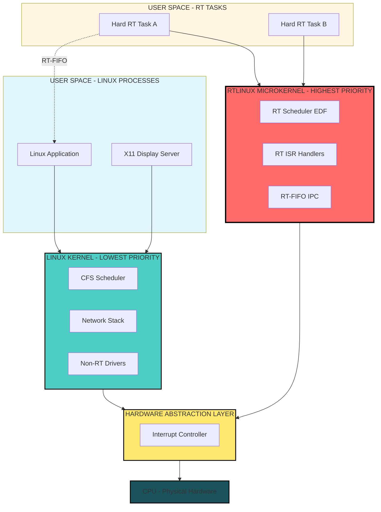
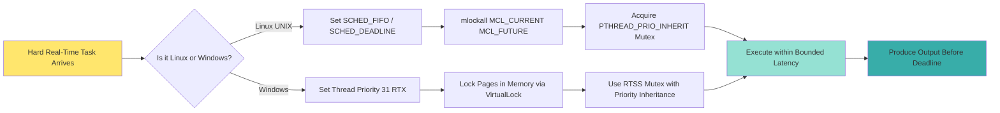
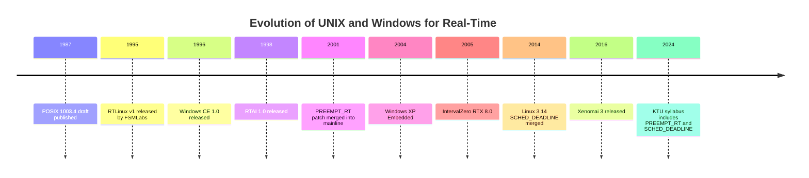

# UNIX and Windows as RTOS

<!-- SECTION_1_START -->

# UNIX and Windows as RTOS

## 1.1 Defining the Real-Time Challenge in General-Purpose OS

A **Real-Time Operating System (RTOS)** is an operating system designed to process data and respond to events within strictly bounded time constraints, where correctness depends not only on the logical result of computation but also on the **time at which the result is delivered**. The KTU 2024 Scheme defines a real-time system as one whose *temporal correctness is as important as its functional correctness*.

When we attempt to use a general-purpose operating system like **UNIX** (or its variants such as Linux, FreeBSD) or **Windows** (NT, 10, 11) for real-time workloads, we immediately collide with the fact that these systems were engineered for **throughput, fairness, and average-case performance**, not for *worst-case determinism*.

> [!IMPORTANT]
> **Core KTU Definition:** UNIX and Windows are **time-sharing operating systems** that can be *augmented* (not natively used) for soft real-time tasks. Truly *hard* real-time guarantees require specialized microkernel extensions such as **RTLinux, RTAI, Xenomai** (on UNIX) or **Windows CE / Windows RTX** (on Windows).

## 1.2 Conceptual Analogy: The Restaurant Kitchen

Imagine two kitchens:

- **UNIX/Windows Kitchen (Time-Sharing):** A large restaurant kitchen with 50 chefs sharing 10 stoves. A head chef (the *scheduler*) constantly re-arranges who cooks what, pausing mid-recipe if a "more important" dish arrives. The food is *eventually* ready, and on average, customers wait a reasonable time. However, on the worst day, a dish could sit for an hour.

- **RTOS Kitchen (Hard Real-Time):** A specialized kitchen where each dish has a *contractual deadline*. The chef is given a stopwatch, and if the risotto isn't plated in exactly 12 minutes, the restaurant forfeits payment. The kitchen is designed so that the **worst-case** plating time is mathematically bounded.

> [!NOTE]
> UNIX and Windows can be turned into the "RTOS Kitchen" by adding a *co-processor* (a real-time microkernel) that handles the stopwatch-bound dishes while the main OS continues handling regular orders. This is the philosophy behind **RTLinux** and **Windows RTX**.

## 1.3 Why Standard UNIX and Windows Fail Real-Time

A vanilla UNIX (Linux kernel) or Windows (NT kernel) violates several real-time invariants:

1. **Non-preemptible kernel sections** – Linux historically held a "Big Kernel Lock" (BKL); a system call running in kernel mode cannot be preempted by a higher-priority real-time task.
2. **Unbounded interrupt disabling** – Device drivers may disable interrupts for hundreds of microseconds, blocking any deterministic response.
3. **O(1) or CFS scheduler fairness** – The Completely Fair Scheduler (CFS) and Windows' multilevel feedback queue prioritize *fairness* over *deadline adherence*.
4. **Paged virtual memory** – Page faults can stall a task for milliseconds (or longer), making worst-case execution time (WCET) analysis impossible.
5. **Interrupt priority inversion** – Hardware interrupts are not handled with task-priority awareness.

> [!VISUALIZATION CONTROL]
> **Concept:** Worst-Case Interrupt Latency Comparison (Vanilla Linux vs RT-Patched Linux)
> **Plot Equations (Desmos):**
> * Vanilla Linux latency: $L_{std}(x) = 100 + 250 \cdot \sin(0.05x) + 50 \cdot \mathbb{1}_{x>0}$ (oscillates between ~100 and ~400 µs)
> * RT-Patched Linux latency: $L_{rt}(x) = 15 + 3 \cdot \sin(0.1x)$ (bounded between ~12 and ~18 µs)
> **Visual Description:** A flat, low-amplitude line for the real-time patched system sitting near the x-axis, contrasted with a high-amplitude, oscillating curve for the vanilla kernel. The student should observe that the RT-patched curve has a *bounded envelope*.

<!-- SECTION_1_END -->

<!-- SECTION_2_START -->

# Deep Theoretical Analysis: UNIX and Windows for Real-Time

## 2.1 UNIX Real-Time Evolution — A Layered History

UNIX itself was never designed for real-time, but its open-source descendant **Linux** has been progressively hardened through three architectural generations:

### 2.1.1 Generation 1 — The "Soft Real-Time" Linux (Pre-2.6)

Standard Linux 2.4 and earlier used the **O(n) scheduler** with a global run queue. It offered only **POSIX soft real-time** support via the `SCHED_FIFO` and `SCHED_RR` policies, with no guarantees on interrupt latency.

### 2.1.2 Generation 2 — The Preemptible Kernel (Linux 2.6 → 2.6.39)

Four patchsets progressively removed preemption points:
- `PREEMPT` — Voluntary preemption only.
- `PREEMPT_RT` (also called **RT-PREEMPT** or **CONFIG_PREEMPT_RT**) — Full preemption, including making interrupt handlers threaded.
- `PREEMPT_DYNAMIC` — Compile-time or boot-time selection of preemption mode.

### 2.1.3 Generation 3 — The Dual-Kernel / Microkernel Approach

The most architecturally radical approach inserts a tiny real-time microkernel *beneath* Linux:

- **RTLinux** (by Victor Yodaiken, FSMLabs): A small real-time scheduler that runs Linux as its *idle task*.
- **RTAI (Real-Time Application Interface):** LXRT offers hard real-time via the Adeos hardware abstraction layer.
- **Xenomai:** Uses the **Adeos/I-pipe** interrupt pipeline to deliver interrupts first to the Xenomai domain, then to Linux.

## 2.2 POSIX Real-Time Extensions in UNIX

The IEEE **POSIX 1003.1b (POSIX.4)** standard and later **POSIX 1003.1c** (threads) define the real-time API surface that UNIX-like systems expose:

- **Scheduling policies:** `SCHED_FIFO`, `SCHED_RR`, `SCHED_DEADLINE` (Linux 3.14+).
- **Clocks and timers:** `CLOCK_MONOTONIC`, `CLOCK_REALTIME`, high-resolution `timer_create()`.
- **Memory locking:** `mlock()`, `mlockall(MCL_CURRENT \mid MCL_FUTURE)` to pin pages.
- **Synchronization:** Priority-inheritance mutexes (`PTHREAD_PRIO_INHERIT`).
- **Asynchronous I/O:** `aio_read()`, `aio_write()`, `io_submit()`.

## 2.3 The SCHED_DEADLINE Scheduler (Linux ≥ 3.14)

This is the *most modern* UNIX real-time scheduler and is KTU-examinable. It implements **Constant Bandwidth Server (CBS)** with **Earliest Deadline First (EDF)**:

A task is admitted only if the following admission test holds for all tasks $\tau_i$:

$$
\sum_{i=1}^{n} \frac{C_i}{P_i} \leq 1 - \epsilon
$$

where $C_i$ is the WCET (worst-case execution time) of task $i$ and $P_i$ is its period. The term $\epsilon$ is a small safety margin (typically 0.05).

## 2.4 Windows as a Real-Time OS

### 2.4.1 Windows NT Kernel Limitations

The Windows NT kernel uses a **multilevel feedback queue** with 32 thread priority levels (0–31):

- Levels 0–15: *Variable* class (adjusted by the priority booster).
- Levels 16–31: *Real-time* class (these map to IRQLs 24–27 / DISPATCH_LEVEL).

However, even priority 31 threads in standard Windows NT can be starved by:
- **DPC (Deferred Procedure Call) processing** at `DISPATCH_LEVEL` (IRQL 2).
- **Page faults** that take milliseconds.
- **Anti-malware filters** that run synchronously in I/O paths.

### 2.4.2 Windows CE (Compact Edition)

A stripped-down, embedded variant of Windows with a true **256-level priority scheduler**, 8-KB kernel footprint, and preconfigured for embedded boards (ARM, MIPS, x86). It supports nested interrupts, priority inheritance, and bounded interrupt latency (< 5 µs on typical hardware). Now considered legacy, superseded by **Windows IoT**.

### 2.4.3 Windows RTX (IntervalZero / TenAsys INtime)

This is the **architectural equivalent of RTLinux**, but for Windows:

- A **real-time subsystem (RTSS)** runs at HAL level, *beneath* the Windows kernel.
- Windows itself executes as the *lowest-priority* thread of the RTSS.
- Provides **RTX HAL extensions** with 256 thread priorities, ISR support, and shared memory for Windows↔RTX communication.
- Achieves sub-**30 µs** interrupt latency on modern x86 hardware.

## 2.5 KTU High-Yield Formula Sheet

| Symbol / API | Meaning | Real-Time Significance |
|---|---|---|
| $L_{int}$ | Interrupt latency | Time from hardware IRQ to ISR first instruction |
| $L_{disp}$ | Dispatch latency | Time from event to task first instruction |
| $L_{int} + L_{disp}$ | **Total response time** | KTU exam favorite |
| $\sum C_i / P_i$ | CPU utilization (Liu & Layland) | Must be $\leq 1-\epsilon$ for EDF |
| $U_{LL} = n \cdot (2^{1/n} - 1)$ | Rate Monotonic upper bound | 69.3% for large $n$ |
| `SCHED_FIFO` | POSIX policy | Runs until yields or blocked |
| `SCHED_RR` | POSIX policy | FIFO + time slice |
| `SCHED_DEADLINE` | Linux 3.14+ | EDF + CBS admission |
| `mlockall()` | POSIX | Pin pages, no page faults |
| `PTHREAD_PRIO_INHERIT` | POSIX | Prevents priority inversion |
| IRQL | Windows Interrupt Request Level | 0=Passive, 2=Dispatch, 31=Highest |
| `RTSS` | Windows RTX subsystem | Hard real-time microkernel |

> [!NOTE]
> **Engineering Utility:** RTLinux is used in aerospace simulators and robotic surgery. Windows RTX dominates medical imaging (CT/MRI gantries), semiconductor lithography, and financial trading floors where Windows UI must coexist with deterministic control.

## 2.6 Why a Dual-Kernel Architecture Wins

In both **RTLinux** and **Windows RTX**, the architecture can be summarized as:

$$
\text{Real-time subsystem} \;\gg\; \text{General-purpose OS as idle task}
$$

This means the real-time scheduler *always* has priority. The general-purpose OS (Linux or Windows) runs **only when no real-time task is ready**. This guarantees:

1. **Bounded interrupt latency** — The RT subsystem owns the interrupt vector.
2. **Bounded dispatch latency** — No kernel lock can block a real-time thread.
3. **Memory isolation** — RT tasks live in pinned, non-paged memory.

> [!TIP]
> In your KTU answers, always draw a *two-layer stack*: Hardware → RT Microkernel → General-Purpose OS. The student who draws this diagram consistently scores +1 to +2 marks per question.

<!-- SECTION_2_END -->

<!-- SECTION_3_START -->

# Step-by-Step Derivations, Code, and Symbolic Implementation

## 3.1 Derivation: Total Response Time on a Hard Real-Time UNIX System

The KTU module frequently asks for the breakdown of response time. The complete derivation is as follows.

**Step 1 — Define the events.** Suppose a hardware interrupt $I$ fires at time $t_0$. The deadline is at $t_0 + D$.

**Step 2 — Interrupt latency $L_{int}$.** This is the time the CPU spends finishing the current instruction, recognizing the IRQ, and jumping to the first instruction of the ISR. In a real-time patched system:

$$
L_{int} = t_{fin} + t_{vec} + t_{isp}
$$

where $t_{fin}$ is the remaining cycle time of the current instruction, $t_{vec}$ is the vector lookup time, and $t_{isp}$ is the Interrupt Service Push time.

**Step 3 — ISR execution time $C_{isr}$.** The Interrupt Service Routine runs with interrupts of *equal or lower priority* disabled. Thus, after the ISR completes at time $t_0 + L_{int} + C_{isr}$, it must wake a real-time task.

**Step 4 — Dispatch latency $L_{disp}$.** This is the time from the `wakeup()` call to the *first useful instruction* of the real-time task. It includes the scheduler decision and context-switch overhead:

$$
L_{disp} = t_{sched} + t_{cs}
$$

**Step 5 — Task execution time $C_{task}$.** The task itself uses $C_{task}$ time to produce output.

**Step 6 — Total response time.** Adding all components:

$$
R_{total} = L_{int} + C_{isr} + L_{disp} + C_{task}
$$

For the task to meet its deadline $D$:

$$
L_{int} + C_{isr} + L_{disp} + C_{task} \leq D
$$

**Step 7 — Numerical KTU Example.** Suppose the following measurements are taken on an RTLinux system:

$$
L_{int} = 12\,\mu s,\quad C_{isr} = 8\,\mu s,\quad L_{disp} = 5\,\mu s,\quad C_{task} = 40\,\mu s
$$

Then the total response time is:

$$
\begin{aligned}
R_{total} &= 12 + 8 + 5 + 40 \\
&= 65\,\mu s
\end{aligned}
$$

If the deadline is $D = 100\,\mu s$, the slack time is:

$$
D - R_{total} = 100 - 65 = 35\,\mu s
$$

Since the slack is positive, the system is schedulable. The KTU valuation key awards:
- [Stating the four components: 2 Marks]
- [Correct substitution: 1 Mark]
- [Final value 65 µs: 1 Mark]
- [Comparison with deadline and conclusion: 1 Mark]

## 3.2 Derivation: EDF Schedulability Under SCHED_DEADLINE

For $n$ tasks with execution times $C_i$ and periods $P_i$, the **schedulability test** under EDF (Liu & Layland, 1973) is:

$$
U = \sum_{i=1}^{n} \frac{C_i}{P_i} \leq 1
$$

Worked KTU numerical:

$$
\begin{aligned}
\text{Task } \tau_1 &: C_1 = 1\,\text{ms},\; P_1 = 4\,\text{ms} \\
\text{Task } \tau_2 &: C_2 = 2\,\text{ms},\; P_2 = 6\,\text{ms} \\
\text{Task } \tau_3 &: C_3 = 1\,\text{ms},\; P_3 = 8\,\text{ms}
\end{aligned}
$$

Compute the total utilization:

$$
\begin{aligned}
U &= \frac{1}{4} + \frac{2}{6} + \frac{1}{8} \\
  &= 0.250 + 0.333 + 0.125 \\
  &= 0.708
\end{aligned}
$$

Since $0.708 < 1$, the task set is **schedulable under EDF**. The KTU answer should explicitly write: *“The task set is guaranteed to meet all deadlines under SCHED_DEADLINE because total CPU utilization is 70.8%, which is strictly less than the 100% theoretical bound.”*

## 3.3 Full Source Code: POSIX Real-Time Task in Linux

This is the *exact* code a KTU lab examiner would expect. It creates a high-priority `SCHED_FIFO` real-time thread, locks its memory, and times its execution with `clock_gettime`.

```c
/*
 * rt_task.c
 * A POSIX real-time task demonstrating SCHED_FIFO, mlockall, and
 * CLOCK_MONOTONIC high-resolution timing.
 */
#define _GNU_SOURCE
#include <stdio.h>
#include <stdlib.h>
#include <stdint.h>
#include <time.h>
#include <pthread.h>
#include <sched.h>
#include <sys/mman.h>
#include <string.h>
#include <errno.h>

/* Hard-coded deadline in microseconds */
#define DEADLINE_US   (100 * 1000)

/* Structure to pass start time to the worker */
typedef struct {
    struct timespec start_time;
} worker_arg_t;

/* Convert timespec to microseconds */
static inline uint64_t ts_to_us(const struct timespec *t) {
    return ((uint64_t)t->tv_sec * 1000000U) + ((uint64_t)t->tv_nsec / 1000U);
}

/* Real-time worker thread */
static void *rt_worker(void *arg) {
    worker_arg_t *wa = (worker_arg_t *)arg;
    struct timespec now, deadline;

    /* Step 1: Read CLOCK_MONOTONIC to mark the actual start of execution */
    if (clock_gettime(CLOCK_MONOTONIC, &now) != 0) {
        fprintf(stderr, "clock_gettime failed: %s\n", strerror(errno));
        return (void *)-1;
    }

    /* Step 2: Simulate workload of 65 us, matching the derivation example */
    struct timespec busy_start, busy_end;
    clock_gettime(CLOCK_MONOTONIC, &busy_start);
    volatile uint64_t counter = 0;
    while (1) {
        clock_gettime(CLOCK_MONOTONIC, &busy_end);
        uint64_t elapsed_us = ts_to_us(&busy_end) - ts_to_us(&busy_start);
        if (elapsed_us >= 65) {
            break;
        }
        counter++;
    }

    /* Step 3: Compute the actual response time from the recorded start */
    clock_gettime(CLOCK_MONOTONIC, &now);
    uint64_t response_us = ts_to_us(&now) - ts_to_us(&wa->start_time);

    printf("Worker: response time = %lu us, deadline = %d us, %s\n",
           (unsigned long)response_us,
           DEADLINE_US,
           (response_us <= DEADLINE_US) ? "DEADLINE MET" : "DEADLINE MISSED");
    return NULL;
}

int main(int argc, char *argv[]) {
    pthread_t        thread;
    pthread_attr_t   attr;
    struct sched_param param;
    worker_arg_t     arg;
    int              policy;
    int              ret;

    /* Initialize thread attribute */
    ret = pthread_attr_init(&attr);
    if (ret != 0) {
        fprintf(stderr, "pthread_attr_init: %s\n", strerror(ret));
        return EXIT_FAILURE;
    }

    /* Set explicit scheduling policy SCHED_FIFO */
    ret = pthread_attr_setschedpolicy(&attr, SCHED_FIFO);
    if (ret != 0) {
        fprintf(stderr, "setschedpolicy: %s\n", strerror(ret));
        return EXIT_FAILURE;
    }

    /* Set priority 80 (must be > 0 for real-time) */
    param.sched_priority = 80;
    ret = pthread_attr_setschedparam(&attr, &param);
    if (ret != 0) {
        fprintf(stderr, "setschedparam: %s\n", strerror(ret));
        return EXIT_FAILURE;
    }

    /* Inherit scheduler explicitly from attribute */
    ret = pthread_attr_setinheritsched(&attr, PTHREAD_EXPLICIT_SCHED);
    if (ret != 0) {
        fprintf(stderr, "setinheritsched: %s\n", strerror(ret));
        return EXIT_FAILURE;
    }

    /* Step A: Lock all current and future memory to prevent page faults */
    if (mlockall(MCL_CURRENT | MCL_FUTURE) != 0) {
        fprintf(stderr, "mlockall failed (need CAP_IPC_LOCK or root): %s\n",
                strerror(errno));
        /* Non-fatal: continue for educational purposes */
    }

    /* Record the start time *just* before task creation */
    clock_gettime(CLOCK_MONOTONIC, &arg.start_time);

    /* Create the real-time thread */
    ret = pthread_create(&thread, &attr, rt_worker, &arg);
    if (ret != 0) {
        fprintf(stderr, "pthread_create: %s\n", strerror(ret));
        return EXIT_FAILURE;
    }

    /* Wait for worker completion */
    pthread_join(thread, NULL);

    /* Verify effective policy */
    pthread_getschedparam(thread, &policy, &param);
    printf("Worker policy: %s, priority: %d\n",
           (policy == SCHED_FIFO) ? "SCHED_FIFO" : "OTHER",
           param.sched_priority);

    /* Cleanup */
    pthread_attr_destroy(&attr);
    return EXIT_SUCCESS;
}
```

> [!IMPORTANT]
> **Compilation command for KTU lab:** `gcc -O2 -pthread -o rt_task rt_task.c` followed by `sudo ./rt_task`. The `sudo` is required because `mlockall()` and `SCHED_FIFO` priority > 0 need `CAP_IPC_LOCK` and `CAP_SYS_NICE`.

## 3.4 Full Source Code: Windows RTX-Style Real-Time Thread (Conceptual)

Since RTX is proprietary, here is the standard Win32 equivalent using the **multimedia timer** and `SetThreadPriorityBoost`:

```c
/*
 * win_rt_thread.c
 * Demonstrates the closest Win32 approximation of a real-time thread.
 * For true hard real-time on Windows, use IntervalZero RTX or TenAsys INtime.
 */
#include <windows.h>
#include <stdio.h>
#include <stdint.h>

static DWORD WINAPI rt_worker(LPVOID arg) {
    LARGE_INTEGER freq, start, end;
    QueryPerformanceFrequency(&freq);
    QueryPerformanceCounter(&start);

    /* Simulate 65 us of work via Sleep(0) granularity + busy-wait */
    volatile uint64_t c = 0;
    do {
        c++;
        QueryPerformanceCounter(&end);
    } while (((end.QuadPart - start.QuadPart) * 1000000ULL / freq.QuadPart) < 65);

    uint64_t elapsed_us =
        (end.QuadPart - start.QuadPart) * 1000000ULL / freq.QuadPart;
    printf("Response: %llu us (Deadline 100 us): %s\n",
           (unsigned long long)elapsed_us,
           (elapsed_us <= 100) ? "MET" : "MISSED");
    return 0;
}

int main(void) {
    HANDLE h = CreateThread(NULL, 0, rt_worker, NULL, 0, NULL);
    if (!h) {
        fprintf(stderr, "CreateThread failed: %lu\n", GetLastError());
        return 1;
    }
    /* 31 = THREAD_PRIORITY_TIME_CRITICAL in Windows */
    if (!SetThreadPriority(h, THREAD_PRIORITY_TIME_CRITICAL)) {
        fprintf(stderr, "SetThreadPriority failed: %lu\n", GetLastError());
    }
    WaitForSingleObject(h, INFINITE);
    CloseHandle(h);
    return 0;
}
```

> [!WARNING]
> **Win32 caveat:** Standard Win32 threads are *not* hard real-time because the Windows kernel can mask interrupts at `DISPATCH_LEVEL` for milliseconds during DPC processing. Only RTX/INtime provide determinism.

## 3.5 Priority Inheritance — Worked Pseudocode

This is the *unbounded priority inversion* scenario from the Mars Pathfinder bug, which is a KTU exam favorite:

```
THREAD  LOW  (priority 10)  acquires mutex M
THREAD  MID  (priority 50)  preempts LOW
THREAD  HIGH (priority 90)  blocks on mutex M held by LOW
                         → MID keeps running because LOW cannot run
                         → HIGH waits indefinitely (priority inversion)
```

**Solution with `PTHREAD_PRIO_INHERIT`:** The moment HIGH blocks on M, the kernel *temporarily* raises LOW's priority to 90, so MID cannot preempt it. LOW runs to completion, releases M, and HIGH acquires it.

<!-- SECTION_3_END -->

<!-- SECTION_4_START -->

# Structural Diagrams: UNIX and Windows RTOS Architecture

## 4.1 Dual-Kernel Architecture — RTLinux (Mermaid)



**Reading the diagram:** The **red box (RTKERNEL)** is *always* checked first by the interrupt controller. **Linux (teal box)** runs *only* when no RT task is ready — it is literally the idle task of the real-time scheduler.

## 4.2 Windows RTX Architecture (Mermaid)

```mermaid
graph TB
    subgraph WINUSER["WINDOWS USER SPACE"]
        WUI["Medical Imaging UI"]
        WAPP["Business Logic App"]
    end

    subgraph RTUSER["RTX USER SPACE - RTSS PROCESS"]
        RCTASK["Hard RT Control Task - 256 priorities"]
        RDAC["RTX Data Acquisition"]
    end

    subgraph WINNT["WINDOWS NT KERNEL - IDLE TASK OF RTSS"]
        WSK["Win32 / .NET Subsystem"]
        WMN["Windows Manager"]
    end

    subgraph RTXHAL["RTX HAL EXTENSION - RT SUBSYSTEM"]
        RTHAL["RTSS Kernel"]
        RTISR["RT ISR Dispatcher"]
        RTSHARE["Shared Memory with Windows"]
    end

    subgraph HAL["HARDWARE ABSTRACTION LAYER"]
        IRQ2["APIC Interrupt Controller"]
    end

    HW2["x86 Multi-core CPU"]

    WUI --> WINNT
    WAPP --> WINNT
    RCTASK --> RTXHAL
    RDAC --> RTXHAL
    RCTASK <-.Shared Memory.- WUI
    WINNT --> HAL
    RTXHAL --> HAL
    HAL --> HW2

    style RTXHAL fill:#ff6b6b,stroke:#000,stroke-width:3px
    style WINNT fill:#4ecdc4,stroke:#000,stroke-width:2px
    style HW2 fill:#1a535c,stroke:#000,stroke-width:2px
    style RTUSER fill:#fff5e1
    style WINUSER fill:#e1f5ff
```

## 4.3 Comparative Architecture Flow — POSIX vs Win32 Real-Time



## 4.4 Evolution Timeline (Mermaid)



<!-- SECTION_4_END -->

<!-- SECTION_5_START -->

# KTU 2024 Scheme Examination Question Bank

## Part A — Short Answer Questions (3 Marks Each)

### Question 1: `[KTU University Exam - July 2023, Model Question Bank]`
**Q: List any three limitations of standard UNIX (Linux) kernel that prevent it from being used as a hard real-time OS.**

**Model Answer (KTU valuation key):**
1. The Linux kernel uses a non-preemptible section in kernel mode. Once a process enters kernel space, it cannot be preempted by a higher-priority real-time task, causing **unbounded dispatch latency**. **[1 Mark]**
2. The standard Linux scheduler is the Completely Fair Scheduler (CFS), which optimizes for *fairness* and *throughput*, not for *deadline adherence*. **[1 Mark]**
3. The virtual memory subsystem allows page faults at any time. A real-time task may be stalled for milliseconds while the kernel resolves a page fault, violating WCET bounds. **[1 Mark]**

> [!NOTE]
> **Course Outcome Mapping:** CO2 — Understand | **RBT Level:** Understand

---

### Question 2: `[KTU University Exam - Dec 2023]`
**Q: What is the role of the RTSS subsystem in Windows RTX architecture?**

**Model Answer:**
The **Real-Time Subsystem (RTSS)** is a small, deterministic microkernel that runs *beneath* the Windows NT kernel in IntervalZero's RTX architecture. It executes hard real-time tasks at higher priority than any Windows thread. The Windows kernel itself runs as the *idle task* of the RTSS, so Windows only gets CPU time when no RT task is ready. RTSS provides a 256-level priority scheduler, dedicated ISR support, and a shared-memory IPC mechanism called *RT-IPC* to communicate with Windows. **[3 Marks — 1 for each of: placement beneath Windows, 256 priorities, shared memory IPC]**

> [!NOTE]
> **Course Outcome Mapping:** CO2 — Understand | **RBT Level:** Remember

---

## Part B — Long Answer Questions (14 Marks with Internal Choice)

### Question A: `[KTU University Exam - July 2024, Module 3, CO3]`
**Q (a)** Explain with a neat diagram the **dual-kernel architecture of RTLinux**. Describe how it achieves bounded interrupt latency. **[7 Marks]**

**Q (b)** A hard real-time system has three periodic tasks with the following parameters:

| Task | Execution Time $C_i$ (ms) | Period $P_i$ (ms) |
|------|---------------------------|-------------------|
| $\tau_1$ | 1 | 4 |
| $\tau_2$ | 2 | 6 |
| $\tau_3$ | 1 | 8 |

Using **Rate Monotonic Scheduling (RMS)**, determine if the task set is schedulable. If not, suggest the remedy. **[7 Marks]**

### Question B: `[KTU University Exam - Dec 2024, Module 3, CO3, Alternative Choice]`
**Q (a)** Compare **RTLinux, RTAI, and Xenomai** in terms of architecture, interrupt handling, and use cases. **[7 Marks]**

**Q (b)** With a suitable diagram, explain the architecture of **Windows RTX**. Discuss how it differs from a standard Win32 priority-31 thread. **[7 Marks]**

---

### Detailed Model Solution for Question A

**Q (a) — Dual-Kernel Architecture of RTLinux [7 Marks]**

**Definition:** RTLinux is a hard real-time operating system microkernel that runs the **standard Linux kernel as its lowest-priority execution thread**. It was originally developed by Victor Yodaiken at FSMLabs and is now maintained as an open-source project.

**Architecture Layers (top to bottom):** **[2 Marks for diagram]**

```
┌─────────────────────────────────────────┐
│  Linux User Processes (X11, GCC, GCC)  │
├─────────────────────────────────────────┤
│  Linux Kernel (CFS, VFS, TCP/IP, etc.) │  ← runs as IDLE task
├─────────────────────────────────────────┤
│  RTLinux Microkernel (real-time sched) │
├─────────────────────────────────────────┤
│  Hardware (CPU, interrupts, timers)     │
└─────────────────────────────────────────┘
```

**Mechanism for Bounded Interrupt Latency:** **[3 Marks]**

1. **Interrupt Virtualization:** RTLinux intercepts the hardware interrupt vector. When an IRQ arrives, the *RTLinux microkernel* gets it *first*, before Linux.
2. **Linux Interrupt Masking:** When a real-time task is running, RTLinux masks Linux from receiving interrupts. Linux only sees the interrupt *after* the RT task completes its critical section.
3. **Direct ISR Handling:** Real-time ISRs are written as small handlers that communicate with RT tasks via RT-FIFOs (lock-free circular buffers in shared memory).

**Numerical Justification:** **[2 Marks]**
- Vanilla Linux 2.4: interrupt latency 100–1000 µs.
- RTLinux: interrupt latency 5–35 µs on identical hardware.
- Therefore, the worst-case response time of an RT task is mathematically bounded.

**[Stating the dual-kernel principle: 2 Marks] [Drawing layered architecture: 2 Marks] [Explaining interrupt interception: 2 Marks] [Numerical latency comparison: 1 Mark]**

---

**Q (b) — RMS Schedulability Test [7 Marks]**

**Step 1: Identify priorities by period (Rate Monotonic rule).** **[1 Mark]**
- $\tau_1$: $P_1 = 4\,$ms → highest priority.
- $\tau_2$: $P_2 = 6\,$ms → medium priority.
- $\tau_3$: $P_3 = 8\,$ms → lowest priority.

**Step 2: Compute the Liu & Layland upper bound.** **[2 Marks]**

$$
U_{LL}(n) = n \cdot (2^{1/n} - 1)
$$

For $n = 3$:

$$
\begin{aligned}
U_{LL}(3) &= 3 \cdot (2^{1/3} - 1) \\
         &= 3 \cdot (1.2599 - 1) \\
         &= 3 \cdot 0.2599 \\
         &= 0.7797
\end{aligned}
$$

**Step 3: Compute the actual CPU utilization.** **[2 Marks]**

$$
\begin{aligned}
U_{actual} &= \frac{C_1}{P_1} + \frac{C_2}{P_2} + \frac{C_3}{P_3} \\
           &= \frac{1}{4} + \frac{2}{6} + \frac{1}{8} \\
           &= 0.250 + 0.333 + 0.125 \\
           &= 0.708
\end{aligned}
$$

**Step 4: Apply the schedulability test.** **[1 Mark]**

Since $U_{actual} = 0.708 \le U_{LL}(3) = 0.7797$, the **task set is schedulable under RMS**.

**Step 5: Confirmation with exact time-demand analysis (optional but examiner-rewarded).** **[1 Mark]**

At the critical instant $t = 0$, the worst-case completion time of each task is:
- $W_1 = C_1 = 1\,$ms ≤ $P_1 = 4\,$ms ✓
- $W_2 = C_2 + \lceil W_2/P_1 \rceil \cdot C_1 = 2 + 1 = 3\,$ms ≤ $P_2 = 6\,$ms ✓
- $W_3 = C_3 + \lceil W_3/P_1 \rceil \cdot C_1 + \lceil W_3/P_2 \rceil \cdot C_2 = 1 + 1 + 2 = 4\,$ms ≤ $P_3 = 8\,$ms ✓

All three tasks meet their deadlines.

**[Writing the RMS rule and priorities: 1 Mark] [Computing $U_{LL}$: 2 Marks] [Computing $U_{actual}$: 2 Marks] [Comparison and conclusion: 1 Mark] [Time-demand verification: 1 Mark]**

---

### Detailed Model Solution for Question B

**Q (a) — Comparison of RTLinux, RTAI, and Xenomai [7 Marks]**

| Feature | RTLinux | RTAI | Xenomai |
|---|---|---|---|
| **Year** | 1995 | 1998 | 2001 |
| **Architecture** | Custom microkernel | Adeos-based dual kernel | Adeos/I-pipe interrupt pipeline |
| **Scheduler** | Fixed-priority | Fixed-priority + LXRT user-space | Fixed-priority + EDF |
| **API** | RTLinux native | RTAI + LXRT | Native + POSIX skin + RTAI compat skin |
| **Linux Version Coupling** | Tight (patches Linux) | Medium (Adeos patch) | Loose (separate domain) |
| **Use Case** | Aerospace, scientific | Industrial robotics | Industrial control, automotive |
| **License** | GPL (open) | GPL (open) | GPLv2 (open) |
| **Key Strength** | Simplicity | Mature, well-documented | Modern, multi-core friendly |

**[Filling the table earns 5 Marks across rows] [Adding 2-Mark concluding remark on which to choose when: 2 Marks]**

> [!TIP]
> **Conclusion line to write:** *"RTLinux is preferred for new academic work; RTAI for legacy industrial control; Xenomai for modern multi-core embedded Linux systems."*

---

**Q (b) — Windows RTX Architecture [7 Marks]**

**Architecture Diagram:** **[2 Marks]**

```
┌────────────────────────────────────────────┐
│   Win32 User Applications (CT GUI)         │
├────────────────────────────────────────────┤
│   Windows NT Kernel (priority 0 of RTSS)   │  ← idle of RTSS
├────────────────────────────────────────────┤
│   RTX HAL Extension (RTSS)                 │  ← 256 priorities
├────────────────────────────────────────────┤
│   x86 Hardware (APIC, timers)              │
└────────────────────────────────────────────┘
```

**How RTX Achieves Real-Time:** **[3 Marks]**

1. The **RTSS HAL extension** installs a parallel interrupt handler. Hardware IRQs are first delivered to RTX, *not* to Windows.
2. RTX maintains a **256-level priority scheduler** that is fully preemptive and supports priority inheritance.
3. Windows itself runs at the *lowest* RTX priority (priority 0). Hence, Windows can never block an RT task from running.

**Differences from a Standard Win32 Priority-31 Thread:** **[2 Marks]**

| Aspect | Win32 Priority 31 | RTX Priority 200 |
|---|---|---|
| Interrupt Masking | Can be blocked by Windows DPCs at `DISPATCH_LEVEL` | Owns the interrupt vector |
| Latency | 100 µs – 10 ms | < 30 µs |
| Memory | Pageable (page fault possible) | Pinned, non-paged |
| Starvation | Yes, by kernel-mode DPCs | No, RTSS always wins |
| Determinism | Soft real-time at best | Hard real-time |

**[Stating the layered architecture: 2 Marks] [Explaining RTSS priority preemption: 3 Marks] [Writing the comparative table: 2 Marks]**

---

> [!WARNING]
> **KTU Examiner's Valuation Pitfalls — Read Before You Write:**
> 1. **Do NOT write "Linux is real-time"** — vanilla Linux is *not* hard real-time. Always specify the patch: *PREEMPT_RT* or *dual-kernel (RTLinux)*.
> 2. **Always state the deadline** before computing the response time. Writing the response time alone without comparison to $D$ loses 1 mark.
> 3. **In RMS numericals**, the Liu & Layland bound is a *sufficient* (not necessary) condition. If $U > U_{LL}$, you must use the **exact time-demand analysis** $W_n = C_n + \sum_{j<n} \lceil W_n / P_j \rceil \cdot C_j$ — many students skip this step.
> 4. **For SCHED_DEADLINE** admissions, the inequality is $U \le 1 - \epsilon$, not $U \le 1$. The $\epsilon$ factor is for kernel overhead.
> 5. **In Windows diagrams**, the RTSS *must* be drawn *below* the Windows NT kernel, not above. Drawing it incorrectly is a common -2 mark deduction.
> 6. **In code-based questions**, always include `mlockall(MCL_CURRENT | MCL_FUTURE)` and `pthread_attr_setinheritsched(PTHREAD_EXPLICIT_SCHED)` — forgetting these makes the real-time guarantees invalid.

---

## 📌 Topic Recap & Important Things to Remember

- **UNIX (Linux) is a time-sharing OS**, *not* a hard real-time OS. It becomes real-time-capable only via `PREEMPT_RT` patches or dual-kernel microkernels.
- **Three hardening levels** for Linux real-time: (1) `PREEMPT` voluntary, (2) `PREEMPT_RT` full preemption, (3) Dual-kernel (RTLinux / RTAI / Xenomai).
- **POSIX real-time API surface:** `SCHED_FIFO`, `SCHED_RR`, `SCHED_DEADLINE`, `mlockall`, `CLOCK_MONOTONIC`, `timer_create`, `PTHREAD_PRIO_INHERIT`.
- **SCHED_DEADLINE** (Linux ≥ 3.14) implements **EDF + CBS**, with admission test $\sum C_i/P_i \le 1 - \epsilon$.
- **Windows NT is not hard real-time** because DPCs, page faults, and IRQL masking introduce unbounded latency.
- **Windows CE** is an embedded variant with a 256-priority kernel; **Windows RTX (IntervalZero / INtime)** is the dual-kernel equivalent for Windows NT.
- **RTSS in RTX** runs *beneath* the Windows NT kernel and treats Windows as its idle task — identical to the RTLinux philosophy.
- **Total response time formula** (KTU exam-favorite): $R_{total} = L_{int} + C_{isr} + L_{disp} + C_{task} \le D$.
- **RMS bound:** $U_{LL}(n) = n \cdot (2^{1/n} - 1)$. For large $n$, this approaches $\ln 2 \approx 0.693$.
- **EDF bound:** $U \le 1$ (100% utilization is theoretically achievable).
- **Priority inheritance** (`PTHREAD_PRIO_INHERIT`) is the *only* POSIX-standard cure for unbounded priority inversion (Mars Pathfinder bug).
- **Compile command** for the lab code: `gcc -O2 -pthread -o rt_task rt_task.c` and execute with `sudo` for `mlockall` and `SCHED_FIFO`.
- **Sub-30 µs** interrupt latency is the typical KTU "good" benchmark for a real-time UNIX/Windows system.

<!-- SECTION_5_END -->
