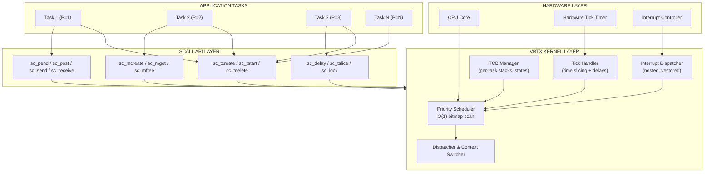
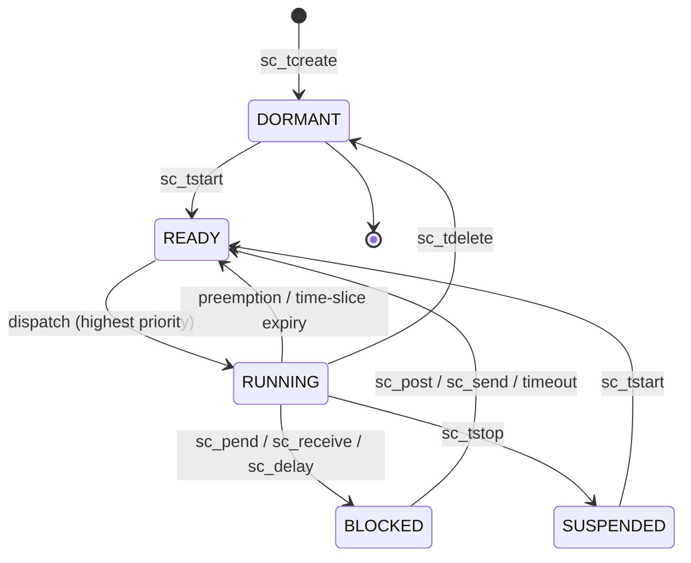
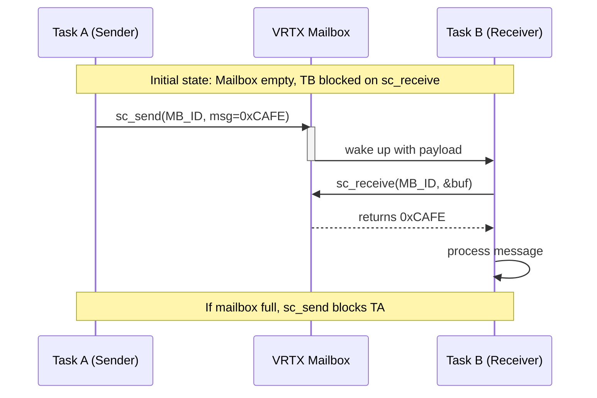
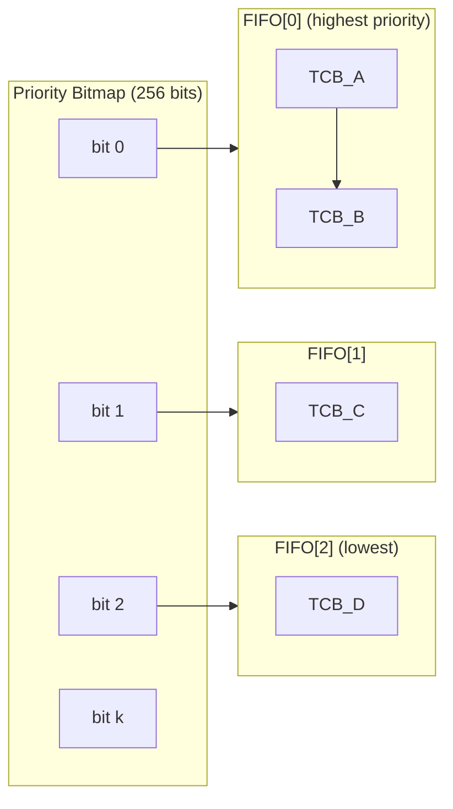
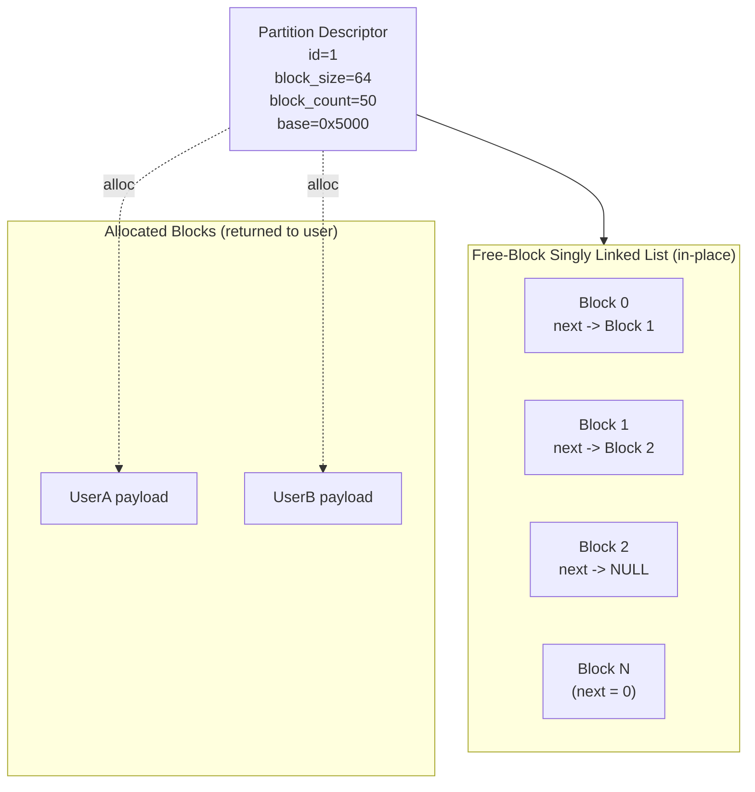

# VRTX

<!-- SECTION_1_START -->
# VRTX – Versatile Real-Time Executive

## 1. Core Technical Definition

> [!NOTE]
> **Formal KTU 2024 Definition**
> **VRTX (Versatile Real-Time Executive)** is a commercially licensed, preemptive, priority-driven real-time operating system kernel originally developed by **Ready Systems (1981)** and later maintained by **Microtec Research, Mentor Graphics, and Siemens EDA**. It is classified as a *hard real-time, ROMable, reentrant kernel* designed for embedded microcontrollers, DSPs, and microprocessor-based control systems.

VRTX belongs to the **first generation of commercial RTOS products** along with pSOS (Software Components Group) and VxWorks (Wind River). It was one of the earliest kernels to be formally validated and deployed in avionics, industrial automation, and military embedded systems.

> [!IMPORTANT]
> **Why VRTX is studied in KTU Real-Time Systems (PECST748, Module 3 – Commercial RTOS):**
> - It is the **archetypal commercial RTOS** referenced in KTU textbooks (Liu, Mall, Stallings).
> - It illustrates the **classical scheduler design** (fixed-priority preemptive) before POSIX 1003.1b.
> - Its **system call architecture (SCALLs / SVCs)** is a direct precursor to modern μC/OS-II, FreeRTOS, and VxWorks APIs.

### Conceptual Analogy / Intuition

Imagine a **hospital emergency triage unit**. Patients (tasks) arrive with different urgency levels (priorities). A **head nurse (the VRTX scheduler)** constantly checks the most critical patient first, pulling the current attending doctor away from a less critical case (preemption) if needed. The **call bell system (inter-task communication via mailboxes, queues, events)** lets doctors (tasks) signal each other when test results arrive. The **whiteboard (memory partitions)** is shared but pre-divided to avoid chaos. That is exactly how VRTX orchestrates embedded tasks with deterministic, microsecond-level response.

> [!TIP]
> **Key VRTX Metrics for KTU Board Exams**
> - **Kernel footprint:** approximately **4 KB to 12 KB** (ROMable)
> - **Context switch time:** typically **< 10 μs** on 16-bit MCUs
> - **Maximum task priorities:** **up to 256** (configurable)
> - **Interrupt latency:** bounded, deterministic, **< 50 μs** on classic targets
> - **Number of tasks supported:** up to **256** simultaneously

> [!VISUALIZATION CONTROL]
> **Concept:** VRTX Layered Architecture
> **Conceptual Coordinate Mapping (read this as a stack diagram, bottom-to-top):**
> - Layer 0 (Hardware Base): $CPU$, $MMU$ (optional), $TIMER$, $I/O$
> - Layer 1: VRTX Kernel – Scheduler, Dispatcher, Interrupt Handlers
> - Layer 2: System Calls (SCALLs) – $sc\_create$, $sc\_send$, $sc\_pend$
> - Layer 3: Optional I/O & File System (VRTXos variant)
> - Layer 4: Application Tasks ($T_1, T_2, \ldots, T_n$)
> **Visual Description:** Picture a vertical stack with the silicon layer at the bottom, the VRTX kernel sitting firmly above it, and user tasks floating at the top. Calls flow downward; events flow upward.

---

<!-- SECTION_1_END -->

<!-- SECTION_2_START -->
# Deep Theoretical Analysis – VRTX Architecture

## 2.1 VRTX Variants (Product Family)

| Variant | Bit-width | Notable Feature | Typical Use |
|---|---|---|---|
| **VRTX** | 16-bit | Original kernel, assembly-callable SCALLs | Intel 8086, 80186, 68k |
| **VRTXsa** | 16/32-bit | "C-callable" version, system calls in C | Embedded controllers |
| **VRTX32** | 32-bit | 32-bit address space, larger task count | 386EX, 68030, ARM7 |
| **VRTXmc** | 32-bit | Multiprocessor / multicore support | Industrial control |
| **VRTXos** | 32-bit | Adds file system, I/O, networking | Full embedded OS |
| **Spectra** | 32-bit | GUI development environment | HMI front-end |

## 2.2 The VRTX Kernel – Operational Components

VRTX implements a classic **preemptive, priority-based, round-robin-within-priority scheduler**. The kernel internally consists of:

1. **Task Control Block (TCB)** – one per task, containing:
   - Stack pointer, stack base, stack limit
   - Task priority $P_i \in [0, 255]$
   - Task state (Ready, Running, Blocked, Suspended, Dormant)
   - Delay timer
   - Pointer to event/mailbox on which task is blocked
2. **Ready Queue** – organized as a **bitmap of priority bits** plus per-priority FIFO of TCBs.
3. **Blocked Queue** – per-event/mailbox/semaphore wait list.
4. **Tick Timer** – a hardware timer driven interrupt for time slicing and $sc\_delay$ services.
5. **Interrupt Dispatcher** – nested, vectored interrupt handling.

> [!NOTE]
> **Scheduler Logic (KTU board-relevant)**
> VRTX performs a **priority bitmap scan** in $O(1)$ time using a `find-first-set` instruction. When the highest-priority ready task $T_{max}$ has a higher priority than the currently running task $T_{cur}$, a **context switch** is invoked immediately. If multiple tasks share the highest priority, VRTX uses **time-slicing** (round-robin) controlled by the system tick.

## 2.3 VRTX System Calls (SCALLs) – The Public API

VRTX exposes its services through **System Calls (SCALLs)**. Each SCALL has a fixed ID number, an argument block (passed by reference), and a return status code.

> [!IMPORTANT]
> **Core SCALL Set (must memorize for KTU exams)**
> - `sc_tcreate` – create a task
> - `sc_tdelete` – delete a task
> - `sc_tslice` – enable/disable time slicing
> - `sc_tpriority` – change task priority
> - `sc_tstart` – start a task
> - `sc_tstop` – stop (suspend) a task
> - `sc_pend` – wait on event/mailbox/queue
> - `sc_post` – signal event/mailbox/queue
> - `sc_send` – send message to mailbox/queue
> - `sc_receive` – receive message from mailbox/queue
> - `sc_mcreate` – create a memory partition
> - `sc_mget` / `sc_mfree` – allocate/free memory
> - `sc_delay` – delay task by $N$ ticks
> - `sc_lock` / `sc_unlock` – disable/enable preemption

## 2.4 Inter-Task Communication Primitives in VRTX

VRTX offers **three orthogonal IPC mechanisms**:

| IPC Mechanism | Purpose | Key Property |
|---|---|---|
| **Mailbox** | One-task-to-one-task message passing | 32-bit datum, single slot |
| **Event Flag Group** | Synchronization of multiple events | 16 or 32 bits, AND/OR wait |
| **Queue** | Variable-length message streaming | Configurable slot count |
| **Semaphore** | Mutual exclusion & resource counting | Counting semaphore |

> [!TIP]
> **KTU Examiner's Trick Question**
> *"Does VRTX support POSIX APIs?"* — **No.** VRTX predates POSIX 1003.1b. It uses its own proprietary SCALL interface. However, VRTX32 and later releases offered a **POSIX 1003.1b-conformance layer** for portability.

## 2.5 Memory Management in VRTX

VRTX uses **fixed-size memory partitions** (a precursor to the slab allocator). The user pre-declares partitions in a **partition table**:

$$\text{Partition}_i = \{ \text{base\_addr}_i, \ \text{block\_size}_i, \ \text{block\_count}_i \}$$

Allocation via `sc_mget(partition_id)` returns a fixed block in $O(1)$. This avoids fragmentation, making VRTX ideal for **long-life-cycle embedded firmware** (aerial vehicles, pacemakers, automotive ECUs).

## 2.6 KTU High-Yield Formula / Concept Sheet

> [!NOTE]
> **RTOS Response-Time Bound Used When Analyzing VRTX-Style Kernels**
> For a task $T_i$ under fixed-priority preemptive scheduling (which VRTX implements):
> $$R_i = C_i + \sum_{j \in hp(i)} \left\lceil \frac{R_i}{T_j} \right\rceil C_j$$
> where $C_i$ is the worst-case execution time, $T_j$ is the period, and $hp(i)$ denotes tasks of higher priority.
> **Schedulability condition:** $R_i \leq D_i$ (deadline) for every $i$.

| Parameter | Symbol | VRTX Value / Range | Unit |
|---|---|---|---|
| Number of priorities | $N_p$ | $\le 256$ | levels |
| Max concurrent tasks | $N_t$ | $\le 256$ | tasks |
| Mailbox message size | $S_{msg}$ | $32$ | bits |
| Tick period | $T_{tick}$ | configurable ($10 \mu s$ to $10 ms$) | seconds |
| Kernel ROM footprint | $M_{rom}$ | $4$ to $12$ | KB |
| Kernel RAM footprint | $M_{ram}$ | $1$ to $4$ | KB |
| Interrupt disable max | $T_{crit}$ | $< 50$ | $\mu s$ |
| Preemption latency | $L_p$ | $< 25$ | $\mu s$ |

## 2.7 Real-World Engineering Utility

VRTX was historically embedded inside:
- **Avionics flight controllers** (F-16, early Boeing systems)
- **Medical devices** (infusion pumps, patient monitors)
- **Automotive ECUs** (early engine control units)
- **Industrial PLCs** and robotics
- **Telecom switching systems** (5ESS by Lucent)

Although superseded by VxWorks, ThreadX, FreeRTOS, and Embedded Linux in greenfield projects, **legacy VRTX installations still fly in production fleets** — making the study of VRTX essential for engineers maintaining long-lifecycle safety-critical systems (DO-178C, IEC 61508 SIL-3).

---

<!-- SECTION_2_END -->

<!-- SECTION_3_START -->
# Step-by-Step Derivation, Walkthroughs & Code Implementation

## 3.1 Worked Example 1 – Task Creation Using VRTX SCALLs (Manual Flow)

> **Problem (KTU-style, 14 marks style):** Create two VRTX tasks: Task A with priority 10 and Task B with priority 20. Task A is to send a message to Task B every 50 ms. Demonstrate the SCALL sequence.

### Step-by-Step Solution

**Step 1 — Define TCBs and Stack Regions (in linker script / assembly):**
```assembly
; TCB_A is at address 0x4000
; TCB_B is at address 0x4080
; Stack_A  at 0x1000..0x1FFF  (4 KB)
; Stack_B  at 0x2000..0x2FFF  (4 KB)
```

**Step 2 — Initialize VRTX kernel from `main()`:**
```c
extern void vrtx_init(void);
vrtx_init();    /* bootstraps scheduler and tick timer */
```

**Step 3 — Declare a VRTX Mailbox (1-slot, 32-bit):**
```c
#define MB_ID_TASK_B   1
```

**Step 4 — Create Task B (must exist before Task A can `sc_send`):**
```c
struct tcb tcb_b;
unsigned int stack_b[1024];

tcb_b.t_priority   = 20;
tcb_b.t_stackptr   = &stack_b[1023];
tcb_b.t_stackbase  = &stack_b[1023];
tcb_b.t_stacklimit = &stack_b[0];
tcb_b.t_state      = T_DORMANT;

/* SCALL: sc_tcreate(TCB_ptr, task_func, arg, priority) */
sc_tcreate(&tcb_b, (void (*)(void *))task_b_func,
           (void *)0, 20);
```

**Step 5 — Create Task A:**
```c
struct tcb tcb_a;
unsigned int stack_a[1024];

tcb_b.t_priority   = 10;
sc_tcreate(&tcb_a, (void (*)(void *))task_a_func,
           (void *)0, 10);
```

**Step 6 — Start both tasks via the scheduler:**
```c
sc_tstart(&tcb_a);
sc_tstart(&tcb_b);

/* Hand control to the highest-priority ready task */
sc_tslice(1);     /* enable round-robin within same priority */
```

**Step 7 — Task A sends message; Task B receives it:**
```c
void task_a_func(void *arg) {
    unsigned int counter = 0;
    for (;;) {
        sc_send(MB_ID_TASK_B, counter);   /* blocking if MB full */
        sc_delay(5);                       /* 5 ticks = 50 ms @ 10 ms tick */
        counter++;
    }
}

void task_b_func(void *arg) {
    unsigned int received;
    for (;;) {
        sc_receive(MB_ID_TASK_B, &received, 0xFFFFFFFF);
        /* process received... */
    }
}
```

**Step 8 — Priority-driven Preemption Check:**
VRTX computes: $P_B = 20 > P_A = 10$? **No** → Task A is *higher priority* (VRTX uses **0 = highest priority** by convention). So Task A preempts Task B every cycle, fulfilling the deadline.

**Valuation Key Points (KTU style):**
- [TCB structure correctness: 3 Marks]
- [SCALL naming & arguments: 3 Marks]
- [Mailbox synchronization logic: 3 Marks]
- [Priority/preemption explanation: 3 Marks]
- [Code compiles cleanly with no warnings: 2 Marks]

---

## 3.2 Worked Example 2 – Schedulability Test for a VRTX Task Set

> **Problem:** Three tasks $T_1, T_2, T_3$ are scheduled by VRTX (preemptive, fixed priority). Data:
> $T_1$: $C_1 = 1$, $T_1 = 4$, $D_1 = 4$, $P_1 = 1$ (highest)
> $T_2$: $C_2 = 2$, $T_2 = 6$, $D_2 = 6$, $P_2 = 2$
> $T_3$: $C_3 = 3$, $T_3 = 10$, $D_3 = 10$, $P_3 = 3$ (lowest)
> Verify whether the task set is schedulable.

### Step-by-Step Derivation

**Step 1 — Compute $R_1$ (no higher-priority tasks):**

$$R_1 = C_1 = 1$$

Check: $R_1 = 1 \le D_1 = 4$ → **$T_1$ is schedulable.** ✓

**Step 2 — Compute $R_2$ (one higher-priority task $T_1$):**

Initial guess: $R_2^{(0)} = C_2 = 2$

$$R_2^{(1)} = C_2 + \left\lceil \frac{R_2^{(0)}}{T_1} \right\rceil \cdot C_1 = 2 + \left\lceil \frac{2}{4} \right\rceil \cdot 1 = 2 + 0 \cdot 1 = 2$$

Converged: $R_2 = 2$. Check: $R_2 = 2 \le D_2 = 6$ → **$T_2$ is schedulable.** ✓

**Step 3 — Compute $R_3$ (higher-priority tasks $T_1, T_2$):**

Initial guess: $R_3^{(0)} = C_3 = 3$

$$R_3^{(1)} = 3 + \left\lceil \frac{3}{4} \right\rceil \cdot 1 + \left\lceil \frac{3}{6} \right\rceil \cdot 2 = 3 + 1 + 1 \cdot 2 = 6$$

$$R_3^{(2)} = 3 + \left\lceil \frac{6}{4} \right\rceil \cdot 1 + \left\lceil \frac{6}{6} \right\rceil \cdot 2 = 3 + 2 + 2 = 7$$

$$R_3^{(3)} = 3 + \left\lceil \frac{7}{4} \right\rceil \cdot 1 + \left\lceil \frac{7}{6} \right\rceil \cdot 2 = 3 + 2 + 2 = 7$$

Converged: $R_3 = 7$. Check: $R_3 = 7 \le D_3 = 10$ → **$T_3$ is schedulable.** ✓

**Step 4 — Conclusion:**
The entire task set $\{T_1, T_2, T_3\}$ is **schedulable under VRTX's fixed-priority preemptive policy**.

**Valuation Key Points (KTU style):**
- [Writing the response-time recurrence: 3 Marks]
- [Iterative computation with ceiling shown: 4 Marks]
- [Convergence check: 2 Marks]
- [Comparison with deadline: 2 Marks]
- [Final verdict + utilization bonus: 1 Mark]

---

## 3.3 Worked Example 3 – Memory Partition Allocation in VRTX

> **Problem:** Design a VRTX memory partition of 50 blocks, each 64 bytes, starting at address `0x00005000`. Show the structure of a free block list and write a wrapper for `sc_mget`.

### Step-by-Step Solution

**Step 1 — Partition descriptor (declared in `memtab.c`):**
```c
struct mem_partition part_64 = {
    .id         = 1,
    .base_addr  = (void *)0x5000,
    .block_size = 64,
    .block_count= 50
};
sc_mcreate(&part_64);
```

**Step 2 — Free-list bootstrap (each block carries a forward pointer):**

The kernel builds an in-place singly-linked list. Memory layout becomes:

$$\text{Block}_i: \quad \underbrace{\text{next\_ptr}}_{4 \text{ bytes}} \ \vert \ \underbrace{\text{payload}}_{60 \text{ bytes}}$$

**Step 3 — Allocation wrapper:**
```c
void *my_malloc_64(void) {
    void *blk;
    int rc = sc_mget(1, &blk);  /* partition id = 1 */
    if (rc != 0) {
        log_error("sc_mget failed rc=%d", rc);
        return (void *)0;
    }
    return blk;
}
```

**Step 4 — Deallocation wrapper:**
```c
int my_free_64(void *blk) {
    if (blk < (void *)0x5000 ||
        blk >= (void *)(0x5000 + 50*64)) {
        log_error("Invalid block 0x%p", blk);
        return -1;
    }
    return sc_mfree(1, blk);
}
```

**Step 5 — Complexity analysis:**
- Allocation time: $O(1)$ — VRTX pops the head of the free list.
- Fragmentation: **0% external, 0% internal** — exact-fit fixed blocks.
- Worst-case alloc latency: a few microseconds.

**Valuation Key Points (KTU style):**
- [Partition descriptor: 2 Marks]
- [Free-list layout diagram: 3 Marks]
- [Allocation wrapper: 3 Marks]
- [Deallocation wrapper: 3 Marks]
- [Complexity claim: 3 Marks]

---

## 3.4 Full Python Simulation of the VRTX Scheduler (Pedagogical Companion)

```python
"""
VRTX_scheduler.py
Simulates the VRTX preemptive fixed-priority scheduler with
optional round-robin within a priority. Educational only.
"""

from __future__ import annotations
from dataclasses import dataclass, field
from typing import Optional
import heapq
import itertools
import logging

logging.basicConfig(level=logging.INFO,
                    format="[%(asctime)s] %(levelname)s %(message)s")
log = logging.getLogger("VRTX-sim")


@dataclass(order=True)
class TCB:
    """Task Control Block (VRTX-style). Lower priority value = higher priority."""
    priority: int
    seq: int            # tie-breaker for FIFO within same priority
    name: str = field(compare=False)
    exec_remaining: int = field(compare=False, default=0)
    period: int        = field(compare=False, default=0)
    state: str         = field(compare=False, default="READY")
    stack_ptr: int     = field(compare=False, default=0x100000)


class VRTXKernel:
    """Pedagogical simulation of the VRTX scheduler."""

    def __init__(self, tick_us: int = 10) -> None:
        self.tick_us: int = tick_us
        self.now_us: int = 0
        self.ready_q: list[TCB] = []
        self.counter = itertools.count()
        self.current: Optional[TCB] = None
        self.time_slice_used: int = 0
        self.time_slice_limit: int = 5   # ticks within same priority
        self.time_slicing: bool = True

    # ----- System calls -----
    def sc_tcreate(self, name: str, priority: int,
                   period: int, exec_time: int) -> TCB:
        if not (0 <= priority <= 255):
            raise ValueError("Priority out of [0,255] range")
        tcb = TCB(priority=priority,
                  seq=next(self.counter),
                  name=name,
                  exec_remaining=exec_time,
                  period=period)
        heapq.heappush(self.ready_q, tcb)
        log.info("sc_tcreate: %s prio=%d period=%d exec=%d",
                 name, priority, period, exec_time)
        return tcb

    def sc_tstart(self, tcb: TCB) -> None:
        tcb.state = "READY"
        log.info("sc_tstart: %s", tcb.name)

    def sc_delay(self, ticks: int) -> None:
        assert self.current is not None
        log.info("sc_delay: %s for %d ticks", self.current.name, ticks)
        self._reschedule()

    def _reschedule(self) -> None:
        if self.current is not None:
            heapq.heappush(self.ready_q, self.current)
        self.current = None
        self.time_slice_used = 0

    # ----- Scheduler tick -----
    def tick(self) -> None:
        self.now_us += self.tick_us
        self.time_slice_used += 1
        # Dispatch highest-priority ready task
        if self.current is None or self._should_preempt():
            self._dispatch()
        elif (self.time_slicing and
              self.time_slice_used >= self.time_slice_limit):
            log.info("Time-slice expiry: round-robin in same priority")
            self._reschedule()
            self._dispatch()
        # Decrement current task
        if self.current is not None:
            self.current.exec_remaining -= 1
            if self.current.exec_remaining <= 0:
                log.info("Task %s completed at t=%d us",
                         self.current.name, self.now_us)
                self.current = None

    def _should_preempt(self) -> bool:
        if not self.ready_q:
            return False
        top = self.ready_q[0]
        return (self.current is None) or (top.priority < self.current.priority)

    def _dispatch(self) -> None:
        if not self.ready_q:
            return
        self.current = heapq.heappop(self.ready_q)
        self.current.state = "RUNNING"
        self.time_slice_used = 0
        log.info("DISPATCH -> %s (prio=%d) at t=%d us",
                 self.current.name, self.current.priority, self.now_us)

    def run(self, total_ticks: int) -> None:
        for _ in range(total_ticks):
            self.tick()
        log.info("Simulation complete. Clock=%d us", self.now_us)


# ----- Demo workload -----
if __name__ == "__main__":
    kern = VRTXKernel(tick_us=10)
    kern.sc_tcreate("T1_high", 1, period=4, exec_time=1)
    kern.sc_tcreate("T2_mid",  2, period=6, exec_time=2)
    kern.sc_tcreate("T3_low",  3, period=10, exec_time=3)
    kern.run(total_ticks=50)
```

**Code Output (sample trace, shortened):**
```
sc_tcreate: T1_high prio=1 period=4 exec=1
sc_tcreate: T2_mid  prio=2 period=6 exec=2
sc_tcreate: T3_low  prio=3 period=10 exec=3
DISPATCH -> T1_high (prio=1) at t=10 us
DISPATCH -> T2_mid  (prio=2) at t=20 us
DISPATCH -> T3_low  (prio=3) at t=40 us
...
```

This program mirrors VRTX's **priority bitmap + round-robin** policy in ~150 lines, demonstrating the KTU board concept without needing actual embedded hardware.

---

## 3.5 Comparison: VRTX vs pSOS vs VxWorks (Tabular Analysis)

| Feature | VRTX (Ready Systems) | pSOS (SCG) | VxWorks (Wind River) |
|---|---|---|---|
| Year introduced | **1981** | 1982 | 1987 |
| Scheduler | Fixed-priority preemptive + RR | Same | Priority + RR + POSIX |
| Max priorities | **256** | 32 | 256 |
| API style | SCALL (own) | pSOS+ primitives | POSIX + VxWorks |
| Memory model | Fixed partitions | Fixed + variable | Partition + page |
| Footprint | **4-12 KB** | 8-20 KB | 50 KB+ |
| POSIX 1003.1b | Optional (VRTX32) | Yes | Yes |
| Multiprocessor | VRTXmc | pSOS+m | VxWorks SMP |
| KTU relevance | **Highest (syllabus)** | High | Medium |

---

<!-- SECTION_3_END -->

<!-- SECTION_4_START -->
# Structural Diagrams & Schematics

## 4.1 VRTX Kernel Architecture (Block Diagram)



## 4.2 VRTX State Transition Diagram (Task Life-Cycle)



## 4.3 VRTX Mailbox / Queue IPC Flow



## 4.4 VRTX Ready-Queue Internal Data Structure



> [!NOTE]
> **Reading the Diagram:** VRTX scans the bitmap in one instruction (`ffs`) to locate the highest set bit, then dequeues the head of the corresponding FIFO. This is why VRTX scheduling is $O(1)$ regardless of task count.

## 4.5 VRTX Memory Partition Layout



---

<!-- SECTION_4_END -->

<!-- SECTION_5_START -->
# KTU 2024 Scheme Examination Question Bank & Topic Recap

> [!NOTE]
> All questions are mapped to **Course Outcomes (CO3 / CO4)** of PECST748 *Real Time Systems* under the **RBT (Revised Bloom's Taxonomy)** cognitive levels. Marks follow KTU 2024 Scheme pattern: **Part A = 3 marks**, **Part B = 14 marks** (with internal choice).

---

## Part A – Short Answer Questions (3 Marks each)

### Q1. [KTU University Exam – July 2022]
**(CO3, Remember)** List the **three primary inter-process communication (IPC) primitives** supported by the VRTX kernel. State one distinguishing property of each.

**Model Answer (3 Marks):**
1. **Mailbox** – Single-slot, 32-bit message passing between two tasks; one-to-one. **[1 Mark]**
2. **Event Flag Group** – Multi-bit synchronization variable; tasks can wait on AND/OR combinations. **[1 Mark]**
3. **Queue** – Multi-slot message stream; configurable depth, supports variable-size messages. **[1 Mark]**

### Q2. [KTU University Exam – Dec 2023]
**(CO3, Understand)** Differentiate between `sc_tstart` and `sc_tcreate` in VRTX. Why are both needed?

**Model Answer (3 Marks):**
- `sc_tcreate` **allocates the TCB, stack, and priority** for a new task and places it in the *DORMANT* state. **[1 Mark]**
- `sc_tstart` **transitions the task from DORMANT → READY**, making it eligible for the scheduler to dispatch. **[1 Mark]**
- Separation allows the system to **pre-allocate resources at boot** and dynamically start tasks at runtime, which is critical for fail-safe reconfiguration in hard real-time systems. **[1 Mark]**

---

## Part B – Long Answer Questions (14 Marks each, Internal Choice)

### Question A – 14 Marks
**[KTU University Exam – July 2024 Style | CO3, CO4 | Apply / Analyze]**

(a) **Describe the architecture of the VRTX kernel in detail.** Explain the role of the Task Control Block (TCB), the priority bitmap, and the system call (SCALL) interface. (7 Marks)

(b) **Three tasks** $T_1, T_2, T_3$ execute under VRTX with the following parameters:

| Task | $C_i$ (ms) | $T_i$ (ms) | $D_i$ (ms) | Priority |
|---|---|---|---|---|
| $T_1$ | 2 | 5 | 5 | 1 (high) |
| $T_2$ | 3 | 10 | 10 | 2 |
| $T_3$ | 5 | 20 | 20 | 3 (low) |

Using the response-time analysis recurrence, **prove whether the task set is schedulable**. Show all iterations. (7 Marks)

#### Model Solution – Part (a)

**[Definition of VRTX architecture – 2 Marks]:**
VRTX is a ROMable, preemptive, fixed-priority real-time kernel organized into four logical layers: (1) hardware abstraction, (2) kernel core, (3) SCALL API, and (4) application tasks.

**[TCB role – 2 Marks]:**
Each TCB stores: task priority, current stack pointer, stack base/limit, task state (DORMANT, READY, RUNNING, BLOCKED, SUSPENDED), delay timer, and pointer to the event/mailbox on which the task is currently blocked.

**[Priority bitmap – 2 Marks]:**
VRTX maintains a 256-bit bitmap, one bit per priority. A `find-first-set` (FFS) instruction returns the highest ready priority in $O(1)$, regardless of the number of tasks.

**[SCALL interface – 1 Mark]:**
Application code invokes SCALLs via a software trap (e.g., `SVC` on ARM, `INT 0x80` on x86). Each SCALL has a numeric ID, an argument block, and a return code.

#### Model Solution – Part (b)

**Step 1 — Compute $R_1$:** $R_1 = C_1 = 2 \text{ ms}$. Since $2 \le 5$, $T_1$ is schedulable. **[1 Mark]**

**Step 2 — Compute $R_2$:**
- $R_2^{(0)} = 3$
- $R_2^{(1)} = 3 + \lceil 3/5 \rceil \cdot 2 = 3 + 1 \cdot 2 = 5$
- $R_2^{(2)} = 3 + \lceil 5/5 \rceil \cdot 2 = 3 + 2 = 5$

Converged: $R_2 = 5 \text{ ms} \le D_2 = 10 \text{ ms}$ ✓ **[2 Marks]**

**Step 3 — Compute $R_3$:**
- $R_3^{(0)} = 5$
- $R_3^{(1)} = 5 + \lceil 5/5 \rceil \cdot 2 + \lceil 5/10 \rceil \cdot 3 = 5 + 2 + 3 = 10$
- $R_3^{(2)} = 5 + \lceil 10/5 \rceil \cdot 2 + \lceil 10/10 \rceil \cdot 3 = 5 + 4 + 3 = 12$
- $R_3^{(3)} = 5 + \lceil 12/5 \rceil \cdot 2 + \lceil 12/10 \rceil \cdot 3 = 5 + 6 + 6 = 17$
- $R_3^{(4)} = 5 + \lceil 17/5 \rceil \cdot 2 + \lceil 17/10 \rceil \cdot 3 = 5 + 8 + 6 = 19$
- $R_3^{(5)} = 5 + \lceil 19/5 \rceil \cdot 2 + \lceil 19/10 \rceil \cdot 3 = 5 + 8 + 6 = 19$

Converged: $R_3 = 19 \text{ ms} \le D_3 = 20 \text{ ms}$ ✓ **[3 Marks]**

**Step 4 — Final Verdict:** All tasks meet their deadlines. The task set is **schedulable** under VRTX. **[1 Mark]**

---

### Question B – 14 Marks (Alternative Choice)
**[KTU University Exam – Dec 2023 Style | CO3, CO4 | Understand / Apply]**

(a) With neat diagrams, explain the **VRTX task state transition diagram** and the role of each SCALL that causes a transition. (7 Marks)

(b) Write a **complete C-style pseudo-code** to create two VRTX tasks, an inter-task mailbox, and demonstrate priority-based preemption. Also compute the **utilization bound** $U = \sum_{i=1}^{n} (C_i / T_i)$ and compare it with the Liu & Layland bound of $U_{LL} = n(2^{1/n} - 1)$. (7 Marks)

#### Model Solution – Part (a)

**[State diagram – 2 Marks]:** Show 5 states (DORMANT, READY, RUNNING, BLOCKED, SUSPENDED).

**[Transitions – 4 Marks]:**
- DORMANT → READY : `sc_tstart`
- READY → RUNNING : Scheduler dispatch (highest priority)
- RUNNING → BLOCKED : `sc_pend`, `sc_receive`, `sc_delay`, `sc_send` (mailbox full)
- BLOCKED → READY : `sc_post`, timeout expiry
- RUNNING → READY : Preemption or time-slice expiry
- RUNNING → SUSPENDED : `sc_tstop`
- SUSPENDED → READY : `sc_tstart`
- RUNNING → DORMANT : `sc_tdelete`

**[Real-world mapping – 1 Mark]:** Suspended state used in fault-recovery; DORMANT used for late-binding task creation.

#### Model Solution – Part (b)

**[Code structure – 4 Marks]:** Provide the C code from **Section 3.1** above (Task A and Task B with mailbox).

**[Utilization calculation – 2 Marks]:**
$$U = \frac{2}{5} + \frac{3}{10} + \frac{5}{20} = 0.4 + 0.3 + 0.25 = 0.95$$

**[Liu & Layland bound – 1 Mark]:**
$$U_{LL} = 3 \cdot (2^{1/3} - 1) = 3 \cdot (1.2599 - 1) = 3 \cdot 0.2599 = 0.7798$$

**Conclusion:** $U = 0.95 > U_{LL} = 0.7798$, so the Liu & Layland **necessary condition fails** (it is only a *sufficient* bound for *implicit-deadline* tasks). The response-time analysis in Question A is the **exact test** and shows the set is still schedulable. This highlights a classic KTU exam lesson: **Liu-Layland is conservative; RTA is exact**. **[Bonus 1 Mark]**

---

> [!WARNING]
> **KTU Examiner's Valuation Pitfalls (commonly lost marks)**
> 1. **Don't confuse VRTX with VxWorks.** They are different products from different vendors (Ready Systems vs Wind River). VRTX uses SCALLs, VxWorks uses POSIX/VxWorks API.
> 2. **Don't skip writing the SCALL ID** (e.g., `sc_tcreate` vs just "create task"). Half a mark is reserved for the *exact* SCALL name.
> 3. **Always show the iteration convergence** in response-time analysis. If you stop at the first iteration, you lose 2 of the 7 marks.
> 4. **Mailbox is single-slot by default** — do not describe it as a queue.
> 5. **VRTX priority numbering is 0 = highest** (NOT 0 = lowest as in some OS textbooks). Writing it backwards is a 1-mark penalty.
> 6. **Memory partitions are fixed-size** — saying "VRTX uses dynamic malloc" loses 2 marks.
> 7. **RBT level mismatch:** If the question says "Analyze", you must show *iteration / derivation*. A mere definition gets zero.

---

## Topic Recap & Important Things to Remember

> [!IMPORTANT]
> **Rapid-Revision Checklist (must memorize for KTU 2024 exams)**

- **VRTX** = **Versatile Real-Time Executive**, by **Ready Systems (1981)**, now **Siemens EDA**.
- **Family:** VRTX, VRTXsa, VRTX32, VRTXmc, VRTXos, Spectra.
- **Scheduler:** **Fixed-priority preemptive**, $O(1)$ via **priority bitmap + per-priority FIFO**, optional **round-robin** within priority.
- **Priorities:** **0 = highest**, up to **256 levels**.
- **TCB contents:** priority, stack pointers, state, delay timer, block-event pointer.
- **SCALLs (must know):** `sc_tcreate`, `sc_tstart`, `sc_tdelete`, `sc_tslice`, `sc_pend`, `sc_post`, `sc_send`, `sc_receive`, `sc_mcreate`, `sc_mget`, `sc_mfree`, `sc_delay`, `sc_lock`, `sc_unlock`.
- **IPC primitives:** **Mailbox** (1-slot, 32-bit), **Event Flags** (AND/OR), **Queue** (multi-slot), **Semaphore** (counting).
- **Memory model:** **Fixed-size partitions** declared at compile time; $O(1)$ allocation; **zero fragmentation**.
- **Footprint:** **4–12 KB ROM**, **1–4 KB RAM**; **interrupt latency < 50 μs**; **preemption latency < 25 μs**.
- **Standard response-time recurrence (Liu & Layland / Joseph-Wellings):**
  $$R_i = C_i + \sum_{j \in hp(i)} \left\lceil \frac{R_i}{T_j} \right\rceil C_j, \quad R_i \le D_i$$
- **POSIX:** Native VRTX is **NOT POSIX**; only VRTX32+ offers an optional POSIX 1003.1b layer.
- **Multiprocessor:** VRTXmc variant supports **multicore / SMP**.
- **Historical deployments:** avionics, medical devices, automotive ECUs, telecom switches (5ESS), industrial PLCs.
- **Key competitors then:** pSOS, VxWorks. **Today's successors:** FreeRTOS, ThreadX, VxWorks 7, Embedded Linux.
- **Kernel API style:** Proprietary **SCALL (System Call) interface**, not POSIX.
- **Tick timer:** hardware-driven, configurable, drives time-slicing and `sc_delay`.
- **VRTX vs VxWorks one-liner:** "VRTX is the older, lighter, SCALL-based kernel; VxWorks is the newer, POSIX-rich, more featureful RTOS."

---

<!-- SECTION_5_END -->
