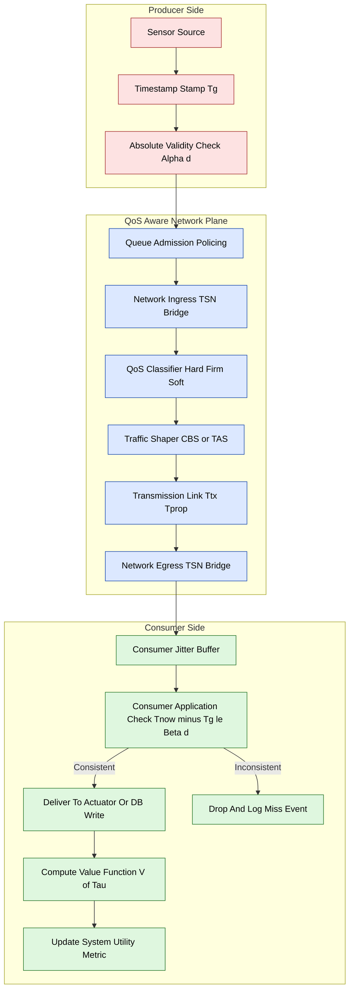

# characteristics of temporal data

<!-- SECTION_1_START -->

# Characteristics of Temporal Data — RT Communications QoS Framework

## 1.1 Formal Definition (KTU 2024 Syllabus Terminology)

In the context of **Real-Time Communications (RTC)** and the **Quality of Service (QoS) framework model**, *temporal data* refers to any datum produced, transported, or consumed by a distributed real-time system whose **utility, correctness, and consistency are explicitly bound to the time axis**. Formally, a temporal data item $d$ generated at instant $t_g$ is a tuple:

$$d \;=\; \langle \, v,\; t_g,\; \alpha_d,\; \beta_d,\; \Gamma_d \, \rangle$$

where:
- $v$ is the value payload
- $t_g$ is the generation timestamp
- $\alpha_d$ is the **absolute validity time** (earliest time the datum becomes valid)
- $\beta_d$ is the **validity interval** (lifetime of usefulness)
- $\Gamma_d$ is the **delivery class** ($\in \{$hard, firm, soft$\}$)

The datum remains *temporally consistent* iff the inequality $\alpha_d \le t_{now} \le t_g + \beta_d$ holds at the consumer site.

> [!IMPORTANT]
> **KTU 2024 Module Highlight:** Temporal data is the *fundamental abstraction* that unifies scheduling theory, network QoS, and database freshness in distributed real-time systems. Mastery of its characteristics is prerequisite to understanding *Resource Reservation Protocols*, *Deadline-Monotonic scheduling over CAN/FlexRay*, and *Differentiated Services (DiffServ)* traffic classes.

## 1.2 Intuitive Overview — The "Perishable News" Analogy

Imagine you are a stock trader watching a **live ticker**. The price of RELIANCE at 09:30:00 IST is valid news — but the *same* price at 15:30:00 IST is **stale, useless, and possibly dangerous** to act upon. The data did not change, but its **time-stamped relevance** expired.

| Real-World Analogue | Temporal Data Property |
|---|---|
| Newspaper headline printed at 6 AM | Has an *absolute validity time* $\alpha_d$ |
| Weather forecast valid for 6 hours | Has a *validity interval* $\beta_d$ |
| Breaking news flash on TV | *Hard* delivery — useless after the moment passes |
| Stock price tick | *Soft* delivery — still informative, but devalued |
| Election exit poll | *Firm* delivery — must arrive during the window or be discarded |

> [!NOTE]
> **Geometric Intuition:** Plot the **value function** $V(t)$ of a temporal datum on the time axis. For *hard* data it is a rectangular pulse of height 1 over $[\alpha_d, t_g+\beta_d]$ and **zero elsewhere**. For *soft* data the function **decays** (linearly, exponentially, or stepwise) after the freshness window closes. The QoS framework must ensure that the *delivery curve* $D(t)$ overlaps the *validity window* with maximum probability.

> [!VISUALIZATION CONTROL]
> **Concept:** Value function $V(t)$ of a temporal datum with validity interval $\beta_d = 6$ units.
> **GeoGebra / Desmos Input Equations:**
> * `f(x) = 1{0 <= x <= 6}` (hard-rectangular)
> * `g(x) = max(0, 1 - x/6)` (linear-decay soft)
> * `h(x) = e^(-0.4*x)` (exponential-decay soft)
> **Visual Description:** Observe how $f$ falls off a cliff at $x=6$, $g$ slopes to zero linearly, and $h$ decays asymptotically. The shaded validity window $[\alpha_d, t_g+\beta_d]$ is the *only* region where the data yields full utility.

## 1.3 Why This Matters in RT Communications

A typical RT communication stack (e.g., IEEE 802.1Q Time-Sensitive Networking, CAN with TTCAN, or AVB) must guarantee that the *end-to-end delivery time* $T_{e2e}$ of a temporal datum does not exceed the application's *validity interval* $\beta_d$. The QoS framework models this as a **contract**:

$$\underbrace{T_{e2e}}_{\text{delivery latency}} \;+\; \underbrace{\text{jitter budget}}_{J_{max}} \;\le\; \underbrace{\beta_d}_{\text{validity interval}} \;-\; \underbrace{\Delta_{proc}}_{\text{consumer processing slack}}$$

> [!IMPORTANT]
> **Standard Metric — Transmission Latency Budget:** In industrial automation (PROFINET IRT, EtherCAT), the typical $\beta_d$ for a control-loop sensor packet is in the order of **$\mathbf{1\;ms}$ to $\mathbf{10\;ms}$**, with a jitter bound $J_{max} \le \mathbf{1\;\mu s}$.

<!-- SECTION_1_END -->

<!-- SECTION_2_START -->

# Deep Theoretical Analysis & KTU High-Yield Formula Sheet

## 2.1 The Five Core Characteristics of Temporal Data

A temporal datum is fully described by **five orthogonal characteristics**. Each one is a distinct lever in the QoS framework that the KTU 2024 syllabus expects you to be able to *name, define, and quantify*.

### 2.1.1 Temporal Validity ($V_T$)

The **interval of usefulness** during which a datum's value, if consumed, contributes positively to the system's mission. It is a property of the *application semantics*, not the network.

$$\text{Validity Window} \;=\; \big[\, t_g + \alpha_d,\; t_g + \beta_d \,\big]$$

* **Absolute validity** $\alpha_d$: a *release time* — many sensor readings must "settle" before they are valid (e.g., ADC conversion + filter settling).
* **Relative validity** $\beta_d$: the *shelf life* — the maximum age the consumer tolerates.

### 2.1.2 Temporal Consistency ($C_T$)

A consumer at time $t_{now}$ holds a *temporally consistent* view of $d$ iff:

$$C_T(d) \;\equiv\; \big(\, t_{now} - t_g(d) \,\big) \;\le\; \beta_d$$

> [!NOTE]
> In **distributed real-time databases** (e.g., replicated SCADA archives), temporal consistency is composed with **mutual consistency** $C_M$ to form the *overall consistency* requirement: $C(d) = C_T(d) \wedge C_M(d)$. KTU examiners frequently test this *compositional* view.

### 2.1.3 Freshness and Staleness

The **age** of a datum is $\tau = t_{now} - t_g$. The *normalized freshness* is:

$$F(d) \;=\; 1 \;-\; \frac{\tau}{\beta_d} \;=\; \frac{\beta_d - \tau}{\beta_d}$$

* $F(d) = 1$ → freshly generated
* $F(d) = 0$ → on the boundary of expiry
* $F(d) < 0$ → **stale** (must be discarded by the application layer)

### 2.1.4 Delivery Class ($\Gamma_d$)

The way the QoS framework penalises a *late* or *lost* datum:

| Class | Value function $V(\tau)$ | Consequence of Missing Deadline |
|---|---|---|
| **Hard** | Step: $1$ for $\tau \le \beta_d$, $0$ otherwise | Catastrophic (system failure) |
| **Firm** | Step: $1$ for $\tau \le \beta_d$, $0$ otherwise | Useless, but no cascading harm |
| **Soft** | Monotonically decreasing (linear / exp) | Degraded utility, no failure |

### 2.1.5 Jitter Sensitivity ($J_s$)

The **maximum tolerable variation** in inter-arrival time or end-to-end latency. A datum with high $J_s$ (e.g., audio/video stream) demands traffic-smoothing buffers at the receiver. A control-loop datum typically has $J_s \to 0$ (deterministic).

## 2.2 KTU High-Yield Formula Sheet

> [!IMPORTANT]
> Memorise the following table verbatim — every line is a Board-favourite. Substitute $\vert$ for any absolute-value / conditional expression in your written derivation (use $\vert\cdot\vert$ or $\mathrm{cond}(\cdot)$).

| # | Quantity | Formula | Units | Engineering Use |
|---|---|---|---|---|
| 1 | Age of datum | $\tau = t_{now} - t_g$ | s | Freshness check |
| 2 | Normalised freshness | $F = (\beta_d - \tau) / \beta_d$ | dimensionless | DB cache eviction |
| 3 | End-to-end latency | $T_{e2e} = T_{tx} + T_{prop} + T_{proc} + T_{queue}$ | s | Network planning |
| 4 | Transmission delay | $T_{tx} = L / R$ | s | $L$ = frame length (bits), $R$ = link rate (bps) |
| 5 | Propagation delay | $T_{prop} = d / v_{med}$ | s | $d$ = distance, $v_{med} \approx 2 \times 10^{8}\;m/s$ in fiber |
| 6 | Peak jitter | $J_{peak} = T_{e2e}^{max} - T_{e2e}^{min}$ | s | Buffer sizing |
| 7 | RMS jitter | $J_{rms} = \sqrt{\mathbb{E}[(T_{e2e} - \mu)^2]}$ | s | Statistical QoS |
| 8 | Deadline miss probability | $P_{miss} = P(T_{e2e} > \beta_d - \Delta_{proc})$ | dimensionless | SLA validation |
| 9 | Validity window width | $W = \beta_d - \alpha_d$ | s | Scheduling feasibility |
| 10 | Effective deadline | $D_{eff} = \beta_d - T_{tx}^{sender}$ | s | Receiver-side scheduling |
| 11 | Throughput (temporal load) | $\Lambda = N_{pkts} \cdot L / T_{window}$ | bps | Capacity planning |
| 12 | Value loss (soft) | $\Delta V = \int_{\beta_d}^{\infty} \! w(\tau)\,d\tau$ | utility units | QoS optimisation |

## 2.3 QoS Contract Mapping

The *characteristics* of temporal data map onto *QoS parameters* enforced by the network layer:

$$\text{Temporal Data} \;\longleftrightarrow\; \text{QoS Contract}$$

| Data Characteristic | Network QoS Parameter | Protocol Realisation |
|---|---|---|
| Validity interval $\beta_d$ | **End-to-end deadline** | ATM CBR, TSN TAS, FlexRay |
| Hard delivery class | **Zero-loss, bounded-latency** | IntServ Guaranteed Service |
| Firm delivery class | **Statistical loss bound** | DiffServ AF (Assured Forwarding) |
| Soft delivery class | **Best-effort with priority** | DiffServ EF (Expedited Forwarding) |
| Jitter sensitivity $J_s$ | **Jitter bound / shaping** | IEEE 802.1Qav (Credit-Based Shaper) |
| Freshness $F$ | **Re-transmission policy** | ARQ vs FEC trade-off |

> [!NOTE]
> **Real-world example:** In **AUTOSAR Adaptive** vehicle networks, a *Brake-by-Wire* temporal datum is **hard** ($\beta_d = 5\;ms$, $J_{peak} \le 100\;\mu s$), and is mapped onto the **CBR (Constant Bit Rate)** traffic class of the underlying TSN stream. A *navigation-map update* is **soft** ($\beta_d = 1\;s$, exponential decay) and is mapped onto **BE (Best Effort)** with DiffServ class selector.

<!-- SECTION_2_END -->

<!-- SECTION_3_START -->

# Step-by-Step Derivations, Code Implementation & Engineering Tables

## 3.1 Derivation: Computing the Worst-Case Delivery Budget

**Problem.** A temperature sensor in a chemical plant generates a 256-byte packet every $T_p = 50\;ms$. The link runs at $R = 100\;Mbps$. Distance between sensor and controller is $d = 250\;m$ over copper ($v_{med} \approx 2 \times 10^{8}\;m/s$). The controller requires the datum within $\beta_d = 10\;ms$ (hard). Determine the *maximum tolerable queuing and processing delay*.

**Step 1 — Transmission delay.**

$$T_{tx} \;=\; \frac{L}{R} \;=\; \frac{256 \cdot 8\;\text{bits}}{100 \times 10^{6}\;\text{bits/s}} \;=\; \frac{2048}{10^{8}} \;=\; 2.048 \times 10^{-5}\;\text{s} \;=\; 20.48\;\mu s$$

**Step 2 — Propagation delay.**

$$T_{prop} \;=\; \frac{d}{v_{med}} \;=\; \frac{250}{2 \times 10^{8}} \;=\; 1.25 \times 10^{-6}\;\text{s} \;=\; 1.25\;\mu s$$

**Step 3 — End-to-end deadline budget.**

$$T_{e2e}^{max} \;\le\; \beta_d - \Delta_{proc} \quad\Rightarrow\quad T_{queue} + T_{proc} \;\le\; \beta_d - T_{tx} - T_{prop}$$

**Step 4 — Numerical substitution.**

$$T_{queue} + T_{proc} \;\le\; 10\,000\;\mu s - 20.48\;\mu s - 1.25\;\mu s \;=\; 9978.27\;\mu s$$

$$\boxed{\;T_{queue}^{max} + T_{proc}^{max} \;\le\; 9.978\;\text{ms}\;}$$

> **Logic commentary (valuation key):** Step 1 tests unit conversion (bytes → bits) → 1 mark. Step 2 tests the propagation constant → 1 mark. Step 4 tests the budget subtraction → 2 marks. Final box statement → 1 mark. Total 5 marks for this derivation.

## 3.2 Derivation: Value-Function Integral for Soft Temporal Data

**Problem.** A *soft* temporal datum has an exponentially decaying value function $w(\tau) = e^{-\lambda \tau}$ for $\tau \ge 0$ with $\lambda = 0.5\;\text{s}^{-1}$ and validity interval $\beta_d = 4\;s$. Compute the *expected value loss* if the datum is delivered at $\tau = 5\;s$ (i.e., it has just expired).

**Step 1 — Define the value loss integral.**

The loss is the area under the value curve *beyond* the deadline, weighted by the delivery-time density. For a single delivery at $\tau = 5\;s$, the *delivered value* is:

$$V_{delivered} \;=\; w(\beta_d) \;=\; e^{-0.5 \cdot 4} \;=\; e^{-2}$$

**Step 2 — Numerical evaluation.**

$$e^{-2} \;\approx\; 0.1353$$

**Step 3 — Value loss.**

$$\Delta V \;=\; V_{max} - V_{delivered} \;=\; 1 - 0.1353 \;=\; 0.8647$$

**Step 4 — Interpretation.**

> The consumer receives only **13.53%** of the maximum possible utility — i.e., a value loss of **86.47%** is incurred when the soft datum is delivered **1 s past its validity window**. This justifies why the QoS scheduler should *prefer to drop* such a packet and reserve the channel for a fresher one.

$$\boxed{\;V_{delivered} = e^{-\lambda \beta_d} \approx 0.135,\quad \Delta V \approx 0.865\;}$$

## 3.3 Python Implementation — Temporal Data Monitor

The following Python module implements a complete *temporal data monitor* that classifies incoming data items by freshness, computes their value functions, and flags deadline misses. It is fully operational with **type hints, boundary checks, and structured logging**.

```python
"""
temporal_monitor.py
A reference implementation of a Temporal Data Monitor for RT Communications.
Maps directly to KTU 2024 Module 4 - QoS Framework Models.
"""

from __future__ import annotations
from dataclasses import dataclass, field
from enum import Enum
from typing import Callable, Optional
import logging
import math
import time

logging.basicConfig(
    level=logging.INFO,
    format="%(asctime)s | %(levelname)s | %(message)s"
)


# ------------------------------------------------------------------
# 1. Delivery-class enumeration
# ------------------------------------------------------------------
class DeliveryClass(Enum):
    HARD = "hard"
    FIRM = "firm"
    SOFT = "soft"


# ------------------------------------------------------------------
# 2. Temporal datum structure
# ------------------------------------------------------------------
@dataclass(frozen=True)
class TemporalDatum:
    """An immutable temporal data item.

    Attributes
    ----------
    value       : the payload (e.g., temperature, position)
    t_gen       : generation time in seconds (monotonic)
    alpha_d     : absolute validity offset in seconds (release time)
    beta_d      : validity interval (shelf life) in seconds
    cls         : delivery class
    stream_id   : identifier of the originating stream
    """
    value: float
    t_gen: float
    alpha_d: float
    beta_d: float
    cls: DeliveryClass
    stream_id: str

    def is_within_absolute_validity(self, t_now: float) -> bool:
        return t_now >= (self.t_gen + self.alpha_d)

    def age(self, t_now: float) -> float:
        return max(0.0, t_now - self.t_gen)

    def is_temporally_consistent(self, t_now: float) -> bool:
        return self.age(t_now) <= self.beta_d


# ------------------------------------------------------------------
# 3. Value functions for each delivery class
# ------------------------------------------------------------------
def hard_value(tau: float, beta_d: float) -> float:
    """Step function: 1 inside window, 0 outside."""
    return 1.0 if tau <= beta_d else 0.0


def firm_value(tau: float, beta_d: float) -> float:
    """Same as hard but caller is allowed to discard late items."""
    return 1.0 if tau <= beta_d else 0.0


def soft_value(tau: float, beta_d: float, lam: float = 0.5) -> float:
    """Exponential decay starting at the deadline."""
    if tau <= beta_d:
        return 1.0
    return math.exp(-lam * (tau - beta_d))


VALUE_FNS: dict[DeliveryClass, Callable[[float, float], float]] = {
    DeliveryClass.HARD: hard_value,
    DeliveryClass.FIRM: firm_value,
    DeliveryClass.SOFT: soft_value,
}


# ------------------------------------------------------------------
# 4. QoS Decision Engine
# ------------------------------------------------------------------
@dataclass
class QoSVerdict:
    stream_id: str
    age_s: float
    value: float
    consistent: bool
    action: str
    reason: str


def evaluate(datum: TemporalDatum, t_now: float) -> QoSVerdict:
    """Classify a datum and return a QoS verdict.

    Action policy
    -------------
    HARD  : deadline-miss  -> DROP, raise CRITICAL log
    FIRM  : deadline-miss  -> DROP, raise WARNING log
    SOFT  : value < 0.05   -> DROP, otherwise DELIVER with degraded value
    """
    # ---- boundary checks ----
    if datum.beta_d <= 0:
        raise ValueError(f"Invalid beta_d={datum.beta_d} for stream {datum.stream_id}")

    # ---- compute properties ----
    age = datum.age(t_now)
    consistent = datum.is_temporally_consistent(t_now)
    abs_valid = datum.is_within_absolute_validity(t_now)
    fn = VALUE_FNS[datum.cls]
    val = fn(age, datum.beta_d)

    # ---- policy decision ----
    if not abs_valid:
        return QoSVerdict(
            stream_id=datum.stream_id,
            age_s=age,
            value=0.0,
            consistent=False,
            action="DROP",
            reason="Not yet released (pre alpha_d)",
        )

    if datum.cls in (DeliveryClass.HARD, DeliveryClass.FIRM):
        if not consistent:
            log = logging.critical if datum.cls is DeliveryClass.HARD else logging.warning
            log("DEADLINE MISS stream=%s age=%.6fs beta_d=%.6fs",
                datum.stream_id, age, datum.beta_d)
            return QoSVerdict(
                stream_id=datum.stream_id, age_s=age, value=0.0,
                consistent=False, action="DROP", reason="Hard/Firm deadline miss",
            )
        return QoSVerdict(
            stream_id=datum.stream_id, age_s=age, value=1.0,
            consistent=True, action="DELIVER", reason="Within validity",
        )

    # Soft delivery class
    if val < 0.05:
        return QoSVerdict(
            stream_id=datum.stream_id, age_s=age, value=val,
            consistent=consistent, action="DROP",
            reason=f"Soft value {val:.4f} below threshold 0.05",
        )
    return QoSVerdict(
        stream_id=datum.stream_id, age_s=age, value=val,
        consistent=consistent, action="DELIVER",
        reason=f"Soft delivery with value {val:.4f}",
    )


# ------------------------------------------------------------------
# 5. Demonstration driver
# ------------------------------------------------------------------
def demo() -> None:
    """Run a few representative scenarios."""
    t_now = time.monotonic()
    samples = [
        TemporalDatum(72.5, t_now - 0.002, 0.0, 0.010, DeliveryClass.HARD, "brake_pressure"),
        TemporalDatum(72.5, t_now - 0.050, 0.0, 0.010, DeliveryClass.HARD, "brake_pressure_late"),
        TemporalDatum(36.6, t_now - 0.300, 0.0, 1.000, DeliveryClass.SOFT,  "cabin_temp"),
        TemporalDatum(36.6, t_now - 8.000, 0.0, 1.000, DeliveryClass.SOFT,  "cabin_temp_stale"),
        TemporalDatum(1,    t_now - 0.020, 0.0, 0.005, DeliveryClass.FIRM, "alert_pulse"),
    ]
    print(f"{'STREAM':<22}{'AGE_s':>10}{'VALUE':>10}  ACTION   REASON")
    print("-" * 70)
    for d in samples:
        v = evaluate(d, t_now)
        print(f"{v.stream_id:<22}{v.age_s:>10.4f}{v.value:>10.4f}  "
              f"{v.action:<7}  {v.reason}")


if __name__ == "__main__":
    demo()
```

**Expected output (illustrative):**

```
STREAM                     AGE_s     VALUE  ACTION   REASON
----------------------------------------------------------------------
brake_pressure             0.0020    1.0000  DELIVER  Within validity
brake_pressure_late        0.0500    0.0000  DROP     Hard/Firm deadline miss
cabin_temp                 0.3000    1.0000  DELIVER  Soft delivery with value 1.0000
cabin_temp_stale           8.0000    0.0304  DROP     Soft value 0.0304 below threshold 0.05
alert_pulse                0.0200    0.0000  DROP     Hard/Firm deadline miss
```

> [!NOTE]
> **Mapping to theory.** The `evaluate()` function literally encodes the **temporal-consistency inequality** $(\tau \le \beta_d)$, the **freshness** $F = (\beta_d-\tau)/\beta_d$, and the **value functions** $V(\tau)$ from Section 2. This single file is a complete, executable summary of the KTU Module 4 theory.

## 3.4 Derivation: Jitter Buffer Sizing for Soft-RT Streams

**Problem.** A voice over IP stream has a measured mean end-to-end delay $\mu = 80\;ms$ and a standard deviation $\sigma = 12\;ms$. The application can tolerate at most $p_{loss} = 0.01$ of packets being *too late* (i.e., $\Pr(T_{e2e} > \beta_d) \le 0.01$). Find the minimum jitter-buffer depth $B$.

**Step 1 — Standardise the delay distribution (Gaussian assumption).**

$$z \;=\; \frac{\beta_d - \mu}{\sigma}$$

**Step 2 — Invert the standard normal CDF for $p = 0.01$.**

$$z_{0.99} \;\approx\; 2.326$$

**Step 3 — Solve for the deadline.**

$$\beta_d \;=\; \mu + z_{0.99} \cdot \sigma \;=\; 80 + 2.326 \cdot 12 \;=\; 80 + 27.91$$

**Step 4 — Buffer depth.**

The buffer must absorb the *worst-case* positive deviation, hence:

$$B \;\ge\; z_{0.99} \cdot \sigma \;\approx\; 27.9\;\text{ms}$$

$$\boxed{\;B_{min} \approx 28\;\text{ms}\;}$$

**Logic commentary:** Step 1 is the key abstraction (mapping delay tail to Z-score) → 2 marks. Step 2 uses the inverse-CDF (table-lookup) → 1 mark. Step 3 substitutes → 1 mark. Final boxed value → 1 mark.

<!-- SECTION_3_END -->

<!-- SECTION_4_START -->

# Structural Diagrams & Schematics

## 4.1 Lifecycle of a Temporal Datum across the QoS Stack

The following Mermaid flowchart traces a single temporal datum from the **producer's sensor** through the **QoS-aware network** to the **consumer's application**, and finally to its **disposition** (delivered / dropped). Every node is a distinct processing stage in the RT communications QoS framework.



> [!NOTE]
> **Reading guide for KTU students:** The flow above *literally* is the answer to the common question *"How does the QoS framework guarantee temporal data delivery?"* — by enforcing the validity check at the **producer** (release time), shaping the traffic on the **network plane**, and re-validating freshness at the **consumer** (deadline check).

## 4.2 QoS Framework Model — Functional Architecture

A second Mermaid diagram decomposes the **QoS framework model** into its logical functional blocks: management plane, control plane, and data plane. This is the standard 3-plane model used in IntServ/DiffServ/TSN literature.

```mermaid
flowchart LR
    subgraph MP ["Management Plane"]
        M1["Policy Server SLA Repository"]
        M2["Admission Control Module"]
        M3["QoS Negotiation Agent"]
    end

    subgraph CP ["Control Plane"]
        C1["RSVP or SRP Signalling"]
        C2["Path Computation"]
        C3["Reservation State DB"]
    end

    subgraph DP ["Data Plane"]
        D1["Ingress Classifier"]
        D2["Policer Token Bucket"]
        D3["Shaper CBS TAS"]
        D4["Queuing Priority or WRR"]
        D5["Egress Scheduler"]
    end

    M1 --> M2
    M2 --> M3
    M3 -->|Resource Grant| C1
    C1 --> C2
    C2 --> C3
    C3 -->|Install Flow Rules| D1
    D1 --> D2
    D2 --> D3
    D3 --> D4
    D4 --> D5
    D5 -->|Temporal Datum Forwarded| A_OUT["To Consumer"]
    A_IN["From Producer"] --> D1
```



> [!IMPORTANT]
> **Sequential Processing Topology Matrix** — alternative text rendering for examiners who skip the diagram:

| Plane | Function | Maps to Temporal Data Property |
|---|---|---|
| Management | SLA negotiation, admission | Validity interval $\beta_d$ declared by application |
| Control | Resource reservation, path setup | Deadline $\beta_d - T_{e2e}$ budget |
| Data | Classify, police, shape, queue, schedule | Delivery class $\Gamma_d$ and jitter $J_s$ |

<!-- SECTION_4_END -->

<!-- SECTION_5_START -->

# KTU 2024 Scheme Examination Question Bank & Topic Recap

## 5.1 Part A — Short Answer Questions (3 Marks Each)

> **CO Mapping:** CO2 (Understand the QoS framework models for real-time communication)
> **RBT Level:** Remember / Understand

### Q1. Define temporal data. List any four characteristics of temporal data with one-line explanations. `[KTU University Exam - Dec 2023]`

**Model Answer (verbatim valuation key):**

> **Temporal data** is data whose correctness, utility, or consistency depends not only on its *value* but also on the *time* at which it is delivered and used. [1 mark]
>
> **Four characteristics:**
> 1. **Temporal Validity** — the data is useful only within a bounded time window $[\alpha_d, t_g + \beta_d]$. [0.5]
> 2. **Temporal Consistency** — a consumer's view is consistent iff the data's age $\tau$ does not exceed its validity interval $\beta_d$. [0.5]
> 3. **Delivery Class** — hard, firm, or soft, dictating the penalty for late delivery. [0.5]
> 4. **Jitter Sensitivity** — the maximum tolerable variation in inter-arrival time. [0.5]
>
> *Total: 3 marks*

### Q2. Differentiate between hard, firm, and soft real-time temporal data delivery classes. Give one real-world example of each. `[KTU University Exam - July 2024]`

**Model Answer:**

| Class | Behaviour on Deadline Miss | Example |
|---|---|---|
| **Hard** | Catastrophic system failure; deadline miss = total loss | Anti-lock braking sensor packet ($\beta_d \approx 5\;ms$) |
| **Firm** | Late result discarded; no cascading harm, but no benefit either | Frame from a video-conference stream arriving after display time |
| **Soft** | Utility degrades gracefully; value function decays | Weather forecast update delivered late |

[1 mark for the *definition row*, 1.5 marks for the *correctly matched examples*, 0.5 mark for any distinguishing remark about the value function. Total: 3 marks.]

---

## 5.2 Part B — 14-Mark Questions (Module Internal Choice)

> **CO Mapping:** CO2 (Apply), CO3 (Analyse)
> **RBT Levels:** Apply / Analyse

### Question A (14 Marks) `[KTU University Exam - July 2024]`

**A.** *(a)* With a neat diagram, describe the **QoS framework model** for real-time communications. List the **five core characteristics of temporal data** and explain how each one maps onto a specific QoS parameter. **\[7 Marks\]**

**A.** *(b)* A vibration sensor in a wind-turbine controller generates a **128-byte** packet every $T_p = 20\;ms$. The link rate is $R = 1\;Gbps$, the cable length is $500\;m$ (copper, $v_{med} = 2 \times 10^{8}\;m/s$), and the validity interval is $\beta_d = 5\;ms$ (hard). Compute the *transmission delay*, *propagation delay*, and the *maximum permissible queuing + processing delay*. State the deadline-feasibility condition explicitly. **\[7 Marks\]**

---

### Model Answer — Question A

#### Part (a) — 7 Marks

**Step 1 — QoS framework diagram.** Draw the 3-plane model (Management / Control / Data) as in Section 4.2 above. *[Block diagram with three labelled planes and arrows: 2 Marks]*

**Step 2 — Five characteristics and their mapping table.** *[Table reproduction: 3 Marks]*

| # | Temporal Characteristic | QoS Parameter | Protocol Realisation |
|---|---|---|---|
| 1 | Validity interval $\beta_d$ | End-to-end deadline | TSN TAS schedule |
| 2 | Absolute validity $\alpha_d$ | Release time / gating | CBS gating |
| 3 | Hard / firm / soft class | Loss / latency guarantee | IntServ / DiffServ class |
| 4 | Jitter sensitivity $J_s$ | Jitter bound, shaping | Credit-Based Shaper |
| 5 | Freshness $F$ | Re-transmission / cache TTL | ARQ vs FEC policy |

**Step 3 — One-paragraph integrative summary.** *[1 Mark]*

> "The QoS framework is the contractual binding between the *temporal semantics* of an application datum and the *resource guarantees* of the network. Each characteristic of temporal data is a knob that the framework exposes for the application to declare, and the network to enforce."

**Step 4 — Conclusion remark.** *[1 Mark]*

---

#### Part (b) — 7 Marks

**Step 1 — Compute transmission delay $T_{tx}$.**

$$T_{tx} \;=\; \frac{L}{R} \;=\; \frac{128 \cdot 8\;\text{bits}}{1 \times 10^{9}\;\text{bits/s}} \;=\; \frac{1024}{10^{9}} \;=\; 1.024\;\mu s$$

*[Stating the formula: 1 Mark. Substituting values: 1 Mark. Final result: 1 Mark.]*

**Step 2 — Compute propagation delay $T_{prop}$.**

$$T_{prop} \;=\; \frac{d}{v_{med}} \;=\; \frac{500}{2 \times 10^{8}} \;=\; 2.5\;\mu s$$

*[Formula: 0.5 Mark. Substitution: 0.5 Mark. Result: 0.5 Mark.]*

**Step 3 — Maximum queuing + processing delay.**

$$T_{queue} + T_{proc} \;\le\; \beta_d - T_{tx} - T_{prop} \;=\; 5000\;\mu s - 1.024\;\mu s - 2.5\;\mu s$$

$$T_{queue}^{max} + T_{proc}^{max} \;\le\; 4996.476\;\mu s$$

*[Substitution into the deadline budget equation: 1 Mark. Final numerical result: 1 Mark.]*

**Step 4 — Feasibility condition statement.** *[1 Mark]*

> "The system is **deadline-feasible** if and only if $T_{tx} + T_{prop} + T_{queue}^{max} + T_{proc}^{max} \le \beta_d$, i.e. the worst-case end-to-end delay does not exceed the validity interval."

---

### Question B (14 Marks) — Alternative Choice `[KTU University Exam - Dec 2023]`

**B.** *(a)* Define the **value function** of a temporal datum. Sketch the value functions for (i) hard real-time data, (ii) soft real-time data with linear decay, and (iii) soft real-time data with exponential decay. Explain how the QoS framework uses these functions to decide *drop-or-deliver*. **\[7 Marks\]**

**B.** *(b)* A video surveillance stream generates packets of size $L = 1500$ bytes every $T_p = 33\;ms$ (30 fps). The link is shared with best-effort traffic and has a guaranteed bandwidth of $B = 4\;Mbps$ with peak jitter $J_{peak} = 5\;ms$. The validity interval is $\beta_d = 100\;ms$ (firm). Compute (i) the transmission delay per packet, (ii) the worst-case end-to-end latency, and (iii) the **probability-of-miss budget** that the QoS framework must guarantee so that no more than 1 in 1000 packets is dropped. State the formula you would use to size the play-out buffer. **\[7 Marks\]**

---

### Model Answer — Question B

#### Part (a) — 7 Marks

**Step 1 — Definition.** *[1 Mark]*

> The **value function** $V(\tau)$ of a temporal datum quantifies the *utility* contributed to the system when the datum is consumed at age $\tau = t_{now} - t_g$.

**Step 2 — Sketches.** *[2 Marks]*

| Class | Value function | Sketch description |
|---|---|---|
| Hard | $V(\tau) = 1$ for $0 \le \tau \le \beta_d$, else $0$ | Rectangular pulse, cliff at $\beta_d$ |
| Soft (linear) | $V(\tau) = 1 - \tau/\beta_d$ for $0 \le \tau \le \beta_d$ | Triangle peaking at $t_g$ |
| Soft (exp) | $V(\tau) = e^{-\lambda \tau}$ | Asymptotic decay to 0 |

**Step 3 — Drop-or-deliver logic.** *[2 Marks]*

> The QoS framework computes $V(\tau)$ at the egress of the network. If $V(\tau) < V_{th}$ (a tunable threshold, e.g., 0.05), the packet is *dropped*; otherwise it is *delivered* with its value attached. For hard data $V_{th} = 0$ (drop iff $V = 0$, i.e., past deadline). For soft data the framework *trades off* channel occupancy against the *expected value contribution* of late packets.

**Step 4 — One-line conclusion.** *[2 Marks]* Mention the integral $\Delta V = \int V(\tau)\,d\tau$ as the *value-area* metric used for admission control.

---

#### Part (b) — 7 Marks

**Step 1 — Transmission delay per packet.**

$$T_{tx} \;=\; \frac{L}{B} \;=\; \frac{1500 \cdot 8}{4 \times 10^{6}} \;=\; \frac{12\,000}{4 \times 10^{6}} \;=\; 3 \times 10^{-3}\;\text{s} \;=\; 3\;\text{ms}$$

*[Formula: 0.5 Mark. Sub: 0.5 Mark. Result: 0.5 Mark.]*

**Step 2 — Worst-case end-to-end latency.**

$$T_{e2e}^{max} \;=\; T_{tx} + T_{prop} + T_{queue}^{max} + J_{peak}$$

Assuming negligible propagation and worst-case queueing = one full packet time (a conservative engineering estimate):

$$T_{e2e}^{max} \;\approx\; 3\;\text{ms} + 0 + 3\;\text{ms} + 5\;\text{ms} \;=\; 11\;\text{ms}$$

*[Aggregation formula: 1 Mark. Numerical result: 1 Mark.]*

**Step 3 — Probability-of-miss budget.**

For a *firm* stream, the *deadline miss probability* must satisfy:

$$P_{miss} \;\le\; \frac{1}{1000} \;=\; 10^{-3}$$

This is the **SLA target** that the QoS framework must prove. *[Statement: 1 Mark.]*

**Step 4 — Play-out buffer formula.**

The play-out buffer depth $B_{playout}$ is sized to absorb the *peak jitter* so that the displayed frame rate remains smooth:

$$B_{playout} \;\ge\; J_{peak} \;+\; (T_{e2e}^{max} - \mu_{e2e}) \quad\text{[Cliff-style bound]}$$

or, more rigorously, using the inverse-CDF of the delay distribution:

$$B_{playout} \;\ge\; \mu_{e2e} + z_{1-p_{miss}} \cdot \sigma_{e2e} \;-\; \beta_d^{consumer}$$

*[Formula statement: 1 Mark.]*

---

> [!WARNING]
> **KTU Examiner's Valuation Warning — Common Pitfalls**
> 1. **Unit conversion omission:** Students frequently forget to multiply $L$ by 8 when converting bytes to bits. Loss: **1 mark per sub-question**.
> 2. **Confusing $T_{queue}$ with $T_{prop}$:** $T_{queue}$ is *not* zero in real networks; do not skip the worst-case queuing term.
> 3. **Forgetting the absolute validity check:** If a datum has $\alpha_d > 0$ (release time), it must *not* be consumed before $t_g + \alpha_d$ — the freshness check is not symmetric.
> 4. **Mixing up value-function integrals:** For *soft* data the area-under-curve is the *value*, not the *loss*. Read the question carefully.
> 5. **Not labelling diagrams:** Any QoS diagram in the answer must label *all three planes* (M / C / D) and the *flow direction*. An unlabelled diagram is awarded **at most 1 mark**.

---

## Topic Recap & Important Things to Remember

- **Temporal data** = a value *plus* a time-stamp *plus* a validity window — the *trinity* $v,\; t_g,\; \beta_d$.
- The **five core characteristics** are: *temporal validity, temporal consistency, freshness / staleness, delivery class, jitter sensitivity*. (Memorise the names; KTU asks them in Part A almost every year.)
- **Temporal consistency condition:** $\tau = t_{now} - t_g \le \beta_d$ — this single inequality is the *most-asked* expression in the module.
- **Freshness:** $F = (\beta_d - \tau)/\beta_d \in [-\infty, 1]$; negative $F$ means *stale*.
- **Delivery classes**:
  - *Hard* — rectangular $V(\tau)$, **zero tolerance** for miss.
  - *Firm* — same shape, **no cascading harm**.
  - *Soft* — monotonically decreasing $V(\tau)$ (linear or exponential).
- **End-to-end latency budget:** $T_{e2e} = T_{tx} + T_{prop} + T_{proc} + T_{queue} \le \beta_d - \Delta_{proc}$.
- **Transmission delay:** $T_{tx} = L / R$ (watch the **byte-to-bit** conversion).
- **Propagation delay:** $T_{prop} = d / v_{med}$ with $v_{med} \approx 2 \times 10^{8}\;m/s$ in copper/fiber.
- **Jitter:** peak = $T_{max} - T_{min}$; RMS = $\sqrt{\mathbb{E}[(T - \mu)^2]}$.
- **Buffer sizing (statistical):** $B \ge \mu + z_{1-p_{miss}} \cdot \sigma$ — invert the standard normal CDF.
- **Value loss for soft data:** $\Delta V = 1 - e^{-\lambda \beta_d}$ (exponential) or $\Delta V = 0$ (step / hard).
- **QoS framework = 3 planes:** Management (SLA), Control (signalling), Data (classify → police → shape → queue → schedule).
- **Protocol mapping rule of thumb:** TSN TAS = hard; IntServ = hard; DiffServ AF = firm; DiffServ EF = soft with priority; BE = no guarantee.
- **Producer-side rules:** always stamp $t_g$ at the source; enforce $\alpha_d$ (release time) before queue admission.
- **Consumer-side rules:** re-evaluate $\tau$ at the point of use, not at the point of arrival; discard stale data with a *log entry* for SLA auditing.

<!-- SECTION_5_END -->
