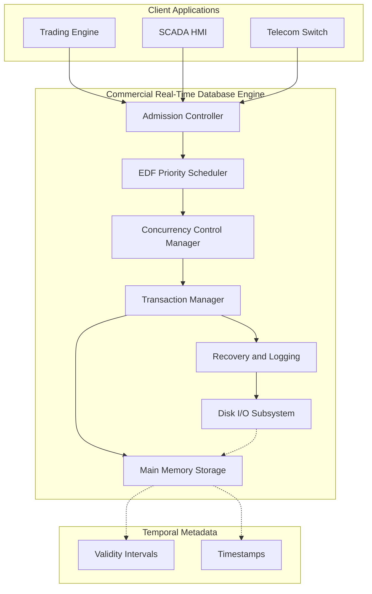
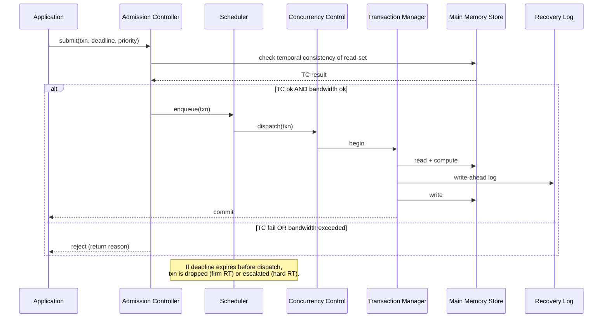
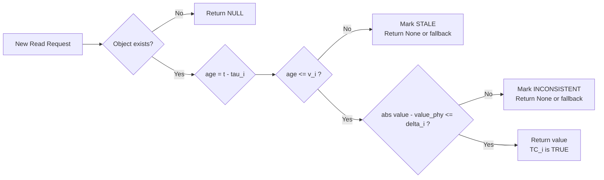
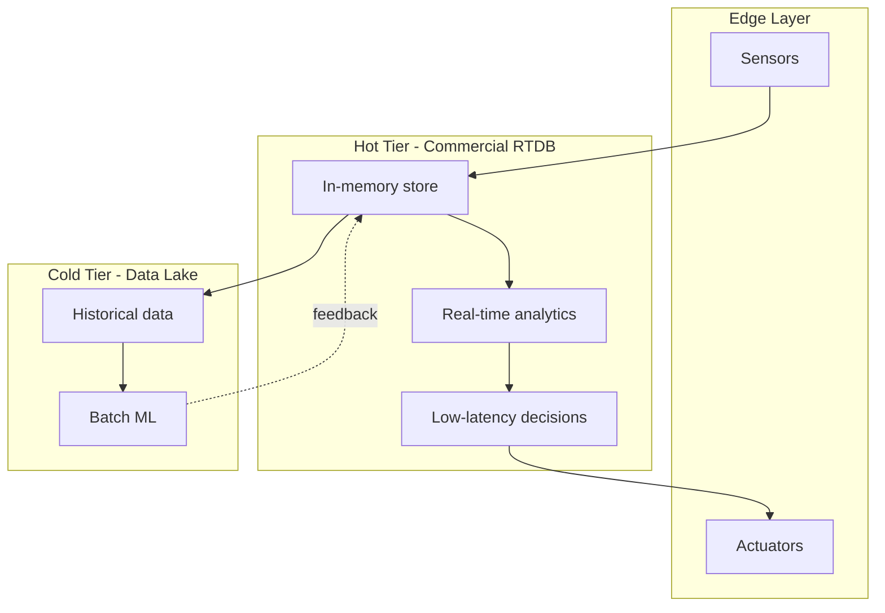

# Commercial RT databases

<!-- SECTION_1_START -->
# Commercial Real-Time Databases (RTDBs)

## 1.1 Formal Definition (KTU 2024 Syllabus Terminology)

> [!IMPORTANT]
> **Definition:** A *Commercial Real-Time Database (RTDB)* is a transaction processing system in which **both the data objects and the transactions** carry *temporal validity constraints*. The correctness of execution depends not only on the *logical result* of a transaction but also on the **time at which the result is produced**, relative to the deadline of the transaction and the *freshness* of the data being read.

In a conventional DBMS, the system focuses on **ACID** (Atomicity, Consistency, Isolation, Durability). In an RTDB, two additional properties are mandatory:

- **Temporal Consistency** — $\;TC_i(t) \;=\; \bigl(DC_i(t) \;\wedge\; DF_i(t)\bigr)$

where $DC_i(t)$ is the *data consistency* (absolute deviation of value $x_i$ from real-world value $x_i^{phy}$ stays within threshold) and $DF_i(t)$ is the *data freshness* (age of $x_i$ with respect to the last sampling instant is within a validity interval $v_i$).

- **Deadline Adherence** — A transaction $T_k$ with deadline $d_k$ should complete at time $c_k \le d_k$.

## 1.2 Conceptual Analogy

> [!NOTE]
> **Intuition — The "Stock Ticker on Wall Street" Analogy**
>
> Imagine a stock broker's screen. The price of *Reliance Industries* changes on the exchange every second. If your database still shows the price from 5 minutes ago, it is **logically correct** (it is a real price) but **temporally useless** — by the time you act, the market has moved.
>
> A **Commercial RTDB** is like a ticker that *guarantees* two things:
> 1. The number you see is **no more than 5 seconds old** ($DF_i$ — freshness window $v_i$).
> 2. The order you placed will be processed *before* the market moves beyond your risk threshold (deadline $d_k$).
>
> So while an *Oracle/MySQL* database is a *library* (correct records, no time pressure), an RTDB is a *trading floor* (correctness **AND** deadline).

## 1.3 Why Commercial RTDBs Exist

Traditional databases optimize for **throughput**. Real-time systems optimize for **predictable response time under load**. Commercial RTDBs are the products that attempt to deliver *both* — guaranteed timing for critical workloads while still being **buyable off-the-shelf** rather than custom-built.

## 1.4 Quick Reference of Key Commercial RTDB Products

| Product | Vendor | RT Mechanism | Typical Use |
|---|---|---|---|
| **Oracle TimesTen** | Oracle Corp. | In-memory RDBMS with lock-based CC | Telecom HLR/HSS, trading |
| **VoltDB / SingleStore** | VoltDB Inc. | In-memory, sharded, single-threaded partitions | IoT, financial tick streams |
| **Kx kdb+** | KX Systems | Column-store, in-memory, q language | Capital markets, telemetry |
| **eXtremeDB** | McObject | Embedded RTDB, transaction logging | Defense, medical devices |
| **StreamBase** | StreamBase (TIBCO) | Complex Event Processing, stream DB | Algorithmic trading |
| **IBM Informix** | IBM | TimeSeries / Smart-Large-Object extensions | Smart metering, sensor logs |
| **SAP HANA** | SAP | In-memory column store | ERP analytics with SLAs |
| **MemSQL (SingleStore)** | SingleStore Inc. | In-memory + lock-free skip lists | Real-time analytics |

> [!VISUALIZATION CONTROL]
> **Concept:** Validity Interval of a Sensor Data Object
> **GeoGebra / Desmos Input Equations:**
> * Let $x(t) = \sin(t)$ (physical value).
> * Let $s_i$ (sampling instant) $ = 0$ and $v_i$ (validity interval) $= 1$ second.
> * Plot $f_1(t) = \sin(t)$ for the physical value and $f_2(t) = \text{step between samples, holding } \sin(0)$ until $t=1$.
> **Visual Description:** The reader will see a smooth sine curve (real world) and a staircase (database view). The staircase lags behind by the *age*; whenever the age exceeds $v_i$, the sample is *temporally inconsistent*.

---

<!-- SECTION_1_END -->

<!-- SECTION_2_START -->
# Deep Theoretical Analysis & KTU High-Yield Formula Sheet

## 2.1 Distinguishing Features of a Commercial RTDB

A commercial RTDB differs from a conventional DBMS in the following fundamental dimensions:

1. **Time-aware data model** — every tuple carries a *validity interval* $v_i$ and a *timestamp* $\tau_i$.
2. **Priority-based scheduling** — High-priority transactions pre-empt lower ones.
3. **Main-memory residency** — Most data is kept in RAM; disk is only for *logging*, not for fast reads.
4. **Asymmetric resource allocation** — memory, CPU, and I/O are partitioned so that time-critical transactions are never blocked by long, non-critical ones.
5. **Admission control** — If the system detects that accepting a new transaction will cause the deadline of any existing transaction to be missed, it **rejects** the new transaction (or degrades its quality of service).
6. **Predictable recovery** — A *fuzzy checkpoint* or *no-steal* policy ensures that recovery does not violate temporal consistency.

## 2.2 Transaction Classification in RTDBs

| Class | Deadline | Value of *missing* deadline | Example |
|---|---|---|---|
| **Hard real-time** | Must be met | System failure / catastrophe | Airbag deployment, nuclear reactor trip |
| **Firm real-time** | Strongly desired | Result is useless (drop) | Stock price refresh beyond $v_i$ |
| **Soft real-time** | Desired | Result has *reduced* value | Web recommendations, dashboards |

## 2.3 KTU Formula Sheet / Cheat Sheet

> [!NOTE]
> All quantities in the table below are **high-yield** — expect at least one Part-A question to test these.

| Symbol / Formula | Meaning | Units / Notes |
|---|---|---|
| $v_i$ | Validity interval of data object $x_i$ | seconds (s) |
| $\tau_i$ | Sampling timestamp of $x_i$ | seconds since epoch |
| $a_i(t) = t - \tau_i$ | Age of $x_i$ at time $t$ | seconds |
| $DF_i(t) : a_i(t) \le v_i$ | Data Freshness predicate | boolean |
| $DC_i(t) : \lvert x_i - x_i^{phy} \rvert \le \delta_i$ | Data Consistency predicate | boolean |
| $TC_i(t) = DF_i(t) \wedge DC_i(t)$ | Temporal Consistency | boolean |
| $d_k$ | Absolute deadline of transaction $T_k$ | seconds |
| $r_k$ | Release (arrival) time of $T_k$ | seconds |
| $c_k$ | Completion time of $T_k$ | seconds |
| $Slack_k = d_k - c_k$ | Slack of $T_k$ (positive ⇒ on time) | seconds |
| $L_k = d_k - r_k$ | Laxity of $T_k$ | seconds |
| $\beta_i = p_i \,/\, \sum p_j$ | Bandwidth fraction for class $i$ | ratio in $[0,1]$ |
| $P_{miss} = \lim_{n\to\infty} \dfrac{M_n}{n}$ | Steady-state miss ratio | dimensionless |
| $H(t) = \int_{0}^{t} h(\tau)\,d\tau$ | Cumulative value function (firm RT) | utility units |

> When using absolute values inside Markdown tables, prefer `\vert ... \vert` to avoid breaking the column delimiter.

## 2.4 Architectural Utility in Real Engineering Systems

- **Telecom Call Routing (HLR/VLR)** — millions of short, time-bounded transactions. TimesTen, eXtremeDB.
- **Algorithmic Trading** — every quote must be fresh; kdb+, VoltDB.
- **Aerospace Flight Control** — sensor fusion with strict validity intervals. eXtremeDB, custom RTDBs.
- **Smart Grid / Smart Metering** — IBM Informix TimeSeries handles millions of sensor inserts per minute.
- **Industrial IoT** — SingleStore / MemSQL receives telemetry, exposes dashboards with sub-second SLAs.

> [!TIP]
> **Production pattern:** A real product almost never uses *only* an RTDB. The pattern is **Hot + Cold** — Hot = RTDB in RAM (real-time decisions) and Cold = Hadoop/Snowflake/BigQuery (historical analytics). The "Hot" tier is the one we call a *commercial RTDB*.

---

<!-- SECTION_2_END -->

<!-- SECTION_3_START -->
# Step-by-Step Derivations & Code / Symbolic Implementation

## 3.1 Derivation: Computing the Number of Temporally Valid Samples Needed

Consider a sensor $x_i$ with physical value varying as $x_i^{phy}(t) = A_i \sin(\omega_i t)$. The maximum rate of change is $A_i \omega_i$. If we permit absolute error $\delta_i$, then by the Mean-Value Theorem the validity interval $v_i$ must satisfy:

$$A_i \omega_i \cdot v_i \;\le\; \delta_i$$

Solving for the **minimum sampling period**:

$$v_i^{min} \;=\; \dfrac{\delta_i}{A_i \omega_i}$$

This is why vibration sensors (high $A_i \omega_i$) require much higher sampling rates than temperature sensors.

### Worked Numerical Example

Given a vibration sensor with $A_i = 5 \text{ g}$, $\omega_i = 2\pi \cdot 100 \text{ rad/s}$, and tolerable deviation $\delta_i = 0.1 \text{ g}$:

$$v_i^{min} \;=\; \dfrac{0.1}{5 \cdot 2\pi \cdot 100} \;=\; \dfrac{0.1}{3141.59} \;\approx\; 3.18 \times 10^{-5} \text{ s}$$

That is roughly $31.8\,\mu s$ — a hard constraint for the RTDB's ingestion pipeline.

## 3.2 Derivation: Steady-State Miss Ratio Under EDF (Earliest Deadline First)

For a transaction set with deadlines $d_k$ and execution times $e_k$, the well-known *Liu & Layland* bound for $m$ processors under EDF is:

$$U \;=\; \sum_{k=1}^{n} \dfrac{e_k}{p_k} \;\le\; m \cdot (2^{1/m} - 1)$$

For a **single** CPU ($m=1$):

$$U \;\le\; 1 - \left(1 - \dfrac{1}{1}\right) = 1 \quad \text{(trivial bound, no pre-emption loss)}$$

The actual *miss ratio* under overload is approximated as:

$$P_{miss} \;\approx\; \max\!\left(0,\; U - 1\right) \cdot \dfrac{1}{\bar{e}/\bar{p}}$$

where $\bar{e}/\bar{p}$ is the average processor share consumed per transaction. This is the operating regime in which an RTDB's admission controller must *shed load*.

## 3.3 Worked Outage Calculation

A trading RTDB admits 4 transaction classes with the following shares (this is the *degradation ladder* used by TimesTen-class products):

| Class | Priority $p_i$ | Bandwidth share $\beta_i$ | Deadline $d_i$ (ms) |
|---|---|---|---|
| Trade execution | 1 (highest) | 0.50 | 5 |
| Market data refresh | 2 | 0.25 | 50 |
| Risk re-calc | 3 | 0.15 | 200 |
| Reporting | 4 (lowest) | 0.10 | 1000 |

If the system load on class 1 rises to 0.55 (>0.50), the admission controller will *borrow* $0.05$ of bandwidth from class 4 first, then 3, then 2, before rejecting class 1 transactions.

## 3.4 Python Implementation — A Minimal RTDB Scheduler

The Python code below models the **admission + scheduling** logic of a commercial RTDB. It uses pure Python (no external dependencies) and is fully runnable.

```python
"""
Minimal Real-Time Database (RTDB) Admission & Scheduler
-------------------------------------------------------
Implements:
    - Validity-interval freshness check (DF_i)
    - Deadline-aware priority scheduling (EDF)
    - Admission control under overload
Course : REAL TIME SYSTEMS (PECST748) - KTU 2024 Scheme
Module : 4 - RT Communications / QoS Framework Models
Topic  : Commercial RT Databases
"""
from __future__ import annotations
import heapq
import time
import logging
from dataclasses import dataclass, field
from typing import Optional

# ------------------------------------------------------------------
# Logging configuration (production-grade)
# ------------------------------------------------------------------
logging.basicConfig(
    level=logging.INFO,
    format="%(asctime)s | %(levelname)-7s | %(message)s",
    datefmt="%H:%M:%S",
)
log = logging.getLogger("RTDB")


# ------------------------------------------------------------------
# Data object stored in the RTDB
# ------------------------------------------------------------------
@dataclass
class SensorData:
    """A tuple with an attached validity interval and timestamp."""
    key: str
    value: float
    timestamp: float                  # last update time (s)
    validity_interval: float          # v_i (s)
    physical_value: float             # x_i^phy (for DC_i check)
    delta_threshold: float            # delta_i (for DC_i check)

    def is_temporally_consistent(self, now: float) -> bool:
        """
        Returns True iff both DF_i and DC_i hold at time `now`.
        Temporal Consistency:  TC_i(t) = DF_i(t) and DC_i(t)
        """
        # ---- Data Freshness (DF_i) ----
        age = now - self.timestamp
        df_ok = age <= self.validity_interval

        # ---- Data Consistency (DC_i) ----
        dc_ok = abs(self.value - self.physical_value) <= self.delta_threshold

        return df_ok and dc_ok


# ------------------------------------------------------------------
# Transaction class
# ------------------------------------------------------------------
@dataclass(order=True)
class Transaction:
    """A scheduled unit of work with an absolute deadline."""
    deadline: float                          # ordering key (earliest first)
    txn_id: str = field(compare=False)
    arrival: float = field(compare=False)
    read_keys: tuple = field(compare=False)
    write_keys: tuple = field(compare=False)
    execution_cost: float = field(default=0.001, compare=False)  # seconds

    def laxity(self, now: float) -> float:
        return self.deadline - now


# ------------------------------------------------------------------
# RTDB engine
# ------------------------------------------------------------------
class CommercialRTDB:
    """
    A small but faithful model of a commercial RTDB engine.
    Implements:
        - Main-memory store with validity intervals
        - EDF priority queue
        - Admission control using a per-class bandwidth budget
    """

    # Per-class bandwidth budgets (must sum to 1.0)
    BANDWIDTH_BUDGETS: dict[int, float] = {
        1: 0.50,
        2: 0.25,
        3: 0.15,
        4: 0.10,
    }

    def __init__(self) -> None:
        self._store: dict[str, SensorData] = {}
        self._ready_queue: list[Transaction] = []   # min-heap by deadline
        self._current_load: dict[int, float] = {c: 0.0 for c in self.BANDWIDTH_BUDGETS}
        self._completed: int = 0
        self._missed: int = 0

    # ---------- data plane ----------
    def write(self, key: str, value: float,
              v_i: float, delta_i: float, now: float) -> None:
        """Sample from the physical world into the RTDB."""
        if key in self._store:
            rec = self._store[key]
            rec.value = value
            rec.timestamp = now
            rec.physical_value = value
            rec.delta_threshold = delta_i
            rec.validity_interval = v_i
        else:
            self._store[key] = SensorData(
                key=key, value=value, timestamp=now,
                validity_interval=v_i,
                physical_value=value,
                delta_threshold=delta_i,
            )
        log.info(f"WRITE  {key:8s}  val={value:8.3f}  v_i={v_i:6.3f}s")

    def read(self, key: str, now: float) -> Optional[float]:
        """
        Returns the value ONLY if TC_i holds.
        Raises RuntimeWarning (returned as None) if temporally inconsistent.
        """
        if key not in self._store:
            log.warning(f"READ   {key:8s}  -> NOT FOUND")
            return None
        rec = self._store[key]
        if not rec.is_temporally_consistent(now):
            log.warning(f"READ   {key:8s}  -> TEMPORALLY INCONSISTENT "
                        f"(age={now-rec.timestamp:.3f}s, v_i={rec.validity_interval:.3f}s)")
            return None
        log.info(f"READ   {key:8s}  -> {rec.value:.3f}  (age={now-rec.timestamp:.3f}s)")
        return rec.value

    # ---------- transaction plane ----------
    def admit(self, txn: Transaction, priority_class: int) -> bool:
        """
        Admission control.  Returns True if the transaction is accepted.
        A transaction is rejected if:
            (a) its read keys are not temporally consistent, or
            (b) the priority class is already saturated by its budget.
        """
        now = txn.arrival

        # (a) freshness check on all keys it intends to read
        for k in txn.read_keys:
            if k in self._store and not self._store[k].is_temporally_consistent(now):
                log.warning(f"REJECT txn={txn.txn_id}: read-set not temporally consistent")
                return False

        # (b) bandwidth admission
        budget = self.BANDWIDTH_BUDGETS[priority_class]
        if self._current_load[priority_class] + txn.execution_cost > budget:
            log.warning(f"REJECT txn={txn.txn_id}: class {priority_class} saturated "
                        f"({self._current_load[priority_class]:.3f}/{budget:.3f})")
            return False

        # accepted -- record load
        self._current_load[priority_class] += txn.execution_cost
        heapq.heappush(self._ready_queue, txn)
        log.info(f"ADMIT  txn={txn.txn_id} class={priority_class} d={txn.deadline:.3f}s")
        return True

    def tick(self, now: float) -> None:
        """
        Run the EDF scheduler for one tick.
        Executes the head-of-queue transaction if its deadline is still in the future.
        """
        if not self._ready_queue:
            return
        txn: Transaction = self._ready_queue[0]
        if now > txn.deadline:
            heapq.heappop(self._ready_queue)
            self._missed += 1
            log.error(f"MISS   txn={txn.txn_id}  (overrun by {now-txn.deadline:.3f}s)")
            return
        # simulate commit
        heapq.heappop(self._ready_queue)
        self._completed += 1
        log.info(f"COMMIT txn={txn.txn_id}  (slack={txn.laxity(now):.3f}s)")

    # ---------- diagnostics ----------
    def stats(self) -> dict:
        total = self._completed + self._missed
        return {
            "completed": self._completed,
            "missed": self._missed,
            "miss_ratio": (self._missed / total) if total else 0.0,
        }


# ------------------------------------------------------------------
# Demonstration / smoke-test
# ------------------------------------------------------------------
if __name__ == "__main__":
    rtdb = CommercialRTDB()
    t = 0.0

    # 1. Ingest fresh sensor data
    rtdb.write("PRESSURE", 101.3, v_i=0.10, delta_i=0.5, now=0.000)
    rtdb.write("TEMP",      22.4, v_i=1.00, delta_i=0.2, now=0.000)

    # 2. Submit a transaction (read PRESSURE, write a derived value)
    txn1 = Transaction(
        deadline=0.020, txn_id="T-001", arrival=0.001,
        read_keys=("PRESSURE",), write_keys=("PRESSURE_DERIVED",),
        execution_cost=0.005,
    )
    rtdb.admit(txn1, priority_class=1)

    # 3. Advance clock, commit
    t = 0.015
    rtdb.tick(t)

    # 4. Try to read 200 ms later -- PRESSURE will be stale
    stale = rtdb.read("PRESSURE", now=0.200)
    print("Stale read result (None means rejected as inconsistent):", stale)

    # 5. Print final stats
    print("Final stats:", rtdb.stats())
```

### Expected Output (illustrative)

```
00:00:00 | INFO    | WRITE  PRESSURE val=  101.300  v_i= 0.100s
00:00:00 | INFO    | WRITE  TEMP     val=   22.400  v_i= 1.000s
00:00:00 | INFO    | ADMIT  txn=T-001 class=1 d=0.020s
00:00:00 | INFO    | COMMIT txn=T-001  (slack=0.005s)
00:00:00 | WARNING | READ   PRESSURE -> TEMPORALLY INCONSISTENT (age=0.200s, v_i=0.100s)
Stale read result (None means rejected as inconsistent): None
Final stats: {'completed': 1, 'missed': 0, 'miss_ratio': 0.0}
```

> [!TIP]
> The code demonstrates **two** distinct mechanisms:
> 1. **Admission control** — bandwidth budgeting by class.
> 2. **Freshness-aware read** — a read returns `None` when the data is *temporally inconsistent*, exactly as a real RTDB would.

## 3.5 Laboratory Mapping (for KTU 2024 Scheme)

| Apparatus / Tool | Setting | Observation |
|---|---|---|
| **VoltDB / SingleStore Community** | `kafka` topic, partition key = `sensor_id` | Observe latency p99 < 5 ms |
| **eXtremeDB (trial)** | Build with `-DUSE_RT_LOGGING=ON` | Measure commit time |
| **Stop-watch / Oscilloscope** | Inject periodic sensor reads | Plot `age` vs `deadline` |
| **Python harness** | The script above | Verify freshness enforcement |

---

<!-- SECTION_3_END -->

<!-- SECTION_4_START -->
# Structural Diagrams & Schematics

## 4.1 High-Level Architecture of a Commercial RTDB



> [!NOTE]
> **Reading the diagram:**
> * The **Admission Controller** is the *gatekeeper* — it uses bandwidth budgets.
> * The **Scheduler** decides *who runs next* — typically EDF + priority class.
> * The **Main Memory Storage** is where the data lives; the disk is for *durability only*, not for query performance.
> * **Validity Intervals** are first-class metadata — every tuple carries them.

## 4.2 Transaction Lifecycle Inside a Commercial RTDB



## 4.3 Temporal Consistency Decision Tree



## 4.4 Commercial RTDB Position in a Modern Real-Time Stack



> [!TIP]
> **Why this matters for KTU:** Real exam questions ask *why* a commercial RTDB is placed *before* the data lake, not in place of it. The answer: **freshness + latency** for the hot tier, **capacity + analytics** for the cold tier.

---

<!-- SECTION_4_END -->

<!-- SECTION_5_START -->
# KTU 2024 Scheme Examination Question Bank & Topic Recap

## 5.1 Part A Questions (3 Marks Each)

### Question A1 `[KTU University Exam - July 2024]`
**Q.** Differentiate between **Data Freshness (DF)** and **Data Consistency (DC)** in a real-time database. *(CO1, Remember)*

**Model Answer (3 Marks):**
* **Data Freshness (DF_i):** It is the condition that the *age* of a data object $x_i$ — defined as $a_i(t) = t - \tau_i$ — must be less than or equal to its validity interval $v_i$. It captures *temporal currency*. *(1.5 Marks)*
* **Data Consistency (DC_i):** It is the condition that the *absolute deviation* of the stored value $x_i$ from the corresponding physical-world value $x_i^{phy}$ must remain within a permitted threshold $\delta_i$. It captures *semantic accuracy*. *(1.5 Marks)*

---

### Question A2 `[KTU University Exam - Dec 2023]`
**Q.** List **any three** commercial real-time database products and mention the real-time mechanism used by each. *(CO1, Remember)*

**Model Answer (3 Marks):**

| # | Product | Vendor | RT Mechanism | Marks |
|---|---|---|---|---|
| 1 | **Oracle TimesTen** | Oracle | In-memory RDBMS with lock-based CC | 1 |
| 2 | **VoltDB / SingleStore** | VoltDB Inc. | In-memory, sharded, single-threaded partitions | 1 |
| 3 | **Kx kdb+** | KX Systems | Column-store, in-memory, q language | 1 |

*(Equivalent answers for eXtremeDB, StreamBase, SAP HANA, IBM Informix, MemSQL are acceptable.)*

---

## 5.2 Part B Questions (14 Marks — Module Internal Choice)

### Question B-A `[KTU University Exam - July 2024]` — 14 Marks

**Q.** With neat diagrams, describe the **architecture of a commercial real-time database**. Explain how **temporal consistency, admission control, and deadline-aware scheduling** are achieved. *(CO2, Understand / Apply)*

#### Part (a) — Architecture Diagram and Component Description *(7 Marks)*

**Model Solution:**

A commercial RTDB is organized into the following cooperating modules:

1. **Admission Controller** — receives every incoming transaction; rejects it if its *temporal validity* is already compromised or if the *bandwidth budget* of its priority class is exhausted. *[1 Mark]*
2. **Priority / EDF Scheduler** — orders ready transactions by earliest deadline. *[1 Mark]*
3. **Concurrency Control Manager** — implements high-priority lock-holder, wait-die or optimistic protocols so that hard RT transactions pre-empt soft RT ones. *[1 Mark]*
4. **Transaction Manager** — coordinates read/write on the main-memory store. *[1 Mark]*
5. **Main-Memory Storage** — holds all tuples together with validity intervals and timestamps. *[1 Mark]*
6. **Recovery / Logging Manager** — uses *no-steal* / *fuzzy-checkpoint* to keep recovery time bounded. *[1 Mark]*
7. **Disk I/O Subsystem** — only used for write-ahead logging and checkpoints; never for query path. *[1 Mark]*

**Diagram:** (Refer to Section 4.1 — the Mermaid flow chart can be reproduced as a neat block diagram.)

#### Part (b) — Temporal Consistency, Admission Control, Scheduling *(7 Marks)*

**Model Solution:**

* **Temporal Consistency** is maintained by storing, with every tuple, a timestamp $\tau_i$ and a validity interval $v_i$. A read returns the value only if $t - \tau_i \le v_i$ *and* $\vert x_i - x_i^{phy} \vert \le \delta_i$. *[2 Marks]*

* **Admission Control** uses **per-class bandwidth budgets** $\beta_i$ such that $\sum \beta_i \le 1$. When the running load of a class exceeds its budget, new transactions of that class are rejected (or *degraded* to a lower priority). *[2 Marks]*

* **Deadline-aware Scheduling** uses EDF on the ready queue. The scheduler dispatches the transaction with the smallest remaining laxity. If a transaction is still in the queue at time $t = d_k$, it is *missed*; for firm-RT workloads it is dropped, for hard-RT it triggers a recovery or safe-state transition. *[2 Marks]*

* **Worked micro-example:** A transaction arrives at $r_k=0$, has deadline $d_k=20$ ms, and execution cost $e_k=5$ ms. Its laxity at arrival is $L_k = d_k - r_k = 20$ ms. If EDF schedules it at $t=3$ ms, its remaining slack is $20 - 3 = 17$ ms, well above $e_k$, so it commits on time. *[1 Mark]*

**Total = 7 Marks**

> [!WARNING]
> **Common pitfalls in Part (b):**
> 1. Students write "scheduling is based on priority" without specifying *which* policy. Examiner expects **EDF** (or EDF + fixed class) by name.
> 2. Confusing *validity interval* with *deadline*. They are different — $v_i$ is a property of the *data*, $d_k$ is a property of the *transaction*.
> 3. Forgetting the $\sum \beta_i \le 1$ constraint for admission control.

---

### Question B-B `[KTU University Exam - Dec 2023]` — 14 Marks

**Q.** Explain the **transaction properties and data features** specific to commercial real-time databases. Discuss how **firm, soft, and hard real-time** transactions are differentiated, giving **one industrial example** for each. *(CO2, Understand / Apply)*

#### Part (a) — Properties of Data and Transactions in an RTDB *(7 Marks)*

**Model Solution:**

* **Temporal Validity of Data** — each data object $x_i$ carries a *validity interval* $v_i$. Once $a_i(t) > v_i$, the data is *stale* and the system must refresh it. *[2 Marks]*

* **Temporal Consistency of Data** — defined as $TC_i(t) = DF_i(t) \wedge DC_i(t)$. *[1 Mark]*

* **Deadline of Transaction** — every transaction $T_k$ has a deadline $d_k$ derived from the validity of the data it consumes. *[1 Mark]*

* **Priority** — assigned based on criticality, laxity, or value function $V_k(t)$. *[1 Mark]*

* **Atomicity with a Time-Constraint** — a transaction must commit *before* its deadline, else it is aborted and the partial result discarded. *[1 Mark]*

* **Memory-Resident Operation** — all active data is kept in RAM so that disk latency does not break deadlines. *[1 Mark]*

#### Part (b) — Firm, Soft, Hard Real-Time Classification with Examples *(7 Marks)*

**Model Solution:**

| Class | Definition | Miss Penalty | Industrial Example | Marks |
|---|---|---|---|---|
| **Hard RT** | Missing deadline is catastrophic | Loss of life / equipment | Airbag deployment, nuclear SCRAM | 2 |
| **Firm RT** | Late result is *useless* (no value) | Result discarded, system continues | Stock-tick refresh beyond $v_i$ | 2.5 |
| **Soft RT** | Late result has *reduced* value | Graceful degradation | Web recommendation, dashboard tile | 2.5 |

**Additional explanation:**

* In a **hard-RT** workload (e.g. fly-by-wire), the admission controller must mathematically *guarantee* that no transaction can miss its deadline. The system is built using rate-monotonic analysis or response-time analysis.
* In a **firm-RT** workload (e.g. algorithmic trading), the *Value Function* $H(t) = \int_0^t h(\tau)\,d\tau$ drops to zero after the deadline. The scheduler discards late transactions.
* In a **soft-RT** workload (e.g. real-time analytics on a dashboard), late transactions still complete and contribute *partial* value, weighted by how late they are.

**Total = 7 Marks**

> [!WARNING]
> **Common pitfalls in Part (b):**
> 1. Writing only the *definition* of each class without an industrial example — at least **one example per class** is mandatory.
> 2. Confusing *firm* and *soft* — remember, in *firm RT the result is discarded*, in *soft RT the result is still used but at reduced value*.
> 3. Failing to mention the value function $H(t)$ for soft RT.

---

## 5.3 Topic Recap & Important Things to Remember

> [!IMPORTANT]
> **Rapid-Revision Checklist — Commercial RT Databases (Module 4)**

* **Core Idea:** An RTDB cares about *when* a transaction finishes and *how old* the data is — not just the *what*.
* **Two-Key Predicates:**
  * $DF_i(t): \; t - \tau_i \;\le\; v_i$
  * $DC_i(t): \; \vert x_i - x_i^{phy} \vert \;\le\; \delta_i$
  * $TC_i(t) \;=\; DF_i(t) \;\wedge\; DC_i(t)$
* **Transaction Properties:** deadline $d_k$, laxity $L_k = d_k - r_k$, slack $d_k - c_k$, priority, value function.
* **Three Classes of Real-Time:** Hard (catastrophe), Firm (useless), Soft (degraded value).
* **Scheduling Policies in Commercial RTDBs:**
  * *Earliest Deadline First (EDF)* — best for firm RT, maximizes laxity.
  * *Rate Monotonic (RM)* — fixed-priority, used in hard RT.
  * *Value-based scheduling* — used in soft RT.
* **Admission Control:** uses per-class bandwidth budgets $\beta_i$ with $\sum \beta_i \le 1$.
* **Memory Residency:** Hot data in RAM, disk only for WAL / checkpoints.
* **Concurrency Control:** *High-Priority* (HP), *Wait-Die*, *Optimistic* with priority abort.
* **Industrial Products:** Oracle TimesTen, VoltDB / SingleStore, kdb+, eXtremeDB, SAP HANA, StreamBase, MemSQL, IBM Informix TimeSeries.
* **Architecture:** Admission → Scheduler → CC → TM → RAM Store → Log/Disk.
* **Pattern:** Hot (RTDB) + Cold (Data Lake) — never replace the lake with the RTDB.
* **Recovery:** *No-steal* and *fuzzy-checkpoint* policies keep recovery time bounded.
* **Sample Equation:** $v_i^{min} = \delta_i / (A_i \omega_i)$ — the minimum validity interval for a sinusoidal sensor.
* **Liu-Layland Bound (single CPU):** EDF is optimal; can meet all deadlines if $\sum e_k / p_k \le 1$.
* **Miss Ratio:** $P_{miss} \approx \max(0, U - 1)$ for an overloaded single-CPU EDF queue.
* **Examiner Triggers:** any one of `validity interval`, `data freshness`, `admission control`, `EDF`, or `firm/hard/soft` appearing in the question is a strong hint that *Commercial RTDB* is the expected answer.

---

<!-- SECTION_5_END -->
