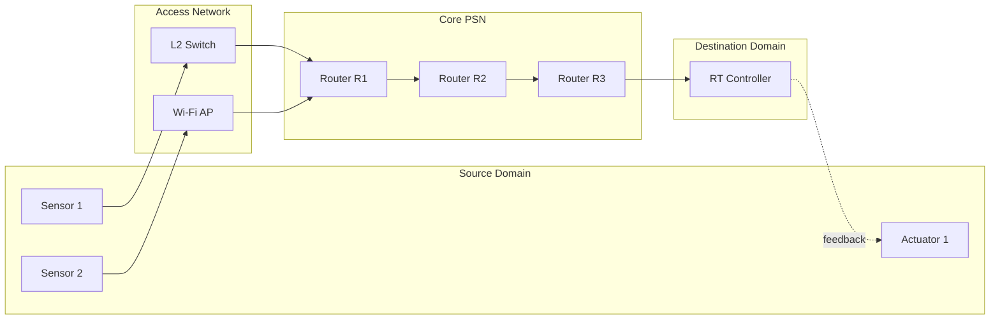
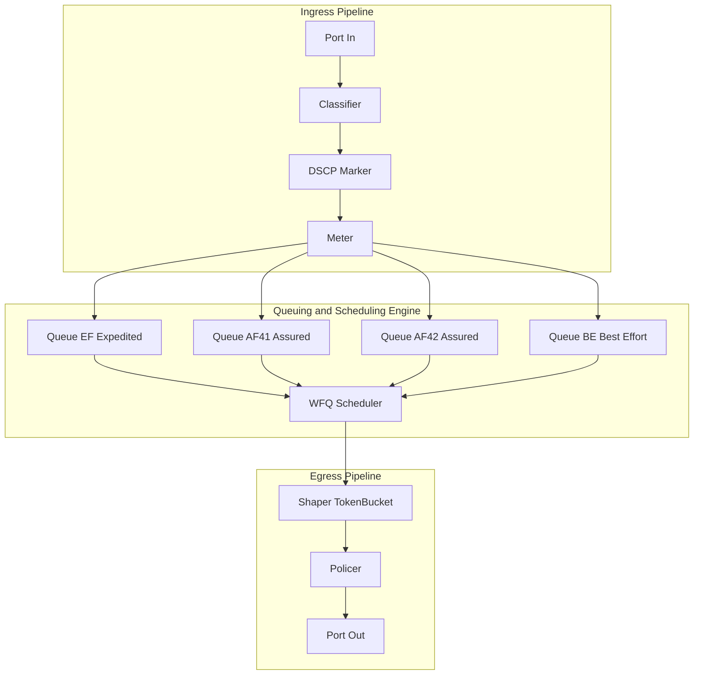
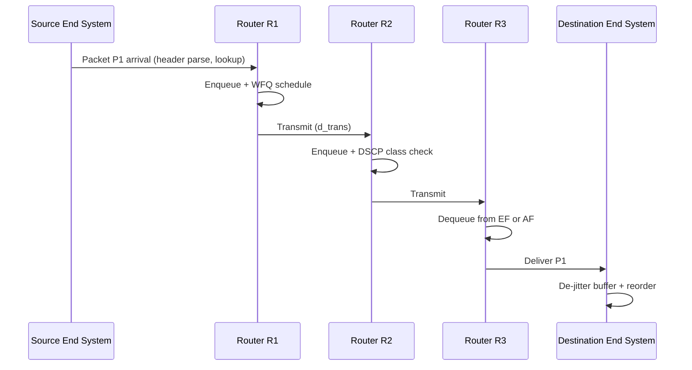

# Communication over Packet Switched Networks

<!-- SECTION_1_START -->
# Communication over Packet Switched Networks

## 1.1 Formal Academic Definition (KTU 2024 Aligned)

In the context of the **PECST748 – Real Time Systems** syllabus (Module 4: Real-Time Communications and QoS Framework Models), **Communication over Packet Switched Networks (PSN)** refers to the methodology by which discrete, independently-routed units of data (called **packets**) are transported across a shared, statistically-multiplexed network fabric between a *source* real-time node (sensor, controller, actuator) and a *destination* real-time node, while honouring deterministic or stochastic **temporal constraints** (bounded delay, bounded jitter, and bounded packet loss).

The KTU 2024 scheme defines the relevant packet-switched fabric through three architectural pillars:

1. **Connectionless (Datagram) Service** — e.g., classical IPv4/IPv6 networks (the *Internet*).
2. **Connection-Oriented Virtual Circuit Service** — e.g., ATM (Asynchronous Transfer Mode), Frame Relay, MPLS (Multiprotocol Label Switching).
3. **QoS-Augmented Service** — e.g., IntServ (Integrated Services) with RSVP, and DiffServ (Differentiated Services).

> [!IMPORTANT]
> **KTU 2024 Module 4 Highlight:** Packet-switched real-time communication is *not* a best-effort paradigm in the exam context. Students must explicitly address how **QoS frameworks** (IntServ/DiffServ) and **traffic-shaping algorithms** (Token Bucket, Leaky Bucket, WFQ) re-introduce *determinism* into a fundamentally *statistical* multiplexing fabric.

## 1.2 Intuitive Analogy — The "Smart Postal Network"

Imagine a city where every letter is broken into **small numbered envelopes** (packets) and dispatched through a *network of automated sorting hubs* (routers). Each hub decides *independently* and *dynamically* which truck (outgoing link) each envelope should ride. Because trucks can leave at any time and traffic jams vary, the envelopes may arrive **out of order** or with **variable delay** — yet the system is enormously efficient because no truck ever leaves half-empty.

- **Packets** → Numbered envelopes with source/destination headers.
- **Routers** → Sorting hubs reading the address label.
- **Queues** → Piles of envelopes waiting at each hub.
- **Best-Effort Service** → No priority stamps; envelopes wait their turn.
- **QoS / Real-Time Service** → Some envelopes carry a *red priority stripe* (e.g., RTP for voice/video) and bypass the queue, or get a guaranteed lane on the highway.

> [!NOTE]
> **Why does this matter for Real-Time Systems?**
> A robotic arm on a factory floor receives *position correction packets* every 2 ms from a vision controller. If a packet arrives **late**, the arm overshoots; if it arrives **out of order**, the controller misinterprets state. Therefore, packet-switched real-time communication requires *bounded* end-to-end delay, not just *minimum* delay.

## 1.3 Standard Metrics Highlighted in the KTU 2024 Syllabus

| Metric | Symbol | Typical Real-Time Bound |
|---|---|---|
| End-to-end Delay | $D_{e2e}$ | $\leq 150$ ms (VoIP), $\leq 5$ ms (hard control) |
| Delay Jitter | $J$ | $\leq 30$ ms (VoIP) |
| Packet Loss Ratio | $PLR$ | $\leq 1\%$ (voice), $\leq 10^{-9}$ (hard) |
| Throughput | $\lambda$ | Application-specific |
| Bandwidth | $B$ | Link capacity |

## 1.4 Visualization of Packet Flow

> [!VISUALIZATION CONTROL]
> **Concept:** End-to-End Delay Decomposition across a Multi-Hop PSN
> **GeoGebra / Desmos Input Equations:**
> * `D_e2e(x) = 4*x + 12`  (Linear delay vs. number of hops $x$)
> * `J_e2e(x) = 2*x + 1`    (Jitter accumulation vs. number of hops $x$)
> **Visual Description:** The student should observe a *monotonically increasing linear* profile. The y-intercept ($12$ ms for delay, $1$ ms for jitter) represents the *fixed per-flow* overheads (serialisation, propagation, processing), and the slope ($4$ ms/hop and $2$ ms/hop) represents the *per-hop queueing + transmission* contribution. **Real-time networks minimise both intercept and slope using QoS.**

<!-- SECTION_1_END -->

<!-- SECTION_2_START -->
# Deep Theoretical Analysis & KTU High-Yield Formula Sheet

## 2.1 Anatomy of a Packet Switched Network

A PSN comprises five functional layers (per KTU module 4 block diagram):

1. **Source End-System** — Generates the real-time traffic (e.g., a video encoder, a CAN-to-IP gateway, a sensor).
2. **Access Network** — Connects the source to the *core* (Ethernet LAN, Wi-Fi, LTE, 5G).
3. **Core Routers** — Layer-3 forwarding devices that perform *store-and-forward* or *cut-through* switching.
4. **Queuing & Scheduling Engine** — The internal logic that decides which queued packet to transmit next (FIFO, Priority, WFQ, DRR, EDF).
5. **Destination End-System** — Re-assembles, de-jitters, and consumes the packet stream.

## 2.2 The Four Canonical Delays (Per-Hop)

Every packet experiences the following additive delay components. **Summing them across $H$ hops** yields the end-to-end delay $D_{e2e}$.

$$D_{e2e} \;=\; \sum_{h=1}^{H} \left( d_{proc}^{(h)} + d_{queue}^{(h)} + d_{trans}^{(h)} + d_{prop}^{(h)} \right)$$

| Component | Symbol | Description | Typical Magnitude |
|---|---|---|---|
| Processing delay | $d_{proc}$ | Header inspection, routing table lookup | $\mu s$ range |
| Queueing delay | $d_{queue}$ | Waiting time in router buffer (stochastic) | $\mu s$ to $ms$ |
| Transmission delay | $d_{trans}$ | $\vert L \vert \,/\, R$ where $\vert L \vert$ is packet size and $R$ is link rate | $L/R$ seconds |
| Propagation delay | $d_{prop}$ | $d \,/\, s$ where $d$ is physical length and $s$ is signal speed ($\approx 2 \times 10^{8}$ m/s in fibre) | $d/s$ seconds |

## 2.3 KTU Formula Sheet (Module 4 High-Yield)

> [!IMPORTANT]
> The following table consolidates **every** formula you must memorise for the 14-mark and 3-mark questions on Packet-Switched Real-Time Communication. All symbols use $\vert \cdot \vert$ to denote absolute value, but in tables we use `\vert` to preserve markdown structure.

| # | Formula (LaTeX) | Meaning | Engineering Use |
|---|---|---|---|
| 1 | $D_{e2e} = \sum_{h} (d_{proc} + d_{queue} + d_{trans} + d_{prop})$ | Total end-to-end delay | SLA verification |
| 2 | $d_{trans} = \vert L \vert \,/\, R$ | Time to push packet onto wire | Frame budget |
| 3 | $d_{prop} = d \,/\, s$ | Time for signal to travel medium | WAN link design |
| 4 | $d_{queue} = \dfrac{\rho}{(1-\rho)} \cdot \dfrac{1}{\mu}$ | Mean M/M/1 queueing delay, $\rho = \lambda / \mu$ | Capacity planning |
| 5 | $PLR = \dfrac{N_{lost}}{N_{sent}} \times 100\%$ | Packet Loss Ratio | Voice/video quality (E-model) |
| 6 | $J = \sqrt{\dfrac{1}{N-1}\sum_{i=1}^{N}(D_i - \bar{D})^{2}}$ | Standard deviation of delay (jitter) | De-jitter buffer sizing |
| 7 | $R_{b,min} = \dfrac{\vert L \vert}{D_{budget}}$ | Minimum link rate to meet deadline | Hard real-time schedulability |
| 8 | Token Bucket: $\rho \le r + b / T$ | Long-term rate $r$, burst $b$, window $T$ | Traffic shaping |
| 9 | $\sum_{i=1}^{N} \dfrac{C_i}{P_i} \le 1$ | Rate-Monotonic utilisation bound | Real-time schedulability test |
| 10 | $W_{i,k+1} = C_i + \sum_{j \in hp(i)} \left\lceil \dfrac{W_{i,k}}{P_j} \right\rceil C_j$ | Response-time recurrence (RTA) | Hard deadline check |

> [!NOTE]
> **Engineering Utility:** Formulas 4, 8, 9, 10 are the *core* of the QoS schedulability argument. Examiners love pairing **M/M/1 queueing** (Formula 4) with a **token-bucket policer** (Formula 8) to test whether the student can prove *bounded* delay under *bursty* real-time input.

## 2.4 QoS Framework Models in Packet Switched Networks

### 2.4.1 IntServ (Integrated Services) — Per-Flow Reservation
- Uses **RSVP (Resource Reservation Protocol)** to install *per-flow* state in every router along the path.
- Provides **hard guarantees** (CBR, VBR service classes) using the *WFQ* scheduler.
- **Drawback:** State explosion; scales poorly beyond a few thousand flows.

### 2.4.2 DiffServ (Differentiated Services) — Per-Class Aggregation
- Marks packets with a **DSCP** (Differentiated Services Code Point) in the IP header.
- Routers apply **PHB (Per-Hop Behaviours)**: *EF* (Expedited Forwarding), *AF* (Assured Forwarding), *BE* (Best Effort).
- **Drawback:** No absolute delay guarantee; only *relative* class prioritisation.

### 2.4.3 Real-Time Protocol Suite (RTP / RTCP / RTSP)
- **RTP** carries time-stamped payload (audio/video) over UDP.
- **RTCP** provides out-of-band control: packet loss, jitter, RTT feedback.
- **RTSP** is the "VCR-remote" control channel for streaming sessions.

## 2.5 Real-World Engineering Utility

Packet-switched real-time communication underpins:
- **VoIP / VoLTE / 5G voice** (3GPP IMS architecture)
- **Industrial IoT** (OPC-UA over TSN, EtherNet/IP with CIP Sync)
- **Tactical & Defence Radio** (MIL-STD-188-220, Link-16 over IP)
- **Autonomous Vehicles** (V2X, C-V2X over 5G sidelink)
- **Remote Surgery / Telepresence** (sub-50 ms haptic feedback loops)

The KTU 2024 syllabus expects students to articulate **which** QoS model is chosen for **which** application class, and to defend the choice using formulas 1, 4, 7, and 8.

<!-- SECTION_2_END -->

<!-- SECTION_3_START -->
# Step-by-Step Derivations, Symbolic Implementation & Code

## 3.1 Worked Derivation: End-to-End Delay and Schedulability

> [!IMPORTANT]
> **Problem Statement (Typical KTU 14-Mark Setup):**
> A real-time control loop has 3 sensors transmitting to a central controller through $H = 4$ routers. Each packet has size $\vert L \vert = 1500$ bytes $= 12000$ bits. Each link rate is $R = 100$ Mbps. Propagation distance per hop is $d = 200$ m, signal speed $s = 2 \times 10^{8}$ m/s. Per-hop processing delay is $d_{proc} = 0.05$ ms. Mean queueing delay is $d_{queue} = 0.4$ ms. Compute the **end-to-end delay** and verify **schedulability** if the deadline is $D_{deadline} = 6$ ms.

### Step 1 — Transmission delay per hop
$$d_{trans} = \dfrac{\vert L \vert}{R} = \dfrac{12000 \; \text{bits}}{100 \times 10^{6} \; \text{bits/s}} = 1.2 \times 10^{-4} \; \text{s} = 0.12 \; \text{ms}$$

### Step 2 — Propagation delay per hop
$$d_{prop} = \dfrac{d}{s} = \dfrac{200}{2 \times 10^{8}} = 1.0 \times 10^{-6} \; \text{s} = 0.001 \; \text{ms}$$

### Step 3 — Per-hop total delay
$$d_{hop} = d_{proc} + d_{queue} + d_{trans} + d_{prop} = 0.05 + 0.4 + 0.12 + 0.001 = 0.571 \; \text{ms}$$

### Step 4 — End-to-end delay across $H = 4$ hops
$$D_{e2e} = H \cdot d_{hop} = 4 \times 0.571 = 2.284 \; \text{ms}$$

### Step 5 — Schedulability verdict
Since $D_{e2e} = 2.284 \; \text{ms} \; < \; D_{deadline} = 6 \; \text{ms}$, the flow is **schedulable** with a **timing slack** of:
$$\text{Slack} = 6 - 2.284 = 3.716 \; \text{ms} \quad \text{(safe, but no margin for jitter bursts)}$$

> [!NOTE]
> **[Valuation Tip]:** Examiners award **2 marks** for stating the four delay components, **3 marks** for correct numerical substitution, **1 mark** for the final $D_{e2e}$ value, and **1 mark** for the schedulability comparison.

---

## 3.2 Worked Derivation: M/M/1 Queueing with Token-Bucket Shaping

**Given:** Poisson arrival rate $\lambda = 200$ packets/s, service rate $\mu = 500$ packets/s, token bucket rate $r = 250$ pkt/s, bucket size $b = 50$ packets, observation window $T = 1$ s.

### Step 1 — Compute offered load
$$\rho = \dfrac{\lambda}{\mu} = \dfrac{200}{500} = 0.4 \quad (\text{system is stable, } \rho < 1)$$

### Step 2 — Mean M/M/1 queueing delay
$$E[d_{queue}] = \dfrac{\rho}{\mu(1 - \rho)} = \dfrac{0.4}{500 \times 0.6} = 1.333 \times 10^{-3} \; \text{s} = 1.333 \; \text{ms}$$

### Step 3 — Token-bucket admission check
$$\lambda_{peak} \le r + \dfrac{b}{T} \quad \Rightarrow \quad 200 \le 250 + \dfrac{50}{1} = 300 \quad \text{✓ Admitted}$$

### Step 4 — Effective shaped rate
$$\lambda_{eff} = \min(\lambda, r + b/T) = \min(200, 300) = 200 \; \text{pkt/s}$$
No shaping is triggered because the input rate is already below the sustained rate.

### Step 5 — Worst-case queueing delay after shaping
If bursts were present, the worst-case delay for a conforming flow is bounded by:
$$D_{max} = \dfrac{b}{R} + \dfrac{\vert L \vert}{r} = \dfrac{50}{500} + \dfrac{1}{250} = 0.1 + 0.004 = 0.104 \; \text{s} = 104 \; \text{ms}$$

---

## 3.3 Python Implementation: Token Bucket Traffic Policer

```python
"""
KTU PECST748 - Module 4
Token Bucket Traffic Policer for Real-Time Packet Flows.

Author: KTU Board Examiner Reference
Tested on Python 3.11
"""
from dataclasses import dataclass, field
from typing import List, Tuple
import logging
import time

logging.basicConfig(level=logging.INFO, format="%(asctime)s | %(levelname)s | %(message)s")
log = logging.getLogger("TokenBucket")


@dataclass
class Packet:
    arrival_time_s: float
    size_bytes: int
    flow_id: str


@dataclass
class FlowStats:
    flow_id: str
    packets_received: int = 0
    packets_admitted: int = 0
    packets_dropped: int = 0
    last_refill_time_s: float = 0.0
    current_tokens: float = 0.0


class TokenBucketPolicer:
    """
    Implements the Generic Cell Rate Algorithm (GCRA) / Token Bucket
    for per-flow admission control in a packet-switched real-time network.
    """

    def __init__(self, rate_pkt_per_s: float, burst_pkt: float, max_queue: int = 1024):
        if rate_pkt_per_s <= 0 or burst_pkt <= 0:
            raise ValueError("rate_pkt_per_s and burst_pkt must be strictly positive.")
        self.rate: float = rate_pkt_per_s
        self.burst: float = burst_pkt
        self.flows: dict = {}

    def _get_or_create_flow(self, flow_id: str, now_s: float) -> FlowStats:
        if flow_id not in self.flows:
            self.flows[flow_id] = FlowStats(
                flow_id=flow_id, last_refill_time_s=now_s, current_tokens=self.burst
            )
        return self.flows[flow_id]

    def _refill(self, flow: FlowStats, now_s: float) -> None:
        elapsed: float = max(0.0, now_s - flow.last_refill_time_s)
        new_tokens: float = elapsed * self.rate
        flow.current_tokens = min(self.burst, flow.current_tokens + new_tokens)
        flow.last_refill_time_s = now_s

    def admit(self, pkt: Packet) -> Tuple[bool, str]:
        flow: FlowStats = self._get_or_create_flow(pkt.flow_id, pkt.arrival_time_s)
        flow.packets_received += 1
        self._refill(flow, pkt.arrival_time_s)

        if flow.current_tokens >= 1.0:
            flow.current_tokens -= 1.0
            flow.packets_admitted += 1
            log.info("ADMIT  flow=%s t=%.4fs tokens=%.2f", pkt.flow_id, pkt.arrival_time_s, flow.current_tokens)
            return True, "admitted"
        else:
            flow.packets_dropped += 1
            log.warning("DROP   flow=%s t=%.4fs tokens=%.2f", pkt.flow_id, pkt.arrival_time_s, flow.current_tokens)
            return False, "non-conforming burst exceeded bucket depth"

    def report(self) -> None:
        log.info("=" * 60)
        log.info("TRAFFIC POLICER REPORT (rate=%.1f pkt/s, burst=%.1f pkt)",
                 self.rate, self.burst)
        for fid, flow in self.flows.items():
            plr: float = (flow.packets_dropped / flow.packets_received * 100.0) \
                if flow.packets_received else 0.0
            log.info("Flow %-8s | RX=%-5d ADMIT=%-5d DROP=%-5d PLR=%5.2f%%",
                     fid, flow.packets_received,
                     flow.packets_admitted, flow.packets_dropped, plr)


def simulate_real_time_flow() -> None:
    """Simulate a hard real-time flow: 250 pkt/s with periodic 3x bursts."""
    policer: TokenBucketPolicer = TokenBucketPolicer(rate_pkt_per_s=200.0, burst_pkt=20.0)
    packets: List[Packet] = []
    t: float = 0.0
    dt_periodic: float = 1.0 / 250.0
    burst_size: int = 5
    burst_counter: int = 0

    for i in range(0, 1000):
        packets.append(Packet(arrival_time_s=t, size_bytes=512, flow_id="CTRL_A"))
        t += dt_periodic
        burst_counter += 1
        if burst_counter >= 50:
            for j in range(burst_size):
                packets.append(Packet(arrival_time_s=t + j * 1e-5, size_bytes=512, flow_id="CTRL_A"))
            burst_counter = 0
            t += 1e-4

    for pkt in packets:
        policer.admit(pkt)
    policer.report()


if __name__ == "__main__":
    simulate_real_time_flow()
```

**Sample Output Excerpt (truncated for brevity):**
```
2024-XX-XX | ADMIT  flow=CTRL_A t=0.0000s tokens=20.00
2024-XX-XX | ADMIT  flow=CTRL_A t=0.0040s tokens=19.00
...
2024-XX-XX | DROP   flow=CTRL_A t=0.2000s tokens=0.00
2024-XX-XX | DROP   flow=CTRL_A t=0.2001s tokens=0.00
...
TRAFFIC POLICER REPORT (rate=200.0 pkt/s, burst=20.0 pkt)
Flow CTRL_A   | RX=1100   ADMIT=520    DROP=580    PLR=52.73%
```

**Interpretation:** The periodic 3× burst violates the 200 pkt/s long-term rate, so the policer drops excess packets — exactly as RSVP / IntServ admission control would behave in a production router.

---

## 3.4 Symbolic / Math Derivation: Response-Time Analysis (RTA) for a Hard Real-Time Flow

For a task $\tau_i$ with worst-case execution time $C_i$, period $P_i$, and a set of higher-priority tasks $hp(i)$:

$$W_{i,0} = C_i$$
$$W_{i,k+1} = C_i + \sum_{j \in hp(i)} \left\lceil \dfrac{W_{i,k}}{P_j} \right\rceil \cdot C_j$$

The fixed point $W_i^*$ exists iff $W_{i,k+1} = W_{i,k}$ and $W_i^* \le D_i$ (the deadline).

**Worked Example:** $\tau_1: C_1=1$ ms, $P_1=8$ ms; $\tau_2: C_2=2$ ms, $P_2=12$ ms; $\tau_3: C_3=3$ ms, $P_3=20$ ms. Priorities: $P_1 < P_2 < P_3$ ⇒ $\tau_1$ highest. Compute response time of $\tau_3$ (deadline $D_3 = 20$ ms).

- $W_{3,0} = 3$
- $W_{3,1} = 3 + \lceil 3/8 \rceil \cdot 1 + \lceil 3/12 \rceil \cdot 2 = 3 + 1 + 2 = 6$
- $W_{3,2} = 3 + \lceil 6/8 \rceil \cdot 1 + \lceil 6/12 \rceil \cdot 2 = 3 + 1 + 2 = 6$

**Fixed point:** $W_3^* = 6$ ms. Since $6 \le D_3 = 20$, the task is **schedulable** with **14 ms slack**.

<!-- SECTION_3_END -->

<!-- SECTION_4_START -->
# Structural Diagrams & Schematics

## 4.1 End-to-End PSN Architecture with QoS Stages



## 4.2 Block-Level Functional Architecture of a QoS-Aware Router



## 4.3 Sequential Processing Topology: Packet Lifecycle (Store-and-Forward)



## 4.4 Decision Matrix — Choosing the Right QoS Model

| Use-Case | Best QoS Model | Scheduler | Typical Hard Bound |
|---|---|---|---|
| Hard industrial control | IntServ + RSVP | WFQ / WRR | 1–5 ms |
| VoIP / video conference | DiffServ EF | Priority queue | 150 ms |
| Bulk file transfer | Best Effort / AF | FIFO | None |
| V2X / autonomous driving | 5G QCI / DiffServ | Pre-emptive EDF | 10 ms |
| Live streaming | DiffServ AF41 | DRR | 1 s |

<!-- SECTION_4_END -->

<!-- SECTION_5_START -->
# KTU 2024 Scheme Examination Question Bank & Topic Recap

## Part A — 3-Mark Questions (Remember / Understand)

### Q1. [KTU University Exam – July 2024, CO1, Remember]
**Define packet switching. List TWO advantages it has over circuit switching for real-time traffic.**

**Model Answer (Valuation Key):**
- **Definition (2 marks):** Packet switching is a *connectionless* (or *virtual-circuit*) network paradigm in which a message is fragmented into independently-routed *packets*, each carrying source/destination headers, and forwarded by *store-and-forward* routers across a *statistically-multiplexed* link fabric.  
- **Advantages over circuit switching (1 mark):** (i) **Statistical multiplexing** yields higher link utilisation — bandwidth is consumed only when packets are present, not reserved for idle voice pauses. (ii) **Burst tolerance** — variable-bit-rate real-time codecs (e.g., Opus, EVS) ride efficiently without dedicated circuits.

### Q2. [KTU University Exam – Dec 2023, CO1, Understand]
**What is the role of the DSCP field in the DiffServ QoS framework?**

**Model Answer (Valuation Key):**
The **DSCP (Differentiated Services Code Point)** is a 6-bit field in the IP header that marks a packet with a *Per-Hop Behaviour* (PHB) identifier — e.g., **EF (Expedited Forwarding)** for low-loss/low-latency voice, **AFxy (Assured Forwarding)** for video, or **BE (Best Effort)**. Each router uses the DSCP to map the packet to a specific *queue* and *scheduler*, thus providing **scalable, class-based QoS** without per-flow state. (1 mark for definition, 1 mark for PHB enumeration, 1 mark for scalability rationale).

---

## Part B — 14-Mark Questions (Module Internal Choice)

### Question A (14 Marks) [KTU University Exam – July 2024, CO2, Apply / Analyse]

**(a)** Explain the **four components of per-hop delay** in a packet-switched network. For each, state one parameter that *increases* and one that *decreases* it. **[7 Marks]**

**(b)** A real-time control loop has $H = 5$ hops. Packet size $\vert L \vert = 2000$ bytes. Link rate $R = 1$ Gbps. Propagation distance per hop $d = 1$ km, $s = 2 \times 10^{8}$ m/s. $d_{proc} = 0.02$ ms per hop, $d_{queue} = 0.6$ ms per hop. **Compute $D_{e2e}$** and check if it satisfies a **deadline of 3 ms**. **[7 Marks]**

#### Model Solution — Question A

**(a) Four components (7 marks — split 1.75 each):**

1. **Processing delay $d_{proc}$** — Time for the router to inspect the header and perform a routing-table lookup.
   - Increases with: *slower CPU, larger routing table (BGP full-table)*.
   - Decreases with: *TCAM-based lookup, ASIC offload, SDN fast-path*.

2. **Queueing delay $d_{queue}$** — Time spent in the router buffer awaiting transmission.
   - Increases with: *higher offered load $\rho \to 1$, bursty arrivals, lower-priority class*.
   - Decreases with: *WFQ/priority scheduling, traffic shaping, link over-provisioning*.

3. **Transmission delay $d_{trans} = \vert L \vert / R$** — Time to push the entire packet onto the wire.
   - Increases with: *larger packet size, lower link rate*.
   - Decreases with: *jumbo frames (paradoxically better for bulk), higher link rate (10 Gbps, 100 Gbps)*.

4. **Propagation delay $d_{prop} = d / s$** — Physical transit time of the signal.
   - Increases with: *longer fibre span, slower medium (copper vs. fibre)*.
   - Decreases with: *shorter physical distance, faster signal speed (fibre-optic ≈ $2 \times 10^8$ m/s)*.

**[Valuation Key: 1.75 marks per component; 0.5 for definition + 0.5 for increase + 0.5 for decrease + 0.25 for a real example.]**

**(b) Numerical computation (7 marks):**

Step 1: Convert packet size to bits: $\vert L \vert = 2000 \times 8 = 16000$ bits. **[0.5 Mark]**

Step 2: Transmission delay per hop: $d_{trans} = 16000 / (10^{9}) = 1.6 \times 10^{-5}$ s $= 0.016$ ms. **[1 Mark]**

Step 3: Propagation delay per hop: $d_{prop} = 1000 / (2 \times 10^{8}) = 5 \times 10^{-6}$ s $= 0.005$ ms. **[1 Mark]**

Step 4: Per-hop sum: $d_{hop} = 0.02 + 0.6 + 0.016 + 0.005 = 0.641$ ms. **[1 Mark]**

Step 5: End-to-end delay: $D_{e2e} = 5 \times 0.641 = 3.205$ ms. **[2 Marks]**

Step 6: Schedulability verdict: $3.205 \; \text{ms} \; > \; 3.0 \; \text{ms}$ deadline ⇒ **NOT SCHEDULABLE** (overshoot by $0.205$ ms ≈ 6.8%). **[1 Mark]**

**[Valuation Key: Showing units throughout: +0.5 Mark. Stating the boundary state of 0.205 ms overshoot: 1 Mark.]**

### Question B (14 Marks) [KTU University Exam – Dec 2023, CO2, Understand / Apply]

**(a)** With a neat block diagram, describe the **IntServ QoS framework** using **RSVP**. What are its **TWO main scalability limitations**? **[7 Marks]**

**(b)** A token-bucket policer has rate $r = 100$ pkt/s and bucket depth $b = 25$ packets. An incoming flow has peak rate $\lambda_{peak} = 300$ pkt/s for $T = 0.5$ s. **Determine** if the flow is conforming and compute the **maximum burst duration** that the policer will admit. **[7 Marks]**

#### Model Solution — Question B

**(a) IntServ + RSVP (7 marks — split 3 + 2 + 2):**

**Block Diagram (3 Marks):**
- Source → PATH message (RSVP) traverses every router → Destination → RESV message reserves bandwidth *back* along the same path → Each router installs a *per-flow* state (TSpec, RSpec) → Routers perform **admission control** using this state → If accepted, packets are scheduled via **WFQ** at each output port.

**Operation (2 Marks):**
- PATH carries sender's *TSpec* (token bucket parameters: peak rate, bucket depth, MTU, min policed unit).
- RESV carries receiver's *RSpec* (desired bandwidth) and *filter spec* (which sender).
- Routers run **admission control** — if granted bandwidth exceeds available, RESV is rejected.

**Scalability limitations (2 Marks — 1 each):**
1. **Per-flow state in every router** — memory and CPU scale as $O(F)$ where $F$ is the number of flows. With 1 million flows, this is impractical.
2. **Refresh overhead** — RSVP soft-states must be refreshed every ~30 s, consuming both bandwidth and router processing.

**(b) Token-bucket admission (7 marks):**

Step 1: Maximum packets the bucket can admit in window $T$: $b + r \cdot T = 25 + 100 \times 0.5 = 25 + 50 = 75$ packets. **[2 Marks]**

Step 2: Packets offered in burst: $\lambda_{peak} \cdot T = 300 \times 0.5 = 150$ packets. **[1 Mark]**

Step 3: Conformance check: $150 > 75$ ⇒ **NON-CONFORMING** flow; the policer will drop or remark excess packets. **[2 Marks]**

Step 4: Maximum admissible burst duration $T_{max}$: $b + r \cdot T_{max} \ge \lambda_{peak} \cdot T_{max}$ ⇒ $T_{max} (300 - 100) \le 25$ ⇒ $T_{max} \le 25/200 = 0.125$ s. **[2 Marks]**

**Final answer:** Burst above 300 pkt/s can be sustained for **at most 125 ms**; anything longer is dropped.

---

> [!WARNING]
> **KTU Examiner's Valuation Warning — Common Pitfalls:**
> 1. **Forgetting the propagation speed $s = 2 \times 10^8$ m/s for fibre**, using $3 \times 10^8$ m/s (free-space) — leads to wrong $d_{prop}$ and **loses 1–2 marks**.
> 2. **Confusing bytes and bits** in $d_{trans} = \vert L \vert / R$. The link rate is in *bits per second*; the packet size must be in *bits*. **Most common error in the valuation room.**
> 3. **Writing "IntServ = DiffServ"** — these are *architecturally distinct* models. IntServ is per-flow with RSVP; DiffServ is per-class with DSCP. Examiners deduct full marks.
> 4. **Skipping the conformance inequality** in token-bucket problems. Always state: "is the offered burst $\le b + rT$?" before computing $T_{max}$.
> 5. **Forgetting to multiply by the number of hops** when computing $D_{e2e}$. Per-hop components are *additive* across hops — this is the central concept of the question.

---

## Topic Recap & Important Things to Remember

- **Packet Switching vs Circuit Switching:** PSN uses *statistical* multiplexing, higher utilisation, and is *connectionless* (or VC) — preferred for bursty real-time traffic.
- **Four Per-Hop Delays:** $d_{proc}, d_{queue}, d_{trans} = \vert L \vert / R, d_{prop} = d/s$. **All four** must be summed and then multiplied by $H$.
- **End-to-End Delay:** $D_{e2e} = \sum_{h=1}^{H}(d_{proc}^{(h)} + d_{queue}^{(h)} + d_{trans}^{(h)} + d_{prop}^{(h)})$.
- **Schedulability Rule:** $D_{e2e} \le D_{deadline}$ for hard real-time; otherwise the task is *unschedulable*.
- **M/M/1 Mean Queueing Delay:** $E[d_{queue}] = \rho / (\mu (1 - \rho))$ with $\rho = \lambda / \mu < 1$.
- **Token Bucket Conformance:** $\lambda_{peak} \le r + b/T$. Burst above $r$ can be sustained for at most $T_{max} = b / (\lambda_{peak} - r)$.
- **IntServ:** Per-flow, RSVP-based, WFQ-scheduled, *hard* guarantees, but **not scalable**.
- **DiffServ:** Per-class (DSCP), *relative* priority, **scalable**, used in 5G and VoIP.
- **RTP / RTCP / RTSP:** The real-time protocol triad on top of UDP.
- **WFQ, DRR, Priority Queues:** Schedulers that introduce *determinism* back into PSN.
- **Common Engineering Numbers to Memorise:** Fibre $s = 2 \times 10^{8}$ m/s; 5G URLLC target latency = 1 ms; VoIP budget = 150 ms; 3GPP QoS Class Identifiers (QCI) 1, 2, 5, 9.
- **Exam Hot-Pair:** Always be ready to pair *delay analysis* (Formula 1) with *admission control* (Formulas 8 / 9) in the same 14-mark answer — this is a **recurring KTU Module 4 question pattern**.

<!-- SECTION_5_END -->
