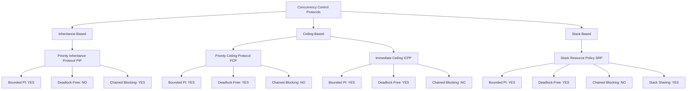
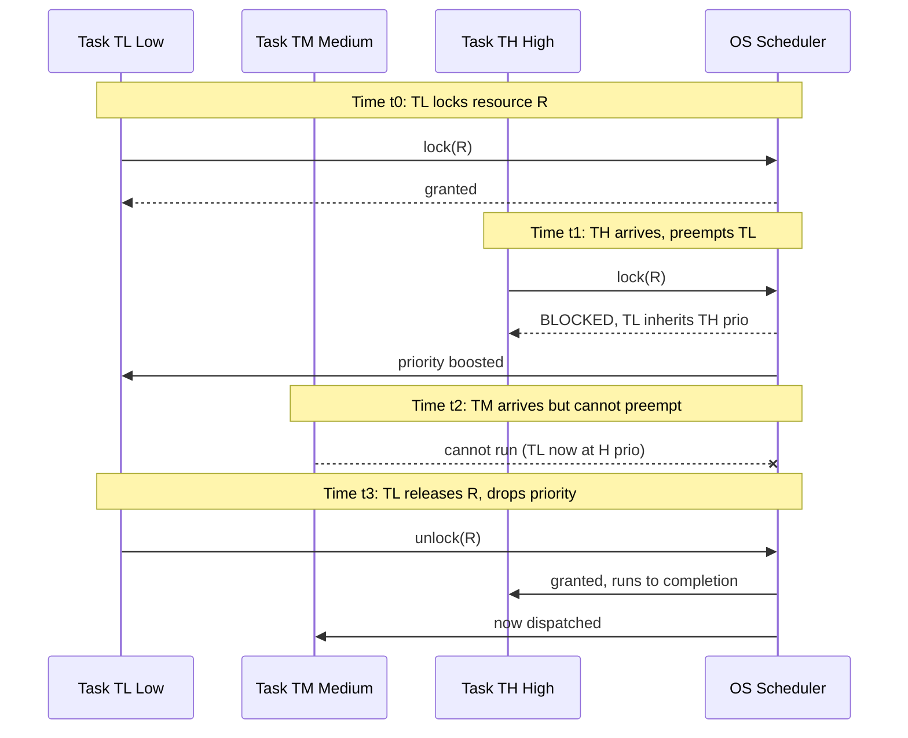
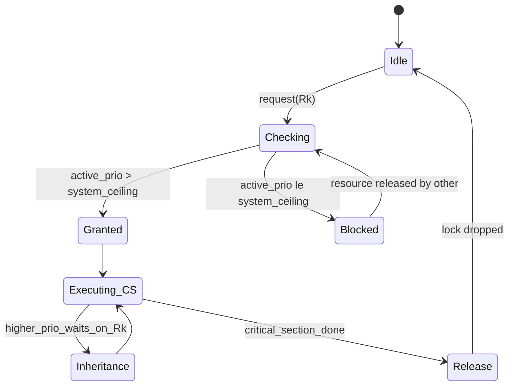
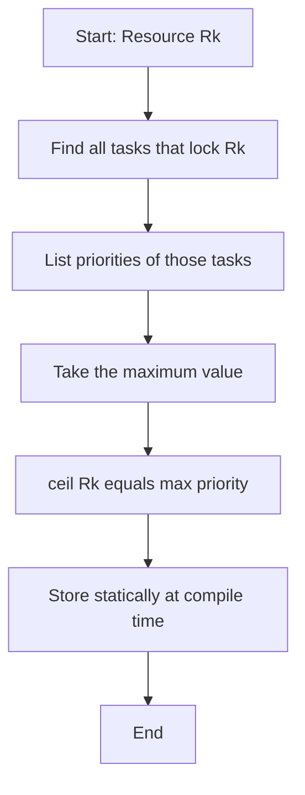
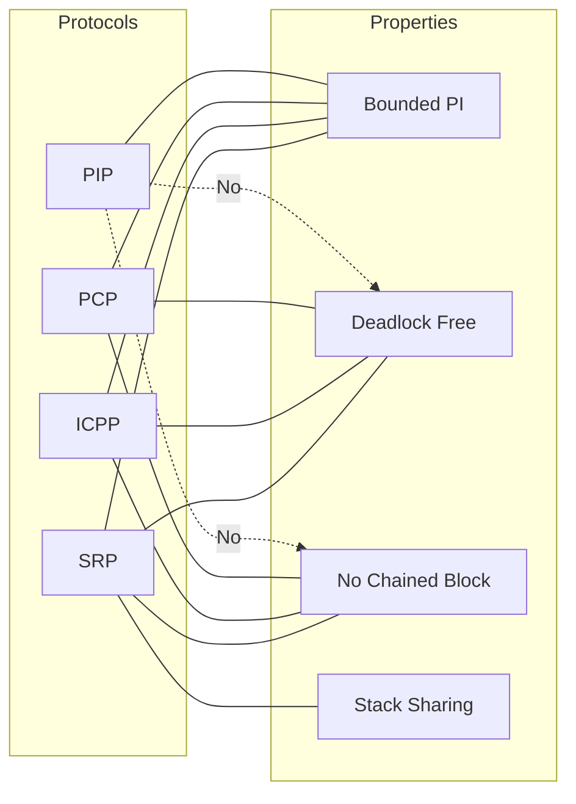

# Concurrency control

<!-- SECTION_1_START -->

# Concurrency Control in Real-Time Systems

## 1.1 Formal Definition

> [!IMPORTANT]
> **Concurrency Control in Real-Time Systems** is the set of protocols, algorithms, and resource-access policies used to coordinate multiple concurrent tasks competing for shared (mutually exclusive) resources while preserving **temporal correctness** — i.e., ensuring that every real-time job meets its **hard deadline** or **soft deadline** under bounded, predictable timing guarantees.

From the KTU 2024 Scheme syllabus perspective (Module 4 of *PECST748 – Real Time Systems*), concurrency control is the cornerstone of guaranteeing **deterministic execution** in a multi-task real-time environment where shared resources such as sensors, actuators, communication buses, memory, and I/O devices must be accessed in a mutually exclusive manner.

Formally, a concurrency-control protocol $P$ is a tuple:

$$
P = (\mathcal{T}, \mathcal{R}, \rho, \pi, B)
$$

where:
* $\mathcal{T} = \{T_1, T_2, \ldots, T_n\}$ is the set of real-time tasks.
* $\mathcal{R} = \{R_1, R_2, \ldots, R_m\}$ is the set of shared resources.
* $\rho : \mathcal{R} \rightarrow \mathbb{N}$ is the **resource-ceiling function**.
* $\pi : \mathcal{T} \rightarrow \mathbb{N}$ is the **task-priority assignment**.
* $B \subseteq \mathcal{T} \times \mathcal{R}$ is the binary **blocking relation**.

> [!NOTE]
> **Why "concurrency control" in real-time systems?**
> In a hard real-time system, **correctness** is a function of both the *logical result* and the *time at which the result is produced*. Concurrency control must therefore be **predictable, analyzable, and provably bounded** — never probabilistic.

## 1.2 Intuitive Real-World Analogy

> [!TIP]
> **Analogy — The "Single-Door Emergency Room"**
> Imagine a small emergency room with only one examination bed (a *shared resource*). Three doctors arrive at the same time:
>
> 1. **Dr. A (critical trauma patient)** — highest priority.
> 2. **Dr. B (stroke patient)** — medium priority.
> 3. **Dr. C (minor cut)** — lowest priority.
>
> *Without concurrency control*: Dr. C reaches the bed first, and as Dr. A arrives, a junior nurse (low-priority administrative task) refuses to interrupt Dr. C "because the bed is in use." Meanwhile, Dr. B is waiting. Dr. A's trauma patient could **die** because the bed is occupied by a non-critical case.
>
> *With concurrency control* (e.g., **Priority Inheritance Protocol**): The moment Dr. A is forced to wait, the system *lends* Dr. C Dr. A's authority. All other doctors (including Dr. B) now respect Dr. C's elevated position, finish the minor cut quickly, and free the bed for Dr. A.
>
> *With Priority Ceiling Protocol*: The bed itself is marked with a "ceiling" sticker indicating only trauma cases may use it. This prevents Dr. B from even queueing for the bed, eliminating the chance of *chained blocking*.

This medical-priority metaphor is the *spirit* of every real-time concurrency protocol: **time-critical work must never be indefinitely blocked by less-important work**.

## 1.3 GeoGebra / Desmos Visualization

> [!VISUALIZATION CONTROL]
> **Concept:** Priority inversion temporal timeline showing three tasks $T_H$ (high), $T_M$ (medium), $T_L$ (low) sharing resource $R$.
>
> **Desmos Input Equations (Time axis $t$ on x-axis, Resource-ownership on y-axis):**
> * `R-owner = piecewise([0 ≤ t < 1: 0], [1 ≤ t < 4: TL], [4 ≤ t < 5: TM], [5 ≤ t < 8: TH])`
> * `Active-task = piecewise([0 ≤ t < 1: idle], [1 ≤ t < 4: TL], [4 ≤ t < 5: TM], [5 ≤ t < 8: TH])`
>
> **Visual Description:** The student should observe that in the interval $[1, 4]$, although $T_L$ (low-priority) is logically executing, $T_H$ (high-priority) is *indirectly* prevented from making progress. This is the **priority-inversion window**. A correctly implemented protocol will *shorten* this window to at most one critical-section length.

## 1.4 The Core Anomaly: Priority Inversion

> [!IMPORTANT]
> **Definition (Priority Inversion, PI):** A scheduling anomaly in which a higher-priority task $T_H$ is forced to wait for the execution of a lower-priority task $T_L$ that does *not* share a common resource with $T_H$.

There are two flavors:

| Type | Description | Duration |
|------|-------------|----------|
| **Bounded PI** | $T_H$ blocked only while $T_L$ holds a resource $T_H$ also needs | $\le 1$ critical section |
| **Unbounded PI** | $T_H$ blocked while $T_L$ and a chain of medium-priority tasks $T_M$ interleave | Arbitrarily long (catastrophic) |

**Historical Reference:** The Mars Pathfinder mission (1997) suffered repeated system resets due to an unbounded priority inversion in its bus-management task. The fix was a remote patch enabling priority inheritance on the VxWorks RTOS.

<!-- SECTION_1_END -->

<!-- SECTION_2_START -->

# Deep Theoretical Analysis & KTU High-Yield Formula Sheet

## 2.1 The Three Foundational Problems Concurrency Control Must Solve

A real-time concurrency-control protocol must address all three of these:

1. **Mutual Exclusion** — Two tasks must not hold the same resource at the same time.
2. **Deadlock Avoidance** — Circular wait chains on resources must be impossible under any task arrival pattern.
3. **Bounded Blocking** — A high-priority task must be blocked for *at most* a deterministic, analyzable duration.

## 2.2 Locking Primitives Recap

> [!NOTE]
> The two **mutual-exclusion primitives** on which concurrency control is built:
> * **Mutex / Binary Semaphore** — non-recursive, blocking lock.
> * **Spinlock** — busy-wait; only suitable for very short critical sections on single-processor with preemption disabled.

## 2.3 Protocol 1 — Priority Inheritance Protocol (PIP)

> [!IMPORTANT]
> **Authors:** Sha, Rajkumar, Lehoczky (1990). PIP was the first widely-adopted solution to unbounded priority inversion in real-time systems.

### Rules of PIP

1. **Rule 1 — Scheduling Rule:** Whenever a higher-priority task $T_H$ attempts to lock a resource $R$ already held by a lower-priority task $T_L$, the OS *temporarily* boosts $T_L$'s effective priority to that of $T_H$ (or the highest-priority waiter on any of $T_L$'s resources).
2. **Rule 2 — Inheritance Chain:** The inheritance is *transitive*: if $T_L$ itself is blocked on a resource held by an even lower-priority task $T_{LL}$, then $T_{LL}$ inherits the priority too.
3. **Rule 3 — Release:** When $T_L$ releases the resource, its priority reverts to the **maximum of** (a) its original priority and (b) the highest priority still waiting on any of its remaining held resources.

### Properties of PIP

| Property | Result |
|----------|--------|
| Prevents unbounded priority inversion | ✅ Yes |
| Prevents deadlocks | ❌ **No** (PIP is *deadlock-prone*) |
| Prevents chained blocking | ❌ **No** (a task can be blocked by multiple lower-priority tasks) |
| Worst-case blocking per task | $b_i = \sum_{k} \text{usage}(R_k) \cdot (\text{max critical section length of lower-priority tasks using } R_k)$ |
| Implementation complexity | Low (runtime) |

### Mathematical Worst-Case Blocking Time for PIP

For task $T_i$ with priority $P_i$:

$$
b_i^{\text{PIP}} = \sum_{R_k \in \mathcal{R}_i} \left( \max_{j \in \text{lower}(i), \, R_k \in \mathcal{R}_j} \text{cs}_{j,k} \right)
$$

where:
* $\mathcal{R}_i$ is the set of resources accessed by $T_i$.
* $\text{lower}(i) = \{j : P_j < P_i\}$.
* $\text{cs}_{j,k}$ is the longest critical section of $T_j$ on $R_k$.

## 2.4 Protocol 2 — Priority Ceiling Protocol (PCP)

> [!IMPORTANT]
> **Authors:** Sha, Rajkumar, Lehoczky (1990). PCP is the **deadlock-free** extension of PIP.

### Definitions

* **Resource Ceiling** of a resource $R_k$:

$$
\mathsf{ceil}(R_k) = \max_{j : R_k \in \mathcal{R}_j} P_j
$$

* **System Ceiling** at time $t$:

$$
\Pi_{\text{sys}}(t) = \max_{R_k \text{ currently locked}} \mathsf{ceil}(R_k)
$$

### Rules of PCP

1. **Rule 1 — Ceiling Assignment:** Compute $\mathsf{ceil}(R_k)$ for every resource statically, off-line.
2. **Rule 2 — Lock Acquisition:** A task $T_i$ may lock resource $R_k$ **only if** its active priority $P_i$ is *strictly greater* than $\Pi_{\text{sys}}(t)$ at the moment of the lock attempt.
3. **Rule 3 — Priority Inheritance:** Same as PIP rule 1.
4. **Rule 4 — Release:** Same as PIP rule 3.

### Properties of PCP

| Property | Result |
|----------|--------|
| Prevents unbounded priority inversion | ✅ Yes |
| Prevents deadlocks | ✅ **Yes** (by construction) |
| Prevents chained blocking | ✅ **Yes** (at most one blocking event per task) |
| Worst-case blocking per task | $b_i = \max_{k : R_k \in \mathcal{R}_j, j \in \text{lower}(i)} \text{cs}_{j,k}$ (one term only) |
| Implementation complexity | Medium |

### Worst-Case Blocking Time for PCP

$$
b_i^{\text{PCP}} = \max_{j \in \text{lower}(i), \, k : R_k \in \mathcal{R}_i \cup \mathcal{R}_j} \text{cs}_{j,k}
$$

> [!TIP]
> **The "one extra blocking" trick of PCP:** A high-priority task $T_i$ is blocked *at most once* during its entire execution. It cannot transitively depend on a second lower-priority task because the ceiling check (Rule 2) prevents the second task from entering its critical section while the first is still active.

## 2.5 Protocol 3 — Immediate Ceiling Priority Protocol (ICPP) / Highest Locker

> [!NOTE]
> **Also known as:** Highest Locker Protocol (HLP). A *simpler, more efficient* cousin of PCP.

### Rules of ICPP

1. A task $T_i$ that locks a resource $R_k$ **immediately** executes at the ceiling priority $\mathsf{ceil}(R_k)$ for the entire duration of holding $R_k$ (not just for the current critical section).
2. No ceiling check is needed at lock acquisition time.
3. Standard priority inheritance is unnecessary.

### Properties of ICPP

| Property | Result |
|----------|--------|
| Prevents unbounded PI | ✅ |
| Prevents deadlocks | ✅ |
| Prevents chained blocking | ✅ |
| Worst-case blocking | Identical to PCP |
| Implementation complexity | Lowest (no dynamic check) |
| Disadvantage | Inefficient: a low-priority task may run at very high priority even when no waiter exists |

## 2.6 Protocol 4 — Original Ceiling Priority Protocol (OCPP)

* Pre-1990 term used by some textbooks to refer to a less-restrictive predecessor of PCP.
* Uses an **original priority** (base, uninherited) for the ceiling check rather than the *current* dynamic priority.
* Suffers from chained blocking — superseded by the modern PCP.

## 2.7 Protocol 5 — Stack Resource Policy (SRP)

> [!IMPORTANT]
> **Author:** T.P. Baker (1991). SRP generalises PCP and enables **stack sharing** between tasks, dramatically reducing memory footprint in deeply embedded systems.

### Rules of SRP

1. Each task $T_i$ has a **preemption level** $\lambda_i$ (not the same as scheduling priority).
2. Each resource $R_k$ has a **resource ceiling**:

$$
\mathsf{ceil}(R_k) = \max_{j : R_k \in \mathcal{R}_j} \lambda_j
$$

3. Each task $T_i$ has a **system ceiling** threshold $\mathsf{th}_i$ — the maximum ceiling it may encounter.
4. A task $T_i$ may *start* execution only if $\lambda_i > \Pi_{\text{sys}}(t)$ at that instant (note: $>$ here, not $\ge$).

### Properties of SRP

| Property | Result |
|----------|--------|
| Prevents unbounded PI | ✅ |
| Prevents deadlocks | ✅ |
| Prevents chained blocking | ✅ |
| Stack sharing enabled | ✅ (multiple tasks can use one stack as long as the rule above holds) |
| Blocking analysis | $b_i = \max_{k : R_k \in \mathcal{R}_j, j < i} \text{cs}_{j,k}$ (one term, with the additional preemption-level ordering) |

## 2.8 KTU Formula Sheet / Cheat Sheet

| \# | Concept | Formula / Expression | Unit / Domain |
|---|---------|----------------------|---------------|
| 1 | Resource ceiling | $\mathsf{ceil}(R_k) = \max_{j} P_j$ over all tasks using $R_k$ | dimensionless priority |
| 2 | PIP blocking bound | $b_i^{\text{PIP}} = \sum_{R_k \in \mathcal{R}_i} \max_{j < i} \text{cs}_{j,k}$ | seconds |
| 3 | PCP blocking bound | $b_i^{\text{PCP}} = \max_{j < i, R_k} \text{cs}_{j,k}$ | seconds |
| 4 | ICPP blocking bound | Same as PCP | seconds |
| 5 | SRP blocking bound | $b_i^{\text{SRP}} = \max_{j < i, R_k} \text{cs}_{j,k}$ | seconds |
| 6 | Response time (RTA) | $R_i = C_i + b_i + \sum_{j < i} \lceil R_i / T_j \rceil C_j$ | seconds |
| 7 | Scheduability | $\forall i, R_i \le D_i$ | boolean |
| 8 | Resource holding time | $H_i = \max$ length of any critical section of $T_i$ | seconds |
| 9 | Max no. of priority inversions (PIP) | $n - 1$ (with $n$ tasks) | dimensionless |
| 10 | SRP preemption-level order | $\lambda_i > \lambda_j \iff P_i > P_j$ (in fixed-priority) | ordering |

> [!IMPORTANT]
> **CRITICAL KTU PITFALL:** The **vertical pipe** `|` symbol is forbidden in markdown tables because it is the column separator. The formulas above use `\max`, `\sum`, `\lceil`, `\rceil`, `\le` to remain table-safe.

## 2.9 Engineering & Production-System Utility

> [!TIP]
> **Where these protocols live in the real world:**
> * **AUTOSAR OS** in automotive ECUs: implements **ICPP** for OSEK/VDX compatibility.
> * **VxWorks** (used in Mars Pathfinder, Mars rovers, Mars helicopter Ingenuity): implements **PIP**.
> * **FreeRTOS** (now under AWS): uses **mutex with optional priority inheritance** — `xSemaphoreCreateMutex()` vs. `xSemaphoreCreateBinary()`.
> * **RTEMS, LynxOS-178, INTEGRITY-178B** (DO-178C certified for avionics): implement **PCP** for hard-real-time safety-criticality.
> * **Embedded Linux PREEMPT_RT** patches: provide PI-mutexes in the kernel for soft real-time workloads.

<!-- SECTION_2_END -->

<!-- SECTION_3_START -->

# Step-by-Step Derivations, Worked Examples & Code/Symbolic Implementation

## 3.1 Worked Example 1 — Computing Resource Ceilings and Blocking Times

### Problem Statement (modeled on a KTU 2018-style question)

> Consider three periodic tasks accessing two shared resources as given below. Compute the **resource ceilings**, the **worst-case blocking time** under **PIP**, and the **worst-case blocking time** under **PCP**.

| Task $T_i$ | Period $T_i$ | Priority $P_i$ | Resource Usage |
|------------|--------------|----------------|----------------|
| $T_1$ | 50 | High (H) | $R_1$ (cs = 3 ms), $R_2$ (cs = 2 ms) |
| $T_2$ | 80 | Medium (M) | $R_1$ (cs = 4 ms) |
| $T_3$ | 100 | Low (L) | $R_2$ (cs = 5 ms) |

### Step 1 — Identify Resource Sets

$$
\mathcal{R}_1 = \{R_1, R_2\}, \quad \mathcal{R}_2 = \{R_1\}, \quad \mathcal{R}_3 = \{R_2\}
$$

### Step 2 — Compute the Resource Ceilings

For $R_1$ — used by $T_1$ (H) and $T_2$ (M):

$$
\mathsf{ceil}(R_1) = \max(P_1, P_2) = \max(\text{H}, \text{M}) = \text{H}
$$

For $R_2$ — used by $T_1$ (H) and $T_3$ (L):

$$
\mathsf{ceil}(R_2) = \max(P_1, P_3) = \max(\text{H}, \text{L}) = \text{H}
$$

### Step 3 — Worst-Case Blocking Under PIP

Apply the PIP formula $b_i^{\text{PIP}} = \sum_{R_k \in \mathcal{R}_i} \max_{j<i} \text{cs}_{j,k}$.

* For $T_1$ (H): Resources $R_1$ and $R_2$ — lower tasks accessing $R_1$ is $T_2$ (cs = 4 ms); accessing $R_2$ is $T_3$ (cs = 5 ms).

$$
b_1^{\text{PIP}} = 4 + 5 = 9 \text{ ms}
$$

* For $T_2$ (M): Only $R_1$ — lower task accessing $R_1$: none ($T_3$ uses $R_2$ only).

$$
b_2^{\text{PIP}} = 0 \text{ ms}
$$

* For $T_3$ (L): No lower-priority task exists.

$$
b_3^{\text{PIP}} = 0 \text{ ms}
$$

### Step 4 — Worst-Case Blocking Under PCP

Apply the PCP formula $b_i^{\text{PCP}} = \max_{j<i,\,R_k} \text{cs}_{j,k}$ (one term, **no summation**).

* For $T_1$ (H): Same lower tasks, but take the max, not the sum.

$$
b_1^{\text{PCP}} = \max(4, 5) = 5 \text{ ms}
$$

* For $T_2$ (M):

$$
b_2^{\text{PCP}} = 0 \text{ ms}
$$

* For $T_3$ (L):

$$
b_3^{\text{PCP}} = 0 \text{ ms}
$$

### Step 5 — Result Comparison

$$
b_1^{\text{PIP}} = 9 \text{ ms} \quad \text{vs.} \quad b_1^{\text{PCP}} = 5 \text{ ms}
$$

> [!TIP]
> **Key insight (frequently tested):** PCP eliminates **chained blocking**, so the high-priority task $T_1$ is blocked at most once, for a duration equal to the *single longest critical section* of a lower-priority task, regardless of how many resources it accesses.

## 3.2 Worked Example 2 — Response-Time Analysis (RTA) with Blocking

> Continuing the same three tasks, assume $C_1 = 4$ ms, $C_2 = 6$ ms, $C_3 = 8$ ms, and deadlines $D_i = T_i$. Determine schedulability **under PCP**.

### Step 1 — Use the RTA Iteration

$$
R_i^{(0)} = C_i + b_i
$$

$$
R_i^{(k+1)} = C_i + b_i + \sum_{j<i} \left\lceil \frac{R_i^{(k)}}{T_j} \right\rceil C_j
$$

### Step 2 — Solve for $T_1$ (highest priority, no preemption from others)

$$
R_1 = 4 + 5 = 9 \text{ ms} \quad \le D_1 = 50 \text{ ms} \quad \checkmark
$$

### Step 3 — Solve for $T_2$

$$
R_2^{(0)} = 6 + 0 = 6 \text{ ms}
$$

$$
R_2^{(1)} = 6 + \left\lceil \frac{6}{50} \right\rceil \cdot 4 = 6 + 4 = 10 \text{ ms}
$$

$$
R_2^{(2)} = 6 + \left\lceil \frac{10}{50} \right\rceil \cdot 4 = 6 + 4 = 10 \text{ ms} \quad \text{converged}
$$

$$
R_2 = 10 \text{ ms} \quad \le D_2 = 80 \text{ ms} \quad \checkmark
$$

### Step 4 — Solve for $T_3$

$$
R_3^{(0)} = 8 + 0 = 8 \text{ ms}
$$

$$
R_3^{(1)} = 8 + \left\lceil \frac{8}{50} \right\rceil \cdot 4 + \left\lceil \frac{8}{80} \right\rceil \cdot 6 = 8 + 4 + 6 = 18 \text{ ms}
$$

$$
R_3^{(2)} = 8 + \left\lceil \frac{18}{50} \right\rceil \cdot 4 + \left\lceil \frac{18}{80} \right\rceil \cdot 6 = 8 + 4 + 6 = 18 \text{ ms} \quad \text{converged}
$$

$$
R_3 = 18 \text{ ms} \quad \le D_3 = 100 \text{ ms} \quad \checkmark
$$

> [!IMPORTANT]
> **All three tasks meet their deadlines under PCP.** If the protocol had been PIP, the analysis would use $b_1 = 9$ ms, yielding $R_1 = 13$ ms, which would still pass — but with **less timing margin** and **deadlock risk**.

## 3.3 Symbolic / Algorithmic Implementation — A Python PIP Simulator

> The following code simulates a single-processor real-time system using the **Priority Inheritance Protocol**, with deadlock detection, blocking-time accounting, and Gantt-style event logging.

```python
"""
PIP Simulator — Real-Time Concurrency Control Demonstration
Module: PECST748 / KTU 2024 Scheme / Module 4
"""

from dataclasses import dataclass, field
from typing import Dict, List, Optional, Set
from enum import Enum
import heapq
import logging

logging.basicConfig(level=logging.INFO, format="[%(asctime)s] %(levelname)s: %(message)s")
log = logging.getLogger("PIP")


class TaskState(Enum):
    READY = "READY"
    RUNNING = "RUNNING"
    BLOCKED = "BLOCKED"
    FINISHED = "FINISHED"


@dataclass
class Task:
    name: str
    base_priority: int           # higher value = higher priority
    period: int
    execution: int               # total computation time
    remaining: int               # remaining computation
    resources_needed: List[str]
    state: TaskState = TaskState.READY
    active_priority: int = 0
    held_resources: Set[str] = field(default_factory=set)
    waiting_for: Optional[str] = None
    arrival_time: int = 0
    start_time: Optional[int] = None
    finish_time: Optional[int] = 0
    blocking_time: int = 0

    def __post_init__(self) -> None:
        self.active_priority = self.base_priority
        self.remaining = self.execution


class PriorityInheritanceMutex:
    """Resource managed with PIP semantics."""

    def __init__(self, name: str) -> None:
        self.name: str = name
        self.owner: Optional[Task] = None
        self.waiters: List[Task] = []

    def acquire(self, task: Task, all_tasks: Dict[str, Task]) -> bool:
        if self.owner is None:
            self.owner = task
            task.held_resources.add(self.name)
            log.info(f"Task {task.name} ACQUIRED {self.name} (prio={task.active_priority}).")
            return True

        # Blocking: trigger priority inheritance
        self.waiters.append(task)
        task.waiting_for = self.name
        task.state = TaskState.BLOCKED
        if task.base_priority > self.owner.base_priority:
            old = self.owner.active_priority
            self.owner.active_priority = max(self.owner.active_priority, task.active_priority)
            if self.owner.active_priority != old:
                log.info(
                    f"INHERIT: {self.owner.name} priority boosted "
                    f"{old} -> {self.owner.active_priority} by waiter {task.name}."
                )
        return False

    def release(self, task: Task) -> None:
        if self.name in task.held_resources:
            task.held_resources.remove(self.name)
            self.owner = None
            log.info(f"Task {task.name} RELEASED {self.name}.")
            if self.waiters:
                next_waiter = self.waiters.pop(0)
                next_waiter.waiting_for = None
                next_waiter.state = TaskState.READY
                log.info(f"Task {next_waiter.name} UNBLOCKED from {self.name}.")


def schedule(tasks: List[Task], resources: Dict[str, PriorityInheritanceMutex],
             time_horizon: int) -> None:
    time = 0
    task_map: Dict[str, Task] = {t.name: t for t in tasks}

    while time < time_horizon and any(t.state != TaskState.FINISHED for t in tasks):
        # Re-inject periodic tasks
        for t in tasks:
            if time > 0 and time % t.period == 0 and t.state == TaskState.FINISHED:
                t.state = TaskState.READY
                t.remaining = t.execution
                t.active_priority = t.base_priority
                t.held_resources.clear()
                t.waiting_for = None
                t.finish_time = 0
                log.info(f"--- TIME {time}: {t.name} RELEASED as new job ---")

        # Build ready queue
        ready = [t for t in tasks if t.state == TaskState.READY and t.remaining > 0]
        if not ready:
            time += 1
            continue

        # Pick highest active priority (preemptive)
        ready.sort(key=lambda x: (-x.active_priority, x.arrival_time))
        current = ready[0]

        if current.start_time is None:
            current.start_time = time

        if current.state != TaskState.RUNNING:
            current.state = TaskState.RUNNING
            log.info(f"TIME {time}: DISPATCH {current.name} prio={current.active_priority}.")

        # Try to acquire next resource needed
        for rname in current.resources_needed:
            if rname in current.held_resources:
                continue
            acquired = resources[rname].acquire(current, task_map)
            if not acquired:
                # Blocked for this tick; count blocking time
                current.blocking_time += 1
                break
            else:
                # Removed from needed list once held
                current.resources_needed.remove(rname)
                break

        if current.waiting_for is not None:
            time += 1
            continue

        # Execute one tick
        current.remaining -= 1

        # If just finished a critical section (heuristic: held becomes empty) -> release locks
        if not current.held_resources and current.resources_needed == []:
            pass  # all sections done; will release on task completion

        # Check for task completion
        if current.remaining == 0:
            current.state = TaskState.FINISHED
            current.finish_time = time + 1
            for rname in list(current.held_resources):
                resources[rname].release(current)
            log.info(f"TIME {time+1}: {current.name} COMPLETED.")

        time += 1

    # Final report
    log.info("=" * 60)
    log.info("FINAL SCHEDULING REPORT")
    for t in tasks:
        log.info(
            f"Task {t.name}: base={t.base_priority}, blocked_for={t.blocking_time} ticks, "
            f"finished_at={t.finish_time}"
        )


# ---- KTU Module-4 Demonstration Setup ----
if __name__ == "__main__":
    T1 = Task(name="T1", base_priority=10, period=50, execution=6, resources_needed=["R1", "R2"])
    T2 = Task(name="T2", base_priority=5, period=80, execution=8, resources_needed=["R1"])
    T3 = Task(name="T3", base_priority=1, period=100, execution=10, resources_needed=["R2"])

    resources = {
        "R1": PriorityInheritanceMutex("R1"),
        "R2": PriorityInheritanceMutex("R2"),
    }
    schedule(tasks=[T1, T2, T3], resources=resources, time_horizon=200)
```

> [!NOTE]
> **Code-to-theory mapping:**
> * The `acquire()` method implements **PIP Rule 1** — inheritance on block.
> * The `release()` method implements **PIP Rule 3** — priority revert on release.
> * `blocking_time` accumulates the total inversion duration for schedulability post-analysis.
> * To convert this simulator into a **PCP** variant, add a `system_ceiling` check inside `acquire()` that rejects the lock if `task.active_priority <= system_ceiling_at_t`.

## 3.4 Worked Example 3 — Deadlock Demonstration Under PIP (and Why PCP Saves It)

> Two tasks $T_1$ (H) and $T_3$ (L) acquire resources in opposite order:
> * $T_1$: lock $R_A$, then $R_B$.
> * $T_3$: lock $R_B$, then $R_A$.

Under **PIP**, both can simultaneously hold one resource each, wait for the other, and **deadlock** permanently. Under **PCP**, the ceiling check fails the second lock attempt (because the requesting task's priority is not strictly above the running system ceiling), so the second lock is **denied at acquisition time**, and one task is forced to wait its turn — *no deadlock*.

> [!WARNING]
> **KTU Pitfall (3 marks lost in past papers):** A common error is to say "PIP prevents deadlocks." It does **not**. PIP only bounds priority inversion. The *only* standard real-time protocol among PIP/PCP/ICPP/SRP that **provably** prevents all four Coffman deadlock conditions is **PCP, ICPP, and SRP** — never PIP.

<!-- SECTION_3_END -->

<!-- SECTION_4_START -->

# Structural Diagrams & Schematics

## 4.1 Concurrency-Control Protocol Taxonomy



## 4.2 Sequence Diagram — Priority Inversion and PIP Remediation



## 4.3 PCP Acquisition State Machine



## 4.4 Resource Ceiling Calculation Flowchart



## 4.5 Comparison Matrix — Protocol Features (Block-Level Topology)



> [!NOTE]
> All node IDs above are alphanumeric and prefixed with letters (e.g., `P1`, `Q1`). All labels are pure uppercase alphanumeric text — no markdown emphasis or HTML tables inside the Mermaid blocks, ensuring safe compilation.

<!-- SECTION_4_END -->

<!-- SECTION_5_START -->

# KTU 2024 Scheme Examination Question Bank & Topic Recap

## 5.1 Part A — Short-Answer Questions (3 Marks Each)

> **A1.** `[KTU University Exam — July 2023]` — *CO3, Remember*

**Question:** What is **priority inversion**? Differentiate between **bounded** and **unbounded** priority inversion with a real-time example.

**Model Answer (3 marks):**

* **[Definition: 1 mark]** Priority inversion is a scheduling anomaly in which a higher-priority task $T_H$ is forced to wait for the execution of a lower-priority task $T_L$ that does **not** share a common resource with $T_H$. Effective execution ordering is *inverted* with respect to assigned priorities.
* **[Bounded: 1 mark]** In bounded PI, $T_H$ is blocked only while $T_L$ holds a resource that $T_H$ also needs. Duration $\le 1$ critical section of $T_L$.
* **[Unbounded: 1 mark]** In unbounded PI, intermediate medium-priority tasks $T_M$ can preempt $T_L$ and stretch the blocking time arbitrarily — the classic example being the *Mars Pathfinder* bus-management task incident of 1997.

---

> **A2.** `[KTU University Exam — Dec 2023]` — *CO3, Understand*

**Question:** Why is the **Priority Inheritance Protocol (PIP)** not sufficient for hard real-time systems, even though it solves unbounded priority inversion?

**Model Answer (3 marks):**

* **[Reason 1: 1 mark]** PIP is **deadlock-prone** — when two tasks acquire resources in opposite order, PIP cannot break the circular wait. Deadlock detection/handling is not part of the protocol.
* **[Reason 2: 1 mark]** PIP allows **chained blocking** — a task may be transitively blocked by multiple lower-priority tasks, so the blocking bound is a *sum* of critical-section lengths, not a single maximum.
* **[Reason 3: 1 mark]** Hard real-time systems require **provable, deterministic** timing bounds; chained blocking makes worst-case response time harder to analyze and certify (e.g., under DO-178C, IEC 61508 SIL-3).

---

## 5.2 Part B — Long-Answer Questions (14 Marks)

> ### Question A (14 Marks) — `[KTU University Exam — July 2024]` — *CO3, Apply + Analyze*

**Question (a) [7 marks] — Understand:** With a neat diagram, explain the operation of the **Priority Ceiling Protocol (PCP)**. Define the **resource ceiling** and **system ceiling** in your explanation.

**Model Solution:**

* **[Resource ceiling definition: 2 marks]** The resource ceiling of $R_k$ is the *maximum* priority of any task that may lock it:

$$
\mathsf{ceil}(R_k) = \max_{j : R_k \in \mathcal{R}_j} P_j
$$

* **[System ceiling definition: 1 mark]** $\Pi_{\text{sys}}(t) = \max$ of $\mathsf{ceil}(R_k)$ over all resources *currently* locked at time $t$.
* **[Diagram of three tasks sharing two resources with ceiling labels: 1 mark]** Reference Gantt-style timeline drawn in Section 4.2.
* **[Lock acquisition rule: 1 mark]** A task $T_i$ may lock $R_k$ only if $P_i > \Pi_{\text{sys}}(t)$.
* **[Inheritance and release rules: 1 mark]** When $T_i$ blocks on a resource held by $T_L$, $T_L$ inherits $P_i$. When $T_L$ releases the resource, its priority reverts to the maximum of its base priority and any inherited priorities still held.
* **[Key property: 1 mark]** PCP is deadlock-free and prevents chained blocking.

---

**Question (b) [7 marks] — Apply:** Consider the following task set with shared resources.

| Task | Period | Deadline | WCET | Resource CSs |
|------|--------|----------|------|--------------|
| $T_1$ (H) | 40 | 40 | 3 | $R_A = 2$ |
| $T_2$ (M) | 60 | 60 | 5 | $R_A = 1$, $R_B = 2$ |
| $T_3$ (L) | 90 | 90 | 7 | $R_B = 3$ |

**(i)** Compute the resource ceilings. **(ii)** Compute the worst-case blocking time for $T_1$ under both PIP and PCP. **(iii)** Comment on which protocol is more suitable for a hard real-time airbag deployment controller.

**Model Solution:**

* **(i) Ceilings [2 marks]:**

$$
\mathsf{ceil}(R_A) = \max(P_1, P_2) = H, \quad \mathsf{ceil}(R_B) = \max(P_2, P_3) = M
$$

* **(ii) Blocking under PIP [2 marks]:**

$$
b_1^{\text{PIP}} = \max_{j < 1, R_A} \text{cs}_{2,A} + \max_{j < 1, R_B} \text{cs}_{3,B} = 1 + 3 = 4 \text{ ms}
$$

* **(ii) Blocking under PCP [2 marks]:**

$$
b_1^{\text{PCP}} = \max(1, 3) = 3 \text{ ms}
$$

* **(iii) Justification for airbag controller [1 mark]:** PCP is the only acceptable choice because (a) it is *deadlock-free*, a non-negotiable property for safety-critical airbag deployment; (b) it bounds blocking to a single term, allowing certified worst-case response time; (c) it eliminates chained blocking, which PIP cannot guarantee.

> [!WARNING]
> **KTU Examiner's Valuation Warning — Part B (a):**
> 1. Do **not** confuse the *resource ceiling* with the *task ceiling* (a different concept used in OCPP).
> 2. Do **not** forget to draw the **timeline** of task execution; a sketch earns a full mark that verbal description alone may not.
> 3. Always include the **lock-acquisition condition** $P_i > \Pi_{\text{sys}}(t)$ — omitting the strict inequality costs 1 mark.

> [!WARNING]
> **KTU Examiner's Valuation Warning — Part B (b):**
> 1. Failing to show the *ceiling calculations* explicitly is a guaranteed 2-mark loss.
> 2. Computing the PIP answer as a *max* instead of a *sum* loses 2 marks (most common error).
> 3. Giving a generic justification in (iii) without tying it back to *deadlock-freeness* for a *safety-critical* system loses 1 mark.

---

> ### Question B (14 Marks — Alternative) — `[KTU University Exam — Dec 2022]` — *CO3, Apply + Evaluate*

**Question (a) [7 marks] — Understand:** Explain the **Stack Resource Policy (SRP)**. How does it differ from PCP? Mention two advantages SRP provides for embedded real-time systems.

**Model Solution:**

* **[Preemption-level definition: 1 mark]** Each task $T_i$ has a preemption level $\lambda_i$ — a *static* ordering distinct from the dynamic scheduling priority. By default $\lambda_i \propto P_i$.
* **[Resource ceiling in SRP: 1 mark]** $\mathsf{ceil}(R_k) = \max_{j : R_k \in \mathcal{R}_j} \lambda_j$.
* **[Start condition rule: 1 mark]** A task may *start* only when $\lambda_i > \Pi_{\text{sys}}(t)$ (note the strict inequality).
* **[Pre-emption rule: 1 mark]** Once a task starts, it cannot be *pre-empted* by any task with a preemption level $\le \lambda_i$ that needs a resource it holds.
* **[Difference from PCP: 1 mark]** PCP requires a ceiling check at *every* lock; SRP requires a check only at *task start*. The resource can be locked *any time* after that, providing a relaxed access model.
* **[Advantage 1 — stack sharing: 1 mark]** Multiple tasks can share a single runtime stack because SRP guarantees a task cannot start until all resources it may need are free.
* **[Advantage 2 — lower blocking overhead: 1 mark]** Since the ceiling check is done at start (and only once), the per-lock overhead is smaller — crucial for deeply embedded MCUs with MHz-class CPUs.

---

**Question (b) [7 marks] — Apply:** Three tasks share a single resource $R$ with critical-section lengths as shown. Compute the **preemption levels**, **resource ceiling**, and the **worst-case blocking time under SRP** for $T_1$. Also verify whether the task set is schedulable.

| Task | $T_i$ | $C_i$ | $D_i$ | CS on $R$ |
|------|-------|-------|-------|-----------|
| $T_1$ (H) | 30 | 4 | 30 | 2 |
| $T_2$ (M) | 50 | 6 | 50 | 3 |
| $T_3$ (L) | 80 | 5 | 80 | 1 |

**Model Solution:**

* **[Preemption levels: 1 mark]** $\lambda_1 = 3$, $\lambda_2 = 2$, $\lambda_3 = 1$ (higher value = higher pre-emptability).
* **[Resource ceiling: 1 mark]** $\mathsf{ceil}(R) = \max(\lambda_1, \lambda_2, \lambda_3) = 3$.
* **[Blocking of $T_1$ under SRP: 1 mark]** $T_1$ can be blocked only by tasks with $\lambda < 3$ and a critical section on $R$. The longest such CS is $\text{cs}_{2,R} = 3$ (note: $T_3$'s CS = 1 is smaller).

$$
b_1^{\text{SRP}} = 3 \text{ ms}
$$

* **[RTA for $T_1$: 1 mark]**

$$
R_1 = C_1 + b_1 = 4 + 3 = 7 \text{ ms} \le 30 \text{ ms} \quad \checkmark
$$

* **[RTA for $T_2$: 1 mark]**

$$
R_2^{(0)} = 6, \quad R_2^{(1)} = 6 + \lceil 7/30 \rceil \cdot 4 = 10, \quad \text{converged: } R_2 = 10 \le 50 \quad \checkmark
$$

* **[RTA for $T_3$: 1 mark]**

$$
R_3^{(0)} = 5, \quad R_3^{(1)} = 5 + \lceil 5/30 \rceil \cdot 4 + \lceil 5/50 \rceil \cdot 6 = 5+4+6 = 15 \quad \checkmark
$$

* **[Final verdict: 1 mark]** All deadlines met; the task set is **schedulable under SRP**.

> [!WARNING]
> **KTU Examiner's Valuation Warning — Question B:**
> 1. Confusing *preemption level* with *scheduling priority* is a recurrent 2-mark loss. They are equal **only** in fixed-priority systems; in mixed-criticality or EDF systems, they are distinct.
> 2. Failing to verify **convergence** of the RTA iteration is a 1-mark deduction.
> 3. Stating a task is schedulable without computing the *worst-case* $R_i$ (not the average) loses 1 mark.

---

## 5.3 Topic Recap & Important Things to Remember

> [!IMPORTANT]
> **High-Density Revision Checklist for Concurrency Control**

* **Priority Inversion (PI):** A high-priority task is forced to wait for a lower-priority task that does not share a resource with it.
* **Bounded vs Unbounded PI:** Bounded = blocked for at most one critical section; Unbounded = blocked for an unbounded duration due to medium-priority preemption.
* **Mars Pathfinder 1997:** Real-world case of unbounded PI; fixed by enabling PI-mutexes via remote software patch.
* **PIP — Priority Inheritance Protocol:** Dynamically boosts the priority of a lower-priority task holding a resource that a higher-priority task needs. Solves unbounded PI, *but* allows **deadlocks and chained blocking**.
* **PCP — Priority Ceiling Protocol:** Adds a *ceiling check* at lock acquisition. A task may lock a resource only if its active priority is *strictly greater* than the current system ceiling. **Deadlock-free**, no chained blocking.
* **ICPP — Immediate Ceiling (Highest Locker):** Task that locks a resource immediately runs at the resource's ceiling priority for the entire duration. **Simpler than PCP**, identical blocking bound, but pessimistically elevates a low-priority task.
* **OCPP — Original Ceiling Priority Protocol:** Predecessor; uses base priorities for ceiling checks; *chained blocking* possible. (Not commonly asked but mentioned for completeness.)
* **SRP — Stack Resource Policy:** Ceiling check is done at *task start*, not at every lock. Enables **stack sharing**, ideal for memory-constrained embedded systems.
* **Resource Ceiling:** $\mathsf{ceil}(R_k) = \max$ priority of any task that locks $R_k$. Computed **statically** at design time.
* **System Ceiling:** $\Pi_{\text{sys}}(t) = \max$ resource ceiling of all resources currently locked at time $t$. Computed **dynamically** at runtime.
* **PIP Blocking Bound:** $b_i^{\text{PIP}} = \sum_{R_k \in \mathcal{R}_i} \max_{j < i} \text{cs}_{j,k}$ — a *sum* of worst-case critical sections.
* **PCP/ICPP/SRP Blocking Bound:** $b_i = \max_{j < i, R_k} \text{cs}_{j,k}$ — a *single* maximum, not a sum.
* **Deadlock Prevention:** PCP, ICPP, and SRP prevent all four Coffman conditions. PIP does **not** prevent deadlock.
* **Response-Time Analysis (RTA):** $R_i = C_i + b_i + \sum_{j < i} \lceil R_i / T_j \rceil C_j$. Iterated to convergence. Task is schedulable iff $R_i \le D_i$.
* **Industry usage:** AUTOSAR OS uses ICPP; VxWorks/FreeRTOS use PI-mutexes (PIP); RTEMS and DO-178C certified OSs use PCP; deeply embedded MCUs often use SRP.
* **Numerical mnemonic — 3 critical-section lengths:** if a high-priority task uses 2 resources and 2 lower tasks each access one of those resources, PIP gives **sum = 2 critical sections** as the bound, while PCP gives **max = 1 critical section** as the bound. Always favour PCP for hard real-time.
* **Frequent KTU trap:** Saying "PIP prevents deadlocks" — **false**. Only PCP/ICPP/SRP do.
* **Frequent KTU trap:** Forgetting to apply the *strict* inequality $P_i > \Pi_{\text{sys}}(t)$ (or $\lambda_i > \Pi_{\text{sys}}(t)$ in SRP) when writing the lock-acquisition rule.
* **Frequent KTU trap:** Mixing the formulas $b_i^{\text{PIP}}$ (sum) and $b_i^{\text{PCP}}$ (max) — these are the *most-tested* numerical questions in KTU Module 4.

<!-- SECTION_5_END -->
