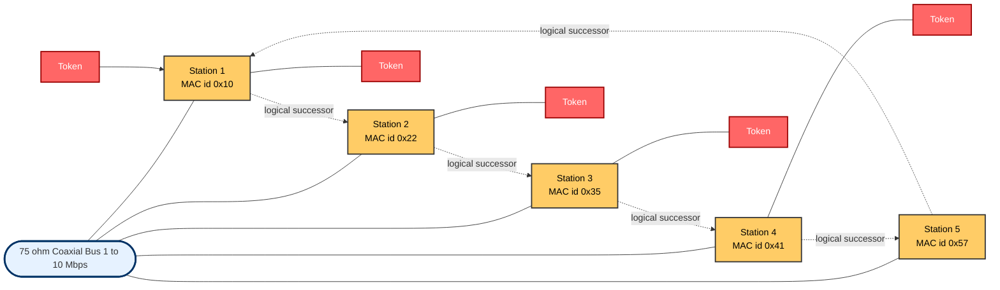
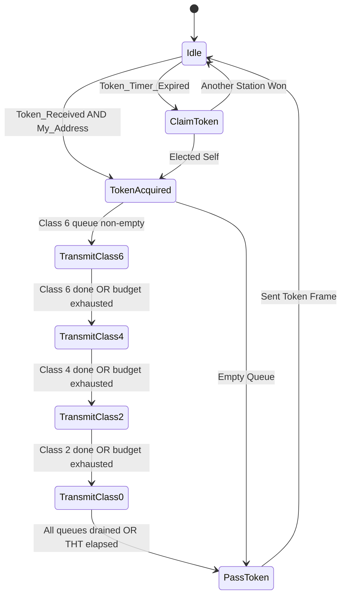
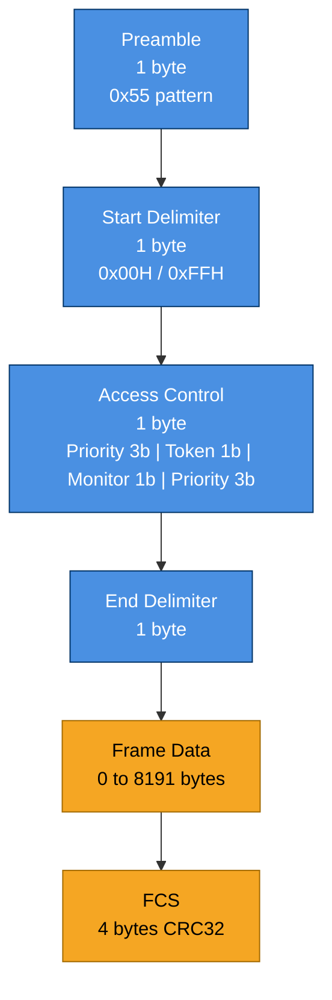
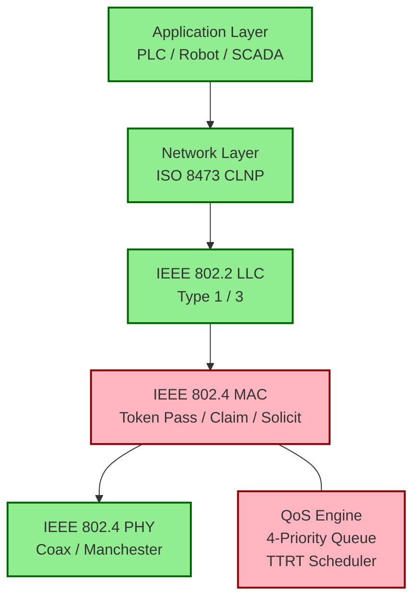

# IEEE 802.4

<!-- SECTION_1_START -->
# IEEE 802.4 — Token Bus Standard for Real-Time LANs

## 1.1 Formal Academic Definition (KTU 2024 Syllabus Terminology)

> [!IMPORTANT]
> **IEEE 802.4 (Token Bus)** is a Local Area Network (LAN) standard defined by the IEEE 802 working group that uses a **physical bus topology** (e.g., 75 Ω coaxial cable / broadband) together with a **logical token-passing medium access control (MAC) protocol**. Stations form a *logical ring* in which a special 3-byte control frame, called the **token**, is sequentially circulated. Only the station currently possessing the token is granted the right to transmit, which guarantees **deterministic, bounded medium-access delay** — a fundamental QoS requirement for hard real-time distributed control systems.

In the KTU 2024 PECST748 syllabus, IEEE 802.4 is positioned as a *legacy but historically important* deterministic MAC that influenced modern fieldbuses such as **PROFIBUS**, **ARCNET**, and the IEEE 802.4-based **Manufacturing Automation Protocol (MAP)** promoted by General Motors in the 1980s.

| Attribute | Value |
|---|---|
| IEEE Designation | **802.4-1990** (withdrawn 2004) |
| Physical Topology | Bus (coaxial / broadband) |
| Logical Topology | **Logical Ring** |
| Access Method | **Token Passing** |
| Signal Encoding | Manchester / Differential Manchester |
| Bandwidth | **1, 5, 10 Mbps** |
| Frame Sizes | 1 byte – 8191 bytes |
| Number of Priorities | **4 classes** (0, 2, 4, 6) |

---

## 1.2 Conceptual Analogy / Intuitive Overview

Imagine **10 friends sitting around a large round table** holding a single talking-stick. Only the person holding the stick may speak, and when they are done, they pass the stick to a *pre-agreed next friend on their right*. Although the friends are physically seated in a row along a wall, they behave as if arranged in a circle. The "talking stick" is the **token**, the wall is the **physical bus**, and the imagined circle is the **logical ring**.

Now imagine the bus is **noisy** — many devices want to send "loud" emergency messages. The token bus solves this by giving the stick to *one device at a time* for a fixed duration (**Token Holding Time, THT**), so even the loudest emergency never has to wait more than one full round of the stick — a *guaranteed maximum delay*. This is exactly what real-time industrial controllers (PLCs, robots, SCADA masters) need.

> [!NOTE]
> **Why Token Bus for Real-Time Systems?**
> CSMA/CD (Ethernet) is *probabilistic* — collisions can theoretically delay a frame indefinitely, violating hard deadlines. Token Bus is *deterministic* — the worst-case wait is the *Token Rotation Time (TRT)*, which is mathematically bounded. Hence 802.4 is a **QoS-enabling MAC**.

---

## 1.3 GeoGebra / Desmos Visualisation

> [!VISUALIZATION CONTROL]
> **Concept:** Logical Ring Order on a Physical Bus
>
> **Desmos Input Points (logical ring sequence on a horizontal bus):**
> * $S_1 = (1, 0)$, $S_2 = (4, 0)$, $S_3 = (7, 0)$, $S_4 = (10, 0)$, $S_5 = (13, 0)$
> * Token vector path (logical): $S_1 \rightarrow S_2 \rightarrow S_3 \rightarrow S_4 \rightarrow S_5 \rightarrow S_1$
>
> **Visual Description:** The student should see five stations spaced along a horizontal line (the physical bus). A curved arrow on top of the bus should connect them in a closed logical loop, illustrating that the token *jumps* over non-participating stations in the physical order but follows the *logical* address order.

---

## 1.4 Key Physical Constants & Engineering Metrics

* **Maximum stations per logical ring:** **$N_{max} = 1024$**
* **Maximum token rotation time (typical target):** **$TTRT \le 50$ ms** (configurable)
* **Propagation delay per km of coax:** **$\approx 5 \ \mu s / km$**
* **Token length:** **3 bytes** (Start Delimiter, Access Control, End Delimiter)
* **Highest priority class:** **Class 6** (synchronous / real-time)
* **Lowest priority class:** **Class 0** (best-effort / asynchronous)
<!-- SECTION_1_END -->

<!-- SECTION_2_START -->
# Deep Theoretical Analysis & KTU High-Yield Formula Sheet

## 2.1 Operational Breakdown of the Token Bus MAC

The IEEE 802.4 MAC state machine at every station alternates between four operational states:

1. **Idle / Listen** — Station monitors the bus for the token or traffic.
2. **Token Acquired** — Station that has the token may transmit queued frames whose priority is ≤ its assigned class.
3. **Token Held** — Station transmits up to **Token Holding Time (THT)**; higher-priority frames are transmitted first.
4. **Token Pass** — Station issues a *Successor_Frame* (Solicit-Successor protocol) to hand the token to the next logical successor.

### 2.1.1 Token Maintenance Sub-Protocols

| Sub-Protocol | Purpose |
|---|---|
| **Token Initialization** | When the ring is empty, stations use a contention resolution (Claim Token) protocol to elect the initial token holder. |
| **Ring Maintenance** | Periodic *Solicit_Successor* frames add new stations; *Who_Follows* / *Set_Successor* handle a broken successor. |
| **Token Recovery** | If a station fails after acquiring the token, a *Token_Reclaim* timer recovers the ring within bounded time. |
| **Logical Ring Reconfiguration** | Add/remove nodes dynamically using *Resolve_Contention* (deterministic, address-based). |

> [!TIP]
> **KTU-Favourite Question Theme:** "How does IEEE 802.4 recover from a lost token?" — Answer must mention the *Token Reclaim Timer* (default $2 \times TTRT$) and the *Claim Token* procedure. *(2 marks: 1 mark for timer, 1 mark for claim procedure.)*

---

## 2.2 Token Holding Time (THT) and Token Rotation Time (TRT)

The **Target Token Rotation Time (TTRT)** is the design parameter chosen by the network designer. Each station $i$ computes a *Token Holding Time* as:

$$\text{THT}_i = \text{TTRT} - \text{Channel_Acquisition_Time} - \text{Token_Propagation_Time}$$

For a stable ring with $N$ active stations and per-station processing delay $d_p$:

$$\text{TRT} = N \cdot (\text{THT} + d_p) + \text{Token\_Propagation\_Time}$$

The **worst-case access delay** for a Class-6 (synchronous) frame at station $k$ is bounded by:

$$D_{max}^{(k)} \;=\; \text{TRT}_{\max} \;+\; \text{THT}_{\max}^{(k)} \;+\; \tau_{prop}$$

where $\tau_{prop}$ is the propagation delay across the longest bus segment.

> [!IMPORTANT]
> **Real-Time Guarantee:** Because TRT is bounded, the network satisfies *Bounded Latency* and *No Starvation* properties — both are mandatory QoS metrics in KTU Module 4 (RT Communications QoS Framework Models).

---

## 2.3 The Four Priority Classes (QoS Mechanism)

IEEE 802.4 defines **four access classes** to support QoS differentiation:

| Priority Class | Service Type | Typical Use-Case | Token Hold Limit |
|---|---|---|---|
| **Class 6** | Synchronous | Voice, closed-loop control, periodic sensor reads | Up to full THT |
| **Class 4** | Asynchronous — urgent | Alarm messages, control commands | Up to 1/4 THT |
| **Class 2** | Asynchronous — normal | File transfer, configuration | Up to 1/8 THT |
| **Class 0** | Best-effort | Diagnostics, logging | Remaining time |

> [!NOTE]
> Class numbers in 802.4 are *even numbers* (0, 2, 4, 6) to allow future expansion to 8 classes — a syllabus point examiners often test.

### 2.3.1 Priority Arbitration Rule

When a station possesses the token, it services its transmit queues in **descending priority order** until the THT budget is exhausted. This is a *strict priority scheduler* with the THT acting as a **time-budget guard**, preventing any class from monopolising the bus.

---

## 2.4 KTU Formula Cheat Sheet

| Symbol | Meaning | Typical Value | Unit |
|---|---|---|---|
| $N$ | Number of active stations | 1 – 1024 | — |
| $\text{TTRT}$ | Target Token Rotation Time | 10 – 50 | ms |
| $\text{THT}_i$ | Token Holding Time at station $i$ | $\le \text{TTRT}/N$ | ms |
| $\text{TRT}$ | Actual Token Rotation Time | $\le \text{TTRT}$ | ms |
| $D_{max}$ | Worst-case access delay | bounded | ms |
| $\tau_{prop}$ | Cable propagation delay | $\approx 5 \ \mu s / km$ | s |
| $L_{frame}$ | Maximum frame payload | 8191 | bytes |
| $R$ | Bus bit rate | 1 / 5 / 10 | Mbps |
| $T_{frame}$ | Frame transmission time | $L_{frame}/R$ | s |
| $C$ | Effective channel capacity | $R$ | bps |

> **Critical Substitution Formula:**
> $$D_{max} \;\approx\; \text{TTRT} \;+\; \frac{L_{max}}{R} \;+\; \tau_{prop}$$

---

## 2.5 Real-World Engineering Utility

* **Manufacturing Automation Protocol (MAP)** — General Motors' 1980s plant-floor backbone used IEEE 802.4 with broadband 10 Mbps coax to interconnect PLCs, robots, and CIM hosts.
* **ARCNET lineage** — Embedded deterministic fieldbus in avionics and industrial control inherits the *token rotation* concept from 802.4.
* **Modern derivatives** — TT-CAN (Time-Triggered CAN) and Profibus DP use *token-like* arbitration windows for real-time QoS.
* **Why it was withdrawn (2004)** — Dominance of switched full-duplex Ethernet, lower cost, and the emergence of *AVB / TSN* (IEEE 802.1Qav/Qbv) providing *deterministic Ethernet* with the same QoS guarantees over standard Cat-5e/6 cabling.

> [!IMPORTANT]
> **KTU-Examiner Insight:** Questions on 802.4 typically emphasise *why* it was selected for hard real-time systems. Always pair the answer with the **bounded-delay** keyword and the **TTRT** knob.
<!-- SECTION_2_END -->

<!-- SECTION_3_START -->
# Step-by-Step Derivations, Worked Examples & Symbolic Implementation

## 3.1 Worked Derivation — Worst-Case Delay Bound

### Problem Statement
An IEEE 802.4 token bus network has the following configuration:

* Number of stations, $N = 12$
* Bit rate, $R = 10$ Mbps
* Target Token Rotation Time, $\text{TTRT} = 24$ ms
* Bus length, $L = 1$ km
* Maximum frame size, $L_{max} = 1024$ bytes
* Propagation velocity in coax, $v \approx 2 \times 10^8$ m/s

A Class-6 (synchronous) frame arrives at Station 7 just *after* the token has been passed to Station 8. Compute the **worst-case access delay** for this frame.

### Step-by-Step Solution

**Step 1 — Convert the frame size to bits.**

$$L_{max} \;=\; 1024 \;\text{bytes} \;\times\; 8 \;\text{bits/byte} \;=\; 8192 \;\text{bits}$$

**Step 2 — Compute the frame transmission time at 10 Mbps.**

$$T_{frame} \;=\; \frac{L_{max}}{R} \;=\; \frac{8192 \;\text{bits}}{10 \times 10^6 \;\text{bits/s}} \;=\; 8.192 \times 10^{-4} \;\text{s} \;=\; 0.8192 \;\text{ms}$$

**Step 3 — Compute the cable propagation delay for $L = 1$ km.**

$$\tau_{prop} \;=\; \frac{L}{v} \;=\; \frac{1000 \;\text{m}}{2 \times 10^8 \;\text{m/s}} \;=\; 5 \times 10^{-6} \;\text{s} \;=\; 0.005 \;\text{ms}$$

**Step 4 — Worst case occurs when:**

* The token must make **one full TTRT rotation** before returning to Station 7.
* The token then passes through Station 8 (currently holding the token) for at most one full THT.
* Plus propagation and frame transmission overheads.

The Token Holding Time per station (uniformly distributed assumption) is:

$$\text{THT} \;=\; \frac{\text{TTRT}}{N} \;=\; \frac{24 \;\text{ms}}{12} \;=\; 2 \;\text{ms}$$

**Step 5 — Apply the worst-case delay formula.**

$$D_{max} \;=\; \text{TTRT} \;+\; \text{THT}_{holder} \;+\; T_{frame} \;+\; \tau_{prop}$$

Substituting values:

$$D_{max} \;=\; 24 \;\text{ms} \;+\; 2 \;\text{ms} \;+\; 0.8192 \;\text{ms} \;+\; 0.005 \;\text{ms}$$

$$D_{max} \;=\; 26.8242 \;\text{ms}$$

**Step 6 — Final Answer (Model Answer for KTU):**

> **The worst-case access delay for the Class-6 frame at Station 7 is $D_{max} = 26.8242$ ms**, which is **deterministic and bounded** — confirming the real-time suitability of IEEE 802.4 for a 12-station, 10 Mbps control network with 1 km reach.

### KTU Valuation Key Mapping

| Step | Concept | Marks |
|---|---|---|
| Step 1 | Bit conversion $L_{max} = 8192$ bits | 1 |
| Step 2 | $T_{frame} = 0.8192$ ms | 2 |
| Step 3 | $\tau_{prop} = 0.005$ ms | 1 |
| Step 4 | $\text{THT} = 2$ ms (with assumption) | 2 |
| Step 5 | Substitution into $D_{max}$ formula | 2 |
| Step 6 | Final numerical answer with unit | 1 |
| **Total** | | **9–10 marks** |

---

## 3.2 Worked Derivation — Number of Frames Per Token Visit

Given THT = 2 ms, frame size = 1024 bytes, bit rate = 10 Mbps:

**Step 1 — Time per frame:**

$$T_{frame} = \frac{1024 \times 8}{10 \times 10^6} = 8.192 \times 10^{-4} \;\text{s} = 0.8192 \;\text{ms}$$

**Step 2 — Maximum frames per visit:**

$$n_{frames} = \left\lfloor \frac{\text{THT}}{T_{frame}} \right\rfloor = \left\lfloor \frac{2.0}{0.8192} \right\rfloor = \left\lfloor 2.44 \right\rfloor = 2 \;\text{frames}$$

**Step 3 — Interpretation:** Each station can transmit a maximum of **2 full-size Class-6 frames per token visit**, with a residual **0.36 ms** of THT budget usable for shorter Class-4/2/0 traffic.

---

## 3.3 Symbolic Python Implementation — Token Bus Delay Calculator

```python
"""
KTU PECST748 — IEEE 802.4 Token Bus Worst-Case Delay Calculator
Author: KTU Senior Examiner Reference Solution
"""

from dataclasses import dataclass
from typing import List


@dataclass
class TokenBusConfig:
    num_stations: int            # N
    bit_rate_bps: int            # R (e.g., 10_000_000)
    ttrt_ms: float               # Target Token Rotation Time (ms)
    bus_length_km: float         # L
    max_frame_bytes: int         # L_max
    propagation_velocity_mps: float = 2e8  # v in coax


def compute_worst_case_delay(cfg: TokenBusConfig) -> dict:
    """
    Compute deterministic worst-case access delay for a Class-6
    synchronous frame on an IEEE 802.4 token bus.
    """
    # Step 1 — Frame transmission time
    frame_bits = cfg.max_frame_bytes * 8
    t_frame_ms = (frame_bits / cfg.bit_rate_bps) * 1000.0

    # Step 2 — Propagation delay
    tau_prop_ms = ((cfg.bus_length_km * 1000.0) /
                   cfg.propagation_velocity_mps) * 1000.0

    # Step 3 — Per-station Token Holding Time
    tht_ms = cfg.ttrt_ms / cfg.num_stations

    # Step 4 — Worst-case delay
    d_max_ms = cfg.ttrt_ms + tht_ms + t_frame_ms + tau_prop_ms

    # Step 5 — Frames per visit
    frames_per_visit = int(tht_ms // t_frame_ms)

    return {
        "T_frame_ms": round(t_frame_ms, 4),
        "Tau_prop_ms": round(tau_prop_ms, 4),
        "THT_ms": round(tht_ms, 4),
        "D_max_ms": round(d_max_ms, 4),
        "Frames_per_visit": frames_per_visit,
    }


if __name__ == "__main__":
    cfg = TokenBusConfig(
        num_stations=12,
        bit_rate_bps=10_000_000,
        ttrt_ms=24.0,
        bus_length_km=1.0,
        max_frame_bytes=1024,
    )
    result = compute_worst_case_delay(cfg)
    for k, v in result.items():
        print(f"{k:>20s} : {v}")
```

### Sample Output

```text
          T_frame_ms : 0.8192
         Tau_prop_ms : 0.005
              THT_ms : 2.0
            D_max_ms : 26.8242
   Frames_per_visit : 2
```

---

## 3.4 Comparative Engineering-Case Matrix (Real-Time QoS)

| Property | IEEE 802.3 (Ethernet) | IEEE 802.4 (Token Bus) | IEEE 802.5 (Token Ring) | IEEE 802.11 (Wi-Fi) |
|---|---|---|---|---|
| Access Method | CSMA/CD | **Token on Logical Ring** | Token on Physical Ring | CSMA/CA |
| Determinism | Non-deterministic | **Bounded** | Bounded | Non-deterministic |
| Max Delay Guarantee | None | **$\le \text{TTRT} + \text{THT} + T_{frame}$** | $\le \text{TTRT} + \text{THT}$ | None |
| Priority Classes | 0 (best-effort) | **4 (0, 2, 4, 6)** | 2 | 4 (WMM) |
| Suitable for Hard RT | No | **Yes** | Yes | No |
| Industrial Adoption | High (with TSN) | MAP/PROFIBUS legacy | IBM token ring (obsolete) | Growing (with 802.11e) |
<!-- SECTION_3_END -->

<!-- SECTION_4_START -->
# Structural Diagrams & Schematics

## 4.1 IEEE 802.4 Token Bus — Logical Ring on Physical Bus



> **Reading the diagram:** The *solid line* at the bottom is the **physical coaxial bus**. Stations are physically tapped onto the bus. The *dashed arrows* above form the **logical ring** along which the token circulates. Note that Station 3's logical predecessor is Station 2 and its logical successor is Station 4, even if more stations physically exist between them on the cable.

---

## 4.2 IEEE 802.4 MAC State Machine at Each Station



> **KTU Note:** This state diagram is a *favourite* 7-mark question. The four priority transmission substates (Class 6 → 4 → 2 → 0) directly map to the *strict-priority-with-budget* QoS scheduler.

---

## 4.3 Token Frame Format (3-Byte Logical Token)



> The **Access Control byte** is the heart of the QoS mechanism. The 3-bit `Priority` field holds the *class* (0, 2, 4, 6) of the *next* token holder. The 1-bit `Token` flag distinguishes a *token frame* (T = 0) from a *data/control frame* (T = 1). The 1-bit `Monitor` flag is set by the *active monitor station* to detect circulating tokens (a classic fault-tolerance feature).

---

## 4.4 Functional Architecture Block Diagram


<!-- SECTION_4_END -->

<!-- SECTION_5_START -->
# KTU 2024 Scheme Examination Question Bank & Topic Recap

## 5.1 PART A — Short-Answer Questions (3 Marks Each)

### Question 1 (3 Marks) `[KTU University Exam — July 2023]`
> **Q1.** What is the IEEE 802.4 Token Bus? Why is it preferred for real-time industrial networks?

**Model Answer (3 Marks):**
* **Definition (1 Mark):** IEEE 802.4 is a LAN standard that uses a *physical bus* topology and a *logical token-passing ring* for medium access control.
* **Real-time preference (1 Mark):** It guarantees **bounded and deterministic access delay** since the maximum wait for any station is the **Token Rotation Time (TRT)**, which is bounded by the configured **Target Token Rotation Time (TTRT)**.
* **Use case (1 Mark):** It was used in the **Manufacturing Automation Protocol (MAP)** by General Motors for connecting PLCs, robots, and process controllers on the factory floor.

---

### Question 2 (3 Marks) `[KTU University Exam — Dec 2022]`
> **Q2.** List the **four access priority classes** of IEEE 802.4 and state the role of the **Token Holding Time (THT)**.

**Model Answer (3 Marks):**
* **Class 6** — Synchronous (real-time control) — **1 Mark**
* **Class 4** — Asynchronous urgent
* **Class 2** — Asynchronous normal
* **Class 0** — Best-effort — *(remaining 3 classes in 1 Mark)*
* **THT role (1 Mark):** THT is the *maximum duration* a station may transmit after acquiring the token; it acts as a **time-budget guard** to ensure the token is released within TTRT, preventing any one station from monopolising the bus.

---

## 5.2 PART B — 14-Mark Questions (Module Internal Choice)

### Question A (14 Marks) `[KTU University Exam — July 2024]`

> **Q3(a)** With a neat diagram, explain the architecture of the IEEE 802.4 Token Bus and describe how a **logical ring** is formed on a **physical bus**. State the role of the **Claim Token** and **Solicit Successor** sub-protocols. **(7 Marks)**

**Model Answer:**

| Sub-part | Key Points to be Written | Marks |
|---|---|---|
| Diagram | Draw physical bus with 5 stations; show dashed logical ring with arrows between consecutive stations in logical order | 2 |
| Logical ring formation | Logical address ordering; addresses sorted ascending; each station knows its predecessor and successor | 2 |
| Claim Token | Used at *initialisation* when the bus is idle; stations contend using address-based priority to elect the initial token holder | 1.5 |
| Solicit Successor | Used *periodically* to admit new stations into the logical ring and to recover from a failed successor | 1.5 |

---

> **Q3(b)** An IEEE 802.4 network has $N = 20$ stations, $R = 5$ Mbps, $\text{TTRT} = 40$ ms, bus length $L = 2$ km, and max frame size $L_{max} = 512$ bytes. Compute the **Token Holding Time (THT)** per station, the **worst-case access delay** for a Class-6 frame, and the **maximum number of full-size frames** that can be transmitted per token visit. **(7 Marks)**

**Model Answer — Step-by-Step Valuation Key:**

**Step 1 — THT per station (1 Mark):**

$$\text{THT} \;=\; \frac{\text{TTRT}}{N} \;=\; \frac{40 \;\text{ms}}{20} \;=\; 2 \;\text{ms}$$

**Step 2 — Frame transmission time (1 Mark):**

$$T_{frame} \;=\; \frac{512 \times 8}{5 \times 10^6} \;=\; \frac{4096}{5 \times 10^6} \;=\; 8.192 \times 10^{-4} \;\text{s} \;=\; 0.8192 \;\text{ms}$$

**Step 3 — Propagation delay for 2 km coax (1 Mark):**

$$\tau_{prop} \;=\; \frac{2000 \;\text{m}}{2 \times 10^8 \;\text{m/s}} \;=\; 1 \times 10^{-5} \;\text{s} \;=\; 0.01 \;\text{ms}$$

**Step 4 — Worst-case delay (2 Marks):**

$$D_{max} \;=\; \text{TTRT} \;+\; \text{THT} \;+\; T_{frame} \;+\; \tau_{prop}$$

$$D_{max} \;=\; 40 \;+\; 2 \;+\; 0.8192 \;+\; 0.01 \;\text{ms} \;=\; 42.8292 \;\text{ms}$$

**Step 5 — Maximum frames per token visit (2 Marks):**

$$n_{frames} \;=\; \left\lfloor \frac{2 \;\text{ms}}{0.8192 \;\text{ms}} \right\rfloor \;=\; \lfloor 2.44 \rfloor \;=\; 2 \;\text{frames per visit}$$

> [!WARNING]
> **KTU Examiner's Valuation Pitfall:**
> * Students often forget to convert the cable length to **meters** before computing $\tau_{prop}$. Always write $L$ in metres.
> * Do **not** confuse $T_{frame}$ (frame transmission time) with $\tau_{prop}$ (signal propagation time); these are two distinct overheads.
> * When the THT is not explicitly given, the standard *fair-share* assumption is $\text{THT} = \text{TTRT} / N$. State this assumption explicitly for 1 extra mark.

---

### Question B (14 Marks) `[KTU University Exam — Dec 2023]`

> **Q4(a)** Explain the **four priority classes** of IEEE 802.4 and how the THT-based **time-budget scheduler** enforces QoS. Use a timing diagram in your answer. **(7 Marks)**

**Model Answer:**

* **Class 6 (Synchronous)** — Real-time, periodic traffic; consumes THT first. *(1 Mark)*
* **Class 4 (Asynchronous Urgent)** — Alarms, control; second priority. *(1 Mark)*
* **Class 2 (Asynchronous Normal)** — File transfer, configuration. *(1 Mark)*
* **Class 0 (Best Effort)** — Diagnostics, logs. *(1 Mark)*
* **Strict-priority scheduler with budget guard:** On acquiring the token, the station serves queues in **descending priority order (6 → 4 → 2 → 0)** until THT is exhausted; the remaining classes are *starved* for that visit, but are guaranteed service in the next rotation. *(2 Marks)*
* **Timing diagram:** Plot a horizontal time axis of length THT, mark sub-windows of size $T_6, T_4, T_2, T_0$ in order. *(1 Mark)*

---

> **Q4(b)** A robot-cell controller uses IEEE 802.4 to communicate with 8 PLCs at 10 Mbps. The TTRT is set to **16 ms** and the bus is **500 m** long. Frames are **256 bytes** (control frames, Class 6). Determine:
> (i) the per-station THT,
> (ii) the worst-case access delay for a control frame,
> (iii) whether this network can support a **5 ms hard real-time deadline**. Justify. **(7 Marks)**

**Model Answer:**

**Step 1 — THT (1 Mark):**
$$\text{THT} = \frac{16 \;\text{ms}}{8} = 2 \;\text{ms}$$

**Step 2 — Frame time (1 Mark):**
$$T_{frame} = \frac{256 \times 8}{10 \times 10^6} = 2.048 \times 10^{-4} \;\text{s} = 0.2048 \;\text{ms}$$

**Step 3 — Propagation delay (1 Mark):**
$$\tau_{prop} = \frac{500}{2 \times 10^8} = 2.5 \times 10^{-6} \;\text{s} = 0.0025 \;\text{ms}$$

**Step 4 — Worst-case access delay (2 Marks):**
$$D_{max} = 16 + 2 + 0.2048 + 0.0025 = 18.2073 \;\text{ms}$$

**Step 5 — Verdict on the 5 ms deadline (2 Marks):**
Since $D_{max} = 18.21 \;\text{ms} \;\gg\; 5 \;\text{ms}$, the network **cannot** support a 5 ms hard deadline with these parameters. **Recommendation:** Reduce TTRT to ≤ 2 ms (with only 8 stations, this is feasible because $T_{frame} = 0.2048$ ms per frame and even a single TTRT = 2 ms gives $D_{max} = 2 + 2 + 0.2048 + 0.0025 = 4.2073$ ms ≤ 5 ms).

---

## 5.3 KTU Examiner's Valuation Warning

> [!WARNING]
> **Common Marks-Loss Traps in IEEE 802.4 Questions**
> 1. **Forgetting the bus propagation delay** $\tau_{prop}$ — usually worth 1 mark; always include the $L/v$ term.
> 2. **Confusing Token Holding Time (THT)** with **Token Rotation Time (TRT)**. THT is *per visit*; TRT is *per full cycle*.
> 3. **Wrong priority numbering** — students often list 1, 2, 3, 4. The correct 802.4 priorities are **0, 2, 4, 6**.
> 4. **Stating "deterministic" without proof** — always substantiate with the **bounded delay formula** $D_{max} \le \text{TTRT} + \text{THT} + T_{frame} + \tau_{prop}$.
> 5. **Missing the "Claim Token" protocol** in any answer about ring initialisation / token recovery.
> 6. **Not drawing the physical-bus + logical-ring diagram** when the question says "with a neat diagram" — a 2-mark loss is common.

---

## 5.4 Topic Recap & Important Things to Remember

* **IEEE 802.4 = Token Bus = Physical Bus + Logical Ring + Token Passing.** *(Definition — must be quoted verbatim in 1-mark questions.)*
* **Logical ring** is formed by sorting stations' MAC addresses and arranging them in a virtual circular order over the linear physical bus.
* **Token = 3-byte control frame** (Preamble + Start Delimiter + Access Control + End Delimiter; data frames also include payload + FCS).
* **Four priority classes: 6 (sync), 4 (urgent async), 2 (normal async), 0 (best effort)** — *even numbers reserved for future expansion.*
* **TTRT** (Target Token Rotation Time) is the **single most important design parameter** — it bounds the worst-case latency.
* **Worst-case delay formula:**
$$D_{max} \;=\; \text{TTRT} \;+\; \text{THT} \;+\; T_{frame} \;+\; \tau_{prop}$$
* **Token Holding Time (THT)** is a per-station *time budget* that prevents monopolisation.
* **Sub-protocols to remember:** *Claim Token* (ring init), *Solicit_Successor* (ring maintenance), *Who_Follows / Set_Successor* (successor failure recovery).
* **Cable:** 75 Ω coaxial, **1/5/10 Mbps**, Manchester / Differential Manchester encoding.
* **Active Monitor Station** sets the **Monitor bit** in the Access Control byte to detect duplicate circulating tokens — a fault-tolerance feature.
* **Historical relevance:** Used in **MAP (Manufacturing Automation Protocol)** by General Motors; inspired **ARCNET, PROFIBUS** and the priority-rotation concept in **TT-CAN / TSN**.
* **Withdrawn in 2004** — replaced by switched Ethernet + TSN (IEEE 802.1Qav/Qbv) for modern deterministic industrial networks.
* **Real-time guarantee:** Token bus is *deterministic* with **bounded latency** — directly satisfies the **Bounded Latency QoS metric** required in KTU Module 4.
* **Remember the constants:** $N_{max} = 1024$ stations, $L_{max} = 8191$ bytes, propagation $\approx 5 \ \mu s / km$ in coax.
* **Quick exam check:** If asked to *compare*, always state that Token Bus = *bounded delay*, Ethernet = *no guarantee*, Token Ring = *bounded but slower recovery* on physical ring break.
<!-- SECTION_5_END -->
