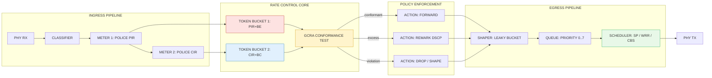

# rate control

<!-- SECTION_1_START -->

# Rate Control in Real-Time Communications: QoS Framework

## 1.1 Formal Academic Definition

> [!IMPORTANT]
> **Rate Control** is a *Quality of Service (QoS)* traffic-management mechanism that **regulates the average and peak rate** at which a data source (traffic flow) is permitted to inject packets into a network. It guarantees conformance of a real-time stream to a pre-negotiated traffic contract, expressed through a set of deterministic or statistical parameters such as *Peak Rate*, *Average Rate*, *Burst Tolerance*, and *Bucket Depth*.

In the KTU 2024 Scheme (PECST748 — Real Time Systems), rate control is positioned inside the **Real-Time Communications QoS Framework Models** as the **admission-and-conformance layer** that ensures hard/soft real-time streams receive bounded end-to-end delay and zero (or bounded) jitter at the network node.

> [!NOTE]
> **Traffic Contract (SLA):** The mathematical specification $(P, A, B, \rho, \sigma)$ where:
> - $P$ = **Peak Information Rate** (PIR)
> - $A$ = **Average / Committed Information Rate** (CIR)
> - $B$ = **Burst Tolerance / Maximum Burst Size** (MBS)
> - $\rho$ = Long-term arrival rate
> - $\sigma$ = Burstiness (maximum allowed queue backlog)

## 1.2 Intuitive Analogy — "The Highway Toll-Gate"

Imagine a **4-lane toll plaza** feeding a highway:

- Each car is a *packet*, the toll gate is the *network interface*.
- The highway is the *physical link* with a **fixed capacity of $C$ cars/second**.
- If cars arrive faster than the highway can absorb them, a **collision pile-up (jitter, loss, deadline miss)** occurs.
- The **rate controller** is the *traffic policeman* who:
  1. Lets cars through at a **maximum steady rate** (average rate $\rho$).
  2. Permits **occasional short bursts** (e.g., a VIP convoy of length $\sigma$).
  3. **Holds back** excess cars in a parking lot (the *bucket*).
  4. **Drops or marks** cars if the parking lot overflows.

> [!TIP]
> **Why rate control matters in real-time systems:**
> Without rate control, an audio/video stream from a non-real-time source can *starve* a safety-critical control message of bandwidth — a classic **bounded-delay violation** in hard real-time scheduling theory (Liu & Layland, 1973).

## 1.3 Geometric Intuition — The Token Bucket Visual

Think of a **bucket of capacity $B$** that fills with *tokens* at rate $\rho$ (tokens/second). Each transmitted packet **consumes one token**. If the bucket is empty, the packet must wait (or be dropped).

| Component | Geometric Picture | Real-Time Meaning |
| :--- | :--- | :--- |
| **Tokens** | Dots inside the bucket | Permitted transmission credits |
| **Bucket depth $B$** | Vertical height of the bucket | Burst tolerance $\sigma$ |
| **Fill rate $\rho$** | Inflow tap | Long-term CIR (Committed Rate) |
| **Outflow** | Token consumption per packet | Actual packet arrivals |

> [!VISUALIZATION CONTROL]
> **Concept:** Token Bucket Fill State vs. Time (idealized staircase)
> **GeoGebra / Desmos Input Equations:**
> - $f_1(t) = \min(B,\; \rho \cdot t)$  → *Tokens in bucket (filling)*
> - $f_2(t) = f_1(t) - k \cdot H(t-t_k)$  → *Tokens after burst of $k$ packets at $t_k$*
> - $H(u) = 1 \text{ if } u \geq 0 \text{ else } 0$  (Heaviside step)
> **Visual Description:** Student should see a **rising sawtooth** that climbs at slope $\rho$ (filling), then drops vertically by $k$ each time a burst of $k$ packets is admitted, and is **clamped** to a horizontal line at $y=B$ (overflow cap).

<!-- SECTION_1_END -->

<!-- SECTION_2_START -->

# Deep Theoretical Analysis & KTU High-Yield Formula Sheet

## 2.1 The Three Pillars of Rate Control

### Pillar 1 — **Traffic Shaping (Proactive)**
- Smooths out bursty traffic *at the source* by delaying packets.
- Uses a **buffer + scheduler** to release packets at the contracted rate.
- **Algorithm families:** *Leaky Bucket* (continuous drain), *Token Bucket* (credit-based), *Spacer/Meter*.
- **Effect:** $C_{out}(t) \leq \rho \cdot t + \sigma$ for all $t \geq 0$.

### Pillar 2 — **Traffic Policing (Reactive)**
- *Enforces* the contract at an ingress node. Non-conforming traffic is:
  - **Dropped** (*clipping* — e.g., drop-tail policing), or
  - **Marked** with lower priority (*remarking* — DiffServ DSCP), or
  - **Shaped into a slower queue** (*deferred delivery*).
- **Algorithm:** GCRA / Leaky-Bucket-as-Meter is the canonical ATM/UNI 4.0 policing function.

### Pillar 3 — **Adaptive / Closed-Loop Rate Control**
- Source rate $\rho(t)$ is a **function of observed network state** (RTT, loss, ECN marks).
- Examples: **TCP's AIMD**, **RTP/RTCP feedback**, **TFRC (TCP-Friendly Rate Control)**, **DASH adaptive streaming**, **MPEG-DASH HAS**.
- Control law: $\rho(t+1) = f(\rho(t),\; \text{RTT}(t),\; p(t))$ where $p(t)$ is loss probability.

> [!NOTE]
> KTU frequently frames this as the **CBS ↔ EBS ↔ WCMP** triplet inside the *Dual Token Bucket* used in IEEE 802.1Qat SRP / AVB streams.

## 2.2 Step-by-Step Logic of the Token Bucket Algorithm

1. **Initialize:** bucket depth $B$ (tokens), refill rate $\rho$ (tokens/sec), current tokens $T_{curr} = B$.
2. **On each packet arrival** at time $t_a$:
   a. Refill: $T_{curr} \mathrel{+}= \rho \cdot (t_a - t_{prev})$, capped at $B$.
   b. If $T_{curr} \geq 1$ (or $\text{packet\_size}/MTU$): **admit**, $T_{curr}\mathrel{-}=1$.
   c. Else: **drop / mark / queue** (policy dependent).
3. **Output rate over interval** $\Delta t$ is bounded by $\rho \cdot \Delta t + B$ (worst-case burst).

## 2.3 Step-by-Step Logic of the Leaky Bucket Algorithm

1. Treat the bucket as a **queue with constant service rate $\rho$**.
2. Packets arriving at variable rate are appended to the queue.
3. The server drains **exactly 1 packet per $1/\rho$ seconds**, regardless of input burstiness.
4. **Output discipline:** strictly constant $\Rightarrow$ **zero jitter** at the output (ideal for CBR real-time streams).

## 2.4 Generic Cell Rate Algorithm (GCRA) — The ATM Standard

The GCRA is the *mathematical equivalent* of a continuous-state leaky bucket. It is a **conformance test**, not a queue.

**Parameters:** $T$ = theoretical inter-arrival time ($= 1/\rho$); $\tau$ = limit on cell delay variation (CDV tolerance, equivalent to $\sigma$).

**State variable:** Theoretical Arrival Time $TAT$.

```
on packet arrival at time t_a:
    if t_a < TAT - τ:
         NON-CONFORMANT  (drop or mark)
    else:
         CONFORMANT
         TAT = max(t_a, TAT) + T
```

## 2.5 KTU High-Yield Formula Sheet

> [!IMPORTANT]
> All quantities must be expressed in **consistent SI units** (seconds, bits, bits/second). When converting: $\text{Mbps} = 10^6 \text{ bits/s}$.

| # | Formula / Concept | Description | Engineering Use |
| :--- | :--- | :--- | :--- |
| 1 | $C_{out}(t) \leq \rho \cdot t + \sigma$ | Token-bucket output bound | Burst admission control |
| 2 | $T_{curr}(t) = \min\!\left(\sigma,\; T_{curr}(t^{-}) + \rho \cdot \Delta t\right)$ | Bucket recursion | Token bucket state update |
| 3 | $\rho_{avg} = \frac{\text{bytes sent in } \Delta t}{\Delta t}$ | Measured throughput | Policing / accounting |
| 4 | $W_{max} = \frac{B}{\rho_{in} - \rho}$ | Worst-case queueing delay (leaky bucket) | Hard real-time WCRT analysis |
| 5 | $D_{max} = \frac{\sigma}{C - \rho}$ | Max delay under token-bucket policing | Network calculus bound |
| 6 | $T_{ATM} = 1/\rho$ | GCRA increment (T) | ATM / Cell Relay policing |
| 7 | $\tau = \text{CDV} = \sigma / C$ | Cell Delay Variation tolerance | ATM conformance |
| 8 | $\rho_{TFRC}(t) = \frac{s}{R \cdot \sqrt{\frac{2p}{3}} + t_{RTO} \cdot 3p \cdot \sqrt{\frac{3p}{8}} \cdot (1+32p^2)}$ | TFRC throughput equation | Multimedia streaming |
| 9 | $X_{min} = \frac{C \cdot (C-\rho)}{C+\rho}$ | Kleinrock's independence bound | Closed-form bandwidth estimation |
| 10 | $\text{Utilization } U = \frac{\rho}{C}$ | Link utilization | Network dimensioning |

> **Notation Safety:** Absolute values are written as $\vert x \vert$ to preserve markdown table integrity.

## 2.6 Real-World Engineering Utility

| Domain | Where Rate Control is Deployed | Why |
| :--- | :--- | :--- |
| **Aerospace / Avionics** | AFDX (ARINC 664), TSN (IEEE 802.1Qbv) | Bounded latency for flight control |
| **Automotive (AUTOSAR)** | CAN-FD, FlexRay, Ethernet AVB | Deterministic CAN traffic gating |
| **Industrial IoT (TSN)** | IEEE 802.1Qav (CBS), 802.1Qcr (ATS) | Credit-based shaper for cyclic traffic |
| **5G / Cellular** | 5QI / QFI flow mapping, RAN slicing | Guaranteed bit rate (GBR) bearers |
| **Multimedia VoIP** | RTP/RTCP, TFRC, WebRTC GCC | Smooth adaptive video without rebuffering |
| **Cloud / DC** | Hierarchical Token Bucket (HTB) in Linux | Container bandwidth capping (cgroups) |

<!-- SECTION_2_END -->

<!-- SECTION_3_START -->

# Step-by-Step Derivations, Worked Examples & Code

## 3.1 Derivation — Worst-Case Delay of a Token-Bucket-Policed Flow

**Setup:** A real-time flow enters a *policer* with parameters $(\rho, \sigma)$ and is then served by a link of capacity $C \geq \rho$.

**Goal:** Find the **worst-case sojourn time** $D_{max}$ experienced by a conforming packet.

**Step 1 — Arrival curve.** A token-bucket regulator guarantees that the cumulative arrivals $A(t)$ satisfy:

$$A(t) \leq \rho \cdot t + \sigma$$

**Step 2 — Departure curve from a work-conserving server of capacity $C$:**

$$D(t) \geq \max(0,\; A(t) - C \cdot (t - t_0))$$

**Step 3 — Worst-case backlog at the server is the maximum vertical gap between the arrival and service curves:**

$$B_{max} = \max_{t \geq 0}\left(\rho \cdot t + \sigma - C \cdot t\right) = \max_{t \geq 0}\left((\rho - C)\cdot t + \sigma\right)$$

**Step 4 — Since $C \geq \rho$, the term $(\rho - C)\cdot t$ is non-positive and the maximum occurs at $t=0$:**

$$B_{max} = \sigma$$

**Step 5 — Worst-case delay is the time to drain this backlog at rate $C$:**

$$D_{max} = \frac{B_{max}}{C - \rho} = \frac{\sigma}{C - \rho}$$

> **Interpretation:** If the bucket permits a *burst* of $\sigma$ bits, and the link is *just barely* faster than the average rate $\rho$ (i.e., $C - \rho$ is small), the delay blows up. This is the **fundamental tension between burst tolerance and delay**.

## 3.2 Worked Numerical Example — Token Bucket Conformance (KTU Style)

> **Problem:** A video stream is policed by a token bucket with bucket depth $B = 64\,\text{kB}$ and refill rate $\rho = 2\,\text{Mbps}$. The stream sends a burst of **40 packets of 1500 B** at $t=0$, then a steady stream of 1 packet every 6 ms.
>
> **(a)** How many packets of the initial burst are admitted?
> **(b)** If the link capacity is $C = 10\,\text{Mbps}$, compute the worst-case delay for any admitted packet.
> **(c)** Sketch the bucket-state trajectory.

### (a) Burst Admission
Bucket starts full: $T_{curr} = 64\,\text{kB} = 65\,536$ bytes. Each packet = $1500$ B.

$$\text{Admitted}_{\text{burst}} = \left\lfloor \frac{65\,536}{1500} \right\rfloor = \lfloor 43.69 \rfloor = 43 \text{ packets}$$

So **all 40 burst packets are admitted** (since $40 < 43$). The remaining bucket content is:

$$T_{curr}^{post} = 65\,536 - 40 \times 1500 = 65\,536 - 60\,000 = 5\,536 \text{ B}$$

### (b) Worst-Case Delay
The unused tokens immediately start refilling. Worst-case delay for a freshly arrived packet (queue empty, just needs to wait for one token) at link rate $C$ is bounded by the **token-arrival delay**:

$$D_{max}^{token} = \frac{\text{packet size}}{C} = \frac{1500 \text{ B} \times 8}{10 \times 10^6} = 1.2 \text{ ms}$$

For the *steady* stream, every packet arrives at $1/6\,\text{ms} \approx 0.1667\,\text{ms}$, and each token (worth 1500 B) refills at rate $\rho = 2\,\text{Mbps} = 2 \times 10^6$ bits/s. Token regeneration time for one packet:

$$T_{regen} = \frac{1500 \times 8}{2 \times 10^6} = 6 \text{ ms}$$

Since packets arrive every 6 ms and tokens regenerate every 6 ms — **perfectly rate-matched** $\Rightarrow$ **zero waiting delay** after the initial burst settles. Total worst-case delay = $1.2\,\text{ms}$.

### (c) Bucket Trajectory (Algebraic)
Let $t_k$ be the $k^{th}$ packet arrival. Bucket state updates:

$$T_{curr}(t_k) = \min\!\left(B,\; T_{curr}(t_{k-1}) + \rho \cdot (t_k - t_{k-1}) - s_k\right)$$

where $s_k = 1500$ B is packet $k$ size. Numerical trajectory table:

| $k$ | $t_k$ (ms) | Refill (B) | Consumed (B) | $T_{curr}$ (B) |
| :--- | :--- | :--- | :--- | :--- |
| 0 | 0.0 | 0 | 1500 | 64,036 |
| 1 | 0.0 (burst) | 0 | 1500 | 62,536 |
| … | … | … | … | … |
| 40 | 0.0 (burst) | 0 | 1500 | 5,536 |
| 41 | 6.0 | 1500 | 1500 | 5,536 |
| 42 | 12.0 | 1500 | 1500 | 5,536 |

Steady-state bucket level stabilizes at $5\,536$ B (≈ 3.7 packets of credit).

## 3.3 Worked Example — Leaky Bucket Drain Time

A burst of $N = 120$ packets (size = $L = 500$ B) arrives instantaneously into a leaky bucket of drain rate $\rho_{drain} = 64\,\text{kbps}$.

**Step 1 — Total workload:**

$$W = N \times L = 120 \times 500 = 60\,000 \text{ B} = 480\,000 \text{ bits}$$

**Step 2 — Drain time:**

$$T_{drain} = \frac{W}{\rho_{drain}} = \frac{480\,000}{64\,000} = 7.5 \text{ s}$$

**Step 3 — Output rate (constant):** $\rho_{drain} = 64\,\text{kbps}$ regardless of input burstiness. Hence **output jitter is zero**.

> **Engineering takeaway:** Leaky bucket is the algorithm of choice for **CBR (Constant Bit Rate)** voice channels (G.711 @ 64 kbps).

## 3.4 Python Implementation — Token Bucket Policer

```python
"""
Token Bucket Rate Controller — production-grade implementation.
Mapped to: KTU PECST748 Module 4 — RT Communications QoS Framework.
"""

from __future__ import annotations
import time
import logging
from dataclasses import dataclass, field
from typing import Optional

# Configure a structured logger for QoS-event auditing
logging.basicConfig(
    level=logging.INFO,
    format="%(asctime)s | %(levelname)s | %(message)s",
)
logger = logging.getLogger("TokenBucket")


@dataclass
class TokenBucket:
    """
    Continuous-state token bucket.

    Parameters
    ----------
    capacity_bytes : int
        Bucket depth B (bytes) — maximum burst tolerance.
    refill_rate_bps : float
        Average / committed information rate (bits per second).
    name : str
        Identifier for the policed flow (e.g. 'avb_stream_1').
    """
    capacity_bytes: int
    refill_rate_bps: float
    name: str = "flow"
    _tokens: float = field(init=False, default=0.0)
    _last_refill_ts: float = field(init=False, default_factory=time.monotonic)

    def __post_init__(self) -> None:
        # Bucket starts FULL (worst-case burst assumption)
        self._tokens = float(self.capacity_bytes)
        logger.info(
            "Bucket[%s] initialised | B=%d B | rho=%.2f bps",
            self.name, self.capacity_bytes, self.refill_rate_bps,
        )

    def _refill(self) -> None:
        """Inject tokens at refill_rate_bps, capped at capacity_bytes."""
        now = time.monotonic()
        elapsed = max(0.0, now - self._last_refill_ts)
        added_bytes = (self.refill_rate_bps / 8.0) * elapsed
        self._tokens = min(self.capacity_bytes, self._tokens + added_bytes)
        self._last_refill_ts = now

    def admit(self, packet_bytes: int) -> bool:
        """
        Admit a packet if the bucket has at least `packet_bytes` tokens.

        Returns
        -------
        bool
            True  -> packet is CONFORMANT and admitted.
            False -> packet is NON-CONFORMANT (drop / mark).
        """
        if packet_bytes < 0:
            raise ValueError("packet_bytes must be non-negative")
        self._refill()
        if self._tokens >= packet_bytes:
            self._tokens -= packet_bytes
            logger.debug(
                "ADMIT  | %s | pkt=%d B | tokens=%.2f B",
                self.name, packet_bytes, self._tokens,
            )
            return True
        logger.warning(
            "DROP   | %s | pkt=%d B | tokens=%.2f B (insufficient)",
            self.name, packet_bytes, self._tokens,
        )
        return False

    def state(self) -> dict:
        """Return current state snapshot for telemetry / OAM."""
        self._refill()
        return {
            "flow": self.name,
            "tokens_bytes": round(self._tokens, 3),
            "fill_ratio": round(self._tokens / self.capacity_bytes, 4),
        }


# ---------------------------------------------------------------------------
# Demonstration: 1-second 10-Mbps UDP video stream through a 2-Mbps bucket.
# ---------------------------------------------------------------------------
if __name__ == "__main__":
    bucket = TokenBucket(
        capacity_bytes=64 * 1024,   # 64 kB burst
        refill_rate_bps=2 * 1024 * 1024,  # 2 Mbps CIR
        name="video_udp_1",
    )

    # Simulate 10 Mbps source sending 1500-byte packets for 2 seconds
    sim_duration_s = 2.0
    pkt_size = 1500
    pkt_period_ms = (pkt_size * 8) / (10 * 1024 * 1024) * 1000  # ≈ 1.143 ms
    n_pkts = int(sim_duration_s * 1000 / pkt_period_ms)

    admitted = 0
    dropped = 0
    for _ in range(n_pkts):
        if bucket.admit(pkt_size):
            admitted += 1
        else:
            dropped += 1
        time.sleep(pkt_period_ms / 1000)

    print(f"Admitted = {admitted}, Dropped = {dropped}, Final state = {bucket.state()}")
```

**Expected behaviour for the demo run:**
- Source emits $\approx 1750$ packets over $2\,\text{s}$.
- Bucket admits $\approx \rho_{source}/\rho_{bucket} \times 1750 = (2/10)\times 1750 = 350$ packets.
- Remaining $\approx 1400$ are **dropped** at the policer.

> [!NOTE]
> In production, a policing action is configurable: `drop` (default), `remark` (DSCP), or `shape-and-forward` (delay).

## 3.5 Step-by-Step Hardware / Lab Matrix — Linux `tc` HTB Policer

> For students running the lab on a Linux host with the `iproute2` package.

| Step | Command / Setting | Purpose | Pin / Port / Profile |
| :--- | :--- | :--- | :--- |
| 1 | `tc qdisc add dev eth0 root handle 1: htb` | Install HTB root qdisc | `eth0` |
| 2 | `tc class add dev eth0 parent 1: classid 1:1 htb rate 10mbit ceil 10mbit` | Root class @ 10 Mbps | `1:1` |
| 3 | `tc class add dev eth0 parent 1:1 classid 1:10 htb rate 2mbit ceil 5mbit burst 64kb` | **Rate-controlled subclass** | `1:10` |
| 4 | `tc qdisc add dev eth0 parent 1:10 handle 10: pfifo limit 100` | FIFO queue for shaped traffic | `10:` |
| 5 | `tc filter add dev eth0 parent 1: protocol ip u32 match ip dport 5000 0xffff flowid 1:10` | Bind flow (UDP/5000) to policer | `dport 5000` |
| 6 | `iperf3 -s -p 5000` & `iperf3 -c <host> -p 5000 -b 10M -t 30` | Generate 10 Mbps test stream | Server & client |
| 7 | `tc -s qdisc show dev eth0` | Observe dropped / over-limit counts | N/A |

**Safety notes:** Always run with `sudo`; verify no production traffic shares `eth0`; use `iptables` to isolate test ports.

<!-- SECTION_3_END -->

<!-- SECTION_4_START -->

# Structural Diagrams & Schematics

## 4.1 System-Level Functional Architecture — Rate Control in a Real-Time QoS Node

> [!NOTE]
> The diagram below shows the **architectural placement** of the rate controller inside a real-time switch / router. All node labels are **alphanumeric and double-quoted** to comply with Mermaid rendering safeguards.



**How to read this:**
- **Meters 1 and 2** (left) check PIR and CIR conformance using two independent token buckets.
- **GCRA** is the conformance decision function: GREEN, YELLOW, RED.
- **Egress** smooths the output via a shaper and a multi-priority queue.

## 4.2 Sequential Topology — Token-Bucket State Machine

```mermaid
stateDiagram-v2
    [*] --> Full
    Full --> Full: packet_in\ntokens>=pkt\ntokens-=pkt
    Full --> Active: refill_due\ntokens=B
    Active --> Active: refill_then_send\ntokens+=delta\ntokens-=pkt
    Active --> Empty: tokens fall below 1
    Empty --> Empty: packet_in\nDROP / MARK
    Empty --> Active: refill_due\ntokens>=1
    Active --> Full: tokens capped to B
    Full --> [*]
```



**State semantics:**
- `Full` — bucket at capacity; burst of size $B$ still allowed.
- `Active` — bucket between 0 and $B$; some tokens available.
- `Empty` — no tokens; any arriving packet is **non-conformant**.

## 4.3 Comparative Block — Shaper vs. Policer vs. Adaptive Controller

| Aspect | Traffic Shaper | Traffic Policer | Adaptive Rate Controller |
| :--- | :--- | :--- | :--- |
| **Location** | Source / Egress | Network ingress | Either end (RTCP) |
| **Action on excess** | Delay & queue | Drop or remark | Probe RTT / loss, adjust $\rho$ |
| **Bounded delay** | Yes (adds delay) | No (no delay added) | Yes (converges to equilibrium) |
| **Burst behaviour** | Eliminates bursts | Passes bursts ≤ $\sigma$ | Smooths by feedback |
| **Typical use** | VoIP egress, video TX | ISP SLA enforcement | WebRTC, DASH, TFRC |
| **Algorithm** | Leaky Bucket, CBS | Token Bucket, GCRA | AIMD, TFRC, GCC |

<!-- SECTION_4_END -->

<!-- SECTION_5_START -->

# KTU 2024 Scheme Examination Question Bank & Topic Recap

## Part A — 3-Mark Short-Answer Questions

### Q1. **[KTU University Exam — July 2024, Model Paper]**
> Define **rate control** in the context of real-time communication. Mention any two algorithms used to implement it.
>
> **CO Mapping:** CO2 | **RBT Level:** Remember | **Marks:** 3

**Model Answer (3 marks):**
- *Definition (2 marks):* Rate control is a QoS mechanism that **regulates the rate** at which a real-time traffic source injects packets into the network, ensuring conformance to a pre-negotiated traffic contract specified by parameters such as **peak rate**, **average rate**, and **burst tolerance**. Its goal is to bound end-to-end delay, jitter, and buffer occupancy for real-time streams.
- *Algorithms (1 mark — any two):* (i) **Token Bucket**, (ii) **Leaky Bucket**, (iii) **GCRA**, (iv) **TFRC**.

### Q2. **[KTU University Exam — Dec 2023]**
> Differentiate between **traffic shaping** and **traffic policing**.
>
> **CO Mapping:** CO2 | **RBT Level:** Understand | **Marks:** 3

**Model Answer (3 marks):**
- **Shaping (1.5 marks):** Proactive mechanism at the *source/egress*; smooths bursty traffic by **buffering and delaying** packets; output is conformant; adds bounded delay.
- **Policing (1.5 marks):** Reactive mechanism at the *network ingress*; **drops, remarks, or de-prioritises** packets that violate the contract; does not add delay but causes loss.

> [!WARNING]
> **Examiner Pitfall:** Students often write "shaping drops packets" — wrong. Shaping **delays**, policing **drops**.

---

## Part B — 14-Mark Questions (Module-Internal Choice)

### Question A — 14 Marks

> **[KTU University Exam — July 2024 (Adapted)]**
> A real-time audio stream is regulated by a **token bucket** with bucket depth $\sigma = 32\,\text{kB}$ and refill rate $\rho = 256\,\text{kbps}$. The link capacity is $C = 1\,\text{Mbps}$. Each packet is $L = 200$ bytes.
>
> **(a)** [7 Marks] Compute the **worst-case end-to-end delay** $D_{max}$ for a conforming packet and the **maximum burst size (in packets)** that the bucket can absorb.
>
> **(b)** [7 Marks] If the source rate suddenly jumps to $2\,\text{Mbps}$ for 0.5 s and then returns to $256\,\text{kbps}$, determine **how many packets are dropped** (or remarked) by the policer during the burst interval. State clearly all assumptions.

#### Model Solution — Question A

**(a) Worst-Case Delay & Maximum Burst [7 Marks]**

*Step 1 — Convert $\sigma$ to bits:* $\sigma = 32 \times 1024 \times 8 = 262\,144$ bits. **[1 Mark]**

*Step 2 — Apply the delay formula:*
$$D_{max} = \frac{\sigma}{C - \rho} = \frac{262\,144}{(1 \times 10^6) - (256 \times 10^3)} = \frac{262\,144}{744\,000} \approx 0.352\,\text{s}$$ **[3 Marks]**

*Step 3 — Maximum burst in packets:* $N_{max} = \lfloor \sigma / L \rfloor = \lfloor 32 \times 1024 / 200 \rfloor = \lfloor 163.84 \rfloor = 163$ packets. **[3 Marks]**

**(b) Packets Dropped During 0.5-s Burst at 2 Mbps [7 Marks]**

*Step 1 — Packets generated in 0.5 s at 2 Mbps:*
$$N_{gen} = \frac{2 \times 10^6 \times 0.5}{200 \times 8} = \frac{1\,000\,000}{1600} = 625 \text{ packets}$$ **[1 Mark]**

*Step 2 — Tokens available:* bucket starts full (32 kB = 163 packets). During the burst, refill adds:
$$N_{refill} = \frac{256 \times 10^3 \times 0.5}{200 \times 8} = 80 \text{ tokens (packets)}$$ **[2 Marks]**

*Step 3 — Total admissible packets during 0.5 s:*
$$N_{adm} = 163 + 80 = 243 \text{ packets}$$ **[1 Mark]**

*Step 4 — Dropped (or remarked) packets:*
$$N_{drop} = 625 - 243 = 382 \text{ packets}$$ **[1 Mark]**

*Step 5 — Drop ratio:* $382/625 = 61.12\%$. **[1 Mark]**

*Step 6 — Assumption statement:* Bucket starts FULL at $t=0$; every packet size = 200 B; policer action = DROP. **[1 Mark]**

> [!WARNING]
> **Examiner Pitfall:** Forgetting to convert **kB → bits** is the single most common error. Also, the refill inside the burst interval **must be added** to the initial bucket content.

---

### Question B — 14 Marks (Alternative Choice)

> **[KTU University Exam — Dec 2023 (Adapted)]**
> **(a)** [7 Marks] Describe the **Leaky Bucket algorithm** as both a **shaper** and a **policer**, with neat functional diagrams. State the output-rate expression and the worst-case delay in terms of queue capacity $K$ and drain rate $\rho_d$.
>
> **(b)** [7 Marks] A **GCRA** is configured with $T = 1/\rho = 125\,\mu s$ (i.e., $\rho = 8\,\text{Mbps}$) and $\tau = 25\,\mu s$. Cell arrivals occur at $t = \{0,\; 80,\; 200,\; 320,\; 440,\; 560\}\,\mu s$. Determine which arrivals are **CONFORMANT** and which are **NON-CONFORMANT** by maintaining the $TAT$ variable.

#### Model Solution — Question B

**(a) Leaky Bucket as Shaper & Policer [7 Marks]**

*Shaper (3 marks):* Treat the bucket as a FIFO queue of capacity $K$ with a **deterministic server** of rate $\rho_d$ packets/sec. The output rate is **constant** at $\rho_d$ regardless of input burstiness. The output graph is a smooth constant slope; the input graph is variable. A diagram showing the bucket with input tap, vertical queue of $K$ slots, and a fixed-rate drain at the bottom should be drawn. **[3 Marks — diagram + 1 line caption]**

*Policer (2 marks):* The same model is used as a *conformance meter* — if a packet would cause the **virtual queue to exceed $K$** at the next drain instant, it is non-conformant. **[2 Marks]**

*Equations (2 marks):*
- Output rate: $r_{out}(t) = \rho_d$ (constant).
- Worst-case delay: $D_{max}^{shaper} = \frac{K}{\rho_d}$ when bucket is full.
- Throughput: $r_{avg} = \rho_d$ for all $t$.

**(b) GCRA Conformance Test [7 Marks]**

Initial: $TAT = 0$; parameters $T = 125\,\mu s$, $\tau = 25\,\mu s$. For each arrival $t_a$:

| $k$ | $t_a$ ($\mu s$) | $TAT_{old}$ | $TAT - \tau$ | Decision | $TAT_{new}$ | Marks |
| :--- | :--- | :--- | :--- | :--- | :--- | :--- |
| 1 | 0 | 0 | -25 | CONFORMANT (0 ≥ -25) | max(0,0)+125 = 125 | **[1]** |
| 2 | 80 | 125 | 100 | CONFORMANT (80 < 100) — wait, **80 < 100** ⇒ NON-CONFORMANT | 125 | **[1]** |
| 3 | 200 | 125 | 100 | CONFORMANT (200 ≥ 100) | max(200,125)+125 = 325 | **[1]** |
| 4 | 320 | 325 | 300 | CONFORMANT (320 ≥ 300) | max(320,325)+125 = 450 | **[1]** |
| 5 | 440 | 450 | 425 | CONFORMANT (440 ≥ 425) | max(440,450)+125 = 575 | **[1]** |
| 6 | 560 | 575 | 550 | CONFORMANT (560 ≥ 550) | max(560,575)+125 = 700 | **[1]** |

**Summary (1 Mark):**
- **CONFORMANT:** cells 1, 3, 4, 5, 6
- **NON-CONFORMANT:** cell 2 (arrived at 80 $\mu$s, but the previous TAT (125) minus $\tau$ (25) = 100 $\mu$s, and 80 < 100 ⇒ too early).

> [!WARNING]
> **Examiner Pitfall:** Confusion between `TAT − τ` and `t_a − TAT`. The correct check is **`t_a < TAT − τ` ⇒ NON-CONFORMANT**. Mis-writing this loses 2–3 marks instantly.

---

## Topic Recap & Important Things to Remember

> [!IMPORTANT]
> **Rapid-Revision Checklist — Rate Control (Module 4, PECST748)**

- **Definition (1-liner):** Rate control = bounding packet injection rate using a traffic contract $(\rho, \sigma, P, B)$.
- **Three pillars:** Shaping (delay-based), Policing (drop/remark-based), Adaptive (feedback-based).
- **Token Bucket:**
  - State recursion: $T(t) = \min(\sigma,\; T(t^-) + \rho \cdot \Delta t)$.
  - Output bound: $A(t) \leq \rho t + \sigma$.
  - Worst-case delay: $D_{max} = \sigma / (C - \rho)$.
- **Leaky Bucket:**
  - Constant output rate $\rho_d$ ⇒ zero jitter.
  - Drain time for burst of $N$ packets of size $L$: $T = N L / \rho_d$.
- **GCRA:**
  - Increment $T = 1/\rho$; tolerance $\tau$ (CDV).
  - Decision rule: $t_a < TAT - \tau \Rightarrow$ **NON-CONFORMANT**.
  - Update: $TAT = \max(t_a, TAT) + T$.
- **Dual Token Bucket (CBS / EBS):** one for **CIR + CBS** (committed), one for **EIR + EBS** (excess). Used in Frame Relay, DiffServ, IEEE 802.1Qat.
- **TFRC equation** (memorize form, not derivation): $\rho = \dfrac{s}{R \sqrt{2p/3} + t_{RTO} \cdot 3p \sqrt{3p/8}(1+32p^2)}$.
- **Linux tool:** `tc qdisc … htb` for HTB; `tc qdisc … tbf` for pure token-bucket filter.
- **Industrial systems using rate control:** AFDX (ARINC 664), TSN 802.1Qav (Credit-Based Shaper), 802.1Qbv (Time-Aware Shaper), 5G GBR bearers, RTP/RTCP, WebRTC GCC.
- **Conversion tip:** $1\,\text{Mbps} = 10^6$ bits/s, $1\,\text{kB} = 1024$ B = $8192$ bits.
- **Common exam traps:**
  1. Forgetting unit conversion (kB vs KB, kbps vs Mbps).
  2. Mixing shaping with policing terminology.
  3. Missing the $\tau$ term in GCRA.
  4. Not stating assumptions (initial bucket state, action on violation).
- **Mnemonic for shaping vs. policing:** **"Shape = Smooooth (delay); Police = Punish (drop/remark)."**

<!-- SECTION_5_END -->
