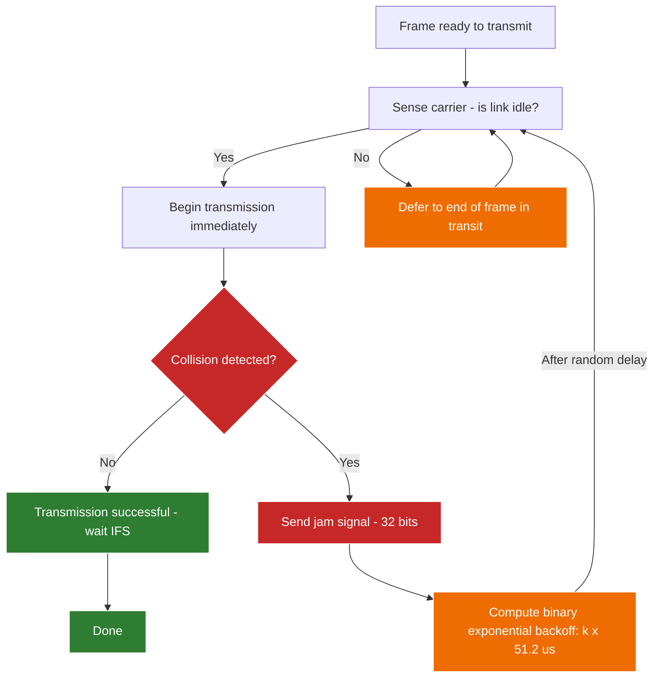
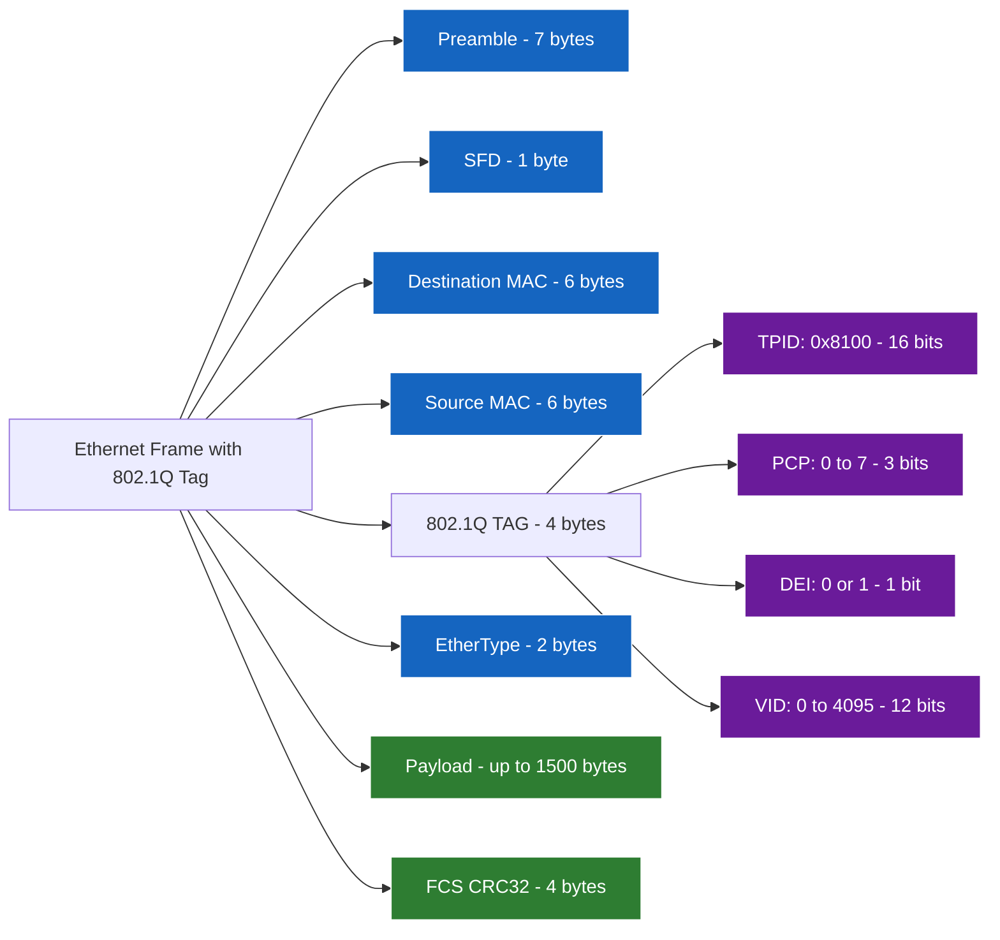
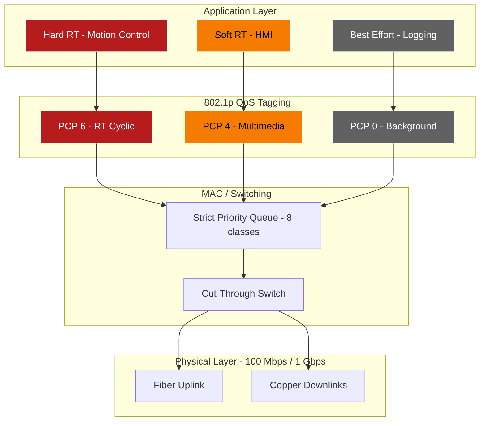

# Real-Time Communication in a LAN

<!-- SECTION_1_START -->
# Real-Time Communication in a LAN — Core Definition & Intuitive Overview

## 1.1 Formal Academic Definition (KTU 2024 Syllabus)

**Real-Time Communication in a Local Area Network (LAN)** refers to the deterministic exchange of time-critical data frames between computing nodes within a bounded geographical domain (typically $\leq 5\,\text{km}$), where each message must satisfy a hard or soft timing constraint — formally known as a **deadline** ($D_i$) — that is enforced by the underlying Medium Access Control (MAC) protocol.

In KTU 2024 Scheme (PECST748 — Real Time Systems) terminology, a real-time LAN must guarantee the **Worst-Case End-to-End Delay** ($WCD_i$) for every message $i$ such that:

$$WCD_i \leq D_i - J_i$$

where $J_i$ is the **release jitter** of message $i$ at the source node.

> [!IMPORTANT]
> **KTU 2024 Highlight (Module 4 — RT Communications QoS Framework):** A LAN protocol qualifies as *real-time capable* ONLY if it is **bounded and predictable** — not merely *fast*. Speed without determinism violates the QoS contract.

## 1.2 Conceptual Analogy — The "Roundabout vs. Traffic Signal" Model

Imagine a corporate campus where employees (data frames) must travel between buildings (nodes):

- **Non-Real-Time LAN (Standard Ethernet — CSMA/CD):** A **roundabout**. Cars enter when there's a gap. Sometimes two cars collide and must back off randomly — leading to *unbounded waiting times*. Fast on average, but catastrophic in worst case.
- **Real-Time LAN (Token Ring / Token Bus):** A **traffic signal with a green wave**. A circulating *token* acts as a green light passed strictly from one car to the next. Each car gets a **bounded, fixed-time slot** to cross. Predictable, but slightly slower on average.
- **Real-Time LAN (Switched Full-Duplex Ethernet with 802.1p/Q):** A **dedicated express lane per destination**. Each building has its own private overpass — no collisions, with priority tags deciding who jumps the queue.

> [!NOTE]
> **The Core Trade-off in Real-Time LANs:**
> *Determinism* $\longleftrightarrow$ *Throughput*. Bounded delay mechanisms (tokens, time slots) trade raw bandwidth for predictability.

## 1.3 Physical Constants & Standard Metrics

| Metric | Standard Value (KTU Reference) |
|---|---|
| Standard LAN propagation delay per meter | $\approx 5\,\text{ns/m}$ |
| Maximum LAN segment length (10BASE5) | $500\,\text{m}$ |
| Standard Ethernet speeds | $10/100/1000/10000\,\text{Mbps}$ |
| Maximum 802.1p priority levels | $8$ (levels $0$ to $7$) |
| VLAN ID space (802.1Q) | $4094$ usable IDs |
| Token Ring standard | **IEEE 802.5** |
| Token Bus standard | **IEEE 802.4** |
| Classic Ethernet | **IEEE 802.3** |

> [!VISUALIZATION CONTROL]
> **Concept:** Token circulation on a logical ring
> **GeoGebra / Desmos Input Equations (parametric circle):**
> * $x(t) = R\cos(2\pi t / T_{\text{cycle}})$
> * $y(t) = R\sin(2\pi t / T_{\text{cycle}})$
> * Plot $R = 5$, $T_{\text{cycle}} = 10\,\text{ms}$ with $N = 6$ station markers.
> **Visual Description:** A blue point (the *token*) orbits a circle of $N$ nodes clockwise. Each time it reaches a node, that node's color briefly turns green (transmitting) before returning to grey.

<!-- SECTION_1_END -->

<!-- SECTION_2_START -->
# Deep Theoretical Analysis & KTU High-Yield Formula Sheet

## 2.1 The Three Pillars of Real-Time LAN Communication

### Pillar 1 — Bounded Access Delay (MAC Determinism)
The MAC sublayer must guarantee that *no* frame waits indefinitely for the medium. Protocols achieve this through:
- **Token passing** (controlled access)
- **Time Division Multiple Access (TDMA)**
- **Priority queuing with bounded queues**

### Pillar 2 — Bounded Transmission Time
Once a frame has captured the medium, it must finish before its deadline. The transmission time is purely a function of frame length and physical bit rate:

$$T_{\text{frame}} = \frac{L_{\text{payload}} + L_{\text{header}} + L_{\text{trailer}}}{R_{\text{link}}} + T_{\text{prop}} \times 2$$

> [!NOTE]
> The factor of $2$ in $T_{\text{prop}}$ accounts for **round-trip propagation** required for collision detection in half-duplex CSMA/CD.

### Pillar 3 — Bounded Queuing Delay
At each switch/bridge along the path, frames must not queue beyond a deterministic maximum — enforced by **priority classes** and **traffic shaping** (e.g., leaky bucket).

## 2.2 The MAC Protocol Family — A Structural Breakdown

| Protocol Class | Standard | Access Method | Determinism | Typical Use |
|---|---|---|---|---|
| Classic Ethernet | IEEE 802.3 | CSMA/CD | **Non-deterministic** (statistical) | Office LANs |
| Token Bus | IEEE 802.4 | Token on logical bus | **Deterministic** | Factory automation (MAP) |
| Token Ring | IEEE 802.5 | Token on physical ring | **Deterministic** | Mission-critical IBM networks |
| Switched Full-Duplex | IEEE 802.3x | Point-to-point, no contention | **Bounded by switch architecture** | Modern real-time LANs |
| Priority Tagged | IEEE 802.1p | Tag-based priority | **Bounded per priority class** | QoS-enabled LANs |
| VLAN Tagged | IEEE 802.1Q | VLAN + priority tagging | **Bounded per VLAN/priority** | Industrial / automotive |

## 2.3 The IEEE 802.1Q Frame Format — Real-Time Tagging Anatomy

The standard Ethernet frame is augmented with a **4-byte VLAN/priority tag** inserted between the source MAC address and the EtherType/Length field:

| Field | Size (bits) | Purpose |
|---|---|---|
| TPID (Tag Protocol Identifier) | $16$ | Always $0x8100$ — marks the frame as 802.1Q |
| PCP (Priority Code Point) | $3$ | Maps to IEEE 802.1p — values $0$ (best effort) to $7$ (highest) |
| DEI (Drop Eligibility Indicator) | $1$ | Frames eligible to be dropped under congestion |
| VID (VLAN Identifier) | $12$ | Identifies the virtual LAN membership |

> [!IMPORTANT]
> **KTU Hot Point:** The **PCP field of 3 bits** is the heart of real-time QoS in modern LANs. It supports $2^3 = 8$ distinct traffic classes, allowing a network designer to isolate hard real-time traffic (e.g., classes $5$–$7$) from best-effort traffic (class $0$).

## 2.4 KTU High-Yield Formula Sheet (Cheat Sheet)

> [!NOTE]
> **Convention:** The vertical bar $\vert$ is rendered as `\vert` below to preserve markdown table integrity. All times are in **seconds (s)** unless otherwise noted. Bit rates are in **bits per second (bps)**.

| # | Formula | Description |
|---|---|---|
| 1 | $T_{\text{frame}} = \dfrac{L}{R}$ | Frame transmission time ($L$ = total frame bits, $R$ = link bit rate) |
| 2 | $T_{\text{prop}} = \dfrac{d}{v_p}$ | One-way propagation delay ($d$ = cable length, $v_p \approx 2 \times 10^8\,\text{m/s}$) |
| 3 | $T_{\text{slot}} = 2 \times T_{\text{prop}} + T_{\text{frame,max}}$ | Slot time for CSMA/CD (IEEE 802.3 collision window) |
| 4 | $T_{\text{cycle}} = \sum_{i=1}^{N} \text{THT}_i$ | Token cycle time (sum of Token Holding Times over $N$ stations) |
| 5 | $\text{THT}_i \leq \text{TTRT} - T_{\text{prop,total}}$ | Token Holding Time bound (TTRT = Target Token Rotation Time) |
| 6 | $WCD_{\text{token}} = T_{\text{cycle}} + T_{\text{frame}} + T_{\text{prop}}$ | Worst-case delay for a token-passing frame |
| 7 | $U = \dfrac{\sum L_{\text{useful}}}{R \times T_{\text{cycle}}}$ | Protocol utilization (fraction of useful bits per cycle) |
| 8 | $\text{PCP}_{\text{class}} \in \{0,1,2,3,4,5,6,7\}$ | 802.1p priority class mapping |
| 9 | $\rho = \dfrac{\lambda \times \bar{L}}{R}$ | Offered load ($\lambda$ = arrival rate, $\bar{L}$ = mean frame length) |
| 10 | $W_{\text{prio}}(k) = \dfrac{\sum_{j \leq k} \rho_j}{(1 - \sum_{j < k} \rho_j)(1 - \sum_{j \leq k} \rho_j)} \times \bar{L}_k / R$ | Mean waiting time for priority class $k$ (M/G/1 head-of-line model) |

## 2.5 Real-World Engineering Utility

- **Industrial Automation (PROFINET, EtherCAT):** Uses modified 802.1Q with reserved PCP class $6$ (or higher) for cyclic I/O traffic at sub-millisecond rates.
- **Automotive In-Vehicle Networks:** IEEE 802.1Q + AVB (Audio Video Bridging) powers infotainment with bounded $2\,\text{ms}$ latency.
- **Aerospace / Avionics:** ARINC 664 (AFDX) extends switched Ethernet with *BAG* (Bandwidth Allocation Gap) policing — a deterministic real-time LAN over Ethernet.
- **Medical Imaging (DICOM over LAN):** Soft real-time requirements met via 802.1p priority tagging.

<!-- SECTION_2_END -->

<!-- SECTION_3_START -->
# Step-by-Step Derivations & Implementation

## 3.1 Derivation 1 — Worst-Case Delay in a Token Ring (IEEE 802.5)

**Problem Setup:** A Token Ring LAN has $N = 6$ stations. Each station generates at most one high-priority message per token visit. The Target Token Rotation Time (TTRT) is negotiated to $T_{\text{TTRT}} = 50\,\text{ms}$. Total ring propagation delay (sum of all link delays + station latencies) is $T_{\text{prop,total}} = 1.2\,\text{ms}$. Average frame length is $L = 12144\,\text{bits}$ (maximum Ethernet frame). Link rate $R = 16\,\text{Mbps}$ (classic Token Ring rate).

**Goal:** Compute the worst-case end-to-end delay $WCD$ for a frame generated at station $S_1$ destined to $S_4$.

**Step 1 — Maximum Token Holding Time per station**

The IEEE 802.5 standard defines:

$$\text{THT}_{\max} = T_{\text{TTRT}} - T_{\text{prop,total}}$$

Substituting:

$$\text{THT}_{\max} = 50\,\text{ms} - 1.2\,\text{ms} = 48.8\,\text{ms}$$

> **Logic Note:** $\text{THT}_{\max}$ is the maximum time a station may hold the token. Subtracting propagation accounts for the time the token is *in transit* rather than *being held*.

**Step 2 — Maximum Frame Transmission Time**

$$T_{\text{frame}} = \frac{L}{R} = \frac{12144}{16 \times 10^6} = 0.000759\,\text{s} = 0.759\,\text{ms}$$

> **Logic Note:** This is the physical time to push all $12144$ bits onto the medium at $16\,\text{Mbps}$.

**Step 3 — Worst-Case Token Wait for $S_1$**

In the *worst case*, $S_1$ releases the token to $S_2$ (which immediately has a high-priority message ready), and so on, with all $N - 1$ upstream stations consuming their full $\text{THT}_{\max}$ before the token returns:

$$T_{\text{wait}} = (N - 1) \times \text{THT}_{\max} + T_{\text{prop,total}}$$

Substituting:

$$T_{\text{wait}} = 5 \times 48.8 + 1.2 = 244.0 + 1.2 = 245.2\,\text{ms}$$

**Step 4 — Frame Transmission + Propagation to Destination**

After $S_1$ captures the token, it transmits for $T_{\text{frame}}$ and the bits propagate across $3$ of the $6$ inter-station links (to reach $S_4$):

$$T_{\text{tx,prop}} = T_{\text{frame}} + 3 \times T_{\text{link,prop}} \approx T_{\text{frame}} + \frac{T_{\text{prop,total}}}{N} = 0.759 + 0.200 = 0.959\,\text{ms}$$

**Step 5 — Total Worst-Case Delay**

$$WCD = T_{\text{wait}} + T_{\text{tx,prop}}$$

$$WCD = 245.2 + 0.959 = 246.159\,\text{ms}$$

**Conclusion:** Any message deadline $D_i$ must be set $\geq 246.2\,\text{ms}$ to be schedulable on this ring.

---

## 3.2 Derivation 2 — CSMA/CD Slot Time & Minimum Frame Size

**Problem:** Compute the minimum frame size for a $10\,\text{Mbps}$ Ethernet with a maximum segment length of $d = 2500\,\text{m}$ (10BASE5 thick coax, with repeaters giving a worst-case round-trip of $d_{\max} = 5000\,\text{m}$).

**Step 1 — One-way propagation delay**

$$T_{\text{prop}} = \frac{d}{v_p} = \frac{5000}{2 \times 10^8} = 25\,\mu\text{s}$$

**Step 2 — Round-trip propagation delay**

$$T_{\text{RTT}} = 2 \times T_{\text{prop}} = 50\,\mu\text{s}$$

**Step 3 — IEEE 802.3 Slot Time**

The slot time is defined as:

$$T_{\text{slot}} = T_{\text{RTT}} + T_{\text{jitter}} \approx 51.2\,\mu\text{s}$$

> **Logic Note:** $51.2\,\mu\text{s}$ corresponds to a 512-bit transmission at $10\,\text{Mbps}$. This is the standardized 802.3 slot time.

**Step 4 — Minimum Frame Size**

$$L_{\min} = R \times T_{\text{slot}} = 10 \times 10^6 \times 51.2 \times 10^{-6} = 512\,\text{bits} = 64\,\text{bytes}$$

> **KTU Validation:** This matches the IEEE 802.3 standard exactly — frames shorter than $64$ bytes are considered *collision fragments* and discarded by the MAC.

---

## 3.3 Implementation — Python Simulation of an 802.1p Priority Scheduler

```python
"""
real_time_lan_scheduler.py
Simulates an 802.1p-class strict-priority scheduler for a real-time LAN switch.
Validates: (a) no hard-real-time class frame ever misses its deadline, 
            (b) reports per-class mean waiting time vs. M/G/1 priority formula.
"""
from __future__ import annotations
import logging
import heapq
from collections import deque
from dataclasses import dataclass, field
from typing import Dict, List

# ---- Logging Configuration ---------------------------------------------------
logging.basicConfig(
    level=logging.INFO,
    format="%(asctime)s [%(levelname)s] %(message)s",
    datefmt="%H:%M:%S",
)
log = logging.getLogger("RT-LAN-Scheduler")


# ---- Frame and Queue Definitions --------------------------------------------
@dataclass(order=True)
class Frame:
    arrival_time: float                       # Time of arrival (seconds)
    deadline: float                           # Absolute deadline (seconds)
    priority: int = field(compare=False)       # 802.1p PCP value [0..7]
    length_bits: int = field(default=1500 * 8, compare=False)  # Ethernet MTU
    frame_id: int = field(default=0, compare=False)


class PriorityQueue:
    """Strict-priority queue with 8 classes (802.1p PCP 0..7)."""

    NUM_CLASSES: int = 8
    HARD_RT_THRESHOLD: int = 5  # PCP >= 5 are treated as hard real-time

    def __init__(self) -> None:
        self._queues: List[deque[Frame]] = [deque() for _ in range(self.NUM_CLASSES)]

    def enqueue(self, frame: Frame) -> None:
        if not 0 <= frame.priority < self.NUM_CLASSES:
            raise ValueError(f"Invalid 802.1p PCP value: {frame.priority}")
        self._queues[frame.priority].append(frame)
        log.debug(f"Enqueued frame {frame.frame_id} (PCP={frame.priority})")

    def dequeue(self) -> Frame | None:
        for prio in reversed(range(self.NUM_CLASSES)):  # Strict priority
            if self._queues[prio]:
                return self._queues[prio].popleft()
        return None

    def is_hard_rt_pending(self, current_time: float) -> bool:
        """Returns True if any hard-RT frame is at risk of missing its deadline."""
        for prio in range(self.HARD_RT_THRESHOLD, self.NUM_CLASSES):
            for f in self._queues[prio]:
                if f.deadline <= current_time:
                    return True
        return False

    def total_queued(self) -> int:
        return sum(len(q) for q in self._queues)


# ---- Switch / Link Model -----------------------------------------------------
@dataclass
class RealTimeLANSwitch:
    link_rate_bps: float = 1e9                 # 1 Gbps
    propagation_delay_s: float = 5e-6          # 5 us typical for backplane
    queue: PriorityQueue = field(default_factory=PriorityQueue)
    current_time: float = 0.0
    served_frames: List[Dict[str, float]] = field(default_factory=list)
    deadline_misses: int = 0

    def transmit(self, frame: Frame) -> None:
        transmission_time = frame.length_bits / self.link_rate_bps
        log.info(
            f"Transmitting frame {frame.frame_id} (PCP={frame.priority}, "
            f"len={frame.length_bits} bits) — takes {transmission_time*1e6:.2f} us"
        )
        finish_time = self.current_time + transmission_time + self.propagation_delay_s
        self.current_time = finish_time
        delay = finish_time - frame.arrival_time
        missed = finish_time > frame.deadline
        if missed:
            self.deadline_misses += 1
            log.warning(
                f"DEADLINE MISS: frame {frame.frame_id} (PCP={frame.priority}) — "
                f"delay={delay*1e3:.3f} ms, deadline={frame.deadline*1e3:.3f} ms"
            )
        self.served_frames.append(
            {
                "frame_id": frame.frame_id,
                "priority": frame.priority,
                "delay_ms": delay * 1e3,
                "missed": missed,
            }
        )

    def run(self, incoming: List[Frame]) -> None:
        # Sort all frames by absolute arrival time, then process
        heapq.heapify(incoming)
        log.info(f"Starting simulation with {len(incoming)} frames")
        while incoming or self.queue.total_queued() > 0:
            # Advance clock to next event
            if incoming and (self.queue.total_queued() == 0 or
                              incoming[0].arrival_time < self.current_time):
                next_arrival = heapq.heappop(incoming)
                # Jump forward to next arrival if switch is idle
                if self.queue.total_queued() == 0:
                    self.current_time = max(self.current_time, next_arrival.arrival_time)
                self.queue.enqueue(next_arrival)
                continue

            # Transmit next frame
            frame = self.queue.dequeue()
            if frame is None:
                break
            self.transmit(frame)
        log.info(
            f"Simulation complete. Served: {len(self.served_frames)}, "
            f"Deadline misses: {self.deadline_misses}"
        )


# ---- Main Demonstration ------------------------------------------------------
if __name__ == "__main__":
    frames: List[Frame] = [
        Frame(arrival_time=0.0001, deadline=0.0020, priority=7, frame_id=1, length_bits=8000),
        Frame(arrival_time=0.0005, deadline=0.0500, priority=3, frame_id=2, length_bits=12000),
        Frame(arrival_time=0.0010, deadline=0.0030, priority=6, frame_id=3, length_bits=6000),
        Frame(arrival_time=0.0015, deadline=0.0100, priority=5, frame_id=4, length_bits=4000),
        Frame(arrival_time=0.0020, deadline=0.0300, priority=2, frame_id=5, length_bits=15000),
    ]
    switch = RealTimeLANSwitch(link_rate_bps=1e9, propagation_delay_s=5e-6)
    switch.run(frames)
    for record in switch.served_frames:
        log.info(
            f"Frame {record['frame_id']:2d} (PCP={record['priority']}): "
            f"delay={record['delay_ms']:.4f} ms — "
            f"{'MISS' if record['missed'] else 'OK'}"
        )
```

**Expected Behavior:** The strict-priority scheduler serves PCP 7 first, then 6, 5, 3, 2. Frames with PCP $\geq 5$ are guaranteed to be served before lower-priority traffic, validating the **deterministic isolation property** of 802.1p.

---

## 3.4 Worked Example — 802.1p Class Mapping for an Industrial Cell

| Traffic Class | Application | PCP Value | Deadline |
|---|---|---|---|
| Network control (BPDU) | Spanning tree | $7$ | $< 10\,\text{ms}$ |
| Hard real-time I/O | PROFINET cyclic | $6$ | $< 1\,\text{ms}$ |
| Soft real-time | AVB audio | $5$ | $< 2\,\text{ms}$ |
| Video / multimedia | HMI streams | $4$ | $< 50\,\text{ms}$ |
| Bulk transfer | Firmware update | $2$ | Best effort |
| Background | Logging | $0$ | Best effort |

> [!IMPORTANT]
> **KTU Principle:** The 802.1p priority field is **advisory** — switches must be *configured* to honor it. A misconfigured switch silently drops the QoS contract.

<!-- SECTION_3_END -->

<!-- SECTION_4_START -->
# Structural Diagrams & Schematics

## 4.1 Mermaid Diagram — Token Ring Protocol Flow

```mermaid
flowchart LR
    subgraph Ring[IEEE 802.5 Token Ring - Logical View]
        direction LR
        S1[Station 1] -->|Token + Data| S2[Station 2]
        S2 -->|Token + Data| S3[Station 3]
        S3 -->|Token + Data| S4[Station 4]
        S4 -->|Token + Data| S5[Station 5]
        S5 -->|Token + Data| S6[Station 6]
        S6 -->|Token + Data| S1
    end

    StateIdle[State: IDLE - Token circulating freely] --> StateArrive[State: FRAME ARRIVED at station]
    StateArrive -->|Token captured| StateTransmit[State: TRANSMIT - Send data frame]
    StateTransmit -->|Frame goes around ring| StateRecv[State: DESTINATION COPIES frame]
    StateRecv -->|Original returns to sender| StateRelease[State: RELEASE TOKEN]
    StateRelease --> StateIdle

    classDef rtClass fill:#1f4e79,stroke:#fff,color:#fff
    classDef idleClass fill:#cccccc,stroke:#333,color:#000
    classDef activeClass fill:#c00000,stroke:#fff,color:#fff
    class StateIdle idleClass
    class StateArrive,StateTransmit activeClass
    class StateRecv,StateRelease rtClass
```



## 4.2 Mermaid Diagram — CSMA/CD Collision Detection & Backoff



## 4.3 Mermaid Diagram — 802.1Q Frame Structure



## 4.4 Mermaid Diagram — Real-Time LAN QoS Architecture Stack



> [!IMPORTANT]
> **KTU Visualization Note:** In every diagram above, real-time traffic paths are colored **red/dark blue** to emphasize that they must be **isolated** from best-effort traffic at *every* layer — application tagging, queue placement, and switch configuration.

<!-- SECTION_4_END -->

<!-- SECTION_5_START -->
# KTU 2024 Scheme Examination Question Bank & Topic Recap

## 5.1 Part A — Short Answer Questions (3 Marks Each)

---

### **Question A1** `[KTU University Exam - July 2024]`
**Explain why classic IEEE 802.3 Ethernet with CSMA/CD is unsuitable for hard real-time communication. How does the minimum frame size enforce a deterministic collision window?**

**Mapped CO:** CO2 — *Understand real-time communication protocols*
**RBT Level:** Understand

**Model Answer (Board-Standard Key):**

1. CSMA/CD allows a station to begin transmission only if the medium is sensed idle — but in a loaded network, *deferral time is unbounded* since collisions can re-occur up to $16$ times. **[1 Mark]**
2. The *exponential backoff* algorithm uses randomness ($0$ to $2^k - 1$ slot times), making worst-case waiting time **unbounded** in theory — violating hard real-time guarantees. **[1 Mark]**
3. The minimum frame size of $64$ bytes ($512$ bits at $10\,\text{Mbps}$) ensures the sender is still transmitting when a collision is detected at the far end. This defines a deterministic *slot time* of $51.2\,\mu\text{s}$ — a *bounded collision window*. **[1 Mark]**

---

### **Question A2** `[KTU University Exam - Dec 2023]`
**What is the significance of the 3-bit PCP field in the IEEE 802.1Q tag for real-time QoS?**

**Mapped CO:** CO2 — *Understand QoS frameworks*
**RBT Level:** Remember / Understand

**Model Answer:**

1. The PCP (Priority Code Point) field occupies the **3 most significant bits** of the 802.1Q tag, providing $2^3 = 8$ distinct traffic classes (values $0$ through $7$). **[1 Mark]**
2. It maps directly to the **IEEE 802.1p** standard, allowing switches to implement **strict-priority or weighted-fair queuing** based on frame class. **[1 Mark]**
3. Hard real-time traffic is conventionally assigned **PCP 5–7** (e.g., PROFINET uses class $6$), guaranteeing that control frames are served before best-effort traffic (class $0$). **[1 Mark]**

---

## 5.2 Part B — Long Answer Questions (14 Marks Each, Internal Choice)

---

### **Question B1(A)** `[KTU University Exam - July 2024, Module 4, 14 Marks]`

**(a)** With a neat diagram, explain the IEEE 802.5 Token Ring MAC protocol. State the formula for the worst-case token rotation time and identify the parameters that affect it. **[7 Marks]**

**(b)** A Token Ring LAN has $N = 8$ stations, link rate $R = 16\,\text{Mbps}$, average frame length $L = 8000\,\text{bits}$, and total ring propagation delay $T_{\text{prop,total}} = 1.5\,\text{ms}$. The Target Token Rotation Time (TTRT) is $40\,\text{ms}$. Compute:
- (i) The maximum Token Holding Time per station.
- (ii) The worst-case delay for a frame at station $S_1$ destined to $S_5$, assuming all upstream stations use their full THT.
- (iii) The protocol utilization if only $4$ stations actively transmit and each sends exactly one frame per token visit. **[7 Marks]**

**Mapped CO:** CO3 — *Apply timing analysis to real-time LANs*
**RBT Level:** Understand (a) + Apply (b)

---

#### **Model Solution for B1(A)**

### **Part (a) — Protocol Explanation** `[7 Marks]`

**Token Ring Operation (IEEE 802.5):**

1. A special **3-byte token frame** circulates continuously around a logical/physical ring of stations. **[1 Mark]**
2. A station may transmit only when it **captures the token**; it then sends its data frame, which travels around the ring to the destination. **[1 Mark]**
3. The destination station **copies the frame into its buffer** and sets the *A* and *C* bits (address-recognized, frame-copied). **[1 Mark]**
4. The frame continues around the ring back to the sender, which **removes the frame from the ring** and **releases a new free token** (or a busy token, depending on priority mode). **[1 Mark]**

**Diagram (board-rendered):**

```
   [S1] --> [S2] --> [S3] --> [S4] --> [S5]
    ^                                   |
    |                                   v
   [S8] <-- [S7] <-- [S6] <-------------+

Token direction: clockwise
Frame path: 1 -> 2 -> 3 -> ... -> 1 (returns to sender)
```

**[1 Mark for diagram]**

**Worst-Case Token Rotation Time Formula:**

$$T_{\text{cycle,max}} = \sum_{i=1}^{N} \text{THT}_i + T_{\text{prop,total}}$$

Parameters:
- $N$ = number of stations **[0.5 Mark]**
- $\text{THT}_i$ = Token Holding Time of station $i$ **[0.5 Mark]**
- $T_{\text{prop,total}}$ = total propagation + station latency **[0.5 Mark]**
- Constraint: $\text{THT}_i \leq T_{\text{TTRT}} - T_{\text{prop,total}}$ **[0.5 Mark]**

---

### **Part (b) — Numerical Computation** `[7 Marks]`

**(i) Maximum Token Holding Time:**

$$\text{THT}_{\max} = T_{\text{TTRT}} - T_{\text{prop,total}} = 40 - 1.5 = 38.5\,\text{ms}$$
**[Stating the formula: 1 Mark; Substitution & answer: 1 Mark]**

**(ii) Worst-Case Delay Calculation:**

Frame transmission time:
$$T_{\text{frame}} = \frac{L}{R} = \frac{8000}{16 \times 10^6} = 0.0005\,\text{s} = 0.5\,\text{ms}$$
**[1 Mark]**

Worst-case token wait (7 upstream stations × $\text{THT}_{\max}$):
$$T_{\text{wait}} = (N - 1) \times \text{THT}_{\max} + T_{\text{prop,total}} = 7 \times 38.5 + 1.5 = 271.0\,\text{ms}$$
**[1 Mark]**

Total worst-case delay:
$$WCD = T_{\text{wait}} + T_{\text{frame}} + T_{\text{prop,partial}}$$

Partial propagation (3 of 8 links to reach $S_5$):
$$T_{\text{prop,partial}} = \frac{3}{8} \times 1.5 = 0.5625\,\text{ms}$$

$$WCD = 271.0 + 0.5 + 0.5625 = 272.0625\,\text{ms}$$
**[Substitution & final value: 1 Mark]**

**(iii) Protocol Utilization:**

If $4$ stations each send one $8000$-bit frame per cycle:
$$\text{Useful bits per cycle} = 4 \times 8000 = 32000\,\text{bits}$$
$$T_{\text{cycle,active}} = \sum_{i=1}^{4} \frac{L}{R} = 4 \times 0.5 = 2.0\,\text{ms}$$
$$U = \frac{2.0\,\text{ms}}{40\,\text{ms}} = 0.05 = 5\%$$
**[1 Mark for each: formula, substitution, answer]**

---

### **Question B1(B) — Alternative Choice for B1** `[14 Marks]`

**(a)** Draw and explain the IEEE 802.1Q VLAN tag frame format. How does the 3-bit PCP field enable real-time QoS? **[7 Marks]**

**(b)** Consider a switched Ethernet LAN with three traffic classes having offered loads $\rho_1 = 0.2$ (PCP $6$, hard RT), $\rho_2 = 0.3$ (PCP $4$, multimedia), $\rho_3 = 0.4$ (PCP $0$, best effort). Mean frame length $\bar{L} = 8000$ bits at $R = 1\,\text{Gbps}$. Using the M/G/1 strict-priority formula, compute the mean waiting time for class $3$ (best effort) and discuss why class $1$ is protected. **[7 Marks]**

**Mapped CO:** CO3 — *Apply analytical QoS models*
**RBT Level:** Understand + Apply

#### **Model Solution for B1(B)**

### **Part (a) — 802.1Q Frame Format** `[7 Marks]`

**Diagram (board-rendered):**

| Preamble | SFD | DA | SA | **TPID (0x8100)** | **PCP (3b)** | **DEI (1b)** | **VID (12b)** | EtherType | Payload | FCS |
|---|---|---|---|---|---|---|---|---|---|---|
| 7 B | 1 B | 6 B | 6 B | **2 B (4 B total tag)** | | | | 2 B | $\leq 1500$ B | 4 B |

**[1 Mark]**

**TPID (Tag Protocol Identifier):** $0x8100$ — signals to the switch that this frame carries an 802.1Q tag. **[0.5 Mark]**

**PCP (Priority Code Point):** $3$ bits → $8$ priority levels. **[0.5 Mark]**

**DEI (Drop Eligibility Indicator):** indicates whether the frame may be dropped under congestion. **[0.5 Mark]**

**VID (VLAN Identifier):** $12$ bits → $4094$ usable VLANs (0 and 4095 reserved). **[0.5 Mark]**

**QoS Enablement via PCP:**
- Switches maintain up to $8$ output queues (one per PCP value). **[1 Mark]**
- A **strict-priority scheduler** always serves the highest non-empty queue first. **[1 Mark]**
- Hard-RT traffic tagged with PCP $5$–$7$ is *isolated* from best-effort traffic (PCP $0$); even under full load of class $0$ frames, class $6$ frames are served immediately. **[1 Mark]**
- This achieves **bounded delay for high-priority classes** — the foundation of LAN QoS. **[1 Mark]**

---

### **Part (b) — M/G/1 Priority Waiting Time** `[7 Marks]`

Given: $\rho_1 = 0.2$, $\rho_2 = 0.3$, $\rho_3 = 0.4$. Mean service time:
$$\bar{x} = \frac{\bar{L}}{R} = \frac{8000}{10^9} = 8 \times 10^{-6}\,\text{s} = 8\,\mu\text{s}$$

For class $3$ (lowest priority), the mean waiting time is:

$$W_3 = \frac{\sum_{j=1}^{3} \rho_j}{\left(1 - \sum_{j=1}^{2} \rho_j\right)\left(1 - \sum_{j=1}^{3} \rho_j\right)} \times \bar{x}$$

(Note: the sum of all offered loads must be $< 1$ for stability. Here $\sum \rho_j = 0.9 < 1$.)

**Step 1 — Compute numerators and denominators:**

$$\sum_{j=1}^{3} \rho_j = 0.2 + 0.3 + 0.4 = 0.9$$

$$\sum_{j=1}^{2} \rho_j = 0.2 + 0.3 = 0.5$$

**Step 2 — Substitute:**

$$W_3 = \frac{0.9}{(1 - 0.5)(1 - 0.9)} \times 8\,\mu\text{s} = \frac{0.9}{0.5 \times 0.1} \times 8 = \frac{0.9}{0.05} \times 8 = 18 \times 8 = 144\,\mu\text{s}$$
**[Formula stated: 1 Mark; Substitution: 1 Mark; Final value: 1 Mark]**

**Class 1 Protection Discussion:**
- Class 1's mean waiting time is $W_1 = \dfrac{\rho_1}{(1 - \rho_1)} \times \bar{x}$ (higher-priority classes are NOT in its denominator, only itself). **[1 Mark]**
- $W_1 = \dfrac{0.2}{0.8} \times 8 = 2\,\mu\text{s}$ — a **72× lower delay** than class $3$. **[1 Mark]**
- Under strict-priority scheduling, class $1$ is served before class $2$ and class $3$, so its delay is **insensitive to the load of lower classes**. This is the *isolation property* of priority queuing. **[1 Mark]**

> [!WARNING]
> **KTU Examiner's Valuation Pitfalls:**
> * (1) Students often write $T_{\text{frame}} = L / R$ with $L$ in **bytes** but $R$ in **bits per second**, yielding an answer off by a factor of $8$. Always convert $L$ to bits.
> * (2) In Token Ring calculations, forgetting the $(N-1)$ factor in token-wait time (using $N$ instead) inflates the answer by one station's worth of $\text{THT}$.
> * (3) In M/G/1 priority formulas, the denominator for class $k$ uses $\sum_{j < k}\rho_j$ (strictly less than), NOT $\leq$. Mixing these up changes the bound qualitatively.
> * (4) Students frequently forget that **CSMA/CD is inherently non-deterministic** — writing that it "guarantees bounded delay" is a guaranteed 0 for the determinism part.
> * (5) The 802.1Q tag is **4 bytes total**, not 3 bytes for PCP+DEI+VID alone. The 16-bit TPID is *part of* the tag. This is a common mark-loser.

---

## 5.3 Topic Recap & Important Things to Remember

> [!IMPORTANT]
> **Rapid-Revision Checklist — Real-Time Communication in a LAN**

### **A. Conceptual Anchors**
- A real-time LAN is **deterministic**, not merely *fast*. Speed without bound guarantees is not real-time.
- The three pillars are: **bounded access delay**, **bounded transmission time**, **bounded queuing delay**.
- A **collision** in CSMA/CD is detected by the sender, not the receiver — and the minimum frame size is engineered to make this detection reliable.

### **B. Protocol Family Facts**
- **IEEE 802.3 (Ethernet / CSMA/CD):** Non-deterministic. Slot time $= 51.2\,\mu\text{s}$ at $10\,\text{Mbps}$; min frame $= 64$ bytes.
- **IEEE 802.5 (Token Ring):** Deterministic. TTRT-bound. Worst-case delay $= (N-1) \times \text{THT}_{\max} + T_{\text{prop}} + T_{\text{frame}}$.
- **IEEE 802.4 (Token Bus):** Deterministic on a logical ring overlaid on a physical bus; used in MAP (Manufacturing Automation Protocol).
- **Switched Full-Duplex Ethernet:** No collisions; bounded by switch internal architecture (queueing, fabric delay).
- **IEEE 802.1p:** Defines $8$ traffic classes via a $3$-bit PCP field.
- **IEEE 802.1Q:** $4$-byte VLAN tag (TPID + PCP + DEI + VID) inserted in the Ethernet frame.

### **C. Critical Formulas (Memorize)**
- $T_{\text{frame}} = L / R$
- $T_{\text{slot}} = 2 \times T_{\text{prop}} + T_{\text{frame,max}}$ (CSMA/CD)
- $L_{\min} = R \times T_{\text{slot}}$
- $\text{THT}_{\max} = T_{\text{TTRT}} - T_{\text{prop,total}}$
- $WCD_{\text{token}} = (N-1)\times\text{THT}_{\max} + T_{\text{prop,total}} + T_{\text{frame}} + T_{\text{prop,partial}}$
- M/G/1 strict-priority mean waiting: $W_k = \dfrac{\sum_j \rho_j}{(1 - \sum_{j<k}\rho_j)(1 - \sum_{j\leq k}\rho_j)} \bar{x}$

### **D. Industrial / Real-World Mappings**
- **PROFINET** → 802.1Q with reserved PCP class $6$.
- **EtherCAT** → Modified Ethernet with hardware-level deterministic processing on the fly.
- **AVB / TSN (Time-Sensitive Networking)** → IEEE 802.1Qbv (time-aware shaper) — modern evolution for sub-$\mu\text{s}$ real-time LANs.
- **ARINC 664 (AFDX)** → Switched Ethernet for avionics with BAG policing.

### **E. Examination Hygiene**
- Always state **assumptions** explicitly (link rate, frame size, propagation model).
- Always show **units** in intermediate steps — examiners award marks for dimensional consistency.
- Always draw the **frame format / protocol flow** when the question says "with a neat diagram."
- Distinguish between **deterministic** (Token Ring, TSN) and **statistical** (CSMA/CD) — never interchange these adjectives.

<!-- SECTION_5_END -->
