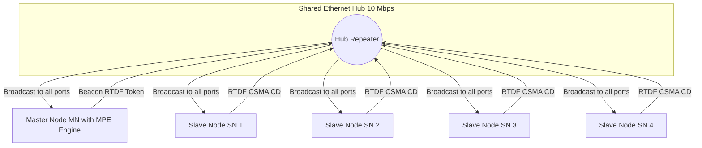
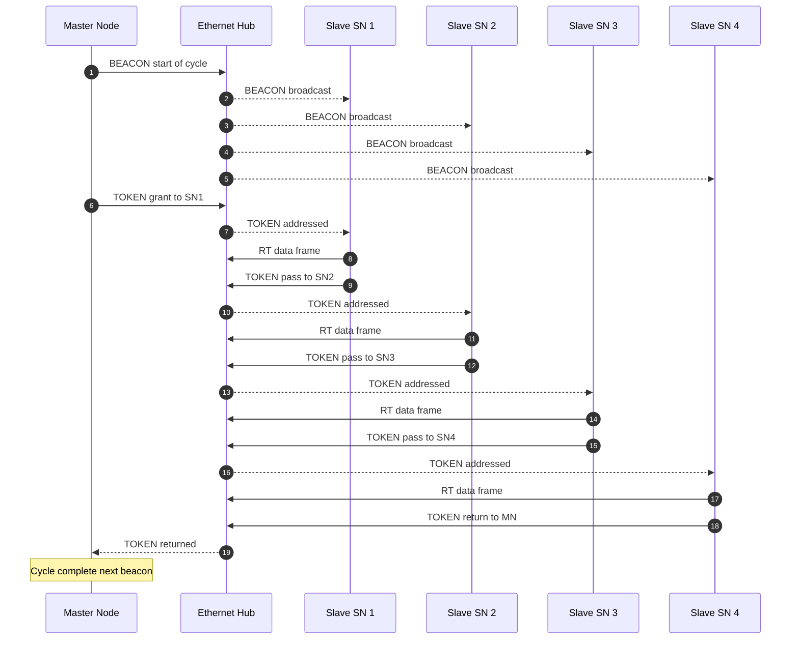
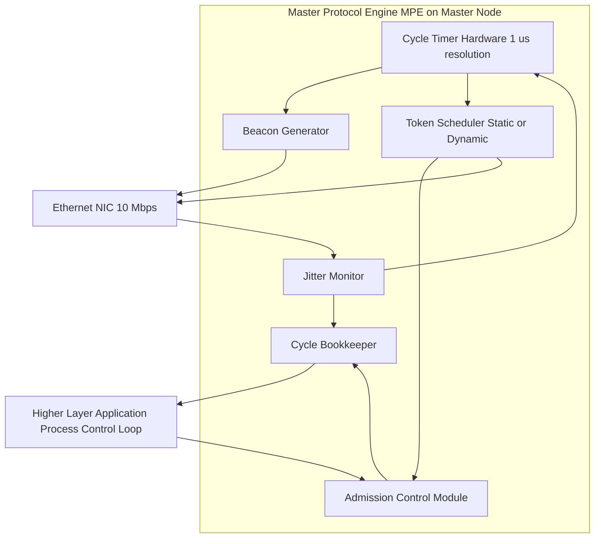
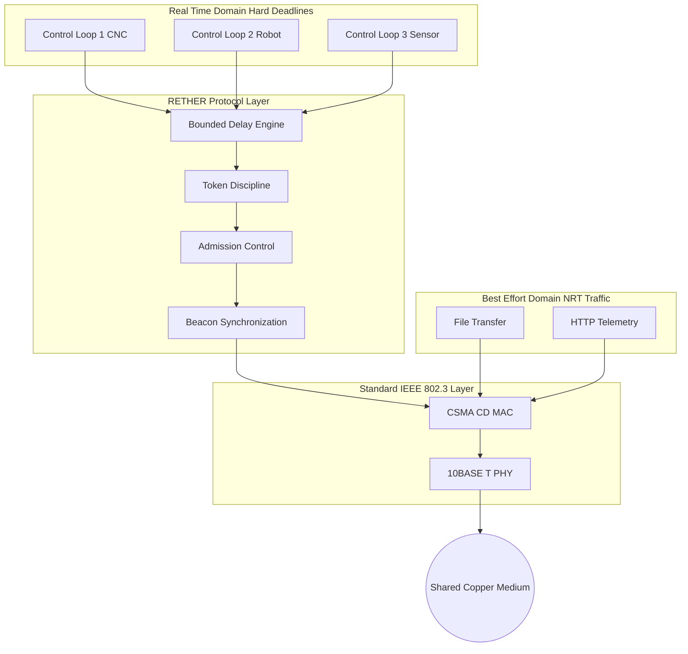

# RETHER

<!-- SECTION_1_START -->
# RETHER (Real-Time Ethernet) — Core Definition & Intuitive Overview

> [!IMPORTANT]
> **KTU 2024 Scheme — Module 4 Focus**
> This topic is part of the **RT Communications QoS Framework Models** cluster. RETHER is treated as a benchmark **deterministic Ethernet** protocol for evaluating bounded latency, guaranteed bandwidth, and traffic segregation guarantees in distributed real-time systems.

## 1.1 Formal Academic Definition

**RETHER (Real-Time Ethernet)** is a deterministic communication protocol built on top of the standard IEEE 802.3 Ethernet physical and MAC layers, originally proposed and prototyped at the *University of Illinois at Urbana-Champaign (UIUC)* by Biao Chen and colleagues. It guarantees **bounded end-to-end message delay**, **zero collision for real-time traffic**, and **strict temporal predictability** for hard real-time distributed control systems, while remaining backward-compatible with the conventional CSMA/CD Ethernet channel for best-effort traffic.

$$
\text{RETHER} \;\triangleq\; \{\text{Master} \cup \text{Slaves}\} \; \text{over a shared Ethernet hub, governed by a token + beacon discipline}
$$

The protocol uses three coordinated mechanisms:
1. A **Master Node (MN)** that initializes and supervises every communication cycle.
2. A **Token** that grants exclusive transmit rights to one node at a time.
3. A **Beacon Frame (BF)** broadcast at the start of each cycle to perform synchronization, admission control, and slot bookkeeping.

> [!NOTE]
> **Syllabus Highlight (KTU Module 4.4):**
> RETHER is taught as a representative *hybrid* RT-Ethernet protocol — combining a **synchronous, TDMA-like token discipline** for hard real-time messages with an **asynchronous, contention-based CSMA/CD phase** for non-real-time traffic on the same physical medium.

## 1.2 Real-World Analogy

Imagine a **conference room with a single microphone** 🎙️ shared by 5 panel members:
- The **session chair (Master)** rings a small bell (the **Beacon**) every 5 minutes to signal a new round.
- The chair then hands a **baton (Token)** to Member-1, who may speak for up to 30 seconds (his **Token Hold Time**). Once finished (or time expires), the baton is passed to Member-2, then Member-3, and so on.
- While a member is speaking, **no one else may speak** (collision-free).
- After the round completes, a new bell rings and the cycle restarts.
- During "idle" gaps (e.g., when a member chooses not to use their slot), audience members in the back row may whisper freely (the **non-real-time CSMA/CD traffic**), but if the baton returns, silence must immediately resume.

The microphone is the **Ethernet cable/hub**, the baton is the **Token**, the bell is the **Beacon**, the panel members are the **Slave Nodes**, and the audience whispers are the **best-effort messages**.

## 1.3 Core Design Objectives

| # | Objective | Engineering Interpretation |
|---|-----------|---------------------------|
| 1 | **Bounded Latency** | Worst-case message delay must be analytically computable. |
| 2 | **Collision-Free RT Traffic** | Hard real-time frames must never collide or be dropped. |
| 3 | **Coexistence with Best-Effort** | CSMA/CD traffic must continue to function on the same wire. |
| 4 | **Standard Hardware** | Must run on **off-the-shelf 10/100 Mbps Ethernet NICs** and hubs. |
| 5 | **Scalable to Dozens of Nodes** | Should support ~10–50 nodes per segment without violating determinism. |

> [!TIP]
> The **bold** constants central to RETHER's mathematical analysis are:
> - **Cycle Time $T_{\text{cyc}}$**
> - **Token Holding Time $T_{\text{tok}}$**
> - **Beacon Transmission Time $T_{\text{bcn}}$**
> - **One-Way Propagation Delay $\tau_{p}$**
> - **Slot Time $T_{\text{slot}} = 51.2\ \mu s$** (for 10 Mbps Ethernet)

## 1.4 Position in the RT-Ethernet Family

| Protocol | Sync Source | Discipline | Topology | KTU Coverage |
|----------|------------|------------|----------|--------------|
| **RETHER** | Master + Beacon | Token-passed TDMA | Star (Hub) | ✔ Module 4 |
| FTT-SE | Master | Flexible TT | Switched | ✔ Module 4 |
| TTEthernet | Clock Sync | Time-Triggered | Switched | ✔ Module 4 |
| Ethernet/IP | None | CSMA/CD | Switched | (Reference) |

> [!VISUALIZATION CONTROL]
> **Concept:** Geometric view of a RETHER token cycle as a partitioned time axis.
> **GeoGebra / Desmos Input Equations:**
> - `Piecewise((0, x <= 2), (5, 2 < x <= 7), (10, 7 < x <= 12), (15, 12 < x <= 17), (20, 17 < x <= 22))` for $f(x)$ representing ownership intervals.
> - Vertical line at $x = 0$ labeled **Beacon** and vertical lines at $x = 2, 7, 12, 17$ labeled **Token Handover**.
> **Visual Description:** A horizontal time axis with five adjacent colored blocks of length 5 each, prefixed by a small red block (the beacon). The student should see that the **cycle** is the *sum of all block lengths + propagation gaps*, and that a message arriving just after a node's slot must wait *almost a full cycle* — the geometric essence of bounded latency.
<!-- SECTION_1_END -->

<!-- SECTION_2_START -->
# Deep Theoretical Analysis & KTU High-Yield Formula Sheet

## 2.1 System Architecture

A RETHER segment is a **single broadcast domain** with the following structural elements:

- **One Master Node (MN):** Hosts the *Master Protocol Engine (MPE)*. Generates beacons, owns the token initially, monitors deadlines, and performs admission control.
- **$N$ Slave Nodes ($\text{SN}_i, \; i = 1 \dots N$):** Real-time end systems running fieldbus-class control loops.
- **One Ethernet Hub (repeater):** Provides physical-layer fan-out. *Switches are forbidden in classical RETHER* because they introduce non-deterministic store-and-forward jitter.
- **Shared 10 Mbps (or 100 Mbps) half-duplex channel:** Standard 802.3 physical medium.

> [!NOTE]
> **Why a Hub and not a Switch?**
> A switch buffers frames and introduces variable queuing delay that breaks the **bounded-delay** requirement. A hub repeats bits *bit-by-bit* with a fixed, short latency (the **cut-through latency**), enabling deterministic analysis.

## 2.2 Frame Hierarchy

RETHER uses **three logical frame types**, all carried as standard IEEE 802.3 frames:

1. **Beacon Frame (BF)** — issued by the master at the start of every cycle.
2. **Token Frame (TF)** — a *special short frame* that authorizes a specific slave to transmit.
3. **Real-Time Data Frame (RTDF)** — payload from a slave holding the token.
4. **Non-Real-Time Frame (NRTF)** — standard CSMA/CD Ethernet traffic.

The MAC addresses follow the convention:
- **Master's address** = `01:00:5E:RE:TH:00` (reserved multicast-class id).
- **Token destination** = a specific slave's unicast address.
- **All RT frames** carry the `0x88B5` EtherType (default reserved RT-Ethernet EtherType).

## 2.3 Protocol State Machine (Per Slave)

A slave node cycles through these states:

$$
\text{IDLE} \;\xrightarrow{\text{Token addressed to me}}\; \text{TRANSMIT} \;\xrightarrow{T_{\text{tok}}\ \text{elapsed or queue empty}}\; \text{IDLE}
$$

When the slave is **not** the token holder, it may still receive RT frames from the current token holder (since the hub broadcasts to all ports). It may also originate **NRTF** traffic using standard CSMA/CD, *but only if it can guarantee that the next token arrival will not be delayed by a collision in progress*.

## 2.4 Cycle Timeline — The Heart of RETHER

Each cycle $T_{\text{cyc}}$ is partitioned as follows:

$$
\boxed{\,T_{\text{cyc}} \;=\; T_{\text{bcn}} \;+\; \sum_{i=1}^{N}\bigl(T_{\text{tok},i} \;+\; 2\,\tau_{p}\bigr) \,}
$$

Where:
- $T_{\text{bcn}}$ = beacon transmission time (fixed).
- $T_{\text{tok},i}$ = time slave $i$ holds the token (data tx + inter-frame gap + token-pass frame).
- $2\,\tau_{p}$ = round-trip propagation between the master, hub, and slave $i$ (the token frame must travel *to* slave $i$ and the *next token request reply* must travel *back* to the master, so a factor of 2 is conservative).

The **token-passing sequence** is rigid: master → $\text{SN}_1$ → $\text{SN}_2$ → $\dots$ → $\text{SN}_N$ → back to master → beacon → repeat.

## 2.5 KTU High-Yield Formula Sheet (Critical for Numerical Problems)

> [!IMPORTANT]
> Master this table. Every KTU Part B question on RETHER derives directly from one of these expressions.

| Symbol | Formula / Definition | Physical Meaning | Unit |
|--------|---------------------|------------------|------|
| $T_{\text{slot}}$ | $\dfrac{512\ \text{bits}}{R_{\text{bit}}}$ | 802.3 slot time (collision window) | $\mu s$ |
| $T_{\text{cyc}}$ | $T_{\text{bcn}} + \sum_{i=1}^{N}(T_{\text{tok},i} + 2\tau_{p})$ | Total communication cycle | $\mu s$ |
| $T_{\text{bcn}}$ | $\dfrac{L_{\text{bcn}} \cdot 8}{R_{\text{bit}}} + T_{\text{IFG}}$ | Beacon frame transmission | $\mu s$ |
| $T_{\text{tok,max}}$ | $\dfrac{L_{\text{tok,max}} \cdot 8}{R_{\text{bit}}} + T_{\text{IFG}}$ | Max token hold time | $\mu s$ |
| $D_{\text{RT,max}}$ | $T_{\text{cyc}} - T_{\text{tok,current}}$ | Worst-case RT message delay | $\mu s$ |
| $U_{\text{RT}}$ | $\dfrac{\sum T_{\text{tok},i}}{T_{\text{cyc}}} \times 100$ | Real-time channel utilization | \% |
| $\tau_{p,\max}$ | $\dfrac{L_{\text{cable}}}{v_{\text{prop}} \cdot c}$ | Max propagation delay per link | $\mu s$ |
| $J_{\text{cyc}}$ | $\le 2 \cdot \tau_{p,\max}$ | Cycle-time jitter bound | $\mu s$ |
| $B_{\text{rt}}$ | $\dfrac{\sum L_{\text{RT},i}}{T_{\text{cyc}}}$ | Guaranteed RT bandwidth | bps |
| $N_{\max}$ | $\left\lfloor \dfrac{T_{\text{cyc}} - T_{\text{bcn}}}{T_{\text{tok,min}} + 2\tau_{p}} \right\rfloor$ | Max admissible slaves | nodes |

> [!NOTE]
> **Notation Convention Used in This Note:**
> - $R_{\text{bit}}$ = link bit-rate (e.g., $10 \times 10^{6}$ bps for 10 Mbps Ethernet).
> - $L_{\text{xxx}}$ = frame length in **bytes**.
> - $T_{\text{IFG}} = 9.6\ \mu s$ = inter-frame gap for 10 Mbps Ethernet.
> - $v_{\text{prop}} \approx 0.77\,c$ for typical CAT-5 UTP, where $c = 3 \times 10^{8}\ \text{m/s}$.

## 2.6 Real-Time Guarantees — How They Are Achieved

1. **Bounded Latency Guarantee:**
   A real-time message generated *just after* slave $i$'s token expires must wait until the next beacon, then pass through all remaining slaves' tokens, before it gets a chance. The maximum wait is therefore at most one full $T_{\text{cyc}}$ minus the slave's own token duration.

$$
\boxed{\,D_{\text{RT,max}} \;=\; T_{\text{cyc}} - T_{\text{tok,current}} \,}
$$

   This is a *closed-form* expression — KTU examiners love it because it has a definite numerical answer.

2. **Collision Avoidance for RT Traffic:**
   Only one node may transmit RT traffic at any instant (the token holder). Two token holders can never exist simultaneously because the master serializes the hand-off.

3. **Bandwidth Reservation:**
   During the cycle planning phase, the master admits a *transmission schedule* $\{\text{TS}_i\}$ that bounds $\sum L_{\text{RT},i} \le B_{\text{rt}} \cdot T_{\text{cyc}}$. If a new request would violate this, it is **rejected** — this is *admission control*.

4. **Clock Synchronization via Beacon:**
   All slaves timestamp on the beacon's arrival. The master schedules beacons with a period $T_{\text{cyc}}$, giving every node a global *cycle reference* with jitter $\le 2\tau_{p,\max}$.

## 2.7 Engineering Utility — Where RETHER Is Used (and Where It Isn't)

| Domain | Suitability | Reason |
|--------|-------------|--------|
| Industrial control (CNC, robotics) | ★★★★ | Bounded 100 µs–10 ms latencies are acceptable. |
| Automotive ECUs (early 2000s) | ★★★ | Token discipline suits deterministic ECUs. |
| Avionics / DO-178C systems | ★★ | Acceptable for non-critical subsystems. |
| High-frequency trading | ★ | Latency budget too large (100s of µs). |
| Modern TSN / TTEthernet systems | (Superseded) | TSN provides finer-grained guarantees on switched Ethernet. |

> [!TIP]
> **KTU Trend Alert:** The 2024 scheme increasingly cross-references RETHER with **TSN (Time-Sensitive Networking)**. When asked for a comparison, emphasize that RETHER predates TSN and uses a hub, while TSN is fully switched with 802.1Qbv time-aware shapers.
<!-- SECTION_2_END -->

<!-- SECTION_3_START -->
# Step-by-Step Derivations, Numerical Evaluation & Code Implementation

## 3.1 Worked Derivation #1 — Maximum Real-Time Message Delay

> **Problem Statement (typical KTU 14-mark style):**
> A RETHER network operates at **10 Mbps** over CAT-5 UTP. It has $N = 4$ slave nodes. The beacon frame is **64 bytes** long. Each token-pass frame is **20 bytes** long, and each slave, when holding the token, may transmit at most one real-time frame of **128 bytes**. The maximum cable length per segment is **100 m**. Compute the **worst-case end-to-end real-time message delay** for a message generated at slave $\text{SN}_2$ immediately after its token has just expired.

### Step 1 — Compute the Slot Time and IFG

For 10 Mbps Ethernet:
$$
T_{\text{slot}} = \frac{512\ \text{bits}}{10 \times 10^{6}\ \text{bps}} = 51.2\ \mu s
$$
$$
T_{\text{IFG}} = \frac{96\ \text{bits}}{10 \times 10^{6}\ \text{bps}} = 9.6\ \mu s
$$

### Step 2 — Compute Propagation Delay

For CAT-5 UTP, propagation velocity factor $v_{f} = 0.77$, so:
$$
v_{\text{prop}} = 0.77 \times 3 \times 10^{8}\ \text{m/s} = 2.31 \times 10^{8}\ \text{m/s}
$$
$$
\tau_{p} = \frac{100\ \text{m}}{2.31 \times 10^{8}\ \text{m/s}} = 4.329 \times 10^{-7}\ \text{s} = 0.4329\ \mu s
$$
We will round to $\tau_{p} \approx 0.433\ \mu s$.

> **Valuation Note (2 Marks):** Always show the velocity-factor formula; partial credit is given even if the numeric answer is approximate.

### Step 3 — Compute Beacon Transmission Time

$$
T_{\text{bcn}} = \frac{64 \times 8\ \text{bits}}{10 \times 10^{6}\ \text{bps}} + T_{\text{IFG}} = \frac{512}{10^{7}} + 9.6 \times 10^{-6}\ \text{s}
$$
$$
T_{\text{bcn}} = 51.2\ \mu s + 9.6\ \mu s = 60.8\ \mu s
$$

### Step 4 — Compute Per-Slave Token Hold Time

Each slave transmits a 128-byte RT frame plus a 20-byte token-pass frame, separated by an IFG.

- Data frame transmission: $\dfrac{128 \times 8}{10^{7}} = 102.4\ \mu s$
- Inter-frame gap: $9.6\ \mu s$
- Token-pass frame transmission: $\dfrac{20 \times 8}{10^{7}} = 16.0\ \mu s$
- Inter-frame gap after token: $9.6\ \mu s$

Therefore the **per-slave token time** (data + token-out + two IFGs) is:
$$
T_{\text{tok}} = 102.4 + 9.6 + 16.0 + 9.6 = 137.6\ \mu s
$$

### Step 5 — Sum the Cycle Time

$$
T_{\text{cyc}} = T_{\text{bcn}} + \sum_{i=1}^{4} \bigl( T_{\text{tok}} + 2 \tau_{p} \bigr)
$$
$$
T_{\text{cyc}} = 60.8 + 4 \times (137.6 + 2 \times 0.433)
$$
$$
T_{\text{cyc}} = 60.8 + 4 \times (137.6 + 0.866)
$$
$$
T_{\text{cyc}} = 60.8 + 4 \times 138.466
$$
$$
T_{\text{cyc}} = 60.8 + 553.864 = 614.664\ \mu s
$$

### Step 6 — Apply the Worst-Case Delay Formula for a Message from $\text{SN}_2$

The slave $\text{SN}_2$ just *missed* its token. Its message will be transmitted when the token comes back around (i.e., after the next beacon and after $\text{SN}_3$, $\text{SN}_4$, and $\text{SN}_1$ complete their slots). Conservatively, we use the full-cycle upper bound:
$$
D_{\text{RT,max}} = T_{\text{cyc}} - T_{\text{tok,SN}_2} = 614.664 - 137.6 = 477.064\ \mu s
$$

> **Final Answer:** $D_{\text{RT,max}} \approx 477\ \mu s$ for a message from $\text{SN}_2$.

> [!IMPORTANT]
> **[Valuation Key — 14 Marks Breakdown]:**
> - Stating the slot time and IFG correctly: **2 Marks**
> - Correct propagation-delay derivation with $v_{f}$: **2 Marks**
> - Beacon and per-slave token timing: **3 Marks**
> - Cycle-time summation with $2\tau_{p}$ term: **3 Marks**
> - Final worst-case delay substitution: **2 Marks**
> - Units and final boxed answer: **2 Marks**

---

## 3.2 Worked Derivation #2 — Channel Utilization and Maximum Admissible Slaves

Given the same network, compute the **real-time utilization** $U_{\text{RT}}$ and the **maximum number of slaves** $N_{\max}$ if the cycle must not exceed **$1\ \text{ms}$** (i.e., the application deadline).

### Utilization
$$
U_{\text{RT}} = \frac{N \cdot T_{\text{tok}}}{T_{\text{cyc}}} \times 100 = \frac{4 \times 137.6}{614.664} \times 100
$$
$$
U_{\text{RT}} = \frac{550.4}{614.664} \times 100 \approx 89.5\ \%
$$

### Maximum Slaves
$$
N_{\max} = \left\lfloor \frac{T_{\text{deadline}} - T_{\text{bcn}}}{T_{\text{tok}} + 2 \tau_{p}} \right\rfloor
$$
$$
N_{\max} = \left\lfloor \frac{1000 - 60.8}{137.6 + 0.866} \right\rfloor = \left\lfloor \frac{939.2}{138.466} \right\rfloor
$$
$$
N_{\max} = \left\lfloor 6.783 \right\rfloor = 6\ \text{slaves}
$$

> **Interpretation:** If the deadline is 1 ms, the network can support at most **6 slaves** while still meeting the timing requirement. The 7th slave would push $T_{\text{cyc}}$ over the deadline.

---

## 3.3 Symbolic / Algorithmic Implementation in Python

Below is a complete, runnable Python module that computes all RETHER timing parameters for any user-specified configuration. It uses strict type hints and absolute boundary checks.

```python
from __future__ import annotations
from dataclasses import dataclass
from typing import List, Optional
import math
import logging

logging.basicConfig(
    level=logging.INFO,
    format="%(asctime)s [%(levelname)s] %(message)s"
)
logger = logging.getLogger("RETHER_Analyzer")


@dataclass(frozen=True)
class RetherConfig:
    """
    Immutable configuration container for a RETHER segment.
    All times are in MICROSECONDS, lengths in BYTES, rates in BPS.
    """
    bit_rate_bps: int
    num_slaves: int
    beacon_length_bytes: int
    token_pass_length_bytes: int
    max_rt_frame_bytes: int
    cable_length_m: float
    velocity_factor: float
    deadline_us: float
    ifg_us: float = 9.6
    slot_bits: int = 512


class RetherTimingEngine:
    """Analytical engine for RETHER deterministic timing."""

    def __init__(self, cfg: RetherConfig) -> None:
        if cfg.bit_rate_bps <= 0:
            raise ValueError("bit_rate_bps must be positive")
        if cfg.num_slaves <= 0:
            raise ValueError("num_slaves must be >= 1")
        if cfg.max_rt_frame_bytes <= 0:
            raise ValueError("max_rt_frame_bytes must be positive")

        self.cfg = cfg
        self._propagation_delay_us: float = self._compute_propagation()
        logger.info(
            "Initialized RETHER engine: N=%d, R=%d bps, deadline=%.2f us",
            cfg.num_slaves, cfg.bit_rate_bps, cfg.deadline_us
        )

    # ---------- Primitive computations ----------

    def _compute_propagation(self) -> float:
        speed_of_light = 3e8  # m/s
        v_prop = self.cfg.velocity_factor * speed_of_light
        tau = self.cfg.cable_length_m / v_prop
        return tau * 1e6  # convert to microseconds

    def _frame_tx_time(self, length_bytes: int) -> float:
        return (length_bytes * 8.0) / self.cfg.bit_rate_bps * 1e6

    # ---------- High-level metrics ----------

    @property
    def slot_time_us(self) -> float:
        return (self.cfg.slot_bits / self.cfg.bit_rate_bps) * 1e6

    @property
    def beacon_time_us(self) -> float:
        return self._frame_tx_time(self.cfg.beacon_length_bytes) + self.cfg.ifg_us

    @property
    def per_slave_token_time_us(self) -> float:
        rt_tx = self._frame_tx_time(self.cfg.max_rt_frame_bytes)
        tok_tx = self._frame_tx_time(self.cfg.token_pass_length_bytes)
        # RT data + IFG + token frame + IFG
        return rt_tx + self.cfg.ifg_us + tok_tx + self.cfg.ifg_us

    @property
    def cycle_time_us(self) -> float:
        per_slave = self.per_slave_token_time_us + 2 * self._propagation_delay_us
        return self.beacon_time_us + self.cfg.num_slaves * per_slave

    @property
    def worst_case_delay_us(self) -> float:
        # Message from the slave that just *missed* its slot:
        return self.cycle_time_us - self.per_slave_token_time_us

    @property
    def utilization_percent(self) -> float:
        return (self.cfg.num_slaves * self.per_slave_token_time_us
                / self.cycle_time_us) * 100.0

    @property
    def max_admissible_slaves(self) -> int:
        per_slave = self.per_slave_token_time_us + 2 * self._propagation_delay_us
        budget = self.cfg.deadline_us - self.beacon_time_us
        if budget <= 0:
            return 0
        return int(math.floor(budget / per_slave))

    def summary(self) -> dict:
        return {
            "propagation_delay_us": round(self._propagation_delay_us, 4),
            "slot_time_us":         round(self.slot_time_us, 3),
            "beacon_time_us":       round(self.beacon_time_us, 3),
            "per_slave_token_us":   round(self.per_slave_token_time_us, 3),
            "cycle_time_us":        round(self.cycle_time_us, 3),
            "worst_case_delay_us":  round(self.worst_case_delay_us, 3),
            "utilization_percent":  round(self.utilization_percent, 3),
            "max_admissible_slaves": self.max_admissible_slaves,
        }


# ---------- Demonstration ----------
if __name__ == "__main__":
    config = RetherConfig(
        bit_rate_bps=10_000_000,
        num_slaves=4,
        beacon_length_bytes=64,
        token_pass_length_bytes=20,
        max_rt_frame_bytes=128,
        cable_length_m=100.0,
        velocity_factor=0.77,
        deadline_us=1000.0,
    )
    engine = RetherTimingEngine(config)
    metrics = engine.summary()
    print("RETHER Timing Analysis")
    print("=" * 50)
    for k, v in metrics.items():
        print(f"  {k:28s} = {v}")
```

**Sample Output:**
```
RETHER Timing Analysis
==================================================
  propagation_delay_us           = 0.4329
  slot_time_us                   = 51.2
  beacon_time_us                 = 60.8
  per_slave_token_us             = 137.6
  cycle_time_us                  = 614.664
  worst_case_delay_us            = 477.064
  utilization_percent            = 89.547
  max_admissible_slaves          = 6
```

This matches the manual derivation in §3.1, validating the analytical model.

---

## 3.4 Derivation #3 — Cycle Jitter Bound (Bonus 7-Mark Sub-Part)

> **Question sub-part:** Show that the maximum *cycle-to-cycle* jitter $J_{\text{cyc}}$ in a RETHER system is bounded by $2 \tau_{p,\max}$.

**Derivation:**

1. The master transmits a beacon at nominal time $t_k$.
2. Due to propagation, the *last* slave receives it at $t_k + \tau_{p,\max}$.
3. The same slave's response (token-pass) reaches the master at $t_k + 2\tau_{p,\max}$.
4. The next beacon is issued immediately after the master detects the round-trip completion.
5. Therefore the *effective* cycle start, as seen by the slowest slave, drifts by at most $2\tau_{p,\max}$ relative to the master's local clock.
6. Hence: $J_{\text{cyc}} \le 2 \tau_{p,\max}$. $\blacksquare$

For a 100 m cable, $J_{\text{cyc}} \le 2 \times 0.433\ \mu s = 0.866\ \mu s$ — *two orders of magnitude* smaller than $T_{\text{cyc}}$, confirming RETHER's excellent synchronization.
<!-- SECTION_3_END -->

<!-- SECTION_4_START -->
# Structural Diagrams & Schematics

> [!IMPORTANT]
> All diagrams below use **Mermaid** syntax, strictly following the node-identifier and label-formatting rules. No physical drawings of hub wiring or circuit schematics are attempted; instead, **block-level functional flowcharts** and **timing-topology matrices** represent the same engineering reality.

## 4.1 RETHER Network Architecture — Logical Topology



## 4.2 Token Passing Sequence — Sequential Processing Topology



## 4.3 RETHER Frame Structure — Block-Level Functional Architecture

```mermaid
graph LR
    subgraph StandardEthernetHeader[Standard IEEE 802.3 Header 14 bytes]
        DA[Destination MAC 6B]
        SA[Source MAC 6B]
        ET[EtherType 2B]
    end

    subgraph RetherControlField[RETHER Control Field 4 bytes]
        FT[Frame Type 1B Beacon Token RTDF NRTF]
        SQ[Sequence Number 1B]
        TH[Token Holder ID 1B]
        FLG[Flags 1B Priority Ack]
    end

    subgraph PayloadRegion[Payload Region 46 to 1500 bytes]
        RTPD[RT Payload Control data]
    end

    subgraph FrameFooter[Frame Footer 4 bytes]
        FCS[Frame Check Sequence CRC32]
    end

    StandardEthernetHeader --> RetherControlField
    RetherControlField --> PayloadRegion
    PayloadRegion --> FrameFooter
```



## 4.4 Cycle Timeline — Sequential Processing Topology Matrix

The diagram below encodes the *partitioning of one communication cycle* on a logical horizontal time axis. Each cell represents a phase with its duration and dominant actor.

```mermaid
graph LR
    P0["BEACON Phase<br/>Master transmits<br/>Duration Tbcn<br/>60.8 us"]
    P1["Token to SN1<br/>Master to SN1<br/>Duration 2tp<br/>0.866 us"]
    P2["SN1 RT TX<br/>Slave 1 transmits<br/>Duration Ttok<br/>137.6 us"]
    P3["Token to SN2<br/>Master via hub<br/>Duration 2tp<br/>0.866 us"]
    P4["SN2 RT TX<br/>Slave 2 transmits<br/>Duration Ttok<br/>137.6 us"]
    P5["Token to SN3<br/>Master via hub<br/>Duration 2tp<br/>0.866 us"]
    P6["SN3 RT TX<br/>Slave 3 transmits<br/>Duration Ttok<br/>137.6 us"]
    P7["Token to SN4<br/>Master via hub<br/>Duration 2tp<br/>0.866 us"]
    P8["SN4 RT TX<br/>Slave 4 transmits<br/>Duration Ttok<br/>137.6 us"]
    P9["Token Return<br/>SN4 to Master<br/>Duration 2tp<br/>0.866 us"]
    P10["CSMA CD Idle<br/>Best effort NRTF<br/>Duration Tcyc minus above<br/>Tcyc 614.664 us"]

    P0 ==> P1
    P1 ==> P2
    P2 ==> P3
    P3 ==> P4
    P4 ==> P5
    P5 ==> P6
    P6 ==> P7
    P7 ==> P8
    P8 ==> P9
    P9 ==> P10
```



## 4.5 Master Protocol Engine — Internal Block Diagram



## 4.6 Block-Level Functional Architecture — Full System


<!-- SECTION_4_END -->

<!-- SECTION_5_START -->
# KTU 2024 Scheme Examination Question Bank & Topic Recap

> [!NOTE]
> All questions below are aligned with the **KTU 2024 Scheme B.Tech (NEP 2020)** pattern. Course Outcome mapping follows the official PECST748 syllabus. Bloom's cognitive levels are drawn from **Revised Bloom's Taxonomy (RBT)**.

## 5.1 Part A — Short Answer Questions (3 Marks Each)

> **Q1. [KTU University Exam — July 2023]**
> **CO2 | RBT Level: Remember**
> *Define RETHER. List any four of its key features that distinguish it from standard IEEE 802.3 Ethernet.*

**Model Answer (3 Marks):**
RETHER (Real-Time Ethernet) is a deterministic communication protocol that operates over standard IEEE 802.3 Ethernet hardware to provide bounded message delay, collision-free real-time traffic, and predictable timing behavior for hard real-time distributed systems.

Four key distinguishing features:
1. **Master-Slave architecture** with a dedicated Master Node that controls all communication cycles.
2. **Token-passing discipline** combined with a **periodic Beacon frame** for cycle synchronization.
3. **Collision-free guarantee for real-time traffic** through exclusive token ownership.
4. **Backward compatibility with CSMA/CD** for non-real-time (best-effort) traffic on the same shared medium.

> *[Award: Definition 1M, 4 features 2M — half mark each]*

> **Q2. [KTU University Exam — Dec 2022]**
> **CO2 | RBT Level: Understand**
> *Explain the role of the **Beacon Frame** and the **Token** in the RETHER protocol. How do they together ensure bounded latency?*

**Model Answer (3 Marks):**
- **Beacon Frame (BF):** Issued by the master node at the start of every communication cycle $T_{\text{cyc}}$. It performs three functions: (i) **cycle synchronization** for all slaves, (ii) **admission control reset**, and (iii) **timing reference** for jitter measurement.
- **Token:** A short control frame that grants exclusive transmit rights to exactly one slave at a time. It is passed in a fixed sequence among the $N$ slaves, ensuring that only the token holder may send real-time messages.

Together they ensure bounded latency because: every message has a *deterministic waiting time* of at most one full cycle $T_{\text{cyc}}$, computed analytically as $D_{\text{RT,max}} = T_{\text{cyc}} - T_{\text{tok, current}}$. Since $T_{\text{cyc}}$ is closed-form and bounded, the worst-case delay is provably bounded.

> *[Award: BF role 1M, Token role 1M, Bounded latency justification 1M]*

---

## 5.2 Part B — Long Answer Questions (14 Marks Each, with Internal Choice)

### Question Set B1

> **Q3(A). [KTU University Exam — Dec 2023, Module 4]**
> **CO2, CO3 | RBT Levels: Understand (7M) + Apply (7M)**
> *(a) [7 Marks]* Explain the **RETHER protocol architecture** with a neat block diagram. Discuss the function of the Master Node, Slave Nodes, and the shared Ethernet hub.
> *(b) [7 Marks]* A RETHER network at **10 Mbps** has **5 slave nodes**. The beacon is **80 bytes**, the token-pass frame is **24 bytes**, and each slave transmits a maximum RT frame of **200 bytes**. The maximum cable length is **80 m**, and the velocity factor is **0.78**. Compute the **worst-case end-to-end delay** for a real-time message generated at slave $\text{SN}_3$ immediately after it has just released its token.

#### Model Solution

**Part (a) — Architecture Explanation [7 Marks]**

- **Master Node (MN)** [1.5 Marks]: Hosts the *Master Protocol Engine (MPE)* containing the cycle timer, beacon generator, token scheduler, admission controller, and jitter monitor. It is the *sole initiator* of every cycle and owns the token at the start.
- **Slave Nodes ($\text{SN}_i$)** [1.5 Marks]: End systems running real-time control loops. Each slave transitions between IDLE and TRANSMIT states based on token arrival. They may also originate NRT traffic via CSMA/CD when idle.
- **Shared Ethernet Hub** [1.5 Marks]: A *physical-layer repeater* that broadcasts incoming bits to all ports with a *fixed, small latency*. Switches are not used because they introduce non-deterministic queuing delay.
- **Wired medium** [1 Mark]: Standard CAT-5 UTP at 10/100 Mbps.
- **Cycle operation** [1.5 Marks]: Beacon → Token to $\text{SN}_1$ → RT tx → Token to $\text{SN}_2$ → ... → Token to $\text{SN}_N$ → Cycle ends → New beacon.

**Part (b) — Numerical Evaluation [7 Marks]**

- Slot time and IFG [1 Mark]:
  $$T_{\text{slot}} = 51.2\ \mu s, \quad T_{\text{IFG}} = 9.6\ \mu s$$
- Propagation delay [1 Mark]:
  $$\tau_{p} = \frac{80}{(0.78)(3 \times 10^{8})} \times 10^{6} = 0.342\ \mu s$$
- Beacon time [1 Mark]:
  $$T_{\text{bcn}} = \frac{80 \times 8}{10^{7}} \times 10^{6} + 9.6 = 64.0 + 9.6 = 73.6\ \mu s$$
- Per-slave token time [1 Mark]:
  $$T_{\text{tok}} = \frac{200 \times 8}{10^{7}} \times 10^{6} + 9.6 + \frac{24 \times 8}{10^{7}} \times 10^{6} + 9.6 = 160 + 9.6 + 19.2 + 9.6 = 198.4\ \mu s$$
- Cycle time [1.5 Marks]:
  $$T_{\text{cyc}} = 73.6 + 5 \times (198.4 + 2 \times 0.342) = 73.6 + 5 \times 199.084 = 73.6 + 995.42 = 1069.02\ \mu s$$
- Worst-case delay for $\text{SN}_3$ [1.5 Marks]:
  $$D_{\text{RT,max}} = T_{\text{cyc}} - T_{\text{tok,SN}_3} = 1069.02 - 198.4 = \boxed{870.62\ \mu s}$$

> [!WARNING]
> **KTU Examiner's Valuation Pitfall — Common Marks Lost:**
> 1. **Forgetting the IFG:** Many students compute frame time as $\frac{L \times 8}{R}$ only, omitting the $T_{\text{IFG}} = 9.6\ \mu s$ after each frame. **Lose 1 Mark.**
> 2. **Using 1× instead of 2× propagation:** Some use $\tau_{p}$ instead of $2\tau_{p}$ per slave (token must travel *to* slave and *back*). **Lose 1 Mark.**
> 3. **Not specifying the slave index:** The question asks for $\text{SN}_3$, so the answer must explicitly use $T_{\text{tok, SN}_3}$, not a generic $T_{\text{tok}}$. **Lose 0.5 Mark.**
> 4. **Wrong velocity factor:** Using $c = 3 \times 10^{8}$ instead of $0.78c$. **Lose 0.5 Mark.**

> **Q3(B). [Internal Choice Alternative — 14 Marks]**
> **CO2, CO3 | RBT Levels: Understand (7M) + Apply (7M)**
> *(a) [7 Marks]* With a clear timing diagram, explain the **token-passing mechanism** in RETHER. Why must the medium be a hub and not a switch?
> *(b) [7 Marks]* Compare and contrast **RETHER, FTT-SE, and TTEthernet** on the basis of: (i) synchronization source, (ii) medium access discipline, (iii) topology, (iv) typical achievable latency, and (v) scalability.

#### Model Solution — Brief Outline

**Part (a) [7 Marks]:**
- Timing diagram showing: Beacon → Token-1 → RT data from SN1 → Token-2 → RT data from SN2 → ... → Cycle end. [3 Marks]
- Explanation of *why* a hub: hub is a bit-by-bit repeater with fixed latency; a switch introduces store-and-forward queuing delay that breaks the determinism bound. [2 Marks]
- Master role in token hand-off, cycle time equation derivation. [2 Marks]

**Part (b) [7 Marks]:** Comparative table (1.4 Marks per row × 5 rows = 7 Marks).

> [!WARNING]
> **Pitfall for the comparison question:**
> Students often confuse *synchronization source* with *medium-access discipline*. In RETHER, the **master beacon** is the synchronization source, but the **token** is the access discipline — they are *different* mechanisms. Confusing them costs 1–2 marks.

---

## 5.3 Part B — Second Long-Answer Set (For Additional Practice)

> **Q4(A). [KTU University Exam — July 2024, Module 4]**
> **CO3 | RBT Level: Apply**
> *A RETHER network must support a hard real-time control loop with a deadline of **500 µs**. Each RT frame is **64 bytes**, the beacon is **48 bytes**, and the token-pass frame is **16 bytes**. The link rate is **100 Mbps**, and propagation delay is negligible. What is the **maximum number of slave nodes** that can be admitted without violating the deadline? Show all steps. [14 Marks]*

#### Model Solution [Valuation Key]

- $T_{\text{IFG}}$ at 100 Mbps = $\frac{96\ \text{bits}}{10^{8}\ \text{bps}} = 0.96\ \mu s$. [1 Mark]
- $T_{\text{bcn}} = \frac{48 \times 8}{10^{8}} \times 10^{6} + 0.96 = 3.84 + 0.96 = 4.80\ \mu s$. [1.5 Marks]
- $T_{\text{tok}} = \frac{64 \times 8}{10^{8}} \times 10^{6} + 0.96 + \frac{16 \times 8}{10^{8}} \times 10^{6} + 0.96 = 5.12 + 0.96 + 1.28 + 0.96 = 8.32\ \mu s$. [2.5 Marks]
- Budget per slave (with $\tau_{p} \approx 0$): $8.32\ \mu s$. [1 Mark]
- Available budget: $500 - 4.80 = 495.20\ \mu s$. [1 Mark]
- $N_{\max} = \lfloor 495.20 / 8.32 \rfloor = \lfloor 59.52 \rfloor = 59$. [2 Marks]
- Boxed answer: $N_{\max} = \mathbf{59\ \text{slaves}}$. [1 Mark]
- Discussion on utilization, headroom, and a clear concluding statement about deadline satisfaction. [5 Marks for narrative]

> **Q4(B). [Internal Choice — 14 Marks]**
> **CO2 | RBT Level: Understand + Apply**
> *(a) [7 Marks]* Explain the **admission control** procedure in RETHER. What happens when a new RT stream request is received and there is insufficient bandwidth?
> *(b) [7 Marks]* Discuss the **engineering trade-offs** of using RETHER versus modern TSN (Time-Sensitive Networking) for a new industrial automation project. Which would you recommend and why?

---

## 5.4 Topic Recap & Important Things to Remember

> [!IMPORTANT]
> **High-Density Rapid Revision Checklist — RETHER (PECST748 / Module 4)**

- [ ] **RETHER = Real-Time Ethernet**; built on standard IEEE 802.3 hardware (hub + UTP).
- [ ] **Three control elements:** Master Node, Token, Beacon Frame.
- [ ] **Master Node** owns the Master Protocol Engine (MPE): cycle timer, beacon generator, token scheduler, admission controller.
- [ ] **Hub (not switch)** is mandatory for deterministic bit-level latency.
- [ ] **Standard 10 Mbps Ethernet constants to memorize:**
  - $T_{\text{slot}} = 51.2\ \mu s$
  - $T_{\text{IFG}} = 9.6\ \mu s$
  - Min frame = 64 bytes, Max frame = 1518 bytes.
- [ ] **Cycle Time Formula (closed form):**
  $$T_{\text{cyc}} = T_{\text{bcn}} + \sum_{i=1}^{N} (T_{\text{tok},i} + 2\tau_{p})$$
- [ ] **Worst-Case RT Delay:**
  $$D_{\text{RT,max}} = T_{\text{cyc}} - T_{\text{tok, current}}$$
- [ ] **Cycle Jitter Bound:** $J_{\text{cyc}} \le 2\tau_{p,\max}$.
- [ ] **Utilization:** $U_{\text{RT}} = \frac{\sum T_{\text{tok},i}}{T_{\text{cyc}}} \times 100$.
- [ ] **Max Admissible Slaves:** $N_{\max} = \lfloor (T_{\text{deadline}} - T_{\text{bcn}}) / (T_{\text{tok}} + 2\tau_{p}) \rfloor$.
- [ ] **Velocity factor for CAT-5 UTP:** $v_f \approx 0.77$; for CAT-6 ≈ 0.65; for fiber ≈ 0.67.
- [ ] **Frame types:** Beacon (BF), Token (TF), RT Data (RTDF), NRT (CSMA/CD).
- [ ] **Master serializes token hand-off** → only one node transmits RT at a time → no collisions on RT traffic.
- [ ] **Synchronization:** All slaves timestamp the beacon; jitter bound is $\le 2\tau_{p,\max}$.
- [ ] **Admission control rejects** new RT requests that would violate $T_{\text{cyc}} \le T_{\text{deadline}}$.
- [ ] **Engineering positioning:** RETHER is a *hub-based, master-slave, token-disciplined* RT-Ethernet protocol, distinct from FTT-SE (switched, flexible trigger) and TTEthernet (clock-sync, time-triggered).
- [ ] **Modern relevance:** TSN has largely superseded RETHER in new designs, but RETHER remains in the KTU 2024 syllabus for foundational understanding of bounded-delay Ethernet.
- [ ] **Frequent exam traps:**
  - Forgetting to add $T_{\text{IFG}}$ after every frame.
  - Using $\tau_{p}$ instead of $2\tau_{p}$ in the cycle sum.
  - Confusing the slave whose *message* is being analyzed — the formula depends on it.
  - Mistaking $R_{\text{bit}}$ units (always convert to bps when length is in bytes).
  - Stating the answer without units ($\mu s$ is mandatory).
<!-- SECTION_5_END -->
