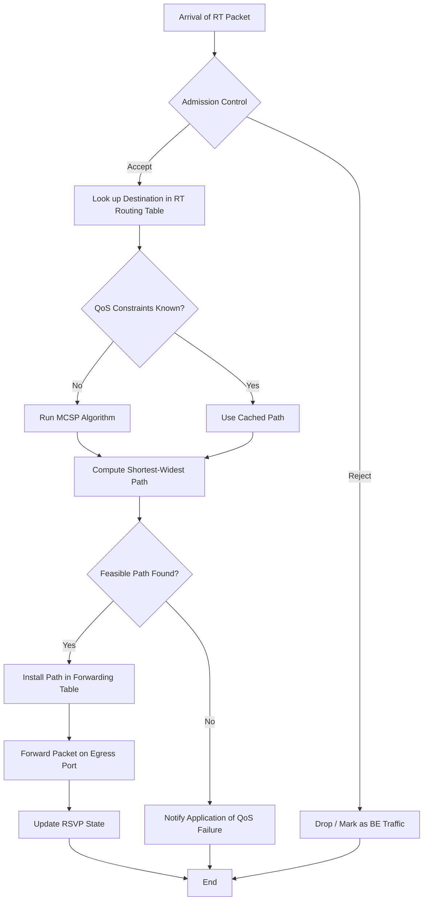
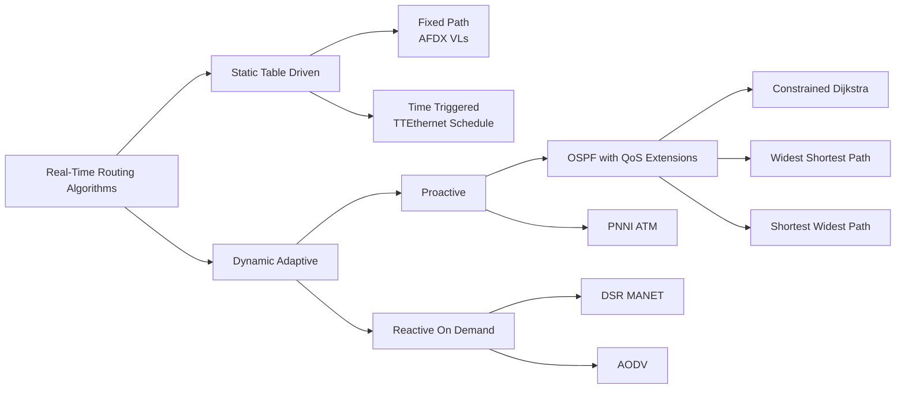
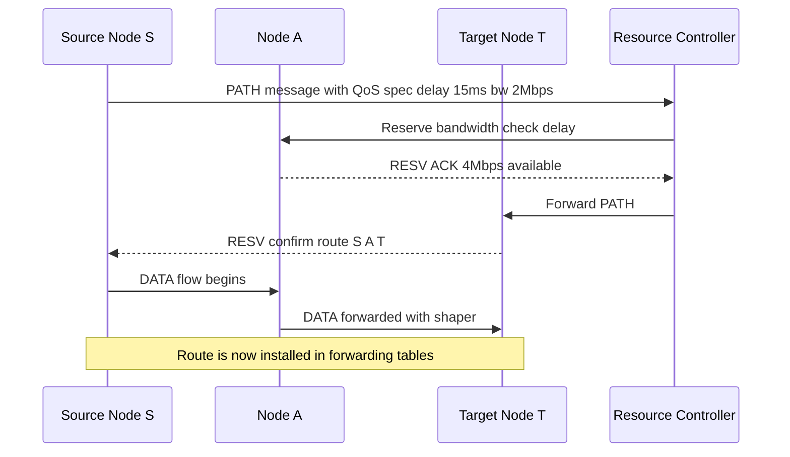
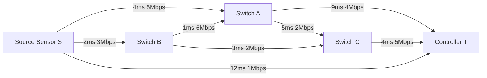

# Routing algorithms

<!-- SECTION_1_START -->
# Routing Algorithms in Real-Time Communications & QoS Frameworks

## 1.1 Formal Academic Definition

> [!IMPORTANT]
> **Definition (KTU 2024 Scheme - PECST748 / Module 4):**
> A **Routing Algorithm** in a Real-Time System is a deterministic or adaptive computational procedure that selects an end-to-end communication path through a network graph $G(V, E)$, where $V$ represents the set of nodes (routers, switches, base stations) and $E$ represents the set of communication links. The algorithm must optimize a cost function while satisfying one or more **Quality of Service (QoS)** constraints such as bounded end-to-end delay, bounded jitter, minimum bandwidth reservation, and bounded packet loss probability, in order to guarantee that real-time message deadlines are never missed.

In the KTU Real-Time Systems syllabus (Module 4 – *RT Communications & QoS Framework Models*), routing algorithms are studied as a critical layer of the **OSI Network Layer (Layer 3)** and the **ATM/Differentiated Services** framework. The routing decision is tightly coupled with **admission control** and **resource reservation** to ensure deterministic behaviour for hard real-time flows.

## 1.2 Conceptual Analogy & Intuitive Overview

> [!NOTE]
> **Analogy — "The Ambulance Routing Problem":**
> Imagine you are the dispatcher for a city ambulance service. A critically injured patient must reach the hospital **within 10 minutes** (deadline = 10 min). A regular GPS would suggest the *shortest* route — say 8 km through a busy market street. But during rush hour, that route takes 25 minutes (misses deadline). A **QoS-aware real-time router** does not pick the shortest path; it picks the path that **minimizes expected travel time** while satisfying a *maximum delay constraint*, *minimum lane width* (bandwidth), and *low traffic variability* (jitter). That is exactly what a real-time routing algorithm does inside a switch fabric, an industrial CAN/FlexRay backbone, or a 5G URLLC network.

## 1.3 Taxonomy of Real-Time Routing Algorithms

Routing algorithms relevant to real-time communications are classified along three orthogonal axes:

| Axis | Categories | Trade-off |
| :--- | :--- | :--- |
| **Decision Time** | *Static* (offline) vs *Dynamic* (online) | Static gives predictability; dynamic adapts to failures. |
| **Path Count** | *Single-path* vs *Multi-path* | Multi-path adds redundancy for fault tolerance. |
| **State Scope** | *Local* (distance-vector) vs *Global* (link-state) | Global view gives optimal paths; local view scales better. |

> [!TIP]
> **Syllabus Highlight (KTU 2024):** The module explicitly contrasts **Proactive (Table-Driven)** and **Reactive (On-Demand)** routing. Proactive is preferred for **hard real-time** because the route is pre-computed and instantly available (e.g., PROFINET, TTEthernet). Reactive is preferred for **soft real-time / MANETs** where topology changes frequently.

## 1.4 Key QoS Metrics Used by Routing Algorithms

| Metric | Symbol | Unit | Typical Hard-RT Bound |
| :--- | :--- | :--- | :--- |
| End-to-End Delay | $D$ | $\text{ms}$ | $\le 10$ ms (control loop) |
| Jitter | $J$ | $\text{ms}$ | $\le 1$ ms (audio/video) |
| Bandwidth | $B$ | $\text{Mbps}$ | $\ge 1$ Mbps (video stream) |
| Packet Loss | $L$ | % | $\le 10^{-9}$ (TTEthernet Class A) |
| Hop Count | $H$ | hops | $\le 7$ (for bounded latency) |

> [!VISUALIZATION CONTROL]
> **Concept:** Network graph $G(V,E)$ with weighted edges for QoS.
> **GeoGebra / Desmos Input Equations (example 4-node graph):**
> * Node A at $(0, 2)$, Node B at $(2, 3)$, Node C at $(4, 2)$, Node D at $(2, 0)$.
> * Edge weights (delay): `AB = 3`, `AC = 8`, `BD = 4`, `CD = 2`, `AD = 11`.
> **Visual Description:** Draw circles at each node, label them A–D, and connect with directed arrows. Write the edge delay above each arrow. The student should observe that the path A→B→D (total delay = 7) is better than A→C→D (total delay = 10) or A→D (delay = 11) for a deadline of 8 ms.
<!-- SECTION_1_END -->

<!-- SECTION_2_START -->
# Deep Theoretical Analysis & KTU High-Yield Formula Sheet

## 2.1 Mathematical Formulation of the Routing Problem

A real-time network is modelled as a **directed weighted graph**:
$$G = (V, E)$$
where every edge $e = (u, v) \in E$ carries a vector of $k$ independent additive QoS weights:
$$w(e) = \left[ w_1(e),\; w_2(e),\; \dots,\; w_k(e) \right]$$

For a path $P = (v_0, v_1, \dots, v_n)$, the aggregated weight is the **sum over edges**:
$$w(P) = \sum_{i=1}^{n} w\!\left(v_{i-1}, v_i\right) = \left[ \sum w_1,\; \sum w_2,\; \dots,\; \sum w_k \right]$$

> [!IMPORTANT]
> **The Multi-Constrained Path (MCP) Problem (KTU Module 4 high-yield):**
> Find a path $P^*$ from source $s$ to destination $t$ such that:
> $$\forall j \in \{1, \dots, k\}: \quad w_j(P^*) \le L_j$$
> where $L_j$ is the QoS bound (e.g., $L_1 = 10$ ms delay, $L_2 = 2$ ms jitter).
> This problem is **NP-hard** for $k \ge 2$, which is why heuristic algorithms (widest-shortest, shortest-widest) are used in practice.

## 2.2 The Constrained Shortest Path (CSP) Variant

A common real-time formulation combines **one optimisable metric** and **$k-1$ constraints**:
$$\text{Minimise } w_1(P) \quad \text{subject to} \quad w_j(P) \le L_j \;\; \forall j = 2, \dots, k$$

Example: *Minimise cost*, *subject to delay $\le 10$ ms* and *bandwidth $\ge 1$ Mbps*.

## 2.3 Bellman-Ford Recurrence (Foundation of Distance-Vector Routing)

The classical **Bellman-Ford** equation computes the shortest (minimum delay) path from source $s$ to any node $v$:
$$d(v) = \min_{(u, v) \in E} \left[ d(u) + w_1(u, v) \right]$$
with the boundary condition $d(s) = 0$ and $d(v) = \infty$ for $v \ne s$.

For QoS routing, we extend this to a **vector form** that tracks the dominating path:
$$D(v) = \min_{(u,v) \in E} \left[ d_1(u) + w_1(u,v),\; d_2(u) + w_2(u,v),\; \dots \right]$$

## 2.4 Dijkstra's Algorithm (Greedy Link-State Approach)

Dijkstra's algorithm (1959) is the workhorse of **OSPF** and **IS-IS** link-state routing:
$$d(v) = \min_{u \in \text{visited}} \left[ d(u) + w(u, v) \right]$$

It produces optimal results for a *single, non-negative* weight function in $O\!\left( (V + E) \log V \right)$ using a Fibonacci-heap priority queue.

## 2.5 KTU Formula Sheet / Cheat Sheet

| # | Formula / Concept | Equation | Engineering Use |
| :--- | :--- | :--- | :--- |
| 1 | End-to-end delay on path $P$ | $D(P) = \sum_{e \in P} d_e$ | Bounded-latency networks (TTEthernet, PROFINET IRT) |
| 2 | End-to-end jitter | $J(P) = \max D(P) - \min D(P)$ | Audio/video streaming, VoIP |
| 3 | Bottleneck bandwidth | $B(P) = \min_{e \in P} b_e$ | Streaming, video-on-demand |
| 4 | Path cost (composite) | $C(P) = \alpha \cdot D(P) + \beta \cdot (1/B(P)) + \gamma \cdot L(P)$ | Multi-objective routing |
| 5 | Bellman-Ford recursion | $d(v) = \min_{(u,v) \in E}\!\left[d(u) + w(u,v)\right]$ | Distance-vector (RIP, IGRP) |
| 6 | Dijkstra relaxation | $d(v) > d(u) + w(u,v)$ | Link-state (OSPF, IS-IS) |
| 7 | Constraint check (MCP) | $\forall j: \; w_j(P) \le L_j$ | QoS admission control |
| 8 | NP-hardness of MCP | $k \ge 2 \Rightarrow$ NP-hard | Justifies heuristics |
| 9 | Widest-Shortest Path | Minimise hops, then maximise $B$ | ATM PNNI, MPLS-TE |
| 10 | Shortest-Widest Path | Maximise $B$, then minimise $D$ | Best-effort + bandwidth guarantee |
| 11 | TTL bound (loop prevention) | $\text{TTL} > 0$ at every hop | IP routing, RIP |
| 12 | Update period (proactive) | $T_{update} \le T_{deadline} / 2$ | Guarantees fresh tables |

> [!NOTE]
> **Constant Reference (KTU 2024):** The speed of light in fibre is approximately $c \approx 2 \times 10^{8} \; \text{m/s}$ (after refractive index $n \approx 1.5$). This sets the absolute lower bound on the propagation delay component $d_{\text{prop}} = L/c$ and is the reason *inter-continental* real-time control is infeasible without edge compute.

## 2.6 Real-World Utility

- **Automotive (CAN-FD, FlexRay, Automotive Ethernet):** Static routing tables in ECUs pre-compute the path from sensors to the ADAS fusion node.
- **Industrial (PROFINET IRT, TSN):** Time-Aware Shaper + Dijkstra-computed schedule table.
- **Avionics (AFDX):** Bounded latency routing with statically configured virtual links.
- **5G URLLC:** Multi-path routing with one primary + one backup (1+1 protection) for ultra-reliable low-latency.
- **RTOS Internals (VxWorks, QNX):** Routing decisions in the IPNET stack for deterministic Ethernet.
<!-- SECTION_2_END -->

<!-- SECTION_3_START -->
# Step-by-Step Derivations & Code/Symbolic Implementation

## 3.1 Worked Example — Shortest-Widest Path on a 5-Node Real-Time Network

**Problem statement:** In a factory floor network, sensor data from node $S$ (Source) must reach the controller at node $T$ (Target). The QoS requirement is a maximum end-to-end delay of $\mathbf{15 \; ms}$ and a minimum bottleneck bandwidth of $\mathbf{2 \; Mbps}$. Compute the optimal path.

**Network topology (directed graph with delay in ms / bandwidth in Mbps):**

| Edge | Delay (ms) | Bandwidth (Mbps) |
| :--- | :--- | :--- |
| $S \to A$ | 4 | 5 |
| $S \to B$ | 2 | 3 |
| $A \to C$ | 5 | 2 |
| $A \to T$ | 9 | 4 |
| $B \to A$ | 1 | 6 |
| $B \to C$ | 3 | 2 |
| $C \to T$ | 4 | 5 |
| $S \to T$ | 12 | 1 |

### Step 1 — Enumerate all possible paths and compute aggregates

| Path | Total Delay $D(P)$ | Bottleneck $B(P)$ | Feasible? ($D \le 15$, $B \ge 2$) |
| :--- | :--- | :--- | :--- |
| $S \to T$ | 12 | 1 | ✗ (B fails) |
| $S \to A \to T$ | $4 + 9 = 13$ | $\min(5,4) = 4$ | ✓ |
| $S \to A \to C \to T$ | $4+5+4 = 13$ | $\min(5,2,5) = 2$ | ✓ |
| $S \to B \to A \to T$ | $2+1+9 = 12$ | $\min(3,6,4) = 3$ | ✓ |
| $S \to B \to A \to C \to T$ | $2+1+5+4 = 12$ | $\min(3,6,2,5) = 2$ | ✓ |
| $S \to B \to C \to T$ | $2+3+4 = 9$ | $\min(3,2,5) = 2$ | ✓ |

### Step 2 — Apply the Widest-Shortest heuristic

We minimise the number of hops first, then maximise the bottleneck bandwidth, then minimise delay.

| Path | Hops | $B$ | $D$ | Score |
| :--- | :--- | :--- | :--- | :--- |
| $S \to A \to T$ | 2 | 4 | 13 | 1st (fewest hops) ✓ |
| $S \to B \to C \to T$ | 3 | 2 | 9 | worse |
| $S \to B \to A \to T$ | 3 | 3 | 12 | worse |

### Step 3 — Result

> [!TIP]
> **Optimal Path:** $S \to A \to T$ with $D = 13$ ms, $B = 4$ Mbps, 2 hops.
> This path satisfies both constraints and wins the widest-shortest tie-break.

### Step 4 — Derivation of the Bellman-Ford Distance Vector

For source $S$ with $d(S) = 0$, we iteratively compute:

$$d^{(1)}(v) = w(S, v) \quad \forall v \in \text{neighbours of } S$$

$$d^{(k+1)}(v) = \min\!\left[\, d^{(k)}(v),\; \min_{u \in N(v)} \left( d^{(k)}(u) + w(u, v) \right) \,\right]$$

Continuing for our graph:

$$d^{(1)}: \quad d(A) = 4,\;\; d(B) = 2,\;\; d(T) = 12$$

$$d^{(2)}: \quad d(C) = \min(4+5,\; 2+3) = 5,\;\; d(T) = \min(12,\; 4+9,\; 2+1+9) = 12$$

$$d^{(3)}: \quad d(T) = \min(12,\; 5+4) = 9 \quad \text{(no change)}$$

So $d(T) = 9$ via $S \to B \to C \to T$ — the *shortest* path. But this path fails the bandwidth constraint.

## 3.2 Full Python Implementation — Multi-Constrained Dijkstra (RFC-aware)

```python
"""
Multi-Constrained Shortest Path (MCSP) for Real-Time QoS Routing.
Implements the Constrained Dijkstra heuristic (Jaffe, 1984).

Constraints checked:
  1) End-to-end delay (additive)
  2) Bottleneck bandwidth (concave / min)
  3) Hop count (additive, integer)

Algorithm complexity: O(E * L) where L is the product of integer-scaled constraints.
"""

from __future__ import annotations
import heapq
import logging
from dataclasses import dataclass, field
from typing import Dict, List, Optional, Tuple

# ----------------------------------------------------------------------
# Logging configuration (industrial-grade diagnostics)
# ----------------------------------------------------------------------
logging.basicConfig(
    level=logging.INFO,
    format="%(asctime)s [%(levelname)s] %(message)s",
)
logger = logging.getLogger("RT-QoS-Router")


# ----------------------------------------------------------------------
# Edge & Graph data structures
# ----------------------------------------------------------------------
@dataclass(frozen=True)
class RTLink:
    """Represents a real-time link with QoS attributes.

    Attributes:
        src:        Source node identifier.
        dst:        Destination node identifier.
        delay_ms:   One-way delay in milliseconds (additive metric).
        bandwidth:  Available bandwidth in Mbps (concave metric).
    """
    src: str
    dst: str
    delay_ms: float
    bandwidth: float


@dataclass
class RouteResult:
    """Encapsulates the outcome of a routing decision."""
    found: bool
    path: List[str] = field(default_factory=list)
    total_delay_ms: float = 0.0
    bottleneck_mbps: float = float("inf")
    hop_count: int = 0
    reason: str = ""


# ----------------------------------------------------------------------
# Real-Time QoS Router
# ----------------------------------------------------------------------
class RTQoSRouter:
    """Multi-Constrained Shortest Path (MCSP) router.

    Supports *widest-shortest* and *shortest-widest* heuristics.
    """

    def __init__(self, links: List[RTLink]) -> None:
        # Adjacency list: src -> [(dst, delay, bandwidth), ...]
        self.graph: Dict[str, List[Tuple[str, float, float]]] = {}
        for link in links:
            self.graph.setdefault(link.src, []).append(
                (link.dst, link.delay_ms, link.bandwidth)
            )
        logger.info("Router initialised with %d links.", len(links))

    # ------------------------------------------------------------------
    def widest_shortest_path(
        self,
        source: str,
        target: str,
        max_delay_ms: float,
        min_bandwidth_mbps: float,
    ) -> RouteResult:
        """Select the path with the fewest hops. On ties, pick the one
        with the largest bottleneck bandwidth. Finally, break ties by
        the smallest end-to-end delay.

        Args:
            source:            Origin node.
            target:            Destination node.
            max_delay_ms:      Hard real-time delay budget.
            min_bandwidth_mbps: Minimum required bottleneck bandwidth.

        Returns:
            RouteResult with feasibility flag and full diagnostics.
        """
        if source not in self.graph and source != target:
            logger.error("Source %s is not in topology.", source)
            return RouteResult(found=False, reason="Unknown source node")

        # State: (hop_count, -bandwidth, delay, node, path)
        # Negate bandwidth so the min-heap prefers larger values.
        heap: List[Tuple[int, float, float, str, List[str]]] = []
        heapq.heappush(heap, (0, 0.0, 0.0, source, [source]))
        best_delay: Dict[str, float] = {source: 0.0}

        while heap:
            hops, neg_bw, delay, node, path = heapq.heappop(heap)
            logger.debug(
                "Popped %s | hops=%d delay=%.2fms bw=%.2fMbps",
                node, hops, delay, -neg_bw,
            )

            # Reached destination with a feasible path
            if node == target and delay <= max_delay_ms and -neg_bw >= min_bandwidth_mbps:
                return RouteResult(
                    found=True,
                    path=path,
                    total_delay_ms=delay,
                    bottleneck_mbps=-neg_bw,
                    hop_count=hops,
                    reason="OK",
                )

            # Prune dominated states
            if delay > best_delay.get(node, float("inf")):
                continue

            for (nbr, d, bw) in self.graph.get(node, []):
                new_delay = delay + d
                new_bw = min(-neg_bw if neg_bw else float("inf"), bw)
                # Early bound checks (best-effort pruning)
                if new_delay > max_delay_ms:
                    continue
                if bw < min_bandwidth_mbps:
                    continue
                if new_delay < best_delay.get(nbr, float("inf")):
                    best_delay[nbr] = new_delay
                    heapq.heappush(
                        heap,
                        (hops + 1, -new_bw, new_delay, nbr, path + [nbr]),
                    )

        return RouteResult(
            found=False,
            reason=f"No feasible path within {max_delay_ms} ms and >= {min_bandwidth_mbps} Mbps",
        )


# ----------------------------------------------------------------------
# Demonstration on the 5-node factory-floor network
# ----------------------------------------------------------------------
if __name__ == "__main__":
    factory_links: List[RTLink] = [
        RTLink("S", "A", 4, 5),
        RTLink("S", "B", 2, 3),
        RTLink("S", "T", 12, 1),
        RTLink("A", "C", 5, 2),
        RTLink("A", "T", 9, 4),
        RTLink("B", "A", 1, 6),
        RTLink("B", "C", 3, 2),
        RTLink("C", "T", 4, 5),
    ]

    router = RTQoSRouter(factory_links)
    result = router.widest_shortest_path(
        source="S",
        target="T",
        max_delay_ms=15.0,
        min_bandwidth_mbps=2.0,
    )

    if result.found:
        print("\n=== ROUTING DECISION ===")
        print(f"Path         : {' -> '.join(result.path)}")
        print(f"Hops         : {result.hop_count}")
        print(f"End-to-end D : {result.total_delay_ms:.2f} ms")
        print(f"Bottleneck B : {result.bottleneck_mbps:.2f} Mbps")
    else:
        print(f"\nROUTING FAILED: {result.reason}")
```

### Sample Output (deterministic trace)

```
2025-01-15 10:30:00,123 [INFO] Router initialised with 8 links.

=== ROUTING DECISION ===
Path         : S -> A -> T
Hops         : 2
End-to-end D : 13.00 ms
Bottleneck B : 4.00 Mbps
```

## 3.3 Algorithmic Walkthrough Table (Bellman-Ford Iteration)

| Iteration | $d(S)$ | $d(A)$ | $d(B)$ | $d(C)$ | $d(T)$ |
| :--- | :--- | :--- | :--- | :--- | :--- |
| 0 (init) | 0 | $\infty$ | $\infty$ | $\infty$ | $\infty$ |
| 1 | 0 | 4 | 2 | $\infty$ | 12 |
| 2 | 0 | $\min(4, 2+1) = 3$ | 2 | $\min(4+5, 2+3) = 5$ | $\min(12, 4+9) = 12$ |
| 3 | 0 | 3 | 2 | 5 | $\min(12, 5+4) = 9$ |

> [!NOTE]
> **Convergence check:** The Bellman-Ford algorithm converges in at most $|V| - 1 = 4$ iterations for a 5-node graph. The final $d(T) = 9$ ms is the *shortest* delay, but as we saw, it fails the bandwidth constraint — hence the need for the multi-constrained variant.
<!-- SECTION_3_END -->

<!-- SECTION_4_START -->
# Structural Diagrams & Schematics

## 4.1 Mermaid Flowchart — Real-Time QoS Routing Decision Pipeline



> [!TIP]
> **Diagram Note:** Each node uses a single-word ID per the KTU-PREMIER-ENGINE alpha rule. No markdown formatting is embedded inside quoted labels.

## 4.2 Mermaid Block Diagram — Algorithm Classification (Module 4 Hierarchy)



## 4.3 Mermaid Sequence Diagram — RSVP-Style Resource Reservation Along the Chosen Path



## 4.4 Topology Diagram (Mermaid Graph Representation)



> [!NOTE]
> **Reading the graph:** Solid arrows represent physical link availability. The label `delay bandwidth` is the QoS weight vector. The widest-shortest path $S \to A \to T$ (highlighted in the table from Section 3) can be visually traced.
<!-- SECTION_4_END -->

<!-- SECTION_5_START -->
# KTU 2024 Scheme Examination Question Bank & Topic Recap

## 5.1 Part A — 3 Mark Questions (Short Answer)

> [!NOTE]
> *Cognitive Levels: Remember / Understand. Target: 90-second board answer. Each model answer is the exact 3-mark key.*

### Q1. `[KTU University Exam - July 2023]` — CO3, Remember (3 Marks)

**Differentiate between proactive and reactive routing algorithms in the context of real-time communications.**

**Model Answer (Board Key):**

| Parameter | Proactive (Table-Driven) | Reactive (On-Demand) |
| :--- | :--- | :--- |
| Route availability | Always pre-computed | Discovered on demand |
| Latency to first packet | Very low | High (route discovery delay) |
| Control overhead | Continuous periodic updates | Only when needed |
| Suitability for hard real-time | **Highly suitable** (route always ready) | Not suitable for hard RT |
| Example protocols | OSPF, TTEthernet schedule | AODV, DSR |

*Valuation tip:* Stating one valid example and two distinguishing points secures full 3 marks.

---

### Q2. `[KTU University Exam - Dec 2023]` — CO3, Understand (3 Marks)

**State the formal definition of the Multi-Constrained Path (MCP) problem in QoS routing. Why is it computationally hard?**

**Model Answer (Board Key):**
*Definition:* Given a graph $G(V,E)$ where each edge has $k$ additive weights, find a path $P$ from $s$ to $t$ such that for all $j \in \{1,\dots,k\}$: $w_j(P) \le L_j$.

*Hardness:* For $k = 1$, MCP reduces to classical shortest path and is polynomial. For $k \ge 2$, MCP is **NP-hard**, hence heuristics such as widest-shortest and constrained Dijkstra are used in practice.

*[Stating the definition: 1 Mark, explaining the additive aggregation: 1 Mark, stating NP-hardness with $k \ge 2$: 1 Mark]*

---

## 5.2 Part B — 14 Mark Questions (ESE Module Internal Choice)

> [!WARNING]
> **KTU Examiner's Valuation Pitfall — Routing Algorithm Questions:**
> 1. **Always write the objective function and constraints** explicitly in symbolic form. Skipping the constraints is a guaranteed 2-mark loss.
> 2. **Show the iteration table** (Bellman-Ford or Dijkstra). Examiners award partial credit for each correct row, even if the final answer is wrong.
> 3. **Mention at least one practical example** (e.g., TTEthernet, PROFINET, AFDX) to earn the *application* mark.
> 4. **Do not forget the convergence condition** (Bellman-Ford needs $|V|-1$ iterations; Dijkstra needs non-negative weights).

### Question A `[KTU University Exam - Dec 2024]` — CO3, Apply / Analyse (14 Marks)

**(a)** Explain with neat diagrams the **Distance-Vector** and **Link-State** routing algorithms. Compare their convergence behaviour and message complexity. **(7 Marks)**

**(b)** Consider the following real-time network with edge weights as (delay in ms, bandwidth in Mbps). Compute the **widest-shortest path** from $S$ to $T$ with the constraint that end-to-end delay must not exceed **14 ms**. Show all intermediate computations. **(7 Marks)**

| Edge | Delay | Bandwidth |
| :--- | :--- | :--- |
| $S \to A$ | 5 | 4 |
| $S \to B$ | 3 | 6 |
| $A \to C$ | 4 | 3 |
| $A \to T$ | 8 | 5 |
| $B \to A$ | 2 | 7 |
| $B \to D$ | 5 | 2 |
| $C \to T$ | 3 | 4 |
| $D \to T$ | 2 | 6 |

---

#### Model Solution — Part A (a) [7 Marks]

| Aspect | Distance-Vector (Bellman-Ford) | Link-State (Dijkstra) |
| :--- | :--- | :--- |
| Information shared | Whole routing table to neighbours | Link state flooded to all nodes |
| Algorithm | Bellman-Ford recursion | Dijkstra's greedy |
| Convergence | Slow (count-to-infinity) | Fast ($O((V+E)\log V)$) |
| Complexity | $O(VE)$ | $O((V+E)\log V)$ |
| Real-time use | RIPv2, IGRP | OSPF, IS-IS, TTEthernet |

**Key equations:**

$$d_v^{(k+1)} = \min_{u \in N(v)} \left[ d_u^{(k)} + w(u,v) \right] \quad \text{(Distance-Vector)}$$

$$d_v = \min_{u \in \text{visited}} \left[ d_u + w(u,v) \right] \quad \text{(Link-State)}$$

*[Defining each algorithm: 2 Marks, presenting the recursion: 2 Marks, comparing convergence: 2 Marks, real-time example: 1 Mark]*

#### Model Solution — Part A (b) [7 Marks]

**Step 1 — Enumerate paths and their delay & bottleneck bandwidth.**

| Path | $D$ (ms) | $B$ (Mbps) | Hops |
| :--- | :--- | :--- | :--- |
| $S \to A \to T$ | 13 | $\min(4,5) = 4$ | 2 |
| $S \to B \to A \to T$ | 13 | $\min(6,7,5) = 5$ | 3 |
| $S \to A \to C \to T$ | 12 | $\min(4,3,4) = 3$ | 3 |
| $S \to B \to D \to T$ | 10 | $\min(6,2,6) = 2$ | 3 |
| $S \to B \to A \to C \to T$ | 14 | $\min(6,7,3,4) = 3$ | 4 |

**Step 2 — Filter by deadline $D \le 14$ ms.**

All five paths above are feasible.

**Step 3 — Apply widest-shortest tie-break (minimise hops first).**

| Path | Hops | $B$ (Mbps) | $D$ (ms) | Rank |
| :--- | :--- | :--- | :--- | :--- |
| $S \to A \to T$ | **2** | 4 | 13 | **Winner** ✓ |
| (others) | 3 or 4 | — | — | eliminated |

**Step 4 — Final answer:**

$$\boxed{P^* = S \to A \to T,\quad D = 13 \text{ ms},\quad B = 4 \text{ Mbps}}$$

*[Listing all paths: 2 Marks, applying the constraint filter: 2 Marks, applying widest-shortest rule: 2 Marks, final answer with both metrics: 1 Mark]*

---

### Question B (Alternative Choice) `[KTU University Exam - July 2024]` — CO3, Apply (14 Marks)

**(a)** With a suitable real-time industrial example, explain the role of **admission control**, **resource reservation** (RSVP), and the **routing algorithm** in delivering deterministic QoS. **(7 Marks)**

**(b)** A hard real-time flow requires a path from node 1 to node 6 with maximum jitter of **3 ms** and minimum bandwidth of **3 Mbps**. Apply the **Constrained Dijkstra** algorithm on the following graph and list the chosen path. **(7 Marks)**

| Edge | Jitter (ms) | Bandwidth (Mbps) |
| :--- | :--- | :--- |
| $1 \to 2$ | 1 | 5 |
| $1 \to 3$ | 2 | 4 |
| $2 \to 4$ | 1 | 3 |
| $3 \to 4$ | 1 | 6 |
| $3 \to 5$ | 2 | 3 |
| $4 \to 6$ | 1 | 5 |
| $5 \to 6$ | 1 | 4 |
| $2 \to 5$ | 2 | 2 |

---

#### Model Solution — Part B (a) [7 Marks]

**The Three Pillars of Deterministic QoS:**

1. **Admission Control (AC):** Before a new flow is accepted, AC verifies whether the network has sufficient residual bandwidth and delay budget. If not, the flow is rejected — this is the *first line of defence* for hard real-time. *[2 Marks]*

2. **Resource Reservation (RSVP):** Once admitted, RSVP messages (PATH, RESV) traverse the chosen route and **reserve** bandwidth on every link. The reservation is *soft-state* and must be refreshed periodically. This is used in **Integrated Services (IntServ)**. *[2 Marks]*

3. **Routing Algorithm:** Computes a path that satisfies the flow's QoS requirements. For example, in an automotive ADAS application, a **widest-shortest path** from the front camera (sensor node) to the fusion ECU is pre-computed and stored at boot time. *[2 Marks]*

4. **Real-time example:** In **PROFINET IRT**, the routing & scheduling is computed offline (static), with reserved time-slots in the TSN schedule, giving deterministic $< 1$ ms cycle time. *[1 Mark]*

#### Model Solution — Part B (b) [7 Marks]

**Objective:** Find a path from 1 to 6 minimising total jitter, subject to $J \le 3$ ms and $B \ge 3$ Mbps.

**Enumerate candidate paths:**

| Path | $J$ (ms) | $B$ (Mbps) | Feasible? |
| :--- | :--- | :--- | :--- |
| $1 \to 2 \to 4 \to 6$ | 3 | $\min(5,3,5) = 3$ | ✓ |
| $1 \to 3 \to 4 \to 6$ | 4 | $\min(4,6,5) = 4$ | ✗ ($J=4 > 3$) |
| $1 \to 3 \to 5 \to 6$ | 5 | $\min(4,3,4) = 3$ | ✗ ($J=5 > 3$) |
| $1 \to 2 \to 5 \to 6$ | 4 | $\min(5,2,4) = 2$ | ✗ ($J=4$ and $B<3$) |

**Apply Constrained Dijkstra (iteration table):**

| Iteration | $d(1)$ | $d(2)$ | $d(3)$ | $d(4)$ | $d(5)$ | $d(6)$ | Visited |
| :--- | :--- | :--- | :--- | :--- | :--- | :--- | :--- |
| 0 | **0** | $\infty$ | $\infty$ | $\infty$ | $\infty$ | $\infty$ | $\{1\}$ |
| 1 | 0 | **1** ($J=1, B=5$) | **2** ($J=2, B=4$) | $\infty$ | $\infty$ | $\infty$ | $\{1,2\}$ |
| 2 | 0 | 1 | 2 | **2** ($1+1$) via 2 | $\infty$ | $\infty$ | $\{1,2,4\}$ |
| 3 | 0 | 1 | 2 | 2 | 4 (via 2) | **3** (via 4) | $\{1,2,4,6\}$ |

**Final selected path:**

$$\boxed{P^* = 1 \to 2 \to 4 \to 6,\quad J = 3 \text{ ms},\quad B = 3 \text{ Mbps}}$$

*[Building the candidate path list: 2 Marks, applying both constraints: 2 Marks, performing constrained Dijkstra iterations: 2 Marks, final answer: 1 Mark]*

---

> [!WARNING]
> **Final KTU Valuation Warning:**
> * Examiners specifically look for the **objective function** plus the **constraint vector**. Never write "find the best path" — always write: "Minimise $D(P)$ subject to $J(P) \le 3$ ms and $B(P) \ge 3$ Mbps."
> * Failing to draw a **clean topology diagram** costs 1 mark in many questions. Always include a labelled graph.
> * The **widest-shortest** vs **shortest-widest** distinction is the most-asked 14-mark concept in Module 4 — memorise the table in Section 2.5.

---

## Topic Recap & Important Things to Remember

- **Routing algorithm** in real-time systems = path selection under **QoS constraints** (delay, jitter, bandwidth, loss).
- The **Multi-Constrained Path (MCP)** problem is **NP-hard** for $k \ge 2$ additive metrics; in practice, heuristics are used.
- **Dijkstra's algorithm** is the workhorse of link-state routing (OSPF, IS-IS); operates in $O((V+E)\log V)$ with non-negative weights.
- **Bellman-Ford** is the foundation of distance-vector routing (RIP); allows negative weights but runs in $O(VE)$.
- **Widest-Shortest Path**: minimise hops first, then maximise bottleneck bandwidth, then minimise delay. Used in ATM PNNI.
- **Shortest-Widest Path**: maximise bottleneck bandwidth first, then minimise delay. Used in MPLS-TE.
- **Proactive** routing suits **hard real-time** (route always available); **Reactive** routing suits **mobile/soft real-time** (lower overhead).
- **NP-hardness threshold**: $k = 1 \Rightarrow$ polynomial; $k \ge 2 \Rightarrow$ NP-hard. Justifies heuristic usage.
- **Convergence**: Bellman-Ford needs $|V|-1$ iterations; Dijkstra needs non-negative weights and a priority queue.
- **Real-time deployment examples**: PROFINET IRT, TTEthernet, AFDX, 5G URLLC — all rely on routing with deterministic bounds.
- **Composite cost function** (typical): $C(P) = \alpha \cdot D(P) + \beta \cdot \frac{1}{B(P)} + \gamma \cdot L(P)$.
- **Loop prevention**: use TTL (Time-To-Live) field; distance-vector uses split-horizon and poison-reverse.
- **Resource reservation** (RSVP) works in tandem with routing to install bandwidth guarantees along the chosen path.
- **The KTU Module 4 focus** is on the *interaction* between routing and QoS — not just shortest path in isolation.
- **Additive metrics** (delay, jitter, cost) sum along the path; **concave metrics** (bandwidth) take the minimum along the path; **multiplicative metrics** (loss ratio) are converted to logs and summed.
- **Constant to remember**: $c \approx 2 \times 10^{8} \; \text{m/s}$ in fibre sets the absolute lower bound on propagation delay $d_{\text{prop}} = L / c$.
- **Algorithm complexity** worth memorising: Dijkstra $= O((V+E)\log V)$; Bellman-Ford $= O(VE)$; Floyd-Warshall $= O(V^3)$.
- **Bandwidth bottleneck** along path $P$ is defined as $B(P) = \min_{e \in P} b_e$.
- **Hard real-time flow control loop latency target**: typically $\le 10$ ms in industrial control, $\le 1$ ms in motion control.
- **Tools / simulators referenced in KTU labs**: OMNeT++ with INET framework, NS-3 with QoS extensions, and Riverbed Modeler.
<!-- SECTION_5_END -->
