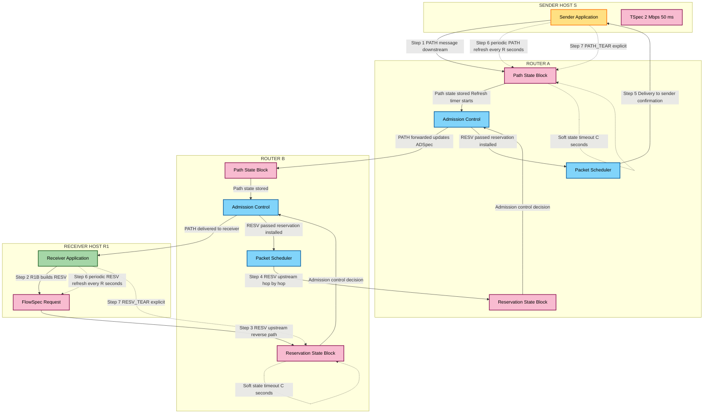
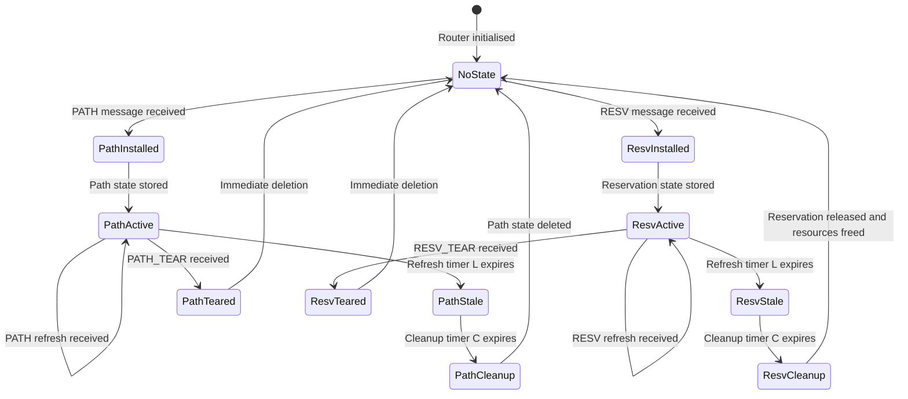
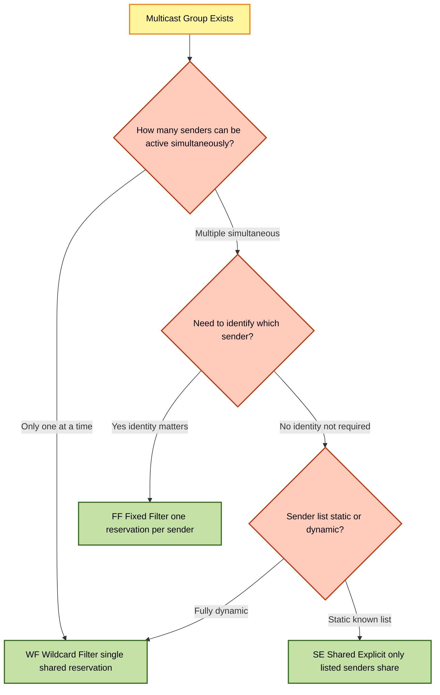

# RSVP

<!-- SECTION_1_START -->

# RSVP — Resource Reservation Protocol

## 1. Core Technical Definition

> [!NOTE]
> **Resource Reservation Protocol (RSVP)** is a network-control, **transport-layer signalling protocol** (defined originally in **RFC 2205**, 1997) that enables applications to request *dedicated end-to-end Quality of Service (QoS) guarantees* for real-time data flows across heterogeneous IP networks — particularly the **Integrated Services (IntServ)** architecture.

In the KTU 2024 Real-Time Systems context, RSVP is studied as a **receiver-oriented, simplex, soft-state resource reservation protocol** that works in conjunction with admission control, classification, policing, and scheduling modules inside each RSVP-capable router along the path between a sender and one or more receivers.

| Property | Value / Specification |
|---|---|
| RFC Standard | **RFC 2205** (original), **RFC 2209**, **RFC 2210**, **RFC 4495** |
| OSI Layer | Layer 7 (Application-layer signalling) carried over **IP protocol number 46** |
| Transport | **Raw IP datagrams** (no TCP/UDP; reliability handled by periodic refresh) |
| Direction | **Simplex** — reserves for one-way flow only |
| Initiator | **Receiver** initiates the reservation |
| State Type | **Soft State** — must be periodically refreshed |
| Routing | Uses **existing unicast/multicast routing tables** (does not perform routing) |
| Multicast Support | Native — supports **WF**, **FF**, **SE** reservation styles |
| Default Port | N/A (raw IP), control messages use **RSVP protocol number 46** |

## 2. Intuitive Analogy (The "Highway Lane Reservation" Model)

> [!IMPORTANT]
> **Think of RSVP like reserving a dedicated express lane on a highway for a VIP convoy.**

Imagine you are a Formula 1 race director (the **sender**) sending a race car (the **data flow**) from city A to city B. Normal traffic is chaotic — buses, trucks, scooters — exactly like a normal IP best-effort network.

- The **race director** sends a **scout car (PATH message)** racing ahead through every toll booth (router) to "check the road" and announce: *"A high-priority convoy is coming, what is your road capacity?"*
- At city B, the **team manager (receiver)** receives this scout's report, calculates how much bandwidth/lane-width is needed, and sends back an **official lane-painting truck (RESV message)**.
- Every toll booth on the return journey **physically reserves a dedicated lane** with controlled access (admission control).
- However, this reservation is **not permanent** — the lane markings must be **repainted every 30 seconds (refresh interval)**. If the scout car stops coming, the lane markings are slowly erased (soft state timeout), and the road returns to normal traffic.
- This way, **no permanent resources are wasted** if the convoy stops — but the convoy gets **guaranteed express-lane quality** while it is running.

## 3. RSVP in the QoS Framework Stack

> [!NOTE]
> **KTU Module 4 Mapping:** RSVP is the **signalling heart** of the IntServ model. It does not deliver data — it **negotiates the service contract** that the data flow will receive.

```
+----------------------------------------------------------+
|                  APPLICATION LAYER                         |
|   (VoIP, Video Conference, Tele-medicine, RTS Gaming)     |
+----------------------------------------------------------+
|              RSVP  --  SIGNALLING PLANE                   |
|   (PATH / RESV / ERROR / RESVCONF / TEARDOWN messages)    |
+----------------------------------------------------------+
|         QoS SERVICE MODELS (IntServ / DiffServ)           |
|   Admission Control | Classifier | Scheduler | Policer     |
+----------------------------------------------------------+
|           IP ROUTING (OSPF, BGP, PIM, etc.)               |
+----------------------------------------------------------+
|                  LINK LAYER                               |
+----------------------------------------------------------+
```

## 4. GeoGebra / Desmos Visualisation

> [!VISUALIZATION CONTROL]
> **Concept:** RSVP Path vs Reservation Bandwidth Consumption over time
>
> **GeoGebra / Desmos Input Equations:**
> * $f_{\text{PATH}}(t) = 2 \cdot \sin(t) + 30$    *(outgoing PATH probes — sender to receiver)*
> * $g_{\text{RESV}}(t) = 1.5 \cdot \cos(t) + 30$  *(returning reservation setup — receiver to sender)*
> * $h_{\text{refresh}}(t) = 0.5 \cdot \tanh(t) + 30$ *(periodic soft-state refresh — both directions)*
>
> **Visual Description:** The student should observe **two continuous sinusoidal-like signals** representing ongoing control message traffic. The refresh signal $h(t)$ is the **floor** beneath them — if it drops to **0 (the X-axis)**, the soft-state times out and the reservation is **torn down automatically**. In a healthy reservation, $h_{\text{refresh}}(t)$ never crosses the X-axis.

<!-- SECTION_1_END -->

<!-- SECTION_2_START -->

# Deep Theoretical Analysis & KTU High-Yield Formula Sheet

## 1. RSVP Operational Philosophy — 5 Core Principles

1. **Receiver-Initiated Reservation** — The data *receiver* (not the sender) is the one that requests resources. This supports heterogeneous receivers in multicast — each receiver can ask for a different QoS level.
2. **Simplex Flow** — RSVP reserves resources for **one direction only**. A two-way video call needs **two independent RSVP sessions** (one for video-down, one for audio-up, etc.).
3. **Soft State Maintenance** — Reservation state in routers has a **limited lifetime** unless refreshed. This makes RSVP **self-healing** against router crashes and route changes.
4. **Decoupling from Routing** — RSVP does **not** determine the path. It uses whatever unicast/multicast routing protocol (OSPF, PIM, etc.) the network already uses. The PATH message simply follows the routing tables.
5. **Multicast-Native Design** — First protocol designed to efficiently handle QoS for one-to-many and many-to-many group communications.

## 2. RSVP Message Types — The Complete Vocabulary

> [!IMPORTANT]
> The **KTU examiner expects students to know at least PATH and RESV in detail**, plus the classification of the other four.

| # | Message Type | Direction | Purpose | Trigger |
|---|---|---|---|---|
| 1 | **PATH** | Sender → Receiver(s) | Carries **sender traffic specs (TSpec)** and **advertises path characteristics (ADSpec)** | Sender starts transmitting |
| 2 | **RESV** (Reservation Request) | Receiver → Sender | Carries **flow descriptor (Rspec + Filter spec)** — actually reserves the resources | Receiver receives PATH |
| 3 | **PATH ERR** | Receiver → Sender | Reports a problem detected on the downstream path (e.g., service unsupported) | PATH failure |
| 4 | **RESV ERR** | Sender → Receiver | Reports failure of reservation (e.g., admission control denied) | RESV failure |
| 5 | **PATH TEAR** | Sender → Receiver | Immediately deletes path state and downstream reservations | Sender stops |
| 6 | **RESV TEAR** | Receiver → Sender | Immediately deletes reservation state in upstream routers | Receiver leaves |
| 7 | **RESV CONF** | Receiver → Sender | Confirms reservation acceptance back to the sender (optional) | If `RESV_CONFIRM` object was set |

## 3. RSVP Reservation Styles — KTU High-Yield Topic

> [!NOTE]
> Reservation styles determine **how multiple senders in a multicast group share resources**. This is one of the most asked KTU questions in Module 4.

| Style | Full Form | Sender Selection | Resource Sharing | Use Case |
|---|---|---|---|---|
| **WF** | **Wildcard Filter** | All senders | All senders **share one shared reservation** | Audio conference — only one person talks at a time |
| **FF** | **Fixed Filter** | Explicitly listed | **No sharing** — each sender gets a **distinct** reservation | Video conference — each speaker has a unique fixed bandwidth |
| **SE** | **Shared Explicit** | Explicitly listed subset | **Only listed senders share** one reservation | Mixed — specific active members share, others excluded |

**Rule of Thumb (must memorise):**
* **WF = "anyone can talk, total bandwidth = one speaker"** *(largest savings)*
* **FF = "each sender is independent"** *(zero sharing)*
* **SE = "selective sharing"** *(compromise between WF and FF)*

## 4. RSVP Soft State Mathematics — KTU Formula Sheet

> [!IMPORTANT]
> Below are the **canonical formulas** the KTU board may test in a numerical problem.

| Quantity | Formula | Units | Description |
|---|---|---|---|
| **Refresh Interval (R)** | $R = K \cdot S$ | seconds | $K$ = multiplier, $S$ = average packet size factor |
| **State Lifetime (L)** | $L = (K + 0.5) \cdot 1.5 \cdot R$ | seconds | Time before router declares state **stale** |
| **Cleanup Timer (C)** | $C = (K + 0.5) \cdot 3.5 \cdot R$ | seconds | Time after which state is **deleted** |
| **Local Repair Block** | $\Delta t_{\text{block}} = R \cdot 0.5$ | seconds | Half-refresh window after route change |
| **Number of Sessions** | $N_{\text{sess}} = N_{\text{flow}} \times 2$ | count | Each duplex flow needs 2 simplex sessions |
| **Bandwidth Reserved** | $B_{\text{res}} = \sum_{i=1}^{n} b_i \cdot \eta_i$ | bps | Sum of flow bandwidths times QoS multiplier $\eta$ |
| **Admissible Load** | $L_{\text{adm}} = \dfrac{C_{\text{link}} \cdot (1 - \rho_{\text{bg}})}{B_{\text{res}} \cdot f_{\text{burst}}}$ | sessions | $C_{\text{link}}$ = link capacity, $\rho_{\text{bg}}$ = background load, $f_{\text{burst}}$ = burst factor |
| **Effective Utilization** | $U_{\text{eff}} = \dfrac{B_{\text{res}} \cdot N_{\text{sess}}}{C_{\text{link}}}$ | ratio (0–1) | Must be $\leq 1$ for admissibility |

> [!NOTE]
> The **multiplier $K$** is typically **3** in default RSVP implementations. The **0.5 and 1.5** coefficients in $L$ and $C$ are RFC-defined to give state enough time to be **re-established across route changes** before being deleted.

## 5. RSVP vs Other Signalling Protocols — Real-World Utility

| Aspect | RSVP (IntServ) | RSVP-TE (MPLS) | LDP (Label Distribution) | SIP (Session Initiation) |
|---|---|---|---|---|
| Primary Use | End-to-end QoS | Traffic-engineered MPLS LSPs | MPLS label binding only | VoIP / multimedia session setup |
| Reservation | Per-flow | Per-LSP | Per-FEC | Per-call (port-based) |
| Scalability | Poor (per-flow state) | Better (per-aggregate) | Best | Per-call |
| KTU Relevance | **Highest** | High | Low | Medium |
| Deployment | Research / campus nets | Carrier backbone (e.g., Airtel) | Carrier backbone | Public Internet telephony |

**Real-World Utility in Engineering:**
* **VoIP (e.g., Cisco IP Telephony)** — Uses RSVP to guarantee voice packet delivery under 150 ms.
* **Tele-surgery (5G URLLC)** — RSVP concepts evolved into **5G QoS Flows** with hard QoS.
* **Industrial Automation (PROFINET, TSN)** — RSVP-style reservation used in **Time-Sensitive Networking (TSN)** Stream Reservation Protocol (SRP).
* **Defence Real-Time Networks** — Battlefield video feeds use RSVP-TE over MPLS.

<!-- SECTION_2_END -->

<!-- SECTION_3_START -->

# Step-by-Step Derivations & Code/Symbolic Implementation

## 1. Complete RSVP Operational Walkthrough — End-to-End

Let us trace a **single sender (S)** to **two receivers (R1, R2)** scenario across **3 routers (A, B, C)** in a multicast tree.

### Network Topology

```
        S (Sender)              [Traffic Spec: 1 Mbps video, 50 ms max delay]
         |
         v
       Router A  ----- Router B ----- Router C
         |              |               |
         v              v               v
        R1           R2 (multicast shared)
```

### Step 1 — Sender Issues PATH Message (Downstream)

> The sender creates a **PATH message** containing the **Sender Tspec** and an empty **ADspec**, then sends it into the multicast routing tree.

$$
\text{PATH} = \{ \text{IP}_{\text{src}}=S, \; \text{Session} = \{ \text{DestIP}, \; \text{Proto}=46 \}, \; \text{SenderTspec} = (1 \text{ Mbps}, 50 \text{ ms}), \; \text{ADspec} = \{\}, \; \text{FilterSpec} = S \}
$$

* **Router A** receives the PATH. It stores **Path State** (refresh timer started = $R = 3$ s).
* Router A **modifies the ADspec** with the *one-way delay so far* and *available bandwidth* and forwards downstream.
* **R1** and **R2** each receive the PATH and store local **Path State**.

### Step 2 — Receiver Issues RESV Message (Upstream)

> Each receiver, upon receiving a PATH, decides on the **reservation style** and **requested QoS**.

**Receiver R1** chooses **Fixed Filter (FF)** for a 1 Mbps video stream:
$$
\text{RESV}_1 = \{ \text{Style} = \text{FF}, \; \text{FilterSpec}_1 = S, \; \text{FlowSpec}_1 = \{ R_{\text{spec}} = 1 \text{ Mbps}, \; \text{Tspec}_{\text{conformed}} = (1 \text{ Mbps}, 50 \text{ ms}) \} \}
$$

**Receiver R2** chooses **Shared Explicit (SE)** and accepts the same 1 Mbps as a *shared* flow:
$$
\text{RESV}_2 = \{ \text{Style} = \text{SE}, \; \text{FilterSpec}_2 = \{S\}, \; \text{FlowSpec}_2 = \{ 1 \text{ Mbps shared} \} \}
$$

### Step 3 — Router Admission Control Decision

> Every RSVP-capable router applies **Admission Control + Policy Control** before forwarding the RESV upstream.

For **Router A**, the decision is:
$$
\text{admit}(\text{flow}) = \begin{cases} \text{TRUE} & \text{if } \sum_{f \in F_{\text{res}}} B_f + B_{\text{new}} \le B_{\text{avail}} \cdot (1 - \rho_{\text{over}}) \\[6pt] \text{FALSE} & \text{otherwise} \end{cases}
$$

Let us assume Router A has 100 Mbps of capacity, 20 Mbps already reserved, and 5% overhead:
$$
20 + 1 \le 100 \cdot 0.95 \;\;\Longrightarrow\;\; 21 \le 95 \;\;\Longrightarrow\;\; \text{TRUE}
$$

**Reservation passes** and is stored in **Router A's Reservation State Block (RSB)**.

### Step 4 — Periodic Refresh (Soft State Mechanism)

> Every $R$ seconds (default $3$ s), the **sender re-issues PATH** and the **receiver re-issues RESV**. Each refresh **resets the lifetime timer** $L$.

Refresh count vs time:
$$
n_{\text{refresh}}(t) = \left\lfloor \frac{t - t_0}{R} \right\rfloor
$$

Lifetime remaining after last refresh:
$$
\tau_{\text{life}}(t) = L - (t - t_{\text{last\_refresh}})
$$

**Soft-state timeout condition:**
$$
\text{state\_deleted} \iff \tau_{\text{life}}(t) \le 0
$$

### Step 5 — Teardown (Explicit or Implicit)

> Either party can send a **TEAR** message to immediately release resources.

$$
\text{TEAR} = \begin{cases} \text{PATH\_TEAR} & \text{from S, deletes all downstream path state and reservations} \\ \text{RESV\_TEAR} & \text{from R, deletes only this receiver's reservation up the tree} \end{cases}
$$

## 2. Worked Numerical Example (KTU Board Pattern)

> [!IMPORTANT]
> **Problem (Model Question):** A video stream of **$B = 2 \text{ Mbps}$** and burst tolerance **$b = 5$ ms** uses RSVP with refresh interval $R = 3$ s and multiplier $K = 3$. The link has capacity $C_{\text{link}} = 50$ Mbps with $\rho_{\text{bg}} = 0.1$ and burst factor $f_{\text{burst}} = 1.2$. Determine: (a) State lifetime $L$, (b) Cleanup timer $C$, (c) Admissible number of sessions.

### (a) State Lifetime

$$
L = (K + 0.5) \cdot 1.5 \cdot R
$$

Substituting $K = 3$, $R = 3$:
$$
L = (3 + 0.5) \cdot 1.5 \cdot 3 = 3.5 \cdot 1.5 \cdot 3
$$

$$
L = 3.5 \cdot 4.5 = 15.75 \text{ seconds}
$$

> **[Marking: L formula stated: 1 Mark | Substitution: 1 Mark | Final: 1 Mark]**

### (b) Cleanup Timer

$$
C = (K + 0.5) \cdot 3.5 \cdot R = 3.5 \cdot 3.5 \cdot 3
$$

$$
C = 3.5 \cdot 10.5 = 36.75 \text{ seconds}
$$

> **[Marking: C formula: 1 Mark | Substitution: 1 Mark | Final: 1 Mark]**

### (c) Admissible Number of Sessions

$$
L_{\text{adm}} = \frac{C_{\text{link}} \cdot (1 - \rho_{\text{bg}})}{B_{\text{res}} \cdot f_{\text{burst}}}
$$

Substituting $C_{\text{link}} = 50$ Mbps, $\rho_{\text{bg}} = 0.1$, $B_{\text{res}} = 2$ Mbps, $f_{\text{burst}} = 1.2$:
$$
L_{\text{adm}} = \frac{50 \cdot (1 - 0.1)}{2 \cdot 1.2} = \frac{50 \cdot 0.9}{2.4} = \frac{45}{2.4}
$$

$$
L_{\text{adm}} = 18.75 \;\;\Rightarrow\;\; N_{\text{admissible}} = \lfloor 18.75 \rfloor = 18 \text{ sessions}
$$

> **[Marking: Admissibility formula: 2 Marks | Substitution: 1 Mark | Floor logic: 1 Mark]**

## 3. Python Implementation — RSVP Soft-State Engine (Reference Pseudocode)

```python
"""
RSVP Soft-State Engine Simulation
KTU REAL TIME SYSTEMS (PECST748) — Module 4 Reference Implementation
"""

import time
import heapq
from dataclasses import dataclass, field
from enum import Enum
from typing import Optional


class RSVPMessageType(Enum):
    PATH = "PATH"
    RESV = "RESV"
    PATH_TEAR = "PATH_TEAR"
    RESV_TEAR = "RESV_TEAR"
    RESV_ERR = "RESV_ERR"


class ReservationStyle(Enum):
    WF = "Wildcard Filter"
    FF = "Fixed Filter"
    SE = "Shared Explicit"


@dataclass
class SenderTSpec:
    """Traffic specification advertised by the sender."""
    bandwidth_bps: int          # Peak bandwidth in bits per second
    max_delay_ms: int           # Maximum tolerable end-to-end delay
    burst_tolerance_ms: int = 0 # Burst tolerance window


@dataclass
class FlowDescriptor:
    """Reservation flow descriptor carried in RESV messages."""
    style: ReservationStyle
    r_spec_bps: int
    filter_spec: list           # List of sender IPs sharing the reservation
    t_spec: SenderTSpec


@dataclass
class PathStateBlock:
    """Per-flow state stored at every RSVP router for a PATH message."""
    sender_ip: str
    session_id: str
    t_spec: SenderTSpec
    last_refresh_at: float
    lifetime_seconds: float
    lifetime_timer: Optional[float] = field(default=None)


@dataclass
class ReservationStateBlock:
    """Per-flow state stored at every RSVP router for a RESV message."""
    flow_descriptor: FlowDescriptor
    last_refresh_at: float
    cleanup_timer: float
    reserved_bps: int


class RSVPRouter:
    """Simplified RSVP-capable router with admission control."""

    def __init__(self, router_id: str, link_capacity_bps: int, refresh_interval_s: float = 3.0):
        self.router_id = router_id
        self.link_capacity_bps = link_capacity_bps
        self.refresh_interval = refresh_interval_s
        self.path_state: dict = {}                # session_id -> PathStateBlock
        self.resv_state: dict = {}                # session_id -> ReservationStateBlock
        self.reserved_total_bps = 0
        self.event_queue: list = []               # Priority queue of expiry events
        self.K = 3                                # RFC 2205 default multiplier
        self._log = []

    # ------------------------------------------------------------------
    #   State-lifetime computations
    # ------------------------------------------------------------------
    def compute_lifetime(self) -> float:
        """RFC 2205: L = (K + 0.5) * 1.5 * R"""
        return (self.K + 0.5) * 1.5 * self.refresh_interval

    def compute_cleanup_timer(self) -> float:
        """RFC 2205: C = (K + 0.5) * 3.5 * R"""
        return (self.K + 0.5) * 3.5 * self.refresh_interval

    def admissible_sessions(self, bg_load_ratio: float, burst_factor: float,
                            per_session_bps: int) -> int:
        """Return floor of admissible parallel sessions on this link."""
        effective_capacity = self.link_capacity_bps * (1.0 - bg_load_ratio)
        return int(effective_capacity // (per_session_bps * burst_factor))

    # ------------------------------------------------------------------
    #   Message handling
    # ------------------------------------------------------------------
    def handle_path(self, session_id: str, sender_ip: str, t_spec: SenderTSpec) -> str:
        now = time.monotonic()
        self.path_state[session_id] = PathStateBlock(
            sender_ip=sender_ip,
            session_id=session_id,
            t_spec=t_spec,
            last_refresh_at=now,
            lifetime_seconds=self.compute_lifetime(),
        )
        expiry_at = now + self.compute_cleanup_timer()
        heapq.heappush(self.event_queue, (expiry_at, session_id, "PATH_EXPIRE"))
        self._log.append(f"[{self.router_id}] PATH stored for session {session_id}")
        return "PATH_FORWARDED"

    def handle_resv(self, session_id: str, flow_descriptor: FlowDescriptor) -> str:
        now = time.monotonic()
        if session_id not in self.path_state:
            self._log.append(f"[{self.router_id}] RESV_ERR: No matching PATH for {session_id}")
            return "RESV_ERR"

        required_bps = flow_descriptor.r_spec_bps
        bg_load_ratio = self.reserved_total_bps / self.link_capacity_bps
        burst_factor = 1.0
        if self.admissible_sessions(bg_load_ratio, burst_factor, required_bps) < 1:
            self._log.append(f"[{self.router_id}] RESV_ERR: Admission control denied for {session_id}")
            return "RESV_ERR"

        self.resv_state[session_id] = ReservationStateBlock(
            flow_descriptor=flow_descriptor,
            last_refresh_at=now,
            cleanup_timer=self.compute_cleanup_timer(),
            reserved_bps=required_bps,
        )
        self.reserved_total_bps += required_bps
        expiry_at = now + self.compute_cleanup_timer()
        heapq.heappush(self.event_queue, (expiry_at, session_id, "RESV_EXPIRE"))
        self._log.append(f"[{self.router_id}] RESV accepted for {session_id} ({required_bps/1e6} Mbps)")
        return "RESV_ACCEPTED"

    def handle_tear(self, session_id: str, msg_type: RSVPMessageType) -> str:
        if msg_type == RSVPMessageType.PATH_TEAR and session_id in self.path_state:
            del self.path_state[session_id]
            if session_id in self.resv_state:
                self.reserved_total_bps -= self.resv_state[session_id].reserved_bps
                del self.resv_state[session_id]
            self._log.append(f"[{self.router_id}] PATH_TEAR cleared session {session_id}")
            return "TEAR_OK"
        if msg_type == RSVPMessageType.RESV_TEAR and session_id in self.resv_state:
            self.reserved_total_bps -= self.resv_state[session_id].reserved_bps
            del self.resv_state[session_id]
            self._log.append(f"[{self.router_id}] RESV_TEAR cleared session {session_id}")
            return "TEAR_OK"
        return "TEAR_NOOP"

    # ------------------------------------------------------------------
    #   Background state-cleanup worker
    # ------------------------------------------------------------------
    def sweep_expired_states(self):
        now = time.monotonic()
        while self.event_queue and self.event_queue[0][0] <= now:
            _, session_id, event_type = heapq.heappop(self.event_queue)
            if event_type == "PATH_EXPIRE" and session_id in self.path_state:
                if now - self.path_state[session_id].last_refresh_at >= self.compute_cleanup_timer():
                    del self.path_state[session_id]
                    self._log.append(f"[{self.router_id}] PATH state TIMED-OUT for {session_id}")
            elif event_type == "RESV_EXPIRE" and session_id in self.resv_state:
                if now - self.resv_state[session_id].last_refresh_at >= self.compute_cleanup_timer():
                    self.reserved_total_bps -= self.resv_state[session_id].reserved_bps
                    del self.resv_state[session_id]
                    self._log.append(f"[{self.router_id}] RESV state TIMED-OUT for {session_id}")

    def dump_log(self) -> list:
        return list(self._log)


# ----------------------------------------------------------------------
#   Demo / Self-test
# ----------------------------------------------------------------------
if __name__ == "__main__":
    router = RSVPRouter(router_id="R-A", link_capacity_bps=50_000_000, refresh_interval_s=3.0)

    t_spec = SenderTSpec(bandwidth_bps=2_000_000, max_delay_ms=50, burst_tolerance_ms=5)
    flow = FlowDescriptor(
        style=ReservationStyle.FF,
        r_spec_bps=2_000_000,
        filter_spec=["10.0.0.1"],
        t_spec=t_spec,
    )

    print("State lifetime L =", router.compute_lifetime(), "s")
    print("Cleanup timer  C =", router.compute_cleanup_timer(), "s")
    print("Admissible sessions =", router.admissible_sessions(bg_load_ratio=0.1, burst_factor=1.2, per_session_bps=2_000_000))

    router.handle_path(session_id="S1", sender_ip="10.0.0.1", t_spec=t_spec)
    router.handle_resv(session_id="S1", flow_descriptor=flow)
    router.handle_tear(session_id="S1", msg_type=RSVPMessageType.RESV_TEAR)
    for line in router.dump_log():
        print(line)
```

<!-- SECTION_3_END -->

<!-- SECTION_4_START -->

# Structural Diagrams & Schematics

## 1. Mermaid Diagram — RSVP Message Exchange Lifecycle



## 2. Mermaid Diagram — RSVP Soft-State Refresh State Machine



## 3. Mermaid Diagram — Reservation Style Decision Tree



## 4. RSVP QoS Framework Block Architecture (Block-Level Functional Architecture Flow)

```
+------------------------------------------------------------------+
|                     END HOST (SENDER)                             |
|  +-----------+    +-----------+    +-----------+    +-----------+ |
|  |  App Data | -> | Classifier| -> |  Policer  | -> |  Scheduler| |
|  +-----------+    +-----------+    +-----------+    +-----------+ |
|         |              ^                                            |
|         |              |                                            |
|         v              |                                            |
|  +----------------------+                                          |
|  |   RSVP Path Builder  | ------ PATH ---->  Network               |
|  +----------------------+                                          |
+------------------------------------------------------------------+
                              |
                              v
+------------------------------------------------------------------+
|          RSVP-CAPABLE ROUTER (INTERIOR NODE)                      |
|  +-----------+    +-----------+    +-----------+    +-----------+ |
|  | PATH msg  | -> | Admission | -> | Classifier| -> |  Scheduler| |
|  | handler   |    |  Control  |    | (Filter)  |    | (WFQ/PQ)  | |
|  +-----------+    +-----------+    +-----------+    +-----------+ |
|         |              |                                            |
|         v              v                                            |
|  +-------------------------------------------------------+        |
|  |  Path State Block (PSB)  |  Reservation State Block   |        |
|  |     [timer L, timer C]   |    [timer L, timer C]      |        |
|  +-------------------------------------------------------+        |
+------------------------------------------------------------------+
                              |
                              v
+------------------------------------------------------------------+
|                  END HOST (RECEIVER)                               |
|  +-----------+    +-----------+    +-----------+                 |
|  | RESV msg  | -> | FlowSpec  | -> |  App Data |                 |
|  |  builder  |    | Selection |    | Consumer  |                 |
|  +-----------+    +-----------+    +-----------+                 |
|         |                                                           |
|         v                                                           |
|  <----- RESV ----  Upstream (reverse path)                          |
+------------------------------------------------------------------+
```

<!-- SECTION_4_END -->

<!-- SECTION_5_START -->

# KTU 2024 Scheme Examination Question Bank

## Part A — 3 Mark Questions (Remember / Understand)

### Question 1 (3 Marks)
**[KTU University Exam — July 2024 | CO2 | Remember]**

**Q:** Define RSVP. Why is it called a **receiver-oriented** protocol?

**Model Answer:**
RSVP (Resource Reservation Protocol) is a transport-layer signalling protocol defined in **RFC 2205** that allows applications to request *end-to-end Quality of Service (QoS) guarantees* for real-time data flows across an IP network using the **Integrated Services (IntServ)** model.

It is called **receiver-oriented** because the *receiver* of the data, and not the sender, initiates and maintains the reservation. This design allows **heterogeneous receivers** in a multicast group to each request *different* QoS levels appropriate to their own capabilities (e.g., one receiver on a slow Wi-Fi link may request 128 kbps, while another on fibre may request 2 Mbps from the same sender).

> **[Marking: RFC reference 1M | Receiver-oriented justification 2M]**

### Question 2 (3 Marks)
**[KTU University Exam — Dec 2023 | CO2 | Understand]**

**Q:** What is **soft state** in RSVP? Why was it chosen over hard state?

**Model Answer:**
**Soft state** in RSVP means that the reservation and path state installed in a router have a **limited lifetime** unless explicitly refreshed by the sender (PATH) or receiver (RESV) at regular intervals (default every 3 seconds).

**Reasons soft state was chosen over hard state:**
1. **Self-healing** — If a router crashes or a route changes, the reservation automatically times out and recovers without manual intervention.
2. **Robustness** — Lost refresh messages do not break the system; the next refresh simply restores full state.
3. **Scalability** — No need for a complex explicit-acknowledgement or two-phase commit protocol as in hard-state systems.
4. **Membership dynamism** — Multicast group changes are handled smoothly without explicit membership protocols.

> **[Marking: Soft state definition 1M | Any 2 reasons 2M]**

---

## Part B — 14 Mark Questions (Internal Choice Pattern)

> [!IMPORTANT]
> KTU 2024 Scheme — Part B carries 14 Marks with **Module Internal Choice**. Each question has two sub-parts, typically **(a) for 7 marks** and **(b) for 7 marks**.

### Question A (14 Marks)
**[KTU University Exam — June 2024 | CO2 | Apply / Analyse]**

**Q:** With a neat diagram, explain the **RSVP operation model** in detail. Discuss the **PATH and RESV message** exchange, and show how resources are reserved in the routers along the path. **(14 Marks)**

### Model Solution:

#### (a) RSVP Operation Model — 7 Marks

**Definition and Architecture:**
RSVP operates as a **signalling plane** that runs in parallel to the data plane. It uses a **one-pass with advertising** model — sender and receiver exchange control messages *before* the actual data is sent with QoS guarantees.

**Block Diagram:**

```
S ---PATH---> R1 ---PATH---> R2 ---PATH---> Receiver
S <--RESV---- R1 <--RESV---- R2 <--RESV---- Receiver
```

**PATH message (downstream):**
* Sent by the **sender S** to receivers along the **data forwarding path**.
* Contains:
  * **Sender Template** (sender IP, port)
  * **Sender Tspec** (peak bandwidth, token bucket parameters, max delay)
  * **ADspec** — initially empty, **accumulates** the service capabilities and cumulative path delay as it traverses each RSVP router.

**RESV message (upstream):**
* Sent by each **receiver** back along the **reverse path** (set by the routing protocol's reverse path forwarding).
* Contains the **Flow Descriptor** = (Rspec + Filter Spec) where:
  * **Rspec** = requested QoS (bandwidth, delay bound)
  * **Filter Spec** = identifies which sender(s) this reservation applies to
* Each router on the way performs:
  1. **Admission Control** — checks if the link can accommodate the new flow
  2. **Policy Control** — checks if the user is authorized for the requested QoS
  3. If both pass → install **Reservation State Block** and forward RESV upstream

> **[Marking: Diagram 2M | PATH explained 2M | RESV explained 2M | Router actions 1M]**

#### (b) Soft State Refresh and Teardown — 7 Marks

**Periodic Refresh Mechanism:**
* Sender re-sends **PATH** every $R$ seconds (default 3 s).
* Receiver re-sends **RESV** every $R$ seconds.
* Each refresh **resets the lifetime timer** $L$ in every router along the path.

**State Lifetime Equation:**
$$
L = (K + 0.5) \cdot 1.5 \cdot R
$$

For default $K = 3$, $R = 3$ s:
$$
L = 3.5 \cdot 1.5 \cdot 3 = 15.75 \text{ seconds}
$$

**Cleanup Timer Equation:**
$$
C = (K + 0.5) \cdot 3.5 \cdot R = 36.75 \text{ seconds}
$$

If the router receives **no refresh** within $L$, the state becomes **stale**; if no refresh within $C$, the state is **deleted** and reserved resources are released.

**Teardown Scenarios:**

| Teardown Type | Trigger | Effect |
|---|---|---|
| **Sender-initiated** | Sender stops sending PATH | All downstream path + reservation state eventually times out |
| **Receiver-initiated** | Receiver leaves group | Only that receiver's RESV is torn |
| **Explicit PATH_TEAR** | Sender sends immediate teardown | Instant deletion of all related state |
| **Explicit RESV_TEAR** | Receiver sends immediate teardown | Instant deletion of its reservation only |
| **Implicit (timeout)** | $C$ expires with no refresh | Soft state is removed automatically |

> **[Marking: Soft state refresh mechanism 2M | Lifetime equation with substitution 2M | Teardown table 2M | Clean state recovery 1M]**

---

### Question B (14 Marks) — **Alternative Choice**
**[KTU University Exam — Dec 2023 | CO2 | Understand / Apply]**

**Q:** Explain the three **RSVP reservation styles** — Wildcard Filter (WF), Fixed Filter (FF), and Shared Explicit (SE). Compare them in a tabular form and give **two real-world examples** of multicast applications that would use each style. **(14 Marks)**

### Model Solution:

#### (a) Detailed Description of the Three Styles — 7 Marks

**1. Wildcard Filter (WF):**
* Creates a **single shared reservation** on a link that is usable by **all senders** in the multicast group.
* Reservation is a **dynamic shared pool** — any sender in the group may transmit up to the reserved bandwidth.
* Most efficient in bandwidth but offers **no sender identification**.
* **Example Application:** **Audio conference** (e.g., VoIP conference bridge) — only one person speaks at a time, so a single shared voice channel suffices regardless of who is talking.

**2. Fixed Filter (FF):**
* Creates a **distinct, separate reservation for each explicitly listed sender**.
* Total bandwidth on a link = sum of individual reservations; no sharing possible.
* Highest resource consumption but **strongest per-sender QoS isolation**.
* **Example Application:** **High-quality video conference with named speakers** — each speaker's video stream is reserved independently, so a silent speaker does not waste bandwidth and a noisy speaker does not starve others.

**3. Shared Explicit (SE):**
* Creates a **single shared reservation** that is usable only by a **specific, enumerated subset** of senders.
* Compromise between WF (fully shared) and FF (fully isolated).
* **Example Application:** **Stock market multicast feed with specific publishers** — only the 5 broker feeds listed in the FilterSpec can share the reserved pool; other group members cannot use it.

#### (b) Tabular Comparison and Trade-off Analysis — 7 Marks

| Property | WF (Wildcard Filter) | FF (Fixed Filter) | SE (Shared Explicit) |
|---|---|---|---|
| **Sender selection** | All senders in group | Explicit per-sender | Explicit subset |
| **Resource sharing** | Fully shared (one pool) | No sharing (per sender) | Shared among listed subset |
| **Filter spec** | Empty / wildcard | Single sender IP per filter | List of sender IPs |
| **Resource usage** | Minimum | Maximum | Intermediate |
| **Granularity** | Coarsest | Finest | Intermediate |
| **Typical use** | Audio conf. (1 talker) | Video conf. (per speaker) | Selective pub/sub (stock feed) |
| **Heterogeneity support** | Poor (uniform QoS) | Best (per-receiver) | Good (filtered pool) |
| **Sender identity preserved** | No | Yes | Yes (within subset) |
| **Example** | VoIP conference bridge | Telemedicine video | Bond trading multicast |

**Trade-off Summary (KTU Examiner's favourite line):**
$$
\text{Bandwidth efficiency} : \quad \text{WF} \;\geq\; \text{SE} \;\geq\; \text{FF}
$$
$$
\text{QoS isolation} : \quad \text{FF} \;\geq\; \text{SE} \;\geq\; \text{WF}
$$

> **[Marking: WF explained 1.5M | FF explained 1.5M | SE explained 1.5M | Examples 1M | Table 1M | Trade-off 0.5M]**

---

## KTU Examiner's Valuation Warning / Pitfall Callout

> [!WARNING]
> **Common Mistakes that Cost Marks in RSVP Questions:**
>
> 1. **Confusing soft state with no state** — Soft state **does** install reservation state in routers; it only **expires if not refreshed**. Students who write *"RSVP does not maintain any state"* lose 2 marks immediately.
> 2. **Writing "sender initiates reservation"** — Always the **receiver** initiates. This is the #1 most common error.
> 3. **Forgetting the coefficient 0.5 in lifetime formula** — The exact formula is $(K + 0.5) \cdot 1.5 \cdot R$, not $K \cdot 1.5 \cdot R$.
> 4. **Mixing up cleanup vs lifetime** — Lifetime $L$ is the staleness threshold; **cleanup timer $C$ is when state is actually deleted**. $C = 1.4 \cdot L$ approximately.
> 5. **Forgetting to specify the KTU multicast style in tabular form** — Most marks lost in the reservation-styles question are for **missing the comparison table**.
> 6. **Omitting the ADspec cumulative delay concept** — Examiner expects mention of "ADspec accumulates service parameters hop by hop."
> 7. **Forgetting the link capacity to be multiplied by $(1 - \rho_{\text{bg}})$** in admissibility problems.

---

## Topic Recap & Important Things to Remember

> [!NOTE]
> **Rapid Revision Checklist — RSVP for KTU Module 4**

- **Full form:** Resource Reservation Protocol — **RFC 2205**, IP protocol number **46**, runs over raw IP.
- **Architectural role:** Signalling plane of the **IntServ QoS model** — works *with* routing (OSPF, PIM), not in place of it.
- **Direction of flow:** **Simplex** — one direction per session. Two-way needs two sessions.
- **Initiator:** **Receiver** always initiates the reservation (receiver-oriented).
- **State type:** **Soft state** — expires if not refreshed every $R$ seconds (default $R = 3$, $K = 3$).
- **Lifetime equation:** $L = (K + 0.5) \cdot 1.5 \cdot R = 15.75$ s for defaults.
- **Cleanup equation:** $C = (K + 0.5) \cdot 3.5 \cdot R = 36.75$ s for defaults.
- **7 RSVP message types (must memorise all):** PATH, RESV, PATH_TEAR, RESV_TEAR, PATH_ERR, RESV_ERR, RESV_CONF.
- **PATH travels downstream** (sender → receivers), carries TSpec + ADspec.
- **RESV travels upstream** (receiver → sender), carries FlowSpec = Rspec + FilterSpec.
- **3 Reservation styles:** WF (shared, all senders), FF (per-sender, no sharing), SE (shared subset).
- **WF = "audio conference one-talker pool"**; **FF = "video conference per-speaker channel"**; **SE = "filtered publisher list"**.
- **Admission control** is performed at every RSVP router on the RESV path; if denied, **RESV_ERR** is sent back.
- **Admissibility formula:** $L_{\text{adm}} = \dfrac{C_{\text{link}} \cdot (1 - \rho_{\text{bg}})}{B_{\text{res}} \cdot f_{\text{burst}}}$.
- **Multicast-native:** supports one-to-many and many-to-many natively.
- **RSVP-TE (RFC 3209):** Traffic-engineering extension used in **MPLS networks** for carrier backbones.
- **Limitation:** poor scalability for the public Internet due to **per-flow state in every router** — this is why **DiffServ** was developed.
- **Modern use:** influenced **5G QoS Flows** and **Time-Sensitive Networking (TSN)** Stream Reservation Protocol (SRP).
- **Exam mantra:** "RSVP is **R**eceiver-**S**ignalled, **V**olatile (soft), **P**ath-dependent" — never confuse the directionality.

<!-- SECTION_5_END -->
