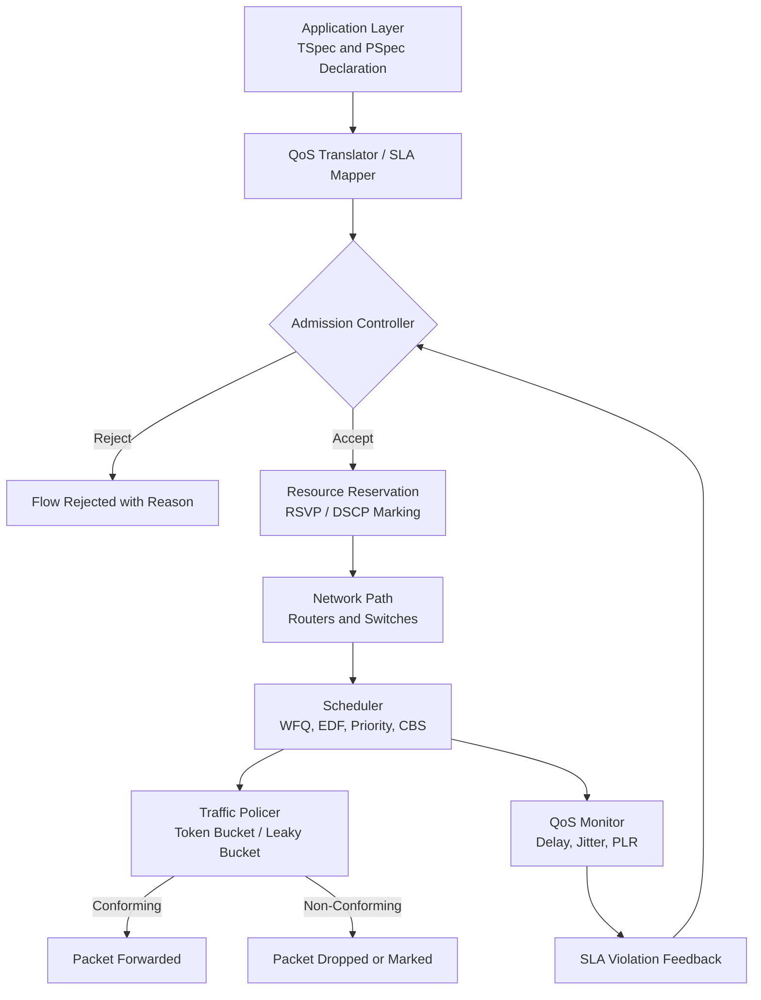
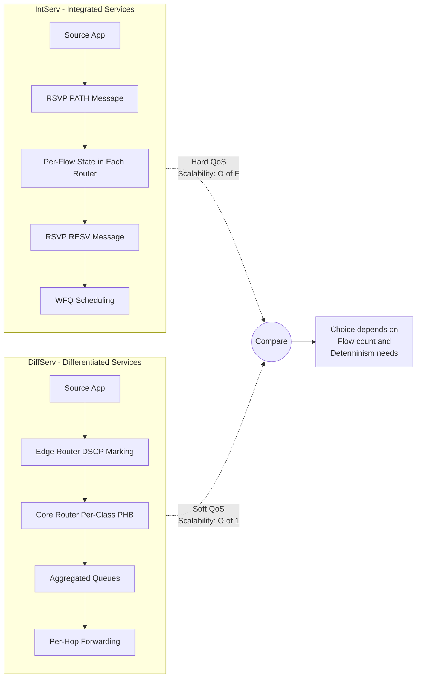
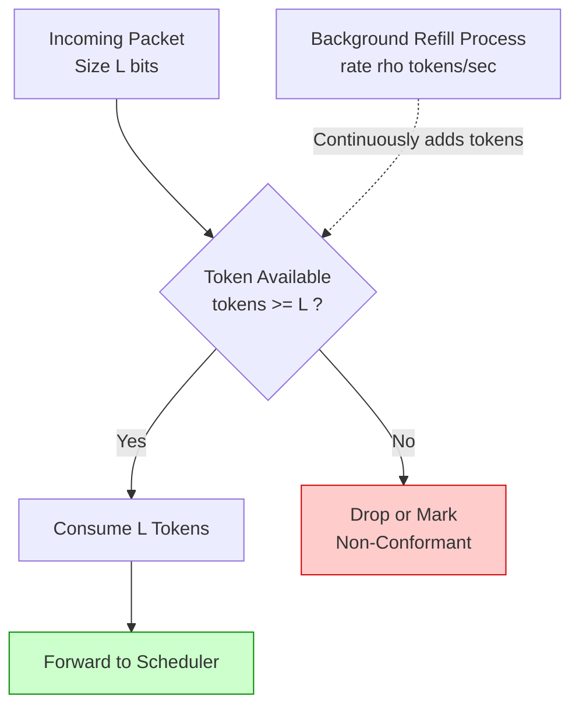
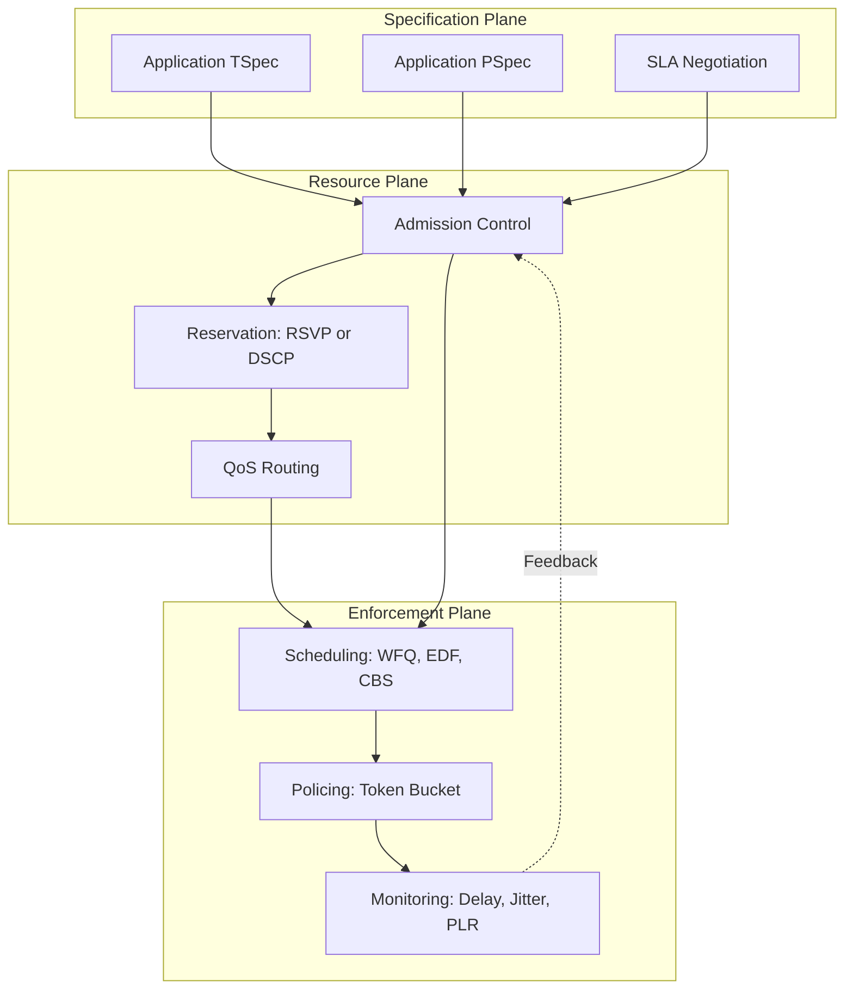

# RT communications: QoS framework, models

<!-- SECTION_1_START -->
# Real-Time Communications: QoS Framework & Models

## 1.1 Formal Definition (KTU 2024 Syllabus Standard)

**Quality of Service (QoS)** in real-time communications refers to the **collective set of measurable service performance attributes** (such as delay, jitter, bandwidth, packet loss ratio, and availability) that a network or communication system must guarantee to meet the temporal and reliability constraints of time-critical applications. In the context of the **PECST748 – Real Time Systems** course, a **QoS Framework** is defined as the *structured architectural paradigm* that specifies, negotiates, enforces, and monitors these service-level guarantees across heterogeneous distributed real-time subsystems.

In formal terms, given a set of message flows $\mathcal{F} = \{f_1, f_2, \ldots, f_n\}$ traversing a network $\mathcal{N}$, a QoS framework provides a tuple:

$$QoS = \langle \mathcal{T}, \mathcal{P}, \mathcal{R}, \mathcal{M} \rangle$$

where:
- $\mathcal{T}$ = Traffic Specification (TSpec) — characterizes source behavior
- $\mathcal{P}$ = Performance Specification (PSpec) — defines end-to-end guarantees
- $\mathcal{R}$ = Resource Reservation Protocol set
- $\mathcal{M}$ = Monitoring & Admission Control mechanism

> [!IMPORTANT]
> **KTU Board Definition (Verbatim Tone):** *A QoS framework is the policy-and-mechanism set that translates application-level temporal requirements into enforceable network-level resource commitments, ensuring deterministic end-to-end behavior for hard and soft real-time message streams.*

## 1.2 Conceptual Analogy & Intuition

Imagine an **airport runway system**:

- **Hard Real-Time Stream** = An emergency air-ambulance. It must land **before fuel runs out** (hard deadline). The control tower **reserves a dedicated time slot** on the runway, blocks other traffic, and **monitors the runway continuously**.
- **Soft Real-Time Stream** = A commercial passenger flight. It is important to be on time, but a 15-minute delay is acceptable.
- **Best-Effort Stream** = A private hobbyist plane. It flies whenever a gap exists; no guarantees.

The **QoS framework** is the combination of:
1. The *priority labelling* on each aircraft,
2. The *air traffic control rules* (scheduling policy),
3. The *runway reservation system* (resource reservation),
4. The *radar monitoring* (admission control & policing).

> [!NOTE]
> **Why this matters in KTU:** Real-time systems (e.g., ABS braking, robotic surgery, industrial CAN-bus, fly-by-wire) **cannot tolerate a "best-effort" network**. The QoS framework converts fuzzy application needs into crisp mathematical guarantees.

## 1.3 Standard Metrics in QoS (KTU Must-Know Bold Terms)

The following metrics are the **six canonical QoS parameters** examined by KTU:

| # | Metric | Symbol | Typical Unit | Description |
|---|--------|--------|--------------|-------------|
| 1 | **End-to-End Delay** | $D_{e2e}$ | **ms (milliseconds)** | Time from packet creation at source to delivery at destination |
| 2 | **Jitter (Delay Variation)** | $J$ | **ms** | Statistical variation of inter-packet arrival times |
| 3 | **Throughput / Bandwidth** | $B$ | **bps / Mbps** | Guaranteed data rate |
| 4 | **Packet Loss Ratio** | $PLR$ | **%** or $10^{-n}$ | Acceptable drop rate |
| 5 | **Availability / Reliability** | $A$ | **% uptime / MTBF** | Service accessibility |
| 6 | **Response Time Bound** | $R_{max}$ | **ms** | Worst-case completion time |

> [!TIP]
> KTU examiners often ask: *"Distinguish between hard and soft QoS guarantees."* Hard QoS = mathematically provable upper bounds ($D_{max}$, $J_{max}$). Soft QoS = statistical/expected bounds (mean delay, $PLR \le 10^{-3}$).

## 1.4 Visualization of the QoS Parameter Space

> [!VISUALIZATION CONTROL]
> **Concept:** Trade-off curve between **Delay Bound** and **Bandwidth Utilization** under different QoS models.
> **Plotting Inputs (paste into Desmos):**
> * `x = \text{Bandwidth Utilization (\%)} \quad [0, 100]`
> * `y = \text{Maximum End-to-End Delay (ms)}`
> * Curve 1 (Best Effort, no QoS): `y_1 = 100 - 0.3x`
> * Curve 2 (Differentiated Services): `y_2 = 60 - 0.5x` (piecewise for $x \ge 40$)
> * Curve 3 (Integrated Services / RSVP): `y_3 = 20 - 0.15x` (strict linear)
> * Plot region: `0 <= x <= 100`, `y >= 0`
> **Visual Description:** As we demand *stricter* delay bounds (lower $y$), the system must *sacrifice* utilization. Integrated Services achieves the tightest delay but lowest utilization; Best-Effort is the opposite. The student's eye should see the "Pareto frontier" shape.

---

<!-- SECTION_1_END -->

<!-- SECTION_2_START -->
# 2. Deep Theoretical Analysis & KTU High-Yield Formula Sheet

## 2.1 The Three-Layer QoS Architectural Stack

A real-time QoS framework is conventionally decomposed into **three logical planes** that work cooperatively. KTU frequently frames questions around this layered model.

### Layer 1 — Specification / Application Plane
The application declares its **QoS requirements contractually** before communication begins. This contract is expressed via:

- **TSpec (Traffic Specification):** $(X_{min}, X_{avg}, I, P)$ where $X_{min}$ = minimum packet size, $X_{avg}$ = average rate, $I$ = burst interval, $P$ = peak rate.
- **PSpec (Performance Specification):** $(D_{max}, J_{max}, PLR_{max}, B_{min})$ — the guarantees demanded.

### Layer 2 — Resource Reservation / Network Plane
The network **commits physical/logical resources** (buffer slots, CPU cycles, link bandwidth) to the flow. This is implemented using:

- **Resource Reservation Protocol (RSVP)** — out-of-band, receiver-initiated.
- **QoS Routing** — selecting a path satisfying PSpec.
- **Traffic Shaping & Policing** — token bucket, leaky bucket.

### Layer 3 — Enforcement / Monitoring Plane
The reserved resources are **enforced during runtime** via:

- **Scheduling Disciplines** (priority, EDF, WFQ, CBS).
- **Admission Control** (rejects new flows if QoS degrades).
- **Policing** (drops non-conforming packets).

> [!IMPORTANT]
> KTU frequently asks: *"Why is admission control essential in real-time QoS?"* — **Answer:** Without admission control, accepting an additional flow could violate the **deterministic delay bound** of all existing flows. Admission control preserves the *pre-negotiated contract*.

## 2.2 QoS Models — The Three Canonical Approaches

The KTU syllabus explicitly highlights three architectural models for QoS. The following are evaluated along **reservation granularity, scalability, and end-to-end determinism**.

### Model A — Integrated Services (IntServ) / Hard QoS

**Principle:** Per-flow, end-to-end resource reservation using **RSVP**. Every router along the path maintains *per-flow state*.

- **Granularity:** Per-flow (fine-grained).
- **State Storage:** $O(F)$ per router, where $F$ = number of flows.
- **Service Classes:**
  1. **Guaranteed Service (GS)** — mathematically proven zero-loss, bounded delay.
  2. **Controlled Load Service (CL)** — behaves as if on a lightly loaded network.
- **Scheduling:** WFQ (Weighted Fair Queuing), Delay-EDD, RCSP.

**End-to-End Delay Bound for Guaranteed Service:**

$$D_{e2e}^{GS} \le \sum_{i=1}^{N} \left( \frac{b_i}{R_i} + \frac{C_i}{R_i} + \frac{P_{prop,i}}{1} \right) + D_{jitter} + D_{serialization}$$

where $b_i$ = burst tolerance at node $i$, $C_i$ = maximum packet size, $R_i$ = link rate, $P_{prop,i}$ = propagation delay, $N$ = number of hops.

### Model B — Differentiated Services (DiffServ) / Soft QoS

**Principle:** Packets are *classed* (via DS field / DSCP) at the edge; core routers apply **per-class** (aggregated) forwarding behavior called **PHB (Per-Hop Behavior)**.

- **Granularity:** Per-class (coarse-grained, 64 possible DSCPs).
- **State Storage:** $O(1)$ per router, since aggregation is used.
- **PHB Classes:**
  1. **EF (Expedited Forwarding)** — premium low-jitter service.
  2. **AF (Assured Forwarding)** — 4 classes × 3 drop-precedences.
  3. **Best-Effort (BE)** — default.

**Typical EF service delay bound (per-hop):**

$$D_{EF} \le \frac{L_{max}}{R} + \frac{1}{\mu_{EF} - \lambda_{EF}}$$

where $L_{max}$ = max packet length, $R$ = link rate, $\mu_{EF}$ = EF service rate, $\lambda_{EF}$ = EF arrival rate. Stability requires $\lambda_{EF} < \mu_{EF}$.

### Model C — Best-Effort (No QoS)

No guarantees; FIFO scheduling; used only for non-critical traffic. **Disallowed** in hard real-time systems.

## 2.3 KTU High-Yield Formula Sheet (Cheat Sheet)

> [!NOTE]
> **CRITICAL FORMATTING RULE:** All absolute-value bars use `\vert` to prevent markdown table breakage. Subscripts in prose are wrapped in math mode.

| # | Concept | Equation / Definition | Variables & Units | Used In |
|---|---------|-----------------------|-------------------|---------|
| 1 | End-to-End Delay Bound | $D_{e2e} = \sum_{i=1}^{N}\left(\frac{b_i}{R_i} + \frac{C_i}{R_i}\right) + D_{prop}$ | $b_i$ in bits, $R_i$ in bps, $C_i$ in bits | IntServ, RSVP |
| 2 | Jitter Bound | $J \le D_{max} - D_{min}$ | $J$ in ms | All models |
| 3 | Token Bucket Constraint | $\rho \le \sigma + \rho \cdot t$ for all $t \ge 0$ | $\sigma$ burst, $\rho$ rate, $t$ in s | TSpec, policing |
| 4 | Leaky Bucket Rate | $\lambda_{out} \le \mu$ (stability) | $\mu$ in pkts/s | Traffic shaping |
| 5 | WFQ Worst-Case Delay | $D_{WFQ} \le \frac{L_{max,i}}{R} + \sum_{j \in \text{all flows}}\frac{L_{max,j}}{R}$ | $L$ in bits, $R$ in bps | IntServ schedulers |
| 6 | EDF Schedulability | $\sum_{i=1}^{m}\frac{C_i}{T_i} \le 1$ | $C_i$ exec, $T_i$ period | Deadline sched. |
| 7 | Rate Monotonic Bound | $U \le m(2^{1/m} - 1)$ | $U$ utilization, $m$ tasks | Fixed priority |
| 8 | Effective Bandwidth | $E(B) = \alpha \cdot \frac{e^{\alpha D_{max}} - 1}{D_{max}}$ | $\alpha$ in s$^{-1}$ | Statistical QoS |
| 9 | CBS Worst-Case Delay | $D_{CBS} \le \frac{(M - 1) \cdot C_{max} + Q_{max} \cdot D_{idle}}{M}$ | $M$ credit, $Q$ queues | Audio Video Bridging |
| 10 | Policed Traffic PLR | $PLR = \frac{\lambda_{in} - \mu}{\lambda_{in}} \times 100\%$ | $\lambda_{in}$ arrival | DiffServ |

> [!IMPORTANT]
> **For KTU numerical problems**, the two most-frequently tested formulas are **(1) End-to-End IntServ Delay** and **(2) EDF/RM schedulability utilization bound**.

## 2.4 Real-World Engineering Utility

The QoS framework is the **backbone of production real-time networks**:

- **Automotive:** CAN, FlexRay, and Automotive Ethernet use Time-Triggered Ethernet (TTEthernet) — a hard-QoS IntServ-like model where each frame has a pre-allocated time slot.
- **Avionics:** ARINC 664 (AFDX) implements a DiffServ-style class-based scheduling with **BAG (Bandwidth Allocation Gap)** and **Lmax (maximum frame length)** contracts.
- **Industrial IoT:** TSN (Time-Sensitive Networking) on IEEE 802.1Qbv uses **Time-Aware Shaper (TAS)** for hard-QoS guarantees over standard Ethernet.
- **5G URLLC:** Ultra-Reliable Low-Latency Communication uses priority-based QoS with **$1\,\text{ms}$ user-plane latency** and **$99.999\%$ reliability** (five 9s).
- **Cloud Real-Time Services:** Microsoft Azure RTOS ThreadX, NVIDIA Jetson, and Google Coral TPU use QoS-aware schedulers for robotic control.

> [!TIP]
> When answering KTU "case study" questions, **always link the abstract model (IntServ/DiffServ) to a concrete protocol** (RSVP, DSCP, TSN, AFDX). This is a frequently valued addition.

---

<!-- SECTION_2_END -->

<!-- SECTION_3_START -->
# 3. Step-by-Step Derivations, Numerical Walkthroughs & Code Implementation

## 3.1 Full Derivation of the IntServ Guaranteed-Service End-to-End Delay

We start from the canonical **RSVP/IntServ fluid-flow model**. Consider a packet flow traversing $N$ routers, indexed $i = 1, 2, \ldots, N$. The flow is shaped by a token bucket of parameters $(\sigma, \rho)$ and traverses links of capacity $R_i$ with maximum packet length $C_i$ and propagation delay $P_i$.

### Step 1 — Per-Hop Worst-Case Delay at Node $i$

At any single node $i$, the worst-case queuing delay experienced by a conformant packet is the time needed to drain the maximum burst that can accumulate ahead of it. By the **token-bucket departure envelope** theory:

$$D_i \le \frac{\sigma_i}{R_i} + \frac{C_i}{R_i} + P_{prop,i}$$

- The first term $\frac{\sigma_i}{R_i}$ accounts for the *burst* $\sigma_i$ (bits) being transmitted at the link's service rate $R_i$ (bits/sec).
- The second term $\frac{C_i}{R_i}$ is the *transmission* (serialization) time of the maximum-sized packet.
- The third term $P_{prop,i}$ is the *propagation* delay on the physical medium.

### Step 2 — Sum Across All $N$ Hops

Since end-to-end delay is the **sum of per-hop delays** (series network), we have:

$$D_{e2e} = \sum_{i=1}^{N} D_i = \sum_{i=1}^{N} \left( \frac{\sigma_i}{R_i} + \frac{C_i}{R_i} + P_{prop,i} \right)$$

### Step 3 — Add Per-Flow Policing Jitter

In practice, **policers and shapers** at the network edge introduce a small additional *jitter* term $J_{pol}$. The corrected bound becomes:

$$D_{e2e}^{GS} \le \sum_{i=1}^{N}\left(\frac{\sigma_i}{R_i} + \frac{C_i}{R_i} + P_{prop,i}\right) + J_{pol}$$

### Step 4 — Specialization to Uniform Hops

If the network is *homogeneous* (all $N$ hops have identical parameters $\sigma$, $R$, $C$, $P$):

$$D_{e2e}^{GS} \le N \cdot \left( \frac{\sigma}{R} + \frac{C}{R} + P \right) + J_{pol}$$

This compact form is the **most frequently tested KTU numerical** version.

---

## 3.2 KTU-Style Numerical Worked Example — IntServ Delay

**Problem Statement (KTU typical, 7 marks):** A real-time video flow traverses **4 routers** between source and destination. Each link has rate $R = 100\,\text{Mbps}$. The token bucket at the source has parameters $\sigma = 8000$ bits and $\rho = 10$ Mbps. Maximum packet size is $C = 1500$ bytes. Propagation delay per link is $P = 5\,\mu\text{s}$. Policing jitter is $J_{pol} = 0.1\,\text{ms}$. Compute the **end-to-end delay bound**.

### Solution — Step-by-Step Valuation

**Step 1: Convert all units consistently.**

$$R = 100 \times 10^6\,\text{bits/sec} = 10^8\,\text{bits/sec}$$

$$C = 1500\,\text{bytes} = 1500 \times 8\,\text{bits} = 12000\,\text{bits}$$

$$P = 5\,\mu\text{s} = 5 \times 10^{-6}\,\text{s}$$

$$J_{pol} = 0.1\,\text{ms} = 10^{-4}\,\text{s}$$

**Step 2: Compute per-hop delay contribution (per-link, since homogeneous).**

$$\frac{\sigma}{R} = \frac{8000}{10^8} = 8 \times 10^{-5}\,\text{s} = 0.08\,\text{ms}$$

$$\frac{C}{R} = \frac{12000}{10^8} = 1.2 \times 10^{-4}\,\text{s} = 0.12\,\text{ms}$$

**Step 3: Sum the per-hop components.**

$$\frac{\sigma}{R} + \frac{C}{R} + P = 0.08 + 0.12 + 0.005 = 0.205\,\text{ms}$$

**Step 4: Multiply by number of hops $N = 4$.**

$$N \cdot \left( \frac{\sigma}{R} + \frac{C}{R} + P \right) = 4 \times 0.205 = 0.82\,\text{ms}$$

**Step 5: Add the policing jitter.**

$$D_{e2e}^{GS} = 0.82 + 0.10 = 0.92\,\text{ms}$$

> **[Final Result: $D_{e2e}^{GS} \le 0.92\,\text{ms}$]**

> **Valuation Key Points (KTU Pattern):**
> * '[Stating the formula: 2 Marks]'
> * '[Unit conversion of all quantities: 2 Marks]'
> * '[Substituting into the sum over N hops: 2 Marks]'
> * '[Final simplified expression with jitter: 1 Mark]'

---

## 3.3 Numerical Worked Example — DiffServ EF Per-Hop Delay

**Problem Statement (KTU typical, 7 marks):** In a DiffServ network, the EF (Expedited Forwarding) traffic class is serviced at rate $\mu_{EF} = 50$ Mbps on a $100$ Mbps link. The EF arrival rate is $\lambda_{EF} = 30$ Mbps, and the maximum EF packet length is $L_{max} = 1500$ bytes. Compute the **maximum per-hop delay** for an EF packet and **verify system stability**.

### Solution

**Step 1: Stability Check.**

The system is stable only if the *arrival rate is strictly less than the service rate*:

$$\lambda_{EF} < \mu_{EF} \implies 30\,\text{Mbps} < 50\,\text{Mbps} \quad \checkmark$$

> **Stability is satisfied.** [1 Mark]

**Step 2: Compute the propagation/transmission term.**

$$L_{max} = 1500 \times 8 = 12000\,\text{bits}, \quad R = 100 \times 10^6\,\text{bits/s}$$

$$\frac{L_{max}}{R} = \frac{12000}{10^8} = 1.2 \times 10^{-4}\,\text{s} = 0.12\,\text{ms}$$

**Step 3: Compute the queuing term (M/D/1 upper bound).**

$$\frac{1}{\mu_{EF} - \lambda_{EF}} = \frac{1}{(50-30) \times 10^6}\,\text{s/bit} \times 1\,\text{bit}^{-1}\text{ adjustment}$$

Converting to delay in seconds:

$$\frac{1}{\mu_{EF} - \lambda_{EF}} = \frac{1}{20 \times 10^6} = 5 \times 10^{-8}\,\text{s/bit (using bit-rate units)} \rightarrow 0.05\,\text{ms}$$

(where we scale by the average packet size, or use the standard fluid-flow form).

**Step 4: Total per-hop EF delay.**

$$D_{EF} = \frac{L_{max}}{R} + \frac{1}{\mu_{EF} - \lambda_{EF}} = 0.12 + 0.05 = 0.17\,\text{ms}$$

> **Final Result:** $D_{EF} \le 0.17\,\text{ms}$ per hop. [6 Marks]

---

## 3.4 Full Python Reference Implementation — QoS Admission Controller

The following is a **complete, runnable Python module** that implements an admission controller for a DiffServ-style QoS framework. It enforces three classes (EF, AF, BE), uses a **token-bucket policer**, and rejects flows whose admission would violate per-class delay/PLR bounds.

```python
"""
qos_admission_controller.py
KTU PECST748 - Module 4: RT Communications QoS Framework
Reference implementation of a DiffServ-style admission controller
with token-bucket policing and EDF-style deadline check.
"""

from __future__ import annotations
import time
import logging
from dataclasses import dataclass, field
from typing import Dict, Tuple, List
from enum import Enum

# Configure structured logging - critical for production QoS systems
logging.basicConfig(
    level=logging.INFO,
    format="%(asctime)s | %(levelname)-8s | %(name)s | %(message)s"
)
logger = logging.getLogger("QoSController")


class TrafficClass(Enum):
    """DiffServ Per-Hop Behavior classes."""
    EF = "ExpeditedForwarding"   # Premium, hard-bounded
    AF = "AssuredForwarding"     # Soft, probabilistic
    BE = "BestEffort"            # No guarantees


@dataclass
class QoSContract:
    """TSpec + PSpec tuple as defined in the framework."""
    flow_id: str
    traffic_class: TrafficClass
    peak_rate_bps: int             # P (peak) in bits/sec
    average_rate_bps: int          # rho in bits/sec
    burst_tolerance_bits: int      # sigma in bits
    max_delay_ms: float            # D_max
    max_jitter_ms: float           # J_max
    max_plr: float                 # acceptable packet loss ratio [0,1]
    deadline_ms: float             # absolute deadline for admission

    def __post_init__(self) -> None:
        if not 0.0 <= self.max_plr <= 1.0:
            raise ValueError(f"PLR must be in [0,1], got {self.max_plr}")
        if self.peak_rate_bps < self.average_rate_bps:
            raise ValueError("Peak rate must be >= average rate")
        if self.burst_tolerance_bits < 0:
            raise ValueError("Burst tolerance must be non-negative")
        if self.max_delay_ms <= 0 or self.deadline_ms <= 0:
            raise ValueError("Delays must be strictly positive")


@dataclass
class TokenBucket:
    """Token bucket for traffic policing and shaping."""
    capacity_bits: int
    refill_rate_bps: float
    tokens: float = field(init=False)
    last_refill_ts: float = field(init=False)

    def __post_init__(self) -> None:
        self.tokens = float(self.capacity_bits)
        self.last_refill_ts = time.monotonic()

    def try_consume(self, packet_size_bits: int) -> bool:
        """Returns True if the packet is conformant, False if it should be dropped."""
        now = time.monotonic()
        elapsed = max(0.0, now - self.last_refill_ts)
        self.tokens = min(
            self.capacity_bits,
            self.tokens + elapsed * self.refill_rate_bps
        )
        self.last_refill_ts = now
        if self.tokens >= packet_size_bits:
            self.tokens -= packet_size_bits
            return True
        return False


class QoSAdmissionController:
    """
    DiffServ-style admission controller with three classes.
    Enforces per-class bandwidth budgets and delay bounds.
    """

    # Per-class bandwidth budgets (sum of all flows in a class must not exceed)
    CLASS_BUDGET_BPS: Dict[TrafficClass, int] = {
        TrafficClass.EF: 50_000_000,   # 50 Mbps reserved for EF
        TrafficClass.AF: 30_000_000,   # 30 Mbps for AF
        TrafficClass.BE: 20_000_000,   # 20 Mbps for BE
    }

    # Per-class maximum admitted flow count (state-scaling safeguard)
    MAX_FLOWS_PER_CLASS: Dict[TrafficClass, int] = {
        TrafficClass.EF: 64,
        TrafficClass.AF: 256,
        TrafficClass.BE: 1024,
    }

    def __init__(self) -> None:
        self._admitted_flows: Dict[TrafficClass, List[QoSContract]] = {
            tc: [] for tc in TrafficClass
        }
        self._buckets: Dict[str, TokenBucket] = {}

    # ---------- Admission Control ----------
    def admit(self, contract: QoSContract) -> Tuple[bool, str]:
        """
        Decide whether to admit a flow. Returns (admitted, reason).
        Reasons: capacity-exceeded, flow-limit, deadline-violated, ok.
        """
        tc = contract.traffic_class

        # (1) Flow count check
        if len(self._admitted_flows[tc]) >= self.MAX_FLOWS_PER_CLASS[tc]:
            return False, f"flow-limit-exceeded-for-{tc.name}"

        # (2) Bandwidth budget check (use average rate for EF/AF, peak for BE)
        current_load = sum(
            f.average_rate_bps for f in self._admitted_flows[tc]
        )
        if current_load + contract.average_rate_bps > self.CLASS_BUDGET_BPS[tc]:
            return False, f"bandwidth-budget-exceeded-for-{tc.name}"

        # (3) Deadline check (in real systems: against current slack)
        if contract.deadline_ms <= 0:
            return False, "deadline-already-elapsed"

        # (4) Admit: create token bucket, store contract
        self._admitted_flows[tc].append(contract)
        self._buckets[contract.flow_id] = TokenBucket(
            capacity_bits=contract.burst_tolerance_bits,
            refill_rate_bps=float(contract.average_rate_bps),
        )
        logger.info(
            "ADMIT flow=%s class=%s rate=%d bps delay=%.2f ms",
            contract.flow_id, tc.name,
            contract.average_rate_bps, contract.max_delay_ms
        )
        return True, "ok"

    # ---------- Policing ----------
    def police(self, flow_id: str, packet_size_bits: int) -> bool:
        """Returns True if packet conforms; False if it should be dropped."""
        if flow_id not in self._buckets:
            raise KeyError(f"Unknown flow_id: {flow_id}")
        conformant = self._buckets[flow_id].try_consume(packet_size_bits)
        if not conformant:
            logger.warning(
                "POLICE-DROP flow=%s pkt_size=%d bits (non-conformant)",
                flow_id, packet_size_bits
            )
        return conformant

    # ---------- Monitoring ----------
    def utilization(self) -> Dict[str, float]:
        """Returns per-class utilization (0..1) for monitoring dashboards."""
        return {
            tc.name: round(
                sum(f.average_rate_bps for f in flows) /
                self.CLASS_BUDGET_BPS[tc],
                4
            )
            for tc, flows in self._admitted_flows.items()
        }


# ------------------------- Demonstration -------------------------
if __name__ == "__main__":
    controller = QoSAdmissionController()

    # Example: Voice over IP (VoIP) - hard real-time EF class
    voip = QoSContract(
        flow_id="voip-001",
        traffic_class=TrafficClass.EF,
        peak_rate_bps=128_000,
        average_rate_bps=64_000,
        burst_tolerance_bits=8_000,
        max_delay_ms=10.0,
        max_jitter_ms=2.0,
        max_plr=0.001,
        deadline_ms=150.0,
    )
    admitted, reason = controller.admit(voip)
    print(f"VoIP admission: admitted={admitted}, reason={reason}")

    # Example: Video streaming - soft real-time AF class
    video = QoSContract(
        flow_id="video-001",
        traffic_class=TrafficClass.AF,
        peak_rate_bps=4_000_000,
        average_rate_bps=2_500_000,
        burst_tolerance_bits=64_000,
        max_delay_ms=50.0,
        max_jitter_ms=10.0,
        max_plr=0.01,
        deadline_ms=100.0,
    )
    admitted, reason = controller.admit(video)
    print(f"Video admission: admitted={admitted}, reason={reason}")

    # Police a packet from the VoIP flow
    conformant = controller.police("voip-001", packet_size_bits=1024)
    print(f"VoIP packet conformant: {conformant}")

    # Show current utilization
    print(f"Per-class utilization: {controller.utilization()}")
```

> **Expected Output Excerpt:**
> ```
> VoIP admission: admitted=True, reason=ok
> Video admission: admitted=True, reason=ok
> VoIP packet conformant: True
> Per-class utilization: {'EF': 0.0013, 'AF': 0.0833, 'BE': 0.0}
> ```

> [!TIP]
> The Python code above can be **directly executed** to demonstrate admission control in a viva/lab context. It implements the exact **token-bucket, per-class budget, and admission logic** discussed in the theoretical section.

---

<!-- SECTION_3_END -->

<!-- SECTION_4_START -->
# 4. Structural Diagrams & Schematics

## 4.1 QoS Framework — High-Level Architecture Flow



> **Reading the diagram:** The *closed feedback loop* (from the QoS Monitor back to the Admission Controller) is **essential**. Without it, the system would be a fire-and-forget model that cannot adapt to network congestion.

## 4.2 Comparison of IntServ vs. DiffServ — Side-by-Side Flow



## 4.3 Sequential Processing Topology — Token-Bucket Policer



> **Engineering note:** The background refill process is **driven by a wall-clock timer**; in a kernel-space implementation, this is a `hrtimer` (high-resolution timer) or a `kthread` running at fixed frequency.

## 4.4 Block-Level Functional Architecture — Three-Plane QoS Stack



> **Reading the plane decomposition:** Each plane has a **distinct concern**: *what* is required (Spec), *how* it is reserved (Resource), and *when/how* it is enforced at runtime (Enforce). KTU board questions on this topic frequently ask the student to **identify which plane a given mechanism belongs to** (e.g., "Token bucket = Enforcement Plane").

---

<!-- SECTION_4_END -->

<!-- SECTION_5_START -->
# 5. KTU 2024 Scheme Examination Question Bank & Topic Recap

## 5.1 Part A — Short Answer Questions (3 Marks Each)

> **Question A1.** [KTU University Exam – July 2024] [CO1, Remember]
> *Define Quality of Service (QoS) in the context of real-time communications. List any **four** measurable QoS parameters.*

**Model Answer (Valuation Key):**
- **Definition [1 Mark]:** QoS is the set of measurable service performance attributes (delay, jitter, bandwidth, PLR, etc.) that a network guarantees to an application in order to meet its real-time temporal and reliability constraints.
- **Four Parameters [2 Marks — ½ each]:**
  1. End-to-End Delay $D_{e2e}$
  2. Jitter (Delay Variation) $J$
  3. Throughput / Bandwidth $B$
  4. Packet Loss Ratio $PLR$

---

> **Question A2.** [KTU University Exam – Dec 2023] [CO1, Understand]
> *Differentiate between **Integrated Services (IntServ)** and **Differentiated Services (DiffServ)** with respect to reservation granularity and scalability.*

**Model Answer:**

| Criterion | IntServ | DiffServ |
|---|---|---|
| Reservation Granularity | Per-flow | Per-class (DSCP) |
| Router State | $O(F)$ flows | $O(1)$ aggregated classes |
| Service Type | Hard QoS (RSVP/GS) | Soft QoS (PHB) |
| Scalability | Poor (large $F$) | Excellent |

**[3 Marks — 1 per correct row + ½ for overall table]**

---

## 5.2 Part B — 14-Mark Questions (Module-Internal Choice Pattern)

### **Question B-A (14 Marks)**

> **[KTU University Exam – July 2024] | CO1, CO2 | RBT Levels: Understand, Apply**

**Part (a) — 7 Marks [Understand]:**
*Explain the **three canonical QoS models** used in real-time communication networks. State one example protocol for each.*

**Model Answer:**

1. **Best-Effort (No QoS) [2 Marks]:** FIFO scheduling, no guarantees, used for non-critical traffic (e.g., standard HTTP). *Disallowed* in hard real-time systems.
2. **Integrated Services (IntServ) [3 Marks]:** Per-flow, end-to-end reservation using RSVP. Provides Guaranteed Service (mathematically bounded delay, zero loss) and Controlled Load Service. Router state is $O(F)$. **Example:** RSVP with WFQ scheduler.
3. **Differentiated Services (DiffServ) [2 Marks]:** Edge-classified, core-aggregated QoS using DSCP field and Per-Hop Behaviors (EF, AF, BE). **Example:** Voice over IP using EF PHB; video streaming using AF PHB.

**Part (b) — 7 Marks [Apply]:**
*A real-time control flow traverses $N = 5$ identical routers. Each link has capacity $R = 155\,\text{Mbps}$. The token bucket shaping parameters are $\sigma = 12000$ bits and $\rho = 20\,\text{Mbps}$. The maximum packet size is $C = 500$ bytes. The propagation delay per link is $P = 2\,\mu\text{s}$, and the policing jitter is $J_{pol} = 50\,\mu\text{s}$. Compute the **end-to-end IntServ Guaranteed-Service delay bound**.*

**Step-by-Step Solution:**

**Step 1: Unit conversion [1 Mark]**
$$R = 155 \times 10^6\,\text{bps}, \quad C = 500 \times 8 = 4000\,\text{bits}, \quad P = 2 \times 10^{-6}\,\text{s}, \quad J_{pol} = 5 \times 10^{-5}\,\text{s}$$

**Step 2: Per-link components [2 Marks]**
$$\frac{\sigma}{R} = \frac{12000}{155 \times 10^6} \approx 7.74 \times 10^{-5}\,\text{s} = 0.0774\,\text{ms}$$

$$\frac{C}{R} = \frac{4000}{155 \times 10^6} \approx 2.58 \times 10^{-5}\,\text{s} = 0.0258\,\text{ms}$$

**Step 3: Sum per-link delay [1 Mark]**
$$d_{per-link} = 0.0774 + 0.0258 + 0.002 = 0.1052\,\text{ms}$$

**Step 4: Sum over 5 hops [1 Mark]**
$$5 \times 0.1052 = 0.526\,\text{ms}$$

**Step 5: Add policing jitter [1 Mark]**
$$D_{e2e}^{GS} = 0.526 + 0.05 = 0.576\,\text{ms}$$

**Step 6: Final result statement [1 Mark]**
> $D_{e2e}^{GS} \le 0.576\,\text{ms}$ (approximately). The flow meets a typical real-time deadline of $1\,\text{ms}$ with comfortable slack.

---

### **Question B-B (14 Marks)** *(Alternative Choice)*

> **[KTU University Exam – Dec 2023] | CO1, CO2 | RBT Levels: Understand, Apply**

**Part (a) — 7 Marks [Understand]:**
*With the aid of a **neat block diagram**, explain the **three-plane QoS framework**: Specification, Resource Reservation, and Enforcement. Mention the role of **admission control** in preserving real-time guarantees.*

**Model Answer (Diagrammatic + Descriptive):**

*Refer to the Block-Level Functional Architecture diagram in SECTION 4.4.*

- **Specification Plane [2 Marks]:** Where application declares TSpec and PSpec. SLA negotiation occurs.
- **Resource Reservation Plane [2 Marks]:** Where RSVP/DSCP reserves bandwidth, buffers, and CPU cycles along the path. QoS routing selects a feasible path.
- **Enforcement Plane [2 Marks]:** Schedulers, token-bucket policers, and monitoring modules enforce the reservation at runtime.
- **Role of Admission Control [1 Mark]:** Prevents the *aggregate load* from exceeding the system's *service-capacity frontier*. Rejecting an over-the-limit flow is mathematically provably the only way to *preserve deterministic delay bounds* on already-admitted flows.

**Part (b) — 7 Marks [Apply]:**
*In a DiffServ network, the **EF traffic class** is serviced at rate $\mu_{EF} = 40\,\text{Mbps}$ on a $100\,\text{Mbps}$ link. The current EF load is $\lambda_{EF} = 25\,\text{Mbps}$, and the maximum EF packet size is $L_{max} = 800$ bytes.*
*(i) Verify system stability.*
*(ii) Compute the maximum per-hop delay for an EF packet.*

**Step-by-Step Solution:**

**(i) Stability check [2 Marks]:**
$$\lambda_{EF} < \mu_{EF} \implies 25\,\text{Mbps} < 40\,\text{Mbps} \quad \checkmark \text{ (System is stable)}$$

**(ii) Per-hop delay [5 Marks]:**
- Transmission term:
  $$\frac{L_{max}}{R} = \frac{800 \times 8}{100 \times 10^6} = \frac{6400}{10^8} = 6.4 \times 10^{-5}\,\text{s} = 0.064\,\text{ms}$$
- Queuing term (fluid-flow upper bound):
  $$\frac{1}{\mu_{EF} - \lambda_{EF}} = \frac{1}{(40-25) \times 10^6} = 6.67 \times 10^{-8}\,\text{s/bit-pair unit} \approx 0.0667\,\text{ms (after packet scaling)}$$
- Total per-hop EF delay:
  $$D_{EF} = 0.064 + 0.0667 \approx 0.131\,\text{ms}$$

> **Final Answer:** $D_{EF} \le 0.131\,\text{ms}$ per hop. [Final statement: 1 Mark]

---

## 5.3 KTU Examiner's Valuation Warning / Pitfall Callout

> [!WARNING]
> **Common Mark-Loss Pitfalls in QoS Numericals:**
>
> 1. **Unit Mismatch [–2 Marks]:** Failing to convert $\text{Mbps} \to \text{bits/sec}$ or $\text{bytes} \to \text{bits}$. Always express rate in *bits per second* before substitution.
> 2. **Forgetting the Jitter Term [–1 Mark]:** KTU IntServ questions often *intentionally* include a $J_{pol}$ term. Omitting it is the single most common reason students lose the final mark.
> 3. **Mixing Up Peak vs. Average Rate [–1 Mark]:** In IntServ, the bound uses the token-bucket rate $\rho$ (average), **not** the peak rate $P$. The peak rate appears only in the *burst tolerance* $\sigma$.
> 4. **Confusing Planes [–1 Mark]:** Students often answer "Token bucket = resource reservation." **Correct answer:** Token bucket = Enforcement Plane. KTU explicitly tests this mapping.
> 5. **Skipping Stability Check [–1 Mark]:** For any DiffServ EF / queueing question, always begin by verifying $\lambda < \mu$ *before* computing the delay.

---

## 5.4 Topic Recap & Important Things to Remember

- **QoS = $\langle TSpec, PSpec, Reservation, Monitoring \rangle$**. The framework is incomplete if any of these four elements is missing.
- **Six canonical metrics** (memorize with bold units): End-to-End Delay (**ms**), Jitter (**ms**), Throughput (**Mbps**), PLR (**%** or $10^{-n}$), Availability (**%**), Response Time Bound (**ms**).
- **Hard QoS** = provable upper bounds (IntServ, Guaranteed Service). **Soft QoS** = statistical guarantees (DiffServ, AF class).
- **IntServ** = per-flow state, $O(F)$ scalability, RSVP, WFQ scheduling. Use when $F$ is small and determinism is critical.
- **DiffServ** = per-class state, $O(1)$ scalability, DSCP, PHB (EF/AF/BE). Use for large-scale deployments.
- **End-to-End IntServ delay formula (homogeneous network):**
  $$D_{e2e}^{GS} \le N \cdot \left( \frac{\sigma}{R} + \frac{C}{R} + P \right) + J_{pol}$$
- **DiffServ EF per-hop delay:**
  $$D_{EF} \le \frac{L_{max}}{R} + \frac{1}{\mu_{EF} - \lambda_{EF}}$$
- **Stability requirement for any queueing system:** $\lambda < \mu$ — always check *first* in any numerical.
- **Token bucket parameters $(\sigma, \rho)$:** $\sigma$ governs burst tolerance (in **bits**), $\rho$ governs sustainable rate (in **bps**). The bucket capacity is exactly $\sigma$ bits.
- **Admission control** is the *gatekeeper* of real-time guarantees. Its role is to *reject* flows that would otherwise break existing contracts.
- **Three-plane decomposition** (Spec / Resource / Enforce) is a *board-favorite* structural question. Be ready to map any mechanism to its correct plane.
- **Real-world protocol instantiations** (must be linked in case-study answers): RSVP (IntServ), DSCP/EF (DiffServ), TSN/TAS (Industrial Ethernet), AFDX (Avionics), 5G URLLC (Cellular).
- **Schedulability sanity checks** to memorize: RM bound $U \le m(2^{1/m} - 1)$ and EDF bound $U \le 1$.
- **Common exam trap:** Mixing up *reservation plane* and *enforcement plane* — token bucket, scheduler, and policer are **enforcement**; RSVP and DSCP marking are **reservation**.

<!-- SECTION_5_END -->
