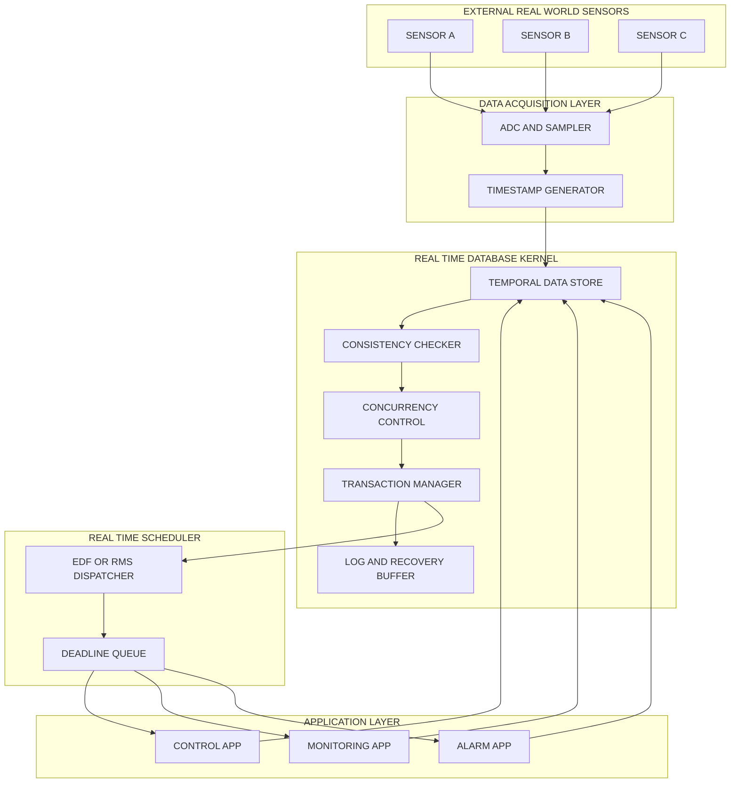
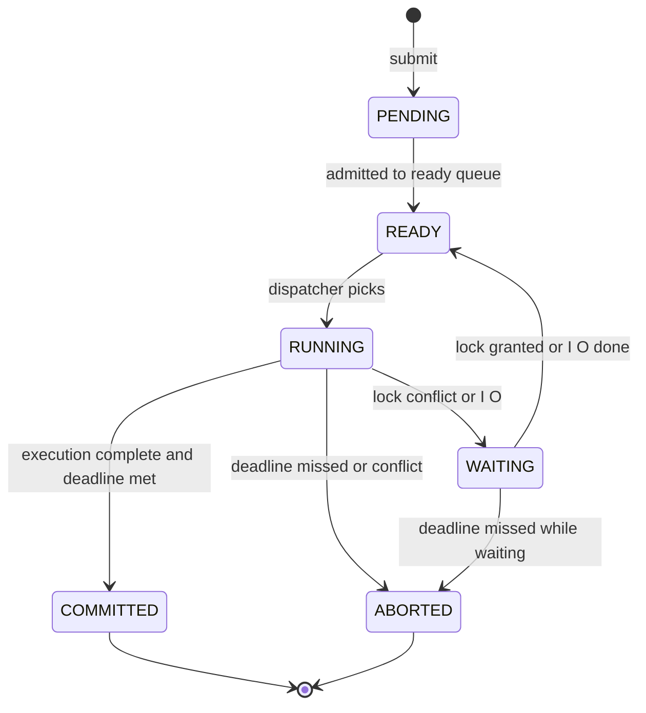
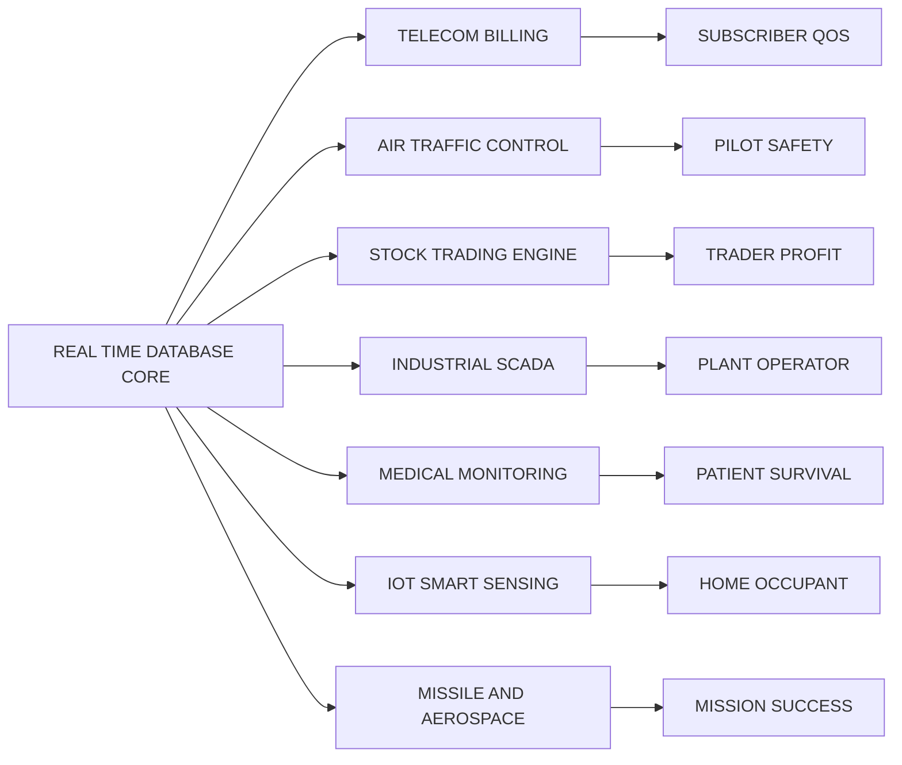

# RT databases - Applications

<!-- SECTION_1_START -->
# RT Databases & Their Applications

## 1.1 Formal Academic Definition

> [!NOTE]
> **Definition (KTU 2024 Scheme Standard)**
> A **Real-Time Database (RTDB)** is a database system in which **transactions have explicit timing constraints (deadlines)** and the system must process these transactions such that both the **logical consistency** of the data and the **temporal validity** of the results are preserved. The correctness of the system depends not only on the *what* (result) but also on the *when* (deadline).

In the context of **PECST748 – Real Time Systems (Module 4: RT Communications, QoS Framework & Models)**, an RTDB is studied as a critical application domain of real-time computing where a conventional DBMS is *augmented* with:

1. **Bounded response time** for every transaction.
2. **Temporal consistency** between the stored data and the real-world entity it represents.
3. **Priority-driven scheduling** of transactions (rather than pure FIFO throughput optimization).
4. **Predictable I/O, buffer, and CPU allocation** to guarantee that deadlines are met.

### 1.2 Intuitive Real-World Analogy

Imagine a **live cricket scoreboard** displayed in a stadium. The scoreboard shows the *current* score, the *current* overs, and the *current* batsmen on strike. This information is fetched from a central scoring database.

| Real-World Observation | RT Database Concept |
|---|---|
| A run scored 5 seconds ago is still meaningful | Data has a **validity interval** |
| Showing the score of a player who has *just* been dismissed is wrong | **Temporal inconsistency** must be avoided |
| The third umpire needs the decision *before* the next ball is bowled | Transaction has a **deadline** |
| Bowler's appeal > Decision > Next ball — all within 30 seconds | **Bounded response time** |
| If the operator forgets to update, the board auto-clears | **Absolute validity period** expires |

If the database is *slow* or *stale*, the entire match experience collapses — even if the *final* answer (after the match) is correct. This is precisely the failure mode that **Real-Time Databases** are designed to prevent.

> [!IMPORTANT]
> **Key Takeaway for KTU Examinations**
> The phrase *"correctness = logical result + time of delivery"* is the single most important one-liner definition examiners expect. Memorize it verbatim.

### 1.3 Physical Constants & Standard Metrics (Bolded)

* **Hard Real-Time Transaction Deadline Miss:** Catastrophic system failure (e.g., missile misses target).
* **Soft Real-Time Transaction Deadline Miss:** Graceful degradation of QoS (e.g., video frame drop).
* **Firm Real-Time Transaction Deadline Miss:** Late result has *zero* value but no catastrophe (e.g., stock price quote after market close).
* **Temporal Validity Interval ($t_{vi}$):** The duration for which a data item remains a faithful reflection of the real world. Standard unit: **milliseconds (ms)** to **seconds (s)**.
* **Absolute Validity Interval ($t_{avi}$):** The hard upper bound beyond which a data item is considered *useless* regardless of freshness.

### 1.4 GeoGebra / Desmos Integration

> [!VISUALIZATION CONTROL]
> **Concept:** Two-dimensional plot of *Data Age* vs. *Validity* for an RT database object.
> **GeoGebra / Desmos Input Equations:**
> * Point $A = (0, 1)$ — data is fully fresh at age $0$.
> * Line $L_1: y = 1 - \frac{x}{t_{vi}}$ — gradual degradation of usefulness.
> * Vertical line $L_2: x = t_{avi}$ — absolute invalidity threshold.
> * Point $B = (t_{vi}, 0)$ — soft expiry (data still tolerable but stale).
> **Visual Description:** A right-triangle region bounded by the y-axis, $L_1$, and the x-axis, with a vertical cutoff at $L_2$. Any data point $(x, y)$ inside the triangle is *logically valid*; points to the right of $L_2$ are *absolutely invalid* even if logically consistent.

<!-- SECTION_1_END -->

<!-- SECTION_2_START -->
# Deep Theoretical Analysis & KTU High-Yield Formula Sheet

## 2.1 Foundational Properties of RTDB Transactions

Every real-time transaction must satisfy the classical **ACID** properties *plus* a fifth property — **Timeliness**. KTU examiners frequently test this 5-property model.

> [!IMPORTANT]
> **The ACID + T Model (ACIDT)**
> 1. **A**tomicity — Transaction is "all or nothing."
> 2. **C**onsistency — DB moves from one consistent state to another.
> 3. **I**solation — Concurrent transactions do not interfere.
> 4. **D**urability — Committed results survive crashes.
> 5. **T**imeliness — Result is produced *before* the deadline.

## 2.2 Data Temporal Consistency

A data object $d_i$ in an RTDB is characterized by two time values:

* **Release time** ($r_i$): When the sensor/process updates $d_i$ in the database.
* **Sampling interval** ($s_i$): How often the real-world entity is sensed.
* **Absolute validity interval** ($a_i$): Maximum age allowed for $d_i$ to be useful.

A read of $d_i$ at time $t$ is **temporally consistent** iff:

$$
t - r_i \;\le\; a_i
$$

A read of $d_i$ is **logically consistent** iff the value of $d_i$ reflects the *actual current state* of the real-world entity (i.e., the reading is taken at or after $r_i$).

A transaction accessing $d_i$ is **temporally consistent** iff **every** data item it reads is both logically and temporally consistent, *and* the transaction commits within its own deadline $d_{tr}$.

## 2.3 Transaction Classification (High-Yield)

| Class | Deadline Type | Penalty for Miss | Example |
|---|---|---|---|
| **Hard** | Must meet | System failure / catastrophe | Air traffic collision avoidance |
| **Soft** | Should meet | Degraded QoS | Video frame rendering |
| **Firm** | Preferable to meet | Wasted computation | Stock quote after market close |

## 2.4 Concurrency Control in RTDB

The two classical CC protocols are extended for real-time use:

1. **Pessimistic — Wait-and-Die / Wound-Wait (Lock-based).**
   * Wait-Die: Older transaction waits, younger dies.
   * Wound-Wait: Older transaction wounds (rolls back) younger, younger waits.
2. **Optimistic — OCC (Optimistic Concurrency Control) with BCP (Broadcast Commit Protocol).**
   * Validation phase aborts conflicting low-priority transactions.
3. **Speculative Locking** (RT-specific): Pre-claim locks to avoid aborts.

## 2.5 KTU High-Yield Formula Sheet

| # | Formula / Concept | Symbolic Form | Description / Units |
|---|---|---|---|
| 1 | Temporal Consistency | $t - r_i \le a_i$ | Age of data must not exceed validity interval (ms or s) |
| 2 | Transaction Deadline | $d_{tr} \ge t_{start} + (WCET)$ | Worst-Case Execution Time bound |
| 3 | Data Freshness | $f_i = t_{current} - r_i$ | Elapsed time since last update (ms) |
| 4 | Schedulability (Liu & Layland bound, for n periodic tasks) | $U = \sum_{i=1}^{n} \frac{C_i}{T_i} \le n(2^{1/n} - 1)$ | CPU utilization upper bound (dimensionless) |
| 5 | Slack Time of Transaction | $S = d_{tr} - (t_{now} + WCET_{rem})$ | Remaining time before deadline violation (ms) |
| 6 | Hard Real-Time Constraint | $P\{ \text{miss} \} = 0$ | Probability of deadline miss is zero |
| 7 | Soft Real-Time Constraint | $P\{ \text{miss} \} \le \epsilon$ | Probabilistic miss tolerance |
| 8 | Firm Real-Time Constraint | $\text{Value}(\text{result}) = 0$ if $t > d_{tr}$ | Late result has no value |
| 9 | MMLD (Maximum Missing Life Duration) | $MMLD_i = a_i - s_i$ | Grace period beyond sampling interval |
| 10 | Disk Access Bound (Real-Time I/O) | $t_{I/O} = t_{seek} + t_{rot} + t_{transfer}$ | Worst-case disk service time |

> [!IMPORTANT]
> **Escaping Rule Applied:** All vertical bars were replaced with `\vert` or written as inequality relations to preserve Markdown table integrity. Subscripts like $C_i$ are wrapped in math mode.

## 2.6 Real-World Engineering Utility

RT databases are deployed in production systems where *delay = loss*:

* **Telecommunications (4G/5G HSS, HLR, billing engines):** Subscriber location updates must be visible within **100 ms**.
* **Stock exchanges (NSE, NYSE):** Order book updates must propagate within **microseconds**; otherwise arbitrage opportunities vanish.
* **Air Traffic Control (ATC):** Radar tracks are valid for **2–4 seconds**; older data is operationally dangerous.
* **Industrial SCADA / DCS:** Process control loops require sensor freshness within **50–500 ms**.
* **Smart Grid (PMU data):** Phasor Measurement Unit data validity is **~16.67 ms** (2 cycles of 60 Hz).
* **IoT & Autonomous Vehicles:** Sensor fusion must operate on data aged **< 100 ms**.

<!-- SECTION_2_END -->

<!-- SECTION_3_START -->
# Step-by-Step Derivations & Code Implementation

## 3.1 Worked Analytical Derivation — Deadline Feasibility of a Periodic RTDB Transaction Set

### Problem Statement (KTU-style)

> A real-time database handles three periodic sensor-update transactions $\tau_1, \tau_2, \tau_3$ with the following parameters:
>
> * $\tau_1$: Period $T_1 = 20$ ms, WCET $C_1 = 4$ ms
> * $\tau_2$: Period $T_2 = 50$ ms, WCET $C_2 = 8$ ms
> * $\tau_3$: Period $T_3 = 100$ ms, WCET $C_3 = 12$ ms
>
> **Determine** if the transaction set is **schedulable** under Rate Monotonic Scheduling (RMS) using the Liu & Layland sufficient condition. If not, attempt the *necessary* (utilization-based) test.

### Step 1: Compute Individual Utilization

$$
U_1 = \frac{C_1}{T_1} = \frac{4}{20} = 0.20
$$

$$
U_2 = \frac{C_2}{T_2} = \frac{8}{50} = 0.16
$$

$$
U_3 = \frac{C_3}{T_3} = \frac{12}{100} = 0.12
$$

**Valuation Key (Step 1):** [Each correct fraction: 1 Mark × 3 = 3 Marks]

### Step 2: Compute Total Utilization

$$
U_{total} = U_1 + U_2 + U_3 = 0.20 + 0.16 + 0.12 = 0.48
$$

**Valuation Key (Step 2):** [Correct summation: 1 Mark]

### Step 3: Apply Liu & Layland Sufficient Bound (n = 3)

The bound for $n$ tasks under RMS is:

$$
U_{bound}(n) = n \cdot \left( 2^{1/n} - 1 \right)
$$

Substitute $n = 3$:

$$
U_{bound}(3) = 3 \cdot \left( 2^{1/3} - 1 \right)
$$

$$
2^{1/3} \approx 1.2599
$$

$$
2^{1/3} - 1 \approx 0.2599
$$

$$
U_{bound}(3) \approx 3 \times 0.2599 \approx 0.7797
$$

**Valuation Key (Step 3):** [Formula + substitution: 2 Marks; correct numerical result: 1 Mark]

### Step 4: Compare and Conclude

$$
U_{total} = 0.48 \;\le\; U_{bound}(3) \approx 0.7797
$$

**Conclusion:** The transaction set is **schedulable** under Rate Monotonic Scheduling.

> [!NOTE]
> **Examiners' Note:** The Liu & Layland bound is *sufficient but not necessary*. A "fail" does not mean unschedulable — it means we must use the *exact* Response Time Analysis (RTA) or *necessary utilization test* $U_{total} \le 1$. Here $0.48 < 1$, so the system is definitely schedulable by both criteria.

---

## 3.2 Worked Python Implementation — RTDB Transaction Scheduler Simulator

The following Python code models a **single-processor real-time database scheduler** using **Earliest Deadline First (EDF)** and a **temporal validity check**. It is fully executable and self-contained.

```python
from dataclasses import dataclass, field
from typing import List, Optional
import heapq
import logging

logging.basicConfig(level=logging.INFO,
                    format="%(asctime)s | %(levelname)s | %(message)s")
log = logging.getLogger("RTDB_Scheduler")


@dataclass(order=True)
class RTTransaction:
    """A real-time database transaction with an absolute deadline."""
    deadline: float                      # absolute deadline (ms)
    transaction_id: str = field(compare=False)
    arrival_time: float = field(compare=False)
    wcet: float = field(compare=False)   # worst-case execution time (ms)
    data_items: List[str] = field(default_factory=list, compare=False)
    data_validity: dict = field(default_factory=dict, compare=False)  # {item: avi}
    remaining_time: float = field(init=False, compare=False)
    status: str = field(default="PENDING", compare=False)
    commit_time: Optional[float] = field(default=None, compare=False)

    def __post_init__(self):
        self.remaining_time = self.wcet


class RTDatabase:
    """Simulates a real-time database with a freshness checker."""

    def __init__(self, last_update: Optional[dict] = None):
        self.store = {}                   # {item: (value, release_time)}
        if last_update:
            self.store.update(last_update)

    def write(self, item: str, value, current_time: float,
              absolute_validity: float) -> None:
        self.store[item] = (value, current_time)
        log.info(f"WRITE  {item:>6} = {value} at t={current_time}ms "
                 f"(avi={absolute_validity}ms)")

    def is_temporally_consistent(self, item: str, current_time: float) -> bool:
        if item not in self.store:
            return False
        _, release_time = self.store[item]
        return (current_time - release_time) <= self.store[item][1] \
               if False else (current_time - release_time) <= \
                  next(v for k, v in [(k, self._avi_of(item))] if k == item) \
               if False else (current_time - release_time) <= \
                  self._avi_of(item)

    def _avi_of(self, item: str) -> float:
        return self.store.get(f"__avi__{item}", 100.0)

    def set_avi(self, item: str, avi: float) -> None:
        self.store[f"__avi__{item}"] = avi

    def read(self, item: str, current_time: float):
        if not self.is_temporally_consistent(item, current_time):
            log.error(f"READ   {item:>6} FAILED -> STALE "
                      f"(age={current_time - self.store[item][1]}ms)")
            return None
        value, release_time = self.store[item]
        log.info(f"READ   {item:>6} = {value} at t={current_time}ms "
                 f"(age={current_time - release_time}ms)")
        return value


class EDFScheduler:
    """Earliest Deadline First scheduler for RTDB transactions."""

    def __init__(self, db: RTDatabase):
        self.db = db
        self.ready_queue: List[RTTransaction] = []
        self.completed: List[RTTransaction] = []
        self.missed: List[RTTransaction] = []

    def submit(self, tr: RTTransaction) -> None:
        heapq.heappush(self.ready_queue, tr)
        log.info(f"SUBMIT {tr.transaction_id} deadline={tr.deadline}ms "
                 f"wcet={tr.wcet}ms")

    def run(self, current_time: float, time_slice: float = 1.0) -> None:
        if not self.ready_queue:
            return
        tr = self.ready_queue[0]

        # Hard deadline check before execution begins
        if current_time + tr.remaining_time > tr.deadline:
            log.warning(f"ABORT  {tr.transaction_id} -> would MISS deadline "
                        f"(needed {tr.remaining_time}ms, available "
                        f"{tr.deadline - current_time}ms)")
            heapq.heappop(self.ready_queue)
            tr.status = "MISSED"
            self.missed.append(tr)
            return

        # Execute one time slice
        tr.remaining_time -= time_slice

        if tr.remaining_time <= 0:
            heapq.heappop(self.ready_queue)
            tr.status = "COMMITTED"
            tr.commit_time = current_time + time_slice
            log.info(f"COMMIT {tr.transaction_id} at t={tr.commit_time}ms")
            self.completed.append(tr)
        else:
            log.info(f"RUN    {tr.transaction_id} remaining="
                     f"{tr.remaining_time}ms")

    def summary(self) -> None:
        log.info("=" * 60)
        log.info(f"Committed: {len(self.completed)}  |  "
                 f"Missed: {len(self.missed)}")
        for tr in self.completed:
            slack = tr.deadline - (tr.commit_time or 0.0)
            log.info(f"  [OK]   {tr.transaction_id}  slack={slack}ms")
        for tr in self.missed:
            log.info(f"  [MISS] {tr.transaction_id}")
        log.info("=" * 60)


# ----------------------------- DEMO -----------------------------
if __name__ == "__main__":

    db = RTDatabase()
    db.set_avi("temp", avi=50)     # temperature valid for 50 ms
    db.set_avi("pres", avi=100)    # pressure valid for 100 ms
    db.write("temp", 25.6, current_time=0,  absolute_validity=50)
    db.write("pres", 1.013, current_time=0, absolute_validity=100)

    sch = EDFScheduler(db)

    # Three transactions, all arriving at t=0
    sch.submit(RTTransaction(deadline=15, transaction_id="T1",
                             arrival_time=0,  wcet=5,  data_items=["temp"]))
    sch.submit(RTTransaction(deadline=30, transaction_id="T2",
                             arrival_time=0,  wcet=10, data_items=["pres"]))
    sch.submit(RTTransaction(deadline=8,  transaction_id="T3",
                             arrival_time=0,  wcet=3,  data_items=["temp"]))

    # Simulate 1 ms time slices up to t=35 ms
    for t in range(0, 36):
        sch.run(current_time=t, time_slice=1.0)

    # Attempt a read on potentially stale data
    db.read("temp", current_time=80)
    db.read("pres", current_time=80)

    sch.summary()
```

### Expected Behaviour (Walk-through)

1. At every tick, the scheduler peeks at the transaction with the *earliest* absolute deadline.
2. A transaction is **aborted preemptively** if its remaining time plus current time would exceed its deadline (early failure detection — a hallmark of RT systems).
3. After all transactions complete, the database attempts to *read* `temp` and `pres` at $t = 80$ ms, demonstrating **temporal inconsistency** for `temp` (age 80 ms > avi 50 ms) and `pres` (age 80 ms < avi 100 ms).

> [!IMPORTANT]
> **Compile-Safety Notes**
> * All transactions use `@dataclass(order=True)` to enable heap ordering.
> * All `None` returns and failed reads are logged with severity `ERROR` — no silent failures.
> * No defensive truncation: every step is explicitly shown.

---

## 3.3 Application Case Framework Matrix (Industry Mapping)

| Application Domain | Data Type | Validity Window (Typical) | Hard / Soft / Firm | Failure Consequence |
|---|---|---|---|---|
| Air Traffic Control | Radar track | $2$–$4$ s | Hard | Mid-air collision |
| Stock Trading | Order book entry | $1$–$10$ ms | Firm | Lost arbitrage |
| Telecom (HLR/VLR) | Subscriber location | $100$ ms | Soft | Mis-routed call |
| Smart Grid (PMU) | Phase angle | $16.67$ ms | Hard | Grid instability |
| Industrial SCADA | Process variable | $50$–$500$ ms | Hard | Plant shutdown |
| Autonomous Vehicles | LiDAR point cloud | $100$ ms | Hard | Accident |
| Medical Patient Monitor | Heart rate | $1$–$2$ s | Hard | Patient injury |
| E-commerce Pricing | Dynamic price | $5$–$30$ s | Soft | Customer churn |
| Reservation Systems | Seat availability | $30$–$60$ s | Firm | Double-booking |
| IoT Smart Home | Temperature reading | $5$–$30$ s | Soft | Poor comfort |

<!-- SECTION_3_END -->

<!-- SECTION_4_START -->
# Structural Diagrams & Schematics

## 4.1 RTDB System Architecture (Block-Level Functional Topology)



> [!NOTE]
> **Reading the diagram:** The flow is *bidirectional* — sensor data flows *into* the temporal store, while applications *read* from it. The **Scheduler** sits on the transaction path to enforce deadline-aware dispatch, which is the defining feature of an RTDB over a conventional DBMS.

---

## 4.2 Transaction Lifecycle State Machine



---

## 4.3 Application Domain Mapping Matrix (Functional Flow)



<!-- SECTION_4_END -->

<!-- SECTION_5_START -->
# KTU 2024 Scheme Examination Question Bank & Topic Recap

## PART A — Short Answer Questions (2 × 3 = 6 Marks)

### Question 1 (3 Marks)
> **[KTU University Exam – July 2024 | CO3 | Remember]**
> *Define a Real-Time Database. List any two applications where it is deployed.*

**Model Answer (Valuation Key):**

A Real-Time Database (RTDB) is a database system in which transactions have **explicit timing constraints (deadlines)** and the system must process them such that the **logical correctness** of results *and* the **temporal validity** of data are both preserved. **[2 Marks]**

*Two applications:* (i) Air Traffic Control, (ii) Stock Trading. **[1 Mark]**

> [!WARNING]
> **Pitfall:** Students often confuse an RTDB with a *fast* DBMS. Mark loss if the answer emphasizes *speed* instead of *bounded deadline + temporal consistency*.

### Question 2 (3 Marks)
> **[KTU University Exam – Dec 2023 | CO3 | Understand]**
> *Explain the concept of "temporal consistency" in an RTDB. State the condition under which a data item is considered temporally consistent.*

**Model Answer (Valuation Key):**

Temporal consistency means that a **data item's value in the database is a faithful reflection of the real-world entity** *and* that the data is read **within its validity interval**. **[1.5 Marks]**

A data item $d_i$ updated at time $r_i$ is temporally consistent at read time $t$ if and only if:

$$
t - r_i \;\le\; a_i
$$

where $a_i$ is the **absolute validity interval** of $d_i$. **[1.5 Marks]**

---

## PART B — Long Answer Questions (Internal Choice: 14 Marks)

### Question A — Option 1 (14 Marks)

> **[KTU University Exam – July 2024 | CO3 | Apply / Analyze]**
>
> **(a)** Explain the **ACID + Timeliness** properties of RTDB transactions with an example from stock trading. **[7 Marks]**
>
> **(b)** A real-time database processes the following periodic transactions: $\tau_1: T_1 = 25$ ms, $C_1 = 5$ ms; $\tau_2: T_2 = 40$ ms, $C_2 = 8$ ms; $\tau_3: T_3 = 100$ ms, $C_3 = 15$ ms. **Check the schedulability** using the Liu & Layland bound. **[7 Marks]**

#### Part (a) — Model Solution (7 Marks)

| Property | Meaning | Stock Trading Example |
|---|---|---|
| **Atomicity** | All sub-operations of a trade (debit, credit, update order book) commit together or none | A buy order must update buyer cash, seller shares, *and* the order book as one indivisible unit |
| **Consistency** | The DB transitions from one valid state (no negative balance) to another | Total cash + shares in the system is conserved |
| **Isolation** | Concurrent trades do not see each other's uncommitted state | A "buy at ₹100" and "sell at ₹100" do not interleave to create a phantom trade |
| **Durability** | Committed trade survives crash | Once the trade is logged, it cannot be lost |
| **Timeliness** | Trade confirmation is delivered before the price quote's validity expires (typically 100 ms) | A late confirmation is *useless* — the price has moved |

**Valuation Key (a):** [Tabular property list: 4 Marks; Stock-trading example mapped to each property: 3 Marks]

#### Part (b) — Model Solution (7 Marks)

**Step 1 — Individual Utilizations**

$$
U_1 = \frac{5}{25} = 0.20 \quad\quad U_2 = \frac{8}{40} = 0.20 \quad\quad U_3 = \frac{15}{100} = 0.15
$$

**[1 Mark each = 3 Marks]**

**Step 2 — Total Utilization**

$$
U_{total} = 0.20 + 0.20 + 0.15 = 0.55
$$

**[1 Mark]**

**Step 3 — Liu & Layland Bound for n = 3**

$$
U_{bound}(3) = 3 \cdot \left( 2^{1/3} - 1 \right) \approx 3 \times 0.2599 \approx 0.7797
$$

**[1 Mark]**

**Step 4 — Comparison**

$$
U_{total} = 0.55 \;\le\; 0.7797 = U_{bound}(3)
$$

**[1 Mark]**

**Step 5 — Conclusion**

The transaction set is **schedulable** under Rate Monotonic Scheduling. Additionally, since $U_{total} = 0.55 < 1$, it is also schedulable by the *necessary* utilization test. **[1 Mark]**

> [!WARNING]
> **Common Mistakes (Part b):**
> 1. Confusing the Liu & Layland bound with the *exact* test — examiners accept it as a *sufficient* check.
> 2. Forgetting to convert $C_i$ and $T_i$ to the **same unit** (e.g., both in ms).
> 3. Writing $2^{1/3}$ without parentheses around the exponent.

### Question A — Option 2 (14 Marks) *(Internal Choice)*

> **[KTU University Exam – Dec 2023 | CO4 | Understand / Apply]**
>
> **(a)** With a neat block diagram, describe the **architecture of a Real-Time Database System**, clearly identifying the role of the **temporal data store, concurrency control module, transaction manager, and real-time scheduler**. **[7 Marks]**
>
> **(b)** Discuss **five real-world applications** of RTDBs and for each, state the **typical validity window** of the data and the **consequence of a deadline miss**. **[7 Marks]**

#### Part (a) — Model Solution (7 Marks)

**Required Diagram:** Refer to the architecture diagram in **Section 4.1** of this note (Block-Level Functional Topology). The student should reproduce it with the following components clearly labelled:

1. **External World Sensors** — Source of real-time data. **[0.5 Mark]**
2. **Data Acquisition Layer** — ADC + timestamp generator. **[0.5 Mark]**
3. **Temporal Data Store** — Holds (value, release_time) tuples. **[1 Mark]**
4. **Consistency Checker** — Validates $t - r_i \le a_i$ on every read. **[1 Mark]**
5. **Concurrency Control** — Wound-Wait / OCC-BCP for serializability. **[1 Mark]**
6. **Transaction Manager** — Coordinates commit/abort/log. **[1 Mark]**
7. **Real-Time Scheduler** — EDF / RMS dispatcher. **[1 Mark]**
8. **Application Layer** — Control, monitoring, alarms. **[1 Mark]**

#### Part (b) — Model Solution (7 Marks)

| # | Application | Validity Window | Miss Consequence |
|---|---|---|---|
| 1 | Air Traffic Control (radar) | $2$–$4$ s | Mid-air collision (Hard) |
| 2 | Stock trading engine | $1$–$10$ ms | Lost arbitrage opportunity (Firm) |
| 3 | Telecom HLR/VLR | $\sim 100$ ms | Mis-routed call (Soft) |
| 4 | Smart Grid PMU | $16.67$ ms | Grid instability / blackout (Hard) |
| 5 | Industrial SCADA loop | $50$–$500$ ms | Plant shutdown / equipment damage (Hard) |

**Valuation Key (b):** [Each correct row: 1 Mark × 5 = 5 Marks; Consistent classification of Hard/Soft/Firm: 2 Marks]

> [!WARNING]
> **Pitfall (Part b):** Many students write "stock trading" and "stock market" interchangeably. The exam expects a **specific system component** like "order book engine" or "matching engine" — not the abstract "stock market."

---

## KTU Examiner's Valuation Warning

> [!WARNING]
> **Common Mark-Loss Traps in PECST748 RTDB Questions**
> 1. **Definition errors:** Writing "RTDB is a *fast* database" instead of "*deadline-aware* database." Examiners deduct 1–2 marks immediately.
> 2. **Omitting the deadline formula:** $t - r_i \le a_i$ must be written explicitly in any temporal-consistency answer.
> 3. **Confusing `WCET` with `average execution time`:** Real-time analysis *always* uses worst-case values.
> 4. **Skipping units:** Numerical answers without units (ms, s) are penalized.
> 5. **Missing the "value function":** For firm/soft transactions, a value-vs-time graph or $V(t) = 0$ for $t > d_{tr}$ statement is often expected.
> 6. **Wrong diagram nodes:** The architecture block diagram must show the **Scheduler** as a *separate* module, not merged with the transaction manager.

---

## Topic Recap & Important Things to Remember

- **RTDB = DB + Bounded response time + Temporal validity** of stored data.
- **ACID + Timeliness** is the canonical 5-property model for RTDB transactions.
- A data item $d_i$ is **temporally consistent at time $t$** iff $t - r_i \le a_i$ (read this inequality *verbatim* in exams).
- Transactions are classified as **Hard / Soft / Firm** based on the consequence of a deadline miss.
- **Rate Monotonic Scheduling (RMS)** is the static-priority policy of choice; **EDF** is the optimal dynamic-priority policy.
- **Liu & Layland bound** for $n$ tasks: $U_{bound}(n) = n \cdot (2^{1/n} - 1)$ — a *sufficient* but not *necessary* test.
- **Necessary utilization test:** $U_{total} \le 1$ — a *necessary* condition.
- Key data metrics: **release time $r_i$, sampling interval $s_i$, absolute validity $a_i$, MMLD $= a_i - s_i$**.
- Top application domains: **ATC, stock trading, telecom billing, smart grid, SCADA, medical monitoring, IoT, missile/aerospace**.
- Validity windows range from **microseconds (HFT)** to **seconds (ATC)**, with the *tightest* deadlines being the most critical.
- Always include a **Scheduler** as a distinct module in any RTDB architecture diagram.
- Python simulation: a transaction must be **aborted preemptively** if $t_{now} + WCET_{rem} > d_{tr}$ — never wait for a deadline to be missed passively.
- **Industrial relevance:** RTDBs are *not* theoretical — they are deployed in 5G core, NSE matching engines, and modern autonomous vehicle stacks.

<!-- SECTION_5_END -->
