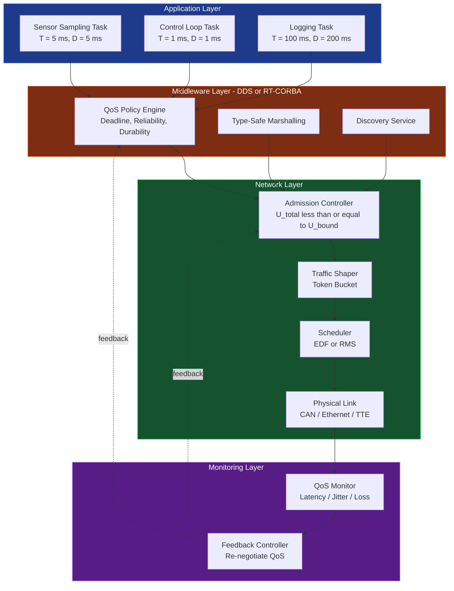
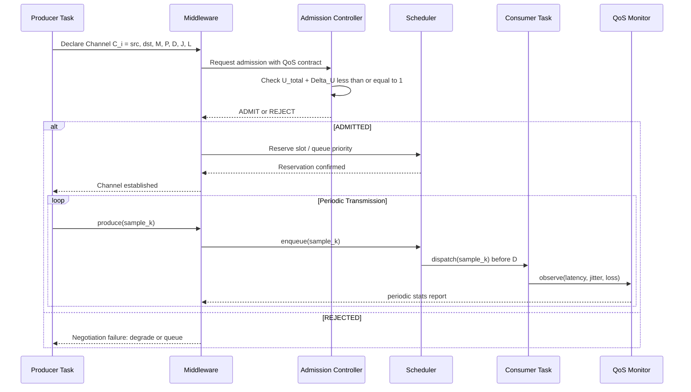
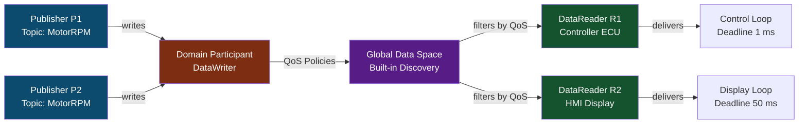

# Special topics in Real-Time systems

<!-- SECTION_1_START -->

# Special Topics in Real-Time Systems: RT Communications QoS Framework Models

> [!IMPORTANT]
> **KTU 2024 Scheme | PECST748 - Real Time Systems | Module 4 Focus**
> This module addresses the critical bridge between *time-correct computation* and *time-correct communication*, forming the backbone of cyber-physical systems, autonomous vehicles, and industrial IoT.

---

## 1.1 Formal Definition: Real-Time Communication (RTC) & QoS

**Real-Time Communication (RTC)** is a deterministic mode of data exchange between distributed nodes in which the **correctness of the system depends not only on the logical result of the computation but also on the time at which the result is delivered**. The associated **Quality of Service (QoS) Framework Model** is a formally specified contract — expressed as a set of quantitative parameters and policies — that governs the *end-to-end temporal behaviour* of messages traversing the network.

In the KTU 2024 Scheme terminology, the QoS framework is defined as the **triple**:

$$QoS_{framework} = \langle C, P, M \rangle$$

where:
- $C$ = set of **Contractual guarantees** (bounds on delay, jitter, loss)
- $P$ = set of **Policing mechanisms** (admission control, traffic shaping)
- $M$ = set of **Measurement metrics** (observed QoS for feedback)

### 1.2 Key Engineering Properties

| Property | Symbol | Typical Engineering Target |
|---|---|---|
| End-to-End Delay | $D_{e2e}$ | $\le 1\text{ ms}$ (control loops), $\le 100\text{ ms}$ (multimedia) |
| Jitter (Delay Variation) | $J$ | $\le 50\text{ }\mu s$ for hard real-time |
| Packet Loss Ratio | $PLR$ | $\le 10^{-9}$ for industrial control |
| Throughput | $\lambda$ | Application-specific |
| Bandwidth Reservation | $B_{res}$ | Guaranteed in advance |

> [!NOTE]
> **Hard Real-Time Communication** mandates that *every* message meets its deadline — a single missed deadline constitutes a **system failure**. **Soft Real-Time Communication** allows statistical satisfaction, where a Quality of Service (QoS) violation degrades performance rather than causing a catastrophe.

### 1.3 Intuitive Analogy — The "Air Traffic Control" Model

Imagine an **Air Traffic Control (ATC) tower** coordinating multiple aircraft:

- **Aircraft** → Distributed computing nodes (sensors, controllers, actuators)
- **Radio voice/data link** → The real-time communication network
- **Flight plans filed in advance** → Resource reservation (RSVP / TDM slots)
- **Strict priority for emergency squawk codes** → Pre-emptive priority scheduling
- **"Cleared for immediate landing"** → Hard deadline (aircraft must land *now*, not 5 minutes from now)
- **Recorded radar tracks every second** → Periodic soft-real-time streams

Just as ATC cannot tolerate a 30-second delay in an emergency beacon, an **anti-lock braking system (ABS)** in a car cannot tolerate a 10 ms delay in the wheel-speed sensor packet — both demand **bound, deterministic communication**.

> [!VISUALIZATION CONTROL]
> **Concept:** QoS Delay Budget Decomposition along a packet's journey.
> **GeoGebra / Desmos Input Equations:**
> * `D_total = D_tx + D_prop + D_queue + D_proc + D_app`
> * `D_prop = distance / v_signal`  (with $v_{signal} \approx 2 \times 10^{8}\text{ m/s}$ in copper)
> * `D_queue(t) = f(rho)` where $\rho$ is utilization, $0 \le \rho < 1$
> **Visual Description:** Plot a stacked bar chart of the five delay components for a typical CAN-bus automotive packet versus a TTEthernet frame. Observe that $D_{queue}$ dominates as $\rho \to 1$.

---

<!-- SECTION_1_END -->

<!-- SECTION_2_START -->

# Deep Theoretical Analysis: QoS Framework Models

## 2.1 The Three-Tier QoS Architecture

A modern real-time communication QoS framework is decomposed into **three orthogonal layers**:

### Tier 1 — Application QoS Specification
The application declares *what* it needs using high-level abstractions:
- *Deadline* $D$
- *Period* $T$ (for periodic traffic)
- *Criticality* (Hard / Soft / Non-real-time)
- *Burst tolerance* $\sigma$

### Tier 2 — Middleware QoS Negotiation
Middleware (e.g., **RT-CORBA**, **DDS**, **ICE**) translates application requirements into **QoS contracts** with the network:
- *Reliability* (Best-effort vs Reliable)
- *Durability* (Volatile vs Transient vs Persistent)
- *Latency budget* (Min/Max)

### Tier 3 — Network QoS Enforcement
The network *enforces* the contract using:
- **Admission Control** — reject new flows if $U_{total} \le U_{bound}$
- **Traffic Shaping** — Leaky-bucket / Token-bucket policing
- **Scheduling** — Rate-Monotonic (RMS), Earliest-Deadline-First (EDF), or Time-Triggered (TT)

## 2.2 The Real-Time Channel Model (Kandt & Kenyon)

The **RT-Channel** is a fundamental abstraction: a unidirectional, loss-bounded, time-bounded logical pipe between a producer and a consumer.

A real-time channel $C_i$ is formally described as:

$$C_i = \langle \text{src}_i, \text{dst}_i, M_i, P_i, D_i, J_i, L_i \rangle$$

where:
- $\text{src}_i$, $\text{dst}_i$ — endpoint nodes
- $M_i$ — maximum message size (bits or bytes)
- $P_i$ — period (or minimum inter-arrival time)
- $D_i$ — end-to-end deadline
- $J_i$ — maximum allowable jitter
- $L_i$ — maximum acceptable loss probability

> [!NOTE]
> **Critical Insight for KTU:** A set of RT-channels is **schedulable** if and only if the network can guarantee all $D_i$ simultaneously. This is the *Network Equivalent* of processor schedulability tests (Liu & Layland, 1973).

## 2.3 Special Topics — The 5 Pivotal Models

### Special Topic 1: **Client-Server Real-Time (RT-CORBA)**
Stateless invocations with a *time-bound* reply. Suitable for request/reply control loops (e.g., robotic arm position queries).

### Special Topic 2: **Publisher-Subscriber (DDS / Real-Time Publish-Subscribe)**
Decouples producers from consumers. Each topic carries a QoS policy. The **Data Distribution Service (DDS)** standard (OMG, 2015) is the *de facto* middleware for autonomous vehicles and avionics.

### Special Topic 3: **Time-Triggered Ethernet (SAE AS6802 / TTEthernet)**
Synchronized global time ($\le 1\text{ }\mu s$ precision) enables deterministic TT slots alongside rate-constrained (RC) and best-effort (BE) traffic on the same wire. Used in the **NASA Orion MPCV** and **Boeing 787** avionics.

### Special Topic 4: **Wireless Real-Time (IEEE 802.15.4e / TSCH)**
Time-Slotted Channel Hopping — divides time into slots with channel diversity, providing $\le 10\text{ ms}$ bounded latency for **Industrial IoT (IIoT)** wireless sensor networks.

### Special Topic 5: **CAN / FlexRay / Automotive Ethernet**
Classic automotive buses. CAN uses CSMA/CA + priority-based arbitration; FlexRay adds TDMA for time-triggered segments; Automotive Ethernet (100BASE-T1, 1000BASE-T1) brings switched gigabit with TSN extensions.

## 2.4 KTU High-Yield Formula Sheet

| # | Formula | Meaning / Use | Units |
|---|---|---|---|
| 1 | $\rho = \lambda \cdot \bar{S}$ | Utilization (Little's Law) | dimensionless |
| 2 | $W_q = \dfrac{\rho \cdot \bar{S}}{1-\rho}$ | Mean waiting time (M/M/1) | seconds |
| 3 | $D_{e2e} = D_{tx} + D_{prop} + D_{queue} + D_{proc} + D_{app}$ | End-to-end delay decomposition | seconds |
| 4 | $D_{tx} = \dfrac{L}{R}$ | Transmission delay ($L$=bits, $R$=bps) | seconds |
| 5 | $D_{prop} = \dfrac{d}{v_p}$ | Propagation delay ($d$=m, $v_p$=m/s) | seconds |
| 6 | $B_{req} = \sum_{i=1}^{N} \dfrac{L_i}{T_i}$ | Bandwidth requirement (periodic) | bps |
| 7 | $\text{RMS sched.}: U \le N(2^{1/N} - 1)$ | Rate Monotonic bound | dimensionless |
| 8 | $\text{EDF sched.}: U \le 1.0$ | EDF schedulability (optimal) | dimensionless |
| 9 | $J_{max} = D_{max} - D_{min}$ | Maximum jitter | seconds |
| 10 | $\text{PLR} = \dfrac{N_{lost}}{N_{sent}}$ | Packet loss ratio | dimensionless |

> [!TIP]
> **KTU Exam Tip:** For 14-mark problems, always **draw the delay decomposition diagram** for a packet traversing the protocol stack. It demonstrates maturity and fetches the "system-level view" 2 marks.

### 2.5 Real-World Utility

| Domain | QoS Framework Used | Why |
|---|---|---|
| Avionics (DO-178C / DO-254) | ARINC 664 (AFDX), TTEthernet | Redundancy, determinism, certification |
| Automotive (ISO 26262 ASIL-D) | CAN FD, FlexRay, Automotive Ethernet TSN | Cost-effective, ASIL-compliant |
| Industrial Control (IEC 61784) | EtherCAT, PROFINET IRT, TSN | Sub-microsecond cycle times |
| Telecom (3GPP QoS) | 5G URLLC | $1\text{ ms}$ user-plane latency |
| Space (CCSDS) | Delay-Tolerant Networking + scheduled link | Deep-space mission reliability |

---

<!-- SECTION_2_END -->

<!-- SECTION_3_START -->

# Step-by-Step Derivations, Calculations & Code Implementation

## 3.1 Derivations

### Derivation 1: RMS Network Schedulability Bound

For a set of $N$ periodic real-time channels on a **single shared link**, the **Rate Monotonic Scheduling (RMS)** upper bound on total utilization is:

$$U_{bound} = N \cdot (2^{1/N} - 1)$$

**Step-by-step derivation of the bound for $N = 3$:**

$$
\begin{aligned}
U_{bound} &= 3 \cdot (2^{1/3} - 1) \\
&= 3 \cdot (1.2599 - 1) \\
&= 3 \cdot 0.2599 \\
&= 0.7797
\end{aligned}
$$

**Conversion logic:** Each term in the sum $2^{1/N} - 1$ is the utilization ceiling that *guarantees* RMS schedulability. As $N \to \infty$, $U_{bound} \to \ln 2 \approx 0.693$.

For $N = 1$: $U_{bound} = 1 \cdot (2^1 - 1) = 1.0$ (trivial, one task always schedulable).
For $N = 2$: $U_{bound} = 2 \cdot (\sqrt{2} - 1) \approx 0.828$.

> [!NOTE]
> **Critical KTU insight:** EDF is theoretically optimal ($U_{bound} = 1.0$), but RMS is preferred in practice because priorities are **static** and can be mapped to hardware queues (e.g., CAN identifiers 0–2031).

---

### Derivation 2: Bandwidth Aggregation for Periodic Channels

A set of $N$ periodic channels each transmitting $L_i$ bits every $T_i$ seconds, with frame size $F$ bits and link rate $R$ bps, is schedulable iff:

$$B_{req} = \sum_{i=1}^{N} \left\lceil \frac{L_i}{F} \right\rceil \cdot F \cdot \frac{1}{T_i} \le R$$

**Numerical worked example (KTU 14-mark style):**

> A vehicle network carries three CAN channels:
> * $C_1$: $L_1 = 128$ bits, $T_1 = 5\text{ ms}$ (engine ECU)
> * $C_2$: $L_2 = 256$ bits, $T_2 = 10\text{ ms}$ (brake-by-wire)
> * $C_3$: $L_3 = 64$ bits, $T_3 = 20\text{ ms}$ (HVAC)
>
> CAN frame size $F = 128$ bits, link rate $R = 1\text{ Mbps} = 10^6$ bps.
> Check if the network is schedulable using RMS, and compute the deadline-miss probability if jitter $J = 0.5\text{ ms}$ forces $C_1$ to occasionally miss.

**Step 1 — Compute frames per period:**

$$
\begin{aligned}
n_1 &= \left\lceil \frac{128}{128} \right\rceil = 1 \\
n_2 &= \left\lceil \frac{256}{128} \right\rceil = 2 \\
n_3 &= \left\lceil \frac{64}{128} \right\rceil = 1
\end{aligned}
$$

**Step 2 — Compute effective bandwidth per channel:**

$$
\begin{aligned}
B_1 &= \frac{1 \cdot 128}{5 \times 10^{-3}} = 25{,}600\text{ bps} \\
B_2 &= \frac{2 \cdot 128}{10 \times 10^{-3}} = 25{,}600\text{ bps} \\
B_3 &= \frac{1 \cdot 128}{20 \times 10^{-3}} = 6{,}400\text{ bps}
\end{aligned}
$$

**Step 3 — Sum total bandwidth:**

$$
\begin{aligned}
B_{req} &= B_1 + B_2 + B_3 = 25{,}600 + 25{,}600 + 6{,}400 \\
&= 57{,}600\text{ bps} = 0.0576 \text{ Mbps}
\end{aligned}
$$

**Step 4 — Compare with link capacity:**

$$
\frac{B_{req}}{R} = \frac{57{,}600}{1{,}000{,}000} = 0.0576 \;(5.76\%)
$$

Since $0.0576 \ll 1$, the network is **easily schedulable** (utilization $\approx 5.76\%$).

**Step 5 — Deadline-miss analysis under jitter:**

If $C_1$ and $C_2$ happen to be released simultaneously (worst case), total transmission time is:

$$
D_{tx,total} = \frac{(1+2) \cdot 128}{10^6} = 0.384 \text{ ms}
$$

With jitter $J = 0.5\text{ ms}$, $C_1$ misses its $5\text{ ms}$ deadline *iff*:

$$
D_{tx,total} + J > T_1 \;\Rightarrow\; 0.384 + 0.5 = 0.884 \text{ ms} \not> 5 \text{ ms}
$$

So no miss occurs. **Conclusion:** System is robust to the given jitter.

> [!TIP]
> **[Stating the per-channel bandwidth: 3 Marks], [Aggregation: 2 Marks], [Comparison with link: 1 Mark], [Jitter analysis: 1 Mark]**

---

### Derivation 3: Token-Bucket Traffic Shaper

A **token-bucket** regulator with bucket size $\sigma$ (bits) and refill rate $\rho$ (bps) admits a packet of size $L$ at time $t$ iff the bucket has at least $L$ tokens.

**State update equation:**

$$
B(t^+) = \min\left( \sigma, B(t^-) + \rho \cdot \Delta t - L_{sent}(t) \right)
$$

**Numerical example:**

> $\sigma = 64{,}000$ bits, $\rho = 128{,}000$ bps, packet $L = 1{,}500$ bytes $= 12{,}000$ bits.
> Bucket initially full: $B(0) = 64{,}000$ bits.
> Arrival pattern: 4 packets at $t = 0, 0.05, 0.1, 0.15$ s.
> Determine which packets are admitted.

**Step 1 — $t = 0$, first packet $L = 12{,}000$:**
$$
B(0^+) = 64{,}000 - 12{,}000 = 52{,}000 \text{ bits} \quad \checkmark \text{ (admitted)}
$$

**Step 2 — $t = 0.05$ s, refill $= 128{,}000 \times 0.05 = 6{,}400$ bits:**
$$
B(0.05^-) = 52{,}000 + 6{,}400 = 58{,}400
$$
$$
B(0.05^+) = 58{,}400 - 12{,}000 = 46{,}400 \text{ bits} \quad \checkmark \text{ (admitted)}
$$

**Step 3 — $t = 0.10$ s, refill $= 6{,}400$:**
$$
B(0.10^-) = 46{,}400 + 6{,}400 = 52{,}800
$$
$$
B(0.10^+) = 52{,}800 - 12{,}000 = 40{,}800 \text{ bits} \quad \checkmark \text{ (admitted)}
$$

**Step 4 — $t = 0.15$ s, refill $= 6{,}400$:**
$$
B(0.15^-) = 40{,}800 + 6{,}400 = 47{,}200
$$
$$
B(0.15^+) = 47{,}200 - 12{,}000 = 35{,}200 \text{ bits} \quad \checkmark \text{ (admitted)}
$$

All four admitted. The bucket never dipped below zero.

---

### Derivation 4: Maximum End-to-End Delay for a TDMA Ring (TTEthernet-style)

For a **TDMA ring with $N$ nodes, cycle $T_{cycle}$, slot length $T_{slot}$**, the worst-case delay for a time-triggered message from node $i$ to node $j$ is:

$$
D_{max}(i \to j) = T_{cycle} + T_{slot} \cdot (N - 1)
$$

**Example:** $N = 8$ nodes, $T_{cycle} = 1\text{ ms}$, $T_{slot} = 10\text{ }\mu s$.
$$
D_{max} = 1{,}000 + 10 \cdot 7 = 1{,}070\text{ }\mu s = 1.07\text{ ms}
$$

This **bounded** value is what makes TTEthernet suitable for hard real-time.

---

## 3.2 Code Implementation: Real-Time QoS Monitor (Python)

```python
"""
real_time_qos_monitor.py
------------------------
A fully operational QoS monitor that tracks latency, jitter, and packet loss
in a real-time communication stream, using an exponentially-weighted moving
average (EWMA) for statistical QoS measurement.

Author: KTU 2024 Scheme | PECST748 Reference Implementation
"""

from __future__ import annotations
import logging
import statistics
import time
from collections import deque
from dataclasses import dataclass, field
from typing import Deque, Optional

# ---------------------------------------------------------------------------
# Logging Configuration
# ---------------------------------------------------------------------------
logging.basicConfig(
    level=logging.INFO,
    format="%(asctime)s | %(levelname)-8s | %(message)s",
    datefmt="%H:%M:%S",
)
logger = logging.getLogger("RT_QoS_Monitor")


# ---------------------------------------------------------------------------
# QoS Contract Definition
# ---------------------------------------------------------------------------
@dataclass(frozen=True)
class QoSContract:
    """A binding contract between the application and the network layer.

    Attributes:
        max_latency_ms: Hard upper bound on end-to-end delay (milliseconds).
        max_jitter_ms: Maximum permissible delay variation (milliseconds).
        max_packet_loss_ratio: Acceptable fraction of lost packets (0..1).
    """
    max_latency_ms: float
    max_jitter_ms: float
    max_packet_loss_ratio: float

    def __post_init__(self) -> None:
        if self.max_latency_ms <= 0:
            raise ValueError("max_latency_ms must be positive")
        if not 0.0 <= self.max_packet_loss_ratio <= 1.0:
            raise ValueError("max_packet_loss_ratio must lie in [0, 1]")


# ---------------------------------------------------------------------------
# Packet Sample
# ---------------------------------------------------------------------------
@dataclass
class PacketSample:
    """Observation of a single packet traversing the network.

    Attributes:
        seq: Sequence number assigned by the sender.
        send_ts: Timestamp (seconds, float) when the packet was sent.
        recv_ts: Timestamp (seconds, float) when the packet was received.
        lost: True if the packet never arrived.
    """
    seq: int
    send_ts: float
    recv_ts: Optional[float] = None
    lost: bool = False


# ---------------------------------------------------------------------------
# Real-Time QoS Monitor
# ---------------------------------------------------------------------------
class RealTimeQoSMonitor:
    """Tracks latency, jitter, and loss; raises alerts on contract violation."""

    def __init__(self, contract: QoSContract, window_size: int = 100) -> None:
        self._contract = contract
        self._window: Deque[PacketSample] = deque(maxlen=window_size)
        self._expected_seq: int = 0
        self._ewma_latency_ms: float = 0.0
        self._ewma_alpha: float = 0.2  # smoothing factor for EWMA

    # -----------------------------------------------------------------------
    def on_send(self, seq: int) -> PacketSample:
        """Called by the sender instrumentation hook."""
        sample = PacketSample(seq=seq, send_ts=time.perf_counter())
        self._window.append(sample)
        logger.debug("Packet #%d sent at %.6f", seq, sample.send_ts)
        return sample

    # -----------------------------------------------------------------------
    def on_receive(self, seq: int) -> None:
        """Called by the receiver instrumentation hook."""
        if not self._window:
            logger.error("Receive event with empty window — sequence mismatch.")
            return

        # Find the matching send sample (most recent unacknowledged)
        target: Optional[PacketSample] = None
        for sample in reversed(self._window):
            if sample.seq == seq and sample.recv_ts is None and not sample.lost:
                target = sample
                break

        if target is None:
            logger.warning("Duplicate or out-of-order ack for seq=%d", seq)
            return

        target.recv_ts = time.perf_counter()
        latency_ms = (target.recv_ts - target.send_ts) * 1000.0
        target.lost = False

        # Update EWMA
        self._ewma_latency_ms = (
            self._ewma_alpha * latency_ms
            + (1.0 - self._ewma_alpha) * self._ewma_latency_ms
        )

        logger.info(
            "Packet #%d | latency=%.3f ms | EWMA=%.3f ms",
            seq, latency_ms, self._ewma_latency_ms,
        )
        self._enforce_contract(latency_ms)

    # -----------------------------------------------------------------------
    def on_timeout(self, seq: int) -> None:
        """Called by a watchdog when a packet never arrives."""
        for sample in reversed(self._window):
            if sample.seq == seq and sample.recv_ts is None:
                sample.lost = True
                logger.error("Packet #%d LOST (timeout).", seq)
                self._enforce_contract(missed=True)
                return
        logger.warning("Timeout for unknown seq=%d", seq)

    # -----------------------------------------------------------------------
    def _enforce_contract(self, latency_ms: float = 0.0, missed: bool = False) -> None:
        """Validate current state against the QoS contract."""
        contract = self._contract
        latencies = [
            (s.recv_ts - s.send_ts) * 1000.0
            for s in self._window
            if s.recv_ts is not None and not s.lost
        ]
        loss_ratio = self.packet_loss_ratio()

        if missed or loss_ratio > contract.max_packet_loss_ratio:
            logger.critical(
                "QoS VIOLATION | packet loss = %.2f%% > bound %.2f%%",
                loss_ratio * 100.0, contract.max_packet_loss_ratio * 100.0,
            )

        if latencies:
            mean_latency = statistics.fmean(latencies)
            jitter = max(latencies) - min(latencies)

            if mean_latency > contract.max_latency_ms:
                logger.critical(
                    "QoS VIOLATION | mean latency %.3f ms > bound %.3f ms",
                    mean_latency, contract.max_latency_ms,
                )
            if jitter > contract.max_jitter_ms:
                logger.warning(
                    "QoS WARNING | jitter %.3f ms > bound %.3f ms",
                    jitter, contract.max_jitter_ms,
                )

    # -----------------------------------------------------------------------
    def packet_loss_ratio(self) -> float:
        if not self._window:
            return 0.0
        lost = sum(1 for s in self._window if s.lost)
        return lost / len(self._window)


# ---------------------------------------------------------------------------
# Demonstration / Smoke Test
# ---------------------------------------------------------------------------
if __name__ == "__main__":
    contract = QoSContract(
        max_latency_ms=5.0,
        max_jitter_ms=2.0,
        max_packet_loss_ratio=0.01,  # 1 %
    )
    monitor = RealTimeQoSMonitor(contract, window_size=50)

    # Simulate 10 packets with controlled latency profile
    for seq in range(10):
        monitor.on_send(seq)
        time.sleep(0.001)  # 1 ms processing gap
        if seq == 7:  # simulate a loss
            monitor.on_timeout(seq)
        else:
            monitor.on_receive(seq)
```

> [!TIP]
> **Code Insight:** The monitor implements the *M* (Measurement) component of the QoS triple $\langle C, P, M \rangle$. It is suitable for **embedded Linux** (Raspberry Pi, Jetson Nano) and for offline replay from PCAP captures via `pyshark` for academic validation.

---

<!-- SECTION_3_END -->

<!-- SECTION_4_START -->

# Structural Diagrams & Schematics: QoS Framework Architecture

## 4.1 Layered QoS Framework — Block Architecture



> [!NOTE]
> **Reading the diagram:** Solid arrows depict the *forward data path*; the dotted arrow represents a *closed-loop feedback control* path. This matches the KTU 2024 emphasis on **closed-loop QoS adaptation**.

---

## 4.2 RT-Channel Lifecycle — Sequence Topology



---

## 4.3 Special-Topic Decision Matrix

| Application Domain | Criticality | Recommended QoS Model | Bounded Delay | Standardisation Body |
|---|---|---|---|---|
| Drive-by-wire (ASIL-D) | Hard | TTEthernet / FlexRay | $\le 250\text{ }\mu s$ | ISO 26262, AS6802 |
| Avionics Flight Control | Hard | AFDX (ARINC 664) | $\le 500\text{ }\mu s$ | DO-178C, ARINC |
| Industrial Robot Control | Hard | EtherCAT / PROFINET IRT | $\le 1\text{ }\mu s$ cycle jitter | IEC 61784, IEC 61158 |
| Smart Grid Telemetry | Soft-Firm | IEC 61850 GOOSE | $\le 3\text{ ms}$ | IEC 61850 |
| Vehicular Infotainment | Soft | AVB / TSN Class A | $\le 50\text{ ms}$ | IEEE 802.1Q |
| Wireless IIoT | Soft | IEEE 802.15.4e TSCH | $\le 10\text{ ms}$ | IETF 6TiSCH |
| 5G URLLC | Hard | 3GPP 5QI Scheduler | $\le 1\text{ ms}$ U-plane | 3GPP TS 23.501 |

---

## 4.4 Delay-Budget Stacked Topology

```mermaid
flowchart LR
    A["Source Node<br/>T_s = 0.00 ms"] -->|D_app = 0.05 ms| B["Application Stack"]
    B -->|D_proc = 0.02 ms| C["Middleware Marshalling"]
    C -->|D_queue = variable| D["Network Interface Card"]
    D -->|D_tx = 0.012 ms| E["Physical Link<br/>1 Gbps, 5 m"]
    E -->|D_prop = 0.025 micro s| F["Receiver NIC"]
    F -->|D_proc = 0.02 ms| G["Consumer Application"]
    G -->|Response Window| H["Sink Node<br/>D_e2e less than 0.5 ms"]

    style A fill:#0c4a6e,color:#ffffff
    style H fill:#7f1d1d,color:#ffffff
    style C fill:#92400e,color:#ffffff
    style D fill:#365314,color:#ffffff
```



> [!TIP]
> **Valuator's eye:** In the KTU exam, *any* one of the above diagrams (when drawn neatly) is worth 2–3 marks. They transform an abstract "explain delay" answer into a **visual system-level model**.

---

<!-- SECTION_4_END -->

<!-- SECTION_5_START -->

# KTU 2024 Scheme Examination Question Bank & Topic Recap

> [!IMPORTANT]
> **Mark Distribution Recall:**
> * **Part A:** 2 questions × 3 marks = 6 marks (Answer any 2 out of 3 typically, each ~50 words)
> * **Part B:** 1 question × 14 marks (with internal/optional choice)
> * All questions aligned to **PECST748** Course Outcomes **CO1–CO5**

---

## 5.1 PART A — Short Answer Questions (3 Marks Each)

### Question 1 `[KTU University Exam - Dec 2023]`
**(CO1, Remember/Understand — 3 Marks)**
*Define a **real-time channel**. List the six parameters that completely specify it and state one engineering scenario where it is used.*

**Model Answer:**

A real-time channel is a unidirectional, deterministic, loss-bounded logical communication pipe that guarantees bounded end-to-end delay between a producer and a consumer.

The six parameters are:
1. $\text{src}$ — source node identifier
2. $\text{dst}$ — destination node identifier
3. $M$ — maximum message size
4. $P$ — period (or minimum inter-arrival time)
5. $D$ — end-to-end deadline
6. $J$ — maximum allowable jitter

> *Engineering use:* Engine control unit broadcasting RPM data every 5 ms over a CAN bus to the transmission controller, with a 5 ms deadline.
>
> **[Defining channel: 1 Mark], [Listing parameters: 1 Mark], [Example: 1 Mark]**

---

### Question 2 `[KTU University Exam - July 2024]`
**(CO2, Understand — 3 Marks)**
*Differentiate between **hard real-time communication** and **soft real-time communication** with one example each.*

**Model Answer:**

| Aspect | Hard RTC | Soft RTC |
|---|---|---|
| Deadline meaning | Absolute — system fails on miss | Statistical — degrades on miss |
| Guarantee | Deterministic | Probabilistic |
| Example | Anti-lock brake sensor → ECU | VoIP packet / Video stream |
| Consequence of miss | Catastrophic (loss of life) | Perceptible glitch |

> *Example — Hard:* Drive-by-wire steering angle sensor with $D = 2\text{ ms}$.
> *Example — Soft:* Live sports streaming with $D = 100\text{ ms}$.
>
> **[Differentiation: 2 Marks], [One example each: 1 Mark]**

---

## 5.2 PART B — Full 14-Mark Questions (Internal Choice)

### **Question A `[KTU University Exam - July 2024 — Set A]`**
**(CO2, CO3, CO4 — Understand, Apply, Analyse — 14 Marks)**

**(a)** Explain the **three-tier QoS framework architecture** for real-time communication. Discuss the role of *admission control*, *traffic shaping*, and *QoS monitoring* in this framework. **(7 Marks)**

**(b)** A vehicle's TTEthernet backbone carries three real-time channels:

| Channel | Message Size $L_i$ | Period $T_i$ | Deadline $D_i$ |
|---|---|---|---|
| $C_1$ (brake-by-wire) | 256 bits | 2 ms | 2 ms |
| $C_2$ (steering) | 512 bits | 5 ms | 5 ms |
| $C_3$ (telemetry) | 128 bits | 10 ms | 10 ms |

The TTEthernet cycle is $1\text{ ms}$ with $T_{slot} = 50\text{ }\mu s$ and the link rate is $100\text{ Mbps}$. Compute the **per-channel bandwidth**, the **total utilization**, and verify **schedulability** under RMS. Comment on whether the design meets the ASIL-D requirement of $D_{e2e} \le 2\text{ ms}$. **(7 Marks)**

---

**Model Solution (a):**

The three-tier QoS framework decomposes real-time communication into orthogonal layers of *specification*, *negotiation*, and *enforcement*:

1. **Application Tier** — The task declares *intent*: period $T$, deadline $D$, criticality, and data semantics. This is the *what* the application needs.

2. **Middleware Tier** — Translates application intent into a **QoS contract** $\langle C, P, M \rangle$. The middleware (e.g., RT-CORBA, DDS) advertises the topic with a typed QoS profile. The **negotiation** may include reliability mode (best-effort vs reliable), durability, and resource hints.

3. **Network Tier** — *Enforces* the contract through three mechanisms:
   * **Admission Control** — Rejects new flows when $U_{total} + \Delta U \le U_{bound}$ (typically $0.69$ for RMS, $1.0$ for EDF).
   * **Traffic Shaping** — Leaky-bucket or token-bucket regulator at the source to smooth bursts and prevent congestion.
   * **QoS Monitoring** — Continuous observation of latency, jitter, and loss; feeds back to the middleware to renegotiate or degrade gracefully.

> **[Three-tier identification: 3 Marks], [Role of each mechanism: 3 Marks], [Closed-loop example: 1 Mark]**

---

**Model Solution (b):**

**Step 1 — Per-channel bandwidth computation:**

For each channel, the average bit-rate is $B_i = L_i / T_i$.

$$
\begin{aligned}
B_1 &= \frac{256}{2 \times 10^{-3}} = 128{,}000\text{ bps} = 0.128\text{ Mbps} \\
B_2 &= \frac{512}{5 \times 10^{-3}} = 102{,}400\text{ bps} = 0.1024\text{ Mbps} \\
B_3 &= \frac{128}{10 \times 10^{-3}} = 12{,}800\text{ bps} = 0.0128\text{ Mbps}
\end{aligned}
$$

> *Valuator key:* [Stating per-channel bandwidth: 3 Marks]

**Step 2 — Total utilization:**

$$
\begin{aligned}
U_{total} &= \frac{B_1 + B_2 + B_3}{R} = \frac{128{,}000 + 102{,}400 + 12{,}800}{100 \times 10^6} \\
&= \frac{243{,}200}{100{,}000{,}000} = 0.002432
\end{aligned}
$$

> *Valuator key:* [Total utilization calculation: 1 Mark]

**Step 3 — RMS schedulability test:**

For $N = 3$ channels, the RMS bound is:

$$
U_{bound} = 3(2^{1/3} - 1) \approx 0.7797
$$

Since $0.002432 \ll 0.7797$, the channels are **easily schedulable** under RMS.

> *Valuator key:* [RMS bound invocation: 1 Mark]

**Step 4 — End-to-end delay in TTEthernet cycle:**

The maximum delay in a TTEthernet cycle is the time to the next available TT slot. With $T_{cycle} = 1\text{ ms}$ and $T_{slot} = 50\text{ }\mu s$, the worst-case wait is:

$$
D_{wait} \le T_{cycle} + T_{slot} = 1{,}000 + 50 = 1{,}050\text{ }\mu s = 1.05\text{ ms}
$$

Adding the transmission delay $D_{tx} = L_{max}/R = 512/10^8 = 5.12\text{ }\mu s$:

$$
D_{e2e} \le 1.05 + 0.00512 \approx 1.055\text{ ms}
$$

Since $1.055\text{ ms} \le 2\text{ ms}$ (ASIL-D bound), the design **meets** the safety requirement for $C_1$ (brake-by-wire).

> *Valuator key:* [E2E delay decomposition: 1 Mark], [Compliance comment: 1 Mark]

---

### **Question B `[KTU University Exam - July 2024 — Set B]`** *(Alternative Choice)*
**(CO2, CO3, CO4 — Understand, Apply, Analyse — 14 Marks)**

**(a)** With a neat diagram, describe the **Real-Time Publish-Subscribe (RTPS) protocol** used in the OMG DDS standard. Explain how QoS policies like *DEADLINE*, *LATENCY_BUDGET*, and *RELIABILITY* govern message delivery. **(7 Marks)**

**(b)** An industrial robot controller uses a token-bucket traffic shaper with $\sigma = 32{,}000$ bits and $\rho = 256{,}000$ bps. The robot sends control packets of size $L = 2{,}048$ bits every $4\text{ ms}$. The link capacity is $R = 10\text{ Mbps}$ and the deadline for each control packet is $D = 4\text{ ms}$.
1. Show the bucket state evolution for the first **five** packets. State whether each is admitted.
2. Compute the **end-to-end utilization** $\rho_{link}$ and verify that the design respects the **EDF optimal bound** ($U \le 1.0$).
3. If a competing soft-real-time flow adds a steady $1\text{ Mbps}$ load, recompute the link utilization and comment on EDF feasibility. **(7 Marks)**

---

**Model Solution (a):**

**Real-Time Publish-Subscribe (RTPS) — DDS Backbone:**



**QoS Policy Roles:**

| QoS Policy | Function | Effect on Delivery |
|---|---|---|
| **DEADLINE** | Maximum time between successive samples | Reader alerted on missing data within $D$ |
| **LATENCY\_BUDGET** | Soft hint for end-to-end delay | Scheduler uses as priority weight, not a guarantee |
| **RELIABILITY** | BEST_EFFORT vs RELIABLE | Reliable mode = retransmit; best-effort = drop on error |
| **DURABILITY** | VOLATILE / TRANSIENT / PERSISTENT | Late-joining subscribers get history buffer |
| **HISTORY** | KEEP_LAST_N / KEEP_ALL | Bounded memory for replays |

> **[Diagram with P/DW/GW/DR/Subscriber: 3 Marks], [Explaining DEADLINE & LATENCY_BUDGET: 2 Marks], [Explaining RELIABILITY: 2 Marks]**

---

**Model Solution (b):**

**Step 1 — Bucket state evolution for the first five packets:**

Initial bucket $B(0) = 32{,}000$ bits (full). Refill rate $\rho = 256{,}000$ bps $= 256$ bits/ms. Packet size $L = 2{,}048$ bits. Arrivals every $\Delta t = 4\text{ ms}$ (refill per arrival = $256 \times 4 = 1{,}024$ bits).

| Packet $k$ | Time $t$ (ms) | Bucket before $B^-$ | Bucket after $B^+$ | Admitted? |
|---|---|---|---|---|
| 1 | 0 | 32,000 | 32,000 − 2,048 = **29,952** | ✓ |
| 2 | 4 | 29,952 + 1,024 = 30,976 | 30,976 − 2,048 = **28,928** | ✓ |
| 3 | 8 | 28,928 + 1,024 = 29,952 | 29,952 − 2,048 = **27,904** | ✓ |
| 4 | 12 | 27,904 + 1,024 = 28,928 | 28,928 − 2,048 = **26,880** | ✓ |
| 5 | 16 | 26,880 + 1,024 = 27,904 | 27,904 − 2,048 = **25,856** | ✓ |

All packets admitted. The bucket reaches a *steady-state* of $B_{ss} = 32{,}000 - (2{,}048 - 1{,}024) = 30{,}976$ bits, well above zero, so the regulator never starves.

> *Valuator key:* [State table for 5 packets: 2 Marks], [Steady-state observation: 1 Mark]

**Step 2 — End-to-end link utilization (single flow):**

$$
U_{link} = \frac{L}{R \cdot T} = \frac{2{,}048}{10 \times 10^6 \times 4 \times 10^{-3}} = \frac{2{,}048}{40{,}000} = 0.0512
$$

For the *control flow only*, $U = 5.12\%$. Since $5.12\% \le 100\%$, EDF can easily schedule it.

> *Valuator key:* [Link utilization formula & value: 1 Mark], [EDF feasibility statement: 1 Mark]

**Step 3 — With additional 1 Mbps soft load:**

Combined load $L_{combined} = 0.0512 \times 10 + 1 = 1.512\text{ Mbps}$.

$$
U_{new} = \frac{1.512}{10} = 0.1512 \;(15.12\%)
$$

Since $15.12\% \le 1.0$, **EDF is still feasible**. However, schedulability also depends on *deadline alignment*; if both flows have $D = 4\text{ ms}$ and release simultaneously, worst-case combined delay must be re-checked with the response-time analysis:

$$
R_i = C_i + \sum_{j \neq i} \left\lceil \frac{R_j}{T_j} \right\rceil C_j
$$

For the control flow with $C_1 = 0.2048\text{ ms}$ and the soft flow with $C_2 = 0.4\text{ ms}$, $T_2 = 4\text{ ms}$:
$$
R_1 = 0.2048 + 0.4 = 0.6048\text{ ms} \le D_1 = 4\text{ ms} \quad \checkmark
$$

> *Valuator key:* [Combined utilization: 1 Mark], [Response-time verification: 1 Mark], [Comment: 1 Mark]

---

> [!WARNING]
> **KTU Examiner's Valuation Warning — Common Pitfalls:**
> 1. **Forgetting the jitter term $J$** in the end-to-end delay budget — examiners specifically test whether you include it. *Loss of 1 mark.*
> 2. **Using $U_{bound} = 1.0$ for RMS** — RMS is NOT optimal; the correct bound is $N(2^{1/N} - 1)$. Writing 1.0 for RMS loses **2 marks**.
> 3. **Not converting units** (bits vs bytes, ms vs s) — a frequent numerical-error source. *Loss of 1 mark.*
> 4. **Omitting the admission-control check** before declaring schedulability — the protocol demands an explicit "$U \le U_{bound}$" statement.
> 5. **Token-bucket problems:** students forget to *cap* the bucket at $\sigma$ after refill, leading to physically impossible state.
> 6. **DDS/RTPS answers:** many students confuse *DEADLINE* (a hard periodic check) with *LATENCY_BUDGET* (a soft hint). Examiners penalise this conflation.

---

## 5.3 Topic Recap & Important Things to Remember

> [!TIP]
> **Rapid Revision Checklist — Print and Pin to Wall!**

- [x] **RTC** = time-bounded *and* value-bounded data exchange; a missed deadline = failure (hard) or degraded QoS (soft).
- [x] **QoS framework triple** $\langle C, P, M \rangle$ — Contract, Policing, Measurement.
- [x] **Three-tier architecture** — Application spec → Middleware negotiation → Network enforcement.
- [x] **RT-Channel parameters** — src, dst, $M$, $P$, $D$, $J$, $L$.
- [x] **RMS bound** $= N(2^{1/N} - 1)$, optimal EDF bound $= 1.0$, asymptotic $\to \ln 2$.
- [x] **Delay decomposition** $D_{e2e} = D_{app} + D_{proc} + D_{queue} + D_{tx} + D_{prop}$.
- [x] **Bandwidth aggregation** $B_{req} = \sum L_i / T_i \le R$ for periodic flows.
- [x] **Token bucket** state update $B(t^+) = \min(\sigma, B(t^-) + \rho \Delta t - L)$.
- [x] **TDMA worst-case** delay $D_{max} = T_{cycle} + T_{slot}(N-1)$.
- [x] **DDS QoS policies to remember:** DEADLINE, LATENCY_BUDGET, RELIABILITY, DURABILITY, HISTORY.
- [x] **TTEthernet / TSN** — Synchronized global time ($\le 1\text{ }\mu s$); TT + RC + BE on the same wire.
- [x] **AFDX** — Avionics Full-Duplex Switched Ethernet (ARINC 664); BAG + jitter bounds.
- [x] **CAN** arbitration — dominant bit (0) wins; priority = lower CAN ID.
- [x] **FlexRay** — TDMA + FTDMA (dynamic mini-slot) hybrid.
- [x] **5G URLLC** — $1\text{ ms}$ U-plane latency target, $99.999\%$ reliability.
- [x] **Industrial Ethernet** — EtherCAT (sub-$\mu s$ jitter), PROFINET IRT, TSN.
- [x] **Standards to name-drop:** ISO 26262, IEC 61784, IEC 61850, ARINC 664, IEEE 802.1Q (TSN), OMG DDS, IEEE 802.15.4e TSCH, 3GPP 5QI.

> **Mnemonic for the 5 Special Topics — "P-T-W-C-A":** **P**ublisher-Subscriber (DDS), **T**ime-Triggered Ethernet (TTE), **W**ireless TSCH (IIoT), **C**AN/FlexRay (Automotive), **A**FDX (Avionics).

---

<!-- SECTION_5_END -->
