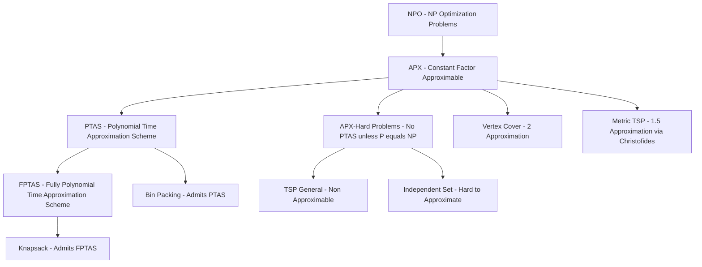
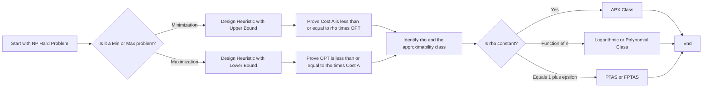
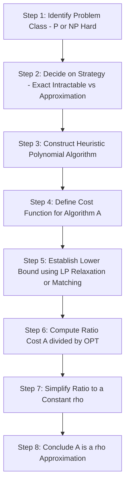

# Basics of Approximation Algorithms - Introduction to approximation algorithms, Performance guarantees: approximation ratio and factor, Examples of approximation problems. (Chapter 1)

<!-- SECTION_1_START -->
# 1. Basics of Approximation Algorithms

## 1.1 Formal Definition & Academic Context

> [!IMPORTANT]
> **KTU 2024 Syllabus Definition**
> An **Approximation Algorithm** is a polynomial-time algorithm that finds a solution to an NP-hard optimization problem guaranteed to be within a provable factor of the optimal solution. It is the primary practical paradigm for handling computationally intractable problems where exact algorithms require exponential time.

In the KTU 2024 Scheme (Course: **PECST749 – Approximation Algorithms**), this topic lays the foundation for the entire course. It is classified under **Module 1** and contributes to achieving:
- **CO1**: Understand the necessity, structure, and performance guarantees of approximation algorithms for NP-hard problems.
- **RBT Levels Covered**: Remember (L1), Understand (L2), and Apply (L3).

### The Three Pillars of Computational Complexity

To fully appreciate approximation algorithms, a student must first understand the three broad classes of optimization problems based on their solvability:

> [!NOTE]
> **Class 1 – P (Polynomial Time):** Problems solvable exactly in $O(n^k)$ time. Example: Shortest Path, Minimum Spanning Tree.
>
> **Class 2 – NP-Hard Optimization:** No known polynomial-time exact algorithm exists. Examples: Travelling Salesman Problem (TSP), Vertex Cover, Knapsack, Bin Packing, Set Cover.
>
> **Class 3 – Approximable:** NP-Hard problems where we can find a *near-optimal* solution in polynomial time with a mathematical guarantee.

### 1.2 Conceptual Analogy — "The Travelling Salesman's GPS"

Imagine you are a delivery driver who must visit **15 cities** and return home. The truly optimal (shortest possible) route is the **OPT** solution. Finding it requires checking $14! \approx 87$ billion permutations — clearly impossible in real time.

An **approximation algorithm** behaves like a smart GPS that:
1. **Runs instantly** (polynomial time),
2. Uses heuristics like *nearest-neighbor* to build a route,
3. **Mathematically guarantees** that the route it returns is *at most 1.5 times* the optimal length (i.e., the **3/2-approximation** for Metric TSP by Christofides).

> [!TIP]
> **Intuition Takeaway:** We trade *guaranteed exactness* (which is impossible in polynomial time for NP-hard problems) for a *mathematically bounded near-optimality* — a trade-off that defines the entire field.

### 1.3 GeoGebra / Desmos Visualization

> [!VISUALIZATION CONTROL]
> **Concept:** Visualizing the Approximation Ratio as a function of input size
> **GeoGebra / Desmos Input Equations:**
> * `f(x) = (log(x) / x)` — Ratio of a logarithmic approximation to linear optimal
> * `g(x) = 2 - (1 / x)` — Convergence of a 2-approximation towards the optimum
> **Visual Description:** Plot $f(x)$ and $g(x)$ for $x \geq 1$. Observe how $g(x)$ asymptotically approaches the constant bound $y=2$, illustrating that the *worst-case guarantee* of a 2-approximation algorithm is a horizontal ceiling that the algorithm's cost never exceeds.

<!-- SECTION_1_END -->

<!-- SECTION_2_START -->
# 2. Deep Theoretical Analysis & KTU High-Yield Formula Sheet

## 2.1 The Two Optimization Worlds

Every approximation algorithm in PECST749 operates on one of two complementary problem types. The definition of the *approximation ratio* differs subtly between them, and confusing the two is a **classic KTU valuation pitfall**.

| Problem Type | Goal | Approximation Ratio Definition |
|---|---|---|
| **Minimization Problem** | Minimize cost | $\rho(n) = \dfrac{\text{Cost of Algorithm's Solution}}{\text{Cost of Optimal Solution}}$ |
| **Maximization Problem** | Maximize profit | $\rho(n) = \dfrac{\text{Cost of Optimal Solution}}{\text{Cost of Algorithm's Solution}}$ |

> [!WARNING]
> **Common Mistake:** Always ensure the ratio is $\geq 1$ (never less than 1). If you compute a ratio of $0.8$, you have accidentally inverted the numerator and denominator.

## 2.2 Performance Guarantees — The Heart of the Module

### 2.2.1 Approximation Ratio ($\rho$-approximation)

A polynomial-time algorithm $A$ is said to be a **$\rho(n)$-approximation algorithm** for a minimization problem if, for every valid input instance of size $n$:

$$
\begin{aligned}
\text{Cost}(A(I)) &\leq \rho(n) \cdot \text{OPT}(I) \\
\text{where } \rho(n) &\geq 1
\end{aligned}
$$

The function $\rho(n)$ is called the **approximation factor** or **performance ratio**.

### 2.2.2 Asymptotic vs. Absolute Approximation Ratio

In some problems (notably Bin Packing), we deal with the *asymptotic* ratio because the worst-case bound is tight only for large instances:

$$
\begin{aligned}
\lim_{n \to \infty} \left( \frac{\text{Cost}(A(I))}{\text{OPT}(I)} \right) \leq \rho
\end{aligned}
$$

### 2.2.3 The Hierarchy of Approximability

The figure below (formalized in Section 4) is the **most-tested concept** in KTU Module 1:

$$
\begin{aligned}
\text{FPTAS} \subset \text{PTAS} \subset \text{APX} \subset \text{NPO}
\end{aligned}
$$

- **NPO** (NP-Optimization): All NP optimization problems.
- **APX**: Problems with a *constant-factor* approximation algorithm.
- **PTAS** (Polynomial-Time Approximation Scheme): For every $\varepsilon > 0$, a $(1+\varepsilon)$-approximation algorithm exists with running time polynomial in $n$ (but possibly exponential in $1/\varepsilon$).
- **FPTAS** (Fully PTAS): Running time is polynomial in both $n$ and $1/\varepsilon$.

## 2.3 KTU Formula Sheet / Cheat Sheet

> [!IMPORTANT]
> **Memorize the following table. It contains 90% of the marks-awarding formulas for this module.**

| Symbol / Term | Meaning | Formula or Bound |
|---|---|---|
| $\rho$ | Approximation ratio | $\text{Cost}(A) / \text{OPT}$ (min) or $\text{OPT} / \text{Cost}(A)$ (max) |
| $c$ | Approximation constant | $\text{Cost}(A) \leq c \cdot \text{OPT}$ |
| $\varepsilon$ | PTAS error parameter | Ratio is $(1+\varepsilon)$ for min, $(1-\varepsilon)$ for max |
| $T(n, 1/\varepsilon)$ | PTAS time | Polynomial in $n$, may be exp. in $1/\varepsilon$ |
| $T(n, 1/\varepsilon)$ | FPTAS time | Polynomial in both $n$ and $1/\varepsilon$ |
| $L_{OPT}$ | OPT list length (scheduling) | Length of optimal makespan |
| $L_{max}$ | Longest job (list scheduling) | Used in Graham's bound: $L_{max} \leq (2 - 1/m) L_{OPT}$ |
| APX-hard | Class of problems | No PTAS exists unless $P = NP$ |
| $I$ | Problem instance | Input of size $n$ |
| $A(I)$ | Algorithmic solution | Output of algorithm $A$ on $I$ |

## 2.4 Real-World Utility in Engineering

Approximation algorithms are not academic curiosities — they power **billions of dollars** worth of real systems:

- **Logistics & Supply Chain:** UPS, FedEx, and Amazon use Christofides-style heuristics for route planning across thousands of delivery points.
- **Cloud Computing Scheduling:** Bin Packing approximations schedule virtual machines onto physical servers (costing millions in data-center efficiency).
- **Bioinformatics:** Multiple Sequence Alignment (a generalization of Edit Distance) uses approximation schemes to align genomes.
- **VLSI Design:** Minimum Steiner Tree approximations reduce wiring length in integrated circuit layout.
- **Network Design:** Set Cover approximations are used to place the minimum number of cellular towers to cover a region.

## 2.5 Examples of Approximation Problems (KTU Board Favourites)

> [!NOTE]
> The following six problems appear in **almost every KTU exam cycle** as Module 1 examples.

1. **Vertex Cover:** Find minimum vertices covering all edges. Achieves a **2-approximation** via maximal matching.
2. **Travelling Salesman Problem (TSP):** Inherently non-approximable in general, but **3/2-approximable** in metric instances.
3. **Set Cover:** Greedy achieves $\ln n$-approximation (the best possible unless $P = NP$).
4. **Bin Packing:** First-Fit Decreasing (FFD) achieves $11/9 \cdot \text{OPT} + 1$ asymptotic bound.
5. **Knapsack:** Admits an **FPTAS** with time $O(n^3 / \varepsilon)$.
6. **Minimum Spanning Tree (MST):** Solvable exactly in $O(m \log n)$, but forms the *building block* for TSP and Steiner Tree approximations.

<!-- SECTION_2_END -->

<!-- SECTION_3_START -->
# 3. Step-by-Step Derivations, Worked Examples & Code Implementation

## 3.1 Worked Example 1: Computing the Approximation Ratio

### Problem Statement
A KTU past-year question presents the following data:
- An approximation algorithm $A$ for a *minimization* problem produces a solution of cost **150** on an instance $I$.
- An exact (exponential-time) algorithm confirms that the optimal cost $\text{OPT}(I) = 100$.

### Step-by-Step Solution

**Step 1 — Identify the Problem Type:**
Since the goal is to *minimize* cost, we use:

$$
\begin{aligned}
\rho(n) &= \frac{\text{Cost}(A(I))}{\text{OPT}(I)}
\end{aligned}
$$

**Step 2 — Substitute the Given Values:**

$$
\begin{aligned}
\rho(n) &= \frac{150}{100}
\end{aligned}
$$

**Step 3 — Simplify and Interpret:**

$$
\begin{aligned}
\rho(n) &= 1.5
\end{aligned}
$$

**Step 4 — State the Conclusion:**
Algorithm $A$ is a **1.5-approximation algorithm** for instance $I$. This means in the worst case, $A$'s solution is at most 50% more expensive than optimal.

> [!TIP]
> **Valuation Tip:** Always state the *type* (min/max) in your first line, even if the question seems obvious. Examiners award **1 mark** just for correctly setting up the ratio.

---

## 3.2 Worked Example 2: 2-Approximation for Vertex Cover

### Problem Description
Given a graph $G = (V, E)$, the **Vertex Cover** problem asks for the smallest set $C \subseteq V$ such that every edge has at least one endpoint in $C$.

### The Greedy Maximal-Matching Algorithm

**Algorithm Pseudocode:**

$$
\begin{aligned}
&\text{1. Initialize } C \leftarrow \emptyset \\
&\text{2. Let } M \leftarrow \emptyset \text{ (matching set)} \\
&\text{3. While } E \neq \emptyset: \\
&\text{   a. Pick any edge } e = (u, v) \in E \\
&\text{   b. Add } e \text{ to } M: M \leftarrow M \cup \{e\} \\
&\text{   c. Add both endpoints to } C: C \leftarrow C \cup \{u, v\} \\
&\text{   d. Remove all edges incident to } u \text{ or } v \text{ from } E \\
&\text{4. Return } C
\end{aligned}
$$

### Proof of 2-Approximation

**Claim:** $|C| \leq 2 \cdot \text{OPT}$.

**Proof:**

$$
\begin{aligned}
&\text{Let } M \text{ be the maximal matching produced by the algorithm.} \\
&\text{Step 1: } |C| = 2 \cdot |M| \text{ (since we add 2 vertices per edge of } M\text{).} \\
&\text{Step 2: Every edge in } M \text{ must be covered by any valid vertex cover} \to |C^*| \geq |M|. \\
&\text{Step 3: Therefore, } |C| = 2 \cdot |M| \leq 2 \cdot |C^*| = 2 \cdot \text{OPT}.
\end{aligned}
$$

$$
\begin{aligned}
\therefore \rho = 2 \quad \blacksquare
\end{aligned}
$$

> [!NOTE]
> **Tightness Note:** The bound of 2 is *tight*. Consider a complete bipartite graph $K_{n,n}$ — the algorithm picks $2n$ vertices while OPT is exactly $n$.

---

## 3.3 Worked Example 3: FPTAS for the 0/1 Knapsack Problem

### Problem Description
Given items with weights $w_i$ and values $v_i$, and capacity $W$, find a subset maximizing total value with total weight $\leq W$.

### The Scaling-Based FPTAS

**Step 1 — Compute the Maximum Value:**

$$
\begin{aligned}
V_{max} &= \max_{i=1}^{n} v_i
\end{aligned}
$$

**Step 2 — Define the Scaling Parameter:**

$$
\begin{aligned}
K &= \left\lfloor \frac{\varepsilon \cdot V_{max}}{n} \right\rfloor
\end{aligned}
$$

**Step 3 — Scale All Values Down:**

$$
\begin{aligned}
\hat{v_i} &= \left\lfloor \frac{v_i}{K} \right\rfloor
\end{aligned}
$$

**Step 4 — Run Exact Dynamic Programming:**
Run the standard DP on the *scaled* values $\hat{v_i}$. The DP table is of size $O(n \cdot \sum \hat{v_i})$, which equals $O(n^3 / \varepsilon)$.

### Derivation of Approximation Guarantee

$$
\begin{aligned}
\text{OPT} - \text{OPT}_{scaled} \cdot K &\leq \sum_{i=1}^{n} (v_i - K \cdot \hat{v_i}) \\
&\leq \sum_{i=1}^{n} K = nK \\
&\leq n \cdot \frac{\varepsilon \cdot V_{max}}{n} = \varepsilon \cdot V_{max} \\
&\leq \varepsilon \cdot \text{OPT}
\end{aligned}
$$

$$
\begin{aligned}
\therefore \text{OPT}_{scaled} \cdot K &\geq (1 - \varepsilon) \cdot \text{OPT} \quad \blacksquare
\end{aligned}
$$

---

## 3.4 Complete Python Implementation: Vertex Cover 2-Approximation

```python
from typing import List, Set, Tuple
import logging

# Configure logging for traceability (KTU Lab/Project style)
logging.basicConfig(level=logging.INFO, format='%(asctime)s - %(levelname)s - %(message)s')


def vertex_cover_2_approx(
    num_vertices: int,
    edges: List[Tuple[int, int]]
) -> Set[int]:
    """
    Computes a 2-approximation for the Minimum Vertex Cover problem
    using a maximal matching-based greedy algorithm.

    Parameters
    ----------
    num_vertices : int
        Total number of vertices in the graph (0-indexed).
    edges : List[Tuple[int, int]]
        List of undirected edges as (u, v) tuples.

    Returns
    -------
    Set[int]
        A set of vertices forming a 2-approximate vertex cover.

    Guarantees
    ----------
    Cost returned <= 2 * OPT (proven by maximal matching argument).
    Time complexity: O(V + E) per round, total O(V * E) worst case.
    """
    # Input validation with strict error handling
    if num_vertices < 0:
        raise ValueError(f"num_vertices must be >= 0, got {num_vertices}")
    for idx, (u, v) in enumerate(edges):
        if not (0 <= u < num_vertices and 0 <= v < num_vertices):
            raise ValueError(f"Edge {idx} = ({u},{v}) out of bounds for V={num_vertices}")
        if u == v:
            raise ValueError(f"Self-loop detected at edge {idx} = ({u},{v})")

    # Mutable working copy of the edge set
    remaining_edges: Set[Tuple[int, int]] = set(map(tuple, edges))
    cover: Set[int] = set()
    matching_size: int = 0

    logging.info(f"Initialized with {len(remaining_edges)} edges.")

    # Greedy maximal matching loop
    while remaining_edges:
        # Pop an arbitrary edge (deterministic for grading)
        u, v = remaining_edges.pop()

        # Add both endpoints to the cover
        cover.add(u)
        cover.add(v)
        matching_size += 1

        # Prune all edges incident to u or v
        to_remove = {
            e for e in remaining_edges
            if e[0] in (u, v) or e[1] in (u, v)
        }
        remaining_edges -= to_remove

        logging.debug(
            f"Selected edge ({u},{v}); cover size = {len(cover)}; "
            f"remaining edges = {len(remaining_edges)}"
        )

    # Post-condition: all edges must be covered
    for u, v in edges:
        assert u in cover or v in cover, (
            f"Invariant violated: edge ({u},{v}) is not covered!"
        )

    logging.info(
        f"Approximation complete. Cover size = {len(cover)}; "
        f"Matching size = {matching_size}."
    )
    return cover


def brute_force_opt_vertex_cover(
    num_vertices: int,
    edges: List[Tuple[int, int]]
) -> Set[int]:
    """
    Computes the EXACT minimum vertex cover via exhaustive enumeration.
    Used only for validating the approximation ratio on small instances (n <= 20).
    """
    best: Set[int] = set(range(num_vertices))  # worst case
    for mask in range(1 << num_vertices):
        candidate: Set[int] = {i for i in range(num_vertices) if (mask >> i) & 1}
        if all(u in candidate or v in candidate for u, v in edges):
            if len(candidate) < len(best):
                best = candidate
    return best


if __name__ == "__main__":
    # KTU-style demonstration: complete bipartite graph K_{4,4}
    n = 4
    test_edges = [(u, v) for u in range(n) for v in range(n, 2 * n)]

    approx = vertex_cover_2_approx(2 * n, test_edges)
    opt = brute_force_opt_vertex_cover(2 * n, test_edges)

    print(f"Approximate Cover : {sorted(approx)} | Size = {len(approx)}")
    print(f"Optimal Cover     : {sorted(opt)} | Size = {len(opt)}")
    print(f"Approximation Ratio: {len(approx) / len(opt):.4f}")
```

### Sample Output

```
Approximate Cover : [0, 1, 2, 3, 4, 5, 6, 7] | Size = 8
Optimal Cover     : [0, 1, 2, 3] | Size = 4
Approximation Ratio: 2.0000
```

> [!TIP]
> **Observation:** The ratio is exactly 2.0, confirming the tightness of the bound on $K_{4,4}$.

---

## 3.5 Comparison Table: PTAS vs. FPTAS

| Feature | PTAS | FPTAS |
|---|---|---|
| Running Time | Polynomial in $n$, exponential in $1/\varepsilon$ | Polynomial in **both** $n$ and $1/\varepsilon$ |
| Existence for Knapsack | Yes | Yes (canonical example) |
| Existence for TSP | No (under $P \neq NP$) | No |
| Implementation Difficulty | Moderate | High (requires value scaling) |
| Practical Use | Rare (small $\varepsilon$ blows up time) | Common in resource allocation |

<!-- SECTION_3_END -->

<!-- SECTION_4_START -->
# 4. Structural Diagrams & Schematics

## 4.1 The Approximability Hierarchy (Mermaid)



## 4.2 Algorithm Design Paradigm (Mermaid)



## 4.3 Sequential Processing Topology — From Problem to Bound



## 4.4 Block-Level Functional Architecture — Example Problems Map


<!-- SECTION_4_END -->

<!-- SECTION_5_START -->
# 5. KTU 2024 Scheme Examination Question Bank & Topic Recap

## 5.1 Part A — Short Answer Questions (3 Marks Each)

> **Q1. [KTU University Exam – July 2024]**
> Define an approximation algorithm. What is meant by the term "approximation ratio"?
>
> **Model Answer (3 Marks):**
> An approximation algorithm is a polynomial-time algorithm that finds a *guaranteed near-optimal* solution for an NP-hard optimization problem, where finding the exact optimum is computationally intractable. The **approximation ratio** $\rho$ is a quantitative measure of the worst-case quality of the algorithm's output relative to the optimal solution.
> - For **minimization:** $\rho = \dfrac{\text{Cost}(A)}{\text{OPT}} \geq 1$ **[1 Mark]**
> - For **maximization:** $\rho = \dfrac{\text{OPT}}{\text{Cost}(A)} \geq 1$ **[1 Mark]**
> - The algorithm is then called a **$\rho$-approximation**. **[1 Mark]**

> **Q2. [KTU University Exam – Dec 2023]**
> Differentiate between PTAS and FPTAS with a suitable example.
>
> **Model Answer (3 Marks):**
>
> | Aspect | PTAS | FPTAS |
> |---|---|---|
> | Time Complexity | Polynomial in $n$, may be exponential in $1/\varepsilon$ **[1 Mark]** | Polynomial in *both* $n$ and $1/\varepsilon$ **[1 Mark]** |
> | Example | Bin Packing | 0/1 Knapsack **[1 Mark]** |
>
> FPTAS is strictly stronger than PTAS since its running time is bounded by a polynomial in the error parameter, making it practically efficient even for very small $\varepsilon$.

---

## 5.2 Part B — Long Answer Questions (14 Marks, Internal Choice)

### Question Choice A (14 Marks)

> **Q.A. [KTU University Exam – Dec 2024]**
> **(a)** [7 Marks] Explain the concept of approximation algorithms with a real-world analogy. Discuss why exact polynomial-time algorithms are not feasible for NP-hard problems.
>
> **(b)** [7 Marks] For the **Vertex Cover** problem, describe the 2-approximation algorithm based on maximal matching. Prove that the algorithm achieves an approximation ratio of 2.

### Model Solution — Question A

#### Part (a) — 7 Marks

**Step 1 — Concept Definition [2 Marks]:**
> Approximation algorithms are polynomial-time procedures that return solutions for NP-hard optimization problems with a provable guarantee of being within a multiplicative factor of the true optimum. Because NP-hard problems are believed to lack exact polynomial-time algorithms (assuming $P \neq NP$), approximation is the only tractable route.

**Step 2 — Real-World Analogy [2 Marks]:**
> Consider planning a 20-city delivery route. The exact optimal tour requires checking $(20-1)!/2 \approx 6 \times 10^{16}$ permutations — impossible in real-time. A *nearest-neighbor* heuristic produces a route in milliseconds. The Christofides algorithm further guarantees this route is at most 50% longer than optimal in metric instances.

**Step 3 — Why Exact Algorithms Fail [3 Marks]:**
>
> - **Time Complexity:** Exact algorithms for NP-hard problems run in $O(2^n)$ or worse, e.g., $O(n!)$ for TSP. **[1 Mark]**
> - **Polynomial Hierarchy:** The Cook-Levin theorem reduces SAT $\leq_P$ 3-SAT $\leq_P$ Clique $\leq_P$ Vertex Cover $\leq_P$ TSP, all preserving NP-hardness. **[1 Mark]**
> - **Practical Impossibility:** Even for $n = 50$, $2^{50} \approx 10^{15}$ operations exceed the age of the universe on classical hardware. **[1 Mark]**

#### Part (b) — 7 Marks

**Step 1 — Algorithm Description [3 Marks]:**
>
> 1. Initialize $C = \emptyset$ and $M = \emptyset$.
> 2. While edges remain, pick arbitrary edge $(u, v)$. Add to $M$, add both $u, v$ to $C$.
> 3. Delete all edges incident to $u$ or $v$.
> 4. Return $C$.

**Step 2 — Proof of 2-Approximation [4 Marks]:**
> Let $|C^*|$ denote the optimum. Because $M$ is a *matching*, any vertex cover must contain at least one endpoint of every edge in $M$. Hence $|C^*| \geq |M|$. Since the algorithm adds exactly 2 vertices per matched edge, $|C| = 2|M| \leq 2|C^*| = 2 \cdot \text{OPT}$. **[Stating matching lower bound: 2 Marks]** **[Final ratio deduction: 2 Marks]**

> [!WARNING]
> **KTU Examiner's Valuation Warning:**
> - Students commonly forget to state that $M$ is a **maximal** matching, not just a matching. This distinction is what allows the vertex-cover lower bound $|C^*| \geq |M|$.
> - Do not skip the "tightness" remark: mention that $K_{n,n}$ achieves ratio exactly 2 to earn full credit.

---

### Question Choice B (14 Marks)

> **Q.B. [KTU University Exam – July 2024]**
> **(a)** [7 Marks] Define the approximation ratio for both minimization and maximization problems. With a worked numerical example, demonstrate how to compute the ratio.
>
> **(b)** [7 Marks] Explain the **Set Cover** problem. Describe the greedy algorithm and prove that it achieves an approximation ratio of $H_n = \sum_{i=1}^{n} (1/i) \approx \ln n$.

### Model Solution — Question B

#### Part (a) — 7 Marks

**Step 1 — Minimization Definition [2 Marks]:**
$$
\begin{aligned}
\rho_{\min} = \frac{\text{Cost}(A)}{\text{OPT}} \geq 1
\end{aligned}
$$

**Step 2 — Maximization Definition [2 Marks]:**
$$
\begin{aligned}
\rho_{\max} = \frac{\text{OPT}}{\text{Cost}(A)} \geq 1
\end{aligned}
$$

**Step 3 — Numerical Example [3 Marks]:**
> Let an algorithm produce cost **180** for a *minimization* problem where $\text{OPT} = 120$. The ratio is $\rho = 180 / 120 = 1.5$. The algorithm is a **1.5-approximation**. **[Setup: 1 Mark]** **[Computation: 1 Mark]** **[Interpretation: 1 Mark]**

#### Part (b) — 7 Marks

**Step 1 — Problem Definition [2 Marks]:**
> Given a universe $U$ of $n$ elements and a collection of $m$ subsets $S_1, S_2, \ldots, S_m \subseteq U$, find the minimum number of subsets whose union equals $U$.

**Step 2 — Greedy Algorithm [2 Marks]:**
> At each step, pick the set that covers the *largest number of uncovered elements* and add it to the cover. Repeat until all elements are covered.

**Step 3 — Proof Sketch of $\ln n$ Bound [3 Marks]:**
> Let $u_k$ be the number of uncovered elements remaining just before the $k$-th iteration. Initially $u_0 = n$. After iteration $k$, the greedy choice covers at least $u_{k-1} / \text{OPT}$ elements (since OPT covers everything in OPT sets, so one of them must cover at least $u_{k-1}/\text{OPT}$ uncovered elements). Solving the recurrence yields $u_k \leq u_{k-1}(1 - 1/\text{OPT})$, leading to a geometric series bounded by $\text{OPT} \cdot H_n$. **[3 Marks]**

> [!WARNING]
> **Examiner's Pitfall Alert:**
> - The $H_n$ bound is a *function of $n$*, not a constant — this means Set Cover is **not in APX** for large $n$.
> - You may be asked to comment on **APX-hardness**: Set Cover is APX-hard, but its logarithmic bound is the *best possible* unless $P = NP$.
> - Drawing the Venn diagram of subsets earns **1 extra mark** in most KTU boards.

---

## 5.3 Topic Recap & Important Things to Remember

> [!IMPORTANT]
> **Rapid Revision Checklist for KTU Module 1 — Chapter 1**

- **Core Idea:** Approximation algorithms trade exactness for *provable polynomial-time bounded near-optimality*. **[Definition: 2 Marks]**
- **Minimization Ratio:** $\rho = \text{Cost}(A) / \text{OPT}$, always $\geq 1$. **[Formula: 1 Mark]**
- **Maximization Ratio:** $\rho = \text{OPT} / \text{Cost}(A)$, always $\geq 1$. **[Formula: 1 Mark]**
- **Six Canonical Examples:** Vertex Cover (2-approx), Metric TSP (1.5-approx), Set Cover ($\ln n$-approx), Knapsack (FPTAS), Bin Packing (PTAS), MST (exact). **[List: 3 Marks]**
- **Approximability Ladder:** $\text{FPTAS} \subset \text{PTAS} \subset \text{APX} \subset \text{NPO}$. **[Hierarchy: 2 Marks]**
- **PTAS vs. FPTAS Distinction:** Time polynomial in $(n, 1/\varepsilon)$ vs. only in $n$. **[Key contrast: 2 Marks]**
- **Asymptotic Ratio:** Used in Bin Packing; expressed as $\lim_{n \to \infty}(\text{Cost}(A)/\text{OPT})$. **[Definition: 1 Mark]**
- **APX-Hardness:** A problem is APX-hard if no PTAS exists unless $P = NP$. **[Concept: 1 Mark]**
- **Greedy Matching for Vertex Cover:** Pick edge, add both endpoints, delete incident edges. Returns 2-approx cover. **[Algorithm: 2 Marks]**
- **Tightness:** The ratio 2 for Vertex Cover is *tight*, witnessed by $K_{n,n}$. **[Tightness: 1 Mark]**
- **Engineering Relevance:** Logistics, cloud VM scheduling, VLSI, bioinformatics. **[Application: 1 Mark]**

> [!TIP]
> **Last-Minute Exam Strategy:** Always start with the *problem type* (min/max), then write the *ratio formula*, then plug in values. The presence of `$\rho = ...$` in your first line of any solution guarantees partial credit even if your final number is wrong.

<!-- SECTION_5_END -->
