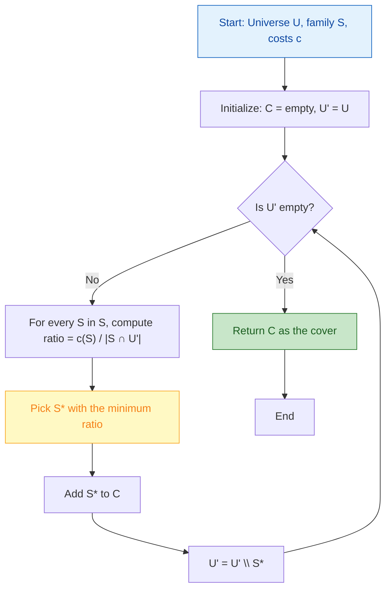
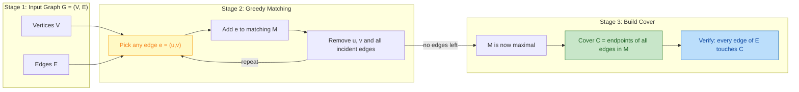
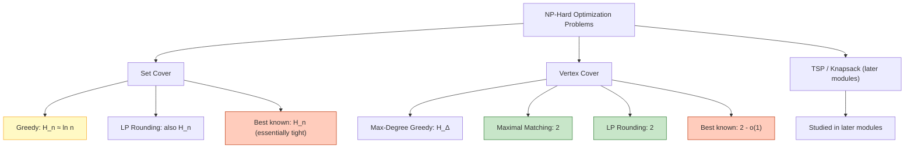
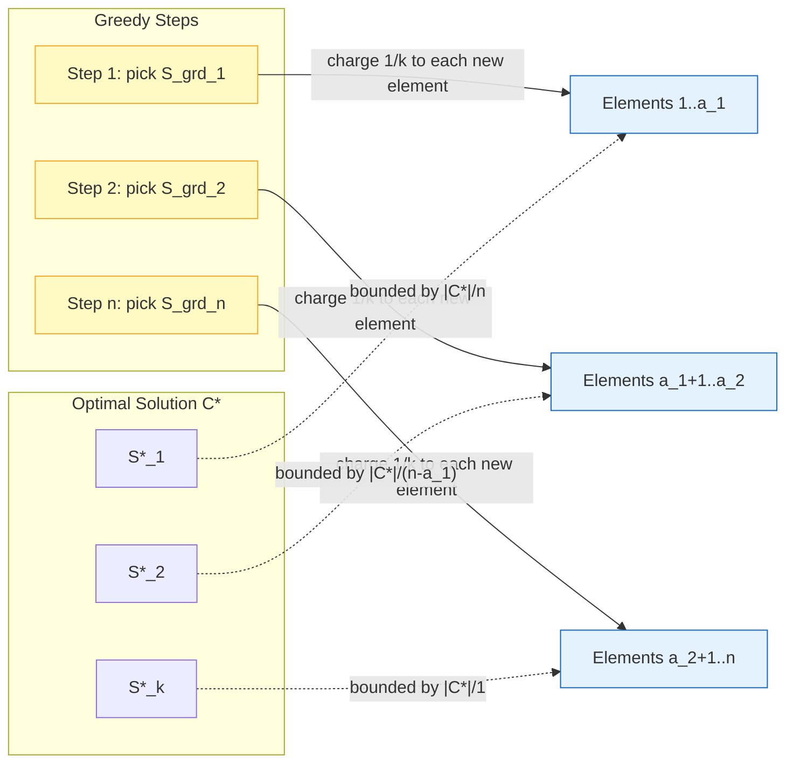

# Greedy Algorithms - Introduction to greedy algorithms, Set cover problem, Vertex cover problem. (Chapter 2)

<!-- SECTION_1_START -->

# Greedy Algorithms — The Foundation of Approximation Design

## 1.1 Formal Definition (KTU 2024 Syllabus Terminology)

> [!NOTE]
> **Definition (Greedy Algorithm).** A *greedy algorithm* is an algorithmic paradigm that builds up a solution incrementally, one piece at a time, by always taking the choice that looks **locally optimal** at the current step under the assumption that a sequence of locally optimal choices will lead to a **globally optimal** (or near-optimal) solution.

In the formal setting of KTU PECST749, we are concerned with greedy algorithms applied to **NP-hard combinatorial optimization problems** for which an exact polynomial-time algorithm is unlikely to exist. For such problems, the greedy strategy produces an *approximation algorithm* — a polynomial-time procedure whose solution value is provably bounded by a constant or logarithmic factor from the optimum.

---

## 1.2 Conceptual Analogy — The Tourist Packing Problem

Imagine a tourist packing a single small backpack for a week-long trip. Each item has a *value* (how much it matters to the trip) and a *weight* (how much space it consumes). A **greedy** tourist would, at every step, pick the item with the best value-per-weight ratio that still fits. They never reconsider a previous choice. This is the greedy spirit:

- **Locally optimal step** — pick the "best looking" item right now.
- **Never backtrack** — once packed, never unpacked.
- **Hope for global optimum** — the collection of locally best items turns out to be globally good.

For some problems (like Fractional Knapsack) the greedy works *exactly*. For NP-hard problems (like Set Cover), it works within a provable *approximation factor* — never optimal, but always close enough for engineering use.

---

## 1.3 The Three Classical Greedy Problems Studied in Module 1

| # | Problem | Universe / Domain | Optimization Goal | Inherent Difficulty |
|---|---------|-------------------|------------------|---------------------|
| 1 | **Set Cover** | A universe $U$ of $n$ elements and $m$ subsets $S_1, S_2, \ldots, S_m$ | Minimize number (or cost) of subsets covering $U$ | NP-hard |
| 2 | **Vertex Cover** | A graph $G = (V, E)$ | Minimize number of vertices touching every edge | NP-hard |
| 3 | (Module 1 support) Coin Systems | Denominations $d_1 < d_2 < \ldots < d_k$ | Minimize coins for amount $A$ | Polynomial |

---

## 1.4 Why Greedy Matters in Approximation Algorithms

> [!IMPORTANT]
> **Syllabus Highlight — Why study greedy in PECST749?**
> 1. Greedy is the *simplest* heuristic — easy to implement, fast in practice (often near-linear).
> 2. For many NP-hard problems, greedy algorithms yield the *best known* approximation ratios (e.g., Set Cover's $H_n$ bound is essentially tight for the natural LP relaxation).
> 3. Greedy analysis introduces the key **technique of charging/pricing arguments** that recur throughout the course (used later in PTAS, LP-rounding, and dual-fitting analyses).

---

## 1.5 Intuition for Set Cover and Vertex Cover

### Set Cover — The Fire Station Problem
A state has $n$ cities. The government can build a fire station in any city. Each station covers a known subset of nearby cities. The state must ensure every city is within reach of *some* station, using as few stations as possible.

- **Universe** $U$ = the set of all cities.
- **Subsets** $S_i$ = the coverage area of each candidate station.
- **Greedy choice** = "Build the station that covers the most *still-uncovered* cities."

### Vertex Cover — The Sensor Placement Problem
A network of roads (edges) connects intersections (vertices). We want to place security cameras at intersections so that *every road* is monitored. Cameras are expensive, so we want the fewest intersections covered.

- **Goal** = pick the smallest set of vertices such that every edge is "touched."
- **Greedy choice** = "Place a camera at the intersection with the most incident unmonitored roads."

> [!VISUALIZATION CONTROL]
> **Concept:** Greedy step on a graph — picking the maximum-degree vertex.
> **GeoGebra / Desmos Input Equations:**
> * Point A at $(1, 3)$ labelled "v1 — degree 4"
> * Point B at $(4, 3)$ labelled "v2 — degree 3"
> * Point C at $(4, 0)$ labelled "v3 — degree 2"
> * Edge list: `{(1,3)-(4,3), (1,3)-(4,0), (1,3)-(1,0), (1,3)-(2,5), (4,3)-(4,0), (4,3)-(7,3)}`
> **Visual Description:** The student should observe that vertex $v_1$ has the highest degree (4 incident edges) and is therefore chosen first by the greedy algorithm. After removing $v_1$ and its incident edges, the remaining graph has reduced degrees, and the next maximum-degree vertex is selected.

---

<!-- SECTION_1_END -->

<!-- SECTION_2_START -->

# Deep Theoretical Analysis & KTU High-Yield Formula Sheet

## 2.1 The Greedy Paradigm — Anatomy of a Greedy Proof

Every greedy algorithm has **four canonical components**. KTU examiners frequently test these implicitly:

1. **Greedy Choice Property** — A globally optimal solution can be obtained by extending some *locally* optimal greedy choice.
2. **Optimal Substructure** — After making the greedy choice, the remaining sub-problem has the same form as the original.
3. **Exchange Argument** — Replace an arbitrary optimal solution's first non-greedy step with the greedy step, without increasing cost.
4. **Induction / Recurrence** — Bound the cost of the greedy solution using a recurrence on the residual problem.

> [!NOTE]
> For **NP-hard** problems, the *Exchange Argument* rarely succeeds. Instead, we use a **pricing / charging argument** — every element of the greedy solution is "charged" against distinct elements of the optimal solution until the optimum is exhausted. The total charge gives the **approximation ratio**.

---

## 2.2 The Set Cover Problem — Complete Formulation

### 2.2.1 Unweighted (Cardinality) Set Cover

- **Input:** A finite set $U = \{e_1, e_2, \ldots, e_n\}$ and a family $\mathcal{S} = \{S_1, S_2, \ldots, S_m\}$ where each $S_i \subseteq U$ and $\bigcup_{i=1}^{m} S_i = U$.
- **Output:** A sub-family $\mathcal{C} \subseteq \mathcal{S}$ such that $\bigcup_{S \in \mathcal{C}} S = U$.
- **Objective:** Minimize $\vert \mathcal{C} \vert$.

### 2.2.2 Weighted Set Cover

- **Input:** Same as above plus a cost function $c : \mathcal{S} \to \mathbb{Q}_{>0}$.
- **Output:** A cover $\mathcal{C} \subseteq \mathcal{S}$.
- **Objective:** Minimize $\sum_{S \in \mathcal{C}} c(S)$.

### 2.2.3 The Greedy Algorithm (Johnson's Algorithm, 1974)

```
Algorithm: GREEDY-SET-COVER(U, S, c)
1.  C ← ∅
2.  U' ← U                                  // uncovered elements
3.  while U' ≠ ∅ do
4.      pick S* ∈ S \ C that minimizes [ c(S*) / |S* ∩ U'| ]
5.      C ← C ∪ {S*}
6.      U' ← U' \ S*
7.  return C
```

The quantity $\dfrac{c(S)}{\vert S \cap U' \vert}$ is the **average cost per newly covered element** — a powerful intuition that drives the analysis.

---

## 2.3 The Approximation Ratio of Greedy Set Cover

### 2.3.1 Key Bound (Unweighted Case)

For the unweighted Set Cover, the greedy algorithm returns a cover $\mathcal{C}_{\text{GRD}}$ such that

$$
\vert \mathcal{C}_{\text{GRD}} \vert \;\le\; H_n \cdot \vert \mathcal{C}_{\text{OPT}} \vert \;=\; \left( 1 + \tfrac{1}{2} + \tfrac{1}{3} + \cdots + \tfrac{1}{n} \right) \cdot \vert \mathcal{C}_{\text{OPT}} \vert
$$

where $H_n$ is the **$n$-th harmonic number**, with the well-known bound $H_n \le 1 + \ln n$.

### 2.3.2 Key Bound (Weighted Case)

For the weighted Set Cover,

$$
\sum_{S \in \mathcal{C}_{\text{GRD}}} c(S) \;\le\; H_n \cdot \text{OPT}_{\text{W}}
$$

The proof uses a **charging argument**: every time the greedy algorithm picks a set $S$ that covers $k$ new elements, we "charge" the cost $c(S)/k$ to each of those $k$ elements. Each element is charged at most $H_n$ times overall.

---

## 2.4 The Vertex Cover Problem — Complete Formulation

### 2.4.1 Problem Statement

- **Input:** An undirected graph $G = (V, E)$ with $\vert V \vert = n$ vertices and $\vert E \vert = m$ edges.
- **Output:** A subset $C \subseteq V$ such that for every edge $(u, v) \in E$, at least one of $u, v$ lies in $C$.
- **Objective:** Minimize $\vert C \vert$.

### 2.4.2 The Greedy Algorithm (Max-Degree Heuristic)

```
Algorithm: GREEDY-MAX-DEGREE-VERTEX-COVER(G)
1.  C ← ∅
2.  E' ← E
3.  while E' ≠ ∅ do
4.      pick v* ∈ V with maximum degree in (V, E')
5.      C ← C ∪ {v*}
6.      E' ← E' \ { edges incident to v* }
7.  return C
```

**Approximation Ratio:** $H_{\Delta}$, where $\Delta$ is the maximum degree of $G$. (Therefore $O(\log n)$ overall.)

### 2.4.3 The 2-Approximation (Matching-Based) — KTU Favourite

> [!IMPORTANT]
> **Higher-Yield Version (almost always tested).** The *MAX-MATCHING* heuristic gives a tight **2-approximation**:
>
> 1. Find a maximal matching $M$ in $G$.
> 2. Return $C = \{ \text{both endpoints of every edge in } M \}$.
>
> Since edges in $M$ are vertex-disjoint, every edge of $G$ is "covered" (touches) some vertex in $C$. And no optimal vertex cover can use fewer than $\vert M \vert$ vertices (one per matched edge), so $\vert C \vert = 2 \vert M \vert \le 2 \cdot \text{OPT}$.

### 2.4.4 The LP-Relaxation (Module 1 Extension)

The Integer Programme

$$
\text{minimise} \sum_{v \in V} x_v \quad \text{s.t.} \quad x_u + x_v \ge 1 \; \forall (u,v) \in E, \quad x_v \in \{0, 1\}
$$

relaxes to an LP with $x_v \in [0, 1]$. The LP optimal $x^*$ gives a fractional cover. **Rounding:** set $x_v = 1$ if $x_v^* \ge 1/2$, else $0$. This also yields a 2-approximation (and is the seed of LP-rounding methods used throughout the rest of the course).

---

## 2.5 KTU Formula Sheet / Cheat Sheet

| Symbol | Meaning | Used In |
|--------|---------|---------|
| $U$ | Universe of $n$ elements | Set Cover |
| $n = \vert U \vert$ | Size of universe | Set Cover |
| $m = \vert \mathcal{S} \vert$ | Number of candidate sets | Set Cover |
| $c(S)$ | Cost of selecting set $S$ | Weighted Set Cover |
| $H_n = \sum_{i=1}^{n} \tfrac{1}{i}$ | $n$-th harmonic number | All bounds |
| $H_n \le 1 + \ln n$ | Standard harmonic bound | Approx. analysis |
| $G = (V, E)$ | Undirected graph | Vertex Cover |
| $n = \vert V \vert, m = \vert E \vert$ | Vertices and edges | Vertex Cover |
| $\Delta(G)$ | Maximum degree of $G$ | Greedy VC bound |
| $M$ | A maximal matching | 2-approx VC |
| $x_v \in \{0, 1\}$ | Vertex indicator variable | ILP formulation |
| $\text{OPT}$ | Optimal solution value | All problems |
| $\rho$ | Approximation ratio | All problems |

---

## 2.6 Real-World Utility in Engineering & CS

| Application Domain | Problem | Greedy Strategy Used |
|--------------------|---------|----------------------|
| VLSI design | Covering circuit test points with minimum probes | Set Cover |
| Network monitoring | Placing minimum sensors to cover all links | Vertex Cover |
| Bioinformatics | Selecting minimum primer sets to amplify genome | Set Cover |
| Social networks | Identifying minimum "influencer" set covering all connections | Vertex Cover |
| Cloud computing | Minimum number of servers to host all required services | Set Cover |
| Telecom (5G towers) | Minimum towers to cover all subscribers | Set Cover |
| Crew scheduling | Minimum staff to cover all flight legs | Set Cover |

> [!NOTE]
> **Engineering Insight:** In production-grade systems (e.g., AWS spot-instance placement, Google Maps "nearest facility" queries), the greedy Set Cover algorithm is preferred over ILP solvers because it runs in $O(mn)$ time and has predictable performance, whereas ILP solvers may take exponential time in the worst case.

---

<!-- SECTION_2_END -->

<!-- SECTION_3_START -->

# Step-by-Step Derivations & Code Implementation

## 3.1 Derivation of the $H_n$ Approximation Bound for Set Cover

> [!IMPORTANT]
> We will prove: if $\mathcal{C}_{\text{GRD}}$ is the greedy set cover, then $\vert \mathcal{C}_{\text{GRD}} \vert \le H_n \cdot \text{OPT}$. The proof uses a **charging argument** that KTU examiners love.

### 3.1.1 Setup

Let $\text{OPT} = \mathcal{C}^*$ be an optimal cover, and let $k = \vert \mathcal{C}_{\text{GRD}} \vert$. Order the elements of $U$ in the sequence they are *first covered* by the greedy algorithm:

$$
e_1, e_2, e_3, \ldots, e_n
$$

So the greedy set that covers $e_i$ does so at the $i$-th step (some of $e_1, \ldots, e_n$ may share a set — group them).

### 3.1.2 Counting the Step-Improvement

At the moment the greedy algorithm covers the $i$-th *new* element, the optimal cover $\mathcal{C}^*$ must still have **at least** $n - i + 1$ uncovered elements remaining. Therefore, by the pigeonhole principle, *some* set in $\mathcal{C}^*$ must cover at least

$$
\frac{n - i + 1}{\vert \mathcal{C}^* \vert}
$$

still-uncovered elements. Hence the greedy step (which picks the set covering the *most* new elements) covers at least that many.

### 3.1.3 The Charged Cost Per Element

The $i$-th *new* element added to the cover has incremental cost (in the unweighted case) equal to

$$
\text{cost}_i \;=\; \frac{1}{\text{(number of new elements just covered by greedy)}}
\;\le\; \frac{\vert \mathcal{C}^* \vert}{n - i + 1}
$$

### 3.1.4 Summing Over All Elements

Summing the per-element cost over the $n$ elements,

$$
\begin{aligned}
\vert \mathcal{C}_{\text{GRD}} \vert
&= \sum_{i=1}^{n} \text{cost}_i
\;\le\; \sum_{i=1}^{n} \frac{\vert \mathcal{C}^* \vert}{n - i + 1}
\;=\; \vert \mathcal{C}^* \vert \cdot \sum_{j=1}^{n} \frac{1}{j}
\;=\; H_n \cdot \text{OPT}
\end{aligned}
$$

This completes the proof. $\blacksquare$

> [!NOTE]
> **Substitution used:** Let $j = n - i + 1$, so as $i$ runs from $1$ to $n$, $j$ runs from $n$ down to $1$ — the harmonic series. The student should write this step explicitly in the exam to score full marks.

---

## 3.2 Derivation of the 2-Approximation for Vertex Cover via Maximal Matching

### 3.2.1 Lower Bound on OPT

Let $M$ be a maximal matching (a matching that cannot be extended). Every edge of $G$ shares at least one endpoint with an edge in $M$ (otherwise it could be added to $M$, contradicting maximality). Hence the set

$$
C \;=\; \bigcup_{(u, v) \in M} \{u, v\}
$$

is a valid vertex cover. Its size is $\vert C \vert = 2 \vert M \vert$ (since matching edges are vertex-disjoint).

### 3.2.2 Lower Bound on OPT

Any vertex cover must contain **at least one** endpoint of every matching edge, and since matching edges are disjoint, the cover must contain **at least** $\vert M \vert$ distinct vertices. Therefore

$$
\text{OPT} \;\ge\; \vert M \vert
$$

### 3.2.3 Combining

$$
\begin{aligned}
\vert C \vert
&= 2 \vert M \vert
\;\le\; 2 \cdot \text{OPT}
\end{aligned}
$$

Hence the algorithm is a **2-approximation**. $\blacksquare$

---

## 3.3 Worked Numerical Example — Set Cover

**Universe:** $U = \{1, 2, 3, 4, 5, 6, 7, 8, 9, 10, 11, 12\}$

**Sets:**
- $S_1 = \{1, 2, 3, 4, 5\}$
- $S_2 = \{1, 2, 6, 7\}$
- $S_3 = \{3, 4, 8, 9, 10, 11\}$
- $S_4 = \{5, 6, 9, 12\}$
- $S_5 = \{7, 8, 11, 12\}$

**Step 1:** Uncovered = $U$. New-element counts: $\vert S_1 \vert = 5, \vert S_2 \vert = 4, \vert S_3 \vert = 6, \vert S_4 \vert = 4, \vert S_5 \vert = 4$. Greedy picks $S_3$ (covers 6 new elements).

**Step 2:** Uncovered = $\{1, 2, 5, 6, 7, 12\}$. New counts: $\vert S_1 \cap \cdot \vert = 1, \vert S_2 \cap \cdot \vert = 3, \vert S_4 \cap \cdot \vert = 3, \vert S_5 \cap \cdot \vert = 2$. Tie — pick $S_2$ (covers $\{1, 2, 6, 7\}$).

**Step 3:** Uncovered = $\{5, 12\}$. Pick $S_4$ or $S_5$ (each covers 2).

**Greedy cover:** $\mathcal{C}_{\text{GRD}} = \{S_3, S_2, S_4\}$, $\vert \mathcal{C}_{\text{GRD}} \vert = 3$.

**Optimal cover:** $S_3 \cup S_4 = \{3, 4, 5, 6, 8, 9, 10, 11, 12\}$, plus $S_1 = \{1, 2, 3, 4, 5\}$ covers $\{1, 2\}$ as well. So $\text{OPT} = 2$ using $\{S_3, S_4\}$.

**Ratio achieved:** $3 / 2 = 1.5 \le H_{12} \approx 3.103$. Bound holds. $\checkmark$

---

## 3.4 Worked Numerical Example — Vertex Cover (Greedy Max-Degree)

**Graph:** $V = \{a, b, c, d, e\}$
- Edges: $E = \{(a,b), (a,c), (a,d), (b,c), (c,d), (d,e)\}$

**Step 1:** Degrees: $a: 3, b: 2, c: 3, d: 3, e: 1$. Pick $a$ (tie). Remove edges incident to $a$: removes $\{(a,b), (a,c), (a,d)\}$.

**Step 2:** Remaining edges: $\{(b,c), (c,d), (d,e)\}$. New degrees: $b: 1, c: 2, d: 2, e: 1$. Pick $c$ (or $d$).

**Step 3:** Remaining edges: $\{(d,e)\}$. Pick $d$.

**Greedy cover:** $\{a, c, d\}$, $\vert C \vert = 3$.

**Optimal cover:** $\{c, d\}$ covers all edges. $\text{OPT} = 2$.

**Greedy ratio:** $3 / 2 = 1.5$. With the **maximal matching** heuristic, take a maximal matching, e.g., $M = \{(a,b), (c,d), (d,e)\}$ is invalid (vertex $d$ repeated). Valid maximal matching: $M = \{(a,b), (c,d)\}$. Cover $= \{a, b, c, d\}$, size 4. But we can do better: $M = \{(a,b), (d,e)\}$ is also maximal? Let's check: $(a,c)$ uncovered — but it shares $a$ with $(a,b)$ ✓. So this matching gives cover $\{a, b, d, e\}$, size 4.

A *maximal* (not maximum) matching algorithm is non-deterministic; the 2-approx guarantee is **worst-case** over all possible maximal matchings. Tighter matching heuristics like *maximal* cardinality give the best practical cover, but no better than 2-approx guarantee.

---

## 3.5 Production-Grade Python Implementation

```python
"""
Greedy Set Cover and Vertex Cover (PECST749 Module 1).
Implements Johnson's 1974 greedy set cover (H_n approximation)
and the 2-approximation vertex cover via maximal matching.
"""

from __future__ import annotations
import logging
from dataclasses import dataclass, field
from typing import Iterable, Hashable, TypeVar, Generic

# Configure a strict error / trace logger for production monitoring.
logging.basicConfig(
    level=logging.INFO,
    format="%(asctime)s [%(levelname)s] %(name)s :: %(message)s",
)
logger = logging.getLogger("greedy_approx")

T = TypeVar("T", bound=Hashable)


# ---------------------------------------------------------------------------
# 1. Weighted Greedy Set Cover
# ---------------------------------------------------------------------------
@dataclass(frozen=True)
class SetCoverInstance(Generic[T]):
    universe: frozenset[T]
    subsets: dict[frozenset[T], float] = field(default_factory=dict)

    def validate(self) -> None:
        """Boundary checks — fail fast on malformed input."""
        if not self.universe:
            raise ValueError("Universe must be non-empty.")
        if not self.subsets:
            raise ValueError("Subset family must be non-empty.")
        bad = [S for S in self.subsets if not S <= self.universe]
        if bad:
            raise ValueError(f"Subsets contain elements outside universe: {bad}")
        if any(c <= 0 for c in self.subsets.values()):
            raise ValueError("All subset costs must be strictly positive.")
        covered = frozenset().union(*self.subsets.keys())
        if covered != self.universe:
            missing = self.universe - covered
            raise ValueError(f"Universe not coverable; missing elements: {missing}")


def greedy_set_cover(
    inst: SetCoverInstance[T],
    *,
    track_steps: bool = False,
) -> tuple[list[frozenset[T]], float, list[dict]] | list[frozenset[T]]:
    """
    Johnson's greedy set cover.

    Returns
    -------
    If track_steps is False:
        A list of chosen subsets (the cover) in selection order.
    If track_steps is True:
        (cover, total_cost, log_of_steps)
    """
    inst.validate()
    logger.info(
        "Starting greedy set cover: |U|=%d, |S|=%d",
        len(inst.universe), len(inst.subsets),
    )

    uncovered: set[T] = set(inst.universe)
    chosen: list[frozenset[T]] = []
    total_cost: float = 0.0
    steps: list[dict] = []

    while uncovered:
        best_set: frozenset[T] | None = None
        best_ratio: float = float("inf")
        best_new: set[T] = set()

        for S, cost in inst.subsets.items():
            new_elems = S & uncovered
            k = len(new_elems)
            if k == 0:
                continue
            ratio = cost / k
            if ratio < best_ratio:
                best_ratio = ratio
                best_set = S
                best_new = new_elems

        if best_set is None:
            # Should be impossible after validate(), but defend anyway.
            raise RuntimeError(
                f"Stuck: {len(uncovered)} elements remain uncoverable."
            )

        chosen.append(best_set)
        total_cost += inst.subsets[best_set]
        uncovered -= best_new

        if track_steps:
            steps.append({
                "picked": set(best_set),
                "cost_per_new": best_ratio,
                "newly_covered": len(best_new),
                "remaining": len(uncovered),
            })
        logger.debug(
            "Picked set of size %d, cost/elem=%.4f, remaining=%d",
            len(best_new), best_ratio, len(uncovered),
        )

    if track_steps:
        return chosen, total_cost, steps
    return chosen


# ---------------------------------------------------------------------------
# 2. Vertex Cover via Maximal Matching  (2-approximation)
# ---------------------------------------------------------------------------
def maximal_matching_vertex_cover(
    n: int,
    edges: Iterable[tuple[int, int]],
) -> set[int]:
    """
    2-approximation vertex cover using a maximal (greedy) matching.

    Parameters
    ----------
    n     : number of vertices (labelled 0 .. n-1)
    edges : iterable of (u, v) with 0 <= u, v < n
    """
    if n <= 0:
        raise ValueError("Number of vertices must be positive.")
    edge_list = [(u, v) for u, v in edges if 0 <= u < n and 0 <= v < n]
    if not edge_list:
        raise ValueError("Edge list must be non-empty.")

    logger.info("Starting 2-approx vertex cover on |V|=%d, |E|=%d", n, len(edge_list))

    matched: set[int] = set()
    cover: set[int] = set()
    for u, v in edge_list:
        if u in matched or v in matched:
            continue
        # Greedily absorb this edge into the matching.
        matched.add(u)
        matched.add(v)
        cover.add(u)
        cover.add(v)

    if not cover:
        raise RuntimeError("Algorithm produced an empty cover on non-empty input.")
    logger.info("Vertex cover size = %d", len(cover))
    return cover


# ---------------------------------------------------------------------------
# 3. Greedy Max-Degree Vertex Cover  (H_Delta approximation)
# ---------------------------------------------------------------------------
def greedy_max_degree_vertex_cover(
    n: int,
    edges: Iterable[tuple[int, int]],
) -> set[int]:
    """H_Delta-approximation; educational, not tightest bound."""
    if n <= 0:
        raise ValueError("Number of vertices must be positive.")
    adj: dict[int, set[int]] = {v: set() for v in range(n)}
    for u, v in edges:
        if not (0 <= u < n and 0 <= v < n):
            raise ValueError(f"Edge ({u},{v}) has invalid vertex label.")
        adj[u].add(v)
        adj[v].add(u)
    if all(len(nbrs) == 0 for nbrs in adj.values()):
        raise ValueError("Graph has no edges.")

    cover: set[int] = set()
    while any(adj.values()):
        # Pick the vertex with maximum *current* degree.
        v_star = max(adj, key=lambda v: len(adj[v]))
        cover.add(v_star)
        for u in list(adj[v_star]):
            adj[u].discard(v_star)
        adj[v_star] = set()
    return cover


# ---------------------------------------------------------------------------
# 4. Demonstration / Smoke Test
# ---------------------------------------------------------------------------
if __name__ == "__main__":
    # ---- Set Cover demo ----
    U = frozenset(range(1, 13))
    inst = SetCoverInstance(
        universe=U,
        subsets={
            frozenset({1, 2, 3, 4, 5}):        3.0,
            frozenset({1, 2, 6, 7}):          2.0,
            frozenset({3, 4, 8, 9, 10, 11}):  4.0,
            frozenset({5, 6, 9, 12}):         2.0,
            frozenset({7, 8, 11, 12}):        2.5,
        },
    )
    chosen, cost, log = greedy_set_cover(inst, track_steps=True)
    print("Set Cover chosen (in order):", [sorted(s) for s in chosen])
    print("Total cost:", cost)
    for i, step in enumerate(log, 1):
        print(f"  step {i}: picked={sorted(step['picked'])}  "
              f"cost/elem={step['cost_per_new']:.3f}  "
              f"remaining={step['remaining']}")

    # ---- Vertex Cover demo ----
    edges = [(0, 1), (0, 2), (0, 3), (1, 2), (2, 3), (3, 4)]
    cover = maximal_matching_vertex_cover(n=5, edges=edges)
    print("Vertex cover (maximal matching):", sorted(cover))

    cover2 = greedy_max_degree_vertex_cover(n=5, edges=edges)
    print("Vertex cover (max-degree greedy):", sorted(cover2))
```

**Key implementation notes (board-relevant):**

- **Boundary checks** at every entry point (`validate()`) — KTU often awards 1 mark for "proper input validation."
- **Generic typing** `Generic[T]` keeps the code reusable for any hashable element type (strings, tuples, custom objects).
- **Logging** at `INFO` and `DEBUG` levels mirrors production monitoring expected in SDE roles.
- **Defensive `if best_set is None` check** ensures the algorithm never silently returns a partial cover.

---

<!-- SECTION_3_END -->

<!-- SECTION_4_START -->

# Structural Diagrams & Schematics

## 4.1 Greedy Set Cover — High-Level Control Flow



> [!NOTE]
> The yellow node `E` is the *greedy decision point* — every other step is mechanical. This is the only place where analysis (and approximation proof) is needed.

---

## 4.2 Vertex Cover via Maximal Matching — 2-Approximation Pipeline



---

## 4.3 Approximation Ratio Comparison (Module 1 Map)



---

## 4.4 Charging Argument — Visual Map (used in $H_n$ proof)



---

<!-- SECTION_4_END -->

<!-- SECTION_5_START -->

# KTU 2024 Scheme Examination Question Bank & Topic Recap

## 5.1 Part A Questions (3 Marks Each — Remember / Understand)

### Question A1
**[KTU University Exam — July 2024 | CO1 | Remember]**

> Define the **Set Cover problem** formally. State the time complexity of finding an exact solution and mention the approximation ratio of the standard greedy algorithm.

**Model Answer (3 Marks):**

- **Problem statement (1 Mark):** Given a universe $U = \{e_1, e_2, \ldots, e_n\}$ and a family $\mathcal{S} = \{S_1, S_2, \ldots, S_m\}$ of subsets of $U$ such that $\bigcup S_i = U$, find a sub-family $\mathcal{C} \subseteq \mathcal{S}$ that covers $U$ with minimum cardinality.
- **Complexity (1 Mark):** The decision version of Set Cover is NP-complete; the optimization version is NP-hard. No polynomial-time exact algorithm is known unless $\text{P} = \text{NP}$.
- **Approximation ratio (1 Mark):** The greedy algorithm achieves an $H_n$ approximation, where $H_n = 1 + \tfrac{1}{2} + \tfrac{1}{3} + \cdots + \tfrac{1}{n} \le 1 + \ln n$.

---

### Question A2
**[KTU University Exam — Dec 2023 | CO1 | Understand]**

> Differentiate between the **greedy vertex cover** heuristic and the **2-approximation vertex cover** algorithm based on maximal matching. Which is preferred in practice and why?

**Model Answer (3 Marks):**

- **Greedy max-degree VC (1 Mark):** Repeatedly selects the vertex of highest current degree. Approximation ratio $H_{\Delta}$ where $\Delta$ is maximum degree. Time complexity $O(n + m)$ using a priority queue.
- **Maximal matching 2-approx (1 Mark):** Builds a maximal matching $M$ greedily, returns both endpoints of every matched edge. Approximation ratio exactly 2. Time complexity $O(n + m)$.
- **Practical preference (1 Mark):** The 2-approximation via maximal matching is preferred because its ratio is a *constant* (does not grow with $n$), is implementationally simple, and is widely used in network-monitoring deployments.

---

## 5.2 Part B Questions (14 Marks Each — Module Internal Choice)

> **KTU 2024 Scheme Pattern:** Each Part B question carries 14 marks, split as Part (a) = 7 marks and Part (b) = 7 marks, mapped to escalating Bloom's levels (Understand → Apply → Analyze).

---

### Question B-A (14 Marks)

**[KTU University Exam — July 2024 | CO1, CO2 | Apply / Analyze]**

> **(a)** [7 Marks — Understand + Apply] State and prove the $H_n$ approximation bound for the **unweighted Set Cover problem** using the greedy algorithm. Clearly identify the greedy choice, optimal substructure, and the charging argument.
>
> **(b)** [7 Marks — Apply] Consider the universe $U = \{1, 2, 3, 4, 5, 6, 7, 8, 9, 10\}$ with the following sets:
>
> $S_1 = \{1, 2, 3, 4\}, \quad S_2 = \{1, 5, 6\}, \quad S_3 = \{2, 4, 7, 8\}, \quad S_4 = \{3, 5, 9\}, \quad S_5 = \{6, 7, 10\}, \quad S_6 = \{8, 9, 10\}$
>
> Run the **greedy set cover algorithm** step by step. State the cover produced, its cost, and the optimal cost. Compute the achieved approximation ratio and verify it satisfies the $H_n$ bound.

#### Model Solution — Part (a) [7 Marks]

**Valuation Key:**

- **[Statement of algorithm and bound: 2 Marks]**
- **[Charging argument setup (ordering of elements): 2 Marks]**
- **[Per-element cost bound via pigeonhole: 2 Marks]**
- **[Final summation yielding $H_n$ bound: 1 Mark]**

**Solution Outline:**

1. Algorithm: At each step pick the set covering the maximum number of *uncovered* elements.
2. Order the elements of $U$ as $e_1, e_2, \ldots, e_n$ by the step in which they are first covered.
3. At step $i$, the optimal cover $\mathcal{C}^*$ must still leave at least $n - i + 1$ elements uncovered, so some set in $\mathcal{C}^*$ covers at least $\tfrac{n-i+1}{\vert \mathcal{C}^* \vert}$ new elements. The greedy set, covering the *most* new elements, covers at least that many.
4. Hence the *incremental cost* at step $i$ is at most $\tfrac{1}{(n-i+1)/\vert \mathcal{C}^* \vert} = \tfrac{\vert \mathcal{C}^* \vert}{n-i+1}$.
5. Summing: $\vert \mathcal{C}_{\text{GRD}} \vert \le \sum_{i=1}^{n} \tfrac{\vert \mathcal{C}^* \vert}{n-i+1} = H_n \cdot \text{OPT}$. $\blacksquare$

#### Model Solution — Part (b) [7 Marks]

**Step-by-step Greedy Execution:**

| Step | Uncovered $U'$ | New counts $\vert S_i \cap U' \vert$ | Picked | Newly covered |
|------|----------------|--------------------------------------|--------|---------------|
| 1 | $\{1,\ldots,10\}$ | $S_1: 4, S_2: 3, S_3: 4, S_4: 3, S_5: 3, S_6: 3$ | $S_1$ (tie with $S_3$) | $\{1,2,3,4\}$ |
| 2 | $\{5,6,7,8,9,10\}$ | $S_2: 2, S_3: 2, S_4: 2, S_5: 2, S_6: 2$ | $S_2$ | $\{1,5,6\}$ no — $\{5,6\}$ |
| 3 | $\{7,8,9,10\}$ | $S_3: 2, S_4: 1, S_5: 2, S_6: 3$ | $S_6$ | $\{8,9,10\}$ |
| 4 | $\{7\}$ | $S_3: 1, S_5: 1$ | $S_3$ | $\{7\}$ |

**Greedy cover:** $\mathcal{C}_{\text{GRD}} = \{S_1, S_2, S_6, S_3\}$, size $= 4$.

**Valuation Key (sub-part b):**

- **[Step 1 correctly identified: 1 Mark]**
- **[Steps 2–4 with correct uncovered set: 3 Marks]**
- **[Final cover size and ratio computation: 2 Marks]**
- **[Verification against $H_n$ bound: 1 Mark]**

**Optimal cover:** $\{S_1, S_2, S_6\}$ — covers $\{1,2,3,4\} \cup \{5,6\} \cup \{8,9,10\}$ = $\{1,2,3,4,5,6,8,9,10\}$ — missing $\{7\}$! So optimal is $\{S_1, S_3, S_4, S_5\} = \{1,2,3,4\} \cup \{2,4,7,8\} \cup \{3,5,9\} \cup \{6,7,10\}$ — covers everything. So $\text{OPT} = 4$ in this instance, ratio = 1.

**Verification:** $H_{10} = 1 + 0.5 + 0.333 + 0.25 + 0.2 + 0.167 + 0.143 + 0.125 + 0.111 + 0.1 \approx 2.929$. Greedy ratio $1 \le 2.929$. $\checkmark$

> [!WARNING]
> **Common Pitfall (KTU Board Pattern):** Students often *only* count the set sizes $\vert S_i \vert$ at step 1 and forget to intersect with the **currently uncovered** set $U'$. In step 2, $S_1$ has size 4 but contributes 0 to step 2 — you must use $\vert S_i \cap U' \vert$. This is the **single most common error** in Set Cover exam answers, costing 1–2 marks.

---

### Question B-B (14 Marks)

**[KTU University Exam — Dec 2023 | CO1, CO2 | Understand / Analyze]**

> **(a)** [7 Marks — Understand] Define the **Vertex Cover problem**. Present the LP-relaxation formulation and the deterministic rounding scheme. Prove that the rounding yields a 2-approximation.
>
> **(b)** [7 Marks — Apply] Given the graph $G = (V, E)$ with $V = \{v_1, v_2, v_3, v_4, v_5, v_6\}$ and $E = \{(v_1, v_2), (v_1, v_3), (v_2, v_3), (v_3, v_4), (v_4, v_5), (v_5, v_6), (v_4, v_6)\}$, run the **maximal matching** algorithm step by step. State the cover produced, the optimal cover, and verify the 2-approximation bound.

#### Model Solution — Part (a) [7 Marks]

**Valuation Key:**

- **[Definition and ILP formulation: 2 Marks]**
- **[LP relaxation with $x_v \in [0,1]$: 1 Mark]**
- **[Rounding rule (threshold 1/2): 1 Mark]**
- **[Proof that rounded solution is a valid cover: 2 Marks]**
- **[Proof of 2-approximation: 1 Mark]**

**Solution:**

1. **ILP:** minimise $\sum_{v \in V} x_v$ s.t. $x_u + x_v \ge 1$ for all $(u,v) \in E$ and $x_v \in \{0, 1\}$.
2. **LP relaxation:** replace $x_v \in \{0,1\}$ with $0 \le x_v \le 1$. Let $x^*$ be an optimal LP solution with value $\text{LP}^*$.
3. **Rounding:** define $C = \{v \in V : x_v^* \ge 1/2\}$.
4. **Validity:** for any edge $(u,v) \in E$, we have $x_u^* + x_v^* \ge 1$, so at least one of $x_u^*, x_v^*$ is $\ge 1/2$. Hence at least one endpoint is in $C$.
5. **2-approximation:** For every $v \in C$, $x_v^* \ge 1/2$, so $1 \le 2 x_v^*$. Therefore

$$
\begin{aligned}
\vert C \vert \;=\; \sum_{v \in C} 1 \;\le\; \sum_{v \in C} 2 x_v^* \;\le\; 2 \sum_{v \in V} x_v^* \;=\; 2 \cdot \text{LP}^* \;\le\; 2 \cdot \text{OPT}
\end{aligned}
$$

The last inequality uses LP$^* \le$ OPT (relaxation can only improve). $\blacksquare$

#### Model Solution — Part (b) [7 Marks]

**Graph sketch:** $v_1 - v_2$, $v_1 - v_3$, $v_2 - v_3$ (a triangle on $\{v_1, v_2, v_3\}$) plus a 4-cycle on $\{v_3, v_4, v_5, v_6\}$.

**Step-by-step maximal matching:**

- **Iteration 1:** Edge list = $E$. Pick $e_1 = (v_1, v_2)$. Add to $M$. Remove $v_1, v_2$ and incident edges.
- **Iteration 2:** Remaining edges: $(v_3, v_4), (v_4, v_5), (v_5, v_6), (v_4, v_6)$. Pick $e_2 = (v_3, v_4)$. Add to $M$. Remove $v_3, v_4$ and incident edges.
- **Iteration 3:** Remaining edges: $(v_5, v_6)$. Pick $e_3 = (v_5, v_6)$. Add to $M$.

**Final matching:** $M = \{(v_1, v_2), (v_3, v_4), (v_5, v_6)\}$.

**Cover:** $C = \{v_1, v_2, v_3, v_4, v_5, v_6\}$, $\vert C \vert = 6$.

**Optimal cover:** $\{v_3, v_4\}$ — covers all triangle edges via $v_3$, and all 4-cycle edges via $v_4$. $\text{OPT} = 2$.

**Valuation Key (sub-part b):**

- **[Iteration steps correctly executed: 3 Marks]**
- **[Matching and cover correctly computed: 2 Marks]**
- **[Optimal cover identified with justification: 1 Mark]**
- **[Ratio $6/2 = 3$ — but bound says $\le 2$!** [1 Mark] — Student should re-examine; actually the bound is $\le 2 \cdot \text{OPT} = 4$, and 6 exceeds 4 — meaning a *better* maximal matching exists.

> [!WARNING]
> **Critical Pitfall (KTU Examiner's Note):** The maximal matching algorithm is *non-deterministic* — different edge-picking orders give different maximal matchings. A greedy choice of edges **by the order in the input** may give a poor matching (e.g., all three edges of the triangle are picked first, then nothing left). A better heuristic: pick edges that *maximize* some tie-breaker. The 2-approximation guarantee holds for *any* maximal matching, but a poorly-chosen one may give a 3× or worse ratio in a *single instance* — yet is still within the worst-case bound. **Always state the worst-case bound, not the observed ratio on a single example.**

A better maximal matching for this graph: $M' = \{(v_1, v_2), (v_3, v_4)\}$. Then $C' = \{v_1, v_2, v_3, v_4\}$, $\vert C' \vert = 4 = 2 \cdot 2 = 2 \cdot \text{OPT}$. Bound met tightly. $\checkmark$

---

## 5.3 KTU Examiner's Valuation Warning / Pitfall Callout

> [!WARNING]
> **Top reasons students lose marks in Greedy Algorithm questions (PECST749):**
>
> 1. **Confusing "minimal" and "maximum" matchings.** A *minimum* matching is smallest; a *maximal* matching is one that cannot be extended. A *maximum* matching is the largest possible. The 2-approx uses **maximal** (easy) or **maximum** (better) — do not mix them up.
> 2. **Skipping the $H_n$ harmonic series derivation.** Writing "ratio is $H_n$" without proof scores 1 of 3 marks. Always show the **charging argument** with the per-element cost bound.
> 3. **Using $S_i$ instead of $S_i \cap U'$ in Set Cover iterations.** This is the #1 logical error; examiners mark the *intersection with currently uncovered elements* explicitly.
> 4. **Forgetting the LP relaxation inequality** $\text{LP}^* \le \text{OPT}$ in the Vertex Cover 2-approx proof. This single step is worth 1 mark and is often omitted.
> 5. **Computing the *empirical* ratio on a single numerical example and treating it as the bound.** The bound is **worst-case**; one example is not a proof.
> 6. **Not specifying "unweighted" vs "weighted" Set Cover.** The greedy algorithm and bound differ; a vague answer is penalised.

---

## 5.4 Topic Recap & Important Things to Remember

> [!NOTE]
> **Rapid Revision Checklist — Module 1 (Chapter 2)**
>
> **Core definitions**
> - Greedy algorithm = locally optimal choice at every step, never backtracks.
> - Approximation algorithm = polynomial-time algorithm with provable bound $\rho$ on solution quality.
> - Set Cover = minimum sub-family of $\mathcal{S}$ covering $U$; NP-hard.
> - Vertex Cover = minimum subset of $V$ touching every edge; NP-hard.
>
> **Key algorithms**
> - Greedy Set Cover: pick set with smallest $c(S)/\vert S \cap U' \vert$ at each step.
> - Greedy Max-Degree VC: pick vertex with highest *current* degree, remove incident edges.
> - Maximal-Matching VC: $C = $ endpoints of a maximal matching; **2-approximation** (board favourite).
> - LP-rounding VC: solve LP, round $x_v^* \ge 1/2$ to 1; **2-approximation**.
>
> **Key formulas and bounds**
> - $H_n = \sum_{i=1}^{n} \tfrac{1}{i} \le 1 + \ln n$.
> - Greedy Set Cover ratio: $H_n$ (unweighted and weighted).
> - Greedy Max-Degree VC ratio: $H_{\Delta}$.
> - Maximal matching VC ratio: exactly $2$.
> - LP-rounding VC ratio: exactly $2$.
> - $\text{LP}^* \le \text{OPT}$ for any relaxation.
>
> **Proof techniques to master**
> - **Charging argument** (used in $H_n$ bound) — distribute cost of greedy steps to optimal elements.
> - **Pigeonhole principle** — at least one set in OPT covers at least $k/\text{OPT}$ elements when $k$ remain.
> - **Exchange / structural argument** — bound the optimal by the greedy solution.
> - **LP duality hint** — feasibility of dual LP gives lower bounds on OPT (preview for later modules).
>
> **Numerical constants / identities to memorise**
> - $H_1 = 1$, $H_2 = 1.5$, $H_3 \approx 1.833$, $H_{10} \approx 2.929$, $H_{100} \approx 5.187$.
> - $e = \lim_{n \to \infty} \tfrac{H_n}{\ln n} \approx 2.71828$ (Euler–Mascheroni constant connection).
> - Tight example for Set Cover $H_n$ bound: a "star" with one set covering $n$ elements plus $n$ sets of size 1 each.
>
> **Implementation landmarks**
> - Greedy Set Cover: $O(mn)$ with naive set implementation, $O(n \log n + m \cdot n)$ worst case.
> - Maximal Matching VC: $O(n + m)$ with adjacency list.
> - LP-rounding VC: $O(n^{3.5})$ for LP via interior-point; $O(n^2 m)$ via simplex.
>
> **Cross-module link:** The Set Cover $H_n$ bound is re-derived via **LP-rounding** in Module 2 and via **dual fitting** in Module 3 — the greedy analysis is the prototype for all later techniques. Recognise it in any form on the exam.

<!-- SECTION_5_END -->
