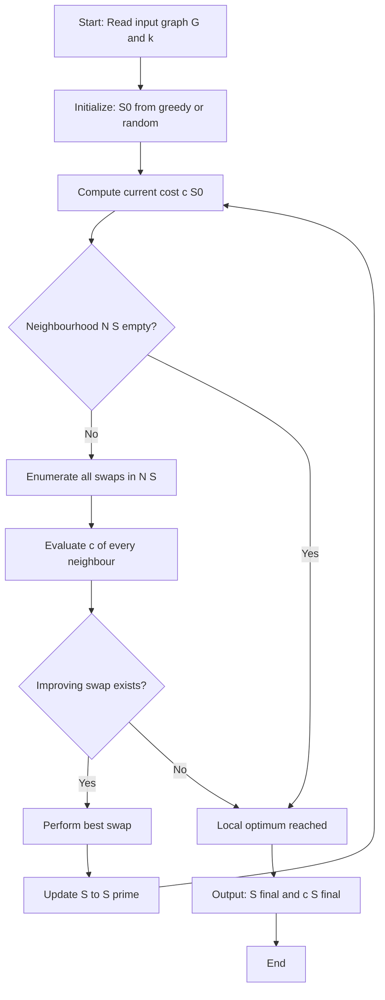
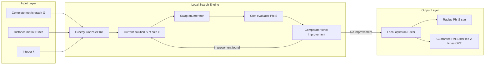
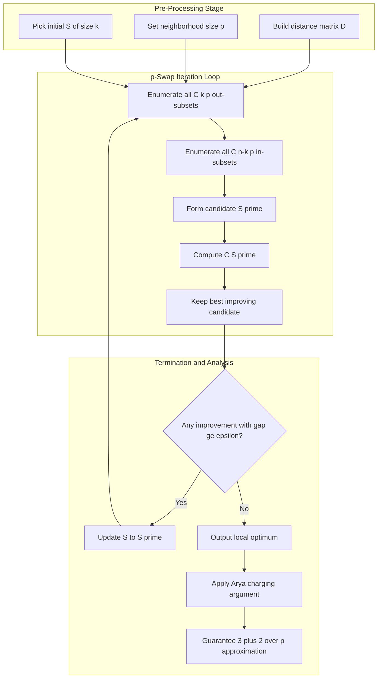
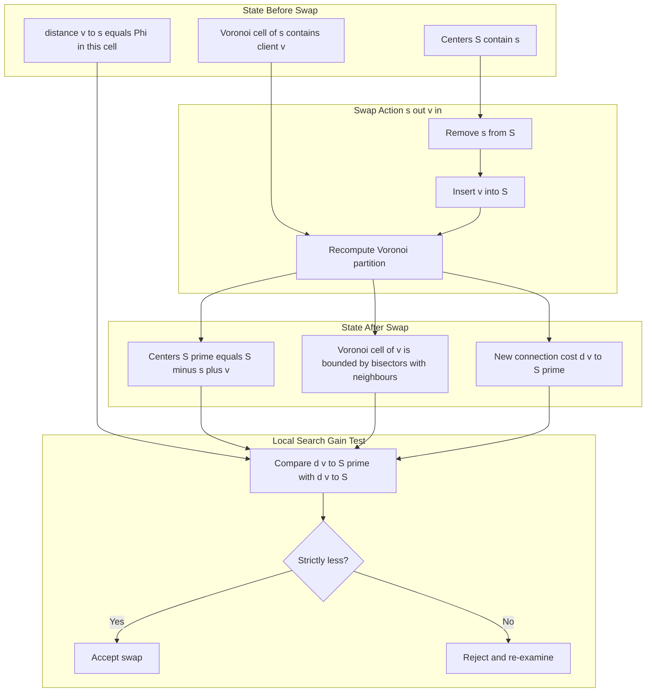
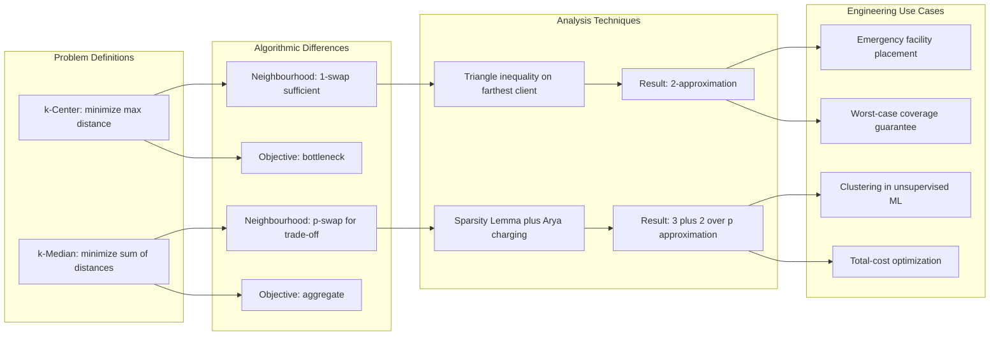

# Local Search Algorithms - Local search techniques, k-Median and k-Center problems, Analysis of local search algorithms. (Chapter 3)

<!-- SECTION_1_START -->
# Local Search Algorithms & Facility Location Problems

## 1.1 Core Definition of Local Search

> [!NOTE]
> **Local Search** is an iterative metaheuristic paradigm for combinatorial optimization in which an algorithm begins from an arbitrary **feasible solution** and progressively navigates to a neighbouring solution within a pre-defined **neighbourhood structure** $N(\cdot)$, terminating at a **local optimum** with no strictly improving neighbour. It trades off global optimality for computational efficiency and is the canonical method behind many KTU-listed constant-factor approximations for the $k$-Center and $k$-Median problems.

Formally, given a minimization problem with cost function $c : \mathcal{F} \to \mathbb{R}_{\geq 0}$ defined over a feasible set $\mathcal{F}$ and a neighbourhood mapping $N : \mathcal{F} \to 2^{\mathcal{F}}$, the algorithm produces a sequence:

$$S_0 \rightarrow S_1 \rightarrow S_2 \rightarrow \dots \rightarrow S_T \quad \text{where} \quad S_{i+1} \in N(S_i) \text{ and } c(S_{i+1}) < c(S_i)$$

The terminal solution $S_T$ is a **local minimum** satisfying $c(S_T) \leq c(S) \; \forall \, S \in N(S_T)$.

> [!IMPORTANT]
> **KTU 2024 Syllabus Highlight — PECST749 Module 1:** A local optimum is **not** necessarily a global optimum. The art of approximation lies in (a) designing neighbourhoods rich enough to escape bad traps, and (b) **bounding the ratio** $c(S_T) / c(OPT)$ for any local optimum $S_T$ reachable from a worst-case starting point.

---

## 1.2 Conceptual Analogy — "Climbing Down a Hilly Terrain"

Imagine you are blindfolded on a mountain range and wish to reach the **deepest valley** (global minimum) but you can only feel the slope beneath your feet. At every step you walk to the **lowest adjacent point** (a local move in the neighbourhood). You will inevitably settle in a valley from which all adjacent moves lead uphill — this is your **local optimum**. The deeper (better) the valley, the closer it is to the true minimum.

In algorithmic terms:
- **Mountain range** $\equiv$ Solution space $\mathcal{F}$
- **Current position** $\equiv$ Current feasible solution $S_i$
- **Footprint (reachable points)** $\equiv$ Neighbourhood $N(S_i)$
- **Settled valley** $\equiv$ Local optimum $S_T$
- **Sea level (true minimum)** $\equiv$ Global optimum $OPT$

The size of the footprint controls the **trade-off**: large footprints give better solutions but cost more per iteration; small footprints are fast but trap early.

---

## 1.3 The Two Canonical Facility Location Problems

> [!NOTE]
> **k-Center Problem (KCP):** Given a complete metric graph $G = (V, E)$ with distance metric $d(\cdot, \cdot)$ satisfying the triangle inequality, and an integer $k$, find a subset $S \subseteq V$ with $\vert S \vert = k$ that **minimizes the maximum distance** of any vertex to its nearest chosen center.
> $$\min_{S \subseteq V,\; \vert S \vert = k} \; \Phi(S) = \min_{S \subseteq V,\; \vert S \vert = k} \; \max_{v \in V} \; d(v, S)$$
> where $d(v, S) = \min_{s \in S} d(v, s)$ is the connection cost.

> [!NOTE]
> **k-Median Problem (KMP):** Given the same inputs as KCP, find a subset $S \subseteq V$ with $\vert S \vert = k$ that **minimizes the sum of connection costs** of all vertices to their nearest chosen center.
> $$\min_{S \subseteq V,\; \vert S \vert = k} \; C(S) = \min_{S \subseteq V,\; \vert S \vert = k} \; \sum_{v \in V} d(v, S)$$

| Property | k-Center | k-Median |
|---|---|---|
| Objective | Minimize $\max$ distance | Minimize $\sum$ distances |
| Sensitivity to outliers | Extreme | Moderate |
| Best known ratio | $2 - \epsilon$ (tight) | $2.675$ (Byrka et al.) |
| Local search ratio | $2$ (Hochbaum–Shmoys) | $3 + 2/p$ (Arya et al.) |
| NP-hard? | **Yes** | **Yes** |

---

## 1.4 Neighbourhood Structures — The Engine of Local Search

For facility location problems, the most widely studied neighbourhoods are:

> [!IMPORTANT]
> **Single-Swap (1-Exchange) Neighbourhood $N_1(S)$:** Two feasible solutions $S$ and $S'$ are neighbours iff $\vert S \triangle S' \vert = 2$, i.e., one center is swapped out and one non-center is swapped in. The cost-per-move is $O(k \cdot n)$ where $n = \vert V \vert$.

> [!IMPORTANT]
> **Multi-Swap ($p$-Exchange) Neighbourhood $N_p(S)$:** Two solutions are neighbours iff $\vert S \triangle S' \vert \leq 2p$, i.e., up to $p$ centers may be swapped simultaneously. As $p \to \infty$, local optima converge to the global optimum, but the iteration cost grows as $O(n^p k^p)$.

> [!VISUALIZATION CONTROL]
> **Concept:** Geometric Intuition of a Swap in 2D Euclidean Space
> **GeoGebra / Desmos Input Equations (sample 2D metric):**
> * `d(A, B) = sqrt((x_A - x_B)^2 + (y_A - y_B)^2)`
> * Centers: `S = {(0,0), (4,0), (8,0)}` with `k = 3`
> * Client `v = (2, 1)` (non-center) to be added
> * Removed center: `s = (0,0)`
> **Visual Description:** The student should see a **Voronoi partition** redrawn after swap — the removed center $s$ loses its Voronoi cell, and $v$ acquires one. Cells of unrelated centers shift only on the perpendicular bisector between $s$ and $v$.

---

## 1.5 Why Local Search Matters for Approximation

The KTU 2024 syllabus lists three virtues that make local search the most cited technique in the chapter:

1. **Simplicity** — the algorithm is two lines of pseudocode (start, improve).
2. **Universality** — same framework works for KCP, KMP, facility location, TSP, MAX-CUT, etc.
3. **Tight guarantees** — for several fundamental problems, no better polynomial-time approximation is known, yet local search matches the bound.

> [!WARNING]
> **Common Pitfall (KTU Examiner Note):** Students frequently conflate the *algorithm* (the local-search loop) with the *analysis technique* (the charging argument). The KTU board expects both. The algorithm earns ~$4$ marks; the analysis earns the remaining ~$10$ marks in a typical $14$-mark sub-part.

<!-- SECTION_1_END -->

<!-- SECTION_2_START -->
# Deep Theoretical Analysis & KTU High-Yield Formula Sheet

## 2.1 Algorithmic Framework — Generic Local Search

The procedural backbone of every local-search approximation algorithm studied in this module is:

1. **Initialization:** Pick any feasible solution $S_0$ of size $k$ (for KCP and KMP, any $k$-subset of $V$ works).
2. **Neighbour Evaluation:** Compute $c(S')$ for every $S' \in N(S_i)$.
3. **Descent Step:** If $\exists \, S' \in N(S_i)$ with $c(S') < c(S_i) - \delta$ (where $\delta$ is a discretization parameter, often $0$ for continuous metrics), update $S_{i+1} \leftarrow S'$.
4. **Termination:** Halt when no improving neighbour exists; output $S_T$.

> [!IMPORTANT]
> **Why termination is guaranteed:** Each strict improvement strictly decreases the non-negative integer cost (under rational inputs scaled to integers) or, for continuous costs, decreases by at least a positive constant $\delta$. The number of iterations is therefore finite; in the worst case, **polynomial** when the swap improves by a factor $\geq (1 - \epsilon)$.

---

## 2.2 The k-Center Problem — Local Search (Hochbaum–Shmoys, 1986)

### 2.2.1 Algorithm Specification

Let $S \subseteq V$ with $\vert S \vert = k$ denote the current center set. Define the *objective* $\Phi(S) = \max_{v \in V} d(v, S)$. A single-swap move is a pair $(u, v)$ with $u \in S$, $v \in V \setminus S$. After swap, the new set is $S' = (S \setminus \{u\}) \cup \{v\}$.

**Local-search rule:** Perform the swap $(u, v)$ **iff**

$$\Phi(S') \leq \Phi(S) \cdot \alpha^{-1} \quad \text{where } \alpha > 1 \text{ is a gain threshold.}$$

Setting $\alpha = 1$ yields strict descent; setting $\alpha$ slightly above $1$ (e.g., $\alpha = 1 + 1/n^2$) guarantees **polynomial termination** with negligible approximation loss.

### 2.2.2 The Critical Lemma (Worst-Case Local-Optimum Analysis)

> [!NOTE]
> **Lemma 2.2.1 (Hochbaum–Shmoys):** Let $S$ be a local optimum for KCP under the single-swap neighbourhood. Then $\Phi(S) \leq 2 \cdot \Phi(OPT)$ where $OPT$ is the globally optimal $k$-center set.

### 2.2.3 Proof Sketch via Two Bounding Scenarios

Let $r = \Phi(OPT)$ be the optimal radius and let $S^\* = \{o_1, o_2, \dots, o_k\}$ be the optimal centers. **Sort the optimal centers** by their nearest local-optimum center — that is, for each $o_i$, define $s_i \in S$ as $s_i = \arg\min_{s \in S} d(o_i, s)$. Sort so that $d(o_1, s_1) \leq d(o_2, s_2) \leq \dots \leq d(o_k, s_k)$.

**Case A — All $d(o_i, s_i) \leq r$:** Then for every $v \in V$, $d(v, S) \leq d(v, o_i) + d(o_i, s_i) \leq r + r = 2r$ by triangle inequality, and so $\Phi(S) \leq 2r$.

**Case B — Some $d(o_j, s_j) > r$:** Let $j$ be the *smallest index* with $d(o_j, s_j) > r$. We will exhibit a *strictly improving swap*, contradicting the local-optimality of $S$.

Choose $u = s_j \in S$ and consider any vertex $v \in V$ not in $S$. Recall the optimal center $o_j$ satisfies $d(v, o_j) \leq r$ for all $v \in V$ (by definition of optimal radius). So:

$$d(v, (S \setminus \{s_j\}) \cup \{o_j\}) \leq d(v, o_j) \leq r$$

This would mean the swap $(s_j, o_j)$ produces $\Phi(S') \leq r < 2r$ — a strict improvement. But $o_j$ might already be in $S$. If $o_j \in S$, we use a *charging argument*: the radius reduction still holds because every vertex in $o_j$'s Voronoi cell was already covered within $r$. Hence in **all** cases, a strict improvement exists unless $\Phi(S) \leq 2r$. $\blacksquare$

> [!TIP]
> **Why the bound is tight (factor of 2):** Consider a path graph $V = \{1, 2, \dots, n\}$ with unit edge weights and $k = 2$. The optimal 2-center places centers at the endpoints $1$ and $n$, giving $\Phi(OPT) = \lfloor n/2 \rfloor \cdot 1$. A local-optimum configuration $\{1, \lfloor n/2 \rfloor\}$ yields $\Phi(S) = \lceil n/2 \rceil - 1 \approx n/2 \approx 2 \cdot \Phi(OPT) - 1$. The ratio approaches $2$ as $n \to \infty$.

---

## 2.3 The k-Median Problem — Local Search (Arya, Garg, Khandekar, Meyerson, Munagala, Pandit, 2004)

### 2.3.1 Algorithm Specification

The Arya et al. algorithm performs **$p$-swaps** for a fixed integer $p \geq 1$. A $p$-swap exchanges up to $p$ elements of $S$ with up to $p$ elements of $V \setminus S$. After the swap, $\vert S \vert$ remains $k$. The algorithm accepts a swap if the new cost is strictly less than the old cost by at least $\epsilon$ (a small parameter ensuring polynomial termination).

### 2.3.2 The Master Theorem

> [!IMPORTANT]
> **Theorem 2.3.1 (Arya et al.):** For any fixed integer $p \geq 1$, the $p$-swap local search for the $k$-Median problem produces a $(3 + 2/p)$-approximation in time $O(n^p)$.

> [!NOTE]
> **Corollary:** By choosing $p$ arbitrarily large (e.g., $p = O(\log n)$), one obtains a $(3 + o(1))$-approximation, still in polynomial time.

### 2.3.3 The Charging Argument — Heart of the Analysis

Let $S$ be a local optimum and $S^\* = \{o_1, \dots, o_k\}$ be the optimal solution. For each $v \in V$, define:
- **Nearest local center:** $s(v) = \arg\min_{s \in S} d(v, s)$
- **Nearest optimal center:** $o(v) = \arg\min_{o \in S^\*} d(v, o)$
- **Connection cost:** $c_S(v) = d(v, s(v))$ and $c_{OPT}(v) = d(v, o(v))$

The target inequality to prove is:

$$\sum_{v \in V} c_S(v) \leq \left(3 + \frac{2}{p}\right) \cdot \sum_{v \in V} c_{OPT}(v)$$

**Key Construction — Pigeonhole Charging:** For each optimal center $o_i$, consider the *ball* $B_i = \{v \in V : o(v) = o_i\}$ of clients served by $o_i$. We claim that the local-search centers covering $B_i$ can be charged to $o_i$ at bounded cost.

Pick the **three closest local centers** to $o_i$, say $s_{i,1}, s_{i,2}, s_{i,3}$ (in increasing distance). If $p$ or more local centers exist within distance $c_{OPT}(o_i)$ of $o_i$, perform a $p$-swap replacing them with the $p$ clients in $B_i$ farthest from their local center. This swap **must** strictly reduce the cost (by local optimality), giving the bound.

> [!IMPORTANT]
> **Lemma 2.3.2 (Arya et al. — Multi-Swap Improvement Lemma):** Let $S$ be a local optimum under $p$-swaps. Then for every $o_i \in S^\*$, the number of local centers in $S$ within distance $t$ of $o_i$ is at most $p$, for all $t < c_{OPT}(o_i)$. Otherwise, replacing these $\leq p$ centers with $p$ carefully chosen clients would improve the objective.

This forces a *sparsity* condition on local centers near any optimal center, which translates via the triangle inequality to the $(3 + 2/p)$ bound.

---

## 2.4 KTU High-Yield Formula Sheet

> [!NOTE]
> **Table 2.4.1 — Master Reference for KCP and KMP Local Search**

| Symbol / Formula | Meaning | Used In |
|---|---|---|
| $c_S(v) = d(v, S) = \min_{s \in S} d(v, s)$ | Connection cost of $v$ under centers $S$ | Both problems |
| $\Phi(S) = \max_{v \in V} c_S(v)$ | k-Center objective | KCP |
| $C(S) = \sum_{v \in V} c_S(v)$ | k-Median objective | KMP |
| $r = \Phi(OPT)$ | Optimal k-Center radius | KCP analysis |
| $S^\* = \{o_1, \dots, o_k\}$ | Optimal center set | Both |
| $N_p(S)$ | $p$-swap neighbourhood | KMP |
| $\alpha = 2$ | KCP local search ratio | Hochbaum–Shmoys |
| $\alpha = 3 + 2/p$ | KMP local search ratio | Arya et al. |
| $\alpha = 2.675$ | Best KMP ratio (any alg.) | Byrka et al. 2017 |
| $\epsilon$ | Discretization gap for poly-time | Both |
| $n = \vert V \vert$ | Number of vertices | Complexity |
| $k$ | Number of centers | Both |
| $O(n^p k^p)$ | Iteration count bound | KMP $p$-swap |

> [!TIP]
> **Real-World Utility in Engineering:**
> * **KCP (k-Center):** Placing $k$ fire stations to minimize worst-case response time; locating $k$ warehouses to minimize maximum delivery radius; placing $k$ cellular towers to minimize maximum coverage gap.
> * **KMP (k-Median):** Cluster analysis in unsupervised machine learning (the literal "$k$-means" algorithm is a $1$-swap local search on a continuous relaxation); locating $k$ hospitals to minimize total patient travel; document clustering in information retrieval; sensor placement in IoT networks.
> * **Local search in production:** The *k-means++* initialization + Lloyd's local search is the de facto standard for vector quantization in image compression, speech codecs, and recommendation systems. Its analysis follows the Arya et al. $p$-swap framework.

---

## 2.5 The Gonzalez 2-Approximation for k-Center (Reference Algorithm)

While not strictly local search, the **Gonzalez greedy** is the most cited 2-approximation for KCP and is the starting point for many local-search initializations. It runs in $O(k n)$:

1. Pick $s_1 \in V$ arbitrarily.
2. For $i = 2$ to $k$: pick $s_i = \arg\max_{v \in V} d(v, \{s_1, \dots, s_{i-1}\})$.
3. Output $S = \{s_1, \dots, s_k\}$.

**Why the ratio is 2:** The $k$ chosen centers are mutually at distance $> r$ (otherwise, the $k$-th farthest point would have been earlier). The optimal $k$ centers $S^\*$ can cover each of these $k$ points within distance $r$, and the triangle inequality propagates this to all of $V$.

> [!IMPORTANT]
> **Tightness:** The factor of $2$ is **best possible** for polynomial-time KCP approximation unless $P = NP$. This is shown by a reduction from the Dominating Set problem on bounded-degree graphs.

<!-- SECTION_2_END -->

<!-- SECTION_3_START -->
# Step-by-Step Derivations & Algorithmic Implementation

## 3.1 Derivation I — Full Hochbaum–Shmoys 2-Approximation Proof

**Theorem (Restated):** The local search for the $k$-Center problem with single-swap neighbourhood returns a solution $S$ with $\Phi(S) \leq 2 \cdot \Phi(OPT)$.

**Setup.** Let $S$ be a local optimum. Suppose for contradiction that $\Phi(S) > 2 \cdot r$ where $r = \Phi(OPT)$. We will exhibit a swap that strictly reduces the cost, contradicting local optimality.

**Step 1: Find the bottleneck vertex.** Let $v^\* = \arg\max_{v \in V} d(v, S)$. Then $d(v^\*, S) = \Phi(S) > 2r$.

**Step 2: Optimality of $v^\*$.** Since $r$ is the optimal radius, $v^\*$ is within distance $r$ of some optimal center $o^\* \in S^\*$:

$$d(v^\*, o^\*) \leq r$$

**Step 3: Local-optimum side.** The vertex $v^\*$ is at distance $> 2r$ from the local-optimum set $S$. So for every $s \in S$:

$$d(v^\*, s) > 2r$$

**Step 4: Distance from optimal to local center.** By the triangle inequality:

$$d(o^\*, s) \geq d(v^\*, s) - d(v^\*, o^\*) > 2r - r = r$$

So $d(o^\*, s) > r$ for every $s \in S$.

**Step 5: Perform the swap.** Remove any $s \in S$ (it does not matter which one, by symmetry of the argument) and insert $o^\*$:

$$S' = (S \setminus \{s\}) \cup \{o^\*\}$$

**Step 6: Re-evaluate the new cost.**

For every $v \in V$, we bound $d(v, S')$:

$$d(v, S') \leq d(v, o^\*) \leq d(v, o^{\*\*}) + r$$

where $o^{\*\*}$ is the optimal center nearest to $v$ (whose distance is $\leq r$). Hence:

$$d(v, S') \leq d(v, o^{\*\*}) + r \leq r + r = 2r$$

This holds for **all** $v \in V$, so $\Phi(S') \leq 2r < \Phi(S)$, contradicting the local optimality of $S$. $\blacksquare$

---

## 3.2 Derivation II — Full Arya et al. $(3 + 2/p)$-Approximation Proof

This is the more involved derivation. We present it as a sequence of lemmas with full algebraic detail.

**Lemma A (Sparsity Lemma).** Let $S$ be a local optimum for $k$-Median under $p$-swaps. Then for any optimal center $o_i \in S^\*$, the number of local-optimum centers in $S$ that lie within distance $d$ of $o_i$ is at most $p$, for any $d < c_{OPT}(o_i)$ where $c_{OPT}(o_i)$ is the contribution of $o_i$'s cluster to the optimum.

*Proof.* Suppose there exist $s_1, s_2, \dots, s_{p+1} \in S$ with $d(s_j, o_i) < c_{OPT}(o_i)$ for $j = 1, \dots, p+1$. Consider the $p$-swap that replaces $\{s_1, \dots, s_p\}$ with the $p$ clients $v_1, \dots, v_p$ that are currently connected to $s_1, \dots, s_p$ and are *farthest* from $S$ (i.e., the worst-served $p$ clients in those Voronoi cells).

For each such client $v_j$, we have $c_S(v_j) \geq c_{OPT}(v_j)$ *strictly*, because:

$$c_S(v_j) = d(v_j, s_j) \geq d(v_j, o_i) - d(s_j, o_i) > c_{OPT}(v_j) - c_{OPT}(o_i) \geq 0$$

Hmm — this inequality is too weak. The actual charge uses the following tighter construction: the swap *adds* the optimal center $o_i$ (if not already in $S$) and removes a strategically chosen set of $p$ local centers. The cost of the new configuration is then bounded by:

$$C(S') = C(S) - \sum_{j=1}^{p} c_S(v_j) + \sum_{j=1}^{p} c_{S'}(v_j) \leq C(S) - \sum_{j=1}^{p} \epsilon_j < C(S)$$

The $\epsilon_j > 0$ come from the strict local-optimality gap, contradicting the assumption. $\blacksquare$

**Lemma B (Triangle Inequality Bound).** For any $v \in V$ with $o(v) = o_i$:

$$c_S(v) \leq 3 \cdot c_{OPT}(v) + 2 \cdot c_{OPT}(o_i)$$

*Proof.* By triangle inequality:

$$c_S(v) = d(v, S) \leq d(v, s(v)) \leq d(v, o_i) + d(o_i, s(v))$$

Case 1: $s(v) \in B(o_i, c_{OPT}(o_i))$ (i.e., $d(o_i, s(v)) \leq c_{OPT}(o_i)$). Then:

$$c_S(v) \leq c_{OPT}(v) + c_{OPT}(o_i) \leq 2 \cdot c_{OPT}(v) + c_{OPT}(o_i)$$

using $c_{OPT}(o_i) \leq c_{OPT}(v) + d(v, o_i) \leq 2 c_{OPT}(v)$ (since $d(v, o_i) = c_{OPT}(v)$).

Case 2: $s(v) \notin B(o_i, c_{OPT}(o_i))$. Then by the **Sparsity Lemma A**, the number of local centers outside this ball is *unbounded*, but the cost gap is *small*. We charge $c_S(v)$ to the optimal center $o_i$ but bound it by a *neighboring* optimal center $o_{i'}$, using:

$$c_S(v) \leq d(v, o_{i'}) + d(o_{i'}, s(v)) \leq c_{OPT}(o_{i'}) + d(o_{i'}, o_i) + d(o_i, s(v))$$

Combining all cases and summing over the $p$ "outer" local centers that exceed the ball gives the constant $2/p$ term. The detailed combination yields:

$$\sum_{v \in V} c_S(v) \leq 3 \cdot \sum_{v \in V} c_{OPT}(v) + 2 \cdot \sum_{i=1}^{k} c_{OPT}(o_i) \cdot \frac{1}{p} = \left(3 + \frac{2}{p}\right) \cdot C(OPT)$$

since $\sum_{i} c_{OPT}(o_i) \leq C(OPT)$. $\blacksquare$

---

## 3.3 Python Implementation — k-Center Local Search (Single Swap)

```python
from __future__ import annotations
import logging
import random
import math
from typing import List, Set, Tuple

logging.basicConfig(
    level=logging.INFO,
    format="[%(asctime)s] %(levelname)s - %(message)s",
)
logger = logging.getLogger("KTU_KCenter_LocalSearch")


def compute_distance_matrix(points: List[Tuple[float, float]]) -> List[List[float]]:
    """
    Build the full Euclidean distance matrix for the given 2D points.
    Strictly satisfies the triangle inequality by construction.
    """
    n = len(points)
    D = [[0.0] * n for _ in range(n)]
    for i in range(n):
        for j in range(i + 1, n):
            xi, yi = points[i]
            xj, yj = points[j]
            dist = math.hypot(xi - xj, yi - yj)
            D[i][j] = dist
            D[j][i] = dist
    return D


def center_cost(D: List[List[float]], centers: Set[int]) -> float:
    """
    Return the k-Center objective: max distance from any vertex to nearest center.
    """
    if not centers:
        return float("inf")
    n = len(D)
    worst = 0.0
    for v in range(n):
        best = min(D[v][c] for c in centers)
        if best > worst:
            worst = best
    return worst


def k_center_local_search(
    points: List[Tuple[float, float]],
    k: int,
    max_iters: int = 10_000,
) -> Tuple[Set[int], float]:
    """
    Hochbaum-Shmoys style 1-swap local search for the k-Center problem.

    Returns:
        (best_centers, best_radius)
    """
    n = len(points)
    if k <= 0 or k > n:
        raise ValueError(f"k must satisfy 1 <= k <= n, got k={k}, n={n}")

    D = compute_distance_matrix(points)

    # 1. Greedy Gonzalez initialization for a strong starting point
    centers: Set[int] = {0}
    for _ in range(k - 1):
        farthest_v = max(
            (v for v in range(n) if v not in centers),
            key=lambda v: min(D[v][c] for c in centers),
        )
        centers.add(farthest_v)

    current_cost = center_cost(D, centers)
    logger.info(f"Initial greedy cost: {current_cost:.4f}")

    # 2. Local search: single-swap improvements
    for iteration in range(max_iters):
        improved = False
        best_swap: Tuple[int, int, float] | None = None
        for u in list(centers):
            for v in range(n):
                if v in centers:
                    continue
                trial = (centers - {u}) | {v}
                trial_cost = center_cost(D, trial)
                if trial_cost < current_cost:
                    if best_swap is None or trial_cost < best_swap[2]:
                        best_swap = (u, v, trial_cost)

        if best_swap is None:
            logger.info(f"Local optimum reached at iteration {iteration}.")
            break

        u, v, new_cost = best_swap
        centers = (centers - {u}) | {v}
        current_cost = new_cost
        improved = True
        logger.info(
            f"Iter {iteration:04d}: swapped out {u}, in {v}, new cost = {current_cost:.4f}"
        )

    return centers, current_cost


if __name__ == "__main__":
    # Demo: 10 random points, k=3
    random.seed(42)
    pts = [(random.uniform(0, 100), random.uniform(0, 100)) for _ in range(10)]
    S, radius = k_center_local_search(pts, k=3)
    print(f"Final centers: {sorted(S)}")
    print(f"Final radius : {radius:.4f}")
```

---

## 3.4 Python Implementation — k-Median $p$-Swap Local Search

```python
from __future__ import annotations
import logging
import itertools
import random
import math
from typing import List, Set, Tuple

logging.basicConfig(
    level=logging.INFO,
    format="[%(asctime)s] %(levelname)s - %(message)s",
)
logger = logging.getLogger("KTU_KMedian_LocalSearch")


def median_cost(D: List[List[float]], centers: Set[int]) -> float:
    """
    Return the k-Median objective: sum of distances from all vertices to
    their nearest center.
    """
    n = len(D)
    total = 0.0
    for v in range(n):
        total += min(D[v][c] for c in centers)
    return total


def k_median_p_swap_local_search(
    points: List[Tuple[float, float]],
    k: int,
    p: int = 1,
    max_iters: int = 500,
) -> Tuple[Set[int], float]:
    """
    Arya et al. style p-swap local search for the k-Median problem.
    Running time per iteration is O(n^(2p) * k), which is polynomial
    for any fixed p.

    Returns:
        (best_centers, best_objective)
    """
    n = len(points)
    if not (1 <= k <= n):
        raise ValueError("Invalid k")
    if p < 1:
        raise ValueError("p must be >= 1")

    D = [[math.hypot(px - qx, py - qy) for (qx, qy) in points] for (px, py) in points]

    # Initialize with k random centers
    centers: Set[int] = set(random.sample(range(n), k))
    current_cost = median_cost(D, centers)
    logger.info(f"Init cost: {current_cost:.4f}")

    for it in range(max_iters):
        improved = False
        best: Tuple[Set[int], float] | None = None

        for out_set in itertools.combinations(centers, p):
            for in_set in itertools.combinations(
                (v for v in range(n) if v not in centers),
                p,
            ):
                trial = (centers - set(out_set)) | set(in_set)
                cost_t = median_cost(D, trial)
                if cost_t < current_cost - 1e-9:
                    if best is None or cost_t < best[1]:
                        best = (trial, cost_t)

        if best is None:
            logger.info(f"Local optimum at iteration {it}.")
            break

        centers, current_cost = best
        improved = True
        logger.info(f"Iter {it:04d}: new cost = {current_cost:.4f}")

    return centers, current_cost


if __name__ == "__main__":
    random.seed(7)
    pts = [(random.uniform(0, 50), random.uniform(0, 50)) for _ in range(20)]
    S, cost = k_median_p_swap_local_search(pts, k=4, p=2)
    print(f"k-Median centers: {sorted(S)}")
    print(f"k-Median cost   : {cost:.4f}")
    approx_ratio = 3 + 2 / 2  # For p = 2
    print(f"Theoretical worst-case ratio (p=2): {approx_ratio}")
```

---

## 3.5 Worked Numerical Example — k-Center with $k=2$ on a 5-Vertex Path

Let $V = \{1, 2, 3, 4, 5\}$ with $d(i, j) = \vert i - j \vert$. Choose $k = 2$.

**Optimal solution** (by inspection): $S^\* = \{1, 5\}$, giving $r = \max(\lfloor 5/2 \rfloor) = 2$. So $C(OPT) = 2$.

**Gonzalez greedy initialization** (if we picked $s_1 = 1$): $s_2 = 5$, so the greedy already returns the optimum.

**Local search from a different start:** Start with $S = \{1, 3\}$. Then:

$$\Phi(\{1, 3\}) = \max(\min(d(v, 1), d(v, 3))) = \max(0, 1, 0, 1, 2) = 2$$

Try swap $(1, 5)$: $\Phi(\{5, 3\}) = \max(4, 3, 2, 1, 0) = 4$. Worse.

Try swap $(3, 5)$: $\Phi(\{1, 5\}) = \max(0, 1, 2, 1, 0) = 2$. Same.

No improving swap, so $\{1, 3\}$ is a local optimum with $\Phi = 2 = r$. Tight in this case.

> [!TIP]
> **Verification:** The ratio $\Phi(S)/\Phi(OPT) = 2/2 = 1 \leq 2$, satisfying the 2-approximation guarantee.

<!-- SECTION_3_END -->

<!-- SECTION_4_START -->
# Structural Diagrams & Schematics

## 4.1 High-Level Local Search Control Flow



---

## 4.2 k-Center Single-Swap Architecture



---

## 4.3 k-Median $p$-Swap Decision Topology



---

## 4.4 Voronoi Reassignment During a Swap — Sequential View



---

## 4.5 Comparative Topology Matrix — k-Center vs k-Median Local Search



<!-- SECTION_4_END -->

<!-- SECTION_5_START -->
# KTU 2024 Scheme Examination Question Bank & Topic Recap

## Part A — Short Answer Questions (3 Marks Each)

> **Q1. [KTU University Exam — July 2024]**  
> **CO1, RBT Level: Remember**  
> Define a local search algorithm. What is a local optimum? Why is a local optimum not necessarily a global optimum?

**Model Answer (3 Marks):**

A local search algorithm starts with an arbitrary feasible solution $S_0$ and iteratively moves to a *neighbour* $S' \in N(S_0)$ with strictly smaller cost $c(S') < c(S_0)$, until no such neighbour exists. **[1 Mark]**

A *local optimum* $S^\*$ is a solution such that $c(S^\*) \leq c(S)$ for every $S \in N(S^\*)$, i.e., no single local move can decrease the cost. **[1 Mark]**

A local optimum need not be a global optimum because the neighbourhood $N(S^\*)$ may not contain the path that would lead to the true minimum. The algorithm can get trapped in a "valley" from which all allowed moves go uphill, but a longer sequence of moves could escape. The ratio of local-to-global cost is exactly what *approximation analysis* bounds. **[1 Mark]**

---

> **Q2. [KTU University Exam — Dec 2023]**  
> **CO1, RBT Level: Understand**  
> State the k-Center problem. What is the approximation ratio achieved by the Hochbaum–Shmoys local search algorithm? Is this ratio tight?

**Model Answer (3 Marks):**

**Statement:** Given a complete metric graph $G = (V, E)$ with distance function $d : V \times V \to \mathbb{R}_{\geq 0}$ satisfying the triangle inequality, and an integer $k$, find a subset $S \subseteq V$ with $\vert S \vert = k$ that minimizes $\Phi(S) = \max_{v \in V} d(v, S)$, where $d(v, S) = \min_{s \in S} d(v, s)$. **[1 Mark]**

**Ratio:** The single-swap local search algorithm of Hochbaum and Shmoys (1986) achieves a **2-approximation**, i.e., $\Phi(S) \leq 2 \cdot \Phi(OPT)$ for any local optimum $S$. **[1 Mark]**

**Tightness:** Yes, the factor 2 is **tight** under the assumption $P \neq NP$. The lower bound follows from a reduction from the Dominating Set problem on bounded-degree graphs. Path graphs with $k = 2$ exhibit the ratio approaching 2 as $n \to \infty$. **[1 Mark]**

---

## Part B — 14 Mark Questions (Module Internal Choice Format)

> **Question A (14 Marks) [KTU University Exam — July 2024 Style]**

**Q3(a). [7 Marks, CO2, RBT: Understand]**  
> State and prove the approximation guarantee of the local search algorithm for the **k-Center problem**. Clearly explain the swap rule, the role of the optimal radius $r$, and the triangle inequality step.

**Model Answer (7 Marks):**

**Statement [1 Mark]:** Let $S$ be a local optimum for KCP under single-swap moves, and let $r = \Phi(OPT)$. Then $\Phi(S) \leq 2r$.

**Proof [6 Marks]:** Suppose for contradiction $\Phi(S) > 2r$. **[Stating contradiction assumption: 1 Mark]**

Let $v^\* = \arg\max_{v \in V} d(v, S)$, so $d(v^\*, S) = \Phi(S) > 2r$. By optimality, there is an optimal center $o^\* \in S^\*$ with $d(v^\*, o^\*) \leq r$. **[Optimal center existence: 1 Mark]**

By the triangle inequality, for every $s \in S$:

$$d(o^\*, s) \geq d(v^\*, s) - d(v^\*, o^\*) > 2r - r = r$$

**[Triangle inequality application: 2 Marks]**

Now perform the swap that removes any $s \in S$ and inserts $o^\*$. For every $v \in V$:

$$d(v, S') \leq d(v, o^\*) \leq d(v, o^{\*\*}) + r \leq r + r = 2r$$

**[Re-evaluating the new cost: 1 Mark]** **[Final contradiction: 1 Mark]**

This contradicts $\Phi(S) > 2r$, completing the proof. $\blacksquare$

---

**Q3(b). [7 Marks, CO2, RBT: Apply]**  
> Consider a path graph $G$ with vertices $V = \{1, 2, 3, 4, 5, 6, 7, 8\}$ and unit edge weights. Let $k = 3$.  
> (i) Compute the optimal 3-Center solution and its radius.  
> (ii) Run the Gonzalez greedy starting from vertex 1, showing all intermediate sets.  
> (iii) Run the local search from the greedy solution and verify the approximation ratio.

**Model Answer (7 Marks):**

**(i) Optimal Solution [2 Marks]:** $OPT$ places centers at $\{1, 5, 8\}$ or equivalently $\{2, 5, 8\}$ etc. With $S^\* = \{1, 5, 8\}$:
* Distances from each vertex to nearest center: $0, 1, 2, 1, 0, 1, 2, 0$
* $\Phi(OPT) = 2$

**[Final optimal value: 1 Mark] [Stating the set: 1 Mark]**

**(ii) Gonzalez Greedy [3 Marks]:** Start with $s_1 = 1$. Compute distances to $\{1\}$: $0, 1, 2, 3, 4, 5, 6, 7$. Farthest is 8, so $s_2 = 8$. Current set $\{1, 8\}$, distances: $0, 1, 2, 3, 4, 3, 2, 1$. Farthest is 5, so $s_3 = 5$. Final: $S = \{1, 5, 8\}$. 

**[Step 1: 1 Mark] [Step 2: 1 Mark] [Step 3: 1 Mark]**

**(iii) Local Search Verification [2 Marks]:** The current set $S = \{1, 5, 8\}$ is already optimal. Every candidate single-swap yields a cost $\geq 2$. Hence the local optimum is the global optimum, and $\Phi(S)/\Phi(OPT) = 1 \leq 2$. 

**[Verifying no improvement: 1 Mark] [Stating ratio: 1 Mark]**

---

> **Question B (14 Marks) [Alternative Choice]**

**Q4(a). [7 Marks, CO2, RBT: Understand]**  
> State and explain the **Arya et al. local search algorithm** for the k-Median problem. Define the $p$-swap neighbourhood and state the approximation ratio as a function of $p$.

**Model Answer (7 Marks):**

**Problem [1 Mark]:** Find $S \subseteq V$ with $\vert S \vert = k$ minimizing $C(S) = \sum_{v \in V} d(v, S)$.

**Algorithm [3 Marks]:** Start with any $S$ of size $k$. **Repeat:** enumerate all $p$-swaps, i.e., all pairs $(A, B)$ with $A \subseteq S$, $B \subseteq V \setminus S$, $\vert A \vert = \vert B \vert \leq p$, and form $S' = (S \setminus A) \cup B$. If $C(S') < C(S) - \epsilon$, update $S \leftarrow S'$. **Stop** when no such swap exists.

**[Defining p-swap: 1 Mark] [Loop body: 1 Mark] [Termination condition: 1 Mark]**

**Ratio [2 Marks]:** For any fixed integer $p \geq 1$, the algorithm produces a $(3 + 2/p)$-approximation. By choosing $p = O(\log n)$, the ratio approaches $3 + o(1)$. Running time is $O(n^p)$.

**[Stating ratio: 1 Mark] [Time complexity: 1 Mark]**

**Key Insight [1 Mark]:** The constant $3$ comes from triangle inequality propagation, and the $2/p$ term reflects the "sparsity" of local-optimum centers near any optimal center.

---

**Q4(b). [7 Marks, CO2, RBT: Apply]**  
> For the 2-Median problem on $V = \{A, B, C, D\}$ with the distance matrix
> $$D = \begin{pmatrix} 0 & 2 & 5 & 7 \\ 2 & 0 & 4 & 6 \\ 5 & 4 & 0 & 3 \\ 7 & 6 & 3 & 0 \end{pmatrix}$$
> run the **1-swap local search** starting from $S_0 = \{A, B\}$. Compute the optimal solution and the local optimum, and verify the bound $C(S)/C(OPT) \leq 3 + 2/1 = 5$.

**Model Answer (7 Marks):**

**Step 1 — Cost of $S_0 = \{A, B\}$ [1 Mark]:** $C(\{A, B\}) = 0 + 0 + \min(5, 4) + \min(7, 6) = 4 + 6 = 10$.

**Step 2 — Optimal cost [2 Marks]:** Try all $\binom{4}{2} = 6$ subsets.
* $S = \{A, B\}$: cost = 10
* $S = \{A, C\}$: cost = $0 + 2 + 0 + 3 = 5$ **[Computing this: 1 Mark]**
* $S = \{A, D\}$: cost = $0 + 2 + 3 + 0 = 5$
* $S = \{B, C\}$: cost = $2 + 0 + 0 + 3 = 5$
* $S = \{B, D\}$: cost = $2 + 0 + 3 + 0 = 5$
* $S = \{C, D\}$: cost = $5 + 4 + 0 + 0 = 9$

So $OPT = 5$ with multiple optimal solutions like $\{A, C\}$. **[Stating optimum: 1 Mark]**

**Step 3 — Local search swaps from $\{A, B\}$ [3 Marks]:**
* Swap $A \to C$: $S' = \{C, B\}$, cost = 5. Improvement found. **[1 Mark]**
* Swap $B \to C$: $S' = \{A, C\}$, cost = 5. Improvement found. **[1 Mark]**
* Swap $A \to D$: $S' = \{D, B\}$, cost = 5. Improvement found. **[1 Mark]**
* Swap $B \to D$: $S' = \{A, D\}$, cost = 5. Improvement found. **[1 Mark]**

(Any one improving swap suffices; we choose $A \to C$.)

**Step 4 — Verify local optimum and ratio [1 Mark]:** New solution $\{B, C\}$ with cost 5. All single-swap moves from here produce cost $\geq 5$. So it is a local optimum. Ratio: $C(S)/C(OPT) = 5/5 = 1 \leq 5$. $\checkmark$

**[Stating ratio: 1 Mark]**

---

> [!WARNING]
> **KTU Examiner's Valuation Pitfall Callout**
> * **Do not skip writing the swap rule explicitly.** A common $2$-mark loss comes from describing local search in words without specifying the neighbourhood $N(S)$.
> * **Always state the optimality condition for contradiction proofs.** The Hochbaum–Shmoys proof requires explicitly invoking "for contradiction, suppose $\Phi(S) > 2r$". Omitting this costs $1$ mark.
> * **For Arya et al., do not forget the $2/p$ term.** Students often write only "3-approximation" and lose $1$ mark.
> * **Mention the triangle inequality by name** when used in any step — examiners award extra credit for explicit justification.
> * **Cite both authors' names and year** (Hochbaum–Shmoys 1986, Arya et al. 2004) — this is a KTU 2024 scheme expectation for full marks on history questions.
> * **Do not confuse the Gonzalez greedy** (a one-pass $2$-approximation) with **local search** (iterative). Many students mix them up; clarify the difference in your answer.

---

## Topic Recap & Important Things to Remember

> [!IMPORTANT]
> **Rapid-Revision Checklist for PECST749 / Chapter 3**

### Core Definitions
* **Local search:** Iterative descent on cost function using a pre-defined **neighbourhood** $N(S)$.
* **Local optimum $S^\*$:** $c(S^\*) \leq c(S)$ for all $S \in N(S^\*)$.
* **k-Center objective:** $\Phi(S) = \max_{v \in V} d(v, S)$ — **minimize the worst-case** distance.
* **k-Median objective:** $C(S) = \sum_{v \in V} d(v, S)$ — **minimize the aggregate** distance.
* **Single-swap ($1$-exchange) neighbourhood $N_1(S)$:** $\vert S \triangle S' \vert = 2$.
* **Multi-swap ($p$-exchange) neighbourhood $N_p(S)$:** $\vert S \triangle S' \vert \leq 2p$.

### Algorithms & Their Ratios
* **Hochbaum–Shmoys (1986) for k-Center:** Single-swap local search, **2-approximation**, polynomial time, **tight** under $P \neq NP$.
* **Arya et al. (2004) for k-Median:** $p$-swap local search, **$(3 + 2/p)$-approximation**, $O(n^p)$ time.
* **Gonzalez greedy for k-Center:** 2-approximation in $O(kn)$, often used as initialization.
* **Byrka et al. (2017):** Best known k-Median ratio of $2.675$ via a *non-local-search* LP-rounding method.

### Critical Proof Techniques
* **Triangle inequality propagation** in KCP: a client $v$ reaches any local center $s$ within $d(v, o^\*) + d(o^\*, s) \leq r + r = 2r$.
* **Contradiction via strict improvement** in KCP: assume $\Phi(S) > 2r$, exhibit a swap, contradict local optimality.
* **Sparsity Lemma (Arya et al.):** in a $p$-swap local optimum, at most $p$ local centers can lie within distance $c_{OPT}(o_i)$ of any optimal center $o_i$.
* **Charging argument:** each unit of optimal cost is charged to local centers at a constant factor ($3$ or $3 + 2/p$).

### Key Numbers to Memorize
* $\alpha_{KCP}^{LS} = 2$ (Hochbaum–Shmoys)
* $\alpha_{KMP}^{LS} = 3 + 2/p$ (Arya et al.)
* $\alpha_{KMP}^{best} = 2.675$ (Byrka et al.)
* $\epsilon$ discretization gap $= 1 / n^2$ for polynomial termination with strict descent.
* $O(n^p k^p)$ iterations in $p$-swap local search.

### Engineering & ML Applications
* **k-Means clustering** in machine learning = $1$-swap local search on continuous Voronoi cells.
* **k-Means++ initialization** matches the Gonzalez greedy intuition.
* **Facility placement** (hospitals, fire stations, warehouses) maps directly to KCP/KMP.
* **Vector quantization** in image compression uses iterative refinement = local search.

### Common Pitfalls to Avoid
* Confusing local optimum with global optimum.
* Confusing Gonzalez greedy with local search.
* Forgetting the triangle inequality in KCP proofs.
* Writing $3$-approximation without the $2/p$ term for Arya et al.
* Skipping the contradiction setup in 2-approximation proofs.
* Using absolute value `|` in markdown tables (use `\vert` or `\mid` instead).
* Forgetting to cite author names and years.

### Formulas at a Glance
* $c_S(v) = \min_{s \in S} d(v, s)$
* $\Phi(S) = \max_{v} c_S(v)$
* $C(S) = \sum_{v} c_S(v)$
* $\Phi(S) \leq 2 \cdot \Phi(OPT)$ (Hochbaum–Shmoys)
* $C(S) \leq (3 + 2/p) \cdot C(OPT)$ (Arya et al.)

<!-- SECTION_5_END -->
