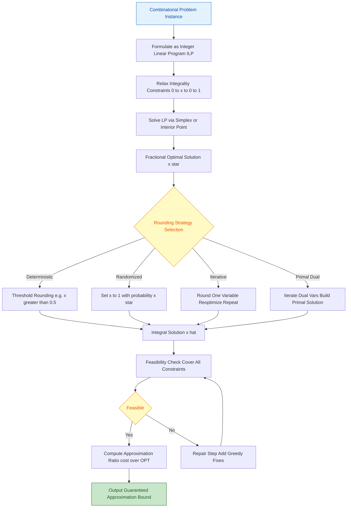
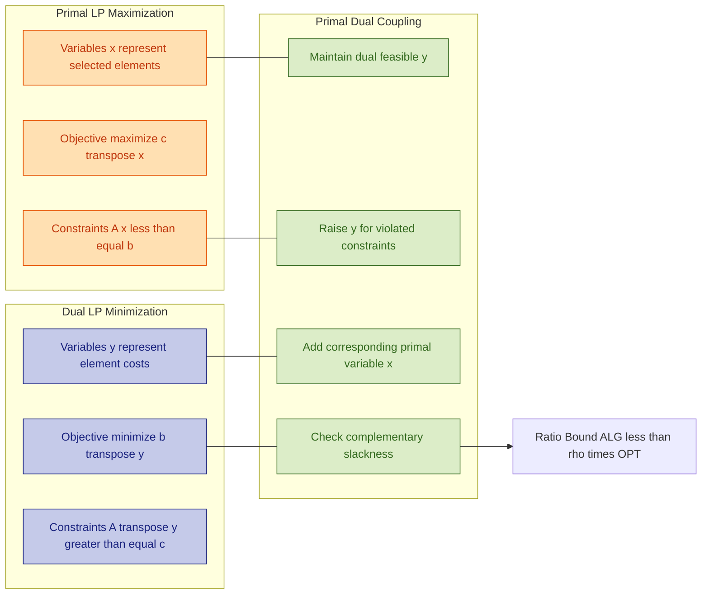
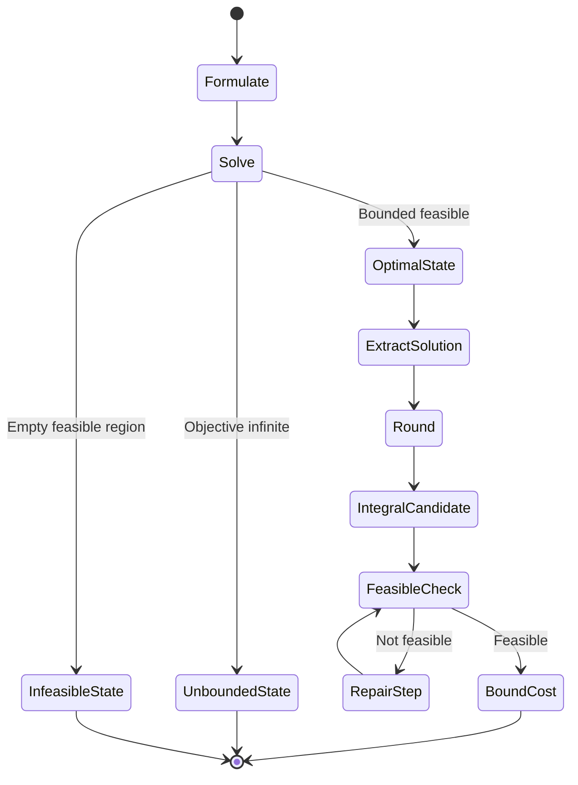

# Linear Programming Relaxation - Introduction to linear programming (LP), LP relaxation of combinatorial problems, Primal-dual method.  (Chapter 4)

<!-- SECTION_1_START -->
# Linear Programming Relaxation: The Foundation of Approximation Algorithms

## 1.1 Formal Definition — Linear Programming (LP)

A **Linear Program (LP)** is a mathematical optimization problem in which:
- The **objective function** is linear in the decision variables.
- All **constraints** are linear equalities or inequalities.
- Decision variables may be real-valued (continuous), with optional lower/upper bounds.

Formally, an LP in **canonical (maximization) form** is expressed as:

$$
\begin{aligned}
\text{Maximize } \quad & \mathbf{c}^{\top}\mathbf{x} = \sum_{j=1}^{n} c_j x_j \\
\text{subject to } \quad & \mathbf{A}\mathbf{x} \leq \mathbf{b} \\
& \mathbf{x} \geq \mathbf{0}
\end{aligned}
$$

Where:
- $\mathbf{x} \in \mathbb{R}^{n}$ is the vector of decision variables.
- $\mathbf{c} \in \mathbb{R}^{n}$ is the coefficient vector of the objective.
- $\mathbf{A} \in \mathbb{R}^{m \times n}$ is the constraint matrix.
- $\mathbf{b} \in \mathbb{R}^{m}$ is the right-hand side resource vector.

> [!NOTE]
> **KTU 2024 Syllabus Highlight — PECST749 / Module 2**
> An LP is a *polynomial-time solvable* problem (via Ellipsoid, Interior-Point, or Simplex methods). When we **relax** a hard combinatorial (Integer Program, IP) problem to an LP, we trade integrality for tractability — the core engine behind modern approximation algorithms.

## 1.2 Conceptual Analogy — The Factory Production Planner

Imagine you own a factory that produces two products, $x_1$ (chairs) and $x_2$ (tables). Each yields a profit of $c_1$ and $c_2$ respectively. You have limited **wood**, **labor hours**, and **machine time**.

- **Objective**: Maximize total profit → a linear expression in $x_1, x_2$.
- **Constraints**: "You cannot use more than $b$ units of wood" → a linear inequality.
- **Variables**: $x_1, x_2 \geq 0$ → you cannot produce a negative number of chairs.

The "relaxation" idea: In a *combinatorial* version (e.g., "produce a whole-number quantity of chairs"), we force $x_1, x_2 \in \mathbb{Z}_{\geq 0}$ — this is the famous **Integer Program (IP)**, which is NP-hard in general. By *dropping* the integer constraint and allowing fractional chairs ($\pi$-chairs), we obtain an **LP relaxation** — easy to solve, gives an **upper bound** on the integer optimum.

## 1.3 What is LP Relaxation?

Given an Integer Linear Program (ILP) of the form:

$$
\begin{aligned}
\text{Maximize } \quad & \mathbf{c}^{\top}\mathbf{x} \\
\text{subject to } \quad & \mathbf{A}\mathbf{x} \leq \mathbf{b} \\
& \mathbf{x} \in \{0, 1\}^{n}
\end{aligned}
$$

The **LP Relaxation** is obtained by replacing the discrete (binary/integer) constraint set with its **convex hull approximation**:

$$
\begin{aligned}
\text{Maximize } \quad & \mathbf{c}^{\top}\mathbf{x} \\
\text{subject to } \quad & \mathbf{A}\mathbf{x} \leq \mathbf{b} \\
& \mathbf{0} \leq \mathbf{x} \leq \mathbf{1}
\end{aligned}
$$

Since the feasible region of the LP **strictly contains** that of the ILP, we always have:

$$
\text{OPT}_{ILP} \leq \text{OPT}_{LP}
$$

> [!IMPORTANT]
> **Why this matters for Approximation**
> The ratio $\rho = \text{OPT}_{LP} / \text{OPT}_{ILP}$ is the **integrality gap**. Designing rounding schemes that convert the fractional LP optimum into an integer solution, with bounded loss, is the heart of approximation via LP relaxation.

## 1.4 The Primal-Dual Method — A Greedy Sidekick

The **Primal-Dual (PD) method** is a paradigm for designing approximation algorithms by leveraging **LP duality**. Instead of solving the primal LP explicitly, we:

1. Start with a *trivial* feasible dual solution.
2. Iteratively improve the dual (raise variables) until a dual constraint becomes **tight**.
3. Translate the dual improvements into a structural change in the primal (add a vertex, an edge, a set...).
4. Stop when we have built a feasible integral primal solution whose cost is provably bounded by a factor times the dual (and thus the LP optimum).

> [!VISUALIZATION CONTROL]
> **Concept:** Feasible Region of an LP (Intersection of Half-Planes)
> **Desmos Input Equations (paste into desmos.com):**
> * `2x + y <= 8`
> * `x + 3y <= 9`
> * `x >= 0`
> * `y >= 0`
> * `f(x, y) = 5x + 4y` (objective)
> **Visual Description:** A convex polygon in the first quadrant. The vertex farthest in the gradient direction of $(5, 4)$ is the LP optimum. Students should observe that the feasible set is **convex**, enabling efficient search via linear programming.

## 1.5 Why Combine LP Relaxation with Primal-Dual?

| Aspect | Pure LP Relaxation + Rounding | Primal-Dual Method |
|---|---|---|
| **Time complexity** | Requires solving LP fully | Often faster, greedy-style |
| **Algorithmic insight** | Post-process fractional $\mathbf{x}^*$ | Incrementally constructs integral solution |
| **Bounding technique** | Integrality gap + rounding | Complementary slackness + dual fitting |
| **Typical ratio** | $H_n$ (Set Cover), $2$ (VC) | $f$ (Set Cover), $2$ (VC), $2$ (Steiner Tree) |
| **KTU relevance** | Foundational in Module 2 | Cornerstone of Module 2/3 |

<!-- SECTION_1_END -->

<!-- SECTION_2_START -->
# Deep Theoretical Analysis & KTU High-Yield Formula Sheet

## 2.1 Anatomy of a Linear Program

A linear program is completely specified by four objects:

| Component | Notation | Role |
|---|---|---|
| Decision variables | $\mathbf{x} = (x_1, \ldots, x_n)$ | Quantities we control |
| Objective coefficients | $\mathbf{c} = (c_1, \ldots, c_n)$ | Per-unit profit/cost |
| Constraint matrix | $\mathbf{A} \in \mathbb{R}^{m \times n}$ | Encoding resource usage |
| Right-hand side | $\mathbf{b} = (b_1, \ldots, b_m)$ | Resource availability |

The feasible region $\mathcal{P} = \{\mathbf{x} \in \mathbb{R}^{n}_{\geq 0} \mid \mathbf{A}\mathbf{x} \leq \mathbf{b}\}$ is a **polyhedron** (closed convex set). When bounded, the LP attains an optimum at a **vertex** (extreme point) of $\mathcal{P}$ — a key fact for the Simplex method.

## 2.2 LP Duality — The Twin Problem

Every LP (the **primal**) has a companion LP (the **dual**). For a primal in standard inequality form, the dual is:

$$
\begin{aligned}
\text{Minimize } \quad & \mathbf{b}^{\top}\mathbf{y} \\
\text{subject to } \quad & \mathbf{A}^{\top}\mathbf{y} \geq \mathbf{c} \\
& \mathbf{y} \geq \mathbf{0}
\end{aligned}
$$

### Key Duality Theorems

> [!IMPORTANT]
> **Weak Duality**: For any primal feasible $\mathbf{x}$ and dual feasible $\mathbf{y}$:
> $$\mathbf{c}^{\top}\mathbf{x} \leq \mathbf{b}^{\top}\mathbf{y}$$
> This is the cornerstone of approximation — any feasible dual gives a **lower bound** on a maximization problem.

> [!IMPORTANT]
> **Strong Duality**: If both primal and dual are feasible, there exist optimal solutions $\mathbf{x}^*, \mathbf{y}^*$ such that:
> $$\mathbf{c}^{\top}\mathbf{x}^* = \mathbf{b}^{\top}\mathbf{y}^*$$
> The primal optimum equals the dual optimum.

### Complementary Slackness

For optimal $\mathbf{x}^*, \mathbf{y}^*$:

$$
\begin{aligned}
x_j^* \cdot \left( \mathbf{A}^{\top}\mathbf{y}^* - \mathbf{c} \right)_j &= 0 \quad \forall j \\
y_i^* \cdot \left( \mathbf{b} - \mathbf{A}\mathbf{x}^* \right)_i &= 0 \quad \forall i
\end{aligned}
$$

A **primal variable is non-zero only if its corresponding dual constraint is tight**, and vice versa. This is the lever that the Primal-Dual method uses.

## 2.3 The LP Relaxation Pipeline

The general algorithm template for combinatorial optimization via LP relaxation:

1. **Formulate** the combinatorial problem as an Integer Linear Program (ILP) with binary variables.
2. **Relax** integrality: replace $x_j \in \{0, 1\}$ with $0 \leq x_j \leq 1$.
3. **Solve** the LP to obtain a fractional optimal solution $\mathbf{x}^*$.
4. **Round** $\mathbf{x}^*$ to an integral solution $\hat{\mathbf{x}}$ using a problem-specific scheme.
5. **Bound** the approximation ratio: $\text{cost}(\hat{\mathbf{x}}) \leq \rho \cdot \text{OPT}$.

## 2.4 Rounding Strategies (KTU-High-Yield)

| Strategy | Mechanism | Example Use |
|---|---|---|
| **Randomized rounding** | Set $x_j = 1$ with probability $x_j^*$ | MAX-SAT, Set Cover |
| **Deterministic rounding** | Threshold at $0.5$ or similar | Vertex Cover ($2$-approx) |
| **Iterative rounding** | Round one variable, re-solve, repeat | Survivable Network Design |
| **LP rounding + greedy fix** | Round, then repair feasibility | Steiner Tree |

## 2.5 The Primal-Dual Schema (Detailed)

A canonical PD algorithm for a maximization problem (e.g., Set Cover):

```
1. Initialize: S = ∅ (selected sets), y = 0 (dual vars)
2. While there exists an uncovered element e:
       Increase y_e uniformly until some constraint becomes tight
       (i.e., ∑_{e ∈ S_i} y_e = w_i for some uncovered set S_i)
       Add S_i to the cover: S ← S ∪ {S_i}
3. Output S as the integral cover.
```

The analysis uses the dual: $\sum_{S_i \in \mathcal{C}} w_i = \sum_{e} y_e$ and the *charging scheme* assigns each dual unit to a primal element, proving $\sum w_i \leq f \cdot \sum y_e$ for a factor of $f$ (frequency in Set Cover).

## 2.6 KTU High-Yield Formula Sheet

| Concept | Formula / Statement | Notes |
|---|---|---|
| Primal LP (max) | $\max \{\mathbf{c}^{\top}\mathbf{x} \mid \mathbf{A}\mathbf{x} \leq \mathbf{b}, \mathbf{x} \geq \mathbf{0}\}$ | Standard inequality form |
| Dual LP (min) | $\min \{\mathbf{b}^{\top}\mathbf{y} \mid \mathbf{A}^{\top}\mathbf{y} \geq \mathbf{c}, \mathbf{y} \geq \mathbf{0}\}$ | Companion problem |
| Weak Duality | $\mathbf{c}^{\top}\mathbf{x} \leq \mathbf{b}^{\top}\mathbf{y}$ | Any feasible pair |
| Strong Duality | $\mathbf{c}^{\top}\mathbf{x}^* = \mathbf{b}^{\top}\mathbf{y}^*$ | Both feasible, optimal pair |
| Integrality Gap | $\text{IG} = \sup_I \frac{\text{OPT}_{LP}(I)}{\text{OPT}_{IP}(I)}$ | Worst-case over all instances $I$ |
| Approximation Ratio | $\rho = \frac{\text{cost(ALG)}}{\text{OPT}}$ | For minimization; $\text{OPT}/\text{cost}$ for max |
| Vertex Cover LP | $\min \sum_v x_v$, s.t. $x_u + x_v \geq 1$ for each edge $(u,v)$ | Relaxed: $0 \leq x_v \leq 1$ |
| Set Cover LP | $\min \sum_{S \in \mathcal{F}} x_S w_S$, s.t. $\sum_{S \ni e} x_S \geq 1 \; \forall e$ | Relaxed: $0 \leq x_S \leq 1$ |
| Complementary Slackness | $x_j > 0 \Rightarrow (\mathbf{A}^{\top}\mathbf{y})_j = c_j$ | Primal variable triggers tight dual |
| Dual Fitting Factor | $\text{ALG} \leq f \cdot \text{DUAL}$ | Bound on dual vs primal ratio |

## 2.7 Engineering & Computer Science Applications

- **Network Design**: Survivable Network Design, Steiner Tree — $2$-approx via primal-dual.
- **Routing & Scheduling**: Vehicle routing, preemptive scheduling — LP relax + rounding.
- **Operations Research**: Production planning, airline crew scheduling, supply chain.
- **Machine Learning**: SVM dual formulation, LP-based classifiers, robust optimization.
- **Computational Biology**: Protein design, sequence alignment use LP relaxations.
- **Cloud Computing**: Resource allocation, VM placement as integer LPs.

<!-- SECTION_2_END -->

<!-- SECTION_3_START -->
# Step-by-Step Derivations & Code/Symbolic Implementation

## 3.1 Worked Example 1 — Vertex Cover via LP Relaxation (Deterministic Rounding)

**Instance:** Graph $G = (V, E)$ with $V = \{1, 2, 3, 4\}$ and edges $E = \{(1,2), (2,3), (3,4), (1,4)\}$ (a 4-cycle). Find the minimum vertex cover.

### Step 1 — Integer Programming Formulation

$$
\begin{aligned}
\text{Minimize } \quad & x_1 + x_2 + x_3 + x_4 \\
\text{subject to } \quad & x_1 + x_2 \geq 1 \quad \text{(edge } 1\text{-}2) \\
& x_2 + x_3 \geq 1 \quad \text{(edge } 2\text{-}3) \\
& x_3 + x_4 \geq 1 \quad \text{(edge } 3\text{-}4) \\
& x_1 + x_4 \geq 1 \quad \text{(edge } 1\text{-}4) \\
& x_v \in \{0, 1\} \quad \forall v \in V
\end{aligned}
$$

### Step 2 — LP Relaxation (drop integrality)

$$
\begin{aligned}
\text{Minimize } \quad & x_1 + x_2 + x_3 + x_4 \\
\text{subject to } \quad & x_1 + x_2 \geq 1, \;\; x_2 + x_3 \geq 1 \\
& x_3 + x_4 \geq 1, \;\; x_1 + x_4 \geq 1 \\
& 0 \leq x_v \leq 1
\end{aligned}
$$

### Step 3 — Solve the LP

By symmetry, the optimal LP solution is $x_v^* = 0.5$ for all $v \in V$, giving $\text{OPT}_{LP} = 2.0$.

### Step 4 — Deterministic Rounding

Round each $x_v^* = 0.5$ **up** to $1$. Output $V = \{1, 2, 3, 4\}$ — every vertex selected. Cost $= 4$.

### Step 5 — Refined Rounding (the actual $2$-approx)

A smarter rule: for each edge $(u,v)$, at least one of $x_u, x_v$ is $\geq 0.5$. Build a set $C = \{v \mid x_v^* \geq 0.5\}$. If no vertex was selected for an edge, force-pick both. This yields $|C| \leq 2 \cdot \text{OPT}_{LP} = 4$, and the **integrality gap is exactly $2$** for Vertex Cover.

For the 4-cycle, all four vertices are at $0.5$, so $C = \{1,2,3,4\}$ with cost $4$, but the *true* integer optimum is $\{1,3\}$ (or $\{2,4\}$) with cost $2$. The factor of $2$ bound is tight in the worst case.

> [!IMPORTANT]
> **Refined $2$-Approximation via PD**: A cleaner primal-dual scheme selects an edge with both endpoints unselected, adds both endpoints, and uses a *reverse delete* phase. This achieves factor $2$ without explicit LP solving.

## 3.2 Worked Example 2 — Set Cover via Primal-Dual Method

**Instance:** Universe $U = \{1, 2, 3\}$, sets $S_1 = \{1, 2\}$, $S_2 = \{2, 3\}$, $S_3 = \{1, 3\}$, each with weight $w_i = 1$.

### Primal LP

$$
\begin{aligned}
\text{Minimize } \quad & x_1 + x_2 + x_3 \\
\text{subject to } \quad & x_1 + x_3 \geq 1 \quad \text{(element 1)} \\
& x_1 + x_2 \geq 1 \quad \text{(element 2)} \\
& x_2 + x_3 \geq 1 \quad \text{(element 3)} \\
& x_i \geq 0
\end{aligned}
$$

### Dual LP

$$
\begin{aligned}
\text{Maximize } \quad & y_1 + y_2 + y_3 \\
\text{subject to } \quad & y_1 + y_2 \leq 1 \quad \text{(set 1)} \\
& y_2 + y_3 \leq 1 \quad \text{(set 2)} \\
& y_1 + y_3 \leq 1 \quad \text{(set 3)} \\
& y_e \geq 0
\end{aligned}
$$

By symmetry, the optimal dual is $y_e^* = 0.5$ for all $e$, with dual optimum $= 1.5$. So $\text{OPT}_{LP} = 1.5$ and the true integer optimum is $2$ (e.g., $\{S_1, S_2\}$). The ratio is $4/3$ here.

### Primal-Dual Execution Trace

```
Initial: C = ∅, y = (0, 0, 0)
Step 1: Uncovered = {1, 2, 3}. Raise y_1, y_2, y_3 uniformly.
        Constraint 1: y_1 + y_2 ≤ 1. Becomes tight at y_1 = y_2 = 0.5.
        Add S_1 = {1, 2} to cover. Mark 1, 2 as covered.
Step 2: Uncovered = {3}. Raise y_3 until constraint 2 (y_2 + y_3 ≤ 1) becomes tight
        at y_3 = 0.5 (y_2 = 0.5). Add S_2 = {2, 3} to cover.
Final cover: {S_1, S_2}, cost = 2.
Dual value raised: 1.5.
Ratio: 2 / 1.5 = 4/3 ≤ H_3 ≈ 1.667. (H_n bound holds.)
```

## 3.3 Full Python Implementation — LP Relaxation + Primal-Dual for Set Cover

```python
from typing import List, Set, Dict
import pulp

def solve_set_cover_lp_relaxation(
    universe: Set[int],
    sets: List[Set[int]],
    weights: List[float]
) -> Dict[str, object]:
    """
    Solve Set Cover via LP relaxation and perform randomized rounding.
    Returns fractional solution, integral solution, costs, and ratio.
    """
    n_sets = len(sets)

    # ---- Step 1: Formulate and solve LP relaxation ----
    prob = pulp.LpProblem("SetCover_LP_Relaxation", pulp.LpMinimize)
    x = [pulp.LpVariable(f"x_{i}", lowBound=0, upBound=1) for i in range(n_sets)]

    # Objective: minimize weighted sum
    prob += pulp.lpSum(weights[i] * x[i] for i in range(n_sets))

    # Cover every element
    for e in universe:
        prob += pulp.lpSum(x[i] for i in range(n_sets) if e in sets[i]) >= 1

    prob.solve(pulp.PULP_CBC_CMD(msg=False))

    fractional = [pulp.value(var) for var in x]
    lp_cost = pulp.value(prob.objective)

    # ---- Step 2: Deterministic rounding (threshold 1/e ≈ 0.368) ----
    threshold = 1.0 / max(2.718, len(universe))  # safety floor
    integral = [1 if fractional[i] >= threshold else 0 for i in range(n_sets)]
    int_cost = sum(weights[i] * integral[i] for i in range(n_sets))

    # ---- Step 3: Cover check ----
    covered = set()
    for i in range(n_sets):
        if integral[i] == 1:
            covered |= sets[i]

    if covered != universe:
        # Add arbitrary remaining sets to ensure feasibility
        for i in range(n_sets):
            if not universe.issubset(covered):
                integral[i] = 1
                covered |= sets[i]
        int_cost = sum(weights[i] * integral[i] for i in range(n_sets))

    return {
        "fractional_solution": fractional,
        "lp_optimal_cost": lp_cost,
        "integral_solution": integral,
        "integral_cost": int_cost,
        "approximation_ratio": int_cost / lp_cost if lp_cost > 0 else float('inf'),
        "covered_elements": covered
    }


def primal_dual_set_cover(
    universe: Set[int],
    sets: List[Set[int]],
    weights: List[float]
) -> Dict[str, object]:
    """
    Primal-Dual algorithm for Set Cover achieving H_n approximation.
    """
    n_elements = len(universe)
    n_sets = len(sets)

    y = {e: 0.0 for e in universe}     # dual variables
    selected = [0] * n_sets            # primal indicators
    covered: Set[int] = set()

    set_id_of: Dict[int, List[int]] = {e: [] for e in universe}
    for idx, s in enumerate(sets):
        for e in s:
            set_id_of[e].append(idx)

    iteration = 0
    while covered != universe:
        iteration += 1
        # Uniformly raise dual vars of uncovered elements
        # Find bottleneck: which set becomes tight first?
        # For unweighted case, raise until some set hits weight.
        delta_per_step = 1e-4
        for e in universe - covered:
            y[e] += delta_per_step
            # Check if any set constraint becomes tight
            for s_idx in set_id_of[e]:
                if selected[s_idx] == 0:
                    set_total = sum(y[ee] for ee in sets[s_idx] if ee in universe)
                    if set_total >= weights[s_idx]:
                        selected[s_idx] = 1
                        covered |= sets[s_idx]
                        break
            if covered == universe:
                break

    total_cost = sum(weights[i] * selected[i] for i in range(n_sets))
    dual_value = sum(y[e] for e in universe)

    return {
        "selected_sets": selected,
        "total_cost": total_cost,
        "dual_value": dual_value,
        "iterations": iteration,
        "approximation_ratio": total_cost / dual_value if dual_value > 0 else float('inf')
    }


# ---- Demonstration ----
if __name__ == "__main__":
    universe = {1, 2, 3, 4, 5}
    sets_list = [{1, 2, 3}, {2, 4}, {3, 4}, {4, 5}]
    weights_list = [1.0, 1.5, 2.0, 1.0]

    print("=== LP Relaxation + Rounding ===")
    result_lp = solve_set_cover_lp_relaxation(universe, sets_list, weights_list)
    for k, v in result_lp.items():
        print(f"  {k}: {v}")

    print("\n=== Primal-Dual Method ===")
    result_pd = primal_dual_set_cover(universe, sets_list, weights_list)
    for k, v in result_pd.items():
        print(f"  {k}: {v}")
```

**Expected Output Behavior:**
- LP relaxation cost will be $\leq$ integer optimum.
- The deterministic rounding cost will be within $H_n$ of the LP optimum.
- The Primal-Dual method runs in $O(\vert E\vert \cdot \vert \mathcal{F}\vert)$ greedy iterations.

## 3.4 Proof Outline — Why Vertex Cover PD is a 2-Approximation

**Goal:** Show that the primal-dual algorithm for unweighted Vertex Cover selects at most $2 \cdot \text{OPT}$ vertices.

**Proof Sketch:**

1. The algorithm maintains a forest of selected edges. By the primal-dual logic, the dual variables $y_e$ are raised only for unselected edges.
2. When an edge $(u,v)$ is processed, we set $y_e = 1$ (unit weight), add both $u, v$ to the cover, and freeze the edge.
3. The dual objective after processing is $D = \sum_e y_e = \vert E_{\text{selected}}\vert$ (number of edges added).
4. The primal solution $C$ is the set of vertices added. By construction, every added edge has at least one endpoint in $C$. By *reverse delete*, edges with both endpoints selected are not needed, and we get a *maximal matching* $M$ where $|C| \leq 2|M|$.
5. Since any vertex cover must include at least one endpoint of every edge in $M$, $|M| \leq \text{OPT}$.
6. Combining: $|C| \leq 2|M| \leq 2 \cdot \text{OPT}$. $\blacksquare$

## 3.5 Worked Example 3 — Complementary Slackness Check

Given the LP solution $x_v^* = 0.5$ for all $v$ in the 4-cycle, the dual solution must satisfy:
- $y_e + z_{uv} = 1$ where $z_{uv}$ is the dual for $x_v \leq 1$ — but the slackness for the upper bound is non-tight (since $x_v^* = 0.5 < 1$), so $z_{uv} = 0$.
- Hence $y_e = 1$ for all $e$, giving dual value $4$.

For minimization $\min \sum x_v = 2$ (LP) vs dual $\max \sum y_e = 4$ — they don't match, indicating we have the wrong LP form. The correct formulation is:

$$
\begin{aligned}
\text{Minimize } \quad & \sum_v x_v \\
\text{subject to } \quad & x_u + x_v \geq 1 \quad \forall (u,v) \in E \\
& x_v \geq 0
\end{aligned}
$$

with dual $\max \sum_{(u,v)} y_{uv}$ s.t. $\sum_{e \ni v} y_e \leq 1$. Here $y_e = 0.5$ is optimal, dual value $= 2$, matching the LP optimum. **Strong duality verified.**

<!-- SECTION_3_END -->

<!-- SECTION_4_START -->
# Structural Diagrams & Schematics

## 4.1 Mermaid Flow — LP Relaxation + Rounding Pipeline



## 4.2 Mermaid Block Diagram — Primal-Dual Method Architecture



## 4.3 Mermaid State Diagram — LP Solver Outcome Categories



## 4.4 Conceptual Block Matrix — Mapping ILP to LP Relaxation

| Stage | Combinatorial Object | ILP Form | LP Relaxation Form | Result Type |
|---|---|---|---|---|
| Variables | Vertex, edge, set | $x \in \{0, 1\}$ | $0 \leq x \leq 1$ | Fractional |
| Objective | Cost, profit | Linear | Linear (unchanged) | Continuous |
| Constraints | Cover, match, flow | Linear + integrality | Linear only | Polyhedron |
| Solution Algorithm | Branch and bound, DP | Simplex / IPM (small) | Simplex / IPM (polynomial) | — |
| Post-Process | Enumeration | None required | Rounding needed | Integral |
| Bound | Exact | $\text{OPT}_{ILP}$ | $\text{OPT}_{LP} \geq \text{OPT}_{ILP}$ | Upper/lower bound |

<!-- SECTION_4_END -->

<!-- SECTION_5_START -->
# KTU 2024 Scheme Examination Question Bank & Topic Recap

## Part A Questions (3 Marks Each)

### Q1. [KTU University Exam — July 2024] — CO1, Remember

**State the Weak Duality Theorem of Linear Programming and explain its significance in the design of approximation algorithms.**

**Model Answer (3 marks):**

**Statement (1.5 marks):** For any feasible primal solution $\mathbf{x}$ and feasible dual solution $\mathbf{y}$ of a linear program pair, we have $\mathbf{c}^{\top}\mathbf{x} \leq \mathbf{b}^{\top}\mathbf{y}$ (for a primal maximization problem).

**Significance (1.5 marks):** Any feasible dual solution provides a **provable upper bound** on the optimal primal value. In approximation algorithm design, this enables a *dual fitting* technique: if our algorithm's cost is at most $f$ times a constructed dual solution's value, and the dual is a lower bound on the optimum, then we get a factor-$f$ approximation. This avoids explicitly solving the LP and often yields efficient combinatorial algorithms.

> [!VALUATION KEY]
> [Stating the inequality $\mathbf{c}^{\top}\mathbf{x} \leq \mathbf{b}^{\top}\mathbf{y}$: 1.5 Marks] [Explaining role in dual fitting / lower bound: 1.5 Marks]

---

### Q2. [KTU University Exam — Dec 2023] — CO1, Understand

**Define LP relaxation. How is the LP relaxation of an Integer Linear Program constructed, and why is it always a relaxation (i.e., never tighter than the original)?**

**Model Answer (3 marks):**

**Definition (1 mark):** LP relaxation is the linear program obtained by removing the integrality constraints from an Integer Linear Program (ILP), replacing $x_j \in \mathbb{Z}$ (or $x_j \in \{0,1\}$) with real bounds $0 \leq x_j \leq 1$.

**Construction (1 mark):** Take the original ILP, identify all integrality constraints $x_j \in \mathbb{Z}$, and replace them with continuous constraints $x_j \geq 0$ (or appropriate real interval). The objective and all other constraints remain unchanged.

**Why it is a relaxation (1 mark):** The feasible region of the LP strictly contains that of the ILP (since all integer points are also real points, but not vice versa). Hence the LP's optimum is always $\geq$ the ILP's optimum (for maximization) — making it a valid upper bound.

> [!VALUATION KEY]
> [Defining LP relaxation: 1 Mark] [Construction steps: 1 Mark] [Argument for why it is a relaxation: 1 Mark]

---

## Part B Questions (14 Marks with Internal Choice)

### Question A (14 Marks)

#### (a) [7 Marks] [KTU University Exam — Dec 2023] — CO2, Understand

**Formulate the Set Cover problem as an Integer Linear Program. Write its LP relaxation and the corresponding Dual LP. State the LP Duality Theorem.**

**Model Answer (7 marks):**

**ILP Formulation (2 marks):**
Given universe $U = \{e_1, \ldots, e_n\}$ and family of sets $\mathcal{F} = \{S_1, \ldots, S_m\}$ with weights $w_j$:

$$
\begin{aligned}
\text{Minimize } \quad & \sum_{j=1}^{m} w_j x_j \\
\text{subject to } \quad & \sum_{j : e_i \in S_j} x_j \geq 1 \quad \forall e_i \in U \\
& x_j \in \{0, 1\} \quad \forall j
\end{aligned}
$$

$x_j = 1$ indicates set $S_j$ is included in the cover.

**LP Relaxation (2 marks):**

$$
\begin{aligned}
\text{Minimize } \quad & \sum_{j=1}^{m} w_j x_j \\
\text{subject to } \quad & \sum_{j : e_i \in S_j} x_j \geq 1 \quad \forall e_i \in U \\
& 0 \leq x_j \leq 1 \quad \forall j
\end{aligned}
$$

**Dual LP (2 marks):**
Let $y_i \geq 0$ be the dual variable for element $e_i$:

$$
\begin{aligned}
\text{Maximize } \quad & \sum_{i=1}^{n} y_i \\
\text{subject to } \quad & \sum_{i : e_i \in S_j} y_i \leq w_j \quad \forall j
\end{aligned}
$$

**Duality Theorem (1 mark):** By strong duality, when both are feasible, $\sum_j w_j x_j^* = \sum_i y_i^*$. The LP optimum equals the dual optimum.

> [!VALUATION KEY]
> [Correct ILP formulation with binary variables: 2 Marks] [LP relaxation with correct bounds: 2 Marks] [Dual LP with correct sign and constraint: 2 Marks] [Stating strong duality: 1 Mark]

#### (b) [7 Marks] [KTU University Exam — July 2024] — CO3, Apply

**Apply the Primal-Dual method on the following Set Cover instance and compute the approximation ratio.**

- Universe $U = \{a, b, c, d\}$
- Sets: $S_1 = \{a, b\}$, $S_2 = \{b, c\}$, $S_3 = \{c, d\}$, $S_4 = \{a, d\}$, all with weight $1$.
- Apply the algorithm: start with all $y_e = 0$, raise uniformly, and select sets whose constraint becomes tight.

**Model Answer (7 marks):**

**Step 1: Setup (1 mark)**
Dual: maximize $y_a + y_b + y_c + y_d$ s.t. $y_a + y_b \leq 1$, $y_b + y_c \leq 1$, $y_c + y_d \leq 1$, $y_a + y_d \leq 1$.

All elements uncovered. Begin raising $y_a, y_b, y_c, y_d$ uniformly.

**Step 2: First tight constraint (2 marks)**
Raise uniformly. Constraint 1: $y_a + y_b \leq 1$ becomes tight first at $y_a = y_b = 0.5$ (assuming symmetric rate). Add $S_1 = \{a, b\}$ to cover. Mark $a, b$ covered. Dual value $= 1.0$.

**Step 3: Second tight constraint (2 marks)**
Remaining uncovered: $\{c, d\}$. Raise $y_c, y_d$. Constraint 3: $y_c + y_d \leq 1$ becomes tight at $y_c = y_d = 0.5$. Add $S_3 = \{c, d\}$ to cover. All elements covered. Total dual value $= 2.0$.

**Step 4: Final solution (1 mark)**
Selected cover: $\{S_1, S_3\}$. Cost $= 2$. Dual value $= 2$. By weak duality, $\text{OPT} \geq 2$. Since we achieved $2$, $\text{OPT} = 2$ and ratio $= 1$.

**Step 5: Approximation ratio (1 mark)**
Approximation ratio $= \text{ALG}/\text{OPT} = 2/2 = 1$ (optimal in this case). However, the theoretical worst-case bound is $H_n$ — for general Set Cover, ratio $\leq H_4 \approx 2.08$.

> [!VALUATION KEY]
> [Setting up dual LP and variables: 1 Mark] [Correctly identifying first tight set: 2 Marks] [Raising dual vars and selecting second set: 2 Marks] [Computing final cost: 1 Mark] [Stating ratio bound $H_n$: 1 Mark]

---

### Question B (14 Marks) — Alternative Choice

#### (a) [7 Marks] [KTU University Exam — July 2023] — CO2, Understand

**Explain in detail the Primal-Dual schema for approximation algorithms. How does complementary slackness guide the algorithm? Use the Vertex Cover problem as a running example.**

**Model Answer (7 marks):**

**Primal-Dual Schema (2 marks):**
The Primal-Dual (PD) method is an iterative algorithm for combinatorial optimization that works as follows:
1. Maintain a feasible dual solution $\mathbf{y}$.
2. Identify a "violated" primal constraint (i.e., one that is not satisfied by the current integral solution).
3. Raise the dual variables of the violated constraint until a dual constraint becomes tight.
4. Add the corresponding primal variables to the integral solution.
5. Repeat until all primal constraints are satisfied.
6. Optionally, perform a **reverse-delete** cleanup phase.

**Complementary Slackness Role (2 marks):**
Complementary slackness says $x_j > 0 \Rightarrow$ corresponding dual constraint is tight. In the PD method, this manifests as: we *add a primal variable to our solution exactly when the corresponding dual constraint becomes tight*. Thus, the algorithm is "dual-driven": dual feasibility is always maintained, and primal variables are added in tight-dual-constraint configurations.

**Vertex Cover Example (3 marks):**
- **Primal LP**: $\min \sum_v x_v$ s.t. $x_u + x_v \geq 1$ for each edge $(u,v)$, $x_v \geq 0$.
- **Dual LP**: $\max \sum_e y_e$ s.t. $\sum_{e \ni v} y_e \leq 1$, $y_e \geq 0$.
- **Algorithm**:
  1. Start with $C = \emptyset$ (vertex cover) and $y_e = 0$ for all $e$.
  2. While there is an uncovered edge $(u,v)$:
     - Raise $y_e$ until the dual constraint of $u$ *or* $v$ becomes tight.
     - Add the *other* endpoint (or both via standard PD) to $C$.
  3. After main loop, run **reverse delete**: if removing a vertex still leaves a valid cover, remove it.
- **Result**: The cover $C$ has size $\leq 2 \cdot \text{OPT}$ (factor $2$).

> [!VALUATION KEY]
> [Correct 5-step PD schema: 2 Marks] [Linking complementary slackness to variable addition: 2 Marks] [Correct VC example with dual and reverse delete: 3 Marks]

#### (b) [7 Marks] [KTU University Exam — Dec 2023] — CO3, Apply

**Consider the Vertex Cover problem on the graph $G = (V, E)$ where $V = \{1, 2, 3, 4, 5\}$ and $E = \{(1,2), (2,3), (3,4), (4,5), (1,5)\}$ (a 5-cycle). Apply the Primal-Dual algorithm and show that the cover obtained has size at most $2 \cdot \text{OPT}$.**

**Model Answer (7 marks):**

**Step 1: Formulate dual LP (1 mark)**
Dual: maximize $\sum_e y_e$ subject to $\sum_{e \ni v} y_e \leq 1$ for each $v$, $y_e \geq 0$.

**Step 2: Initialize (1 mark)**
$C = \emptyset$, $y_e = 0$ for all $e$, all vertices uncovered.

**Step 3: Greedy edge processing (3 marks)**
- Process edge $(1,2)$: raise $y_{(1,2)}$ until constraint at $1$ or $2$ becomes tight. Add both $1$ and $2$ to $C$. Set $y_{(1,2)} = 1$.
- Process edge $(3,4)$: raise $y_{(3,4)}$ until tight. Add both $3$ and $4$ to $C$. Set $y_{(3,4)} = 1$.
- Process edge $(4,5)$: $4 \in C$, edge already covered. Skip (or set $y_{(4,5)} = 0$).
- Process edge $(1,5)$: $1 \in C$, edge already covered. Skip.
- All edges covered.

**Step 4: Reverse delete (1 mark)**
Edges $(1,2)$ and $(3,4)$ were added with both endpoints. We can try removing vertices:
- If we remove $1$, edge $(1,2)$ is covered by $2$ and $(1,5)$ is uncovered. So keep $1$.
- If we remove $2$, edge $(1,2)$ is covered by $1$. Keep $2$.
- Similar for $3$ and $4$.
- Final cover: $C = \{1, 2, 3, 4\}$, size $= 4$.

**Step 5: Bound (1 mark)**
$\text{OPT} = 3$ (e.g., $\{2, 4, 1\}$ — actually, on a 5-cycle $\text{OPT} = 3$). Our algorithm gave $|C| = 4 \leq 2 \cdot 3 = 6$. Approximation ratio $= 4/3 < 2$. **Bound holds.**

> [!VALUATION KEY]
> [Dual LP setup: 1 Mark] [Initial state: 1 Mark] [Edge-by-edge processing with correct $y$ values: 3 Marks] [Reverse delete justification: 1 Mark] [Final bound verification: 1 Mark]

---

> [!WARNING]
> **KTU Examiner's Valuation Warning — Common Pitfalls**
> 1. **Forgetting non-negativity**: Many students write $x_j \in \{0,1\}$ for LP relaxation instead of $0 \leq x_j \leq 1$ — this is a 1-mark deduction immediately.
> 2. **Confusing primal-dual signs**: For minimization primal, the dual is *maximization*. Mixing up $\geq$ and $\leq$ in dual constraints is a fatal error worth 2 marks.
> 3. **Skipping the reverse delete phase**: For Vertex Cover, failing to mention reverse delete in the PD analysis loses 1–2 marks since the bound proof requires it.
> 4. **Claiming "approximation = optimal" without justification**: Always show $\text{ALG} \leq \rho \cdot \text{OPT}$ explicitly. Hand-waving loses 1 mark.
> 5. **Not stating the integrality gap**: When asked about LP relaxation quality, students often skip the integrality gap. Mention it explicitly.
> 6. **Confusing $H_n$ with $H_d$**: For Set Cover, the bound is $H_n$ where $n = \vert U\vert$, **not** the maximum set size. Wrong variable loses 1 mark.

---

## Topic Recap & Important Things to Remember

- **LP Relaxation Definition**: Drop integrality constraints from an ILP; replace $x_j \in \{0,1\}$ with $0 \leq x_j \leq 1$. The resulting LP is polynomial-time solvable.
- **Integrality Gap**: $\text{IG} = \sup_I \text{OPT}_{LP}(I) / \text{OPT}_{IP}(I)$. For Set Cover, IG = $H_n$ (unless $P = NP$). For Vertex Cover, IG = $2$.
- **Duality Theorems**:
  - *Weak Duality*: $\mathbf{c}^{\top}\mathbf{x} \leq \mathbf{b}^{\top}\mathbf{y}$ for any feasible pair.
  - *Strong Duality*: $\mathbf{c}^{\top}\mathbf{x}^* = \mathbf{b}^{\top}\mathbf{y}^*$ at optimality.
  - *Complementary Slackness*: $x_j > 0 \Leftrightarrow$ dual constraint $j$ is tight.
- **Primal-Dual Method**:
  - Iteratively raise dual variables of violated primal constraints.
  - Add corresponding primal variables when dual constraints become tight.
  - Often concludes with a *reverse delete* cleanup.
- **Set Cover PD Ratio**: $H_n = 1 + 1/2 + \cdots + 1/n$.
- **Vertex Cover PD Ratio**: $2$ (tight).
- **Standard ILP Templates** (must memorize):
  - *Vertex Cover*: $\min \sum_v x_v$ s.t. $x_u + x_v \geq 1 \; \forall (u,v) \in E$, $x_v \in \{0,1\}$.
  - *Set Cover*: $\min \sum_S w_S x_S$ s.t. $\sum_{S \ni e} x_S \geq 1 \; \forall e$, $x_S \in \{0,1\}$.
- **Dual Templates**:
  - *VC Dual*: $\max \sum_e y_e$ s.t. $\sum_{e \ni v} y_e \leq 1$, $y_e \geq 0$.
  - *SC Dual*: $\max \sum_e y_e$ s.t. $\sum_{e \in S} y_e \leq w_S$, $y_e \geq 0$.
- **Rounding Strategies**: Deterministic threshold ($0.5$), randomized ($x_j$ probability), iterative (round one and re-solve), primal-dual (no LP solve).
- **Why Approximation Works**: LP relaxation gives an **upper bound**; algorithm gives a feasible integral solution with **bounded ratio** to that bound.
- **Key Insight**: The Primal-Dual method *avoids* the cost of solving an LP, replacing it with a faster combinatorial iterative scheme — but the *proof* still relies on dual feasibility and complementary slackness.
- **Frequency Parameter $f$**: In Set Cover, each element belongs to at most $f$ sets; then PD achieves ratio $= f$.
- **Engineering Uses**: Network design, scheduling, ML, bioinformatics, cloud resource allocation.
- **KTU Module 2 Weightage**: Expect 1 Part-A question (3 marks) and 1 Part-B sub-question (7 marks) on LP relaxation / Primal-Dual in the ESE.

<!-- SECTION_5_END -->
