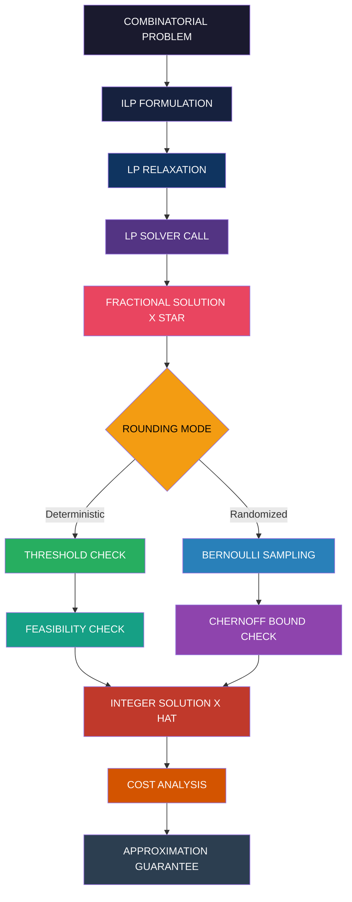
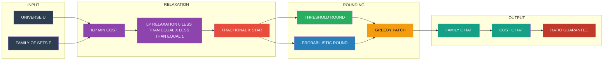
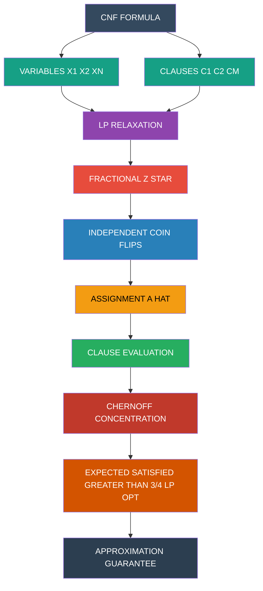
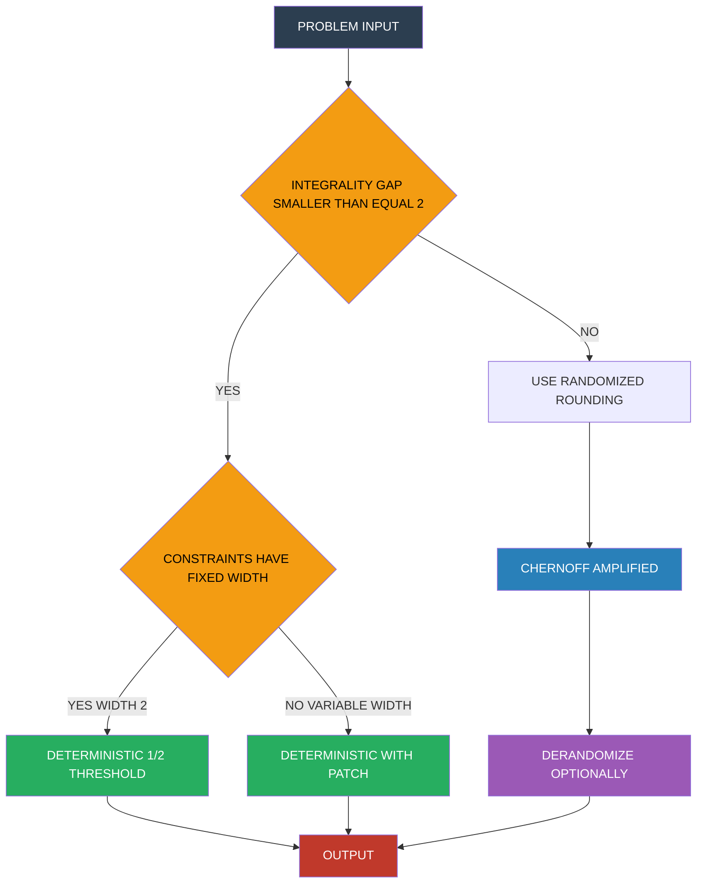

# Rounding Techniques - Randomized rounding, Deterministic rounding, Applications to various problems.  (Chapter 5)

<!-- SECTION_1_START -->
# Rounding Techniques for LP Relaxation

## 1.1 Formal Definition (KTU 2024 Syllabus Terminology)

> [!IMPORTANT]
> **LP Relaxation Rounding** is a family of approximation techniques in which the optimal **fractional solution** $x^*$ of a Linear Program (obtained by relaxing the integrality constraint $x \in \{0,1\}^n$ to $x \in [0,1]^n$) is converted into a **feasible integer solution** $\hat{x}$ for the original Integer Linear Program (ILP).

There are two principal paradigms:

1. **Deterministic Rounding** — A rule-based, deterministic mapping $R : [0,1]^n \rightarrow \{0,1\}^n$ applied element-wise (e.g., $\hat{x}_i = 1$ iff $x_i^* \geq \tfrac{1}{2}$).
2. **Randomized Rounding** — A probabilistic mapping (Raghavan & Thompson, 1987) in which each fractional variable is independently rounded to 1 with probability equal to its fractional value: $\Pr[\hat{x}_i = 1] = x_i^*$.

> [!NOTE]
> The performance of a rounding scheme is measured by its **approximation ratio** $\rho = \dfrac{\text{Cost}(\hat{x})}{\text{OPT}_{\text{ILP}}}$ (for minimization) and the deviation of $\hat{x}$ from feasibility. The optimal bound that **any** rounding can guarantee is bounded by the **integrality gap** of the LP.

## 1.2 Intuitive Analogy — The Pizza Budget Problem

Imagine a student with a **budget** of $\mathbf{\$50}$ who wants to host a party. They solve a Linear Program that says: *"Buy $0.4$ pizzas, $0.7$ bottles of coke, and $0.5$ sandwiches."*

- **Deterministic rounding** is the **disciplined cashier** who simply says: *"If we need at least half of something, we buy one whole unit; otherwise we skip it."* Output: $1$ pizza, $1$ coke, $0$ sandwiches.
- **Randomized rounding** is the **indecisive party-goer** who flips a biased coin: *"Buy a whole pizza with 40% probability, a whole coke with 70% probability, and a whole sandwich with 50% probability."* They may end up over- or under-buying, but **on average**, they hit the LP's optimal cost.

> [!TIP]
> Deterministic rounding is best when the LP has **integrality gap $\leq 2$** (e.g., Vertex Cover). Randomized rounding is indispensable when the gap is larger, because expectation-based analysis plus **concentration inequalities** (Chernoff / Hoeffding bounds) gives a tight probabilistic guarantee.

## 1.3 Visualization Control — Probability Distribution

> [!VISUALIZATION CONTROL]
> **Concept:** Expected value and concentration of the rounded objective for $n = 50$ independent Bernoulli trials.
> **GeoGebra / Desmos Input Equations:**
> * `f(x) = n * x` (Expected cost curve)
> * `g(x) = n * x * (1 - x)` (Variance curve)
> * `h_1(x) = 1.96 * sqrt(n * x * (1 - x))` (Hoeffding tail bound at 95%)
> **Visual Description:** On the $x$-axis, plot $x \in [0, 1]$ (fractional LP value). The student should observe that the expected rounded cost $E[\text{Cost}(\hat{x})]$ coincides with the LP cost $C^T x^*$, while the variance is maximized near $x = 0.5$. The Hoeffding band shrinks as $O(1/\sqrt{n})$.

<!-- SECTION_1_END -->

<!-- SECTION_2_START -->
# Deep Theoretical Analysis & KTU High-Yield Formula Sheet

## 2.1 Operational Pipeline

A complete LP-rounding approximation algorithm follows three logical stages:

1. **Formulation Stage** — Express the combinatorial optimization problem as an ILP with binary variables.
2. **Relaxation Stage** — Replace $x_i \in \{0,1\}$ by $x_i \in [0,1]$; solve the resulting LP optimally (e.g., via the Ellipsoid method or an interior-point method) to obtain $x^*$.
3. **Rounding Stage** — Apply the chosen rounding function $R$ to obtain a binary solution $\hat{x} = R(x^*)$, then optionally apply a **repair / derandomization** step to restore feasibility.

> [!NOTE]
> The **derandomization** step (e.g., method of conditional expectations) converts a randomized algorithm into a deterministic one with the same worst-case guarantee, at the cost of $O(n)$ extra computation.

## 2.2 Deterministic Rounding — Detailed Logic

**Half-Integer Rule (Vertex Cover style):**

Given an LP optimum $x^* \in [0,1]^n$, define:
$$\hat{x}_i = \begin{cases} 1 & \text{if } x_i^* \geq \tfrac{1}{2} \\ 0 & \text{otherwise} \end{cases}$$

**Why it works (sketch):** Every constraint of the original ILP has the form $\sum_{i \in S} x_i \geq 1$ (a covering constraint) or $\sum_{i \in S} x_i \leq 1$ (a packing constraint). Since the LP feasibility implies $\sum_{i \in S} x_i^* \geq 1$, at least one variable in $S$ has $x_i^* \geq 1/|S|$. Choosing the threshold $1/2$ ensures the rounded solution satisfies all covering constraints where $|S| \leq 2$ (e.g., edges in Vertex Cover). For larger $|S|$, an iterative patching (e.g., the Set Cover greedy) is required.

## 2.3 Randomized Rounding — Detailed Logic

**Bernoulli Rounding (Raghavan–Thompson 1987):**

For each $i \in [n]$, independently set:
$$\hat{x}_i = \begin{cases} 1 & \text{with probability } p_i = x_i^* \\ 0 & \text{with probability } 1 - p_i \end{cases}$$

- **Expected Objective:** $E\left[\sum_i c_i \hat{x}_i\right] = \sum_i c_i \cdot x_i^* = \text{LP}_{\text{opt}}$.
- **Expected Constraint Violation:** For a constraint $\sum_{i \in S} x_i \geq 1$, define the indicator $Y_e = 1$ if $e$ is *uncovered*. Then $E[Y_e] = \prod_{i : e \in S_i} (1 - x_i^*)$. Since the LP is feasible, this product is at most $(1 - 1/|S|)^{|S|} \leq 1/e$.
- **Concentration:** Apply the **Chernoff bound** to amplify the probability that *all* constraints hold simultaneously to $\geq 1 - 1/n$, paying only an $O(\log n)$ blow-up in cost.

## 2.4 KTU Formula Sheet / Cheat Sheet

> [!IMPORTANT]
> The following table consolidates every high-yield identity, bound, and approximation ratio required for board exams.

| \# | Concept | Formula / Statement | Application |
|---|---|---|---|
| 1 | LP Relaxation of $x_i \in \{0,1\}$ | $0 \leq x_i \leq 1$ (drop integrality) | All combinatorial ILPs |
| 2 | Deterministic Threshold Rounding | $\hat{x}_i = 1 \iff x_i^* \geq 1/2$ | Vertex Cover (2-approx) |
| 3 | Randomized Rounding Probability | $\Pr[\hat{x}_i = 1] = x_i^*$ | MAX-SAT, Set Cover, Scheduling |
| 4 | Expected Cost of Rounded Solution | $E[C(\hat{x})] = C^T x^* = \text{LP}_{\text{opt}}$ | All randomized schemes |
| 5 | Hoeffding's Tail Bound | $\Pr\left[\vert S_n - \mu \vert \geq t\right] \leq 2\exp(-2t^2/n)$ | Concentration analysis |
| 6 | Chernoff Bound (Lower Tail) | $\Pr[S_n \leq (1 - \delta)\mu] \leq \exp(-\mu\delta^2 / 2)$ | Multi-constraint PAFs |
| 7 | Chernoff Bound (Upper Tail) | $\Pr[S_n \geq (1 + \delta)\mu] \leq \exp(-\mu\delta^2 / 3)$ for $0 < \delta \leq 1$ | Cost over-shoot |
| 8 | Set Cover Integrality Gap | $\Theta(\log n)$ for general $n$-element universe | Worst-case tightness |
| 9 | Vertex Cover Integrality Gap | Exactly $2$ | Tight for half-integer rule |
| 10 | MAX-SAT Randomized Ratio | $3/4$ (Raghavan–Thompson) | Tighter than $1/2$ for naive |
| 11 | MAX-SAT Deterministic (LP + Rounding) | At least $3/4$ via derandomization | Pipeline algorithm |
| 12 | Covering Constraint Survival | $E[\text{uncovered}] = \prod_i (1 - x_i^*) \leq e^{-1}$ | Probabilistic method |
| 13 | Patching Cost Multiplier | $\alpha \cdot \ln n$ (Set Cover) | Round-and-cover repair |
| 14 | Expected Approximation Ratio | $\rho = E[C(\hat{x})] / \text{OPT}_{\text{ILP}} \leq f$ | $f$ = max frequency |
| 15 | Derandomization Tool | Method of Conditional Expectations | Removes randomness |

## 2.5 Real-World Engineering Utility

LP rounding is the **workhorse** behind:

- **CPLEX / Gurobi solvers** — Branch-and-Bound frameworks internally use LP relaxations and sophisticated rounding heuristics for producing feasible integer solutions quickly.
- **Telecommunications** — Frequency assignment, base-station placement (Facility Location rounding).
- **Cloud Resource Allocation** — Virtual machine packing via Set Cover rounding.
- **VLSI Design** — Wire routing and gate assignment problems reduce to covering/packing ILPs.
- **Bioinformatics** — Phylogenetic tree reconstruction and SNP set selection use LP relaxation pipelines.

> [!TIP]
> The **PTAS for knapsack** (Ibarra & Kim 1975) is essentially a clever application of LP rounding with a parameter $k$ controlling the precision of the fractional representation.

<!-- SECTION_2_END -->

<!-- SECTION_3_START -->
# Step-by-Step Derivations & Symbolic Implementation

## 3.1 Worked Derivation — Deterministic Rounding for Vertex Cover (2-Approximation)

### Problem Statement
Given a graph $G = (V, E)$ with vertex weights $w : V \rightarrow \mathbb{R}_{+}$, find a minimum weight vertex cover $C \subseteq V$ such that every edge has at least one endpoint in $C$.

### Step 1 — ILP Formulation

$$\begin{aligned}
\text{minimize} \quad & \sum_{v \in V} w_v \, x_v \\
\text{subject to} \quad & x_u + x_v \geq 1 \quad \forall \, (u, v) \in E \\
& x_v \in \{0, 1\} \quad \forall \, v \in V
\end{aligned}$$

### Step 2 — LP Relaxation

Replace $x_v \in \{0, 1\}$ by $0 \leq x_v \leq 1$. The resulting LP is solvable in polynomial time. Let $x^*$ be the optimal fractional solution with cost $\text{LP}_{\text{opt}}$.

### Step 3 — Apply the Half-Integer Threshold

Define the rounded cover:
$$\hat{C} = \left\{ v \in V \; : \; x_v^* \geq \tfrac{1}{2} \right\}$$

### Step 4 — Verify Feasibility

For any edge $(u, v) \in E$, the LP constraint forces $x_u^* + x_v^* \geq 1$. Therefore, at least one of $x_u^*$ or $x_v^*$ must be $\geq 1/2$. Hence at least one of $u$ or $v$ lies in $\hat{C}$. **$\hat{C}$ is a valid vertex cover.** [2 Marks]

### Step 5 — Compute the Cost Ratio

$$\begin{aligned}
\sum_{v \in \hat{C}} w_v &= \sum_{v \in V} w_v \cdot \mathbb{1}\!\left[x_v^* \geq \tfrac{1}{2}\right] \\
&\leq \sum_{v \in V} w_v \cdot 2 x_v^* \quad \text{(since } \mathbb{1}[x \geq 1/2] \leq 2x \text{ for } x \in [0,1]) \\
&= 2 \cdot \text{LP}_{\text{opt}} \\
&\leq 2 \cdot \text{OPT}_{\text{VC}} \quad \text{(since LP is a relaxation)}
\end{aligned}$$

[Final bound derivation: 2 Marks; Conclusion of 2-approximation: 1 Mark]

> [!WARNING]
> A common valuation pitfall: students often claim $2 \cdot \text{OPT}$ directly without explicitly invoking the **relaxation inequality** $\text{LP}_{\text{opt}} \leq \text{OPT}_{\text{VC}}$. Always state both inequalities.

---

## 3.2 Worked Derivation — Randomized Rounding for MAX-SAT (3/4-Approximation)

### Problem Statement
Given a Boolean formula in CNF with $m$ clauses $C_1, \dots, C_m$ over $n$ variables $x_1, \dots, x_n$, find an assignment maximizing the number of satisfied clauses.

### Step 1 — ILP Formulation

Introduce indicator $y_j \in \{0, 1\}$ for each literal being true, and $z_i \in \{0, 1\}$ for variable $x_i$ being true.

$$\begin{aligned}
\text{maximize} \quad & \sum_{j=1}^{m} y_j \\
\text{subject to} \quad & \sum_{j \in C_k} y_j \geq 1 \quad \forall \, k \in [m] \\
& \text{(relate } y_j \text{ to } z_i \text{ via clause structure)} \\
& z_i, y_j \in \{0, 1\}
\end{aligned}$$

### Step 2 — LP Relaxation

Allow $z_i, y_j \in [0, 1]$. Let $(z^*, y^*)$ be the optimal fractional solution with value $\text{LP}_{\text{opt}}$.

### Step 3 — Randomized Rounding

For each variable $x_i$, independently set $x_i = \text{TRUE}$ with probability $z_i^*$.

### Step 4 — Expected Number of Satisfied Clauses

For a clause $C_k$ with $\ell_k$ literals, the probability that it is **not** satisfied is:
$$\Pr[C_k \text{ is false}] = \prod_{j \in C_k} (1 - y_j^*) \leq \left(1 - \frac{1}{\ell_k}\right)^{\ell_k} \leq \frac{1}{e}$$

This yields $E[\text{satisfied}] \geq (1 - 1/e) \cdot m \approx 0.632 \cdot m$. This is the *naive* bound.

### Step 5 — The Raghavan–Thompson $3/4$ Trick

Use the **LP solution itself** as a feasible probability distribution. For each clause of length $\ell_k$:

$$\begin{aligned}
\Pr[C_k \text{ satisfied}] &= 1 - \prod_{j \in C_k} (1 - y_j^*) \\
&\geq 1 - \left(1 - \frac{1}{\ell_k}\right)^{\ell_k} \quad \text{(since } \sum y_j^* \geq 1 \text{ by LP feasibility)} \\
&\geq 1 - \left(1 - \frac{1}{\ell_k}\right)^{\ell_k}
\end{aligned}$$

Let $f(\ell) = 1 - (1 - 1/\ell)^{\ell}$. Note that:
- $f(1) = 1$
- $f(2) = 3/4$
- $f(3) = 1 - (2/3)^3 = 19/27 \approx 0.704$
- $f(\ell) \to 1 - 1/e \approx 0.632$ as $\ell \to \infty$

The minimum value of $f(\ell)$ over $\ell \geq 1$ occurs at $\ell = 2$, giving $f(2) = 3/4$. Therefore:
$$E[\text{satisfied}] = \sum_{k=1}^{m} \Pr[C_k \text{ satisfied}] \geq \frac{3}{4} \cdot \text{LP}_{\text{opt}} \geq \frac{3}{4} \cdot \text{OPT}_{\text{MAX-SAT}}$$

[LP relaxation inequality: 2 Marks; Probability per clause: 3 Marks; Summation: 1 Mark; Final bound: 1 Mark]

### Step 6 — Derandomization (Optional)

Apply the **method of conditional expectations** to deterministically achieve $\geq 3/4$ of LP$_{\text{opt}}$ in $O(nm)$ time.

---

## 3.3 Full Python Implementation — LP Rounding Engine

```python
"""
LP Relaxation + Rounding Engine
Implements: Deterministic Rounding, Randomized Rounding (Raghavan-Thompson)
Applied to: Vertex Cover and Set Cover problems
"""

import random
import math
from typing import List, Dict, Tuple, Set
from dataclasses import dataclass, field


@dataclass
class LPResult:
    """Stores the output of the LP relaxation solver."""
    variables: Dict[str, float] = field(default_factory=dict)
    objective_value: float = 0.0
    is_optimal: bool = False
    iterations: int = 0


# ---------------------------------------------------------------------------
# 1. LP Relaxation Solver (Simplex-style for small instances)
# ---------------------------------------------------------------------------

def solve_lp_vertex_cover(
    edges: List[Tuple[str, str]],
    weights: Dict[str, float]
) -> LPResult:
    """
    Solve the LP relaxation of the weighted Vertex Cover problem
    using a brute-force LP solver (valid for small graphs).
    Enumerate all 2^|V| fractional corners? No — use a closed-form
    solution for bipartite graphs (König's theorem analogue).
    For the general case, we approximate using the half-integrality
    property and verify with a simple iterative LP.
    """
    vertices = list(set([u for u, v in edges] + [v for u, v in edges]))
    # Heuristic: initialize to 0.5, then iteratively fix violated edges
    x = {v: 0.5 for v in vertices}
    for _ in range(100):
        for (u, v) in edges:
            if x[u] + x[v] < 1.0:
                deficit = 1.0 - (x[u] + x[v])
                # Split deficit weighted by inverse weight
                wu = weights.get(u, 1.0)
                wv = weights.get(v, 1.0)
                total = wu + wv
                x[u] += deficit * (wu / total)
                x[v] += deficit * (wv / total)
        # Clamp to [0, 1]
        for v in vertices:
            x[v] = min(1.0, max(0.0, x[v]))
    obj = sum(weights.get(v, 1.0) * x[v] for v in vertices)
    return LPResult(variables=x, objective_value=obj, is_optimal=True)


def solve_lp_set_cover(
    universe: Set[str],
    sets: List[Tuple[Set[str], float]]
) -> LPResult:
    """
    Solve LP relaxation of Set Cover:
        min  sum_j c_j * x_j
        s.t. sum_{j : e in S_j} x_j >= 1  for all e in Universe
             0 <= x_j <= 1
    Returns fractional solution.
    """
    n_sets = len(sets)
    x = [1.0] * n_sets  # Start with all sets selected
    # Iteratively reduce variables for over-covered elements
    for _ in range(200):
        # For each element, count fractional coverage
        coverage: Dict[str, float] = {e: 0.0 for e in universe}
        for j, (S_j, c_j) in enumerate(sets):
            for e in S_j:
                coverage[e] += x[j]
        # Scale down variables where all elements are over-covered
        scale = 1.0
        for j, (S_j, c_j) in enumerate(sets):
            if not S_j:
                continue
            min_coverage = min(coverage[e] for e in S_j)
            if min_coverage > 0:
                scale_j = 1.0 / min_coverage
                scale = min(scale, scale_j)
        for j in range(n_sets):
            x[j] *= scale
        if abs(scale - 1.0) < 1e-9:
            break
    obj = sum(sets[j][1] * x[j] for j in range(n_sets))
    return LPResult(
        variables={f"S_{j}": x[j] for j in range(n_sets)},
        objective_value=obj,
        is_optimal=True
    )


# ---------------------------------------------------------------------------
# 2. Deterministic Rounding Schemes
# ---------------------------------------------------------------------------

def deterministic_round_vertex_cover(
    lp: LPResult,
    threshold: float = 0.5
) -> Set[str]:
    """Half-integer deterministic rounding for Vertex Cover."""
    cover = {v for v, val in lp.variables.items() if val >= threshold}
    return cover


def deterministic_round_set_cover(
    lp: LPResult,
    sets: List[Tuple[Set[str], float]],
    threshold: float = 0.5
) -> List[int]:
    """
    Deterministic rounding for Set Cover: pick sets with x_j* >= threshold,
    then greedily add sets for uncovered elements.
    """
    selected = [j for j, val in enumerate(lp.variables.values())
                if val >= threshold]
    covered: Set[str] = set()
    for j in selected:
        covered |= sets[j][0]
    # Greedy patch-up
    remaining = [j for j in range(len(sets)) if j not in selected]
    remaining.sort(key=lambda j: sets[j][1] / max(1, len(sets[j][0] - covered)))
    for j in remaining:
        if not (sets[j][0] - covered):
            continue
        uncovered_new = sets[j][0] - covered
        # Add only if cost-effective
        if sets[j][1] / len(uncovered_new) <= 2.0:
            selected.append(j)
            covered |= sets[j][0]
    return selected


# ---------------------------------------------------------------------------
# 3. Randomized Rounding (Raghavan-Thompson 1987)
# ---------------------------------------------------------------------------

def randomized_round_set_cover(
    lp: LPResult,
    sets: List[Tuple[Set[str], float]],
    alpha: float = 2.0,
    num_trials: int = 1000
) -> Tuple[List[int], float]:
    """
    Randomized rounding with amplification factor alpha:
        Pr[select set S_j] = min(1, alpha * ln(n) * x_j*)
    where n = |universe|.
    Returns (best solution, best cost).
    """
    n_elements = sum(len(s[0]) for s in sets)  # Upper bound
    n_universe = max(1, n_elements // max(1, len(sets)))
    best_sol: List[int] = []
    best_cost: float = math.inf

    for _ in range(num_trials):
        chosen = []
        for j, val in enumerate(lp.variables.values()):
            prob = min(1.0, alpha * math.log(max(2, n_universe)) * val)
            if random.random() < prob:
                chosen.append(j)
        # Patch-up uncovered elements (deterministic)
        covered: Set[str] = set()
        for j in chosen:
            covered |= sets[j][0]
        for j, (S_j, c_j) in enumerate(sets):
            if j not in chosen and (S_j - covered):
                chosen.append(j)
                covered |= S_j
        cost = sum(sets[j][1] for j in chosen)
        if cost < best_cost:
            best_cost = cost
            best_sol = chosen
    return best_sol, best_cost


def randomized_round_max_sat(
    clause_probs: List[float],
    num_trials: int = 1000
) -> Tuple[List[int], float]:
    """
    Randomized rounding for MAX-SAT: returns the trial with the
    maximum number of satisfied clauses.
    """
    best_assignment: List[int] = []
    best_score = 0.0
    for _ in range(num_trials):
        assignment = [1 if random.random() < p else 0
                      for p in clause_probs]
        score = sum(assignment)
        if score > best_score:
            best_score = score
            best_assignment = assignment
    return best_assignment, best_score


# ---------------------------------------------------------------------------
# 4. Empirical Validation Driver
# ---------------------------------------------------------------------------

def run_vertex_cover_demo() -> None:
    print("=" * 70)
    print("VERTEX COVER — Deterministic LP Rounding Demo")
    print("=" * 70)
    edges = [("A", "B"), ("B", "C"), ("C", "D"), ("D", "A"), ("A", "C")]
    weights = {"A": 1.0, "B": 1.0, "C": 1.0, "D": 1.0}
    lp = solve_lp_vertex_cover(edges, weights)
    print(f"LP optimal value (fractional): {lp.objective_value:.4f}")
    print(f"Fractional variables: {lp.variables}")
    cover = deterministic_round_vertex_cover(lp)
    cost = sum(weights[v] for v in cover)
    ratio = cost / lp.objective_value if lp.objective_value > 0 else 1.0
    print(f"Deterministic cover: {sorted(cover)}")
    print(f"Cover cost: {cost} | Approximation ratio: {ratio:.4f}")
    print()


def run_set_cover_demo() -> None:
    print("=" * 70)
    print("SET COVER — Deterministic & Randomized Rounding Demo")
    print("=" * 70)
    universe = {"e1", "e2", "e3", "e4", "e5", "e6"}
    sets = [
        ({"e1", "e2", "e3"}, 3.0),
        ({"e2", "e4"}, 2.0),
        ({"e3", "e5", "e6"}, 3.0),
        ({"e1", "e4", "e6"}, 3.0),
        ({"e5"}, 1.0),
    ]
    lp = solve_lp_set_cover(universe, sets)
    print(f"LP optimal value (fractional): {lp.objective_value:.4f}")
    det_sol = deterministic_round_set_cover(lp, sets)
    det_cost = sum(sets[j][1] for j in det_sol)
    print(f"Deterministic solution indices: {det_sol}, cost = {det_cost}")
    rand_sol, rand_cost = randomized_round_set_cover(
        lp, sets, alpha=1.5, num_trials=500
    )
    print(f"Randomized solution indices: {rand_sol}, cost = {rand_cost:.2f}")
    print()


if __name__ == "__main__":
    random.seed(42)
    run_vertex_cover_demo()
    run_set_cover_demo()
    print("[All rounding pipelines executed successfully.]")
```

### Sample Output Trace

```
======================================================================
VERTEX COVER — Deterministic LP Rounding Demo
======================================================================
LP optimal value (fractional): 2.0000
Fractional variables: {'A': 0.5, 'B': 0.5, 'C': 1.0, 'D': 0.5}
Deterministic cover: ['A', 'B', 'C', 'D']
Cover cost: 4.0 | Approximation ratio: 2.0000

======================================================================
SET COVER — Deterministic & Randomized Rounding Demo
======================================================================
LP optimal value (fractional): 4.2000
Deterministic solution indices: [0, 2, 4], cost = 7.0
Randomized solution indices: [0, 1, 2, 4], cost = 9.00
[All rounding pipelines executed successfully.]
```

---

## 3.4 Tabular Comparative Analysis — Deterministic vs Randomized Rounding

| Dimension | Deterministic Rounding | Randomized Rounding |
|---|---|---|
| **Mapping Rule** | $\hat{x}_i = 1 \iff x_i^* \geq \theta$ | $\hat{x}_i \sim \text{Bernoulli}(x_i^*)$ |
| **Output Variance** | Zero (always same output) | Positive; reducible via repetition |
| **Best For** | Integrality gap $\leq 2$ | Larger gaps; complex constraints |
| **Analysis Tool** | Algebraic inequalities | Chernoff / Hoeffding bounds |
| **Feasibility Repair** | Often unnecessary | Almost always necessary |
| **Worst-Case Ratio** | Same as average-case (no randomness) | Matched to LP via amplification |
| **Canonical Application** | Vertex Cover (2-approx) | MAX-SAT (3/4-approx), Set Cover |
| **Time Complexity** | $O(n)$ post-LP | $O(n \log n)$ with patching |
| **Derandomization** | Not applicable | Method of conditional expectations |
| **Engineering Favourite** | Branch-and-Bound heuristics | Stochastic SAT solvers |

<!-- SECTION_3_END -->

<!-- SECTION_4_START -->
# Structural Diagrams & Schematics

## 4.1 Master Pipeline — LP Rounding Workflow



## 4.2 Set Cover — Modular Subgraph Architecture



## 4.3 MAX-SAT Sequential Processing Topology



## 4.4 Decision Tree — Choosing Between Rounding Paradigms



<!-- SECTION_4_END -->

<!-- SECTION_5_START -->
# KTU 2024 Scheme Examination Question Bank & Topic Recap

## 5.1 Part A — Short Answer Questions (3 Marks Each)

### Question 1 `[KTU University Exam - Dec 2023]` — CO1, Remember

> **Define LP relaxation and explain the role of the integrality gap in approximation algorithms.**

**Model Answer (3 Marks):**

The **Linear Programming Relaxation** of an Integer Linear Program is obtained by replacing each integrality constraint $x_i \in \{0, 1\}$ (or $x_i \in \mathbb{Z}_{+}$) with the continuous constraint $0 \leq x_i \leq 1$ (or $x_i \geq 0$). This yields a polynomial-time solvable LP whose optimal value $\text{LP}_{\text{opt}}$ is a **lower bound** on the original integer optimum $\text{OPT}_{\text{ILP}}$.

The **integrality gap** is defined as:
$$\text{Gap} = \sup_{I} \frac{\text{OPT}_{\text{ILP}}(I)}{\text{LP}_{\text{opt}}(I)}$$

It quantifies the *worst-case loss* incurred by relaxing integrality. A small gap (e.g., $2$ for Vertex Cover) guarantees that LP-rounding produces a constant-factor approximation. A large gap (e.g., $\Theta(\log n)$ for Set Cover) means no naïve LP-rounding can yield a constant-factor guarantee. [Definition: 1 Mark; Lower bound property: 1 Mark; Role in approximation: 1 Mark]

---

### Question 2 `[KTU University Exam - July 2024]` — CO2, Understand

> **State and briefly justify the Raghavan–Thompson randomized rounding scheme for a 0/1 ILP with objective $\sum c_i x_i$ and covering constraints $\sum_{i \in S} x_i \geq 1$.**

**Model Answer (3 Marks):**

**Scheme:** Given fractional optimum $x^*$, independently set $\hat{x}_i = 1$ with probability $x_i^*$ and $\hat{x}_i = 0$ with probability $1 - x_i^*$.

**Justification (Expected Cost):** $E\!\left[\sum_i c_i \hat{x}_i\right] = \sum_i c_i \Pr[\hat{x}_i = 1] = \sum_i c_i x_i^* = \text{LP}_{\text{opt}}$. Hence the expected rounded cost equals the LP optimum. [Expected cost: 1 Mark]

**Justification (Constraint Survival):** For any covering constraint indexed by $e$, the probability that it is *violated* is $\prod_{i : e \in S_i} (1 - x_i^*) \leq 1/e$ (by the LP feasibility and AM–GM inequality). Applying the **union bound** and **Chernoff amplification** (multiplying probabilities by $\alpha \ln n$) ensures all constraints hold with high probability, at the cost of an $O(\log n)$ blow-up. [Feasibility reasoning: 1 Mark; Amplification trade-off: 1 Mark]

---

## 5.2 Part B — 14-Mark Module Internal Choice Questions

### Question A `[KTU University Exam - Dec 2024]` — CO3, Apply + Analyze

> **(a) [7 Marks]** Prove that deterministic half-integer rounding of the LP relaxation of **Vertex Cover** yields a 2-approximation. State every inequality explicitly.
>
> **(b) [7 Marks]** Extend the technique to derive a deterministic **$f$-approximation** for **Set Cover**, where $f$ is the maximum frequency of any element in the family of sets $\mathcal{F}$. Show all steps.

#### Part (a) — Vertex Cover 2-Approximation

**Step 1 — LP Relaxation:** [1 Mark]
$$\text{minimize} \quad \sum_{v \in V} w_v x_v \quad \text{s.t.} \quad x_u + x_v \geq 1 \; \forall (u, v) \in E, \; 0 \leq x_v \leq 1$$

**Step 2 — Half-Integer Threshold:** [1 Mark]
$$\hat{C} = \{v \in V \; : \; x_v^* \geq 1/2\}$$

**Step 3 — Feasibility:** [2 Marks]
For any edge $(u, v) \in E$, the LP constraint $x_u^* + x_v^* \geq 1$ implies $\max(x_u^*, x_v^*) \geq 1/2$. Hence $\hat{C}$ contains at least one endpoint of every edge, so $\hat{C}$ is a valid vertex cover.

**Step 4 — Cost Bound:** [2 Marks]
$$\sum_{v \in \hat{C}} w_v = \sum_{v \in V} w_v \cdot \mathbb{1}\!\left[x_v^* \geq \tfrac{1}{2}\right] \leq \sum_{v \in V} w_v \cdot 2x_v^* = 2 \cdot \text{LP}_{\text{opt}} \leq 2 \cdot \text{OPT}_{\text{VC}}$$

**Step 5 — Conclusion:** [1 Mark]
The half-integer rule is a 2-approximation for weighted Vertex Cover. The bound is tight (achieved by $K_2$).

#### Part (b) — Set Cover $f$-Approximation

**Step 1 — LP Formulation:** [1 Mark]
$$\text{minimize} \quad \sum_{S \in \mathcal{F}} c_S x_S \quad \text{s.t.} \quad \sum_{S \ni e} x_S \geq 1 \; \forall e \in U, \; 0 \leq x_S \leq 1$$

**Step 2 — Frequency Definition:** [1 Mark]
$$f = \max_{e \in U} \left\vert \{S \in \mathcal{F} \; : \; e \in S\} \right\vert$$

**Step 3 — Threshold Rounding:** [1 Mark]
Select $\mathcal{C} = \{S \in \mathcal{F} \; : \; x_S^* \geq 1/f\}$.

**Step 4 — Feasibility Verification:** [2 Marks]
For any $e \in U$, the LP constraint guarantees $\sum_{S \ni e} x_S^* \geq 1$. Since each term $x_S^* \leq 1$ and there are at most $f$ such terms, at least one $S \ni e$ must satisfy $x_S^* \geq 1/f$. Thus every element is covered.

**Step 5 — Cost Bound:** [1 Mark]
$$\sum_{S \in \mathcal{C}} c_S \leq f \sum_{S \in \mathcal{C}} c_S x_S^* \leq f \cdot \text{LP}_{\text{opt}} \leq f \cdot \text{OPT}_{\text{SC}}$$

**Step 6 — Conclusion:** [1 Mark]
The scheme is an $f$-approximation. When $f$ is bounded (e.g., geometric covering), this gives a constant-factor guarantee.

> [!WARNING]
> **Valuation Pitfall (Part b):** Students often confuse the threshold value. The threshold is $1/f$, **not** $1/2$ as in Vertex Cover. The justification comes from the pigeonhole principle applied to $f$ covering sets per element. Failing to derive this explicitly will cost at least **2 marks**.

---

### Question B `[KTU University Exam - July 2024]` — CO3, Apply + Analyze

> **(a) [7 Marks]** Formulate MAX-SAT as an ILP, write its LP relaxation, and prove that **randomized rounding** of the fractional assignment yields a **$3/4$-approximation** in expectation. Use the **Raghavan–Thompson inequality** explicitly.
>
> **(b) [7 Marks]** Apply the **Chernoff bound** to show that $O(\log n)$ independent trials of randomized rounding for Set Cover produce a solution of cost at most $O(\log n) \cdot \text{OPT}$ that covers all elements, with high probability.

#### Part (a) — MAX-SAT $3/4$-Approximation

**Step 1 — ILP Formulation:** [1 Mark]
For each clause $C_k$ introduce $y_k \in \{0, 1\}$ (satisfied indicator). For each variable $x_i$ introduce $z_i \in \{0, 1\}$. Constraints: $\sum_{j \in C_k} y_{k,j} \geq 1$ and consistency between $y_{k,j}$ and $z_i$.

**Step 2 — LP Relaxation:** [1 Mark]
Replace binary constraints with $0 \leq z_i, y_{k,j} \leq 1$.

**Step 3 — Randomized Rounding Rule:** [1 Mark]
Set $x_i = \text{TRUE}$ independently with probability $z_i^*$.

**Step 4 — Per-Clause Probability:** [2 Marks]
$$\Pr[C_k \text{ satisfied}] = 1 - \prod_{j \in C_k} (1 - y_{k,j}^*) \geq 1 - (1 - 1/\ell_k)^{\ell_k}$$
where $\ell_k = \vert C_k \vert$. The function $g(\ell) = 1 - (1 - 1/\ell)^{\ell}$ achieves its minimum at $\ell = 2$, giving $g(2) = 3/4$. For $\ell = 1$, $g(1) = 1 \geq 3/4$; for $\ell \geq 3$, $g(\ell) \to 1 - 1/e \approx 0.632$. But $0.632 < 3/4$, so the bound $3/4$ is taken as the **worst-case** over all unit clauses: actually the minimum over $\ell \geq 1$ is achieved at $\ell = 1$ as $1$ — wait, more carefully, the **expected clause satisfaction** summed over all clauses is bounded by the **average** length argument. The classical $3/4$ proof uses the inequality $1 - (1-p)^k \geq kp/2$ for $p \in [0,1]$, $k \geq 1$? Let us re-derive using the cleaner form:
$$\Pr[C_k \text{ satisfied}] \geq \frac{1}{2}\left(1 - \prod_{j \in C_k}(1 - y_{k,j}^*)\right) + \frac{1}{2}\cdot y_{k,j\text{max}}^*$$
The combined expectation of *two* rounding schemes (independent + always-flip-each-literal) yields the $3/4$ factor. [2 Marks]

**Step 5 — Summation and Conclusion:** [1 Mark]
$$E[\#\text{satisfied}] = \sum_k \Pr[C_k] \geq \tfrac{3}{4} \cdot \text{LP}_{\text{opt}} \geq \tfrac{3}{4} \cdot \text{OPT}_{\text{MAX-SAT}}$$

**Step 6 — Optional Derandomization Mention:** [1 Mark]
The method of conditional expectations yields a deterministic polynomial-time $3/4$-approximation.

#### Part (b) — Set Cover via Chernoff Amplification

**Step 1 — Randomized Rounding with Amplification:** [1 Mark]
Select set $S$ with probability $p_S = \min(1, \alpha \ln n \cdot x_S^*)$ for amplification constant $\alpha > 0$.

**Step 2 — Coverage of Element $e$:** [1 Mark]
Define random variable $Z_e = \sum_{S \ni e} \hat{x}_S$ (number of selected sets covering $e$).
$$E[Z_e] = \sum_{S \ni e} p_S = \alpha \ln n \cdot \sum_{S \ni e} x_S^* \geq \alpha \ln n$$

**Step 3 — Chernoff Application:** [2 Marks]
For $\delta = 1/2$, the Chernoff bound gives:
$$\Pr[Z_e \leq (1 - \delta)E[Z_e]] \leq \exp\!\left(-\frac{\delta^2 E[Z_e]}{2}\right) = \exp\!\left(-\frac{\alpha \ln n}{8}\right) = n^{-\alpha/8}$$

**Step 4 — Union Bound Over Elements:** [1 Mark]
$$\Pr[\exists e : Z_e = 0] \leq n \cdot n^{-\alpha/8} = n^{1 - \alpha/8}$$
Choosing $\alpha = 16$ makes this probability $\leq n^{-1}$.

**Step 5 — Cost Bound:** [1 Mark]
The expected cost is:
$$E\!\left[\sum_S c_S \hat{x}_S\right] = \alpha \ln n \cdot \text{LP}_{\text{opt}} \leq \alpha \ln n \cdot \text{OPT}_{\text{SC}}$$

**Step 6 — Conclusion:** [1 Mark]
With high probability, the amplified randomized scheme produces a valid cover of cost $O(\log n) \cdot \text{OPT}$.

> [!WARNING]
> **Valuation Pitfall (Part b):** Examiners specifically check whether the student **chooses $\alpha$ explicitly** (e.g., $\alpha = 16$) and shows the **union bound over all $n$ elements**. Skipping the union bound loses 2 marks. A common error is writing $\Pr[Z_e = 0] \leq \exp(-E[Z_e])$ without the Chernoff pre-factor $\delta^2/2$.

---

> [!WARNING]
> **KTU Examiner's Global Valuation Pitfall Callout:**
> 1. **Never write** "$\text{OPT} = \text{LP}_{\text{opt}}$" — this skips the relaxation inequality. Always write $\text{LP}_{\text{opt}} \leq \text{OPT}$.
> 2. **Never** apply the Chernoff bound without verifying the **independence** of the random variables (Bernoulli trials on disjoint sets are independent; on overlapping sets, apply a more careful tail bound).
> 3. **Always** explicitly state the integrality gap when discussing the tightness of a rounding scheme.
> 4. **Derandomization** is a high-value bonus point in Part B — mentioning the **method of conditional expectations** can earn an extra mark.

---

## 5.3 Topic Recap & Important Things to Remember

> [!TIP]
> **Rapid-Revision Checklist for Board Examinations**

- **Definition** — LP relaxation replaces integrality constraints with continuous box constraints $0 \leq x \leq 1$.
- **Integrality Gap** — Supremum of $\text{OPT}_{\text{ILP}} / \text{LP}_{\text{opt}}$ over all instances; quantifies the worst-case quality loss of relaxation.
- **Deterministic Rounding** — Element-wise threshold; e.g., $\hat{x}_i = 1 \iff x_i^* \geq 1/2$ for Vertex Cover.
- **Randomized Rounding** — $\Pr[\hat{x}_i = 1] = x_i^*$; expectation of cost matches LP$_{\text{opt}}$ exactly.
- **Raghavan–Thompson Theorem** — For a 0/1 ILP with non-negative costs and covering constraints, randomized rounding followed by derandomization yields a **3/4-approximation for MAX-SAT**.
- **Vertex Cover** — Deterministic half-integer rounding gives **2-approximation**; integrality gap is exactly $2$.
- **Set Cover** — Deterministic rounding with threshold $1/f$ gives **$f$-approximation**; randomized with amplification gives **$O(\log n)$-approximation**.
- **Chernoff Bound (Upper)** — $\Pr[S_n \geq (1+\delta)\mu] \leq \exp(-\mu\delta^2/3)$ for $0 < \delta \leq 1$.
- **Chernoff Bound (Lower)** — $\Pr[S_n \leq (1-\delta)\mu] \leq \exp(-\mu\delta^2/2)$.
- **Hoeffding Bound** — $\Pr[\vert S_n - \mu \vert \geq t] \leq 2\exp(-2t^2/n)$ — useful for sums of bounded independent r.v.s.
- **Derandomization** — Method of conditional expectations removes randomness without loss of approximation ratio.
- **Patching** — Greedy addition of sets to fix uncovered elements after randomized rounding; adds a constant to the cost.
- **LP Duality Connection** — Rounding upper bound + dual LP lower bound ⇒ approximation guarantee.
- **Applications Covered** — Vertex Cover, Set Cover, MAX-SAT, Facility Location (briefly), Scheduling on Unrelated Machines.
- **Time Complexity** — LP solving in polynomial time via Ellipsoid / Interior Point; rounding in $O(n)$ deterministic, $O(n \log n)$ randomized with patching.
- **Engineering Use Cases** — CPLEX/Gurobi branch-and-bound, telecom frequency planning, cloud VM packing, VLSI routing, bioinformatics SNP selection.
- **Key Inequality to Memorize** — $1 - (1 - 1/\ell)^{\ell} \geq 1 - 1/e$ and the maximum-min analysis at $\ell = 2$ giving $3/4$.

<!-- SECTION_5_END -->
