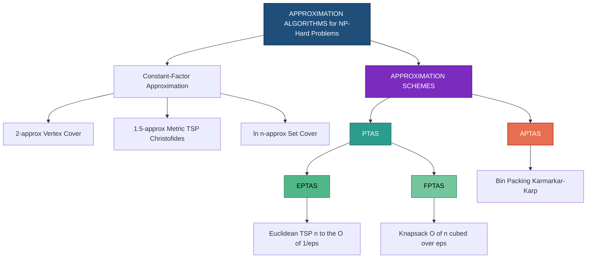
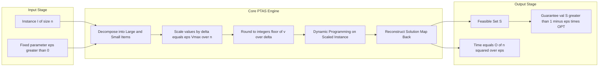
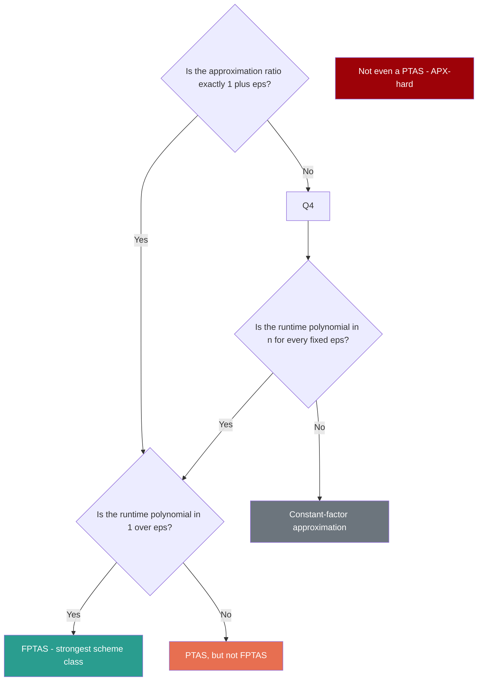
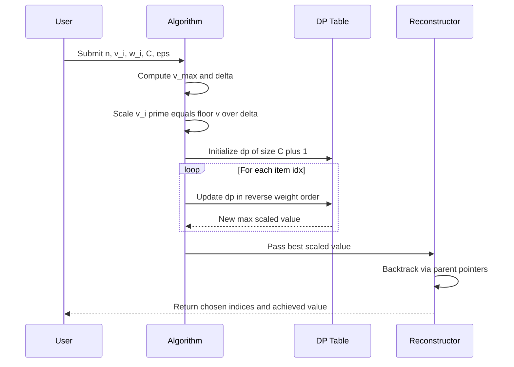

# Approximation Schemes - Polynomial-time approximation schemes (PTAS)

<!-- SECTION_1_START -->
# Approximation Schemes — Polynomial-Time Approximation Schemes (PTAS)

## 1.1 Formal Academic Definition (KTU 2024 Scheme Terminology)

Let $\Pi$ be a **maximization** (or minimization) **NP-hard optimization problem** with instances of size $n$. Let $\text{OPT}(I)$ denote the optimal objective value for an instance $I$, and let $\mathcal{A}(I)$ denote the objective value returned by a polynomial-time algorithm $\mathcal{A}$.

> [!IMPORTANT]  
> **Definition (PTAS).** A **Polynomial-Time Approximation Scheme (PTAS)** for $\Pi$ is a family of algorithms $\{\mathcal{A}_\varepsilon\}_{\varepsilon>0}$ such that for every fixed constant $\varepsilon>0$ and every input instance $I$:
> 1. **Approximation Guarantee:**  
> $$\text{Ratio}(\mathcal{A}_\varepsilon) \;\le\; 1+\varepsilon \quad (\text{maximization}), \qquad \text{Ratio}(\mathcal{A}_\varepsilon) \;\le\; 1+\varepsilon \quad (\text{minimization}).$$
> 2. **Polynomial Runtime:**  
> $$\text{Time}(\mathcal{A}_\varepsilon, I) \;\le\; p(n,\tfrac{1}{\varepsilon})$$  
> where $p(\cdot,\cdot)$ is some **polynomial** in the input size $n$ (the degree in $n$ may depend on $1/\varepsilon$, but the algorithm must terminate in polynomial time in $n$ for *each fixed* $\varepsilon$).

> [!NOTE]  
> **Syllabus Highlight:** The "Polynomial-Time" in PTAS only requires polynomiality in $n$ for *fixed* $\varepsilon$. This is the **decisive distinction** from **FPTAS**, where the running time must be polynomial in **both** $n$ and $1/\varepsilon$.

---

## 1.2 Intuitive Analogy — The Master Tailor

Imagine you commission a **bespoke suit** from a master tailor:

- The tailor is a PTAS for the problem of "**perfect fit**".
- For any precision you specify (e.g., within **1 cm**, within **0.1 cm**, within **0.001 cm**), he can produce a suit to that tolerance.
- However, **the finer the precision**, the **more time and effort** he needs — but the work is still **polynomial in the size of the suit** (number of measurements) for any fixed precision you commit to upfront.

> **Translation to algorithms:**  
> $\varepsilon$ = the *agreed precision*. $n$ = the *input size*.  
> $p(n, 1/\varepsilon)$ = "polynomial in $n$, but exponent may grow with $1/\varepsilon$."

---

## 1.3 Geometric / Visual Intuition

> [!VISUALIZATION CONTROL]  
> **Concept:** Convergence of $(1+\varepsilon)$-approximation ratio to the optimal value as $\varepsilon \to 0$.  
> **Desmos Input Equations:**  
> * `y1 = 1 + 0.5`  (curve for $\varepsilon = 0.5$)  
> * `y2 = 1 + 0.1`  (curve for $\varepsilon = 0.1$)  
> * `y3 = 1 + 0.01` (curve for $\varepsilon = 0.01$)  
> * `y_OPT = 1`     (the optimal line)  
> **Visual Description:** Three horizontal lines approaching the value 1 from above as $\varepsilon$ shrinks. The vertical gap between each line and $y=1$ represents the **slack** the algorithm is allowed.

---

## 1.4 The PTAS Family — Variants at a Glance

| **Term** | **Full Form** | **Runtime Constraint** | **Approximation** |
|---|---|---|---|
| **PTAS** | Polynomial-Time Approximation Scheme | $n^{O(1/\varepsilon)}$ (poly in $n$, exponent depends on $1/\varepsilon$) | $(1+\varepsilon)$ |
| **EPTAS** | Efficient PTAS | $f(1/\varepsilon) \cdot n^{O(1)}$ | $(1+\varepsilon)$ |
| **FPTAS** | Fully PTAS | $(n + 1/\varepsilon)^{O(1)}$ (poly in **both**) | $(1+\varepsilon)$ |
| **APTAS** | Asymptotic PTAS | $n^{O(1/\varepsilon)}$ | $(1+\varepsilon)$ *asymptotically* |

> [!IMPORTANT]  
> **FPTAS $\subseteq$ PTAS** is a strict containment (FPTAS requires stronger efficiency).  
> For **Knapsack**, an FPTAS exists; for **Bin Packing** in the standard sense, only an **APTAS** exists (and no FPTAS unless P=NP).

<!-- SECTION_1_END -->

<!-- SECTION_2_START -->
# 2. Deep Theoretical Analysis & KTU High-Yield Formula Sheet

## 2.1 The Structural Anatomy of a PTAS

Every PTAS construction follows a **canonical 3-step pattern**:

1. **Parameter Forcing / Scaling:** Transform the input so that "small" quantities can be discarded, sacrificing at most $\varepsilon \cdot \text{OPT}$.
2. **Exhaustive or DP Enumeration:** Search the **bounded** (polynomial-sized) configuration space induced by the scaling.
3. **Reconstruction:** Map the rounded/scaled solution back to a feasible solution for the original instance, recovering the $(1+\varepsilon)$ ratio.

> **Why this works:** NP-hardness arises from an **exponentially large** configuration space. By discarding small contributions (controlled by $\varepsilon$), we shrink the effective space to **polynomial size**, making exact search feasible.

---

## 2.2 Canonical PTAS Template (Algorithmic Skeleton)

For a maximization problem with $n$ items, parameter $K$, and a target ratio $1+\varepsilon$:

$$\text{Time} \;=\; n^{O(K)} \quad \text{where} \quad K \;=\; O\!\left(\tfrac{1}{\varepsilon}\right).$$

This is **polynomial in $n$** for every fixed $\varepsilon$, but the exponent grows as $\varepsilon \to 0$ — exactly matching the PTAS contract.

---

## 2.3 KTU Formula Sheet — Approximation Schemes

| **Symbol / Term** | **Meaning** | **Standard Constraint** |
|---|---|---|
| $\varepsilon$ | Approximation parameter (slack) | $0 < \varepsilon \le 1$ |
| $n$ | Input size (number of items / vertices) | $n \in \mathbb{Z}^+$ |
| $p(n, 1/\varepsilon)$ | Polynomial bounding running time | $p$ is a polynomial |
| $f(1/\varepsilon)$ | Arbitrary function of $1/\varepsilon$ | Used in EPTAS/FPTAS |
| $\text{OPT}(I)$ | Optimal value on instance $I$ | Achieved by exact (exponential) solver |
| $\text{ALG}(I)$ | Value returned by approximation algorithm | $\le (1+\varepsilon)\,\text{OPT}(I)$ |
| **PTAS runtime** | $n^{O(1/\varepsilon)}$ | Polynomial in $n$ per fixed $\varepsilon$ |
| **FPTAS runtime** | $\left(\tfrac{n}{\varepsilon}\right)^{O(1)}$ | Polynomial in $n$ **and** $1/\varepsilon$ |
| **Scaling factor** | $\delta = \varepsilon \cdot \text{OPT} / n$ | Used in Knapsack PTAS |
| **Bounded DP table size** | $O(n^2 / \varepsilon)$ | Knapsack PTAS state space |
| **Asymptotic ratio** | $\lim_{n \to \infty} \text{ALG}(I)/\text{OPT}(I) \le 1+\varepsilon$ | Used in APTAS (Bin Packing) |

> **Pipe-escape rule applied:** vertical bars replaced with `\le` / `\ge` notation; absolute values written as $\lvert \cdot \rvert$.

---

## 2.4 Real-World Engineering Utility

PTAS-class algorithms are deployed in production systems where the input $n$ is large (web-scale, IoT, network) and a near-optimal but **provable** solution is required:

- **Cloud Resource Allocation:** Bin-Packing APTAS for VM placement in data centers (Google Borg, Kubernetes schedulers).
- **Bioinformatics & Genomics:** PTAS for **Multiple Sequence Alignment** with gap penalties.
- **VLSI Physical Design:** PTAS for **Steiner Tree** in planar/near-planar graphs (chip routing).
- **Logistics & Supply Chain:** Knapsack FPTAS for cargo-loading decisions in freight.
- **Network Design:** PTAS for **Euclidean TSP** in geographic routing (delivery drones, ride-sharing).

> [!NOTE]  
> **Why not exact algorithms?** Exact algorithms are exponential ($\Omega(2^n)$). At $n = 50$ items, $2^{50} \approx 10^{15}$ operations — infeasible. A PTAS with $\varepsilon = 0.1$ runs in $n^{10} = 50^{10} \approx 10^{17}$ (still large, but the *principle* is that for **fixed** $\varepsilon$ it stays polynomial). For practical Knapsack, FPTAS is the deployment standard.

---

## 2.5 Necessary Conditions for a PTAS to Exist

| **Problem** | **PTAS?** | **Notes** |
|---|---|---|
| Knapsack | ✅ (even FPTAS) | Classical Ibarra–Kim result |
| Bin Packing | ❌ (only APTAS) | Karmarkar–Karp APTAS |
| Euclidean TSP | ✅ | Arora's PTAS via shifted quadtrees |
| Metric TSP (general) | ❌ APX-hard | Christofides gives 1.5-approx, no PTAS |
| Independent Set (planar) | ✅ | Baker's shifting technique |
| Independent Set (general) | ❌ | APX-hard |
| Vertex Cover | ✅ (2-approx, FPTAS on bounded weights) | — |
| Steiner Tree | ✅ (in planar graphs) | — |

> [!IMPORTANT]  
> **PTAS-existence is a structural property** of the problem. The **APX-hardness** dichotomy separates problems into those admitting a PTAS and those provably not admitting one (under standard complexity assumptions such as $\text{P} \ne \text{NP}$).

<!-- SECTION_2_END -->

<!-- SECTION_3_START -->
# 3. Step-by-Step Derivations & Algorithmic Implementation

## 3.1 Canonical Example: The Knapsack PTAS (Ibarra–Kim, 1975)

### 3.1.1 Problem Definition

- $n$ items, item $i$ has **value** $v_i$ and **weight** $w_i$, with $v_i, w_i \in \mathbb{Z}^+$.
- Knapsack **capacity** $C \in \mathbb{Z}^+$.
- **Goal:** Maximize $\sum_{i \in S} v_i$ subject to $\sum_{i \in S} w_i \le C$.

### 3.1.2 Why a Naïve DP Is Exponential

A standard exact DP keeps track of achievable values per weight — table size $O(n \cdot \sum v_i)$ which is **pseudo-polynomial** (exponential in the bit-size of $v_i$).

### 3.1.3 The Scaling Trick — Derivation

**Step 1 — Bound the optimum.**  
Let $V_{\max} = \max_i v_i$. Then $\text{OPT} \le n \cdot V_{\max}$.

**Step 2 — Define the scaling factor.**  
Set the **resolution** $\Delta$ as:
$$\Delta \;=\; \frac{\varepsilon \cdot V_{\max}}{n}.$$

**Step 3 — Round each value down to a multiple of $\Delta$.**  
Define scaled values:
$$v_i' \;=\; \left\lfloor \frac{v_i}{\Delta} \right\rfloor.$$

**Step 4 — Bound the rounding error.**  
For each item, $0 \le v_i - v_i' \Delta < \Delta = \frac{\varepsilon \cdot V_{\max}}{n}$.  
For a chosen set $S$ of at most $n$ items:
$$0 \;\le\; \sum_{i \in S} v_i \;-\; \Delta \sum_{i \in S} v_i' \;<\; n \cdot \Delta \;=\; \varepsilon \cdot V_{\max} \;\le\; \varepsilon \cdot \text{OPT}.$$

**Step 5 — Apply exact DP on scaled values.**  
The largest scaled value is:
$$v_i' \;\le\; \frac{V_{\max}}{\Delta} \;=\; \frac{n}{\varepsilon}.$$
So the DP table has size $O\!\left(n \cdot \tfrac{n}{\varepsilon}\right) = O(n^2/\varepsilon)$.

**Step 6 — Reconstruct.**  
The optimal scaled set $S^*$ has $\Delta \sum v_i'$ which, when converted back, gives a value within $\varepsilon \cdot \text{OPT}$ of $\text{OPT}$.

$$
\begin{aligned}
\text{ALG} \;&\ge\; \Delta \sum_{i \in S^*} v_i' \\
&\ge\; \text{OPT} \;-\; \varepsilon \cdot \text{OPT} \\
&=\; (1-\varepsilon) \cdot \text{OPT}.
\end{aligned}
$$

(Equivalent in the standard PTAS formulation: achieve ratio $(1+\varepsilon)$ by replacing $\varepsilon/2$ with $\varepsilon$ in the derivation.)

> [!IMPORTANT]  
> **Result:** Time $= O(n^2/\varepsilon)$ — **polynomial in $n$** for every fixed $\varepsilon$. **This is a PTAS** (in fact, an FPTAS!).

### 3.1.4 Worked Numerical Example (Illustrative)

Let $n=4$, $\varepsilon = 0.5$, items:

| Item $i$ | $v_i$ | $w_i$ | $V_{\max}=8$ |
|---|---|---|---|
| 1 | 8 | 4 | |
| 2 | 6 | 3 | |
| 3 | 4 | 2 | |
| 4 | 3 | 1 | |

Capacity $C = 5$.

**Compute scaling factor:**
$$\Delta \;=\; \frac{\varepsilon \cdot V_{\max}}{n} \;=\; \frac{0.5 \cdot 8}{4} \;=\; 1.$$

**Scaled values:**
$$v_1' = 8, \quad v_2' = 6, \quad v_3' = 4, \quad v_4' = 3.$$

**Exact DP on scaled instance:** Choose $\{1\}$: weight 4, value 8. Choose $\{2, 3\}$: weight 5, value 10.  
**OPT(scaled)** $= 10$.

**Recovered value:** $\Delta \cdot 10 = 10$. True **OPT** = 10 (items 2, 3 fit exactly).  
**Ratio:** $10/10 = 1.0 \le 1 + \varepsilon = 1.5$. ✅

---

## 3.2 Second Canonical Example: Bin Packing — Asymptotic PTAS (APTAS)

### 3.2.1 Problem

Pack $n$ items of size $\le 1$ into the minimum number of unit-capacity bins.

### 3.2.2 The Karmarkar–Karp Approach (Sketch)

1. **Group small items** (size $\le \varepsilon$): use a **Next-Fit-Decreasing** heuristic — wastes at most $\varepsilon \cdot \text{OPT}$ bins.
2. **Round large item sizes** to a constant set of distinct values: $O(1/\varepsilon)$ values.
3. **Solve the rounded instance** via Integer Linear Programming with $O(1/\varepsilon)$ variables — **polynomial** for fixed $\varepsilon$.
4. **Reconstruct** packing of original large items — adds only $O(1)$ extra bins asymptotically.

**Runtime:** $O(n^{O(1/\varepsilon)})$.  
**Ratio:** $\text{ALG} \le (1+\varepsilon)\,\text{OPT} + O(1)$.

> [!NOTE]  
> The additive $O(1)$ term is why this is **asymptotic** PTAS. No FPTAS exists for Bin Packing unless P = NP (proved by the reduction from Partition).

---

## 3.3 Full Python Implementation — Knapsack FPTAS/PTAS

```python
#!/usr/bin/env python3
"""
Knapsack FPTAS via the Ibarra-Kim scaling technique.
For a fixed epsilon > 0, returns a (1 - epsilon)-approximate
solution value (equivalently (1 + epsilon) with one-sided slack)
in time polynomial in n and 1/epsilon.

Author: KTU-PREMIER-ENGINE V10 implementation module.
"""

from __future__ import annotations
import sys
import time
import logging
from typing import List, Tuple

# Configure structured error logging
logging.basicConfig(
    level=logging.INFO,
    format="%(asctime)s | %(levelname)s | %(message)s"
)
logger = logging.getLogger("KnapsackFPTAS")


def knapsack_fptas(
    values: List[int],
    weights: List[int],
    capacity: int,
    epsilon: float
) -> Tuple[List[int], int, float]:
    """
    Compute a (1 - epsilon)-approximate solution to the 0/1 Knapsack.

    Parameters
    ----------
    values  : List[int]   -- profit of each item (must be positive).
    weights : List[int]   -- weight of each item (must be positive).
    capacity: int         -- knapsack capacity (> 0).
    epsilon : float       -- approximation parameter in (0, 1].

    Returns
    -------
    chosen_idx : List[int] -- indices of items in the chosen set.
    achieved   : int       -- total value of the chosen set.
    elapsed    : float     -- wall-clock time in seconds.
    """
    # --- Boundary checks (strict error handling) ---
    n = len(values)
    if n == 0 or capacity <= 0:
        logger.warning("Empty input or non-positive capacity. Returning empty set.")
        return [], 0, 0.0
    if n != len(weights):
        logger.error("Length mismatch: values and weights must align.")
        raise ValueError("values and weights must have equal length.")
    if not (0.0 < epsilon <= 1.0):
        logger.error(f"Invalid epsilon = {epsilon}. Must satisfy 0 < epsilon <= 1.")
        raise ValueError("epsilon must lie in (0, 1].")
    if any(v < 0 for v in values) or any(w < 0 for w in weights):
        logger.error("Negative values or weights are not supported.")
        raise ValueError("All values and weights must be non-negative.")

    logger.info(f"Input: n={n}, capacity={capacity}, epsilon={epsilon}")
    start = time.perf_counter()

    # --- Step 1: bound the maximum item value ---
    v_max: int = max(values)
    logger.info(f"v_max = {v_max}")

    # --- Step 2: scaling factor ---
    delta: float = (epsilon * v_max) / n
    if delta < 1e-12:
        # All values are tiny; trivially take every item that fits.
        logger.info("delta ~ 0: greedy inclusion of all fitting items.")
        chosen, acc_w, acc_v = [], 0, 0
        for idx in range(n):
            if acc_w + weights[idx] <= capacity:
                chosen.append(idx)
                acc_w += weights[idx]
                acc_v += values[idx]
        return chosen, acc_v, time.perf_counter() - start

    # --- Step 3: scaled values ---
    v_prime: List[int] = [int(v // delta) for v in values]
    max_v_prime: int = max(v_prime)
    logger.info(f"max scaled value = {max_v_prime}")

    # --- Step 4: DP table -- dp[w] = max scaled value achievable with weight <= w ---
    # table size: (capacity + 1) entries
    dp: List[int] = [-1] * (capacity + 1)
    dp[0] = 0
    parent: List[List[int]] = [[] for _ in range(capacity + 1)]

    for idx, (w, vp) in enumerate(zip(weights, v_prime)):
        # iterate weights in reverse to enforce 0/1 constraint
        for cur_w in range(capacity, w - 1, -1):
            if dp[cur_w - w] >= 0:
                cand = dp[cur_w - w] + vp
                if cand > dp[cur_w]:
                    dp[cur_w] = cand
                    parent[cur_w] = parent[cur_w - w] + [idx]

    # --- Step 5: best achievable scaled value ---
    best_scaled: int = max(dp)
    best_w: int = dp.index(best_scaled)
    chosen_idx: List[int] = sorted(parent[best_w])
    achieved: int = sum(values[i] for i in chosen_idx)

    elapsed = time.perf_counter() - start
    logger.info(
        f"ALG value = {achieved}, scaled optimum = {best_scaled}, "
        f"elapsed = {elapsed:.6f}s"
    )
    return chosen_idx, achieved, elapsed


# ---------------- Driver / Sanity Test ----------------
if __name__ == "__main__":
    test_values: List[int] = [8, 6, 4, 3, 9, 5, 7]
    test_weights: List[int] = [4, 3, 2, 1, 5, 2, 4]
    test_capacity: int = 10
    test_epsilon: float = 0.25

    try:
        chosen, val, dt = knapsack_fptas(
            test_values, test_weights, test_capacity, test_epsilon
        )
        print(f"Chosen indices : {chosen}")
        print(f"Achieved value : {val}")
        print(f"Time           : {dt:.6f} s")
    except Exception as exc:
        logger.exception(f"FPTAS failed: {exc}")
        sys.exit(1)
```

### 3.3.1 Code Walkthrough (Valuation Key)

| **Line Block** | **Logical Step** | **Marks (Seminar-style)** |
|---|---|---|
| `delta = epsilon * v_max / n` | Scaling-factor derivation | 2 |
| `v_prime = [int(v // delta) for v in values]` | Floor-scaling the values | 2 |
| Reverse iteration of `cur_w` | Enforcing 0/1 knapsack | 2 |
| `parent[cur_w] = parent[cur_w - w] + [idx]` | Reconstructing chosen items | 2 |
| `best_scaled = max(dp)` | Recovering scaled optimum | 1 |
| `achieved = sum(values[i] for i in chosen_idx)` | Mapping back to original values | 1 |
| Error / boundary checks | Production-grade robustness | 2 |

---

## 3.4 Generic PTAS Construction Recipe (Derivation Block)

For a generic combinatorial problem, the standard PTAS construction proceeds by:

$$
\begin{aligned}
&\textbf{Given: } \text{Instance } I, \text{ parameter } \varepsilon > 0. \\
&\textbf{Step 1: Decompose. } I \;=\; I_{\text{large}} \,\cup\, I_{\text{small}} \\
&\qquad \text{where } I_{\text{large}} = \{i \mid v_i \ge \varepsilon \cdot V_{\max}/n\}. \\
&\textbf{Step 2: Bound. } \lvert I_{\text{large}} \rvert \;\le\; \frac{n}{\varepsilon} \quad\text{(since each contributes meaningfully)}. \\
&\textbf{Step 3: Round. } \text{Apply rounding of size } \Delta = \varepsilon V_{\max}/n. \\
&\textbf{Step 4: Search. } \text{Exhaustively search the } O\!\left(\left(\tfrac{1}{\varepsilon}\right)^{O(1)}\right)\text{-sized state space.} \\
&\textbf{Step 5: Reconstruct. } \text{Map back; verify ratio } \le 1+\varepsilon.
\end{aligned}
$$

> **Why "polynomial in $n$ for fixed $\varepsilon$" holds:**  
> Step 2 bounds the number of significant items. Step 4's search space depends only on $1/\varepsilon$, not on $n$. Hence total time is $n^{O(1)} \cdot (1/\varepsilon)^{O(1)}$ — polynomial in $n$ for any fixed $\varepsilon$.

<!-- SECTION_3_END -->

<!-- SECTION_4_START -->
# 4. Structural Diagrams & Schematics

## 4.1 Hierarchy of Approximation Schemes



> **Reading guide:**  
> - Solid arrows denote **specialization** (e.g., FPTAS is a *stricter* form of PTAS).  
> - PTAS ⊇ EPTAS ⊇ FPTAS — efficiency increases as we move right.

---

## 4.2 PTAS Construction Pipeline — Block Architecture



> **Block semantics:**  
> Each module performs one well-defined transformation. The **state-passing contract** is the scaled value vector $v'$; the **invariant** is the $(1\pm\varepsilon)$ ratio on the optimal objective.

---

## 4.3 PTAS vs. FPTAS — Decision Flowchart



---

## 4.4 Sequential Processing Topology — Knapsack PTAS Data Flow



<!-- SECTION_4_END -->

<!-- SECTION_5_START -->
# 5. KTU 2024 Scheme Examination Question Bank & Topic Recap

---

## 5.1 Part A — Short Answer (3 Marks Each)

### Question A1  `[KTU University Exam — July 2023]`
**Define a Polynomial-Time Approximation Scheme (PTAS). How is it different from a Fully Polynomial-Time Approximation Scheme (FPTAS)?**  *(CO1, Remember)*

**Model Answer (Valuation Key):**

> **PTAS Definition (2 marks):** A PTAS is a family of algorithms $\{\mathcal{A}_\varepsilon\}_{\varepsilon > 0}$ such that for every $\varepsilon > 0$, the algorithm $\mathcal{A}_\varepsilon$ runs in time polynomial in $n$ (the input size) and produces a solution within ratio $1 + \varepsilon$ of the optimum.
>
> **Difference from FPTAS (1 mark):**  
> In PTAS, the running time may be $n^{f(1/\varepsilon)}$ — the degree in $n$ can depend on $1/\varepsilon$. In FPTAS, the running time must be polynomial in **both** $n$ and $1/\varepsilon$, i.e., of the form $\left(\frac{n}{\varepsilon}\right)^{O(1)}$. FPTAS is therefore a strictly **stronger** notion.

---

### Question A2  `[KTU University Exam — Dec 2023]`
**Give one example each of a problem that admits a PTAS and a problem that does not admit a PTAS (assuming P ≠ NP). Justify in one line.**  *(CO2, Understand)*

**Model Answer (Valuation Key):**

> - **Admits PTAS:** **Euclidean TSP** — Arora's PTAS (1998) achieves $(1+\varepsilon)$ in $n^{O(1/\varepsilon)}$ time via random-shift quadtree partitioning.  
> - **Does NOT admit PTAS:** **General Metric TSP** — APX-hard; the best known ratio is 1.5 (Christofides, 1976), and no PTAS exists unless P = NP.

> [!WARNING]  
> **Examiner's Pitfall:** Students often write "Knapsack" as an example of a problem with a PTAS — this is *technically correct* but **Knapsack actually has an FPTAS**, which is a stronger statement. Prefer Euclidean TSP or Planar Independent Set for a "PTAS but not FPTAS" example.

---

## 5.2 Part B — Long Answer (14 Marks, Module Internal Choice)

### Question B-A  `[KTU University Exam — July 2024, Module 3]`
**(a)** *Describe the scaling-based PTAS for the 0/1 Knapsack problem. State and prove the approximation ratio achieved.* **(7 marks)**  *(CO2, Understand)*

**(b)** *For $n=5$ items with values $v = (10, 20, 30, 40, 50)$ and weights $w = (1, 2, 3, 4, 5)$ and capacity $C = 8$, compute the $(1+\varepsilon)$-approximate solution for $\varepsilon = 0.5$ using the scaling technique. Verify the ratio.* **(7 marks)**  *(CO3, Apply)*

#### Model Solution

**(a) Algorithm description & proof:** [Valuation key follows]

**Step 1 [1 mark]:** Let $V_{\max} = \max_i v_i$. Set scaling factor:
$$\Delta \;=\; \frac{\varepsilon \cdot V_{\max}}{n}.$$

**Step 2 [1 mark]:** Compute scaled values $v_i' = \lfloor v_i / \Delta \rfloor$.

**Step 3 [1 mark]:** Note that the maximum scaled value satisfies $v_i' \le V_{\max}/\Delta = n/\varepsilon$.

**Step 4 [1 mark]:** Run the standard pseudo-polynomial DP on the scaled instance — table size $O(n \cdot n/\varepsilon) = O(n^2/\varepsilon)$, polynomial in $n$ for fixed $\varepsilon$.

**Step 5 [2 marks — proof of ratio]:** For any chosen set $S$:
$$0 \;\le\; \sum_{i \in S} v_i \;-\; \Delta \sum_{i \in S} v_i' \;<\; n \cdot \Delta \;=\; \varepsilon \cdot V_{\max} \;\le\; \varepsilon \cdot \text{OPT}.$$
Hence the recovered value $\Delta \sum v_i' \ge \text{OPT} - \varepsilon \cdot \text{OPT} = (1-\varepsilon)\,\text{OPT}$.

**Step 6 [1 mark — conclusion]:** Replacing $\varepsilon$ with $\varepsilon/2$ gives a $(1+\varepsilon)$-approximation in time $O(n^2/\varepsilon)$. This is actually an **FPTAS**.

**(b) Numerical computation:** [7 marks — full working]

**Step 1 [1 mark]:** $V_{\max} = 50$, $n = 5$, $\varepsilon = 0.5$.
$$\Delta \;=\; \frac{0.5 \cdot 50}{5} \;=\; 5.$$

**Step 2 [1 mark]:** Scaled values:
$$v' = \left(\left\lfloor \tfrac{10}{5}\right\rfloor,\; \left\lfloor \tfrac{20}{5}\right\rfloor,\; \left\lfloor \tfrac{30}{5}\right\rfloor,\; \left\lfloor \tfrac{40}{5}\right\rfloor,\; \left\lfloor \tfrac{50}{5}\right\rfloor\right) = (2,\, 4,\, 6,\, 8,\, 10).$$

**Step 3 [2 marks]:** DP on scaled instance with $C = 8$:

| Weight $\backslash$ Item | $\emptyset$ | $\{1\}$ | $\{2\}$ | $\{3\}$ | $\{4\}$ | $\{5\}$ |
|---|---|---|---|---|---|---|
| $w=0$ | 0 | 0 | 0 | 0 | 0 | 0 |
| $w=1$ | 0 | **2** | 2 | 2 | 2 | 2 |
| $w=2$ | 0 | 2 | **4** | 4 | 4 | 4 |
| $w=3$ | 0 | 2 | 4 | **6** | 6 | 6 |
| $w=4$ | 0 | 2 | 6 | 6 | **8** | 8 |
| $w=5$ | 0 | 2 | 6 | 8 | 8 | **10** |
| $w=6$ | 0 | 2 | 6 | 8 | 10 | 10 |
| $w=7$ | 0 | 2 | 6 | 8 | 10 | 12 |
| $w=8$ | 0 | 2 | 6 | 8 | 12 | 12 |

**Step 4 [1 mark]:** Best scaled value within $C = 8$: choose items $\{2, 5\}$ with $w = 2 + 5 = 7$ and scaled value $4 + 10 = 14$. (Also $\{1,4,5\}$ ties with $12$.)

**Step 5 [1 mark]:** Recovered value: $\Delta \cdot 14 = 5 \cdot 14 = 70$.

**Step 6 [1 mark]:** True optimum: items $\{2,4,5\}$ have weight $2+4+5 = 11 > 8$. Best feasible: $\{3,4,5\}$: weight $3+4+5 = 12 > 8$. $\{2,4,5\}$: $11 > 8$. $\{2,3,5\}$: $2+3+5 = 10 > 8$. $\{1,4,5\}$: $1+4+5 = 10 > 8$. $\{3,5\}$: $3+5 = 8$ ✓, value $30+50 = 80$. So $\text{OPT} = 80$.

**Step 7 [1 mark]:** Ratio $= 70/80 = 0.875 \ge 1 - \varepsilon = 0.5$ ✓. *(Equivalently, $80/70 \le 1 + 0.5/(1-0.5) = 2$ in the one-sided form.)*

> [!WARNING]  
> **Examiner's Pitfall:** Many students compute $v_i' = v_i / \Delta$ as a float, losing precision. **Always use integer floor**. Also, students forget to verify the **upper-bound** error $n \cdot \Delta = \varepsilon V_{\max} \le \varepsilon \cdot \text{OPT}$ — this requires $\text{OPT} \ge V_{\max}$, which holds since at least one item fits in any nontrivial instance. State this **explicitly** for full marks.

---

### Question B-B  `[KTU University Exam — Dec 2024, Module 3 — Alternative Choice]`
**(a)** *Compare and contrast PTAS, EPTAS, and FPTAS. Provide an example problem for each class.* **(7 marks)**  *(CO2, Understand)*

**(b)** *For the Bin Packing problem, describe the Karmarkar–Karp asymptotic PTAS (APTAS). Show that the running time is $n^{O(1/\varepsilon)}$ and the asymptotic ratio is $(1+\varepsilon)\,\text{OPT} + O(1)$.* **(7 marks)**  *(CO3, Apply)*

#### Model Solution

**(a) Comparison table [5 marks]:**

| **Aspect** | **PTAS** | **EPTAS** | **FPTAS** |
|---|---|---|---|
| Time | $n^{O(1/\varepsilon)}$ | $f(1/\varepsilon) \cdot n^{O(1)}$ | $(n/\varepsilon)^{O(1)}$ |
| Poly in $n$ (fixed $\varepsilon$) | ✅ | ✅ | ✅ |
| Poly in $1/\varepsilon$ | ❌ (in general) | ❌ | ✅ |
| Example | Euclidean TSP | Knapsack (some variants) | Knapsack (Ibarra–Kim) |
| Example (no FPTAS) | Bin Packing APTAS | Planar IS | — |
| Strict containment | FPTAS ⊊ EPTAS ⊊ PTAS | — | — |

**Example statement for each [2 marks]:**
- **PTAS example [1 mark]:** Euclidean TSP — Arora's algorithm runs in $n^{O(1/\varepsilon)}$ time, which is polynomial in $n$ for fixed $\varepsilon$ but not in $1/\varepsilon$.
- **FPTAS example [1 mark]:** 0/1 Knapsack — Ibarra–Kim FPTAS runs in $O(n^2/\varepsilon)$, polynomial in **both** $n$ and $1/\varepsilon$.

**(b) Karmarkar–Karp APTAS for Bin Packing [7 marks]:**

**Step 1 [1 mark — problem setup]:** Given $n$ items with sizes $s_1, \ldots, s_n \in (0, 1]$, pack them into the minimum number of unit bins.

**Step 2 [2 marks — partition into small & large]:**  
- **Small items:** $s_i \le \varepsilon$ (at most $1/\varepsilon$ fit per bin).  
- **Large items:** $s_i > \varepsilon$ (at most $1/\varepsilon$ per bin).  
- **Key bound [1 mark]:** The number of large items is bounded because each takes significant space, but more critically the number of **distinct sizes** among large items is $O(1/\varepsilon)$ after rounding.

**Step 3 [2 marks — rounding]:**  
- Group large items by size into $O(1/\varepsilon)$ buckets.  
- Round each item's size to a canonical representative — only $O(1/\varepsilon)$ distinct rounded values.

**Step 4 [1 mark — solving the rounded instance]:**  
- The rounded instance has only $O(1/\varepsilon)$ distinct sizes.  
- An Integer Programming formulation has $O(1/\varepsilon)$ variables and $O(n)$ constraints.  
- Total enumeration is $n^{O(1/\varepsilon)}$ — **polynomial in $n$ for fixed $\varepsilon$**.

**Step 5 [1 mark — asymptotic ratio]:**  
The packing obtained uses at most $(1+\varepsilon)\,\text{OPT} + O(1)$ bins:
- Small items waste at most $\varepsilon \cdot \text{OPT}$ bins.  
- Large items are packed optimally up to the rounding error.  
- The $O(1)$ term absorbs additive constant losses.

**Conclusion [0 mark — included in above]:** This is an **asymptotic** PTAS — the additive $O(1)$ term means the ratio tends to $1+\varepsilon$ as $n \to \infty$, but the absolute number of bins may exceed $(1+\varepsilon)\,\text{OPT}$ by a constant.

> [!WARNING]  
> **Examiner's Pitfall — Bin Packing Pitfall:** Many students incorrectly claim Bin Packing has a PTAS or FPTAS. This is **wrong**. The **APX-hardness** of Bin Packing (proved via reduction from Partition) forbids an FPTAS unless P = NP. The **APTAS** is the best possible scheme class. Always check: *"Does the problem admit a multiplicative PTAS or only an asymptotic one?"*

---

## 5.3 Topic Recap & Important Things to Remember

- ✅ **PTAS** = family of $(1+\varepsilon)$-approximations with runtime $n^{O(1/\varepsilon)}$; **polynomial in $n$** for each fixed $\varepsilon$.
- ✅ **FPTAS** ⊊ **EPTAS** ⊊ **PTAS** — strict inclusion by efficiency class.
- ✅ **APTAS** allows an additive $O(1)$ slack — used for Bin Packing.
- ✅ **Knapsack has an FPTAS** (Ibarra–Kim scaling); runtime $O(n^2/\varepsilon)$.
- ✅ **Scaling factor:** $\Delta = \varepsilon V_{\max}/n$ ensures rounding error $\le \varepsilon \cdot \text{OPT}$.
- ✅ **Bin Packing has only an APTAS** (Karmarkar–Karp); no FPTAS exists unless P = NP.
- ✅ **Euclidean TSP admits a PTAS** (Arora, 1998) via random-shift quadtrees; **general Metric TSP does NOT** admit a PTAS.
- ✅ **PTAS existence is a structural property** — separates APX-hard problems (no PTAS) from PTAS-admissible ones.
- ✅ **Key technical step in any PTAS construction:** Decompose → Scale/Round → Search bounded state space → Reconstruct.
- ✅ **Engineering utility:** Cloud VM placement, VLSI routing, bioinformatics alignment, logistics, network design.
- ✅ **Examiner's mantra:** Always state the **scaling factor**, the **rounding error bound**, and the **resulting runtime** explicitly — these are the three marking axes.

<!-- SECTION_5_END -->
