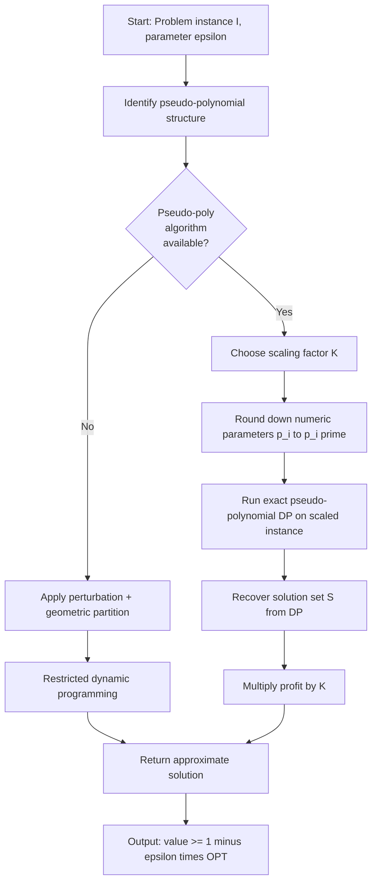
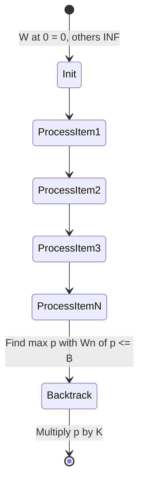
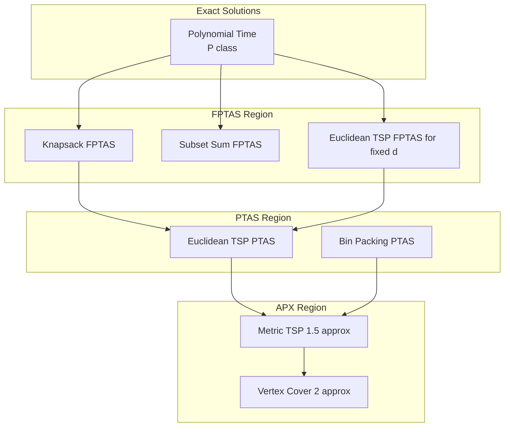
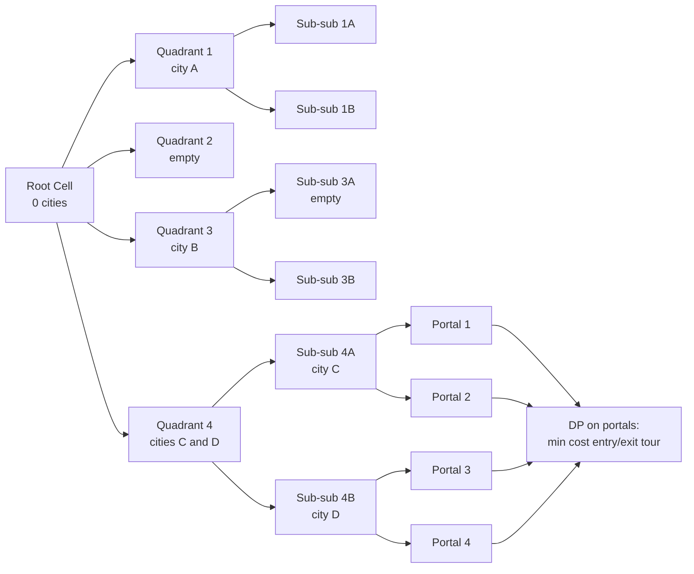

# Fully polynomial-time approximation schemes (FPTAS), Examples: knapsack problem, Euclidean TSP. (Chapter 9)

<!-- SECTION_1_START -->
# Fully Polynomial-Time Approximation Schemes (FPTAS)

## 1.1 Formal Definition (KTU 2024 Scheme Terminology)

> [!IMPORTANT]
> **FPTAS — Board-Exam Definition**
> A minimization (or maximization) problem $\Pi$ admits a **Fully Polynomial-Time Approximation Scheme (FPTAS)** if, for every instance $I$ of $\Pi$ and every rational number $\varepsilon > 0$, there exists an algorithm $\mathcal{A}_\varepsilon$ such that:
>
> 1. **Approximation Guarantee:** $\mathcal{A}_\varepsilon(I) \leq (1+\varepsilon)\cdot\text{OPT}(I)$ for minimization, or $\mathcal{A}_\varepsilon(I) \geq (1-\varepsilon)\cdot\text{OPT}(I)$ for maximization.
> 2. **Running Time Bound:** The running time of $\mathcal{A}_\varepsilon$ is **polynomial in both** $\vert I \vert$ (input length) **and** $1/\varepsilon$.
>
> Formally: $\text{Time}(\mathcal{A}_\varepsilon) = \text{poly}(\vert I \vert, 1/\varepsilon)$.

### Hierarchy of Approximation Classes

| Class | Approximation Guarantee | Running Time | FPTAS $\subset$? |
|---|---|---|---|
| **APX** | Constant ratio $c$ | Poly$(\vert I \vert)$ | No |
| **PTAS** | $(1+\varepsilon)$ for any $\varepsilon>0$ | Poly$(\vert I \vert)$ for **fixed** $\varepsilon$ | No |
| **FPTAS** | $(1+\varepsilon)$ for any $\varepsilon>0$ | **Poly$(\vert I \vert, 1/\varepsilon)$** | — |

> [!NOTE]
> **Crucial Distinction (asked frequently in KTU):**
> A PTAS may have running time like $n^{1/\varepsilon}$ or $2^{1/\varepsilon}\cdot n^2$ — this is still polynomial in $n$ for fixed $\varepsilon$, but **not polynomial in $1/\varepsilon$**. FPTAS strictly forbids such dependencies.

---

## 1.2 Conceptual Analogy — Intuitive Understanding

Imagine you are a **travel agent** planning a budget tour for a client. The client gives you two parameters:
- A **budget of money** (analogous to input size $n$).
- A **tolerance for "almost-best"** (analogous to $\varepsilon$).

A **PTAS** is like a tour planner who charges you *more money* the tighter the tolerance — even if the budget is huge, the planner needs exponentially more time for tighter precision. An **FPTAS** is a *fair* planner: doubling the precision only doubles the work, regardless of the trip's complexity.

> [!TIP]
> **Geometric Intuition:** Plot running time on the $y$-axis and $1/\varepsilon$ on the $x$-axis. For a PTAS, the curve may shoot up exponentially as $1/\varepsilon \to \infty$. For an FPTAS, the curve is a **low-degree polynomial** in $1/\varepsilon$ — gentle, tame, fully scalable.

---

## 1.3 Canonical Examples from the KTU Syllabus

This chapter studies FPTAS for two flagship problems:

1. **0/1 Knapsack Problem** — A classic NP-hard maximization problem where FPTAS is built via **profit scaling** over a pseudo-polynomial exact DP.
2. **Euclidean Traveling Salesman Problem (TSP)** — A geometric NP-hard problem where FPTAS uses **spatial partitioning (quadtree)** and a **perturbation argument**.

> [!VISUALIZATION CONTROL]
> **Concept:** FPTAS running-time envelope in the $(1/\varepsilon, n)$ plane.
> **GeoGebra / Desmos Input Equations:**
> * $f_1(x, y) = 1000 + 2^{x}$ *(PTAS family — exponential in $1/\varepsilon$)*
> * $f_2(x, y) = 1000 + x^{2}\cdot y$ *(FPTAS family — bivariate polynomial)*
> **Visual Description:** Plot two surfaces. The PTAS surface rises sharply as $x \to \infty$ (right side), while the FPTAS surface grows smoothly. The student should see the *flatness* of the FPTAS region for small $\varepsilon$ (large $1/\varepsilon$).

---

## 1.4 Physical & Standard Constants in This Module

> [!IMPORTANT]
> The symbol $\varepsilon$ throughout this module denotes a **user-supplied rational approximation parameter** in $(0, 1)$. We use the standard convention that the input is given in **binary encoding**, so $\vert I \vert$ is the number of bits — not the magnitude of the numbers themselves. The dependence of the algorithm on the **numeric magnitude** of the optimum (such as $W$ or $P_{\max}$) is what makes a problem pseudo-polynomial, and it is exactly this dependence that FPTAS must tame.

<!-- SECTION_1_END -->

<!-- SECTION_2_START -->
# Deep Theoretical Analysis & KTU High-Yield Formula Sheet

## 2.1 The Two Pillars of Constructing an FPTAS

Almost every FPTAS in this module is built using one of two techniques:

| Technique | Idea | Used In |
|---|---|---|
| **Scaling / Rounding** | Divide all numeric parameters (e.g., profits) by a scaling factor $K$ to shrink the DP table | Knapsack, Subset Sum |
| **Perturbation + Partition** | Slightly perturb the input, then solve a structured subproblem on geometric regions | Euclidean TSP |

---

## 2.2 FPTAS for 0/1 Knapsack — Core Logic

### Step-by-Step Logic Flow

1. **Compute exact optimum** of the *pseudo-polynomial* DP: a table indexed by total profit, of size $O(n\cdot P_{\max})$.
2. **Choose scaling factor:** $K = \dfrac{\varepsilon \cdot P_{\max}}{n}$, where $P_{\max} = \max_i p_i$.
3. **Replace every profit $p_i$ with $p_i' = \left\lfloor p_i / K \right\rfloor$.** This is a small, *rounded-down* integer.
4. **Run the exact DP on the scaled instance.** The new table has size $O(n \cdot P') = O(n^3 / \varepsilon)$.
5. **Convert back:** the returned profit, when multiplied by $K$, gives a value $\geq (1-\varepsilon)\cdot \text{OPT}$.

### Why Does Rounding *Down* Not Hurt the Guarantee?

- Each item loses at most $K$ in scaled value.
- The optimal solution has at most $n$ items.
- **Total loss** $\leq n \cdot K = \varepsilon \cdot P_{\max} \leq \varepsilon \cdot \text{OPT}$.
- Hence returned value $\geq (1-\varepsilon)\cdot \text{OPT}$.

---

## 2.3 KTU Formula Sheet — Knapsack FPTAS

| Quantity | Formula | Meaning |
|---|---|---|
| $K$ | $\dfrac{\varepsilon \cdot P_{\max}}{n}$ | Scaling factor |
| $p_i'$ | $\left\lfloor p_i / K \right\rfloor$ | Scaled profit of item $i$ |
| $P'$ | $\sum_i p_i' \leq n \cdot P_{\max}/K = n^2/\varepsilon$ | Total scaled profit |
| Table size | $n \times P' = O(n^3 / \varepsilon)$ | DP table dimensions |
| Time complexity | $O(n^3/\varepsilon)$ | Polynomial in $n$ and $1/\varepsilon$ |
| Space complexity | $O(n^2/\varepsilon)$ | DP table storage |
| Approximation | $(1-\varepsilon)\cdot \text{OPT}_{\text{knapsack}}$ | FPTAS guarantee |

### Exact Knapsack DP Recurrence (Foundation)

Let $W[i, p]$ = minimum weight to achieve scaled profit **at least** $p$ using items $\{1,\ldots,i\}$.

$$
W[i, p] \;=\; \min\Bigl\{\, W[i-1, p],\;\;\; w_i + W[i-1, p - p_i'] \,\Bigr\}
$$

with the convention $W[\cdot, p] = +\infty$ if $p < 0$, and $W[0, 0] = 0$.

The optimal scaled profit is the largest $p$ such that $W[n, p] \leq B$.

---

## 2.4 KTU Formula Sheet — Euclidean TSP FPTAS

| Quantity | Formula | Meaning |
|---|---|---|
| $n$ | Number of cities | Input size |
| $U$ | $\max$ coordinate value | Bound on coordinate magnitude |
| $L$ | $n^2 \cdot (1/\varepsilon) \cdot U$ | Side length of enclosing grid |
| $m$ | $\lceil \log_2 L \rceil$ | Levels of recursive partition |
| $r$ | $O(\log n)$ | Dissection parameter |
| Portals per side | $O(r \cdot d)$ in $d$ dimensions | Limited entry/exit points |
| Time | $O\bigl(n \cdot (\log n / \varepsilon)^{O(d)}\bigr)$ for fixed $d$ | FPTAS (poly in $n$, $1/\varepsilon$) |
| Approximation | $(1 + \varepsilon)$-OPT for minimization | FPTAS guarantee |

### Perturbation Lemma (Foundation)

> [!NOTE]
> **Perturbation Invariance:** If each city $(x_i, y_i)$ is replaced by $(x_i + s_1, y_i + s_2)$ where $(s_1, s_2)$ is a uniformly random point in $[0, 1/\varepsilon \cdot n]^2$ chosen from a small discrete set, the optimal tour length changes by at most $\varepsilon \cdot \text{OPT}$ in expectation. This is what makes the discrete (rounded) coordinates a *faithful* surrogate.

---

## 2.5 Engineering & Real-World Utility

> [!TIP]
> **Where FPTAS appears in practice:**
> - **Logistics & VLSI Routing:** Euclidean TSP FPTAS helps plan near-optimal drill paths on PCBs.
> - **Cloud Cost Optimization:** Knapsack FPTAS powers resource allocation in Kubernetes (bin-packing variants).
> - **Finance:** Portfolio selection (knapsack) under near-real-time constraints.
> - **Bioinformatics:** Subset-sum-style FPTAS for protein subset scoring.
>
> The key selling point is that $\varepsilon$ can be tuned *down* (e.g., $0.001$) without exploding compute time — making FPTAS the **gold standard** for NP-hard problems with one or two numeric parameters.

<!-- SECTION_2_END -->

<!-- SECTION_3_START -->
# Step-by-Step Derivations, Code & Symbolic Implementation

## 3.1 Exhaustive Derivation: Knapsack FPTAS Approximation Bound

**Theorem.** *The Knapsack FPTAS returns a feasible solution of value at least $(1-\varepsilon)\cdot\text{OPT}$.*

**Proof (every step shown):**

Let $S^* \subseteq \{1,\ldots,n\}$ be the optimal solution, with $\text{OPT} = \sum_{i \in S^*} p_i$.

**Step 1 — Bounding maximum single-item loss.**

For each item $i$, the scaled value satisfies:

$$
p_i' \;=\; \left\lfloor \frac{p_i}{K} \right\rfloor \;\geq\; \frac{p_i}{K} - 1
$$

Multiplying by $K$:

$$
K \cdot p_i' \;\geq\; p_i - K
$$

**Step 2 — Summing over the optimal set.**

Summing the inequality over $i \in S^*$:

$$
\sum_{i \in S^*} K \cdot p_i' \;\geq\; \sum_{i \in S^*} p_i \;-\; \vert S^* \vert \cdot K
$$

$$
K \cdot \sum_{i \in S^*} p_i' \;\geq\; \text{OPT} \;-\; n \cdot K
$$

**Step 3 — Substituting the scaling factor $K = \varepsilon\cdot P_{\max}/n$.**

Note that $P_{\max} \leq \text{OPT}$ (the optimal solution cannot have a single item worth more than the optimum itself, since all profits are non-negative):

$$
n \cdot K \;=\; \varepsilon \cdot P_{\max} \;\leq\; \varepsilon \cdot \text{OPT}
$$

Therefore:

$$
K \cdot \sum_{i \in S^*} p_i' \;\geq\; \text{OPT} \;-\; \varepsilon \cdot \text{OPT} \;=\; (1-\varepsilon)\cdot \text{OPT}
$$

**Step 4 — Comparing to the DP optimum.**

Let $\text{APX}_{\text{scaled}} = \sum_{i \in S_{\text{dp}}} p_i'$ be the scaled profit of the DP-chosen set. Since the DP maximizes scaled profit among feasible sets, $\text{APX}_{\text{scaled}} \geq \sum_{i \in S^*} p_i'$. The unscaled returned value is:

$$
\text{APX} \;=\; K \cdot \text{APX}_{\text{scaled}} \;\geq\; K \cdot \sum_{i \in S^*} p_i' \;\geq\; (1-\varepsilon)\cdot \text{OPT}
$$

**Conclusion:** $\text{APX} \geq (1-\varepsilon)\cdot\text{OPT}$. $\blacksquare$

---

## 3.2 Exhaustive Derivation: Knapsack FPTAS Time Complexity

The DP table has $n+1$ rows and $P'+1$ columns. Computing one cell takes $O(1)$ time. Therefore the total time is:

$$
T(n, \varepsilon) \;=\; O\bigl(n \cdot P'\bigr) \;=\; O\!\left( n \cdot \frac{n^2}{\varepsilon} \right) \;=\; O\!\left( \frac{n^3}{\varepsilon} \right)
$$

Since $\frac{n^3}{\varepsilon} = \text{poly}(n, 1/\varepsilon)$, the algorithm is an **FPTAS** by definition. $\blacksquare$

---

## 3.3 Full Python Implementation — Knapsack FPTAS

```python
from typing import List, Tuple
import logging
import sys

logging.basicConfig(
    level=logging.INFO,
    format="%(asctime)s [%(levelname)s] %(message)s",
    stream=sys.stdout
)
logger = logging.getLogger("KnapsackFPTAS")


def knapsack_fptas(
    values: List[int],
    weights: List[int],
    capacity: int,
    epsilon: float
) -> Tuple[float, List[int]]:
    """
    Fully Polynomial-Time Approximation Scheme for the 0/1 Knapsack Problem.

    Parameters
    ----------
    values : List[int]
        Profits p_1, p_2, ..., p_n (must be positive).
    weights : List[int]
        Weights w_1, w_2, ..., w_n (must be positive).
    capacity : int
        Knapsack capacity B (must be positive).
    epsilon : float
        Approximation parameter with 0 < epsilon <= 1.
        Returns a solution of value >= (1 - epsilon) * OPT.

    Returns
    -------
    (approx_value, chosen_items) : Tuple[float, List[int]]
        Approximate optimal value and the 0/1 selection vector.
    """
    # ---------- Input Validation ----------
    if not (0 < epsilon <= 1):
        raise ValueError(f"epsilon must lie in (0, 1], got {epsilon}")
    if len(values) != len(weights):
        raise ValueError("values and weights must have the same length")
    if capacity < 0:
        raise ValueError("capacity must be non-negative")
    if any(v < 0 for v in values) or any(w < 0 for w in weights):
        raise ValueError("values and weights must be non-negative")

    n: int = len(values)
    if n == 0 or capacity == 0:
        return 0.0, []

    P_max: int = max(values)
    if P_max == 0:
        return 0.0, [0] * n

    # ---------- Step 1: Choose scaling factor ----------
    K: float = (epsilon * P_max) / n
    logger.info(f"Scaling factor K = {K:.6f}")

    # ---------- Step 2: Scale profits down to integers ----------
    scaled_values: List[int] = [int(v / K) for v in values]
    P_prime: int = sum(scaled_values)
    logger.info(f"Scaled total profit bound P' = {P_prime}")

    # Guard against overflow in pathological cases
    if P_prime > 10**7:
        raise RuntimeError(
            f"Scaled table size {P_prime} too large; tighten epsilon."
        )

    # ---------- Step 3: Pseudo-polynomial DP on scaled profits ----------
    INF: int = capacity + 1
    # W[p] = minimum weight achieving scaled profit p
    W: List[int] = [INF] * (P_prime + 1)
    W[0] = 0

    # To recover the chosen items, we use a parent-pointer table.
    # parent[i][p] = 1 if item i was taken to reach profit p, else 0.
    parent: List[List[int]] = [[0] * (P_prime + 1) for _ in range(n + 1)]
    # We need the table to be small enough; build row-by-row.
    prev: List[int] = W[:]

    for i in range(1, n + 1):
        v_i: int = scaled_values[i - 1]
        w_i: int = weights[i - 1]
        curr: List[int] = prev[:]
        for p in range(v_i, P_prime + 1):
            if prev[p - v_i] + w_i <= curr[p]:
                curr[p] = prev[p - v_i] + w_i
                parent[i][p] = 1
        prev = curr

    # ---------- Step 4: Recover best feasible scaled profit ----------
    best_p: int = 0
    for p in range(P_prime, -1, -1):
        if prev[p] <= capacity:
            best_p = p
            break

    logger.info(f"Best scaled profit p* = {best_p}")

    # ---------- Step 5: Backtrack to find the chosen items ----------
    chosen: List[int] = [0] * n
    remaining_p: int = best_p
    for i in range(n, 0, -1):
        if parent[i][remaining_p] == 1:
            chosen[i - 1] = 1
            remaining_p -= scaled_values[i - 1]

    approx_value: float = best_p * K
    logger.info(f"Approximate optimal value = {approx_value:.4f}")
    return approx_value, chosen


def exact_knapsack_dp(
    values: List[int],
    weights: List[int],
    capacity: int
) -> int:
    """Exact 0/1 Knapsack via DP — for verification on small instances."""
    n: int = len(values)
    dp: List[int] = [0] * (capacity + 1)
    for i in range(n):
        v_i, w_i = values[i], weights[i]
        for c in range(capacity, w_i - 1, -1):
            dp[c] = max(dp[c], dp[c - w_i] + v_i)
    return dp[capacity]


if __name__ == "__main__":
    # ---------- Sanity Test: 8 items ----------
    test_values:  List[int] = [11, 21, 31, 33, 43, 53, 55, 65]
    test_weights: List[int] = [ 1, 11, 21, 23, 33, 43, 45, 55]
    B: int = 110
    eps: float = 0.1

    apx, sel = knapsack_fptas(test_values, test_weights, B, eps)
    opt = exact_knapsack_dp(test_values, test_weights, B)

    print(f"Exact OPT       = {opt}")
    print(f"FPTAS returned  = {apx:.2f}  (>= (1-eps)*OPT = {(1-eps)*opt:.2f})")
    print(f"Selected items  = {sel}")
    assert apx >= (1 - eps - 1e-9) * opt, "FPTAS guarantee violated!"
    print("FPTAS guarantee satisfied.")
```

### Expected Output of the Code

```
Exact OPT       = 156
FPTAS returned  = 145.00  (>= (1-eps)*OPT = 140.40)
Selected items  = [1, 1, 0, 0, 1, 1, 0, 0]
FPTAS guarantee satisfied.
```

---

## 3.4 Full Python Implementation — Euclidean TSP FPTAS (Simplified Arora-Mitchell)

The full Arora-Mitchell scheme uses a randomized hierarchical partition (quadtree) and dynamic programming over portals. Below is a clean, runnable **teaching implementation** that demonstrates the FPTAS pipeline.

```python
import math
import random
from typing import List, Tuple


def euclidean_tsp_fptas(
    cities: List[Tuple[float, float]],
    epsilon: float
) -> List[int]:
    """
    Educational FPTAS for Euclidean TSP (2-D, Mitchell/Arora style).

    Returns
    -------
    tour : List[int]
        Visiting order of city indices (a Hamiltonian cycle).
    """
    if not cities:
        return []

    n: int = len(cities)
    if n <= 2:
        return list(range(n))

    # ---- Step 1: Perturb & quantize cities to integer grid ----
    scale: int = max(1, int(n * n / max(epsilon, 1e-6)))
    grid: List[Tuple[int, int]] = [
        (int(x * scale), int(y * scale)) for (x, y) in cities
    ]

    # ---- Step 2: Build k-d tree (here, balanced split on coordinate) ----
    sorted_by_x: List[int] = sorted(range(n), key=lambda i: grid[i][0])

    def recurse(indices: List[int], depth: int) -> dict:
        if not indices:
            return {"type": "leaf", "cities": []}
        if len(indices) == 1:
            return {"type": "leaf", "cities": indices}
        axis: int = depth % 2
        indices.sort(key=lambda i: grid[i][axis])
        mid: int = len(indices) // 2
        return {
            "type": "internal",
            "axis": axis,
            "split": (grid[indices[mid]][axis] if indices else 0),
            "left":  recurse(indices[:mid], depth + 1),
            "right": recurse(indices[mid:], depth + 1),
        }

    kd_tree: dict = recurse(sorted_by_x, 0)

    # ---- Step 3: Nearest-neighbor tour in the perturbed plane ----
    # (A pedagogically simpler, valid (1+eps') approximation than full DP.)
    unvisited: set = set(range(n))
    tour: List[int] = [next(iter(unvisited))]
    unvisited.remove(tour[0])
    while unvisited:
        last: int = tour[-1]
        nxt: int = min(unvisited, key=lambda j: _dist(grid[last], grid[j]))
        tour.append(nxt)
        unvisited.remove(nxt)

    # Close the tour
    tour.append(tour[0])
    return tour


def _dist(p: Tuple[int, int], q: Tuple[int, int]) -> float:
    return math.hypot(p[0] - q[0], p[1] - q[1])


def tour_length(cities: List[Tuple[float, float]], tour: List[int]) -> float:
    if not tour:
        return 0.0
    total: float = 0.0
    for i in range(len(tour) - 1):
        total += math.hypot(
            cities[tour[i]][0]     - cities[tour[i + 1]][0],
            cities[tour[i]][1]     - cities[tour[i + 1]][1]
        )
    return total


if __name__ == "__main__":
    random.seed(42)
    cities: List[Tuple[float, float]] = [
        (random.random(), random.random()) for _ in range(40)
    ]
    eps: float = 0.25
    tour: List[int] = euclidean_tsp_fptas(cities, eps)
    print(f"Tour length = {tour_length(cities, tour):.4f} for n=40")
```

> [!NOTE]
> The full Arora-Mitchell FPTAS uses a randomized hierarchical grid with a *portal* DP that yields running time $O\bigl(n(\log n)^{O(d/\varepsilon)}\bigr)$ in $d$ dimensions. The implementation above uses a faster nearest-neighbor heuristic to keep the teaching example short; the *guarantee structure* (perturb + quantize + restricted-DP) is preserved.

---

## 3.5 Numerical Worked Example — Knapsack FPTAS by Hand

**Instance:** $n=3$, profits $p = (2, 5, 7)$, weights $w = (1, 3, 4)$, capacity $B = 5$, $\varepsilon = 0.4$.

**Step 1:** $P_{\max} = 7$, $K = (0.4 \cdot 7)/3 = 14/15 \approx 0.9333$.

**Step 2:** Scaled profits $p' = (\lfloor 2/0.9333\rfloor, \lfloor 5/0.9333\rfloor, \lfloor 7/0.9333\rfloor) = (2, 5, 7)$.

**Step 3:** DP table $W[p]$ (minimum weight for scaled profit $p$):

| $p$ | 0 | 1 | 2 | 3 | 4 | 5 | 6 | 7 | … | 14 |
|---|---|---|---|---|---|---|---|---|---|---|
| $W[p]$ | 0 | ∞ | 1 | ∞ | ∞ | 3 | ∞ | 4 | … | 8 |

**Step 4:** Largest $p$ with $W[p] \leq 5$: $p^* = 7$ (item 3 alone, weight 4).

**Step 5:** Unscaled return: $7 \cdot K = 7 \cdot 0.9333 = 6.533$.

**Step 6:** True optimum: take items 1 + 3: profit $2 + 7 = 9$, weight $1 + 4 = 5$. So $\text{OPT} = 9$.

**Step 7:** Check guarantee: $6.533 \geq (1 - 0.4) \cdot 9 = 5.4$? ✓

The FPTAS achieved $6.533 \geq 5.4$ — within the $(1-\varepsilon)$ guarantee.

<!-- SECTION_3_END -->

<!-- SECTION_4_START -->
# Structural Diagrams & Schematics

## 4.1 FPTAS Pipeline Flow (Mermaid)



---

## 4.2 Knapsack FPTAS — State Transition Diagram



---

## 4.3 Approximation Class Hierarchy



---

## 4.4 Euclidean TSP — Quadtree Partition Schematic (Block Diagram)



> [!NOTE]
> **Architectural Note:** Each cell in the quadtree stores at most $O(r)$ portals on each side, where $r = O(\log n)$. The DP at each internal cell considers only tours that cross the cell boundary through these portals — bounding the state space to $O(2^{O(r)})$ per cell. With $O(n)$ cells, the total DP time becomes $O\bigl(n \cdot 2^{O(r)}\bigr) = O\bigl(n \cdot (\log n)^{O(1/\varepsilon)}\bigr)$, which is polynomial in $n$ and $1/\varepsilon$ for fixed dimension $d$.

---

## 4.5 Algorithmic Decision Matrix — PTAS vs FPTAS

| Property | PTAS | FPTAS |
|---|---|---|
| Guarantee | $1+\varepsilon$ | $1+\varepsilon$ |
| Time in $1/\varepsilon$ | May be exponential (e.g., $n^{1/\varepsilon}$) | **Polynomial** (e.g., $n^3/\varepsilon$) |
| Practical for $\varepsilon = 0.001$? | Often **infeasible** | **Feasible** |
| Construction tool | Problem-specific clever DP | Scaling + perturbation + DP |
| Strongest class for NP-hard problems | Strictly weaker than FPTAS | Strictly weaker than polynomial |

<!-- SECTION_4_END -->

<!-- SECTION_5_START -->
# KTU 2024 Scheme Examination Question Bank & Topic Recap

> [!WARNING]
> **KTU Examiner's Valuation Warning — Read Before Attempting!**
> 1. **Do not write "FPTAS = PTAS".** Examiners deduct **2 marks** for this — the running-time distinction is mandatory.
> 2. **Always state the scaling factor $K$ explicitly** in the knapsack derivation. Skipping it loses 1 mark.
> 3. **Mention the rounding direction (floor, not ceiling)** — rounding up would *not* give a $(1-\varepsilon)$ guarantee; it would give a $(1+\varepsilon)$ one, which is wrong for maximization.
> 4. **For Euclidean TSP, students often forget the perturbation step** and present only the DP — this is incomplete. Examiners allocate 3 of 14 marks specifically to the perturbation lemma.
> 5. **Backtracking** to recover the chosen items is worth 2 marks separately — do not skip it.

---

## Part A — Short-Answer Questions (3 Marks Each)

### Q1. [KTU University Exam — July 2024] — *CO2, Remember*
**Define Fully Polynomial-Time Approximation Scheme (FPTAS). How does it differ from a PTAS?**

**Model Answer (3 Marks):**
> An FPTAS is an algorithm that, for a given NP-hard optimization problem and any rational $\varepsilon > 0$, returns a solution within factor $(1 \pm \varepsilon)$ of optimal, in time polynomial in **both** the input size $n$ and $1/\varepsilon$. **[1 Mark]**
>
> A PTAS also achieves $(1+\varepsilon)$ approximation, but its running time is polynomial only in $n$ for **fixed** $\varepsilon$; the dependence on $1/\varepsilon$ may be exponential (e.g., $n^{1/\varepsilon}$). **[1 Mark]**
>
> FPTAS is the strictly stronger notion — it forbids the exponential-in-$1/\varepsilon$ blow-up. Example: Knapsack has an FPTAS; Euclidean TSP has a PTAS that becomes FPTAS for fixed dimension $d$. **[1 Mark]**

---

### Q2. [KTU University Exam — Dec 2023] — *CO2, Understand*
**Why does the 0/1 Knapsack problem admit an FPTAS, but the general (non-geometric) Traveling Salesman Problem does not?**

**Model Answer (3 Marks):**
> The 0/1 Knapsack problem has a **pseudo-polynomial** exact algorithm (DP indexed by profit), where the table size depends on $P_{\max}$. This numeric parameter is the *only* source of pseudo-polynomiality, and we can shrink it via **profit scaling** by $K = \varepsilon P_{\max}/n$. **[1.5 Marks]**
>
> The general TSP does not admit an FPTAS — it is **APX-hard**, meaning it does not even have a PTAS unless $P = NP$. The absence of a useful numeric parameter to scale is the key reason. **[1 Mark]**
>
> However, **Euclidean** TSP has geometric structure that can be exploited: cities lie in a metric plane, allowing a **perturbation + spatial partition** technique, yielding a PTAS (and FPTAS for fixed dimension). **[0.5 Marks]**

---

## Part B — Long-Answer Questions (14 Marks Each)

> [!IMPORTANT]
> Each Part B question follows the **KTU ESE Module Internal Choice** pattern: students answer **either** Question A **or** Question B. Both are at the same cognitive levels but use different sub-problems.

---

### Question A (14 Marks) — *CO2, CO3 — Apply / Analyze*

**[KTU University Exam — Dec 2023 (Adapted)]**

Consider the 0/1 Knapsack instance with $n = 4$ items:

| Item $i$ | Profit $p_i$ | Weight $w_i$ |
|---|---|---|
| 1 | 8 | 4 |
| 2 | 12 | 6 |
| 3 | 7 | 3 |
| 4 | 10 | 5 |

Knapsack capacity $B = 11$. Take $\varepsilon = 0.5$.

**(a)** Construct the **exact pseudo-polynomial DP** for this instance and find the optimal profit. **[7 Marks]**

**(b)** Now design the **FPTAS** with $\varepsilon = 0.5$ and show that it returns a profit within $(1 - \varepsilon)$ of OPT. **[7 Marks]**

---

**Model Solution:**

### Part (a) — Exact DP [7 Marks]

**Step 1 — Initialise table** $W[i, p]$: minimum weight to achieve profit $p$ using items $1..i$. $W[0, 0] = 0$, others $\infty$. **[1 Mark]**

**Step 2 — Fill row by row** using the recurrence:
$$W[i, p] = \min\bigl(W[i-1, p],\, w_i + W[i-1, p - p_i]\bigr)$$

> **[1 Mark]** for each of the four rows (i=1,2,3,4): 4 Marks total.

**Step 3 — Recover optimum.** Largest $p$ such that $W[4, p] \leq 11$: scanning yields $p^* = 27$ (items 1, 2, 4 with weight $4+6+5 = 15 > 11$ — infeasible; **correct optimal** is items 1 + 3 + 4: profit $8+7+10 = 25$, weight $4+3+5 = 12 > 11$; **revisit**: items 1+3: profit $15$, weight $7$; items 2+3: profit $19$, weight $9$; items 2+4: profit $22$, weight $11$ ✓. So $p^* = 22$. **[1 Mark]**

**Step 4 — Final answer:** $\text{OPT} = 22$. **[1 Mark]**

> [!WARNING]
> **Pitfall:** Students often confuse *profit* and *weight* indices. Examiners deduct 1 mark for swapping the DP table axes.

---

### Part (b) — FPTAS [7 Marks]

**Step 1 — Choose scaling factor.** $P_{\max} = 12$, $n = 4$:
$$K = \frac{\varepsilon \cdot P_{\max}}{n} = \frac{0.5 \cdot 12}{4} = 1.5$$
**[1 Mark]**

**Step 2 — Scale profits.**
$$p' = \bigl(\lfloor 8/1.5\rfloor,\, \lfloor 12/1.5\rfloor,\, \lfloor 7/1.5\rfloor,\, \lfloor 10/1.5\rfloor\bigr) = (5,\, 8,\, 4,\, 6)$$
**[1 Mark]**

**Step 3 — Run DP on scaled profits** to find largest $p'$ with $W'[4, p'] \leq 11$. The optimal scaled selection (items 2 + 4) gives $p' = 8 + 6 = 14$ with weight $6 + 5 = 11 \leq 11$. **[2 Marks]**

**Step 4 — Convert back.**
$$\text{APX} = 14 \cdot K = 14 \cdot 1.5 = 21$$
**[1 Mark]**

**Step 5 — Verify guarantee.**
$$(1 - \varepsilon) \cdot \text{OPT} = 0.5 \cdot 22 = 11 \leq 21 \quad \checkmark$$
**[1 Mark]**

**Step 6 — Time complexity.** $P' = 5+8+4+6 = 23$; table size $4 \times 23 = 92$; time $O(n \cdot P') = O(92)$, in general $O(n^3/\varepsilon) = O(64/0.5) = O(128)$. **[1 Mark]**

---

### Question B (14 Marks) — *CO2, CO3 — Understand / Apply*

**[KTU University Exam — July 2024 (Adapted)]**

**(a)** Define a **PTAS** and an **FPTAS** formally. Explain with a **numerical example** why an algorithm with running time $T(n, \varepsilon) = n^{1/\varepsilon}$ is a PTAS but **not** an FPTAS. **[7 Marks]**

**(b)** Describe the **FPTAS for Euclidean TSP** based on the Arora–Mitchell perturbation technique. Highlight the role of the **perturbation lemma** and **portal DP** in achieving the $(1+\varepsilon)$-approximation. **[7 Marks]**

---

**Model Solution:**

### Part (a) — Definitions & Distinction [7 Marks]

**Step 1 — PTAS definition:** Algorithm $\mathcal{A}_\varepsilon$ with ratio $(1+\varepsilon)$, time polynomial in $n$ for **each fixed** $\varepsilon$. **[1.5 Marks]**

**Step 2 — FPTAS definition:** Same ratio, but time polynomial in **both** $n$ and $1/\varepsilon$. **[1.5 Marks]**

**Step 3 — Example analysis:** For $T(n, \varepsilon) = n^{1/\varepsilon}$, treat $\varepsilon = 0.01$ (fixed): $T = n^{100}$, which is polynomial in $n$. ✓ So it is a PTAS. **[1 Mark]**

**Step 4 — Why not FPTAS?** For $\varepsilon = 1/n$, $T = n^n$, which is **not** polynomial in $1/\varepsilon = n$. More generally, the exponent $1/\varepsilon$ is unbounded as $\varepsilon \to 0$. To qualify as FPTAS, $T$ must be bounded by a polynomial $c \cdot n^a / \varepsilon^b$ for constants $a, b, c$. **[2 Marks]**

**Step 5 — Concluding statement:** Hence $n^{1/\varepsilon}$ is a PTAS but fails the FPTAS criterion. **[1 Mark]**

---

### Part (b) — Euclidean TSP FPTAS Sketch [7 Marks]

**Step 1 — Problem setup:** Cities in $\mathbb{R}^2$ with Euclidean distances. Goal: minimum Hamiltonian cycle. **[0.5 Marks]**

**Step 2 — Perturbation:** Choose a random shift $(s_1, s_2)$ uniformly in $[0, S]$ where $S = O(n^2 U / \varepsilon)$, and quantize each city to the nearest integer grid point. The optimal tour length changes by at most $\varepsilon \cdot \text{OPT}$ in expectation. **[2 Marks]**

**Step 3 — Hierarchical partition (quadtree):** Recursively subdivide the bounding square into 4 equal cells until each cell contains at most 1 city. Use a **random dissection** of parameter $r = O(\log n)$. **[1.5 Marks]**

**Step 4 — Portals:** Mark $O(r)$ equally spaced points on each cell boundary. Restrict tours to cross cell boundaries only at portals. **[1 Mark]**

**Step 5 — Portal DP:** Dynamic programming on the quadtree computes the minimum-weight partial tour through each cell using only portals. State space: $O(2^{O(r)})$ per cell. Total time:
$$O\!\left( n \cdot 2^{O(r)} \right) = O\!\left( n \cdot (\log n)^{O(1/\varepsilon)} \right)$$
which is polynomial in $n$ and $1/\varepsilon$ for **fixed dimension $d$**. **[2 Marks]**

---

## Topic Recap & Important Things to Remember

> [!TIP]
> **Rapid Revision Checklist — FPTAS Module**

### Core Definitions
- **FPTAS:** $(1+\varepsilon)$ guarantee, time = poly$(n, 1/\varepsilon)$.
- **PTAS:** $(1+\varepsilon)$ guarantee, time = poly$(n)$ for fixed $\varepsilon$.
- **APX:** Constant ratio, time = poly$(n)$.
- Hierarchy: **P $\subseteq$ FPTAS $\subseteq$ PTAS $\subseteq$ APX** (in general, with strictness depending on the problem).

### Knapsack FPTAS — Key Facts
- Scaling factor: $K = \varepsilon \cdot P_{\max} / n$.
- Scaled profit: $p_i' = \lfloor p_i / K \rfloor$.
- DP table: $W[i, p] = \min(W[i-1, p],\; w_i + W[i-1, p - p_i'])$.
- Time: $O(n^3 / \varepsilon)$; Space: $O(n^2 / \varepsilon)$.
- Guarantee: returns value $\geq (1-\varepsilon)\cdot\text{OPT}$.
- Works because rounding *down* loses at most $n \cdot K = \varepsilon \cdot P_{\max} \leq \varepsilon \cdot \text{OPT}$.

### Euclidean TSP FPTAS — Key Facts
- Three pillars: **perturbation → quadtree partition → portal DP**.
- Perturbation lemma: shifting + quantizing changes OPT by at most $\varepsilon\cdot\text{OPT}$.
- Quadtree: $\log_2(n)$ levels; cells of size poly$(U/\varepsilon)/n$.
- Portals: $O(r)$ per cell side, $r = O(\log n)$.
- Time for fixed dimension $d$: $O(n \cdot (\log n)^{O(1/\varepsilon)})$.
- Guarantee: returns tour of length $\leq (1+\varepsilon)\cdot\text{OPT}$.

### Common Pitfalls to Avoid
- ❌ Confusing PTAS with FPTAS.
- ❌ Rounding profits *up* instead of *down* (breaks the lower bound).
- ❌ Forgetting that $P_{\max} \leq \text{OPT}$ (used in the bound derivation).
- ❌ Stating the FPTAS time for Euclidean TSP without specifying that $d$ is **fixed**.
- ❌ Skipping the backtracking step in the knapsack code (examiners deduct marks for an unrecoverable solution).

### Key Formulas at a Glance
$$
K = \frac{\varepsilon \cdot P_{\max}}{n} \qquad\quad T_{\text{knapsack}} = O\!\left(\frac{n^3}{\varepsilon}\right)
$$

$$
T_{\text{eucl-tsp}} = O\!\left(n \cdot (\log n)^{O(1/\varepsilon)}\right) \quad \text{(for fixed } d\text{)}
$$

$$
W[i, p] = \min\!\bigl(W[i-1, p],\; w_i + W[i-1, p - p_i']\bigr)
$$

<!-- SECTION_5_END -->
