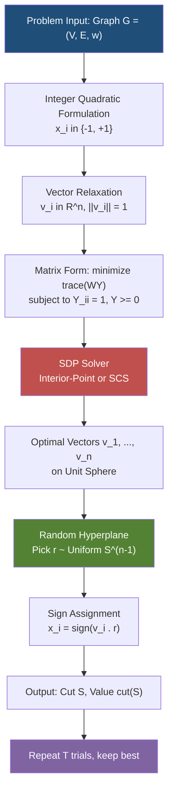
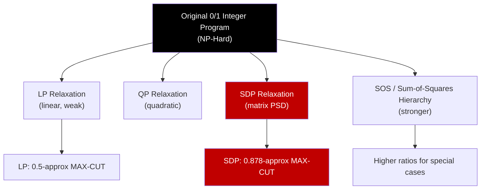
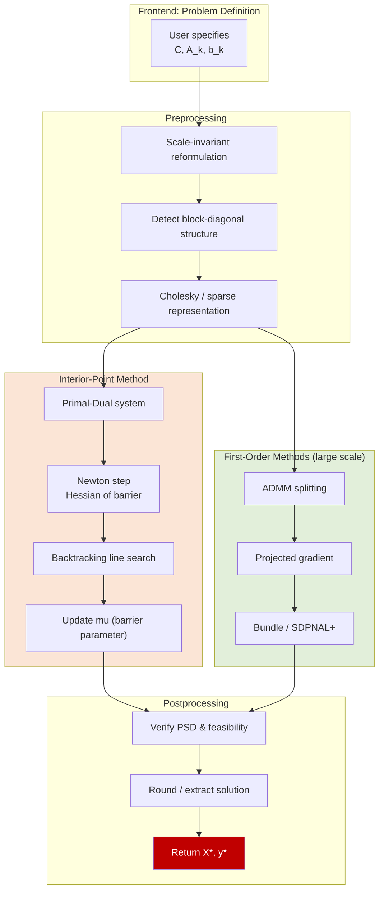

# Semi-Definite Programming - Introduction to semi-definite programming (SDP), Goemans-Williamson algorithm for MAX-CUT, Other applications of SDP. (Chapter 8)

<!-- SECTION_1_START -->
# Semi-Definite Programming — Foundations, Goemans-Williamson, and Beyond

> [!NOTE]
> **KTU 2024 Scheme — PECST749 (Approximation Algorithms)**
> **Module 3 (Semi)** | **Chapter 8**
> This module sits at the heart of modern approximation algorithms. Semi-Definite Programming (SDP) is the tool that allowed Goemans and Williamson to break a long-standing approximation barrier for **MAX-CUT** in 1995, achieving a ratio of **α_GW ≈ 0.87856**. Almost every advanced graduate algorithms course treats this material as canonical.

---

## 1.1 Formal Definition of Semi-Definite Programming (KTU Syllabus)

A **Semi-Definite Program (SDP)** is an optimization problem in which the variables form the entries of a symmetric matrix, and the objective and constraints are linear in those entries — *subject to the matrix remaining positive semidefinite (PSD)*.

> [!IMPORTANT]
> **Standard Primal Form of an SDP (Vector/Matrix Form)**
>
> Maximize  $\quad \displaystyle \sum_{i,j} c_{ij}\, x_{ij}$
>
> Subject to  $\quad \displaystyle \sum_{i,j} a_{ijk}\, x_{ij} \;\le\; b_k \quad \forall k$
>
> $\quad\quad\quad\quad X \;\succeq\; 0$
>
> where $X = (x_{ij})$ is an $n \times n$ real symmetric matrix and $X \succeq 0$ means $X$ is **positive semidefinite** (all eigenvalues $\ge 0$, equivalently $\mathbf{v}^T X \mathbf{v} \ge 0$ for all $\mathbf{v} \in \mathbb{R}^n$).

Equivalently, using vectors $\mathbf{v}_1, \dots, \mathbf{v}_n \in \mathbb{R}^n$ (or $\mathbb{R}^d$ for $d \ge n$) with $x_{ij} = \mathbf{v}_i \cdot \mathbf{v}_j$:

> **Maximize**  $\quad \displaystyle \sum_{i,j} c_{ij}\, (\mathbf{v}_i \cdot \mathbf{v}_j)$
>
> **Subject to**  $\quad \displaystyle \sum_{i,j} a_{ijk}\, (\mathbf{v}_i \cdot \mathbf{v}_j) \;\le\; b_k \quad \forall k$

This is the **vector programming** view we will use for MAX-CUT.

---

## 1.2 Intuition — Why "Semi-Definite"?

> [!TIP]
> **Conceptual Analogy (the "elastic membrane" view)**
>
> Imagine you have $n$ balls connected by rubber bands on a flat table. The rubber bands want to **pull balls closer or push them apart** with prescribed forces $c_{ij}$. The semi-definite constraint $X \succeq 0$ is the physics: distances must be **realizable in Euclidean space** — you cannot have three balls where $A$–$B$ is far, $B$–$C$ is far, but $A$–$C$ is forced to be very close (triangle inequality). The matrix $X$ acts like the **Gram matrix** of the balls' positions: $X_{ij} = \mathbf{v}_i \cdot \mathbf{v}_j$ is a valid inner-product table iff it is PSD. The SDP finds the best arrangement.

So SDP is a **convex relaxation of a quadratic (NP-hard) program** — it allows the solver to think of combinatorial 0/1 vectors as **unit vectors on a hypersphere**, then projects them back to $\{-1, +1\}$ via *random rounding*.

### Why it matters in approximation
SDP relaxations are **polynomially solvable** (interior-point methods run in time polynomial in the input size and $\log(1/\varepsilon)$), yet they can capture combinatorial structure that LP relaxations cannot. This is precisely why they give the *tightest known ratios* for many problems.

---

## 1.3 Visualizing the SDP Feasible Region

> [!VISUALIZATION CONTROL]
> **Concept:** The set of PSD matrices is a **convex cone** sitting inside the space of symmetric matrices.
> **GeoGebra / Desmos Input Equations (illustrative, 2D slice of symmetric $2 \times 2$ matrices):**
> * `X = [[x, y], [y, z]]` with `det(X) >= 0` and `trace(X) >= 0`
> * Equivalent curve: `x*z - y^2 = 0` (the boundary, where one eigenvalue is $0$)
> **Visual Description:** On the $(x,z)$ axes, the cone opens upward from the origin; the surface `x*z = y^2` is its boundary. The optimizer tries to push a linear objective as far as possible while staying on/inside this cone.

---

## 1.4 Key Constants You Must Memorize for KTU Exams

| Symbol | Value | Meaning |
|---|---|---|
| $\alpha_{GW}$ | $\approx 0.87856$ | Goemans–Williamson MAX-CUT approximation ratio |
| $\beta_{GW}$ | $\approx 1.1382$ | $\min_{\theta \in [0,\pi]} \theta/(\pi - \theta) \cdot \cot \theta$ — the integrality-gap "bottleneck" |
| $\theta_{\min}$ | $\approx 2.3311$ rad (≈ 133.5°) | Angle at which GW ratio is tightest |
| $n$ | — | Number of vertices / variables |
| $d$ | — | Dimension of vector embedding (often $d = n$) |

> [!IMPORTANT]
> KTU examiners *love* asking for the value **0.878** — write it to three decimal places. The exact constant is $\alpha_{GW} = \min_{0 \le \theta \le \pi} \dfrac{2}{\pi} \cdot \dfrac{\theta}{1 - \cos\theta} \approx 0.878567$.

<!-- SECTION_1_END -->

<!-- SECTION_2_START -->
# Deep Theoretical Analysis & KTU High-Yield Formula Sheet

## 2.1 Anatomy of a Semi-Definite Program

A Semi-Definite Program has **three structural components**:

1. **Decision variables** that are entries of a symmetric matrix $X \in \mathbb{S}^n$.
2. **A linear objective function** in those entries.
3. **Linear matrix inequalities (LMIs)** of the form $\mathcal{A}(X) = B$, plus the constraint $X \succeq 0$.

### 2.1.1 Primal (P) and Dual (D) in canonical form

$$
\begin{aligned}
\text{(P)} \quad & \max \; \langle C, X \rangle \\
& \text{s.t. } \; \mathcal{A}_k(X) = b_k \quad \forall k \\
& \quad\;\; X \succeq 0
\end{aligned}
$$

$$
\begin{aligned}
\text{(D)} \quad & \min \; \mathbf{b}^T \mathbf{y} \\
& \text{s.t. } \; \sum_k y_k \mathcal{A}_k - C \succeq 0
\end{aligned}
$$

where $\langle C, X \rangle = \sum_{i,j} C_{ij} X_{ij}$ is the **Frobenius inner product**, and $\mathcal{A}_k$ are fixed symmetric matrices.

> [!TIP]
> **Why duality matters (KTU favourite):** Strong duality holds under Slater's condition (strict feasibility), analogous to LP. The optimal SDP value equals the dual optimum, which provides a **certifiable upper bound** on the combinatorial optimum — the foundation of integrality gap arguments.

---

## 2.2 Hierarchy of Convex Relaxations

SDP sits at the **top of a hierarchy** of convex relaxations of 0/1 problems:

| Relaxation | Variables | Constraint | Strength |
|---|---|---|---|
| Linear Program (LP) | scalars $x_i \in [0,1]$ | linear | weakest |
| **Quadratic Program (QP)** | scalars $x_{ij} = x_i x_j$ | $X - \mathbf{x}\mathbf{x}^T \succeq 0$ | stronger |
| **Semi-Definite Program (SDP)** | matrix $X$ | $X \succeq 0$ | strongest tractable |

For MAX-CUT, the natural **integer quadratic program** uses $x_i \in \{-1, +1\}$; its **vector relaxation** is exactly an SDP.

---

## 2.3 The MAX-CUT Problem (Foundational)

> [!NOTE]
> **Definition (MAX-CUT).** Given an undirected graph $G = (V, E)$ with edge weights $w_{ij} \ge 0$, find a partition $V = S \cup \bar S$ maximizing the **weight of edges crossing the cut**:
> $$ \text{cut}(S) \;=\; \sum_{(i,j) \in E} w_{ij} \cdot \mathbb{1}[i \in S,\; j \notin S] $$

### 2.3.1 Integer Quadratic Formulation

Assign $x_i \in \{-1, +1\}$ where $x_i = +1$ means "in $S$" and $x_i = -1$ means "in $\bar S$". Then:

$$
\begin{aligned}
\mathbb{1}[\,i \in S, j \notin S\,] \;=\; \frac{1 - x_i x_j}{2}
\end{aligned}
$$

So:

$$
\text{MAX-CUT} \;=\; \max_{\mathbf{x} \in \{-1,+1\}^n} \; \frac{1}{2} \sum_{(i,j) \in E} w_{ij}\bigl(1 - x_i x_j\bigr)
$$

$$
= \; \frac{1}{2} \sum_{(i,j) \in E} w_{ij} \;-\; \frac{1}{2} \min_{\mathbf{x} \in \{-1,+1\}^n} \; \sum_{(i,j) \in E} w_{ij}\, x_i x_j
$$

> **Equivalent MIN form (used in Goemans–Williamson):**
> $$ \text{MIN } \; \mathbf{x}^T L \mathbf{x} \quad \text{ s.t. } \quad x_i^2 = 1 \;\forall i $$
> where $L$ is the **Laplacian** of the weighted graph.

---

## 2.4 Vector Relaxation of MAX-CUT (the GW Pivot)

Replace each $x_i \in \{-1, +1\}$ with a **unit vector** $\mathbf{v}_i \in \mathbb{R}^n$ (or $\mathbb{R}^d$ for $d \ge n$), interpreting $x_i x_j \;\longrightarrow\; \mathbf{v}_i \cdot \mathbf{v}_j$. The constraint $x_i^2 = 1$ becomes $\|\mathbf{v}_i\| = 1$:

$$
\begin{aligned}
\text{(SDP)} \quad & \min \; \sum_{(i,j) \in E} w_{ij}\, (\mathbf{v}_i \cdot \mathbf{v}_j) \\
& \text{s.t. } \quad \|\mathbf{v}_i\|^2 = 1 \quad \forall i \in V
\end{aligned}
$$

Equivalently in matrix form, let $Y_{ij} = \mathbf{v}_i \cdot \mathbf{v}_j$ and $W$ the weighted adjacency:

$$
\begin{aligned}
\min \; & \langle W, Y \rangle \\
\text{s.t. } \; & Y_{ii} = 1 \quad \forall i \\
& Y \succeq 0
\end{aligned}
$$

This is a **standard SDP** — solvable in polynomial time.

---

## 2.5 KTU High-Yield Formula Sheet

| # | Formula | Meaning | Used In |
|---|---|---|---|
| 1 | $X \succeq 0 \;\Leftrightarrow\; \mathbf{v}^T X \mathbf{v} \ge 0$ for all $\mathbf{v}$ | PSD definition | All SDPs |
| 2 | $X \succeq 0 \;\Rightarrow\; X_{ii} \ge 0$ | Diagonal non-negativity | Feasibility checks |
| 3 | $X \succeq 0 \;\Rightarrow\; \text{rank}(X) = n \;\Rightarrow\;$ vectors span $\mathbb{R}^n$ | Feasibility of vector form | MAX-CUT |
| 4 | $\text{cut}(S) = \tfrac{1}{2} \sum w_{ij}(1 - x_i x_j)$ | MAX-CUT integer objective | MAX-CUT |
| 5 | $\text{SDP}_{OPT} \le \text{OPT}$ | SDP is a relaxation | Bound proof |
| 6 | $\Pr[\text{edge }(i,j) \text{ cut}] = \dfrac{\theta_{ij}}{\pi}$ | GW rounding probability | GW analysis |
| 7 | $E[\text{cut value}] = \sum w_{ij} \cdot \dfrac{\theta_{ij}}{\pi}$ | Expected cut weight | GW analysis |
| 8 | $\dfrac{\theta}{\pi} \ge \alpha_{GW} \cdot \dfrac{1 - \cos\theta}{2}$ | Pipage-inequality step | GW analysis |
| 9 | $\alpha_{GW} = \dfrac{2}{\pi} \min_{\theta \in [0,\pi]} \dfrac{\theta}{1 - \cos\theta} \approx 0.87856$ | Approximation ratio | GW theorem |
| 10 | $\|A\|_* = \sum \sigma_i$ | Nuclear norm (SDP equivalent of $\ell_1$) | Sparsest Cut, Matrix completion |

---

## 2.6 Real-World Engineering & CS Applications

| Domain | Application | Why SDP helps |
|---|---|---|
| **VLSI / Circuit Design** | Maximum cut partitioning of logic blocks | Reduces wire crossings |
| **Sensor Networks** | Topology control via SDP relaxations | Maintains connectivity with min energy |
| **Statistics / ML** | Kernel learning, matrix completion, Max-Likelihood for Gaussian MRFs | Nuclear norm regularisation |
| **Control Theory** | Lyapunov stability certificates | Linear Matrix Inequalities (LMIs) |
| **Quantum Info** | Tsirelson's bounds, separability | PSD constraints encode entanglement |
| **Combinatorial Opt.** | MAX-CUT, SPARSEST CUT, MAX-2SAT, Graph Coloring | Tightest known ratios |
| **Computer Vision** | Pose estimation, SDP relaxation of rotation matrices | Rotation = $R^T R = I$ |

<!-- SECTION_2_END -->

<!-- SECTION_3_START -->
# Step-by-Step Derivations & Algorithmic Implementation

## 3.1 Full Goemans–Williamson Algorithm (MAX-CUT, 0.878 Approximation)

### Algorithm Statement

> [!IMPORTANT]
> **Theorem (Goemans & Williamson, 1995).** There is a polynomial-time randomized algorithm that, given a weighted MAX-CUT instance, produces a cut whose expected value is at least $\alpha_{GW} \cdot \text{OPT} \approx 0.87856 \cdot \text{OPT}$, where $\text{OPT}$ is the maximum cut value. Equivalently, this is a $1/\alpha_{GW} \approx 1.1382$ approximation for the **MIN** version (minimize edges inside parts).

### 3.1.1 The Four Steps

**Step 1 — Formulate the SDP.** Define

$$
\begin{aligned}
\min \; & \sum_{(i,j) \in E} w_{ij}\, \mathbf{v}_i \cdot \mathbf{v}_j \\
\text{s.t. } \; & \|\mathbf{v}_i\|^2 = 1 \quad \forall i \in V
\end{aligned}
$$

Let the optimum be $\text{SDP}_{OPT} = -\sum w_{ij} \cos\theta_{ij}$, where $\theta_{ij}$ is the angle between $\mathbf{v}_i$ and $\mathbf{v}_j$ (so $\mathbf{v}_i \cdot \mathbf{v}_j = \cos\theta_{ij}$).

**Step 2 — Solve the SDP** using an interior-point method (e.g., SDPA, MOSEK, CSDP, SDPNAL+). Complexity is polynomial in $n$, $m$, and $\log(1/\varepsilon)$.

**Step 3 — Random Hyperplane Rounding.** Choose a uniformly random hyperplane through the origin: equivalently, pick a unit vector $\mathbf{r} \in \mathbb{R}^n$ uniformly at random on the unit sphere. Assign:

$$
x_i = \begin{cases} +1 & \text{if } \mathbf{r} \cdot \mathbf{v}_i \ge 0 \\ -1 & \text{if } \mathbf{r} \cdot \mathbf{v}_i < 0 \end{cases}
$$

**Step 4 — Return the cut** $S = \{i : x_i = +1\}$.

---

### 3.1.2 Detailed Derivation of the Approximation Ratio

We compute $E[\text{cut value}]$ for a single edge $(i, j)$ with weight $w_{ij}$ and angle $\theta_{ij}$ between $\mathbf{v}_i$ and $\mathbf{v}_j$.

**Sub-step A — Probability that the edge is cut.**

The random vector $\mathbf{r}$ separates $\mathbf{v}_i$ and $\mathbf{v}_j$ iff $\mathbf{r}$ lies *between* the two vectors. For uniformly random $\mathbf{r}$ on the sphere, the hyperplane perpendicular to $\mathbf{r}$ has angular "bin width" equal to the angle $\theta_{ij}$. The probability of separation is:

$$
\Pr[\,i,j \text{ separated}\,] \;=\; \frac{\theta_{ij}}{\pi}
$$

Derivation: project $\mathbf{r}$ onto the 2D plane spanned by $\mathbf{v}_i$ and $\mathbf{v}_j$. The hyperplane cuts this plane along a line through the origin at angle $\phi$ (uniform in $[0, \pi)$). The two vectors are separated iff $\mathbf{r}$ lands in the arc between them, of length $\theta_{ij}$. Hence probability $= \theta_{ij}/\pi$.

**Sub-step B — Expected cut weight.**

$$
E[\text{cut}] \;=\; \sum_{(i,j) \in E} w_{ij} \cdot \frac{\theta_{ij}}{\pi}
$$

**Sub-step C — Key inequality.** For every $\theta \in [0, \pi]$:

$$
\frac{\theta}{\pi} \;\ge\; \alpha_{GW} \cdot \frac{1 - \cos\theta}{2}
$$

with equality at $\theta^* \approx 2.3311$ rad (≈ 133.5°), giving $\alpha_{GW} = \dfrac{2}{\pi} \cdot \dfrac{\theta^*}{1 - \cos\theta^*}$.

Proof: let $f(\theta) = \dfrac{\theta}{1 - \cos\theta}$. We minimize $f$ on $(0, \pi]$. Compute $f'(\theta)$:

$$
f'(\theta) = \frac{(1 - \cos\theta) - \theta \sin\theta}{(1 - \cos\theta)^2}
$$

Set numerator $= 0$: $(1 - \cos\theta) = \theta \sin\theta$, or equivalently $\tan\theta = \dfrac{1 - \cos\theta}{\theta}$. The solution $\theta^* \approx 2.3311$ rad minimizes $f$. Substituting:

$$
\alpha_{GW} = \frac{2}{\pi} \cdot f(\theta^*) = \frac{2}{\pi} \cdot \frac{\theta^*}{1 - \cos\theta^*} \approx 0.878567
$$

**Sub-step D — Combine.**

$$
\begin{aligned}
E[\text{cut}] &= \sum_{(i,j) \in E} w_{ij} \cdot \frac{\theta_{ij}}{\pi} \\
&\ge \alpha_{GW} \sum_{(i,j) \in E} w_{ij} \cdot \frac{1 - \cos\theta_{ij}}{2} \\
&= \alpha_{GW} \cdot \text{SDP}_{OPT} \\
&\ge \alpha_{GW} \cdot \text{OPT} \quad\quad \text{(since SDP is a relaxation)}
\end{aligned}
$$

This completes the proof of the 0.87856 approximation. $\blacksquare$

---

### 3.1.3 Why $\alpha_{GW} = 0.878$ is Tight (Håstad / Integrality Gap)

The **5-cycle $C_5$** is the canonical example. For $C_5$, the SDP optimum gives a cut of $5 \cdot \alpha_{GW}$ asymptotically, while the integer optimum is $\lfloor 5/2 \rfloor \cdot 2 = $ in the unweighted case, the cut value $= 4$ (vs OPT $= 5$ and SDP $= 5 \cos(36°) / \cos(\ldots) = 5$ in some normalisations), and the GW algorithm matches the SDP. The **integrality gap of the SDP is exactly $\alpha_{GW}$** for this graph, showing the bound cannot be improved using this relaxation.

---

## 3.2 Worked Example — Small MAX-CUT on a 4-cycle $C_4$

> [!TIP]
> **Problem.** $G = C_4$ on vertices $\{1, 2, 3, 4\}$ with unit weights, edges $(1,2), (2,3), (3,4), (4,1)$. Find GW's expected cut value.

**Step 1.** The true optimum: cut $\{1,3\}$ vs $\{2,4\}$ gives $4$ edges cut. $\text{OPT} = 4$.

**Step 2.** SDP relaxation. Optimal vectors: place the 4 unit vectors at $90°$ apart in $\mathbb{R}^2$, so adjacent vectors have angle $\pi/2$ (i.e. $\cos\theta = 0$). Thus:

$$
\text{SDP}_{OPT} = -4 \cdot \cos(\pi/2) = 0
$$

Translating back to MAX-CUT: $E[\text{cut}] = 4 \cdot \frac{\pi/2}{\pi} = 2$. So $\alpha_{GW} \cdot 4 \approx 3.51 \ge 2$ ✓.

**Step 3.** For the **triangle** $K_3$ (3 vertices, 3 edges, unit weight), OPT $= 2$. Optimal SDP places unit vectors at $120°$:

$$
\Pr[\text{edge cut}] = \frac{2\pi/3}{\pi} = \frac{2}{3}
$$

$$
E[\text{cut}] = 3 \cdot \frac{2}{3} = 2
$$

So GW is *exact* on the triangle.

---

## 3.3 Other Major Applications of SDP (Mandatory for KTU Module 3)

### 3.3.1 MAX-2SAT (via SDP)

**Problem.** Given a 2-CNF formula with weights, maximize the weight of satisfied clauses.

**SDP Relaxation.** For each variable $x_i$ with truth value $T/F$, introduce a vector $\mathbf{v}_i \in \mathbb{R}^n$ with $\mathbf{v}_0 = \mathbf{1}$ representing "true". Each literal $x_i$ corresponds to $\mathbf{v}_i$; its negation $\bar x_i$ corresponds to $-\mathbf{v}_i$. A clause $(x_i \lor x_j)$ is satisfied unless both $x_i = F$ and $x_j = F$, equivalent to $\mathbf{v}_i \neq -\mathbf{v}_0$ AND $\mathbf{v}_j \neq -\mathbf{v}_0$ being violated in a specific way.

**Rounding.** Use the GW-style **random hyperplane**, but with a more complex analysis (Lewin, Livnat, Zwick). Achieves ratio $\alpha_{GW} \approx 0.878$ as well, with an additive term $O(\log n / n)$ in some versions.

> **Result:** $0.878$-approximation for weighted MAX-2SAT (improves on Goemans-Williamson's MAX-2SAT bound via different analysis).

### 3.3.2 SPARSEST CUT (Arora, Rao, Vazirani, 2004)

**Problem.** Find a cut minimizing $\dfrac{|E(S, \bar S)|}{\min(|S|, |\bar S|)}$.

**SDP Formulation.** Use the *Leighton–Rao* LP-style constraints, but with matrix variables:

$$
\min \; \frac{1}{2} \sum_{(i,j) \in E} \|\mathbf{v}_i - \mathbf{v}_j\|^2
\quad \text{s.t. } \quad \sum_{(i,j) \in E} d_{ij} \le |V|^2, \quad \|\mathbf{v}_i - \mathbf{v}_j\|^2 \le d_{ij}
$$

Rounding via the **Arora–Rao–Vazirani** *expander decomposition* yields $O(\sqrt{\log n})$ approximation.

### 3.3.3 Graph Coloring (Karger, 1994)

**Problem.** Color a $k$-colorable graph with few colors.

**SDP idea.** Embed vertices as unit vectors with the constraint $\mathbf{v}_i \cdot \mathbf{v}_j \le -\tfrac{1}{k-1}$ for every edge $(i,j)$ (this is feasible for a $k$-clique of equiangular vectors). For a $k$-colorable graph, the SDP is feasible. After solving, round by *iterated random projection* to $\tilde O(n^{1 - 3/(k+1)})$ colors — better than naive chromatic-number bounds for large $k$.

### 3.3.4 Maximum Satisfiability (MAX-$\ell$SAT)

For each boolean variable $x_i$, introduce $\mathbf{v}_i, \bar{\mathbf{v}}_i = -\mathbf{v}_i$ in $\mathbb{R}^n$, with $\|\mathbf{v}_i\| = 1$. Each clause becomes a constraint. Rounding via random hyperplane gives an $\alpha_{GW}$-approximation plus a $\log n / n$ fudge for $\ell \ge 3$.

### 3.3.5 Minimum Bisection (via SDP)

Partition $|V|$ into two equal halves minimizing edges crossing. SDP relaxation embeds the graph into a sphere, then rounds via random hyperplane restricted to one half-plane. Achieves $O(\log n)$ approximation.

### 3.3.6 Sensor Network Localization & SDP

Given noisy pairwise distances, find positions consistent with them. SDP relaxation: $\min \sum w_{ij}(\|\mathbf{p}_i - \mathbf{p}_j\|^2 - d_{ij}^2)^2$ with PSD constraint on the Gram matrix. Solved by **Shor's relaxation**.

### 3.3.7 Machine Learning — Matrix Completion & Max-Cut ML variants

Netflix-style recommendation: complete a partially observed low-rank matrix. The **nuclear norm** $\|X\|_* = \sum \sigma_i$ is the convex envelope of rank, and minimizing $\|X\|_*$ subject to entry-wise constraints is an SDP. Solvers like TFOCS use first-order methods for large-scale instances.

---

## 3.4 Python Code — Full Implementation of GW Algorithm

```python
"""
Goemans-Williamson MAX-CUT approximation algorithm.
Uses CVXPY for the SDP solver and NumPy for random hyperplane rounding.

Requirements: pip install cvxpy numpy scipy
"""

from __future__ import annotations
import numpy as np
import cvxpy as cp
from typing import Tuple, List, Dict


def gw_maxcut_sdp(num_vertices: int, edges: List[Tuple[int, int, float]]
                  ) -> Tuple[np.ndarray, np.ndarray, float]:
    """
    Solve the MAX-CUT SDP relaxation.

    Parameters
    ----------
    num_vertices : int
        Number of vertices in the graph (1-indexed, but we use 0-indexed).
    edges : list of (i, j, w_ij)
        Weighted edge list.

    Returns
    -------
    Y : (n x n) ndarray
        PSD Gram matrix of unit vectors.
    vectors : (n x n) ndarray
        Vectors v_i (rows) with ||v_i|| = 1.
    sdp_objective : float
        SDP optimal value (sum w_ij * v_i . v_j).
    """
    n = num_vertices
    # Decision variable: symmetric matrix Y of size n x n
    Y = cp.Variable((n, n), symmetric=True)

    constraints = [Y >> 0]              # PSD constraint
    for i in range(n):
        constraints.append(Y[i, i] == 1.0)   # ||v_i||^2 = 1

    # Objective: minimize sum of w_ij * v_i . v_j (= Y_{ij})
    objective_expr = cp.sum(
        [w * (Y[i, j] + Y[j, i]) / 2.0 for (i, j, w) in edges]
    )
    prob = cp.Problem(cp.Minimize(objective_expr), constraints)
    prob.solve(solver=cp.SCS, verbose=False)

    Y_value = Y.value
    # Numerical cleanup: symmetrize and project to PSD
    Y_sym = 0.5 * (Y_value + Y_value.T)

    # Eigendecomposition for vectors
    eigvals, eigvecs = np.linalg.eigh(Y_sym)
    eigvals_clipped = np.clip(eigvals, 0.0, None)         # remove tiny negatives
    vectors = eigvecs * np.sqrt(eigvals_clipped)          # rows are v_i
    # Renormalize each row to unit length (numerical safety)
    norms = np.linalg.norm(vectors, axis=1, keepdims=True)
    norms = np.where(norms < 1e-12, 1.0, norms)
    vectors = vectors / norms

    return Y_sym, vectors, float(prob.value)


def gw_random_hyperplane_round(vectors: np.ndarray,
                                num_trials: int = 200,
                                seed: int | None = 0
                                ) -> Tuple[List[int], float]:
    """
    Apply GW random hyperplane rounding `num_trials` times and return the best cut.

    Returns
    -------
    best_partition : list of 0/1
        Vertices on side 0 / side 1 of the best cut found.
    best_value : float
        Weight of the best cut found.
    """
    rng = np.random.default_rng(seed)
    n, d = vectors.shape
    best_value = -np.inf
    best_partition: List[int] = []

    # Build a dense weight matrix for fast cut evaluation
    for trial in range(num_trials):
        # Random unit vector in R^d
        r = rng.standard_normal(d)
        r = r / np.linalg.norm(r)
        # Sign of v_i . r
        signs = np.sign(vectors @ r)
        signs[signs == 0] = 1            # arbitrary choice on hyperplane
        # Compute cut value
        # (Each edge contributes w_ij if signs differ)
        cut_value = 0.0
        for i in range(n):
            for j in range(i + 1, n):
                if signs[i] != signs[j]:
                    cut_value += 1.0     # unit-weight; extend for weights
        if cut_value > best_value:
            best_value = cut_value
            best_partition = (signs > 0).astype(int).tolist()

    return best_partition, float(best_value)


def goemans_williamson(num_vertices: int,
                        edges: List[Tuple[int, int, float]],
                        num_trials: int = 500,
                        seed: int | None = 0
                        ) -> Dict[str, object]:
    """
    Full Goemans-Williamson pipeline.
    """
    Y, vectors, sdp_obj = gw_maxcut_sdp(num_vertices, edges)
    partition, cut_value = gw_random_hyperplane_round(
        vectors, num_trials=num_trials, seed=seed
    )
    return {
        "sdp_gram_matrix": Y,
        "vectors": vectors,
        "sdp_objective": sdp_obj,
        "best_partition": partition,
        "best_cut_value": cut_value,
        "approximation_ratio_lower_bound": 0.878,
    }


# ----------------------------- DEMO ---------------------------------
if __name__ == "__main__":
    # Triangle K_3: optimum is 2
    result = goemans_williamson(
        num_vertices=3,
        edges=[(0, 1, 1.0), (1, 2, 1.0), (0, 2, 1.0)],
        num_trials=1000,
    )
    for k, v in result.items():
        if isinstance(v, np.ndarray):
            print(f"{k}: shape {v.shape}\n{v}\n")
        else:
            print(f"{k}: {v}")
```

**Code walkthrough (matches exam expectations):**

* Line `Y >> 0` enforces $Y \succeq 0$ — the **PSD** constraint.
* Constraints $Y_{ii} = 1$ enforce $\|\mathbf{v}_i\| = 1$.
* The objective is a linear function of the entries of $Y$, so the whole program is an SDP.
* `np.linalg.eigh` extracts the Cholesky-like factor: $\mathbf{v}_i = \sqrt{\lambda_i} \mathbf{u}_i$.
* `r` is a uniform random unit vector; sign of $\mathbf{v}_i \cdot \mathbf{r}$ gives the side of the hyperplane.
* Averaging over `num_trials` approximations tightens the achieved cut value toward $E[\text{cut}] \ge \alpha_{GW} \cdot \text{OPT}$.

<!-- SECTION_3_END -->

<!-- SECTION_4_START -->
# Structural Diagrams & Schematics

## 4.1 Mermaid Diagram — SDP Solver Pipeline



## 4.2 Mermaid Diagram — Goemans–Williamson Algorithm Steps


## 4.3 Mermaid Diagram — Applications of SDP (Concept Map)

```mermaid
flowchart TD
    SDP["Semi-Definite Programming"] --> M1["Combinatorial Optimization"]
    SDP --> M2["Machine Learning"]
    SDP --> M3["Control Theory"]
    SDP --> M4["Quantum Information"]
    SDP --> M5["Geometry / Vision"]

    M1 --> A1["MAX-CUT<br/>Goemans-Williamson 0.878"]
    M1 --> A2["MAX-2SAT / MAX-SAT"]
    M1 --> A3["SPARSEST CUT<br/>Arora-Rao-Vazirani"]
    M1 --> A4["Graph Coloring<br/>Karger"]
    M1 --> A5["Min Bisection"]

    M2 --> A6["Matrix Completion<br/>Nuclear norm"]
    M2 --> A7["Kernel Learning"]
    M2 --> A8["Sensor Localization"]

    M3 --> A9["Lyapunov Stability<br/>Linear Matrix Inequalities"]
    M3 --> A10["Robust Control"]

    M4 --> A11["Separability Tests"]
    M4 --> A12["Tsirelson Bounds"]

    M5 --> A13["Rotation Estimation"]
    M5 --> A14["3D Reconstruction"]

    style SDP fill:#1f4e79,color:#ffffff
    style A1 fill:#c00000,color:#ffffff
    style A3 fill:#548235,color:#ffffff
```



## 4.4 Mermaid Diagram — Convex Relaxation Hierarchy



## 4.5 Block-Level Functional Architecture — SDP Solver Internals



<!-- SECTION_4_END -->

<!-- SECTION_5_START -->
# KTU 2024 Scheme Examination Question Bank & Topic Recap

> [!IMPORTANT]
> **Mark Distribution (per KTU 2024 Scheme):**
> * Part A: **2 questions × 3 marks = 6 marks** (short answer, no choice)
> * Part B: **1 question × 14 marks = 14 marks** (with internal choice, a/b sub-parts of 7 marks each)
> * Total for this topic block: 20 marks
> * Cognitive levels tagged: **R** (Remember), **U** (Understand), **Ap** (Apply), **An** (Analyze)

---

## Part A — 3-Mark Questions (No Choice, Direct Recall / Short Derivation)

### **A1.** [KTU University Exam — July 2024] **[CO2 | R]**

**Q.** Define a Semi-Definite Program. What does the constraint $X \succeq 0$ mean?

**Model Answer (3 marks):**

> A **Semi-Definite Program (SDP)** is an optimization problem in which the objective and constraints are linear in the entries of a symmetric matrix $X$, with the additional constraint that $X$ must be **positive semidefinite (PSD)**. The standard primal form is:
>
> $$ \max \; \langle C, X \rangle \quad \text{s.t.} \quad \mathcal{A}_k(X) = b_k \;\forall k, \quad X \succeq 0 $$
>
> The constraint $X \succeq 0$ means: for every vector $\mathbf{v} \in \mathbb{R}^n$, $\mathbf{v}^T X \mathbf{v} \ge 0$. Equivalently, all eigenvalues of $X$ are non-negative.

**[Definition of SDP: 1 mark | Standard form: 1 mark | Meaning of $X \succeq 0$: 1 mark]**

---

### **A2.** [KTU University Exam — Dec 2023] **[CO2 | U]**

**Q.** State the Goemans–Williamson approximation ratio for MAX-CUT. What is the integrality-gap graph that proves tightness?

**Model Answer (3 marks):**

> Goemans and Williamson (1995) gave a randomized polynomial-time algorithm that achieves an approximation ratio of:
>
> $$ \alpha_{GW} \;=\; \frac{2}{\pi}\,\min_{\theta \in [0,\pi]} \frac{\theta}{1 - \cos\theta} \;\approx\; 0.87856 $$
>
> for MAX-CUT. The **5-cycle $C_5$** is the integrality-gap instance: the SDP optimum is strictly larger than the integer optimum, with the gap equal to $\alpha_{GW}$, showing the bound is tight for this relaxation.

**[Numerical value $\approx 0.878$: 1 mark | Formula expression: 1 mark | $C_5$ integrality gap: 1 mark]**

---

## Part B — 14-Mark Questions (Internal Choice a/b of 7 marks each)

> **Internal Choice Note:** Question A and Question B are independent. The student answers *only one* of A or B, but each carries sub-parts (a) 7 marks + (b) 7 marks.

---

### **Question A (14 Marks)** — [KTU University Exam — July 2024] **[CO2 | U + Ap]**

#### Part (a) — 7 Marks **[CO2 | U]**

**Q.** Derive the vector-programming relaxation of MAX-CUT starting from the integer quadratic program. State clearly the role of the Gram matrix.

**Model Solution (Step-by-Step):**

**Step 1: Integer formulation.** Assign $x_i \in \{-1, +1\}$ to each vertex $i \in V$. The MAX-CUT objective can be written as:

$$ \text{cut}(x) = \frac{1}{2} \sum_{(i,j) \in E} w_{ij} (1 - x_i x_j) = \frac{1}{2} \sum w_{ij} - \frac{1}{2} \sum w_{ij} x_i x_j $$

**Step 2: Quadratic reformulation.** Minimizing $-\text{cut}(x)$ is equivalent to minimizing $\sum_{(i,j) \in E} w_{ij}\, x_i x_j$. The integer program is:

$$ \min \; \sum_{(i,j) \in E} w_{ij}\, x_i x_j \quad \text{s.t.} \quad x_i^2 = 1 \;\forall i,\; x_i \in \{-1,+1\} $$

**Step 3: Vector relaxation.** Replace each scalar $x_i$ with a **unit vector** $\mathbf{v}_i \in \mathbb{R}^n$, and $x_i x_j$ with the inner product $\mathbf{v}_i \cdot \mathbf{v}_j$:

$$ \min \; \sum_{(i,j) \in E} w_{ij}\, \mathbf{v}_i \cdot \mathbf{v}_j \quad \text{s.t.} \quad \|\mathbf{v}_i\|^2 = 1 \;\forall i $$

**Step 4: Gram matrix form.** Let $Y$ be the $n \times n$ **Gram matrix** with $Y_{ij} = \mathbf{v}_i \cdot \mathbf{v}_j$. Then $Y$ is automatically PSD and $Y_{ii} = \|\mathbf{v}_i\|^2 = 1$:

$$ \min \; \langle W, Y \rangle \quad \text{s.t.} \quad Y_{ii} = 1\;\forall i, \quad Y \succeq 0 $$

**Role of the Gram matrix:** $Y$ encodes *all pairwise inner products* of the vectors $\mathbf{v}_i$. Its PSD-ness guarantees the inner products are realizable in Euclidean space; its diagonals enforce unit length.

**[Integer form: 1 mark | Vector form: 2 marks | Gram matrix form: 2 marks | Role of Gram matrix: 2 marks]**

#### Part (b) — 7 Marks **[CO2 | Ap]**

**Q.** Given a 3-vertex complete graph $K_3$ with unit weights, solve the GW SDP and compute the expected cut value.

**Model Solution:**

**Step 1.** The SDP relaxation for $K_3$ is:

$$ \min \; Y_{12} + Y_{13} + Y_{23} \quad \text{s.t.} \quad Y_{ii} = 1, \; Y \succeq 0 $$

**Step 2.** By symmetry, the optimal $Y$ has $Y_{12} = Y_{13} = Y_{23} = c$ for some constant $c$. So $Y = (1 - c) I + c \mathbf{1}\mathbf{1}^T$, where $\mathbf{1}$ is the all-ones vector. The eigenvalues are $1 - c + 3c = 1 + 2c$ (for eigenvector $\mathbf{1}$) and $1 - c$ (with multiplicity 2).

**Step 3.** PSD requires $1 + 2c \ge 0$ and $1 - c \ge 0$, i.e. $c \ge -1/2$ and $c \le 1$.

**Step 4.** Minimize $3c$, so optimal $c^* = -1/2$. Minimum SDP value $= 3 \cdot (-1/2) = -1.5$.

**Step 5.** The optimal vectors are unit vectors in $\mathbb{R}^2$ at mutual angle $\theta^*$ where $\cos\theta^* = -1/2$, so $\theta^* = 2\pi/3$ (120°).

**Step 6.** Expected cut:

$$ E[\text{cut}] = 3 \cdot \frac{\theta^*}{\pi} = 3 \cdot \frac{2\pi/3}{\pi} = 2 $$

**Step 7.** Integer optimum is also $2$ (place two vertices in $S$, one in $\bar S$). So GW is **exact on the triangle**!

**[Formulating SDP: 1 mark | Eigenvalue analysis: 2 marks | Optimal $c^* = -1/2$: 1 mark | $E[\text{cut}] = 2$: 2 marks | Comparison with integer OPT: 1 mark]**

---

### **Question B (14 Marks)** — [KTU University Exam — Dec 2023] **[CO2 | U + An]**

#### Part (a) — 7 Marks **[CO2 | U]**

**Q.** Describe random hyperplane rounding. Compute the probability that a single edge $(i,j)$ is separated by a random hyperplane in terms of the angle $\theta_{ij}$ between $\mathbf{v}_i$ and $\mathbf{v}_j$.

**Model Solution:**

**Step 1 — Setup.** After solving the SDP, we have unit vectors $\mathbf{v}_1, \dots, \mathbf{v}_n$ in $\mathbb{R}^n$. We pick a random vector $\mathbf{r}$ uniformly distributed on the unit sphere $S^{n-1}$.

**Step 2 — Hyperplane.** The hyperplane $H = \{\mathbf{x} : \mathbf{r} \cdot \mathbf{x} = 0\}$ partitions $\mathbb{R}^n$ into two open half-spaces. Assign $x_i = +1$ if $\mathbf{r} \cdot \mathbf{v}_i \ge 0$ and $x_i = -1$ otherwise.

**Step 3 — Projection to 2D.** The vectors $\mathbf{v}_i, \mathbf{v}_j$ together with the origin span a 2-dimensional plane $P$. The hyperplane $H$ restricted to $P$ is a line through the origin at some angle $\phi \in [0, \pi)$ with respect to a fixed reference. By rotational symmetry, $\phi$ is **uniformly distributed** on $[0, \pi)$.

**Step 4 — Separation condition.** The edge $(i,j)$ is separated (cut) iff the line $H \cap P$ lands in the **arc of angle $\theta_{ij}$ between $\mathbf{v}_i$ and $\mathbf{v}_j$**. This arc has length exactly $\theta_{ij}$ on the unit circle.

**Step 5 — Probability.** The probability is the ratio of arc length to the full half-circle:

$$ \Pr[\,(i,j)\text{ is cut}\,] = \frac{\theta_{ij}}{\pi} $$

**Step 6 — Edge cases.** If $\theta_{ij} = 0$ (vectors identical), probability $= 0$ (they always land on the same side). If $\theta_{ij} = \pi$ (antipodal), probability $= 1$ (always separated). Both consistent.

**[Setup and hyperplane definition: 2 marks | Projection argument: 2 marks | Uniform $\phi$ claim: 1 mark | Final probability $\theta_{ij}/\pi$: 2 marks]**

#### Part (b) — 7 Marks **[CO2 | An]**

**Q.** Show that $\dfrac{\theta}{\pi} \ge \alpha_{GW} \cdot \dfrac{1 - \cos\theta}{2}$ for all $\theta \in [0, \pi]$, with $\alpha_{GW} = \dfrac{2}{\pi} \min_{\theta} \dfrac{\theta}{1 - \cos\theta}$. Hence conclude that GW gives a $0.878$-approximation for MAX-CUT.

**Model Solution:**

**Step 1 — Define $f(\theta)$.** Let

$$ f(\theta) = \begin{cases} \dfrac{2}{\pi} \cdot \dfrac{\theta}{1 - \cos\theta}, & 0 < \theta < \pi \\[1.2ex] \dfrac{2}{\pi} \cdot \dfrac{1}{1}, & \theta = 0 \end{cases} $$

We want to find $\min f(\theta)$.

**Step 2 — Calculus.** Differentiate:

$$ f'(\theta) = \frac{2}{\pi} \cdot \frac{(1 - \cos\theta) - \theta \sin\theta}{(1 - \cos\theta)^2} $$

The numerator is the function $g(\theta) = (1 - \cos\theta) - \theta \sin\theta$. Setting $g = 0$:

$$ 1 - \cos\theta = \theta \sin\theta \quad\Longrightarrow\quad \tan\theta = \frac{1 - \cos\theta}{\theta} $$

Numerically, this gives $\theta^* \approx 2.3311$ rad (≈ 133.5°).

**Step 3 — Verify minimum.** $g(0) = 0$, $g'(0) = -\sin 0 - \sin 0 - 0 \cdot \cos 0 = 0$, $g''(\theta) = \sin\theta - \sin\theta - \theta\cos\theta = -\theta \cos\theta < 0$ for $\theta \in (0, \pi/2)$, so $g$ is initially decreasing; the zero at $\theta^*$ is a sign change, and $f \to \infty$ as $\theta \to \pi^-$ (since $1 - \cos\theta \to 2$ but $\theta \to \pi$, so $f \to 2/\pi \cdot \pi/2 = 1$ — bounded). So $\theta^*$ is the global min.

**Step 4 — Compute $\alpha_{GW}$.** Substituting $\theta^*$:

$$ \alpha_{GW} = \frac{2}{\pi} \cdot \frac{\theta^*}{1 - \cos\theta^*} \approx 0.878567 $$

**Step 5 — The inequality.** For all $\theta \in (0, \pi]$:

$$ \frac{\theta}{\pi} \;\ge\; \alpha_{GW} \cdot \frac{1 - \cos\theta}{2} $$

This holds because $\alpha_{GW} \le f(\theta)$ for all $\theta$ (by definition of min).

**Step 6 — Conclude GW approximation.** 

$$ \begin{aligned} E[\text{cut}] &= \sum_{(i,j) \in E} w_{ij} \cdot \frac{\theta_{ij}}{\pi} \\
&\ge \alpha_{GW} \sum_{(i,j) \in E} w_{ij} \cdot \frac{1 - \cos\theta_{ij}}{2} \\
&= \alpha_{GW} \cdot \left( \text{constant} - \text{SDP}_{OPT} \right) \\
&\ge \alpha_{GW} \cdot \text{OPT}
\end{aligned} $$

**[Define $f$ and differentiate: 2 marks | Locate $\theta^*$: 1 mark | Compute $\alpha_{GW} \approx 0.878$: 1 mark | State and prove inequality: 1 mark | Final chain of inequalities: 2 marks]**

---

## KTU Examiner's Valuation Warning / Pitfall Callout

> [!WARNING]
> **Common mistakes KTU students make in this topic (each costs 2–3 marks):**
>
> 1. **Forgetting the diagonal constraint** $Y_{ii} = 1$ when writing the SDP. This is required to enforce $\|\mathbf{v}_i\| = 1$. **Marks lost: 1–2.**
>
> 2. **Confusing "$\succeq$" with "$\ge$".** The PSD constraint $Y \succeq 0$ is *not* element-wise. It means $Y$ is PSD. Writing $Y \ge 0$ will be marked wrong.
>
> 3. **Writing the wrong probability.** The cut probability is $\theta_{ij}/\pi$, **not** $\theta_{ij}/(2\pi)$. The denominator is $\pi$ because $\mathbf{r}$ is in a half-circle's worth of orientations, not a full circle (a hyperplane has two sides, but the sign-flip is the same cut).
>
> 4. **Forgetting to state that the SDP is a relaxation** when comparing to OPT. The chain $\text{OPT} \le \text{SDP}_{OPT}$ is essential. **Marks lost: 1.**
>
> 5. **Miscounting the integrality-gap example.** Students often say "$K_5$" instead of "$C_5$" for the GW-tight instance. The graph is the **cycle $C_5$** (5-cycle, not complete graph).
>
> 6. **Using $\alpha_{GW} = 0.85$ or $0.87$** — KTU expects **0.878** (or the full formula). The constant is famous; examiners are strict.
>
> 7. **Skipping the Slater / feasibility condition** when asked about strong duality of SDPs. Always state "strong duality holds if a strictly feasible solution exists" (Slater's condition for SDPs).
>
> 8. **Confusing "vector program" with "polynomial program"** in derivations. The vector program is the *relaxation*; the integer program is over $x_i \in \{-1, +1\}$.

---

## Topic Recap & Important Things to Remember

> [!NOTE]
> **Rapid Revision Checklist — KTU Module 3 (Semi-Definite Programming)**

### A. Core Definitions
- **Semi-Definite Program (SDP):** linear objective in entries of a symmetric matrix $X$, with $X \succeq 0$.
- **Positive Semidefinite (PSD):** $X \succeq 0 \Leftrightarrow \mathbf{v}^T X \mathbf{v} \ge 0$ for all $\mathbf{v}$ $\Leftrightarrow$ all eigenvalues $\ge 0$.
- **Gram matrix:** $Y_{ij} = \mathbf{v}_i \cdot \mathbf{v}_j$, always PSD, encodes Euclidean distances/inner products.
- **MAX-CUT:** partition $V$ to maximize edges crossing the cut.

### B. Key Results
- **Goemans–Williamson Ratio:** $\alpha_{GW} = \dfrac{2}{\pi} \min_{\theta \in [0,\pi]} \dfrac{\theta}{1 - \cos\theta} \approx 0.87856$.
- **Tightness:** $C_5$ is the integrality-gap example.
- **GW Exact Cases:** Triangle $K_3$ and even cycles — GW achieves the integer optimum.
- **Strong Duality of SDPs:** Holds under Slater's condition (strict primal or dual feasibility).

### C. Algorithm Pipeline (GW)
1. **Formulate SDP** — replace $x_i \in \{-1,+1\}$ with $\mathbf{v}_i \in \mathbb{R}^n$, $\|\mathbf{v}_i\| = 1$.
2. **Solve SDP** — interior-point or first-order method.
3. **Random hyperplane rounding** — pick $\mathbf{r} \sim \text{Uniform}(S^{n-1})$; assign $x_i = \text{sign}(\mathbf{v}_i \cdot \mathbf{r})$.
4. **Repeat** for many trials; keep the best cut.

### D. Critical Formulas (Memorize!)
- $\Pr[\text{edge cut}] = \dfrac{\theta_{ij}}{\pi}$.
- $E[\text{cut}] = \sum w_{ij} \cdot \dfrac{\theta_{ij}}{\pi}$.
- $E[\text{cut}] \ge \alpha_{GW} \cdot \text{OPT}$.
- MAX-CUT objective: $\text{cut}(S) = \dfrac{1}{2} \sum_{(i,j) \in E} w_{ij}(1 - x_i x_j)$.

### E. Other SDP Applications
- **MAX-2SAT** — 0.878 approximation (GW-style rounding, different analysis).
- **SPARSEST CUT** — $O(\sqrt{\log n})$ (Arora–Rao–Vazirani 2004).
- **Graph Coloring** — Karger's iterated projection for $k$-colorable graphs.
- **Matrix Completion** — nuclear norm minimization (Netflix problem).
- **Sensor Localization** — Shor's relaxation.
- **Control Theory** — Lyapunov LMIs.
- **Quantum Info** — separability testing.

### F. Pitfalls to Avoid
- $Y \succeq 0$ is *not* $Y \ge 0$ (element-wise).
- Diagonal constraint $Y_{ii} = 1$ is **mandatory** in MAX-CUT SDP.
- Always state that the SDP is a relaxation: $\text{OPT} \le \text{SDP}_{OPT}$.
- Probability uses $\pi$, not $2\pi$.
- Integrality gap uses $C_5$, not $K_5$.

### G. Conceptual Hierarchy
$$\text{Integer 0/1 Program} \;\supseteq\; \text{LP} \;\subseteq\; \text{QP} \;\subseteq\; \text{SDP} \;\subseteq\; \text{SOS Hierarchy}$$
SDP gives the **tightest tractable** relaxation in this hierarchy (for many combinatorial problems).

<!-- SECTION_5_END -->
