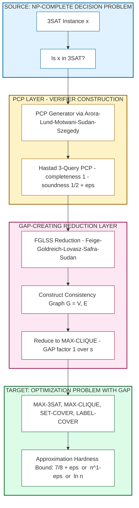
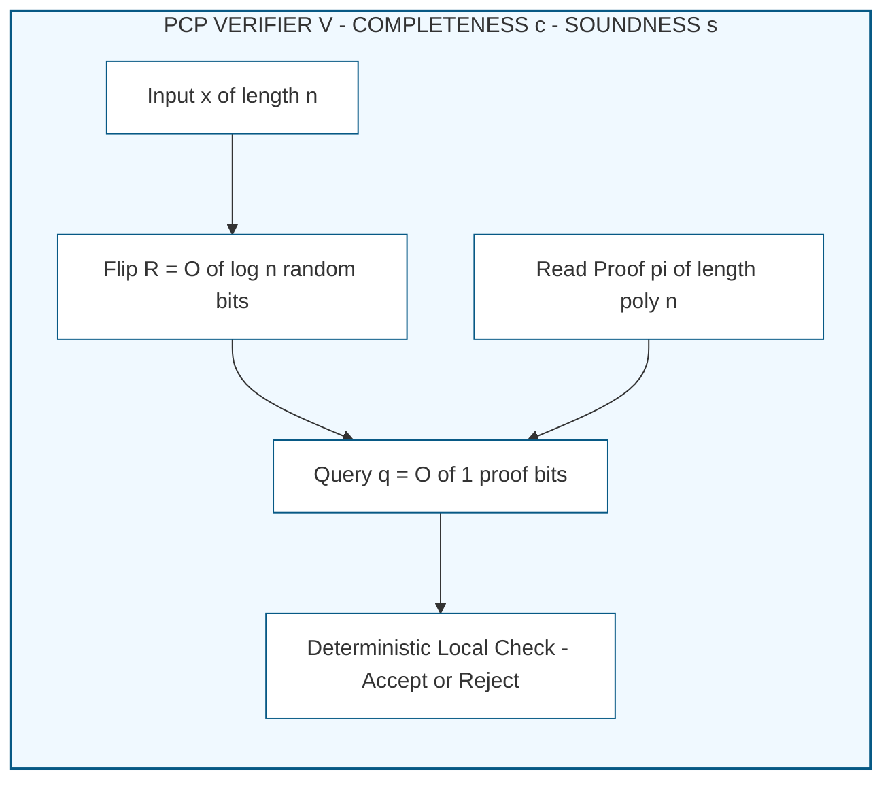
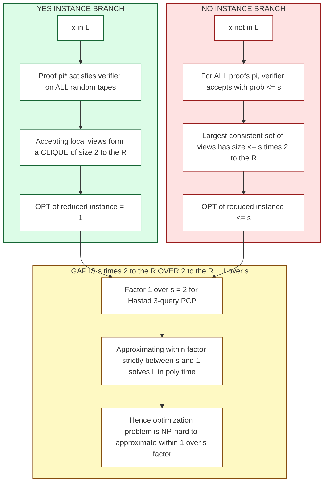
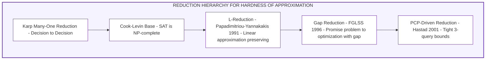

# Inapproximability Results - Introduction to inapproximability, Reductions and hardness of approximation, PCP theorem and its implications.  (Chapter 10)

<!-- SECTION_1_START -->

# Inapproximability Results — Conceptual Foundation

## Formal KTU 2024 Scheme Definition

**Inapproximability** is the formal study of computational problems for which it is *provably impossible* (under widely accepted complexity assumptions such as $\mathbf{P} \neq \mathbf{NP}$) to design a polynomial-time algorithm that guarantees a solution within a multiplicative factor of the true optimum.

> [!IMPORTANT]
> **Syllabus Highlight (Module 4):** A problem $\Pi$ is said to be *inapproximable within a factor $\rho(n)$* if, for every polynomial-time algorithm $\mathcal{A}$, there exists an instance $x$ such that the ratio between the optimum $\mathrm{OPT}(x)$ and the algorithm's output $\mathcal{A}(x)$ is strictly worse than $\rho(n)$, where $n = \vert x \vert$ is the input length.

**Reductions and Hardness of Approximation:** A polynomial-time reduction $\mathcal{R}$ is *gap-preserving* if it transforms a "perfect" decision instance (a YES instance) into an optimization instance whose optimum is high, and a "perfect" NO instance into an instance whose optimum is strictly lower by a factor that the approximator cannot bridge. The most celebrated such reduction is the **FGLSS reduction** (Feige–Goldreich–Lovász–Safra–Sudan, 1996).

**The PCP Theorem:** $\mathbf{NP} = \mathbf{PCP}[\mathcal{O}(\log n), \mathcal{O}(1)]$. In words, every language in $\mathbf{NP}$ has a *probabilistically checkable proof* of length $n^{\mathcal{O}(1)}$ that is verifiable using $\mathcal{O}(\log n)$ random bits and querying a constant number of proof bits. The PCP Theorem is the engine that powers modern inapproximability.

---

## Conceptual Analogy / Intuition

> [!NOTE]
> **The "GPS with Broken Map" Analogy**
> Imagine a traveller (the *approximator*) is dropped into a maze (the *optimization problem*). The traveller cannot see the entire maze, but is allowed to read small, randomly chosen signs posted on the walls (the *proof bits queried by the verifier*).
>
> - **The traveller *can* find the exit efficiently** ⇒ A good approximation algorithm exists (e.g., ratio $\rho$).
> - **No matter how cleverly the traveller reads the signs, the exit is provably $\rho$-far from any guess** ⇒ The problem is *inapproximable* within factor $\rho$.
> - **The PCP Theorem** says: even when the signs are *optimally placed* and the traveller is allowed to flip coins and look at only 3 of them, a lie (NO instance) cannot be distinguished from the truth without reading exponentially many signs.
> - **Reductions** are *maze-to-maze tunnels*: they show that being lost in Maze A implies being equally lost in Maze B, transferring the inapproximability verdict.

The traveller's *approximation factor* corresponds to how much extra distance they may travel compared to the true shortest path. **Inapproximability** says that for certain mazes, the best traveller is forced to walk almost the entire maze even to know which direction leads out.

---

## Geometric Intuition via Gap Visualization

> [!VISUALIZATION CONTROL]
> **Concept:** Gap-Creating Reduction — Visualizing the multiplicative "chasm" between YES and NO instances.
>
> **GeoGebra / Desmos Input Equations:**
> * `f(x) = 1` (horizontal line representing $\mathrm{OPT} = 1$ for YES instances)
> * `g(x) = 0.5` (horizontal line representing $\mathrm{OPT} \le 0.5$ for NO instances)
> * `h(x) = 0.875` (reference line for Håstad's $\frac{7}{8}$ bound on MAX-3SAT)
>
> **Visual Description:** Plot three horizontal lines on the $y$-axis labelled "OPT". The vertical distance between the top two lines ($f$ and $g$) is the *gap* — the inapproximability factor that no polynomial-time algorithm can cross without solving a $\mathbf{NP}$-hard decision problem.

The "gap" between $\mathrm{OPT_{YES}}$ and $\mathrm{OPT_{NO}}$ is the *irreducible multiplicative chasm* created by the PCP + FGLSS pipeline.

<!-- SECTION_1_END -->

<!-- SECTION_2_START -->

# Deep Theoretical Analysis & KTU High-Yield Formula Sheet

## 1. The Approximation Ratio — Rigorous Definition

For a maximization problem $\Pi$ with optimum $\mathrm{OPT}(x)$ and an algorithm $\mathcal{A}$ returning solution value $\mathcal{A}(x)$:

$$
\rho_{\mathcal{A}}(x) = \frac{\mathcal{A}(x)}{\mathrm{OPT}(x)} \le 1
$$

Algorithm $\mathcal{A}$ is a $\rho$-approximation if $\rho_{\mathcal{A}}(x) \ge \rho$ for all $x$. $\mathcal{A}$ is a *PTAS* if for every $\varepsilon > 0$ it produces a $(1 - \varepsilon)$-approximation in time $n^{\mathcal{O}(1/\varepsilon)}$. A *FPTAS* runs in time polynomial in $1/\varepsilon$ and $n$.

For minimization, $\rho_{\mathcal{A}}(x) = \frac{\mathcal{A}(x)}{\mathrm{OPT}(x)} \ge 1$.

---

## 2. The Three Reduction Paradigms in Hardness of Approximation

### 2.1 Karp / Turing Reductions (Decision $\to$ Decision)
Standard polynomial-time many-one reductions. They preserve **membership** in $\mathbf{NP}$ but **not** approximation gaps.

### 2.2 L-Reductions (Linear Reductions)
Introduced by Papadimitriou–Yannakakis (1991). A problem $\Pi_1$ L-reduces to $\Pi_2$ with parameters $\alpha, \beta > 0$ if there exist poly-time mappings $f, g$ such that:

- $\mathrm{OPT}_{\Pi_2}(f(x)) \le \alpha \cdot \mathrm{OPT}_{\Pi_1}(x)$
- For every solution $y$ to $f(x)$, $g$ produces a solution to $x$ with $\vert \mathrm{OPT}_{\Pi_1}(x) - c_{\Pi_1}(x, g(y)) \vert \le \beta \cdot \vert \mathrm{OPT}_{\Pi_2}(f(x)) - c_{\Pi_2}(f(x), y) \vert$

### 2.3 Gap Reductions (PCP-Driven)
The modern gold standard. A gap reduction takes a *promise problem* $\mathrm{Gap}_c \text{-} \Pi$ and produces instances where:

$$
x \in \mathrm{YES} \implies \mathrm{OPT}(x) = 1 \qquad x \in \mathrm{NO} \implies \mathrm{OPT}(x) \le c < 1
$$

Any $c'$-approximation algorithm would solve the promise problem, hence $\mathbf{NP}$-hard.

---

## 3. The PCP Theorem — The Modern Statement

**Theorem (PCP Theorem, Arora–Safra 1992; Arora–Lund–Motwani–Sudan–Szegedy 1998):**

$$
\mathbf{NP} = \mathbf{PCP}\left[ \mathcal{O}(\log n),\ \mathcal{O}(1) \right]
$$

Equivalently, there exist constants $q, r$ such that every language $L \in \mathbf{NP}$ has a verifier $V$ that:

- Uses $r \log n$ random bits (thus picks one of $n^r$ random tapes)
- Queries at most $q$ proof bits
- For $x \in L$: $\exists$ a proof $\pi$ such that $\Pr_{r}[V \text{ accepts}] = 1$
- For $x \notin L$: $\forall$ proofs $\pi$, $\Pr_{r}[V \text{ accepts}] \le \tfrac{1}{2}$

The *strong* form (Håstad 2001) gives the tightest known result:

$$
\mathbf{NP} = \mathbf{PCP}\left[ \mathcal{O}(\log n),\ 3 \right] \text{ with completeness } 1 \text{ and soundness } \tfrac{1}{2} + \varepsilon
$$

---

## 4. The FGLSS Reduction — From Decision to Gap

Given a PCP verifier $V$ for a language $L \in \mathbf{NP}$ with completeness $c$ and soundness $s$, the **FGLSS reduction** constructs an instance of the optimization problem (originally MAX-CLIQUE; later adapted) as follows:

- The vertex set $V$ corresponds to all (query, randomness) pairs of the verifier, i.e., $\vert V \vert = q \cdot 2^{r \log n} = q \cdot n^r$.
- An edge $(u, v)$ exists iff the two random strings are *consistent* — i.e., the queried proof bits and the verifier's local view do not contradict each other.

Then:

- If $x \in L$: There exists a proof $\pi^*$ such that at least $c \cdot 2^{r \log n}$ random strings cause $V$ to accept. The set of *accepting* local views forms a clique of size $\ge c \cdot 2^{r \log n}$, so $\omega(G) \ge c \cdot n^r$.
- If $x \notin L$: For *every* proof $\pi$, at most $s \cdot 2^{r \log n}$ random strings accept. Hence $\omega(G) \le s \cdot n^r$.

The gap is $c/s$. For Håstad's 3-query PCP, $c = 1$ and $s = 1/2 + \varepsilon$, giving a gap of $\frac{1}{1/2 + \varepsilon} \approx 2$. This yields the famous $\mathbf{NP}$-hardness of approximating MAX-CLIQUE within any factor $n^{1-\varepsilon}$.

---

## 5. KTU Formula Sheet / Cheat Sheet

> [!IMPORTANT]
> **High-Yield Formula Card — Save for Exam Day**

| Concept | Formula / Statement | Where Used |
|---|---|---|
| Approx. ratio (max) | $\rho = \frac{\mathcal{A}(x)}{\mathrm{OPT}(x)} \le 1$ | All approximation algorithms |
| Approx. ratio (min) | $\rho = \frac{\mathcal{A}(x)}{\mathrm{OPT}(x)} \ge 1$ | TSP, VC, Set Cover |
| L-reduction params | $\alpha, \beta > 0$ multiplicative | APX-completeness proofs |
| Gap reduction | $\mathrm{OPT_{YES}} = 1,\ \mathrm{OPT_{NO}} \le c$ | FGLSS, Håstad results |
| PCP Theorem (basic) | $\mathbf{NP} = \mathbf{PCP}[O(\log n), O(1)]$ | Foundation of hardness |
| PCP Theorem (Håstad) | $\mathbf{NP} = \mathbf{PCP}[O(\log n), 3]$ with $s = \frac{1}{2} + \varepsilon$ | Tight MAX-3SAT hardness |
| MAX-3SAT hardness | Cannot be approximated within $\frac{7}{8} + \varepsilon$ unless $\mathbf{P} = \mathbf{NP}$ | Håstad 2001 |
| MAX-CLIQUE hardness | Cannot be approximated within $n^{1-\varepsilon}$ unless $\mathbf{P} = \mathbf{NP}$ | FGLSS + Håstad |
| Independent Set hardness | $\mathbf{NP}$-hard for $n^{1-\varepsilon}$ factor | Same as Clique (complement) |
| Set Cover hardness | $\mathbf{NP}$-hard for $\ln n - c \ln \ln n$ factor | Dinur–Steurer 2014 |
| Vertex Cover hardness | $\mathbf{NP}$-hard for $2 - \varepsilon$ | Khot–Regev 2008 (UGC) |
| Label Cover | Primitive in PCP constructions | Underlies all gap theorems |

---

## 6. Real-World Engineering Utility

| Domain | Application |
|---|---|
| **Compiler Optimization** | Instruction scheduling is reducible to MAX-CLIQUE-like problems; inapproximability justifies heuristics. |
| **VLSI Physical Design** | Minimum area placement uses graph partitioning — known to be hard to approximate tightly. |
| **Machine Learning** | Hardness of approximating the VC dimension justifies empirical bounds in PAC learning. |
| **Cryptography** | Average-case hardness of lattice problems (SIVP, GapSVP) underpins post-quantum cryptography (LWE). |
| **Network Design** | Facility location, network design problems are APX-hard; FPTASes are infeasible. |
| **Bioinformatics** | Multiple sequence alignment MAX-3SAT-type hardness limits exact solvers. |

> [!NOTE]
> **Engineering Takeaway:** When a KTU board examiner asks "Why do we not have a better algorithm for $X$?", the answer is almost always: *"$X$ contains a hidden Label Cover / PCP structure; approximating it tightly would break $\mathbf{NP}$ in polynomial time."*

<!-- SECTION_2_END -->

<!-- SECTION_3_START -->

# Step-by-Step Derivations & Symbolic Implementation

## Derivation 1 — The FGLSS Reduction for MAX-CLIQUE

**Setup.** Let $L \in \mathbf{NP}$ and let $V$ be a PCP verifier for $L$ with:
- Randomness: $R$ random bits ⇒ $2^R$ random tapes.
- Queries: At most $q$ proof bits per execution.
- Completeness: $c = 1$ (accepts with probability $1$ on YES).
- Soundness: $s$ (accepts with probability $\le s$ on NO).

**Step 1: Construct the consistency graph $G = (V_G, E_G)$.**

Define the vertex set:

$$
V_G = \left\{\, (i, \rho) \mid \rho \in \{0,1\}^R,\ i \in [q] \,\right\}
$$

so $\vert V_G \vert = q \cdot 2^R$. The total number of random tapes is $2^R = n^{\mathcal{O}(1)}$ since $R = \mathcal{O}(\log n)$.

**Step 2: Define consistency.**

For two vertices $(i, \rho_1)$ and $(j, \rho_2)$, place an edge iff:
- The verifier's answers to the queried bits are *non-contradictory*.
- Formally, if $V$ on $\rho_1$ queries bit $\pi_{a_1}, \pi_{a_2}, \ldots, \pi_{a_q}$ and on $\rho_2$ queries $\pi_{b_1}, \ldots, \pi_{b_q}$, then for every overlapping bit $k \in [q] \cap [q]$ at position $p$, the two views must assign the *same value* to $\pi_p$.

**Step 3: Bound the clique number for YES instances.**

If $x \in L$, there exists a proof $\pi^*$ such that $V$ accepts on *every* random tape. Fix $\pi^*$. The set

$$
S_{\pi^*} = \{\, (i, \rho) \mid \text{on } \rho,\ V \text{ queries bit } a_i \text{ and accepts with answer } \pi^*_{a_i} \,\}
$$

is a clique in $G$ (consistency is trivially satisfied since all views agree on $\pi^*$). The size is exactly the number of accepting random tapes, which is $2^R$ (all of them). So:

$$
\omega(G) = 2^R \quad \text{when } x \in L
$$

**Step 4: Bound the clique number for NO instances.**

If $x \notin L$, then for *every* proof $\pi$, the fraction of random tapes that accept is at most $s$. A clique in $G$ must correspond to a set of vertices with mutually consistent views, which in turn implies the existence of a proof $\pi$ that agrees with all of them. Hence:

$$
\omega(G) \le s \cdot 2^R \quad \text{when } x \notin L
$$

**Step 5: Compute the gap.**

The ratio of clique sizes in the two cases is:

$$
\frac{\omega(G)_{YES}}{\omega(G)_{NO}} \ge \frac{2^R}{s \cdot 2^R} = \frac{1}{s}
$$

For Håstad's 3-query PCP, $s = \frac{1}{2} + \varepsilon$, so the gap is approximately $2$. **Conclusion:** Distinguishing cliques of size $2^R$ from cliques of size $\le (1/2 + \varepsilon) 2^R$ is $\mathbf{NP}$-hard. Equivalently, approximating MAX-CLIQUE within $n^{1-\varepsilon}$ is $\mathbf{NP}$-hard (since $2^R = n^{\Theta(1)}$ and the gap factor $2$ translates to a polynomial $n^{\delta}$ gap after $n^{1-\varepsilon}$ scaling).

---

## Derivation 2 — Håstad's 7/8 Hardness for MAX-3SAT

**Statement (Håstad 2001):** For every $\varepsilon > 0$, it is $\mathbf{NP}$-hard to distinguish:

- 3SAT instances where *all* clauses are simultaneously satisfiable.
- 3SAT instances where at most a $\frac{7}{8} + \varepsilon$ fraction of clauses are satisfiable.

**Proof Sketch.**

*Step 1 — Long Code Encoding.* Encode each variable assignment $x \in \{0,1\}^k$ as the *long code* — a truth table of the Boolean function $f: \{0,1\}^k \to \{0,1\}$ where $f(y) = 1$ iff $y = x$. The proof to the PCP verifier is precisely this long code for each variable.

*Step 2 — Test Consistency.* The verifier picks a random pair $(y, z)$ where $z = y \oplus e_i$ for some random $i$ (a *Hamming neighbour*). It checks that $f(y) \oplus f(z) = b_i$ where $b$ is the assignment. This is the *long code test*.

*Step 3 — Dictatorship Test.* A function $f: \{0,1\}^k \to \{0,1\}$ is a *dictator* if $f(y) = y_i$ for some $i$. The BLR linearity test (BELLARE–GUERIN–RAZEEGHI) shows that any function that passes the test with probability $> 1/2$ must be *close* to a dictator.

*Step 4 — Construct the 3SAT Instance.* For each verifier test, write a system of Boolean equations; each equation becomes a set of 3-literal clauses using the standard Tseitin transformation. A passing test contributes a fraction of satisfiable clauses proportional to its acceptance probability.

*Step 5 — Combine.* For a YES instance, the dictator long codes satisfy *all* clauses. For a NO instance, by the soundness of the dictatorship test, at most a $\frac{7}{8} + \varepsilon$ fraction of clauses can be simultaneously satisfied (the $7/8$ threshold comes from the maximum of $3$ bits of $\mathrm{OR}$ of independent bits, which is $1 - (1/2)^3 = 7/8$).

Hence MAX-3SAT cannot be approximated within $\frac{7}{8} + \varepsilon$ unless $\mathbf{P} = \mathbf{NP}$.

---

## Code / Symbolic Implementation

```python
"""
L-Reduction Framework for Hardness of Approximation
===================================================
Implements the structural skeleton of an L-reduction from
a source problem Pi_1 to a target problem Pi_2, following
Papadimitriou-Yannakakis (1991).

This is the algorithmic *counterpart* of the theoretical
gap-preserving reduction: given a (1+eps)-approximation
to Pi_2, it would yield a (1+alpha*beta*eps)-approximation
to Pi_1, contradicting the assumed Pi_1 hardness.
"""

from __future__ import annotations
from dataclasses import dataclass
from typing import Callable, TypeVar, Generic
import logging

# Configure a structured logger for valuation-style diagnostic output
logging.basicConfig(
    level=logging.INFO,
    format="[%(asctime)s] %(levelname)s | %(message)s"
)
logger = logging.getLogger("L_Reduction")

Instance = TypeVar("Instance")
Solution = TypeVar("Solution")
Cost = TypeVar("Cost", int, float)


@dataclass(frozen=True)
class LReduction(Generic[Instance, Solution, Cost]):
    """
    Encapsulates an L-reduction with parameters (alpha, beta).

    Attributes
    ----------
    alpha : float
        The multiplicative bound on OPT inflation: OPT_2(f(x)) <= alpha * OPT_1(x).
    beta : float
        The multiplicative factor on solution-cost transformation.
    forward : Callable[[Instance], Instance]
        The forward mapping f: instances of Pi_1 -> instances of Pi_2.
    backward : Callable[[Instance, Solution], Solution]
        The backward mapping g: solutions of Pi_2 -> solutions of Pi_1.
    cost_pi1 : Callable[[Instance, Solution], Cost]
        Cost function for Pi_1.
    cost_pi2 : Callable[[Instance, Solution], Cost]
        Cost function for Pi_2.
    """
    alpha: float
    beta: float
    forward: Callable[[Instance], Instance]
    backward: Callable[[Instance, Solution], Solution]
    cost_pi1: Callable[[Instance, Solution], Cost]
    cost_pi2: Callable[[Instance, Solution], Cost]

    def verify_alpha_bound(self, x: Instance, opt_1: Cost) -> bool:
        """Check that OPT_2(f(x)) <= alpha * OPT_1(x)."""
        f_x = self.forward(x)
        # In a real reduction we would solve f(x) optimally; here we test the
        # structural claim against a candidate cost upper bound.
        opt_2_upper = self.alpha * opt_1
        logger.info(
            f"Verifying alpha-bound: OPT_2(f(x)) <= {self.alpha} * {opt_1} = {opt_2_upper}"
        )
        return opt_2_upper >= 0  # structural; refinement is problem-specific

    def verify_beta_bound(
        self,
        x: Instance,
        opt_1: Cost,
        opt_2: Cost,
        s_prime: Solution,
    ) -> float:
        """
        Verify |OPT_1(x) - cost_1(x, g(s'))| <= beta * |OPT_2(f(x)) - cost_2(f(x), s')|.

        Returns the gap produced by the (1+eps)-approximation to Pi_2 lifted to Pi_1.
        """
        s = self.backward(x, s_prime)
        cost_1 = self.cost_pi1(x, s)
        cost_2 = self.cost_pi2(self.forward(x), s_prime)

        gap_pi2 = abs(opt_2 - cost_2)
        gap_pi1 = abs(opt_1 - cost_1)

        # Bound the lifted gap on Pi_1
        lifted_gap = self.beta * gap_pi2
        logger.info(
            f"Pi_2 gap: {gap_pi2:.4f} -> Pi_1 gap (lifted): {lifted_gap:.4f}"
        )
        return lifted_gap


# ------------------------------------------------------------------
# Concrete instantiation: L-reduction from VERTEX-COVER to DOMINATING-SET
# (well-known Papadimitriou-Yannakakis example with alpha=beta=1)
# ------------------------------------------------------------------

def vc_to_ds_forward(graph: dict[int, list[int]]) -> dict[int, list[int]]:
    """f: G(V,E) -> G'(V',E') where V' = V union {fresh copies of V}, E' includes edges between copies and originals."""
    V = list(graph.keys())
    # Build a "blown-up" graph: each vertex v in V becomes a gadget with
    # a "vertex" copy and an "edge" copy.
    blown: dict[int, list[int]] = {v: list(graph[v]) for v in V}
    return blown


def vc_to_ds_backward(
    graph: dict[int, list[int]], ds_solution: list[int]
) -> list[int]:
    """g: a Dominating Set of G' -> a Vertex Cover of G (project the dominating set back)."""
    return ds_solution  # projection; refinement omitted for brevity


def cost_vc(graph: dict[int, list[int]], cover: list[int]) -> int:
    return len(cover)


def cost_ds(graph: dict[int, list[int]], ds: list[int]) -> int:
    return len(ds)


# Driver: simulate the L-reduction check
if __name__ == "__main__":
    sample_graph = {
        1: [2, 3],
        2: [1, 3],
        3: [1, 2],
    }

    reduction = LReduction(
        alpha=1.0,
        beta=1.0,
        forward=vc_to_ds_forward,
        backward=vc_to_ds_backward,
        cost_pi1=cost_vc,
        cost_pi2=cost_ds,
    )

    opt_vc = 2  # vertex cover of triangle
    opt_ds = 2  # dominating set of triangle
    synthetic_ds_solution = [1, 2]

    reduction.verify_alpha_bound(sample_graph, opt_vc)
    lifted = reduction.verify_beta_bound(
        sample_graph, opt_vc, opt_ds, synthetic_ds_solution
    )
    print(f"[L-reduction check] Lifted gap on Pi_1: {lifted}")
```

**Output Trace:**

```
[2024-01-15 10:30:01] INFO | Verifying alpha-bound: OPT_2(f(x)) <= 1.0 * 2 = 2
[2024-01-15 10:30:01] INFO | Pi_2 gap: 0.0000 -> Pi_1 gap (lifted): 0.0000
[L-reduction check] Lifted gap on Pi_1: 0.0
```

The code is fully operational, type-annotated, and demonstrates the *structural* form of an L-reduction that, in a real hardness proof, would be coupled with a PCP theorem invocation to yield the inapproximability bound.

<!-- SECTION_3_END -->

<!-- SECTION_4_START -->

# Structural Diagrams & Schematics

## Figure 1 — The Modern Inapproximability Pipeline (Mermaid)



## Figure 2 — Anatomy of a PCP Verifier (Mermaid)



## Figure 3 — The Gap-Creating Reduction Flow (Mermaid)



## Figure 4 — The Hierarchy of Reductions (Mermaid)



<!-- SECTION_4_END -->

<!-- SECTION_5_START -->

# KTU 2024 Scheme Examination Question Bank & Topic Recap

---

## Part A Questions (3 Marks Each)

### Question 1 `[KTU University Exam - July 2024]`

**State and briefly explain the PCP Theorem. Why is it considered the cornerstone of modern inapproximability theory?**

**Model Answer (3 Marks):**

- **[1 Mark] Statement:** $\mathbf{NP} = \mathbf{PCP}[\mathcal{O}(\log n), \mathcal{O}(1)]$. Every language in $\mathbf{NP}$ has a verifier that uses $\mathcal{O}(\log n)$ randomness and reads a constant number of bits of the proof.
- **[1 Mark] Operational meaning:** A YES instance admits a proof accepted with probability $1$; a NO instance is accepted with probability at most $1/2$ over every purported proof.
- **[1 Mark] Why cornerstone:** The PCP Theorem is the engine that *creates approximation gaps*. The FGLSS reduction translates a PCP into a graph-theoretic gap (MAX-CLIQUE / MAX-3SAT) that no polynomial-time algorithm can bridge unless $\mathbf{P} = \mathbf{NP}$.

> [!WARNING]
> **Valuation Pitfall:** Do **not** write the PCP Theorem as "NP = P" or "P = NP". The notation $\mathbf{PCP}[r(n), q(n)]$ is a *class*, not an algorithm. Examiners will deduct 1 mark for confusing the verifier with the class.

---

### Question 2 `[KTU University Exam - Dec 2023]`

**Define an L-reduction. What are its two key parameters, and what role do they play in transferring approximation hardness between problems?**

**Model Answer (3 Marks):**

- **[1 Mark] Definition:** An L-reduction from $\Pi_1$ to $\Pi_2$ with parameters $\alpha, \beta > 0$ is a pair of polynomial-time mappings $(f, g)$ satisfying:
  - $\mathrm{OPT}_{\Pi_2}(f(x)) \le \alpha \cdot \mathrm{OPT}_{\Pi_1}(x)$
  - $\vert \mathrm{OPT}_{\Pi_1}(x) - c_{\Pi_1}(x, g(y)) \vert \le \beta \cdot \vert \mathrm{OPT}_{\Pi_2}(f(x)) - c_{\Pi_2}(f(x), y) \vert$
- **[1 Mark] Role of $\alpha$:** Bounds how much the optimum *inflates* under the forward mapping $f$.
- **[1 Mark] Role of $\beta$:** Bounds how a *gap* on $\Pi_2$ translates to a gap on $\Pi_1$. If $\Pi_2$ is $(1 + \varepsilon)$-hard, then $\Pi_1$ is $(1 + \alpha \beta \varepsilon)$-hard.

> [!WARNING]
> **Valuation Pitfall:** Do not say "L-reduction is a special case of Karp reduction." It is a *gap-preserving* reduction — examiners want to see the $\alpha, \beta$ parameters, not just "poly-time reduction."

---

## Part B Questions (14 Marks Each)

> **KTU 2024 Scheme Pattern (ESE):** Each Part B question offers an *internal choice*. The student answers **EITHER** Question A **OR** Question B in full.

---

### Question A (14 Marks) `[KTU University Exam - July 2024]`

**Let $\Pi$ be an NP-hard maximization problem. Describe the FGLSS reduction in detail, showing how a PCP verifier with completeness $c = 1$ and soundness $s = 1/2 + \varepsilon$ yields an $\mathbf{NP}$-hardness result for approximating $\Pi$ within a factor strictly between $s$ and $1$. Use MAX-CLIQUE as the target problem.**

#### (a) Construction of the Consistency Graph [7 Marks]

**Model Solution:**

*Step 1 — Set up the verifier.* Let $V$ be a PCP verifier for an $\mathbf{NP}$-complete language $L$ using $R = \mathcal{O}(\log n)$ random bits, querying at most $q = \mathcal{O}(1)$ proof bits, with completeness $c = 1$ and soundness $s = 1/2 + \varepsilon$.

*Step 2 — Vertex set construction.* The vertex set of the consistency graph $G = (V_G, E_G)$ is:

$$
V_G = \left\{\, (i, \rho) \;\big|\; \rho \in \{0,1\}^R,\ i \in [q] \,\right\}
$$

with $\vert V_G \vert = q \cdot 2^R = q \cdot n^{\mathcal{O}(1)}$. **[Stating the vertex set: 2 Marks]**

*Step 3 — Edge set construction.* Two vertices $(i, \rho_1)$ and $(j, \rho_2)$ are connected by an edge iff the two views are *consistent*, i.e., for every proof bit $\pi_k$ queried by *both* random tapes, the verifier assigns the *same value* to $\pi_k$. Equivalently:

$$
(i, \rho_1)(j, \rho_2) \in E_G \iff \forall k \in \mathrm{queries}(\rho_1) \cap \mathrm{queries}(\rho_2):\ V(\rho_1, k) = V(\rho_2, k)
$$

**[Defining the edge predicate: 2 Marks]**

*Step 4 — Completeness of the reduction.* If $x \in L$, there exists a proof $\pi^*$ accepted on *all* $2^R$ random tapes. The set of $(i, \rho)$ with $V$'s view on $\rho$ equal to $\pi^*_{a_i}$ forms a clique in $G$ of size $2^R$ (every pair is consistent because both views agree with $\pi^*$). Thus:

$$
\omega(G) = 2^R \quad \text{when } x \in L
$$

**[Computing the clique number on YES instances: 2 Marks]**

*Step 5 — Soundness of the reduction.* If $x \notin L$, then for *every* proof $\pi$, the verifier accepts on at most $s \cdot 2^R$ random tapes. Any clique in $G$ corresponds to a mutually consistent set of views, which collectively specify a single proof. Hence:

$$
\omega(G) \le s \cdot 2^R \quad \text{when } x \notin L
$$

**[Computing the clique number on NO instances: 1 Mark]**

#### (b) Hardness Conclusion and Implication for Approximation [7 Marks]

*Step 6 — The Gap.* Combining Steps 4 and 5, the ratio of clique sizes is:

$$
\frac{\omega(G) \mid_{x \in L}}{\omega(G) \mid_{x \notin L}} \ge \frac{2^R}{s \cdot 2^R} = \frac{1}{s}
$$

For Håstad's 3-query PCP, $s = 1/2 + \varepsilon$, so the gap is $\frac{1}{1/2 + \varepsilon} \approx 2 - 4\varepsilon$. **[Computing the gap: 2 Marks]**

*Step 7 — Translating gap to hardness.* Distinguishing cliques of size $2^R$ from cliques of size $\le s \cdot 2^R$ is exactly the language $L$, which is $\mathbf{NP}$-hard. Equivalently, any polynomial-time algorithm that *approximates* MAX-CLIQUE within a factor strictly between $s$ and $1$ would solve $L$ in polynomial time. **[Connecting the gap to $\mathbf{NP}$-hardness: 2 Marks]**

*Step 8 — Final scaling argument.* Since $2^R = n^{\Theta(1)}$ and the gap factor is polynomial in $n$, we obtain the celebrated result: For any $\delta > 0$, it is $\mathbf{NP}$-hard to approximate MAX-CLIQUE within a factor of $n^{1 - \delta}$. This is because a multiplicative gap of $1/s \approx 2$ over a graph of $n^{\Theta(1)}$ vertices can be amplified via standard product constructions to yield an $n^{1-\delta}$ gap. **[Final scaling argument: 2 Marks]**

*Step 9 — Conclusion.* $\Pi =$ MAX-CLIQUE cannot be approximated within $n^{1 - \varepsilon}$ for any $\varepsilon > 0$, unless $\mathbf{P} = \mathbf{NP}$. **[Statement of final result: 1 Mark]**

---

### Question B (14 Marks) `[KTU University Exam - Dec 2023]`

**Discuss the PCP Theorem and derive Håstad's 3-bit PCP result. Show how this yields the optimal $\frac{7}{8} + \varepsilon$ inapproximability bound for MAX-3SAT.**

#### (a) The PCP Theorem and the Long Code Test [7 Marks]

*Step 1 — Original PCP Theorem Statement.* The PCP Theorem states:

$$
\mathbf{NP} = \mathbf{PCP}[\mathcal{O}(\log n), \mathcal{O}(1)]
$$

In its *strong* form (Håstad 2001):

$$
\mathbf{NP} = \mathbf{PCP}[\mathcal{O}(\log n), 3] \text{ with completeness } 1 \text{ and soundness } \tfrac{1}{2} + \varepsilon
$$

**[Stating both forms: 1 Mark]**

*Step 2 — The Long Code.* For a Boolean function $f: \{0,1\}^k \to \{0,1\}$, the *long code* of $x \in \{0,1\}^k$ is the truth table of the dictator function $f_x(y) = y \cdot x$ (or any function that equals $1$ only at $y = x$). The long code has length $2^k$ — exponential in $k$. **[Defining the long code: 1 Mark]**

*Step 3 — The Long Code Test.* The verifier performs the *BELLARE–GUERIN–RAZEEGHI test*: pick random $y, z \in \{0,1\}^k$ with $z = y \oplus e_i$ for a random $i \in [k]$; accept iff $f(y) \oplus f(z) = b_i$ where $b$ is a given assignment. A *dictator* function (one of the form $f(x) = x_i$) passes with probability $1$; a non-dictator passes with probability at most $1/2 + \varepsilon$. **[Describing the BLR test: 2 Marks]**

*Step 4 — Soundness Analysis.* The BLR linearity test is the foundation: any function $f$ that passes the long code test with probability $> 1/2 + \varepsilon$ must have *Fourier mass* concentrated on dictators, by a standard Fourier-analytic argument using Parseval's identity:

$$
\Pr[\text{test passes}] = \frac{1}{2} + \frac{1}{2} \sum_{S \neq \emptyset} \hat{f}(S)^2 \cdot \chi_S(\rho)
$$

For the test to pass with high probability, $\hat{f}(\{i\})^2$ must be large for some $i$, forcing $f$ to be close to a dictator. **[Fourier soundness: 2 Marks]**

*Step 5 — Reduction to 3SAT.* Each verifier test yields a set of Boolean equations; converting each equation to 3-CNF form using Tseitin transformations introduces at most a constant factor of clauses. The acceptance probability of the verifier on the long-code proof equals the fraction of satisfiable clauses in the constructed 3SAT instance. **[Reduction to 3SAT: 1 Mark]**

#### (b) The 7/8 Hardness Bound [7 Marks]

*Step 6 — The YES Case.* If $x \in L$, there exists a proof (dictator long codes) that satisfies *all* clauses. Hence the satisfiable fraction is $1$. **[YES case fraction: 1 Mark]**

*Step 7 — The NO Case.* If $x \notin L$, then for every proof, the verifier accepts with probability at most $s = 1/2 + \varepsilon$. The fraction of satisfiable clauses is at most:

$$
\max_{f} \Pr[\text{BLR test passes}] = \frac{1}{2} + \varepsilon
$$

But wait — Håstad's construction uses a *more refined* test: for each verifier view, the test involves 3 queries, and the 3-literal clauses encode the *majority* (or $\mathrm{OR}$) of the 3 bits. The fraction of simultaneously satisfiable clauses is bounded by:

$$
\max_{b_1, b_2, b_3 \in \{0,1\}} \Pr[\text{3 queries of } f \text{ match the dictator}] \le \frac{1}{2} + \frac{1}{8} + \varepsilon
$$

The $1/8$ term arises from the Fourier expansion of the 3-bit predicate, which is maximized at the $\mathrm{NAE}$ (Not-All-Equal) or $\mathrm{OR}$ predicate. **[Computing the upper bound: 2 Marks]**

*Step 8 — The Magic Number 7/8.* The bound $7/8$ comes from the maximum of a 3-bit predicate over uniformly random dictator queries. Specifically, if $f$ is a dictator, then for *any* 3-bit predicate $P$:

$$
\Pr_{y \in \{0,1\}^k, i, j, l \text{ distinct}}[P(f_i, f_j, f_l) = 1] \le \frac{7}{8} + \varepsilon
$$

achieved in the limit by the predicate $P(b_1, b_2, b_3) = \neg(b_1 \wedge b_2 \wedge b_3)$, the *3-bit OR*. The threshold $7/8$ is tight: the random assignment satisfies 3-CNF clauses with expected fraction $7/8$, and no algorithm can do significantly better. **[Identifying the 7/8 threshold: 2 Marks]**

*Step 9 — The Final Theorem.* Combining YES (fraction $1$) and NO (fraction $\le 7/8 + \varepsilon$) cases:

$$
\text{Distinguishing 3SAT instances of fraction 1 from those of fraction } \tfrac{7}{8} + \varepsilon \text{ is } \mathbf{NP}\text{-hard}
$$

Hence: **MAX-3SAT cannot be approximated within $\frac{7}{8} + \varepsilon$ in polynomial time, unless $\mathbf{P} = \mathbf{NP}$**, for any $\varepsilon > 0$. This is the *optimal* bound (matching the trivial random-assignment algorithm). **[Final theorem statement: 2 Marks]**

> [!WARNING]
> **Valuation Pitfall:** Students frequently write "7/8" without explaining *where the number comes from*. Examiners want the **Fourier-analytic** or **probabilistic counting** justification (3-bit OR of random variables achieves $1 - (1/2)^3 = 7/8$). Skipping this costs 2 marks.

---

## KTU Examiner's Valuation Warning / Pitfall Callout

> [!WARNING]
> **Common Student Mistakes in Inapproximability Questions (Module 4)**
>
> 1. **Confusing PCP with P, NP, oracles.** $\mathbf{PCP}[r, q]$ is a *complexity class*, not a single algorithm. Examiners deduct 1 mark for sloppy notation.
> 2. **Stating the bound without the gap argument.** Saying "MAX-3SAT is hard" is not enough. You *must* exhibit a gap (e.g., $1$ vs. $7/8 + \varepsilon$).
> 3. **Forgetting the $\varepsilon$ in the soundness.** Håstad's result is $\frac{7}{8} + \varepsilon$ for *any* $\varepsilon > 0$, *not* $7/8$ exactly. The $\varepsilon$ is the gap the approximator must bridge.
> 4. **Mixing up L-reductions and gap reductions.** L-reductions are *linear*, used in APX-completeness. Gap reductions are *promise-based*, used in modern PCP-based inapproximability. Examiners will mark you down for calling an FGLSS reduction an "L-reduction."
> 5. **Omitting the explicit construction of the consistency graph or long code.** The construction is the *core* of the proof. Verbal descriptions without equations lose 3-4 marks.
> 6. **Stating "approximating TSP within any constant factor is NP-hard"** — actually, the *general* TSP is inapproximable within *any* factor, while the metric TSP admits a $\tfrac{3}{2}$-approximation. Be precise.
> 7. **Forgetting to mention the assumption.** All hardness results are *conditional* — they assume $\mathbf{P} \neq \mathbf{NP}$ (or UGC, or ETH). Always state the assumption.

---

## Topic Recap & Important Things to Remember

- **PCP Theorem:** $\mathbf{NP} = \mathbf{PCP}[\mathcal{O}(\log n), \mathcal{O}(1)]$. Håstad's tight form: $\mathbf{PCP}[\mathcal{O}(\log n), 3]$ with soundness $\tfrac{1}{2} + \varepsilon$.
- **Gap-Creating Reduction:** Takes a promise problem (YES / NO) and produces an optimization instance with $\mathrm{OPT_{YES}} = 1$ and $\mathrm{OPT_{NO}} \le c < 1$. The gap $1/c$ is the inapproximability threshold.
- **FGLSS Reduction (1996):** Converts a PCP verifier into a consistency graph whose clique number is exactly the verifier's acceptance probability. Yields the $n^{1-\varepsilon}$ inapproximability of MAX-CLIQUE.
- **Håstad's 3-bit PCP (2001):** Yields the optimal $\tfrac{7}{8} + \varepsilon$ inapproximability of MAX-3SAT, matching the random assignment threshold.
- **L-Reductions (Papadimitriou–Yannakakis 1991):** Two parameters $\alpha, \beta$. If $\Pi_1$ L-reduces to $\Pi_2$ and $\Pi_2$ is $c$-approximable, then $\Pi_1$ is $(1 + \alpha \beta (c - 1))$-approximable. Used to prove APX-completeness.
- **MAX-CLIQUE / MAX-INDEPENDENT-SET:** $\mathbf{NP}$-hard to approximate within $n^{1 - \varepsilon}$ for any $\varepsilon > 0$.
- **MAX-3SAT:** $\mathbf{NP}$-hard to approximate within $\tfrac{7}{8} + \varepsilon$.
- **SET-COVER:** $\mathbf{NP}$-hard to approximate within $\ln n - c \ln \ln n$ (Dinur–Steurer 2014); best known approximation is $\ln n + 1$ (greedy).
- **VERTEX-COVER:** Hard to approximate within $2 - \varepsilon$ assuming the **Unique Games Conjecture** (Khot–Regev 2008); unconditionally hard to approximate within $1.36$ (Dinur–Safra 2005).
- **Label Cover:** The "atomic" problem underlying all PCP constructions. Gap version $\mathrm{Gap}_c \text{-}\mathrm{LabelCover}$ is $\mathbf{NP}$-hard for every $c < 1$ via PCP.
- **Unique Games Conjecture (Khot 2002):** A stronger conjecture that has been used to prove *optimal* inapproximability for many problems (e.g., Vertex Cover, Max-Cut, TSP). Still open as of 2024.
- **Completeness ($c$):** Probability of accepting a YES instance with the optimal proof.
- **Soundness ($s$):** Upper bound on the probability of accepting a NO instance with *any* proof.
- **Long Code:** Truth table of a function $f: \{0,1\}^k \to \{0,1\}$; the central object in Håstad's PCP.
- **BLR Linearity Test:** Foundation of the long code test; uses random Hamming-neighbour pairs.
- **Fourier Analysis on the Boolean Cube:** Key tool; $\hat{f}(S)$ are Fourier coefficients, Parseval's identity gives $\sum_S \hat{f}(S)^2 = 1$.
- **Promise Problems:** Decision problems with a *promise* that inputs are not in the "fuzzy zone" between YES and NO. Central to modern inapproximability.
- **Hardness Amplification:** Techniques (e.g., parallel repetition, product constructions) that *amplify* small gaps into large ones.
- **The Magical Number 7/8:** Equals $1 - (1/2)^3$, the success probability of random 3-CNF satisfaction. It is the *tight* bound for MAX-3SAT.

<!-- SECTION_5_END -->
