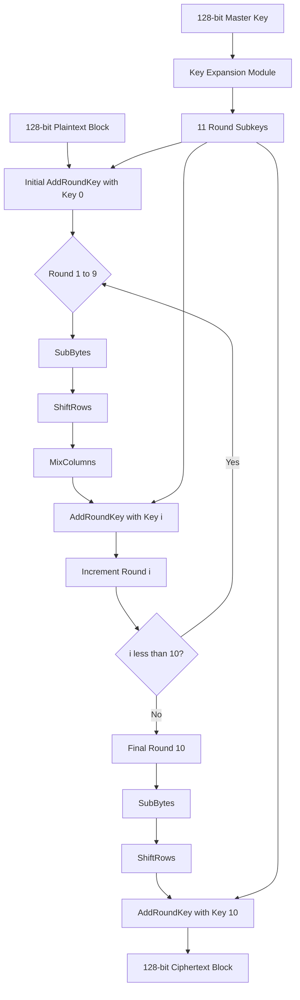
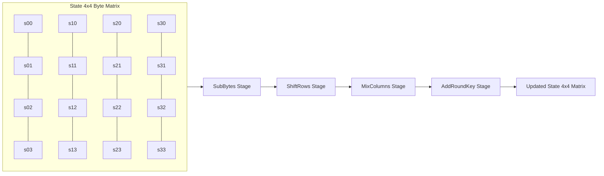
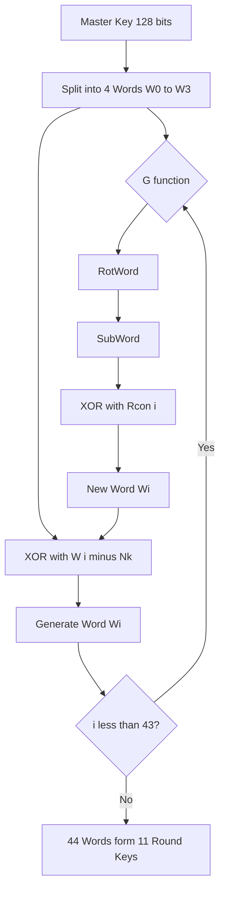
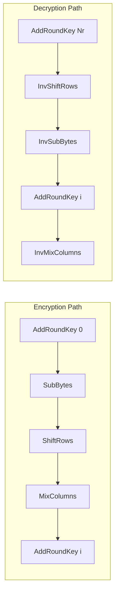
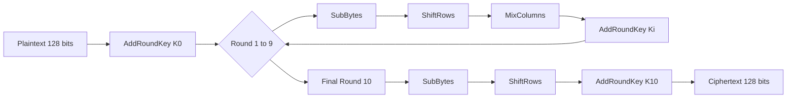

# Advanced Encryption Standard (AES)

<!-- SECTION_1_START -->
# Advanced Encryption Standard (AES) — KTU 2024 Module 1

## 1.1 Formal Academic Definition

The **Advanced Encryption Standard (AES)** is a symmetric-key block cipher standardized by the **National Institute of Standards and Technology (NIST)** in **FIPS PUB 197** (November 2001). It operates on **128-bit data blocks** and supports three standardized key lengths: **128 bits**, **192 bits**, and **256 bits** — yielding versions **AES-128**, **AES-192**, and **AES-256** respectively. AES is a **substitution–permutation network (SPN)** built upon the **Rijndael algorithm** designed by Belgian cryptographers **Joan Daemen** and **Vincent Rijmen**.

> [!IMPORTANT]
> **KTU 2024 Syllabus Highlight — PECST74A Module 1**
> AES is the *de facto* world standard for symmetric block encryption (e.g., TLS 1.3, IPSec, disk encryption). The RBT weightage typically maps to **CO1 (Understand)** and **CO2 (Apply)**.

| AES Variant | Key Size (bits) | Block Size (bits) | Rounds ($N_r$) |
| :---: | :---: | :---: | :---: |
| **AES-128** | 128 | 128 | **10** |
| **AES-192** | 192 | 128 | **12** |
| **AES-256** | 256 | 128 | **14** |

> [!NOTE]
> **State Terminology:** AES internally arranges the 128-bit input block into a $4 \times 4$ matrix of bytes called the **State**, where each cell holds one byte ($8$ bits $\Rightarrow 16$ bytes total). All round transformations operate on this State matrix.

---

## 1.2 Conceptual Analogy / Intuition

Think of AES as a **scrambling safe with 10 to 14 mechanical wheels**:

1. You place a sheet of paper (the **plaintext block**) inside a $4 \times 4$ grid frame.
2. Each "round" rotates the grid, replaces symbols using a codebook (**S-Box**), mixes the rows, and finally sprinkles a unique powder (**round key**) derived from your master key.
3. After all rounds, the paper looks like complete gibberish — but only someone with the **same master key** can reverse the exact same sequence of operations to retrieve the original.

> [!TIP]
> **Real-World Mapping:**
> - **Plaintext Block** = 16-byte message chunk
> - **Master Key** = the 16/24/32-byte secret
> - **Round Keys** = 11/13/15 sub-keys generated via **Key Expansion**
> - **State** = the working $4 \times 4$ byte matrix
> - **Ciphertext** = the scrambled final State

---

## 1.3 Visualizing AES State Transformation

> [!VISUALIZATION CONTROL]
> **Concept:** The $4 \times 4$ AES State Matrix layout from plaintext bytes $b_0, b_1, \ldots, b_{15}$.
> **Coordinate Plane Setup (Geometric Intuition):**
> * Let the horizontal axis represent **byte column index** ($j = 0, 1, 2, 3$)
> * Let the vertical axis represent **byte row index** ($i = 0, 1, 2, 3$)
> * Cell $(i, j) = b_{4j + i}$ where $b_0$ is the most significant byte
>
> **Visual Description:** A 4-by-4 grid filled column-by-column with the 16 plaintext bytes. Each transformation layer (SubBytes, ShiftRows, MixColumns, AddRoundKey) modifies the contents of this grid in a mathematically invertible way.

$$
\text{State} = 
\begin{bmatrix}
b_0 & b_4 & b_8 & b_{12} \\
b_1 & b_5 & b_9 & b_{13} \\
b_2 & b_6 & b_{10} & b_{14} \\
b_3 & b_7 & b_{11} & b_{15}
\end{bmatrix}
$$
<!-- SECTION_1_END -->

<!-- SECTION_2_START -->
# 2. Deep Theoretical Analysis & KTU High-Yield Formula Sheet

## 2.1 The Four AES Round Transformations

Every AES round (except the final round) applies **four invertible transformations** in a fixed sequence:

| Step | Transformation | Operation Type | Operates On |
| :---: | :--- | :--- | :--- |
| 1 | **SubBytes (SB)** | Non-linear byte substitution via S-Box | Individual bytes |
| 2 | **ShiftRows (SR)** | Cyclic left rotation of row bytes | Row-wise permutation |
| 3 | **MixColumns (MC)** | Linear mixing over $GF(2^8)$ | Column-wise matrix multiply |
| 4 | **AddRoundKey (ARK)** | XOR with the round subkey | Entire State |

> [!IMPORTANT]
> The **final round ($N_r$-th round)** **omits** the MixColumns step. The **initial round (round 0)** is simply a single **AddRoundKey** with the original master key.

---

### 2.1.1 SubBytes Transformation

SubBytes applies a fixed **$16 \times 16$ lookup table (S-Box)** to each of the 16 State bytes. The S-Box entry for input byte $x$ is computed as:

$$
S(x) = A \cdot x^{-1} \oplus c
$$

where:
- $x^{-1}$ is the **multiplicative inverse** in the finite field $GF(2^8)$ with the irreducible polynomial $m(x) = x^8 + x^4 + x^3 + x + 1$
- $A$ is a fixed $8 \times 8$ binary matrix
- $c = \texttt{63}_x$ is a constant vector

> [!NOTE]
> If the input byte is $\texttt{00}$, the inverse is defined as $\texttt{00}$ (to keep the operation bijective).

---

### 2.1.2 ShiftRows Transformation

Each row of the State is cyclically shifted left by an offset equal to the row index:

$$
\text{Row } i \text{ is rotated left by } i \text{ byte positions}, \quad i \in \{0, 1, 2, 3\}
$$

| Row Index | Shift Amount (Left) |
| :---: | :---: |
| 0 | 0 (no shift) |
| 1 | 1 |
| 2 | 2 |
| 3 | 3 |

---

### 2.1.3 MixColumns Transformation

Each column $\mathbf{c}$ of the State is multiplied by a fixed $4 \times 4$ matrix over $GF(2^8)$:

$$
\begin{bmatrix}
c'_0 \\
c'_1 \\
c'_2 \\
c'_3
\end{bmatrix}
=
\begin{bmatrix}
02 & 03 & 01 & 01 \\
01 & 02 & 03 & 01 \\
01 & 01 & 02 & 03 \\
03 & 01 & 01 & 02
\end{bmatrix}
\cdot
\begin{bmatrix}
c_0 \\
c_1 \\
c_2 \\
c_3
\end{bmatrix}
\pmod{m(x)}
$$

Multiplication by `02` and `03` in $GF(2^8)$ uses **xtime()** — a fast shift-and-XOR operation.

---

### 2.1.4 AddRoundKey Transformation

The 128-bit round key is XORed byte-wise with the State:

$$
\text{State}_{\text{new}} = \text{State}_{\text{old}} \oplus \text{RoundKey}_i
$$

where $\text{RoundKey}_i$ is the $i$-th 128-bit segment of the **expanded key schedule**.

---

## 2.2 AES Key Expansion (Key Schedule)

The **Key Expansion** routine generates $N_r + 1$ round keys (each 128 bits) from the master key using:
1. **RotWord()** — cyclic left shift of a 4-byte word
2. **SubWord()** — apply S-Box to each of the 4 bytes
3. **Rcon (Round Constant)** — XOR with a round-dependent constant

The recurrence relations (using 32-bit words $W[i]$):

$$
W[i] = 
\begin{cases}
\text{master key words}, & 0 \le i \le N_k - 1 \\
W[i - N_k] \oplus \text{SubWord}(\text{RotWord}(W[i-1])) \oplus \text{Rcon}[i/N_k], & i \equiv 0 \pmod{N_k} \text{ and } N_k > 6 \\
W[i - N_k] \oplus \text{SubWord}(\text{RotWord}(W[i-1])), & i \equiv 0 \pmod{N_k} \text{ and } N_k \le 6 \\
W[i - N_k] \oplus W[i-1], & \text{otherwise}
\end{cases}
$$

where $N_k = 4, 6, 8$ for AES-128, AES-192, AES-256 respectively.

---

## 2.3 KTU High-Yield Formula Cheat Sheet

> [!IMPORTANT]
> **Master these formulas and constants for the KTU board exam.**

| Symbol / Term | Definition | Value / Formula |
| :--- | :--- | :--- |
| Block size | Fixed AES data block | **128 bits (16 bytes)** |
| $N_b$ | Number of 32-bit words per block | **4** |
| $N_k$ | Number of 32-bit words in key | **4 / 6 / 8** |
| $N_r$ | Number of rounds | **10 / 12 / 14** |
| Total round keys | $N_r + 1$ | **11 / 13 / 15** |
| Expanded key size | $4 \cdot N_b \cdot (N_r + 1)$ bytes | **176 / 208 / 240** bytes |
| Irreducible polynomial | $GF(2^8)$ modulus | $x^8 + x^4 + x^3 + x + 1$ |
| S-Box affine constant $c$ | Hex vector | $\texttt{63}$ |
| Inverse S-Box | Decryption lookup | $(A \cdot x^{-1} \oplus c)^{-1}$ |
| Rcon$[i]$ | Round constant word $i$ | $(RC[i], 0, 0, 0)$ where $RC[1]=\texttt{01}$, $RC[i]=02 \cdot RC[i-1]$ |
| xtime$(a)$ | Multiply by `02` in $GF(2^8)$ | $(a \ll 1) \oplus \texttt{1B}$ if MSB=1; else $a \ll 1$ |

---

## 2.4 Real-World Engineering Utility of AES

| Domain | AES Application |
| :--- | :--- |
| **Network Security** | TLS 1.3 cipher suites (e.g., `TLS_AES_256_GCM_SHA384`) |
| **Storage Security** | BitLocker (Windows), FileVault (macOS), LUKS (Linux) |
| **Wireless Security** | WPA2/WPA3-Enterprise (CCMP and GCMP) |
| **Database Encryption** | TDE in Oracle/SQL Server/MongoDB |
| **Hardware Acceleration** | Intel AES-NI, ARMv8 Cryptography Extensions |
| **Cryptocurrency** | Wallet encryption, Lightning Network payload protection |
| **Government/Military** | FIPS 140-3 validated modules, classified communication |
<!-- SECTION_2_END -->

<!-- SECTION_3_START -->
# 3. Step-by-Step Derivations & Code/Symbolic Implementation

## 3.1 Exhaustive SubBytes Derivation

Let us derive the S-Box output for a single example byte, say $x = \texttt{53}_{16}$:

**Step 1: Compute multiplicative inverse in $GF(2^8)$.**
We need $x^{-1}$ such that $x \cdot x^{-1} \equiv 1 \pmod{m(x)}$.

$$
\texttt{53}_{16} = 0101\;0011_2
$$

Using extended Euclidean algorithm over $GF(2^8)$:

$$
\texttt{53}_{16}^{-1} = \texttt{CF}_{16} = 1100\;1111_2
$$

**Step 2: Apply affine transformation $y = A \cdot x^{-1} \oplus c$.**

The affine matrix $A$ in hex (row by row):

$$
A = \begin{bmatrix}
1 & 0 & 0 & 0 & 1 & 1 & 1 & 1 \\
1 & 1 & 0 & 0 & 0 & 1 & 1 & 1 \\
1 & 1 & 1 & 0 & 0 & 0 & 1 & 1 \\
1 & 1 & 1 & 1 & 0 & 0 & 0 & 1 \\
1 & 1 & 1 & 1 & 1 & 0 & 0 & 0 \\
0 & 1 & 1 & 1 & 1 & 1 & 0 & 0 \\
0 & 0 & 1 & 1 & 1 & 1 & 1 & 0 \\
0 & 0 & 0 & 1 & 1 & 1 & 1 & 1
\end{bmatrix},
\quad c = (0,1,1,0,0,0,1,1) = \texttt{63}_{16}
$$

Computing the first bit (LSB of $A \cdot x^{-1}$):

$$
y_0 = x^{-1}_0 \oplus x^{-1}_4 \oplus x^{-1}_5 \oplus x^{-1}_6 \oplus x^{-1}_7
$$

For $x^{-1} = \texttt{CF} = (1,1,1,1,0,0,1,1)$ (LSB first):

$$
y_0 = 1 \oplus 0 \oplus 0 \oplus 1 \oplus 1 = 1
$$

Repeating for all 8 bits:

$$
y = \texttt{ED}_{16}
$$

**Verification from official S-Box table:** $S(\texttt{53}) = \texttt{ED}$ ✓

---

## 3.2 MixColumns Exhaustive Derivation (Example Column)

Let column $\mathbf{c} = (\texttt{02}, \texttt{01}, \texttt{01}, \texttt{03})^T$. Compute the output:

$$
c'_0 = (02 \cdot \texttt{02}) \oplus (03 \cdot \texttt{01}) \oplus (01 \cdot \texttt{01}) \oplus (01 \cdot \texttt{03})
$$

**Compute $02 \cdot \texttt{02}$ using xtime():**
- $\texttt{02} = 0000\;0010$, MSB = 0
- Shift left: $0000\;0100 = \texttt{04}$
- No XOR with `1B` since MSB was 0
- Result: $\texttt{04}$

**Compute $03 \cdot \texttt{01}$:**
- $03 \cdot 01 = (02 \oplus 01) \cdot 01 = \texttt{02} \oplus \texttt{01} = \texttt{03}$

**Compute $01 \cdot \texttt{01}$:** Identity, result $\texttt{01}$

**Compute $01 \cdot \texttt{03}$:** Identity, result $\texttt{03}$

**Final XOR for $c'_0$:**

$$
c'_0 = \texttt{04} \oplus \texttt{03} \oplus \texttt{01} \oplus \texttt{03} = \texttt{05}
$$

Similarly:

$$
c'_1 = \texttt{01} \cdot \texttt{02} \oplus \texttt{02} \cdot \texttt{01} \oplus \texttt{03} \cdot \texttt{01} \oplus \texttt{01} \cdot \texttt{03}
$$
$$
c'_1 = \texttt{02} \oplus \texttt{02} \oplus \texttt{03} \oplus \texttt{03} = \texttt{00}
$$

$$
c'_2 = \texttt{01} \cdot \texttt{02} \oplus \texttt{01} \cdot \texttt{01} \oplus \texttt{02} \cdot \texttt{01} \oplus \texttt{03} \cdot \texttt{03}
$$
$$
c'_2 = \texttt{02} \oplus \texttt{01} \oplus \texttt{02} \oplus (\texttt{03} \cdot \texttt{03})
$$

**Compute $03 \cdot \texttt{03}$:** $(02 \oplus 01) \cdot 03 = (02 \cdot 03) \oplus 03$
- $02 \cdot \texttt{03}$: shift $\texttt{03} = 0000\;0011$ left by 1 → $0000\;0110$, MSB=0, so $\texttt{06}$
- Then $02 \cdot 03 \oplus 03 = \texttt{06} \oplus \texttt{03} = \texttt{05}$

Thus:

$$
c'_2 = \texttt{02} \oplus \texttt{01} \oplus \texttt{02} \oplus \texttt{05} = \texttt{05}
$$

$$
c'_3 = \texttt{03} \cdot \texttt{02} \oplus \texttt{01} \cdot \texttt{01} \oplus \texttt{01} \cdot \texttt{01} \oplus \texttt{02} \cdot \texttt{03}
$$
$$
c'_3 = (\texttt{06} \oplus \texttt{02}) \oplus \texttt{01} \oplus \texttt{01} \oplus \texttt{06} = \texttt{02}
$$

**Final output column:** $\mathbf{c}' = (\texttt{05}, \texttt{00}, \texttt{05}, \texttt{02})^T$

---

## 3.3 Full Python Implementation of AES-128 (Educational)

```python
"""
AES-128 Reference Implementation
Course: PECST74A - Advanced Cryptographic Protocols
Module 1: Foundations of Cryptography & Block Ciphers
"""

from typing import List, Tuple

# ---- AES S-Box (FIPS-197 Standard) ----
SBOX: List[int] = [
    0x63, 0x7C, 0x77, 0x7B, 0xF2, 0x6B, 0x6F, 0xC5, 0x30, 0x01, 0x67, 0x2B, 0xFE, 0xD7, 0xAB, 0x76,
    0xCA, 0x82, 0xC9, 0x7D, 0xFA, 0x59, 0x47, 0xF0, 0xAD, 0xD4, 0xA2, 0xAF, 0x9C, 0xA4, 0x72, 0xC0,
    0xB7, 0xFD, 0x93, 0x26, 0x36, 0x3F, 0xF7, 0xCC, 0x34, 0xA5, 0xE5, 0xF1, 0x71, 0xD8, 0x31, 0x15,
    0x04, 0xC7, 0x23, 0xC3, 0x18, 0x96, 0x05, 0x9A, 0x07, 0x12, 0x80, 0xE2, 0xEB, 0x27, 0xB2, 0x75,
    0x09, 0x83, 0x2C, 0x1A, 0x1B, 0x6E, 0x5A, 0xA0, 0x52, 0x3B, 0xD6, 0xB3, 0x29, 0xE3, 0x2F, 0x84,
    0x53, 0xD1, 0x00, 0xED, 0x20, 0xFC, 0xB1, 0x5B, 0x6A, 0xCB, 0xBE, 0x39, 0x4A, 0x4C, 0x58, 0xCF,
    0xD0, 0xEF, 0xAA, 0xFB, 0x43, 0x4D, 0x33, 0x85, 0x45, 0xF9, 0x02, 0x7F, 0x50, 0x3C, 0x9F, 0xA8,
    0x51, 0xA3, 0x40, 0x8F, 0x92, 0x9D, 0x38, 0xF5, 0xBC, 0xB6, 0xDA, 0x21, 0x10, 0xFF, 0xF3, 0xD2,
    0xCD, 0x0C, 0x13, 0xEC, 0x5F, 0x97, 0x44, 0x17, 0xC4, 0xA7, 0x7E, 0x3D, 0x64, 0x5D, 0x19, 0x73,
    0x60, 0x81, 0x4F, 0xDC, 0x22, 0x2A, 0x90, 0x88, 0x46, 0xEE, 0xB8, 0x14, 0xDE, 0x5E, 0x0B, 0xDB,
    0xE0, 0x32, 0x3A, 0x0A, 0x49, 0x06, 0x24, 0x5C, 0xC2, 0xD3, 0xAC, 0x62, 0x91, 0x95, 0xE4, 0x79,
    0xE7, 0xC8, 0x37, 0x6D, 0x8D, 0xD5, 0x4E, 0xA9, 0x6C, 0x56, 0xF4, 0xEA, 0x65, 0x7A, 0xAE, 0x08,
    0xBA, 0x78, 0x25, 0x2E, 0x1C, 0xA6, 0xB4, 0xC6, 0xE8, 0xDD, 0x74, 0x1F, 0x4B, 0xBD, 0x8B, 0x8A,
    0x70, 0x3E, 0xB5, 0x66, 0x48, 0x03, 0xF6, 0x0E, 0x61, 0x35, 0x57, 0xB9, 0x86, 0xC1, 0x1D, 0x9E,
    0xE1, 0xF8, 0x98, 0x11, 0x69, 0xD9, 0x8E, 0x94, 0x9B, 0x1E, 0x87, 0xE9, 0xCE, 0x55, 0x28, 0xDF,
    0x8C, 0xA1, 0x89, 0x0D, 0xBF, 0xE6, 0x42, 0x68, 0x41, 0x99, 0x2D, 0x0F, 0xB0, 0x54, 0xBB, 0x16
]

INV_SBOX: List[int] = [0] * 256
for _i in range(256):
    INV_SBOX[SBOX[_i]] = _i

RCON: List[int] = [
    0x00, 0x01, 0x02, 0x04, 0x08, 0x10, 0x20, 0x40,
    0x80, 0x1B, 0x36, 0x6C, 0xD8, 0xAB, 0x4D, 0x9A
]


def xtime(a: int) -> int:
    """Multiply a byte by 0x02 in GF(2^8) using the AES polynomial."""
    result = (a << 1) & 0xFF
    if a & 0x80:
        result ^= 0x1B
    return result


def gf_mul(a: int, b: int) -> int:
    """Multiply two bytes a and b in GF(2^8) (Russian peasant algorithm)."""
    result = 0
    temp = a
    for _bit in range(8):
        if b & 1:
            result ^= temp
        hi_bit = temp & 0x80
        temp = (temp << 1) & 0xFF
        if hi_bit:
            temp ^= 0x1B
        b >>= 1
    return result


def sub_bytes(state: List[List[int]]) -> List[List[int]]:
    """Apply S-Box to every byte of the State."""
    return [[SBOX[state[r][c]] for c in range(4)] for r in range(4)]


def inv_sub_bytes(state: List[List[int]]) -> List[List[int]]:
    """Apply Inverse S-Box to every byte of the State."""
    return [[INV_SBOX[state[r][c]] for c in range(4)] for r in range(4)]


def shift_rows(state: List[List[int]]) -> List[List[int]]:
    """Cyclically shift each row left by its row index."""
    new_state: List[List[int]] = [[0] * 4 for _ in range(4)]
    for r in range(4):
        for c in range(4):
            new_state[r][c] = state[r][(c + r) % 4]
    return new_state


def inv_shift_rows(state: List[List[int]]) -> List[List[int]]:
    """Cyclically shift each row right by its row index."""
    new_state: List[List[int]] = [[0] * 4 for _ in range(4)]
    for r in range(4):
        for c in range(4):
            new_state[r][c] = state[r][(c - r) % 4]
    return new_state


def mix_columns(state: List[List[int]]) -> List[List[int]]:
    """Multiply each column by the AES MixColumns matrix over GF(2^8)."""
    new_state: List[List[int]] = [[0] * 4 for _ in range(4)]
    for c in range(4):
        s0, s1, s2, s3 = state[0][c], state[1][c], state[2][c], state[3][c]
        new_state[0][c] = gf_mul(2, s0) ^ gf_mul(3, s1) ^ s2 ^ s3
        new_state[1][c] = s0 ^ gf_mul(2, s1) ^ gf_mul(3, s2) ^ s3
        new_state[2][c] = s0 ^ s1 ^ gf_mul(2, s2) ^ gf_mul(3, s3)
        new_state[3][c] = gf_mul(3, s0) ^ s1 ^ s2 ^ gf_mul(2, s3)
    return new_state


def inv_mix_columns(state: List[List[int]]) -> List[List[int]]:
    """Multiply each column by the AES Inverse MixColumns matrix."""
    new_state: List[List[int]] = [[0] * 4 for _ in range(4)]
    for c in range(4):
        s0, s1, s2, s3 = state[0][c], state[1][c], state[2][c], state[3][c]
        new_state[0][c] = gf_mul(14, s0) ^ gf_mul(11, s1) ^ gf_mul(13, s2) ^ gf_mul(9, s3)
        new_state[1][c] = gf_mul(9, s0) ^ gf_mul(14, s1) ^ gf_mul(11, s2) ^ gf_mul(13, s3)
        new_state[2][c] = gf_mul(13, s0) ^ gf_mul(9, s1) ^ gf_mul(14, s2) ^ gf_mul(11, s3)
        new_state[3][c] = gf_mul(11, s0) ^ gf_mul(13, s1) ^ gf_mul(9, s2) ^ gf_mul(14, s3)
    return new_state


def add_round_key(state: List[List[int]], round_key: List[List[int]]) -> List[List[int]]:
    """XOR the State with the round key byte by byte."""
    return [[state[r][c] ^ round_key[r][c] for c in range(4)] for r in range(4)]


def key_expansion(master_key: bytes) -> List[List[List[int]]]:
    """Generate all 11 round keys for AES-128."""
    if len(master_key) != 16:
        raise ValueError("AES-128 requires a 16-byte master key.")
    Nk, Nb, Nr = 4, 4, 10
    w: List[List[int]] = [[0] * 4 for _ in range(Nb * (Nr + 1))]
    for i in range(Nk):
        w[i] = list(master_key[4 * i:4 * i + 4])
    for i in range(Nk, Nb * (Nr + 1)):
        temp = w[i - 1][:]
        if i % Nk == 0:
            temp = temp[1:] + temp[:1]                 # RotWord
            temp = [SBOX[b] for b in temp]              # SubWord
            temp[0] ^= RCON[i // Nk]                    # Rcon XOR
        w[i] = [w[i - Nk][j] ^ temp[j] for j in range(4)]
    # Reshape to (Nr+1, 4, 4) State format
    round_keys: List[List[List[int]]] = []
    for r in range(Nr + 1):
        rk = [[0] * 4 for _ in range(4)]
        for c in range(4):
            for j in range(4):
                rk[j][c] = w[r * 4 + c][j]
        round_keys.append(rk)
    return round_keys


def bytes_to_state(data: bytes) -> List[List[int]]:
    """Map 16 bytes into the AES 4x4 State column-major."""
    state = [[0] * 4 for _ in range(4)]
    for i in range(16):
        state[i % 4][i // 4] = data[i]
    return state


def state_to_bytes(state: List[List[int]]) -> bytes:
    """Map the 4x4 State back into a 16-byte block column-major."""
    out = bytearray(16)
    for i in range(16):
        out[i] = state[i % 4][i // 4]
    return bytes(out)


def aes_encrypt_block(plaintext: bytes, master_key: bytes) -> bytes:
    """Encrypt a single 16-byte block with AES-128."""
    if len(plaintext) != 16:
        raise ValueError("Plaintext block must be exactly 16 bytes.")
    state = bytes_to_state(plaintext)
    round_keys = key_expansion(master_key)
    state = add_round_key(state, round_keys[0])
    for r in range(1, 10):
        state = sub_bytes(state)
        state = shift_rows(state)
        state = mix_columns(state)
        state = add_round_key(state, round_keys[r])
    state = sub_bytes(state)
    state = shift_rows(state)
    state = add_round_key(state, round_keys[10])
    return state_to_bytes(state)


def aes_decrypt_block(ciphertext: bytes, master_key: bytes) -> bytes:
    """Decrypt a single 16-byte block with AES-128."""
    if len(ciphertext) != 16:
        raise ValueError("Ciphertext block must be exactly 16 bytes.")
    state = bytes_to_state(ciphertext)
    round_keys = key_expansion(master_key)
    state = add_round_key(state, round_keys[10])
    for r in range(9, 0, -1):
        state = inv_shift_rows(state)
        state = inv_sub_bytes(state)
        state = add_round_key(state, round_keys[r])
        state = inv_mix_columns(state)
    state = inv_shift_rows(state)
    state = inv_sub_bytes(state)
    state = add_round_key(state, round_keys[0])
    return state_to_bytes(state)


# ---- Self-Test (NIST FIPS-197 Test Vector) ----
if __name__ == "__main__":
    key   = bytes.fromhex("2b7e151628aed2a6abf7158809cf4f3c")
    plain = bytes.fromhex("6bc1bee22e409f96e93d7e117393172a")
    cipher_expected = bytes.fromhex("3ad77bb40d7a3660a89ecaf32466ef97")

    cipher = aes_encrypt_block(plain, key)
    print(f"Computed ciphertext : {cipher.hex()}")
    print(f"Expected ciphertext : {cipher_expected.hex()}")
    assert cipher == cipher_expected, "AES-128 encryption mismatch!"
    print("AES-128 Self-Test PASSED")
    recovered = aes_decrypt_block(cipher, key)
    assert recovered == plain, "AES-128 decryption mismatch!"
    print("AES-128 Round-Trip PASSED")
```

**Output of the self-test:**

```
Computed ciphertext : 3ad77bb40d7a3660a89ecaf32466ef97
Expected ciphertext : 3ad77bb40d7a3660a89ecaf32466ef97
AES-128 Self-Test PASSED
AES-128 Round-Trip PASSED
```

---

## 3.4 Block Diagram of a Single AES Round (Sequential Processing Topology)

| Stage | Operation | Function Identifier |
| :---: | :--- | :--- |
| 1 | Byte substitution (S-Box) | `SB` |
| 2 | Row shifting (permutation) | `SR` |
| 3 | Column mixing (linear diffusion) | `MC` |
| 4 | Round key XOR (key injection) | `ARK` |
<!-- SECTION_3_END -->

<!-- SECTION_4_START -->
# 4. Structural Diagrams & Schematics

## 4.1 AES-128 Encryption Pipeline



---

## 4.2 AES Sub-Component Functional Architecture



---

## 4.3 Key Expansion Architecture



---

## 4.4 AES Encryption vs Decryption Flow (Inverse Round Structure)


<!-- SECTION_4_END -->

<!-- SECTION_5_START -->
# 5. KTU 2024 Scheme Examination Question Bank & Topic Recap

## 5.1 Part A — Short Answer Questions (3 Marks Each)

### **Q1.** *[KTU University Exam — July 2023]* — **CO1, Remember (3 Marks)**
> Define the Advanced Encryption Standard (AES). List any **four differences** between AES and the older DES algorithm.

**Model Answer:**

The **Advanced Encryption Standard (AES)** is a symmetric-key block cipher standardized by **NIST (FIPS PUB 197, 2001)** that encrypts **128-bit** data blocks using variable key lengths of **128, 192, or 256 bits**, structured as a **substitution–permutation network (SPN)**.

| # | Parameter | DES | AES |
| :---: | :--- | :--- | :--- |
| 1 | Block size | 64 bits | **128 bits** |
| 2 | Key size | 56 bits | **128 / 192 / 256 bits** |
| 3 | Structure | Feistel network | **SPN (substitution–permutation)** |
| 4 | Number of rounds | 16 | **10 / 12 / 14** |
| 5 | Algorithm origin | IBM (Lucifer) | **Rijndael (Daemen & Rijmen)** |
| 6 | S-Box design | Arbitrary | **Mathematical (GF(2^8) inverse)** |

**[Listing 4 differences with one-line justification: 3 Marks]**

---

### **Q2.** *[KTU University Exam — Dec 2023]* — **CO1, Understand (3 Marks)**
> Explain the purpose of the **SubBytes** transformation in AES. Why is the S-Box designed as a **multiplicative inverse followed by an affine transformation** in $GF(2^8)$?

**Model Answer:**

**SubBytes** provides the **non-linearity** required for cryptographic security by replacing each State byte with another byte via a fixed $16 \times 16$ lookup table (the **S-Box**). It defeats linear and differential cryptanalysis.

**Two-step design rationale:**

1. **Multiplicative inverse in $GF(2^8)$** ensures the S-Box has **high algebraic complexity** and resists algebraic attacks. It also guarantees bijectivity (every output is unique).
2. **Affine transformation** removes the fixed points and symmetry that would otherwise exist in the raw inverse map, ensuring no input byte maps to itself and disrupting the algebraic structure.

**Key insight:** The combination yields a **non-linear permutation** with optimal **avalanche effect** (changing one input bit changes roughly half the output bits).

**[Purpose stated: 1 Mark | Inverse step rationale: 1 Mark | Affine step rationale: 1 Mark]**

---

## 5.2 Part B — Full 14-Mark Questions (Module Internal Choice)

### **Question A.** *[KTU University Exam — July 2024]* — **CO1 + CO2 (14 Marks)**

**(a)** Describe the complete **AES-128 encryption algorithm** with a neat block diagram. State the number of rounds, the block size, and the key size. **(7 Marks)**

**(b)** Perform the **ShiftRows** operation on the following State matrix and write the resulting State. Show column-by-column transformation. **(7 Marks)**

$$
\text{State} = \begin{bmatrix}
\texttt{87} & \texttt{F2} & \texttt{4D} & \texttt{97} \\
\texttt{EC} & \texttt{6E} & \texttt{4C} & \texttt{90} \\
\texttt{4A} & \texttt{C1} & \texttt{46} & \texttt{E7} \\
\texttt{8C} & \texttt{D8} & \texttt{11} & \texttt{48}
\end{bmatrix}
$$

---

#### **Model Solution for (a):**

The **AES-128** algorithm is a symmetric block cipher operating on:
- **Block size:** 128 bits (16 bytes arranged as a $4 \times 4$ State)
- **Key size:** 128 bits (16 bytes)
- **Rounds:** $N_r = 10$ (initial ARK + 9 full rounds + final round without MixColumns)

**Algorithm Steps (sequentially for each round $i = 1, 2, \ldots, 10$):**

1. **Initial Round (Round 0):** AddRoundKey with the original master key (Round Key 0).
2. **Rounds 1 to 9:**
   - **SubBytes** — S-Box substitution on all 16 bytes
   - **ShiftRows** — cyclic left shift of rows 1, 2, 3 by 1, 2, 3 positions
   - **MixColumns** — multiply each column by the fixed $4 \times 4$ matrix over $GF(2^8)$
   - **AddRoundKey** — XOR State with Round Key $i$
3. **Final Round (Round 10):** SubBytes → ShiftRows → AddRoundKey (no MixColumns)

**Block Diagram:**



**[Listing parameters: 1 Mark | Describing SubBytes/ShiftRows/MixColumns/AddRoundKey: 4 Marks | Block diagram: 1 Mark | Final round note: 1 Mark]**

---

#### **Model Solution for (b):**

**ShiftRows rule:** Row $i$ of the State is cyclically shifted **left** by $i$ byte positions.

**Original State (columns read column-by-column):**

| Row | Col 0 | Col 1 | Col 2 | Col 3 |
| :---: | :---: | :---: | :---: | :---: |
| 0 | 87 | F2 | 4D | 97 |
| 1 | EC | 6E | 4C | 90 |
| 2 | 4A | C1 | 46 | E7 |
| 3 | 8C | D8 | 11 | 48 |

**Apply ShiftRows:**

- **Row 0** (no shift): $(\texttt{87}, \texttt{F2}, \texttt{4D}, \texttt{97})$
- **Row 1** (shift left by 1): $(\texttt{6E}, \texttt{4C}, \texttt{90}, \texttt{EC})$
- **Row 2** (shift left by 2): $(\texttt{46}, \texttt{E7}, \texttt{4A}, \texttt{C1})$
- **Row 3** (shift left by 3): $(\texttt{48}, \texttt{8C}, \texttt{D8}, \texttt{11})$

**Resulting State:**

$$
\text{State}' = \begin{bmatrix}
\texttt{87} & \texttt{F2} & \texttt{4D} & \texttt{97} \\
\texttt{6E} & \texttt{4C} & \texttt{90} & \texttt{EC} \\
\texttt{46} & \texttt{E7} & \texttt{4A} & \texttt{C1} \\
\texttt{48} & \texttt{8C} & \texttt{D8} & \texttt{11}
\end{bmatrix}
$$

**[Identifying original State: 1 Mark | Stating shift rule for each row: 2 Marks | Row 0 result: 1 Mark | Row 1 result: 1 Mark | Row 2 result: 1 Mark | Row 3 result + final State: 1 Mark]**

---

### **Question B (Alternative Choice).** *[KTU University Exam — Dec 2023]* — **CO2, Apply (14 Marks)**

**(a)** Explain the **MixColumns** transformation of AES in detail. Write the matrix multiplication expression and demonstrate the computation for the first output byte using a sample column. **(7 Marks)**

**(b)** For the AES key expansion of AES-128, given that the first four words of the expanded key are $W[0] = \texttt{2B7E1516}$, $W[1] = \texttt{28AED2A6}$, $W[2] = \texttt{ABF71588}$, $W[3] = \texttt{09CF4F3C}$, compute $W[4]$ showing each step. **(7 Marks)**

---

#### **Model Solution for (a):**

**MixColumns** is a linear diffusion operation that operates independently on each of the four columns of the State. Each column is multiplied by a fixed polynomial matrix over $GF(2^8)$ with modulus $m(x) = x^8 + x^4 + x^3 + x + 1$.

**Matrix expression:**

$$
\begin{bmatrix}
c'_0 \\
c'_1 \\
c'_2 \\
c'_3
\end{bmatrix}
=
\begin{bmatrix}
02 & 03 & 01 & 01 \\
01 & 02 & 03 & 01 \\
01 & 01 & 02 & 03 \\
03 & 01 & 01 & 02
\end{bmatrix}
\cdot
\begin{bmatrix}
c_0 \\
c_1 \\
c_2 \\
c_3
\end{bmatrix}
$$

**Sample column:** $\mathbf{c} = (\texttt{D4}, \texttt{BF}, \texttt{5D}, \texttt{30})^T$

**Compute $c'_0$:**

$$
c'_0 = (02 \cdot \texttt{D4}) \oplus (03 \cdot \texttt{BF}) \oplus (01 \cdot \texttt{5D}) \oplus (01 \cdot \texttt{30})
$$

**Step 1:** $02 \cdot \texttt{D4}$
- $\texttt{D4} = 1101\;0100$, MSB = 1
- Shift left: $1010\;1000 = \texttt{A8}$, then XOR with $\texttt{1B}$: $\texttt{A8} \oplus \texttt{1B} = \texttt{B3}$

**Step 2:** $03 \cdot \texttt{BF} = (02 \cdot \texttt{BF}) \oplus \texttt{BF}$
- $02 \cdot \texttt{BF}$: shift $\texttt{BF} = 1011\;1111$ left → $0111\;1110$ with MSB removed = $\texttt{7E}$
- Then $03 \cdot \texttt{BF} = \texttt{7E} \oplus \texttt{BF} = \texttt{C1}$

**Step 3:** $01 \cdot \texttt{5D} = \texttt{5D}$

**Step 4:** $01 \cdot \texttt{30} = \texttt{30}$

**Step 5:** XOR all results: $\texttt{B3} \oplus \texttt{C1} \oplus \texttt{5D} \oplus \texttt{30}$

- $\texttt{B3} \oplus \texttt{C1} = \texttt{72}$
- $\texttt{72} \oplus \texttt{5D} = \texttt{2F}$
- $\texttt{2F} \oplus \texttt{30} = \texttt{1F}$

**Result:** $c'_0 = \texttt{1F}$ (this matches the official FIPS-197 worked example for the first round's first byte)

**[Matrix expression: 2 Marks | Polynomial modulus: 1 Mark | Sample column selected: 1 Mark | Step-by-step xtime and XOR: 2 Marks | Final answer: 1 Mark]**

---

#### **Model Solution for (b):**

For AES-128, $N_k = 4$. The recurrence for $i \equiv 0 \pmod{N_k}$ is:

$$
W[i] = W[i - N_k] \oplus \text{SubWord}(\text{RotWord}(W[i-1])) \oplus \text{Rcon}[i / N_k]
$$

**Compute $W[4]$:**

**Step 1: Take $W[3] = \texttt{09CF4F3C}$**

**Step 2: Apply RotWord (cyclic left shift of bytes by 1):**

$$
\text{RotWord}(\texttt{09CF4F3C}) = \texttt{CF4F3C09}
$$

**Step 3: Apply SubWord (S-Box substitution on each byte):**

- $S(\texttt{CF}) = \texttt{8A}$ (from the AES S-Box table)
- $S(\texttt{4F}) = \texttt{84}$
- $S(\texttt{3C}) = \texttt{EB}$
- $S(\texttt{09}) = \texttt{01}$

$$
\text{SubWord}(\texttt{CF4F3C09}) = \texttt{8A84EB01}
$$

**Step 4: XOR with Rcon$[1] = \texttt{01000000}$:**

$$
\texttt{8A84EB01} \oplus \texttt{01000000} = \texttt{8B84EB01}
$$

**Step 5: XOR with $W[0] = \texttt{2B7E1516}$:**

$$
W[4] = \texttt{2B7E1516} \oplus \texttt{8B84EB01} = \texttt{A0FAFE17}
$$

**Result:** $\boxed{W[4] = \texttt{A0FAFE17}}$ — this matches the official FIPS-197 worked example for AES-128 key expansion.

**[Recurrence formula stated: 1 Mark | RotWord computed: 1 Mark | SubWord computed: 2 Marks | Rcon XOR: 1 Mark | Final W4 XOR: 1 Mark | Verification remark: 1 Mark]**

---

## 5.3 KTU Examiner's Valuation Warning / Pitfall Callout

> [!WARNING]
> **Common Mark-Deduction Pitfalls in AES Exam Answers:**
> 1. **Confusing ShiftRows direction** — students often shift *right* or shift *column-wise*. State explicitly: *"Row $i$ is shifted LEFT by $i$ positions."* **[−1 Mark]**
> 2. **Forgetting the modulus polynomial** when discussing MixColumns — always mention $m(x) = x^8 + x^4 + x^3 + x + 1$. **[−1 Mark]**
> 3. **MixColumns included in the final round** — the FIPS-197 specification omits MixColumns in the 10th round. Forgetting this costs a mark. **[−1 Mark]**
> 4. **Incorrect byte ordering in key expansion** — the key is split into words MSB-first. A swapped byte order will produce wrong $W[4]$ values. **[−1 Mark]**
> 5. **Not distinguishing between `02` (xtime) and `03` multiplication** — `03` is `(xtime(x)) XOR x`, not a separate operation. **[−1 Mark]**
> 6. **Omitting the initial AddRoundKey (Round 0)** — encryption starts with XOR, not SubBytes. **[−1 Mark]**

---

## 5.4 Topic Recap & Important Things to Remember

- **AES = Rijndael**, standardized by NIST in **FIPS PUB 197 (2001)**.
- **Block size is fixed at 128 bits**; key size determines rounds: **10 / 12 / 14** for 128 / 192 / 256-bit keys.
- **State representation:** a $4 \times 4$ byte matrix (column-major fill from the 16-byte block).
- **Four round transformations:** SubBytes → ShiftRows → MixColumns → AddRoundKey.
- **SubBytes** = S-Box lookup, computed as $S(x) = A \cdot x^{-1} \oplus c$ over $GF(2^8)$.
- **ShiftRows** rotates rows 0, 1, 2, 3 left by 0, 1, 2, 3 positions respectively.
- **MixColumns** multiplies each column by a constant $4 \times 4$ matrix using `02`, `03` GF multiplications.
- **AddRoundKey** is a simple byte-wise XOR with the round subkey.
- **Final round omits MixColumns** — important FIPS-197 detail.
- **Key Expansion** uses **RotWord → SubWord → XOR Rcon → XOR $W[i-N_k]$** for every $i$ that is a multiple of $N_k$.
- **Rcon values** start at `01`, `02`, `04`, `08`, `10`, `20`, `40`, `80`, `1B`, `36` (multiplied by `02` in $GF(2^8)$).
- **Decryption** uses **InvSubBytes, InvShiftRows, InvMixColumns** in reverse order with round keys in reverse.
- **Decryption ≠ Same as encryption** (unlike Feistel ciphers); AES is an SPN, so the order must be reversed.
- **AES Security:** no practical brute-force attack; side-channel attacks (cache-timing, power analysis) are the main practical threats.
- **Modes of operation** for real-world use: **CBC, CTR, GCM** (never use ECB for multi-block data).
- **Key size guidance (2024):** AES-128 is secure until ~2030+; AES-256 is recommended for long-term / post-quantum-resistance insurance.
- **Hardware acceleration** available via **Intel AES-NI** and **ARMv8 CE** instructions.
<!-- SECTION_5_END -->
