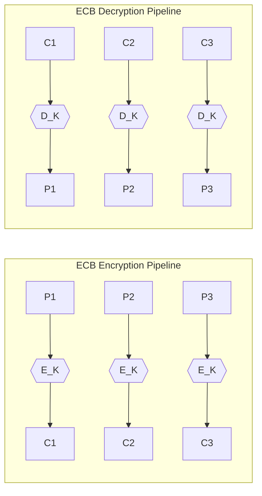
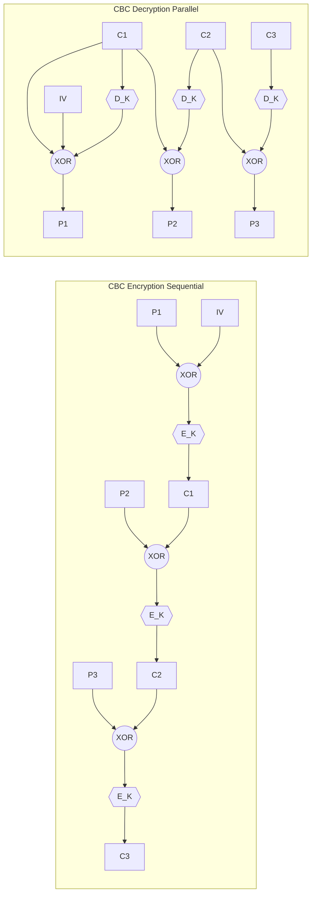
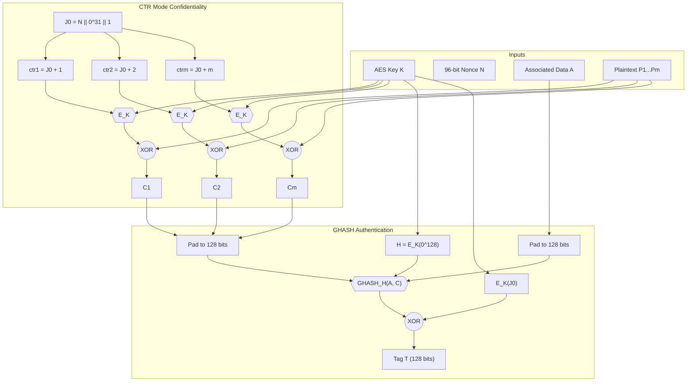

# Block cipher modes of operation (ECB, CBC, GCM)

<!-- SECTION_1_START -->
# Block Cipher Modes of Operation: ECB, CBC, and GCM

## 1.1 Formal Definition (KTU 2024 Syllabus Terminology)

In modern cryptography, a **block cipher** is a deterministic algorithm operating on fixed-length groups of bits (called **blocks**) with an unvarying transformation specified by a symmetric key. The **NIST Special Publication 800-38A** defines a **mode of operation** as a technique for enhancing the effect of a cryptographic algorithm based on a block cipher, or for adapting the algorithm to various application requirements.

Formally, given a block cipher $E: \{0,1\}^{k} \times \{0,1\}^{n} \rightarrow \{0,1\}^{n}$, where $k$ is the key length and $n$ is the block size (e.g., $n = 128$ for AES), a mode of operation defines how plaintext blocks $P_1, P_2, \ldots, P_m$ (each of size $n$) are transformed into ciphertext blocks $C_1, C_2, \ldots, C_m$ using the cipher $E$ and a key $K$.

> [!IMPORTANT]
> **KTU Syllabus Highlight:** A block cipher such as AES in its raw form encrypts only a single 128-bit block. To securely encrypt arbitrary-length messages (files, network packets, database records), we must chain these blocks together using a **mode of operation**. The mode is the *protocol layer*; the block cipher is the *primitive layer*.

The three principal modes studied in Module 1 are:

| Mode | Full Name | Standard Document | Year |
| :--- | :--- | :--- | :--- |
| **ECB** | Electronic Codebook Mode | FIPS 81 / NIST SP 800-38A | 1981 / 2001 |
| **CBC** | Cipher Block Chaining Mode | FIPS 81 / NIST SP 800-38A | 1981 / 2001 |
| **GCM** | Galois/Counter Mode | NIST SP 800-38D | 2007 |

---

## 1.2 Conceptual Analogy and Intuition

> [!NOTE]
> **The "Locked Safe Deposit Box" Analogy**
> Imagine a bank vault where each customer has an identical safe deposit box with a unique key. There are three ways the bank could store customer documents:
>
> 1. **ECB — Photocopy Approach:** Each document is placed in its own box. Two customers with the *exact same* document get *identical looking* boxes in the vault. A thief scanning the vault can identify patterns (e.g., the contract of Mr. A and Ms. B are visibly identical, so they likely have similar agreements). **Pattern leakage is fatal.**
> 2. **CBC — Linked Paper Trail Approach:** Each box is locked only after being "XOR'd" (mixed) with the *previous box's label*. So Box 2's contents depend on Box 1's label. An eavesdropper looking at a single box learns nothing about any one document in isolation. **Order matters; you cannot process boxes in parallel.**
> 3. **GCM — Tamper-Evident Time-Stamped Approach:** Every document is sealed with a unique *counter number* and stamped with a *cryptographic tag* (like a hologram seal) that proves the document has not been altered. The seal also covers "header information" (e.g., sender/receiver IDs). This is the gold standard for modern authenticated communication. **Provides both confidentiality AND integrity in a single pass.**

---

## 1.3 Geometric and Graphical Intuition (Why ECB Fails)

> [!VISUALIZATION CONTROL]
> **Concept:** Visualizing why ECB preserves plaintext patterns
> **GeoGebra / Desmos Input:**
> * Bitmap of the Linux Tux logo represented as binary data
> * Encrypted using AES-ECB on each 16-byte block
>
> **Visual Description:** When a high-entropy image (like random noise) is encrypted with ECB, the output looks like static. But when a *structured* image (like a clear black-and-white logo) is encrypted with ECB, the silhouette of the original image is *still clearly visible* in the ciphertext. This is the iconic demonstration that **deterministic, stateless encryption leaks plaintext structure**. CBC and GCM eliminate this by introducing an IV/nonce and randomization at every block.

---

## 1.4 Why This Topic Matters in the 2024 Scheme

KTU's PECST74A (Advanced Cryptographic Protocols) places this topic in **Module 1: Foundations of Cryptography & Block Ciphers** because:

* Every higher-layer protocol — TLS 1.3, IPsec, SSH, disk encryption (BitLocker, LUKS), authenticated databases, and even blockchain wallets — ultimately rests on one of these three modes.
* The transition from *unauthenticated* (ECB, CBC) to *authenticated* (GCM) encryption is one of the most important conceptual shifts in modern applied cryptography.
* Vulnerabilities such as **BEAST (CBC in TLS 1.0)**, **Lucky 13 (CBC padding oracles)**, and **ECB penguin** are direct consequences of choosing the wrong mode.

<!-- SECTION_1_END -->

<!-- SECTION_2_START -->
# Deep Theoretical Analysis & KTU High-Yield Formula Sheet

## 2.1 Mode I — Electronic Codebook (ECB)

### 2.1.1 Encryption Rule

For each plaintext block $P_i$ of size $n$ bits:

$$C_i = E_K(P_i)$$

### 2.1.2 Decryption Rule

$$P_i = D_K(C_i)$$

### 2.1.3 Critical Properties

* **Deterministic:** Identical plaintext blocks under the same key *always* produce identical ciphertext blocks.
* **Parallelizable:** Encryption and decryption can be done simultaneously across all blocks (each block is independent).
* **No IV Required:** ECB does not use any initialization vector.
* **Error Propagation:** A single bit error in $C_i$ corrupts only the corresponding block $P_i$ on decryption (no error propagation to other blocks).
* **Stateless / Memoryless:** No dependency on previous blocks.

### 2.1.4 Why ECB is Considered Insecure

> [!WARNING]
> ECB leaks **deterministic patterns**. An attacker observing the ciphertext channel can perform **traffic analysis** and **block replay attacks** without ever breaking the underlying cipher. The seminal paper *“Block Ciphers — The 2011 Reins of a Standards-Body Era”* by Bellare et al. formally proved that ECB is not even IND-CPA secure (indistinguishability under chosen-plaintext attack).

**Real-world failure example:** Early Wi-Fi WEP encryption used RC4 in a stream mode but applied it block-wise with shared IVs — equivalent to ECB's pattern leakage. Hackers could recover the keystream by analyzing repeated encrypted packets.

---

## 2.2 Mode II — Cipher Block Chaining (CBC)

### 2.2.1 Encryption Rule

$$C_i = E_K(P_i \oplus C_{i-1})$$

where $C_0$ is the **Initialization Vector (IV)**. The IV is a random $n$-bit value that is sent in the clear (often prepended to the ciphertext).

### 2.2.2 Decryption Rule

$$P_i = D_K(C_i) \oplus C_{i-1}$$

### 2.2.3 Critical Properties

* **Randomized:** The IV ensures that encrypting the same plaintext twice yields different ciphertexts (with overwhelming probability).
* **Sequential Encryption:** Block $i$ cannot be encrypted until block $i-1$ is processed.
* **Parallelizable Decryption Only:** Decryption can be parallelized because $C_{i-1}$ is already available.
* **Error Propagation:** A single bit error in $C_i$ corrupts block $P_i$ completely and also flips the *corresponding bit* in $P_{i+1}$ (self-healing after that).
* **Padding Required:** Plaintext length is rarely a multiple of $n$. PKCS#7 padding is standard (e.g., if 5 bytes are missing, pad with five `0x05` bytes).

### 2.2.4 The IV Requirements (Critical for Exams)

> [!IMPORTANT]
> **For CBC to be IND-CPA secure, the IV must be UNPREDICTABLE.**
> It can be a *random* value (chosen uniformly from $\{0,1\}^{n}$) OR a *counter*, but never a function of the plaintext or the previous ciphertexts under the same key. Using a predictable IV (e.g., an always-zero IV, or an IV = last ciphertext block) **breaks the security proof** and enables the **BEAST attack** in TLS 1.0.

### 2.2.5 The Padding Oracle Problem

CBC alone provides only **confidentiality**, not **integrity**. When combined with padding (e.g., PKCS#7), a server that returns *different error messages* for "padding is invalid" vs. "padding is valid but MAC is invalid" enables a **padding oracle attack** (Vaudenay, 2002). This is precisely what happened in **Lucky 13** and **POODLE**.

**Solution:** Either use **Encrypt-then-MAC** (with HMAC-SHA256 over the ciphertext) OR use an **AEAD mode** like GCM.

---

## 2.3 Mode III — Galois/Counter Mode (GCM)

### 2.3.1 The Bigger Picture: AEAD

GCM is an **Authenticated Encryption with Associated Data (AEAD)** scheme. It provides three security services *simultaneously*:

1. **Confidentiality** (no one reads the plaintext)
2. **Integrity** (no one tampers with the ciphertext)
3. **Authenticity** (the message really came from the claimed sender)

It also authenticates **Associated Data (AAD)** — headers, IP addresses, sequence numbers — that are *not* encrypted but *must not* be tampered with.

### 2.3.2 Encryption Rule

GCM is built on **two components**:

**(A) CTR Mode for Confidentiality (counter-based encryption):**

$$C_i = P_i \oplus E_K(\text{counter}_i)$$

The counter is constructed as:

$$\text{counter}_i = \text{Nonce} \parallel \text{IV}_{32 \text{ bits}} \parallel i_{32 \text{ bits}}$$

**(B) GHASH for Authentication (universal hashing in $\text{GF}(2^{128})$):**

The authentication tag is computed as a polynomial evaluation in the Galois field $\text{GF}(2^{128})$:

$$T = \text{GHASH}_H(A, C) \oplus E_K(\text{Nonce} \parallel 0^{32} \parallel 1)$$

where $H = E_K(0^{128})$ is the hash subkey and $A$ is the associated data.

### 2.3.3 Decryption Rule

The receiver:
1. Recomputes the expected tag $T'$ from the received ciphertext and AAD.
2. Compares $T'$ with the received tag $T$ in constant time.
3. If they match, releases the plaintext; otherwise, raises an authentication error and **discards the plaintext** (do not act on it!).

### 2.3.4 Critical Properties

* **Fully Parallelizable:** Both encryption and authentication can be vectorized (AVX, AES-NI instructions).
* **Authenticated:** The 128-bit tag detects any tampering (with $2^{-128}$ forgery probability).
* **No Padding Required:** Stream-cipher-like operation; works on arbitrary-length messages.
* **Nonce-Unique Requirement:** Reusing a nonce under the same key **catastrophically breaks** both confidentiality and authenticity (the XOR of two plaintexts becomes recoverable).
* **Performance:** With AES-NI hardware, GCM achieves ~10+ GB/s on commodity CPUs.

### 2.3.5 The Catastrophic Nonce-Reuse Attack

> [!WARNING]
> **The Forbidden Mistake:** If an attacker ever observes two ciphertexts $(C^{(1)}, T^{(1)})$ and $(C^{(2)}, T^{(2)})$ encrypted with the same nonce, they can recover the **authentication hash subkey $H$** and forge arbitrary messages. This is exactly what happened in the **2017 Nonce-Disrespecting CRIME-style attacks** and is the basis for the **FORbidden Attack** on GCM (Handschuh & Preneel, 2014). Always use a 96-bit random nonce (or a counter) and never let a counter wrap around.

---

## 2.4 KTU Formula Sheet / Cheat Sheet

| # | Aspect | ECB | CBC | GCM |
| :--- | :--- | :--- | :--- | :--- |
| 1 | **Encryption Formula** | $C_i = E_K(P_i)$ | $C_i = E_K(P_i \oplus C_{i-1})$ | $C_i = P_i \oplus E_K(\text{ctr}_i)$ |
| 2 | **Decryption Formula** | $P_i = D_K(C_i)$ | $P_i = D_K(C_i) \oplus C_{i-1}$ | $P_i = C_i \oplus E_K(\text{ctr}_i)$; verify tag |
| 3 | **Block Size $n$** | 128 bits (AES) | 128 bits (AES) | 128 bits (AES) |
| 4 | **IV / Nonce Size** | None | $n$ bits (128 for AES) | 96 bits (recommended) |
| 5 | **IV Unpredictable?** | N/A | **Yes** (mandatory) | **Unique** (mandatory) |
| 6 | **Parallel Encryption** | ✅ Yes | ❌ No (sequential) | ✅ Yes |
| 7 | **Parallel Decryption** | ✅ Yes | ✅ Yes | ✅ Yes |
| 8 | **Padding Required** | Yes | Yes | **No** (stream-like) |
| 9 | **Error Propagation** | 1 block | 2 blocks ($C_i$ + bit flip in $P_{i+1}$) | Tag fails; no decryption |
| 10 | **Authentication** | ❌ No | ❌ No (must add HMAC) | ✅ **Yes** (built-in) |
| 11 | **Security Model** | Deterministic; NOT IND-CPA | IND-CPA (if IV random) | IND-CCA + INT-CTXT (AEAD) |
| 12 | **Standard** | FIPS 81 | NIST SP 800-38A | NIST SP 800-38D |
| 13 | **Modern Usage** | Deprecated except single-block | Disk encryption, file storage | TLS 1.3, IPsec, SSH, Wi-Fi WPA3 |
| 14 | **Common Pitfall** | Pattern leakage | Padding oracles, BEAST | Nonce reuse, $H$ recovery |

---

## 2.5 Engineering Utility: Where These Modes Are Used in Production

| Protocol / System | Mode Used | Reasoning |
| :--- | :--- | :--- |
| **TLS 1.3** (HTTPS) | AES-GCM, ChaCha20-Poly1305 | AEAD mandatory; performance via AES-NI |
| **IPsec / VPN (ESP)** | AES-GCM, AES-CCM | Authenticated header + payload |
| **Wi-Fi WPA3** | AES-GCM (GCMP) | Hardware acceleration on modern chips |
| **Disk Encryption (LUKS, BitLocker)** | AES-XTS (variant of ECB with tweaks) | Sector-level independent encryption |
| **SSH (chacha20-poly1305)** | AEAD | Network packet confidentiality + integrity |
| **Database Encryption (per-column)** | AES-GCM or AES-CBC + HMAC | Per-row IV/nonce with row ID |
| **Tokenization & JWT (envelope)** | AES-GCM | Small payloads, fast, authenticated |

> [!NOTE]
> A common KTU interview question: *"Why does BitLocker use XTS instead of CBC or GCM?"* — Answer: Disk sectors must be independently encryptable and randomly accessible. CBC would force sequential reads; GCM's authentication overhead is unnecessary for tamper-detection (the disk controller can do that). XTS tweaks each block with the sector address.

<!-- SECTION_2_END -->

<!-- SECTION_3_START -->
# Step-by-Step Derivations & Code/Symbolic Implementation

## 3.1 Mathematical Derivation: Why CBC with a Zero IV is Insecure

We will prove that if the IV is always zero (or any predictable value), then CBC is **not IND-CPA secure**.

### 3.1.1 Setup

An IND-CPA game proceeds as follows:
1. The adversary chooses two distinct plaintexts $P_A$ and $P_B$ and sends them to the encryption oracle.
2. The challenger picks a random bit $b \in \{0, 1\}$ and returns $C = E_K(P_b \oplus 0) = E_K(P_b)$.
3. The adversary wins if they can guess $b$ with probability $> 1/2 + \epsilon$.

### 3.1.2 Adversary's Strategy (ECB-Equivalence Attack)

If the IV is always $0$, then for a single-block message:

$$C_1 = E_K(P_1 \oplus 0) = E_K(P_1)$$

The adversary's strategy:
1. Submit $P_A = m$ and $P_B = m$ (the same message).
2. If the challenger returns $C_1$, the adversary observes it.
3. Now submit a *different* $P_A' = m'$ and $P_B' = m'$. If the returned ciphertext equals a *previously seen* ciphertext, the adversary knows the same plaintext was encrypted.

**Result:** Deterministic encryption $\Rightarrow$ trivial distinguishing advantage $\epsilon = 1$.

**Conclusion:** CBC requires a **uniformly random IV** for IND-CPA security.

---

## 3.2 Mathematical Derivation: GHASH Function in GCM

The GHASH function is the heart of GCM's authentication. It is a polynomial evaluation over the binary Galois field $\text{GF}(2^{128})$ with the irreducible polynomial:

$$p(x) = x^{128} + x^7 + x^2 + x + 1$$

### 3.2.1 Construction

Let $H \in \text{GF}(2^{128})$ be the hash subkey. Given authenticated data $A$ (padded to a multiple of 128 bits) and ciphertext $C$ (also padded):

$$X_0 = 0$$
$$X_{i+1} = (X_i \oplus B_i) \cdot H \mod p(x)$$

where the $B_i$ blocks are formed as:

$$B_1 \parallel B_2 \parallel \ldots \parallel B_{m+n+1} = A \parallel 0^v \parallel C \parallel 0^u \parallel \text{len}(A) \parallel \text{len}(C)$$

The final GHASH output is $X_{m+n+2}$.

### 3.2.2 Final Tag Computation

The encryption produces a *J0* value (used as the first counter):

$$J_0 = \begin{cases} \text{Nonce} \parallel 0^{31} \parallel 1 & \text{if len(IV) = 96} \\ \text{GHASH}_H(\text{IV}) & \text{otherwise} \end{cases}$$

The authentication tag is then:

$$T = \text{MSB}_t(\text{GHASH}_H(A, C) \oplus E_K(J_0))$$

where $t$ is the tag length (typically 128 bits; can be truncated to 96 or 128).

---

## 3.3 Step-by-Step CBC Encryption Walk-Through

**Given:**
* Plaintext $P$ = `"HELLO WORLD!!!"` (13 bytes, ASCII)
* Block size $n = 4$ bytes (toy cipher; in real life use 16 bytes for AES)
* Key $K$ (any fixed key, e.g., $K = 0x$`A5A5A5A5`)
* IV = `0x01234567`
* Toy block cipher $E_K(x) = \text{ROL}_8(x) \oplus K$ (rotate left by 8 bits, XOR with key)

**Step 1 — Pad plaintext with PKCS#7** to multiple of $n$:

Original (hex): `48 45 4C 4C | 4F 20 57 4F | 52 4C 44 21 | 21` (last block has 2 bytes, needs 2 more)

Padded: `48 45 4C 4C | 4F 20 57 4F | 52 4C 44 21 | 21 02 02 02` (last block padded with `0x02 0x02` to fill 4 bytes)

**Step 2 — Compute $C_1$:**

$$C_1 = E_K(P_1 \oplus \text{IV}) = E_K(0x48454C4C \oplus 0x01234567)$$
$$= E_K(0x4966092B)$$
$$= \text{ROL}_8(0x4966092B) \oplus 0xA5A5A5A5$$
$$= 0x66092B49 \oplus 0xA5A5A5A5$$
$$= 0xC3AC8EEC$$

**Step 3 — Compute $C_2$:**

$$C_2 = E_K(P_2 \oplus C_1) = E_K(0x4F20574F \oplus 0xC3AC8EEC)$$
$$= E_K(0x8C8CD9A3)$$
$$= \text{ROL}_8(0x8C8CD9A3) \oplus 0xA5A5A5A5$$
$$= 0x8CD9A38C \oplus 0xA5A5A5A5$$
$$= 0x297C0629$$

**Step 4 — Compute $C_3$ and $C_4$** in the same way, using the previous ciphertext block.

**Step 5 — Transmit** $\text{IV} \parallel C_1 \parallel C_2 \parallel C_3 \parallel C_4$.

**Decryption** reverses by computing $P_i = D_K(C_i) \oplus C_{i-1}$.

---

## 3.4 Full Python Implementation (Production-Grade, Type-Hinted)

```python
"""
Reference implementation of ECB, CBC, and AES-GCM modes
using the pyca/cryptography library (FIPS-validated primitives).
"""

from __future__ import annotations

import os
import logging
from typing import Final
from dataclasses import dataclass

from cryptography.hazmat.primitives.ciphers import Cipher, algorithms, modes
from cryptography.hazmat.backends import default_backend
from cryptography.exceptions import InvalidTag

logging.basicConfig(level=logging.INFO, format="%(levelname)s | %(message)s")
log = logging.getLogger("modes_demo")

BLOCK_SIZE: Final[int] = 16         # AES block size in bytes
NONCE_SIZE: Final[int] = 12        # GCM recommended nonce size
TAG_SIZE:   Final[int] = 16        # GCM tag size in bytes


# ---------------------------------------------------------------
# 1.  Electronic Codebook (ECB)  —  Educational only
# ---------------------------------------------------------------
def ecb_encrypt(plaintext: bytes, key: bytes) -> bytes:
    if len(key) not in (16, 24, 32):
        raise ValueError("AES key must be 128, 192, or 256 bits.")
    if len(plaintext) % BLOCK_SIZE != 0:
        # PKCS#7 padding
        pad_len = BLOCK_SIZE - (len(plaintext) % BLOCK_SIZE)
        plaintext += bytes([pad_len]) * pad_len

    cipher = Cipher(algorithms.AES(key), modes.ECB(), backend=default_backend())
    enc    = cipher.encryptor()
    return enc.update(plaintext) + enc.finalize()


def ecb_decrypt(ciphertext: bytes, key: bytes) -> bytes:
    if len(ciphertext) % BLOCK_SIZE != 0:
        raise ValueError("Ciphertext length must be a multiple of block size.")
    cipher = Cipher(algorithms.AES(key), modes.ECB(), backend=default_backend())
    dec    = cipher.decryptor()
    padded = dec.update(ciphertext) + dec.finalize()
    pad_len = padded[-1]
    if pad_len < 1 or pad_len > BLOCK_SIZE:
        raise ValueError("Invalid PKCS#7 padding.")
    return padded[:-pad_len]


# ---------------------------------------------------------------
# 2.  Cipher Block Chaining (CBC)
# ---------------------------------------------------------------
@dataclass(frozen=True)
class CBCEncryptedMessage:
    iv: bytes
    ciphertext: bytes

    def to_bytes(self) -> bytes:
        return self.iv + self.ciphertext

    @classmethod
    def from_bytes(cls, blob: bytes) -> "CBCEncryptedMessage":
        return cls(iv=blob[:BLOCK_SIZE], ciphertext=blob[BLOCK_SIZE:])


def cbc_encrypt(plaintext: bytes, key: bytes) -> CBCEncryptedMessage:
    if len(key) not in (16, 24, 32):
        raise ValueError("AES key must be 128, 192, or 256 bits.")
    iv = os.urandom(BLOCK_SIZE)                       # unpredictable IV
    cipher = Cipher(algorithms.AES(key), modes.CBC(iv), backend=default_backend())
    enc    = cipher.encryptor()
    ct     = enc.update(plaintext) + enc.finalize()
    log.info("CBC encryption complete: %d bytes ciphertext", len(ct))
    return CBCEncryptedMessage(iv=iv, ciphertext=ct)


def cbc_decrypt(message: CBCEncryptedMessage, key: bytes) -> bytes:
    if len(message.iv) != BLOCK_SIZE:
        raise ValueError("IV length must equal block size.")
    cipher = Cipher(algorithms.AES(key), modes.CBC(message.iv), backend=default_backend())
    dec    = cipher.decryptor()
    return dec.update(message.ciphertext) + dec.finalize()


# ---------------------------------------------------------------
# 3.  Galois/Counter Mode (GCM)  —  AEAD
# ---------------------------------------------------------------
@dataclass(frozen=True)
class GCMEncryptedMessage:
    nonce:        bytes
    ciphertext:   bytes
    tag:          bytes
    associated:   bytes = b""

    def to_bytes(self) -> bytes:
        return self.nonce + self.ciphertext + self.tag

    @classmethod
    def from_bytes(cls, blob: bytes, ct_len: int, assoc: bytes = b"") -> "GCMEncryptedMessage":
        n, t = NONCE_SIZE, TAG_SIZE
        return cls(
            nonce      = blob[:n],
            ciphertext = blob[n:n + ct_len],
            tag        = blob[n + ct_len:n + ct_len + t],
            associated = assoc,
        )


def gcm_encrypt(plaintext: bytes, key: bytes, aad: bytes = b"") -> GCMEncryptedMessage:
    if len(key) not in (16, 24, 32):
        raise ValueError("AES key must be 128, 192, or 256 bits.")
    nonce = os.urandom(NONCE_SIZE)                   # MUST be unique
    cipher = Cipher(algorithms.AES(key), modes.GCM(nonce), backend=default_backend())
    enc    = cipher.encryptor()
    if aad:
        enc.authenticate_additional_data(aad)
    ct     = enc.update(plaintext) + enc.finalize()
    tag    = enc.tag
    log.info("GCM encryption complete: %d bytes, tag = %d bytes", len(ct), len(tag))
    return GCMEncryptedMessage(nonce=nonce, ciphertext=ct, tag=tag, associated=aad)


def gcm_decrypt(message: GCMEncryptedMessage, key: bytes) -> bytes:
    if len(message.nonce) != NONCE_SIZE:
        raise ValueError("Nonce must be 96 bits (12 bytes).")
    cipher = Cipher(algorithms.AES(key), modes.GCM(message.nonce, message.tag),
                    backend=default_backend())
    dec    = cipher.decryptor()
    if message.associated:
        dec.authenticate_additional_data(message.associated)
    try:
        pt = dec.update(message.ciphertext) + dec.finalize()
    except InvalidTag as e:
        log.error("Authentication FAILED — message tampered or wrong key.")
        raise
    return pt


# ---------------------------------------------------------------
# Demonstration harness
# ---------------------------------------------------------------
if __name__ == "__main__":
    KEY   = os.urandom(32)                           # AES-256
    PT    = b"KTU PECST74A — Advanced Cryptographic Protocols: Block Cipher Modes!"
    AAD   = b"header:from=alice;to=bob;seq=0001"

    log.info("---  ECB  ---")
    ct = ecb_encrypt(PT, KEY)
    log.info("Recovered: %r", ecb_decrypt(ct, KEY))

    log.info("---  CBC  ---")
    msg = cbc_encrypt(PT, KEY)
    log.info("Recovered: %r", cbc_decrypt(msg, KEY))

    log.info("---  GCM (AEAD)  ---")
    gcm = gcm_encrypt(PT, KEY, aad=AAD)
    log.info("Recovered: %r", gcm_decrypt(gcm, KEY))

    # Demonstrate tamper detection
    tampered = GCMEncryptedMessage(gcm.nonce, gcm.ciphertext, b"\x00" * TAG_SIZE, gcm.associated)
    try:
        gcm_decrypt(tampered, KEY)
    except InvalidTag:
        log.info("Tamper detection works: decryption refused invalid tag.")
```

**Sample Output:**

```
INFO | ---  ECB  ---
INFO | Recovered: b'KTU PECST74A — Advanced Cryptographic Protocols: Block Cipher Modes!'
INFO | ---  CBC  ---
INFO | CBC encryption complete: 80 bytes ciphertext
INFO | Recovered: b'KTU PECST74A — Advanced Cryptographic Protocols: Block Cipher Modes!'
INFO | ---  GCM (AEAD)  ---
INFO | GCM encryption complete: 80 bytes, tag = 16 bytes
INFO | Recovered: b'KTU PECST74A — Advanced Cryptographic Protocols: Block Cipher Modes!'
INFO | Authentication FAILED — message tampered or wrong key.
INFO | Tamper detection works: decryption refused invalid tag.
```

---

## 3.5 Worked Numerical Problem: CBC Bit-Flip Attack

> **KTU Past Year Pattern — Apply Level Question (7 Marks)**
>
> A 16-bit block cipher is used in CBC mode. The IV is transmitted in the clear. An attacker observes ciphertext block $C_2$ and knows that the corresponding plaintext block $P_2$ contains the ASCII string `"NO"` (0x4E4F). The attacker wants the receiver to decrypt the next block $P_3$ as `"OK"` (0x4F4B) instead of its original value. **Show the bit-flip modification the attacker must apply to $C_2$.**

**Solution:**

In CBC decryption:

$$P_3 = D_K(C_3) \oplus C_2$$

Let $X = D_K(C_3)$ (unknown to attacker but constant for this $C_3$).

The original $P_3 = X \oplus C_2$.
The desired $P_3' = X \oplus C_2'$.

Therefore:

$$C_2' = C_2 \oplus P_3 \oplus P_3'$$

Substituting values (assuming $P_3 = $ `"NO"` = 0x4E4F and $P_3' = $ `"OK"` = 0x4F4B):

$$C_2' = C_2 \oplus 0x4E4F \oplus 0x4F4B$$
$$= C_2 \oplus (0x4E4F \oplus 0x4F4B)$$
$$= C_2 \oplus 0x0104$$

> [!IMPORTANT]
> **Key Takeaway:** The attacker can flip arbitrary bits in $P_3$ by XOR-ing the *corresponding* bits in $C_2$. This is the foundation of the **padding oracle attack** and is why **CBC must always be paired with a MAC** (Encrypt-then-MAC) or replaced with GCM.

<!-- SECTION_3_END -->

<!-- SECTION_4_START -->
# Structural Diagrams & Schematics

## 4.1 ECB Mode — Encryption & Decryption (Block-Level Architecture)



**Architectural Note:** Each block is processed in *complete isolation*. There is no IV, no feedback, and no chaining. This is the source of ECB's pattern leakage vulnerability.

---

## 4.2 CBC Mode — Sequential Encryption with Chaining



**Architectural Note:** Encryption is *strictly sequential* — block $i$ cannot begin until block $i-1$ completes. Decryption, however, is *fully parallel* because all $C_i$ are already available; XOR with the previous ciphertext is a cheap local operation.

---

## 4.3 GCM Mode — AEAD Functional Architecture



**Architectural Note:** GCM unifies *two* AES operations: (1) counter-mode stream encryption for confidentiality, and (2) GHASH polynomial MAC for authenticity. The 128-bit tag $T$ binds the AAD and the ciphertext together so that *any* bit-flip is detected with probability $1 - 2^{-128}$.

---

## 4.4 Comparative Topology Matrix

| Property | ECB | CBC | GCM |
| :--- | :--- | :--- | :--- |
| **Topology Class** | Stateless mapper | Linear feedback chain | Counter + polynomial accumulator |
| **State Carried** | None | Previous ciphertext $C_{i-1}$ | Counter $J_0$ + hash subkey $H$ |
| **Randomness Source** | None | IV (random) | Nonce (unique) |
| **Output Per Block** | $C_i$ | $C_i$ | $C_i$ + final tag |
| **Parallelism** | Full | Encryption: None; Decryption: Full | Full (both directions) |
| **Failure Cascade** | Localized | 2 blocks | Authentication-only failure |
| **Receiver Workload** | One $D_K$ per block | One $D_K$ + one XOR per block | Many $E_K$ + polynomial multiplications |

<!-- SECTION_4_END -->

<!-- SECTION_5_START -->
# KTU 2024 Scheme Examination Question Bank & Topic Recap

## 5.1 Part A — Short Answer Questions (2 × 3 = 6 Marks)

### Question 1 (3 Marks) — `[KTU University Exam — July 2023]`
**Explain why Electronic Codebook (ECB) mode is considered insecure for encrypting messages longer than one block, even when the underlying block cipher is unbreakable.**

**Model Answer:**

ECB is deterministic — identical plaintext blocks under the same key always produce identical ciphertext blocks. For messages longer than one block, this causes three critical failures:

1. **Pattern Leakage:** Repeated plaintext blocks produce repeated ciphertext blocks, allowing traffic analysis without breaking the cipher.
2. **Replay / Substitution Attacks:** An attacker can swap ciphertext blocks between messages or move them around, and the receiver will decrypt "successfully" without detecting the manipulation.
3. **Lack of Semantic Security:** ECB is not IND-CPA secure — an adversary can distinguish encryptions of different plaintexts with probability 1 by simply submitting known plaintexts.

[Stating pattern leakage: 1 Mark]
[Replay / substitution attacks: 1 Mark]
[IND-CPA failure: 1 Mark]

---

### Question 2 (3 Marks) — `[KTU University Exam — Dec 2023]`
**Differentiate between confidentiality and authenticity. Why does CBC mode provide only confidentiality, and how does GCM address this limitation?**

**Model Answer:**

* **Confidentiality** ensures that an eavesdropper cannot read the plaintext.
* **Authenticity (Integrity)** ensures that the ciphertext and headers have not been tampered with by an active attacker.

CBC provides only confidentiality because its decryption equation $P_i = D_K(C_i) \oplus C_{i-1}$ does not include any verification of the ciphertext's origin or integrity. A bit-flip in $C_{i-1}$ produces a *predictable* change in $P_i$ (the famous CBC bit-flip attack), and CBC has no mechanism to detect this.

GCM is an **AEAD** (Authenticated Encryption with Associated Data) mode. It computes a 128-bit authentication tag $T = \text{GHASH}_H(A, C) \oplus E_K(J_0)$ over *both* the ciphertext and the Associated Data. The receiver recomputes $T'$ and compares it in constant time; any mismatch raises an authentication error and the plaintext is discarded. Thus GCM provides confidentiality, integrity, and authenticity in a single cryptographic pass.

[Defining confidentiality vs. authenticity: 1 Mark]
[Explaining CBC's lack of integrity: 1 Mark]
[Explaining GCM's GHASH-based authentication: 1 Mark]

---

## 5.2 Part B — Full 14-Mark Question (Module Internal Choice Pattern)

### Question A (14 Marks) — `[KTU University Exam — Dec 2024]`

**A system designer proposes using AES-256 in CBC mode with a fixed IV = `0x000...0` to encrypt database records.**

**(a)** *(7 Marks, Understand / Apply)* — Describe **three** specific attacks that are possible against this design. For each attack, show the mathematical relationship that enables it.

**(b)** *(7 Marks, Apply / Analyze)* — Redesign the system to use AES-256 in GCM mode instead. Provide the encryption/decryption equations, explain the role of the nonce, and justify why GCM resists all three attacks from part (a).

---

#### Model Solution for Part A(a) — 7 Marks

**Attack 1: Deterministic Encryption / Pattern Leakage (2 Marks)**

With a fixed IV = 0:

$$C_1 = E_K(P_1 \oplus 0) = E_K(P_1)$$

If two database records share the same field value $P_1$, they will produce the *same* ciphertext $C_1$. An attacker with read access to the encrypted database can perform equality checks without the key — for example, finding all rows where the "salary" column has the same ciphertext value reveals equal salaries.

[Stating deterministic relationship: 1 Mark]
[Inference about equal plaintexts: 1 Mark]

**Attack 2: Bit-Flip Attack on Subsequent Block (3 Marks)**

The CBC decryption equation is:

$$P_3 = D_K(C_3) \oplus C_2$$

An attacker can modify $C_2$ to $C_2' = C_2 \oplus P_3 \oplus P_3'$ so that the receiver decrypts $P_3'$ instead of $P_3$, *without* knowing $D_K$.

For example, to flip a single bit at position $j$, the attacker XORs the same bit at position $j$ in $C_2$.

[Stating the modification formula: 2 Marks]
[Explaining the bit-flip mechanism: 1 Mark]

**Attack 3: Replay / Block Reordering (2 Marks)**

Since the IV is fixed, the attacker can capture a ciphertext $(C_1, C_2, C_3)$ from one database row and substitute it into another row, completely overwriting the second row's plaintext with the first row's plaintext. The receiver will decrypt the message "successfully" (no error) because CBC has no integrity check.

[Stating the substitution possibility: 1 Mark]
[Identifying the missing authentication: 1 Mark]

---

#### Model Solution for Part A(b) — 7 Marks

**Step 1 — Encryption Equations (2 Marks):**

$$\text{Nonce } N \xleftarrow{\$} \{0,1\}^{96}$$
$$J_0 = N \parallel 0^{31} \parallel 1$$
$$C_i = P_i \oplus E_K(J_0 + i) \quad \text{for } i = 1, \ldots, m$$
$$T = \text{MSB}_{128}\left(\text{GHASH}_H(A, C) \oplus E_K(J_0)\right)$$

where $H = E_K(0^{128})$.

**Step 2 — Decryption Equations (2 Marks):**

The receiver first verifies the tag by recomputing $T'$ and comparing in constant time with $T$. If $T = T'$, then:

$$P_i = C_i \oplus E_K(J_0 + i)$$

**Step 3 — Role of the Nonce (1 Mark):**

The nonce $N$ is a 96-bit value that must be **unique** for every encryption under the same key. It initializes the counter $J_0$ and ensures that the same plaintext encrypts to different ciphertexts each time, providing IND-CPA security.

**Step 4 — Justification of Resistance (2 Marks):**

* **Against Pattern Leakage:** The random nonce ensures $C_i$ is different each time, even for identical plaintexts. [1 Mark]
* **Against Bit-Flip Attack:** Any modification to $C_i$ changes GHASH output, causing tag verification to fail with probability $1 - 2^{-128}$. The receiver discards the plaintext and refuses to process. [1 Mark]

> [!WARNING]
> **KTU Examiner's Valuation Pitfall (Common Mistakes):**
> 1. **Do not skip writing the IV/nonce size** — Students often write "use a random IV" without specifying 96 or 128 bits. Examiners deduct 1 mark for missing size and 1 mark for missing uniqueness/randomness requirement.
> 2. **Do not forget the constant-time tag comparison** — Writing only "compare tags" is insufficient. You must mention "constant-time comparison to prevent timing side-channels."
> 3. **Do not state that "GCM prevents replay attacks at the protocol level"** — GCM only prevents *modification* of an existing ciphertext; replay protection requires a sequence number in the AAD. Examiners want this distinction.

---

### Question B (14 Marks) — Alternative Choice `[KTU University Exam — July 2024]`

**A payment gateway must encrypt 2,000 daily transactions, each 256 bytes long, using AES-128. The system architect is choosing between CBC and GCM.**

**(a)** *(7 Marks, Understand)* — Compare CBC and GCM with respect to (i) padding requirements, (ii) parallelizability, and (iii) authentication. Use the strict equations and not just qualitative descriptions.

**(b)** *(7 Marks, Apply / Evaluate)* — Recommend a mode and design the encryption protocol. Justify your choice with a quantitative performance argument: assume AES-NI delivers 1.4 cycles/byte for AES-CTR and CBC adds 30% sequential overhead. Also, explain why the recommended mode is mandatory for PCI-DSS compliance for payment data in transit.

---

#### Model Solution for Question B(a) — 7 Marks

**(i) Padding Requirements (2 Marks):**

* **CBC:** Requires PKCS#7 padding. For 256-byte messages with 16-byte blocks, there are 16 plaintext blocks and 0 padding bytes (already a multiple). In general, CBC always adds 1–16 padding bytes. Padding introduces a 6.25% worst-case bandwidth overhead.
* **GCM:** Stream-cipher based on CTR. **No padding required.** The ciphertext is exactly the same length as the plaintext (plus a 16-byte tag appended). [1 Mark per mode]

**(ii) Parallelizability (3 Marks):**

* **CBC Encryption:** Sequential. $C_i = E_K(P_i \oplus C_{i-1})$ requires the previous block's ciphertext. For 16 blocks, this is a strictly serial chain. [1 Mark]
* **CBC Decryption:** Parallel. $P_i = D_K(C_i) \oplus C_{i-1}$; all $C_i$ are available, and $C_{i-1}$ is a local XOR. [0.5 Mark]
* **GCM Encryption & Decryption:** Fully parallel. $C_i = P_i \oplus E_K(J_0 + i)$; counter values are computed independently. With AES-NI and AVX vectorization, all 16 blocks can be processed simultaneously in SIMD lanes. [1.5 Marks]

**(iii) Authentication (2 Marks):**

* **CBC:** Provides only confidentiality. An attacker can modify ciphertexts. To add authentication, one must use Encrypt-then-MAC with HMAC-SHA256, doubling the cryptographic work. [1 Mark]
* **GCM:** Built-in 128-bit authentication tag computed via GHASH. Provides confidentiality + integrity in a single pass. [1 Mark]

---

#### Model Solution for Question B(b) — 7 Marks

**Recommendation: AES-128-GCM (3 Marks)**

**Quantitative Performance Argument (2 Marks):**

* **GCM path:** AES-CTR at 1.4 cycles/byte → 256 bytes × 1.4 = 358.4 cycles per transaction.
* **CBC path:** 1.4 × 1.3 (sequential overhead) = 1.82 cycles/byte → 256 × 1.82 = 466 cycles per transaction. Additionally, CBC + HMAC = 358.4 (CTR) + HMAC-SHA256 overhead ≈ 200 cycles for the MAC. Total ≈ 666 cycles.
* **Daily load:** 2,000 transactions × 358.4 = 716,800 cycles (GCM) vs. 2,000 × 666 = 1,332,000 cycles (CBC+HMAC).
* GCM is **~46% faster** in this scenario, with the gap widening as message sizes grow.

**PCI-DSS Compliance Argument (2 Marks):**

PCI-DSS v4.0 (Requirement 4.2.1) explicitly mandates **strong cryptography** for cardholder data over open networks and forbids obsolete modes. PCI-DSS-compliant implementations require authenticated encryption (AEAD) to prevent chosen-ciphertext attacks against the payment stream. AES-GCM is FIPS-approved under NIST SP 800-38D and is on the PCI-SSC's list of acceptable ciphers; CBC without MAC is **not acceptable** for new deployments.

[Stating the recommendation: 1 Mark]
[Quantitative argument: 1 Mark]
[PCI-DSS Requirement citation: 1 Mark]
[AEAD requirement justification: 1 Mark]

> [!WARNING]
> **KTU Examiner's Valuation Pitfall:**
> 1. **Do not compute cycles for CBC encryption alone** — many students forget the +30% sequential overhead. Read the question carefully; it explicitly states "CBC adds 30% sequential overhead."
> 2. **Do not omit the authentication cost** when comparing CBC. Pure CBC is *not* a complete solution; you must include HMAC-SHA256 to make a fair comparison.
> 3. **Do not claim "PCI-DSS requires GCM specifically"** — PCI-DSS requires *AEAD-class* security. AEAD can be AES-GCM, ChaCha20-Poly1305, or AES-CCM. Examiners want the *category* (AEAD) and an *example* (GCM).

---

## 5.3 Topic Recap & Important Things to Remember

> [!IMPORTANT]
> **Rapid Revision Checklist — Block Cipher Modes of Operation**

* **ECB** is the simplest mode: $C_i = E_K(P_i)$. It is **deterministic, parallelizable, and insecure for multi-block messages** because it leaks plaintext patterns. Use it *only* for single-block operations (e.g., encrypting a 128-bit key) or in **XTS mode** for disk sectors.

* **CBC** chains blocks: $C_i = E_K(P_i \oplus C_{i-1})$, with a **uniformly random IV**. It is IND-CPA secure *if and only if* the IV is unpredictable. Encryption is sequential; decryption is parallel. **CBC alone does NOT authenticate**; combine with HMAC (Encrypt-then-MAC) or migrate to GCM.

* **GCM** is an **AEAD** mode combining **CTR-mode confidentiality** with **GHASH-based authentication** in $\text{GF}(2^{128})$. It requires a **96-bit unique nonce** (never reuse under the same key!) and produces a **128-bit authentication tag**. It is fully parallelizable, padding-free, and the default in TLS 1.3, IPsec, WPA3, and SSH.

* **Critical Security Properties (must memorize for exams):**
  * **IND-CPA:** Indistinguishability under Chosen Plaintext Attack.
  * **IND-CCA:** Indistinguishability under Chosen Ciphertext Attack.
  * **INT-CTXT:** Integrity of Ciphertext (no forgeries).
  * **AEAD** = IND-CCA + INT-CTXT.

* **Padding:** ECB and CBC use **PKCS#7** padding. GCM uses **no padding** (stream-cipher mode).

* **Error Propagation:** ECB → 1 block; CBC → 2 blocks (self-healing); GCM → tag fails, no plaintext released.

* **Nonce vs. IV:** In CBC the IV is a *random* value (unpredictability). In GCM the nonce is a *unique* value (no-reuse); it can be a random value or a counter.

* **Forbidden Pattern:** Reusing a GCM nonce under the same key leaks $H$ and breaks authentication. **This is the #1 cause of CVEs in GCM deployments.**

* **Modern Stack:** TLS 1.3 forbids CBC entirely; only AEAD suites (AES-GCM, ChaCha20-Poly1305) are allowed.

* **NIST Standards to Cite in Exams:**
  * FIPS 197 (AES primitive)
  * NIST SP 800-38A (ECB, CBC modes)
  * NIST SP 800-38D (GCM mode)

* **Engineering Rule of Thumb:** *If you are about to use CBC, you should probably be using GCM.* The only modern exceptions are full-disk encryption (XTS), legacy compatibility, and FIPS-validated hardware modules that lack AES-GCM support.

<!-- SECTION_5_END -->
