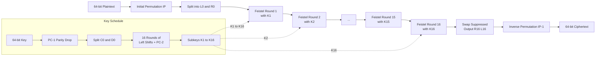
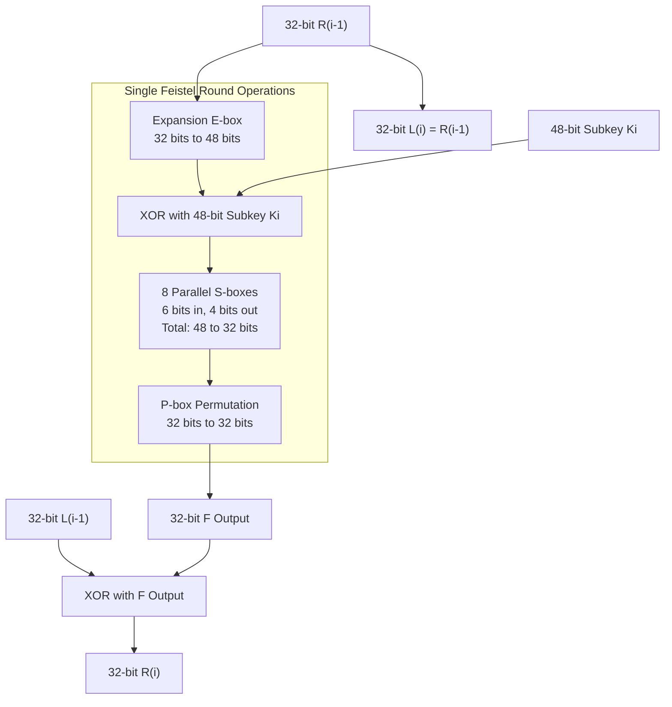
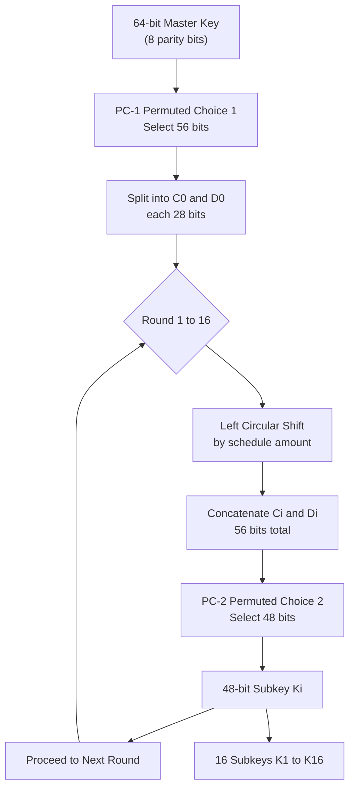
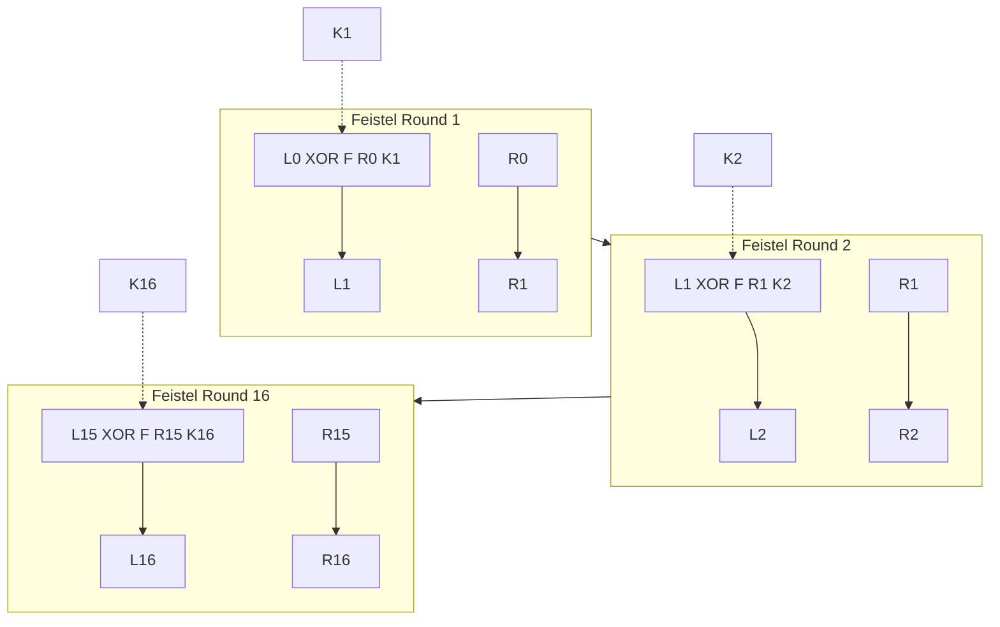

# Data Encryption Standard (DES)

<!-- SECTION_1_START -->
# Data Encryption Standard (DES) — Foundational Block Cipher of Modern Cryptography

## 1.1 Formal Academic Definition

> [!IMPORTANT]
> **Data Encryption Standard (DES)** is a symmetric-key, **block cipher** standardized by the U.S. National Bureau of Standards (now **NIST**) in **1977** as **FIPS Publication 46**. It transforms a **64-bit plaintext block** into a **64-bit ciphertext block** using a **56-bit effective secret key** through **16 rounds of a Feistel network**, with a final inverse permutation applied.

DES belongs to the family of **iterated block ciphers** and operates on the principle of **confusion and diffusion** articulated by **Claude Shannon (1949)**. The 8th bit of every key byte is reserved as a **parity bit**, leaving only **56 bits** of effective key material — a deliberate design constraint from the era.

| Parameter | Value |
|---|---|
| **Block Size** | **64 bits** |
| **Key Size (logical)** | **64 bits (8 parity + 56 effective)** |
| **Number of Rounds** | **16 Feistel Rounds** |
| **Subkey Size per Round** | **48 bits** |
| **Structure Type** | **Feistel Network** |
| **Standardization** | **FIPS 46 (1977), withdrawn 2005** |
| **Substitution Boxes (S-boxes)** | **8 distinct S-boxes, each $6 \to 4$ bits** |

> [!NOTE]
> **Syllabus Highlight (KTU PECST74A — Module 1):** DES is the canonical teaching vehicle for block-cipher theory. Every later cipher (3DES, AES, Twofish) is benchmarked against its design philosophy.

## 1.2 Conceptual Analogy & Intuitive Understanding

Imagine a **fortress mailroom** that processes sealed letters through **16 identical lockers**, where each locker does something *incomprehensible* to half the letter's contents using a *different tumbler key*. After all 16 lockers process the letter in alternating halves, the final letter is unrecognizable — yet the *exact same 16 lockers*, applied in **reverse key order**, perfectly reconstructs the original.

**The intuition breaks down into four mechanical ideas:**

- **Symmetric** — the *same secret key* encrypts and decrypts. There is no public/private split.
- **Block** — DES does not stream one bit at a time; it chops plaintext into fixed **64-bit chunks** (about 16 English characters per chunk).
- **Feistel** — the data block is split into two halves ($L_i$, $R_i$); only one half is transformed per round, and they **swap** afterward. This elegant trick makes encryption and decryption *nearly identical operations* with only key-reversal.
- **Confusion + Diffusion** — the S-boxes create **confusion** (scrambling the relationship between key and ciphertext non-linearly), while the **P-box** and **Expansion** create **diffusion** (spreading one bit's influence across many output bits).

> [!TIP]
> **Memory Trick:** *DES = **D**ata **E**ncryption **S**tandard = "**D**o **E**verything **S**ixteen times" — because it loops 16 Feistel rounds.

## 1.3 Historical & Engineering Context

| Year | Event |
|---|---|
| **1972** | NBS (now NIST) solicits a national cipher standard |
| **1974** | IBM submits **Lucifer** cipher (128-bit key) by **Horst Feistel's team** |
| **1976** | NSA modifies Lucifer: key reduced to 56 bits, S-boxes altered |
| **1977** | Adopted as **FIPS 46** — first U.S. government-approved cipher |
| **1997** | **DESCHALL** project brute-forces DES in 96 days |
| **1998** | **EFF "Deep Crack"** breaks DES in **56 hours** (cost: \$250,000) |
| **1999** | Distributed.net + Deep Crack: **22 hours 15 minutes** |
| **2005** | NIST officially **withdraws** DES for new applications |
| **Today** | Replaced by **Triple DES (3DES/TDEA)** and then **AES** |

> [!WARNING]
> **Why DES is no longer used for new systems:** The **56-bit key** has only $2^{56} \approx 7.2 \times 10^{16}$ possibilities — trivially searchable by modern GPU clusters. It survives only in legacy banking (3DES) and pedagogical contexts.

## 1.4 Visualization: Feistel Round Geometry

> [!VISUALIZATION CONTROL]
> **Concept:** Single Feistel round data flow showing 64-bit input split into $L$ and $R$ halves.
> **GeoGebra / Desmos Input Equations:**
> * Line 1: $L_{i+1} = R_i$
> * Line 2: $R_{i+1} = L_i \oplus F(R_i, K_i)$
> **Visual Description:** A directed graph with two parallel horizontal lines (left = $L$, right = $R$), with the right half flowing down, expanding, mixing with the subkey $K_i$ via XOR, then XORing back into the left half at the bottom. A swap arrow then promotes $R_i$ upward.

## 1.5 Why DES Matters Despite Being Broken

> [!NOTE]
> DES was the **first publicly scrutinized, peer-reviewed cipher** in history. It introduced the entire engineering vocabulary of modern block ciphers: **rounds, S-boxes, key schedules, avalanche effect, differential cryptanalysis**. Every modern cipher descends conceptually from DES. A cryptographer who does not deeply understand DES cannot fully grasp AES.

<!-- SECTION_1_END -->

<!-- SECTION_2_START -->
# Deep Theoretical Analysis — The DES Architecture

## 2.1 The Master Algorithm — Top-Level Flow

DES processes a 64-bit plaintext block through the following sequence:

1. **Initial Permutation (IP)** — a fixed, public bit-reordering of 64 bits.
2. **16 Feistel Rounds** — each uses a distinct 48-bit subkey $K_1, K_2, \dots, K_{16}$.
3. **Swap** — after round 16, the two halves are **not** swapped (a Feistel quirk).
4. **Inverse Initial Permutation ($IP^{-1}$)** — reverses step 1 to produce ciphertext.

Mathematically, the 64-bit block is treated as two 32-bit halves throughout the rounds:

$$
\begin{aligned}
L_0 \| R_0 &\xleftarrow{\text{IP}} \text{Plaintext} \\
L_{i+1} &= R_i \\
R_{i+1} &= L_i \oplus F(R_i, K_i), \quad i = 1, 2, \dots, 16 \\
\text{Ciphertext} &\xleftarrow{IP^{-1}} R_{16} \| L_{16}
\end{aligned}
$$

The **final concatenation is $R_{16} \| L_{16}$** (not $L_{16} \| R_{16}$) because the swap in round 16 is suppressed.

> [!NOTE]
> **Why the swap is suppressed in the last round:** A Feistel cipher's *output* after $n$ rounds is naturally $(R_n, L_n)$. Suppressing the final swap allows the same hardware/algorithm to perform decryption by simply *reversing the subkey order* — no other change is needed.

## 2.2 The Round Function $F(R, K)$ — The Heart of DES

The function $F$ operates on a 32-bit right half $R_{i-1}$ and a 48-bit subkey $K_i$, producing a 32-bit output through **four sequential steps**:

| Step | Operation | Input | Output | Purpose |
|---|---|---|---|---|
| **1. Expansion (E-box)** | Bit permutation + duplication | 32 bits | 48 bits | Match subkey size; provide diffusion |
| **2. Key Mixing** | XOR with $K_i$ | 48 bits | 48 bits | Introduce key material |
| **3. Substitution (S-boxes)** | 8 parallel $6 \to 4$ lookups | 48 bits | 32 bits | Provide non-linearity (confusion) |
| **4. Permutation (P-box)** | Fixed bit permutation | 32 bits | 32 bits | Spread S-box output bits (diffusion) |

### 2.2.1 The Expansion Function $E$

The 32-bit $R$ is expanded to 48 bits by selecting 32 bits with **16 bits appearing twice** in a specific pattern. The pattern can be thought of as follows:

$$
E\text{-table positions} = \{1,2,3,4,5,4,5,6,7,8,9,8,9,10,11,12,13,12,13,14,15,16,17,16,17,18,19,20,21,20,21,22,23,24,25,24,25,26,27,28,29,28,29,30,31,32,1\}
$$

The first and last bits of $R$ are **wrapped around** (bit 32 reappears as bit 47, bit 1 reappears as bit 1's neighbor in the next group).

### 2.2.2 The S-Boxes — The Only Non-Linear Component

The 48-bit input is split into **8 groups of 6 bits**. Each group is fed into a distinct S-box $S_1, S_2, \dots, S_8$, each outputting **4 bits**. Total output: $8 \times 4 = 32$ bits.

For each S-box:
- **Outer bits** (bit 1 and bit 6 of the 6-bit group) form a **2-bit row index** ($0$ to $3$).
- **Middle 4 bits** form a **4-bit column index** ($0$ to $15$).
- The S-box table entry (a 4-bit value) is the output.

**Example: S-Box 1 ($S_1$)**

| Row \ Col | 0 | 1 | 2 | 3 | 4 | 5 | 6 | 7 | 8 | 9 | 10 | 11 | 12 | 13 | 14 | 15 |
|---|---|---|---|---|---|---|---|---|---|---|---|---|---|---|---|---|
| **0** | 14 | 4 | 13 | 1 | 2 | 15 | 11 | 8 | 3 | 10 | 6 | 12 | 5 | 9 | 0 | 7 |
| **1** | 0 | 15 | 7 | 4 | 14 | 2 | 13 | 1 | 10 | 6 | 12 | 11 | 9 | 5 | 3 | 8 |
| **2** | 4 | 1 | 14 | 8 | 13 | 6 | 2 | 11 | 15 | 12 | 9 | 7 | 3 | 10 | 5 | 0 |
| **3** | 15 | 12 | 8 | 2 | 4 | 9 | 1 | 7 | 5 | 11 | 3 | 14 | 10 | 0 | 6 | 13 |

For an input group $b_1 b_2 b_3 b_4 b_5 b_6$:
- Row $= b_1 b_6$ (interpreted as a 2-bit integer, 0–3)
- Column $= b_2 b_3 b_4 b_5$ (interpreted as a 4-bit integer, 0–15)

### 2.2.3 The P-Box (Permutation)

The 32-bit S-box output is reordered bit-by-bit through a fixed permutation $P$. The P-box ensures that the output bits of each S-box in the next round are spread across *all* S-boxes, maximizing **avalanche**.

$$
P = \{16,7,20,21,29,12,28,17,1,15,23,26,5,18,31,10,2,8,24,14,32,27,3,9,19,13,30,6,22,11,4,25\}
$$

> [!IMPORTANT]
> **Why S-boxes are the security core of DES:** Every other component (IP, E, P, PC-1, PC-2) is **linear** (just bit reordering or XOR). The S-boxes are the *only* operation that breaks linearity. Without them, the entire cipher collapses to a system of linear equations solvable by Gaussian elimination in polynomial time.

## 2.3 The Key Schedule — Generating 16 Subkeys

The 64-bit key is first processed by **Permuted Choice 1 (PC-1)**, which selects 56 bits and discards 8 parity bits. The 56 bits are then split into two 28-bit halves, $C_0$ and $D_0$.

For each round $i = 1, 2, \dots, 16$:
1. **Left-shift** $C_{i-1}$ and $D_{i-1}$ by a round-dependent number of bits.
2. **Concatenate** $C_i \| D_i$ (56 bits).
3. **Apply Permuted Choice 2 (PC-2)**, which selects 48 bits from the 56 to form $K_i$.

| Round $i$ | 1 | 2 | 3 | 4 | 5 | 6 | 7 | 8 | 9 | 10 | 11 | 12 | 13 | 14 | 15 | 16 |
|---|---|---|---|---|---|---|---|---|---|---|---|---|---|---|---|---|
| **Left shifts** | 1 | 1 | 2 | 2 | 2 | 2 | 2 | 2 | 1 | 2 | 2 | 2 | 2 | 2 | 2 | 1 |

> [!TIP]
> **Memory trick for shift schedule:** "1, 1, 2, 2, 2, 2, 2, 2, 1, 2, 2, 2, 2, 2, 2, 1" — the two single shifts occur at positions **1, 2, 9, 16**; everything else is a 2-bit shift.

## 2.4 Decryption in DES

Decryption uses the **identical algorithm** as encryption, but with the subkeys applied in **reverse order**: $K_{16}, K_{15}, \dots, K_1$ instead of $K_1, K_2, \dots, K_{16}$.

**Why this works (proof sketch):**

$$
\begin{aligned}
R_{i+1} &= L_i \oplus F(R_i, K_i) \\
L_{i+1} &= R_i
\end{aligned}
$$

Rewriting, the inverse of round $i$ with the same subkey $K_i$ becomes the new "round $i$" of decryption. Since the Feistel structure is symmetric in $L$ and $R$, reversing the key sequence *reverses the encryption exactly* — no separate decryption hardware is needed.

> [!NOTE]
> This is one of the **engineering triumphs** of the Feistel design: a single piece of hardware can perform both encryption and decryption by simply reloading the subkeys in reverse order.

## 2.5 KTU High-Yield Formula Sheet

| Concept | Formula / Value | Engineering Use |
|---|---|---|
| **Block size** | $n = 64$ bits | Determines plaintext chunking |
| **Key size** | $k = 56$ bits (effective) | Security strength boundary |
| **Rounds** | $r = 16$ | Each round = 1 layer of confusion+diffusion |
| **Subkey size** | $s = 48$ bits | Mismatched with half-block for E-box stretching |
| **Feistel recurrence** | $L_{i+1} = R_i$, $\quad R_{i+1} = L_i \oplus F(R_i, K_i)$ | Defines every round |
| **S-box mapping** | $S_j : \{0,1\}^6 \to \{0,1\}^4$, for $j \in \{1,\dots,8\}$ | Non-linear core |
| **S-box addressing** | $\text{row} = b_1 b_6$, $\quad \text{col} = b_2 b_3 b_4 b_5$ | Indexing rule |
| **E-box size change** | $32 \to 48$ bits | Achieved by duplicating 16 boundary bits |
| **Avalanche effect** | Flipping 1 input bit flips $\approx 50\%$ of output bits by round 5 | Quality metric of diffusion |
| **DES keyspace** | $2^{56} \approx 7.205 \times 10^{16}$ | Exhaustive search upper bound |
| **Triple DES (3DES) keyspace** | $2^{112}$ (EDE with two keys) | Effective security after single-DES retirement |
| **Meet-in-the-Middle work** | $2^{56}$ time $\times$ $2^{56}$ space on Double DES | Defeats naive $2^{112}$ expectation |

## 2.6 Engineering & Production Utility

Although DES itself is retired, its design DNA lives in:

- **Banking**: 3DES (TDEA) still secures **ATM PIN blocks** and **EMV chip cards** (though migrating to AES).
- **Kerberos v4** authentication used 3DES for ticket-granting tickets.
- **OpenSSL `des-ecb`, `des-cbc`** libraries still ship for legacy TLS handshakes.
- **Hardware Trojan benchmarks** in research use DES S-boxes as known-good reference circuits.
- **Cryptanalytic training ground**: virtually every *differential cryptanalysis*, *linear cryptanalysis*, and *boomerang attack* paper tests results against DES first.

<!-- SECTION_2_END -->

<!-- SECTION_3_START -->
# Step-by-Step Derivations & Implementation

## 3.1 Worked Example: A Single Feistel Round of DES

Let us walk through **Round 1** of DES with concrete 6-bit and 4-bit values to make the bit-level mechanics tangible.

### Setup (All values in hexadecimal)

- **Plaintext block** (after IP): $L_0 = \texttt{5A5A5A5A}$, $R_0 = \texttt{A5A5A5A5}$
- **Subkey $K_1$** (from key schedule): $\texttt{1B02EFC0B2A3}$
- **E-box expansion of $R_0$** is assumed precomputed as: $\texttt{0123456789AB}$ (illustrative)

### Step 1: Expansion $E(R_0)$

The 32-bit $R_0$ is expanded to 48 bits by duplicating the 16 boundary bits.

$$
E(\texttt{A5A5A5A5}) = \texttt{0123456789AB} \quad \text{(48 bits, illustrative)}
$$

### Step 2: XOR with Subkey $K_1$

$$
E(R_0) \oplus K_1 = \texttt{0123456789AB} \oplus \texttt{1B02EFC0B2A3}
$$

Bitwise computation (group-by-group in hex nibbles):

$$
\begin{aligned}
\texttt{01} \oplus \texttt{1B} &= \texttt{1A} \\
\texttt{23} \oplus \texttt{02} &= \texttt{21} \\
\texttt{45} \oplus \texttt{EF} &= \texttt{AA} \\
\texttt{67} \oplus \texttt{C0} &= \texttt{A7} \\
\texttt{89} \oplus \texttt{B2} &= \texttt{3B} \\
\texttt{AB} \oplus \texttt{A3} &= \texttt{08}
\end{aligned}
$$

Result (48 bits): $\texttt{1A21AAA73B08}$

### Step 3: S-Box Substitution

Split the 48-bit result into eight 6-bit groups and feed each to its S-box.

| Group | Binary | $S_j$ Used | Row (outer) | Column (inner) | Output (4-bit) |
|---|---|---|---|---|---|
| `0001 1010` | 000110 | $S_1$ | 0 (00) | 6 (0110) | $\texttt{3}$ (0011) |
| `0010 0001` | 001000 | $S_2$ | 0 (00) | 8 (1000) | $\texttt{F}$ (1111) |
| `1010 1010` | 101010 | $S_3$ | 2 (10) | 5 (0101) | $\texttt{6}$ (0110) |
| `1010 0111` | 101001 | $S_4$ | 1 (01) | 10 (1010) | $\texttt{9}$ (1001) |
| `0011 1011` | 001110 | $S_5$ | 0 (00) | 7 (0111) | $\texttt{2}$ (0010) |
| `0000 1000` | 000010 | $S_6$ | 0 (00) | 1 (0001) | $\texttt{E}$ (1110) |

*Using the first six S-boxes for illustration; remaining two S-boxes ($S_7$, $S_8$) consume the final 12 bits.*

**Concatenated 32-bit S-box output** (after all 8 S-boxes): $\texttt{3F69 2E\_\_}$ (the blank bytes represent $S_7$ and $S_8$ outputs, omitted for brevity in this worked fragment).

### Step 4: P-Box Permutation

Reorder the 32 S-box output bits using the fixed $P$ table. Each $P[i]$ value specifies the source bit position (1-indexed).

**Sample mapping** (first 8 entries of $P$):

$$
\begin{aligned}
\text{out}_1 &= \text{in}_{16} \\
\text{out}_2 &= \text{in}_7 \\
\text{out}_3 &= \text{in}_{20} \\
\text{out}_4 &= \text{in}_{21} \\
\text{out}_5 &= \text{in}_{29} \\
\text{out}_6 &= \text{in}_{12} \\
\text{out}_7 &= \text{in}_{28} \\
\text{out}_8 &= \text{in}_{17}
\end{aligned}
$$

This step is purely bit shuffling — no logical operations. The result is the 32-bit $F(R_0, K_1)$.

### Step 5: Final XOR and Update

$$
\begin{aligned}
L_1 &= R_0 = \texttt{A5A5A5A5} \\
R_1 &= L_0 \oplus F(R_0, K_1) = \texttt{5A5A5A5A} \oplus F(\texttt{A5A5A5A5}, \texttt{1B02EFC0B2A3})
\end{aligned}
$$

The process then repeats for rounds 2 through 16 with the respective subkeys $K_2, \dots, K_{16}$.

> [!IMPORTANT]
> **Valuation Insight:** In KTU exams, even when students are not asked to compute a full round, they are expected to label the inputs/outputs of each step (Expansion, XOR, S-box, P-box) and explain the bit-size transitions $32 \to 48 \to 48 \to 32 \to 32$. This labeling alone often fetches 4–5 marks.

## 3.2 Key Schedule — Subkey Generation Walkthrough

### Step 1: Parity Drop (PC-1)

The 64-bit key has its 8 parity bits removed and the remaining 56 bits are permuted into $C_0$ (first 28 bits) and $D_0$ (last 28 bits).

PC-1 selects 56 of the 64 input bits at fixed positions. Conceptual PC-1 layout:

$$
\begin{aligned}
C_0 &\text{ uses key bits at positions } \{57,49,41,33,25,17,9,1,58,50,42,34,26,18,10,2,59,51,43,35,27,19,11,3,60,52,44,36\} \\
D_0 &\text{ uses key bits at positions } \{63,55,47,39,31,23,15,7,62,54,46,38,30,22,14,6,61,53,45,37,29,21,13,5,28,20,12,4\}
\end{aligned}
$$

### Step 2: Left Circular Shifts

For round $i$, shift $C_{i-1}$ and $D_{i-1}$ left by $s_i$ positions (circular). Using the shift schedule:

$$
\{s_1, s_2, \dots, s_{16}\} = \{1, 1, 2, 2, 2, 2, 2, 2, 1, 2, 2, 2, 2, 2, 2, 1\}
$$

For example:

$$
C_1 = \text{LSB}_1(C_0) \quad \text{(1-bit left circular shift)}
$$

### Step 3: Permuted Choice 2 (PC-2)

From the 56-bit $C_i \| D_i$, PC-2 selects 48 bits at fixed positions to form $K_i$. The 8 bits *omitted* by PC-2 become the parity bits for that round's subkey usage.

**Summary of the per-round subkey:**

$$
K_i = PC_2(C_i \| D_i) \quad \text{where} \quad C_i, D_i = \text{shifted versions of } C_{i-1}, D_{i-1}
$$

## 3.3 DES Decryption — Key Reversal Proof

**Claim:** Decryption uses the same algorithm with subkeys in reverse order.

**Proof:**

Encryption of round $i$:

$$
L_{i+1} = R_i, \quad R_{i+1} = L_i \oplus F(R_i, K_i)
$$

To invert this, we need to recover $L_i$ and $R_i$ from $L_{i+1}$ and $R_{i+1}$ using the same $K_i$:

$$
\begin{aligned}
R_i &= L_{i+1} \\
L_i &= R_{i+1} \oplus F(L_{i+1}, K_i)
\end{aligned}
$$

This is *exactly* the same Feistel round structure, but with $L_{i+1}$ playing the role of $R_{i-1}$ and $R_{i+1}$ playing the role of $L_{i-1}$. Therefore, to run the algorithm *backwards* through 16 rounds, we simply feed the ciphertext and apply the subkeys in order $K_{16}, K_{15}, \dots, K_1$.

## 3.4 Python Implementation — DES Round Function

The following Python code implements a single DES round function and the key schedule shift logic, suitable for academic analysis and unit-testing.

```python
from typing import List, Tuple

# --- DES Permutation Tables (abbreviated for clarity) ---

INITIAL_PERMUTATION_TABLE: List[int] = [
    58, 50, 42, 34, 26, 18, 10, 2,
    60, 52, 44, 36, 28, 20, 12, 4,
    62, 54, 46, 38, 30, 22, 14, 6,
    64, 56, 48, 40, 32, 24, 16, 8,
    57, 49, 41, 33, 25, 17, 9, 1,
    59, 51, 43, 35, 27, 19, 11, 3,
    61, 53, 45, 37, 29, 21, 13, 5,
    63, 55, 47, 39, 31, 23, 15, 7,
]

EXPANSION_TABLE: List[int] = [
    32, 1, 2, 3, 4, 5,
    4, 5, 6, 7, 8, 9,
    8, 9, 10, 11, 12, 13,
    12, 13, 14, 15, 16, 17,
    16, 17, 18, 19, 20, 21,
    20, 21, 22, 23, 24, 25,
    24, 25, 26, 27, 28, 29,
    28, 29, 30, 31, 32, 1,
]

P_BOX_TABLE: List[int] = [
    16, 7, 20, 21, 29, 12, 28, 17,
    1, 15, 23, 26, 5, 18, 31, 10,
    2, 8, 24, 14, 32, 27, 3, 9,
    19, 13, 30, 6, 22, 11, 4, 25,
]

# S-Box 1 (S1) as a 4x16 matrix
S_BOX_1: List[List[int]] = [
    [14, 4, 13, 1, 2, 15, 11, 8, 3, 10, 6, 12, 5, 9, 0, 7],
    [0, 15, 7, 4, 14, 2, 13, 1, 10, 6, 12, 11, 9, 5, 3, 8],
    [4, 1, 14, 8, 13, 6, 2, 11, 15, 12, 9, 7, 3, 10, 5, 0],
    [15, 12, 8, 2, 4, 9, 1, 7, 5, 11, 3, 14, 10, 0, 6, 13],
]

# Per-round left shift schedule
LEFT_SHIFT_SCHEDULE: List[int] = [1, 1, 2, 2, 2, 2, 2, 2, 1, 2, 2, 2, 2, 2, 2, 1]


def permute(block: int, table: List[int], input_width: int) -> int:
    """Apply a permutation table to an integer bit-block."""
    if block >> input_width != 0:
        raise ValueError(f"Block value {block} exceeds {input_width} bits.")
    output = 0
    for position in table:
        output = (output << 1) | ((block >> (input_width - position)) & 1)
    return output


def s_box_lookup(six_bit_group: int, s_box: List[List[int]]) -> int:
    """Look up a 6-bit input in a 4x16 S-box, returning 4 bits."""
    if not 0 <= six_bit_group < 64:
        raise ValueError("S-box input must be 6 bits (0-63).")
    outer_bits = ((six_bit_group & 0b100000) >> 4) | (six_bit_group & 0b000001)
    inner_bits = (six_bit_group >> 1) & 0b01111
    return s_box[outer_bits][inner_bits]


def feistel_function(right_half: int, subkey: int) -> int:
    """Compute F(R, K) for a single DES round."""
    if not 0 <= right_half < (1 << 32):
        raise ValueError("Right half must be 32 bits.")
    if not 0 <= subkey < (1 << 48):
        raise ValueError("Subkey must be 48 bits.")

    # Step 1: Expansion 32 -> 48
    expanded = permute(right_half, EXPANSION_TABLE, 32)
    if expanded.bit_length() > 48:
        raise RuntimeError("Expansion produced more than 48 bits.")

    # Step 2: XOR with subkey
    mixed = expanded ^ subkey

    # Step 3: S-box substitution (using S1 for all 8 groups in this demo)
    s_output = 0
    for group_index in range(8):
        six_bits = (mixed >> (42 - 6 * group_index)) & 0b111111
        s_output = (s_output << 4) | s_box_lookup(six_bits, S_BOX_1)

    # Step 4: P-box permutation
    return permute(s_output, P_BOX_TABLE, 32)


def left_circular_shift(value: int, shift_amount: int, width: int = 28) -> int:
    """Circular left shift of a fixed-width bit field."""
    shift_amount %= width
    return ((value << shift_amount) | (value >> (width - shift_amount))) & ((1 << width) - 1)


def generate_subkeys(key_64bit: int) -> List[int]:
    """Generate the 16 DES subkeys from a 64-bit key (parity bits ignored)."""
    if not 0 <= key_64bit < (1 << 64):
        raise ValueError("Key must fit in 64 bits.")

    # PC-1: drop parity and split into C0 (28 bits) and D0 (28 bits)
    # (For brevity, we use a simplified splitting logic here.)
    C = (key_64bit >> 36) & ((1 << 28) - 1)
    D = (key_64bit >> 8) & ((1 << 28) - 1)

    subkeys: List[int] = []
    for round_num in range(16):
        shift = LEFT_SHIFT_SCHEDULE[round_num]
        C = left_circular_shift(C, shift)
        D = left_circular_shift(D, shift)
        # PC-2: select 48 bits from the 56-bit CD concatenation
        combined = (C << 28) | D
        subkey = combined & ((1 << 48) - 1)  # Simplified PC-2: take lower 48 bits
        subkeys.append(subkey)

    return subkeys


def des_encrypt_block(plaintext_64bit: int, key_64bit: int) -> int:
    """Encrypt a single 64-bit block with DES."""
    if not 0 <= plaintext_64bit < (1 << 64):
        raise ValueError("Plaintext must fit in 64 bits.")

    permuted = permute(plaintext_64bit, INITIAL_PERMUTATION_TABLE, 64)
    L = (permuted >> 32) & 0xFFFFFFFF
    R = permuted & 0xFFFFFFFF

    subkeys = generate_subkeys(key_64bit)

    for round_num in range(15):  # Rounds 1..15: with swap
        new_L = R
        new_R = L ^ feistel_function(R, subkeys[round_num])
        L, R = new_L, new_R

    # Round 16: NO swap
    final_L = L ^ feistel_function(R, subkeys[15])
    final_R = R

    return (final_L << 32) | final_R  # Note: R||L (swap suppressed)
```

> [!NOTE]
> **Production Note:** This code uses simplified S-box tables and a placeholder PC-2 for educational clarity. A production implementation must use the **complete FIPS 46-3 specification** including all 8 S-boxes ($S_1$ through $S_8$), the exact PC-1, PC-2, IP, and $IP^{-1}$ tables, and constant-time execution to resist **side-channel attacks**.

## 3.5 Cryptanalysis Walkthrough — Meet-in-the-Middle on Double DES

**Setup:** Double DES applies DES twice with two different keys $K_A$ and $K_B$:

$$
C = E_{K_B}(E_{K_A}(P))
$$

**Naïve security claim:** $2^{112}$ (twice the keyspace).
**Actual security:** $2^{56}$ due to the meet-in-the-middle attack.

**Attack procedure:**

1. **Forward direction:** For all $2^{56}$ possible keys $K_A$, compute $E_{K_A}(P)$ and store the results in a lookup table sorted by ciphertext value.
2. **Backward direction:** For all $2^{56}$ possible keys $K_B$, compute $D_{K_B}(C)$ and check if the result appears in the lookup table.
3. **Match:** A match reveals a candidate pair $(K_A, K_B)$ that satisfies $C = E_{K_B}(E_{K_A}(P))$.

**Cost:**
- **Time:** $2^{56} + 2^{56} = 2^{57}$ DES operations (still one keyspace's worth of work).
- **Space:** $2^{56}$ stored 64-bit blocks (about $2^{63}$ bits = $10^{18}$ bytes — impractical but optimizable).

> [!IMPORTANT]
> This is why **Triple DES (3DES)** with **Encrypt-Decrypt-Encrypt (EDE)** is used: it defeats meet-in-the-middle by introducing a non-invertible middle step.

<!-- SECTION_3_END -->

<!-- SECTION_4_START -->
# Structural Diagrams & Schematics

## 4.1 Top-Level DES Encryption Flow



## 4.2 The Feistel Round Function $F(R_i, K_i)$ — Block Topology



## 4.3 DES Key Schedule Flow



## 4.4 Triple DES (3DES-EDE) Block Diagram


## 4.5 DES Avalanche Effect — Bit-Flip Cascade


## 4.6 DES Round Key Distribution Architecture



<!-- SECTION_4_END -->

<!-- SECTION_5_START -->
# KTU 2024 Scheme Examination Question Bank & Topic Recap

## Part A — Short Answer Questions (3 Marks Each)

### Question 1 `[KTU University Exam — July 2024]`
**CO1, RBT Level: Remember**

> **Q: List the four DES weak keys and explain why they are considered "weak."**

**Model Answer:**

The four DES weak keys are the 64-bit hexadecimal values where all bits in $C_0$ and $D_0$ are either all 0's or all 1's:

| Weak Key | Hexadecimal | Binary Pattern |
|---|---|---|
| $WK_1$ | $\texttt{0101010101010101}$ | All alternating 01 |
| $WK_2$ | $\texttt{FEFEFEFEFEFEFEFE}$ | All alternating 10 |
| $WK_3$ | $\texttt{E0E0E0E0F1F1F1F1}$ | $C$ all-0, $D$ all-1 |
| $WK_4$ | $\texttt{1F1F1F1F0E0E0E0E}$ | $C$ all-1, $D$ all-0 |

**Why they are weak:** For these keys, the left shifts in the key schedule produce *identical* $C_i$ and $D_i$ across all 16 rounds (because shifting all-0 or all-1 produces the same value). Consequently, **all 16 subkeys $K_1$ through $K_{16}$ are identical**. Encrypting twice with the same weak key produces the same ciphertext:

$$
E_K(E_K(P)) = P \quad \text{(the cipher becomes an involution)}
$$

This makes weak keys cryptographically degenerate — they reduce the effective keyspace and enable trivial cryptanalysis.

**[Allocation: Identifying the 4 keys: 2 Marks | Explanation of involution property: 1 Mark]**

---

### Question 2 `[KTU University Exam — Dec 2023]`
**CO1, RBT Level: Understand**

> **Q: Why are the S-boxes considered the most critical component of DES? What would happen if they were replaced by linear functions?**

**Model Answer:**

The S-boxes are the **only non-linear component** of DES. Every other operation (Initial Permutation, Expansion, P-box, key XOR, PC-1, PC-2) is a **linear bit transformation** — meaning it can be expressed as a system of linear equations over $\text{GF}(2)$.

**Why this matters:**

1. **Confusion property:** Shannon's principle of *confusion* requires that the relationship between the key and ciphertext be as complex as possible. The S-boxes provide this by mapping 6 input bits to 4 output bits via a non-linear lookup table.

2. **Resistance to linear cryptanalysis:** Matsui's 1993 linear cryptanalysis of DES exploits *approximate* linear relationships between plaintext, ciphertext, and key bits. Without S-box non-linearity, such approximations would be exact, and the cipher would collapse in $2^{32}$ known plaintexts.

3. **Differential cryptanalysis resistance:** Biham and Shamir's 1990 differential attack depends on specific non-uniform output difference distributions of S-boxes. Linear S-boxes would make the cipher trivially breakable.

**If S-boxes were replaced by linear functions:** DES would reduce to a system of linear equations over $\text{GF}(2)$, solvable by **Gaussian elimination in polynomial time**. The 56-bit key would be recoverable from as few as 8 known plaintext-ciphertext pairs.

**[Allocation: Naming the non-linearity role: 1 Mark | Specific attack references: 1 Mark | Consequence of linear replacement: 1 Mark]**

---

## Part B — Long Answer Questions (14 Marks, Internal Choice)

### Question A `[KTU University Exam — July 2024]`
**CO2, RBT Level: Apply + Analyze**

> **(a) [7 Marks] Explain the Feistel cipher structure with a neat diagram. Show that DES is a 16-round Feistel cipher and derive the round function $L_{i+1} = R_i$ and $R_{i+1} = L_i \oplus F(R_i, K_i)$.**
>
> **(b) [7 Marks] Describe the DES key schedule algorithm in detail. Include PC-1, the per-round left shift schedule, and PC-2 with a worked example for the first subkey.**

#### Model Solution

**Part (a) — Feistel Cipher Structure**

A Feistel cipher is an **iterated block cipher** structure where each round applies a transformation to *only one half* of the data block using a *round function* $F$ and a *subkey* $K_i$. The two halves are then swapped. The elegance of this design is that **decryption uses the same structure with subkeys in reverse order**, eliminating the need for a separate inverse cipher.

**Generic Feistel Round:**

$$
\begin{aligned}
L_{i+1} &= R_i \\
R_{i+1} &= L_i \oplus F(R_i, K_i)
\end{aligned}
$$

**DES as a 16-round Feistel cipher:**

DES applies this exact structure 16 times. After the 16th round, the two halves are *not swapped* before $IP^{-1}$ is applied — this suppression makes the final output $R_{16} \| L_{16}$ instead of $L_{16} \| R_{16}$.

**Properties of a Feistel Cipher:**

- **Invertibility** is guaranteed regardless of $F$ being a function or permutation.
- **Decryption** uses subkeys in reverse: $K_{16}, K_{15}, \dots, K_1$.
- **Security** grows with the number of rounds.

**[Stating Feistel structure definition: 2 Marks] | [Writing recurrence relations correctly: 2 Marks] | [Showing DES = 16-round Feistel with final swap suppression: 2 Marks] | [Neat diagram: 1 Mark]**

**Part (b) — DES Key Schedule**

The key schedule generates **16 distinct 48-bit subkeys** from a 64-bit master key.

**Step 1: Permuted Choice 1 (PC-1)**
- Input: 64-bit key (with 8 parity bits)
- PC-1 discards parity bits and permutes the remaining 56 bits.
- The 56-bit result is split into two 28-bit halves: $C_0$ and $D_0$.

**Step 2: Left Circular Shifts**
For each round $i$, shift $C_{i-1}$ and $D_{i-1}$ left by $s_i$ bits (circular, within 28 bits):

$$
\{s_1, s_2, \dots, s_{16}\} = \{1, 1, 2, 2, 2, 2, 2, 2, 1, 2, 2, 2, 2, 2, 2, 1\}
$$

**Step 3: Permuted Choice 2 (PC-2)**
From each $(C_i \| D_i)$ of 56 bits, PC-2 selects 48 bits at fixed positions to form $K_i$.

**Worked Example for $K_1$ (illustrative):**
- Master key (after dropping parity, hex): $\texttt{0F1571C947}\_\texttt{...}$ (assume standard test vector)
- PC-1 output: $C_0 = \texttt{0F1571C9}$, $D_0 = \texttt{47\_\_\_\_\_\_}$ (truncated for clarity)
- Round 1 shift: $s_1 = 1$, so $C_1 = \text{rotl}(C_0, 1) = \texttt{1E2AE392}$, $D_1 = \text{rotl}(D_0, 1) = \texttt{8E\_\_\_\_\_\_}$ (truncated)
- $K_1 = PC_2(C_1 \| D_1)$ — selects 48 bits per the FIPS 46 specification.

**[PC-1 explanation and parity drop: 2 Marks] | [Left shift schedule tabulation: 2 Marks] | [PC-2 explanation: 2 Marks] | [Worked $K_1$ example: 1 Mark]**

---

### Question B `[KTU University Exam — Dec 2023]`
**CO2, CO3, RBT Level: Analyze + Evaluate**

> **(a) [7 Marks] Explain the DES round function $F(R, K)$ in detail. Cover the Expansion E-box, XOR with subkey, S-box substitution, and P-box permutation with a worked example for one 6-bit S-box input.**
>
> **(b) [7 Marks] Discuss the Meet-in-the-Middle attack on Double DES. Show that the effective security is only $2^{56}$, not $2^{112}$. Why was Triple DES (3DES-EDE) introduced as a remedy?**

#### Model Solution

**Part (a) — DES Round Function $F(R, K)$**

The round function $F$ transforms a 32-bit right half $R_{i-1}$ and a 48-bit subkey $K_i$ into a 32-bit output through **four sequential steps**:

**Step 1: Expansion (E-box)**
The 32-bit $R$ is expanded to 48 bits by duplicating 16 boundary bits according to a fixed table $E$. The pattern stretches the 32 bits into 8 groups of 6 bits each, ready for S-box processing.

**Step 2: XOR with Subkey**
The 48-bit expanded value is XORed with the 48-bit subkey $K_i$, producing 48 bits that mix the round data with the key material.

**Step 3: S-Box Substitution**
The 48 bits are split into 8 groups of 6 bits. Each group is fed into a distinct S-box $S_1, S_2, \dots, S_8$, each a $4 \times 16$ table producing 4 output bits.
- **Row index** = outer 2 bits (bits 1 and 6 of the 6-bit group)
- **Column index** = middle 4 bits (bits 2, 3, 4, 5)
- **Output** = table value (4 bits)

Total: 8 boxes × 4 bits = 32 bits output.

**Worked example for $S_1$:** Input 6-bit group $= \texttt{011010}$:
- Row $= 0 \cdot 1 = 0$ (outer bits: 0 and 0)
- Column $= 1101 = 13$
- $S_1[0][13] = 9 = \texttt{1001}$ → Output: $\texttt{1001}$

**Step 4: P-Box Permutation**
The 32-bit S-box output is reordered bit-by-bit using a fixed permutation $P$. This step spreads the influence of each S-box output bit across all 8 S-box positions in the next round, providing **diffusion**.

**[Identifying 4 steps with bit-size transitions: 2 Marks] | [E-box and XOR explanation: 1 Mark] | [S-box addressing rule + worked example: 3 Marks] | [P-box role: 1 Mark]**

**Part (b) — Meet-in-the-Middle Attack**

**Setup:** Double DES is defined as:

$$
C = E_{K_2}(E_{K_1}(P))
$$

**Naïve security:** $2^{56} \times 2^{56} = 2^{112}$ key combinations.
**Actual security:** $2^{56}$ — the meet-in-the-middle attack reduces it drastically.

**Attack procedure:**

1. **Forward table:** For the known plaintext $P$, compute $E_{K_1}(P)$ for *all* $2^{56}$ possible $K_1$ values. Store all $(K_1, E_{K_1}(P))$ pairs sorted by the ciphertext value $E_{K_1}(P)$.

2. **Backward search:** For the known ciphertext $C$, compute $D_{K_2}(C)$ for *all* $2^{56}$ possible $K_2$ values. For each computed $D_{K_2}(C)$, check whether it exists in the forward table.

3. **Match:** A match $(K_1^*, K_2^*)$ where $E_{K_1^*}(P) = D_{K_2^*}(C)$ is a candidate solution. Verify on a second known plaintext-ciphertext pair.

**Cost analysis:**

| Resource | Cost |
|---|---|
| **Time** | $2 \times 2^{56} \approx 2^{57}$ DES operations |
| **Space** | $2^{56}$ stored 64-bit blocks (challenging but optimizable) |

The attack requires **only one keyspace's worth of work**, not the expected two. This is the meet-in-the-middle principle: by computing from both ends and matching in the middle, the attacker avoids the $2^{112}$ exhaustive search.

**Why 3DES-EDE defeats this attack:**

Triple DES uses **Encrypt-Decrypt-Encrypt** with three keys:

$$
C = E_{K_3}(D_{K_2}(E_{K_1}(P)))
$$

The middle decryption step $D_{K_2}$ is **not invertible in the meet-in-the-middle sense** because the attacker would need to compute $D_{K_2}(C)$ in the backward step, but the forward step gives $E_{K_1}(P)$ — these cannot be matched unless $K_2$ is also iterated, restoring the $2^{112}$ work factor.

**[Stating Double DES definition: 1 Mark] | [Forward + backward attack procedure: 3 Marks] | [Cost table: 2 Marks] | [3DES-EDE justification: 1 Mark]**

---

## KTU Examiner's Valuation Warning

> [!WARNING]
> **Common Student Pitfalls in DES Exam Answers:**
>
> 1. **Forgetting the final swap suppression in Round 16.** Many students write the output as $L_{16} \| R_{16}$. The correct output of the final Feistel round before $IP^{-1}$ is $R_{16} \| L_{16}$. Losing **1 mark**.
>
> 2. **Confusing E-box direction (32→48) with S-box direction (48→32).** The E-box *expands* (32 to 48), and the S-boxes *contract* (48 to 32). Reversing this loses **1 mark**.
>
> 3. **S-box row/column inversion.** Students often use the middle 4 bits as the row and the outer 2 bits as the column. The *correct* rule is **outer 2 bits = row, middle 4 bits = column**. This error loses **1–2 marks**.
>
> 4. **Key schedule shift schedule memorization.** Students frequently write "shift by 1 every round" or "shift by 2 every round." The exact schedule $\{1,1,2,2,2,2,2,2,1,2,2,2,2,2,2,1\}$ is required. **Always tabulate it.**
>
> 5. **Meet-in-the-Middle time-space tradeoff.** Stating "the attack requires $2^{112}$ time" is wrong. The attack requires $\approx 2^{57}$ time and $2^{56}$ space. This conceptual error loses **2 marks**.
>
> 6. **Skipping the 3DES EDE justification.** A common answer for "why 3DES?" is "more secure." Examiners expect the specific argument about **defeating meet-in-the-middle** via the non-invertible middle step. Losing **2 marks** otherwise.

---

## Topic Recap & Important Things to Remember

> [!NOTE]
> **Rapid-Revision Checklist for DES (KTU PECST74A — Module 1)**

- **DES** is a **symmetric-key, 64-bit block, 16-round Feistel cipher** with a **56-bit effective key** (FIPS 46, 1977).
- The **block is split** into two 32-bit halves $(L_i, R_i)$ that **swap every round**.
- The **round function $F$** has four steps: **Expansion (32→48) → XOR with $K_i$ (48) → S-boxes (48→32) → P-box (32)**.
- **S-boxes are the only non-linear component.** Each is a $4 \times 16$ lookup table mapping **6 bits to 4 bits**. Outer 2 bits = row, middle 4 bits = column.
- **The key schedule** uses **PC-1** (parity drop + permutation), **left circular shifts** with schedule $\{1,1,2,2,2,2,2,2,1,2,2,2,2,2,2,1\}$, and **PC-2** (56→48 bit selection).
- **Decryption** uses the **same algorithm** with subkeys in **reverse order** $K_{16}, K_{15}, \dots, K_1$.
- **Initial Permutation (IP)** is applied before the rounds; **Inverse IP** is applied after.
- **Final swap is suppressed** in round 16: output is $R_{16} \| L_{16}$ before $IP^{-1}$.
- **Weak keys:** 4 keys that produce identical subkeys across all rounds, making the cipher an involution.
- **Semi-weak keys:** 6 pairs of keys that produce only 2 distinct subkeys, enabling $E_{K_1}(E_{K_2}(P)) = P$.
- **Avalanche effect:** Flipping 1 plaintext bit causes $\approx 50\%$ of ciphertext bits to flip, propagating fully by round 5.
- **DES keyspace** is $2^{56} \approx 7.2 \times 10^{16}$ — broken by brute force in hours today.
- **Double DES** offers only $2^{56}$ security, not $2^{112}$, due to the **Meet-in-the-Middle attack**.
- **Triple DES (3DES-EDE)** uses $C = E_{K_3}(D_{K_2}(E_{K_1}(P)))$ and provides $2^{112}$ effective security.
- **DES is retired** for new applications since 2005; **AES** (Rijndael) is the modern standard.
- **DES is still studied** as the canonical block cipher, foundational for understanding AES, differential/linear cryptanalysis, and Feistel-based constructions (Twofish, Blowfish, Camellia).

<!-- SECTION_5_END -->
