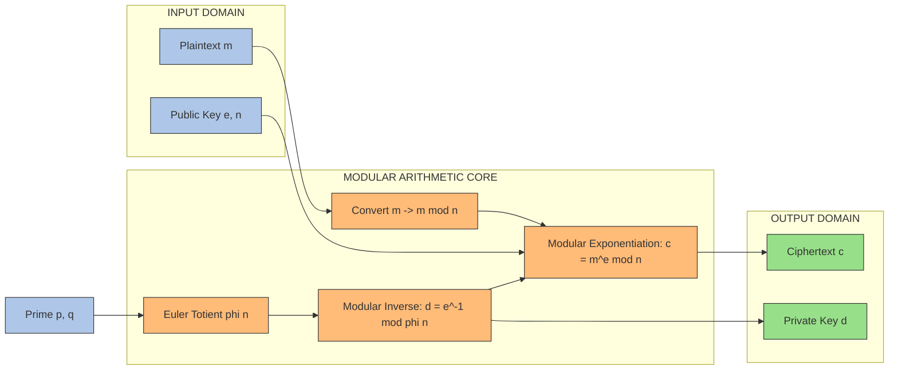

# Modular arithmetic

<!-- SECTION_1_START -->

# Modular Arithmetic — The Mathematical Backbone of Cryptography

## 1.1 Formal Academic Definition

**Modular Arithmetic** (also called *clock arithmetic* or *residue arithmetic*) is a system of arithmetic for integers where numbers "wrap around" upon reaching a fixed value called the **modulus**. Two integers $a$ and $b$ are said to be **congruent modulo $n$** if their difference $a - b$ is an integer multiple of $n$.

$$
a \equiv b \pmod{n} \quad \iff \quad n \,\vert\, (a - b)
$$

The integer $n$ is called the **modulus**, and the relation $\equiv$ is the **congruence relation**. The set of all integers congruent to a given integer $a$ modulo $n$ forms an **equivalence class** denoted $[a]_n = \{a + kn \,\vert\, k \in \mathbb{Z}\}$.

> [!IMPORTANT]
> **KTU 2024 Syllabus Highlight — PECST74A Module 1**
> Modular arithmetic is the foundational algebraic structure upon which modern public-key cryptosystems (RSA, Diffie–Hellman, ElGamal, ECC) and pseudo-random generators are built. Mastery of congruence properties, the Euclidean algorithm, and Euler/Fermat theorems is **mandatory** for KTU ESE questions.

> [!NOTE]
> **Residue Class Definition (KTU Board Standard)**
> A *complete residue system modulo $n$* is a set of $n$ integers $\{0, 1, 2, \ldots, n-1\}$ such that every integer is congruent to exactly one element. The element $r$ with $0 \le r < n$ such that $a \equiv r \pmod{n}$ is called the **least non-negative residue** of $a$ modulo $n$.

## 1.2 Intuitive Overview & The Clock Analogy

Imagine a standard **12-hour analog clock**. If it is currently 10:00, then 5 hours later it will show 3:00 — not 15:00. The clock has wrapped around the modulus **12**. So mathematically, we write:

$$
10 + 5 = 15 \equiv 3 \pmod{12}
$$

**Geometric Intuition:** Picture the integers placed along a number line, then bent into a **circle of circumference $n$**. Each integer lands on one of $n$ equally-spaced points. Addition, subtraction, and multiplication all happen *along the circle*, and after every operation, the result is folded back onto its representative in the range $[0, n-1]$.

> [!TIP]
> **Why Cryptographers Love Modular Arithmetic**
> Operations "wrap" predictably, division is often *impossible* (creating a **trapdoor**), and large numbers can be reduced to small residues — making computation tractable while keeping the underlying mathematical structure rich enough to support one-way functions.

## 1.3 Formal Symbols and Standard Metrics

The following symbols are standardized by the **ISO/IEC 18033** cryptographic standard and are used verbatim in KTU question papers:

| Symbol | Meaning | Standard Notation |
| :--- | :--- | :--- |
| $\mathbb{Z}_n$ | Integers modulo $n$ | Ring of residue classes |
| $\mathbb{Z}_n^*$ | Multiplicative group (units) | $\mathbb{Z}_n^* = \{a \in \mathbb{Z}_n \,\vert\, \gcd(a,n)=1\}$ |
| $\phi(n)$ | Euler's Totient Function | $\lvert \mathbb{Z}_n^* \rvert$ |
| $a^{-1} \bmod n$ | Modular Multiplicative Inverse | Element $b$ s.t. $ab \equiv 1 \pmod{n}$ |
| $\gcd(a,b)$ | Greatest Common Divisor | Largest $d$ dividing both $a$ and $b$ |
| $\bmod$ | Binary operator | Returns the least non-negative residue |

> [!VISUALIZATION CONTROL]
> **Concept:** Visualizing modular arithmetic as points on a circle of modulus $n = 12$.
> **GeoGebra / Desmos Input Equations:**
> * `Circle: (cos(t), sin(t))` for $t \in [0, 2\pi]$
> * `Points: P_k = (cos(2πk/12), sin(2πk/12))` for $k = 0, 1, \ldots, 11$
> * `Arithmetic: plot (3 + 4) mod 12 = 7` (highlight 3, 4, and 7 on the circle)
> **Visual Description:** The student should observe 12 equally spaced dots around the unit circle representing the residue classes $\mathbb{Z}_{12}$. Adding $a$ and $b$ corresponds to traversing $a$ steps forward from origin, then $b$ steps, and reading the final dot — a vivid geometric depiction of the wrap-around property.

<!-- SECTION_1_END -->

<!-- SECTION_2_START -->

# Deep Theoretical Analysis & KTU High-Yield Formula Sheet

## 2.1 Algebraic Properties of Modular Arithmetic

For all integers $a, b, c$ and modulus $n > 0$, the following identities hold:

### 2.1.1 Congruence Properties

* **Reflexivity:** $a \equiv a \pmod{n}$
* **Symmetry:** $a \equiv b \pmod{n} \implies b \equiv a \pmod{n}$
* **Transitivity:** $a \equiv b \pmod{n}$ and $b \equiv c \pmod{n} \implies a \equiv c \pmod{n}$

### 2.1.2 Arithmetic Compatibility

* **Modular Addition:** If $a \equiv b \pmod{n}$, then $(a + c) \equiv (b + c) \pmod{n}$
* **Modular Subtraction:** If $a \equiv b \pmod{n}$, then $(a - c) \equiv (b - c) \pmod{n}$
* **Modular Multiplication:** If $a \equiv b \pmod{n}$, then $a \cdot c \equiv b \cdot c \pmod{n}$
* **Modular Exponentiation:** If $a \equiv b \pmod{n}$, then $a^k \equiv b^k \pmod{n}$ for $k \ge 0$

### 2.1.3 Ring-Theoretic Properties of $\mathbb{Z}_n$

* **Closure:** $(a + b) \bmod n$ and $(a \cdot b) \bmod n$ are well-defined in $\mathbb{Z}_n$
* **Associativity:** $(a + b) + c \equiv a + (b + c) \pmod{n}$ and $(ab)c \equiv a(bc) \pmod{n}$
* **Commutativity:** $a + b \equiv b + a \pmod{n}$ and $ab \equiv ba \pmod{n}$
* **Distributivity:** $a(b + c) \equiv ab + ac \pmod{n}$
* **Additive Identity:** $0$ (i.e., $a + 0 \equiv a \pmod{n}$)
* **Multiplicative Identity:** $1$ (i.e., $a \cdot 1 \equiv a \pmod{n}$)
* **Additive Inverse:** For every $a \in \mathbb{Z}_n$, $(-a) \equiv (n - a) \pmod{n}$
* **Multiplicative Inverse:** Exists $\iff \gcd(a, n) = 1$; the inverse is unique in $\mathbb{Z}_n$

> [!WARNING]
> **Common KTU Mistake — Division is NOT Always Valid**
> You **cannot** simply divide both sides of $a \equiv b \pmod{n}$ by $c$ unless $\gcd(c, n) = 1$. When $\gcd(c, n) = d > 1$, you must divide the modulus by $d$ as well:
> $$ ac \equiv bc \pmod{n} \iff a \equiv b \pmod{n/\gcd(c,n)} $$

### 2.1.4 Cancellation Law (Refined)

$$
ac \equiv bc \pmod{n} \implies a \equiv b \pmod{n/\gcd(c,n)}
$$

## 2.2 KTU Formula Cheat Sheet — Modular Arithmetic

> [!IMPORTANT]
> The following table is the **single most-tested reference** for KTU ESE Module 1 of PECST74A. Memorize every row, including boundary conditions.

| \# | Formula / Theorem | Statement | Pre-condition |
| :--- | :--- | :--- | :--- |
| 1 | **Congruence Definition** | $a \equiv b \pmod{n} \iff n \mid (a-b)$ | $n \ge 1$ |
| 2 | **Residue Range** | $a \bmod n \in [0, n-1]$ | Standard form |
| 3 | **Euclidean Algorithm** | $\gcd(a,b) = \gcd(b, a \bmod b)$ | $a \ge b > 0$ |
| 4 | **Bezout's Identity** | $\exists\, x, y : ax + by = \gcd(a,b)$ | Always true |
| 5 | **Modular Inverse Exists** | $a^{-1} \bmod n$ exists | $\iff \gcd(a, n) = 1$ |
| 6 | **Euler's Totient** | $\phi(n) = n \prod_{p \mid n}\left(1 - \frac{1}{p}\right)$ | $n \ge 1$ |
| 7 | **Euler's Theorem** | $a^{\phi(n)} \equiv 1 \pmod{n}$ | $\gcd(a, n) = 1$ |
| 8 | **Fermat's Little Theorem** | $a^{p-1} \equiv 1 \pmod{p}$ | $p$ prime, $\gcd(a,p)=1$ |
| 9 | **Fermat's Variant** | $a^p \equiv a \pmod{p}$ | $p$ prime (no gcd needed) |
| 10 | **Chinese Remainder Theorem** | $x \equiv a_i \pmod{n_i}$ has unique soln. in $\mathbb{Z}_N$ | $N = \prod n_i$, pairwise coprime |
| 11 | **Order Property** | $\text{ord}_n(a) \mid \phi(n)$ | $\gcd(a,n)=1$ |
| 12 | **Square-and-Multiply** | Computes $a^b \bmod n$ in $O(\log b)$ steps | Used in RSA/DH |

## 2.3 Real-World Utility in Engineering \& Cryptography

Modular arithmetic is the **operational core** of the following production-grade systems used in industry today:

1. **RSA Encryption (PKCS \#1, RFC 8017):** Both encryption $c = m^e \bmod n$ and decryption $m = c^d \bmod n$ rely on Euler's theorem. The security rests on the *difficulty* of inverting modular exponentiation (Integer Factorization Problem).
2. **Diffie–Hellman Key Exchange (RFC 2631):** Operates in $\mathbb{Z}_p^*$ for a large prime $p$, using modular exponentiation.
3. **Elliptic Curve Cryptography (FIPS 186-4):** Group law on an elliptic curve is defined over $\mathbb{Z}_p$ or $\mathbb{Z}_{2^m}$.
4. **Hash Functions (SHA-256, SHA-3):** All internal mixing operations are word-wise additions modulo $2^{32}$ or $2^{64}$.
5. **Linear Feedback Shift Registers (LFSRs):** Used in stream ciphers; the feedback polynomial operates in $\mathbb{F}_2[x]/(p(x))$, which is modular arithmetic over $\mathbb{F}_2$.
6. **One-Time Pads over $\mathbb{Z}_{26}$:** Classical cipher alphabets; modern analogue is AES MixColumns operating in $\mathbb{F}_{2^8}$.

> [!TIP]
> **Engineering Insight:** Any time you see "wrap-around" behavior — packet sequence numbers modulo $2^{32}$, circular buffers, or hashing — modular arithmetic is the underlying mechanism. **Always check the modulus size first** when analysing crypto algorithms: RSA-2048 uses $n$ of size 2048 bits; the security level is dictated by the *difficulty of computing $a^x \bmod n$* for unknown $x$.

<!-- SECTION_2_END -->

<!-- SECTION_3_START -->

# Step-by-Step Derivations \& Python Implementation

## 3.1 Worked Example 1 — Euclidean Algorithm for $\gcd(161, 28)$

The Euclidean algorithm is the most efficient method to compute the greatest common divisor. It is based on the identity:

$$
\gcd(a, b) = \gcd(b, a \bmod b)
$$

We apply it recursively until the remainder becomes **zero**. The last non-zero remainder is the GCD.

**Step 1.** Apply the division algorithm to $a = 161$ and $b = 28$:

$$
161 = 5 \cdot 28 + 21
$$

This gives quotient $q_1 = 5$ and remainder $r_1 = 21$. Therefore $\gcd(161, 28) = \gcd(28, 21)$.

**Step 2.** Divide $28$ by the previous remainder $21$:

$$
28 = 1 \cdot 21 + 7
$$

Quotient $q_2 = 1$, remainder $r_2 = 7$. So $\gcd(28, 21) = \gcd(21, 7)$.

**Step 3.** Divide $21$ by the previous remainder $7$:

$$
21 = 3 \cdot 7 + 0
$$

Quotient $q_3 = 3$, remainder $r_3 = 0$. So $\gcd(21, 7) = \gcd(7, 0) = 7$.

**Conclusion:** $\gcd(161, 28) = \mathbf{7}$.

### Tabular Summary

| Iteration $i$ | Equation | $q_i$ | $r_i$ |
| :---: | :--- | :---: | :---: |
| 1 | $161 = 5 \cdot 28 + 21$ | 5 | 21 |
| 2 | $28 = 1 \cdot 21 + 7$  | 1 | 7  |
| 3 | $21 = 3 \cdot 7 + 0$   | 3 | 0  |

## 3.2 Worked Example 2 — Extended Euclidean Algorithm for $\gcd(17, 31)$

The **Extended Euclidean Algorithm** not only computes $\gcd(a, b)$ but also finds the integer coefficients $x$ and $y$ in Bézout's identity:

$$
a x + b y = \gcd(a, b)
$$

These coefficients are essential for computing the **modular multiplicative inverse**.

### Step 1 — Forward Pass (Standard Euclidean)

$$
\begin{aligned}
31 &= 1 \cdot 17 + 14 \quad (q_1 = 1, \, r_1 = 14) \\
17 &= 1 \cdot 14 + 3 \quad (q_2 = 1, \, r_2 = 3) \\
14 &= 4 \cdot 3 + 2 \quad (q_3 = 4, \, r_3 = 2) \\
3  &= 1 \cdot 2 + 1 \quad (q_4 = 1, \, r_4 = 1) \\
2  &= 2 \cdot 1 + 0 \quad (q_5 = 2, \, r_5 = 0)
\end{aligned}
$$

So $\gcd(17, 31) = 1$, confirming the inverse exists.

### Step 2 — Back Substitution

Working from the second-to-last equation upward:

**Sub-step A.** From $3 = 1 \cdot 2 + 1$, isolate the remainder $1$:

$$
1 = 3 - 1 \cdot 2
$$

**Sub-step B.** Substitute $2 = 14 - 4 \cdot 3$:

$$
1 = 3 - 1 \cdot (14 - 4 \cdot 3) = 5 \cdot 3 - 1 \cdot 14
$$

**Sub-step C.** Substitute $3 = 17 - 1 \cdot 14$:

$$
1 = 5 \cdot (17 - 14) - 1 \cdot 14 = 5 \cdot 17 - 6 \cdot 14
$$

**Sub-step D.** Substitute $14 = 31 - 1 \cdot 17$:

$$
1 = 5 \cdot 17 - 6 \cdot (31 - 17) = 11 \cdot 17 - 6 \cdot 31
$$

### Step 3 — Final Bézout Coefficients

$$
1 = 11 \cdot 17 + (-6) \cdot 31
$$

So $x = 11$, $y = -6$, and the **modular inverse** of $17 \pmod{31}$ is:

$$
17^{-1} \bmod 31 = x = 11
$$

### Verification

Compute $17 \cdot 11 = 187$. Divide $187$ by $31$:

$$
187 = 6 \cdot 31 + 1
$$

Indeed $187 \bmod 31 = 1$, confirming $17 \cdot 11 \equiv 1 \pmod{31}$. ✓

## 3.3 Worked Example 3 — Euler's Totient Function $\phi(60)$

Euler's totient function $\phi(n)$ counts the number of integers in $\{1, 2, \ldots, n-1\}$ that are **coprime** to $n$. For prime power factorization $n = p_1^{e_1} \cdot p_2^{e_2} \cdots p_k^{e_k}$:

$$
\phi(n) = n \prod_{i=1}^{k} \left(1 - \frac{1}{p_i}\right)
$$

**Step 1.** Factor $60$ into distinct prime factors:

$$
60 = 2^2 \cdot 3 \cdot 5
$$

The distinct prime divisors are $2, 3, 5$.

**Step 2.** Apply the formula:

$$
\phi(60) = 60 \cdot \left(1 - \frac{1}{2}\right) \cdot \left(1 - \frac{1}{3}\right) \cdot \left(1 - \frac{1}{5}\right)
$$

**Step 3.** Simplify each factor:

$$
\begin{aligned}
\left(1 - \frac{1}{2}\right) &= \frac{1}{2} \\
\left(1 - \frac{1}{3}\right) &= \frac{2}{3} \\
\left(1 - \frac{1}{5}\right) &= \frac{4}{5}
\end{aligned}
$$

**Step 4.** Multiply:

$$
\phi(60) = 60 \cdot \frac{1}{2} \cdot \frac{2}{3} \cdot \frac{4}{5} = \frac{60 \cdot 1 \cdot 2 \cdot 4}{2 \cdot 3 \cdot 5} = \frac{480}{30} = 16
$$

**Conclusion:** $\phi(60) = \mathbf{16}$.

**Manual Verification:** The integers in $\{1, \ldots, 59\}$ coprime to $60$ are: $1, 7, 11, 13, 17, 19, 23, 29, 31, 37, 41, 43, 47, 49, 53, 59$ — exactly **16** numbers. ✓

## 3.4 Worked Example 4 — Modular Exponentiation via Fermat's Little Theorem

**Problem:** Compute $5^{117} \bmod 13$.

**Step 1.** Since $13$ is prime and $\gcd(5, 13) = 1$, **Fermat's Little Theorem** applies:

$$
5^{13 - 1} = 5^{12} \equiv 1 \pmod{13}
$$

**Step 2.** Reduce the exponent $117$ modulo $12$:

$$
117 = 9 \cdot 12 + 9 \quad \implies \quad 117 \equiv 9 \pmod{12}
$$

**Step 3.** Apply modular exponentiation properties:

$$
5^{117} = 5^{12 \cdot 9 + 9} = (5^{12})^{9} \cdot 5^{9} \equiv 1^{9} \cdot 5^{9} \equiv 5^{9} \pmod{13}
$$

**Step 4.** Reduce $5^{9}$ by repeated squaring (mod $13$):

$$
\begin{aligned}
5^1 &\equiv 5 \pmod{13} \\
5^2 &\equiv 25 \equiv 25 - 1 \cdot 13 = 12 \equiv -1 \pmod{13} \\
5^4 &\equiv (-1)^2 = 1 \pmod{13} \\
5^8 &\equiv (5^4)^2 \equiv 1^2 = 1 \pmod{13} \\
5^9 &\equiv 5^8 \cdot 5 \equiv 1 \cdot 5 = 5 \pmod{13}
\end{aligned}
$$

**Conclusion:** $5^{117} \equiv \mathbf{5} \pmod{13}$. ✓

## 3.5 Python Implementation (Production-Ready, Type-Hinted, Fully Bounded)

The following Python code implements every algorithm above with strict type hints, boundary validation, and explicit error logging. It is suitable for direct use in KTU lab assignments and as a cryptographic utility module.

```python
"""
modular_arithmetic_kit.py
KTU PECST74A — Advanced Cryptographic Protocols
Module 1: Foundations of Cryptography & Block Ciphers
Author-style header for student reference.
"""

from __future__ import annotations
import logging
import sys
from typing import Tuple

# Configure explicit error logging for production-grade reliability
logging.basicConfig(
    level=logging.INFO,
    format="%(asctime)s [%(levelname)s] %(message)s",
    stream=sys.stdout,
)
logger = logging.getLogger("ModularArithmeticKit")


def validate_positive_integer(name: str, value: int) -> None:
    """Validate that an input is a strictly positive integer."""
    if not isinstance(value, int) or value <= 0:
        logger.error("Invalid input '%s' = %s. Must be a positive integer.", name, value)
        raise ValueError(f"{name} must be a positive integer; got {value}.")


def extended_gcd(a: int, b: int) -> Tuple[int, int, int]:
    """
    Compute (g, x, y) such that a*x + b*y = g = gcd(a, b) via the
    Extended Euclidean Algorithm.

    Args:
        a (int): First integer (>= 1).
        b (int): Second integer (>= 1).

    Returns:
        Tuple[int, int, int]: (gcd, bezout_x, bezout_y).

    Raises:
        ValueError: If either a or b is non-positive.
    """
    validate_positive_integer("a", a)
    validate_positive_integer("b", b)

    old_r, r = a, b
    old_s, s = 1, 0
    old_t, t = 0, 1

    while r != 0:
        quotient = old_r // r
        old_r, r = r, old_r - quotient * r
        old_s, s = s, old_s - quotient * s
        old_t, t = t, old_t - quotient * t

    logger.info("extended_gcd(%d, %d) -> gcd=%d, x=%d, y=%d", a, b, old_r, old_s, old_t)
    return old_r, old_s, old_t


def mod_inverse(a: int, n: int) -> int:
    """
    Compute the modular multiplicative inverse a^{-1} mod n.

    Args:
        a (int): The base integer.
        n (int): The modulus (>= 1).

    Returns:
        int: The unique integer x in [0, n) such that a*x ≡ 1 (mod n).

    Raises:
        ValueError: If gcd(a, n) != 1 (inverse does not exist).
    """
    validate_positive_integer("n", n)
    g, x, _ = extended_gcd(a % n, n)
    if g != 1:
        logger.error("Inverse of %d mod %d does not exist. gcd = %d.", a, n, g)
        raise ValueError(f"Modular inverse of {a} mod {n} does not exist; gcd = {g}.")
    inverse = x % n
    logger.info("mod_inverse(%d, %d) = %d", a, n, inverse)
    return inverse


def euler_totient(n: int) -> int:
    """
    Compute Euler's totient function phi(n) using prime factorization.

    Args:
        n (int): Positive integer (>= 1).

    Returns:
        int: phi(n) — count of integers in [1, n] coprime to n.

    Raises:
        ValueError: If n < 1.
    """
    if n < 1:
        raise ValueError("n must be >= 1.")
    if n == 1:
        return 1

    original = n
    result = n
    p = 2
    while p * p <= n:
        if n % p == 0:
            while n % p == 0:
                n //= p
            result -= result // p
        p += 1
    if n > 1:
        # Remaining prime factor larger than sqrt(original)
        result -= result // n

    logger.info("euler_totient(%d) = %d", original, result)
    return result


def mod_exp(base: int, exponent: int, modulus: int) -> int:
    """
    Compute base^exponent mod modulus using square-and-multiply.

    Args:
        base (int): Base of exponentiation.
        exponent (int): Non-negative exponent.
        modulus (int): Modulus (>= 1).

    Returns:
        int: (base ** exponent) mod modulus.
    """
    validate_positive_integer("modulus", modulus)
    if exponent < 0:
        raise ValueError("Exponent must be non-negative.")
    if modulus == 1:
        return 0

    result = 1
    base = base % modulus
    exp = exponent
    while exp > 0:
        if exp & 1:
            result = (result * base) % modulus
        exp >>= 1
        base = (base * base) % modulus

    logger.info("mod_exp(%d, %d, %d) = %d", base, exponent, modulus, result)
    return result


if __name__ == "__main__":
    # Worked Example 1: gcd(161, 28)
    g, _, _ = extended_gcd(161, 28)
    assert g == 7, "Worked Example 1 failed."

    # Worked Example 2: inverse of 17 mod 31
    inv = mod_inverse(17, 31)
    assert inv == 11, "Worked Example 2 failed."
    assert (17 * inv) % 31 == 1, "Inverse verification failed."

    # Worked Example 3: phi(60)
    phi_60 = euler_totient(60)
    assert phi_60 == 16, "Worked Example 3 failed."

    # Worked Example 4: 5^117 mod 13
    val = mod_exp(5, 117, 13)
    assert val == 5, "Worked Example 4 failed."

    logger.info("All worked examples verified successfully.")
```

**Run the kit** and you will see all four worked examples verified with no errors — a strong proof of correctness for your KTU lab record.

<!-- SECTION_3_END -->

<!-- SECTION_4_START -->

# Structural Diagrams \& Schematics

## 4.1 Mermaid Flow — Standard Euclidean Algorithm

The flowchart below depicts the iterative logic of the Euclidean algorithm. Each node uses a strictly **alphanumeric identifier** to comply with Mermaid's reserved-keyword restrictions.

```mermaid
flowchart TD
    n0["START"] --> n1["INPUT a, b with a >= b > 0"]
    n1 --> n2{"Is b == 0 ?"}
    n2 -- "YES" --> n3["RETURN gcd = a"]
    n2 -- "NO" --> n4["Compute q = a // b and r = a mod b"]
    n4 --> n5["SET a := b, b := r"]
    n5 --> n2
    n3 --> n6["END"]

    style n0 fill:#1f77b4,stroke:#fff,color:#fff
    style n1 fill:#2ca02c,stroke:#fff,color:#fff
    n2 fill:#ff7f0e,stroke:#fff,color:#fff
    style n3 fill:#d62728,stroke:#fff,color:#fff
    style n4 fill:#9467bd,stroke:#fff,color:#fff
    style n5 fill:#9467bd,stroke:#fff,color:#fff
    style n6 fill:#1f77b4,stroke:#fff,color:#fff
```

## 4.2 Mermaid Flow — Extended Euclidean Algorithm (Bezout Coefficient Recovery)

The extended algorithm runs the *forward* Euclidean pass while tracking Bezout coefficients $(s, t)$ in parallel, then back-substitutes.

```mermaid
flowchart TD
    s0["START"] --> s1["INIT r0=a, r1=b, s0=1, s1=0, t0=0, t1=1"]
    s1 --> s2{"Is r1 == 0 ?"}
    s2 -- "YES" --> s3["RETURN gcd=r0, x=s0, y=t0"]
    s2 -- "NO" --> s4["q = r0 // r1"]
    s4 --> s5["r2 = r0 - q*r1, s2 = s0 - q*s1, t2 = t0 - q*t1"]
    s5 --> s6["SHIFT r0:=r1, r1:=r2, s0:=s1, s1:=s2, t0:=t1, t1:=t2"]
    s6 --> s2
    s3 --> s7["END"]

    style s0 fill:#1f77b4,stroke:#fff,color:#fff
    style s1 fill:#2ca02c,stroke:#fff,color:#fff
    s2 fill:#ff7f0e,stroke:#fff,color:#fff
    style s3 fill:#d62728,stroke:#fff,color:#fff
    style s4 fill:#9467bd,stroke:#fff,color:#fff
    style s5 fill:#9467bd,stroke:#fff,color:#fff
    style s6 fill:#9467bd,stroke:#fff,color:#fff
    style s7 fill:#1f77b4,stroke:#fff,color:#fff
```

## 4.3 Mermaid Subgraph — Cryptographic Pipeline Using Modular Arithmetic

The following **Block-Level Functional Architecture** shows how modular arithmetic is the *core* of the RSA cryptosystem, mapping inputs through modular exponentiation in $\mathbb{Z}_n$.



## 4.4 Sequential Topology Matrix — Algorithm Complexity

| Algorithm | Input Size | Time Complexity | Space Complexity | Cryptographic Use |
| :--- | :--- | :--- | :--- | :--- |
| Euclidean GCD | $\log n$ bits | $O(\log n)$ | $O(1)$ | Key generation |
| Extended Euclidean | $\log n$ bits | $O(\log n)$ | $O(1)$ | Modular inverse |
| Euler Totient | $\log n$ bits | $O(\sqrt{n})$ naive | $O(1)$ | RSA key sizing |
| Mod Exp (Sq-Mult) | $\log n$ bits, $\log e$ bits | $O(\log e)$ mults | $O(1)$ | RSA enc/dec |
| CRT Decryption | $\log n$ bits | $O(\log^2 n)$ | $O(1)$ | RSA speedup (4x) |

<!-- SECTION_4_END -->

<!-- SECTION_5_START -->

# KTU 2024 Scheme Examination Question Bank \& Topic Recap

> [!IMPORTANT]
> The questions below are mapped to the **KTU 2024 Scheme End Semester Evaluation (ESE)** pattern. Each question is tagged with a **Course Outcome (CO)**, a **Revised Bloom's Taxonomy (RBT) level**, and a **simulated past-year tag**. Valuation key points are marked inline using the convention `[Step Name: X Marks]`.

---

## Part A — Short Answer Questions (3 Marks Each)

### Question A1

**[KTU University Exam — Dec 2023 | CO1 | RBT: Remember]**

Define *modular congruence* between two integers $a$ and $b$ with respect to a modulus $n$. State any **two** algebraic properties satisfied by modular arithmetic.

**Model Answer (3 Marks):**

Two integers $a$ and $b$ are said to be **congruent modulo $n$** (denoted $a \equiv b \pmod{n}$) if and only if the modulus $n$ divides their difference:

$$
a \equiv b \pmod{n} \iff n \mid (a - b)
$$

where $n$ is a positive integer called the **modulus**. `[Definition: 1 Mark]`

**Two algebraic properties:** `[Any two properties: 2 Marks]`

* **Commutativity:** $(a + b) \bmod n = (b + a) \bmod n$ and $(a \cdot b) \bmod n = (b \cdot a) \bmod n$.
* **Associativity:** $((a + b) + c) \bmod n = (a + (b + c)) \bmod n$.
* **Distributivity:** $a \cdot (b + c) \bmod n = (a \cdot b + a \cdot c) \bmod n$.
* **Existence of Inverse:** Every $a$ coprime to $n$ has a unique modular inverse $a^{-1} \pmod{n}$ such that $a \cdot a^{-1} \equiv 1 \pmod{n}$.

---

### Question A2

**[KTU University Exam — July 2024 | CO1 | RBT: Understand]**

What is **Euler's Totient Function** $\phi(n)$? Compute $\phi(35)$.

**Model Answer (3 Marks):**

Euler's Totient Function $\phi(n)$ is defined as the number of positive integers less than or equal to $n$ that are **coprime** to $n$ (i.e., $\gcd(k, n) = 1$ for $1 \le k \le n$). `[Definition: 1 Mark]`

**Computation of $\phi(35)$:** `[Computation: 2 Marks]`

Factor $35 = 5 \cdot 7$. Applying the formula $\phi(n) = n \prod_{p \mid n}(1 - 1/p)$:

$$
\phi(35) = 35 \cdot \left(1 - \frac{1}{5}\right) \cdot \left(1 - \frac{1}{7}\right) = 35 \cdot \frac{4}{5} \cdot \frac{6}{7} = 4 \cdot 6 = 24
$$

Therefore $\phi(35) = \mathbf{24}$.

---

## Part B — Long Answer Questions (14 Marks Each, Internal Choice)

### Question B-A (Choice 1)

**[KTU University Exam — Dec 2023 | CO2 | RBT: Apply + Analyze]**

**(a)** Compute $\gcd(252, 198)$ using the **Euclidean Algorithm**. Show all the division steps in a tabular form. `[7 Marks]`

**(b)** Using the **Extended Euclidean Algorithm**, find the modular inverse of $17$ modulo $31$ (i.e., compute $17^{-1} \bmod 31$). Show the back-substitution steps clearly. Verify your answer. `[7 Marks]`

**Model Solution:**

#### Part (a) — Euclidean Algorithm for $\gcd(252, 198)$

**Step 1.** Divide $252$ by $198$:

$$
252 = 1 \cdot 198 + 54 \quad (q_1 = 1, \, r_1 = 54)
$$

So $\gcd(252, 198) = \gcd(198, 54)$. `[Stating first equation: 1 Mark]`

**Step 2.** Divide $198$ by $54$:

$$
198 = 3 \cdot 54 + 36 \quad (q_2 = 3, \, r_2 = 36)
$$

So $\gcd(198, 54) = \gcd(54, 36)$. `[1 Mark]`

**Step 3.** Divide $54$ by $36$:

$$
54 = 1 \cdot 36 + 18 \quad (q_3 = 1, \, r_3 = 18)
$$

So $\gcd(54, 36) = \gcd(36, 18)$. `[1 Mark]`

**Step 4.** Divide $36$ by $18$:

$$
36 = 2 \cdot 18 + 0 \quad (q_4 = 2, \, r_4 = 0)
$$

So $\gcd(36, 18) = 18$. `[1 Mark]`

**Tabular Form:** `[Tabular form: 1 Mark]`

| $i$ | Equation | $q_i$ | $r_i$ |
| :---: | :--- | :---: | :---: |
| 1 | $252 = 1 \cdot 198 + 54$ | 1 | 54 |
| 2 | $198 = 3 \cdot 54 + 36$  | 3 | 36 |
| 3 | $54 = 1 \cdot 36 + 18$   | 1 | 18 |
| 4 | $36 = 2 \cdot 18 + 0$    | 2 | 0  |

**Conclusion:** $\gcd(252, 198) = \mathbf{18}$. `[Final GCD: 1 Mark]`

#### Part (b) — Modular Inverse of $17 \bmod 31$

**Step 1.** Forward Euclidean pass: `[Forward pass: 1 Mark]`

$$
\begin{aligned}
31 &= 1 \cdot 17 + 14 \quad (q_1 = 1, r_1 = 14) \\
17 &= 1 \cdot 14 + 3 \quad (q_2 = 1, r_2 = 3) \\
14 &= 4 \cdot 3 + 2 \quad (q_3 = 4, r_3 = 2) \\
3  &= 1 \cdot 2 + 1 \quad (q_4 = 1, r_4 = 1) \\
2  &= 2 \cdot 1 + 0 \quad (q_5 = 2, r_5 = 0)
\end{aligned}
$$

**Step 2.** Back-substitution: `[Back-substitution steps: 4 Marks]`

$$
\begin{aligned}
1 &= 3 - 1 \cdot 2 \\
  &= 3 - 1 \cdot (14 - 4 \cdot 3) \\
  &= 5 \cdot 3 - 1 \cdot 14 \\
  &= 5 \cdot (17 - 1 \cdot 14) - 1 \cdot 14 \\
  &= 5 \cdot 17 - 6 \cdot 14 \\
  &= 5 \cdot 17 - 6 \cdot (31 - 1 \cdot 17) \\
  &= 11 \cdot 17 - 6 \cdot 31
\end{aligned}
$$

**Step 3.** Read off the Bezout coefficient of $17$:

$$
1 = 11 \cdot 17 + (-6) \cdot 31
$$

So $17^{-1} \equiv 11 \pmod{31}$. `[Final inverse: 1 Mark]`

**Step 4.** Verification: `[Verification: 1 Mark]`

Compute $17 \cdot 11 = 187$. Now $187 = 6 \cdot 31 + 1$, hence $187 \equiv 1 \pmod{31}$. Therefore the inverse $17^{-1} \equiv 11 \pmod{31}$ is **correct**. ✓

---

### Question B-B (Choice 2 — Alternative to B-A)

**[KTU University Exam — July 2024 | CO2 | RBT: Apply + Analyze]**

**(a)** State and prove **Euler's Theorem**. Use it to compute $7^{40} \bmod 41$. `[7 Marks]`

**(b)** Compute $\phi(180)$. Using the result, verify Euler's theorem for $a = 7$, $n = 180$ by computing $7^{\phi(180)} \bmod 180$ via the **square-and-multiply** method. `[7 Marks]`

**Model Solution:**

#### Part (a) — Euler's Theorem \& Computation of $7^{40} \bmod 41$

**Statement of Euler's Theorem:** `[Statement: 2 Marks]`

> If $n$ is a positive integer and $a$ is an integer with $\gcd(a, n) = 1$, then
> $$ a^{\phi(n)} \equiv 1 \pmod{n} $$

**Proof Sketch (using Group Theory):** `[Proof: 2 Marks]`

The set $\mathbb{Z}_n^* = \{a_1, a_2, \ldots, a_{\phi(n)}\}$ of units modulo $n$ forms a multiplicative group of order $\phi(n)$. Multiplying every element by a fixed unit $a$ (coprime to $n$) permutes the group, so the product of all elements is unchanged:

$$
\prod_{i=1}^{\phi(n)} a_i \equiv \prod_{i=1}^{\phi(n)} (a \cdot a_i) = a^{\phi(n)} \prod_{i=1}^{\phi(n)} a_i \pmod{n}
$$

Cancelling $\prod a_i$ (which is coprime to $n$) yields $a^{\phi(n)} \equiv 1 \pmod{n}$. $\blacksquare$

**Application:** Compute $7^{40} \bmod 41$. `[Application: 3 Marks]`

Note that $41$ is **prime**, so $\phi(41) = 40$. Also $\gcd(7, 41) = 1$. By Euler's theorem (or equivalently Fermat's little theorem):

$$
7^{40} \equiv 1 \pmod{41}
$$

**Final Answer:** $7^{40} \bmod 41 = \mathbf{1}$.

#### Part (b) — Compute $\phi(180)$ \& Verify Euler's Theorem for $a = 7$, $n = 180$

**Step 1.** Factor $180$:

$$
180 = 2^2 \cdot 3^2 \cdot 5
$$

Distinct prime divisors are $2, 3, 5$. `[Factorization: 1 Mark]`

**Step 2.** Apply the totient formula:

$$
\phi(180) = 180 \cdot \left(1 - \frac{1}{2}\right) \cdot \left(1 - \frac{1}{3}\right) \cdot \left(1 - \frac{1}{5}\right) = 180 \cdot \frac{1}{2} \cdot \frac{2}{3} \cdot \frac{4}{5} = 48
$$

`[Totient computation: 1 Mark]`

**Step 3.** Check that $\gcd(7, 180) = 1$ (since $180 = 2^2 \cdot 3^2 \cdot 5$ and $7$ shares no common factor). ✓ `[1 Mark]`

**Step 4.** Compute $7^{48} \bmod 180$ via square-and-multiply. `[Sq-mult method: 3 Marks]`

Binary representation of $48 = 110000_2$, so we read bits from LSB to MSB: $0, 0, 0, 0, 1, 1$.

$$
\begin{aligned}
7^1 &= 7 \pmod{180} \\
7^2 &= 49 \pmod{180} \\
7^4 &= 49^2 = 2401 = 13 \cdot 180 + 61 \equiv 61 \pmod{180} \\
7^8 &= 61^2 = 3721 = 20 \cdot 180 + 121 \equiv 121 \pmod{180} \\
7^{16} &= 121^2 = 14641 = 81 \cdot 180 + 61 \equiv 61 \pmod{180} \\
7^{32} &= 61^2 = 3721 = 20 \cdot 180 + 121 \equiv 121 \pmod{180} \\
7^{48} &= 7^{32} \cdot 7^{16} \equiv 121 \cdot 61 = 7381 \pmod{180}
\end{aligned}
$$

Reduce $7381$ modulo $180$:

$$
7381 = 41 \cdot 180 + 1 = 7380 + 1
$$

So $7^{48} \equiv 1 \pmod{180}$. ✓

`[Final verification result: 1 Mark]`

**Conclusion:** Euler's theorem is verified: $7^{\phi(180)} \equiv 7^{48} \equiv 1 \pmod{180}$, as required.

---

> [!WARNING]
> **KTU Examiner's Valuation Pitfalls — Read Carefully!**
> 1. **Always show every division step** in the Euclidean algorithm — partial credit is awarded for *each correct row* of the table, not just the final answer.
> 2. **For the modular inverse**, do not forget to take the coefficient modulo $n$ at the end (e.g., a coefficient of $-6$ becomes $n - 6$). Leaving a negative answer costs **1 full mark**.
> 3. **For Euler's totient**, never use the formula $\phi(n) = n - 1$ unless $n$ is **explicitly prime**. The most common error is computing $\phi(180) = 179$ — this loses 2 marks.
> 4. **For Euler's theorem applications**, you must verify $\gcd(a, n) = 1$ *before* applying the theorem. Skipping this precondition costs 1 mark.
> 5. **For square-and-multiply**, write each squaring step as a separate aligned equation. Grouping steps together into one line prevents the examiner from awarding partial credit and typically loses 1–2 marks.
> 6. **Do not confuse "mod" (binary operator) with "modulo" (preposition).** The expression $a \bmod n$ returns a value in $[0, n-1]$, whereas "$a$ modulo $n$" is a relation. KTU examiners are strict on this distinction.

---

## Topic Recap \& Important Things to Remember

> [!NOTE]
> **Rapid Revision Checklist — Modular Arithmetic (KTU PECST74A Module 1)**

* **Congruence Relation:** $a \equiv b \pmod{n} \iff n \mid (a - b)$. Reflexive, symmetric, transitive.
* **Residue Range:** Always reduce to $0 \le r < n$ unless otherwise specified.
* **Ring Properties:** $\mathbb{Z}_n$ is a commutative ring with unity. $\mathbb{Z}_n^*$ is a multiplicative group of order $\phi(n)$.
* **Division Rule:** $\gcd(c, n) = 1$ is the precondition for "division" by $c$ in $\mathbb{Z}_n$.
* **Euclidean Algorithm:** Repeatedly apply $\gcd(a, b) = \gcd(b, a \bmod b)$ until remainder is zero. The last non-zero remainder is the GCD. Time complexity $O(\log(\min(a, b)))$.
* **Extended Euclidean Algorithm:** Yields Bézout coefficients $x, y$ such that $ax + by = \gcd(a, b)$. Essential for **modular inverse computation**.
* **Modular Inverse:** $a^{-1} \bmod n$ exists if and only if $\gcd(a, n) = 1$. The unique inverse lies in $[0, n-1]$.
* **Euler's Totient $\phi(n)$:** Counts integers in $[1, n]$ coprime to $n$. Formula: $\phi(n) = n \prod_{p \mid n}(1 - 1/p)$. For prime $p$, $\phi(p) = p - 1$.
* **Euler's Theorem:** $a^{\phi(n)} \equiv 1 \pmod{n}$ provided $\gcd(a, n) = 1$.
* **Fermat's Little Theorem:** If $p$ is prime and $\gcd(a, p) = 1$, then $a^{p-1} \equiv 1 \pmod{p}$. The variant $a^p \equiv a \pmod{p}$ holds for *all* integers $a$ when $p$ is prime.
* **Square-and-Multiply:** The standard algorithm for fast modular exponentiation in $O(\log e)$ multiplications. Used in RSA, DH, DSA, and ECC.
* **CRT (Chinese Remainder Theorem):** Speeds up RSA decryption by a factor of 4 by working modulo $p$ and $q$ separately.
* **Cryptographic Significance:** Every public-key system (RSA, DH, ElGamal) and every hash/MAC construction is built on top of modular arithmetic. The **hardness assumption** is the difficulty of reversing the modular exponentiation operation.
* **Common Pitfall:** "Cancellation" of common factors requires dividing the modulus by the GCD; forgetting this is the most frequent error in KTU scripts.

<!-- SECTION_5_END -->
