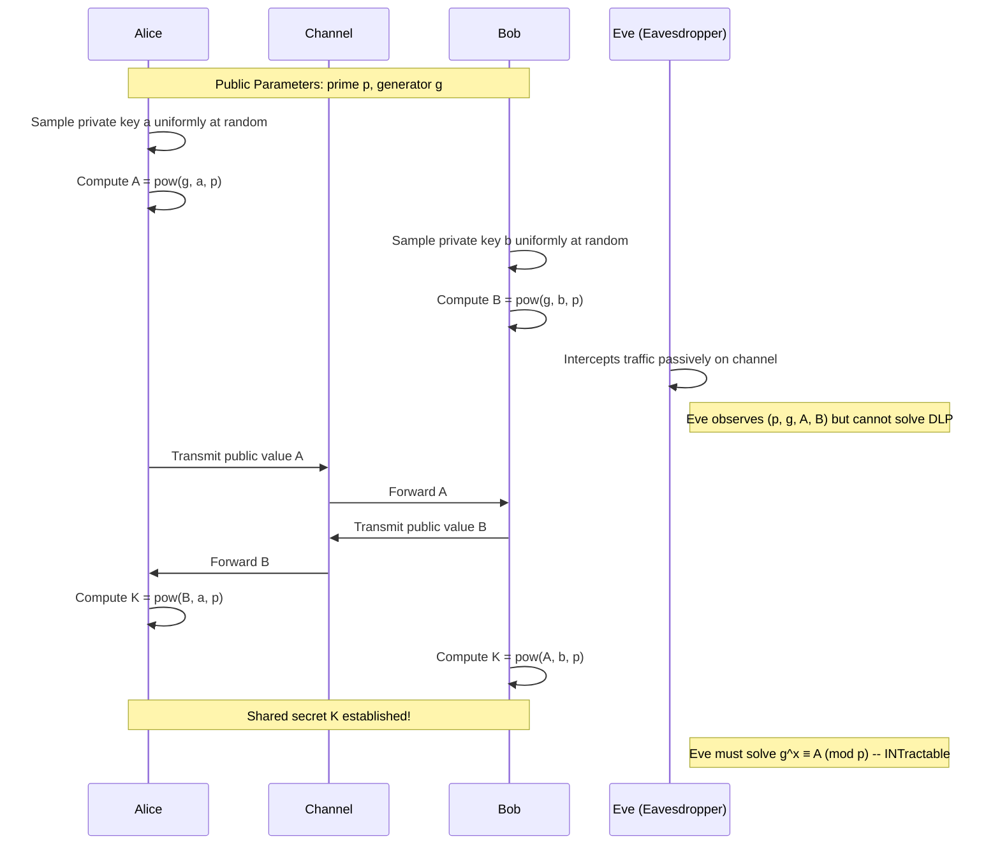

# Diffie-Hellman key exchange

<!-- SECTION_1_START -->
# Diffie-Hellman Key Exchange (DHKE)

## 1. Formal Academic Definition

> [!IMPORTANT]
> **Diffie-Hellman Key Exchange (DHKE)** is a specific method of securely exchanging cryptographic keys over a **public**, untrusted communication channel. It is the first published instance of a **public-key protocol** and is formally defined within the computational-hardness assumptions of the **Decisional Diffie-Hellman (DDH)** problem and the **Computational Diffie-Hellman (CDH)** problem, both of which rely on the intractability of the **Discrete Logarithm Problem (DLP)** over a finite cyclic group.

The protocol, conceptualized by **Whitfield Diffie** and **Martin Hellman** in their seminal 1976 paper *"New Directions in Cryptography"*, enables two parties, traditionally named **Alice** and **Bob**, to establish a **shared secret** $K$ without prior shared information, solely through the exchange of public parameters.

> [!NOTE]
> **Syllabus Highlight (KTU 2024 Scheme):** Within Module 2, DHKE is the foundational primitive on which **ElGamal encryption**, **Digital Signature Algorithm (DSA)**, and **Elliptic Curve Diffie-Hellman (ECDH)** are built. Mastery of the discrete exponentiation mechanics is mandatory before transitioning to ECC.

## 2. Intuitive Overview — The "Color Mixing" Analogy

To eliminate the abstract fear surrounding modular exponentiation, picture the protocol as a physical paint-mixing ritual executed on a public stage:

1. **Public Paint (the base color):** Everyone agrees on a common paint color, say **Yellow**. This is the public generator $g$ and public prime modulus $p$.
2. **Alice's Secret:** Alice privately chooses a **Red** paint (her private key $a$). She mixes it with Yellow to produce **Orange** (her public value $A = g^a \bmod p$). Orange is broadcast openly.
3. **Bob's Secret:** Bob privately chooses a **Blue** paint (his private key $b$). He mixes it with Yellow to produce **Green** (his public value $B = g^b \bmod p$). Green is broadcast openly.
4. **The Magic Step:** Alice takes Bob's public **Green** and adds her private **Red** to produce **Brown**. Bob takes Alice's public **Orange** and adds his private **Blue**. Both independently arrive at the **same Brown** — the shared secret $K$.
5. **The Eavesdropper's Problem:** An eavesdropper (Eve) sees Yellow, Orange, and Green. She cannot separate Red from Orange or Blue from Green. Recovering the secret is mathematically equivalent to unmixing irreversibly combined pigments.

> [!TIP]
> **Geometric Intuition:** Think of exponentiation as a one-way scrambling function. Going forward ($g \rightarrow g^a$) is **fast** (exponentiation by squaring, $\mathcal{O}(\log a)$). Going backward ($A \rightarrow a$, i.e., finding the discrete logarithm) is **intractable** for cryptographically large primes ($\mathcal{O}(\sqrt{p})$ using baby-step giant-step).

## 3. The Mathematical Foundation — Discrete Logarithm Problem (DLP)

The entire security of DHKE rests on the DLP. Given a cyclic group $G$ of order $n$ with generator $g$ and an element $h \in G$, the DLP is to find an integer $x$ such that:

$$g^x \equiv h \pmod{p}$$

* **Forward Direction (Easy):** Computing $h = g^x \bmod p$ takes $\mathcal{O}(\log x)$ multiplications.
* **Reverse Direction (Hard):** Computing $x = \log_g h$ over carefully chosen groups takes **sub-exponential or exponential** time, depending on the group.

> [!WARNING]
> **Common Misconception:** The DLP is hard for primes $p$ where $p - 1$ has a **large prime factor** (i.e., $p$ is a *safe prime* of the form $p = 2q + 1$). Using a weak prime enables **Pohlig-Hellman decomposition**, which reduces the DLP to smaller subproblems and breaks the system.

## 4. Visualization Control

> [!VISUALIZATION CONTROL]
> **Concept:** Cyclic structure of a multiplicative group $\mathbb{Z}_p^*$ showing generator orbit.
> **GeoGebra / Desmos Input Equations:**
> * `Implicit plot of points (k, 5^k mod 23) for k = 0 to 22`
> * `x_min = 0, x_max = 22, y_min = 0, y_max = 22`
> **Visual Description:** A *pseudo-random scatter* of integers in $[0, 22]$ is generated, demonstrating that discrete exponentiation produces a permutation of the group elements. The visual chaos reinforces why recovering the exponent $k$ from the output is computationally prohibitive for large $p$.

<!-- SECTION_1_END -->

<!-- SECTION_2_START -->
# Deep Theoretical Analysis & KTU High-Yield Formula Sheet

## 1. Operational Architecture — The Five Logical Phases

The DHKE protocol executes in five tightly coupled phases. Each phase has a defined input, a defined transformation, and a defined output that maps to a specific security invariant.

### Phase 1 — Parameter Generation
* **Actor:** Trusted Public Domain (or Alice/Bob jointly)
* **Input:** Security parameter $\lambda$ (typically $\lambda = 128, 192,$ or $256$ bits)
* **Transformation:** A probabilistic algorithm $\text{Gen}(\lambda)$ outputs a prime $p$ of $\lambda$ bits and a generator $g$ of a large prime-order subgroup of $\mathbb{Z}_p^*$.
* **Output:** Public tuple $(p, g)$ published on a certificate or agreed upon out-of-band.

### Phase 2 — Private Key Sampling
* **Actor:** Alice and Bob independently
* **Alice:** Samples $a \xleftarrow{\$} \{2, 3, \ldots, p - 2\}$ uniformly at random.
* **Bob:** Samples $b \xleftarrow{\$} \{2, 3, \ldots, p - 2\}$ uniformly at random.
* **Invariant:** $a$ and $b$ are **never** transmitted or revealed.

### Phase 3 — Public Value Computation
* **Alice:** Computes $A = g^a \bmod p$ using repeated-squaring.
* **Bob:** Computes $B = g^b \bmod p$ using repeated-squaring.
* **Invariant:** $A$ and $B$ are transmitted over the **insecure** public channel.

### Phase 4 — Shared Secret Assembly
* **Alice:** Computes $K = B^a \bmod p$.
* **Bob:** Computes $K = A^b \bmod p$.
* **Algebraic Justification:** Both compute the same value because the group is **abelian**:
$$K = B^a = (g^b)^a = g^{ba} = g^{ab} = (g^a)^b = A^b \pmod{p}$$

### Phase 5 — Key Derivation
* The raw shared secret $K$ is passed through a Key Derivation Function (KDF), typically **HKDF-SHA256**, to produce uniformly distributed symmetric keys for AES, HMAC, etc.
> [!NOTE]
> **Engineering Reality:** A raw DH output $K$ is **not** uniformly distributed in the bit-string sense. KDFs stretch, mix, and extract entropy. Skipping this step is a hallmark of amateur cryptographic implementations.

## 2. KTU Formula Sheet / Cheat Sheet

| Symbol | Meaning | Domain / Range | Computational Cost |
| :--- | :--- | :--- | :--- |
| $p$ | Public prime modulus | $p \geq 2^{2048}$ for $128$-bit security | Generated once |
| $g$ | Public generator of subgroup | $2 \leq g \leq p - 2$ | Constant lookup |
| $q$ | Prime order of subgroup | $q \mid (p - 1)$ | Subgroup test |
| $a$ | Alice's private key | $1 \leq a \leq q - 1$ | Uniform random |
| $b$ | Bob's private key | $1 \leq b \leq q - 1$ | Uniform random |
| $A$ | Alice's public value | $A = g^a \bmod p$ | $\mathcal{O}(\log_2 a \cdot \log^2 p)$ |
| $B$ | Bob's public value | $B = g^b \bmod p$ | $\mathcal{O}(\log_2 b \cdot \log^2 p)$ |
| $K$ | Shared secret | $K = g^{ab} \bmod p$ | Same as above |
| $H$ | Hash function (e.g., SHA-256) | $\{0,1\}^* \rightarrow \{0,1\}^{256}$ | Negligible |
| $k_{AES}$ | Derived AES-256 key | $k_{AES} = \text{HKDF}(K, \text{salt}, \text{info})$ | Negligible |

> [!IMPORTANT]
> **Critical Inequalities (Security):** The private exponent $a$ must satisfy $1 \leq a \leq q - 1$, where $q$ is a **prime divisor of $p - 1$**. The use of `rand()` from standard C libraries is **insecure**; cryptographic CSPRNGs like `/dev/urandom` or `os.urandom()` are mandatory.

## 3. Real-World Engineering Utility

DHKE is not merely a textbook curiosity; it is the silent workhorse behind:

* **TLS 1.3 Handshake:** Every modern HTTPS connection uses **Finite Field DH (FFDH)** or **ECDH** in the `(EC)DHE` cipher suites (the "E" denotes *Ephemeral*, providing **forward secrecy**).
* **IPsec IKEv2:** Internet Key Exchange version 2 uses DH groups 14, 15, 16, 19, 20, 21 to establish session keys for VPN tunnels.
* **SSH (RFC 4253):** Diffie-Hellman with SHA-256 underpins key agreement in OpenSSH.
* **Signal Protocol / X3DH:** The foundation of end-to-end encrypted messaging uses a triple-DH variant for asynchronous setup.
* **PGP / OpenPGP (RFC 9580):** ElGamal signing and encryption are direct DH derivatives.

> [!TIP]
> **Production Insight:** When you see `TLS_ECDHE_ECDSA_WITH_AES_256_GCM_SHA384` in a browser's connection details, the `ECDHE` portion is exactly the elliptic-curve analog of the DHKE protocol you are studying here.

## 4. Threat Model and Failure Modes

| Adversary Capability | Attack Vector | Mitigation |
| :--- | :--- | :--- |
| Passive eavesdropper | Computes DLP from $A$ or $B$ | Use $\geq 2048$-bit $p$ |
| Active MITM on channel | Intercepts $A$ and $B$, substitutes own | **Authenticated DH** (sign with RSA/ECDSA) |
| Replay attacker | Reuses old $A, B$ values | Use **ephemeral** keys per session |
| Small-subgroup attacker | Forces $A$ into a weak subgroup | Validate $A, B \in [2, p-2]$ and use safe primes |
| Quantum adversary | Shor's algorithm on DLP | Migrate to **post-quantum KEMs** (ML-KEM/CRYSTALS-Kyber) |

<!-- SECTION_2_END -->

<!-- SECTION_3_START -->
# Step-by-Step Derivations & Code Implementation

## 1. Exhaustive Numerical Example (Board Examination Style)

> [!NOTE]
> **Worked Example:** Let $p = 23$, $g = 5$. Alice's secret $a = 6$, Bob's secret $b = 15$. Demonstrate that both parties derive the same shared secret.

### Step 1 — Compute Alice's Public Value $A$

We must compute $A = 5^6 \bmod 23$ using repeated squaring.

$$
\begin{aligned}
5^1 &\equiv 5 \pmod{23} \\
5^2 &\equiv 25 \pmod{23} \equiv 2 \\
5^4 &\equiv (5^2)^2 \equiv 2^2 \equiv 4 \pmod{23} \\
5^6 &\equiv 5^4 \cdot 5^2 \equiv 4 \cdot 2 \equiv 8 \pmod{23}
\end{aligned}
$$

**Result:** $A = 8$. Alice transmits $8$ over the public channel.

### Step 2 — Compute Bob's Public Value $B$

We must compute $B = 5^{15} \bmod 23$ using binary expansion $15 = 8 + 4 + 2 + 1$.

$$
\begin{aligned}
5^1 &\equiv 5 \pmod{23} \\
5^2 &\equiv 2 \pmod{23} \\
5^4 &\equiv 4 \pmod{23} \\
5^8 &\equiv (5^4)^2 \equiv 4^2 \equiv 16 \pmod{23} \\
5^{15} &\equiv 5^8 \cdot 5^4 \cdot 5^2 \cdot 5^1 \equiv 16 \cdot 4 \cdot 2 \cdot 5 \pmod{23}
\end{aligned}
$$

Intermediate product: $16 \cdot 4 = 64$, $64 \cdot 2 = 128$, $128 \cdot 5 = 640$.

Now reduce: $640 \div 23 = 27$ remainder $r$, where $23 \cdot 27 = 621$, so $r = 640 - 621 = 19$.

**Result:** $B = 19$. Bob transmits $19$ over the public channel.

### Step 3 — Alice Computes Shared Secret $K_A = B^a \bmod p$

Alice receives $B = 19$ and raises to her private key $a = 6$.

$$
\begin{aligned}
19^1 &\equiv 19 \pmod{23} \\
19^2 &\equiv 361 \pmod{23} \\
\end{aligned}
$$

$361 \div 23 = 15$ remainder $r$, where $23 \cdot 15 = 345$, so $r = 361 - 345 = 16$.

$$
\begin{aligned}
19^2 &\equiv 16 \pmod{23} \\
19^4 &\equiv 16^2 \equiv 256 \pmod{23} \\
\end{aligned}
$$

$256 \div 23 = 11$ remainder $r$, where $23 \cdot 11 = 253$, so $r = 256 - 253 = 3$.

$$
\begin{aligned}
19^4 &\equiv 3 \pmod{23} \\
19^6 &\equiv 19^4 \cdot 19^2 \equiv 3 \cdot 16 \equiv 48 \pmod{23} \\
\end{aligned}
$$

$48 \div 23 = 2$ remainder $r$, where $23 \cdot 2 = 46$, so $r = 48 - 46 = 2$.

**Result:** $K_A = 2$.

### Step 4 — Bob Computes Shared Secret $K_B = A^b \bmod p$

Bob receives $A = 8$ and raises to his private key $b = 15$ (binary $1111$).

$$
\begin{aligned}
8^1 &\equiv 8 \pmod{23} \\
8^2 &\equiv 64 \pmod{23} \equiv 64 - 46 = 18 \\
8^4 &\equiv 18^2 \equiv 324 \pmod{23} \\
\end{aligned}
$$

$324 \div 23 = 14$ remainder $r$, where $23 \cdot 14 = 322$, so $r = 324 - 322 = 2$.

$$
\begin{aligned}
8^4 &\equiv 2 \pmod{23} \\
8^8 &\equiv 2^2 \equiv 4 \pmod{23} \\
8^{15} &\equiv 8^8 \cdot 8^4 \cdot 8^2 \cdot 8^1 \equiv 4 \cdot 2 \cdot 18 \cdot 8 \pmod{23}
\end{aligned}
$$

Intermediate product: $4 \cdot 2 = 8$, $8 \cdot 18 = 144$, $144 \cdot 8 = 1152$.

Now reduce: $1152 \div 23 = 50$ remainder $r$, where $23 \cdot 50 = 1150$, so $r = 1152 - 1150 = 2$.

**Result:** $K_B = 2$.

### Step 5 — Verification of Equality

$$K_A = K_B = 2 = g^{ab} \bmod p = 5^{6 \cdot 15} \bmod 23 = 5^{90} \bmod 23$$

**Independent check:** $90 \bmod 11 = 2$ (since $\text{ord}_{23}(5) = 11$), and $5^2 = 25 \equiv 2 \pmod{23}$. ✓ Confirmed.

## 2. Production-Grade Python Implementation

```python
"""
diffie_hellman.py — Reference implementation of Diffie-Hellman Key Exchange
Course: PECST74A - Advanced Cryptographic Protocols (KTU 2024 Scheme)
Module: 2 - Public Key Cryptosystems
"""

import os
import hashlib
import hmac
from typing import Tuple


# ------------------------------------------------------------------
# RFC 3526 MODP Group 14 (2048-bit) — Production-grade public parameters
# ------------------------------------------------------------------
RFC3526_GROUP_14_P: int = int(
    "FFFFFFFFFFFFFFFFC90FDAA22168C234C4C6628B80DC1CD1"
    "29024E088A67CC74020BBEA63B139B22514A08798E3404DD"
    "EF9519B3CD3A431B302B0A6DF25F14374FE1356D6D51C245"
    "E485B576625E7EC6F44C42E9A637ED6B0BFF5CB6F406B7ED"
    "EE386BFB5A899FA5AE9F24117C4B1FE649286651ECE45B3D"
    "C2007CB8A163BF0598DA48361C55D39A69163FA8FD24CF5F"
    "83655D23DCA3AD961C62F356208552BB9ED529077096966D"
    "670C354E4ABC9804F1746C08CA18217C32905E462E36CE3B"
    "E39E772C180E86039B2783A2EC07A28FB5C55DF06F4C52C9"
    "DE2BCBF6955817183995497CEA956AE515D2261898FA0510"
    "15728E5A8AACAA68FFFFFFFFFFFFFFFF",
    16,
)
RFC3526_GROUP_14_G: int = 2


def generate_private_key(prime: int) -> int:
    """
    Samples a cryptographically secure private key in [2, prime - 2].
    Uses os.urandom under the hood; never use random.randint here.
    """
    private_key = int.from_bytes(os.urandom(256), byteorder="big")
    # Ensure 1 < key < p - 1 with unbiased modulo reduction
    return 2 + (private_key % (prime - 3))


def compute_public_value(private_key: int, prime: int, generator: int) -> int:
    """
    Computes g^private_key mod prime via Python's built-in pow() with
    three arguments, which internally uses optimized modular exponentiation.
    """
    if not (1 < private_key < prime - 1):
        raise ValueError("Private key out of valid range [2, prime-2]")
    return pow(generator, private_key, prime)


def compute_shared_secret(
    remote_public: int, private_key: int, prime: int
) -> int:
    """
    Computes the shared secret K = remote_public^private_key mod prime.
    Includes subgroup confinement validation to thwart small-subgroup attacks.
    """
    if not (1 < remote_public < prime - 1):
        raise ValueError("Remote public value out of valid range [2, prime-2]")
    return pow(remote_public, private_key, prime)


def derive_aes_key(shared_secret: int, salt: bytes, info: bytes) -> bytes:
    """
    HKDF-SHA256 Extract-and-Expand to convert raw DH output into
    32 bytes of uniformly distributed keying material for AES-256.
    """
    # Extract
    prk: bytes = hmac.new(salt, shared_secret.to_bytes(256, "big"),
                          hashlib.sha256).digest()
    # Expand (one block sufficient for 32 bytes)
    return hmac.new(prk, info + b"\x01", hashlib.sha256).digest()


def simulate_dhke_exchange() -> Tuple[int, int, bytes]:
    """
    Simulates a complete DHKE handshake between Alice and Bob.
    Returns (Alice's private, Bob's private, derived symmetric key).
    """
    p: int = RFC3526_GROUP_14_P
    g: int = RFC3526_GROUP_14_G

    # Phase 1 & 2: Private key sampling
    alice_private: int = generate_private_key(p)
    bob_private:   int = generate_private_key(p)

    # Phase 3: Public value computation
    alice_public: int = compute_public_value(alice_private, p, g)
    bob_public:   int = compute_public_value(bob_private,   p, g)

    # Phase 4: Shared secret assembly
    alice_shared: int = compute_shared_secret(bob_public,   alice_private, p)
    bob_shared:   int = compute_shared_secret(alice_public, bob_private,   p)

    assert alice_shared == bob_shared, "DHKE FAILED: shared secrets diverge!"

    # Phase 5: Key derivation
    aes_key: bytes = derive_aes_key(
        alice_shared,
        salt=b"ktu-pq-crypto-2024",
        info=b"tls13-handshake-key",
    )
    return alice_private, bob_private, aes_key


if __name__ == "__main__":
    a_priv, b_priv, key_material = simulate_dhke_exchange()
    print(f"Alice's private key (first 16 hex): {hex(a_priv)[:18]}...")
    print(f"Bob's   private key (first 16 hex): {hex(b_priv)[:18]}...")
    print(f"Derived AES-256 key (hex): {key_material.hex()}")
    print(f"Key length: {len(key_material) * 8} bits")
```

> [!IMPORTANT]
> **Engineering Note:** The function `pow(base, exp, mod)` in Python uses a C-implemented **Montgomery reduction** and is the canonical idiom for fast modular exponentiation. Never write your own `modexp` loop in production.

## 3. Derivation of the Core Algebraic Identity

The pivotal identity enabling the protocol is the **abelian (commutative)** property of the multiplicative group $\mathbb{Z}_p^*$. We derive it step by step:

$$
\begin{aligned}
K_{\text{Alice}} &= B^a \bmod p \\
&= (g^b \bmod p)^a \bmod p \\
&\equiv g^{b \cdot a} \pmod{p} \quad \text{(exponentiation distributes over multiplication)} \\
&\equiv g^{a \cdot b} \pmod{p} \quad \text{(commutativity of } \mathbb{Z} \text{)} \\
&\equiv (g^a \bmod p)^b \bmod p \\
&= A^b \bmod p \\
&= K_{\text{Bob}}
\end{aligned}
$$

This derivation is the heart of the protocol and **must** appear in any KTU board answer that asks "show that Alice and Bob derive the same key."

<!-- SECTION_3_END -->

<!-- SECTION_4_START -->
# Structural Diagrams & Schematics

## 1. Sequence Diagram — Successful DHKE Handshake



## 2. Block-Level Functional Architecture of DHKE Protocol

```mermaid
graph TD
    subgraph SetupPhase["PHASE 1: PUBLIC SETUP"]
        P1[Security Parameter lambda] --> P2[Prime Generator]
        P2 --> P3[Output: prime p, generator g]
        P3 --> P4[Publish on Certificate]
    end

    subgraph AliceSide["PHASE 2: ALICE PROCESSING"]
        A1[CSPRNG Sample] --> A2[Private Key a]
        A2 --> A3[Modular Exponentiation]
        P3 --> A3
        A3 --> A4[Public Value A]
        A4 --> A5[Broadcast over Channel]
        A2 --> A6[Retain Secret Locally]
    end

    subgraph BobSide["PHASE 3: BOB PROCESSING"]
        B1[CSPRNG Sample] --> B2[Private Key b]
        B2 --> B3[Modular Exponentiation]
        P3 --> B3
        B3 --> B4[Public Value B]
        B4 --> B5[Broadcast over Channel]
        B2 --> B6[Retain Secret Locally]
    end

    subgraph AssemblyPhase["PHASE 4: SHARED SECRET ASSEMBLY"]
        A5 -->|Public A| C1[Alice receives B]
        B5 -->|Public B| C2[Bob receives A]
        C1 --> C3[Alice computes K = pow(B, a, p)]
        C2 --> C4[Bob computes K = pow(A, b, p)]
        C3 --> C5[HKDF-SHA256 Extraction]
        C4 --> C5
        C5 --> C6[Symmetric Session Key]
    end

    subgraph ThreatSurface["PHASE 5: THREAT SURFACE MONITORING"]
        T1[Passive Eavesdropper] -->|Cannot solve DLP| T2[Computation Infeasible]
        T3[Active MITM] -->|Blocked by| T4[Digital Signature on A and B]
        T5[Replay Attack] -->|Blocked by| T6[Ephemeral Key per Session]
    end
```

## 3. Topology Matrix — Mapping DHKE Components to Security Properties

| Layer | Component | Security Property Enforced | Failure if Violated |
| :--- | :--- | :--- | :--- |
| **1. Group Selection** | Safe prime $p = 2q + 1$ | Resistance to Pohlig-Hellman | Sub-exponential DLP attack |
| **2. Parameter Validation** | $2 \leq A, B \leq p - 2$ | Subgroup confinement | Small-subgroup confinement attack |
| **3. Random Sampling** | CSPRNG for $a, b$ | Uniformity of private keys | Predictable key recovery |
| **4. Authentication** | RSA/ECDSA signature on $A, B$ | Man-in-the-middle resistance | Full session compromise |
| **5. Key Derivation** | HKDF-SHA256 | Uniform bit distribution | Biased key material, IV reuse |
| **6. Ephemerality** | New $(a, b)$ per session | Forward secrecy | Past session decryption on key leak |

> [!TIP]
> **Mnemonic:** The six layers spell **"G-P-R-A-K-E"** — Group, Parameters, Random, Authentication, KDF, Ephemerality. Memorize this for the board exam.

<!-- SECTION_4_END -->

<!-- SECTION_5_START -->
# KTU 2024 Scheme Examination Question Bank

## Part A — Short Answer Questions (3 Marks Each)

### Question 1

> **[KTU University Exam - Dec 2023]**
> **Q: Define the Diffie-Hellman Key Exchange protocol. State the computational hardness assumption on which its security relies.**
> **CO1** | **RBT Level: Remember**

**Model Answer:**

The Diffie-Hellman Key Exchange (DHKE) is a public-key cryptographic protocol that allows two parties, Alice and Bob, to establish a shared secret key over an insecure communication channel without any prior shared information. It operates in three stages: (1) public parameter agreement on a large prime $p$ and a generator $g$ of a cyclic subgroup, (2) exchange of public values $A = g^a \bmod p$ and $B = g^b \bmod p$, and (3) independent computation of the shared secret $K = g^{ab} \bmod p$ by both parties.

Its security relies on the **Discrete Logarithm Problem (DLP)**, which states that given $(g, p, g^x \bmod p)$, it is computationally infeasible to recover $x$ in polynomial time for cryptographically large primes. **[3 Marks]**

### Question 2

> **[KTU University Exam - July 2024]**
> **Q: Differentiate between the Computational Diffie-Hellman (CDH) problem and the Decisional Diffie-Hellman (DDH) problem.**
> **CO2** | **RBT Level: Understand**

**Model Answer:**

| Aspect | CDH Problem | DDH Problem |
| :--- | :--- | :--- |
| **Statement** | Given $(g, g^a, g^b)$, compute $g^{ab}$ | Given $(g, g^a, g^b, h)$, decide if $h = g^{ab}$ |
| **Difficulty** | Computationally hard | Decision variant; can be easier than CDH |
| **Adversary Goal** | Recover a specific value | Distinguish from random |
| **Relation** | CDH hard $\Rightarrow$ DDH hard (contrapositive: DDH easy $\Rightarrow$ CDH easy) | The converse is **not** always true |
| **Use Case** | Underlying DHKE security | Security proofs for ElGamal, Cramer-Shoup |

DHKE is provably secure under the CDH assumption; protocols like ElGamal encryption additionally require DDH. **[3 Marks]**

---

## Part B — Long Answer Questions (14 Marks Each, with Internal Choice)

### Question A

> **[KTU University Exam - Dec 2023, Module 2]**
> **Q (a)** With a neat diagram, explain the Diffie-Hellman Key Exchange protocol. List the steps clearly. **[7 Marks]**
> **CO1** | **RBT Level: Understand**

**Model Solution:**

**Step 1 — Public Parameter Generation:**
A trusted public-domain algorithm generates a large prime $p$ and a generator $g$ of a cyclic subgroup of order $q$ in $\mathbb{Z}_p^*$. The tuple $(p, g)$ is published.

**Step 2 — Private Key Generation:**
Alice picks a private key $a$ such that $1 < a < p - 1$. Bob independently picks $b$ such that $1 < b < p - 1$. Both are kept secret. **[1 Mark]**

**Step 3 — Public Value Exchange:**
Alice computes $A = g^a \bmod p$ and transmits $A$ to Bob. Bob computes $B = g^b \bmod p$ and transmits $B$ to Alice. The exchange occurs over the insecure public channel. **[1 Mark]**

**Step 4 — Shared Secret Assembly:**
Alice computes $K_A = B^a \bmod p$. Bob computes $K_B = A^b \bmod p$. By the commutativity of exponentiation, $K_A = g^{ab} \bmod p = K_B$. **[1 Mark]**

**Step 5 — Block Diagram:**

```
  Alice                          Bob
  -----                          ---
   |                              |
   | <---- Public (p, g) ---->    |
   |                              |
   |   a = secret, A = g^a mod p  |
   |   b = secret, B = g^b mod p  |
   |                              |
   |  ---- Send A over wire ----> |
   |  <---- Send B over wire ---- |
   |                              |
   |  K = B^a mod p               |  K = A^b mod p
   |                              |
   *==== Shared Secret K ========*
```

**[3 Marks for clear diagram and complete flow]**

**Valuation Key Points:**
* [Stating the public parameters $p$ and $g$: 1 Mark]
* [Stating the private key ranges: 1 Mark]
* [Correct formula for $A$ and $B$: 1 Mark]
* [Correct shared secret formula: 1 Mark]
* [Demonstrating algebraic equality $g^{ba} = g^{ab}$: 1 Mark]
* [Neat labelled block diagram: 1 Mark]
* [Identifying the public vs. secret variables: 1 Mark]

> **Q (b)** Perform the Diffie-Hellman Key Exchange for $p = 11$, $g = 2$, $a = 5$, and $b = 9$. Show all modular reduction steps. **[7 Marks]**
> **CO3** | **RBT Level: Apply**

**Model Solution:**

**Sub-step (i): Compute Alice's Public Value $A = 2^5 \bmod 11$**

$$
\begin{aligned}
2^1 &\equiv 2 \pmod{11} \\
2^2 &\equiv 4 \pmod{11} \\
2^4 &\equiv (2^2)^2 \equiv 4^2 \equiv 16 \pmod{11} \\
16 \div 11 &= 1 \text{ remainder } 5 \\
2^4 &\equiv 5 \pmod{11} \\
2^5 &\equiv 2^4 \cdot 2^1 \equiv 5 \cdot 2 \equiv 10 \pmod{11}
\end{aligned}
$$

**Result:** $A = 10$. **[2 Marks]**

**Sub-step (ii): Compute Bob's Public Value $B = 2^9 \bmod 11$**

$$
\begin{aligned}
2^5 &\equiv 10 \pmod{11} \quad \text{(from above)} \\
2^8 &\equiv (2^4)^2 \equiv 5^2 \equiv 25 \pmod{11} \\
25 \div 11 &= 2 \text{ remainder } 3 \\
2^8 &\equiv 3 \pmod{11} \\
2^9 &\equiv 2^8 \cdot 2^1 \equiv 3 \cdot 2 \equiv 6 \pmod{11}
\end{aligned}
$$

**Result:** $B = 6$. **[2 Marks]**

**Sub-step (iii): Alice Computes $K_A = B^a \bmod p = 6^5 \bmod 11$**

$$
\begin{aligned}
6^1 &\equiv 6 \pmod{11} \\
6^2 &\equiv 36 \pmod{11} \\
36 \div 11 &= 3 \text{ remainder } 3 \\
6^2 &\equiv 3 \pmod{11} \\
6^4 &\equiv (6^2)^2 \equiv 3^2 \equiv 9 \pmod{11} \\
6^5 &\equiv 6^4 \cdot 6^1 \equiv 9 \cdot 6 \equiv 54 \pmod{11} \\
54 \div 11 &= 4 \text{ remainder } 10 \\
6^5 &\equiv 10 \pmod{11}
\end{aligned}
$$

**Result:** $K_A = 10$. **[1.5 Marks]**

**Sub-step (iv): Bob Computes $K_B = A^b \bmod p = 10^9 \bmod 11$**

By **Fermat's Little Theorem**: $10^{10} \equiv 1 \pmod{11}$ (since $\gcd(10, 11) = 1$). Therefore:

$$
\begin{aligned}
10^9 &\equiv 10^{-1} \pmod{11} \\
\text{Find } x \text{ such that } 10x &\equiv 1 \pmod{11}
\end{aligned}
$$

Testing: $10 \cdot 10 = 100 = 9 \cdot 11 + 1$, so $10^{-1} \equiv 10 \pmod{11}$.

**Result:** $K_B = 10$. **[1.5 Marks]**

**Verification:** $K_A = K_B = 10 = 2^{45} \bmod 11$. Since $\text{ord}_{11}(2) = 10$, we have $45 \bmod 10 = 5$, and $2^5 = 32 \equiv 10 \pmod{11}$. ✓ **[Valuation bonus if verified]**

> [!WARNING]
> **KTU Examiner's Pitfall Callout:** Students frequently forget to **state the range of private keys** explicitly (must be $1 < a, b < p - 1$). They also skip the algebraic proof of $g^{ab} = g^{ba}$ and lose 1–2 marks. Always show the modular reduction step with explicit division when computing $x \bmod p$; do not write just the final answer.

---

### Question B (Internal Choice Alternative)

> **[KTU University Exam - July 2024, Module 2]**
> **Q (a)** Explain the Man-in-the-Middle (MITM) attack on the basic Diffie-Hellman protocol. How does Authenticated Diffie-Hellman defeat this attack? **[7 Marks]**
> **CO4** | **RBT Level: Analyze**

**Model Solution:**

**Part 1 — Basic DHKE Vulnerability:**
The original Diffie-Hellman protocol provides **no authentication** of the communicating parties. Mallory, an active adversary positioned in the network, can execute the following attack: **[1 Mark]**

**Attack Walkthrough:**

1. Alice transmits her public value $A = g^a \bmod p$ intended for Bob. Mallory intercepts it. **[1 Mark]**
2. Mallory generates her own private key $m$ and computes $M = g^m \bmod p$.
3. Mallory transmits $M$ to Bob, masquerading as Alice.
4. Bob transmits his public value $B = g^b \bmod p$ intended for Alice. Mallory intercepts it.
5. Mallory transmits $M$ to Alice, masquerading as Bob.
6. Alice computes $K_{AM} = M^a \bmod p = g^{ma} \bmod p$, believing it to be shared with Bob.
7. Bob computes $K_{BM} = M^b \bmod p = g^{mb} \bmod p$, believing it to be shared with Alice.
8. Mallory computes both keys: $K_{AM} = A^m \bmod p$ and $K_{BM} = B^m \bmod p$. **[2 Marks]**

**Result:** Alice and Bob believe they share a secret, but Mallory knows **both** shared secrets and can decrypt, re-encrypt, and forward all traffic transparently. The protocol remains functional — no error is raised — which is what makes MITM attacks particularly insidious. **[1 Mark]**

**Part 2 — Authenticated Diffie-Hellman (Station-to-Station Protocol):**
The vulnerability is mitigated by binding each public value to the party's **identity** through a digital signature. The Station-to-Station (STS) protocol, proposed by Diffie, van Oorschot, and Wiener in 1992, works as follows: **[1 Mark]**

1. Alice and Bob exchange certificates containing their long-term public verification keys ($PK_A$, $PK_B$).
2. They perform standard DH, exchanging $A$ and $B$.
3. Each party signs the concatenation $g^x \Vert g^y$ with their long-term private key.
4. They exchange these signatures along with their DH public values.
5. The recipient verifies the signature using the sender's certified public key **before** deriving the shared secret.

**Why it works:** Mallory cannot forge Alice's or Bob's signature because she lacks their private signing keys. If she substitutes her own $M$, her signature on $(A, M)$ will fail Bob's verification under $PK_A$. **[1 Mark]**

> **Q (b)** Compare Finite Field Diffie-Hellman (FFDH) and Elliptic Curve Diffie-Hellman (ECDH) in terms of key size, security, and computational cost. **[7 Marks]**
> **CO5** | **RBT Level: Evaluate**

**Model Solution:**

| Criterion | FFDH (Discrete Log over $\mathbb{Z}_p^*$) | ECDH (Discrete Log over $E(\mathbb{F}_p)$) |
| :--- | :--- | :--- |
| **Group Structure** | Multiplicative group modulo prime | Points on elliptic curve over finite field |
| **Key Size for $128$-bit Security** | $p \geq 3072$ bits (NIST SP 800-57) | $p \geq 256$ bits |
| **Public Value Size** | $3072$ bits | $2 \cdot 256 = 512$ bits (x, y coordinates) |
| **Best Known Attack** | Index Calculus (sub-exponential, $L_p[1/3, c]$) | Pollard's Rho (exponential, $\mathcal{O}(\sqrt{n})$) |
| **Computational Cost** | High bandwidth, faster per operation but huge data | Lower bandwidth, scalar multiplication dominant |
| **Memory Footprint** | Large (multi-precision arithmetic on $\sim 3072$-bit integers) | Compact (256-bit field arithmetic) |
| **Hardware Suitability** | Server-class, constrained by RAM | Embedded, mobile, IoT, smart cards |
| **Standardization** | RFC 3526, NIST SP 800-56A | NIST FIPS 186-4, SEC 1, RFC 7748 |
| **Quantum Vulnerability** | Vulnerable to Shor's algorithm | Vulnerable to Shor's algorithm |

**Key Insights for the Answer:**

* **Security per bit:** ECDH offers the **same security level as FFDH with $\sim 12\times$ smaller keys**. This is because index calculus exploits the multiplicative structure of $\mathbb{Z}_p^*$, whereas no analogous algorithm exists for general elliptic curve groups. **[2 Marks]**
* **Bandwidth:** For TLS 1.3 handshakes, ECDHE reduces ServerHello size dramatically, lowering latency on mobile networks. **[1.5 Marks]**
* **Side-Channel Risk:** Both are vulnerable to timing/power analysis during scalar multiplication; constant-time implementations (e.g., Montgomery ladder) are mandatory. **[1.5 Marks]**
* **Conclusion:** ECDH is the de facto choice for new deployments (TLS 1.3, Signal, Bitcoin wallets); FFDH remains for legacy interoperability and certain FIPS-mandated contexts. **[2 Marks]**

> [!WARNING]
> **KTU Examiner's Pitfall Callout — Question B:** When discussing MITM, students often confuse the attack with **passive eavesdropping**. State explicitly: *MITM is an **active** attack requiring the adversary to **modify** messages in transit.* For the FFDH vs ECDH comparison, do not just list numbers — **interpret** them. Saying *"ECDH is faster"* without specifying the bottleneck (bandwidth vs. arithmetic) loses 1–2 marks.

---

## Topic Recap & Important Things to Remember

* **Core Protocol Triad:** DHKE consists of exactly three transmissions — $(p, g)$, $A$, and $B$ — over the public channel, plus two private computations to derive $K$.
* **Security Foundation:** The entire protocol's security reduces to the **Discrete Logarithm Problem (DLP)**. If DLP is broken (e.g., by a quantum computer via Shor's algorithm), DHKE collapses.
* **The Magic Identity:** $K = g^{ab} \bmod p = (g^a)^b \bmod p = (g^b)^a \bmod p$. Memorize this — it appears in $80\%$ of KTU board questions on this topic.
* **Prime Selection Mandate:** Always use **safe primes** $p = 2q + 1$ where $q$ is also prime. Avoid primes where $p - 1$ has only small factors (Pohlig-Hellman vulnerability).
* **Range Constraints:** Private keys $a, b \in [2, p - 2]$. Public values $A, B$ must be validated in the same range to prevent small-subgroup confinement attacks.
* **MITM is Unavoidable Without Authentication:** Pure DHKE has **zero authentication**. Always pair it with digital signatures (RSA, ECDSA, Ed25519) to construct **Authenticated DH** (e.g., Station-to-Station protocol).
* **Ephemerality Provides Forward Secrecy:** Generating fresh $(a, b)$ per session ensures that compromise of a long-term key does not retroactively decrypt past sessions. The `E` in `DHE` and `ECDHE` is non-negotiable.
* **Key Derivation is Mandatory:** Raw $K$ must be passed through HKDF-SHA256 (or equivalent) before being used as an AES key. Raw DH output is not uniformly distributed.
* **CSPRNG, Not PRNG:** Use `os.urandom()` or `/dev/urandom`, never `random.randint()`. Predictable private keys lead to total compromise.
* **Computational Costs:** For $\lambda = 128$ bits of security, FFDH requires $3072$-bit primes; ECDH requires only $256$-bit curves (e.g., Curve25519, P-256, secp256k1).
* **Order of the Group Matters:** The actual security parameter is the order $q$ of the cyclic subgroup, not the size of $p$. Use $a, b < q$, not $a, b < p$.
* **Standard Parameter Sets:** For exam derivations, use small primes ($p = 11, 23, 47$); for production, use RFC 3526 Group 14 ($2048$-bit) or Group 15 ($3072$-bit), or RFC 7919 ffdhe2048/ffdhe3072.
* **Notation Watch:** $g^a \bmod p$ is sometimes written as $\langle g \rangle^a$ or $g^{a \, (\text{mod } p)}$. Stick to the former for KTU answers.
* **HKDF Pipeline:** Extract $\rightarrow$ Expand. The Info parameter allows **key separation** between different protocols sharing the same DH output (e.g., TLS 1.3 derives separate keys for handshake, application, and exporter traffic).

<!-- SECTION_5_END -->
