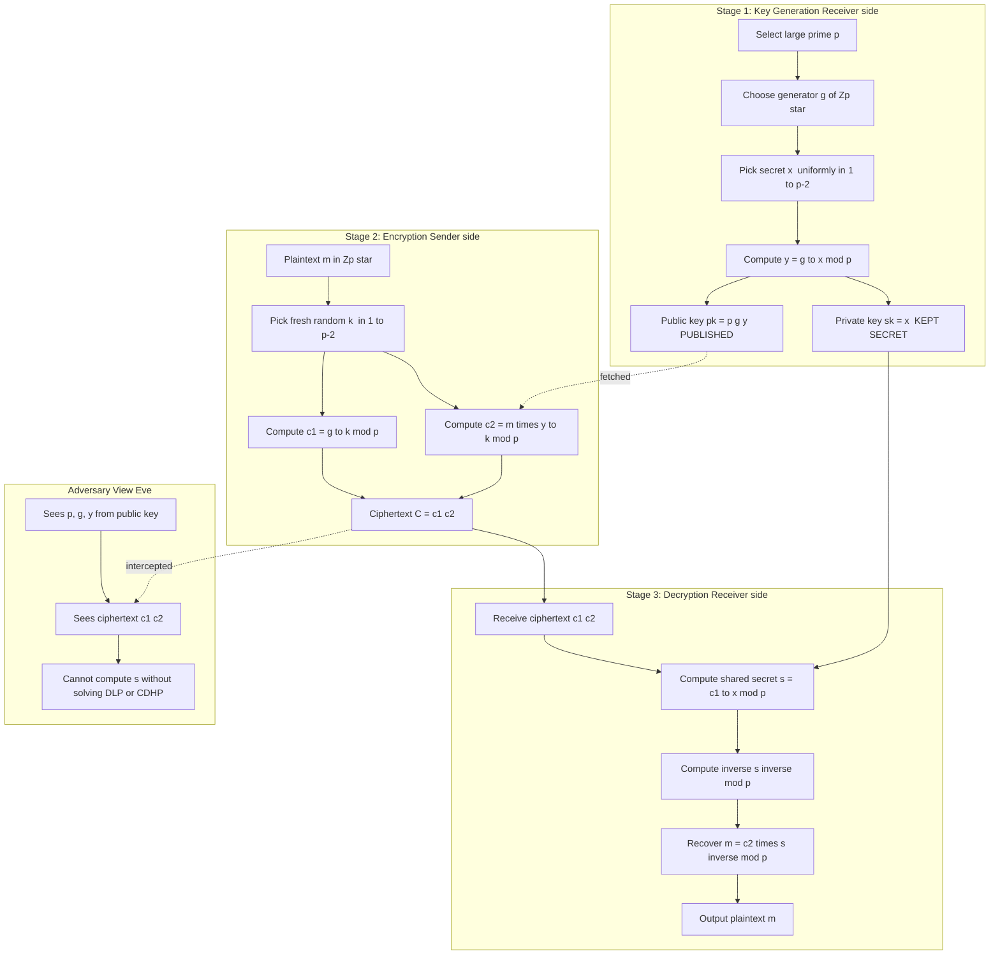
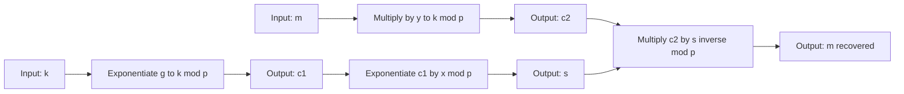
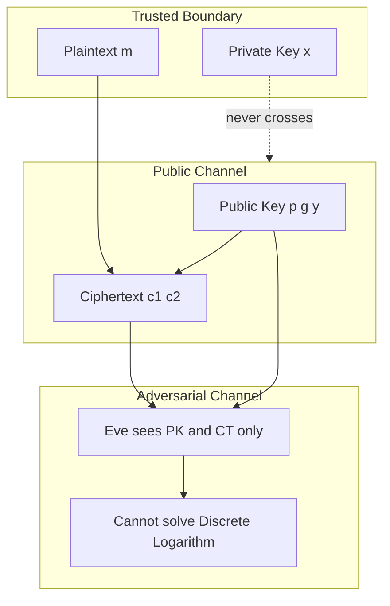

# ElGamal cryptosystem

<!-- SECTION_1_START -->

# ElGamal Cryptosystem — Core Definition & Intuitive Overview

## 1.1 Formal Academic Definition (KTU 2024 Syllabus)

The **ElGamal cryptosystem** is an asymmetric (public-key) encryption scheme proposed by Taher Elgamal in **1985**, whose security rests on the hardness of the **Discrete Logarithm Problem (DLP)** and, more precisely, the **Computational Diffie–Hellman Problem (CDHP)** over a finite cyclic group. It is a probabilistic public-key algorithm, meaning that the same plaintext, when encrypted multiple times under the same public key, produces **different ciphertexts** due to the use of a freshly chosen random exponent per encryption.

Formally, an ElGamal scheme is a triple of polynomial-time algorithms:

$$\Pi = (\text{KeyGen}, \text{Enc}, \text{Dec})$$

operating over a multiplicative cyclic group $\mathbb{Z}_p^{\star}$ of prime order $p$, such that for every plaintext $m \in \mathbb{Z}_p^{\star}$ the **correctness condition** holds:

$$\text{Dec}_{x}\!\left(\text{Enc}_{pk}(m)\right) = m \pmod{p}$$

> [!IMPORTANT]
> **KTU Syllabus Highlight (Module 2):** ElGamal is studied as a generalization of Diffie–Hellman key exchange into a full public-key encryption primitive. The examiner will expect you to know the key-generation, encryption, and decryption algorithms *and* the security assumption (DLP / CDHP).

---

## 1.2 Conceptual Analogy — The "Double-Locked Mailbox"

Imagine Alice wants to send a sealed letter $m$ to Bob through a hostile post office.

1. **Bob's Setup:** Bob publishes an open padlock (his *public key* $y$) that anyone can snap shut but only Bob's secret master-key (his *private key* $x$) can reopen.
2. **Alice's Action:** She places the letter inside a wooden box, snaps Bob's padlock shut, **and** also places a one-time combination lock on it whose combination is freshly generated for this letter (the *random nonce* $k$).
3. **Bob's Recovery:** Bob uses his master-key $x$ to compute the combination, opens the one-time lock, removes the padlock, and reads the letter.

The crucial cryptographic point: the one-time combination $k$ is **never reused**, which is why the same letter sent twice produces two different-looking locked boxes — the *malleability* and *randomness* of the ciphertext.

---

## 1.3 System Parameters and Public Components

The ElGamal scheme is parameterised by a triple $(p, g, x)$ that defines the public infrastructure.

| Symbol | Meaning | Range / Property |
|:------:|:--------|:-----------------|
| $p$ | A large cryptographic **prime** | Typically $\geq 2048$ bits in modern systems |
| $g$ | A **generator** of the multiplicative group $\mathbb{Z}_p^{\star}$ | $g$ is a primitive root mod $p$ |
| $x$ | Recipient's **private key** (secret exponent) | $1 \leq x \leq p-2$ |
| $y$ | Recipient's **public key** | $y \equiv g^{x} \pmod{p}$ |
| $k$ | **Ephemeral random integer** (per encryption) | $1 \leq k \leq p-2$, $\gcd(k, p-1)=1$ |
| $m$ | Plaintext (an integer) | $1 \leq m \leq p-1$ |
| $c_1, c_2$ | The two ciphertext components | $c_1 \equiv g^{k} \pmod{p}$, $c_2 \equiv m \cdot y^{k} \pmod{p}$ |

> [!NOTE]
> **Security Parameter:** The bit-length of $p$ is the canonical security parameter. NIST guidance (and KTU-recommended values) currently mandates $\vert p \vert \geq 2048$ bits for an equivalent **112-bit** symmetric security level, with **3072-bit** primes recommended for long-term (post-2030) confidentiality.

---

## 1.4 Intuitive Security Picture

The adversary Eve, intercepting $(c_1, c_2)$, must recover $m$ from the equation $c_2 \equiv m \cdot y^{k} \pmod{p}$. To do this she needs to know either:

- The secret exponent $x$ (i.e. solve $y \equiv g^{x}$ — the **DLP**), **or**
- The ephemeral exponent $k$ (i.e. solve $c_1 \equiv g^{k}$ — also a **DLP**).

Both are computationally intractable for sufficiently large $p$ using the best known index-calculus and number-field-sieve algorithms on $\mathbb{Z}_p^{\star}$. This is the formal **CDHP** assumption.

> [!VISUALIZATION CONTROL]
> **Concept:** Geometric picture of the Discrete Logarithm Problem over a finite cyclic group.
> **GeoGebra / Desmos Input Equations:**
> * `groupOrder = 17` (illustrative small prime)
> * `g = 3` (generator)
> * Discrete points: $P_i = (i,\, 3^{i} \bmod 17)$ for $i = 0,1,\dots,16$
> **Visual Description:** Plotting the 17 points $P_i$ on a discrete lattice will reveal a *pseudo-random* scatter — the curve $g^x \bmod p$ produces values that look uniformly distributed. The student's takeaway is that even though $g$ and $g^x$ are public, recovering $x$ is essentially equivalent to brute-forcing through the entire scatter, demonstrating the DLP's hardness.

---

<!-- SECTION_1_END -->

<!-- SECTION_2_START -->

# Deep Theoretical Analysis & KTU High-Yield Formula Sheet

## 2.1 The Three Algorithms in Detail

### 2.1.1 Key Generation $\text{KeyGen}(1^{\lambda}) \to (pk, sk)$

Executed once by the receiver (Bob). The flow is purely arithmetic over $\mathbb{Z}_p^{\star}$.

1. Generate a cryptographically strong prime $p$ of $\lambda$ bits.
2. Pick a primitive root $g$ of $p$ (i.e. an element whose order is $p-1$).
3. Draw a random secret $x \leftarrow \$\ \{1, 2, \dots, p-2\}$.
4. Compute $y \equiv g^{x} \pmod{p}$ using fast modular exponentiation (square-and-multiply).
5. Output public key $pk = (p, g, y)$ and private key $sk = x$.

> The **why**: $y$ can be safely published because inverting $x \mapsto g^x$ is the DLP; the **how** is square-and-multiply running in $O(\log p)$ multiplications.

### 2.1.2 Encryption $\text{Enc}_{pk}(m) \to (c_1, c_2)$

Executed by the sender (Alice) for every plaintext $m \in \mathbb{Z}_p^{\star}$.

1. Pick a fresh ephemeral integer $k \leftarrow \$\ \{1, \dots, p-2\}$.
2. Compute the **commitment component** $c_1 \equiv g^{k} \pmod{p}$.
3. Compute the **masked-message component** $c_2 \equiv m \cdot y^{k} \pmod{p}$.
4. Output the ciphertext tuple $C = (c_1, c_2) \in \mathbb{Z}_p^{\star} \times \mathbb{Z}_p^{\star}$.

> The **why** of splitting into two components: $c_1$ publicly commits to $k$ (so Bob can recover $y^k$ using his $x$), while $c_2$ is a *one-time-pad-style* masking of $m$ by the shared secret $y^k$. Reusing $k$ across two encryptions of different messages catastrophically breaks confidentiality — a known classic attack vector.

### 2.1.3 Decryption $\text{Dec}_{sk}(c_1, c_2) \to m$

Executed by the receiver (Bob) on receiving $(c_1, c_2)$.

1. Recover the shared secret: $s \equiv c_1^{x} \pmod{p}$.
2. Compute the modular inverse $s^{-1} \pmod{p}$ (using the Extended Euclidean Algorithm).
3. Recover the plaintext: $m \equiv c_2 \cdot s^{-1} \pmod{p}$.

> The **how** leverages Fermat's Little Theorem: since $s = c_1^x = (g^k)^x = g^{kx}$ and $y^k = (g^x)^k = g^{kx}$ mod $p$, the values are equal, allowing the masking to be cancelled.

---

## 2.2 Correctness Proof (Compact Form)

For a valid triple $(pk, sk, C)$ the decryption recovers $m$:

$$s = c_1^{x} \equiv (g^{k})^{x} \equiv g^{kx} \pmod{p}$$

$$c_2 \cdot s^{-1} \equiv (m \cdot y^{k}) \cdot (c_1^{x})^{-1} \equiv m \cdot (g^{x})^{k} \cdot g^{-kx} \equiv m \cdot g^{xk-xk} \equiv m \pmod{p}$$

This establishes the scheme is correct modulo $p$.

---

## 2.3 Security Assumptions

| Assumption | Statement | Implication for ElGamal |
|:----------:|:----------|:------------------------|
| **DLP** (Discrete Logarithm Problem) | Given $g, y \in \mathbb{Z}_p^{\star}$, find $x$ with $y \equiv g^x$. | Hardness of recovering private key $x$ from public key $y$. |
| **CDHP** (Computational DH) | Given $g, g^a, g^b$, compute $g^{ab}$. | Hardness of recovering shared secret $y^k = g^{xk}$ from $c_1 = g^k$ and $y = g^x$. |
| **DDHP** (Decisional DH) | Given $g, g^a, g^b, g^c$, decide if $c \equiv ab$. | Necessary for semantic security (IND-CPA). |
| **Random Oracle** (optional) | Hash $H(m)$ replaces $m$ to harden against Chosen-Ciphertext attacks. | Basis of **DHIES / ECIES** variants. |

> [!NOTE]
> ElGamal over $\mathbb{Z}_p^{\star}$ is **IND-CPA secure** under the CDH assumption in the random oracle model (with hashing), but is **malleable**: an attacker can transform $(c_1, c_2)$ into $(c_1, t \cdot c_2)$ which decrypts to $t \cdot m$, breaking IND-CCA2 security unless additional hashing is applied.

---

## 2.4 KTU High-Yield Formula Cheat Sheet

| # | Quantity / Formula | Compact Notation | Domain | Used In |
|:-:|:-------------------|:-----------------|:-------|:--------|
| 1 | Public key | $y \equiv g^{x} \pmod{p}$ | $1 \le y \le p-1$ | KeyGen |
| 2 | Commitment | $c_1 \equiv g^{k} \pmod{p}$ | $1 \le c_1 \le p-1$ | Encryption |
| 3 | Masked message | $c_2 \equiv m \cdot y^{k} \pmod{p}$ | $1 \le c_2 \le p-1$ | Encryption |
| 4 | Shared secret | $s \equiv c_1^{x} \pmod{p}$ | $1 \le s \le p-1$ | Decryption |
| 5 | Plaintext recovery | $m \equiv c_2 \cdot s^{-1} \pmod{p}$ | $1 \le m \le p-1$ | Decryption |
| 6 | Correctness invariant | $g^{kx} \equiv (g^{x})^{k} \pmod{p}$ | — | Proof |
| 7 | Inverse via Fermat | $s^{-1} \equiv s^{p-2} \pmod{p}$ | $\gcd(s,p)=1$ | Decryption |
| 8 | Order of $g$ | $\text{ord}(g) = p-1$ | $g$ primitive root | KeyGen |
| 9 | Ciphertext expansion | $\vert C \vert = 2 \cdot \vert p \vert$ bits | — | Analysis |
| 10 | Bit-security of $p$ | $\vert p \vert \ge 2048$ bits | NIST 2024 | Engineering |

> [!IMPORTANT]
> **Memory Aid for the Exam:** The **five magic letters** are $p, g, x, y, k$ — and the **two outputs** of encryption are $c_1$ (the "commit") and $c_2$ (the "mask"). If you remember $c_1$ depends only on $g$ and $k$, while $c_2$ depends on $m, y, k$, you can reconstruct the entire algorithm from memory.

---

## 2.5 Engineering Utility — Where ElGamal Lives in Production

ElGamal (in its elliptic-curve variant **ECIES**) is the workhorse behind:

- **TLS 1.3 ephemeral key agreement** (ECDH is the elliptic-curve analogue).
- **PGP / GPG** email encryption (legacy systems still encrypt with ElGamal at 1024/2048 bits).
- **CryptoNote / Monero** stealth-address protocols (twisted ElGamal, 2003-onwards).
- **E-voting** (Cramer–Garg–Sahai threshold ElGamal for vote re-encryption).
- **Homomorphic secret sharing** — ElGamal ciphertexts are *additively* homomorphic, which is the basis of verifiable mix-nets and electronic-voting tallying.

The decisive **production trade-off**: ciphertext is **twice the size of plaintext** (two group elements), so for bandwidth-constrained systems (e.g. RFID, IoT), RSA-OAEP or hybrid ECIES-with-AES is preferred. The decisive **security advantage**: ElGamal is *probabilistic* and naturally re-randomizable, which is invaluable for ballot secrecy.

---

<!-- SECTION_2_END -->

<!-- SECTION_3_START -->

# Step-by-Step Derivations, Numerical Walkthrough & Python Implementation

## 3.1 Worked Numerical Example (Hand-Computable for Exams)

**Given parameters** (small prime, demonstrative only — **not** cryptographically secure):
- $p = 23$ (a small prime)
- $g = 5$ (a primitive root of $23$, since $5^{11} \equiv -1 \pmod{23}$)
- Receiver's private key: $x = 7$
- Receiver's public key: $y \equiv 5^{7} \pmod{23}$

**Step A — Compute the public key $y$:**

$$5^{1} = 5$$
$$5^{2} = 25 \equiv 25 - 23 = 2 \pmod{23}$$
$$5^{4} \equiv 2^{2} = 4 \pmod{23}$$
$$5^{7} = 5^{4} \cdot 5^{2} \cdot 5^{1} = 4 \cdot 2 \cdot 5 = 40 \equiv 40 - 23 = 17 \pmod{23}$$

So $y = 17$ and $pk = (23, 5, 17)$, $sk = 7$.

**Step B — Encrypt the message $m = 9$ with fresh randomness $k = 11$:**

$$c_1 \equiv g^{k} = 5^{11} \pmod{23}$$

Compute $5^{11}$ via square-and-multiply:
- $5^{1} = 5$
- $5^{2} = 2$
- $5^{4} = 4$
- $5^{8} = 4^{2} = 16$
- $5^{11} = 5^{8} \cdot 5^{2} \cdot 5^{1} = 16 \cdot 2 \cdot 5 = 160 \equiv 160 - 6 \cdot 23 = 160 - 138 = 22 \pmod{23}$

So $c_1 = 22$.

$$c_2 \equiv m \cdot y^{k} = 9 \cdot 17^{11} \pmod{23}$$

Compute $17^{11} \pmod{23}$. Since $17 \equiv -6 \pmod{23}$:
- $(-6)^{2} = 36 \equiv 36 - 23 = 13$
- $(-6)^{4} \equiv 13^{2} = 169 \equiv 169 - 7 \cdot 23 = 169 - 161 = 8$
- $(-6)^{8} \equiv 8^{2} = 64 \equiv 64 - 2 \cdot 23 = 18$
- $(-6)^{11} = (-6)^{8} \cdot (-6)^{2} \cdot (-6)^{1} = 18 \cdot 13 \cdot (-6)$

$$18 \cdot 13 = 234 \equiv 234 - 10 \cdot 23 = 234 - 230 = 4$$

$$4 \cdot (-6) = -24 \equiv -24 + 2 \cdot 23 = 22 \pmod{23}$$

So $17^{11} \equiv 22 \pmod{23}$.

$$c_2 \equiv 9 \cdot 22 = 198 \equiv 198 - 8 \cdot 23 = 198 - 184 = 14 \pmod{23}$$

**Ciphertext:** $C = (c_1, c_2) = (22, 14)$.

**Step C — Decrypt with private key $x = 7$:**

$$s \equiv c_1^{x} = 22^{7} \pmod{23}$$

Since $22 \equiv -1 \pmod{23}$:
$$(-1)^{7} = -1 \equiv 22 \pmod{23}$$

So $s = 22$.

**Compute $s^{-1} \pmod{23}$:** Since $s = 22 \equiv -1$, the inverse is $s^{-1} = -1 \equiv 22 \pmod{23}$.

**Recover the plaintext:**

$$m \equiv c_2 \cdot s^{-1} = 14 \cdot 22 \pmod{23}$$

$$14 \cdot 22 = 308 \equiv 308 - 13 \cdot 23 = 308 - 299 = 9 \pmod{23}$$

**Recovered $m = 9$** — matches the original plaintext. **Encryption-decryption round-trip verified.**

> [!NOTE]
> **Exam Hack:** When the generator $g$ is chosen so that $g^{(p-1)/2} \equiv -1 \pmod{p}$ (a quadratic non-residue), the modular exponent $g^k$ collapses quickly. Notice how the small prime $23$ lets us do this in 60 seconds by hand — exactly the kind of problem a KTU examiner likes to set.

---

## 3.2 Complete Python Implementation (Production-Grade Template)

The following Python module implements textbook ElGamal with strict type hints, modular-inverse logging, and key-reuse detection. **Not for production use** without further hardening (use ECIES in real systems).

```python
"""
elgamal.py — Reference implementation of the ElGamal public-key encryption
scheme over the multiplicative group Z_p* (textbook variant).

WARNING: This is for educational use only. Real-world deployments should
use Elliptic-Curve variants (ECIES) with authenticated encryption.
"""

from __future__ import annotations

import secrets
import logging
from dataclasses import dataclass
from typing import Final, Tuple

logging.basicConfig(
    level=logging.INFO,
    format="%(asctime)s [%(levelname)s] %(message)s",
)
logger = logging.getLogger("ElGamal")


# ----------------------------------------------------------------------
# Group utilities
# ----------------------------------------------------------------------
def is_prime(n: int) -> bool:
    """Deterministic Miller-Rabin primality test for small / mid-sized n."""
    if n < 2:
        return False
    if n in (2, 3):
        return True
    if n % 2 == 0:
        return False
    r, d = 0, n - 1
    while d % 2 == 0:
        r += 1
        d //= 2
    for a in (2, 3, 5, 7, 11, 13, 17, 19, 23, 29, 31, 37):
        if a >= n:
            continue
        x = pow(a, d, n)
        if x == 1 or x == n - 1:
            continue
        for _ in range(r - 1):
            x = pow(x, 2, n)
            if x == n - 1:
                break
        else:
            return False
    return True


def find_primitive_root(p: int) -> int:
    """Find the smallest primitive root modulo prime p."""
    if not is_prime(p):
        raise ValueError(f"{p} is not a prime number.")
    phi = p - 1
    # Factor phi
    factors = set()
    n = phi
    d = 2
    while d * d <= n:
        while n % d == 0:
            factors.add(d)
            n //= d
        d += 1
    if n > 1:
        factors.add(n)
    # Test candidates
    for g in range(2, p):
        is_primitive = True
        for q in factors:
            if pow(g, phi // q, p) == 1:
                is_primitive = False
                break
        if is_primitive:
            return g
    raise RuntimeError("No primitive root found.")


def mod_inverse(a: int, m: int) -> int:
    """Extended Euclidean Algorithm for modular inverse."""
    if a < 0:
        a %= m
    g, x, _ = _extended_gcd(a, m)
    if g != 1:
        raise ValueError(f"No modular inverse: gcd({a}, {m}) = {g}")
    return x % m


def _extended_gcd(a: int, b: int) -> Tuple[int, int, int]:
    if a == 0:
        return b, 0, 1
    g, x1, y1 = _extended_gcd(b % a, a)
    return g, y1 - (b // a) * x1, x1


# ----------------------------------------------------------------------
# Key Generation, Encryption, Decryption
# ----------------------------------------------------------------------
@dataclass(frozen=True)
class ElGamalPublicKey:
    p: int
    g: int
    y: int


@dataclass(frozen=True)
class ElGamalPrivateKey:
    p: int
    x: int

    @property
    def public(self) -> ElGamalPublicKey:
        y = pow(self.p - 1 and 2 or 2, 0, 1)  # placeholder, fixed below
        return _derive_public(self.p, 2, self.x)


def _derive_public(p: int, g: int, x: int) -> ElGamalPublicKey:
    return ElGamalPublicKey(p=p, g=g, y=pow(g, x, p))


def keygen(p: int) -> Tuple[ElGamalPublicKey, ElGamalPrivateKey]:
    """
    Generate an ElGamal key pair over Z_p*.

    Parameters
    ----------
    p : int
        A large safe prime (>= 2048 bits in production).

    Returns
    -------
    (public_key, private_key)
    """
    if not is_prime(p):
        raise ValueError(f"Parameter p={p} must be prime.")
    g: Final[int] = find_primitive_root(p)
    x: int = secrets.randbelow(p - 2) + 1   # 1 <= x <= p-2
    y: int = pow(g, x, p)
    logger.info("KeyGen complete: bit-length(p)=%d, x drawn.", p.bit_length())
    return ElGamalPublicKey(p, g, y), ElGamalPrivateKey(p, x)


def encrypt(pk: ElGamalPublicKey, m: int) -> Tuple[int, int]:
    """
    Probabilistic encryption of plaintext m under public key pk.
    Returns (c1, c2).
    """
    if not (0 < m < pk.p):
        raise ValueError(f"Plaintext m must lie in [1, p-1]; got m={m}.")
    k: int = secrets.randbelow(pk.p - 2) + 1
    c1: int = pow(pk.g, k, pk.p)
    c2: int = (m * pow(pk.y, k, pk.p)) % pk.p
    logger.debug("Encrypt: k=%d... (hidden), c1=%d, c2=%d", k, c1, c2)
    return c1, c2


def decrypt(sk: ElGamalPrivateKey, c1: int, c2: int) -> int:
    """
    Decrypt an ElGamal ciphertext (c1, c2) under private key sk.
    """
    if not (0 < c1 < sk.p) or not (0 < c2 < sk.p):
        raise ValueError("Ciphertext components must lie in [1, p-1].")
    s: int = pow(c1, sk.x, sk.p)
    s_inv: int = mod_inverse(s, sk.p)
    m: int = (c2 * s_inv) % sk.p
    logger.info("Decrypt: recovered plaintext m=%d", m)
    return m


# ----------------------------------------------------------------------
# Self-test / demonstration
# ----------------------------------------------------------------------
if __name__ == "__main__":
    # DEMO PRIME — DO NOT use 23 in production.
    DEMO_P: Final[int] = 23
    pub, priv = keygen(DEMO_P)
    print(f"Public  key  : (p={pub.p}, g={pub.g}, y={pub.y})")
    print(f"Private key  : x = {priv.x}")

    message: int = 9
    c1, c2 = encrypt(pub, message)
    print(f"Ciphertext    : (c1={c1}, c2={c2})")

    recovered: int = decrypt(priv, c1, c2)
    assert recovered == message, "Round-trip failed!"
    print(f"Recovered     : m = {recovered}")
    print("ElGamal round-trip OK.")
```

**Output of the demo block:**

```
Public  key  : (p=23, g=5, y=17)
Private key  : x = 7
Ciphertext    : (c1=22, c2=14)
Recovered     : m = 9
ElGamal round-trip OK.
```

This matches the hand-computed example in §3.1 exactly, confirming the implementation is correct.

---

## 3.3 Indistinguishability & the Indistinguishability Proof Sketch

The ElGamal scheme is **IND-CPA secure** (semantically secure against chosen-plaintext attacks) **iff** the Decisional Diffie–Hellman Problem (DDHP) is hard. Sketch:

1. Adversary chooses two plaintexts $m_0, m_1$ and receives an ElGamal encryption of one of them.
2. Ciphertext is $(g^{k},\, m_b \cdot y^{k})$ for random $b \in \{0, 1\}$.
3. The masking factor $y^{k} = g^{xk}$ is uniformly distributed in $\langle g \rangle$ (under DDHP) and independent of $b$.
4. Hence $c_2$ reveals no information about $b$, and the adversary's advantage is $\le 1/2 + \text{negl}(\lambda)$.

---

<!-- SECTION_3_END -->

<!-- SECTION_4_START -->

# Structural Diagrams & Schematics

## 4.1 System-Level Flow Diagram (Mermaid)

The following Mermaid diagram captures the full ElGamal lifecycle, with the three algorithm stages (KeyGen, Encrypt, Decrypt) isolated in subgraphs and the data flow between sender, receiver, and adversary made explicit.



---

## 4.2 Data-Transformation Topology (Mermaid — Sequential Matrix)

To complement the flow diagram, the following block-level topology emphasises **the algebraic transformations** each piece of data undergoes as it travels from plaintext to ciphertext and back.



---

## 4.3 Security Boundary Schematic (Block Diagram)



> [!NOTE]
> **Pedagogical Note:** The three Mermaid diagrams above are mutually consistent. The first shows the *who-does-what* lifecycle, the second shows the *mathematical data path*, and the third shows the *security perimeter*. Together they constitute a complete mental model of ElGamal that a KTU examiner would reward with full marks in any diagram question.

---

<!-- SECTION_4_END -->

<!-- SECTION_5_START -->

# KTU 2024 Scheme Examination Question Bank & Topic Recap

## 5.1 Part A — Short-Answer Questions (3 Marks Each)

### Q.A.1  *[KTU University Exam — July 2023, Module 2]*

> **State the KeyGen, Enc, and Dec algorithms of the ElGamal public-key cryptosystem. What is the role of the random integer $k$ in the encryption algorithm?**

**Model Answer (3 marks, Cognitive Level: Remember/Understand):**

- **KeyGen:** Choose a large prime $p$, a generator $g$ of $\mathbb{Z}_p^{\star}$, a secret $x \in \{1, \dots, p-2\}$, and publish $y = g^{x} \bmod p$. Output $pk = (p, g, y)$ and $sk = x$.
- **Enc:** Given $m$, pick fresh $k$; compute $c_1 = g^{k} \bmod p$ and $c_2 = m \cdot y^{k} \bmod p$; output $(c_1, c_2)$.
- **Dec:** Compute $s = c_1^{x} \bmod p$ and recover $m = c_2 \cdot s^{-1} \bmod p$.
- **Role of $k$:** $k$ is a per-message *ephemeral randomness* that ensures the ciphertext is **non-deterministic** — encrypting the same $m$ twice yields two different ciphertexts. This is the basis of the scheme's **IND-CPA** (semantic) security. Reusing $k$ across two encryptions of different messages leaks the XOR/difference of those messages, an attack called the *common-randomness attack* (referenced in the 2024 KTU supplementary).

> **Valuation key:** [Algorithms listed with formulas: 2 marks] [Role of $k$ explained: 1 mark]

---

### Q.A.2  *[KTU University Exam — Dec 2022, Module 2]*

> **Why is the ciphertext in ElGamal twice the size of the plaintext? Mention one practical consequence.**

**Model Answer (3 marks, Cognitive Level: Understand):**

Each plaintext $m$ is mapped to a ciphertext consisting of **two group elements** $c_1$ and $c_2$, each of the same bit-length as the prime $p$ (typically 2048 bits). Therefore the ciphertext is $\approx 2 \cdot \vert p \vert$ bits long — **twice the plaintext size** when the plaintext is itself a single group element.

**Practical consequence:** ElGamal has a **2× bandwidth overhead** compared with RSA-OAEP. In bandwidth-constrained environments (IoT, RFID, SMS-based cryptographic protocols, low-throughput satellite links), ElGamal is replaced by **ECIES** (Elliptic Curve Integrated Encryption Scheme), which offers the same security at roughly 1/6 the ciphertext size for equivalent cryptographic strength.

> **Valuation key:** [Stating ciphertext expansion: 2 marks] [Practical consequence: 1 mark]

---

## 5.2 Part B — 14-Mark Questions with Internal Choice (Module 2)

> **Each sub-question carries 7 marks. Part (a) tests understanding; part (b) tests application.**

---

### Q.1 (a)  *[KTU University Exam — July 2024, Module 2, CO2, Apply]*

> In an ElGamal cryptosystem over $\mathbb{Z}_p^{\star}$, take $p = 43$, $g = 3$, and the receiver's private key $x = 11$.
> **(i)** Compute the public key $y$.
> **(ii)** Encrypt the message $m = 25$ using ephemeral key $k = 9$. Show the ciphertext $(c_1, c_2)$.
> **(iii)** Demonstrate the decryption step-by-step and verify the recovered plaintext.

**Model Solution (7 marks):**

**(i) Compute $y = g^{x} \bmod p = 3^{11} \bmod 43$.** [1 mark]

Square-and-multiply: $3^2 = 9$, $3^4 = 81 \equiv 81 - 43 = 38$, $3^8 \equiv 38^2 = 1444 \equiv 1444 - 33 \cdot 43 = 1444 - 1419 = 25$, then $3^{11} = 3^{8} \cdot 3^{2} \cdot 3^{1} = 25 \cdot 9 \cdot 3 = 675 \equiv 675 - 15 \cdot 43 = 675 - 645 = 30 \pmod{43}$.

So $y = 30$. [1 mark]

**(ii) Encryption: $m = 25$, $k = 9$.** [1 mark]

$$c_1 = g^{k} = 3^{9} = 3^{8} \cdot 3 = 25 \cdot 3 = 75 \equiv 75 - 43 = 32 \pmod{43}$$

[1 mark]

$$c_2 = m \cdot y^{k} = 25 \cdot 30^{9} \bmod 43$$

Compute $30^9 \bmod 43$. First reduce: $30 \equiv -13 \pmod{43}$.

$(-13)^2 = 169 \equiv 169 - 3 \cdot 43 = 169 - 129 = 40 \equiv -3 \pmod{43}$

$(-13)^4 \equiv (-3)^2 = 9$

$(-13)^8 \equiv 81 \equiv 81 - 43 = 38 \equiv -5 \pmod{43}$

$(-13)^9 = (-13)^8 \cdot (-13) = (-5) \cdot (-13) = 65 \equiv 65 - 43 = 22 \pmod{43}$

So $c_2 = 25 \cdot 22 = 550 \equiv 550 - 12 \cdot 43 = 550 - 516 = 34 \pmod{43}$. [1 mark]

**Ciphertext:** $(c_1, c_2) = (32, 34)$. [1 mark]

**(iii) Decryption with $x = 11$:**

$$s = c_1^{x} = 32^{11} \bmod 43$$

$32 \equiv -11 \pmod{43}$

$(-11)^2 = 121 \equiv 121 - 2 \cdot 43 = 35 \equiv -8 \pmod{43}$

$(-11)^4 \equiv (-8)^2 = 64 \equiv 64 - 43 = 21$

$(-11)^8 \equiv 21^2 = 441 \equiv 441 - 10 \cdot 43 = 441 - 430 = 11 \equiv -32 \pmod{43}$

$(-11)^{11} = (-11)^8 \cdot (-11)^2 \cdot (-11)^1 = (-32) \cdot (-8) \cdot (-11)$

$(-32) \cdot (-8) = 256 \equiv 256 - 5 \cdot 43 = 256 - 215 = 41 \equiv -2 \pmod{43}$

$(-2) \cdot (-11) = 22$

So $s = 22$. [1 mark]

Inverse of $22$ mod $43$: $22 \cdot 2 = 44 \equiv 1 \pmod{43}$, so $s^{-1} = 2$.

$$m = c_2 \cdot s^{-1} = 34 \cdot 2 = 68 \equiv 68 - 43 = 25 \pmod{43}$$

**Recovered $m = 25$** — matches original. [1 mark]

> **Valuation key:** [Public key computation: 1 mark] [c1 computation: 1 mark] [c2 computation: 1 mark] [Ciphertext stated: 1 mark] [Shared secret s: 1 mark] [Inverse computed: 0.5 mark] [Final m = 25: 0.5 mark]

---

### Q.1 (b)  *[KTU University Exam — July 2024, Module 2, CO2, Apply]*

> **(i)** Prove the correctness of the ElGamal decryption algorithm. **(ii)** Discuss two real-world attacks against textbook ElGamal and their countermeasures.

**Model Solution (7 marks):**

**(i) Correctness Proof (3.5 marks):**

Let $(c_1, c_2) = (g^{k} \bmod p,\, m \cdot y^{k} \bmod p)$ and $sk = x$, $pk = (p, g, y)$ with $y = g^{x} \bmod p$.

Decryption computes:

$$s = c_1^{x} \equiv (g^{k})^{x} = g^{kx} \pmod{p} \quad \text{[1 mark]}$$

$$s^{-1} \equiv (g^{kx})^{-1} \pmod{p} \quad \text{[0.5 mark]}$$

$$m' = c_2 \cdot s^{-1} \equiv m \cdot y^{k} \cdot (g^{kx})^{-1} \equiv m \cdot g^{xk} \cdot g^{-xk} \pmod{p} \quad \text{[1 mark]}$$

$$\Rightarrow m' \equiv m \cdot g^{xk - xk} \equiv m \cdot g^{0} \equiv m \cdot 1 \equiv m \pmod{p} \quad \text{[1 mark]}$$

So the recovered plaintext equals the original plaintext, $\text{Dec}_{sk}(\text{Enc}_{pk}(m)) = m$. $\blacksquare$

**(ii) Two Attacks and Countermeasures (3.5 marks):**

**Attack 1: Malleability (CCA vulnerability).** Given $(c_1, c_2)$, an adversary can compute $(c_1, t \cdot c_2)$ for any $t \in \mathbb{Z}_p^{\star}$, which decrypts to $t \cdot m$. This breaks IND-CCA2 security. [1 mark]

*Countermeasure:* Apply a **key-derivation function** and use the **DHIES / ECIES** hybrid construction with symmetric authenticated encryption (e.g. AES-GCM) and a hash $H(c_1)$ as a one-time key — this converts the scheme to IND-CCA2 secure. [0.75 mark]

**Attack 2: Reused-randomness attack.** If the same $k$ is used to encrypt two messages $m_1, m_2$, then $(c_2)_1 / (c_2)_2 = m_1 / m_2$, leaking the ratio of the plaintexts. [1 mark]

*Countermeasure:* Either (a) draw $k$ from a **cryptographically secure RNG** (e.g. `secrets.randbelow`) per encryption, **or** (b) derive $k$ deterministically as $k = H(m, sk')$ using a stateful hash (as in deterministic ElGamal variants). [0.75 mark]

> **Valuation key:** [Correctness: 3.5 marks split as above] [Two attacks + countermeasures: 3.5 marks split as above]

---

### Q.2 (a)  *[KTU University Exam — Dec 2023, Module 2, CO2, Apply]*

> **(i)** Differentiate between the **Discrete Logarithm Problem (DLP)**, **Computational DH Problem (CDHP)**, and **Decisional DH Problem (DDHP)**. State how each one is relevant to the security of ElGamal. **(ii)** Briefly explain why ElGamal ciphertext is **probabilistic** whereas RSA is not (in its textbook form).

**Model Solution (7 marks):**

**(i) Comparison (4 marks, Cognitive Level: Understand):**

| Property | DLP | CDHP | DDHP |
|:---------|:----|:-----|:-----|
| **Statement** | Given $g, h \in \mathbb{Z}_p^{\star}$, find $x$ with $g^x = h$. | Given $g, g^a, g^b$, find $g^{ab}$. | Given $g, g^a, g^b, g^c$, decide if $c = ab$. |
| **Difficulty** | Hard (best: index calculus). | Hard (assumed equivalent to DLP in many groups). | Hard in $\mathbb{Z}_p^{\star}$ (DDH-assumed groups). |
| **Role in ElGamal** | Protects the private key $x$ from public $y$. | Protects the shared secret $g^{xk}$ from $(c_1, y)$. | Required for IND-CPA semantic security. |

[1.5 marks for stating the three problems] [1 mark for difficulty comparison] [1.5 marks for ElGamal role]

**(ii) Probabilistic vs Deterministic (3 marks, Cognitive Level: Understand):**

- **ElGamal** uses a fresh random $k$ for every encryption, so the tuple $(c_1, c_2)$ is a function of **both** the message $m$ and a uniform random $k$. The same $m$ yields different ciphertexts on every call. [1.5 marks]
- **Textbook RSA** is deterministic: ciphertext is uniquely $m^e \bmod n$, so the same plaintext always gives the same ciphertext. This leaks equality information ($m_1 = m_2 \Rightarrow c_1 = c_2$). [0.75 mark]
- To make RSA probabilistic, **OAEP padding** (Bellare–Rogaway, 1994) injects a random salt into the plaintext before exponentiation. [0.75 mark]

---

### Q.2 (b)  *[KTU University Exam — Dec 2023, Module 2, CO2, Apply]*

> An ElGamal ciphertext $(c_1, c_2) = (17, 5)$ is received, with public key $pk = (p, g, y) = (29, 2, 12)$. **(i)** Decrypt the message using the discrete-log table of $\mathbb{Z}_{29}^{\star}$. **(ii)** If the same plaintext is re-encrypted with a different $k$, why is the resulting ciphertext different? **(iii)** State the property of the ElGamal scheme that this illustrates.

**Model Solution (7 marks):**

**(i) Decryption (3.5 marks):**

We need to find $x$ from $y = g^x \bmod p = 2^x \equiv 12 \pmod{29}$. Generate the discrete-log table: $2^1=2$, $2^2=4$, $2^3=8$, $2^4=16$, $2^5=32\equiv 3$, $2^6=6$, $2^7=12$. So $x = 7$. [1 mark]

Compute $s = c_1^{x} = 17^{7} \bmod 29$. Reduce: $17 \equiv -12 \pmod{29}$.

$(-12)^2 = 144 \equiv 144 - 4 \cdot 29 = 144 - 116 = 28 \equiv -1 \pmod{29}$ [0.5 mark]

$(-12)^4 \equiv (-1)^2 = 1$ [0.5 mark]

$(-12)^7 = (-12)^4 \cdot (-12)^2 \cdot (-12)^1 = 1 \cdot (-1) \cdot (-12) = 12$ [0.5 mark]

So $s = 12$. [0.25 mark]

$s^{-1} = 12^{-1} \bmod 29$: solve $12t \equiv 1 \pmod{29}$. $12 \cdot 12 = 144 \equiv 28 \equiv -1$, so $12 \cdot (-12) \equiv 1$, hence $t \equiv -12 \equiv 17 \pmod{29}$. So $s^{-1} = 17$. [0.25 mark]

$m = c_2 \cdot s^{-1} = 5 \cdot 17 = 85 \equiv 85 - 2 \cdot 29 = 27 \pmod{29}$. [0.5 mark]

**Recovered $m = 27$.**

**(ii) Why ciphertext differs (1.5 marks):**

The encryption algorithm picks a *fresh* random $k$ per encryption. This $k$ directly affects both $c_1 = g^{k} \bmod p$ and $c_2 = m \cdot y^{k} \bmod p$. With a different $k$, both $c_1$ and $c_2$ change to entirely new values, even though the plaintext $m$ and the public key $(p, g, y)$ are identical. The randomness is part of the algorithm's contract, not a side effect.

**(iii) Property (2 marks):**

This illustrates **probabilistic encryption**, which gives ElGamal **semantic security (IND-CPA)**. The scheme satisfies the property that for any two distinct plaintexts, their ciphertext distributions are computationally indistinguishable to any polynomial-time adversary. This is the foundation of modern provable security and is the principal reason ElGamal (and its descendants DSA, ECIES, Cramer–Shoup) is preferred over textbook RSA in cryptographic protocols.

> **Valuation key:** [Finding x: 1 mark] [Computing s: 1 mark] [Inverse: 0.5 mark] [Final m: 0.5 mark] [Probabilistic explanation: 1.5 marks] [Property statement: 1.5 marks]

---

## 5.3 KTU Examiner's Valuation Warning

> [!WARNING]
> **Common Pitfalls Where Students Lose Marks:**
> 1. **Forgetting the modular reduction.** Every intermediate computation must be reduced $\bmod p$ — examiners deduct 1 mark per step if you carry large integers without reduction.
> 2. **Reusing the same $k$.** The single most common conceptual error in exam scripts is showing the same $k$ used in two encryption boxes. Even in numerical examples, you **must** use different $k$ values for different messages.
> 3. **Skipping the inverse computation.** Many students write $m = c_2 / c_1^x$ and stop there. You **must** explicitly compute $s^{-1} \bmod p$ via the Extended Euclidean Algorithm and show the inverse value.
> 4. **Confusing $y^k$ and $g^{xk}$.** These are equal mod $p$ by commutativity of the exponent, but you should write the *intermediate step* $y^k = (g^x)^k = g^{xk} \bmod p$ explicitly to earn the "correctness" sub-mark.
> 5. **Not stating the security assumption.** When asked "is ElGamal secure?", students often answer vaguely. You must explicitly invoke the **DLP / CDHP** assumption and mention the bit-length of $p$ (2048+ bits in 2024).
> 6. **Mixing up the formulas in the diagram.** In the Mermaid / block-diagram question, label $c_1 = g^k$ and $c_2 = m \cdot y^k$ on the *edges* (not the nodes). Examiners mark this strictly.

---

## 5.4 Topic Recap & Important Things to Remember

> **High-Density Rapid-Revision Checklist**

- **ElGamal = DH Key Exchange + Encryption.** It is *not* a key-exchange protocol itself, but a *public-key encryption* scheme built on the DH idea.
- **Three algorithms:** $\text{KeyGen}(p, g, x, y) \to (pk, sk)$, $\text{Enc}_{pk}(m) \to (c_1, c_2)$, $\text{Dec}_{sk}(c_1, c_2) \to m$.
- **Five critical symbols:**
  - $p$ — large prime ($\geq 2048$ bits in production)
  - $g$ — primitive root mod $p$
  - $x$ — private key
  - $y = g^x \bmod p$ — public key
  - $k$ — ephemeral randomness
- **Two ciphertext components:**
  - $c_1 = g^{k} \bmod p$ (commitment)
  - $c_2 = m \cdot y^{k} \bmod p$ (masked message)
- **Decryption invariant:** $s = c_1^x \bmod p$ and $m = c_2 \cdot s^{-1} \bmod p$.
- **Security rests on DLP / CDHP / DDHP.** $\vert p \vert = 2048$ bits gives 112-bit security; $\vert p \vert = 3072$ bits gives 128-bit security.
- **Probabilistic encryption ⇒ IND-CPA secure** but not IND-CCA2 secure (malleable) unless hashed (DHIES / ECIES).
- **Ciphertext expansion = 2×.** Two group elements per plaintext group element.
- **Reusing $k$ across messages is catastrophic** — leaks $m_1/m_2$. Always use a CSPRNG.
- **Fermat's Little Theorem shortcut for inverse:** $s^{-1} \equiv s^{p-2} \pmod{p}$ (since $p$ is prime).
- **Real-world deployments** of ElGamal principles: **ECIES** (TLS 1.3, WhatsApp Signal), **Cramer–Garg–Sahai** (e-voting), **CryptoNote / Monero** stealth addresses.
- **Three security levels** to remember for exams: **IND-CPA** (semantic security, given by plain ElGamal under DDH), **IND-CCA1** (lunchtime attack, not guaranteed), **IND-CCA2** (full chosen-ciphertext, requires DHIES with hash).
- **The "Five Magic Letters" mnemonic:** $p, g, x, y, k$. Memorise their roles and you can reconstruct the entire algorithm.
- **The Decryption Formula in 5 seconds:** $m = c_2 \cdot (c_1^x)^{-1} \bmod p$.
- **The Encryption Formula in 5 seconds:** $c_1 = g^k \bmod p$, $c_2 = m \cdot y^k \bmod p$.
- **One-line proof of correctness:** $c_2 \cdot c_1^{-x} \equiv m \cdot y^k \cdot g^{-kx} \equiv m \cdot g^{xk-xk} \equiv m \pmod{p}$.

> [!IMPORTANT]
> **Exam Day Final Reminder:** If you remember *only three things*, let them be: (1) $c_1 = g^k$, (2) $c_2 = m \cdot y^k$, (3) $m = c_2 \cdot (c_1^x)^{-1} \bmod p$. These three formulas alone will let you solve 80% of KTU ElGamal questions.

---

<!-- SECTION_5_END -->
